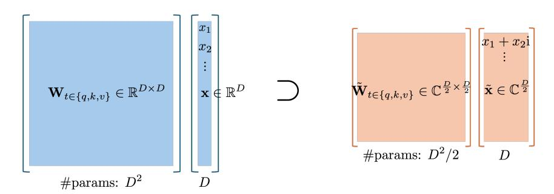
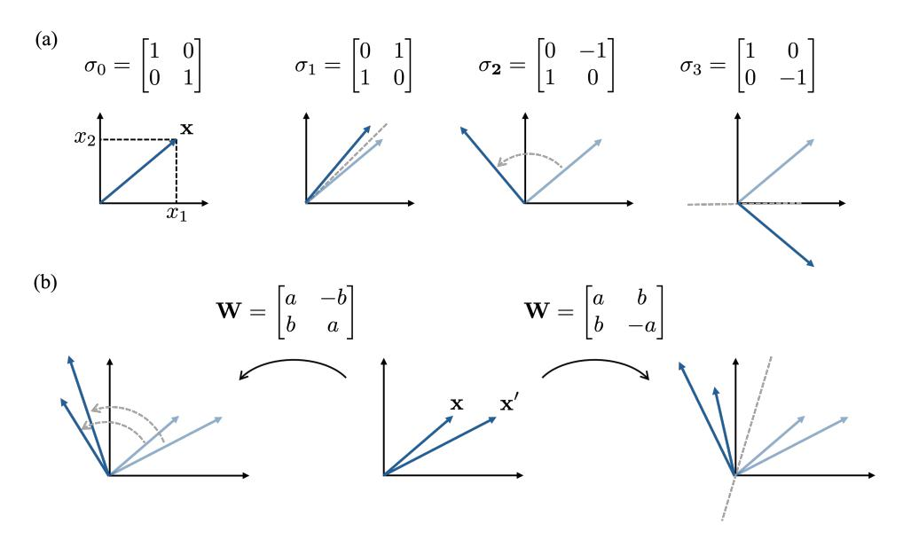
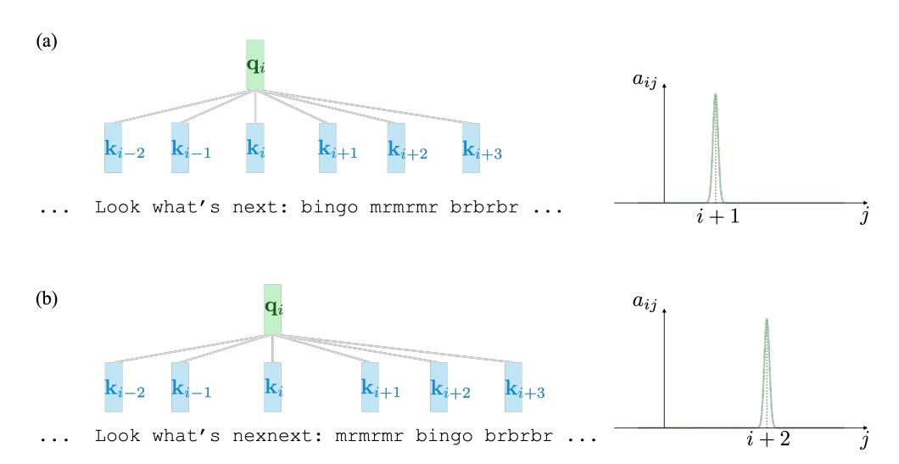
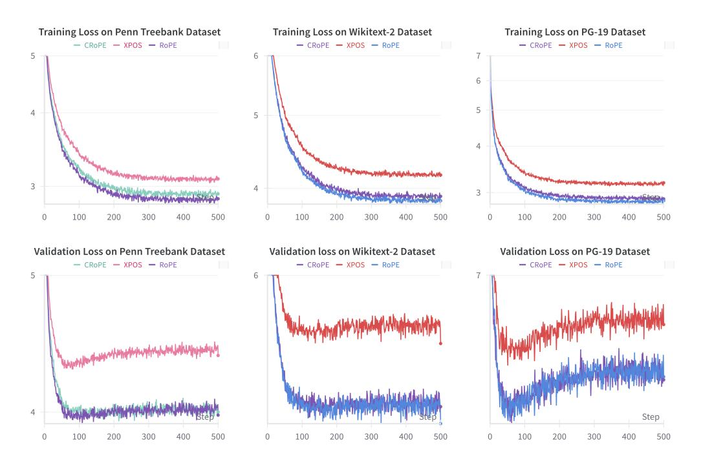

# CRoPE: Efficient Parametrization of Rotary Positional Embedding

Beicheng Lou\*
Stanford University
Stanford, CA 94305
beichenglou@stanford.edu

Zifei Xu\* d-Matrix Santa Clara, CA 95054 xuzifei@d-matrix.ai

# **Abstract**

Rotary positional embedding has become the state-of-the-art approach to encode position information in transformer-based models. While it is often succinctly expressed in complex linear algebra, we note that the actual implementation of Q/K/V-projections is not equivalent to a complex linear transformation. We argue that complex linear transformation is a more natural parametrization and saves near 50% parameters within the attention block. We show empirically that removing such redundancy has negligible impact on the model performance both in sample and out of sample. Our modification achieves more efficient parameter usage, as well as a cleaner interpretation of the representation space.

# 1 Introduction

Transformer has become the state-of-the-art architecture for large language and time series modeling tasks [1, 2, 3, 4]. At its core, it uses the attention mechanism to route information through the most relevant paths and allow different parts of the input to interact synergistically. Unlike recurrent neural networks, the attention mechanism does not inherently encode token order, so positional information must be explicitly injected.

Positional embedding is crucial for transformer since its birth[5]. The choice of positional embedding scheme also significantly affects training dynamics[6]. As models scale and generalize to longer contexts, careful treatment of positional encoding becomes increasingly important[7].

However, positional embedding schemes have never been perfect[8, 9]. Early absolute embeddings made it hard for models to disentangle position from semantic content[1, 10]. Relative embeddings mitigated this but required extra parameters[11, 12, 13]. Rotary positional embedding (RoPE) removes the explicit parameterization, yet implicitly still reserves half of the embedding space for positional information[14]. The search for more efficient encoding schemes continues.

In this paper, we revisit a complex-valued formulation of RoPE that appears equivalent to the original work at first glance [15], but with a fundamental difference in the function space. From this perspective, we argue that a more natural parameterization of attention would require 50% fewer parameters within the Q/K/V-projections, with minimal performance loss. The ratio of saved parameters drops below 50% when counting other components such as feedforward and embedding layers, but remains significant.

\*Equal contribution

# 2 Background and related work

#### 2.1 Absolute and relative positional embedding

Essentially, positional embedding maps i=1,2,...,L input embeddings to L output embeddings, where each output embedding attends to preceding input embeddings with different weighting.

For any two input embeddings  $x_m, x_n \in \mathbb{R}^D, \in \mathbb{R}^D, m, n \in \mathbb{Z}^+$ , we want

$$attn(m \to n) = f(\boldsymbol{x}_m, \boldsymbol{x}_n, m, n) \tag{1}$$

so that the attention weights can be calculated from

$$\mathbf{a}_{m,n} = \frac{\exp attn(m \to n)}{\sum_{j} attn(m \to j)}$$
 (2)

and the output embedding is a weighted average according to the attention weights:

$$o_m = \sum_{j=1}^{L} a_{m,j} v_j \tag{3}$$

where  $v_j$  is embeddings derived from  $x_j$ .

In absolute positional embedding[1, 10], one simply chooses:

$$f(\boldsymbol{x}_m, \boldsymbol{x}_n, m, n) = (\boldsymbol{x}_m + \boldsymbol{p}_m)^T \boldsymbol{W}_q^T \boldsymbol{W}_k (\boldsymbol{x}_n + \boldsymbol{p}_n)$$
(4)

There could be other variations, but the impact is less significant.

In relative positional embedding[11, 12, 13], one forces the function to be only a function of m - n. One common choice is:

$$f(\boldsymbol{x}_m, \boldsymbol{x}_n, m - n) = (\boldsymbol{x}_m + \tilde{\boldsymbol{p}}_{m-n})^T \boldsymbol{W}_q^T \boldsymbol{W}_k (\boldsymbol{x}_n + \tilde{\boldsymbol{p}}_{m-n})$$
 (5)

#### 2.2 Rotary Positional Embedding

In RoPE[14], one has a rotation matrix that performs position-dependent rotations to each 2-by-2 subspace in the following form:

$$\mathbf{R}_{m} = \begin{pmatrix} \cos(m\theta_{1}) & -\sin(m\theta_{1}) & 0 & 0 & \cdots & 0 & 0\\ \sin(m\theta_{1}) & \cos(m\theta_{1}) & 0 & 0 & \cdots & 0 & 0\\ 0 & 0 & \cos(m\theta_{2}) & -\sin(m\theta_{2}) & \cdots & 0 & 0\\ 0 & 0 & \sin(m\theta_{2}) & \cos(m\theta_{2}) & \cdots & 0 & 0\\ \vdots & \vdots & \vdots & \vdots & \ddots & \vdots & \vdots\\ 0 & 0 & 0 & 0 & \cdots & \cos(m\theta_{L}) & -\sin(m\theta_{L})\\ 0 & 0 & 0 & 0 & \cdots & \sin(m\theta_{L}) & \cos(m\theta_{L}) \end{pmatrix}$$
(6)

and Eq. 1 simply becomes:

$$f(\boldsymbol{x}_{m}, \boldsymbol{x}_{n}, m - n) = \boldsymbol{x}_{m}^{T} \boldsymbol{W}_{q}^{T} \mathbf{R}_{m}^{T} \mathbf{R}_{n} \boldsymbol{W}_{k} \boldsymbol{x}_{n}$$
$$= \boldsymbol{x}_{m}^{T} \boldsymbol{W}_{q}^{T} \mathbf{R}_{m-n}^{T} \boldsymbol{W}_{k} \boldsymbol{x}_{n}$$
(7)

The remaining procedure from Eq. 2 onwards is the same as in the original absolute positional embedding case.

# 2.3 Related work

Since our work described a method that achieved similar performance with significantly fewer parameters, it could be reminiscent of other pruning or compression work. Typical pruning methods rely on the information in hidden states or hessian information [16, 17]. There is a detailed tradeoff between the number of parameters pruned and the performance decay, and the optimal choice is highly dependent on the specific utility function. In our work, the parameter efficiency is obtained through an architectural inductive bias, which is both convenient and safe from noise in data. Architecture

search could also lower the number of parameters[18, 19], but it requires huge effort and is subject to noise in data. In the end, it may not arrive at the same architectural inductive bias we manually introduced. Since it works on the architecture level, it is fully compatible with any additional memory saving optimization, e.g. quantization [20, 21, 22]. Similarly, one could always perform pruning and compression starting from our parametrization.

There are other approaches to improve parameter efficiency at run time instead of in architecture design. In mixture-of-expert architectures [23, 24, 25, 26], some blocks of the model can be entirely skipped during run time. In contrast, our modification applies to a more minuscule scale and is fully compatible with MoE. It is also possible to skip some part of network and therefore run through fewer parameters through early exit[27]. Similarly, it can also be applied on top of our modifications.

Various other papers aim to modify RoPE in different scenarios. YARN[7] discussed how to finetune an existing model to work on longer sequence lengths than what it was trained for. Our modification introduces a different parametrization with simpler function space and could potentially make the finetuning dynamics better.

#### 3 Complex Rotary Positional Embedding (CRoPE)

#### Origin 3.1

Since RoPE involves rotation in various 2-dimensional subspaces, it can be easily cast to a complex form as below:

$$\mathbf{q}_{n} = \begin{bmatrix} q_{n,1} \\ q_{n,2} \\ \vdots \\ q_{n,D} \end{bmatrix} \rightarrow \tilde{\mathbf{q}}_{n} = \begin{bmatrix} q_{n,1} + q_{n,2}i \\ q_{n,3} + q_{n,4}i \\ \vdots \\ q_{n,D-1} + q_{n,D}i \end{bmatrix}$$

$$\mathbf{k}_{n} = \begin{bmatrix} k_{n,1} \\ k_{n,2} \\ \vdots \\ k_{n,D} \end{bmatrix} \rightarrow \tilde{\mathbf{k}}_{n} = \begin{bmatrix} k_{n,1} + k_{n,2}i \\ k_{n,3} + k_{n,4}i \\ \vdots \\ k_{n,D-1} + k_{n,D}i \end{bmatrix}$$
(8)

$$\mathbf{k}_{n} = \begin{bmatrix} k_{n,1} \\ k_{n,2} \\ \vdots \\ k_{n,D} \end{bmatrix} \rightarrow \tilde{\mathbf{k}}_{n} = \begin{bmatrix} k_{n,1} + k_{n,2}i \\ k_{n,3} + k_{n,4}i \\ \vdots \\ k_{n,D-1} + k_{n,D}i \end{bmatrix}$$
(9)

One can rewrite the rotation matrix as a diagonal matrix that applies position-dependent phase:

$$\tilde{\mathbf{R}}_{m} = \begin{pmatrix} e^{im\theta_{1}} & 0 & \cdots & 0 \\ 0 & e^{im\theta_{2}} & \cdots & 0 \\ \vdots & \vdots & \ddots & \vdots \\ 0 & 0 & \cdots & e^{im\theta_{D/2}} \end{pmatrix}$$

$$(10)$$

Note that

$$\boldsymbol{q}_{m}^{T}\boldsymbol{k}_{n} = \operatorname{Re}[\tilde{\boldsymbol{q}}_{m}^{T}\tilde{\boldsymbol{k}}_{n}] \tag{11}$$

and therefore Eq. 1 now becomes

$$f(\boldsymbol{x}_m, \boldsymbol{x}_n, m - n) = \text{Re}[\tilde{\boldsymbol{q}}_m^T \tilde{\mathbf{R}}_{m-n}^* \tilde{\boldsymbol{k}}_n]$$
(12)

Note that Eq. 12 is exactly equivalent to Eq. 7.

One might be tempted to write the input embedding  $x_m, x_n$  in complex forms too and have

$$\tilde{f}(\boldsymbol{x}_m, \boldsymbol{x}_n, m-n) = \text{Re}[\tilde{\boldsymbol{x}}_m^T \tilde{\boldsymbol{W}}_q^{\dagger} \tilde{\boldsymbol{R}}_{m-n}^* \tilde{\boldsymbol{W}}_k \tilde{\boldsymbol{x}}_n]$$
 (13)

However, Eq. 13 is no longer equivalent to Eq. 12.

To see how the complex form of Eq. 13 is not equivalent to the original RoPE, unlike the case for Eq. 12, one simply needs to count the degrees of freedom, i.e. the number of parameters, as illustrated in Fig. 1.

Namely, if one casts RoPE to a complex form, the formulation naturally invites the use of a complex  $\tilde{W}$  matrix, which only has 50% of the parameters compared to the original W matrix.

Figure 1: Main difference between RoPE (left) and CRoPE (right): the latter has a smaller function space despite having same number of parameters in the embedding

#### 3.2 Detailed look into function space

While CRoPE arises naturally under the interpretation of the embedding as complex numbers, its function space is only half the size of the original RoPE. To see which half is missing, we consider the case of D=2.

Figure 2: Main difference between RoPE (left) and CRoPE (right): the latter has a smaller function space despite having same number of parameters in the embedding

As illustrated in Fig. 2(a), the 2-by-2 matrix can be decomposed into four bases:  $\sigma_0$ ,  $\sigma_1$ ,  $\sigma_2$ ,  $\sigma_3$ . Each of them can have a distinctive geometric interpretation.  $\sigma_0$  is the identity mapping.  $\sigma_1$  reflects the vector about the line at 45 degrees.  $\sigma_2$  rotates the vector in the plane by 90 degrees.  $\sigma_3$  reflects the vector about the x-axis. The function space of CRoPE only utilizes  $\sigma_0$ ,  $\sigma_2$ . As illustrated in Fig. 2(b) on the left, this corresponds to rotation in addition to length scaling. Meanwhile, CRoPE is missing out on reflections, as illustrated in Fig. 2(b) on the right. Both transformations on the left and on the right are capable of mapping a single vector to anywhere in the 2D plane. Their expressive power differs when multiple vectors are considered at the same time. Having the capability of reflection for sure adds to the expressivity to the model. Whether that expressivity is worth the parameters is a different story, which depends on interpretation, tasks and various other factors. For example, there used to be works on adding parameters for activation, which also contribute to better model expressivity. However, it was later realized that the benefits were marginal and the state-of-the-art architectures today no longer have activations parametrized.

# **Illustrative Example**

While reflections are definitely a useful thing to have and contribute to model expressivity, the question here is whether it is necessary to have, because the parameters we saved here can be potentially used for more dimensions to apply rotations in.

To answer that, we take a step back and review what each layer of attention is able to achieve. In these simple examples, we can analytically work out a functional solution for all the model parameters. As the dimension approaches infinity, these analytical solutions can be near perfect.

# Simple token comparison

One basic mechanisms is token comparison, e.g. attending to similar tokens.

In absolute positional encoding, this can be achieved by increasing the scale of embedding weights. Namely, we can have  $\|x_i\| \gg \|p_i\|$  in Eq. 4 and  $W_{t \in \{q,k\}} = \mathbf{I}$ . Therefore,

$$f(\boldsymbol{x}_m, \boldsymbol{x}_n, m, n) = (\boldsymbol{x}_m + \boldsymbol{p}_m)^T \boldsymbol{W}_q^T \boldsymbol{W}_k (\boldsymbol{x}_n + \boldsymbol{p}_n)$$
(14)

$$\approx \boldsymbol{x}_{m}^{T}\boldsymbol{x}_{n}$$
 (15)

which takes larger value when the tokens  $x_m$  and  $x_n$  are similar.

In RoPE, this can be achieved by encoding the token embedding in the dimensions with longest wavelengths. Namely, in Eq. 7, say  $\theta_1, \theta_2, ..., \theta_L$  are arranged in ascending order. For a given window length w, there exists a threshold length  $l_t$  such that  $\frac{1}{\theta_t} \gg w$  when  $l \geq l_t$ . Then one simply uses the dimensions with  $l > l_t$  for the token embedding:

$$\boldsymbol{x} = \begin{bmatrix} 0 \\ \vdots \\ 0 \\ x_{l_t} \\ \vdots \\ x_D \end{bmatrix}$$
 (16)

and uses  $W_{t \in \{q,k\}} = I$ . Then Eq. 7 becomes:

$$f(\boldsymbol{x}_{m}, \boldsymbol{x}_{n}, m - n) = \boldsymbol{x}_{m}^{T} \boldsymbol{W}_{q}^{T} \mathbf{R}_{m-n}^{T} \boldsymbol{W}_{k} \boldsymbol{x}_{n}$$

$$\approx \boldsymbol{x}_{m}^{T} \boldsymbol{x}_{n}$$
(17)

$$\approx \boldsymbol{x}_m^T \boldsymbol{x}_n \tag{18}$$

In CRoPE, this mechanism can be achieved in the same way.

#### 4.2 Simple position comparison

Another fundamental mechanisms is position comparison, e.g. attending to near positions.

In absolute positional encoding, this can be achieved by reducing the scale of embedding weights. Namely, we can have  $\|x_i\| \ll \|p_i\|$  in Eq. 4 and  $W_{t \in \{q,k\}} = \mathbf{I}$ . Therefore,

$$f(\boldsymbol{x}_m, \boldsymbol{x}_n, m, n) = (\boldsymbol{x}_m + \boldsymbol{p}_m)^T \boldsymbol{W}_q^T \boldsymbol{W}_k (\boldsymbol{x}_n + \boldsymbol{p}_n)$$
(19)

$$\approx \boldsymbol{p}_m^T \boldsymbol{p}_n \tag{20}$$

which takes larger value when the position encodings  $p_m$  and  $p_n$  are similar, i.e. when m and n are close. To the limit of large size of dimensions D,

$$\lim_{D \to \infty} \boldsymbol{p}_m^T \boldsymbol{p}_n = \delta(m - n) \tag{21}$$

In RoPE, this can be achieved by setting the token embeddings to constant. This is easy when the embedding mapping involves a bias vector  $x = W_e x_{prev} + b_e$ , where we can set  $W_e = 0$  and  $b_e=1$ . When the embedding mapping does not contain a bias term, it is still possible if the model can figure out some linear combination of features that effectively renders a constant vector. As long as  $x \approx 1$ , we will have:

$$f(\boldsymbol{x}_m, \boldsymbol{x}_n, m - n) = \boldsymbol{x}_m^T \boldsymbol{W}_q^T \mathbf{R}_{m-n}^T \boldsymbol{W}_k \boldsymbol{x}_n$$
 (22)

$$f(\boldsymbol{x}_{m}, \boldsymbol{x}_{n}, m - n) = \boldsymbol{x}_{m}^{T} \boldsymbol{W}_{q}^{T} \mathbf{R}_{m-n}^{T} \boldsymbol{W}_{k} \boldsymbol{x}_{n}$$

$$\approx \sum_{i=1}^{D/2} \cos[(m-n)\theta_{i}]$$
(22)

which also approaches  $\delta(m-n)$  as  $D\to\infty$ .

# 4.3 Token-dependent position comparison

One key mechanism attention needs to have is to blend the information of token and position. The most basic task is to have a token-dependent position comparison. For example, consider the case illustrated in Fig. 3, where the text input is shown on the left and the ideal attention weights are shown on the right. At the i-th token, the ideal attention weight depends on the token value. If the token is "next", then we need the attention weights to focus on position i+1. If the token is "nexnext", then we need the attention weights to focus on position i + 2. The scenario illustrated here is simplistic, but it can be easily generalized to other scenarios, e.g. when the input embedding is in some abstract space instead of simple words, or when causal masks are in place. The key here is to make sure that each head has the capability to interact the token information with the positional information, which is the cornerstone for a stacked model to function.

Figure 3: Illustrative task of token-dependent position attending, with the input shown on the left and desired attention weights on the right. Depending on the token value, the desired attention weights focus on the i + 1-th token (a) and the i + 2-th token, respectively.

In absolute positional embedding, the functional parameter setting cannot be easily prescribed manually. First and foremost, this task definition relies on relative position, which is already hard for absolute positional embedding. While it is possible to prescribe a set of weights that function for a specific position i, it is not possible to achieve this functionality for  $\forall i \in \mathbb{Z}^+$ . Furthermore, the relative weighting between token information and positional information is fixed in the input embedding, which makes the task impossible for a single layer of attention. Namely, we need:

$$(\boldsymbol{x}_i + \boldsymbol{p}_i)^T \boldsymbol{W}_q^T \boldsymbol{W}_k (\boldsymbol{x}_{i+1} + \boldsymbol{p}_{i+1}) \gg (\boldsymbol{x}_i + \boldsymbol{p}_i)^T \boldsymbol{W}_q^T \boldsymbol{W}_k (\boldsymbol{x}_j + \boldsymbol{p}_j), \quad \forall j \neq i+1$$
 (24)

Note that the values of  $x_{i+1}$  and  $x_j$  can be arbitrary, which requires

$$W_k(x_i + p_i) \approx W_k p_i \tag{25}$$

whereas we also need:

$$W_q(x_i + p_i) \approx W_q x_i \tag{26}$$

This creates a tension between the weighting of token information and the weighting of position information in the embedding.

In contrast, RoPE can easily achieve this task within one layer of attention. In complex notation, we simply need:

$$\tilde{\boldsymbol{q}}_{i}^{(n)} = \begin{bmatrix} e^{-i\theta_{1}} \\ e^{-i\theta_{2}} \\ \vdots \\ e^{-i\theta_{D/2}} \end{bmatrix}, \quad \tilde{\boldsymbol{q}}_{i}^{(nn)} = \begin{bmatrix} e^{-2i\theta_{1}} \\ e^{-2i\theta_{2}} \\ \vdots \\ e^{-2i\theta_{D/2}} \end{bmatrix}, \quad \tilde{\boldsymbol{k}}_{j}^{(n)} = \tilde{\boldsymbol{k}}_{j}^{(nn)} = \begin{bmatrix} 1 \\ 1 \\ \vdots \\ 1 \end{bmatrix} \forall j$$
 (27)

where the superscript (n) corresponds to the case where the token is "next" in Fig. 3(a), and the superscript (nn) corresponds to the case where the token is "nexnext" in Fig. 3(b). Then the attention is exactly as desired:

$$\lim_{D \to \infty} \tilde{\mathbf{q}}_m^{(n)} \tilde{\mathbf{R}}_{m-n}^* \tilde{\mathbf{k}}_n = \delta(m+1-n)$$

$$\lim_{D \to \infty} \tilde{\mathbf{q}}_m^{(nn)} \tilde{\mathbf{R}}_{m-n}^* \tilde{\mathbf{k}}_n = \delta(m+2-n)$$
(28)

This is equivalent to the real form where  $q_i^{(n)} \in \mathbb{R}^D$  has  $q_{i,2t}^{(n)} = \cos(\theta_t)$  and  $q_{i,2t+1}^{(n)} = -\sin(\theta_t)$ , while  $q_i^{(nn)} \in \mathbb{R}^D$  has  $q_{i,2t}^{(nn)} = \cos(\theta_t)$  and  $q_{i,2t+1}^{(nn)} = -\sin(\theta_t)$ . That can easily result from the following choice of projection matrix as in  $\tilde{q}_i = \tilde{W}_q \tilde{x}_i$ , where  $\tilde{x}_i$  is the embedding of the *i*-th token in complex form.

$$\tilde{\boldsymbol{W}}_{q} = \begin{bmatrix} e^{-i\theta_{1}} & e^{-2i\theta_{1}} & \dots & e^{-i\theta_{1}} & e^{-2i\theta_{1}} \\ e^{-i\theta_{2}} & e^{-2i\theta_{2}} & \dots & e^{-i\theta_{2}} & e^{-2i\theta_{2}} \\ \vdots & \vdots & \ddots & \vdots & \vdots \\ e^{-i\theta_{D/2}} & e^{-2i\theta_{D/2}} & \dots & e^{-i\theta_{D/2}} & e^{-2i\theta_{D/2}} \end{bmatrix}, \quad \tilde{\boldsymbol{x}}_{i}^{(n)} = \begin{bmatrix} a_{1} \\ 0 \\ a_{2} \\ 0 \\ \vdots \\ a_{D/4} \\ 0 \end{bmatrix}, \quad \tilde{\boldsymbol{x}}_{i}^{(nn)} = \begin{bmatrix} a_{1} \\ 0 \\ a_{2}' \\ 0 \\ \vdots \\ a_{D/4} \\ 0 \end{bmatrix}$$
(29)

Here  $a_t$  and  $a_t'$  are the degrees of freedom to encode the token information. As long as  $\sum_t a_t = \sum_t a_t'$ , we can get Eq. 28 to hold.

Recall that in general, q in RoPE when cast to complex form cannot be expressed as  $\tilde{q}_i = \tilde{W}_q \tilde{x}_i$  because the function space of CRoPE is only half that of RoPE. Here we note that the perfect solution to this illustrative task lies exactly within the CRoPE subspace. Namely, for this particular task, half of the function space of RoPE, as well as half the parameters involved, is indeed redundant.

With this capability, token information and position information can interact within each attention layer. With the help of the feedforward network that comes later, the information can be processed further. By repeating such transformer blocks, it is conceivable that all desired levels of complexity can be achieved.

While this toy problem is simplistic, it is a minimal example to illustrate the advantage of RoPE over conventional absolute positional embedding. We have shown that the same advantage can be obtained by constraining ourselves to the function subspace of CRoPE instead. Note that this example is only for illustration. How well it can extrapolate to deeper networks may be beyond analytical work and invite for empirical study.

# 5 Experiments

#### 5.1 Model architecture

The backbone of our models is the lightweight GPT-2 [28] decoder architecture with L=4 layers, H=4 attention heads per layer, and hidden size  $d_{\rm model}=128$ .. The models differ in the usage of

CRoPE weights for the Q, K, V projection layers. CRoPE weight is defined as

$$\mathbf{W}_{CRoPE} = \begin{pmatrix} a_{11} & b_{11} & a_{12} & b_{12} & \cdots & a_{1n} & b_{1n} \\ -b_{11} & a_{11} & -b_{12} & a_{12} & \cdots & -b_{1n} & a_{1n} \\ \vdots & \vdots & \vdots & \vdots & \ddots & \vdots & \vdots \\ a_{n1} & b_{n1} & a_{n2} & b_{n2} & \cdots & a_{nn} & b_{nn} \\ -b_{n1} & a_{n1} & -b_{n2} & a_{n2} & \cdots & -b_{nn} & a_{nn} \end{pmatrix}$$
(30)

where it saves 50% of parameters compared to typical weights with the same shape.

We define the different model architectures used in this paper as follow:

- **XPOS** model: a typical GPT2 model with absolute positional embedding from the original Transformer paper [1].
- RoPE model: a typical GPT2 model with standard rotary positional embedding
- **CRoPE** model: a GPT2 model with the output dimensions of the Q, K, V projection layers halved and the input dimension of the attention output projection layer halved.

#### 5.2 Datasets

We used WikiText-2 [29], Penn Treebank [30] and PG-19[31] datasets with training and validation on the respective data splits. For PG-19, only a subset of the data split was used, while the whole data split was used for WikiText-2 and Penn Treebank.

#### 5.3 Training setting

Our experiments were conducted on a single NVIDIA A100 GPU. The models were trained using batch size of 16, max sequence length of 1024 and maximum iteration of 10000 steps. We used an AdamW optimizer [32] and a step learning rate scheduling with initial learning rate of 0.001, decay gemma of 0.8 and decay step size of 1000. The validation loss was measured at every 20 steps.

# 6 Results

## 6.1 Training and validation Losses

Training losses are shown in the top row of Fig. 4. **RoPE** has the lowest in-sample loss, while XPOS has the highest in-sample loss. CRoPE is in between, but very close to the performance of **RoPE**. This is expected as **CRoPE** has fewer parameters than the original **RoPE** and therefore should be slightly worse in sample. Due to the superiority in relative positional embedding, **CRoPE** is better than the absolute positional encoding case despite having fewer parameters.

The validation losses are shown in the bottom row in Fig. 4. Here the difference between **RoPE** and **CRoPE** losses are within the range of noise. This provides empirical evidence that **CRoPE** can have similar performance as the original RoPE in realistic problem settings.

Table 6.1 shows the final validation loss of the models on different datasets. Models that rely on absolute positional encodings show markedly higher loss than any variant that employs rotary encodings. The lightweight **CRoPE** match the full-parameter **RoPE** baseline even though the former removed half of the parameters in every Q, K, V projection matrix. Note that the parameter saving ratio becomes around 37.5% when including output projection and 12.5% when including feedforward layers with expansion ratio of 4.

### 6.2 Ablation Studies

To verify that our observation expands to other model and training configurations, we conducted an ablation study on the different choice of batch size, sequence length, hidden dimension and learning rate decay. Table 6.2 shows the final validation for alternative model and training configurations on PG-19 dataset, where B is the batch size, L is the sequence length, D is the hidden dimension,  $\gamma$  is the learning rate decay ratio and step is the learning rate decay step size. We can draw the same conclusion that the difference between the final losses of **RoPE** and **CRoPE** are non-substantial.

| Dataset/Model Type                   | XPOS                | RoPE                                                              | CRoPE                                                       |
|--------------------------------------|---------------------|-------------------------------------------------------------------|-------------------------------------------------------------|
| PG-19 Wikitext-2 Penn Treebank | $5.7486 \pm 0.0274$ | $6.5809 \pm 0.0333$ $5.3644 \pm 0.0279$ $4.0212 \pm 0.0243$ | $6.5836 \pm 0.0317$ $5.3730 \pm 0.0255$ $4.0158 \pm 0.0233$ |

Table 1: Final validation loss

Figure 4: Validation loss curve (top panel) and training loss curve (bottom panel) for different model architecture. Each column corresponds to a dataset.

# 7 Conclusion

In conclusion, we have shown rewriting RoPE in complex forms naturally leads to the parametrization of CRoPE where Q/K/V-projections are implemented as complex linear transformation, saving nearly half the parameters in the attention layers. In simple artificial problem settings, we show analytically that the function space missed out by CRoPE is indeed redundant. In realistic problem settings, we also show empirically that the performance of CRoPE does not have noticeable degradation compared to RoPE, despite the parameter savings. Our study provides a new perspective in interpreting the embedding space of positional encoding, and a potentially more parameter-efficient way of implementing rotary embeddings.

| Configuration/Model Type                                  | XPOS              | RoPE              | CRoPE             |
|-----------------------------------------------------------|-------------------|-------------------|-------------------|
| $B$ =16, $L$ =1024, $D$ =128, $\gamma$ =0.8, $step$ =1000 | $6.802 \pm 0.032$ | $6.581 \pm 0.033$ | $6.584 \pm 0.032$ |
| $B=2, L=512, D=128, \gamma=0.9, step=2000$                | $6.874 \pm 0.117$ | $6.658 \pm 0.113$ | $6.627 \pm 0.110$ |
| $B=2, L=512, D=128, \gamma=0.9, step=1000$                | $6.822 \pm 0.110$ | $6.607 \pm 0.107$ | $6.584 \pm 0.106$ |
| $B$ =2, $L$ =512, $D$ =64, $\gamma$ =0.9, $step$ =1000    | $6.907 \pm 0.115$ | $6.699 \pm 0.111$ | $6.700 \pm 0.113$ |

Table 2: Final validation loss for different model/training configurations on PG-19 Dataset

# References

- [1] Ashish Vaswani, Noam Shazeer, Niki Parmar, Jakob Uszkoreit, Llion Jones, Aidan N. Gomez, Lukasz Kaiser, and Illia Polosukhin. Attention is all you need, 2023.
- [2] OpenAI. Gpt-4 technical report, 2024.
- [3] DeepSeek-AI. DeepSeek-V3 Technical Report, February 2025. arXiv:2412.19437 [cs].
- [4] Gemini Team. Gemini: A Family of Highly Capable Multimodal Models, May 2025. arXiv:2312.11805 [cs].
- [5] Philipp Dufter, Martin Schmitt, and Hinrich Schütze. Position Information in Transformers: An Overview, September 2021.
- [6] Amirhossein Kazemnejad, Inkit Padhi, Karthikeyan Natesan Ramamurthy, Payel Das, and Siva Reddy. The Impact of Positional Encoding on Length Generalization in Transformers, November 2023. arXiv:2305.19466 [cs].
- [7] Bowen Peng, Jeffrey Quesnelle, Honglu Fan, and Enrico Shippole. Yarn: Efficient context window extension of large language models, November 2023.
- [8] Pu-Chin Chen, Henry Tsai, Srinadh Bhojanapalli, Hyung Won Chung, Yin-Wen Chang, and Chun-Sung Ferng. A Simple and Effective Positional Encoding for Transformers, November 2021. arXiv:2104.08698 [cs] Read\_Status: New Read\_Status\_Date: 2025-05-16T03:03:03.572Z.
- [9] Guolin Ke, Di He, and Tie-Yan Liu. Rethinking Positional Encoding in Language Pre-training, March 2021.
- [10] Jacob Devlin, Ming-Wei Chang, Kenton Lee, and Kristina Toutanova. BERT: Pre-training of Deep Bidirectional Transformers for Language Understanding, May 2019.
- [11] Zihang Dai, Zhilin Yang, Yiming Yang, Jaime Carbonell, Quoc V. Le, and Ruslan Salakhutdinov. Transformer-XL: Attentive Language Models Beyond a Fixed-Length Context, June 2019.
- [12] Colin Raffel, Noam Shazeer, Adam Roberts, Katherine Lee, Sharan Narang, Michael Matena, Yanqi Zhou, Wei Li, and Peter J. Liu. Exploring the Limits of Transfer Learning with a Unified Text-to-Text Transformer, September 2023.
- [13] Pengcheng He, Xiaodong Liu, Jianfeng Gao, and Weizhu Chen. DeBERTa: Decoding-enhanced BERT with Disentangled Attention, October 2021.
- [14] Jianlin Su, Yu Lu, Shengfeng Pan, Ahmed Murtadha, Bo Wen, and Yunfeng Liu. Roformer: Enhanced transformer with rotary position embedding, November 2023.
- [15] Benyou Wang, Donghao Zhao, Christina Lioma, Qiuchi Li, Peng Zhang, and Jakob Grue Simonsen. Encoding word order in complex embeddings, June 2020.
- [16] Elias Frantar and Dan Alistarh. Sparsegpt: Massive language models can be accurately pruned in one-shot, 2023.
- [17] Mingjie Sun, Zhuang Liu, Anna Bair, and J. Zico Kolter. A simple and effective pruning approach for large language models, 2024.
- [18] Esteban Real, Chen Liang, David R. So, and Quoc V. Le. AutoML-Zero: Evolving Machine Learning Algorithms From Scratch, June 2020. arXiv:2003.03384 [cs] Read\_Status: New Read Status Date: 2025-05-16T03:19:24.309Z.
- [19] Hanxiao Liu, Karen Simonyan, and Yiming Yang. DARTS: Differentiable Architecture Search, April 2019. arXiv:1806.09055 [cs].
- [20] Ji Lin, Jiaming Tang, Haotian Tang, Shang Yang, Wei-Ming Chen, Wei-Chen Wang, Guangxuan Xiao, Xingyu Dang, Chuang Gan, and Song Han. Awq: Activation-aware weight quantization for llm compression and acceleration, 2024.

- [21] Elias Frantar and Dan Alistarh. Sparsegpt: Massive language models can be accurately pruned in one-shot. March 2023.
- [22] Utkarsh Saxena, Sayeh Sharify, Kaushik Roy, and Xin Wang. Resq: Mixed-precision quantization of large language models with low-rank residuals, 2025.
- [23] Noam Shazeer, Azalia Mirhoseini, Krzysztof Maziarz, Andy Davis, Quoc Le, Geoffrey Hinton, and Jeff Dean. Outrageously Large Neural Networks: The Sparsely-Gated Mixture-of-Experts Layer, January 2017.
- [24] Beicheng Lou, Nathan Zhao, and Jiahui Wang. Meta-learning from sparse recovery. In *Fifth Workshop on Meta-Learning at the Conference on Neural Information Processing Systems*, 2021.
- [25] William Fedus, Barret Zoph, and Noam Shazeer. Switch Transformers: Scaling to Trillion Parameter Models with Simple and Efficient Sparsity, June 2022.
- [26] Trevor Gale, Deepak Narayanan, Cliff Young, and Matei Zaharia. MegaBlocks: Efficient Sparse Training with Mixture-of-Experts, November 2022.
- [27] Tal Schuster, Adam Fisch, Jai Gupta, Mostafa Dehghani, Dara Bahri, Vinh Q. Tran, Yi Tay, and Donald Metzler. Confident Adaptive Language Modeling, October 2022.
- [28] Alec Radford, Jeffrey Wu, Rewon Child, David Luan, Dario Amodei, and Ilya Sutskever. Language models are unsupervised multitask learners. *OpenAI*, 2019. Accessed: 2024-11-15.
- [29] Stephen Merity, Caiming Xiong, James Bradbury, and Richard Socher. Pointer sentinel mixture models, 2016.
- [30] Mitchell P. Marcus, Mary Ann Marcinkiewicz, and Beatrice Santorini. Building a large annotated corpus of english: the penn treebank. Comput. Linguist., 19(2):313–330, June 1993.
- [31] Jack W. Rae, Anna Potapenko, Siddhant M. Jayakumar, and Timothy P. Lillicrap. Compressive transformers for long-range sequence modelling, 2019.
- [32] Ilya Loshchilov and Frank Hutter. Decoupled weight decay regularization, 2019.