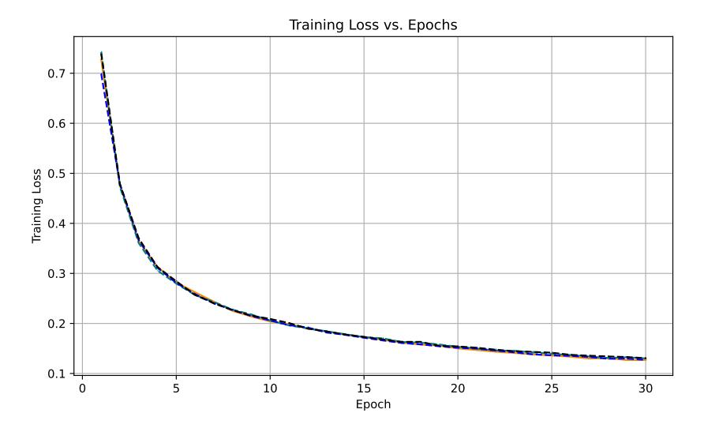
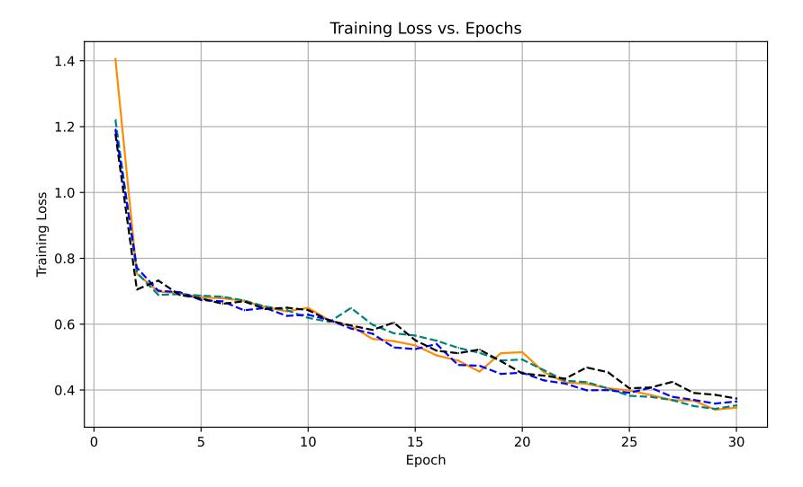
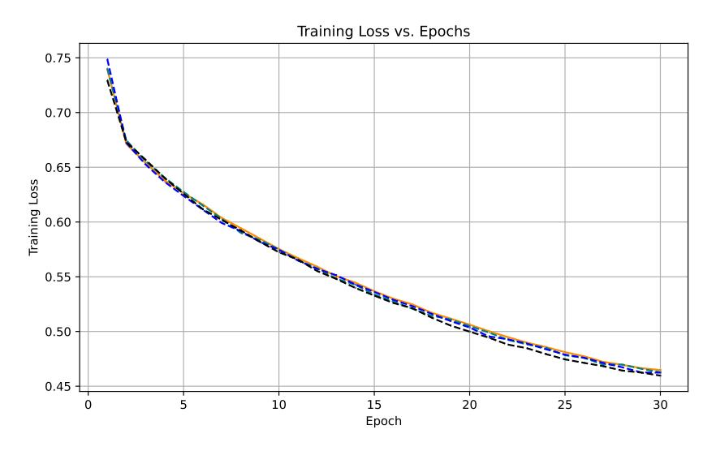

# **CoPE: A Lightweight Complex Positional Encoding**

#### Avinash Amballa

University of Massachusetts Amherst, USA aamballa@umass.edu

#### **Abstract**

Recent studies have demonstrated the effectiveness of position encoding in transformer architectures. By incorporating positional information, this approach provides essential guidance for modeling dependencies between elements across different sequence positions. We introduce CoPE (a lightweight Complex Positional Encoding), a novel architecture that leverages complex-valued encoding to encode both content and positional information. Our approach replaces traditional positional encodings with complex embeddings where the real part captures semantic content and the imaginary part encodes positional information. We introduce phase-aware attention in the first layer of the transformer model to capture position-dependent patterns, followed by standard attention layers for higher-levels. We show that CoPE doesn't exhibit long term decay and is compatible with linear attention. Experimental evaluation on the GLUE benchmark suggest that our approach achieves superior performance with less computational complexity, compared to RoPE, Sinusoidal and Learned positional encodings.

#### 1 Introduction

The sequential order of words plays a crucial role in natural language understanding. Traditional approaches, such as recurrent neural networks (RNNs), model word order by recursively updating hidden states over time. The Transformer architecture Vaswani et al. [2023] has fundamentally transformed the landscape of natural language processing and sequence modeling since its introduction. While the self-attention mechanism enables the model to capture long-range dependencies without the sequential constraints of recurrent architectures, it inherently lacks positional awareness. This limitation necessitates explicit positional encoding mechanisms to inform the model about token positions within sequences.

To address this, researchers have proposed multiple strategies for integrating positional information into the learning process. Traditional approaches employ additive positional encodings, where sinusoidal Vaswani et al. [2023] or learned positional vectors Gehring et al. [2017], Devlin et al. [2019], Lan et al. [2020], Radford and Narasimhan [2018] are element-wise added to token embeddings before being fed into attention layers. On the other hand Su et al. [2023], Dai et al. [2019], Raffel et al. [2019], Shaw et al. [2018] proposed relative Position Encoding which encodes the relative position information into the attention mechanism.

The conventional additive approach to positional encoding, while effective, presents several theoretical and practical limitations. When positional information is directly added to semantic embeddings, it leads to information interference, where the model struggles to disentangle positional and semantic information. This interference becomes particularly problematic in tasks requiring precise positional reasoning. In addition, its effectiveness diminishes when applied to longer sequences Shaw et al. [2018], Liutkus et al. [2021]. On the other hand, most of the relative postional encodings are unsuitable for linear self-attention architecture as shown in RoPE Su et al. [2023] Moreover, these encodings inherently enforce long-term decay, a suboptimal inductive bias, given that modern LLMs frequently require access to information from arbitrary context positions Chen et al. [2024].

Building upon these insights, we propose CoPE, a novel light weight complex positional encoding that leverages complex-valued encoding to encode positional information through phase components while preserving semantic content in the magnitude. Our approach fundamentally reimagines positional encoding by utilizing the natural separation between real and imaginary components of complex numbers, thereby avoiding the interference inherent in additive methods. To this end, we introduce phase-aware attention in the first layer to capture the complex positional encoding and retain the standard attention in the rest layers, making it a lightweight adapter than can be integrated to any existing models. We also show that our method is compatible with linear attention and doesn't exhibit long term decay. We evaluate our method on several GLUE benchmarks and results suggest that CoPE is superior to RoPE, Sinusoidal and Learned encodings.

To summarize, our key contributions are:

- 1. A novel lightweight complex encoding that separates semantic content (real part) and positional information (imaginary part)
- 2. A phase-aware attention mechanism in the first layer that leverages both magnitude and phase information. We introduce several types of phase-aware attention.
- 3. We show that CoPE doesn't exhibit long term decay and is compatible with Linear attention.
- 4. We evaluate our method on various GLUE benchmarks, and results suggest that CoPE achieves superior performance compared to its alternatives.

# 2 Related work

## 2.1 Positional Encoding

**Absolute** positional encodings focus on individual position information and is typically applied in the first layer of the model. These are embeddings that are directly added to the input token embeddings. Sinusoidal positional encodings Vaswani et al. [2023] are non-learned vectors that are added directly to input embeddings to at the bottoms of the encoder and decoder stacks. On the other hand, Learned encodings Wang et al. [2020a] use a learned additive vector.

Relative positional encoding focus on relative position rather than absolute. While absolute positional encoding (APE) offers a straightforward and intuitive approach, its effectiveness diminishes when applied to longer sequences. This limitation has led researchers to increasingly focus on refining relative positional encoding. Shaw et al. [2018], Liutkus et al. [2021] use relative position encodings that attempts to exploit pairwise, relative positional information. Relative positional information is supplied to the model on two levels: values and keys. RoPE Su et al. [2023] integrates position awareness throughout all transformer layers. Notably, this method uniquely preserves the positionagnostic nature of the value vectors in the self-attention mechanism.

**Additive relative positional** encoding introduce bias matrix to the attention matrix. Its popular variants include T5 Bias Raffel et al. [2019], ALiBi Press et al. [2022]. ALiBi penalizes the attention value so that a query can assign to the key depending on how far away the key and query are. So when a key and query are close by, the penalty is very low, and when they are far away, the penalty is very high. It outperforms those methods and Rotary embeddings when evaluating sequences that are longer than the ones the model was trained on (extrapolation).

Other positional embeddings include conditional positional encoding Chu et al. [2023] which generate and conditions on the local neighborhood of the input tokens. Hua et al. [2025] introduces Fourier positional embedding which enhances attention's frequency-domain properties to improve both its periodic extension and length generalization. HoPE Chen et al. [2024] replaces the specific components in RoPE with position-independent ones, retaining only high frequency signals, leading to greater robustness to the out-of-distribution.

#### 2.2 Complex-Valued Neural Networks

Complex-valued neural networks Lee et al. [2022], Bassey et al. [2021] have emerged as a promising paradigm for processing information with inherent multi-dimensional structure. Unlike real-valued networks that operate on scalar features, complex networks naturally encode information through

both magnitude and phase components, providing orthogonal dimensions for representation. This dual-component structure has proven particularly effective in signal processing applications Bassey et al. [2021] where phase information carries crucial meaning.

Eilers and Jiang [2023] introduce complex-valued neural networks by presenting building blocks to transfer the transformer architecture to the complex domain. They present multiple versions of a complex-valued Scaled Dot-Product Attention mechanism as well as a complex-valued layer normalization. Leng et al. [2025] propose fundamental paradigm of complex-valued transformers for wireless communications.

#### 3 Method

## 3.1 Complex Encoding Layer

Our work is closely related to Wang et al. [2020b] which extends word vectors as continuous functions over changing variables like word position. They also introduce a general complex-valued word embedding approach where each word-position combination is represented as a waveform with trainable amplitude  $(r_j)$ , frequency  $(\omega_j)$ , and phase  $(\theta_j)$  parameters. Unlike traditional additive position embeddings, this method uses element-wise multiplication between word embeddings and positional components, allowing adaptive control over position sensitivity per dimension.

In this work, we isolate position into the complex domain, keeping token embeddings real. Our approach begins with complex-valued encoding that encodes content and position separately. In particular,

$$E_{\text{complex}}(x, \text{pos}) = E_{\text{vocab}}(x) + i \cdot E_{\text{pos}}(\text{pos})$$

where  $E_{\text{vocab}}(x)$  represents the token embedding (real part)  $^1$ ,  $E_{\text{pos}}(\text{pos})$  represents the positional embedding (imaginary part). Here i represents the imaginary unit

This representation naturally separates semantic content from positional information while maintaining their relationship through the complex structure. In this paper, we use sinusoidal encoding Vaswani et al. [2023] in imaginary part to encode position information to extrapolate beyond the trained sequence length.

$$E_{\text{complex}}(x, pos) = E_{\text{vocab}}(x) + i \cdot \gamma \cdot \sin(\omega \cdot pos)$$

Complex representations offer theoretical advantages for positional modeling.

- Orthogonal Information Encoding: Real and imaginary components are orthogonal, preventing direct interference between content and position. Unlike additive positional encodings that cause information loss through vector addition, complex embeddings preserve both components.
- 2. Rotation: Complex multiplications Eilers and Jiang [2023] enables position-dependent transformations through rotation.

#### 3.2 Phase-Aware Attention

To model the complex input from positional information, we introduce phase-aware attention mechanism in the first layer. This attention mechanism captures both semantic and positional relationships.

To handle the complex valued embedding, we introduce complex valued projection in the first layer. Let the complex-valued projections be defined as:

$$Q_{\text{proj}} = Q_{\text{real}} + i \cdot Q_{\text{imag}}, \quad K_{\text{proj}} = K_{\text{real}} + i \cdot K_{\text{imag}}$$

For complex input,  $z = z_{\text{real}} + i \cdot z_{\text{imag}}$ , the complex-valued query and key vectors are:

$$\begin{split} Q_{\text{complex}} &= Q_{\text{proj}} \cdot z & K_{\text{complex}} &= K_{\text{proj}} \cdot z \\ &= (Q_{\text{real}} \cdot z_{\text{real}} - Q_{\text{imag}} \cdot z_{\text{imag}}) &= (K_{\text{real}} \cdot z_{\text{real}} - K_{\text{imag}} \cdot z_{\text{imag}}) \\ &+ i(Q_{\text{real}} \cdot z_{\text{imag}} + Q_{\text{imag}} \cdot z_{\text{real}}) &+ i(K_{\text{real}} \cdot z_{\text{imag}} + K_{\text{imag}} \cdot z_{\text{real}}) \end{split}$$

&lt;sup>1we add the sentence embedding to the token embedding if applicable

We keep the value vector V in real space (projection on  $z_{real}$ ), to propogate the real valued output to next layers.

We define the attention scores in a similar fashion to Eilers and Jiang [2023] to incorporate both magnitude and phase information in the attention computation:

$$A_{\text{complex}} = Q_{\text{complex}} \cdot K_{\text{complex}}^*$$

Here \* denotes the complex conjugate. Let  $A_{\text{magnitude}}$ ,  $A_{\text{phase}}$ , and  $\Re(A_{\text{complex}})$  represent the magnitude, phase, and real part of the complex attention scores  $A_{\text{complex}}$ , respectively.

We propose several variants to map the complex-valued attention scores to real-valued scores:

1. Magnitude:

$$A_{\text{real}} = \frac{A_{\text{magnitude}}}{\sqrt{d_k}}$$

2. Phase:

$$A_{\text{real}} = \frac{\cos(A_{\text{phase}})}{\sqrt{d_k}}$$

3. **Real:** 

$$A_{\rm real} = \frac{\Re(A_{\rm scores})}{\sqrt{d_k}}$$

4. Hybrid:

$$A_{\text{real}} = \frac{(A_{\text{magnitude}} + \alpha \cdot \cos(A_{\text{phase}}))}{\sqrt{d\iota}}$$

5. Hybrid-norm:

$$A_{\text{real}} = \frac{\frac{A_{\text{magnitude}}}{\max(A_{\text{magnitude}})} + \alpha \cdot \cos(A_{\text{phase}})}{\sqrt{d_k}}$$

Here  $\alpha$  is a phase coefficient controlling phase influence. We choose cosine function in phase to model similarity i.e. lesser the phase difference, the more the similar as discussed in Eilers and Jiang [2023]

Since attention score  $A_{\text{real}}$  & value vectors V are still in real valued space, we use  $Softmax(A_{\text{real}})*V$ 

### 3.3 Properties of CoPE

1. CoPE doesn't exhibit Long term decay: Recent work on HoPE Chen et al. [2024] challenges the conventional assumption that positional encodings must enforce long-term decay, arguing that modern LLMs often need to retrieve information from arbitrary context positions. In this section, we prove that CoPE doesn't exhibit long term decay.

Reformulating our definition of the complex positional embedding for token x at position p as

$$z(x,p) = e_x + i\gamma \sin(\omega p), \tag{1}$$

where  $e_x \in \mathbb{R}^d$  is the token embedding,  $\gamma \in \mathbb{R}$  is a scaling factor, and  $\omega$  is the base angular frequency. We consider the complex inner product:

$$A_{\text{complex}}(x, y, p, q) = Q_{\text{complex}}(x, p) \cdot K_{\text{complex}}(y, q)^*.$$
 (2)

Substituting the definitions:  $A_{complex}(x, y, p, q)$ 

$$= (Q_{\text{proj}}[e_x + i\gamma\sin(\omega p)]) \cdot (K_{\text{proj}}[e_y + i\gamma\sin(\omega q)])^*$$
(3)

$$= (Q_{\text{proj}} \mathbf{e}_x + i\gamma Q_{\text{proj}} \sin(\omega p)) \cdot (K_{\text{proj}} \mathbf{e}_y - i\gamma K_{\text{proj}} \sin(\omega q)) \tag{4}$$

$$= \underbrace{(Q_{\text{proj}} \boldsymbol{e}_x) \cdot (K_{\text{proj}} \boldsymbol{e}_y)}_{\text{content term}} + i\gamma \left[ (Q_{\text{proj}} \boldsymbol{e}_x) \cdot (-K_{\text{proj}} \sin(\omega q)) \right]$$
 (5)

$$+i\gamma \left[ (Q_{\text{proj}}\sin(\omega p)) \cdot (K_{\text{proj}}e_y) \right]$$
 (6)

$$+\underbrace{\gamma^{2} \left[ Q_{\text{proj}} \sin(\omega p) \cdot K_{\text{proj}} \sin(\omega q) \right]}_{\text{position term}}.$$
 (7)

The last term encodes the positional interaction:

$$Q_{\text{proj}}\sin(\omega p) \cdot K_{\text{proj}}\sin(\omega q) \propto \sin(\omega p)\sin(\omega q) \tag{8}$$

$$= \frac{1}{2} \left[ \cos(\omega(p-q)) - \cos(\omega(p+q)) \right]. \tag{9}$$

Thus, the positional contribution to  $A_{\text{complex}}(x, y, p, q)$  is

$$A_{\text{complex}}(x, y, p, q) \propto \cos(\omega(p - q)) - \cos(\omega(p + q)) \tag{10}$$

The relative position term  $\cos(\omega(p-q))$  is *purely oscillatory* with respect to p-q and has no multiplicative decay factor such as  $e^{-\alpha|p-q|}$ . Therefore, this complex encoding does **not** impose long-term decay on the attention score magnitude.

- 2. CoPE encodes both relative and absolute positions: We note that CoPE embeddings are absolute. However, phase-aware attention encodes both relative and absolute positions. The relative position information emerges naturally from the phase difference encoded via complex multiplication i.e.,  $A_{\text{complex}} = Q_{\text{complex}} K_{\text{complex}}^*$ . Given positions p, q,  $A_{\text{complex}} \propto \cos{(\omega(p-q))} \cos{(\omega(p+q))}$ . as shown in eq 10
- **3. CoPE is compatible with Linear Attention**: We show that CoPE with phase-aware attention is compatible with linear attention mechanisms. Linear attention Katharopoulos et al. [2020] rewrites the attention as:

$$\text{Attention}(Q,K,V)_m = \frac{\sum_{n=1}^N \phi(q_m)^\top \phi(k_n) v_n}{\sum_{n=1}^N \phi(q_m)^\top \phi(k_n)},$$

where  $\phi(x)$  is a non-negative activation function such as elu(x) + 1

To incorporate complex queries and keys, we lift the complex vectors to doubled real features by splitting real, imaginary parts and applying  $\phi$  separately:

$$\phi(q) \ = \ \begin{bmatrix} \phi(q_r) \\ \phi(q_i) \end{bmatrix} \in \mathbb{R}^{2d}, \qquad \phi(k) \ = \ \begin{bmatrix} \phi(k_r) \\ \phi(k_i) \end{bmatrix} \in \mathbb{R}^{2d}.$$

We compute the Hermitian inner product for the lifted features:

$$\phi(q)^{\dagger}\phi(k) = \left(\phi(q_r) - i\phi(q_i)\right)^{\top} \left(\phi(k_r) + i\phi(k_i)\right)$$
(11)

$$= \left(\phi(q_r)^\top \phi(k_r) + \phi(q_i)^\top \phi(k_i)\right) \tag{12}$$

$$+ i(\phi(q_i)^{\top}\phi(k_r) - \phi(q_r)^{\top}\phi(k_i)). \tag{13}$$

Thus the complex kernel decomposes into four real inner products:

$$A_{rr} = \phi(q_r)^{\top} \phi(k_r), \quad A_{ii} = \phi(q_i)^{\top} \phi(k_i)$$

$$A_{ir} = \phi(q_i)^{\top} \phi(k_r), \quad A_{ri} = \phi(q_r)^{\top} \phi(k_i).$$

Plugging  $\phi$  into the linear-attention numerator gives

$$Num_m = \sum_{n=1}^{N} \phi(q_m)^{\dagger} \phi(k_n) v_n$$
(14)

$$= \sum_{n=1}^{N} \left( \left( A_{rr}^{(m,n)} + A_{ii}^{(m,n)} \right) + i \left( A_{ir}^{(m,n)} - A_{ri}^{(m,n)} \right) \right) v_n.$$
 (15)

Each real inner product  $A_{uv}^{(m,n)} = \phi(Q_{u,m})^{\top} \phi(K_{v,n})$  is separable in m and n. Therefore we can precompute key-value aggregates:

$$\mathbf{G}_{r} := \sum_{n=1}^{N} \phi(k_{r,n}) \, v_{n}^{\top}, \qquad \mathbf{G}_{i} := \sum_{n=1}^{N} \phi(k_{i,n}) \, v_{n}^{\top}$$
(16)

(17)

Figure 1: Training loss vs. epochs on SST2 with CoPE vs RoPE.

Thus the numerator is computed by a small number of matrix-vector products:

$$Num_m = \left(\phi(q_{r,m})^{\top} \mathbf{G}_r + \phi(q_{i,m})^{\top} \mathbf{G}_i\right)$$
(18)

+ 
$$i(\phi(q_{i,m})^{\top}\mathbf{G}_r - \phi(q_{r,m})^{\top}\mathbf{G}_i)$$
. (19)

For numerical stability and to avoid division by complex scalars, a common choice is to keep the denominator real. For instance one may set

$$Den_{m} = \sum_{n=1}^{N} (\phi(q_{r,m})^{\top} \phi(k_{r,n}) + \phi(q_{i,m})^{\top} \phi(k_{i,n})),$$

Given the complex numerator  $\operatorname{Num}_m \in \mathbb{C}^V$  and real denominator  $\operatorname{Den}_m \neq 0$ , one can form different real-valued attention outputs as shown in sec 3.2:

- Magnitude: Attentionm =  $|\text{Num}_m|/\text{Den}_m$ .
- **Phase:** Attentionm =  $cos(arg(Num_m))/Den_m$ .
- **Real:** Attentionm =  $Re(Num_m)/Den_m$ .
- **Hybrid:** Attentionm =  $(|\text{Num}_m| + \alpha \cos(\arg(\text{Num}_m)))/\text{Den}_m$ .

All these options use the precomputed aggregates and therefore retain O(N) complexity.

## 3.4 Computation cost

Our method applies phase-aware attention only to the first layer, followed by standard attention layers. This design captures position-dependent patterns early while allowing higher layers to focus on semantic relationships. In addition, limiting complex operations to one layer makes this encoding easy to adapt and maintains reasonable computational cost.

In this section, we show the compute cost for CoPE vs RoPE. Define number of layer in model to be L, number of test data samples be N, input sequence length T, number of heads H,  $d_k = d_{model}/H$ . RoPE Su et al. [2023] rotates query and key vectors in every layer for every head i.e, matrix rotations complexity is  $O(L*c_{rot}*N*H*T*d_k)$ , assuming the rotation operations are worth  $c_{rot}$ . However, CoPE use phase-aware attention in single layer and standard attention in rest of the layers making the complex-valued operations complexity to be  $O(c_{complex}*N*H*T*d_k)$ . Ignoring the rotation factor  $c_{rot}$  in RoPE and complex operation factor  $c_{complex}$  in CoPE, CoPE is L times faster than RoPE.

Figure 2: Training loss vs. epochs on MRPC with CoPE vs RoPE.

- - - Complex Valued phase - - - Complex Valued magnitude - - - Complex Valued hybrid norm —— ROPE

Figure 3: Training loss vs. epochs on QNLI with CoPE vs RoPE.

- - - Complex Valued phase - - - Complex Valued magnitude - - - Complex Valued hybrid norm —— ROPE

# 4 Experiments

#### 4.1 Experimental Setup

**Dataset**: We experiment with several datasets from GLUE, i.e. MRPC Dolan and Brockett [2005], SST-2 Socher et al. [2013], QNLI for training tasks.

- 1. MRPC: The Microsoft Research Paraphrase Corpus consists of sentence pairs and evaluates whether two sentences are semantically equivalent.
- 2. SST2: The Stanford Sentiment Treebank (binary classification version) uses single movie review sentences to assess sentiment.

| Encoding                         | SST2 (Accuracy) | MRPC (F1) | QNLI (Accuracy) |
|----------------------------------|-----------------|-----------|-----------------|
| Learned Wang et al. [2020a]      | 81.54           | 81.55     | 60.21           |
| Sinusoidal Vaswani et al. [2023] | 82.57           | 79.74     | 63.87           |
| RoPE Su et al. [2023]            | 81.31           | 80.98     | 60.74           |
| CoPE magnitude (Ours)            | 80.28           | 80.19     | 61.63           |
| CoPE phase (Ours)                | 82.57           | 81.71     | 59.86           |
| CoPE real (Ours)                 | 80.50           | 80.88     | 60.97           |
| CoPE hybrid (Ours)               | 81.31           | 79.75     | 60.74           |
| CoPE hybrid-norm (Ours)          | 79.13           | 81.00     | 60.74           |

Table 1: Test Performance comparison of different positional encodings across multiple datasets. **Bold** and underline indicate the best and second-best result in each column.

3. QNLI: The Question-answering Natural Language Inference dataset is a question paired with a sentence from a passage. The task is to determine if the sentence contains the answer to the question.

**Metrics**: We use the same evaluation metrics as in RoPE Su et al. [2023] i.e., F1-score for MRPC, and accuracy for the remaining as the evaluation metrics.

**Model Configuration**: We use transformer model with 6 layers, 8 heads, 256-dimensional embeddings, 256-dimensional attention with max positions 512.

**Training details:** We use AdamW optimizer with learning rate 1e-4, 0.01 weight decay, and dropout 0.2. All the model are trained from scratch for 30 epochs. We set  $\alpha = 0.2$ ,  $\gamma = 1$ .

#### 4.2 Results

To visualize the training performance of CoPE, we plot the training loss vs. number of epochs for different variant of CoPE i.e., CoPE magnitude, CoPE phase, CoPE hybrid-norm and compare with RoPE. Figure 1, 2, 3 depicts the training loss vs number of epochs for different variants of CoPE and RoPE on SST2, MRPC, QNLI datasets respectively. On SST2, Figure 1 depicts that the training loss of CoPE isclosely mirrors that of RoPE which implies that CoPE is comparable with RoPE. On MRPC and QNLI, Figures 2, 3 show that CoPE achieves lower training loss compared to RoPE, in particular CoPE magnitude, CoPE phase outperforms all its competitors, indicating a more effective learning process.

These training trends are reflected in the final test performance, detailed in Table 1. These results shows the test performance (accuracy, F1 score) of different encoding methods on SST2, MRPC, QNLI datasets. On SST2 & MRPC datasets, CoPE phase outperforms all the existing positional encodings including RoPE. On QNLI, CoPE magnitude achieves the second best performance after sinusoidal encodings, outperforming RoPE and learned positional encoding. These results demonstrate that our complex positional encoding with phase-aware attention achieves superior performance on different GLUE benchmarks with less computational complexity compared to RoPE.

# 5 Limitations

#### 1. Extrapolation:

Our method also allows to extrapolate beyond the sequence length due to the sinusoidal embeddings in complex domain. However, AliBi Press et al. [2022] show that sinusoidal embeddings underperform when extrapolated beyond sequence length. We plan to include the extrapolation experiments with CoPE and compare with AliBi Press et al. [2022].

#### 2. Pretraining & Finetuning tasks

Due to resource constraints, our current method is only evaluated on relatively smaller model that is trained from scratch. In particular, CoPE requires a separate evaluation on pretraining and fine tuning tasks on larger models.

# 6 Conclusion

We introduce CoPE, a novel positional encoding that encodes context and position information through real and imaginary components respectively. Our approach demonstrates that the application of phase-aware attention on the first layer can effectively capture positional dependencies while maintaining computational efficiency. We show that CoPE doesn't exhibit long term decay and is compatible with linear attention, make it a light weight adapter to existing models. Experimental results on the GLUE benchmarks demonstrate our approach, achieving superior performance compared to its alternatives. This work opens several research directions, including emphasis of complex space in transformers and its applications to diverse sequence modeling tasks.

#### References

- Joshua Bassey, Lijun Qian, and Xianfang Li. A survey of complex-valued neural networks, 2021. URL https://arxiv.org/abs/2101.12249.
- Yuhan Chen, Ang Lv, Jian Luan, Bin Wang, and Wei Liu. Hope: A novel positional encoding without long-term decay for enhanced context awareness and extrapolation, 2024. URL https://arxiv.org/abs/2410.21216.
- Xiangxiang Chu, Zhi Tian, Bo Zhang, Xinlong Wang, and Chunhua Shen. Conditional positional encodings for vision transformers, 2023. URL https://arxiv.org/abs/2102.10882.
- Zihang Dai, Zhilin Yang, Yiming Yang, Jaime Carbonell, Quoc V. Le, and Ruslan Salakhutdinov. Transformer-xl: Attentive language models beyond a fixed-length context, 2019. URL https://arxiv.org/abs/1901.02860.
- Jacob Devlin, Ming-Wei Chang, Kenton Lee, and Kristina Toutanova. Bert: Pre-training of deep bidirectional transformers for language understanding, 2019. URL https://arxiv.org/abs/1810.04805.
- William B. Dolan and Chris Brockett. Automatically constructing a corpus of sentential paraphrases. In *International Joint Conference on Natural Language Processing*, 2005. URL https://api.semanticscholar.org/CorpusID:16639476.
- Florian Eilers and Xiaoyi Jiang. Building blocks for a complex-valued transformer architecture. In *ICASSP* 2023 2023 IEEE International Conference on Acoustics, Speech and Signal Processing (ICASSP), page 1–5. IEEE, June 2023. doi: 10.1109/icassp49357.2023.10095349. URL http://dx.doi.org/10.1109/ICASSP49357.2023.10095349.
- Jonas Gehring, Michael Auli, David Grangier, Denis Yarats, and Yann N. Dauphin. Convolutional sequence to sequence learning, 2017. URL https://arxiv.org/abs/1705.03122.
- Ermo Hua, Che Jiang, Xingtai Lv, Kaiyan Zhang, Ning Ding, Youbang Sun, Biqing Qi, Yuchen Fan, Xuekai Zhu, and Bowen Zhou. Fourier position embedding: Enhancing attention's periodic extension for length generalization, 2025. URL https://arxiv.org/abs/2412.17739.
- Angelos Katharopoulos, Apoorv Vyas, Nikolaos Pappas, and Franccois Fleuret. Transformers are rnns: Fast autoregressive transformers with linear attention. In *International Conference on Machine Learning*, 2020. URL https://api.semanticscholar.org/CorpusID:220250819.
- Zhenzhong Lan, Mingda Chen, Sebastian Goodman, Kevin Gimpel, Piyush Sharma, and Radu Soricut. Albert: A lite bert for self-supervised learning of language representations, 2020. URL https://arxiv.org/abs/1909.11942.
- ChiYan Lee, Hideyuki Hasegawa, and Shangce Gao. Complex-valued neural networks: A comprehensive survey. *IEEE/CAA Journal of Automatica Sinica*, 9(8):1406–1426, 2022. doi: 10.1109/JAS.2022.105743.
- Yang Leng, Qingfeng Lin, Long-Yin Yung, Jingreng Lei, Yang Li, and Yik-Chung Wu. Unveiling the power of complex-valued transformers in wireless communications, 2025. URL https://arxiv.org/abs/2502.11151.
- Antoine Liutkus, Ondřej Cífka, Shih-Lun Wu, Umut Şimşekli, Yi-Hsuan Yang, and Gaël Richard. Relative positional encoding for transformers with linear complexity, 2021. URL https://arxiv.org/abs/2105.08399.
- Ofir Press, Noah A. Smith, and Mike Lewis. Train short, test long: Attention with linear biases enables input length extrapolation, 2022. URL https://arxiv.org/abs/2108.12409.
- Alec Radford and Karthik Narasimhan. Improving language understanding by generative pre-training. 2018. URL https://api.semanticscholar.org/CorpusID:49313245.
- Colin Raffel, Noam M. Shazeer, Adam Roberts, Katherine Lee, Sharan Narang, Michael Matena, Yanqi Zhou, Wei Li, and Peter J. Liu. Exploring the limits of transfer learning with a unified text-to-text transformer. *J. Mach. Learn. Res.*, 21:140:1–140:67, 2019. URL https://api.semanticscholar.org/CorpusID: 204838007.
- Peter Shaw, Jakob Uszkoreit, and Ashish Vaswani. Self-attention with relative position representations, 2018. URL https://arxiv.org/abs/1803.02155.

- Richard Socher, Alex Perelygin, Jean Wu, Jason Chuang, Christopher D. Manning, A. Ng, and Christopher Potts. Recursive deep models for semantic compositionality over a sentiment treebank. In *Conference on Empirical Methods in Natural Language Processing*, 2013. URL https://api.semanticscholar.org/CorpusID: 990233.
- Jianlin Su, Yu Lu, Shengfeng Pan, Ahmed Murtadha, Bo Wen, and Yunfeng Liu. Roformer: Enhanced transformer with rotary position embedding, 2023. URL https://arxiv.org/abs/2104.09864.
- Ashish Vaswani, Noam Shazeer, Niki Parmar, Jakob Uszkoreit, Llion Jones, Aidan N. Gomez, Lukasz Kaiser, and Illia Polosukhin. Attention is all you need, 2023. URL https://arxiv.org/abs/1706.03762.
- Benyou Wang, Lifeng Shang, Christina Lioma, Xin Jiang, Hao Yang, Qun Liu, and Jakob Grue Simonsen. On position embeddings in bert. In *International conference on learning representations*, 2020a.
- Benyou Wang, Donghao Zhao, Christina Lioma, Qiuchi Li, Peng Zhang, and Jakob Grue Simonsen. Encoding word order in complex embeddings, 2020b. URL https://arxiv.org/abs/1912.12333.