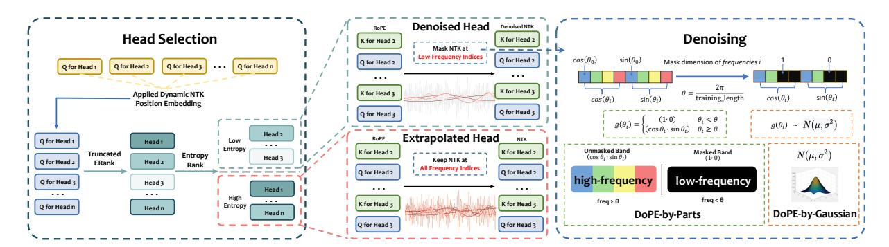
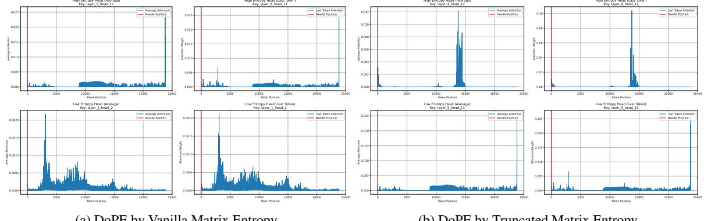
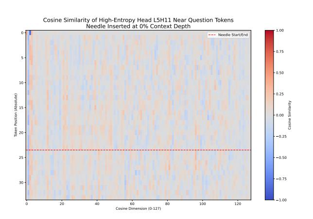
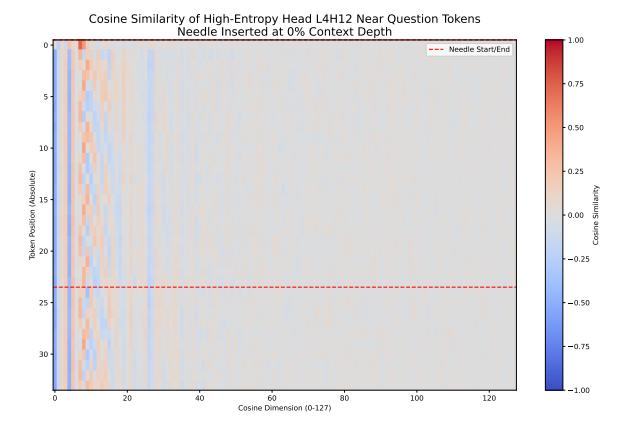
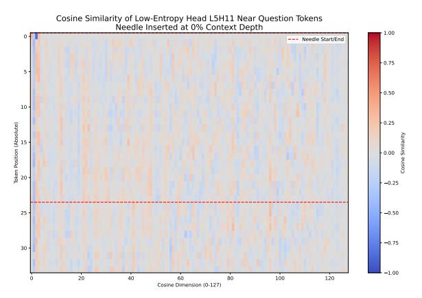

# **DoPE: Denoising Rotary Position Embedding**

Jing Xiong1\*, Liyang Fan3\*, Hui Shen2, Zunhai Su1, Min Yang3†, Lingpeng Kong1, and Ngai Wong1

1The University of Hong Kong 2University of Michigan, Ann Arbor 3Shenzhen Institute of Advanced Technology, Chinese Academy of Sciences

Contact: junexiong@connect.hku.hk Project: https://The-physical-picture-of-LLMs.github.io

#### **Abstract**

Rotary Position Embedding (RoPE) in Transformer models has inherent limits that weaken length extrapolation. We reinterpret the attention map with positional encoding as a noisy feature map, and propose Denoising Positional Encoding (DoPE), a training-free method based on truncated matrix entropy to detect outlier frequency bands in the feature map. Leveraging the noise characteristics of the feature map, we further reparameterize it with a parameter-free Gaussian distribution to achieve robust extrapolation. Our method theoretically reveals the underlying cause of the attention sink phenomenon and its connection to truncated matrix entropy. Experiments on needle-in-a-haystack and many-shot in-context learning tasks demonstrate that DoPE significantly improves retrieval accuracy and reasoning stability across extended contexts (up to 64K tokens). The results show that the denoising strategy for positional embeddings effectively mitigates attention sinks and restores balanced attention patterns, providing a simple yet powerful solution for improving length generalization.

## 1 Introduction

The *position encoding* is a key component of the large language models (LLMs), influencing interactions among tokens. Attention scores are computed as the dot product of query and key vectors:

$$\operatorname{Attn}(i,j) \propto \langle Q_i^R, K_j^R \rangle. \tag{1}$$

Position encodings are often added to the query and key vectors to incorporate sequence order. Among various techniques, Rotary Position Embedding (RoPE) (Su et al., 2024) is widely used due to its ability to encode relative positions directly within the dot-product operation, where the query and key are rotated as:

$$Q_i^{\mathbf{R}} = R_{\theta(i)}Q_i, \quad K_j^{\mathbf{R}} = R_{\theta(j)}K_j. \tag{2}$$

However, previous work such as DAPE (Zheng et al., 2024), which replaces position encoding with additional MLPs on attention scores, and NoPE (Wang et al., 2024), which operates without any positional encoding, both suggest that the classical *RoPE* schemes may constrain Transformer (Vaswani et al., 2017) performance.

In this work, we conceptualize *position encoding* as a noisy feature map via the *truncated matrix entropy* (Xiong et al., 2024). We measure the noise level of the features and employ a parameter-free Gaussian distribution to perform length extrapolation. Specifically, the main contributions of this paper are as follows:

- We introduce the *truncated matrix entropy* to identify noisy heads and model the position encoding as a parameter-free Gaussian distribution to achieve length extrapolation.
- We theoretically and empirically identify that the *low-frequency alignment* of positional encodings used for computing attention score is the fundamental cause of the attention sink and structural sparsity phenomena such as retrieval heads.
- We find that attention heads with strong extrapolation ability exhibit *low-rank* structures; keeping their position encodings and removing those of high-rank heads yields up to a 10-point improvement without training.

## 2 Background

In this section, we first review the Transformer architecture of Vaswani et al. (2017), with a focus on its multi-head attention mechanism. Then, we analyze the role of rotary position embeddings (RoPE) in shaping the attention patterns.

\*Equal contribution

†Corresponding author

#### 2.1 Multi-Head Self-Attention

We consider a causal language model implemented as a decoder-only Transformer. Given token representations  $\mathbf{X} \in \mathbb{R}^{n \times d}$ , we form queries, keys, and values via

$$\mathbf{Q} = \mathbf{X} \times \mathbf{W}_Q, \quad \mathbf{K} = \mathbf{X} \times \mathbf{W}_K, \quad \mathbf{V} = \mathbf{X} \times \mathbf{W}_V,$$
(3)

with projection matrices

$$\mathbf{W}_Q, \mathbf{W}_K, \mathbf{W}_V \in \mathbb{R}^{d \times (h \times d_h)},$$
 (4)

where d denotes the model's hidden dimension, and equal per-head widths  $d_h$  (so each head has dimension  $d_h$  and the concatenated width is  $h \times d_h$ ). Reshape to per-head tensors:

$$\mathbf{Q}, \mathbf{K}, \mathbf{V} \in \mathbb{R}^{h \times n \times d_h}. \tag{5}$$

Let  $\mathbf{M} \in \mathbb{R}^{1 \times n \times n}$  be the causal mask, with 0 on and below the diagonal and  $-\infty$  above. Masked attention per head is

$$\mathbf{A} = \operatorname{softmax} \left( \frac{\mathbf{Q} \mathbf{K}^{\top}}{\sqrt{d_h}} + \mathbf{M} \right) \in \mathbb{R}^{h \times n \times n}, \quad (6)$$

$$\mathbf{O} = \mathbf{AV} \in \mathbb{R}^{h \times n \times d_h},\tag{7}$$

where O denotes the output of self-attention.

# 2.2 Rotary Position Embedding

Most LLMs adopt *Rotary Position Embedding* (RoPE) (Su et al., 2024) as their default positional encoding mechanism, which has become the de facto standard in contemporary architectures. RoPE encodes token positions by rotating each query/key vector on a sequence of two-dimensional planes. This formulation allows attention scores to depend on *relative* positional offsets while preserving the simple dot-product structure.

**Definition.** Let the per-head width be  $d_h$  (assume  $d_h$  is even). Split a head into  $d_h/2$  complex components by pairing dimensions (2f,2f+1). f indexes the  $d_h/2$  two-dimensional subspaces, each corresponding to a pair of consecutive feature dimensions used to apply a distinct rotation frequency. For an integer position m and a frequency schedule  $\{\omega_f\}_{f=0}^{d_h/2-1}$  (with base b>1), define:

$$\mathbf{R}(\phi) = \begin{bmatrix} \cos \phi & -\sin \phi \\ \sin \phi & \cos \phi \end{bmatrix}, \tag{8}$$

$$R_{\theta(m)} = \operatorname{diag}(\mathbf{R}(\omega_0 m), \dots, \mathbf{R}(\omega_{d_h/2-1} m)),$$

where a common choice is  $\omega_f = b^{-2f/d_h}$  and  $\theta(m)$  denotes the vector of per-pair rotation phases at position m RoPE rotates queries/keys as

$$Q_i^{\mathrm{R}} = R(\theta_i)Q_i, \qquad K_j^{\mathrm{R}} = R(\theta_j)K_j.$$
 (10)

**Relative-position property.** For any positions i, j and vectors  $q, k \in \mathbb{R}^{d_h}$ ,

$$\langle \mathbf{R}(\theta_i)q, \ \mathbf{R}(\theta_i)k \rangle = \langle q, \ R(\theta_{(i-i)})k \rangle,$$
 (11)

so the score depends on the relative offset (j-i) while preserving the efficiency of the dot product.

#### 3 Related Work

Length Extrapolation With RoPE. RoPE has been widely adopted (Su et al., 2024). It is employed in models such as LLaMA2 (Touvron et al., 2023), LLaMA3 (Dubey et al., 2024), and Qwen3 (Yang et al., 2025) where token order is encoded by rotating vectors at position-dependent angles. Moreover, RoPE and its variants are extensively used in a wide range of recent large models, including Qwen (Bai et al., 2023), Qwen2 (Team, 2024a), Qwen2.5 (Team, 2024b), Qwen2.5-VL (Bai et al., 2025), Qwen3 (Yang et al., 2025), Mistral (Jiang et al., 2023), Gemma (Team et al., 2024a), Gemma-2 (Team et al., 2024b), and Gemma-3 (Team et al., 2025).

However, when the input length exceeds the training length by several times (Peng et al., 2023; Chen et al., 2023; Ding et al., 2024), model performance degrades severely. This degradation is not unique to RoPE; similar issues occur with other positional encodings such as ALiBi (Press et al., 2021) and Kerple (Chi et al., 2022). To address this problem, different approaches have been proposed. For instance, FIRE (Li et al., 2023) alleviates longcontext degradation by introducing learnable positional encodings, where MLPs are used to generate suitable positional representations. In contrast, NTK-based methods (Peng et al., 2023) improve long-context extrapolation by modifying the frequency spectrum, thereby extending the context length and enhancing stability on long sequences.

Length Extrapolation Without Positional Encoding. Positional encodings provide sequence awareness and enhance a model's expressive capacity (Shaw et al., 2018; Yun et al., 2019; Luo et al., 2022). While several studies (Zuo et al., 2024; Haviv et al., 2022; Köcher et al., 2025)

have shown that causal decoder-based Transformers can implicitly capture token order information, NoPE (Kazemnejad et al., 2023) further demonstrates that the causal mask itself inherently encodes positional relationships.

More recently, data-dependent positional encoding methods, such as DAPE (Zheng et al., 2024) and DAPE v2 (Zheng et al., 2024), have been proposed to enhance length extrapolation by treating positional encodings as input-dependent feature maps of the attention. However, these approaches still rely on a learnable parameter matrix to construct the positional encoding.

# 4 Denoising Positional Encoding

#### 4.1 Outlier Features

Recent studies (Jin et al., 2025; Qiao and Huang, 2025) reveal that RoPE can induce *outlier channels* in the *query* and *key* representations: a small subset of low-frequency rotary bands exhibit abnormally large  $\ell_2$  norms, and give rise to distinctive row/column "bright-band" patterns in the  $QK^{\top}$  matrix. This subsection formalizes this phenomenon through a simple spectral analysis of individual RoPE bands.

## 4.2 Spectral Analysis via the Gram Matrix

**Convention.** Let  $\mathbf{Q}^{R}$ ,  $\mathbf{K}^{R} \in \mathbb{R}^{N \times d_h}$  denote the *RoPE-rotated* queries/keys. For RoPE band f, define the band-projected matrices

$$\mathbf{Q}_f' = \mathbf{P}_f \mathbf{Q}^{\mathrm{R}}, \qquad \mathbf{K}_f' = \mathbf{P}_f \mathbf{K}^{\mathrm{R}}, \qquad (12)$$

where  $\mathbf{P}_f \in \mathbb{R}^{2 \times d_h}$  selects coordinates (2f, 2f+1). We work per head; extension to multiple heads is by concatenation.

**Band-wise Gram Matrix.** Consider a single RoPE frequency band acting on a 2-D subspace via planar rotations. For position j, let the key projected onto this band be

$$\hat{k}_j = \beta_j \mathbf{R}(\theta_j) k, \qquad \beta_j \ge \beta_{\min} > 0, \quad (13)$$

where  $\beta_j$  denotes the per-position magnitude of the key on this RoPE band (i.e., the  $\ell_2$  norm of its component in the 2-D plane),  $\beta_{\min} > 0$  is a fixed lower bound ensuring nondegeneracy over the visible window,  $\theta_j$  is the RoPE phase at position j, and k is a unit direction in that plane.

Assume a low–frequency cone condition (Deshpande et al., 2014) within the positional encoding window: for angles  $\theta_j$  there exists a unit vector u

aligned with the mean direction and a half–angle  $\gamma_k < \frac{\pi}{2}$  such that

$$\langle u, \mathbf{R}(\theta_j) k \rangle \ge ||k|| \cos \gamma_k$$
 for all  $j$ . (14)

Form the Gram (covariance) matrix on this band:

$$\Sigma_{k} = \sum_{j=1}^{N} \widehat{k}_{j} \, \widehat{k}_{j}^{\mathsf{T}}$$

$$= \sum_{j=1}^{N} \beta_{j}^{2} \, \mathbf{R}(\theta_{j}) \, k k^{\mathsf{T}} \mathbf{R}(\theta_{j})^{\mathsf{T}}.$$
(15)

**Spectral Lower Bound.** Let the sum of projected keys be  $S = \sum_{j=1}^{N} \widehat{k}_j$  and set  $x = S/\|S\|$ . By the Rayleigh quotient and Cauchy–Schwarz,

$$\lambda_{\max}(\mathbf{\Sigma}_k) \ge x^{\top} \mathbf{\Sigma}_k x$$

$$= \sum_{j=1}^{N} (\langle x, \widehat{k}_j \rangle)^2$$

$$\ge \frac{1}{N} \Big( \sum_{j=1}^{N} \langle x, \widehat{k}_j \rangle \Big)^2$$

$$= \frac{\|S\|^2}{N}.$$
(16)

Using the  $cone\ condition$  with x aligned to the mean direction gives

$$||S|| = \left\| \sum_{j=1}^{N} \beta_j \mathbf{R}(\theta_j) k \right\|$$

$$\geq \sum_{j=1}^{N} \beta_j \langle x, \mathbf{R}(\theta_j) k \rangle$$

$$\geq N \beta_{\min} ||k|| \cos \gamma_k,$$
(17)

and hence the spectral lower bound

$$\lambda_{\max}(\mathbf{\Sigma}_k) \ge N \beta_{\min}^2 \|k\|^2 \cos^2 \gamma_k,$$
  
$$\sigma_1(\mathbf{K}_f') = \sqrt{\lambda_{\max}(\mathbf{\Sigma}_k)} \ge \beta_{\min} |k| \sqrt{N} \cos \gamma_k.$$
 (18)

An entirely analogous argument for queries matrix on the same band yields

$$\sigma_1(\mathbf{Q}_f') \ge \alpha_{\min} \|q\| \sqrt{N} \cos \gamma_q,$$
 (19)

with amplitudes  $\alpha_k \geq \alpha_{\min} > 0$  and cone half–angle  $\gamma_q$  for the query directions. Now consider the attention score submatrix contributed by this band,

$$\mathbf{A}_f = \frac{\mathbf{Q}_f' \mathbf{K}_f'^{\top}}{\sqrt{d}}.$$
 (20)

Aligning left/right singular directions of  $\mathbf{Q}_f'$  and  $\mathbf{K}_f'$  (up to an angular mismatch  $\psi$  between their principal directions) gives the product-type lower bound

$$\sigma_{1}(\mathbf{A}_{f}) \gtrsim \frac{1}{\sqrt{d}} \sigma_{1}(\mathbf{Q}_{f}') \sigma_{1}(\mathbf{K}_{f}') \cos \psi$$

$$\gtrsim \frac{\alpha_{\min} \beta_{\min}}{\sqrt{d}} N \|q\| \|k\| \cos \gamma_{Q} \cos \gamma_{K} \cos \psi.$$
(21)

Figure 1: Visualization of DoPE

where  $\psi$  is the angle between the principal left singular direction of  $\mathbf{Q}_f'$  and the principal right singular direction of  $\mathbf{K}_f'$  in the band plane, and if  $\bar{\psi} := \angle(u_Q, u_K)$  denotes the angle between the band-wise mean directions, then by the *cone conditions*  $|\psi - \bar{\psi}| \le \gamma_Q + \gamma_K$ , hence  $\cos \psi \ge \cos(\bar{\psi} + \gamma_Q + \gamma_K)$ .

These inequalities formalize the following physical picture: when a RoPE band is sufficiently low–frequency so that its rotations stay within a cone (no phase reversals over the context), the projected keys and queries add coherently in that 2D plane. The resulting Gram matrices acquire a dominant eigenvalue that scales like  $\Theta(N)$  (hence top singular values scale like  $\Theta(N)$ ), producing a pronounced principal direction—the large–norm "spike" observed in practice. When both Q and K cohere on the same band, the score matrix gains an approximately rank—one dominant component with a large top singular value, which then yields row/column—wise bright bands after the softmax.

Applying Lemma A.1 to  $A_f$  gives

$$\max_{i,j} |(\mathbf{A}_f)_{ij}| \gtrsim \frac{\alpha_{\min} \beta_{\min}}{\sqrt{d}} \|q\| \|k\| \cos \gamma_Q \cos \gamma_K \cos \psi,$$
(22)

i.e. at least one score entry remains  $\Omega(1)$  rather than vanishing with N.

## 4.3 Denoising via Truncated Matrix Entropy

**Multi-band Matrix Entropy.** For attention head h, let the RoPE-rotated key matrix be  $\mathbf{k}_h^{\mathrm{R}} \in \mathbb{R}^{N \times d_h}$ , and let  $\mathbf{P}_k$  project onto RoPE frequency band f. The band-wise Gram matrix is

$$\mathbf{\Sigma}_{h,f} = \mathbf{k}_{h,f}^{\prime}^{\top} \mathbf{k}_{h,f}^{\prime} = \sum_{j=1}^{N} \widehat{k}_{j}^{(h,f)} \widehat{k}_{j}^{(h,f)}^{\top} \in \mathbb{R}^{2 \times 2}.$$
(23)

Let

$$\tilde{\Sigma}_{h,f} = \frac{\Sigma_{h,f}}{\operatorname{tr}(\Sigma_{h,f})} \tag{24}$$

be its trace-normalized form. The *matrix entropy* of band f in head h is defined as

$$\mathcal{H}_{h,f} = -\operatorname{tr}(\tilde{\Sigma}_{h,f}\log\tilde{\Sigma}_{h,f}), 0 \le \mathcal{H}_{h,f} \le \log 2.$$
(25)

Aggregating over all RoPE bands within the head gives

$$\mathcal{H}_h = \frac{1}{d_h/2} \sum_{f=1}^{d_h/2} \mathcal{H}_{h,f}, \qquad 0 \le \mathcal{H}_h \le \log 2.$$
 (26)

A small  $\mathcal{H}_h$  indicates that several RoPE bands collapse to low-rank spectra (dominated by coherent low-frequency spikes), while a large  $\mathcal{H}_h$  implies isotropic covariance and thus a denoised, balanced positional encoding within the head.

**Truncated Matrix Entropy.** Following Xiong et al. (2024), we introduce the shorthand for the *effective rank* of the band Gram matrix

$$e_h = \exp(\mathcal{H}_h),$$
 (27)

so that

$$\rho^{-\mathcal{H}_h} = \frac{1}{e_h}. (28)$$

A smaller  $\rho_{h,f}$  (low spectral entropy) corresponds to a more concentrated spectrum and thus a larger principal eigenvalue. Combining this with the earlier spectral bound suggests the approximate proportionality

$$\lambda_{\max}(\mathbf{\Sigma}_h) \propto \rho^{-\mathcal{H}_h}.$$
 (29)

In practice, we are often interested not in the full effective rank, but in its *truncated* version, which discounts negligible spectral mass. Given eigenvalues  $\lambda_1 \geq \lambda_2 \geq \cdots \geq \lambda_r$  of  $\tilde{\Sigma}_h$  and a threshold  $r \in \{1, 8, 16, 32, 64\}$ , the truncated effective rank is defined as

$$\rho_h^r = \exp\left(-\sum_{i=1}^r \frac{\lambda_i}{\sum_{j=1}^r \lambda_j} \log \frac{\lambda_i}{\sum_{j=1}^r \lambda_j}\right), \tag{30}$$

where r denotes the number of the top r singular values. This truncated version measures the *effective dimensionality of the dominant spectrum*, ignoring low-energy tails.

For low-frequency RoPE bands,  $\rho_h^r$  typically collapses to  $\mathcal{O}(1)$ , reflecting a near rank—one structure, while for denoised or decorrelated representations it approaches the full dimension ( $\approx 2$  in the band plane), indicating isotropy.

**Head Selection.** To avoid uniformly modifying all attention heads, we perform selection at the *head level* based on the truncated matrix entropy. A smaller  $\rho_h^r$  indicates that this head exhibits stronger near-rank-one "spike" structures across multiple frequency bands and is thus more likely to produce bright-band artifacts. Accordingly, we define a head-level mask

$$m_h = \mathbf{1}[\rho_h^r \ge \tau], \tag{31}$$

where the threshold  $\tau$  can be chosen as a quantile (e.g., selecting the lowest- $\tau$  heads). Only when  $m_h = 1$  do we remove the positional encoding for this head; otherwise, the RoPE positional encoding of that head remains unchanged (all bands are retained).

In this way, only heads with low truncated matrix entropy (i.e., more "spiky" and anisotropic spectra) have their low-entropy frequency bands attenuated or masked, while other heads preserve their original RoPE encoding. This targeted denoising suppresses coherent low-frequency modes responsible for positional artifacts, without degrading overall positional representation capacity.

**DoPE-by-parts.** In practice, denoising can be achieved by selectively attenuating or removing RoPE components associated with low matrix entropy (small  $\rho_h^r$ ), i.e., frequency bands whose Gram spectra are highly concentrated and thus dominated by a single coherent direction. These bands correspond to "outlier" rotary modes that produce bright-band artifacts in the attention map.

Formally, for the selected head h, we construct a *frequency band mask* based on the threshold:

$$m_{h,f} = \mathbf{1} \Big[ \theta_f \le \theta \Big],$$
 (32)

where  $\theta$  is a threshold chosen to retain sufficiently isotropic bands while filtering those dominated by low-rank spikes.

$$\theta = \frac{2\pi}{L},\tag{33}$$

where L is the training length. The denoised key representation is then obtained by

$$\mathbf{K}_{h}^{\mathrm{R,D}} = \sum_{f=1}^{d_{h}/2} m_{h,f} \mathbf{P}_{f}^{\mathsf{T}} \mathbf{P}_{f} \mathbf{K}_{h}^{\mathrm{R}}, \qquad (34)$$

and analogously for queries  $\mathbf{Q}_h^{\mathrm{R,D}}$ . This operation removes coherent low-rank positional modes while preserving isotropic components that contribute to balanced attention, and eliminates the persistent "bright-band" patterns (i.e., attention sinks) in the attention score matrix, achieving a denoised and more uniform positional encoding.

**DoPE-by-all.** In this variant, denoising is performed by applying the head-level mask to the entire positional encoding of each head, rather than completely zeroing out the head. Specifically, for each head h, we multiply its RoPE-rotated queries and keys by the scalar mask  $m_h \in \{0, 1\}$ :

$$\mathbf{K}_h^{\mathrm{R,D}} = m_h \, \mathbf{K}_h^{\mathrm{R}}, \qquad \mathbf{Q}_h^{\mathrm{R,D}} = m_h \, \mathbf{Q}_h^{\mathrm{R}}. \quad (35)$$

Heads with  $m_h=0$  (i.e., low truncated matrix entropy  $\rho_h^r$ ) have their entire positional encoding removed, while those with  $m_h=1$  retain their original RoPE positional features. This "DoPE-by-all" strategy masks the positional encoding at the head level in a single step, removing anisotropic or low-rank positional modes while preserving the remaining heads' balanced representations.

**DoPE-by-Gaussian.** In this variant, denoising is performed by applying the head-level mask to the positional encoding and replacing the removed parts with Gaussian noise. Specifically, for each head h, we define

$$\mathbf{K}_{h}^{\mathrm{R,D}} = m_{h} \, \mathbf{K}_{h}^{\mathrm{R}} + (1 - m_{h}) \, \boldsymbol{\epsilon}_{K,h}, \qquad (36)$$

$$\mathbf{Q}_{h}^{\mathrm{R,D}} = m_{h} \, \mathbf{Q}_{h}^{\mathrm{R}} + (1 - m_{h}) \, \boldsymbol{\epsilon}_{Q,h},$$
 (37)

where  $\epsilon_{K,h}$ ,  $\epsilon_{Q,h} \sim \mathcal{N}(0,\sigma^2\mathbf{I})$  are Gaussian noise matrices whose variance  $\sigma^2$  matches the empirical variance of the retained RoPE components. Thus, heads with  $m_h = 0$  (low truncated matrix entropy) have their positional encoding replaced by isotropic Gaussian samples, while those with  $m_h = 1$  retain their original RoPE positional features. This "DoPE-by-Gaussian" strategy suppresses coherent low-rank positional modes and injects isotropic randomness that restores spectral diversity, acting as a stochastic regularization mechanism for the attention representation.

Table 1: Summary of experimental configurations and results for denoising strategies. The *Indicator* column denotes whether the matrix entropy is computed using the *Query* or *Key* representations for selecting specific heads. *Entropy Type* denotes the entropy measure used: Vanilla matrix entropy or Trunc-r (truncated effective rank  $\rho_{h,k}^r$  with threshold r). # Heads indicates the number of attention heads selected for denoising. Criterion refers to the computation stage of entropy: ntk (after applying the NTK positional encoding), pre\_ntk (before NTK scaling), or post\_rope (after RoPE application). Sort Order specifies the masking direction: **ASC** removes heads with the *lower* entropy (i.e., low-entropy heads), while **DESC** removes heads with the *higher* entropy (i.e., high-entropy heads). Results are reported for two extrapolation lengths: 24,756 (24k) and 65,536 (64k). This table is filtered to show the top 3 results for the *Noisy* (64k) and *Original* (64k) settings, respectively, for each parameter combination.

| Method           | Indicator | Entropy Type | # Heads | Criterion       | Sort Order | Noisy (24k) | Original (24k) | Noisy (64k) | Original (64k) |
|------------------|-----------|--------------|---------|-----------------|------------|-------------|----------------|-------------|----------------|
| Dynamic NTK      | -         | -            | -       | _               | -          | 75.417      | 91.896         | 40.417      | 60.938         |
| DoPE-by-Gaussian | Query     | Full         | 5       | post_ntk_query  | DESC       | 62.521      | 94.938         | 23.208      | 36.813         |
| DoPE-by-Gaussian | Key       | Trunc-32     | 3       | post_ntk_key    | ASC        | 84.354      | 94.396         | 40.875      | 60.896         |
| DoPE-by-Gaussian | Key       | Trunc-16     | 5       | pre_ntk_key     | ASC        | 77.417      | 93.708         | 40.604      | 60.313         |
| DoPE-by-Gaussian | Query     | Trunc-16     | 5       | pre_ntk_query   | ASC        | 77.104      | 93.563         | 25.521      | 46.813         |
| DoPE-by-Gaussian | Key       | Trunc-16     | 3       | pre_ntk_key     | ASC        | 77.438      | 93.125         | 41.271      | 60.021         |
| DoPE-by-Gaussian | Key       | Trunc-8      | 1       | post_ntk_key    | DESC       | 75.250      | 92.229         | 45.667      | 64.042         |
| DoPE-by-Gaussian | Key       | Trunc-4      | 3       | post_ntk_key    | DESC       | 65.833      | 89.354         | 45.375      | 61.979         |
| DoPE-by-Gaussian | Key       | Full         | 2       | post_ntk_key    | DESC       | 73.229      | 90.188         | 44.229      | 64.292         |
| DoPE-by-Gaussian | Query     | Trunc-1      | 5       | post_ntk_query  | ASC        | 75.167      | 92.938         | 42.208      | 70.083         |
| DoPE-by-Gaussian | Query     | Trunc-1      | 3       | post_ntk_query  | ASC        | 72.583      | 89.688         | 41.479      | 69.438         |
| DoPE-by-Gaussian | Query     | Full         | 5       | post_ntk_query  | ASC        | 44.833      | 76.188         | 44.042      | 65.854         |
| DoPE-by-parts    | Key       | Trunc-32     | 30      | post_rope_key   | ASC        | 76.229      | 93.063         | 40.312      | 60.375         |
| DoPE-by-parts    | Query     | Trunc-32     | 25      | post_ntk_query  | ASC        | 76.604      | 93.042         | 40.458      | 61.917         |
| DoPE-by-parts    | Key       | Trunc-32     | 30      | post_ntk_key    | ASC        | 76.458      | 92.875         | 40.771      | 61.333         |
| DoPE-by-parts    | Key       | Trunc-32     | 20      | post_ntk_key    | ASC        | 76.042      | 92.854         | 40.188      | 60.625         |
| DoPE-by-parts    | Key       | Trunc-32     | 25      | post_ntk_key    | ASC        | 76.104      | 92.771         | 40.021      | 61.083         |
| DoPE-by-parts    | Query     | Trunc-16     | 2       | post_ntk_query  | DESC       | 75.438      | 92.354         | 42.729      | 60.729         |
| DoPE-by-parts    | Query     | Trunc-8      | 2       | post_ntk_query  | DESC       | 75.229      | 91.771         | 42.521      | 61.104         |
| DoPE-by-parts    | Query     | Trunc-8      | 3       | post_ntk_query  | DESC       | 75.271      | 92.146         | 42.438      | 59.583         |
| DoPE-by-parts    | Query     | Trunc-32     | 3       | post_rope_query | ASC        | 74.500      | 92.125         | 40.313      | 62.208         |
| DoPE-by-parts    | Query     | Full         | 3       | post_rope_query | ASC        | 74.125      | 92.479         | 40.125      | 62.146         |
| DoPE-by-parts    | Query     | Trunc-32     | 5       | post_ntk_query  | DESC       | 75.438      | 91.958         | 40.938      | 62.125         |
| DoPE-by-all      | Key       | Trunc-32     | 3       | post_ntk_key    | ASC        | 81.958      | 93.833         | 40.917      | 61.271         |
| DoPE-by-all      | Key       | Trunc-16     | 3       | post_rope_key   | DESC       | 65.958      | 93.771         | 35.354      | 61.063         |
| DoPE-by-all      | Key       | Trunc-16     | 3       | pre_ntk_key     | ASC        | 76.583      | 93.729         | 41.354      | 57.833         |
| DoPE-by-all      | Key       | Full         | 3       | post_ntk_key    | DESC       | 75.625      | 93.271         | 39.729      | 58.021         |
| DoPE-by-all      | Query     | Full         | 3       | pre_ntk_query   | ASC        | 73.542      | 93.250         | 39.333      | 63.146         |
| DoPE-by-all      | Key       | Trunc-8      | 1       | post_ntk_key    | DESC       | 74.917      | 92.000         | 46.000      | 63.625         |
| DoPE-by-all      | Key       | Trunc-4      | 3       | post_ntk_key    | DESC       | 65.958      | 89.813         | 45.292      | 62.646         |
| DoPE-by-all      | Query     | Trunc-1      | 2       | post_ntk_query  | DESC       | 75.104      | 92.354         | 44.292      | 64.146         |
| DoPE-by-all      | Query     | Trunc-1      | 5       | post_ntk_query  | ASC        | 75.000      | 92.917         | 42.729      | 70.083         |
| DoPE-by-all      | Query     | Trunc-1      | 3       | post_ntk_query  | ASC        | 73.104      | 90.063         | 41.646      | 69.708         |
| DoPE-by-all      | Query     | Trunc-1      | 3       | post_rope_query | DESC       | 46.771      | 87.521         | 27.000      | 69.104         |

# 5 Experiment

## 5.1 Experimental Setup

The "needle-in-a-haystack" synthesis task presents a particularly challenging problem in the field of natural language processing and information retrieval. The essence of this task is to identify and synthesize highly relevant but sparse information from large volumes of data, where the key insights are hidden amidst vast amounts of irrelevant or less useful content. This challenge is akin to finding a "Needle-in-a-Haystack", where the desired information is not only rare but often deeply embedded in long, complex documents or across multiple sources. The experiments are divided into two parts: *original setups* and *noisy setups*.

**Original Setups.** In the baseline experiments, we insert the needle at various positions within the con-

text under three settings of context length—24K and 64K tokens. This design enables us to assess the model's capacity to retrieve specific information across different contextual spans.

**Noisy Setups.** In contrast, the noisy experiments are performed under the same two context-length configurations (24K and 64K tokens), wherein attention sink symbols are placed adjacent to the needle to introduce controlled perturbations. This table is filtered to show the top 3 results for the *Noisy* (64k) and *Original* (64k) settings, respectively, for each parameter combination. This experimental design enables a systematic evaluation of the model's robustness and stability under noisy or unreliable data, providing deeper insights into its resilience and potential real-world applicability.

In contrast, the noisy experiments are conducted

Table 2: Summary of experimental configurations and results for denoising strategies on Qwen2.5-Math-7B extrapolation in the Many-Shot In-Context Learning task. Model is extrapolated from 4K context to 16K context window. Experiments utilize In-Context Learning (ICL) constructed from the nlile/hendrycks-MATH-benchmark dataset. Two experimental settings are evaluated: (1) Needle Insertion—problem inserted at specific depth positions within ICL haystack, with four possible positions (beginning, 1/3, 2/3, end); (2) Skip Needle—no problem insertion, baseline performance. Indicator specifies whether denoising is applied to Query or Key representations. Entropy Type denotes the entropy measure used: Full (full matrix entropy  $\mathcal{H}_{h,k}$ ) or Trunc- $\varepsilon$  (truncated effective rank  $\rho_{h,k}^{(\varepsilon)}$  with threshold  $\varepsilon$ ). # Heads indicates the number of attention heads selected for denoising. Criterion refers to the computation stage of entropy: ntk (after NTK scaling), pre\_ntk (before NTK scaling), or post\_rope (after RoPE application). Sort Order determines the selection direction—DESC (highest entropy) or ASC (lowest entropy). Results are accuracy scores on 100 sampled MATH problems (400 total configurations across 4 insertion positions).

| Method             | Indicator | Entropy Type | # Heads | Criterion      | Sort Order | Needle Insert (8K) | Skip Needle (8K) | Needle Insert (16K) | Skip Needle (16K) |
|--------------------|-----------|--------------|---------|----------------|------------|--------------------|------------------|---------------------|-------------------|
| Zero-shot Baseline | _         | -            | _       | -              | _          | 0.430              | 0.430            | 0.430               | 0.430             |
| Many-shot Baseline | -         | -            | -       | -              | -          | 0.373              | 0.370            | 0.240               | 0.230             |
| DoPE-by-Gaussian   | Query     | Trunc-1      | 1       | post_ntk_query | ASC        | 0.393              | 0.410            | 0.228               | 0.250             |
| DoPE-by-Gaussian   | Query     | Trunc-16     | 1       | post_ntk_query | ASC        | 0.380              | 0.360            | 0.225               | 0.250             |
| DoPE-by-Gaussian   | Query     | Trunc-1      | 3       | post_ntk_query | ASC        | 0.375              | 0.370            | 0.238               | 0.220             |
| DoPE-by-Gaussian   | Query     | Trunc-4      | 5       | post_ntk_query | ASC        | 0.375              | 0.440            | 0.225               | 0.190             |
| DoPE-by-Gaussian   | Query     | Trunc-1      | 5       | post_ntk_query | ASC        | 0.318              | 0.440            | 0.238               | 0.220             |
| DoPE-by-Gaussian   | Query     | Trunc-4      | 3       | post_ntk_query | ASC        | 0.358              | 0.430            | 0.223               | 0.210             |
| DoPE-by-Gaussian   | Query     | Trunc-1      | 2       | post_ntk_query | ASC        | 0.345              | 0.380            | 0.258               | 0.240             |
| DoPE-by-Gaussian   | Query     | Full         | 1       | post_ntk_query | DESC       | 0.388              | 0.400            | 0.258               | 0.230             |
| DoPE-by-Gaussian   | Query     | Full         | 3       | post_ntk_query | DESC       | 0.370              | 0.340            | 0.255               | 0.270             |
| DoPE-by-Gaussian   | Query     | Trunc-16     | 3       | post_ntk_query | ASC        | 0.355              | 0.420            | 0.248               | 0.260             |
| DoPE-by-parts      | Query     | Trunc-1      | 1       | post_ntk_query | ASC        | 0.388              | 0.410            | 0.230               | 0.250             |
| DoPE-by-parts      | Query     | Trunc-16     | 2       | post_ntk_query | ASC        | 0.380              | 0.330            | 0.245               | 0.260             |
| DoPE-by-parts      | Query     | Trunc-4      | 5       | post_ntk_query | ASC        | 0.368              | 0.390            | 0.220               | 0.260             |
| DoPE-by-parts      | Query     | Trunc-4      | 3       | post_ntk_query | ASC        | 0.360              | 0.420            | 0.240               | 0.230             |
| DoPE-by-parts      | Query     | Trunc-8      | 3       | post_ntk_query | ASC        | 0.363              | 0.390            | 0.220               | 0.180             |
| DoPE-by-parts      | Query     | Trunc-1      | 5       | post_ntk_query | ASC        | 0.355              | 0.350            | 0.245               | 0.240             |
| DoPE-by-parts      | Query     | Trunc-16     | 5       | post_ntk_query | ASC        | 0.365              | 0.380            | 0.243               | 0.260             |
| DoPE-by-parts      | Query     | Full         | 1       | post_ntk_query | DESC       | 0.375              | 0.350            | 0.245               | 0.240             |
| DoPE-by-parts      | Query     | Full         | 2       | post_ntk_query | DESC       | 0.400              | 0.380            | 0.258               | 0.230             |
| DoPE-by-parts      | Query     | Full         | 3       | post_ntk_query | DESC       | 0.388              | 0.390            | 0.258               | 0.250             |
| DoPE-by-all        | Query     | Trunc-1      | 1       | post_ntk_query | ASC        | 0.395              | 0.430            | 0.235               | 0.240             |
| DoPE-by-all        | Query     | Trunc-4      | 2       | post_ntk_query | ASC        | 0.383              | 0.390            | 0.215               | 0.240             |
| DoPE-by-all        | Query     | Trunc-8      | 2       | post_ntk_query | ASC        | 0.383              | 0.390            | 0.225               | 0.220             |
| DoPE-by-all        | Query     | Trunc-1      | 5       | post_ntk_query | ASC        | 0.338              | 0.480            | 0.243               | 0.220             |
| DoPE-by-all        | Query     | Trunc-1      | 3       | post_ntk_query | ASC        | 0.353              | 0.440            | 0.258               | 0.210             |
| DoPE-by-all        | Query     | Trunc-4      | 5       | post_ntk_query | ASC        | 0.375              | 0.440            | 0.220               | 0.200             |
| DoPE-by-all        | Query     | Trunc-8      | 3       | post_ntk_query | ASC        | 0.375              | 0.440            | 0.205               | 0.190             |
| DoPE-by-all        | Query     | Trunc-16     | 5       | post_ntk_query | ASC        | 0.360              | 0.360            | 0.263               | 0.240             |
| DoPE-by-all        | Query     | Full         | 3       | post_ntk_query | DESC       | 0.393              | 0.350            | 0.258               | 0.210             |
| DoPE-by-all        | Query     | Trunc-1      | 2       | post_ntk_query | ASC        | 0.363              | 0.380            | 0.243               | 0.250             |
| DoPE-by-all        | Query     | Trunc-16     | 1       | post_ntk_query | ASC        | 0.365              | 0.370            | 0.228               | 0.250             |
| DoPE-by-all        | Query     | Trunc-16     | 3       | post_ntk_query | ASC        | 0.353              | 0.340            | 0.253               | 0.240             |

Table 3: Ablation study: Performance on 64k extrapolation using attention heads selected at different sequence lengths. Each configuration uses heads identified from sequences of length 24k, 32k, 48k, 56k, and 64k, then evaluates on the 64k task under both Noisy and Vanilla conditions. Scores demonstrate the impact of head selection length on final performance.

|                  |           |              |         |                 |            | 24k Heads 32k Heads |         | 48k Heads |         | 56k Heads |         | 64k Heads |         |        |         |
|------------------|-----------|--------------|---------|-----------------|------------|---------------------|---------|-----------|---------|-----------|---------|-----------|---------|--------|---------|
| Method           | Indicator | Entropy Type | # Heads | Criterion       | Sort Order | Noisy               | Vanilla | Noisy     | Vanilla | Noisy     | Vanilla | Noisy     | Vanilla | Noisy  | Vanilla |
| Dynamic NTK      | -         | -            | -       | -               | -          | 40.417              | 60.938  | 40.417    | 60.938  | 40.417    | 60.938  | 40.417    | 60.938  | 40.417 | 60.938  |
| DoPE-by-Gaussian | Key       | Trunc-8      | 1       | post_ntk_key    | DESC       | 40.896              | 62.438  | 40.417    | 63.125  | 28.666    | 60.104  | 28.666    | 60.104  | 45.667 | 64.042  |
| DoPE-by-Gaussian | Query     | Trunc-1      | 5       | post_ntk_query  | ASC        | 35.667              | 56.708  | 30.354    | 61.979  | 43.604    | 69.166  | 38.020    | 69.854  | 42.208 | 70.083  |
| DoPE-by-parts    | Query     | Trunc-16     | 2       | post_ntk_query  | DESC       | 41.792              | 61.271  | 41.479    | 65.020  | 41.479    | 65.020  | 41.479    | 65.020  | 42.729 | 60.729  |
| DoPE-by-parts    | Query     | Trunc-32     | 3       | post_rope_query | ASC        | 40.313              | 61.688  | 39.333    | 66.979  | 39.333    | 66.979  | 39.333    | 66.979  | 40.313 | 62.208  |
| DoPE-by-all      | Key       | Trunc-8      | 1       | post_ntk_key    | DESC       | 40.625              | 62.208  | 40.541    | 65.229  | 29.604    | 59.979  | 29.604    | 59.979  | 46.000 | 63.625  |
| DoPE-by-all      | Query     | Trunc-1      | 5       | post_ntk_query  | ASC        | 37.063              | 61.292  | 32.687    | 65.000  | 43.000    | 75.187  | 40.458    | 73.812  | 42.729 | 70.083  |

under the same two context-length settings (24K and 64K tokens), but noise tokens such as the start-of-sequence symbol (which easily form attention sinks) are inserted after the needle to emulate imperfect conditions. This experimental design enables us to assess the model's robustness and stability in the presence of noise or attention sink, thereby offering insights into the relationship between the model's *attention sink* and matrix entropy.

Hyperparameters of Head Selection. Head selection is performed globally across all  $(l \times h)$  attention heads, where l is the number of layers and h is the number of heads per layer (32 layers  $\times$  32 heads = 1,024 total heads for LLaMA-3-8B; 28 layers  $\times$  28 heads = 784 total heads for Qwen2.5-Math-7B). We experiment with selecting 1–32 heads based on either ascending (ASC, selecting lowest entropy heads) or descending (DESC, selecting highest entropy heads) order.

Table 4: Ablation study on attention head identification. The table compares the performance when using different datasets (MATH vs. NIH) to select attention heads for denoising, followed by testing the results in manyshot in-context learning. All experiments are conducted on 8K context with Qwen2.5-Math-7B model. Head selection is performed using Query representations with *post-NTK* criterion. Results show accuracy scores on MATH problems across two settings: Needle Insertion (answer inserted within ICL haystack) and Skip Needle (a setting where answers are not inserted into the context).

| Method                           | Entropy Type | # Heads | Selection Dataset | Needle Insert (8K) | Skip Needle (8K) |  |  |  |  |
|----------------------------------|--------------|---------|-------------------|--------------------|------------------|--|--|--|--|
| Zero-shot Baseline               | _            | -       | -                 | 0.430              | 0.430            |  |  |  |  |
| Many-shot Baseline               | -            | -       | -                 | 0.240              | 0.230            |  |  |  |  |
| Heads selected using             | MATH dataset |         |                   |                    |                  |  |  |  |  |
| DoPE-by-Gaussian                 | Trunc-4      | 5       | MATH              | 0.375              | 0.440            |  |  |  |  |
| DoPE-by-Gaussian                 | Trunc-1      | 1       | MATH              | 0.393              | 0.410            |  |  |  |  |
| DoPE-by-parts                    | Trunc-4      | 3       | MATH              | 0.360              | 0.420            |  |  |  |  |
| DoPE-by-parts                    | Trunc-1      | 1       | MATH              | 0.388              | 0.410            |  |  |  |  |
| DoPE-by-all                      | Trunc-1      | 5       | MATH              | 0.338              | 0.480            |  |  |  |  |
| DoPE-by-all                      | Trunc-1      | 1       | MATH              | 0.395              | 0.430            |  |  |  |  |
| Heads selected using NIH dataset |              |         |                   |                    |                  |  |  |  |  |
| DoPE-by-Gaussian                 | Full         | 3       | NIH               | 0.365              | 0.390            |  |  |  |  |
| DoPE-by-Gaussian                 | Trunc-16     | 1       | NIH               | 0.375              | 0.410            |  |  |  |  |
| DoPE-by-parts                    | Trunc-16     | 2       | NIH               | 0.372              | 0.330            |  |  |  |  |
| DoPE-by-parts                    | Full         | 2       | NIH               | 0.350              | 0.390            |  |  |  |  |
| DoPE-by-all                      | Trunc-16     | 5       | NIH               | 0.360              | 0.420            |  |  |  |  |
| DoPE-by-all                      | Trunc-1      | 2       | NIH               | 0.417              | 0.390            |  |  |  |  |

Entropy can be computed at three different stages in the forward pass. By comparing and analyzing these three stages, we can capture different aspects of positional encoding effects: (1) pre-NTK: entropy is computed on the original query/key representations after the projection layer but before any PE is applied, reflecting the model's behavior without positional encoding; (2) post-NTK: entropy is computed after applying Dynamic-NTK scaling to the RoPE base frequency  $\theta$ , capturing the effect of frequency scaling on the covariance structure; (3) post-RoPE: entropy is computed after the full RoPE rotation has been applied to the query/key representations, measuring the final positional encoding's impact on attention patterns.

Additionally, entropy can be computed separately for *query* representations, *key* representations. This yields six possible entropy computation strategies (3 stages × 2 components), plus the option to compute entropy on both query and key jointly. In our experiments, we denote these configurations using the notation *Criterion* (e.g., post\_ntk\_query means entropy is computed on query representations after NTK scaling). For the NIH task, head selection is performed using sequences at the target extrapolation length (e.g., heads identified on 64K sequences are used for 64K evaluation, as shown in Table 3). For the many-shot in-context learning task, we compare

head selection using entropy scores computed on both the MATH dataset and the NIH dataset to evaluate cross-task transferability (Table 4).

All experiments are conducted using SGLang (Zheng et al., 2023) (v0.5.3rc0) with the FlashAttention-3 backend (Shah et al., 2024). Tensor parallelism is enabled for multi-GPU inference when necessary. CUDA graphs are disabled to support dynamic context lengths.

#### 5.2 Main results

We conduct experiments under two settings: original setups and noisy setups. Our results are presented in Table 1. Our findings are summarized as follows: (i) The model exhibits a sharp performance degradation after introducing attention sink tokens, i.e., under the *noisy setting*. (ii) Under the shorter context setting (24k tokens), DoPE achieves its best performance when Gaussian noise is added to the positional encodings, improving from the 75.417 baseline to 84.354. This indirectly supports the insight that the layer-wise accumulation of repeatedly applied positional encodings is well modeled by a Gaussian distribution. (iii) Truncated matrix entropy and (vallina) matrix entropy exhibit distinctly different patterns. For the truncated variant, we sort values in descending order and prune the low-entropy heads; for the matrix entropy, we sort in ascending order and prune the high-entropy heads. Both strategies perform well, but truncated matrix entropy typically achieves better results. (iv) In extremely sparse regimes—for example, with a 64K context length—using the truncated matrix entropy with r = 1 (which can be regarded as equivalent to the *spectral norm*, i.e.,  $\sigma_{max}(\Sigma)$ ) yields the best results. This indicates that the sparser the setting, the sharper (more sparse) the singular value distribution becomes.

# 5.3 Many-Shot In-Context Learning

We present the model's performance under many-shot in-context learning (MICL) scenarios (Agarwal et al., 2024) in Table 2. Experiments are conducted both with test exemplar inserted into the in-context exemplars (needle-in-a-haystack) and without test exemplars (in-context learning). This task not only depends on the model's ability to find a needle in a haystack, but also tests whether the model can identify similar reasoning patterns from the context. In simple terms, we have the following findings.

(a) DoPE by Vanilla Matrix Entropy.

(b) DoPE by Truncated Matrix Entropy.

Figure 2: Comparison of attention weight entropy across all heads and top-16 heads (depth 0).

Figure 3: High matrix entropy head (Layer 5, Head 11)

Figure 4: Low matrix entropy head (Layer 1, Head 2)

Figure 5: High truncated matrix entropy example (Layer 4, Head 12)

Figure 6: Low truncated matrix entropy example (Layer 5, Head 11)

The Curse of Length. At an appropriate length, MICL can significantly enhance the model's reasoning ability. However, when the length extends to 16K, the model's final reasoning ability drops significantly. More exemplars does not lead to better performance, indirectly demonstrating that complex reasoning is constrained by the extrapolation length.

**The Curse of Shortcut.** We inserted exemplars of the test samples into the in-context examples. Surprisingly, rather than copying the correct answers in a "needle-in-a-haystack" manner, the model's overall performance dropped substantially at the 24K and 64K context lengths.

# 5.4 Matrix Entropy Meets Attention Sink

In this section, we directly visualize the attention distributions of the heads identified by the high-truncated matrix entropy. Figure 2 clearly reveals the connection between *truncated matrix entropy* and the attention distribution, particularly the *attention sink*.

We can conclude from Fig. 2b that when the truncated matrix identify low-entropy heads, they tend to produce severe attention sink (recency bias), while the remaining high-entropy heads correctly allocate attention to the inserted needle. In contrast, in Fig. 2a, the overall high matrix entropy indicates a serious attention sink, and although the low-entropy heads generate relatively normal attention distributions, they fail to locate the correct needle position.

#### 5.5 RoPE Induces Low-rankness

To demonstrate the low-rank characteristics of the truncated matrix entropy left by the attention heads, this section visualizes the similarity of token representations and the principal component singular value components of attention heads selected by our two distinct entropy metrics: Vanilla Matrix Entropy (denoted  $\mathcal{H}_h$ ) and Top-16 Truncated Matrix Entropy (denoted  $\rho_h^{(16)}$ ). Figures 3 and 6 visualize the cosine similarity between the query vectors of tokens (Y-axis, token position) and the eigenvectors corresponding to their full 128 hiddendimensional eigenvalues (X-axis). This projection onto a k = 128 basis allows us to observe the effective dimensionality each head utilizes. Our analysis reveals a insight: the two entropy metrics identify two functionally distinct attention heads with low-rank structures.

**Low-rankness.** We observe a clear low-rankness in the heads selected by the entropy. Figure 4 and Figure 5 shows a head keep by its *low* matrix entropy and *high* truncated matrix entropy, respectively. Visually, its similirity (color) is mainly concentrated in the first few of the total dimensions. This "low-rank" head shows that it relies on only a few dimensions to perform extrapolation, meaning that heads with good extrapolation performance (retrieval heads) use only a small subset of features for retrieval.

**Periodicity.** Figure 5 shows that the similarity distribution of the head selected by the truncated matrix entropy exhibits clear periodicity along the

vertical axis (sequence length), compared to the head selected by the matrix entropy shown in Figure 4. This observation also reveals why the truncated matrix entropy can identify heads that perform better in extrapolation than those selected by the full matrix entropy.

## 6 Conclusion

We presented Denoising Positional Encoding (DoPE), a parameter-free approach that mitigates low-rank artifacts in Rotary Position Embedding through truncated matrix entropy analysis. By identifying noisy heads and suppressing low-entropy frequency bands, DoPE effectively reduces attention sinks and restores balanced positional representations. Experiments on long-context and noisy settings confirm that DoPE improves extrapolation and reasoning stability across various models. This work highlights that *truncated matrix entropy* provides a simple yet principled direction for enhancing positional encoding and long-sequence generalization in Transformers.

# References

- Rishabh Agarwal, Avi Singh, Lei Zhang, Bernd Bohnet, Luis Rosias, Stephanie Chan, Biao Zhang, Ankesh Anand, Zaheer Abbas, Azade Nova, and 1 others. 2024. Many-shot in-context learning. *Advances in Neural Information Processing Systems*, 37:76930– 76966.
- Jinze Bai, Shuai Bai, Yunfei Chu, Zeyu Cui, Kai Dang, Xiaodong Deng, Yang Fan, Wenbin Ge, Yu Han, Fei Huang, and 1 others. 2023. Qwen technical report. arXiv preprint arXiv:2309.16609.
- Shuai Bai, Keqin Chen, Xuejing Liu, Jialin Wang, Wenbin Ge, Sibo Song, Kai Dang, Peng Wang, Shijie Wang, Jun Tang, and 1 others. 2025. Qwen2. 5-vl technical report. *arXiv preprint arXiv:2502.13923*.
- Guanzheng Chen, Xin Li, Zaiqiao Meng, Shangsong Liang, and Lidong Bing. 2023. CLEX: Continuous length extrapolation for large language models. In *International Conference on Learning Representations*.
- Ta-Chung Chi, Ting-Han Fan, Peter J Ramadge, and Alexander Rudnicky. 2022. KERPLE: Kernelized relative positional embedding for length extrapolation. *Advances in Neural Information Processing Systems*, 35:8386–8399.
- Yash Deshpande, Andrea Montanari, and Emile Richard. 2014. Cone-constrained principal component analysis. *Advances in Neural Information Processing Systems*, 27.
- Yiran Ding, Li Lyna Zhang, Chengruidong Zhang, Yuanyuan Xu, Ning Shang, Jiahang Xu, Fan Yang, and Mao Yang. 2024. LongRoPE: Extending llm context window beyond 2 million tokens. *arXiv preprint arXiv:2402.13753*.
- Abhimanyu Dubey, Abhinav Jauhri, Abhinav Pandey, Abhishek Kadian, Ahmad Al-Dahle, Aiesha Letman, Akhil Mathur, Alan Schelten, Amy Yang, Angela Fan, and 1 others. 2024. The llama 3 herd of models. *arXiv e-prints*, pages arXiv–2407.
- emoZilla. 2023. Dynamically scaled rope further increases performance of long context llama with zero fine-tuning. https://www.reddit.com/r/LocalLLaMA/comments/14mrgpr/dynamically\_scaled\_rope\_further\_increases/. Reddit post.
- Aaron Grattafiori, Abhimanyu Dubey, Abhinav Jauhri, Abhinav Pandey, Abhishek Kadian, Ahmad Al-Dahle, ..., and 1 others. 2024. The llama 3 herd of models. *arXiv preprint arXiv:2407.21783*.
- Adi Haviv, Ori Ram, Ofir Press, Peter Izsak, and Omer Levy. 2022. Transformer language models without positional encodings still learn positional information. In *Findings of the Association for Computational Linguistics: EMNLP 2022*, pages 1382–1390.

- Dan Hendrycks, Collin Burns, Saurav Kadavath, Akul Arora, Steven Basart, Eric Tang, Dawn Song, and Jacob Steinhardt. 2021. Measuring mathematical problem solving with the math dataset. In *Proceedings of the Thirty-Fifth Conference on Neural Information Processing Systems (NeurIPS) Datasets Benchmarks Track.*
- Albert Q. Jiang, Alexandre Sablayrolles, and 1 others. 2023. Mistral 7b. *arXiv preprint arXiv:2310.06825*.
- Mingyu Jin, Kai Mei, Wujiang Xu, Mingjie Sun, Ruixiang Tang, Mengnan Du, Zirui Liu, and Yongfeng Zhang. 2025. Massive values in self-attention modules are the key to contextual knowledge understanding. arXiv preprint arXiv:2502.01563.
- Amirhossein Kazemnejad, Inkit Padhi, Karthikeyan Natesan Ramamurthy, Payel Das, and Siva Reddy. 2023. The impact of positional encoding on length generalization in transformers. *Advances in Neural Information Processing Systems*, 36:24892–24928.
- Chris Köcher, Alexander Kozachinskiy, Anthony Widjaja Lin, Marco Sälzer, and Georg Zetzsche. 2025. Nope: The counting power of transformers with no positional encodings. *arXiv preprint arXiv:2505.11199*.
- et al. Li. 2023. Qwen technical report. arXiv preprint arXiv:2309.16609.
- Shanda Li, Chong You, Guru Guruganesh, Joshua Ainslie, Santiago Ontanon, Manzil Zaheer, Sumit Sanghai, Yiming Yang, Sanjiv Kumar, and Srinadh Bhojanapalli. 2023. Functional interpolation for relative positions improves long context transformers. In *International Conference on Learning Representations*.
- Shengjie Luo, Shanda Li, Shuxin Zheng, Tie-Yan Liu, Liwei Wang, and Di He. 2022. Your transformer may not be as powerful as you expect. *Advances in Neural Information Processing Systems*, 35:4301–4315.
- Bowen Peng, Jeffrey Quesnelle, Honglu Fan, and Enrico Shippole. 2023. YaRN: Efficient context window extension of large language models. In *International Conference on Learning Representations*.
- Ofir Press, Noah Smith, and Mike Lewis. 2021. Train short, test long: Attention with linear biases enables input length extrapolation. In *International Conference on Learning Representations*.
- Ye Qiao and Sitao Huang. 2025. Q-roar: Outlier-aware rescaling for rope position interpolation in quantized long-context llms. *arXiv preprint arXiv:2509.14391*.
- Jay Shah, Ganesh Bikshandi, Ying Zhang, Vijay Thakkar, Pradeep Ramani, and Tri Dao. 2024. Flashattention-3: Fast and accurate attention with asynchrony and low-precision. *Advances in Neural Information Processing Systems*, 37:68658–68685.

- Peter Shaw, Jakob Uszkoreit, and Ashish Vaswani. 2018. Self-attention with relative position representations. In Proceedings of the 2018 Conference of the North American Chapter of the Association for Computational Linguistics: Human Language Technologies, Volume 2 (Short Papers), pages 464–468.
- Jianlin Su, Murtadha Ahmed, Yu Lu, Shengfeng Pan, Wen Bo, and Yunfeng Liu. 2024. Roformer: Enhanced transformer with rotary position embedding. *Neurocomputing*, 568:127063.
- Gemma Team, Aishwarya Kamath, Johan Ferret, Shreya Pathak, Nino Vieillard, Ramona Merhej, Sarah Perrin, Tatiana Matejovicova, Alexandre Ramé, Morgane Rivière, and 1 others. 2025. Gemma 3 technical report. *arXiv preprint arXiv:2503.19786*.
- Gemma Team, Thomas Mesnard, Cassidy Hardin, Robert Dadashi, Surya Bhupatiraju, Shreya Pathak, Laurent Sifre, Morgane Rivière, Mihir Sanjay Kale, Juliette Love, and 1 others. 2024a. Gemma: Open models based on gemini research and technology. arXiv preprint arXiv:2403.08295.
- Gemma Team, Morgane Riviere, Shreya Pathak, Pier Giuseppe Sessa, Cassidy Hardin, Surya Bhupatiraju, Léonard Hussenot, Thomas Mesnard, Bobak Shahriari, Alexandre Ramé, and 1 others. 2024b. Gemma 2: Improving open language models at a practical size. arXiv preprint arXiv:2408.00118.
- Qwen Team. 2024a. Qwen2 technical report. *arXiv* preprint arXiv:2407.10671, 2.
- Qwen Team. 2024b. Qwen2.5 technical report. *arXiv* preprint arXiv:2412.15115.
- Hugo Touvron, Thibaut Lavril, Gautier Izacard, Xavier Martinet, Marie-Anne Lachaux, Timothée Lacroix, Baptiste Rozière, Naman Goyal, Eric Hambro, Faisal Azhar, and 1 others. 2023. LLaMA: Open and efficient foundation language models. *arXiv* preprint *arXiv*:2302.13971.
- Ashish Vaswani, Noam Shazeer, Niki Parmar, Jakob Uszkoreit, Llion Jones, Aidan N Gomez, Łukasz Kaiser, and Illia Polosukhin. 2017. Attention is all you need. *Advances in Neural Information Processing Systems*, 30.
- Jie Wang, Tao Ji, Yuanbin Wu, Hang Yan, Tao Gui, Qi Zhang, Xuanjing Huang, and Xiaoling Wang. 2024. Length generalization of causal transformers without position encoding. *arXiv* preprint *arXiv*:2404.12224.
- Jing Xiong, Jianghan Shen, Fanghua Ye, Chaofan Tao, Zhongwei Wan, Jianqiao Lu, Xun Wu, Chuanyang Zheng, Zhijiang Guo, Lingpeng Kong, and 1 others. 2024. Uncomp: Uncertainty-aware long-context compressor for efficient large language model inference. arXiv preprint arXiv:2410.03090.

- An Yang, Anfeng Li, Baosong Yang, Beichen Zhang, Binyuan Hui, Bo Zheng, Bowen Yu, Chang Gao, Chengen Huang, Chenxu Lv, and 1 others. 2025. Qwen3 technical report. *arXiv preprint arXiv:2505.09388*.
- An Yang, Beichen Zhang, Binyuan Hui, Bofei Gao, Bowen Yu, Chengpeng Li, Dayiheng Liu, Jianhong Tu, Jingren Zhou, Junyang Lin, Keming Lu, Mingfeng Xue, Runji Lin, Tianyu Liu, Xingzhang Ren, and Zhenru Zhang. 2024. Qwen2.5-math technical report: Toward mathematical expert model via self-improvement. *arXiv preprint arXiv:2409.12122*.
- Chulhee Yun, Srinadh Bhojanapalli, Ankit Singh Rawat, Sashank J Reddi, and Sanjiv Kumar. 2019. Are transformers universal approximators of sequence-to-sequence functions? *arXiv preprint arXiv:1912.10077*.
- Chuanyang Zheng, Yihang Gao, Han Shi, Minbin Huang, Jingyao Li, Jing Xiong, Xiaozhe Ren, Michael Ng, Xin Jiang, Zhenguo Li, and 1 others. 2024. Dape: Data-adaptive positional encoding for length extrapolation. *Advances in Neural Information Processing Systems*.
- Lianmin Zheng, Liangsheng Yin, Zhiqiang Xie, Jeff Huang, Chuyue Sun, Cody\_Hao Yu, Shiyi Cao, Christos Kozyrakis, Ion Stoica, Joseph E Gonzalez, and 1 others. 2023. Efficiently programming large language models using sglang.
- Chunsheng Zuo, Pavel Guerzhoy, and Michael Guerzhoy. 2024. Position information emerges in causal transformers without positional encodings via similarity of nearby embeddings. *arXiv preprint arXiv:2501.00073*.

# **Appendix**

## A.1 Proofs

Lemma A.1 (Entry-level lower bound (rectangular)). Let  $\mathbf{M} \in \mathbb{R}^{m \times n}$  with largest singular value  $\sigma_1(\mathbf{M})$ . Then

$$\max_{i,j} |(\mathbf{M})_{ij}| \ge \frac{\sigma_1(\mathbf{M})}{\sqrt{mn}}.$$
 (38)

*Proof.* By the Frobenius/spectral norm relation,

$$\|\mathbf{M}\|_{F}^{2} = \sum_{i=1}^{m} \sum_{j=1}^{n} (\mathbf{M}_{ij})^{2} \leq (\max_{i,j} |(\mathbf{M}_{ij})|)^{2}$$

$$\Rightarrow \max_{i,j} |(\mathbf{M})_{ij}| \geq \frac{\|\mathbf{M}\|_{F}}{\sqrt{mn}} \geq \frac{\sigma_{1}(\mathbf{M})}{\sqrt{mn}},$$
since  $\|\mathbf{M}\|_{F}^{2} = \sum_{r} \sigma_{r}(\mathbf{M})^{2} \geq \sigma_{1}(\mathbf{M})^{2}.$ 

$$(39)$$

Remark A.2. In the square case m = n =N, Lemma A.1 reduces to  $\max_{i,j} |(\mathbf{M})_{ij}| \geq$  $\sigma_1(\mathbf{M})/N$ .

Corollary A.3 (Band contribution, rectangular case). Let  $\mathbf{A}_k = \mathbf{Q}_k' \mathbf{K}_k'^{\top} / \sqrt{d} \in \mathbb{R}^{m \times n}$  be the attention score submatrix contributed by RoPE band k, with  $\mathbf{Q}_k' \in \mathbb{R}^{m \times 2}$  and  $\mathbf{K}_k' \in \mathbb{R}^{n \times 2}$ . Under the cone conditions and amplitude lower bounds  $\alpha_i \geq \alpha_{\min} > 0$ ,  $\beta_j \geq \beta_{\min} > 0$ , we have

$$\sigma_{1}(\mathbf{Q}'_{k}) \geq \alpha_{\min} \|q\| \sqrt{m} \cos \gamma_{Q},$$
  

$$\sigma_{1}(\mathbf{K}'_{k}) \geq \beta_{\min} \|k\| \sqrt{n} \cos \gamma_{K},$$
(40)

and aligning principal directions up to angle  $\psi$ 

$$\sigma_{1}(\mathbf{A}_{k}) \gtrsim \frac{1}{\sqrt{d}} \sigma_{1}(\mathbf{Q}'_{k}) \sigma_{1}(\mathbf{K}'_{k}) \cos \psi$$

$$\gtrsim \frac{\alpha_{\min} \beta_{\min}}{\sqrt{d}} \sqrt{mn} \|q\| \|k\| \cos \gamma_{Q} \cos \gamma_{K} \cos \psi.$$
(41)

Applying Lemma A.1 to  $\mathbf{A}_k$  yields the entry-level

$$\max_{i,j} |(\mathbf{A}_k)_{ij}| \ge \frac{\sigma_1(\mathbf{A}_k)}{\sqrt{mn}}$$

$$\gtrsim \frac{\alpha_{\min}\beta_{\min}}{\sqrt{d}} \|q\| \|k\| \cos \gamma_Q \cos \gamma_K \cos \psi,$$
(42)

i.e. at least one score entry contributed by band k remains  $\Omega(1)$  under the stated assumptions (does not decay with m, n).

#### A.2 Experimental Setup

Models. Qwen-1.5-7B (Li, 2023), Qwen2.5-Math-7B (Yang et al., 2024) and LLaMA-3-8B-Instruct (Grattafiori et al., 2024) are decoder-only transformer models that employ Rotary Positional Embeddings (RoPE) for encoding positional information. Qwen-1.5-7B is trained with a maximum

context length of 32K tokens, while LLaMA-3-8B is trained with a 8K-token context window. To support longer contexts beyond their pre-training limits, we apply RoPE-based extrapolation (e.g., Dynamic-NTK), which rescales RoPE frequencies to improve stability and retrieval performance in extended-context settings.

Hyperparameter. All experiments use greedy decoding with temperature set to 0.0 and top-p set to 1.0. For the needle-in-a-haystack (NIH) task on LLaMA-3-8B-Instruct, we set max\_new\_tokens to  $\|\mathbf{M}\|_F^2 = \sum_{i=1}^m \sum_{j=1}^n (\mathbf{M}_{ij})^2 \le (\max_{i,j} |(\mathbf{M}_{ij})|)^2 mn \frac{\text{LLamA-3-bB-Instruct, we set max_new_tokens to}}{50 \text{ with stop conditions including newline char$ acters (<0x0A>) and stop token ID 144. For the many-shot in-context learning (MICL) task on Qwen2.5-Math-7B, we set max\_new\_tokens to 2048 with stop sequences </s>, <|im\_end|>, <|endoftext|>, and Problem: to prevent generating additional problems. Context buffers of 200 tokens (NIH) and 2,300 tokens (MICL) are reserved for prompt templates and final questions.

> For RoPE extrapolation, we apply Dynamic-NTK scaling (emoZilla, 2023) with the scaling factor computed as  $\alpha = L_{\text{target}}/L_{\text{original}}$ , where  $L_{\text{target}} \in \{24\text{K}, 64\text{K}, 128\text{K}\}$  for NIH experiments and  $L_{\text{target}} = 16\text{K}$  for MICL experiments, while  $L_{\text{original}}$  corresponds to each model's pre-trained maximum position embeddings (32K for Qwen-1.5-7B, 8K for LLaMA-3-8B-Instruct, and 4K for Qwen2.5-Math-7B). For LLaMA-3, we additionally evaluate NTK-by-parts (Peng et al., 2023) with low\_freq\_factor= 1.0 and high\_freq\_factor= 32.0. The NIH task uses 10 uniformly spaced depth positions (0%, 10%, ..., 100%) for needle insertion at each context length. The MICL task evaluates 100 sampled problems from the MATH dataset (Hendrycks et al., 2021), with needle insertion at four fixed depth positions (0%, 33%, 67%, 100%, corresponding to beginning, 1/3, 2/3, and end) within the in-context examples, yielding 400 total test configurations.

> For DoPE, Gaussian noise is sampled from  $\mathcal{N}(0,1)$  with standard deviation  $\sigma = 1.0$ , using a fixed random seed (42) to ensure reproducibility. The truncated matrix entropy is computed by retaining the top-k singular values where  $k \in \{1, 4, 8, 16, 32\}$ , with k = 1 corresponding to using only the spectral norm  $\sigma_{\max}(\Sigma)$ . We also evaluate the full (untruncated) matrix entropy for comparison.