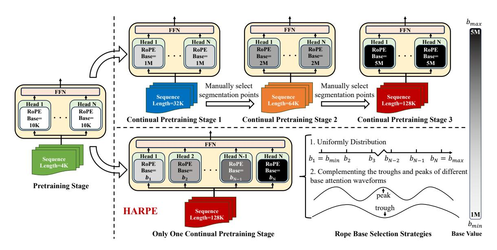
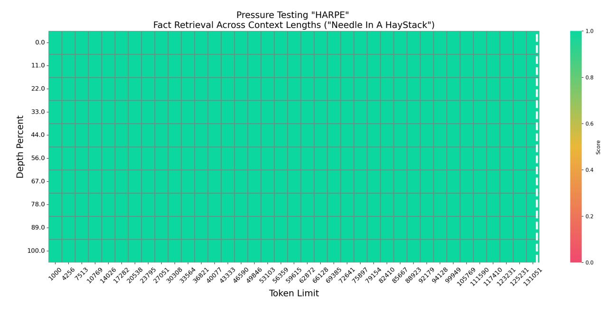

# Breaking the Stage Barrier: A Novel Single-Stage Approach to Long Context Extension for Large Language Models

Haoran Lian1\*, Junmin Chen2\*, Wei Huang4\*, Yizhe Xiong3\*, Wenping Hu2\*, Guiguang Ding3†, Hui Chen3, Jianwei Niu 1,5,6†, Zijia Lin2†, Fuzheng Zhang2, Di Zhang2

1Beihang University, 2Kuaishou Technology, 3Tsinghua University, 4BUPT, 5Zhongguancun Laboratory, 6Zhengzhou University

Correspondence†: niujianwei@buaa.edu.cn, dinggg@tsinghua.edu.cn, linzijia07@tsinghua.org.cn

#### **Abstract**

Recently, Large language models (LLMs) have revolutionized Natural Language Processing (NLP). Pretrained LLMs, due to limited training context size, struggle with handling long token sequences, limiting their performance on various downstream tasks. Current solutions toward long context modeling often employ multi-stage continual pertaining, which progressively increases the effective context length through several continual pretraining stages. However, those approaches require extensive manual tuning and human expertise. In this paper, we introduce a novel single-stage continual pretraining method, **H**ead-**A**daptive **R**otary Position Encoding (HARPE), to equip LLMs with long context modeling capabilities while simplifying the training process. Our HARPE leverages different Rotary Position Encoding (RoPE) base frequency values across different attention heads and directly trains LLMs on the target context length. Extensive experiments on 4 language modeling benchmarks, including the latest RULER benchmark, demonstrate that HARPE excels in understanding and integrating long-context tasks with single-stage training, matching and even outperforming existing multi-stage methods. Our results highlight that HARPE successfully breaks the stage barrier for training LLMs with long context modeling capabilities.

#### 1 Introduction

In recent years, generative Large Language Models (LLMs) (Brown, 2020; Raffel et al., 2020; Touvron et al., 2023a; Fu et al., 2023; Su et al., 2024b; Xiong et al., 2024; Lian et al., 2024b,a) have dominated the field of Natural Language Processing, outperforming traditional task-specific methods on many tasks, like text summarization (Liu and Lapata, 2019; Zaheer et al., 2020; Wu et al., 2021), information extraction (Wei et al., 2021, 2023b,a)

and question answering (Brown, 2020; Raffel et al., 2020). In the process of utilizing LLMs for downstream tasks, it is often necessary for the LLM to handle long token sequences. For example, when conducting text summarization with an LLM, the input sequence may include an entire book (Zhang et al., 2024a; Karpinska et al., 2024), which contains millions of words. To equip LLMs with the capability to handle long texts, current methods typically continually pretrain LLMs on a larger context window (Xiong et al., 2023; Peng et al., 2023; Fu et al., 2024a) compared to that in LLM pretraining. Given that Rotary Position Encoding (RoPE) (Su et al., 2024a) is the prevailing position encoding in most LLMs, among those methods, the mainstream approach is to increase the RoPE base frequency in the positional encoding during continual pretraining (Xiong et al., 2023), as studies have demonstrated that a larger base frequency is the prerequisite for handling longer text sequences (Liu et al., 2023; Men et al., 2024).

To achieve a large effective context size, existing works commonly employ a multi-stage approach, progressively increasing the context length through a series of continued pretraining steps. For instance, Large World Model (Liu et al., 2024c), GLM4-Chat-1M (ChatGLM, 2024), MiniCPM-2.4B-128K (Hu et al., 2024) and Llama 3.1 (Dubey et al., 2024) utilize multi-stage pipelines to reach context windows of 1M and 128k, respectively. This approach has become the dominant method in the community for equipping LLMs with long context capabilities.

Our single-stage experiments show that directly scaling a larger RoPE base in a single stage is less effective than using multi-stage approaches. This likely explains why most publicly available models employ multi-stage ABF (Adjusted Base Frequency) training. We hypothesize that direct scaling to the final training length without intermediate stages struggles to adapt to increased complexity, which is better managed through gradual, multi-

\*These authors contributed equally to this work.

| Metric    | Three-Stage ABF on LLaMA |                    |  |  |  |  |  |
|-----------|--------------------------|--------------------|--|--|--|--|--|
| Metric    | Uniform 2B Tokens        | Carefully Selected |  |  |  |  |  |
| NiaH      | 67.83                    | 81.36              |  |  |  |  |  |
| Benchmark | 62.59                    | 63.10              |  |  |  |  |  |

Table 1: Performance comparison of different continual pertaining pipelines when conducting three-stage ABF (Adjusted Base Frequency) (Xiong et al., 2023). For both pipelines, we report the average score of the Needle-in-a-Haystack task (6 lengths, 8 tasks) and on Short-Context Benchmarks (5 tasks). For more details on the experiment settings, please refer to Sec. 4.

stage adjustments.

Although multi-stage approaches have shown promising results, our experiments reveal that they require substantial manual tuning and human expertise to achieve good performance on long context modeling benchmarks. For instance, our results in Tab. 1 demonstrate that a carefully scheduled three-stage pipeline outperforms a naive approach by 13.5% on the NiaH benchmark, highlighting the limited generalizability of hyperparameters across different LLM sizes and architectures. Moreover, multi-stage training poses practical challenges due to varying data and resource requirements. This motivates the need for single-stage continual pretraining approaches. However, single-stage training also presents challenges, such as the risk of suboptimal outcomes when training with a much longer context window and larger RoPE base frequency, as shown in our experiments.

In this paper, we introduce a novel single-stage approach, termed Head-Adaptive Rotary Position Encoding (HARPE), designed to address the longcontext problem. Our goal is to achieve an effective context length comparable to that of multi-stage methods. Drawing inspiration from the finding that different attention heads can acquire distinct knowledge during training (Li et al., 2023), we propose to distribute the training of different stages across multiple attention heads concurrently. Specifically, we leverage RoPE (Su et al., 2024a) with varying base values to represent different effective context lengths, thereby simulating multiple training stages. By assigning different base values to different attention heads, we enable the LLMs to be trained in a single stage.

To determine the RoPE base values for each attention head, we employ a complementary approach, carefully selecting values that fill in the peaks and valleys of the sine and cosine waves in RoPE, thereby optimizing the experimental results. In contrast to existing methods, our proposed HARPE offers a significant advantage in terms of simplicity and efficiency. By pretraining LLMs in a single stage, we substantially streamline the process of data preparation and pipeline adjustment, eliminating the need for multiple stages and associated complexities.

We conduct a comprehensive evaluation of HARPE on 4 benchmarks, including the recently introduced RULER benchmark (Hsieh et al., 2024), to assess its effectiveness on both long-context and short-context tasks. The experimental results demonstrate that HARPE consistently matches or surpasses the performance of its multi-stage counterparts across all evaluated benchmarks. Notably, on the challenging Needle-in-a-haystack task, HARPE achieves a significant improvement of 5.46% over the multi-stage Adjused Base Frequency (ABF) (Xiong et al., 2023) approach, underscoring its exceptional capabilities in long-context modeling.

Unlike inference methods that employ multiple RoPE bases simultaneously to support long contexts (Zhang et al., 2024c; Chen et al., 2024b), our HARPE approach fundamentally alters the learning dynamics of LLMs during continual pretraining, enabling a straightforward and streamlined training pipeline. In summary, our contributions are threefold:

- We introduce a novel single-stage continual pretraining approach, termed Head-Adaptive Rotary Position Encoding (HARPE), to address the long context problem in LLMs. By doing so, we significantly simplify the process of data preparation and pipeline adjustment.
- To overcome the limitations of traditional multi-stage approaches, we propose a novel training strategy that distributes the training of different stages across multiple attention heads. We utilize different RoPE base values to represent distinct training stages and carefully select these values to complement the attention scores.
- We conduct a comprehensive evaluation of HARPE on 4 long context benchmarks, including the recently introduced RULER benchmark. Our experimental results demonstrate that HARPE consistently yields comparable or even better performance than existing

multi-stage methods across all benchmarks.

#### 2 Related Works

Large Language Models (LLMs). Language models are a type of statistical model that aims to maximize the likelihood token sequences (Touvron et al., 2023a). The Transformer architecture (Vaswani et al., 2017) marked a turning point in the evolution of language models, accelerating their development. Transformer-based models, like BERT (Devlin, 2018), GPT-2 (Radford et al., 2019), and T5 (Raffel et al., 2020), have achieved groundbreaking results across numerous natural language processing tasks. More recently, the release of GPT-4 (Achiam et al., 2023) has further pushed the boundaries of LLMs performance, showcasing exceptional capabilities. As these models continue to scale and evolve architecturally, they have become the driving force behind cutting-edge research in natural language processing, exhibiting notable adaptability and versatility across a wide range of applications (Liu et al., 2024a; Cai et al., 2024; ?). Consequently, LLMs have profoundly transformed human-computer interaction.

**Long Context Modeling.** Trained on relatively short context sequences (i.e., generally <10K tokens), open-source LLMs show dramatic performance drops on long context modeling (Touvron et al., 2023a; Bai et al., 2023; Liu et al., 2024a). Methods to improve the ability of LLMs to handle long context can be mainly divided into the following categories: attention mechanism optimizing, long-term memory caching, contexual processing, and positional encoding optimizing. Attention mechanism optimizing methods (Beltagy et al., 2020; Ma et al., 2021; Dao et al., 2022) reduce the computational and memory bottlenecks of the Transformer, thereby enabling the model to process longer text sequences. Long-term memory caching methods (Wang et al., 2024; Bulatov et al., 2022; Martins et al., 2020; Dai et al., 2019) utilize internal or external memory caches to fetch information in long context. Contextual processing methods (Ding et al., 2020; Izacard and Grave, 2020) process long context inputs by calling the model multiple times to process different parts of the long text sequence.

Apart from those methods, the most common approach is to improve the RoPE (Su et al., 2024a) while conducting continual pretraining with a longer context window. Specifically, Position Interpolation (PI) (Chen et al., 2023) reduces the

input position index to match the original context window size. ABF (Xiong et al., 2023) adjusts the RoPE base (i.e.,  $\theta$ ) to scale the low-frequency part more significantly, thereby dispersing the interpolation pressure to multiple dimensions. NTKby-parts interpolation (bloc97, 2023) interpolates RoPE bases according to the wavelength of different dimensions in RoPE relative to the context size: high-frequency dimensions are not interpolated, low-frequency dimensions are fully interpolated, and intermediate frequency dimensions are partially interpolated using a ramp function. YARN (Peng et al., 2023) combines the NTK-by-parts interpolation with the attention scaling technique to achieve an even longer effective context length. Self-Extend (Jin et al., 2024) constructs a two-layer attention mechanism, consisting of group attention and neighbor attention, to successfully expand the context window without additional training. Studies have also explored the construction (Chen et al., 2024a) and training strategies (Bai et al., 2024) of long context data.

While methods based on improving positional encoding have achieved promising experimental results (Liu et al., 2024c; He et al., 2024; Zhang et al., 2024b), they typically rely on complicated multi-stage training pipelines to gradually increase the effective context length(e.g.,  $8k \rightarrow 16k \rightarrow 32k \ldots \rightarrow 128k$ ). In contrast, our proposed HARPE offers a simplified *single-stage* continual pretraining approach. Experimental results demonstrate that our HARPE achieves comparable performance to existing multi-stage methods.

# 3 Head-Adaptive Rotary Position Encoding based Approach

In this section, we first revist the formulation of Rotary Position Encoding (RoPE) in Sec. 3.1. We then present the proposed HARPE in Sec. 3.2, detailing its multi-head RoPE base mechanism and base selection strategies.

#### 3.1 Preliminaries

RoPE (Su et al., 2024a) is a widely adopted technique for position encoding in LLMs built on the Transformer architecture (GLM et al., 2024; Liu et al., 2024a; Yang et al., 2023; Dubey et al., 2024). The primary objective of RoPE is to encode positional information in a way that the inner product of the query and key embeddings inherently captures the relative position information, which can

Figure 1: Illustration of the multi-stage and our proposed single-stage (HARPE) continual pretraining pipeline.

be formally expressed as:

$$f(q_m, m)^T f(k_n, n) = g(q_m, k_n, m - n)$$
 (1)

Here, f represents the positional encoding function applied to the query embeddings  $q_m$  at position m and key embeddings  $k_n$  at position n. To satisfy this condition, the function f is defined as a d-dimensional rotation matrix, denoted as  $\mathbf{R}_{\Theta,m}^d$ :

$$f(x_{\{q,k\}}, m) = \mathbf{R}_{\Theta, m}^d x_{\{q,k\}}$$
 (2)

where

$$\mathbf{R}_{\Theta,m}^d = \operatorname{diag}\left(\mathbf{R}(m\theta_1), \dots, \mathbf{R}(m\theta_{d/2})\right)$$
 (3)

$$\mathbf{R}(m\theta_i) = \begin{pmatrix} \cos m\theta_i & -\sin m\theta_i \\ \sin m\theta_i & \cos m\theta_i \end{pmatrix} \tag{4}$$

$$\Theta = \{\theta_i = b^{-2(i-1)/d}, i \in [1, 2, \dots, d/2]\}$$
 (5)

These formulas indicate that the rotation angle  $\Theta$  can be adjusted by modifying the base frequency b. Specifically, increasing b (i.e., decreasing  $\Theta$ ) mitigates the severe decaying effect of RoPE on attention scores for distant tokens, thereby enabling LLMs to process longer input sequences (Xiong et al., 2023).

#### 3.2 HARPE

As illustrated in Fig. 1, HARPE leverages the diverse capabilities of each attention head by predefining a base set B, where the cardinality of B is equal to the number of attention heads. Specifically, HARPE assigns a unique base  $b_h$  from B to

the RoPE in each attention head h. For head h,  $\Theta$  in Eq. 5 is defined as:

$$\Theta_h = \{\theta_{h,i} = b_h^{-2(i-1)/d}, i \in [1, \dots, d/2]\}$$
 (6)

then

$$\mathbf{R}_{\Theta_h,m}^d = \operatorname{diag}\left(\mathbf{R}(m\theta_{h,i})\right)$$
 (7)

$$\mathbf{R}(m\theta_{h,i}) = \begin{pmatrix} \cos m\theta_{h,i} & -\sin m\theta_{h,i} \\ \sin m\theta_{h,i} & \cos m\theta_{h,i} \end{pmatrix}$$
(8)

To determine the base set B, we establish two distinct RoPE base selection strategies.

The first strategy involves uniformly distributing the bases  $B_{uniform}$  within a predefined range, bounded by a maximum base  $b_{max}$  and a minimum base  $b_{min}$ .

$$B_{uniform} = \{b_h = b_{min} + h \times \frac{b_{max} - b_{min}}{N - 1}\}$$
 (9)

where 
$$h = 0, 1, ..., N - 1$$
.

The second strategy adopts the search method proposed by (Chen et al., 2024b), which seeks to ensure that the attention waveform valleys of any given base overlap with peaks from different bases, and vice versa. To achieve this, a candidate base set  $B_c$  is initially generated by discretizing the range between  $b_{max}$  and  $b_{min}$  with a relatively small stride s.

$$B_c = \{b_{\min} + i \times s, i \in [1, \frac{b_{\max} - b_{\min}}{s}]\}$$
 (10)

# **Algorithm 1** The searching algorithm of $B_s$

**Require:** A candidate base set  $B_c$ 

- 1: Define a function  $f_p(b) \mapsto \text{peak positions in}$ attention waveforms corresponding to base b
- 2: Define a function  $f_v(b) \mapsto$  valley positions in attention waveforms corresponding to base b
- 3: Initialize the searched base set  $B_s \leftarrow \{b_{min}\}$
- 4:  $P_s \leftarrow f_p(b_{min}); V_s \leftarrow f_v(b_{min})$
- 5: while  $|B_s| < N$  do
- for  $b_i$  in  $B_c$  do

7: 
$$P_j \leftarrow J_p(o_j); V_j \leftarrow J_v(o_j)$$
  
8:  $d_j^+ \leftarrow \sum_{\substack{p_{j,i} \in P_j \\ v_{o,i} \in V_o}} |p_{j,i} - v_{s,i}|$ 

7: 
$$P_{j} \leftarrow f_{p}(b_{j}); V_{j} \leftarrow f_{v}(b_{j})$$
8:  $d_{j}^{+} \leftarrow \sum_{p_{j,i} \in P_{j}} |p_{j,i} - v_{s,i}|$ 
 $v_{s,i} \in V_{s}$ 

9:  $d_{j}^{-} \leftarrow \sum_{v_{j,i} \in V_{j}} |v_{j,i} - p_{s,i}|$ 
 $p_{s,i} \in P_{s}$ 

10:  $d_{j} \leftarrow d_{j}^{+} + d_{j}^{-}$ 

- 10:
- 11:
- $B_s \leftarrow B_s \cup \{b_i' \text{ with the minimum } d_j\}$ 12:
- $P_s \leftarrow P_s \cup f_p(b_i'); V_s \leftarrow V_s \cup f_v(b_i')$
- 14: end while
- 15: **return**  $B_s$

|      |      | 1    |      | 1    | _    |      |      |
|------|------|------|------|------|------|------|------|
| Head | Base | Head | Base | Head | Base | Head | Base |
| 1    | 1.00 | 9    | 2.50 | 17   | 3.01 | 25   | 3.61 |
| 2    | 1.15 | 10   | 2.65 | 18   | 3.04 | 26   | 3.88 |
| 3    | 1.30 | 11   | 2.68 | 19   | 3.10 | 27   | 4.09 |
| 4    | 1.45 | 12   | 2.71 | 20   | 3.13 | 28   | 4.15 |
| 5    | 2.17 | 13   | 2.74 | 21   | 3.16 | 29   | 4.39 |
| 6    | 2.20 | 14   | 2.80 | 22   | 3.22 | 30   | 4.45 |
| 7    | 2.23 | 15   | 2.83 | 23   | 3.43 | 31   | 4.51 |
| 8    | 2.47 | 16   | 2.92 | 24   | 3.46 | 32   | 4.54 |

Table 2: RoPE base frequency settings for each head in HARPE, with each base value expressed in millions  $(\times 10^6)$ , and stride of 30k.

Subsequently, the final searched base set  $B_s$  is determined by iteratively complementing the valleys and peaks of attention waveforms of different bases within  $B_c$ , as shown in Algorithm 1.

## **Experimental Setup**

We select LLama2-7B-Base (Touvron et al., 2023b) as our base model, which is configured with a RoPE base frequency of 10k and a context length of 4k.

#### Baseline Systems 4.1

We compare HARPE with 4 continual pretraining methods and one training-free method.

PI (Chen et al., 2023) employs a linear downscaling of the input position indices to match the original context window size, thereby avoiding

| Method           | <b>Proof-pile</b> | GovReport |
|------------------|-------------------|-----------|
| Llama2-7B-Base   | 4336.96           | 7289.38   |
| PI               | 20.73             | 11.47     |
| ABF Single-Stage | 3.06              | 3.58      |
| ABF Multi-Stage  | 3.03              | 3.57      |
| YaRN             | 4.53              | 4.52      |
| Self-Extend*     | 5.45              | 3.76      |
| HARPE(ours)      | 3.02              | 3.54      |

Table 3: Sliding window perplexity (S = 256) for **Proof**pile and GovReport documents. Asterisks (\*) denote the training-free method. Lower perplexity values indicate better model performance.

extrapolation beyond the trained context length, which can lead to catastrophically high attention scores that compromise the self-attention mechanism. The interpolation scale is set to 32 =128k/4k.

ABF Single-Stage (Xiong et al., 2023) implements a minimal yet necessary modification to the RoPE positional encoding for long-context modeling: increasing the hyperparameter "base frequency" b to 5m (i.e., decreasing the rotation angle), which mitigates the decaying effect of RoPE for distant tokens. Concurrently, the input sequence length is increased to 128k.

ABF Multi-Stage also increases the base and input sequence length, but with a key difference: it does so in a gradual, multi-stage manner. Specifically, we divide the process into three stages: (1)b = 1m; l = 32k, (2)b = 2m; l = 64k, and(3)b = 5m; l = 128k.

YaRN (Peng et al., 2023) utilizes the RoPE formula Eq. (5) to distinguish between high-frequency and low-frequency positional components. It adjusts the base within a 64-dimensional space according to these frequency components, applying a scale factor of 32.

**Self-Extend** (Jin et al., 2024) is a training-free method. We apply it with  $window\_size = 1024$ and  $group\_size = 32$ .

#### HARPE Base Setting

We adopt the second strategy (i.e.,the peak-valley search method) mentioned in Sec. 3.2. We set  $b_{min} = 1m; b_{max} = 5m; s = 30k$ . The final bases are shown in Tab. 2. And we will discuss other base settings in Sec. 5.2.

Figure 2: **Traditional Single-Key Needle-in-a-Haystack**: the x-axis represents the number of tokens in the test sample, ranging up to 128k tokens with finer granularity. The y-axis shows the depth of the needle's position within the current test sample.

| Method           | 4k    | 8k    | 16k   | 32k   | 64k   | 128k  | Avg.                          |
|------------------|-------|-------|-------|-------|-------|-------|-------------------------------|
| Llama2-7B-Base   | 90.90 | -     | -     | -     | -     | -     | -                             |
| PI               | 77.56 | 26.59 | 16.50 | 0.00  | 0.00  | 0.00  | 20.11                         |
| ABF Single-Stage | 92.44 | 88.78 | 84.16 | 78.03 | 70.81 | 62.72 | $79.49_{(3rd)}$               |
| ABF Multi-Stage  | 95.19 | 91.72 | 87.53 | 78.84 | 72.78 | 62.13 | 81.36 (2nd)        |
| YaRN             | 83.88 | 73.66 | 64.84 | 46.53 | 12.69 | 0.00  | 46.93                         |
| Self-Extend*     | 76.47 | 66.25 | 58.84 | 52.16 | 1.38  | 0.00  | 42.52                         |
| HARPE(ours)      | 97.03 | 96.88 | 93.72 | 86.66 | 79.41 | 67.19 | <b>86.82</b> (1st) |

Table 4: **Upgraded Needle-in-a-Haystack Tests**: Average scores for 8 NiaH tasks at various lengths. Asterisks (\*) denote training-free methods.

#### 4.3 Evaluation Metric

Perplexity (PPL) is evaluated on the Proof-pile (Zhangir Azerbayev, 2022) and GovReport (Huang et al., 2021) datasets. Following the setup in Yarn, for the Proof-pile dataset, we selected samples with a minimum of 128k tokens and measured perplexity for token lengths ranging from 2k to 128k in increments of 2k, averaging the scores for each length. For the GovReport dataset, we reported the average PPL scores for samples with a context window of 32k tokens. Evaluations are conducted using the sliding window method proposed by Press (Press et al., 2021), with a window size of 256 tokens.

Needle-in-a-Haystack is a task that assesses a

model's ability to accurately locate and recite a specific sentence, referred to as the "needle", within a lengthy document, known as the "haystack". To provide a more comprehensive evaluation of a model's long-context capabilities, we extend this method, inspired by RULER (Hsieh et al., 2024), to include multi-key, multi-value and multi-query scenarios, as well as diverse types of needles and background documents in each scenario. A multi-key task involves multiple keys, similar to 'the needle', in the background, where the model must find the target needle among the distractions. In a multi-value task, multiple needles are inserted in haystack, and the model earns one point for each correct needle found.

| Method    | ABF Single-Stage | ABF Multi-Stage | HARPE (Ours) |
|-----------|---------------------|--------------------|-----------------|
| MMLU      | 40.87               | 41.10              | 40.74           |
| Hellaswag | 77.33               | 77.83              | 77.99           |
| ARC-c     | 52.82               | 52.65              | 52.73           |
| PIQA      | 78.56               | 78.56              | 78.56           |
| TriviaQA  | 62.39               | 63.29              | 63.72           |
| Avg.      | 62.39               | 62.69              | 62.75           |

Table 5: **Short-Context Benchmark Results**: Evaluation Results of the Top 3 Long-Context-Performance Models on 5 Short-Context Datasets.

Short-Context Benchmarks assess whether short-context capabilities are preserved during long-context training. We include five widely used short-context evaluation datasets: 5-shot MMLU (Hendrycks et al., 2020), 10-shot Hellaswag (Zellers et al., 2019), 25-shot ARC-Challenge (Clark et al., 2018), 0-shot PiQA (Bisk et al., 2019), and 5-shot TriviaQA (Joshi et al., 2017).

#### 4.4 Training Configuration

For continual pretraining, we follow the configurations outlined in (Fu et al., 2024b), utilizing the upsampling dataset from (Yaofu, 2023b). We employ the Llama2-7B-Base model as the pre-trained backbone, with a learning rate of  $2e^{-5}$  and AdamW optimizer settings of  $\beta_1=0.9$  and  $\beta_2=0.95$ . All models were continually pre-trained with 6B tokens using these consistent settings.

#### 5 Experimental Results

#### **5.1** HARPE vs. Baseline Systems

We utilize HARPE to conduct a comparative evaluation with the five long-context methods outlined in Sec. 4.1, employing three evaluation metrics as detailed in Sec. 4.3.

First, to evaluate the long context modeling capability of HARPE, we evaluate HARPE and the competing methods with the PPL metric. As shown in Tab. 3, on the tested Proof-pile and GovReport datasets, our HARPE achieves comparable or even better results compared to the state-of-the-art multistage methods and various single-stage methods. This indicates that the proposed HARPE has the capability to handle long text sequences.

Furthermore, we employ the upgraded Needle-in-a-Haystack test, as defined in the RULER benchmark (Hsieh et al., 2024), to evaluate the long-context relationship capturing performance of

HARPE and its competitors. As shown in Tab. 4, HARPE significantly outperforms all listed methods. Notably, HARPE proves more effective than multi-stage approaches, surpassing the multi-stage ABF by 5.5%. While typical single-stage methods, such as YARN and PI, fail as the context length increases, HARPE successfully extends the effective context length to 128K tokens. More details on the NiaH results, including scores for each of the 8 NiaH tasks (e.g., multi-key and multi-value), are provided in the Appendix Tab. 8. Simultaneously, we evaluate traditional NiaH tasks at a finer granularity, following the code in (Liu et al., 2024b). As shown in Fig. 2, HARPE achieves a 100% accuracy rate across various lengths within 128k tokens.

We also evaluate HARPE on the short-context benchmarks. Results in Tab. 5 show that HARPE also yields comparable or even slightly better performance than competing methods in terms of average accuracy across 5 short-context tasks.

#### 5.2 Study of Various Base Schemes

In this section, we evaluate the performance of two base selection methods for the head-specific RoPE bases in HARPE: uniform distribution and peak-valley opposition. For the uniform distribution method, we conduct two experiments with uniform ascending and descending intervals to analyze the impact of different base orders on model performance. For the peak-valley opposition method, as described in algorithm 1 and Eq. (10), we test five variations with different base strides (10k, 20k, 30k, 40k, 50k) to further explore their effects.

The results of various HARPE configurations, along with the original LLaMA2 model, on the upgraded Needle-in-a-Haystack test are presented in Tab. 6. Under different RoPE base settings, our HARPE consistently outperforms the original LLaMA2-7B-Base model. Among the two methods evaluated, the peak-valley opposition approach with stride = 30k demonstrates the best performance, surpassing the next closest competitor by 1.25%. As a result, we adopt the peak-valley approach with a stride of 30k for HARPE.

# **5.3** Comparative Results on RULER Evaluation

In this section, we evaluate HARPE against various open-source pre-trained models on a range of long-context tasks using the RULER benchmark. RULER is a comprehensive and widely recognized standard for long-context evaluation, comprising

| Method          | Model            | 4k    | 8k    | 16k   | 32k   | 64k   | 128k  | Avg.                   |
|-----------------|------------------|-------|-------|-------|-------|-------|-------|------------------------|
| RoPE            | Llama2-7B-Base   | 90.9  | -     | -     | -     | -     | -     | -                      |
|                 | stride = 10k     | 96.38 | 96.38 | 88.97 | 84.09 | 76.00 | 65.22 | 84.51                  |
| complementarity | stride = 20k     | 96.97 | 96.78 | 91.69 | 85.97 | 74.44 | 67.59 | 85.57 (2nd) |
| peak&valley     | stride = 30k     | 97.03 | 96.88 | 93.72 | 86.66 | 79.41 | 67.19 | 86.82 (1st) |
|                 | stride = 40k     | 96.84 | 96.09 | 91.13 | 83.13 | 75.94 | 65.00 | 84.69                  |
|                 | stride = 50k     | 92.75 | 92.4  | 87.31 | 83.97 | 75.31 | 70.34 | 83.68                  |
|                 | ascending order  | 96.53 | 95.13 | 89.22 | 84.72 | 74.31 | 65.88 | 84.30                  |
| same stride     | descending order | 96.50 | 95.22 | 91.91 | 87.16 | 76.31 | 64.69 | 85.30 (3rd) |

Table 6: **Upgraded Needle-in-a-Haystack Results of HARPE**: Comparison of different base selection schemes in HARPE models.

| Size | 4k                                            | 8k                                                                                          | 16k                                                                                                                                                                                                                       | 32k                                                                                                                                                                                                                                                                                                | 64k                                                                                                                                                                                                                                                                                                                                                                         | 128k                                                                                                                                                                                                                                                                                                                                                                                                                                                  | Avg.                                                                                                                                                                                                                                                                                                                                                                                                                                                                                                                        |
|------|-----------------------------------------------|---------------------------------------------------------------------------------------------|---------------------------------------------------------------------------------------------------------------------------------------------------------------------------------------------------------------------------|----------------------------------------------------------------------------------------------------------------------------------------------------------------------------------------------------------------------------------------------------------------------------------------------------|-----------------------------------------------------------------------------------------------------------------------------------------------------------------------------------------------------------------------------------------------------------------------------------------------------------------------------------------------------------------------------|-------------------------------------------------------------------------------------------------------------------------------------------------------------------------------------------------------------------------------------------------------------------------------------------------------------------------------------------------------------------------------------------------------------------------------------------------------|-----------------------------------------------------------------------------------------------------------------------------------------------------------------------------------------------------------------------------------------------------------------------------------------------------------------------------------------------------------------------------------------------------------------------------------------------------------------------------------------------------------------------------|
| 52B  | 81.20                                         | 75.4                                                                                        | 68.8                                                                                                                                                                                                                      | 65.3                                                                                                                                                                                                                                                                                               | 61.00                                                                                                                                                                                                                                                                                                                                                                       | 51.4                                                                                                                                                                                                                                                                                                                                                                                                                                                  | 67.18                                                                                                                                                                                                                                                                                                                                                                                                                                                                                                                       |
| 7B   | 91.60                                         | 89.80                                                                                       | 86.30                                                                                                                                                                                                                     | 77.20                                                                                                                                                                                                                                                                                              | 52.30                                                                                                                                                                                                                                                                                                                                                                       | 8.00                                                                                                                                                                                                                                                                                                                                                                                                                                                  | 67.50                                                                                                                                                                                                                                                                                                                                                                                                                                                                                                                       |
| 7B   | 79.4                                          | -                                                                                           | -                                                                                                                                                                                                                         | -                                                                                                                                                                                                                                                                                                  | -                                                                                                                                                                                                                                                                                                                                                                           | -                                                                                                                                                                                                                                                                                                                                                                                                                                                     | -                                                                                                                                                                                                                                                                                                                                                                                                                                                                                                                           |
| 7B   | 84.6                                          | 78.7                                                                                        | 68.3                                                                                                                                                                                                                      | 57.9                                                                                                                                                                                                                                                                                               | 0.0                                                                                                                                                                                                                                                                                                                                                                         | 0.0                                                                                                                                                                                                                                                                                                                                                                                                                                                   | 48.25                                                                                                                                                                                                                                                                                                                                                                                                                                                                                                                       |
| 7B   | 77.30                                         | 67.50                                                                                       | 59.00                                                                                                                                                                                                                     | 47.30                                                                                                                                                                                                                                                                                              | 38.60                                                                                                                                                                                                                                                                                                                                                                       | 13.90                                                                                                                                                                                                                                                                                                                                                                                                                                                 | 50.60                                                                                                                                                                                                                                                                                                                                                                                                                                                                                                                       |
| 7B   | 81.90                                         | 80.4                                                                                        | 75.6                                                                                                                                                                                                                      | 65.1                                                                                                                                                                                                                                                                                               | 60.80                                                                                                                                                                                                                                                                                                                                                                       | 0.0                                                                                                                                                                                                                                                                                                                                                                                                                                                   | 60.63                                                                                                                                                                                                                                                                                                                                                                                                                                                                                                                       |
| 7B   | 77.50                                         | 74.00                                                                                       | 69.60                                                                                                                                                                                                                     | 64.60                                                                                                                                                                                                                                                                                              | 61.30                                                                                                                                                                                                                                                                                                                                                                       | 59.00                                                                                                                                                                                                                                                                                                                                                                                                                                                 | 67.67 (3rd)                                                                                                                                                                                                                                                                                                                                                                                                                                                                                                      |
| 7B   | 87.95                                         | 80.68                                                                                       | 72.70                                                                                                                                                                                                                     | 63.47                                                                                                                                                                                                                                                                                              | 54.62                                                                                                                                                                                                                                                                                                                                                                       | 47.65                                                                                                                                                                                                                                                                                                                                                                                                                                                 | 67.85 (2nd)                                                                                                                                                                                                                                                                                                                                                                                                                                                                                                      |
| 7B   | 88.48                                         | 83.44                                                                                       | 74.87                                                                                                                                                                                                                     | 68.10                                                                                                                                                                                                                                                                                              | 55.64                                                                                                                                                                                                                                                                                                                                                                       | 51.88                                                                                                                                                                                                                                                                                                                                                                                                                                                 | 70.40 (1st)                                                                                                                                                                                                                                                                                                                                                                                                                                                                                                      |
|      | 52B 7B 7B 7B 7B 7B 7B 7B | 52B 81.20 7B 91.60 7B 79.4 7B 84.6 7B 77.30 7B 81.90 7B 77.50 7B 87.95 | 52B     81.20     75.4       7B     91.60     89.80       7B     79.4     -       7B     84.6     78.7       7B     77.30     67.50       7B     81.90     80.4       7B     77.50     74.00       7B     87.95     80.68 | 52B     81.20     75.4     68.8       7B     91.60     89.80     86.30       7B     79.4     -     -       7B     84.6     78.7     68.3       7B     77.30     67.50     59.00       7B     81.90     80.4     75.6       7B     77.50     74.00     69.60       7B     87.95     80.68     72.70 | 52B     81.20     75.4     68.8     65.3       7B     91.60     89.80     86.30     77.20       7B     79.4     -     -     -       7B     84.6     78.7     68.3     57.9       7B     77.30     67.50     59.00     47.30       7B     81.90     80.4     75.6     65.1       7B     77.50     74.00     69.60     64.60       7B     87.95     80.68     72.70     63.47 | 52B     81.20     75.4     68.8     65.3     61.00       7B     91.60     89.80     86.30     77.20     52.30       7B     79.4     -     -     -     -       7B     84.6     78.7     68.3     57.9     0.0       7B     77.30     67.50     59.00     47.30     38.60       7B     81.90     80.4     75.6     65.1     60.80       7B     77.50     74.00     69.60     64.60     61.30       7B     87.95     80.68     72.70     63.47     54.62 | 52B     81.20     75.4     68.8     65.3     61.00     51.4       7B     91.60     89.80     86.30     77.20     52.30     8.00       7B     79.4     -     -     -     -     -       7B     84.6     78.7     68.3     57.9     0.0     0.0       7B     77.30     67.50     59.00     47.30     38.60     13.90       7B     81.90     80.4     75.6     65.1     60.80     0.0       7B     77.50     74.00     69.60     64.60     61.30     59.00       7B     87.95     80.68     72.70     63.47     54.62     47.65 |

Table 7: **RULER Benchmark Results**: Comparison of HARPE and Open-Source Base Models Across All Lengths for 13 RULER Tasks.

13 tasks that include "needle in a haystack" as well as additional tasks such as Variable Tracing, Aggregation Ability, and Question Answering.

As shown in Tab. 7, our comparison in 10 base models primarily involves 7B models, along with model using other architecture such as Jamba. HARPE surpasses all LLaMA2-based models and ranks 1st overall, surpassing the 2nd by 2.55%. Notably, HARPE demonstrates a significant advantage in shorter context performance compared to the multi-stage ABF-trained LWM with a 1M fine-tuning length. Furthermore, HARPE consistently outperforms the YaRN model with a 128k fine-tuning length, achieving an average improvement of nearly 20 points across various lengths. Additionally, when compared to the llama-2-7b-80k model, which has the same training parameters and dataset but a shorter fine-tuning length of 80k, HARPE still shows superior performance in shorter context tasks with lengths less than 32k.

### 6 Conclusion

In this paper, we present a novel single-stage continual pretraining method, HARPE, to enhance the long-context modeling capabilities of LLMs. Specifically, our HARPE distributes the different training stages across different attention heads, and assigns different base values in the RoPE for different attention heads during continual pretraining stage. Experimental results across 4 benchmarks demonstrate that HARPE outperforming or matching existing multi-stage methods in long-context modeling tasks, while maintaining comparable performance on short-context tasks. In practical applications, our HARPE breaks the stage barrier, offering a simplified pipeline with minimal manual tuning and expertise, thereby streamlining the process of equipping LLMs with long-context capabilities.

#### 7 Limitations

Despite that HARPE demonstrates promising results on benchmarks with long context lengths,

limitation still remains. Our research is primarily concentrated on the continual pretraining stage, leaving its applicability to other stages, such as supervised fine-tuning, unexplored. We will address those limitations in our future research.

# Acknowledgment

This work was supported in part by National Key R&D Program of China under Grant No. 2023YFB4503700, National Natural Science Foundation of China under Grant No. 62372027, U23B2025, Beijing Natural Science Foundation (L247026).

#### References

- Josh Achiam, Steven Adler, Sandhini Agarwal, Lama Ahmad, Ilge Akkaya, Florencia Leoni Aleman, Diogo Almeida, Janko Altenschmidt, Sam Altman, Shyamal Anadkat, et al. 2023. Gpt-4 technical report. arXiv preprint arXiv:2303.08774.
- AI21. 2024. Introducing jamba: Ai21's groundbreaking ssm-transformer model. https://www.ai21.com/blog/announcing-jamba. Accessed: 2024-08-31.
- Jinze Bai, Shuai Bai, Yunfei Chu, Zeyu Cui, Kai Dang, Xiaodong Deng, Yang Fan, Wenbin Ge, Yu Han, Fei Huang, et al. 2023. Qwen technical report. *arXiv* preprint arXiv:2309.16609.
- Yushi Bai, Xin Lv, Jiajie Zhang, Yuze He, Ji Qi, Lei Hou, Jie Tang, Yuxiao Dong, and Juanzi Li. 2024. Longalign: A recipe for long context alignment of large language models. *arXiv preprint arXiv:2401.18058*.
- Iz Beltagy, Matthew E Peters, and Arman Cohan. 2020. Longformer: The long-document transformer. *arXiv* preprint arXiv:2004.05150.
- Yonatan Bisk, Rowan Zellers, Ronan Le Bras, Jianfeng Gao, and Yejin Choi. 2019. Piqa: Reasoning about physical commonsense in natural language.
- bloc97. 2023. Add ntk-aware interpolation "by parts" correction. Accessed: 2023.
- Tom B Brown. 2020. Language models are few-shot learners. *arXiv preprint arXiv:2005.14165*.
- Aydar Bulatov, Yury Kuratov, and Mikhail Burtsev. 2022. Recurrent memory transformer. *Advances in Neural Information Processing Systems*, 35:11079–11091.
- Zheng Cai, Maosong Cao, Haojiong Chen, Kai Chen, Keyu Chen, Xin Chen, Xun Chen, Zehui Chen, Zhi Chen, Pei Chu, et al. 2024. Internlm2 technical report. *arXiv preprint arXiv:2403.17297*.
- ChatGLM. 2024. Glm: Long scaling pre-trained model contexts to millions. Accessed: 2024-09-14.

- Longze Chen, Ziqiang Liu, Wanwei He, Yunshui Li, Run Luo, and Min Yang. 2024a. Long context is not long at all: A prospector of long-dependency data for large language models. *arXiv preprint arXiv:2405.17915*.
- Shouyuan Chen, Sherman Wong, Liangjian Chen, and Yuandong Tian. 2023. Extending context window of large language models via positional interpolation. *arXiv preprint arXiv:2306.15595*.
- Yuhan Chen, Ang Lv, Ting-En Lin, Changyu Chen, Yuchuan Wu, Fei Huang, Yongbin Li, and Rui Yan. 2024b. Fortify the shortest stave in attention: Enhancing context awareness of large language models for effective tool use. In *Proceedings of the 62nd Annual Meeting of the Association for Computational Linguistics (Volume 1: Long Papers)*, pages 11160–11174.
- Yukang Chen, Shengju Qian, Haotian Tang, Xin Lai, Zhijian Liu, Song Han, and Jiaya Jia. 2024c. Longlora: Efficient fine-tuning of long-context large language models. In *Proceedings of the International Conference on Learning Representations (ICLR)*.
- Peter Clark, Isaac Cowhey, Oren Etzioni, Tushar Khot, Ashish Sabharwal, Carissa Schoenick, and Oyvind Tafjord. 2018. Think you have solved question answering? try arc, the ai2 reasoning challenge.
- Zihang Dai, Zhilin Yang, Yiming Yang, Jaime Carbonell, Quoc V Le, and Ruslan Salakhutdinov. 2019. Transformer-xl: Attentive language models beyond a fixed-length context. *arXiv preprint arXiv:1901.02860*.
- Tri Dao, Dan Fu, Stefano Ermon, Atri Rudra, and Christopher Ré. 2022. Flashattention: Fast and memory-efficient exact attention with io-awareness. *Advances in Neural Information Processing Systems*, 35:16344–16359.
- Jacob Devlin. 2018. Bert: Pre-training of deep bidirectional transformers for language understanding. arXiv preprint arXiv:1810.04805.
- Ming Ding, Chang Zhou, Hongxia Yang, and Jie Tang. 2020. Cogltx: Applying bert to long texts. *Advances in Neural Information Processing Systems*, 33:12792–12804.
- Abhimanyu Dubey, Abhinav Jauhri, Abhinav Pandey, Abhishek Kadian, Ahmad Al-Dahle, Aiesha Letman, Akhil Mathur, Alan Schelten, Amy Yang, Angela Fan, et al. 2024. The llama 3 herd of models. *arXiv* preprint arXiv:2407.21783.
- Jiayi Fu, Lei Lin, Xiaoyang Gao, Pengli Liu, Zhengzong Chen, Zhirui Yang, Shengnan Zhang, Xue Zheng, Yan Li, Yuliang Liu, et al. 2023. Kwaiyiimath: Technical report. *arXiv preprint arXiv:2310.07488*.
- Yao Fu, Rameswar Panda, Xinyao Niu, Xiang Yue, Hannaneh Hajishirzi, Yoon Kim, and Hao Peng. 2024a. Data engineering for scaling language models to 128k context. *arXiv preprint arXiv:2402.10171*.

- Yao Fu, Rameswar Panda, Xinyao Niu, Xiang Yue, Hannaneh Hajishirzi, Yoon Kim, and Hao Peng. 2024b. Data engineering for scaling language models to 128k context.
- Team GLM, Aohan Zeng, Bin Xu, Bowen Wang, Chenhui Zhang, Da Yin, Diego Rojas, Guanyu Feng, Hanlin Zhao, Hanyu Lai, et al. 2024. Chatglm: A family of large language models from glm-130b to glm-4 all tools. *arXiv preprint arXiv:2406.12793*.
- Junqing He, Kunhao Pan, Xiaoqun Dong, Zhuoyang Song, LiuYiBo LiuYiBo, Qianguosun Qianguosun, Yuxin Liang, Hao Wang, Enming Zhang, and Jiaxing Zhang. 2024. Never lost in the middle: Mastering long-context question answering with positionagnostic decompositional training. In *Proceedings of the 62nd Annual Meeting of the Association for Computational Linguistics (Volume 1: Long Papers)*, pages 13628–13642.
- Dan Hendrycks, Collin Burns, Steven Basart, Andy Zou, Mantas Mazeika, Dawn Song, and Jacob Steinhardt. 2020. Measuring massive multitask language understanding.
- Cheng-Ping Hsieh, Simeng Sun, Samuel Kriman, Shantanu Acharya, Dima Rekesh, Fei Jia, and Boris Ginsburg. 2024. Ruler: What's the real context size of your long-context language models? *arXiv preprint arXiv:2404.06654*.
- Shengding Hu, Yuge Tu, Xu Han, Chaoqun He, Ganqu Cui, Xiang Long, Zhi Zheng, Yewei Fang, Yuxiang Huang, Weilin Zhao, Xinrong Zhang, Zheng Leng Thai, Kaihuo Zhang, Chongyi Wang, Yuan Yao, Chenyang Zhao, Jie Zhou, Jie Cai, Zhongwu Zhai, Ning Ding, Chao Jia, Guoyang Zeng, Dahai Li, Zhiyuan Liu, and Maosong Sun. 2024. Minicpm: Unveiling the potential of small language models with scalable training strategies.
- Luyang Huang, Shuyang Cao, Nikolaus Parulian, Heng Ji, and Lu Wang. 2021. Efficient attentions for long document summarization. *arXiv preprint arXiv:2104.02112*.
- Gautier Izacard and Edouard Grave. 2020. Leveraging passage retrieval with generative models for open domain question answering. *arXiv* preprint *arXiv*:2007.01282.
- Hongye Jin, Xiaotian Han, Jingfeng Yang, Zhimeng Jiang, Zirui Liu, Chia-Yuan Chang, Huiyuan Chen, and Xia Hu. 2024. Llm maybe longlm: Self-extend llm context window without tuning. *arXiv preprint arXiv:2401.01325*.
- Mandar Joshi, Eunsol Choi, Daniel S. Weld, and Luke Zettlemoyer. 2017. Triviaqa: A large scale distantly supervised challenge dataset for reading comprehension.
- Marzena Karpinska, Katherine Thai, Kyle Lo, Tanya Goyal, and Mohit Iyyer. 2024. One thousand and one pairs: A" novel" challenge for long-context language models. *arXiv preprint arXiv:2406.16264*.

- Shanda Li, Chong You, Guru Guruganesh, Joshua Ainslie, Santiago Ontanon, Manzil Zaheer, Sumit Sanghai, Yiming Yang, Sanjiv Kumar, and Srinadh Bhojanapalli. 2023. Functional interpolation for relative positions improves long context transformers. arXiv preprint arXiv:2310.04418.
- Haoran Lian, Yizhe Xiong, Zijia Lin, Jianwei Niu, Shasha Mo, Hui Chen, Peng Liu, and Guiguang Ding. 2024a. Lbpe: Long-token-first tokenization to improve large language models. *arXiv preprint arXiv:2411.05504*.
- Haoran Lian, Yizhe Xiong, Jianwei Niu, Shasha Mo, Zhenpeng Su, Zijia Lin, Peng Liu, Hui Chen, and Guiguang Ding. 2024b. Scaffold-bpe: Enhancing byte pair encoding with simple and effective scaffold token removal. *arXiv preprint arXiv:2404.17808*.
- Aixin Liu, Bei Feng, Bin Wang, Bingxuan Wang, Bo Liu, Chenggang Zhao, Chengqi Dengr, Chong Ruan, Damai Dai, Daya Guo, et al. 2024a. Deepseek-v2: A strong, economical, and efficient mixture-of-experts language model. *arXiv preprint arXiv:2405.04434*.
- Hao Liu, Wilson Yan, Matei Zaharia, and Pieter Abbeel. 2024b. Lwm. https://github.com/zhangir-azerbayev/proof-pile. Accessed: 2024-09-13.
- Hao Liu, Wilson Yan, Matei Zaharia, and Pieter Abbeel. 2024c. World model on million-length video and language with blockwise ringattention. *arXiv preprint arXiv:2402.08268*.
- Xiaoran Liu, Hang Yan, Shuo Zhang, Chenxin An, Xipeng Qiu, and Dahua Lin. 2023. Scaling laws of rope-based extrapolation. *arXiv preprint arXiv:2310.05209*.
- Yang Liu and Mirella Lapata. 2019. Text summarization with pretrained encoders. *arXiv preprint arXiv:1908.08345*.
- Xuezhe Ma, Xiang Kong, Sinong Wang, Chunting Zhou,
   Jonathan May, Hao Ma, and Luke Zettlemoyer. 2021.
   Luna: Linear unified nested attention. Advances in Neural Information Processing Systems, 34:2441–2453.
- André Martins, António Farinhas, Marcos Treviso, Vlad Niculae, Pedro Aguiar, and Mario Figueiredo. 2020. Sparse and continuous attention mechanisms. *Advances in Neural Information Processing Systems*, 33:20989–21001.
- Xin Men, Mingyu Xu, Bingning Wang, Qingyu Zhang, Hongyu Lin, Xianpei Han, and Weipeng Chen. 2024. Base of rope bounds context length. *arXiv preprint arXiv:2405.14591*.
- Mistral.AI. 2023. La plateforme. https://mistral.ai/news/la-plateforme/. Accessed: 2024-08-31.

- Bowen Peng, Jeffrey Quesnelle, Honglu Fan, and Enrico Shippole. 2023. Yarn: Efficient context window extension of large language models. *arXiv preprint arXiv:2309.00071*.
- Ofir Press, Noah A Smith, and Mike Lewis. 2021. Train short, test long: Attention with linear biases enables input length extrapolation. *arXiv preprint arXiv:2108.12409*.
- Alec Radford, Jeffrey Wu, Rewon Child, David Luan, Dario Amodei, Ilya Sutskever, et al. 2019. Language models are unsupervised multitask learners. *OpenAI blog*, 1(8):9.
- Colin Raffel, Noam Shazeer, Adam Roberts, Katherine Lee, Sharan Narang, Michael Matena, Yanqi Zhou, Wei Li, and Peter J Liu. 2020. Exploring the limits of transfer learning with a unified text-to-text transformer. *Journal of machine learning research*, 21(140):1–67.
- Jianlin Su, Murtadha Ahmed, Yu Lu, Shengfeng Pan, Wen Bo, and Yunfeng Liu. 2024a. Roformer: Enhanced transformer with rotary position embedding. *Neurocomputing*, 568:127063.
- Zhenpeng Su, Zijia Lin, Xue Bai, Xing Wu, Yizhe Xiong, Haoran Lian, Guangyuan Ma, Hui Chen, Guiguang Ding, Wei Zhou, et al. 2024b. Maskmoe: Boosting token-level learning via routing mask in mixture-of-experts. *arXiv preprint arXiv:2407.09816*.
- Together.AI. 2023. Preparing for the era of 32k context: Early learnings and explorations. https://www.together.ai/blog/llama-2-7b-32k. Accessed: 2024-08-31.
- Hugo Touvron, Thibaut Lavril, Gautier Izacard, Xavier Martinet, Marie-Anne Lachaux, Timothée Lacroix, Baptiste Rozière, Naman Goyal, Eric Hambro, Faisal Azhar, et al. 2023a. Llama: Open and efficient foundation language models. *arXiv preprint arXiv:2302.13971*.
- Hugo Touvron, Louis Martin, Kevin Stone, Peter Albert, Amjad Almahairi, Yasmine Babaei, Nikolay Bashlykov, Soumya Batra, Prajjwal Bhargava, Shruti Bhosale, et al. 2023b. Llama 2: Open foundation and fine-tuned chat models. *arXiv preprint arXiv:2307.09288*.
- Ashish Vaswani, Noam Shazeer, Niki Parmar, Jakob Uszkoreit, Llion Jones, Aidan N. Gomez, Lukasz Kaiser, and Illia Polosukhin. 2017. Attention is all you need.
- Weizhi Wang, Li Dong, Hao Cheng, Xiaodong Liu, Xifeng Yan, Jianfeng Gao, and Furu Wei. 2024. Augmenting language models with long-term memory. *Advances in Neural Information Processing Systems*, 36.

- Kaiwen Wei, Xian Sun, Zequn Zhang, Li Jin, Jingyuan Zhang, Jianwei Lv, and Zhi Guo. 2023a. Implicit event argument extraction with argument-argument relational knowledge. *IEEE Trans. Knowl. Data Eng.*, 35(9):8865–8879.
- Kaiwen Wei, Xian Sun, Zequn Zhang, Jingyuan Zhang, Zhi Guo, and Li Jin. 2021. Trigger is not sufficient: Exploiting frame-aware knowledge for implicit event argument extraction. In *Proceedings of the 59th Annual Meeting of the Association for Computational Linguistics and the 11th International Joint Conference on Natural Language Processing, ACL/IJCNLP 2021, (Volume 1: Long Papers), Virtual Event, August 1-6, 2021*, pages 4672–4682. Association for Computational Linguistics.
- Kaiwen Wei, Yiran Yang, Li Jin, Xian Sun, Zequn Zhang, Jingyuan Zhang, Xiao Li, Linhao Zhang, Jintao Liu, and Zhi Guo. 2023b. Guide the many-to-one assignment: Open information extraction via iou-aware optimal transport. In *Proceedings of the 61st Annual Meeting of the Association for Computational Linguistics (Volume 1: Long Papers), ACL 2023, Toronto, Canada, July 9-14, 2023*, pages 4971–4984. Association for Computational Linguistics.
- Chuhan Wu, Fangzhao Wu, Tao Qi, Yongfeng Huang, and Xing Xie. 2021. Fastformer: Additive attention can be all you need. *arXiv preprint arXiv:2108.09084*.
- Wenhan Xiong, Jingyu Liu, Igor Molybog, Hejia Zhang, Prajjwal Bhargava, Rui Hou, Louis Martin, Rashi Rungta, Karthik Abinav Sankararaman, Barlas Oguz, et al. 2023. Effective long-context scaling of foundation models. *arXiv preprint arXiv:2309.16039*.
- Yizhe Xiong, Xiansheng Chen, Xin Ye, Hui Chen, Zijia Lin, Haoran Lian, Jianwei Niu, and Guiguang Ding. 2024. Temporal scaling law for large language models. arXiv preprint arXiv:2404.17785.
- Aiyuan Yang, Bin Xiao, Bingning Wang, Borong Zhang, Ce Bian, Chao Yin, Chenxu Lv, Da Pan, Dian Wang, Dong Yan, et al. 2023. Baichuan 2: Open large-scale language models. *arXiv preprint arXiv:2309.10305*.
- Yaofu. 2023a. Llama-2 7b 80k model. https://huggingface.co/yaofu/llama-2-7b-80k/tree/main. Accessed: 2024-08-31.
- Yaofu. 2023b. Slimpajama-per-source-length-upsample. https://huggingface.co/datasets/yaofu/ slimpajama-per-source-length-upsample. Accessed: 2024-09-03.
- Manzil Zaheer, Guru Guruganesh, Kumar Avinava Dubey, Joshua Ainslie, Chris Alberti, Santiago Ontanon, Philip Pham, Anirudh Ravula, Qifan Wang, Li Yang, et al. 2020. Big bird: Transformers for longer sequences. *Advances in neural information processing systems*, 33:17283–17297.
- Rowan Zellers, Ari Holtzman, Yonatan Bisk, Ali Farhadi, and Yejin Choi. 2019. Hellaswag: Can a

- machine really finish your sentence? arXiv preprint arXiv:1905.07830.
- Xinrong Zhang, Yingfa Chen, Shengding Hu, Zihang Xu, Junhao Chen, Moo Hao, Xu Han, Zhen Thai, Shuo Wang, Zhiyuan Liu, et al. 2024a. ∞ bench: Extending long context evaluation beyond 100k tokens. In *Proceedings of the 62nd Annual Meeting of the Association for Computational Linguistics (Volume 1: Long Papers)*, pages 15262–15277.
- Yiyuan Zhang, Handong Li, Jing Liu, and Xiangyu Yue. 2024b. Explore the limits of omni-modal pretraining at scale. *arXiv preprint arXiv:2406.09412*.
- Zhenyu Zhang, Runjin Chen, Shiwei Liu, Zhewei Yao, Olatunji Ruwase, Beidi Chen, Xiaoxia Wu, and Zhangyang Wang. 2024c. Found in the middle: How language models use long contexts better via plug-and-play positional encoding. *arXiv preprint arXiv:2403.04797*.
- Bartosz Piotrowski Zhangir Azerbayev, Edward Ayers. 2022. proof-pile. https://github.com/zhangir-azerbayev/proof-pile. Accessed: 2022.

#### **A Detail Scores**

| Method           | Task               | 4k     | 8k     | 16k    | 32k    | 64k    | 128k   | Avg.   |
|------------------|--------------------|--------|--------|--------|--------|--------|--------|--------|
|                  | $niah\_single_1$   | 94.00  | 35.00  | 20.00  | 0.00   | 0.00   | 0.00   | 24.83  |
|                  | $niah\_single_2$   | 99.00  | 46.00  | 21.00  | 0.00   | 0.00   | 0.00   | 27.67  |
|                  | $niah\_single_3$   | 99.00  | 45.00  | 29.00  | 0.00   | 0.00   | 0.00   | 28.83  |
| PI               | $niah\_multikey_1$ | 88.00  | 39.00  | 26.00  | 0.00   | 0.00   | 0.00   | 25.50  |
|                  | $niah\_multikey_2$ | 85.00  | 14.00  | 5.00   | 0.00   | 0.00   | 0.00   | 17.33  |
|                  | $niah\_multikey_3$ | 55.00  | 2.00   | 0.00   | 0.00   | 0.00   | 0.00   | 9.50   |
|                  | $niah\_multivalue$ | 32.25  | 16.25  | 17.00  | 0.00   | 0.00   | 0.00   | 10.92  |
|                  | $niah\_multiquery$ | 68.25  | 15.50  | 14.00  | 0.00   | 0.00   | 0.00   | 16.29  |
|                  | $niah\_single_1$   | 100.00 | 100.00 | 100.00 | 99.00  | 89.00  | 91.00  | 96.50  |
|                  | $niah\_single_2$   | 100.00 | 100.00 | 100.00 | 100.00 | 99.00  | 93.00  | 98.67  |
|                  | $niah\_single_3$   | 100.00 | 100.00 | 100.00 | 100.00 | 100.00 | 88.00  | 98.00  |
| ABF Single-Stage | $niah\_multikey_1$ | 92.00  | 93.00  | 89.00  | 91.00  | 86.00  | 86.00  | 89.50  |
| ADI Single-Stage | $niah\_multikey_2$ | 95.00  | 98.00  | 94.00  | 82.00  | 70.00  | 37.00  | 79.33  |
|                  | $niah\_multikey_3$ | 63.00  | 54.00  | 31.00  | 16.00  | 6.00   | 3.00   | 28.83  |
|                  | $niah\_multivalue$ | 92.00  | 72.25  | 66.00  | 51.50  | 34.75  | 44.00  | 60.08  |
|                  | $niah\_multiquery$ | 97.50  | 93.00  | 93.25  | 84.75  | 81.75  | 59.75  | 85.00  |
|                  | $niah\_single_1$   | 100.00 | 100.00 | 100.00 | 100.00 | 96.00  | 99.00  | 99.17  |
|                  | $niah\_single_2$   | 100.00 | 100.00 | 100.00 | 100.00 | 100.00 | 95.00  | 99.17  |
|                  | $niah\_single_3$   | 100.00 | 100.00 | 100.00 | 100.00 | 100.00 | 94.00  | 99.00  |
| ABF Multi-Stage  | $niah\_multikey_1$ | 95.00  | 95.00  | 95.00  | 94.00  | 83.00  | 89.00  | 91.83  |
| Abr Muiu-Stage   | $niah\_multikey_2$ | 96.00  | 96.00  | 91.00  | 76.00  | 73.00  | 14.00  | 74.33  |
|                  | $niah\_multikey_3$ | 79.00  | 69.00  | 48.00  | 15.00  | 8.00   | 1.00   | 36.67  |
|                  | $niah\_multivalue$ | 95.25  | 81.00  | 74.75  | 55.50  | 40.25  | 40.75  | 64.58  |
|                  | $niah\_multiquery$ | 96.25  | 92.75  | 91.50  | 90.25  | 82.00  | 64.25  | 86.17  |
|                  | $niah\_single_1$   | 100.00 | 100.00 | 100.00 | 100.00 | 95.00  | 0.00   | 82.50  |
|                  | $niah\_single_2$   | 100.00 | 100.00 | 100.00 | 87.00  | 0.00   | 0.00   | 64.50  |
|                  | $niah\_single_3$   | 100.00 | 100.00 | 97.00  | 65.00  | 0.00   | 0.00   | 60.33  |
| YaRN             | $niah\_multikey_1$ | 79.00  | 69.00  | 51.00  | 30.00  | 1.00   | 0.00   | 38.33  |
| Iann             | $niah\_multikey_2$ | 81.00  | 64.00  | 42.00  | 12.00  | 0.00   | 0.00   | 33.17  |
|                  | $niah\_multikey_3$ | 79.00  | 69.00  | 48.00  | 15.00  | 8.00   | 1.00   | 36.67  |
|                  | $niah\_multivalue$ | 86.00  | 75.00  | 59.50  | 34.50  | 3.50   | 0.00   | 43.08  |
|                  | $niah\_multiquery$ | 84.00  | 72.25  | 67.25  | 42.75  | 2.00   | 0.00   | 44.71  |
|                  | $niah\_single_1$   | 100.00 | 100.00 | 100.00 | 94.00  | 11.00  | 0.00   | 67.50  |
|                  | $niah\_single_2$   | 100.00 | 100.00 | 96.00  | 87.00  | 0.00   | 0.00   | 63.83  |
|                  | $niah\_single_3$   | 100.00 | 99.00  | 90.00  | 92.00  | 0.00   | 0.00   | 63.50  |
| C-16 E-4 J       | $niah\_multikey_1$ | 78.00  | 71.00  | 56.00  | 43.00  | 0.00   | 0.00   | 41.33  |
| Self-Extend      | $niah\_multikey_2$ | 28.00  | 9.00   | 3.00   | 2.00   | 0.00   | 0.00   | 7.00   |
|                  | $niah\_multikey_3$ | 26.00  | 5.00   | 3.00   | 1.00   | 0.00   | 0.00   | 5.83   |
|                  | $niah\_multivalue$ | 89.25  | 64.50  | 52.75  | 46.25  | 0.00   | 0.00   | 42.13  |
|                  | $niah\_multiquery$ | 90.50  | 81.50  | 70.00  | 52.00  | 0.00   | 0.00   | 49.00  |
|                  | $niah\_single_1$   | 100.00 | 100.00 | 100.00 | 100.00 | 100.00 | 100.00 | 100.00 |
|                  | $niah\_single_2$   | 100.00 | 100.00 | 100.00 | 100.00 | 100.00 | 100.00 | 100.00 |
|                  | $niah\_single_3$   | 100.00 | 100.00 | 100.00 | 100.00 | 100.00 | 99.00  | 99.83  |
| II A DDD         | $niah\_multikey_1$ | 96.00  | 97.00  | 91.00  | 92.00  | 93.00  | 90.00  | 93.17  |
| HARPE            | $niah\_multikey_2$ | 93.00  | 96.00  | 96.00  | 87.00  | 78.00  | 46.00  | 82.67  |
|                  | $niah\_multikey_3$ | 91.00  | 91.00  | 81.00  | 38.00  | 23.00  | 6.00   | 55.00  |
|                  |                    |        |        |        |        |        |        |        |
|                  | $niah\_multivalue$ | 98.50  | 95.00  | 92.25  | 87.75  | 61.50  | 43.00  | 79.67  |

Table 8: Detail Scores of the 8 upgraded Needle-in-a-Haystack Tasks Across Different Lengths.