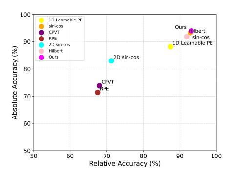
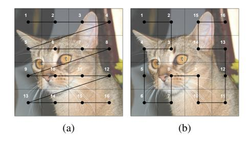
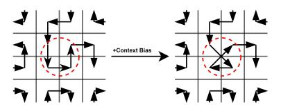
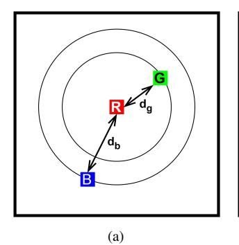
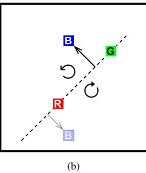
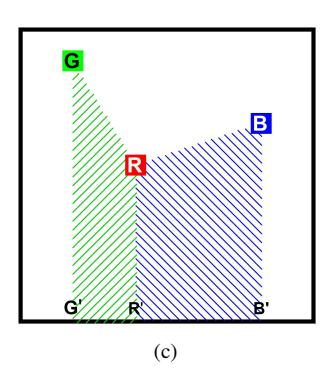
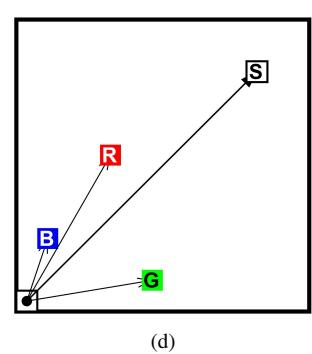
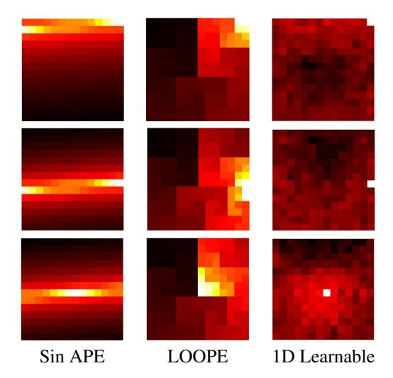
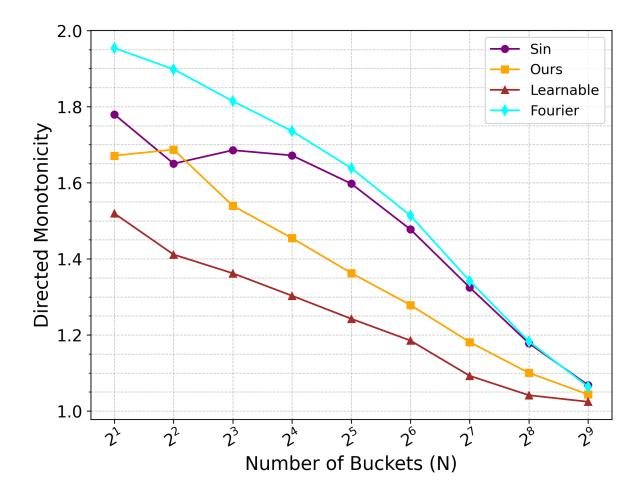

### LOOPE: Learnable Optimal Patch Order in Positional Embeddings for Vision Transformers

Md Abtahi Majeed Chowdhury Md Rifat Ur Rahman Akil Ahmad Taki Bangladesh University of Engineering and Technology, Dhaka, Bangladesh

{1806106, 1806033, 1806139}@eee.buet.ac.bd

#### **Abstract**

Positional embeddings (PE) play a crucial role in Vision Transformers (ViTs) by providing spatial information otherwise lost due to the permutation-invariant nature of selfattention. While absolute positional embeddings (APE) have shown theoretical advantages over relative positional embeddings (RPE), particularly due to the ability of sinusoidal functions to preserve spatial inductive biases like monotonicity and shift invariance, a fundamental challenge arises when mapping a 2D grid to a 1D sequence. Existing methods have mostly overlooked or never explored the impact of patch ordering in positional embeddings. To address this, we propose LOOPE, a learnable patch-ordering method that optimizes spatial representation for a given set of frequencies, providing a principled approach to patch order optimization. Empirical results show that our PE significantly improves classification accuracy across various ViT architectures. To rigorously evaluate the effectiveness of positional embeddings, we introduce the "Three-Cell Experiment", a novel benchmarking framework that assesses the ability of PEs to retain relative and absolute positional information across different ViT architectures. Unlike standard evaluations, which typically report a performance gap of 4-6% between models with and without PE, our method reveals a striking 30-35% difference, offering a more sensitive diagnostic tool to measure the efficacy of PEs. Our experimental analysis confirms that the proposed LOOPE demonstrates enhanced effectiveness in retaining both relative and absolute positional information.

#### 1. Introduction

Transformers dominate computer vision tasks, from object detection to image synthesis, but lack an explicit spatial order. Positional encoding (PE) is crucial for learning spatial relationships, essential in applications like autonomous driving, medical imaging, and scene understanding. While PE strategies have advanced, modeling spatial structures, especially in 2D, remains limited.

Figure 1. Comparison of various PEs on Three-cell Benchmark

Traditional PE approaches, including sinusoidal encodings [1], learned embeddings[1], and relative positional encodings[20], result in fixed spatial biases or excessive parameters that hinder generalizability. Conditional positional encodings (CPE) [6] create distinguished embeddings depending on local neighborhoods, helping to further generalization but introducing additional computational burden. Extensive prior works have also explored the effects of frequencies learned in detail [24][18], with the goal of representing various spatial information in a single zigzag order efficiently. However, to the best of our knowledge, no research has studied how to flatten a 2D grid into a 1D sequence for a given set of frequency sin-cos pairs systematically.

$$sinusoidal\ PE = sin(\mathbf{X}W^T)|cos(\mathbf{X}W^T)$$
 (1)

Sinusoidal PE has shown effectiveness owing to the periodicity property, which facilitates getting the relative position with simple multiplication and is inherently performed in self-attention. Moreover, implicit non-periodic learnable embeddings are very sensitive to training hyperparameters with weak theoretical justification, which makes them inconsistent between different tasks.

Thus, through our analysis we conclude that any periodic PE should consider three basic factors: context, order, and frequencies. Although efforts for non-periodic contextual

PEs [14], and learned frequency-based approaches [31]have appeared, the role of context and order in image representation remains relatively unexplored for a fixed, optimal frequency set. Our work addresses this gap by systematically examining these factors and their impact on model performance.

In this paper, we address the optimal 2D spatial position encoding and propose a framework to systematically study positional order and its influence on model performance. Our work contributes in **three significant ways**:

- **LOOPE:** We propose a novel method to determine optimal patch ordering, **X**, for spatial position embeddings, ensuring minimal loss of positional information while maintaining computational efficiency.
- Three Cell Experiment: We introduce a controlled experiment using minimal pixel configurations to analyze the behavior of different PEs, providing empirical insights into their effectiveness. In this experiment, we analyzed critical cases that allow us to evaluate ViT-PE pairs' relative and absolute positional information retainability.
- Positional Embeddings Structural Integrity (PESI)
  metrics: We propose Undirected Monotonicity, Directed
  Monotonicity and Undirected Asymmetry to assess the
  quality of any PE method, offering a principled approach
  to compare different strategies beyond empirical benchmarks.

Through extensive experiments, we show that our approach consistently outperforms previous PE methods on vision tasks. We demonstrate that our methods open up future directions in the realm of spatial encoding in deep learning models both from a theoretical standpoint and a practical standpoint.

#### 2. Related Work

Positional encoding (PE) is crucial for vision transformers as self-attention lacks inherent spatial awareness. Absolute positional encodings (APEs) were first introduced in NLP [1] and later adapted to vision tasks, where images are tokenized into patches [1]. Models like ViT [1] and DeiT [25] employ either fixed sinusoidal functions or learnable embeddings. While APEs introduce positional awareness, they suffer from fixed-size constraints, limiting adaptability to varying input resolutions [6][16], and fail to capture relative spatial relationships, necessitating additional mechanisms [15] [29].

Relative positional encodings (RPEs) address these limitations by encoding pairwise relationships instead of absolute locations [20]. RPEs generalize across different sequence lengths, making them appealing for both NLP [7] and vision tasks, with axial attention [27] and 2D-aware encodings [19] being notable examples. However, RPEs exhibit performance degradation by discarding absolute po-

sition information, leading to suboptimal spatial representations [1]. Their inability to capture fine-grained details, particularly in object localization, limits their effectiveness [21], and their computational overhead often outweighs their advantages [29]. Extending RPEs to 2D grids further complicates spatial reasoning due to the lack of explicit directional encoding [5].

Given the limitations of APEs and RPEs, hybrid PE strategies aim to balance efficiency and generalization. CP-RPE encodes horizontal and vertical distances separately to enhance directional awareness but struggles with optimal spatial mapping [29]. CPE dynamically generates embeddings based on local context, improving translation invariance, though it remains highly sensitive to hyperparameters and lacks a structured framework for optimal positional order [6]. RoPE introduces rotationally invariant encodings that effectively preserve relative positioning but fails to model spatial hierarchies for structured 2D reasoning [22].

More recent hybrid approaches, such as APE, MSF-PE, and LFF, further refine spatial representations. APE adapts encodings dynamically for better generalization but at increased computational complexity. MSF-PE extends Fourier-based encodings across multiple spatial scales, capturing richer hierarchical features while not directly addressing optimal positional ordering [13] [32]. LFF formulates PE as a learned Fourier transformation, providing a data-driven spatial representation but remaining heavily architecture-dependent [24]. Frequency-based hybrid methods integrating low- and high-frequency components further enhance spatial representations [12][2], though they still lack a principled mechanism for optimizing positional order.

Recent work highlights the importance of monotonicity, translation invariance, and symmetry in PE design [8]. Monotonicity ensures that increasing spatial distances correspond to decreasing similarity in embedded representations, preserving geometric consistency. Translation invariance maintains fixed relative distances across varying input sizes, aiding generalization. Symmetry enforces that similarity depends only on relative distance, though breaking it can be beneficial in tasks requiring directional sensitivity. While existing PEs partially adhere to these properties, they are not explicitly optimized, leaving room for improvement in structured spatial encoding. Despite significant advancements, the challenge remains in defining an optimal positional encoding that balances efficiency, spatial structure, and fundamental mathematical properties. While absolute, relative, and hybrid encodings each offer advantages, their trade-offs between generalization, computational cost, and interpretability highlight gaps in existing methodologies. Recent research suggests that structured frequency encoding and learned spatial priors can enhance robustness, yet further theoretical and empirical validation is needed. Our work builds on these insights by systematically investigating positional ordering and its direct impact on model performance, addressing critical gaps in current approaches.

#### 3. Methodology

Mapping an N-dimensional grid to a 1D sequence while preserving specific properties is a key challenge in computational science. This can be framed as finding the optimal Hamiltonian path on an 8/4-neighbor grid graph, where each node (cell) is connected to its neighbors, aiming to minimize metrics like autocorrelation distance and codelength values. Fractal Space-filling curves (SFCs) like the Hilbert[11], Peano[17], Onion-curves[30] are effective in image processing. Recent approaches explore dynamic SFCs[28][4] that adapt to local structures. However, they mostly rely on discrete algorithms (e.g., Minimum Spanning Tree(MST)), making differentiable loss functions difficult to define. Emerging methods use GNNs to estimate grid graph edge weights on Dual-graphs[28] and use MSTs to generate Hamiltonian circuits. However, extending this to Hamiltonian paths—where the start and end nodes need not be adjacent—is unstable. Paths lack a *closed-loop con*straint, and handling 8-neighbor grids-graph adds further complexity, making traditional methods inefficient especially for positional embeddings.

We are proposing a Learnable patch ordering method which generates stable yet dynamic order,  $\mathbf{X}$ , combining with  $\mathbf{X}_{\mathbf{G}}$  and  $\mathbf{X}_{\mathbf{C}}$ ,  $\mathbf{X} = \mathbf{X}_{\mathbf{G}} + \mathbf{X}_{\mathbf{C}}$  where,  $\mathbf{X}_{\mathbf{G}}$  is fractal curve order and  $\mathbf{X}_{\mathbf{C}}$  is context bias.

Figure 2. (a) Conventional zigzag order, (b) Hilbert Order

#### 3.1. Proposed Method

**Static Patch Order:** The Hilbert curve maps a  $2^n \times 2^n$  grid to a 1D sequence while preserving spatial locality but cannot handle arbitrary rectangular grids. To generate patch order for arbitrary image shape, we used generalized Hilbert order, also known as Gilbert Order[33], which generates SFC for arbitrary 2D dimensions by recursively dividing the grid while maintaining locality.

(1) Base Case – For 1D strips, it returns a linear sequence. (2) Recursive Step – The region is split along the longer axis, or along the shorter axis for square-like regions. (3) Adjustments – Odd dimensions are slightly shifted to ensure continuity. (4) Traversal – Three recursive calls are merged to maintain order. (5) Output – The final result,  $X_G$ , is an index array that maps cells to the visit order. This extends space-filling curves to irregular grid shapes efficiently. Complete details of Gilbert Algorithm is provided in (Supp. A.1)

Context Bias: Our experiments demonstrate that learning positional order directly from image context is highly inefficient and unstable. As observed in contextual space-filling curve (SFC) algorithms, directly propagating gradients from the Vision Transformer (ViT) to the edge weight generator is impractical. To leverage contextual information for patch ordering, we propose a controlled mechanism that locally manipulates the static Gilbert order,  $\mathbf{X}_{\mathbf{G}}$ .

Context bias,  $\mathbf{X_C}$  introduces two key properties: (1) non-integer position and (2) dynamic ordering. Previously, we assumed discrete integer-valued patch positions, constrained as  $0 \leq X_{G_i} < N$  (before scaling). However, with the freedom of fractional position, the encoder can adjust relative distances between patches, bringing them closer or pushing them further apart. By selecting  $\tanh()$  as the final activation function, the positional values are mapped to  $-1 < X_{C_i} < 1$ , enabling even the potential swapping of adjacent cells.

Following is the complete architecture for Context Bias,  $X_C$ , generator. Here, input image,  $I_0^{3\times H\times W}$  x coordinates,  $x^{1\times H\times W}$ , where  $x_{ij}=i$  similarly,  $y_{ij}=j$ .

Concat: 
$$\{x^{1 \times H \times W} | y^{1 \times H \times W} | I_0\} = I_c^{5 \times H \times W}$$
 (2)

Conv1: 
$$Act(I_c \times W_1^{5 \times 32 \times P \times P} + B_1^{1 \times 32}) = I_1^{32 \times h \times w}$$
 (3)

Conv2: Act
$$(I_1 \times W_2^{32 \times 16 \times 5 \times 5} + B_2^{1 \times 16}) = I_2^{16 \times h \times w}$$
 (4)

Conv3: Act
$$(I_2 \times W_3^{16 \times 8 \times 5 \times 5} + B_3^{1 \times 8}) = I_3^{8 \times h \times w}$$
 (5)

Conv4: Act
$$(I_3 \times W_4^{8 \times 4 \times 5 \times 5} + B_4^{1 \times 4}) = I_4^{4 \times h \times w}$$
 (6)

Conv5: Act
$$(I_4 \times W_5^{4 \times 1 \times 5 \times 5} + B_5^{1 \times 1}) = I_5^{1 \times h \times w}$$
 (7)

BN+F: 
$$I_5^{1 \times h \times w} \rightarrow I_f^{1 \times N}$$
 (8)

$$Mlp: I_f \times W_L^{N \times N} + B_L^{1 \times N} = I_L^{1 \times N}$$
(9)

Tanh: 
$$tanh(I_L) = \mathbf{X_C}^{1 \times N}; \quad -1 \le X_{c_i} \le 1$$
 (10)

Finally we add static order with context bias to get final

Figure 3. Example of local order manipulation based on context

patch order.

$$\mathbf{E}(\mathbf{X}) = \mathbf{E}(\mathbf{X_G} + \mathbf{X_C}) = \mathbf{sin}(\mathbf{XW^T}) | \mathbf{cos}(\mathbf{XW^T})$$
(11)

Figure 4. Four cases of three-cell experiment: (a) compare distance  $d_{RB}$ ,  $d_{RG}$  (b) RGB orientation (clockwise/counter-clockwise) (c) compare area RGG'R', RBB'R' (d)vector sum of OR, OB, OG

#### 3.2. Three Cell Experiment

Positional encoding (PE) is vital for Vision Transformers (ViTs), yet no established method evaluates its compatibility with specific architectures. The extent to which a ViT retains positional information remains unclear, particularly in distinguishing absolute from relative encoding. Traditional evaluations show only a marginal 4–6% performance gain from PE, as natural image patches exhibit statistical continuity, allowing transformers to infer positional awareness without explicit encoding. To mitigate this confounding factor, we construct a synthetic dataset of  $224 \times 224$ RGB images, ensuring that no two neighboring  $16 \times 16$ patches share common color information. This prevents the model from leveraging inter-patch correlations for implicit positional awareness. Formally, each synthetic image  $I_s$  is partitioned into a  $14 \times 14$  grid, where three independent, non-overlapping cells are randomly assigned R, G, B. The coordinates  $(x_r, y_r), (x_g, y_g), (x_b, y_b) \in \mathbb{N}^2$ , constrained by  $0 \le x_i, y_i \le 13$ . In this setup, we have investigated 4 critical cases of positional information.

Undirected distance comparison: The Euclidean distances between randomly chosen R, G, and B cells are defined as  $d_{rg} = \|\mathbf{p}_r - \mathbf{p}_g\|_2$  and  $d_{rb} = \|\mathbf{p}_r - \mathbf{p}_b\|_2$ , where  $\mathbf{p}_r, \mathbf{p}_g, \mathbf{p}_b \in \mathbb{N}^2$  represent their respective position vectors. We compare the cases  $d_{rg} > d_{rb}$  and  $d_{rb} > d_{rg}$ , formulated as  $\|\mathbf{p}_r - \mathbf{p}_g\|_2 > \|\mathbf{p}_r - \mathbf{p}_b\|_2$  and  $\|\mathbf{p}_r - \mathbf{p}_b\|_2 > \|\mathbf{p}_r - \mathbf{p}_g\|_2$ .  $\mathbf{p}_r, \mathbf{p}_g, \mathbf{p}_b$  are selected in such a way (trial & error) that  $\{d_{rg} > d_{rb}, d_{rb} > d_{rg}, d_{rg} == d_{rb}\}$  are all equiprobable cases. The unequal cases emphasize on translation invariance and monotonicity of positional embeddings. For equal case, undirected symmetry is crucial.

**Cells' orientation:** To determine whether the R, G, and B cells form a clockwise or counterclockwise (anticlockwise) orientation, the architecture needs to be able to compute the signed area of the triangle formed by their position vectors. Since the cells are generated such that they are **not colinear**, we always have  $\Delta \neq 0$ , ensuring a valid orientation. The

orientation is determined by computing the determinant:

$$\Delta = \begin{vmatrix} x_r & y_r & 1 \\ x_g & y_g & 1 \\ x_b & y_b & 1 \end{vmatrix}$$

$$= (x_g - x_r)(y_b - y_r) - (y_g - y_r)(x_b - x_r) \neq 0$$
(12)

- If  $\Delta > 0$ , the points are in **counterclockwise** order.
- If  $\Delta < 0$ , the points are in **clockwise** order.

This case is interesting not only to determine the orientation of 3 cells, but also enables the architecture determine, if two cells,  $B,B^\prime$  are in same/opposite side of RG line. This property has very high practical value.

This two cases are strong candidates of relative information. Most of the natural vision tasks, relies on relative positional bias and can be extracted from the difference between cells' embeddings. After thorough investigation, we concluded that, RPE fails miserably in any sort of addition operation as it is mathematically impossible to find summation values from difference equations. To highlight this strength of APE, we proposes two cases here.

**Shadow area comparison:** To compare the shadow areas under the RG and RB lines, architecture should compute the absolute trapezium areas formed by the projections of R, G, B onto the x-axis. The projections are defined as  $R' = (x_r, 0)$ ,  $G' = (x_g, 0)$ , and  $B' = (x_b, 0)$ . The trapezium areas corresponding to RGG'R' and RBB'R' are:

$$A_{RG} = \frac{1}{2} |(y_r + y_g)(x_g - x_r)|$$

$$A_{RB} = \frac{1}{2} |(y_r + y_b)(x_b - x_r)|$$

We compare  $A_{RG}$  and  $A_{RB}$ . Since R,G,B are randomly generated such that the cases  $A_{RG} > A_{RB}$ ,  $A_{RG} < A_{RB}$ , and  $A_{RG} = A_{RB}$  are equiprobable, we have:  $P(A_{RG} > A_{RB}) = P(A_{RG} < A_{RB}) = P(A_{RG} = A_{RB}) = \frac{1}{3}$ . Trapezium area computation involves addition operation which is a strong case to differentiate between

RPEs and APEs.

**Vector sum:** We define coordinates of R,G,B as position vectors relative to the origin (O) of a  $14 \times 14$  grid. Given that,  $\mathbf{p}_r, \mathbf{p}_g, \mathbf{p}_b \in \mathbb{N}^2$  and  $0 \le x_i, y_i \le 13$ . We compute the vector sum:  $\mathbf{p}_s = \mathbf{p}_r + \mathbf{p}_g + \mathbf{p}_b = (x_s, y_s)$  where  $x_s = x_r + x_g + x_b$ ,  $y_s = y_r + y_g + y_b$ . We then check if  $\mathbf{p}_s$  is out of the grid by verifying:  $x_s > 13$  and  $y_s > 13$ .

This architecture needs to determine if the resultant sum vector  $\mathbf{p}_s$  lies outside the grid boundary for which it should implicitly performs addition operation. To evaluate all those case, a simple 6-class image classification task is enough. Six class defined as:

$$d_{rg} > d_{rb} \mid d_{rb} > d_{rg} \mid \Delta_{RGB} > 0 \mid A_{RG} > A_{RB} \mid A_{RB} > A_{RG} \mid \sum P_i - (13, 13) > 0$$
(13)

Complete Algorithm has been included in (Supp. A.2).

## 3.3. Positional Embeddings Structural Integrity (PESI) Metrics

PESI metrics mainly focuses on how well positional encoders maintain monotonicity and what each PE compensates(radial symmetry) to achieve higher monotony (radial or precise). Given a positional embedding tensor  $P \in \mathbb{R}^{h \times w \times D}$ , define the *cosine similarity matrix* centered at (x,y):

$$E_{(x,y)}(i,j) = \frac{P_{(x,y)} \cdot P_{(i,j)}}{\|P_{(x,y)}\| \|P_{(i,j)}\|}$$
(14)

**Undirected monotonicity:** The *radial average similarity function* is:

$$\mu_{(x,y)}(r) = \frac{1}{|B_r|} \sum_{(i,j) \in B_r} A_{(x,y)}(i,j), \tag{15}$$

where  $B_r$  is the set of positions at radius r. We compute Spearman's rank correlation:

$$\rho_{(x,y)} = 1 - \frac{6\sum_{r} d_r^2}{|R|(|R|^2 - 1)}$$
 (16)

where  $d_r$  is the rank difference between level(r) and  $\mu_{(x,y)}(r)$ , and |R| is the total radial levels. The undirected monotonicity score is:

$$M_u = \frac{1}{hw} \sum_{x=0}^{h-1} \sum_{y=0}^{w-1} \left(1 - \rho_{(x,y)}\right)$$
 (17)

where a higher  $M_U$  indicates stronger undirected monotonicity across the grid. Ideally, it should be 2.

**Directed Monotonicity:** We quantize  $2\pi$  into  $N = \frac{2\pi}{\delta}$  directional buckets (with quantization angle  $\delta$ ). For each cell (i, j) relative to (x, y), compute

$$\theta_{(x,y)}(i,j) = \text{atan2}(j-y, i-x)$$
 (18)

where  $\mathrm{atan2}(y,x)$  returns the angle in  $(-\pi,\pi]$ . Assign the cell to bucket

$$k = \left| \frac{\theta_{(x,y)}(i,j)}{\delta} \right| \mod N.$$
 (19)

Within each bucket k, order the cells by radial distance and compute Spearman's rank correlation

$$\rho_{(x,y)}^k = 1 - \frac{6\sum_r d_r^2}{|R_k|(|R_k|^2 - 1)}$$
 (20)

where  $d_r$  is the rank difference between the radius r and the corresponding similarity  $S^k_{(x,y)}(r)$ , and  $|R_k|$  is the number of elements in bucket k. The mean correlation per cell is then

$$\bar{\rho}_{(x,y)} = \frac{1}{N} \sum_{k=0}^{N-1} \rho_{(x,y)}^k, \tag{21}$$

and the global directed monotonicity measure is defined as

$$M_D = \frac{1}{hw} \sum_{x=0}^{h} \sum_{y=0}^{w} \left( 1 - \bar{\rho}_{(x,y)} \right)$$
 (22)

With varying  $N, \delta$ , we can exactly investigate how precisely the encoder can maintain monotonicity at each direction. Figure. 6 shows how  $M_D$  changes with N and  $for N \to 1, M_D \to M_U$ . A higher  $M_D$  indicates stronger directional monotonicity. Ideally it should be 2.

**Undirected Asymmetry:** For each center (x, y), let  $B_r$  be the set of cells at radius r from (x, y). We define standard deviation of the cosine similarity values as

$$\sigma_{(x,y)}(r) = \sqrt{\frac{1}{|B_r|}} \sum_{(i,j) \in B_r} \left( E_{(x,y)}(i,j) - \mu_{(x,y)}(r) \right)^2 \quad (23)$$

where  $\mu$  is defined in Eq.15. The coefficient of variation at radius r is then given by

$$CV_{(x,y)}(r) = \frac{\sigma_{(x,y)}(r)}{\mu_{(x,y)}(r)}.$$

Averaging over all radial distances  $r \in R$  yields the undirected symmetry measure at (x,y):

$$A'_{SU}(x,y) = \frac{1}{|R|} \sum_{r \in R} \text{CV}_{(x,y)}(r)$$
 (24)

Finally, the global undirected asymmetry is defined as

$$A_{SU} = \frac{1}{HW} \sum_{x=1}^{H} \sum_{y=1}^{W} A'_{SU}(x, y)$$
 (25)

For complete symmetry,  $|A_{SU}| \rightarrow 0$ . To be noted, there is no ideal value of undirected asymmetry as most of the positional encoder compensates  $A_{SU}$  for better(precise) directed monotonicity  $M_D$ . if  $A_{SU}=0$ , there will be no directional information in the embedding vector. Detailed algorithms have been mentioned in (Supp. A.3.1, A.3.2, A.3.3).

#### 4. Experiments

#### 4.1. Experimental Setup

We trained all models using the Adam optimizer with a cosine scheduler, a max LR of 0.001, and a min LR of 0.000025 for 150 epochs. Batch sizes were 96 for Oxford-IIIT, and 64 for CIFAR-100 and our novel Three cell dataset . For resolution comparison experiment we used batch size 32 for Oxford-IIIT (384×384). Our base model was DeiT-Base and for other experiments we used base models as mentiond in the article. All models were used with ImageNet-1K pretrained weights for a baseline comparison with the other experiments. In case of CrossViT, we used  $240\times240$  images with mixed patch sizes ( $12\times12$ ,  $16\times16$ ). We employed an 80-10-10 train-validation-test split and applied data augmentations including flips, rotations, brightness adjustments, and elastic transformations.

#### 4.2. Comparison with 1-D Positional Embeddings

We evaluate the effectiveness of different positional encodings on Vision Transformer architectures using the Oxford-IIIT and CIFAR-100 datasets. The tested models include ViT-Base, DeiT-Base, DeiT-Small, CaiT, and Cross-ViT, each trained with five positional encoding methods: Zero PE, Learnable PE, Sinusoidal PE, Hilbert PE, and our proposed Learnable Hilbert PE.

From Table. 1, LOOPE consistently outperforms other embeddings across all models and datasets, demonstrating its ability to improve feature representation. For Oxford-IIIT, it achieves the highest accuracy in Cross-ViT (91.0%) and CaiT (90.5%), suggesting that it enhances finegrained feature learning. In CIFAR-100, which has greater inter-class variation, our method also performs the best for all models, notably ViT-Base (88.3%) and DeiT-Small (82.0%), indicating its adaptability to complex datasets.

Several patterns emerge from the results: Zero PE consistently underperforms, confirming the necessity of explicit positional encoding. Hilbert PE performs better than Sinusoidal PE, due to its ability to preserve spatial locality more effectively. Learnable PE improves upon fixed embeddings by allowing the model to optimize position representations, but LOOPE further enhances accuracy, because it integrates spatial locality with learnable flexibility, leading to a more effective representation of positional dependencies.

These findings demonstrate that our Learnable Hilbert PE successfully balances structured spatial encoding with learnable adaptability, making it particularly effective in enhancing ViT performance across diverse datasets.

Table. 2 compares the performance of various advanced positional encoding in Oxford-IIIT and CIFAR-100. Fourier PE achieves the highest accuracy (90.5%, 89.1%), due to its rich frequency encoding properties.

| Dataset     | Model                                                                           | Zero PE                                   | Learnable                                 | Sinusoid                                  | Hilbert                                   | LOOPE(Ours)                               |
|-------------|---------------------------------------------------------------------------------|-------------------------------------------|-------------------------------------------|-------------------------------------------|-------------------------------------------|-------------------------------------------|
| Oxford-IIIT | ViT-Base [9] DeiT-Base [25] DeiT-Small [25]                               | 83.6% 88.9% 83.8%                   | 84.6% 89.4% 83.8%                   | 85.3% 86.3% 83.7%                   | 84.2% 89.0% 80.6%                   | 88.1% 89.8% 84.5%                   |
|             | CaiT [26] Cross-ViT [3]                                                      | 87.4% 88.3%                            | 89.0% 90.9%                            | 90.0% 88.0%                            | 89.6% 89.3%                            | 90.5% 91.0%                            |
| CIFAR-100   | ViT-Base [9] DeiT-Base [25] DeiT-Small [25] CaiT [26] Cross-ViT [3] | 79.8% 82.1% 68.6% 77.3% 80.5% | 83.0% 86.3% 81.6% 82.5% 84.6% | 85.2% 86.6% 71.9% 82.3% 86.3% | 87.6% 86.9% 77.7% 82.5% 85.3% | 88.3% 87.1% 82.0% 83.1% 86.8% |

Table 1. Comparison of different Vision Transformer models with various positional encodings across Oxford-IIIT and CIFAR-100 datasets.

| Models           | Oxford-IIIT | CIFAR-100 |  |
|------------------|-------------|-----------|--|
| CPVT [6]         | 83.9%       | 79.1%     |  |
| RPE [29]         | 80.5%       | 79.2%     |  |
| Fourier [15]     | 90.5%       | 89.1%     |  |
| 2D Sinusoid [15] | 80.1%       | 86.3%     |  |
| Hilbert [11]     | 89.0%       | 86.9%     |  |
| LOOPE (Ours)     | 89.8%       | 87.1%     |  |

Table 2. Comparison of advanced models across Oxford-IIIT and CIFAR-100 datasets.

LOOPE outperforms every possible encoder except Fourier. CPVT exhibit slightly lower accuracy, because it works with transformed positions instead of actual position as it passes through one layer of encoder. RPE performs even worse because it relies on a learned relative positional bias, which struggles to capture fine-grained spatial dependencies. These results validate the superiority of Fourier PE while demonstrating that LOOPE remains a strong alternative for vision tasks.

| Resolution | Models         | Sinusoid | Ours                  |
|------------|----------------|----------|-----------------------|
| 224x224    | ViT-Base [9]   | 85.3%    | 88.1%(+2.8%)          |
|            | ViT-Small [9]  | 81.6%    | 83.8%(+2.2%)          |
|            | DeiT-Base [25] | 86.3%    | 89.8%(+3.5%)          |
| 384x384    | ViT-Base [9]   | 89.1%    | 92.2%(+3.1%)          |
|            | ViT-Small [9]  | 83.0%    | 86.1%(+3.1%)          |
|            | DeiT-Base [25] | 88.5%    | 92.4%( <b>+3.9</b> %) |

Table 3. Comparison of different Vision Transformer models with Sinusoid and LOOPE positional encodings for different Image Resolution on Oxford-IIIT .

Table. 3 presents the performance of different Vision Transformer models with Sinusoid and LOOPE positional encodings across two resolutions. Our method shows higher improvement in accuracy with bigger resolution. At 224x224 gains range from +2.8% to +3.5%. The highest improvement occurs in ViT-Base (224x224, +2.8%). At 384x384, performance gains improves significantly, particularly in DeiT-Base(+3.9%), demonstrating LOOPE's greater improvement for bigger resolution. The results validate LOOPE as a superior alternative to sinusoidal encoding in transformer-based vision tasks.

# **4.3.** Analysis of Positional Encoding Performance in the Three-Cell Experiment

| Models           | RPE      |             | APE   |            |         |
|------------------|----------|-------------|-------|------------|---------|
|                  | Distance | Orientation | Area  | Vector Sum | Average |
| ResNet-50[10]    | 90.8%    | 85.6%       | 89.7% | 92.9%      | 89.4%   |
| Inception-V3[23] | 92.8%    | 96.1%       | 93.7% | 95.3%      | 94.5%   |
| No PE            | 61.9%    | 53.1%       | 60.1% | 62.6%      | 59.4%   |
| Learnable [1]    | 85.6%    | 89.3%       | 84.0% | 92.2%      | 87.8%   |
| 1D Sinusoid [1]  | 90.9%    | 94.9%       | 91.3% | 95.3%      | 93.1%   |
| CPVT [6]         | 72.8%    | 63.2%       | 72.6% | 75.0%      | 70.9%   |
| RPE [29]         | 73.7%    | 62.6%       | 71.0% | 73.9%      | 70.1%   |
| Fourier [15]     | 93.1%    | 96.7%       | 92.4% | 93.9%      | 94.0%   |
| 2D Sinusoid [15] | 83.6%    | 60.0%       | 72.6% | 92.3%      | 77.1%   |
| Hilbert [11]     | 88.8%    | 95.0%       | 89.9% | 93.8%      | 91.9%   |
| LOOPE (Ours)     | 91.5%    | 95.8%       | 93.3% | 94.6%      | 93.7%   |

Table 4. Comparison of various positional embeddings on 3 Cell Experiment .

We evaluate positional encoders on four metrics: Distance, Orientation, Area, and Vector Sum. Distance and Orientation capture relative positioning, while Vector Sum and Area assess absolute spatial awareness.

From the Table. 4 we can see for distance, Fourier, our encoder, and 1D Sinusoidal perform best in capturing global spatial structure. Fourier surpasses 1D Sinusoidal by 5% due to its richer frequency representations. Our encoder, which optimizes patch ordering, outperforms RPE by 17%, proving that absolute encoding retains positional consistency better than relative encoding. As for orientation, Fourier dominates due to its cyclic transformations aligning with periodicity. When a cell rotates, its position in Fourier space shifts cyclically, preserving relative orientation. Our encoder (94.6%) follows closely due to its optimal ordering, while Hilbert (95.0%) excels by preserving spatial locality in the encoding space.

In case of area, which evaluates how well an encoder captures spatial information without context, Fourier

(92.4%), 1D Sinusoidal (91.3%), and our encoder (93.3%) excel by integrating both absolute and relative cues. Hilbert (93.8%) benefits from its locality-preserving nature. Our encoder, essentially a learnable Hilbert, dynamically optimizes the spatial path, outperforming other methods. Finally vector sum, which measures an encoder's ability to retain absolute positional information, 1D Sinusoidal (95.3%) performs best due to its explicit encoding of absolute positions. Our encoder (94.6%) closely follows, leveraging learned patch ordering. Fourier (93.9%) remains strong, benefiting from its ability to encode absolute positions through frequency decomposition.

Overall, Fourier (94.0%), our encoder (93.7%), and 1D Sinusoidal (93.1%) are the most effective encoders. Our learnable Hilbert-based approach outperforms CPVT (70.9%) and RPE (70.1%), demonstrating that absolute encoding is superior to purely relative methods in structured spatial tasks.

### **4.4.** Positional Embedding Structural Integrity (PESI) Metrics

| Models            | Undirected Monotonicity $M_U$ | Directed Monotonicity $M_D$ | Undirected Asymmetry $A_{SU}$ |
|-------------------|-------------------------------|-----------------------------|-------------------------------|
| LPE (Learned) [1] | 1.7493                        | 1.2003                      | -0.7272                       |
| 1D Sinusoid [15]  | 1.9567                        | 1.4905                      | 0.1243                        |
| Learn. Freq. [15] | 1.9623                        | 1.5230                      | 0.2683                        |
| Hilbert [11]      | 1.9670                        | 1.2897                      | 0.0945                        |
| LOOPE (ours)      | 1.9674                        | 1.2900                      | 0.0939                        |

Table 5. Comparison of models in terms of Undirected Monotonicity, Directed Monotonicity, and Undirected Asymmetry.

Table. 5 presents the positional fidelity indices for various Absolute Positional Encodings (APEs). For calculating directed monotonicity, the number of buckets, N is set to 60 for preparing this table. So, the  $\delta = 6^{\circ}$  The results indicate that LOOPE achieves the highest values in both undirected monotonicity and undirected asymmetry, demonstrating its robustness. Conversely, Learnable APE performs the worst across all three metrics, indicating that its embeddings are not highly monotone. A notable observation is the asymmetry value of LPE, which is -0.72. This negative value arises because the average cosine similarity across all cells is predominantly negative, leading to an overall asymmetry value below zero. Meanwhile, Learnable Frequency exhibits strong directed monotonicity with stable results in the undirected setting. However, it compromises radial symmetry, meaning that values on a single radius show greater instability compared to other periodic APEs. In contrast, LOOPE demonstrates the most stable radial symmetry, reinforcing its reliability in positional encoding.

#### 4.5. Ablation Studies

Figure 5. Cosine Similarity Maps for Three APEs: Top-Right Corner, Right-Boundary, and Middle Cell (Top to Bottom)

Figure:5 clearly shows that ours(LOOPE) is generating more robust cosine similarity map for all positions. Due to traditional zigzag order in sinusoidal APE, the boundary and corner cells have inconsistent similarity pattern, as the order propagates from right to all way back to left boundary. For 1D learnable APE, it loosely generates map with a lots of anomaly in near to far distance. Also, other than, central cells, edge cells are having non-monotone similarity map. More visualization can be found in (Supp. B) Figure 6, shows the interesting facts about directed

Figure 6. Trend of directed Monotonicity,  $M_D$  with increasing angle precision,  $\delta = 2\pi/N$ 

monotonicity, with this tool one can investigate how precisely the positional embeddings can maintain monotonicity. Clearly, increasing precision all positional encoders struggles to provide a monotone trend in cosine similarity. As  $N \to 1, M_D \to M_U$  which is perfectly as we expected. At  $N=4, \delta=\pi/2$ , we can see that, LOOPE outperforms zigzag and learnable as it highly depends on hilbert order which propagates in square pattern.

#### 5. Conclusion

In this work, we have explored the critical role of patch order in positional embeddings (PEs) and demonstrated how optimizing this order enhances performance in downstream vision tasks. Our proposed contextual SFC generator exhibits improved stability and computational efficiency, addressing key limitations in existing approaches. Through the three-cell experiment, we systematically analyzed the strengths and weaknesses of various PEs, revealing why absolute positional embeddings (APEs) inherently outperform relative positional embeddings (RPEs) and how they preserve positional information throughout vision transformers (ViTs).

We also introduced three novel PESI metrics that emphasize the importance of monotonicity and elucidate the trade-offs required to achieve higher angular precision. These metrics provide deeper insights into the structural properties of PEs and their influence on model performance. While our proposed LOOPE framework does not claim to deliver state-of-the-art results across all dimensions, it establishes a solid foundation for future research to further investigate and refine positional embeddings in vision models. We believe our findings will inspire continued exploration into the design of more effective and interpretable PEs for computer vision applications.

#### References

- [1] Vaswani Ashish. Attention is all you need. *Advances in neural information processing systems*, 30:I, 2017. 1, 2, 7
- [2] Chaoqi Chen, Yushuang Wu, Qiyuan Dai, Hong-Yu Zhou, Mutian Xu, Sibei Yang, Xiaoguang Han, and Yizhou Yu. A survey on graph neural networks and graph transformers in computer vision: A task-oriented perspective. *IEEE Trans*actions on Pattern Analysis and Machine Intelligence, 2024.
- [3] Chun-Fu Richard Chen, Quanfu Fan, and Rameswar Panda. Crossvit: Cross-attention multi-scale vision transformer for image classification. In *Proceedings of the IEEE/CVF in*ternational conference on computer vision, pages 357–366, 2021. 6
- [4] Wanli Chen, Xufeng Yao, Xinyun Zhang, and Bei Yu. Efficient deep space filling curve. In *Proceedings of the IEEE/CVF International Conference on Computer Vision (ICCV)*, pages 17525–17534, 2023. 3
- [5] Krzysztof Marcin Choromanski, Shanda Li, Valerii Likhosherstov, Kumar Avinava Dubey, Shengjie Luo, Di He, Yiming Yang, Tamas Sarlos, Thomas Weingarten, and Adrian Weller.

- Learning a fourier transform for linear relative positional encodings in transformers, 2024. 2
- [6] X Chu, Z Tian, B Zhang, X Wang, X Wei, H Xia, and C Shen. Conditional positional encodings for vision transformers. arxiv 2021. arXiv preprint arXiv:2102.10882. 1, 2, 6, 7
- [7] Zihang Dai, Zhilin Yang, Yiming Yang, Jaime Carbonell, Quoc V Le, and Ruslan Salakhutdinov. Transformer-xl: Attentive language models beyond a fixed-length context. arXiv preprint arXiv:1901.02860, 2019. 2
- [8] Jacob Devlin, Ming-Wei Chang, Kenton Lee, and Kristina Toutanova. Bert: Pre-training of deep bidirectional transformers for language understanding. In *Proceedings of the 2019 conference of the North American chapter of the association for computational linguistics: human language technologies, volume 1 (long and short papers)*, pages 4171–4186, 2019. 2
- [9] Alexey Dosovitskiy, Lucas Beyer, Alexander Kolesnikov, Dirk Weissenborn, Xiaohua Zhai, Thomas Unterthiner, Mostafa Dehghani, Matthias Minderer, Georg Heigold, Sylvain Gelly, et al. An image is worth 16x16 words: Transformers for image recognition at scale. arXiv preprint arXiv:2010.11929, 2020. 6
- [10] Kaiming He, Xiangyu Zhang, Shaoqing Ren, and Jian Sun. Deep residual learning for image recognition, 2015.
- [11] David Hilbert. Über die stetige abbildung einer linie auf ein flächenstück. *Mathematische Annalen*, 38:459–460, 1891. 3, 6, 7
- [12] Yifan Jiang, Peter Hedman, Ben Mildenhall, Dejia Xu, Jonathan T Barron, Zhangyang Wang, and Tianfan Xue. Alignerf: High-fidelity neural radiance fields via alignmentaware training. In Proceedings of the IEEE/CVF Conference on Computer Vision and Pattern Recognition, pages 46–55, 2023. 2
- [13] Amirhossein Kazemnejad, Inkit Padhi, Karthikeyan Natesan Ramamurthy, Payel Das, and Siva Reddy. The impact of positional encoding on length generalization in transformers. *Advances in Neural Information Processing Systems*, 36: 24892–24928, 2023. 2
- [14] G Ke, D He, and TY Liu. Rethinking positional encoding in language pre-training. arxiv. arXiv preprint arXiv:2006.15595, 2021. 2
- [15] Yang Li, Si Si, Gang Li, Cho-Jui Hsieh, and Samy Bengio. Learnable fourier features for multi-dimensional spatial positional encoding. *Advances in Neural Information Processing Systems*, 34:15816–15829, 2021. 2, 6, 7
- [16] Ze Liu, Han Hu, Yutong Lin, Zhuliang Yao, Zhenda Xie, Yixuan Wei, Jia Ning, Yue Cao, Zheng Zhang, Li Dong, et al. Swin transformer v2: Scaling up capacity and resolution. In Proceedings of the IEEE/CVF conference on computer vision and pattern recognition, pages 12009–12019, 2022. 2
- [17] Giuseppe Peano. Sur une courbe, qui remplit toute une aire plane. *Mathematische Annalen*, 36(1):157–160, 1890. 3
- [18] Ali Rahimi and Benjamin Recht. Random features for large-scale kernel machines. *Advances in neural information processing systems*, 20, 2007. 1

- [19] Prajit Ramachandran, Niki Parmar, Ashish Vaswani, Irwan Bello, Anselm Levskaya, and Jon Shlens. Stand-alone selfattention in vision models. Advances in neural information processing systems, 32, 2019. 2
- [20] Peter Shaw, Jakob Uszkoreit, and Ashish Vaswani. Selfattention with relative position representations. arXiv preprint arXiv:1803.02155, 2018. 1, 2
- [21] Aravind Srinivas, Tsung-Yi Lin, Niki Parmar, Jonathon Shlens, Pieter Abbeel, and Ashish Vaswani. Bottleneck transformers for visual recognition. In *Proceedings of the IEEE/CVF conference on computer vision and pattern recognition*, pages 16519–16529, 2021. 2
- [22] Jianlin Su, Murtadha Ahmed, Yu Lu, Shengfeng Pan, Wen Bo, and Yunfeng Liu. Roformer: Enhanced transformer with rotary position embedding. *Neurocomputing*, 568:127063, 2024. 2
- [23] Christian Szegedy, Vincent Vanhoucke, Sergey Ioffe, Jonathon Shlens, and Zbigniew Wojna. Rethinking the inception architecture for computer vision, 2015. 7
- [24] Matthew Tancik, Pratul Srinivasan, Ben Mildenhall, Sara Fridovich-Keil, Nithin Raghavan, Utkarsh Singhal, Ravi Ramamoorthi, Jonathan Barron, and Ren Ng. Fourier features let networks learn high frequency functions in low dimensional domains. Advances in neural information processing systems, 33:7537–7547, 2020. 1, 2
- [25] Hugo Touvron, Matthieu Cord, Matthijs Douze, Francisco Massa, Alexandre Sablayrolles, and Hervé Jégou. Training data-efficient image transformers & distillation through attention. In *International conference on machine learning*, pages 10347–10357. PMLR, 2021. 2, 6
- [26] Hugo Touvron, Matthieu Cord, Alexandre Sablayrolles, Gabriel Synnaeve, and Hervé Jégou. Going deeper with image transformers. In Proceedings of the IEEE/CVF international conference on computer vision, pages 32–42, 2021. 6
- [27] Huiyu Wang, Yukun Zhu, Bradley Green, Hartwig Adam, Alan Yuille, and Liang-Chieh Chen. Axial-deeplab: Standalone axial-attention for panoptic segmentation. In *European* conference on computer vision, pages 108–126. Springer, 2020. 2
- [28] Hanyu Wang, Kamal Gupta, Larry Davis, and Abhinav Shrivastava. Neural space-filling curves, 2022. 3
- [29] Kan Wu, Houwen Peng, Minghao Chen, Jianlong Fu, and Hongyang Chao. Rethinking and improving relative position encoding for vision transformer. *CoRR*, abs/2107.14222, 2021. 2, 6, 7
- [30] Pan Xu, Cuong Nguyen, and Srikanta Tirthapura. Onion curve: A space filling curve with near-optimal clustering, 2018. 3
- [31] Rui Xu, Xintao Wang, Kai Chen, Bolei Zhou, and Chen Change Loy. Positional encoding as spatial inductive bias in gans. In Proceedings of the IEEE/CVF Conference on Computer Vision and Pattern Recognition, pages 13569– 13578, 2021. 2
- [32] Liang Zhao, Xiachong Feng, Xiaocheng Feng, Weihong Zhong, Dongliang Xu, Qing Yang, Hongtao Liu, Bing Qin, and Ting Liu. Length extrapolation of transformers: A survey from the perspective of positional encoding. arXiv preprint arXiv:2312.17044, 2023. 2

[33] Jakub Červený. gilbert: Space-filling curve for rectangular domains of arbitrary size. https://github.com/jakubcerveny/gilbert.3