# **LooseRoPE: Content-aware Attention Manipulation for Semantic Harmonization**

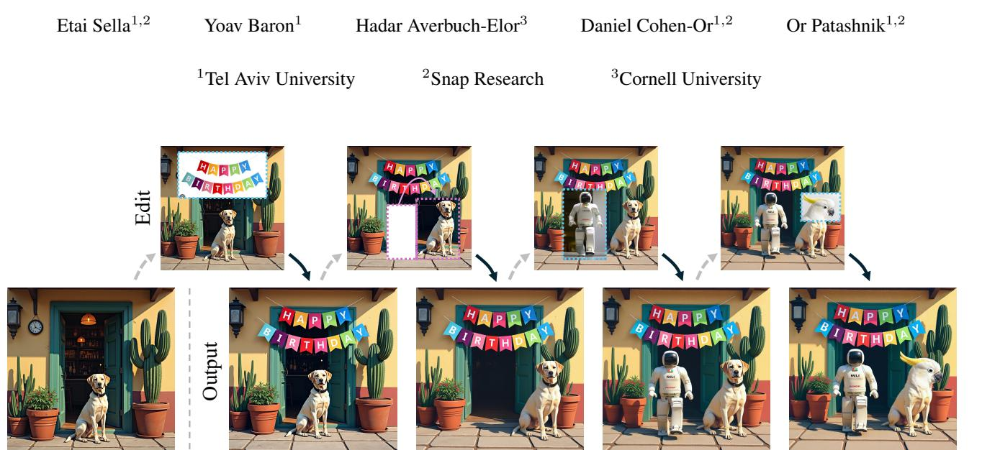

Figure 1. We introduce **LooseRoPE**, a training-free image editing algorithm that turns crudely edited inputs (top row) into coherent, high-quality results (bottom row). In each example, cropped regions are pasted either from other images (blue frames) or moved within the same image (magenta frames), sometimes leaving holes behind. Without any text prompts or additional supervision, LooseRoPE harmonizes the pasted content with its new context, producing seamless and semantically consistent outputs.

#### Abstract

*Recent diffusion-based image editing methods commonly* rely on text or high-level instructions to guide the generation process, offering intuitive but coarse control. In contrast, we focus on explicit, prompt-free editing, where the user directly specifies the modification by cropping and pasting an object or sub-object into a chosen location within an image. This operation affords precise spatial and visual control, yet it introduces a fundamental challenge: preserving the identity of the pasted object while harmonizing it with its new context. We observe that attention maps in diffusion-based editing models inherently govern whether image regions are preserved or adapted for coherence. Building on this insight, we introduce LooseRoPE, a saliency-guided modulation of rotational positional encoding (RoPE) that loosens the positional constraints to continuously control the attention field of view. By relaxing RoPE in this manner, our method smoothly steers the model's focus between faithful preservation of the input image and coherent harmonization of the inserted object, enabling a balanced trade-off between identity retention and contextual blending. Our approach provides a flexible and intuitive framework for image editing, achieving seamless compositional results without textual descriptions or complex user input.

## 1. Introduction

In recent years, we have witnessed remarkable progress in image editing [3, 16, 18, 21], largely driven by diffusion models that respond to natural language prompts [17, 30, 34]. These advances have made image manipulation intuitive and accessible, allowing users to modify content through natural language descriptions. Yet, this form of control remains inherently coarse, as many fine-grained aspects of an edit cannot be precisely conveyed through text, such as the exact location, shape, or appearance details of the modification. To address this challenge, we revisit the compositional editing task and define a setting in which the user directly specifies the modification by cropping and pasting an object or sub-object into a chosen location within

a target image (see Figure 1). This operation affords precise spatial and visual control, yet it introduces a fundamental challenge: preserving the identity of the pasted object while harmonizing it with its new context.

Previous approaches to compositional editing often favor one of the two goals at the expense of the other. Classical harmonization methods focus on accurately preserving the pasted object's appearance, while ensuring local blending and color consistency with the background [7, 19, 28, 39]. Yet, these methods typically operate at the pixel or illumination level, and therefore cannot generate substantial semantic or structural adjustments that may be required for a truly coherent composition. In contrast, recent diffusion-based approaches for compositional editing are able to generate globally coherent images [5, 36, 41], but often compromise the fidelity of the inserted object, altering its appearance or identity in the process.

Recently, instruction-based editing models have become the leading approach in image editing [3, 21, 38]. These models are effective in maintaining the global layout and preserving the input image content while performing meaningful semantic changes guided by text instructions or image conditions. However, we find that they struggle to balance between these two objectives. When the instruction dominates, the model may *suppress* the inserted object, allowing the generative prior to override its appearance. Conversely, when the conditioning on the input image is too strong, the model may *neglect* to blend the inserted object, overemphasizing it at the expense of overall harmonization. These two failure modes are demonstrated in Figure 2.

In this work, we present a method that aims to balance the coherence of the generated image and the preservation of the pasted object, a task we refer to as semantic harmonization. We analyze the behavior of instruction-based editing models and observe that their attention maps inherently govern whether a given region should be copied from the input image or modified to achieve overall harmonization. Building on this insight, we introduce LooseRoPE, a saliency-guided modulation of rotational positional encoding (RoPE), which acts as a continuous controller of the attention field of view. We call our method LooseRoPE as it loosens the positional constraints of RoPE to smoothly steer the model's focus between faithful preservation of the input image and coherent harmonization of the inserted object, providing control over this tradeoff.

Our approach provides a flexible and intuitive framework for image editing, achieving seamless compositional results without textual descriptions or complex user input. As illustrated in Figure 1, our method can even be applied iteratively, performing a series of crop-and-paste operations while maintaining scene coherence. Across such single or multi-step scenarios, LooseRoPE produces harmonized, coherent results that preserve the original scene and main-

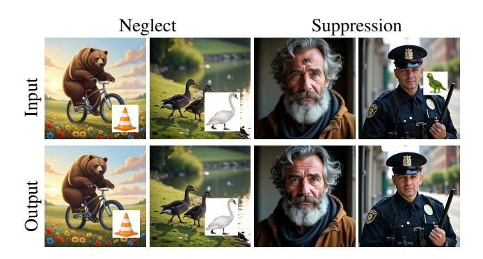

Figure 2. Examples of Neglect and Suppression failure modes in vanilla FLUX Kontext. In all the shown examples, we instruct the model with: "blend the cropped objects into the image in a convincing manner."

tain the identity of the pasted object. Both qualitative and quantitative evaluations confirm that controlling attention through positional encoding provides an effective framework for semantically harmonized image editing.

### 2. Related Work

Our work lies at the intersection of image harmonization and reference- and layout-guided editing. Harmonization methods adjust illumination, tone, and color to blend a pasted object with its background while strictly preserving its shape and appearance. Reference- and layout-guided editing, in contrast, allows users to explicitly control both where and what to modify by providing spatial cues (e.g., masks, layouts) together with visual references that define the object's appearance or identity. In the following, we review related works in both areas and discuss how they relate to our problem.

Image Harmonization. Methods for this task aim to adjust the appearance of a composited image so that the inserted region naturally fits its new background. Early approaches focused on low-level adjustments of color, tone, and illumination. Later deep learning-based methods learned context-aware harmonization from synthetic data [7, 8, 39], or introduced a self-supervised formulation that removed the need for annotated masks [19]. More recently, diffusion-based techniques extend harmonization toward generative recomposition and lighting-aware adaptation [24, 29, 35, 36]. While these methods improve the visual realism of composites, they remain limited to lowlevel appearance adjustment and do not address semantic coherence between the inserted object and its new context. Our work extends harmonization by enabling both appearance and semantic adaptation so that the inserted object coherently integrates into its new context while preserving its spatial identity.

A closely related work, Cross-domain Compositing [14], employs pretrained diffusion models to blend objects across visual domains using localized ILVR-based refinement [6]. While sharing the goal of coherent compositing, it focuses on domain translation and frequency-based blending, whereas we address in-domain semantic harmonization by directly modulating the model's attention field to balance identity preservation and contextual adaptation.

Reference- and Layout-guided Editing. Recent advances in generative models have introduced explicit control mechanisms over both *where* and *what* is synthesized in an image. Layout-guided synthesis focuses on spatial control, conditioning the generation process on cues such as masks, bounding boxes, depth maps, or keypoints that define object placement or scene structure. Some methods fine-tune diffusion models to incorporate such layout signals directly [23, 25, 26, 46], achieving strong spatial alignment between conditioning inputs and generated content. Other approaches enable spatial control in a zero-shot manner, typically by manipulating the internal features of diffusion models along the denoising trajectory [1, 4, 9, 10, 32].

Reference-guided synthesis instead controls what is generated by conditioning on visual exemplars specifying the desired object's identity or appearance, allowing models to reproduce precise visual details that are difficult to convey through textual prompts alone. Such methods can be broadly divided into two categories. Optimization-based approaches require a per-subject fine-tuning process to embed the reference into the model's latent space [11, 20, 31]. In contrast, encoder-based methods learn to map reference images directly into conditioning representations, enabling efficient and scalable identity control [22, 38, 42, 45].

Techniques from layout- and reference-guided synthesis have been combined to support reference- and layout-guided editing [5, 13, 24], where both spatial placement and object appearance are explicitly controlled. Such methods extend the generative capabilities of diffusion models toward compositional and controllable image editing.

### 3. Method

### 3.1. Preliminaries

**Rotary Positional Embeddings (RoPE).** The transformer blocks, which form the core of the diffusion transformer (DiT) architecture [2, 27], are inherently permutation-equivariant and therefore require explicit positional encodings to capture spatial dependencies. The *Rotary Positional Embedding* (RoPE) [37] has emerged as an effective method for positional encoding and is employed in most state-of-the-art DiTs. RoPE represents a position coordinate m as a series of 2D rotations at different frequencies. The number of frequencies is  $D = d_{\rm model}/2$ , where  $d_{\rm model}$ 

is the hidden model dimension. The angular frequencies usually follow a geometric progression,

$$\theta_d = \theta_{\text{base}} \frac{d}{D-1}, \qquad d = 0, \dots, D-1,$$
 (1)

where  $\theta_{\text{base}}$  is a model hyperparameter. Each token vector  $\mathbf{v}$  is divided into D two-dimensional sub-vectors,  $\mathbf{v}=(\mathbf{v_1},\ldots,\mathbf{v_D})$ , where  $\mathbf{v}_d\in\mathbb{R}^2$ . Each sub-vector  $\mathbf{v}_d$  is then rotated according to its spatial location m as:

$$\mathbf{v}_d' = e^{i \, (\theta_d m)} \, \mathbf{v}_d,$$

where the complex exponential denotes a 2D rotation by angle  $\theta_d m$ . For 2D images, RoPE is typically applied *axially*: half of the hidden dimensions encode horizontal positions and the other half vertical ones, enabling independent offsets along each axis [15].

In our work, we augment the RoPE mechanism by introducing an additional *inverse range factor*  $r \in [0, 1]$  that scales the positional coordinate m, yielding:

$$\mathbf{v}_d' = e^{i (\theta_d r m)} \, \mathbf{v}_d.$$

When r < 1, the effective spatial distance between tokens is proportionally reduced, bringing them closer in the positional space and thereby broadening the attention field of view. This provides a simple yet effective means of controlling how locally or globally each query attends to surrounding tokens during inference.

**FLUX Kontext** This model extends the FLUX [2] text-to-image model to support image conditioning, enabling text-guided editing and reference-guided generation. To achieve this, the input image is encoded into the model's latent space, tokenized, and the resulting tokens are concatenated with those of the denoised image. Through the model's self-attention layers, these conditioning tokens influence the generation process, allowing the model to integrate visual and textual conditions. In this work, we refer to the tokens of the conditioning image as the input image, and to the tokens of the denoised image as the output image.

### 3.2. LooseRoPE

Our setting assumes an input image  $I_{\rm in}$  composed of a base image with an additional region crudely pasted on top, along with a binary mask M indicating the pasted area. The pasted region may originate either from another image or from the same image, in which case its removal often leaves a visible hole in the source image. The goal is to produce a harmonized image in which the pasted object or sub-object is seamlessly integrated, without requiring any textual guidance describing the scene or desired edit. An overview of our method is depicted in Figure 3.

Our method builds on FLUX Kontext [21], and we therefore begin by showing that Kontext alone does not reliably solve the crop-and-paste task and by analyzing the sources

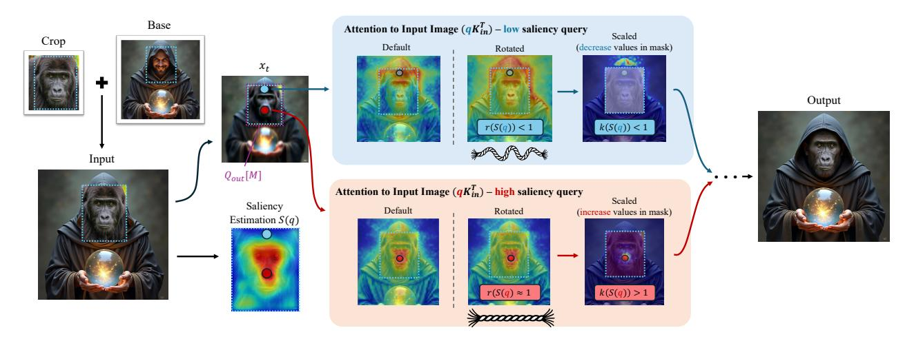

Figure 3. Saliency-Guided Attention Manipulation. Given an image with a crudely pasted crop, we smoothly blend it into the surrounding scene by manipulating the attention computation during inference using a saliency map of the cropped region. Output-image queries (within the dotted blue frame) attend to input-image keys using RoPE with a saliency-dependent range factor r(S(q)), which scales the positional coordinate and controls the spread of attention ("Rotated"). The corresponding attention logits in the crop mask are then scaled by k(S(q)) ("Scaled"). High-saliency queries (red) have  $r(S(q)) \approx 1$  and k(S(q)) > 1, keeping attention localized and preserving identity, evident in the gorilla's facial expression. Low-saliency queries (blue) have smaller r(S(q)) and k(S(q)) < 1, broadening attention and reducing crop-internal focus. This enables semantic blending with surrounding context, as seen in the forehead query attending to the hood and integrating smoothly in the final result. The "Default" attention map is shown for reference only and is not used in our method.

of its failures. When provided with the input image  $I_{in}$  and the instruction "blend the cropped objects into the image in a convincing manner", Kontext exhibits two recurring failure modes: neglect, where the pasted region is barely modified, and *suppression*, where it disappears entirely (see Figure 2). We investigate these failure modes by inspecting the attention maps during the generation of the output image. The attention maps reveal a clear correlation: neglect is characterized by overly localized attention within the pasted region, while suppression corresponds to excessively diffuse attention that overlooks the pasted content. We hypothesize that effective blending requires an adaptive balance: semantically important regions of the pasted area should attend locally to preserve their identity, whereas less salient regions should attend more broadly to the surrounding context to achieve visual coherence. To this end, our method estimates a saliency map and uses it to modulate attention behavior during FLUX Kontext's inference process, balancing between faithfully copying the input image and harmonizing the pasted region with the surrounding scene.

**Saliency Estimation.** A saliency map assigns to each pixel a scalar value reflecting its relative importance within the image. In our setting, we seek a map that highlights semantically meaningful and visually distinctive features (e.g., facial regions or object-defining details) while assigning low values to redundant or easily inferred regions such as uniform textures or backgrounds. Since modern instance detection models [44] jointly localize and classify objects, we assume they implicitly capture such significance cues.

We therefore pass the cropped region through a pre-trained instance detection network and extract feature activations from its early high-resolution layers. For each layer l, we compute a feature-norm map  $S_l = \|\mathbf{F}_l\|_2$  across spatial dimensions, bilinearly upsample it to the input resolution, and aggregate the results as:

$$S = \frac{1}{L} \sum_{l=1}^{L} \text{Interp}(S_l), \tag{2}$$

where L denotes the number of selected layers. The resulting normalized map  $S \in [0,1]^{H \times W}$  serves as a spatial weighting function indicating the relative saliency of each pixel in the cropped region. In cases where the crop originates from the same image, any resulting holes left behind are assigned zero saliency.

Content-Aware Attention Manipulation. Our mechanism aims to guide the model toward an adaptive balance between copying content from the input image and harmonizing the pasted crop with the surrounding scene. To achieve this, we modulate the attention weights computed between the queries within the region of the pasted crop in the *output* image and the corresponding keys derived from the *input* image, according to the saliency of each query. This modulation is performed in two stages: first, we apply a RoPE-based manipulation; then, we scale the attention weights. We denote the queries in the pasted region as  $Q_{\text{out}}[M]$ , the keys of the input image as  $K_{\text{in}}$ , and the resulting attention weights between them as  $W_{\text{in}} =$ 

### Algorithm 1 Content-Aware Attention Manipulation

- 1: **Input:** Saliency map S, crop mask M, output image queries  $Q_{\text{out}}$ , input image keys  $K_{\text{in}}$ , base frequency  $\theta_{\text{base}}$ , inverse range function  $r(\cdot)$ , scale factor function  $k(\cdot)$
- 2: Output: Updated input image attention weights  $W_{\rm in}$
- 3: **for** each query q in  $Q_{\text{out}}[M]$  **do**
- 4:  $q_r, K_{in-r} \leftarrow \text{RoPE}(q, K_{in}, r(S(q)))$  // Rotate
- 5:  $W_q = q_r K_{\text{in-r}}^T$  // Calculate logits
- 6:  $W_q[M] \leftarrow W_q[M] \cdot k(S(q))$  // Scale
- 7:  $W_{\text{in}}[q] \leftarrow W_q$  // Update
- 8: end for

 $\operatorname{softmax}((Q_{\operatorname{out}}[M]K_{\operatorname{in}}^{\top})/\sqrt{d})$ , where d is the feature dimension. Algorithm 1 summarizes the proposed content-aware attention mechanism. Next, we describe each of the modulation stages in detail.

To manipulate the attention weights  $W_{\rm in}$ , we first adjust the RoPE mechanism applied when computing attention between  $Q_{\text{out}}[M]$  and  $K_{\text{in}}$ . As introduced in Section 3.1, we augment RoPE with an inverse range factor  $r \in [0, 1]$  that scales down the positional coordinate, thereby controlling how widely a query attends in space. We leverage this factor by assigning each query  $q \in Q_{\text{out}}[M]$  a saliency-dependent inverse range factor r(S(q)), where  $r(\cdot)$  is a monotonically increasing function of the saliency value S(q) and bounded by 1. RoPE is then applied using the modified positional term r(S(q)) m, effectively linking saliency to the attention range: low-saliency queries attend more broadly to encourage contextual blending (see Figure 4 and the upper attention map in Figure 3), while high-saliency ones remain spatially localized to preserve detail and identity (see lower attention map in Figure 3). This saliency-guided modulation enables a smooth transition between semantic adaptation and structural fidelity.

While the RoPE-based manipulation enables queries to capture broader semantic context, it can also introduce undesirable effects: salient regions may lose their identity, as the increased attention range causes them to attend less to their corresponding areas in the original crop, and large background areas within the crop mask may blend insufficiently due to increased attention to other spatially distant background regions. To mitigate these issues, we introduce a *crop attention factor*  $k(S(q)) \in [k_{\text{low}}, k_{\text{high}}]$  that scales the attention weights corresponding to keys within the crop mask. Let  $K_{\text{in}}[M]$  denote the keys that belong to the pasted crop, and  $W_{\text{in}}[:, M]$  the associated attention weights after RoPE modulation. For each query q, we scale  $W_{\text{in}}[q, M]$ , where higher-saliency queries receive stronger scaling (approaching  $k_{\text{high}}$ ) and less salient ones approach  $k_{\text{low}}$  (see the

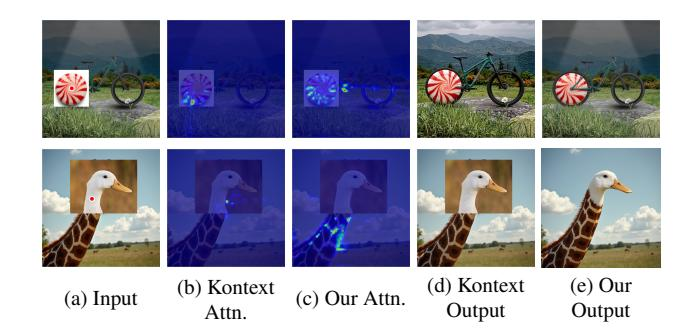

Figure 4. Attention Map Visualization . Top: For a query on the bike wheel, vanilla Kontext (b) produces highly local attention, whereas our method (c) correctly attends to the gear wheel, enabling coherent blending (e). Bottom: For a query on the duck's neck, Kontext (b) again attends locally within the pasted crop. In contrast, our RoPE modification (c) captures the semantic relation to the giraffe's neck, resulting in a seamless blend (e).

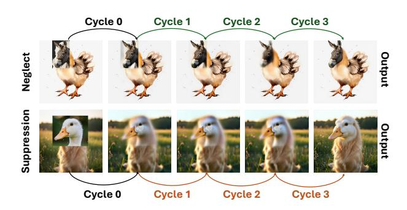

Figure 5. **VLM guided manipulation of attention.** Even inputs that exhibit severe neglect or suppression are eventually edited successfully. **Green** arrows indicate a downscale in the saliency map (neglect), and **Orange** arrows indicate an upscale (suppression). The figure shows the input, followed by three  $\hat{x}_0$  predictions at timestep 2, and our method's final output.

scaled attention maps in Figure 3). During early denoising steps, setting  $k_{\rm high}>1$  increases attention from salient regions in the output crop to their counterparts in the input image, preventing suppression. As denoising progresses,  $k_{\rm high}$  gradually approaches 1, allowing smooth harmonization with the surrounding scene. Both modulation functions, r(S(q)) and k(S(q)), are implemented as tanh-based mappings to ensure smooth, high-contrast modulation between salient and non-salient queries, a property we find crucial for stable, high-quality results.

**VLM Based Parameter Steering.** While our saliency-driven attention modulation provides robust results across diverse compositions, some cases still require adaptive parameter adjustment to achieve optimal blending. In particular, small cropped regions tend to suffer from *suppression*,

whereas crops with highly distinct backgrounds are prone to *neglect*. Although these effects can be mitigated by manually tuning the hyperparameters that control the attention range and scaling factors, such adjustments often trade performance across samples.

To address this, we leverage a vision-language model (VLM) to automatically steer these parameters during inference. We observe that signs of neglect or suppression are already visible in the early diffusion steps, as reflected in the predicted clean image  $\hat{x}_0$ . Therefore, after a few initial sampling iterations, we query a VLM with  $\hat{x}_0$  and the current input, asking it to classify the blend state as one of *success*, *neglect*, or *suppression*. If the VLM predicts neglect, we slightly downscale the saliency map; if it predicts suppression, we upscale and clip the saliency values to 1.0. The diffusion process is then restarted with the updated saliency map. This loop continues until the VLM reports a successful blend or a fixed number of attempts is reached; Figure 5 provides an illustration of this process.

## 4. Experiments

In this section, we conduct both qualitative and quantitative experiments to assess the effectiveness of our method in semantic harmonization. In the supplementary material, we provide additional implementation details, discuss and present limitations, and show additional results and comparisons.

### 4.1. Benchmark

While prior benchmarks in image harmonization and compositing have driven impressive progress, they are not directly aligned with our task formulation. The datasets presented in works such as SSH [19] and Cross-Domain Compositing [14] primarily evaluate appearance-level consistency, emphasizing adjustments to global color, tone, and illumination. These settings do not require a model to reason about the semantic content of the pasted object, and therefore do not expose the semantic harmonization capabilities central to our approach. For instance, they do not capture complex compositions such as the "giraffe–duck" hybrid in Figure 4, where the structure of the duck's neck must be subtly adjusted to align with the giraffe's.

Conversely, benchmarks used in layout- or reference-guided editing, such as AnyDoor [5], consist of concept-location pairs in which the inserted object often differs in pose or structure from the base image. This makes them ill-posed for methods that explicitly preserve original object's geometry and identity.

Finally, existing datasets rarely include fine-grained or sub-object edits, such as eyes, animal heads, or accessories like horns or goggles, which our method naturally accommodates. To enable fair evaluation, we construct a new benchmark of 150 diverse compositions spanning both syn-

thetic and natural images, where objects and sub-objects are cropped either from the same image or from distinct sources. Examples are shown in Figures 6, 5 and 8.

### 4.2. Metrics

The quantitative evaluations of our method reflects the two core objectives of our task: preserving the identity of the pasted content while harmonizing it naturally into the target image. Therefore, we assess performance along two complementary axes: *identity preservation* and *image quality*.

For image quality, we employ the CLIP-IQA metric [40], a no-reference CLIP-based image quality assessment method. CLIP-IQA estimates perceptual quality by comparing the image's CLIP similarity to textual prompts describing high-quality photographs (e.g., "sharp," "colorful," "high contrast") and low-quality ones (e.g., "noisy," "blurry,"), providing an interpretable quality score. For identity preservation, we report the Learned Perceptual Image Patch Similarity (LPIPS) score [47], computed both over the entire image and specifically over the cropped foreground regions.

### 4.3. Comparison against Baselines

Our method bridges traditional image harmonization and more flexible reference- or layout-guided editing approaches. Harmonization methods focus on adjusting color, illumination, and appearance to produce visually coherent composites, but they provide limited control over object semantics or shape. In contrast, layout- or reference-guided methods enable greater semantic flexibility and allow more expressive edits, yet they often compromise identity preservation when integrating a pasted object into a new scene.

Accordingly, we evaluate LooseRoPE against representative methods from both categories. For harmonization-based methods, we include TF-ICON [24], a diffusion-based harmonization method that jointly inverts the foreground and background latents before blending them into a unified image. For reference- and layout-guided editing approaches, we compare with AnyDoor [5], which employs an identity-preserving encoder for object insertion, and SwapAnything [13], which swaps an object in an image with a given concept, while keeping the context unchanged.

In addition, we report results using the base editing backbone, FLUX Kontext [21], to isolate the contribution of our method, and provide qualitative comparisons against a state-of-the-art proprietary system, NanoBanana [12], to contextualize our method's visual quality relative to highend commercial models.

Figure 6 presents a qualitative comparison against all competing baselines. The examples presented in this figure show that while competing methods often fall into either neglect (Nano Banana on top row) or suppression (SwapAnything on bottom row), our method manages to steer between

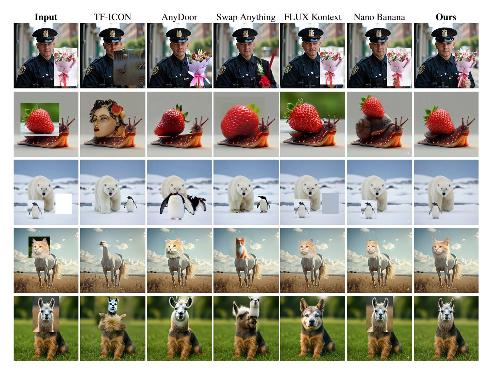

Figure 6. Qualitative comparison againt competing methods. We compare against the harmonization method TF-ICON [24], reference-and layout-guided editing approaches (AnyDoor [5], SwapAnything [13]), and high-quality foundation editing models (FLUX Kontext [21], Nano Banana [12]). Our method achieves coherent, semantically consistent blends while preserving object identity.

these modes, achieving high quality coherent blends. Furthermore, it is evident that our method excels at preserving identity and placing the cropped objects in their assigned locations. Competing methods, while sometimes producing coherent blends, struggle with identity preservation (see the raised strawberry in NanoBanana on the second row from the top).

Figure 7 presents a quantitative comparison against Any-Door [5], TF-ICON [24], SwapAnything [13] and FLUX Kontext [21]. As can be seen, our method achieves high CLIP-IQA scores while maintaining moderate LPIPS values, reflecting a balanced trade-off between visual quality and identity preservation. Notably, very low LPIPS scores over the entire image often indicate neglect, where the model fails to meaningfully integrate the pasted region.

**User study.** Since automatic metrics do not always fully capture perceptual quality or the nuances of identity preservation, we complement our quantitative evaluation with a user study. The study follows a standard two-alternative forced-choice format. Users were each shown 20 questions, each containing an input image, an output image produced by our method and another produced by one of the competing baselines. Users were instructed to rate the outputs according to: identity preservation, blending coherence, placement location accuracy, and overall quality. We collect results from 27 users, resulting in a total of 540 responses per category. As can be seen in Table 1, our method outperforms all baselines across all categories.

### 4.4. Ablations

To assess the contribution of each component in our framework, we independently remove the saliency-guided atten-

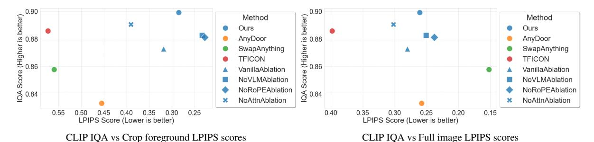

Figure 7. **Quantitative analysis of methods and ablations.** Left: CLIP-IQA score vs. LPIPS computed on the estimated foreground within the cropped region. Right: CLIP-IQA score vs. LPIPS computed over the entire image. Our method preserves the subject's identity inside the crop while maintaining overall image quality, whereas other methods either preserve the input (low LPIPS) but sacrifice global

quality (low CLIP-IQA) by neglecting the blending instruction, or maintain global quality by suppressing the crop.

Table 1. **Ours vs. Baseline Win Rates.** We report the percentage of user study votes in which our method was preferred over competing baselines. Users evaluated the edits according to four criteria: identity preservation, blending coherence, placement ac-

curacy, and overall quality.

| Baseline      | Identity Pres. | Blending | Placement | Overall |
|---------------|-------------------|----------|-----------|---------|
| AnyDoor       | 66.07             | 58.93    | 66.96     | 63.39   |
| Swap Anything | 63.39             | 50.89    | 67.86     | 55.36   |
| TF-ICON       | 74.23             | 74.23    | 75.26     | 81.44   |
| Kontext       | 59.82             | 65.18    | 65.18     | 65.18   |

tion scaling ("w/o attn scaling"), the saliency-guided RoPE modulation ("w/o RoPE scaling"), and the VLM-based parameter adjustment ("w/o VLM"). Their quantitative impact is shown in Figure 7, with corresponding qualitative examples in Figure 8. The results indicate that all components are necessary to achieve an optimal balance between image quality and identity preservation as high CLIP-IQA scores coupled with moderate LPIPS values signify effective blending. While the "w/o VLM" and "w/o RoPE scaling" variants show slightly lower LPIPS scores, this typically reflects neglect rather than genuine improvement in fidelity. The qualitative results support this observation: removing attention scaling leads to spatial drift, where the pasted content expands beyond its intended area (see the lunchbox example, top row), while removing RoPE scaling or the VLM controller results in partial (top row) or complete (bottom row) neglect in blending the pasted object.

### 5. Conclusion

We presented a prompt-free editing framework, where a user simply crops an object and injects it into a new image without any textual input. This direct operation raises the core challenge of integrating an often unnatural patch so that it blends seamlessly while retaining the source object's identity. LooseRoPE achieves this balance by modulating

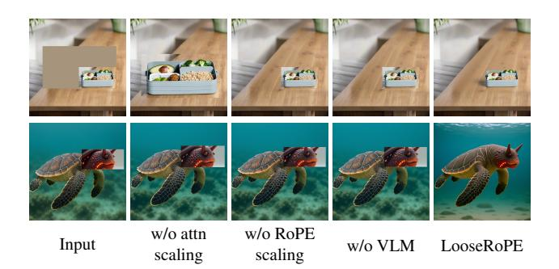

Figure 8. **Ablation effects.** Ablation experiments demonstrate the necessity of each component. In the lunch box translation, removing the attention scaling factor causes the edit to expand beyond the intended region. Ablating RoPE position scaling or VLM guidance prevents the background from being harmonized properly. In the complex edit on the bottom row, all three components are required to overcome neglect. Removing any component causes the edit to fail, whereas our full method achieves a clean blend.

positional encoding according to saliency, guiding attention to adaptively shift between preservation and harmonization.

At a broader level, our approach embodies graceful, adaptive control of attention: adjusting its field of view in response to image content rather than external prompts. This perspective points toward more general and interpretable forms of visual control, where attention itself becomes the medium of fine-grained generation.

Future exploration may extend this framework to videos, where maintaining temporal coherence during object insertion remains a central challenge. Another promising direction is to enable multiple, interrelated crops within a single scene, allowing complex compositional interactions. On a more conceptual level, deepening our understanding of the model's internal attention mechanisms could lead to context-aware modulation, where the model dynamically recognizes and corrects its own inconsistencies.

# References

- [1] Omer Bar-Tal, Lior Yariv, Yaron Lipman, and Tali Dekel. Multidiffusion: Fusing diffusion paths for controlled image generation. *arXiv preprint arXiv:2302.08113*, 2023. 3
- [2] Black Forest Labs. Flux, https://github.com/black-forest-labs/flux, 2024. 3
- [3] Tim Brooks, Aleksander Holynski, and Alexei A. Efros. Instructpix2pix: Learning to follow image editing instructions, 2023. 1, 2
- [4] Minghao Chen, Iro Laina, and Andrea Vedaldi. Training-free layout control with cross-attention guidance. *arXiv preprint arXiv:2304.03373*, 2023. 3
- [5] Xi Chen, Lianghua Huang, Yu Liu, Yujun Shen, Deli Zhao, and Hengshuang Zhao. Anydoor: Zero-shot object-level image customization. In *Proceedings of the IEEE/CVF con*ference on computer vision and pattern recognition, pages 6593–6602, 2024. 2, 3, 6, 7
- [6] Jooyoung Choi, Sungwon Kim, Yonghyun Jeong, Youngjune Gwon, and Sungroh Yoon. Ilvr: Conditioning method for denoising diffusion probabilistic models. arXiv preprint arXiv:2108.02938, 2021. 3
- [7] Wenyan Cong, Jianfu Zhang, Li Niu, Liu Liu, Zhixin Ling, Weiyuan Li, and Liqing Zhang. Dovenet: Deep image harmonization via domain verification. In *Proceedings of* the IEEE/CVF conference on computer vision and pattern recognition, pages 8394–8403, 2020. 2
- [8] Xiaodong Cun and Chi-Man Pun. Improving the harmony of the composite image by spatial-separated attention module. *IEEE Transactions on Image Processing*, 29:4759–4771, 2020. 2
- [9] Omer Dahary, Or Patashnik, Kfir Aberman, and Daniel Cohen-Or. Be yourself: Bounded attention for multi-subject text-to-image generation. In *European Conference on Computer Vision*, pages 432–448. Springer, 2024. 3
- [10] Omer Dahary, Yehonathan Cohen, Or Patashnik, Kfir Aberman, and Daniel Cohen-Or. Be decisive: Noise-induced layouts for multi-subject generation. In *Proceedings of the Special Interest Group on Computer Graphics and Interactive Techniques Conference Conference Papers*, pages 1–12, 2025. 3
- [11] Rinon Gal, Yuval Alaluf, Yuval Atzmon, Or Patashnik, Amit H. Bermano, Gal Chechik, and Daniel Cohen-Or. An image is worth one word: Personalizing text-to-image generation using textual inversion, 2022. 3
- [12] Google DeepMind. Introducing Gemini 2.5 Flash Image, our state-of-the-art image generation and editing model. https://developers.googleblog.com/en/introducing-gemini-2-5-flash-image/, 2025. Accessed: 2025-11-13. 6, 7
- [13] Jing Gu, Nanxuan Zhao, Wei Xiong, Qing Liu, Zhifei Zhang, He Zhang, Jianming Zhang, HyunJoon Jung, Yilin Wang, and Xin Eric Wang. Swapanything: Enabling arbitrary object swapping in personalized image editing. ECCV, 2024. 3, 6,
- [14] Roy Hachnochi, Mingrui Zhao, Nadav Orzech, Rinon Gal, Ali Mahdavi-Amiri, Daniel Cohen-Or, and Amit Haim

- Bermano. Cross-domain compositing with pretrained diffusion models. *arXiv preprint arXiv:2302.10167*, 2023. 3,
- [15] Byeongho Heo, Song Park, Dongyoon Han, and Sangdoo Yun. Rotary position embedding for vision transformer. In European Conference on Computer Vision, pages 289–305. Springer, 2024. 3
- [16] Amir Hertz, Ron Mokady, Jay Tenenbaum, Kfir Aberman, Yael Pritch, and Daniel Cohen-Or. Prompt-to-prompt image editing with cross attention control, 2022. 1
- [17] Jonathan Ho, Ajay Jain, and Pieter Abbeel. Denoising diffusion probabilistic models, 2020. 1
- [18] Saar Huberman, Or Patashnik, Omer Dahary, Ron Mokady, and Daniel Cohen-Or. Image generation from contextuallycontradictory prompts. arXiv preprint arXiv:2506.01929, 2025. 1
- [19] Yifan Jiang, He Zhang, Jianming Zhang, Yilin Wang, Zhe Lin, Kalyan Sunkavalli, Simon Chen, Sohrab Amirghodsi, Sarah Kong, and Zhangyang Wang. Ssh: A self-supervised framework for image harmonization. In *Proceedings of the IEEE/CVF International Conference on Computer Vision*, pages 4832–4841, 2021. 2, 6
- [20] Nupur Kumari, Bingliang Zhang, Richard Zhang, Eli Shechtman, and Jun-Yan Zhu. Multi-concept customization of text-to-image diffusion, 2023. 3
- [21] Black Forest Labs, Stephen Batifol, Andreas Blattmann, Frederic Boesel, Saksham Consul, Cyril Diagne, Tim Dockhorn, Jack English, Zion English, Patrick Esser, Sumith Kulal, Kyle Lacey, Yam Levi, Cheng Li, Dominik Lorenz, Jonas Müller, Dustin Podell, Robin Rombach, Harry Saini, Axel Sauer, and Luke Smith. Flux.1 kontext: Flow matching for in-context image generation and editing in latent space, 2025. 1, 2, 3, 6, 7
- [22] Junnan Li, Dongxu Li, Silvio Savarese, and Steven Hoi. Blip-2: Bootstrapping language-image pre-training with frozen image encoders and large language models. *arXiv* preprint arXiv:2301.12597, 2023. 3
- [23] Yuheng Li, Haotian Liu, Qingyang Wu, Fangzhou Mu, Jianwei Yang, Jianfeng Gao, Chunyuan Li, and Yong Jae Lee. Gligen: Open-set grounded text-to-image generation. In *Proceedings of the IEEE/CVF conference on computer vision and pattern recognition*, pages 22511–22521, 2023. 3
- [24] Shilin Lu, Yanzhu Liu, and Adams Wai-Kin Kong. Tf-icon: Diffusion-based training-free cross-domain image composition. In *Proceedings of the IEEE/CVF International Conference on Computer Vision*, pages 2294–2305, 2023. 2, 3, 6,
- [25] Chong Mou, Xintao Wang, Liangbin Xie, Yanze Wu, Jian Zhang, Zhongang Qi, Ying Shan, and Xiaohu Qie. T2i-adapter: Learning adapters to dig out more controllable ability for text-to-image diffusion models. *arXiv preprint arXiv:2302.08453*, 2023. 3
- [26] Gaurav Parmar, Taesung Park, Srinivasa Narasimhan, and Jun-Yan Zhu. One-step image translation with text-to-image models. arXiv preprint arXiv:2403.12036, 2024. 3
- [27] William Peebles and Saining Xie. Scalable diffusion models with transformers. In *Proceedings of the IEEE/CVF inter-*

- national conference on computer vision, pages 4195–4205, 2023. 3
- [28] Patrick Pérez, Michel Gangnet, and Andrew Blake. Poisson image editing. In *Seminal Graphics Papers: Pushing the Boundaries, Volume 2*, pages 577–582. 2023. 2
- [29] Mengwei Ren, Wei Xiong, Jae Shin Yoon, Zhixin Shu, Jianming Zhang, HyunJoon Jung, Guido Gerig, and He Zhang. Relightful harmonization: Lighting-aware portrait background replacement. In Proceedings of the IEEE/CVF Conference on Computer Vision and Pattern Recognition, pages 6452–6462, 2024. 2
- [30] Robin Rombach, Andreas Blattmann, Dominik Lorenz, Patrick Esser, and Björn Ommer. High-resolution image synthesis with latent diffusion models, 2022. 1
- [31] Nataniel Ruiz, Yuanzhen Li, Varun Jampani, Yael Pritch, Michael Rubinstein, and Kfir Aberman. Dreambooth: Fine tuning text-to-image diffusion models for subject-driven generation, 2023. 3, 1, 6
- [32] Etai Sella, Yanir Kleiman, and Hadar Averbuch-Elor. Instancegen: Image generation with instance-level instructions. In *Proceedings of the Special Interest Group on Computer Graphics and Interactive Techniques Conference Conference Papers*, pages 1–10, 2025. 3
- [33] Karen Simonyan and Andrew Zisserman. Very deep convolutional networks for large-scale image recognition. arXiv preprint arXiv:1409.1556, 2014. 7
- [34] Yang Song, Jascha Sohl-Dickstein, Diederik P Kingma, Abhishek Kumar, Stefano Ermon, and Ben Poole. Score-based generative modeling through stochastic differential equations. In *International Conference on Learning Representations*, 2020. 1
- [35] Yizhi Song, Zhifei Zhang, Zhe Lin, Scott Cohen, Brian Price, Jianming Zhang, Soo Ye Kim, and Daniel Aliaga. Objectstitch: Object compositing with diffusion model. In Proceedings of the IEEE/CVF Conference on Computer Vision and Pattern Recognition, pages 18310–18319, 2023. 2, 1
- [36] Yizhi Song, Zhifei Zhang, Zhe Lin, Scott Cohen, Brian Price, Jianming Zhang, Soo Ye Kim, He Zhang, Wei Xiong, and Daniel Aliaga. Imprint: Generative object compositing by learning identity-preserving representation. In Proceedings of the IEEE/CVF Conference on Computer Vision and Pattern Recognition, pages 8048–8058, 2024. 2
- [37] Jianlin Su, Murtadha Ahmed, Yu Lu, Shengfeng Pan, Wen Bo, and Yunfeng Liu. Roformer: Enhanced transformer with rotary position embedding. *Neurocomputing*, 568:127063, 2024. 3
- [38] Zhenxiong Tan, Songhua Liu, Xingyi Yang, Qiaochu Xue, and Xinchao Wang. Ominicontrol: Minimal and universal control for diffusion transformer. In *Proceedings of the IEEE/CVF International Conference on Computer Vision*, pages 14940–14950, 2025. 2, 3
- [39] Yi-Hsuan Tsai, Xiaohui Shen, Zhe Lin, Kalyan Sunkavalli, Xin Lu, and Ming-Hsuan Yang. Deep image harmonization. In Proceedings of the IEEE conference on computer vision and pattern recognition, pages 3789–3797, 2017. 2
- [40] Jianyi Wang, Kelvin CK Chan, and Chen Change Loy. Exploring clip for assessing the look and feel of images. In *Pro-*

- ceedings of the AAAI conference on artificial intelligence, pages 2555–2563, 2023, 6
- [41] Xierui Wang, Siming Fu, Qihan Huang, Wanggui He, and Hao Jiang. Ms-diffusion: Multi-subject zero-shot image personalization with layout guidance. *arXiv preprint arXiv:2406.07209*, 2024. 2
- [42] Yuxiang Wei, Yabo Zhang, Zhilong Ji, Jinfeng Bai, Lei Zhang, and Wangmeng Zuo. Elite: Encoding visual concepts into textual embeddings for customized text-to-image generation. arXiv preprint arXiv:2302.13848, 2023. 3
- [43] Chenfei Wu, Jiahao Li, Jingren Zhou, Junyang Lin, Kaiyuan Gao, Kun Yan, Sheng-ming Yin, Shuai Bai, Xiao Xu, Yilei Chen, et al. Qwen-image technical report. *arXiv preprint* arXiv:2508.02324, 2025. 1
- [44] Yuxin Wu, Alexander Kirillov, Francisco Massa, Wan-Yen Lo, and Ross Girshick. Detectron2. https://github.com/facebookresearch/detectron2, 2019. 4
- [45] Hu Ye, Jun Zhang, Sibo Liu, Xiao Han, and Wei Yang. Ipadapter: Text compatible image prompt adapter for text-to-image diffusion models, 2023. 3
- [46] Lvmin Zhang, Anyi Rao, and Maneesh Agrawala. Adding conditional control to text-to-image diffusion models. In *Proceedings of the IEEE/CVF international conference on computer vision*, pages 3836–3847, 2023. 3
- [47] Richard Zhang, Phillip Isola, Alexei A Efros, Eli Shechtman, and Oliver Wang. The unreasonable effectiveness of deep features as a perceptual metric. In *Proceedings of the IEEE conference on computer vision and pattern recognition*, pages 586–595, 2018. 6

# LooseRoPE: Content-aware Attention Manipulation for Semantic Harmonization

# Supplementary Material

In this document, we present additional results and discussions (Section 6), including limitations (Section 6.4), as well as providing implementation details for our method and experiments (Section 7).

### **Contents**

| 1. Introduction                                |  |
|------------------------------------------------|--|
| 2. Related Work                                |  |
| 3. Method                                      |  |
| 3.1. Preliminaries                             |  |
| 3.2. LooseRoPE                                 |  |
| 4. Experiments                                 |  |
| 4.1. Benchmark                                 |  |
| 4.2. Metrics                                   |  |
| 4.3. Comparison against Baselines              |  |
| 4.4. Ablations                                 |  |
| 5. Conclusion                                  |  |
| 6. Additional Results and Discussions          |  |
| 6.1. Additional Qualitative Results            |  |
| 6.2. Additional Quantitative Evaluation        |  |
| 6.3. Attention Locality and Harmonization Out- |  |
| comes                                          |  |
| 6.4. Limitations                               |  |
| 7. Implementation Details                      |  |
| 7.1. LooseRoPE                                 |  |
| 7.2. Experiments                               |  |
| 7.2.1 . Baselines                              |  |
| 7.2.2 . Metrics                                |  |
| 7.3. Benchmark                                 |  |

# 6. Additional Results and Discussions

# **6.1. Additional Qualitative Results**

In Figure 9 we present additional LooseRoPE outputs, compared against the outputs of our base model FLUX Kontext when given the same base prompt: "blend the cropped objects into the image in a convincing manner without changing the style of the image", and the input images presented in the "Input" columns. Additionally, we present several examples of compound edits—scenarios in which we iteratively alternate between crude editing and harmonization

(Figure 10). These examples demonstrate the robustness and consistency of our method, which maintains high visual quality and coherent blending even across multiple successive editing steps.

# 6.2. Additional Quantitative Evaluation

| Method            | CLIP-IQA (↑) | LPIPS (Full) (↓) | LPIPS (FG) (\( \psi \)) |
|-------------------|--------------|------------------|-------------------------|
| AnyDoor           | 0.831        | 0.264            | 0.510                   |
| SwapAnything      | 0.854        | 0.161            | 0.609                   |
| SwapAnything - DB | 0.846        | 0.120            | 0.528                   |
| TF-ICON           | 0.885        | 0.403            | 0.619                   |
| Qwen-Image-Edit   | 0.820        | 0.183            | 0.284                   |
| ObjectStitch      | 0.745        | 0.368            | 0.605                   |
| FLUX Kontext      | 0.870        | 0.282            | 0.365                   |
| LooseRoPE (Ours)  | 0.895        | 0.261            | 0.281                   |

Table 2. Quantitative comparison comparing LooseRoPE against competing methods. A subset of these results are also presented in Figure 7 of the main paper.

| Model Variant    | CLIP-IQA (↑) | LPIPS (Full) $(\downarrow)$ | LPIPS (FG) $(\downarrow)$ |
|------------------|--------------|-----------------------------|---------------------------|
| w/o VLM          | 0.879        | 0.253                       | 0.253                     |
| w/o RoPE         | 0.876        | 0.238                       | 0.259                     |
| w/o Attention    | 0.889        | 0.305                       | 0.423                     |
| LooseRoPE (Ours) | 0.895        | 0.261                       | 0.281                     |

Table 3. Quantitative ablation study results. These results are also presented in Figure 7 of the main paper.

In this section, we provide the comprehensive metric tables supporting the analysis presented in the main paper (Section 4), offering an extensive comparison against a broader range of competing methods (Table 2) and detailed ablation results (Table 3). Beyond the baselines reported in the main text, Table 2 includes comparison results against Qwen-Image-Edit [43], ObjectStitch [35], and Personalized SwapAnything with Dreambooth [31]. These results show that while SwapAnything-DB spends a considerable amount on learning the target concept (up to 20 minutes) it does not appear to improve its ability to harmonize. This is likely due to the fact that DreamBooth usually requires more than one image to effectively learn a concept. ObjectStitch appears to not be as well suited for our task as other competing methods, acheiving the lowest CLIP-IQA scores out of all methods tested with relatively high LPIPS scores. As for Qwen-Image-Edit, it seems more prone to neglect than the other image editing model we tested- FLUX-Kontext, acheiving lower LPIPS scores but a much lower CLIP-IQA score. This further justifies our choice of FLUX-Kontext as

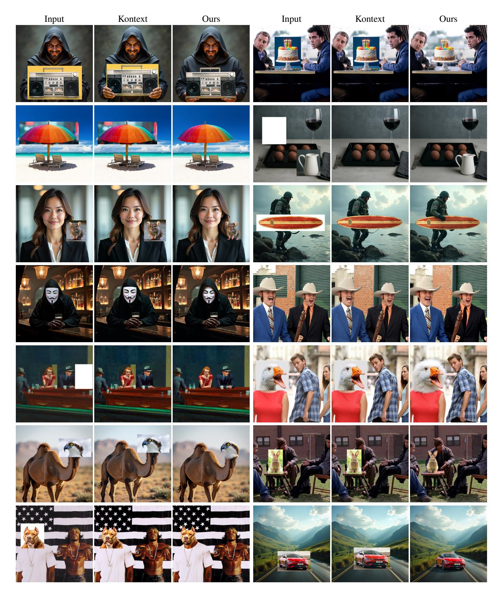

Figure 9. Additional LooseRoPE results, compared against our method's base model: FLUX Kontext.

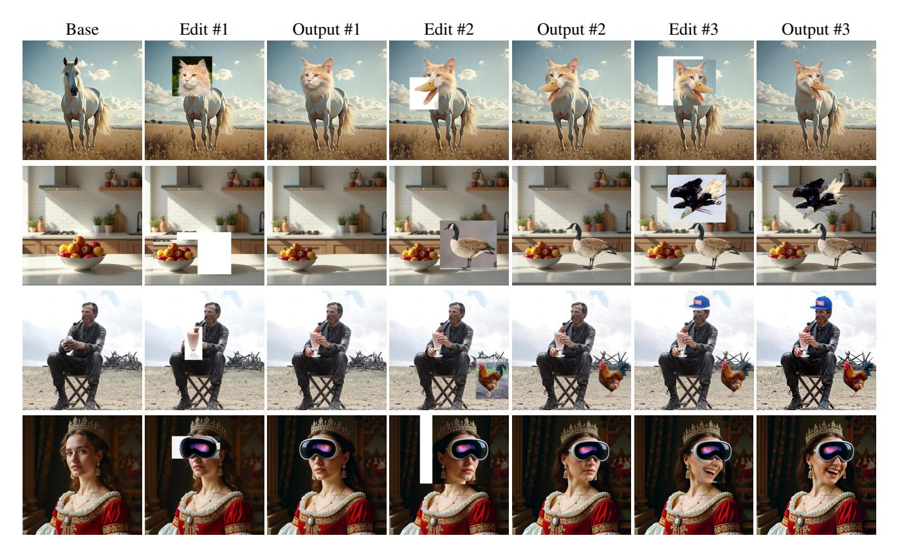

Figure 10. Compound Editing. We showcase our method's ability to make iterative compound edits.

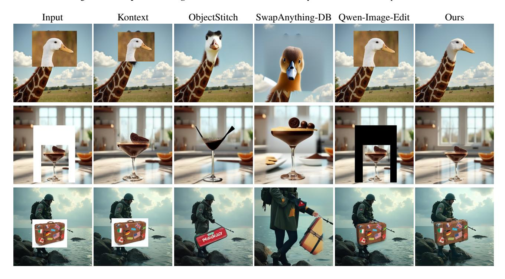

Figure 11. **Additional Comparisons**. We present comparisons against three additional baselines: SwapAynthing-DB, ObjectStitch and Qwen-Image-Edit. We also present FLUX Kontext results to emphasize our method's improvement over its base model.

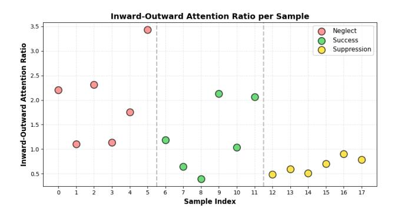

Figure 12. Inward–outward attention ratio (total attention from crop-region queries to keys inside the crop mask divided by the attention directed outside the mask) per FLUX Kontext result sample. We evaluate FLUX Kontext on our benchmark, recording the inward-outward attention ratio for each sample and categorizing the end result (either Neglect, Suppression or Success).

a base model. In addition to the quantitative results in Table 2 we also present qualitative results in Figure 11.

These extended results corroborate our primary findings, demonstrating the robustness of our method across diverse editing scenarios.

| VLM Backbone     | CLIP-IQA (↑) | LPIPS (Full) $(\downarrow)$ | LPIPS (FG) (\lambda) |
|------------------|--------------|-----------------------------|----------------------|
| Gemini Flash 2.5 | 0.899        | 0.251                       | 0.342                |
| Qwen             | 0.892        | 0.256                       | 0.346                |

Table 4. Comparing Gemini Flash 2.5 and QWEN3-VL as the VLM model used in the VLM based parameter steering mechanism component of our method. Due to usage limitations, this experiment was conducted on a subset of our benchmark.

Furthermore, we isolate the impact of the Vision Language Model (VLM) used in our "VLM-Based Parameter Steering" mechanism by comparing our default model Qwen3-VL with Gemini Flash 2.5. Due to usage limitations, this experiment was conducted on a 65-sample subset of our benchmark. The results, reported in Table 4, show that while Gemini Flash 2.5 slightly outperforms Qwen3-VL, the performance gap is marginal. This suggests that VLM reasoning capability is not a limiting factor in our framework, and that our method is largely robust to the choice of VLM backend.

We detail the exact implementation and settings for this and all other experiments conducted in this work in the next section (Section 7).

### 6.3. Attention Locality and Harmonization Outcomes

To support the claim made in the main paper, that the attention maps of instruction-based editing models inherently govern whether a pasted region is copied from the input image or modified for harmonization, we analyze the attention behavior of FLUX Kontext across our benchmark. Following the notations defined in the main paper (Section 3.2), let the queries within the pasted region be denoted as  $Q_{\rm out}[M]$ , the keys of the input image as  $K_{\rm in}$ , and the resulting attention weights as

$$W_{\rm in} = \operatorname{softmax} \left( \frac{Q_{\rm out}[M] K_{\rm in}^{\top}}{\sqrt{d}} \right),$$

where d is the feature dimension. We define the *inward-outward attention ratio* R as

$$R = \frac{\sum\limits_{q \in Q_{\text{out}}[M]} \sum\limits_{k \in M} W_{\text{in}}(q, k)}{\sum\limits_{q \in Q_{\text{out}}[M]} \sum\limits_{k \notin M} W_{\text{in}}(q, k)},$$

measuring the relative amount of attention directed inside versus outside the crop mask.

As shown in Figure 12, this ratio correlates strongly with the blending outcome. Neglect cases exhibit high ratios, indicating predominantly inward attention that causes the model to over-copy the pasted region. Suppression cases yield low ratios, reflecting outward attention that overwhelms and overwrites the inserted content. Successful edits cluster around intermediate ratios, where attention is neither overly localized nor overly dispersed. Notably, there is no clear threshold separating these regimes, suggesting that effective harmonization requires fine-grained and content-aware modulation of attention rather than a simple global increase or decrease of this ratio. This analysis demonstrates that the locality pattern of attention itself is a strong indicator—and likely driver—of whether a region is effectively harmonized or simply copied.

### 6.4. Limitations

While our approach enables robust and intuitive text-free image editing, there are several limitations to consider. First, our strong emphasis on identity preservation in salient regions often results in limited stylization flexibility. As a consequence, the visual style of the pasted object may remain inconsistent with the target scene, as seen in the first row of Figure 13, where the bulldozer blends spatially but retains a mismatched visual style relative to the illustration-like background.

Second, our method struggles with occlusions introduced by the pasted object. When important regions of the base image are covered, such as the police officer's gloves in the middle example, the model cannot recover or reason about the hidden content, leading to diminished identity preservation in the final output. Leveraging information from the occluded base image region remains an important direction for future work.

Third, our method has limited ability to accommodate significant pose changes. Since pose is partially preserved

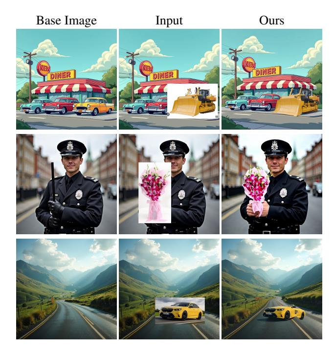

Figure 13. **Limitations.** While our method achieves strong semantic blending and identity preservation, it exhibits limited stylization flexibility (top row), struggles with occlusions (middle row), and has reduced capacity to accommodate large pose changes (bottom row). We also inherit characteristic artifacts from FLUX Kontext, such as slight enlargement and contrast shifts in preserved regions (middle row).

as part of the object identity, mismatches between the object and scene geometry can lead to unnatural warping or visible artifacts. This is evident in the bottom example, where the car is forced into a perspective that does not align naturally with the road geometry.

Finally, as our approach builds on FLUX Kontext, we inherit some of its characteristic limitations. These include slight enlargement of preserved regions and increased contrast (see the middle example in Figure 13), which can introduce subtle distortions even when identity retention is desired.

# 7. Implementation Details

# 7.1. LooseRoPE

Base Model. We base our method on the black-forest-labs/FLUX.1-Kontext-dev image editing diffusion model, specifically using the distribution available on HuggingFace at this URL. For all experiments and results presented in this paper we use a crudely edited image and the base prompt: "blend the cropped objects into the image in a convincing manner without changing the style of the image" as input. We use

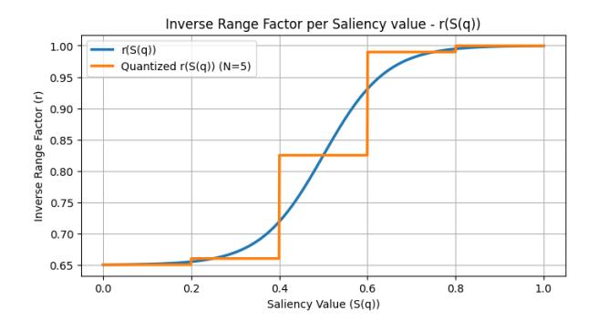

Figure 14. Inverse Range factor r as a function of a query's saliency value S(q). In practice, we quantize saliency values to N=5 different values, resultin in the step function shown in orange.

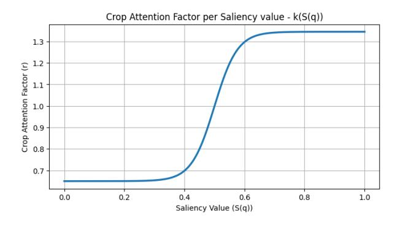

Figure 15. Attention Scale Factor k as a function of a query's saliency value S(q).

the default guidance scale of 2.5 and no negative prompts for the default 28 reverse diffusion steps.

Saliency Estimation. As discussed in Section 3.2 of the main paper, at this stage we evaluate the saliency distribution map of the crop area by extracting feature activations from a pre-trained instance detection network. Specifically, we set all pixels outside of the crop mask M in the input image to [0,0,0] and extract features from the first and second layers of the COCO-InstanceSegmentation/mask\_rcnn\_R\_50\_FPN\_3x model (available in the Detectron2 distribution) when passing the masked image through it. The features are rescaled to fit the latent image resolution of  $64 \times 64$  and averaged with eachother, after which we pass the resulting map through a 2D Gaussian filter with kernel size of  $5 \times 5$  and  $\sigma_x = \sigma_y = 1.1$  to obtain the saliency map.

**Content-Aware Attention Manipulation.** Given the saliency estimation map S, in this stage we modify the attention distribution and RoPE parameters for queries within the crop mask M according to their saliency values. This

mechanism is summarized in Algorithm 1 in the main paper. In this algorithm the inverse range value and attention scale factor assigned to each query in M are defined by the r(S(q)) and k(S(q)) functions accordingly. These functions can be parameterized as:

$$\left(\frac{\tanh(S(q)*G)}{2} + \frac{1}{2}\right) * (v_{max} - v_{min}) + v_{min} \quad (3)$$

with  $v_{max}$  and  $v_{min}$  being the maximal and minimal values the function can reach and G being a constant steepness factor. For r(S(q)) we use  $v_{max} = r_{high} = 1.0$ ,  $v_{min} = r_{low} = 0.65$  and G = 3.5. For k(S(q)) we use  $v_{max} = k_{high} = 1.34$ ,  $v_{min} = k_{low} = 0.65$  and G = 6.5. In our algorithm, each different value k(S(q)) requires rotating the query q and  $K_{in}$  accordingly. As such, this process can become very computationally inefficient. To overcome this, before passing S(q) through r(S(q)) and k(S(q)) we quantize it to N = 5 possible values evenly split between 0 and 1, resulting in r(S(q)) and k(S(q)) functioning as step functions. We plot r(S(q)) before and after quantization in Figure 14 and k(S(q)) in Figure 15.

Our algorithm operates on each of FLUX Kontext's 58 attention layers over the first 22 of 28 diffusion timesteps. Over time, we gradually relax inverse range and attention scaling factors towards their equivalent value in the default FLUX Kontext model - 1.0. Specifically, at timestep 10 we relax  $r_{low}$  to 0.9,  $k_{low}$  to 0.76 and  $k_{high}$  to 1.24 and at timestep 18 we relax  $r_{low}$  to 1.0,  $k_{low}$  to 0.84 and  $k_{high}$  to 1.17.

**VLM Based Parameter Steering** We employ a Vision-Language Model (VLM) to dynamically assess harmonization quality during inference and adjust attention modification parameters accordingly. The VLM evaluates the  $x_0$  prediction at a specific timestep during the denoising process and classifies the harmonization quality of the prediction into one of three categories: *Success, Neglect*, or *Suppression* (See section 3.2 of the main paper).

The model used Qwen3-VL-4B-Instruct (available on Hugging-Face), a 4-billion parameter vision-language model. At runtime, we provide the model with the  $x_0$  prediction at the current timestep, the input image and 6 in-context examples (2 Success, 2 Neglect, and 2 Suppression), resulting in 14 total images in the VLM input (each example includes an input image and an  $x_0$  prediction). We instruct the VLM first with the definitions for each possible case and then with guiding questions for correctly identifying the setting, alongside common cases it might encounter. We include the full instruction prompt given to the VLM alongside this manuscript (see vlm-instruction.txt).

VLM evaluation is triggered at a configurable timestep during the denoising process; in our experiments, this was set to  $t_s=2$ . This provides sufficient signal about the harmonization progress while requiring minimal backtracking in the case of a failed outcome. The VLM performs a single inference per timestep evaluation (one try), generating up to 2048 new tokens which are subsequently parsed to extract the verdict. In addition to the final verdict, the VLM was also instructed to provide its reasoning behind it. While this reasoning is not used in any way by our method, we found it useful for development and debugging purposes. Given the VLM's verdict, unless it determined a successful outcome, we either scale up or scale down the saliency map S. Specifically, we define S as:

$$S = \max\{\min\{\lambda \cdot S_{original}, 1\}, 0\} \tag{4}$$

with  $S_{original} \in [0,1]$  being the saliency extracted in the "Saliency Estimation" stage (detailed in the previous paragraph) and  $\lambda$  being a scaling factor set to 0.83 by default. If the VLM determines  $Neglect \ \lambda$  is decreased by a constant of 0.045, thereby down-scaling the saliency and as a result further encouraging blending. If Suppression is determined  $\lambda$  is increased by 0.05, up-scaling the saliency and encouraging preservation as a result. We limit the VLM steering attempts to a maximum of 4 tries.

### 7.2. Experiments

### 7.2.1. Baselines

In this section we communicate the technical details regarding each of the methods used in comparison to ours throughout our work.

**AnyDoor.** We evaluate AnyDoor using the official pretrained model available on AnyDoor's official GitHub repository. We provide AnyDoor with an image of the inserted object (or sub-object) by using the crop mask M to crop it from the input image. We then run AnyDoor with its default diffusion parameters (DDIM sampling for 50 steps and a 5.0 guidance scale).

SwapAnything. We evaluate our method against SwapAnything in two distinct configurations: non-personalized and personalized. For the non-personalized variant (SwapAnything's default configuration), we employ the Qwen2.5-VL-3B-Instruct model (using its HuggingFace distribution) to identify the subject within the crop area. Subsequently, we construct a prompt based on the identified subject, adhering to the recommendations for general object insertion provided in SwapAnything's official GitHub repository.

For the personalized variant, we train a separate Dream-Booth [31] personalized model (using DreamBooth's Hug-

gingFace distribution with default settings) for each sample, utilizing the single cropped source object as the sole training instance. The class name required for training (e.g. "dog", "chair") is derived automatically from the VLM-based subject identification step outlined above. The resulting model checkpoint and its unique identifier token are then employed during inference.

Other than using different inputs (either a textual description or a personalized model) both modes use the default settings provided in SwapAnything's repository.

FLUX Kontext. We run the black-forest-labs/FLUX.1-Kontext-dev model (same as our base model) in its HuggingFace diffusers distribution with the crudely edited image as input and the base prompt - "blend the cropped objects into the image in a convincing manner without changing the style of the image". We use the default diffusion settings (2.5 guidance scale, 28 steps and no negative prompts).

**Nano Banana.** Results for Nano Banana were acquired from the Gemini interface. Each image was generated in a new chat in which we provided the crudely edited input image and instructed the model with the prompt with the same prompt we use in our method: "blend the cropped objects into the image in a convincing manner without changing the style of the image".

**TF-ICON.** We run the pipeline provided in TF-ICON's official GitHub repository. We provide the model with an image of the foreground object or sub-object using the crop mask M and an estimated foreground mask (within the crop region) extracted with the COCO-InstanceSegmentation/mask\_rcnn\_R\_50\_FPN\_3x model. If the model did not detect a foreground object in the crop area, we assumed the entire crop region is a foreground object. We run the model in its "cross-domain" setting as we empirically found it to perform better in our setting.

**Qwen-Image.** We run the <code>Qwen/Qwen-Image-Edit</code> model available in its <code>HuggingFace</code> diffusers distribution. Similarly to how we run FLUX Kontext, with provide the crudely edited image as input and uset the base prompt "blend the cropped objects into the image in a convincing manner without changing the style of the image". We use the default 5.0 guidance scale, 50 inference steps and no negative prompts.

**ObjectStitch.** We run the pipeline provided in ObjectStitch's official GitHub repository. Similarly

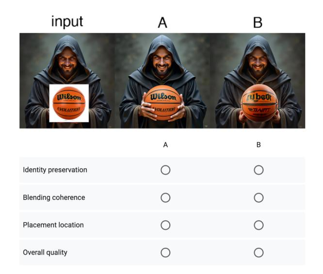

Figure 16. A sample comparison shown to users as part of our user study. Each user was shown 20 such comparisons.

to TF-ICON, we provide the model with an image of the foreground object or sub-object using the crop mask M and an estimated foreground mask (within the crop region) extracted with the COCO-InstanceSegmentation/mask\_rcnn\_R\_50\_FPN\_3x model, passing it the entire crop region as foreground if the model fails to detect an object. We use the default settings defined in the repository.

### **7.2.2.** Metrics

We now detail the technical details and settings used when calculating the quantitative metrics utilized in our work.

**CLIP-IQA.** We utilize CLIP-IQA using the default settings provided in the implementation available on CLIP-IQA's official GitHub repository.

LPIPS. We compute Perceptual Image Patch Similarity (LPIPS) scores using the official pytorch implementation (available on GitHub) using the traditional VGG [33] features. We calculate the both the perceptual similarity of the entire output image to the entire input image (denoted as "LPIPS (Full)" and the similarity of the estimated foreground object (or sub-object) in the input image to the matching area in the output image (denoted as "LPIPS (FG)". For the latter, we use an estimated foreground mask (within the crop region) extracted with the COCo-InstanceSegmentation/mask\_rcnn\_R\_50\_FPN\_3x model, and assume the foreground is the entire crop region if the model fails to detect an object.

User Preference. To evaluate the perceptual quality of our edits, we conducted a user study utilizing three distinct forms, each containing 20 comparisons. We compared our method against four baselines: Kontext, TF-ICON, SwapAnything, and Anydoor, allocating 5 examples per method within each form. Participants rated the images based on identity preservation, blending coherence, placement location accuracy, and overall quality. In total, the study encompassed 60 unique comparisons that were sampled at random from the dataset (3 forms  $\times$  20 comparisons). The exact instruction given to the users in the start of each survey is as follows:

In this study, you will compare two different editing methods (labeled A and B). Both methods aim to apply the edit given on the left (input image), so that the crop will be inserted into the image in a convincing manner.

Some of the questions involve a translation task, in which we cut a region and move it to another location in the image.

The layout of every image provided is input image, method a, method b

We ask you to judge which method does better, by answering four questions:

- 1. Identity preservation Which edit better preserves the identity of the pasted subject?
- 2.Blending coherence Which edit executes the blend in a more convincing and coherent manner, without artifacts?
- 3.Placement location Is the new subject in the image located and oriented correctly?
- 4.Overall quality Which edit do you prefer overall?

A sample comparison shown to users is presented in Figure 16. Overall, the user study was answered by 27 users, resulting in a total of 540 responses per category.

### 7.3. Benchmark

Our benchmark consists of 150 examples in total, spanning a wide variety of settings, styles and compositions, each defined by a base image and a crudely edited version of it. 60% of base images were synthesized and 40% taken from

the web. As for the crops pasted on the base images- 13% originated from the base image itself, with the rest inserted from off-the-web images.