# **Positional Encoding Field**

Yunpeng Bai\* University of Texas at Austin

byp215@utexas.edu

# Haoxiang Li Pixocial Technology

haoxiang.li@pixocial.com

# Qixing Huang University of Texas at Austin

huangqx@cs.utexas.edu

## **Abstract**

Diffusion Transformers (DiTs) have emerged as the dominant architecture for visual generation, powering stateof-the-art image and video models. By representing images as patch tokens with positional encodings (PEs), DiTs combine Transformer scalability with spatial and temporal inductive biases. In this work, we revisit how DiTs organize visual content and discover that patch tokens exhibit a surprising degree of independence: even when PEs are perturbed, DiTs still produce globally coherent outputs, indicating that spatial coherence is primarily governed by PEs. Motivated by this finding, we introduce the Positional Encoding Field (PE-Field), which extends positional encodings from the 2D plane to a structured 3D field. PE-Field incorporates depth-aware encodings for volumetric reasoning and hierarchical encodings for fine-grained sub-patch control, enabling DiTs to model geometry directly in 3D space. Our PE-Field-augmented DiT achieves state-of-the-art performance on single-image novel view synthesis and generalizes to controllable spatial image editing. Project page and code are available at: https://yunpeng1998.github.io/PE-Field-HomePage/.

# 1. Introduction

Diffusion Transformers (DiTs) [25] have rapidly emerged as the dominant architecture in visual generation, forming the backbone of recent state-of-the-art image and video models such as Flux.1 Kontext [16], Qwen-Image [43], CogVideo [46], and Wan [39]. By encoding images into sequences of patch tokens and applying 2D positional encodings (PEs) [38], DiTs leverage the scalability of Transformers while preserving the spatial inductive biases necessary for visual synthesis. This design has enabled remarkable progress, supporting high-fidelity image generation and temporally coherent video synthesis (where additional temporal PEs are employed).

Despite their empirical success, the internal mechanisms by which DiTs organize and compose visual content remain relatively underexplored. In this work, we begin with a simple yet striking observation: patch tokens in DiTs exhibit a surprising degree of independence. When positional encodings are reshuffled or perturbed, the model still produces globally coherent output, though with patches reorganized according to the altered PEs. This suggests that spatial coherence in DiTs is primarily enforced by positional encodings rather than by explicit token-to-token dependencies and that manipulating PEs alone can induce structured reconfiguration of spatial content. This property offers a new avenue for spatially controllable generation, where images can be reorganized according to PEs transformation without modifying the token content itself.

Building on this insight, we focus on single-image novel view synthesis (NVS) and extend the positional encodings of DiTs beyond the 2D image plane into a structured 3D field, which we term the Positional Encoding Field (PE-Field). The PE-Field introduces two key innovations: First, we extend standard 2D RoPE [35] to a 3D depth-aware encoding, embedding tokens in a volumetric field that supports reasoning across viewpoints. Second, we design a hierarchical scheme that subdivides tokens into finer subpatch levels, allowing different sub-vectors to capture spatial information at varying granularities. Together, these designs transform DiTs into a geometry-aware generative framework that reasons directly in a 3D positional encoding field. As a result, our approach achieves state-of-the-art results in novel view synthesis (NVS) from a single image, and naturally generalizes to spatial editing tasks, where manipulating the PE-Field enables structured control of image content at both global and local levels.

Our contributions are as follows: 1) We show that DiTs can reorganize image content purely through positional encodings, revealing a previously underexplored property that enables structured spatial editing. 2) We introduce a depthaugmented positional encoding field that embeds tokens into a 3D space, enabling volumetric reasoning and geometric consistency. 3) We extend DiTs with multi-level positional encodings, allowing fine-grained spatial control

\*This work was conducted during an internship at Pixocial Technology.

at sub-patch granularity. **4)** Our PE-Field-augmented DiT achieves state-of-the-art results on novel view synthesis (NVS) from a single image, and further generalizes to spatial image editing tasks.

### 2. Related Works

### 2.1. Novel view synthesis

Novel view synthesis (NVS) is a widely studied and discussed problem which can be broadly divided into two categories: methods based on multiple input images and those based on a single input image. In this work, we focus on the latter. The simplest approach is to directly use a feedforward model [10, 12] to generate novel views from an input image. Such methods typically rely on learning intermediate, general 3D representations from data. For example, early works adopt multi-plane representations [8, 37, 54], PixelNeRF [48] employs NeRF [23] as the 3D representation, LRM [10] uses tri-plane representations, and 3D-GS [13] has also been adopted by methods such as PixelSplat [3]. Other methods [24, 27, 28, 42] incorporate additional results from monocular reconstruction to provide an explicit geometric structure, where warping into the target view is used which is then followed by inpainting to synthesize novel views.

Recently, with the breakthrough of diffusion-based generative models, an increasing number of works have investigated the use of diffusion models for NVS, including GeNVS [2], Zero-1-to-3 [20], ZeroNVS [30], and CAT3D [7, 45]. However, directly encoding camera pose conditions as text embeddings makes it difficult to precisely control viewpoint changes. Reconfusion [44] uses PixelNeRF [48] features as diffusion conditions, but consistency across views cannot be guaranteed. The paradigm of monocular reconstruction followed by warping and inpainting has also been adopted in diffusion-based methods [1, 5, 33, 49, 50], where diffusion is used for the inpainting stage. However, reprojection errors in the warped image may disrupt the semantics of the source image and are difficult to correct during inpainting. To address this issue, GenWarp [31] proposes to use warped 2D coordinates as input instead of directly warping the image, and this idea has been extended to videos in later work [32]. However, since view transformation inherently occurs in 3D space, relying solely on 2D coordinates remains ambiguous, and these methods require training additional branches to handle coordinate input. Many video-based models [4, 11, 18, 26, 34, 36, 52] incorporate camera control to achieve NVS, but when only the target view is required, generating intermediate frames is unnecessary. CausNVS [15] also explores an autoregressive approach for novel view synthesis.

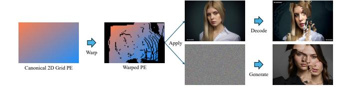

Figure 1. Illustration of DiT patch-level independence. When positional encodings (PEs) of image tokens or noise tokens are perturbed, the decoded or generated outputs still produce semantically meaningful images. The resulting structures follow the warping imposed by the PE modification, while boundaries between patches remain visually distinct.

### 2.2. DiTs for image generation and editing

Diffusion Transformers (DiTs) were first introduced by [25], who replaced the commonly used U-Net backbone in diffusion models [29] with a pure Transformer architecture. This design leveraged the scalability and flexibility of Transformers while retaining the generative power of diffusion, and has since become the foundation of many stateof-the-art image and video generation models. Building on DiT, subsequent works such as Stable Diffusion 3 (SD3) [6], Flux.1 Kontext [16], Qwen-Image [43], CogVideo [46], and Wan [39] have established DiT as the main backbone for large-scale generative modeling. Owing to its flexible architecture, DiT can be naturally extended by incorporating the tokens of a context image directly into the input sequence, enabling end-to-end image editing within the same generative framework. This simple yet effective strategy has been widely adopted in current mainstream editing models [16, 43], demonstrating the versatility of DiTs for controllable generation tasks. In contrast, we propose equipping DiTs with a 3D-aware hierarchical positional encoding field, enabling controllable and geometry-aware generation and editing solely through transformations on positional encodings.

### 3. Method

### 3.1. Token manipulation for view synthesis

### Patch-level independence in DiT-based generative mod-

els. DiT-based architectures model image generation by patchifying the input and representing each patch as a token with a 2D positional encoding (PE). While tokens collectively reconstruct the image, we find that each token mainly encodes its local patch and retains a degree of independence. As shown in Figure 1 (Top), reshuffling the 2D PEs and reordering tokens leads to images reorganized according to the new layout, with clear patch boundaries indicating independent decoding. This independence also appears during denoising: as shown in Figure 1 (Bottom), perturbing PEs of noise tokens still yields globally coherent results (e.g., a face) but with block-wise discontinuities

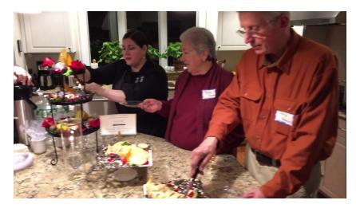

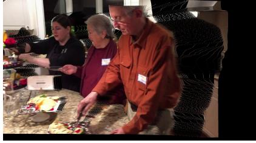

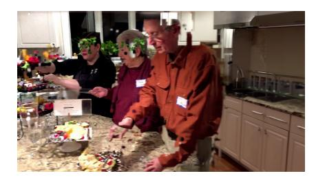

Input image

Reconstruction & View Transformation

Direct generation

Figure 2. Illustration of our direct novel view synthesis (NVS) Results. We apply 2D positional encodings (PEs) derived from 3D reconstruction and view transformation directly to the source-view image tokens. Using these modified tokens as image conditions in DiT enables direct generation of a relatively accurate novel-view image.

aligned with the modified positions. These findings suggest that global coherence is largely enforced by PEs, enabling the possibility of spatial editing by manipulating token positions through their PEs without altering token content.

Towards novel view synthesis via token manipulation. In this work, we mainly want to leverage these findings to address novel view synthesis (NVS) problem from a single image. A straightforward solution is to perform single-view 3D reconstruction followed by view transformation and inpainting, but this pipeline is often prone to errors [31]. Instead, we directly manipulate DiT's image token positions: conditioned on the source reconstruction and target camera pose, we reassign positional encodings so that tokens migrate to their new projected locations. This allows recomposing image content under novel viewpoints within the DiT generative process, avoiding errors from direct imagespace warping. As shown in Figure 2, this approach demonstrates a partial but effective ability to perform NVS, but artifacts remain due to: (1) resolution mismatch—positional grids from patch tokens (e.g.,  $16 \times 16$  pixels) are coarser than dense 3D reconstructions, limiting alignment precision. The manipulation can only rearrange image content at the patch level, but it cannot alter the content within each patch. and (2) depth ambiguity—multiple 3D points may project to the same token location. Without explicit mechanisms to disambiguate depth, generated tokens can collapse into inconsistent local structures. To adapt DiTs for NVS through positional encoding transformations, we introduce two key modifications to the existing PE design, extending it into a structured 3D field representation.

# **3.2.** Multi-level positional encodings for sub-patch detail modeling

In the current DiT architecture, each image patch is represented as a single token, i.e., a one-dimensional vector  $\mathbf{x}_i \in \mathbb{R}^d$ , which is fed into the transformer for computation. Within the transformer, multi-head self-attention (MHA) is applied by projecting  $\mathbf{x}_i$  into multiple sub-

spaces (heads),  $h \in \{1, ..., H\}$  with per-head dimension  $d_h$  (typically  $d_h = d/H$ ) enabling the model to capture diverse relationships across tokens. Current mainstream DiT models, such as Flux and SD3, first obtain queries, keys, and values by linear projections of the hidden states:  $Q = XW_Q, K = XW_K, V = XW_V, X \in$  $\mathbb{R}^{B \times T \times d}.$  The results are then reshaped into H heads with per-head dimension  $d_h = d/H$ :  $Q, K, V \in \mathbb{R}^{B \times T \times d} \rightarrow$  $\mathbb{R}^{B \times H \times T \times d_h}$ . For each head, attention is computed as  $\operatorname{head}^{(h)} = \operatorname{softmax}\left(\frac{Q^{(h)}K^{(h)^{\top}}}{\sqrt{d_h}}\right)V^{(h)}$ . Finally, the outputs of all heads are concatenated and projected back to dimension d. However, all heads share the same positional encodings (specifically RoPEs [35]), which are tied to patch-level locations. Thus, although each token is divided across multiple heads for modeling, it still encodes the holistic content of an entire patch, without explicitly capturing finer-grained details within the patch.

We argue that this design limits the transformer's ability to capture sub-patch structures that are crucial for tasks involving fine spatial transformations, such as novel view synthesis. Our goal is not to discard the different correspondences already learned by different heads at the patch level, but rather to enrich them with intra-patch detail modeling. To this end, we build directly on the head-splitting structure of MHA, augmenting it with multi-level hierarchical positional encodings so that each head's subspace captures not only patch-level information but also finer-grained details, while remaining highly compatible with the original architecture since the finer-level PEs differ little from the original ones.

Concretely, we retain a subset of heads that use the original patch-level RoPE ( $l_h=0$ ) to preserve the pretrained global structure, while other heads adopt finergrained RoPEs derived from higher resolution grids (see Figure 3). At level  $l_h=0$ , each positional encoding corresponds to the original patch-level RoPE (e.g., one token covers  $16\times16$  pixels). When moving to higher levels, the positional grid resolution is increased: each step

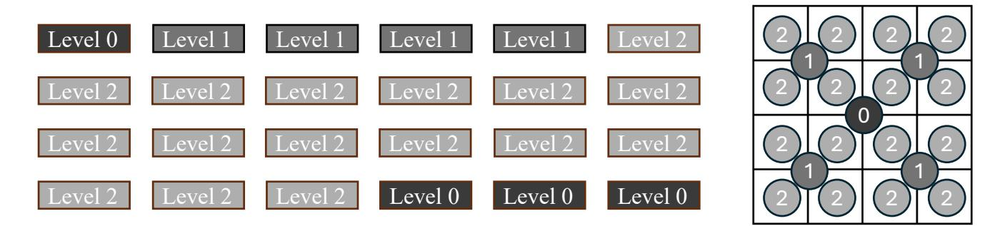

Figure 3. Illustration of hierarchical RoPE allocation in Flux (24 heads). Each rectangle on the left represents the subvector computed by one head, with colors indicating the RoPE level. Black denotes the original patch-level RoPE (l=0), covers a 256 pixels patch. Level l=1 corresponds to 64 pixels, and level l=2 to 16 pixels. The square on the right represents a patch corresponding to one token, illustrating how different levels of positional encodings map to their respective 2D spatial locations, where l=2 corresponds to a 1/16-sized patch.

doubles the resolution along both axes, so the effective cell size shrinks by a factor of 2 per axis (i.e., by 4 in area). Let  $\{\text{RoPE}^{(l_h)}\}_{l_h=0}^{M-1}$  denote the hierarchy of positional encodings, where larger  $l_h$  corresponds to higher spatial resolution (doubling per axis per level). Queries and keys in head h are rotated by the level-specific RoPE:  $\mathbf{Q}_h = \text{RoPE}^{(l_h)}(Q^{(h)}), \mathbf{K}_h = \text{RoPE}^{(l_h)}(K^{(h)}).$  We automatically choose the number of levels M from the total number of heads H in the pretrained architecture:

$$M = \lfloor \log_4(3H+1) \rfloor, \qquad W = \frac{4^M-1}{3},$$

where W is the cumulative geometric series  $1+4+\cdots+4^{M-1}$ , which represents the total number of hierarchical heads that can be accommodated under the current architecture. Each head index  $h \in \{1,\ldots,H\}$  maps directly to a level via the rule that exactly matches the geometric quotas  $1:4:16:\cdots$  whose total sums to W, and falls back to the original RoPE (l=0) for surplus heads:

$$l_h = \begin{cases} \lceil \log_4(3h+1) \rceil - 1, & h \le W, \\ 0, & h > W, \end{cases} [0, M-1].$$

Any heads beyond the geometric budget W default to l=0 to minimize disruption of pretrained patch-level priors. Taking Flux as an example, we divide each sub-vector into three levels: In Flux, there are 24 heads in total. The first head corresponds to l=0, i.e., the original patch-level RoPE. Heads 2–5 are assigned to l=1, and heads 6–21 to l=2. The remaining heads 22–24 cannot be allocated under this scheme and are therefore reassigned back to l=0. As illustrated in Figure 3, different colors indicate different PE levels. The coarsest level corresponds to a  $16\times 16$ -pixel patch, while the finest level corresponds to a  $4\times 4$ -pixel patch. This hierarchical design enables flexible spatial transformations: direct manipulations of sub-

patch RoPE yield local geometric adjustments in the reconstruction while preserving pretrained patch-level correspondences.

# 3.3. Depth-aware rotary positional encoding

In standard 2D RoPE, the horizontal (x) and vertical (y) coordinates are encoded independently. Each axis is assigned a dedicated subspace of the embedding vector, within which a 1D RoPE is applied. Concretely, the token vector is partitioned into two segments, one modulated by the RoPE corresponding to the horizontal coordinate x and the other by the RoPE for the vertical coordinate y. This factorized scheme ensures that the dot product of two rotated queries and keys encodes relative displacements along both axes, while keeping the rotations invertible and dimensionally consistent.

To allow DiT to leverage positional encodings for reasoning about depth relationships between tokens that overlap in the 2D projection, following the above principle, we extend RoPE to include a third spatial axis for depth, which refers to the distance of each pixel's corresponding 3D point from the camera along the optical axis (that is, its z coordinate in the camera coordinate system). In addition to the subspaces for (x, y), we introduce another subspace for the depth z. Each coordinate (x, y, z) thus has its own 1D RoPE encoding, applied to a disjoint part of the embedding vector:

$$\mathbf{Q}^{(h)} = \left[ \text{RoPE}_{x}^{(l_h)}(\mathbf{Q}_{x}^{(h)}), \text{RoPE}_{y}^{(l_h)}(\mathbf{Q}_{y}^{(h)}), \\ \text{RoPE}_{z}^{(l_h)}(\mathbf{Q}_{z}^{(h)}) \right], \\ \mathbf{K}^{(h)} = \left[ \text{RoPE}_{x}^{(l_h)}(\mathbf{K}_{x}^{(h)}), \text{RoPE}_{y}^{(l_h)}(\mathbf{K}_{y}^{(h)}), \\ \text{RoPE}_{z}^{(l_h)}(\mathbf{K}_{z}^{(h)}) \right],$$

where  $\mathbf{Q}_{x}^{(h)}, \mathbf{Q}_{y}^{(h)}, \mathbf{Q}_{z}^{(h)}$  (and  $\mathbf{K}_{x}^{(h)}, \mathbf{K}_{y}^{(h)}, \mathbf{K}_{z}^{(h)}$ ) denote the corresponding vector segments allocated to each axis.

This extension yields a 3D spatial RoPE that encodes relative offsets not only in the image plane but also along the depth axis, enabling the Transformer to model volumetric correspondences and maintain geometric consistency across viewpoints.

# 3.4. Overall architecture and training objective

These two components together form a new 3D field-based positional encoding, which we apply to the DiT architecture to jointly process noise tokens and source-view image tokens, resulting in our NVS-DiT model. As illustrated in Figure 4, noise tokens are placed on a regular 2D grid with depth initialized to zero, while source-view image tokens are projected into the target camera view via monocular reconstruction and view transformation. Each image token is assigned a hierarchical 3D positional encoding (x, y, z)that captures its detailed target spatial location and depth. Tokens projected outside the valid grid are discarded, and empty positions are filled with noise tokens, which are progressively refined by the transformer to generate geometrically consistent content. This design enables the model to integrate observed image evidence with generative completion, achieving novel view synthesis within the DiT framework.

To train the model, we leverage multi-view supervision under a rectified-flow [21] objective. Specifically, we adopt the rectified flow–matching loss:

$$\mathcal{L}_{\theta} = \mathbb{E}_{t \sim p(t), x_{tgt}, x_{src}} \left[ \left\| v_{\theta}(z_t, t, x_{src}) - (\varepsilon - x_{tgt}) \right\|_2^2 \right],$$

where  $x_{src}$  and  $x_{tgt}$  denote the image tokens of the source view with transformed PEs and the target view, respectively, obtained by the corresponding DiT's VAE encoder.  $z_t$  is the linearly interpolated latent between clean latent  $x_{tgt}$  and Gaussian noise  $\varepsilon \sim \mathcal{N}(0,1)$ , defined as  $z_t = (1-t)x_{tgt} + t\varepsilon$ .

# 4. Experiments

### 4.1. Implementation details

Our model is built on Flux.1 Kontext [16], which generates images conditioned jointly on a text prompt and a reference image. This architecture naturally aligns with our design, as it already integrates reference-image tokens, providing a seamless foundation for incorporating our PE-Field framework. We remove its text input and condition solely on the reference image. To train our NVS model, we use two multi-view datasets, DL3DV [19] and MannequinChallenge [17], both processed with VGGT [40] to obtain perimage depth maps and corresponding camera poses.

### 4.2. Comparisons with relevant methods

We mainly compare our approach with several baseline methods (listed in Table 1) in the single-image novel view synthesis setting. Experiments are conducted on three datasets, Tanks-and-Temples [14], RE10K [54], and DL3DV [19]. In each case, a single input image is provided, and subsequent frames are generated under different target viewpoints. For methods that require depth or point cloud as conditional input, we uniformly use the predictions obtained from VGGT as input. We then calculated three metrics, PSNR, SSIM [41], and LPIPS [51], and reported the average scores for all test samples in Table 1. Our method outperforms existing approaches across all metrics on all three datasets. Qualitative comparison with a subset of representative methods is presented in Figure 5. We observe that GEN3C often propagates reconstruction artifacts into the final results, leading to noticeable white streaks and irregular boundaries. NVS-Solver and ViewCrafter tend to introduce depth-warping errors, which negatively affect the geometric accuracy of the synthesized novel views. Gen-Warp produces unsatisfactory results due to the absence of depth information in its coordinate representation and the misalignment between its coordinate system and the input image. It is worth noting that, unlike many video-based models listed here, our approach does not require generating intermediate frames between viewpoints, making it over an order of magnitude faster than video-based method to generate target view while still producing geometrically consistent results.

Beyond pose-conditioned approaches, recent image editing models such as Flux.1 Kontext [16] and Qwen-Image-Edit [43] also demonstrate strong capabilities in viewpoint manipulation. We further compare our method with these prompt-based editing results, as illustrated in Figure 6. Flux is generally insensitive to prompts specifying spatial viewpoint changes, often producing only minor viewpoint variations while introducing noticeable artifacts. Qwen, on the other hand, achieves more pronounced spatial editing effects than Flux, but tends to alter the original image tokens. As shown in the rightmost example of Figure 6, the result appears overly smoothed and even alters the person's identity. Overall, it remains very challenging to precisely control viewpoint changes through prompts.

#### 4.3. Ablation studies

We mainly analyze the effect of removing our two key components: the hierarchical detailed positional encodings and the additional depth-aware extension. The quantitative impact of removing each component can be observed in Table 1, while Figure 7 provides two illustrative cases. As shown in the top example of Figure 7, when the multi-level positional encoding (particularly the detailed level) is removed, undesirable distortions appear due to the mismatch

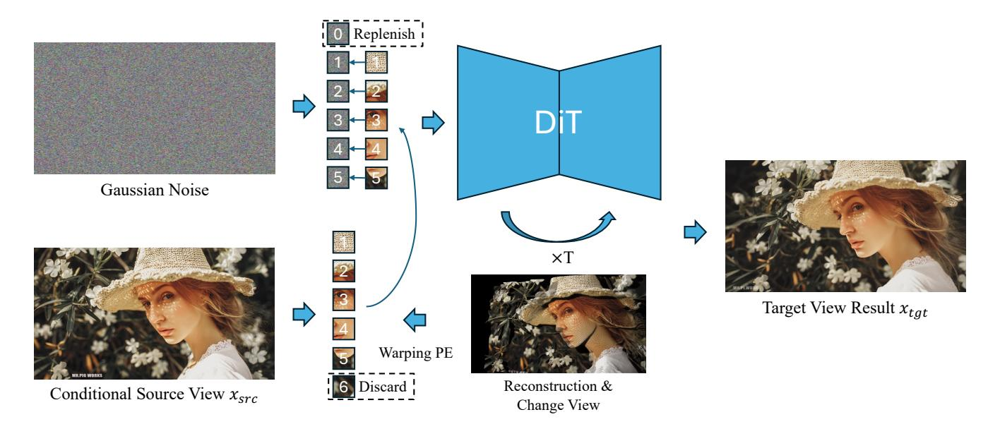

Figure 4. The transformer takes both noise tokens and source-view image tokens. Noise tokens are placed on a 2D grid with depth set to zero, while image tokens are assigned hierarchical PEs according to their projected positions from monocular reconstruction and view transformation, with depth values taken from the reconstruction. Tokens projected outside the grid (e.g., index 6) are discarded, and empty grid locations without image tokens (e.g., index 0) are filled by noise, which is refined to generate plausible content.

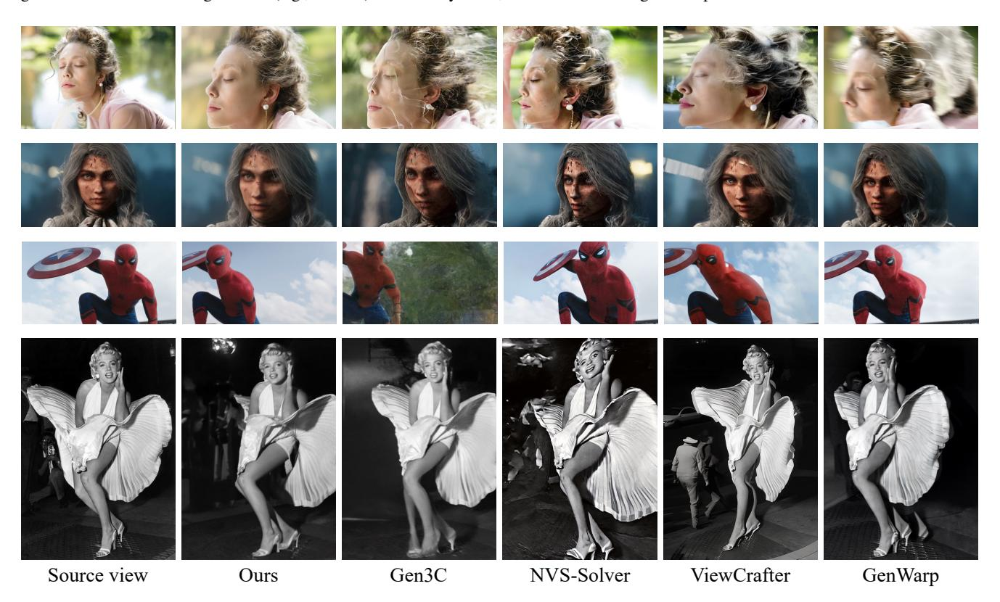

Figure 5. Visualization of novel view synthesis results where the source image (left) is rotated  $30^{\circ}$  to the right. Compared with other methods, our approach achieves accurate viewpoint transformation while preserving consistency with the source image and avoiding noticeable artifacts.

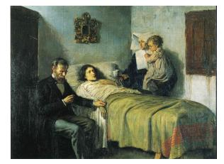

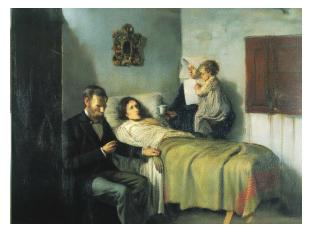

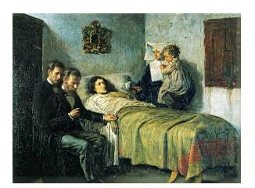

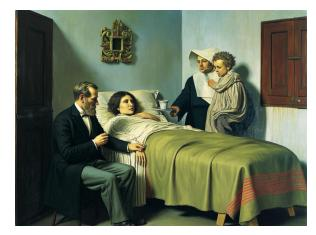

Input Ours

Qwen-Image-Edit

Figure 6. Comparison with prompt-based image editing methods. Our approach enables accurate control of rotation angles while maintaining consistency with the input image.

| Method           | Tanks-and-Temples |       |        | RE10K |       |        | DL3DV |       |        |
|------------------|-------------------|-------|--------|-------|-------|--------|-------|-------|--------|
|                  | PSNR↑             | SSIM↑ | LPIPS↓ | PSNR↑ | SSIM↑ | LPIPS↓ | PSNR↑ | SSIM↑ | LPIPS↓ |
| ZeroNVS [30]     | 13.14             | 0.327 | 0.516  | 15.23 | 0.540 | 0.386  | 14.17 | 0.441 | 0.481  |
| CameraCtrl [9]   | 15.34             | 0.534 | 0.331  | 17.74 | 0.681 | 0.278  | 16.31 | 0.552 | 0.352  |
| GenWarp [31]     | 16.45             | 0.513 | 0.377  | 15.30 | 0.538 | 0.371  | 15.81 | 0.531 | 0.382  |
| NVS-Solver [47]  | 16.73             | 0.521 | 0.323  | 17.00 | 0.673 | 0.314  | 16.86 | 0.543 | 0.341  |
| ViewCrafter [49] | 17.18             | 0.589 | 0.346  | 17.75 | 0.681 | 0.315  | 17.24 | 0.571 | 0.329  |
| DimensionX [36]  | 17.78             | 0.635 | 0.228  | 18.21 | 0.717 | 0.307  | 18.22 | 0.653 | 0.201  |
| SEVA [53]        | 17.61             | 0.621 | 0.235  | 17.58 | 0.688 | 0.334  | 18.01 | 0.638 | 0.214  |
| MVGenMaster [1]  | 18.03             | 0.622 | 0.253  | 17.87 | 0.701 | 0.321  | 17.71 | 0.586 | 0.277  |
| See3D [22]       | 18.35             | 0.641 | 0.244  | 18.24 | 0.735 | 0.293  | 18.41 | 0.631 | 0.215  |
| Voyager [11]     | 18.61             | 0.669 | 0.238  | 18.56 | 0.723 | 0.264  | 18.84 | 0.636 | 0.227  |
| FlexWorld [4]    | 18.91             | 0.675 | 0.236  | 18.03 | 0.691 | 0.282  | 18.67 | 0.645 | 0.218  |
| GEN3C [26]       | 19.18             | 0.681 | 0.207  | 20.64 | 0.754 | 0.229  | 19.14 | 0.658 | 0.198  |
| Original PE      | 20.03             | 0.683 | 0.221  | 20.17 | 0.752 | 0.233  | 19.92 | 0.667 | 0.201  |
| w/o Depth        | 20.63             | 0.692 | 0.217  | 20.33 | 0.767 | 0.227  | 20.46 | 0.695 | 0.194  |
| w/o Multi-Level  | 21.97             | 0.718 | 0.180  | 21.42 | 0.809 | 0.168  | 21.91 | 0.733 | 0.162  |
| Ours             | 22.12             | 0.732 | 0.174  | 21.65 | 0.816 | 0.162  | 22.23 | 0.742 | 0.154  |

Table 1. Quantitative comparison of different methods on Tanks-and-Temples, RE10K, and DL3DV datasets. We report the average PSNR, SSIM, and LPIPS scores for novel view synthesis from a single input image.

between patch-level positional encodings and the reconstruction. When depth information is removed (see bottom example in Figure 7), the generated images suffer from severe spatial misalignment.

When applying our method to generate results under large viewpoint changes, the model is required to directly generate a substantial amount of unseen content, which increases the generation burden and may compromise consistency with the source image. To mitigate this issue, we decompose the transformation into multiple steps, in which the model only needs to complete a small portion of the missing content in each step. As shown in Figure 8, we divide the transformation of the target viewpoint into five steps. After each step, the newly generated content is fused back into the image tokens of the original viewpoint, and the fused tokens (or point cloud) are then transformed to the next intermediate viewpoint for subsequent generation. Compared to directly transforming to the target viewpoint

in one step (rightmost result in Figure 8), this progressive strategy produces results that are more consistent with the source view.

# 4.4. Other applications

After training, our NVS model acquires the ability to reason over visual tokens in 3D space and generate consistent content. Consequently, it can naturally adapt to other tasks with similar spatial logic, even in the **absence of task-specific training**. As illustrated in Figure 9, in the left example we perform object-level 3D editing by isolating the point cloud of the book, rotating it to a new viewpoint, and recomposing it with the original background. In the right example, we achieve object removal by discarding the tokens corresponding to the masked human region and replenishing them with noise, resulting in a realistic removal effect.

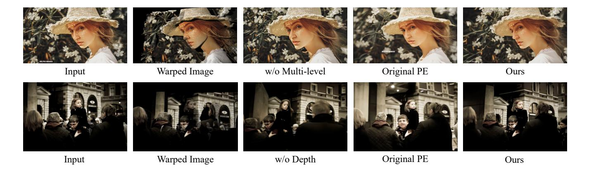

Figure 7. Ablation studies. Removing the detailed positional encoding or depth leads to different types of degradation in the generated results.

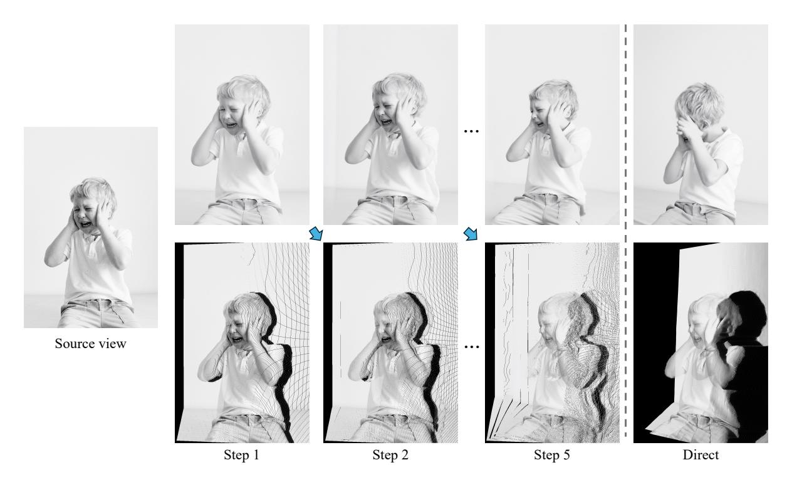

Figure 8. Multi-step generation. Left: input image. Top: generated results. Bottom: rotated point clouds. Right: direct one-step generation.

### 5. Conclusions

In this work, we revisited the internal mechanisms of Diffusion Transformers and revealed that spatial coherence is largely governed by positional encodings rather than explicit token interactions. Building on this observation, we introduced the Positional Encoding Field (PE-Field), which extends standard 2D encodings into a 3D, depth-aware and hierarchical framework. This design equips DiTs with geometry-aware generative capabilities, achieving state-of-the-art results on single-image novel view synthesis while also enabling flexible and controllable spatial image edit-

ing. We hope our study sheds light on the overlooked role of positional encodings and inspires future research into more principled and spatially grounded generative architectures.

# References

- [1] Chenjie Cao, Chaohui Yu, Shang Liu, Fan Wang, Xiangyang Xue, and Yanwei Fu. Mvgenmaster: Scaling multi-view generation from any image via 3d priors enhanced diffusion model. In *Proceedings of the Computer Vision and Pattern Recognition Conference*, pages 6045–6056, 2025. 2, 7
- [2] Eric R Chan, Koki Nagano, Matthew A Chan, Alexander W

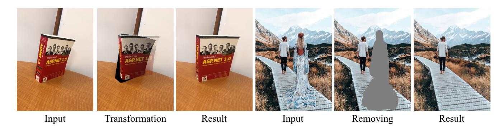

Figure 9. Applications. The left example shows object 3D editing, while the right example shows object removal, highlighting the versatility of our model in different spatial editing tasks.

- Bergman, Jeong Joon Park, Axel Levy, Miika Aittala, Shalini De Mello, Tero Karras, and Gordon Wetzstein. Generative novel view synthesis with 3d-aware diffusion models. In *ICCV*, 2023. 2
- [3] David Charatan, Sizhe Lester Li, Andrea Tagliasacchi, and Vincent Sitzmann. pixelsplat: 3d gaussian splats from image pairs for scalable generalizable 3d reconstruction. In CVPR, 2024. 2
- [4] Luxi Chen, Zihan Zhou, Min Zhao, Yikai Wang, Ge Zhang, Wenhao Huang, Hao Sun, Ji-Rong Wen, and Chongxuan Li. Flexworld: Progressively expanding 3d scenes for flexiable-view synthesis. *arXiv preprint arXiv:2503.13265*, 2025. 2, 7
- [5] Jaeyoung Chung, Suyoung Lee, Hyeongjin Nam, Jaerin Lee, and Kyoung Mu Lee. Luciddreamer: Domain-free generation of 3d gaussian splatting scenes. *arXiv preprint arXiv:2311.13384*, 2023. 2
- [6] Patrick Esser, Sumith Kulal, Andreas Blattmann, Rahim Entezari, Jonas Müller, Harry Saini, Yam Levi, Dominik Lorenz, Axel Sauer, Frederic Boesel, et al. Scaling rectified flow transformers for high-resolution image synthesis. In Forty-first international conference on machine learning, 2024. 2
- [7] Ruiqi Gao, Aleksander Holynski, Philipp Henzler, Arthur Brussee, Ricardo Martin-Brualla, Pratul Srinivasan, Jonathan T Barron, and Ben Poole. Cat3d: Create anything in 3d with multi-view diffusion models. arXiv preprint arXiv:2405.10314, 2024. 2
- [8] Yuxuan Han, Ruicheng Wang, and Jiaolong Yang. Single-view view synthesis in the wild with learned adaptive multiplane images. In *SIGGRAPH Conference*, 2022. 2
- [9] Hao He, Yinghao Xu, Yuwei Guo, Gordon Wetzstein, Bo Dai, Hongsheng Li, and Ceyuan Yang. Cameractrl: Enabling camera control for text-to-video generation. *arXiv preprint arXiv:2404.02101*, 2024. 7
- [10] Yicong Hong, Kai Zhang, Jiuxiang Gu, Sai Bi, Yang Zhou, Difan Liu, Feng Liu, Kalyan Sunkavalli, Trung Bui, and Hao Tan. Lrm: Large reconstruction model for single image to 3d. In *ICLR*, 2024. 2
- [11] Tianyu Huang, Wangguandong Zheng, Tengfei Wang, Yuhao Liu, Zhenwei Wang, Junta Wu, Jie Jiang, Hui Li, Rynson WH Lau, Wangmeng Zuo, et al. Voyager: Long-range

- and world-consistent video diffusion for explorable 3d scene generation. *arXiv preprint arXiv:2506.04225*, 2025. 2, 7
- [12] Haian Jin, Hanwen Jiang, Hao Tan, Kai Zhang, Sai Bi, Tianyuan Zhang, Fujun Luan, Noah Snavely, and Zexiang Xu. Lvsm: A large view synthesis model with minimal 3d inductive bias. In *The Thirteenth International Conference* on Learning Representations, 2025. 2
- [13] Bernhard Kerbl, Georgios Kopanas, Thomas Leimkühler, and George Drettakis. 3d gaussian splatting for real-time radiance field rendering. ACM TOG, 2023. 2
- [14] Arno Knapitsch, Jaesik Park, Qian-Yi Zhou, and Vladlen Koltun. Tanks and temples: Benchmarking large-scale scene reconstruction. ACM Transactions on Graphics (ToG), 36 (4):1–13, 2017. 5
- [15] Xin Kong, Daniel Watson, Yannick Strümpler, Michael Niemeyer, and Federico Tombari. Causnvs: Autoregressive multi-view diffusion for flexible 3d novel view synthesis. arXiv preprint arXiv:2509.06579, 2025. 2
- [16] Black Forest Labs, Stephen Batifol, Andreas Blattmann, Frederic Boesel, Saksham Consul, Cyril Diagne, Tim Dockhorn, Jack English, Zion English, Patrick Esser, Sumith Kulal, Kyle Lacey, Yam Levi, Cheng Li, Dominik Lorenz, Jonas Müller, Dustin Podell, Robin Rombach, Harry Saini, Axel Sauer, and Luke Smith. Flux.1 kontext: Flow matching for in-context image generation and editing in latent space, 2025. 1, 2, 5
- [17] Zhengqi Li, Tali Dekel, Forrester Cole, Richard Tucker, Noah Snavely, Ce Liu, and William T Freeman. Mannequinchallenge: Learning the depths of moving people by watching frozen people. *IEEE Transactions on Pattern Analysis* and Machine Intelligence, 43(12):4229–4241, 2020. 5
- [18] Hanwen Liang, Junli Cao, Vidit Goel, Guocheng Qian, Sergei Korolev, Demetri Terzopoulos, Konstantinos N Plataniotis, Sergey Tulyakov, and Jian Ren. Wonderland: Navigating 3d scenes from a single image. In *Proceedings of the Computer Vision and Pattern Recognition Conference*, pages 798–810, 2025. 2
- [19] Lu Ling, Yichen Sheng, Zhi Tu, Wentian Zhao, Cheng Xin, Kun Wan, Lantao Yu, Qianyu Guo, Zixun Yu, Yawen Lu, et al. Dl3dv-10k: A large-scale scene dataset for deep learning-based 3d vision. In *Proceedings of the IEEE/CVF*

- Conference on Computer Vision and Pattern Recognition, pages 22160–22169, 2024. 5
- [20] Ruoshi Liu, Rundi Wu, Basile Van Hoorick, Pavel Tok-makov, Sergey Zakharov, and Carl Vondrick. Zero-1-to-3: Zero-shot one image to 3d object. In *ICCV*, 2023. 2
- [21] Xingchao Liu, Chengyue Gong, and Qiang Liu. Flow straight and fast: Learning to generate and transfer data with rectified flow. arXiv preprint arXiv:2209.03003, 2022. 5
- [22] Baorui Ma, Huachen Gao, Haoge Deng, Zhengxiong Luo, Tiejun Huang, Lulu Tang, and Xinlong Wang. You see it, you got it: Learning 3d creation on pose-free videos at scale. In Proceedings of the Computer Vision and Pattern Recognition Conference, pages 2016–2029, 2025. 7
- [23] Ben Mildenhall, Pratul P Srinivasan, Matthew Tancik, Jonathan T Barron, Ravi Ramamoorthi, and Ren Ng. Nerf: Representing scenes as neural radiance fields for view synthesis. In ECCV, 2020.
- [24] Byeongjun Park, Hyojun Go, and Changick Kim. Bridging implicit and explicit geometric transformation for singleimage view synthesis. *IEEE TPAMI*, 2024. 2
- [25] William Peebles and Saining Xie. Scalable diffusion models with transformers. In *Proceedings of the IEEE/CVF International Conference on Computer Vision (ICCV)*, pages 4195–4205, 2023. 1, 2
- [26] Xuanchi Ren, Tianchang Shen, Jiahui Huang, Huan Ling, Yifan Lu, Merlin Nimier-David, Thomas Müller, Alexander Keller, Sanja Fidler, and Jun Gao. Gen3c: 3d-informed world-consistent video generation with precise camera control. In *Proceedings of the Computer Vision and Pattern Recognition Conference*, pages 6121–6132, 2025. 2, 7
- [27] Chris Rockwell, David F Fouhey, and Justin Johnson. Pixel-synth: Generating a 3d-consistent experience from a single image. In *ICCV*, 2021. 2
- [28] Robin Rombach, Patrick Esser, and Björn Ommer. Geometry-free view synthesis: Transformers and no 3d priors. In *ICCV*, 2021. 2
- [29] Robin Rombach, Andreas Blattmann, Dominik Lorenz, Patrick Esser, and Björn Ommer. High-resolution image synthesis with latent diffusion models. In *Proceedings of* the IEEE/CVF conference on computer vision and pattern recognition, pages 10684–10695, 2022. 2
- [30] Kyle Sargent, Zizhang Li, Tanmay Shah, Charles Herrmann, Hong-Xing Yu, Yunzhi Zhang, Eric Ryan Chan, Dmitry Lagun, Li Fei-Fei, Deqing Sun, and Jiajun Wu. ZeroNVS: Zero-shot 360-degree view synthesis from a single real image. In CVPR, 2024. 2, 7
- [31] Junyoung Seo, Kazumi Fukuda, Takashi Shibuya, Takuya Narihira, Naoki Murata, Shoukang Hu, Chieh-Hsin Lai, Seungryong Kim, and Yuki Mitsufuji. Genwarp: Single image to novel views with semantic-preserving generative warping. *Advances in Neural Information Processing Systems*, 37:80220–80243, 2024. 2, 3, 7
- [32] Junyoung Seo, Jisang Han, Jaewoo Jung, Siyoon Jin, Joungbin Lee, Takuya Narihira, Kazumi Fukuda, Takashi Shibuya, Donghoon Ahn, Shoukang Hu, et al. Vid-camedit: Video camera trajectory editing with generative rendering from estimated geometry. arXiv preprint arXiv:2506.13697, 2025.

- [33] Jaidev Shriram, Alex Trevithick, Lingjie Liu, and Ravi Ramamoorthi. Realmdreamer: Text-driven 3d scene generation with inpainting and depth diffusion. *arXiv preprint arXiv:2404.07199*, 2024. 2
- [34] Chenxi Song, Yanming Yang, Tong Zhao, Ruibo Li, and Chi Zhang. Worldforge: Unlocking emergent 3d/4d generation in video diffusion model via training-free guidance. arXiv preprint arXiv:2509.15130, 2025. 2
- [35] Jianlin Su, Murtadha Ahmed, Yu Lu, Shengfeng Pan, Wen Bo, and Yunfeng Liu. Roformer: Enhanced transformer with rotary position embedding. *Neurocomputing*, 568:127063, 2024. 1, 3
- [36] Wenqiang Sun, Shuo Chen, Fangfu Liu, Zilong Chen, Yueqi Duan, Jun Zhang, and Yikai Wang. Dimensionx: Create any 3d and 4d scenes from a single image with controllable video diffusion. arXiv preprint arXiv:2411.04928, 2024. 2, 7
- [37] Richard Tucker and Noah Snavely. Single-view view synthesis with multiplane images. In CVPR, 2020. 2
- [38] Ashish Vaswani, Noam Shazeer, Niki Parmar, Jakob Uszkoreit, Llion Jones, Aidan N Gomez, Łukasz Kaiser, and Illia Polosukhin. Attention is all you need. In *NeurIPS*, 2017.
- [39] Team Wan, Ang Wang, Baole Ai, Bin Wen, Chaojie Mao, Chen-Wei Xie, Di Chen, Feiwu Yu, Haiming Zhao, Jianxiao Yang, et al. Wan: Open and advanced large-scale video generative models. arXiv preprint arXiv:2503.20314, 2025. 1, 2
- [40] Jianyuan Wang, Minghao Chen, Nikita Karaev, Andrea Vedaldi, Christian Rupprecht, and David Novotny. Vggt: Visual geometry grounded transformer. In *Proceedings of the Computer Vision and Pattern Recognition Conference*, pages 5294–5306, 2025. 5
- [41] Zhou Wang, Alan C Bovik, Hamid R Sheikh, and Eero P Simoncelli. Image quality assessment: from error visibility to structural similarity. *IEEE TIP*, 13(4):600–612, 2004. 5
- [42] Olivia Wiles, Georgia Gkioxari, Richard Szeliski, and Justin Johnson. Synsin: End-to-end view synthesis from a single image. In *CVPR*, 2020. 2
- [43] Chenfei Wu, Jiahao Li, Jingren Zhou, Junyang Lin, Kaiyuan Gao, Kun Yan, Sheng-ming Yin, Shuai Bai, Xiao Xu, Yilei Chen, et al. Qwen-image technical report. arXiv preprint arXiv:2508.02324, 2025. 1, 2, 5
- [44] Rundi Wu, Ben Mildenhall, Philipp Henzler, Keunhong Park, Ruiqi Gao, Daniel Watson, Pratul P Srinivasan, Dor Verbin, Jonathan T Barron, Ben Poole, et al. Reconfusion: 3d reconstruction with diffusion priors. In CVPR, 2024. 2
- [45] Rundi Wu, Ruiqi Gao, Ben Poole, Alex Trevithick, Changxi Zheng, Jonathan T Barron, and Aleksander Holynski. Cat4d: Create anything in 4d with multi-view video diffusion models. In *Proceedings of the Computer Vision and Pattern Recognition Conference*, pages 26057–26068, 2025. 2
- [46] Zhuoyi Yang, Jiayan Teng, Wendi Zheng, Ming Ding, Shiyu Huang, Jiazheng Xu, Yuanming Yang, Wenyi Hong, Xiaohan Zhang, Guanyu Feng, et al. Cogvideox: Text-to-video diffusion models with an expert transformer. *arXiv preprint arXiv:2408.06072*, 2024. 1, 2
- [47] Meng You, Zhiyu Zhu, Hui Liu, and Junhui Hou. Nvs-solver: Video diffusion model as zero-shot novel view synthesizer. arXiv preprint arXiv:2405.15364, 2024. 7

- [48] Alex Yu, Vickie Ye, Matthew Tancik, and Angjoo Kanazawa. pixelnerf: Neural radiance fields from one or few images. In Proceedings of the IEEE/CVF Conference on Computer Vision and Pattern Recognition, pages 4578–4587, 2021. 2
- [49] Wangbo Yu, Jinbo Xing, Li Yuan, Wenbo Hu, Xiaoyu Li, Zhipeng Huang, Xiangjun Gao, Tien-Tsin Wong, Ying Shan, and Yonghong Tian. Viewcrafter: Taming video diffusion models for high-fidelity novel view synthesis. *arXiv preprint arXiv:2409.02048*, 2024. 2, 7
- [50] Jingbo Zhang, Xiaoyu Li, Ziyu Wan, Can Wang, and Jing Liao. Text2nerf: Text-driven 3d scene generation with neural radiance fields. *IEEE TVCG*, 2024. 2
- [51] Richard Zhang, Phillip Isola, Alexei A Efros, Eli Shechtman, and Oliver Wang. The unreasonable effectiveness of deep features as a perceptual metric. In *CVPR*, 2018. 5
- [52] Songchun Zhang, Huiyao Xu, Sitong Guo, Zhongwei Xie, Hujun Bao, Weiwei Xu, and Changqing Zou. Spatial-crafter: Unleashing the imagination of video diffusion models for scene reconstruction from limited observations. *arXiv* preprint arXiv:2505.11992, 2025. 2
- [53] Jensen Jinghao Zhou, Hang Gao, Vikram Voleti, Aaryaman Vasishta, Chun-Han Yao, Mark Boss, Philip Torr, Christian Rupprecht, and Varun Jampani. Stable virtual camera: Generative view synthesis with diffusion models. arXiv preprint arXiv:2503.14489, 2025. 7
- [54] Tinghui Zhou, Richard Tucker, John Flynn, Graham Fyffe, and Noah Snavely. Stereo magnification: Learning view synthesis using multiplane images. ACM TOG, 2018. 2, 5