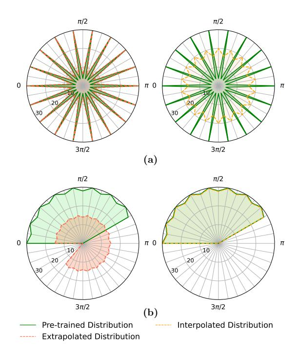
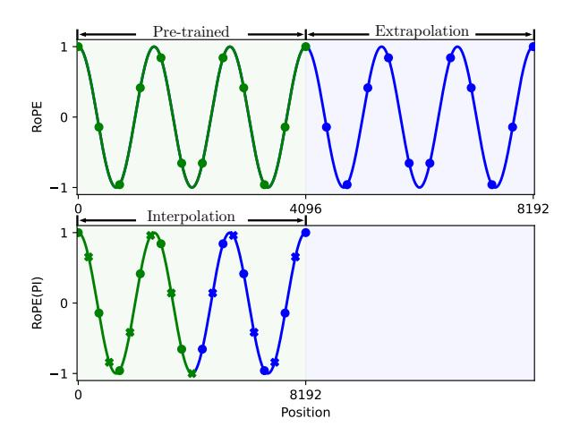
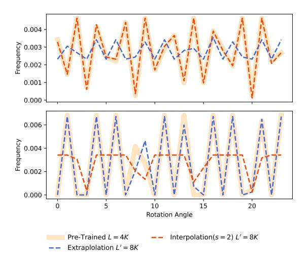
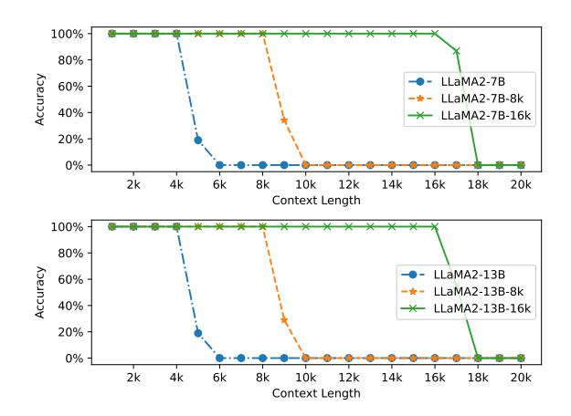
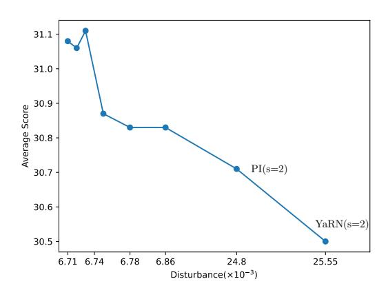
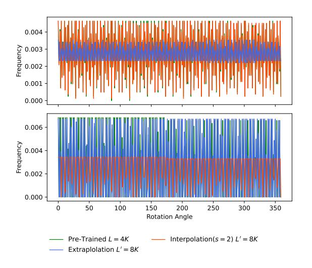
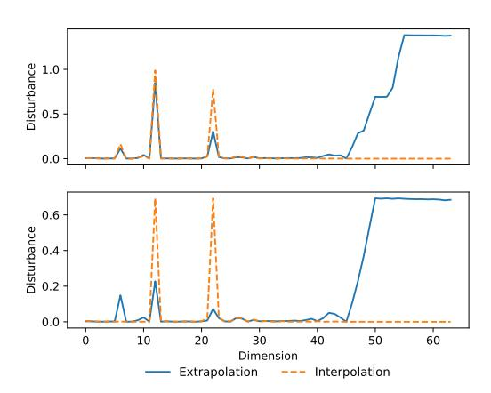
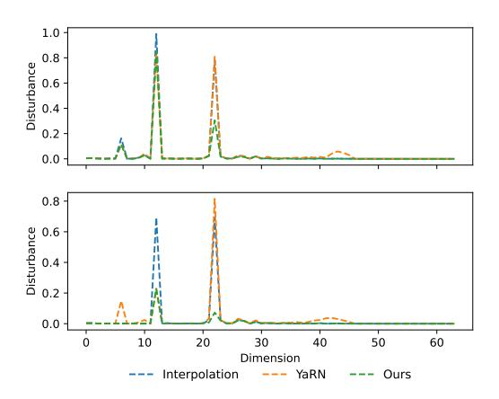

# Extending Context Window of Large Language Models from a Distributional Perspective

Yingsheng Wu1\*, Yuxuan Gu1\*, Xiaocheng Feng1, Weihong Zhong1, Dongliang Xu2, Qing Yang2, Hongtao Liu,2 Bing Qin1

1Harbin Institute of Technology, Harbin, China
2Du Xiaoman (Beijing) Science Technology Co., Ltd.
{yswu,yxgu,xcfeng,whzhong,qinb}@ir.hit.edu.cn
{xudongliang,yangqing,liuhongtao}@duxiaoman.com

## **Abstract**

Scaling the rotary position embedding (RoPE) has become a common method for extending the context window of RoPE-based large language models (LLMs). However, existing scaling methods often rely on empirical approaches and lack a profound understanding of the internal distribution within RoPE, resulting in suboptimal performance in extending the context window length. In this paper, we propose to optimize the context window extending task from the view of rotary angle distribution. Specifically, we first estimate the distribution of the rotary angles within the model and analyze the extent to which length extension perturbs this distribution. Then, we present a novel extension strategy that minimizes the disturbance between rotary angle distributions to maintain consistency with the pre-training phase, enhancing the model's capability to generalize to longer sequences. Experimental results compared to the strong baseline methods demonstrate that our approach reduces by up to 72% of the distributional disturbance when extending LLaMA2's context window to 8k, and reduces by up to 32% when extending to 16k. On the LongBench-E benchmark, our method achieves an average improvement of up to 4.33% over existing state-of-the-art methods. Furthermore, our method maintains the model's performance on the Hugging Face Open LLM benchmark after context window extension, with only an average performance fluctuation ranging from -0.12 to +0.22. Our code is available at https: //github.com/1180301012/DPRoPE.

# 1 Introduction

Given the remarkable capabilities of transformerbased large language models (LLMs) in addressing a wide range of natural language processing tasks (OpenAI, 2023; Touvron et al., 2023a,b; Jiang et al.,

Figure 1: Rotary angle distributions of extrapolation and interpolation methods in two different dimensions, compared with the pre-trained angle distribution. (a) In one dimension, the extrapolated rotary angle distribution fits more closely with the pre-trained distribution. (b) In another dimension, the interpolated distribution fits better with the pre-trained distribution.

2024), modeling arbitrarily long textual sequences remains a significant challenge. On the one hand, LLMs trained on short sequences often encounter out-of-distribution (OOD) issues when applied to the longer ones (Liu et al., 2023). On the other hand, training an LLM with extremely long context windows (i.e., the maximal sequence length) from scratch is expensive and inefficient. Currently, the most popular approach is pre-training a large language model, such as LLaMA, Qwen2 (Touvron et al., 2023a,b; Team, 2024), with a limited context window and the rotary position embedding (RoPE, Su et al. (2021)). During the inference

\* Equal Contribution

stage, the context window is dynamically extended via fine-tuning or tuning-free position interpolation strategies (Chen et al., 2023; Peng et al., 2023; Liu et al., 2023) on the rotary position embedding.

However, these position interpolation strategies primarily rely on intuition and are developed from an empirical perspective, resulting in a lack of interpretability (Zhao et al., 2023) and sub-optimal performance for context extension. For example, PI (Chen et al., 2023) equally stretches all dimensions of the RoPE with the context extension ratio. YaRN (Peng et al., 2023) observes that heuristically utilizing different strategies for different dimensions yields better performance. However, the reasons behind this phenomenon have not been thoroughly investigated, resulting in it likely not achieving the best results. Moreover, the optimal hyperparameters determined experimentally in YaRN potentially hinder its generalization to new model settings.

To bridge the gap between experiments and theoretical analysis, we tackle context window extension from the view of rotary angle distribution. Hence, we propose a method for length extension strategy selection, which has the potential to be theoretically optimal by minimizing the perturbation to the rotary angle distributions of the pre-trained language model. Specifically, we first compare the pre-training rotary angle distribution with the distributions introduced by interpolation and extrapolation. As illustrated in Figure 1(a), interpolation can introduce too many OOD angles that have a frequency of 0 in the pre-training distribution, indicating a significant disturbance to the original distribution and posing a challenge for the model to adapt to the new distribution. While direct extrapolation may have a negligible impact on the distribution. Contrarily in another dimension demonstrated in Figure 1(b), direct extrapolation introduces numerous OOD angles in this situation, causing a severe distribution disturbance, whereas interpolation performs better.

From such distributional view, we find that the consistency between the pre-training rotary angle distribution and the extension distribution varies across different dimensions. Thus, we propose to employ different extension strategies in different dimensions according to the rotary angle distribution. We first approximate the distributions of rotary angles by calculating the frequency of angles in minimal discrete intervals. Then, we estimate the disturbance introduced by different extension strategies by computing the distance between the

interpolated or extrapolated distribution and the original one. Finally, we determine the most appropriate extension strategy for each rotary angle dimension independently.

Experiments across LLMs of different sizes and various long-context tasks demonstrate the effectiveness of our distributional approach. We outperform the strong extension baselines PI (Chen et al., 2023) and YaRN (Peng et al., 2023) on LongBench-E (Bai et al., 2023), achieving a new state-of-the-art. Besides, our method achieves 100% accuracy on passkey retrieval (Mohtashami and Jaggi, 2023) and matches the performance of original LLMs on short-text tasks in the HuggingFace Open LLM Leaderboard (Face, 2023). In summary, our contributions are as follows:

- We are the first, to the best of our knowledge, to analyze the context window extension from a distributional perspective, where rotary angle distributions are observed to be crucial.
- We propose a novel method to minimize the perturbation to the distribution when applying position interpolation for context extension.
- Experimental results demonstrate that we can surpass existing long-text extension methods on both long-text and short-text benchmarks.

# 2 Preliminaries

# 2.1 Rotary Position Embedding (RoPE)

Rotary position embedding (Su et al., 2021) is a position embedding method widely used in recent LLMs, which have weak extrapolation properties for long text modeling and context window extension. As demonstrated in the upper part of Figure 2, OOD position indices can be directly extrapolated when corresponding rotary angles are periodic. Given a d-dimensional attention head, the mth token's rotary matrix  $\mathcal{R}_m^d$  is defined:

$$\mathcal{R}_{m}^{d} = \begin{bmatrix} \dots & 0 & 0 & 0 & 0 \\ \dots & \dots & 0 & 0 & 0 & 0 \\ 0 & 0 & \cos(m\theta_{i}) & -\sin(m\theta_{i}) & 0 & 0 \\ 0 & 0 & \sin(m\theta_{i}) & \cos(m\theta_{i}) & 0 & 0 \\ 0 & 0 & 0 & 0 & \dots & \dots \\ 0 & 0 & 0 & 0 & \dots & \dots \end{bmatrix}$$

$$(1)$$

where  $i \in [0, d/2 - 1]$  and  $\theta_i = 10000^{-\frac{2i}{d}}$ , where the hyperparameter 10000 is the default base of RoPE (Su et al., 2021). Suppose the input of a single attention head is  $x_1, \dots, x_l \in \mathbb{R}^d$ , where l

Figure 2: An example of context window extension, where green and blue points denote pre-trained and OOD position indices. **Upper**: Extrapolation directly models position indices with RoPE. **Lower**: Interpolation mitigates the OOD problem of position indices while introducing unseen rotary angles (cross points).

is the sequence length and d is the dimension of an attention head. With trainable parameters  $\mathbf{W}_q$  and  $\mathbf{W}_k$ , the the attention logit  $\mathbf{q}_m^{\top}\mathbf{k}_n$  with RoPE can be calculate as follows:

$$\mathbf{q}_{m}^{\top}\mathbf{k}_{n} = (\mathcal{R}_{m}^{d}\mathbf{W}_{q}x_{m})^{\top}(\mathcal{R}_{n}^{d}\mathbf{W}_{k}x_{n})$$
$$= x_{m}^{\top}\mathbf{W}_{q}\mathcal{R}_{n-m}^{d}\mathbf{W}_{k}x_{n}$$
(2)

where  $\mathcal{R}_{n-m}^d = (\mathcal{R}_m^d)^T \mathcal{R}_n^d$  (Su et al., 2021).

## 2.2 Position Interpolation (PI)

As shown in the lower part of Figure 2, PI (Chen et al., 2023) suggests linear interpolation to all dimensions to keep position indices within the pretrained range. When extending the context window from L to L', with the scaling factor s = L'/L, the new  $\hat{\theta}_i$  is scaled correspondingly as  $\hat{\theta}_i = \theta_i/s$ . Although alleviating OOD position indices, this approach is likely to disturb the original periodicity and add unseen rotary angles.

## **2.3 YaRN**

For each dimension pair (2i, 2i+1) in RoPE, Peng et al. (2023) define its wavelength as follows:

$$\lambda_{2i} = \lambda_{2i+1} = 2\pi/\theta_i = 2\pi \cdot 10000^{\frac{2i}{d}}.$$
 (3)

YaRN (Peng et al., 2023) argues that high-frequency dimensions should employ less scaling, significantly improving the performance of positional interpolation. They introduce the ratio  $r_i$  between the original context size L and the wavelength  $\lambda_i$ , which is  $r_i = L/\lambda_i$ , and apply different

scaling strategies to each dimension according to  $r_i$ . Given two threshold hyperparameters  $\alpha$ ,  $\beta$ , YaRN modifies the RoPE as follows:

$$\hat{\theta}_{i} = \begin{cases} \theta_{i}/s, & \text{if } r_{i} < \alpha \\ \theta_{i}, & \text{if } r_{i} > \beta , \\ (1 - \gamma_{i})\theta_{i}/s + \gamma_{i}\theta_{i}, & \text{otherwise} \end{cases}$$
 (4)

where s is the scaling factor and  $\gamma_i = (r_i - \alpha)/(\beta - \alpha)$ . As shown in eq. (4), extrapolation is used for high-frequency dimensions  $(r_i > \beta)$ , while interpolation is used for low-frequency dimensions  $(r_i < \alpha)$ . Others are deployed with NTK-aware (bloc97, 2023b,a) methods. Peng et al. (2023) empirically suggest  $\alpha = 1$  and  $\beta = 32$  for LLaMAs.

## 3 Method

In this section, we first introduce how to estimate the rotary angle distribution. Then, we propose a novel approach that extends the context window of LLMs by minimizing the disturbance of the rotary angle distribution.

## 3.1 Rotary Angle Distribution

LLMs generate language sequences by sampling from the learned distribution  $p(x) = \prod_m p(x_m|x_{< m})$ , where the position order is implicitly controlled by position embedding. This means that changes in the distribution of position embedding will have an impact on the language distribution. Thus, we need to model this distribution and maintain its consistency when extending the context window.

As illustrated in eq. (1), rotary angles  $\Theta_m^i = (m\theta_i \mod 2\pi)$  of a specific dimension i are finite discrete numbers during the pre-training stage, since  $0 \le m < L, m \in \mathbb{N}$ . Considering them as sampled from the rotary angle distribution, we can statistically estimate this distribution. We divide the rotary range  $[0, 2\pi)$  uniformly into b intervals, where the kth interval in ith dimension is defined:

Intervalki = 
$$\left[\frac{2k\pi}{b}, \frac{2(k+1)\pi}{b}\right)$$
, (5)

where k = 0, ..., b-1, we set the default value of b to 360. The frequency of rotary angles  $F_k^i(L)$  in each interval is calculated as:

$$F_k^i(L) = \left| \left\{ \Theta_m^i \in \operatorname{Interval}_k^i, \ \forall m \in [0, L) \right\} \right| / L. \tag{6}$$

Therefore, the discrete probability density function of rotary angle distribution at the *i*th dimension is:

$$P_L^i(\Theta \in \text{Interval}_k^i) = F_k^i(L),$$
 (7)

Figure 3: The learned rotary angle distributions of LLaMA2. We demonstrate the 6th and 22nd dimensions during pre-training within the 4k length, and the corresponding rotary angle distributions when extended to 8k via interpolation and extrapolation, respectively. We set the number of intervals to b=360 and we only display the first 24 intervals for clarity. The distributions of full intervals are provided in appendix A.1.

where there is 
$$\sum\limits_{k=0}^{b-1}P_L^i(\Theta\in \mathrm{Interval}_k^i)=1.$$

Take LLaMA2-7B as an example, where L=4kand d = 128, we analyze the rotary angle distribution of pre-trained parameters. We demonstrate the distributions in Figure 3, which vary significantly as the dimension changes. When extending the context window to L', such as L' = 8k, we consider two scenarios for each dimension: interpolation with the scaling factor s = 2 and direct extrapolation. Consistency of the distributions derived by these two extension approaches with the original distribution also changes with different dimensions. As shown in Figure 3, the rotary angle distribution of the interpolation enables better maintenance of consistency with the pre-trained distribution on the 6th dimension. When it comes to the 22nd dimension, the situation is completely the opposite. Furthermore, we observe that interpolation introduces too many OOD angles that are assigned the frequency of 0 by the pre-trained distribution, challenging model's generalization capability.

It's worth noting that our observation is inline with the empirical strategies in YaRN (Peng et al., 2023), where different dimensions have completely different situations. Besides, distributional consistency is essential for mitigating the OOD issue, which enables LLMs to generalize to longer con-

text window and improves its performance on longtext tasks. Therefore, we will choose the context window extension methods with the least perturbation according to the rotary angle distribution on different dimensions.

# 3.2 Minimizing Distribution Disturbance

In this part, we derive the disturbance between rotary angle distributions and minimizing the disturbance to maintain the their consistency. Given a LLM pre-trained on the sequence length of L with the rotary position embedding, the set of rotary angle distributions for all dimensions is denoted as  $P_L = \left\{P_L^0(\Theta), \dots, P_L^{d/2-1}(\Theta)\right\}$ . Extending the context window to L', the new rotary angle distribution set is  $P_{L'}$ . We define the disturbance  $\mathcal{D}(L', L)$  between these two distributions  $P_{L'}$  and  $P_L$  as:

$$\mathcal{D}^{i}(P_{L'}, P_{L}) = \sum_{k=0}^{b-1} F_{k}^{i}(L') \log \frac{F_{k}^{i}(L') + \epsilon}{F_{k}^{i}(L) + \epsilon}$$

$$\mathcal{D}(P_{L'}, P_{L}) = 2 \times \sum_{i=0}^{d/2-1} \mathcal{D}^{i}(P_{L'}, P_{L}) / d,$$
(8)

where  $\epsilon$  is an extremely small number to prevent dividing 0 and  $D^i(P_{L'},P_L)$  is the KL divergence. For OOD rotary angles introduced by interpolation or extrapolation,  $D^i(P_{L'},P_L)$  yields a high disturbance score due to the large value of  $F_k^i(L')$ . The score is low when  $F_k^i(L') \ll F_k^i(L)$ , since the incomplete sampling from the pre-trained rotary angle distribution does not have a serious impact during the inference stage.

Now we can quantitatively compare the situation in Figure 3 and we can further control the extension strategy in a fine-grained manner with the disturbance score, where the primary objective is to minimize the disturbance,  $\min \mathcal{D}(P_{L'}, P_L)$ . In detail, we combine the two strategies: one is based on PI, where we use s = L'/L to interpolate and obtain the corresponding rotary angle distributions  $P_{L'}^{\mathcal{I}}$ , and the other involves directly extrapolating to L' with distributions  $P_{L'}^{\mathcal{E}}$ . We minimize the disturbance score for each dimension independently,

since 
$$\min \mathcal{D}(P_{L'}, P_L) \propto \sum_{i=0}^{d/2-1} \min \mathcal{D}^i(P_{L'}, P_L)$$
, via selecting interpolation or extrapolation based on the score. Thus, we modify the rotary position

| Base       | Model       | Context | Evaluati | on Contex | t Length | Av    | erage                     |
|------------|-------------|---------|----------|-----------|----------|-------|---------------------------|
| LLM        | Name        | Window  | 0-4k     | 4-8k      | 8k+      | Avg.  | $\mathbf{Avg}_{ullet>4k}$ |
|            | Original    | 4k      | 27.69    | 26.24     | 25.79    | 26.57 | 26.02                     |
|            | PI(s=2)     | 8k      | 28.21    | 26.90     | 26.79    | 27.30 | 26.85                     |
| LLaMA2-7B  | PI(s=4)     | 16k     | 29.46    | 29.53     | 27.59    | 28.87 | 28.56                     |
| LLaWA2-7D  | YaRN(s=2)   | 8k      | 27.99    | 27.01     | 26.93    | 27.31 | 26.97                     |
|            | YaRN(s=4)   | 16k     | 27.92    | 29.19     | 28.85    | 28.65 | 29.02                     |
|            | CLEX(ms=16) | 64k     | 25.22    | 28.87     | 28.62    | 27.57 | 28.75                     |
|            | Ours(s=2)   | 8k      | 28.24    | 27.78     | 27.43    | 27.82 | 27.61                     |
|            | Ours(s=4)   | 16k     | 29.98    | 30.30     | 30.09    | 30.12 | 30.20                     |
|            | Original    | 4k      | 26.97    | 26.05     | 26.27    | 26.43 | 26.16                     |
|            | PI(s=2)     | 8k      | 31.43    | 30.95     | 29.74    | 30.71 | 30.35                     |
| LLaMA2-13B | PI(s=4)     | 16k     | 30.80    | 31.33     | 30.86    | 30.99 | 31.10                     |
| LLaWA2-13D | YaRN(s=2)   | 8k      | 31.00    | 30.42     | 30.07    | 30.50 | 30.25                     |
|            | YaRN(s=4)   | 16k     | 31.59    | 31.35     | 29.89    | 30.94 | 30.62                     |
|            | CLEX(ms=16) | 64k     | 29.84    | 30.22     | 30.22    | 30.09 | 30.22                     |
|            | Ours(s=2)   | 8k      | 31.64    | 31.40     | 30.43    | 31.16 | 30.91                     |
|            | Ours(s=4)   | 16k     | 31.58    | 32.29     | 31.15    | 31.67 | 31.72                     |

Table 1: Comparative performance analysis of various context window extension methods on the Longbench-E benchmark. Avg. denotes the average score across all lengths, while  $Avg._{>4k}$  represents the average score for lengths exceeding the pre-training length. The scaling factor of CLEX (Chen et al., 2024) is dynamic, "ms" denotes the maximum scaling factor, and we set the maximum scaling factor to 16 in accordance with the settings of Chen et al. (2024).

embedding as follows:

$$\hat{\theta}_i = \begin{cases} \frac{\theta_i}{s} & \text{if } \mathcal{D}^i(P_{L'}^{\mathcal{E}}, P_L) > \mathcal{D}^i(P_{L'}^{\mathcal{I}}, P_L) + t \\ \theta_i & \text{otherwise}, \end{cases}$$

where t is a threshold to determine the extension strategy when the disturbance scores  $\mathcal{D}^i(P_{L'}^{\mathcal{E}}, P_L)$  and  $\mathcal{D}^i(P_{L'}^{\mathcal{I}}, P_L)$  are very close. As demonstrated in eq. (9), for the ith dimension, we employ linear interpolation with  $s_i = L'/L$ , when its disturbance score is much smaller. Otherwise, direct extrapolation is a preferred choice for this dimension.

It's worth noting that our approach is a preexecution strategy that does not add any time or calculation cost during the inference phase as long as the extension length L' is provided. Besides, since we only modify the value of  $\theta$ , any advanced method that influences the attention mechanism, such as FlashAttention (Dao et al., 2022; Dao, 2023), is still compatible.

## 4 Experiments

In this section, we evaluate our distribution-based method on both long- and short-context benchmarks. The results show that models employing our method outperform existing context window extension methods, indicating a better context window extension of RoPE-based LLMs while maintaining their original short-context capabilities.

## 4.1 Experimental Details

We validate the effectiveness of our method on the trending LLaMA2 (Touvron et al., 2023b) model, including 7B and 13B parameter models. All models are trained on a subset of PG19 (Rae et al., 2020) datasets. For s=2, models are fine-tuned for 1000 steps with a global batch size of 64 and max length of 8192. For s=4, models are fine-tuned for 500 steps with a global batch size of 64 and a max length of 16384. We set the default value of b in eq. (5) to 360. By adjusting the value of t in eq. (9), we set the default number of interpolated dimensions to 80 for 8k extension and to 64 for 16k extension. See more details in appendix B.1.

# 4.2 Long Context Evaluation

To evaluate the model's capabilities on real-world long context tasks with an extended context window. We utilize the Longbench-E benchmark (Bai et al., 2023), which is specifically designed for evaluating models with long context window. The Longbench-E benchmark consists of 13 diverse tasks, with the average length of most tasks ranging from 5k to 15k. Furthermore, Bai et al. (2023)

| Model Name | Model Size | Context Window | TruthfulQA | Hellaswag | MMLU  | ARC-c | Avg.  |
|---------------|---------------|-------------------|------------|-----------|-------|-------|-------|
| LLaMA2-7B     | 7B            | 4k                | 38.74      | 77.38     | 46.96 | 52.22 | 53.82 |
| PI(s=2)       | 7B            | 8k                | 38.03      | 76.61     | 44.02 | 50.68 | 50.35 |
| PI(s=4)       | 7B            | 16k               | 35.99      | 76.08     | 45.26 | 49.74 | 51.77 |
| YaRN(s=2)     | 7B            | 8k                | 39.10      | 76.83     | 46.05 | 51.45 | 53.36 |
| YaRN(s=4)     | 7B            | 16k               | 38.90      | 77.10     | 45.98 | 51.19 | 53.29 |
| Ours(s=2)     | 7B            | 8k                | 39.92      | 76.80     | 46.18 | 51.88 | 53.70 |
| Ours(s=4)     | 7B            | 16k               | 39.83      | 76.91     | 46.96 | 51.45 | 53.79 |
| LLaMA2-13B    | 13B           | 4k                | 37.37      | 80.83     | 59.70 | 64.25 | 60.54 |
| PI(s=2)       | 13B           | 8k                | 37.68      | 80.25     | 59.44 | 63.99 | 60.34 |
| PI(s=4)       | 13B           | 16k               | 35.35      | 79.94     | 58.76 | 61.77 | 58.96 |
| YaRN(s=2)     | 13B           | 8k                | 37.71      | 80.31     | 59.99 | 64.59 | 60.65 |
| YaRN(s=4)     | 13B           | 16k               | 38.53      | 80.35     | 59.05 | 64.16 | 60.52 |
| Ours(s=2)     | 13B           | 8k                | 38.10      | 80.09     | 60.16 | 64.68 | 60.76 |
| Ours(s=4)     | 13B           | 16k               | 39.26      | 80.03     | 59.57 | 64.08 | 60.74 |

Table 2: Comparative performance of various context window extension methods relative to the original LLaMA2 on the Hugging Face Open LLM benchmark.

categorizes the test samples into groups based on length intervals of 0-4k, 4-8k, and 8k+ to provide an analysis of the model's performance variations at different input lengths.

Table 1 shows a side-by-side comparison of the LLaMA2 model extended from 4k to the context length of 8k and 16k via PI (Chen et al., 2023), YaRN (Peng et al., 2023) and our method. We observe that models of different parameter sizes, employing our method as the extension method, achieve optimal average results when extended to various context lengths. Compared to PI, our method achieves an average score improvement of up to 4.33% when extending the context window of LLaMA2-7B to 16k. To further demonstrate the model's performance when surpassing the pretraining length, we also report the average scores for evaluations with lengths greater than 4k. When extended to 16k, we can observe that models using our method maintain their performance in the extended context length range, whereas the model employing PI exhibits performance degradation at the 7B model and YaRN exhibits performance degradation at the 13B model. We also evaluated the perplexity of the models as well as their performance on the RULER benchmark (Hsieh et al., 2024), as shown in Appendix B.2.

#### 4.3 Short Context Validation

We further evaluate the LLaMA2 models on the standard short context benchmark from the Hug-

ging Face Open LLM Leaderboard (Face, 2023) to observe how its ability in the original length range changes after extending the context window. Specifically, we use 0-shot TruthfulQA (Lin et al., 2022) and Hellaswag (Zellers et al., 2019), 5-shot MMLU (Hendrycks et al., 2020) and 25-shot ARC-c (Clark et al., 2018). The results demonstrate that the performance using our method to extend the context window is not significantly affected.

As illustrated in Table 1, when extending the LLaMA2-7B model to 8k with our approach, we observe only a 0.12 average score decrease compared to the original model. Meanwhile, extending the context window of the LLaMA2-7B model to 16k using YaRN results in a maximum average performance drop of 0.53, which is further exacerbated in the case of PI. When applying our method to extend the context window of the LLaMA2-13B model, we can even achieve a slightly average performance improvement, suggesting that extending the model's context window with our method does not substantially harm the model's capability.

## 4.4 Passkey Retrieval

To study the effective context window size of our model after extension, i.e. the maximum distance of a token that can be effectively attended to during inference. We further evaluate the model's ability to retrieve a simple passkey from a massive amount of text via passkey retrieval task (Mohtashami and Jaggi, 2023). Following the experimental setup of

Figure 4: Passkey retrieval performance of models with different sizes under various context window lengths.

| Method | <b>Context Length</b> |       |  |  |
|--------|-----------------------|-------|--|--|
| Memou  | 8k                    | 16k   |  |  |
| PI     | 24.08                 | 33.67 |  |  |
| YaRN   | 25.55                 | 35.44 |  |  |
| Ours   | 6.71                  | 22.92 |  |  |

Table 3: Disturbance( $\times 10^{-3}$ ) of rotary angle distributions resulting from difference methods when extended to various length. Our method has the lowest disturbance. More details are shown in appendix A.2.

Mohtashami and Jaggi (2023), we set the maximum input length for all models to 20k, with prompt details demonstrated in Appendix B.3. As shown in Figure 4, the LLaMA2 models, utilizing our context window extension approaches, achieve 100% accuracy within the predetermined length.

# 5 Analysis

In this section, we analyze the impact of distributional disturbance on model performance. Moreover, we analyze the selection of different interpolation dimension numbers in eq. (9) and the impact of the number of intervals in eq. (5). All analyses are based on the task of extending the context window of LLaMA2-13B from 4k to 8k.

# 5.1 Influence of Disturbance

We calculate the distributional disturbance induced by different methods with eq. (8). As illustrated in Table 3, we achieve the lowest distributional disturbance, which is inline with experiment results.

Furthermore, when extending the context window of LLaMA2-13B to 8k, we investigate the model's extension performance with increased dis-

Figure 5: Performance of LLaMA2 declines on the LongBench-E with the increasing disturbance.

| $\hat{n}$ | 0-4k  | 4-8k  | 8k+   | Avg.  |
|-----------|-------|-------|-------|-------|
| 56        | 31.20 | 31.07 | 29.87 | 30.71 |
| 64        | 31.19 | 31.03 | 30.27 | 30.83 |
| 72        | 31.39 | 31.12 | 30.12 | 30.87 |
| 80        | 31.64 | 31.40 | 30.43 | 31.15 |
| 88        | 31.32 | 31.34 | 30.53 | 31.06 |
| 96        | 31.38 | 31.52 | 30.34 | 31.08 |

Table 4: Influence of interpolation dimension numbers  $\hat{n}$  on the long context benchmark.

turbance via incrementing the value of t in eq. (9). As shown in Figure 5, with the disturbance increases, the performance of the model basically shows a monotonically decreasing trend, which reveals a strong consistency between the disturbance metric and the experimental performance.

## 5.2 Influence of Interpolation Dimension

Let us denote the number of interpolation dimensions as  $0 \le \hat{n} \le d$ . In eq. (9), we can control the value of t to decide how many dimensions the interpolation strategy is used for. We demonstrate the influence of the number of interpolated dimensions  $\hat{n}$  in Table 4, where  $\hat{n}$  decreases from 96 to 56 as t increases. We observe that for dimensions where the disturbance scores  $\mathcal{D}^i(P_{L'}^{\mathcal{E}}, P_L)$ and  $\mathcal{D}^i(P_{L'}^{\mathcal{I}}, P_L)$  are very close, corresponding to the cases of  $\hat{n}$  = 96, 88, and 80, the impact of choosing extrapolation or interpolation on the model's performance is slight and negligible. However, as the disturbance increases, corresponding to the cases of  $\hat{n}$  < 80, maintaining distributional consistency becomes crucial, and we can observe a gradual decline in the performance when employing extrapolation to those dimensions where the dis-

| $\hat{n}$ | TruthfulQA | Hellaswag | MMLU  | ARC-c |
|-----------|------------|-----------|-------|-------|
| 56        | 38.95      | 80.27     | 60.29 | 64.25 |
| 64        | 38.68      | 80.23     | 60.55 | 64.76 |
| 72        | 38.51      | 80.27     | 60.22 | 64.16 |
| 80        | 38.10      | 80.09     | 60.16 | 64.68 |
| 88        | 37.74      | 80.17     | 60.61 | 64.76 |
| 96        | 38.60      | 80.14     | 60.09 | 64.76 |

Table 5: Influence of interpolation dimension numbers  $\hat{n}$  on the Hugging Face Open LLM benchmark.

| $\overline{b}$ | 0-4k  | 4-8k  | 8k+   | Avg.  |
|----------------|-------|-------|-------|-------|
| 90             | 31.47 | 31.26 | 30.44 | 31.06 |
| 180            | 31.68 | 31.09 | 30.51 | 31.09 |
| 360            | 31.64 | 31.40 | 30.43 | 31.15 |
| 720            | 31.32 | 31.03 | 30.18 | 30.84 |

Table 6: Influence of the interval numbers b on the long context benchmark.

turbance score  $\mathcal{D}^i(P_{L'}^{\mathcal{E}}, P_L)$  is significantly larger than  $\mathcal{D}^i(P_{L'}^{\mathcal{I}}, P_L)$ . We illustrate the influence of interpolation dimension numbers on downstream tasks in Table 5, where the value of  $\hat{n}$  has little effect and different datasets prefer different  $\hat{n}$ .

# 5.3 Influence of Interval

During the analysis of the rotary angle distribution in eq. (5), we divide  $[0,2\pi)$  into b intervals and statistically estimate their distribution. In this part, we explore the impact of b, ranging from 90 to 720, on the extension of the model's context window. As shown in Table 6, when b=90, 180 and 360, the model's performance after extension exhibits no significant fluctuations. This suggests that the model is capable of tolerating subtle differences in rotation angles. The performance drops when b=720. This is because excessive intervals can actually increase the error in the distribution estimation, since the number of rotary angle samples L is not very large. Table 7 illustrates that the choice of b does not influence the downstream tasks.

# 6 Related Works

Long-sequence modeling is a crucial issue in the application of LLMs. Recent efforts focus on improving position embedding to enable LLMs have larger context window. Currently, the most popular relative position embedding are ALiBi (Press et al., 2022) and RoPE (Su et al., 2021). ALiBi (Press et al., 2022) adds bias to attention, enabling models to maintain lower perplexity on long sequences,

| b   | TruthfulQA | Hellaswag | MMLU  | ARC-c |
|-----|------------|-----------|-------|-------|
| 90  | 37.44      | 80.12     | 60.74 | 64.68 |
| 180 | 38.18      | 80.23     | 60.48 | 64.76 |
| 360 | 38.10      | 80.09     | 60.16 | 64.68 |
| 720 | 38.78      | 80.29     | 60.35 | 64.33 |

Table 7: Influence of the interval numbers b on the Hugging Face Open LLM benchmark.

but only generalizes to limited lengths on downstream tasks (Kazemnejad et al., 2023). RoPE (Su et al., 2021) cannot generalize to lengths beyond its pre-training length.

Some works have been done to overcome such limitation. Ruoss et al. (2023) randomize token's position embedding during pre-training, enabling the model based on RoPE to generalize to predetermined sequence lengths. This effectively guarantees consistency in the distribution of rotation angles when generalizing to predetermined lengths, demonstrating that rotation angle distribution consistency is crucial for the model's ability to generalize. Chen et al. (2023); bloc97 (2023b,a); Liu et al. (2023); Peng et al. (2023) extend the context window of existing LLMs (i.e., LLaMA2 (Touvron et al., 2023b)) by slightly modifying RoPE's  $\theta$  (as show in eq. (1)). Chen et al. (2023) achieves proposed to extend the context window by interpolating positions, using a scaling factor s = L'/Lto uniformly scale  $\theta_i$ , and fine-tuning on a small amount of data to extend the model's context window. bloc97 (2023b,a) base on the Neural Tangent Kernel (NTK) theory, they scale lower dimensions less and higher dimensions more, this is also referred to as Adjusted Base Frequency (ABF). Liu et al. (2023) achieves an effect similar to NTK by modifying the base of RoPE. YaRN (Peng et al., 2023) improved NTK by dividing RoPE dimensions into three frequency-based groups and applying different strategies to each group. Low frequency  $(r_i < \alpha)$  dimensions use interpolation like PI and high frequency  $(r_i > \beta)$  dimensions use extrapolation, dimensions that fall in-between employs the NTK. YaRN achieved good performance, but lacked interpretability, the hyperparameters  $\alpha$ and  $\beta$  were also empirically chosen, making it hard to obtain the optimal results. Different from these empirical method, our work initially highlights the consistency of rotary angle distribution as a theoretical guidance for extending the context window.

# 7 Conclusion

In this work, we proposed to study the context window extension from a distributional perspective and demonstrated that the consistency of rotary angle distributions has a significant impact on extending the context window of LLMs based on the rotary position embedding. We designed a framework to select scaling strategies with the guidance of minimizing the disturbance of rotary angle distributions. Experimental results demonstrated the effectiveness and superiority of our approach. Although our approach is limited by the rotary position embedding, we believe that our distributional perspective has the potential to inspire future work.

#### 8 Limitations

Our method is limited by the rotary position embedding, which is not currently available for LLMs with other embedding methods. However, this is not a serious problem because (1) the most powerful open source LLMs, such as LLaMA2, utilize the rotary position embedding, and (2) our approach addresses the problem from a theoretical perspective, which can be better generalized to other embedding frameworks in future research than empirical work.

When applying the model to long contextual tasks, the quadratic computational complexity problem of transformers still exists. Fortunately, our method does not introduce more computational overhead in the inference phase. Besides, we are compatible with other computationally efficient Transformer methods.

Our method does not make any structural improvements to the rotation position embedding or interpolation methods, so it still does not fully achieve the optimal situation with the distribution perturbation  $\mathcal{D}(P_{L'}, P_L) = 0$ . This provides inspiration for future exploration.

The accuracy of our estimated rotary angle distribution is affected by the pre-training sequence length L, since the rotary angles are regarded as sampled L times from the real rotary angle distribution. Currently, our method can achieve satisfying improvement for models with  $L=4\mathrm{k}$ , and will perform better when applied for models with longer pre-training length.

Due to the constraints of computing resources, our experiments are limited to LLaMA2-7B and LLaMA2-13B, and the long contextual ability is also constrained by the model size. In the future, we hope to apply our method to extend the context

window of even larger models to achieve stronger long contextual abilities.

## 9 Ethics Statement

We are totally aware that text generation technology has a potential to be used maliciously to generate fake, toxic, or offensive content. We are aware that if LLMs generate harmful or toxic information, our approach cannot explicitly prevent it. However, since the models and datasets used in our study are publicly available and examined, we are confident that our approach will not introduce toxic content during the length extension phase.

# 10 Acknowledgments

Xiaocheng Feng is the corresponding author of this work. We thank the anonymous reviewers for their insightful comments. This work was supported by the National Natural Science Foundation of China (NSFC) (U22B2059, grant 62276078), the Key R&D Program of Heilongjiang via grant 2022ZX01A32, the International Cooperation Project of PCL, PCL2022D01 and the Fundamental Research Funds for the Central Universities (Grant No.HIT.OCEF.2023018).

#### References

Yushi Bai, Xin Lv, Jiajie Zhang, Hongchang Lyu, Jiankai Tang, Zhidian Huang, Zhengxiao Du, Xiao Liu, Aohan Zeng, Lei Hou, Yuxiao Dong, Jie Tang, and Juanzi Li. 2023. Longbench: A bilingual, multitask benchmark for long context understanding. *CoRR*, abs/2308.14508.

bloc97. 2023a. Dynamically scaled rope further increases performance of long context llama with zero fine-tuning.

bloc97. 2023b. Ntk-aware scaled rope allows llama models to have extended (8k+) context size without any fine-tuning and minimal perplexity degradation.

Guanzheng Chen, Xin Li, Zaiqiao Meng, Shangsong Liang, and Lidong Bing. 2024. CLEX: continuous length extrapolation for large language models. In *The Twelfth International Conference on Learning Representations, ICLR 2024, Vienna, Austria, May 7-11, 2024.* OpenReview.net.

Shouyuan Chen, Sherman Wong, Liangjian Chen, and Yuandong Tian. 2023. Extending context window of large language models via positional interpolation. *CoRR*, abs/2306.15595.

Peter Clark, Isaac Cowhey, Oren Etzioni, Tushar Khot, Ashish Sabharwal, Carissa Schoenick, and Oyvind

- Tafjord. 2018. Think you have solved question answering? try arc, the AI2 reasoning challenge. *CoRR*, abs/1803.05457.
- Tri Dao. 2023. Flashattention-2: Faster attention with better parallelism and work partitioning. *CoRR*, abs/2307.08691.
- Tri Dao, Daniel Y. Fu, Stefano Ermon, Atri Rudra, and Christopher Ré. 2022. Flashattention: Fast and memory-efficient exact attention with io-awareness. In Advances in Neural Information Processing Systems 35: Annual Conference on Neural Information Processing Systems 2022, NeurIPS 2022, New Orleans, LA, USA, November 28 December 9, 2022.
- Hugging Face. 2023. Open llm leaderboard.
- Dan Hendrycks, Collin Burns, Steven Basart, Andy Zou, Mantas Mazeika, Dawn Song, and Jacob Steinhardt. 2020. Measuring massive multitask language understanding. *arXiv preprint arXiv:2009.03300*.
- Cheng-Ping Hsieh, Simeng Sun, Samuel Kriman, Shantanu Acharya, Dima Rekesh, Fei Jia, Yang Zhang, and Boris Ginsburg. 2024. RULER: what's the real context size of your long-context language models? *CoRR*, abs/2404.06654.
- Albert Q. Jiang, Alexandre Sablayrolles, Antoine Roux, Arthur Mensch, Blanche Savary, Chris Bamford, Devendra Singh Chaplot, Diego de Las Casas, Emma Bou Hanna, Florian Bressand, Gianna Lengyel, Guillaume Bour, Guillaume Lample, Lélio Renard Lavaud, Lucile Saulnier, Marie-Anne Lachaux, Pierre Stock, Sandeep Subramanian, Sophia Yang, Szymon Antoniak, Teven Le Scao, Théophile Gervet, Thibaut Lavril, Thomas Wang, Timothée Lacroix, and William El Sayed. 2024. Mixtral of experts. *CoRR*, abs/2401.04088.
- Amirhossein Kazemnejad, Inkit Padhi, Karthikeyan Natesan Ramamurthy, Payel Das, and Siva Reddy. 2023. The impact of positional encoding on length generalization in transformers. In Advances in Neural Information Processing Systems 36: Annual Conference on Neural Information Processing Systems 2023, NeurIPS 2023, New Orleans, LA, USA, December 10 16, 2023.
- Stephanie Lin, Jacob Hilton, and Owain Evans. 2022. Truthfulqa: Measuring how models mimic human falsehoods. In *Proceedings of the 60th Annual Meeting of the Association for Computational Linguistics* (Volume 1: Long Papers), ACL 2022, Dublin, Ireland, May 22-27, 2022, pages 3214–3252. Association for Computational Linguistics.
- Xiaoran Liu, Hang Yan, Shuo Zhang, Chenxin An, Xipeng Qiu, and Dahua Lin. 2023. Scaling laws of rope-based extrapolation. *CoRR*, abs/2310.05209.
- Ilya Loshchilov and Frank Hutter. 2019. Decoupled weight decay regularization. In 7th International Conference on Learning Representations, ICLR 2019, New Orleans, LA, USA, May 6-9, 2019. OpenReview.net.

- Amirkeivan Mohtashami and Martin Jaggi. 2023. Landmark attention: Random-access infinite context length for transformers. *CoRR*, abs/2305.16300.
- OpenAI. 2023. GPT-4 technical report. *CoRR*, abs/2303.08774.
- Bowen Peng, Jeffrey Quesnelle, Honglu Fan, and Enrico Shippole. 2023. Yarn: Efficient context window extension of large language models. *CoRR*, abs/2309.00071.
- Ofir Press, Noah A. Smith, and Mike Lewis. 2022. Train short, test long: Attention with linear biases enables input length extrapolation. In *The Tenth International Conference on Learning Representations, ICLR* 2022, *Virtual Event, April* 25-29, 2022. OpenReview.net.
- Jack W. Rae, Anna Potapenko, Siddhant M. Jayakumar, Chloe Hillier, and Timothy P. Lillicrap. 2020. Compressive transformers for long-range sequence modelling. In 8th International Conference on Learning Representations, ICLR 2020, Addis Ababa, Ethiopia, April 26-30, 2020. OpenReview.net.
- Samyam Rajbhandari, Jeff Rasley, Olatunji Ruwase, and Yuxiong He. 2020. Zero: memory optimizations toward training trillion parameter models. In *Proceedings of the International Conference for High Performance Computing, Networking, Storage and Analysis, SC 2020, Virtual Event / Atlanta, Georgia, USA, November 9-19, 2020*, page 20. IEEE/ACM.
- Anian Ruoss, Grégoire Delétang, Tim Genewein, Jordi Grau-Moya, Róbert Csordás, Mehdi Bennani, Shane Legg, and Joel Veness. 2023. Randomized positional encodings boost length generalization of transformers. In Proceedings of the 61st Annual Meeting of the Association for Computational Linguistics (Volume 2: Short Papers), ACL 2023, Toronto, Canada, July 9-14, 2023, pages 1889–1903. Association for Computational Linguistics.
- Jianlin Su, Yu Lu, Shengfeng Pan, Bo Wen, and Yunfeng Liu. 2021. Roformer: Enhanced transformer with rotary position embedding. *CoRR*, abs/2104.09864.
- Qwen Team. 2024. Qwen2 technical report.
- Hugo Touvron, Thibaut Lavril, Gautier Izacard, Xavier Martinet, Marie-Anne Lachaux, Timothée Lacroix, Baptiste Rozière, Naman Goyal, Eric Hambro, Faisal Azhar, Aurélien Rodriguez, Armand Joulin, Edouard Grave, and Guillaume Lample. 2023a. Llama: Open and efficient foundation language models. *CoRR*, abs/2302.13971.
- Hugo Touvron, Louis Martin, Kevin Stone, Peter Albert, Amjad Almahairi, Yasmine Babaei, Nikolay Bashlykov, Soumya Batra, Prajjwal Bhargava, Shruti Bhosale, Dan Bikel, Lukas Blecher, Cristian Canton-Ferrer, Moya Chen, Guillem Cucurull, David Esiobu, Jude Fernandes, Jeremy Fu, Wenyin Fu, Brian Fuller, Cynthia Gao, Vedanuj Goswami, Naman Goyal, Anthony Hartshorn, Saghar Hosseini, Rui Hou, Hakan Inan, Marcin Kardas, Viktor Kerkez, Madian Khabsa,

Isabel Kloumann, Artem Korenev, Punit Singh Koura, Marie-Anne Lachaux, Thibaut Lavril, Jenya Lee, Diana Liskovich, Yinghai Lu, Yuning Mao, Xavier Martinet, Todor Mihaylov, Pushkar Mishra, Igor Molybog, Yixin Nie, Andrew Poulton, Jeremy Reizenstein, Rashi Rungta, Kalyan Saladi, Alan Schelten, Ruan Silva, Eric Michael Smith, Ranjan Subramanian, Xiaoqing Ellen Tan, Binh Tang, Ross Taylor, Adina Williams, Jian Xiang Kuan, Puxin Xu, Zheng Yan, Iliyan Zarov, Yuchen Zhang, Angela Fan, Melanie Kambadur, Sharan Narang, Aurélien Rodriguez, Robert Stojnic, Sergey Edunov, and Thomas Scialom. 2023b. Llama 2: Open foundation and fine-tuned chat models. *CoRR*, abs/2307.09288.

Rowan Zellers, Ari Holtzman, Yonatan Bisk, Ali Farhadi, and Yejin Choi. 2019. Hellaswag: Can a machine really finish your sentence? In *Proceedings of the 57th Conference of the Association for Computational Linguistics, ACL 2019, Florence, Italy, July 28- August 2, 2019, Volume 1: Long Papers*, pages 4791–4800. Association for Computational Linguistics.

Liang Zhao, Xiaocheng Feng, Xiachong Feng, Bing Qin, and Ting Liu. 2023. Length extrapolation of transformers: A survey from the perspective of position encoding. *CoRR*, abs/2312.17044.

# A Rotation Angle Distribution Details

## **A.1** Rotation Angle Distribution

Figure 6 illustrates the complete rotary angle distributions of the 6th and 22nd dimensions when the number of intervals is set to 360.

Figure 6: Complete rotary angle distributions of 6th and 22nd dimensions when the number of intervals is set to 360.

## A.2 Disturbance of Different Method

Figure 7 illustrates the disturbance to each dimensional distribution caused by interpolation and extrapolation when the context window of the model is extended to 8k and 16k. Interpolation and extrapolation exhibit advantages in different dimensions, respectively.

Figure 7: Illustration of the impact of interpolation and extrapolation on each dimensional distribution. **Upper**: Disturbance when the context window is extended to 8k. **Lower**: Disturbance when the context window is extended to 16k.

Figure 8 illustrates the disturbance to each dimensional distribution caused by PI(Chen et al., 2023), YaRN(Peng et al., 2023) and our method when the context window of the model is extended to 8k and 16k. Our method achieves the lowest disturbance to the distribution.

Figure 8: Illustration of the impact of PI, YaRN and our method on each dimensional distribution. **Upper**: Disturbance when the context window is extended to 8k. **Lower**: Disturbance when the context window is extended to 16k.

# **B** Experimental Details

## **B.1** Experimental Setup

We use 8 A100 GPUs and adopt ZeRO3 (Rajbhandari et al., 2020) strategies during the training stage, and use AdamW (Loshchilov and Hutter, 2019) optimizer with  $\beta_1 = 0.9$  and  $\beta_2 = 0.999$ . We set the learning rate to  $2 \times 10^{-5}$  without warmup and weight decay. When extending the context window to 8k, we spent approximately 6 hours training LLaMA-7B and approximately 10 hours training LLaMA2-13B. When extending the context window to 16k, we spent approximately 7 hours training LLaMA-7B and approximately 11 hours training LLaMA2-13B. Both training and testing are accelerated by FlashAttention-2 (Dao, 2023).

## **B.2** Additional Experimental Results

## **B.2.1 RULER Benchmark**

The RULER (Hsieh et al., 2024) benchmark is employed to evaluate the long-context retrieval capabilities of models, with the performance of different methods on this benchmark presented in Table 8. Although the retrieval performance on short texts has decreased, all methods have enhanced the model's ability to retrieve information from

| Base       | Model       | Context | <b>Evaluation Context Length</b> |       | Ava   |       |
|------------|-------------|---------|----------------------------------|-------|-------|-------|
| LLM        | Name        | Window  | 4k                               | 8k    | 16k   | Avg.  |
|            | Original    | 4k      | 82.23                            | 0     | 0     | 27.41 |
|            | PI(s=4)     | 16k     | 75.22                            | 72.61 | 68.81 | 72.21 |
| LLaMA2-7B  | YaRN(s=4)   | 16k     | 76.21                            | 72.84 | 67.70 | 72.25 |
| LLaWA2-/D  | CLEX(ms=16) | 64k     | 53.04                            | 49.38 | 49.79 | 50.74 |
|            | Ours(s=4)   | 16k     | 78.74                            | 75.55 | 71.78 | 75.35 |
|            | Original    | 4k      | 84.93                            | 0     | 0     | 28.31 |
|            | PI(s=4)     | 16k     | 76.22                            | 72.41 | 66.97 | 71.87 |
| LLaMA2-13B | YaRN(s=4)   | 16k     | 72.37                            | 68.97 | 63.27 | 68.20 |
|            | CLEX(ms=16) | 64k     | 58.27                            | 53.69 | 51.48 | 54.48 |
|            | Ours(s=4)   | 16k     | 79.40                            | 76.21 | 71.65 | 75.75 |

Table 8: Comparative performance analysis of various context window extension methods on the RULER benchmark. The scaling factor of CLEX is dynamic, "ms" denotes the maximum scaling factor, and we set the maximum scaling factor to 16 in accordance with the settings of (Chen et al., 2024).

long documents, with our approach achieving the highest retrieval accuracy. The original LLaMA2 model, due to its limited capacity for handling long documents, fails to produce accurate answers when the context length exceeds 4k tokens. The inferior performance of CLEX may be attributed to the introduction of new parameters for predicting the scaling factor, which requires more training data to fit, thereby leading to sub-optimal performance in scenarios with limited data.

# **B.2.2** Time complexity

Considering the balance between efficiency and performance, we also provide the time consumption of different methods, as shown in Table 9. To facilitate comparison, we normalized the time consumption. In comparison to a fixed scaling factor, CLEX introduces additional parameters to predict the scaling factor, which necessitates the recalculation of positional encoding, thereby increasing the training and inference times.

| Model Size | Method | Train | Test |
|------------|--------|-------|------|
|            | PI     | 1     | 1    |
| 7D         | YaRN   | 1     | 1    |
| 7B         | CLEX   | 1.62  | 1.83 |
|            | Ours   | 1     | 1    |
|            | PI     | 1     | 1    |
| 13B        | YaRN   | 1     | 1    |
| 13D        | CLEX   | 1.53  | 1.81 |
|            | Ours   | 1     | 1    |

Table 9: Time cost of diferent methods.

# **B.2.3** Perplexity

Perplexity is commonly employed to evaluate a model's language modeling capabilities, and we tested the perplexity of different methods under non-training conditions, with the results presented in Table 10. However, perplexity often fails to reflect a model's actual performance on downstream tasks, as a model may exhibit a relatively low perplexity in non-training scenarios yet perform poorly in real-world applications. In contrast to the decrease in perplexity, we are more concerned with the model's performance on actual tasks.

| Model Size  | Method | Context Lengtl |      |  |
|-------------|--------|----------------|------|--|
| Wiodel Size |        | 8k             | 16k  |  |
|             | PI     | 8.19           | 9.35 |  |
| 7B          | YaRN   | 7.39           | 7.82 |  |
| / <b>D</b>  | CLEX   | 7.30           | 7.87 |  |
|             | Ours   | 7.12           | 7.72 |  |
|             | PI     | 7.02           | 8.23 |  |
| 7B          | YaRN   | 6.06           | 7.77 |  |
| / <b>D</b>  | CLEX   | 6.08           | 7.58 |  |
|             | Ours   | 5.91           | 7.39 |  |

Table 10: Sliding window perplexity (S = 256) on PG19 dataset.

# **B.3** Passkey Prompt

We follow experimental setup of Mohtashami and Jaggi (2023); Chen et al. (2023). We separately employed our method with scaling factors of s=2 and s=4 to extend the context windows of LLaMA2 7B and 13B to 8k and 16k, respectively. Figure 9 shows the prompt template.

There is an important info hidden inside a lot of irrelevant text. Find it and memorize them. I will quiz you about the important information there.

The grass is green. The sky is blue. The sun is yellow. Here we go. There and back again. (repeat n times)

The pass key is 12345. Remember it. 12345 is the pass key.

The grass is green. The sky is blue. The sun is yellow. Here we go. There and back again. (repeat m times)

What is the pass key? The pass key is

Figure 9: Prompt format for passkey retrieval. Here the passkey 12345 is replaced with a random 5-digit numbers during test and the prompt length varies with the value of n and m.