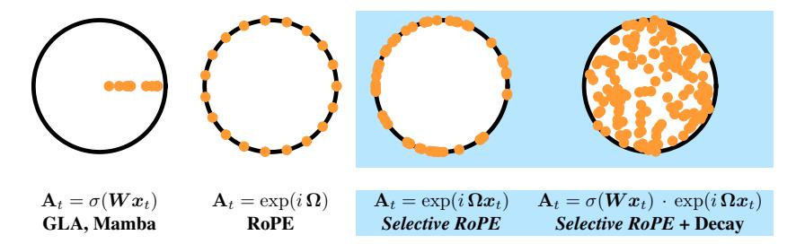
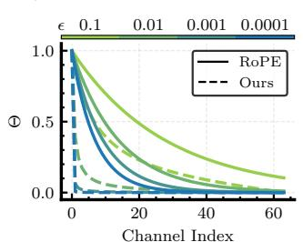
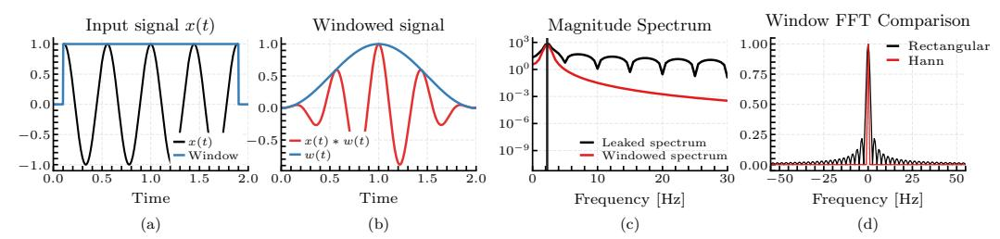
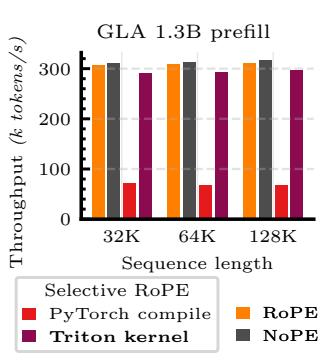
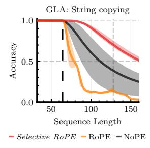
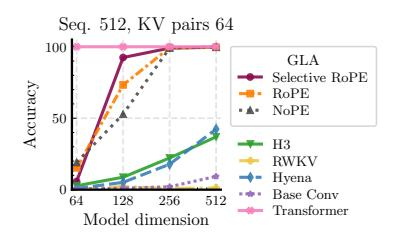
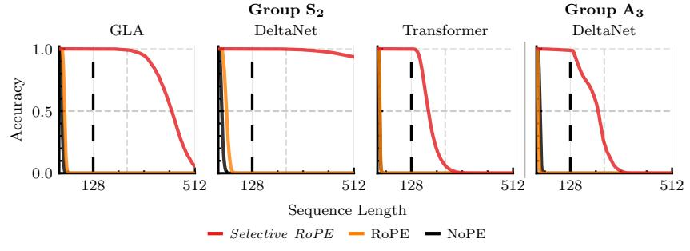

# SELECTIVE ROTARY POSITION EMBEDDING

Sajad Movahedi\*<sup>1,4</sup>, Timur Carstensen\*<sup>1,3</sup>, Arshia Afzal\*<sup>2</sup>, Frank Hutter<sup>1,3,5</sup>, Antonio Orvieto<sup>†1,4</sup>, Volkan Cevher<sup>†2</sup> Equal contribution\*, Equal supervision<sup>†</sup> ELLIS Institute Tübingen<sup>1</sup>, LIONS, EPFL<sup>2</sup>, University of Freiburg<sup>3</sup>, Max-Planck-Institute for Intelligent Systems<sup>4</sup>, Prior Labs<sup>5</sup> sajad.movahedi@tue.ellis.eu timurcarstensen@gmail.com arshia.afzal@epfl.ch

# **ABSTRACT**

Position information is essential for language modeling. In softmax transformers, Rotary Position Embeddings (RoPE) encode positions through fixed-angle rotations, while in linear transformers, order is handled via input-dependent (selective) gating that decays past key-value associations. Selectivity has generally been shown to improve language-related tasks. Inspired by this, we introduce Selective RoPE, an input-dependent rotary embedding mechanism, that generalizes RoPE, and enables rotation in arbitrary angles for both linear and softmax transformers. We show that softmax attention already performs a hidden form of these rotations on query-key pairs, uncovering an implicit positional structure. We further show that in state-space models and gated linear transformers, the real part manages forgetting while the imaginary part encodes positions through rotations. We validate our method by equipping gated transformers with Selective RoPE, demonstrating that its input-dependent rotations improve performance in language modeling and on difficult sequence tasks like copying, state tracking, and retrieval.

### 1 Introduction

Transformers with softmax attention (Vaswani et al., 2017) are the foundation of state-of-the-art language models. Their strong in-context recall performance is due to the ability of every token to attend to all past tokens without decay. However, their main drawback is computational: even with memory-efficient kernels, the arithmetic cost remains quadratic in the sequence length. To solve this, a parallel line of work develops sub-quadratic sequence models (modern recurrent architectures) that run in *linear* time and require only *constant* memory per step at inference (Katharopoulos et al., 2020; Yang et al., 2024b; Gu & Dao, 2023; Dao & Gu, 2024). The bottleneck of these models is their fixed state size: information must be selectively retained or overwritten, which often hurts long-horizon retrieval. Hence, most recent progress has focused on improving how these models manage their state. Selective gating (Yang et al., 2024a; Gu & Dao, 2023; Dao & Gu, 2024) adaptively decays history; more expressive state updates (Yang et al., 2024b; Siems et al., 2025; Peng et al., 2025) and readouts (Peng et al., 2025; Hu et al., 2025) increase the bandwidth between the state and outputs. These mechanisms largely operate by modulating *norms* of key-value associations (i.e., how quickly they decay), but do not directly provide the complementary capability of *rotating* query-key representations to encode relative position.

**Our view: recall needs rotation** *and* **decay.** We propose a recipe for good recall, the ingredients of which are: (i) *rotation* to encode relative position while preserving norms, and (ii) *decay* to selectively discard past key-value associations. Through a Random Fourier Features (RFF) lens we show that softmax attention already performs *input-dependent selective rotations* of query-key pairs, which is missing entirely in modern recurrent architectures. In contrast, the latter implement *selective decay* via gates but lack rotations, so they cannot encode relative phase.

Why rotation alone is insufficient. A purely complex (rotation-only) linear recurrent model behaves like a spectral analyzer with fixed state size. Applied to a finite sample of an input sequence, the model will suffer from spectral leakage, which leads to a worse approximation of the input signal. This is resolved by adding an exponentially decaying component. The analog to this in modern sequence models is sub-optimally compressing key-value associations into the fixed-size hidden state, which is remedied by adding *selective gating* to the state transition.



Figure 1: Our methods (right two columns) are highlighted with a light blue background. **Left to right:** GLA, RoPE, *Selective RoPE* (ours), *Selective RoPE* + Decay (ours). As we observe, the forget gate only encodes positional information through scale. On the other hand, both RoPE and *Selective RoPE* allow for positional information to be encoded through rotation, with the selective variant taking advantage of arbitrary angles. Combining the two methods yields the best results.

Based on our recipe, we instantiate a complex version of Gated Linear Attention (GLA) (Yang et al., 2024a) and demonstrate its superior performance and expressivity. In practice, we show that, by using the RoPE trick (Su et al., 2021), we are able to efficiently compute a complex GLA by applying a learned, input-dependent rotary position embedding to the queries and keys. **Selective RoPE** is easily incorporated into the query and keys of any gated linear transformer.

#### Contributions.

- **Unifying view.** We show that effective recall needs both *rotation* and *decay*. Softmax implicitly implements input-dependent rotations (RFF view). Complex-only linear models suffer from spectral leakage, motivating explicit decay. Real parts forget; imaginary parts encode position.
- **Theory.** (i) An RFF approximation of the exponential kernel that exposes selective rotations in softmax and yields an optimal temperature distribution that matches exponential schedules used in RoPE. (ii) A spectral analysis of diagonal SSMs showing why decay suppresses leakage.
- **Method: Selective RoPE.** An input-dependent rotary embedding that generalizes RoPE to learned angles and composes with gates; implemented with the RoPE trick for both linear and softmax attention.
- **Empirics.** Integrating *Selective RoPE* with GLA significantly boosts performance on recall-centric synthetic tasks (MQAR, copying, state tracking) and improves downstream language modeling.

### 2 BACKGROUND

In this section, we provide a summary of the background information that is necessary to understand this work. We begin with an introduction of the Transformer architecture and its relevant variants, along with a remark on the relationship between complex linear Transformers and the RoPE trick (Su et al., 2021).

**Transformers.** Standard causal softmax attention (Vaswani et al., 2017) transforms a sequence of L inputs  $(x_t)_{t=1}^L$  into the sequence of outputs  $(o_t)_{t=1}^L$ , with  $x_t, s_t, o_t \in \mathbb{R}^d$  and  $z_t \in \mathbb{R}$ :

$$o_t = \frac{s_t}{z_t}, \quad s_t = \sum_{\tau=1}^t \exp\left(\frac{1}{\sqrt{d}} q_t^{\top} k_{\tau}\right) \cdot v_{\tau}, \quad z_t = \sum_{\tau=1}^t \exp\left(\frac{1}{\sqrt{d}} q_t^{\top} k_{\tau}\right),$$
 (1)

where  $q_t, k_t, v_t = W_q x_t, W_k x_t, W_v x_t$ , and  $W_q, W_k, W_v \in \mathbb{R}^{d \times d}$  are the projection matrices and  $z_t$  is the normalization factor. Linear attention (Katharopoulos et al., 2020) replaces the exponential kernel in softmax attention with a kernel with a positive feature map  $\phi(\cdot) : \mathbb{R}^d \to (\mathbb{R}^+)^d$ , which gives rise to the following model:

$$o_t = \frac{S_t \phi(q_t)}{z_t^\top \phi(q_t)}, \quad S_t = \sum_{\tau=1}^t v_\tau \phi(k_\tau)^\top, \quad z_t = \sum_{\tau=1}^t \phi(k_\tau). \tag{2}$$

Here  $S_t \in \mathbb{R}^{d \times d}$  and  $z_t \in \mathbb{R}^d$  are state and the normalization factor. Due to the linear relationship, one can write the hidden state and the normalization factor in a recurrent form as:  $S_t = S_{t-1} + v_t \phi(k_t)^{\top}$  and  $z_t = z_{t-1} + \phi(k_t)$ . Moving forward, we subsume the feature map  $\phi(\cdot)$  into query-key vectors to simplify notation and drop the normalization factor  $z_t$  following Sun et al. (2023). Initially, to manage the finite sized hidden state better when processing long sequences, (2) was enhanced with a *forget gate*,  $A_t$ :

$$S_t = S_{t-1}A_t + v_t k_t^{\top}, \quad o_t = S_t q_t = \sum_{\tau=1}^t v_{\tau} \left\{ \underbrace{k_{\tau}^{\top} \left( \prod_{\kappa=\tau+1}^t A_{\kappa} \right) q_t}_{\text{All }, \tau} \right\},$$
(3)

which is either diagonal (Yang et al., 2024a; Gu & Dao, 2023) or scalar-valued (Dao & Gu, 2024) and hence, the channels of the hidden state evolve independently. Here,  $\operatorname{Att}_{t,\tau}$  is the attention score between  $q_t$  and  $k_{\tau}$ . Then,  $\prod_{\kappa=\tau+1}^t A_{\kappa}$  is reducing the norm of the inner product based on the cumulative product of gates between both positions and can hence be understood as a position encoding (Yang et al., 2025b) as it is also dependent on the distance between t and  $\tau$ . More recently, forget gates were extended by more-expressive *state transition* matrices that allow for channel-mixing across time. These often take a diagonal-plus-low-rank (DPLR) structure (Yang et al., 2025a; Peng et al., 2025) which admits a memory-efficient representation for products of such matrices.

**RoPE** and Complex Linear Attention. Rotary Position Embeddings (*RoPE*) are used to add relative positional information through rotations of the query-key pairs (Su et al., 2021). For queries and keys  $q_t, k_\tau \in \mathbb{R}^2$ , *RoPE* applies relative positional encoding using the rotation matrix  $R_\omega$ :

$$\operatorname{Att}_{t,\tau} = \exp(\mathbf{k}_{\tau}^{\top} \mathbf{R}_{\omega}^{t-\tau} \mathbf{q}_{t}) = \exp((\mathbf{R}_{\omega}^{\tau} \mathbf{k}_{\tau})^{\top} (\mathbf{R}_{\omega}^{t} \mathbf{q}_{t})), \quad \mathbf{R}_{\omega} = \begin{bmatrix} \cos \omega & -\sin \omega \\ \sin \omega & \cos \omega \end{bmatrix}, \quad (4)$$

with  $\omega$  being the frequency of rotation. The query at time t and key at time  $\tau$  are rotated by  $\mathbf{R}_{\omega}$  with  $(\mathbf{R}_{\omega})^t = \mathbf{R}_{t\omega}$ . For d-dimensional queries and keys,  $\mathbf{q}_t, \mathbf{k}_{\tau}$  are split into d/2 vectors  $\in \mathbb{R}^2$ , each rotated independently by their own frequency. This yields a block-diagonal rotation matrix  $\mathbf{R} \in \mathbb{R}^{d \times d}$  where each  $\mathbf{R}_{\omega_k} \in \mathbb{R}^{2 \times 2}$  is parameterized by a frequency  $\omega_k$ .

Using the **RoPE trick** allows us to express a *complex parametrization of a linear transformer* while staying in the real domain. Consider taking the real part of the following complex attention score:

$$\operatorname{Att}_{t,\tau} = \Re\{\tilde{\mathbf{k}}_{\tau}^{\mathsf{H}} \operatorname{diag}\underbrace{\left(\left[e^{i\omega_{1}(t-\tau)} \cdots e^{i\omega_{n}(t-\tau)}\right]\right)}_{\bar{\mathbf{R}} \in \mathbb{C}^{d/2} \times d/2} \tilde{\mathbf{q}}_{t}\} \quad \text{with } \tilde{\mathbf{q}}_{t}, \tilde{\mathbf{k}_{\tau}} \in \mathbb{C}^{d/2}$$

$$(5)$$

where  $\bar{R}$  is a unitary diagonal state transition. This can be re-expressed as applying RoPE to queries and keys  $q_t, k_\tau$  in *twice* the dimensions,  $\mathbb{R}^d$ , where we interleave the real and imaginary part in the odd and even indices of queries and keys:

$$\operatorname{Att}_{t,\tau} = \sum_{n=1}^{d/2} \begin{bmatrix} \mathbf{k}_{\tau,2n-1} \\ \mathbf{k}_{\tau,2n} \end{bmatrix}^{\top} \underbrace{\begin{bmatrix} \cos \omega_n(t-\tau) & -\sin \omega_n(t-\tau) \\ \sin \omega_n(t-\tau) & \cos \omega_n(t-\tau) \end{bmatrix}}_{\mathbf{R}_{\omega_n}^{t-\tau}} \begin{bmatrix} \mathbf{q}_{t,2n-1} \\ \mathbf{q}_{t,2n} \end{bmatrix}. \tag{6}$$

When we unroll the recurrence in (3) and replace the forget gate,  $A_{\kappa}$ , with the block-diagonal rotation matrix  $\mathbf{R} \in \mathbb{R}^{d \times d}$  in RoPE, we get:

$$o_t = \sum_{t=0}^{t} v_{\tau} \left\{ k_{\tau}^{\top} R^{t-\tau} q_t \right\} \quad \text{with } R^{t-\tau} = \text{blockdiag } \left( \begin{bmatrix} R_{\omega_1}^{t-\tau} & \cdots & R_{\omega_n}^{t-\tau} \end{bmatrix} \right)$$
 (7)

Note that due to the block-diagonal structure of R, we can write  $R^{t-\tau} = (R^{\tau})^H R^t$ , from which follows that  $k_{\tau}^{\top} R^{t-\tau} q_t = (R^{\tau} k_{\tau})^H R^t q_t$ . This allows us to express the rotation matrix as applying RoPE to queries and keys, similar to (6).

In summary, a linear transformer with RoPE is *equivalent to the same model with a unitary, diagonal* and non-selective transition in half the dimensions. The RoPE trick allows us to implement this complex parameterization by applying RoPE to queries and keys, effectively staying in the real domain which allows us to re-use existing (linear) attention kernels. A full derivation is shown in Appendix A.1.

# 3 A UNIFYING VIEW: DECAY AND ROTATION

In this section we motivate our method, *Selective RoPE*, by first observing that Softmax attention, *even* without RoPE, performs random but selective rotations when viewed through the lens of Random Fourier Features (RFFs) (Section 3.1), and that these rotations are missing in linear attention. In Section 3.2, we explain why rotations do not suffice and why selective gating is necessary, building on the complementary roles that real (gating) and imaginary (rotation) parts play in diagonal SSMs. Finally, in Section 3.3 we combine the previous insights and present our proposed method.

#### 3.1 SOFTMAX ATTENTION IMPLICITLY PERFORMS ROTATIONS

We begin with the connection between RFFs and softmax attention, and illustrate that rotation is an integral component in softmax attention. Specifically, we start from the definition of the softmax attention in (1) (omitting temperature for simplicity). Following Peng et al. (2021) and Rahimi & Recht (2007, Theorem 1), we define the RFF kernel as  $\phi_{\omega}(x) = \exp(\|x\|_2^2/2 + i\omega^{\top}x)$ . When applying the kernel to the dot-product of queries and keys  $\langle q_t, k_\tau \rangle$ , whose expected real component is equivalent to the attention score  $\mathrm{Att}_{t,\tau}$ :

$$\Re\left\{\mathbb{E}_{\boldsymbol{\omega}\sim\mathcal{N}(0,\boldsymbol{I})}\left[\phi_{\boldsymbol{\omega}}(\boldsymbol{q}_t)^{\top}\phi_{\boldsymbol{\omega}}(\boldsymbol{k}_{\tau})\right]\right\} = \exp\left(\boldsymbol{q}_t^{\top}\boldsymbol{k}_{\tau}\right). \tag{8}$$

By the law of large numbers, with  $\omega_j \sim \mathcal{N}\left(0, \sigma^2 I\right)$  for  $j \in \{1, \cdots, D\}$  and  $\sigma = 1$  we can approximate the un-normalized softmax attention output  $s_t$ :

$$\boldsymbol{s}_t = \lim_{D \to \infty} \Re \left\{ \frac{1}{D} \sum_{j=1}^D \hat{\boldsymbol{s}}_{t,j} \right\}, \quad \text{with } \hat{\boldsymbol{s}}_{t,j} = \sum_{\tau=1}^t \phi_{\boldsymbol{\omega}_j}(\boldsymbol{q}_t)^\top \phi_{\boldsymbol{\omega}_j}(\boldsymbol{k}_\tau) \cdot \boldsymbol{v}_\tau,$$

where  $\hat{s}_{t,j} \in \mathbb{R}^d$  is the *j*-th contribution to the attention score  $\mathrm{Att}_{t,\tau}$ . With some manipulations and mild assumptions (full derivation in Appendix A.2) and using the definition of  $\phi_{\omega_j}$ , we can reexpress  $\hat{s}_j$  as a recurrence. Stacking D of these recurrences horizontally, gives us a matrix-valued recurrence over  $\hat{S}_t \in \mathbb{R}^{d \times D}$ :

$$\hat{\boldsymbol{S}}_{t} = \hat{\boldsymbol{S}}_{t-1}\bar{\boldsymbol{R}}_{t} + \boldsymbol{v}_{t}\tilde{\boldsymbol{k}}_{t}^{\top}, \quad \bar{\boldsymbol{R}}_{t} = \operatorname{diag}\left(\exp\left(i\boldsymbol{\Omega}(\boldsymbol{q}_{t} - \boldsymbol{q}_{t-1})\right)\right), \quad \tilde{\boldsymbol{k}}_{t} = \phi(\boldsymbol{q}_{t}) \odot \phi(\boldsymbol{k}_{\tau}), \quad (9)$$

Crucially,  $\bar{R}_t$  is a diagonal *input-dependent rotation matrix* parametrized by random Gaussian features  $\Omega$ , conditioned on the input via  $q_t - q_{t-1}$ . Recalling the RoPE trick in Section 2, it should become clear that we can re-express  $\bar{R}_t$  as a block-diagonal matrix where each  $2 \times 2$  rotation matrix on its diagonal rotates by angle  $\phi_j = \langle \omega_j, (q_t - q_{t-1}) \rangle$ . Interestingly, the hard-shift over the queries q can be expressed by a 1d short-convolution, which is a component that is already frequently used in modern recurrent architectures (Yang et al., 2025a; Dao & Gu, 2024). We can follow a similar derivation as in (9) for the normalizer  $z_t$ . The read-out proceeds slightly differently than in normal linear attention: since each column j of the recurrent state represents the contribution of the j-th random feature to the approximation of  $s_t$ , we sum over the columns:  $\hat{S}_t 1$ .

The equivalence of the RFF kernel in (8). For a limited number of samples, D, we instead choose the variance of the RFFs as shown in Theorem 1 (Appendix A.3), which provides the optimal variance for RFFs for a single query-key pair. Extending this, we define the rotation matrix as  $\hat{\mathbf{R}}_t = \exp(i\Omega\Theta(q_t-q_{t-1}))$ , where  $\Theta$  is a diagonal matrix of temperatures. Assuming the angle between the queries and keys are uniformly distributed in  $[0,2\pi]$ , the optimal temperatures follow  $\tan^2(\frac{\theta}{2})$  with  $\theta \sim \mathcal{U}[0,2\pi]$ . Interestingly, this distribution closely resembles the exponentially decaying frequencies used in RoPE, with a slightly faster decline, as we can observe in Figure 2.

In summary, we have shown that softmax attention implicitly performs random input-dependent rotations to encode relative positional information between tokens. Since  $\bar{R}_t$  is a rotation matrix, it preserves the norm of the attention scores  $\mathrm{Att}_{t,\tau}$  and hence does not forget past information.



Figure 2: The distribution of the phase temperatures in RoPE vs. *Selective RoPE*.  $\epsilon$  is the inverse of the RoPE base frequency and the upper-bound of query-key angle in our temperature. Details about the parameterization available in Appendix A.3.1.



Figure 3: The effects of windowing on the spectrogram of a finite sample of a sequence.

#### 3.2 Necessity of Gating: Spectral Leakage in Diagonal SSMs

In this section, we will show that rotations alone are not enough to close the gap between linear and softmax attention by analyzing the role of real and imaginary parts in complex diagonal SSMs. Inspired by the findings of Section 3.1, let us analyze a related model to GLA in (3), where the diagonal gate  $A_t$  is instead replaced by the rotation matrix  $\bar{R}_t$  introduced in (9):

$$\mathbf{S}_t = \mathbf{S}_{t-1}\bar{\mathbf{R}}_t + \mathbf{v}_t \mathbf{k}_t^{\top}, \quad \mathbf{o}_t = \Re\{\mathbf{S}_t \mathbf{q}_t\}. \tag{10}$$

By unrolling the recurrence, we can write the output as:

$$\boldsymbol{o}_{t} = \Re \left\{ \sum_{j=1}^{d/2} \boldsymbol{q}_{t,j} e^{i\omega_{t,j}} \sum_{\tau=-\infty}^{+\infty} \boldsymbol{k}_{\tau,j} e^{-i\omega_{\tau,j}} \boldsymbol{v}_{\tau} u_{t}(\tau) d\tau \right\}.$$

This is a convolution over the value (i.e., the input) and an exponential of imaginary function (i.e.,  $e^{-i\omega_{\tau,j}}$ ), which can be seen as a spectral analysis (discrete Fourier transform, DFT) of the value signal, in the presence of the step-window function  $u_t(\tau)$  (definition in Appendix A.4), which is visualized in Figure 3a. When naively performing a DFT over a finite sample, the resulting discontinuities at the margins of the sample cause spectral leakage in the spectrogram as shown in (c). To avoid this, one usually places a non-rectangular window which tapers off towards the margins. The convolved signal with a Hann window (Oppenheim, 1999) function is shown in (b) and the resulting magnitude spectrum in (c). In (d), we show that we are able to recover the correct frequency after a window FFT when applying a Hann window to our input signal. The window function chosen here acts like an exponential decay towards the margins, which is analogous to using a gate in our model in (10). The use of gates in sequence models has a long history. Starting from the gating mechanism in LSTMs (Hochreiter & Schmidhuber, 1997), it is also widely used in linear attention, linear RNNs and SSMs (Yang et al., 2024a; Gu & Dao, 2023), and even softmax Transformers (Lin et al., 2025). Our results in this section provide a theoretical motivation for the use of gating mechanisms.

# 3.3 DESIGN PRINCIPLES FOR LINEAR ATTENTION

In this section we combine the insights gained in Section 3.1 and 3.2 to formulate general design principles that are required to narrow the gap between linear and softmax attention. For this, we analyze a general form of linear attention, which encompasses both models in (3) and (10):

$$S_t = S_{t-1}A_t + v_t \tilde{k}_t^{\mathsf{H}}, \quad o_t = \Re\{S_t \tilde{q}_t\}, \quad o_t = \sum_{\tau=1}^t v_\tau \Re\left\{\tilde{k}_\tau^{\mathsf{H}} \Big(\prod_{\kappa=\tau}^t A_\kappa\Big) \tilde{q}_t\right\}. \tag{11}$$

In Section 3.1 we have shown that softmax attention implicitly performs input-dependent rotations, and that this is missing from linear attention. We can introduce rotation to the model in (11) by setting  $A_t = \bar{R}_t$ . This is stable since  $\bar{R}_t$  is a rotation matrix and will give us the model in (10). However, purely rotating will make this a spectral analyzer. Meaning that the positional information, which is encoded through rotation in (10), will lack the ability to encode higher frequencies. Consequently, we also need a decay (i.e., the window function), which we choose to be exponentially decaying. This can be achieved by setting  $A_t = \Lambda_t$  which gives us the model in (3). In summary, a performant linear transformer requires both: (a) rotation and (b) gating.

One can introduce both components by writing  $A_t = \Lambda_t \bar{R}_t$ . Interestingly, in DeltaNet one can observe that the rotation component already exists to some degree in the form of a Householder. Then, adding the forget gate, as done by Yang et al. (2025a) improves the performance, which is in line with our design principle. In the case of the softmax transformers we know the rotation component already exists along random axes. Consequently, one only needs the forget gate to fully align with this design principle, which was shown to be effective in the Forgetting Transformer (Lin et al., 2025).

In summary, as the main contribution of the paper, we introduce *Selective RoPE*, which we define as Linear Attention with an input-dependent rotation matrix  $R_t$  as its state transition:

$$S_t = S_{t-1}R_t + v_t k_t^{\top}, \quad o_t = S_t q_t. \tag{12}$$

Recalling the RoPE trick in (7) and defining  $R_{i:j} = \prod_{\kappa=i}^{j} R_{\kappa}$  for the input-dependent rotation matrix  $R_{\kappa}$ , we can equivalently write this as:

Selective RoPE: 
$$o_t = \sum_{\tau=1}^t v_{\tau} \left\{ k_{\tau}^{\top} R_{\tau+1:t} q_t \right\} = \sum_{\tau=1}^t v_{\tau} \left\{ k_{\tau}^{\top} R_{1:\tau}^{\top} R_{1:t} q_t \right\},$$
 (13)

which we can easily apply to both queries and keys and hence, largely reuse existing RoPE kernels. However, considering the extensive research done on the forget gate, we shift our focus from this component and instead rely on the built-in forgetting functionality of the baseline architectures.

In this section, we provide theoretical results that motivate the use of complex rotation and exponential decay in a linear attention model. The resulting design principle argues that both these components are required for a well-performing sequence model. This design principle also provides a fresh perspective on the success of Forgetting Transformers (Lin et al., 2025) and variants of DeltaNet (Yang et al., 2024b; 2025a), which we further elaborate on in Appendix A.6 and Appendix A.5.

# 4 EXPERIMENTS

In the following section we test our proposed model on synthetic and real-world language modeling tasks. For this we first provide our implementation details and then explain the specific experimental setup for each task and discuss the accompanying results. We primarily apply *Selective RoPE* to Gated Linear Attention (GLA) (Yang et al., 2024a) and compare with other linear and softmax attention variants. We sweep learning rates (reported in Appendix B) unless otherwise specified.

# 4.1 IMPLEMENTATION

In the implementation of *Selective RoPE* we make several design choices that go beyond the architecture described in Section 3.3: Following Zhang et al. (2024), where learning the random features introduced by Choromanski et al. (2021) was shown to be more effective, we make the parameters  $\omega$  in *Selective RoPE* learnable. This makes the rotations input-dependent and learnable. Following Yang et al. (2025b), we place a signary of the signal of the signal of the signal of the signal of the signal of the signal of the signal of the signal of the signal of the signal of the signal of the signal of the signal of the signal of the signal of the signal of the signal of the signal of the signal of the signal of the signal of the signal of the signal of the signal of the signal of the signal of the signal of the signal of the signal of the signal of the signal of the signal of the signal of the signal of the signal of the signal of the signal of the signal of the signal of the signal of the signal of the signal of the signal of the signal of the signal of the signal of the signal of the signal of the signal of the signal of the signal of the signal of the signal of the signal of the signal of the signal of the signal of the signal of the signal of the signal of the signal of the signal of the signal of the signal of the signal of the signal of the signal of the signal of the signal of the signal of the signal of the signal of the signal of the signal of the signal of the signal of the signal of the signal of the signal of the signal of the signal of the signal of the signal of the signal of the signal of the signal of the signal of the signal of the signal of the signal of the signal of the signal of the signal of the signal of the signal of the signal of the signal of the signal of the signal of the signal of the signal of the signal of the signal of the signal of the signal of the signal of the signal of the signal of the signal of the signal of the signal of the signal of the signal of the signal of the signal of

```
def selective_rope(
   q, k, W_omega, temp
) -> tuple[Tensor, Tensor]:
   omega = convld(W_omega@q)
   omega = temp*cumsum(omega)
   sin_o, cos_o = sincos(omega)
   return rope(q, k, cos_o,
```

Figure 4: Pseudocode of Selective RoPE.

moid gate on the rotation angles to allow the model to control whether to rotate or not. We also add a learnable bias term, which is not dependent on relative token positions (Li et al., 2024). Finally, we place a weight norm (Kingma, 2016) on the input projection. We ablate our architectural choices on the MAD dataset and language modeling experiments.

We implement Selective RoPE in PyTorch and integrate it into flash-linear-attention (Yang & Zhang, 2024) for our experiments. Using the RoPE trick (cf. section 2), we are able to implement our method as a prelude to RoPE where we determine the sin and cos from the input as shown in Figure 4. To optimize the throughput of our implementation, we follow the GPT-NeoX (Black et al., 2022) style of applying rotations to allow for coalesced memory access. This is equivalent to our derivations which follows the original RoPE implementation by Su et al. (2021), up to an index permutation. Despite these changes, the kernels generated by PyTorch compile are memory bound (Dao et al., 2022) due to missing epilogue fusion support for cumulative sums in PyTorch compile. We provide a Triton implementation that performs epilogue fusion for the cumulative sum and the operations following it. This yields



Figure 5: Prefill throughput on NVIDIA B200 with batch size=1

an up to 340% improvement in prefill throughput on long sequences on modern GPUs as shown in Figure 5.



Figure 6: Copying accuracy of GLA with CIs. Dashed line is the training sequence length.

Table 1: MAD benchmark results. We ablate the effectiveness of each extra component introduced to *Selective RoPE* on GLA. The best results are marked in **bold** and the second best in underline.

| Model               | Compress    | Fuzzy<br>Recall | In-Context<br>Recall | Memorize | Noisy<br>Recall | Selective<br>Copy | Average |
|---------------------|-------------|-----------------|----------------------|----------|-----------------|-------------------|---------|
| GLA                 |             |                 |                      |          |                 |                   | Ī       |
| NoPE                | 82.0        | 8.5             | 87.3                 | 38.7     | 87.6            | 91.1              | 65.9    |
| RoPE                | <u>85.2</u> | 7.5             | 92.6                 | 61.4     | 91.9            | 96.4              | 72.5    |
| Selective RoPE      | 85.2        | 9.0             | 94.0                 | 57.1     | 91.7            | 94.9              | 72.0    |
| + phase gate        | 85.1        | 7.5             | 96.6                 | 56.9     | 94.3            | 93.5              | 72.3    |
| + bias              | 85.0        | 8.4             | 95.0                 | 61.3     | 91.2            | 95.4              | 72.7    |
| + phase gate & bias | 85.4        | 7.2             | <u>95.9</u>          | 60.4     | 95.0            | 95.6              | 73.2    |

### 4.2 SYNTHETIC LANGUAGE TASKS

To investigate which capabilities of linear attention are improved when using *Selective RoPE*, we run experiments on synthetic tasks. For this, we mostly focus on recall, since it is essential for language modeling (Arora et al., 2024a;b) and a good proxy for performance at scale.

**MQAR.** We evaluate GLA + *Selective RoPE* on Multi-Query Associative Recall, following the same experimental setup as in Arora et al. (2024a, Figure 2) with a finer learning rate grid, as this has been shown to improve performance (Okpekpe & Orvieto, 2025) (cf. Appendix B.2). The results in Figure 7 show that GLA improves with extra positional information and that *Selective RoPE* achieves the greatest improvement over the base model with no positional embedding.



Figure 7: MOAR results.

MAD and Copying. We also evaluate our method on the MAD benchmark suite (Poli et al., 2024) which tests a model's ability to store and recall information within its context. Here, we note that using *Selective RoPE* consistently improves performance over NoPE and RoPE on almost all considered tasks. We also evaluate string copying following Jelassi et al. (2024). This task differs from *Selective Copy* in MAD in that the entire input sequence has to be copied token-by-token after the model is presented with a <copy> token. The results in Figure 6 show that *Selective RoPE* again improves over the alternatives and learns to length extrapolate very robustly. The poor result of RoPE is reported in prior works (Jelassi et al., 2024; Li et al., 2024) and attributable to its generally poor length extrapolation performance without fine-tuning on longer sequence lengths.



Figure 8: State tracking performance of GLA, Transformer, and DeltaNet with different positional embeddings on  $S_2$  and  $A_3$ . The models on  $S_2$  were trained with *one* layer whereas DeltaNet was trained with *two* layers on  $A_3$ . Vertical dashed line indicates training sequence length.

**State Tracking.** A common way to evaluate the expressivity of a model is *state tracking* on permutation composition (Liu et al., 2023). Recently, it has been shown that SSMs and linear RNNs are not capable of learning parity (Merrill et al., 2024), which amounts to permutation composition on the symmetric group of two elements,  $S_2$ , and that one needs to extend the eigenvalue range of the state transition  $A_t$  from [0,1] to [-1,1] (Grazzi et al., 2025). In Figure 8 we see that GLA with *Selective RoPE* is able to learn and length-extrapolate on  $S_2$ . This is in line with our expectations since the input dependent rotations allow it to model "flips" depending on the input either being a 0 or a 1, while GLA with NoPE and RoPE does not even learn the training context length. This places GLA + *Selective RoPE* outside the TC<sup>0</sup> complexity class (Merrill et al., 2024). Similarly,

| Model               | LMB.<br>ppl↓          | LMB.<br>acc ↑ | PIQA<br>acc ↑ | Hella.<br>acc_n ↑ | Wino.<br>acc ↑ | ARC-e<br>acc ↑ | ARC-c<br>acc_n ↑ | Avg.        |
|---------------------|-----------------------|---------------|---------------|-------------------|----------------|----------------|------------------|-------------|
|                     | GLA (370M)            |               |               |                   |                |                |                  |             |
| NoPE                | 19.21                 | 39.4          | 69.7          | 48.0              | 53.1           | 50.9           | 24.6             | 47.6        |
| RoPE                | 23.96                 | 36.1          | 69.7          | 47.7              | 54.0           | 50.9           | 25.1             | 47.2        |
| Selective RoPE      | 21.50                 | 37.6          | 70.3          | 48.1              | 52.2           | 51.3           | 26.2             | 47.6        |
| + phase gate        | 22.85                 | 37.2          | 70.2          | 47.6              | 52.2           | <u>52.1</u>    | 25.9             | 47.5        |
| + bias              | 20.12                 | 39.6          | 70.7          | 47.3              | 52.0           | 52.1           | 25.3             | <u>47.9</u> |
| + phase gate & bias | 21.16                 | 37.4          | 70.6          | 47.9              | <u>53.9</u>    | 52.0           | 26.2             | 48.0        |
|                     | Gated DeltaNet (370M) |               |               |                   |                |                |                  |             |
| NoPE                | 22.50                 | 37.2          | 70.9          | 47.6              | 53.2           | 52.0           | 25.9             | 47.8        |
| RoPE                | 20.84                 | 38.9          | 70.7          | <u>48.2</u>       | 53.4           | 51.3           | 25.1             | 48.0        |
| Selective RoPE      | 21.23                 | 39.0          | 71.1          | 47.9              | 53.7           | 52.1           | 24.8             | 48.1        |
| + phase gate        | 18.37                 | 41.4          | 69.5          | 48.4              | 54.6           | 51.7           | 26.5             | 48.7        |
| + bias              | 19.11                 | 40.5          | 70.9          | 47.9              | 53.9           | 51.9           | 25.9             | 48.5        |
| + phase gate & bias | 19.28                 | 39.4          | 70.1          | 47.6              | 54.9           | 52.4           | 25.4             | 48.3        |
| FoX (370M)          |                       |               |               |                   |                |                |                  |             |
| NoPE                | 26.04                 | 37.4          | 69.6          | 47.0              | 55.2           | 50.7           | 25.8             | 47.6        |
| RoPE                | 23.16                 | 37.7          | 69.5          | 47.6              | <u>55.0</u>    | 52.7           | 25.3             | <u>48.0</u> |
| Selective RoPE      | 23.28                 | 38.2          | 69.3          | 47.6              | 53.9           | 50.1           | 24.0             | 47.2        |
| + phase gate        | 21.89                 | 38.2          | 70.2          | 47.8              | 54.1           | <u>52.4</u>    | 26.1             | 48.1        |
| + bias              | 23.67                 | 37.8          | 70.0          | 48.0              | 54.1           | 51.7           | 25.3             | 47.8        |
| + phase gate & bias | 24.98                 | 37.1          | 70.0          | <u>47.9</u>       | 54.9           | 51.9           | 24.9             | 47.8        |

Table 2: Evaluation results on tasks from lm-eval-harness (Gao et al., 2024) for GLA (370M), Gated DeltaNet (370M), and FoX (370M) trained on 35B tokens of FineWeb (Penedo et al., 2024). The best results for each model architecture are marked in **bold** and the second best in <u>underline</u>.

we can see that *Selective RoPE* also improves the state tracking abilities in Transformers (i.e., softmax attention) allowing them to solve the parity problem up to, and slightly more, than the train sequence length. To the best of our knowledge, Transformer with *Selective RoPE* is the only variant of Transformers capable of solving the parity task with a single layer up to this sequence length (Liu et al., 2023). We also experiment on  $A_3$  with a 2-layer DeltaNet (Yang et al., 2024b), which is the permutation composition on the symmetric group of three elements, limited to even permutations. As we can observe, *Selective RoPE* improves the expressivity of the model up to a point where it is capable of solving  $A_3$  up to the training sequence length. To the best of our knowledge, this is the first time these results have been presented for our choice of model on this task.

#### 4.3 Language Modeling

For our language modeling experiments we train 370M parameter versions of GLA (Yang et al., 2024a), Gated DeltaNet (Yang et al., 2025a), and the Forgetting Transformer (FoX) (Lin et al., 2025) using AdamW (Loshchilov & Hutter, 2019) and a warmup and cosine-decay schedule (Loshchilov & Hutter, 2017). All models are trained on 35B tokens ( $\approx 5 \times$  Chinchilla (Hoffmann et al., 2022)) of FineWeb (Penedo et al., 2024) at a context length of 4096 and use the Mistral 7B tokenizer (Jiang et al., 2023) with a vocabulary size of 32 000. All remaining architectural and optimizer hyperparameters (batch size, learning rate schedule, gradient clipping, weight decay) follow Siems et al. (2025) and are detailed in Appendix B. To account for differences in optimal learning rates for the considered positional embedding schemes, we sweep learning rates exhaustively following Orvieto & Gower (2025) at the largest scale (35B tokens) using the grid [5e-4, 1e-3, 2e-3, 4e-3, 8e-3]. To select the best learning rate for each model and position embedding combination, we use the perplexity on 4 million tokens not seen during training. The best models are then evaluated on downstream tasks from lm-eval-harness (Gao et al., 2024), the results of which are shown in Table 2. We follow the default zero-shot evaluation setup in lm-eval-harness, using its standard prompting and report the macro-average accuracy over the core multiple-choice tasks in the Avg. column. We select the same set of tasks as in GLA (Yang et al., 2024a) and DeltaNet (Yang et al., 2024b).

Across GLA and Gated DeltaNet, Selective RoPE improves the average downstream accuracy over both RoPE and NoPE. For FoX, the variant with a phase gate slightly improves the average accu-

racy over RoPE, while the plain Selective RoPE matches NoPE. For GLA, Selective RoPE reduces Lambada perplexity relative to RoPE and maintains comparable downstream accuracy to NoPE. For Gated DeltaNet, Selective RoPE mainly benefits the multiple-choice benchmarks (LAMBADA, PIQA, ARC), whereas FoX already performs very strongly on span-based tasks and sees smaller but consistent gains from adding Selective RoPE.

We ablate adding a rotation (i.e., *phase*) gate and a learnable bias term (Li et al., 2024). We found that, at higher learning rates, *Selective RoPE* experienced training instabilities, characterized by gradient norm and loss spikes. This in line with previous findings in the literature documenting difficulties when optimizing functions with high frequency components using gradient descent (Candès & Fernandez-Granda, 2014; Rahaman et al., 2019). We found that adding the phase gate generally improved downstream performance and training stability which was further improved by adding weight normalization (Kingma, 2016) to the input projection of *Selective RoPE*. Notably, we found GLA to be the most impacted by training instabilities and hypothesize that this is due to its large default normalization constant for its gate projection. On the other hand, adding a bias alone or in combination with the phase gate did not yield to significant performance improvements over the other variants of *Selective RoPE*.

#### 5 RELATED WORK

There have been several attempts at reducing the quadratic complexity of softmax attention (Dao, 2024), one of which is linearization (Katharopoulos et al., 2020), which results in a recurrent model with sub-quadratic cost (Martin & Cundy, 2018; Gu et al., 2020). However, the reduced complexity comes at the cost of lower performance, especially in recall-intensive tasks (Waleffe et al., 2024; Peng et al., 2021; Choromanski et al., 2021; Zhang et al., 2024). This led to the development of architectures which used gating to increase their expressivity. Non-selective state-space models (SSMs) made use of input-independent gating mechanisms and vector-valued states to perform sequence modeling (Orvieto et al., 2023; Gu et al., 2022b; a; Sun et al., 2023). Later, these architectures were improved by adding selective gating (De et al., 2024; Qin et al., 2023) and matrix-valued states (Gu & Dao, 2023; Dao & Gu, 2024; Yang et al., 2024a; Beck et al., 2024; Qin et al., 2024). Concurrently, DeltaNet (Schlag et al., 2021; Yang et al., 2024b) extended the notion of a gate to a state transition matrix by using an input-dependent generalized Householder matrix, which implements the errorcorrecting delta-rule (Widrow et al., 1988). A byproduct of our theoretical analysis are further insights into the functionality of the gating mechanism and forget gate in Section 3. Another line of work has improved sub-quadratic sequence models through better kernel approximations of softmax attention (Katharopoulos et al., 2020). This approach led to the use of random features (Choromanski et al., 2021; 2022), which was extended to learning the features directly (Zhang et al., 2024). Interestingly, a polynomial kernel inspired by the Taylor expansion of the exponential function has proved effective in closing the performance gap, while being less efficient in terms of computational complexity (Zhang et al., 2024; Kacham et al., 2023). We base our theoretical investigation on the work of Peng et al. (2021), deriving a linear attention variant as an approximation of the softmax Transformer.

RoPE and complex parameterizations of RNNs. The primary method of encoding positional information in sub-quadratic attention variants is exponential decay (Lin et al., 2025). However, in softmax transformers, rotary position embeddings (RoPE) have proven to be very effective (Su et al., 2021; Shaw et al., 2018; Yang et al., 2025b) compared to no positional embeddings (NoPE) (Kazemnejad et al., 2023). RoPE encodes positional information through point-wise rotation of the query-key pairs. Other variants of RoPE have made attempts at improving RoPE in terms of its short-comings in generalizing to longer sequences by learning the position embedding (Li et al., 2024), framing it as a kernel design problem (Chi et al., 2022), or utilizing theoretical tools (Peng et al., 2024). Interestingly, our model generalizes RoPE by making angles input-dependent. In our experiments, we show the effectiveness of our proposed position embedding both in linear attention models and softmax Transformers. As shown in Section 2, applying RoPE to a linear transformer is equivalent to operating in the complex domain and theoretically, this is essential for the universality guarantees of RNNs and SSMs (Orvieto et al., 2024; Gu et al., 2020). Further investigation showed an improvement in the recall capabilities and expressivity of SSMs when operating in the complex domain (Ran-Milo et al., 2024). However, later variants of these models removed the complex re-

currence due to inconclusive evidence for their benefits in language modeling and implementation overhead (Gu & Dao, 2023; Dao & Gu, 2024; De et al., 2024). In this paper, we focus on the kernel view of softmax attention, providing a connection between it and linear attention models operating in the complex domain. The resulting design principle provides a connection between softmax attention, complex linear attention, the gating mechanism, and position embeddings.

# 6 Conclusion

We introduced *Selective RoPE*, an input-dependent rotary position embedding that generalizes RoPE from fixed to arbitrary, learnable rotations. Our theory shows (i) softmax attention admits a complex linear formulation that implicitly performs *selective rotations*, and (ii) this complex formulation introduces spectral leakage, which can be suppressed through the forget gate mechanism. Empirically, equipping certain sequence models (namely, GLA, Gated DeltaNet, and FoX) with *Selective RoPE* improves recall-centric synthetic tasks and strengthens language modeling downstream performance. Furthermore, we show that this improvement in performance comes at very little computational cost, with an easy implementation thanks to the RoPE trick.

**Future work.** There are several aspects of *Selective RoPE* and the proposed design principle introduced in our paper that require further investigation. Firstly, we note that incorporating RoPE is notoriously detrimental to the length-extrapolation capabilities of sequence models (Li et al., 2024). In this paper, we do not investigate this aspect since we consider it to be out of the scope of our research. Secondly, we believe that further investigation of the effect of the extra components used in *Selective RoPE*, namely the bias term and the phase gate, can be a fruitful direction for future research. Thirdly, we consider the impact of choosing a diagonal as opposed to a scalar forget gate to be an interesting question, since our theoretical justification for forget gates is only concerned with an exponentially decaying component in the sequence model, and not the dimensionality of it. Finally, given the existing variants of RoPE (Black et al., 2022; Su et al., 2021), we believe it to be important to also incorporate the progress on the positional embedding front into future work.

# **ACKNOWLEDGEMENTS**

We would like to thank Julie Naegelen, Felix Sarnthein, and Gwendolyn Neitzel for constructive discussions and feedback. This research was partially supported by the following sources: PNRR MUR Project PE000013 CUP J53C22003010006 Future Artificial Intelligence Research (FAIR), funded by the European Union NextGenerationEU, and EU Project ELSA under grant agreement No. 101070617. TAILOR, a project funded by EU Horizon 2020 research and innovation programme under GA No 952215; the Deutsche Forschungsgemeinschaft (DFG, German Research Foundation) under grant number 417962828; the European Research Council (ERC) Consolidator Grant 'Deep Learning 2.0' (grant no. 10). This research was partially funded by the Deutsche Forschungsgemeinschaft (DFG, German Research Foundation) under grant number 539134284, through EFRE (FEIH 2698644) and the state of Baden-Wrttemberg, Frank Hutter, Antonio Orvieto, Sajad Movahedi, and Timur Carstensen acknowledge financial support by the Hector Foundation. The authors acknowledge support from ELLIS and ELIZA, funded by the European Union. The authors gratefully acknowledge the computing time made available to them on the high-performance computers and at the NHR Centers at TU Dresden and KIT. These centers are jointly supported by the Federal Ministry of Research, Technology and Space of Germany and the state governments participating in the NHR. Views and opinions expressed are however those of the author(s) only and do not necessarily reflect those of the European Union or the ERC. Neither the European Union nor the ERC can be held responsible for them.


# REFERENCES

- Niccol Ajroldi. plainlm: Language model pretraining in pytorch. https://github.com/ Niccolo-Ajroldi/plainLM, 2024.
- S. Arora, S. Eyuboglu, A. Timalsina, I. Johnson, M. Poli, J. Zou, A. Rudra, and C. Ré. Zoology: Measuring and Improving Recall in Efficient Language Models. In *The Twelfth International Conference on Learning Representations (ICLR'24)*. ICLR, 2024a.
- S. Arora, S. Eyuboglu, M. Zhang, A. Timalsina, S. Alberti, J. Zou, A. Rudra, and C. Re. Simple linear attention language models balance the recall-throughput tradeoff. In R. Salakhutdinov, Z. Kolter, K. Heller, A. Weller, N. Oliver, J. Scarlett, and F. Berkenkamp (eds.), *Proceedings of the 41st International Conference on Machine Learning (ICML'24)*, volume 251 of *Proceedings of Machine Learning Research*. PMLR, 2024b.
- M. Beck, K. Pöppel, M. Spanring, A. Auer, O. Prudnikova, M. Kopp, G. Klambauer, J. Brandstetter, and S. Hochreiter. xLSTM: Extended Long Short-Term Memory. In A. Globerson, L. Mackey, D. Belgrave, A. Fan, U. Paquet, J. Tomczak, and C. Zhang (eds.), Proceedings of the 37th International Conference on Advances in Neural Information Processing Systems (NeurIPS'24), 2024.
- S. Black, S. Biderman, E. Hallahan, Q. Anthony, L. Gao, L. Golding, H. He, C. Leahy, K. McDonell, J. Phang, M. Pieler, U. Prashanth, S. Purohit, L. Reynolds, J. Tow, B. Wang, and S. Weinbach. GPT-NeoX-20B: An open-source autoregressive language model. *arXiv:2204.06745 [cs.CL]*, 2022.
- E. Candès and C. Fernandez-Granda. Towards a mathematical theory of super-resolution. *Communications on Pure and Applied Mathematics*, 67(6):906–956, 2014. doi: https://doi.org/10.1002/cpa.21455. URL https://onlinelibrary.wiley.com/doi/abs/10.1002/cpa.21455.
- T.-C. Chi, T.-H. Fan, P. Ramadge, and A. Rudnicky. KERPLE: Kernelized Relative Positional Embedding for Length Extrapolation. In S. Koyejo, S. Mohamed, A. Agarwal, D. Belgrave, K. Cho, and A. Oh (eds.), *Proceedings of the 35th International Conference on Advances in Neural Information Processing Systems (NeurIPS'22)*, 2022.
- K. Choromanski, V. Likhosherstov, D. Dohan, X. Song, A. Gane, T. Sarlos, P. Hawkins, J. Davis, A. Mohiuddin, L. Kaiser, D. Belanger, L. Colwell, and A. Weller. Rethinking attention with performers. In *The Ninth International Conference on Learning Representations (ICLR'21)*. ICLR, 2021.
- K. Choromanski, H. Chen, H. Lin Y. Ma, A. Sehanobish, D. Jain, M. Ryoo, J. Varley, A. Zeng, V. Likhosherstov, D. Kalashnikov, V. Sindhwani, and A. Weller. Hybrid Random Features. In *The Tenth International Conference on Learning Representations (ICLR*'22). ICLR, 2022.
- N. M. Cirone, A. Orvieto, B. Walker, C. Salvi, and T. Lyons. Theoretical Foundations of Deep Selective State-Space Models. In A. Globerson, L. Mackey, D. Belgrave, A. Fan, U. Paquet, J. Tomczak, and C. Zhang (eds.), Proceedings of the 37th International Conference on Advances in Neural Information Processing Systems (NeurIPS'24), 2024.
- T. Dao. FlashAttention-2: Faster Attention with Better Parallelism and Work Partitioning. In *The Twelfth International Conference on Learning Representations (ICLR*'24). ICLR, 2024.
- T. Dao and A. Gu. Transformers are SSMs: Generalized models and efficient algorithms through structured state space duality. In R. Salakhutdinov, Z. Kolter, K. Heller, A. Weller, N. Oliver, J. Scarlett, and F. Berkenkamp (eds.), *Proceedings of the 41st International Conference on Machine Learning (ICML'24)*, volume 251 of *Proceedings of Machine Learning Research*. PMLR, 2024.
- T. Dao, D. Fu, S. Ermon, A. Rudra, and C. Ré. FlashAttention: Fast and memory-efficient exact attention with io-awareness. In S. Koyejo, S. Mohamed, A. Agarwal, D. Belgrave, K. Cho, and A. Oh (eds.), *Proceedings of the 35th International Conference on Advances in Neural Information Processing Systems (NeurIPS'22)*, pp. 16344–16359, 2022.

- S. De, S. L. Smith, A. Fernando, A. Botev, G. Cristian-Muraru, A. Gu, R. Haroun, L. Berrada, Y. Chen, S. Srinivasan, G. Desjardins, A. Doucet, D. Budden, Y. W. Teh, R. Pascanu, N. De Freitas, and C. Gulcehre. Griffin: Mixing gated linear recurrences with local attention for efficient language models. *arXiv:2402.19427 [cs.LG]*, 2024.
- L. Gao, J. Tow, B. Abbasi, S. Biderman, S. Black, A. DiPofi, C. Foster, L. Golding, J. Hsu, A. Le Noac'h, H. Li, K. McDonell, N. Muennighoff, C. Ociepa, J. Phang, L. Reynolds, H. Schoelkopf, A. Skowron, L. Sutawika, E. Tang, A. Thite, B. Wang, K. Wang, and A. Zou. The language model evaluation harness, 2024. URL https://zenodo.org/records/12608602.
- R. Grazzi, J. Siems, A. Zela, J. Franke, F. Hutter, and M. Pontil. Unlocking State-Tracking in Linear RNNs Through Negative Eigenvalues. In *The Thirteenth International Conference on Learning Representations (ICLR*'25). ICLR, 2025.
- A. Gu and T. Dao. Mamba: Linear time sequence modeling with selective state spaces. arXiv:2312.00752 [cs.LG], 2023.
- A. Gu, T. Dao, S. Ermon, A. Rudra, and C. Re. HiPPO: Recurrent Memory with Optimal Polynomial Projections. In H. Larochelle, M. Ranzato, R. Hadsell, M.-F. Balcan, and H. Lin (eds.), *Proceedings of the 33rd International Conference on Advances in Neural Information Processing Systems (NeurIPS'20)*, 2020.
- A. Gu, K. Goel, and C. Re. Efficiently Modeling Long Sequences with Structured State Spaces. In *The Tenth International Conference on Learning Representations (ICLR'22)*. ICLR, 2022a.
- A. Gu, A. Gupta, K. Goel, and C. R. On the Parameterization and Initialization of Diagonal State Space Models. In S. Koyejo, S. Mohamed, A. Agarwal, D. Belgrave, K. Cho, and A. Oh (eds.), *Proceedings of the 35th International Conference on Advances in Neural Information Processing Systems (NeurIPS'22)*, 2022b.
- F. Harris. On the use of windows for harmonic analysis with the discrete fourier transform. *Proceedings of the IEEE*, 66(1):51–83, 2005.
- A. Henry, P. Dachapally, S. Pawar, and Y. Chen. Query-Key Normalization for Transformers. In B. Webber, T. Cohn, Y. He, and Y. Liu (eds.), *Proceedings of the 2020 Conference on Empirical Methods in Natural Language Processing (EMNLP)*. Association for Computational Linguistics, 2020.
- S. Hochreiter and J. Schmidhuber. Long Short-Term Memory. *Neural Computation*, 9(8):1735–1780, 1997. Based on TR FKI-207-95, TUM (1995).
- J. Hoffmann, S. Borgeaud, A. Mensch, E. Buchatskaya, T. Cai, E. Rutherford, D. de Las Casas, L. A. Hendricks, J. Welbl, A. Clark, T. Hennigan, E. Noland, K. Millican, G. van den Driessche, B. Damoc, A. Guy, S. Osindero, K. Simonyan, E. Elsen, J. W. Rae, O. Vinyals, and L. Sifre. Training compute-optimal large language models. In S. Koyejo, S. Mohamed, A. Agarwal, D. Belgrave, K. Cho, and A. Oh (eds.), Proceedings of the 35th International Conference on Advances in Neural Information Processing Systems (NeurIPS'22), 2022.
- J. Hu, Y. Pan, J. Du, D. Lan, X. Tang, Q. Wen, Y. Liang, and W. Sun. Comba: Improving Bilinear RNNs with Closed-loop Control. *arXiv:2506.02475 [cs.LG]*, 2025.
- J. Smith III. Spectral audio signal processing. (No Title), 2011.
- S. Jelassi, D. Brandfonbrener, S. Kakade, and E. Malach. Repeat After Me: Transformers are Better than State Space Models at Copying. In R. Salakhutdinov, Z. Kolter, K. Heller, A. Weller, N. Oliver, J. Scarlett, and F. Berkenkamp (eds.), *Proceedings of the 41st International Conference on Machine Learning (ICML'24)*, volume 251 of *Proceedings of Machine Learning Research*. PMLR, 2024.
- A. Jiang, A. Sablayrolles, A. Mensch, C. Bamford, D. Chaplot, D. de las Casas, F. Bressand, G. Lengyel, G. Lample, L. Saulnier, L. Lavaud, M.-A. Lachaux, P. Stock, T. Le Scao, T. Lavril, T. Wang, T. Lacroix, and W. El Sayed. Mistral 7B. *arXiv:2310.06825 [cs.CL]*, 2023.

- P. Kacham, V. Mirrokni, and P. Zhong. PolySketchFormer: Fast Transformers via Sketching Polynomial Kernels. *arXiv*:2310.01655 [cs.LG], 2023.
- A. Katharopoulos, A. Vyas, N. Pappas, and F. Fleuret. Transformers are RNNs: Fast Autoregressive Transformers with Linear Attention. In H. Daume III and A. Singh (eds.), *Proceedings of the 37th International Conference on Machine Learning (ICML'20)*, volume 98. Proceedings of Machine Learning Research, 2020.
- A. Kazemnejad, I. Padhi, K. Natesan, P. Das, and S. Reddy. The impact of positional encoding on length generalization in transformers. In A. Oh, T. Naumann, A. Globerson, K. Saenko, M. Hardt, and S. Levine (eds.), *Proceedings of the 36th International Conference on Advances in Neural Information Processing Systems (NeurIPS'23)*, 2023.
- T. Salimans D. Kingma. Weight Normalization: A simple reparameterization to accelerate training of deep neural networks. In D. Lee, M. Sugiyama, U. von Luxburg, I. Guyon, and R. Garnett (eds.), *Proceedings of the 30th International Conference on Advances in Neural Information Processing Systems (NeurIPS'16)*, volume 29, 2016.
- S. Li, C. You, G. Guruganesh, J. Ainslie, S. Ontanon, M. Zaheer, S. Sanghai, Y. Yang, S. Kumar, and S. Bhojanapalli. Functional Interpolation for Relative Positions Improves Long Context Transformers. In *The Twelfth International Conference on Learning Representations (ICLR'24)*. ICLR, 2024.
- Z. Lin, E. Nikishin, X. He, and A. Courville. Forgetting Transformer: Softmax Attention with a Forget Gate. In *The Thirteenth International Conference on Learning Representations (ICLR*'25). ICLR, 2025.
- B. Liu, J. Ash, S. Goel, A. Krishnamurthy, and C. Zhang. Transformers Learn Shortcuts to Automata. In *The Eleventh International Conference on Learning Representations (ICLR'23)*. ICLR, 2023.
- I. Loshchilov and F. Hutter. SGDR: Stochastic gradient descent with warm restarts. In *The Fifth International Conference on Learning Representations (ICLR'17)*. ICLR, 2017.
- I. Loshchilov and F. Hutter. Decoupled weight decay regularization. In *The Seventh International Conference on Learning Representations (ICLR'19)*. ICLR, 2019.
- E. Martin and C. Cundy. Parallelizing linear recurrent neural nets over sequence length. In *International Conference on Learning Representations*, 2018.
- W. Merrill, J. Petty, and A. Sabharwal. The Illusion of State in State-Space Models. In R. Salakhutdinov, Z. Kolter, K. Heller, A. Weller, N. Oliver, J. Scarlett, and F. Berkenkamp (eds.), Proceedings of the 41st International Conference on Machine Learning (ICML'24), volume 251 of Proceedings of Machine Learning Research. PMLR, 2024.
- D. Okpekpe and A. Orvieto. When recalling in-context, Transformers are not SSMs. arXiv:2508.19029 [cs.LG], 2025.
- A. Oppenheim. Discrete-time signal processing. Pearson Education India, 1999.
- A. Orvieto and R. Gower. In search of adam's secret sauce. arXiv:2505.21829 [cs.LG], 2025.
- A. Orvieto, S. L. Smith, A. Gu, A. Fernando, C. Gulcehre, R. Pascanu, and S. De. Resurrecting recurrent neural networks for long sequences. In A. Krause, E. Brunskill, K. Cho, B. Engelhardt, S. Sabato, and J. Scarlett (eds.), *Proceedings of the 40th International Conference on Machine Learning (ICML'23)*, volume 202 of *Proceedings of Machine Learning Research*. PMLR, 2023.
- A. Orvieto, S. De, C. Gulcehre, R. Pascanu, and S. Smith. Universality of Linear Recurrences Followed by Non-linear Projections: Finite-Width Guarantees and Benefits of Complex Eigenvalues. In R. Salakhutdinov, Z. Kolter, K. Heller, A. Weller, N. Oliver, J. Scarlett, and F. Berkenkamp (eds.), *Proceedings of the 41st International Conference on Machine Learning (ICML'24)*, volume 251 of *Proceedings of Machine Learning Research*. PMLR, 2024.

- G. Penedo, H. Kydlíček, L. Ben allal, A. Lozhkov, M. Mitchell, C. Raffel, L. Von Werra, and T. Wolf. The fineweb datasets: Decanting the web for the finest text data at scale. In A. Globerson, L. Mackey, D. Belgrave, A. Fan, U. Paquet, J. Tomczak, and C. Zhang (eds.), Proceedings of the 37th International Conference on Advances in Neural Information Processing Systems (NeurIPS'24), 2024.
- B. Peng, J. Quesnelle, H. Fan, and E. Shippole. YaRN: Efficient Context Window Extension of Large Language Models. In *The Twelfth International Conference on Learning Representations* (*ICLR*'24). ICLR, 2024.
- B. Peng, R. Zhang, D. Goldstein, E. Alcaide, X. Du, H. Hou, J. Lin, J. Liu, J. Lu, W. Merrill, G. Song, K. Tan, S. Utpala, N. Wilce, J. Wind, T. Wu, D. Wuttke, and C. Zhou-Zheng. RWKV-7 "Goose" with Expressive Dynamic State Evolution. *arXiv:2503.14456* [cs.CL], 2025.
- H. Peng, N. Pappas, D. Yogatama, R. Schwartz, N. Smith, and L. Kong. Random Feature Attention. In *The Ninth International Conference on Learning Representations (ICLR'21)*. ICLR, 2021.
- M. Poli, A. W. Thomas, E. Nguyen, P. Ponnusamy, B. Bjö"rn Deiseroth, K. Kersting, T. Suzuki, B. Hie, S. Ermon, C. Re, C. Zhang, and S. Massaroli. Mechanistic design and scaling of hybrid architectures. In R. Salakhutdinov, Z. Kolter, K. Heller, A. Weller, N. Oliver, J. Scarlett, and F. Berkenkamp (eds.), *Proceedings of the 41st International Conference on Machine Learning (ICML'24)*, volume 251 of *Proceedings of Machine Learning Research*. PMLR, 2024.
- Z. Qin, S. Yang, and Y. Zhong. Hierarchically Gated Recurrent Neural Network for Sequence Modeling. In A. Oh, T. Naumann, A. Globerson, K. Saenko, M. Hardt, and S. Levine (eds.), Proceedings of the 36th International Conference on Advances in Neural Information Processing Systems (NeurIPS'23), 2023.
- Z. Qin, S. Yang, W. Sun, X. Shen, D. Li, W. Sun, and Y. Zhong. HGRN2: Gated Linear RNNs with State Expansion. *arXiv:2404.07904 [cs.CL]*, 2024.
- N. Rahaman, A. Baratin, D. Arpit, F. Draxler, M. Lin, F. Hamprecht, Y. Bengio, and A. Courville. On the spectral bias of neural networks. In K. Chaudhuri and R. Salakhutdinov (eds.), *Proceedings of the 36th International Conference on Machine Learning (ICML'19)*, volume 97. Proceedings of Machine Learning Research, 2019.
- A. Rahimi and B. Recht. Random features for large-scale kernel machines. In J. Platt, D. Koller, Y. Singer, and S. Roweis (eds.), *Proceedings of the 21st International Conference on Advances in Neural Information Processing Systems (NeurIPS'07)*, 2007.
- Y. Ran-Milo, E. Lumbroso, E. Cohen-Karlik, R. Giryes, A. Globerson, and N. Cohen. Provable Benefits of Complex Parameterizations for Structured State Space Models. In A. Globerson, L. Mackey, D. Belgrave, A. Fan, U. Paquet, J. Tomczak, and C. Zhang (eds.), *Proceedings of the 37th International Conference on Advances in Neural Information Processing Systems (NeurIPS'24)*, 2024.
- I. Schlag, K. Irie, and J. Schmidhuber. Linear transformers are secretly fast weight programmers. In M. Meila and T. Zhang (eds.), Proceedings of the 38th International Conference on Machine Learning (ICML'21), volume 139 of Proceedings of Machine Learning Research. PMLR, 2021.
- P. Shaw, J. Uszkoreit, and A. Vaswani. Self-attention with relative position representations. *arXiv:1803.02155 [cs.CL]*, 2018.
- J. Siems, T. Carstensen, A. Zela, F. Hutter, M. Pontil, and R. Grazzi. DeltaProduct: Increasing the expressivity of deltanet through products of householders. *arXiv*:2502.10297 [cs.LG], 2025.
- J. Su, Y. Lu, S. Pan, A. Murtadha, B. Wen, and Y. Liu. Roformer: Enhanced transformer with rotary position embedding. *arXiv*:2104.09864 [cs.CL], 2021.
- Y. Sun, L. Dong, S. Huang, S. Ma, Y. Xia, J. Xue, J. Wang, and F. Wei. Retentive Network: A Successor to Transformer for Large Language Models. arXiv:2307.08621 [cs.CL], 2023.

- H. Touvron, T. Lavril, G. Izacard, X. Martinet, M. Lachaux, T. Lacroix, B. Rozière, N. Goyal, E. Hambro, F. Azhar, A. Rodriguez, A. Joulin, E. Grave, and G. Lample. LLaMA: Open and efficient foundation language models. *arXiv*:2302.13971 [cs.CL], 2023.
- A. Vaswani, N. Shazeer, N. Parmar, J. Uszkoreit, L. Jones, A. Gomez, L. Kaiser, and I. Polosukhin. Attention is all you need. In I. Guyon, U. von Luxburg, S. Bengio, H. Wallach, R. Fergus, S. Vishwanathan, and R. Garnett (eds.), Proceedings of the 31st International Conference on Advances in Neural Information Processing Systems (NeurIPS'17). Curran Associates, Inc., 2017.
- R. Waleffe, W. Byeon, D. Riach, B. Norick, V. Korthikanti, T. Dao, A. Gu, A. Hatamizadeh, S. Singh, D. Narayanan, G. Kulshreshtha, V. Singh, J. Casper, J. Kautz, M. Shoeybi, and B. Catanzaro. An Empirical Study of Mamba-based Language Models. arXiv:2406.07887 [cs.LG], 2024.
- B. Widrow, , and M. E. Hoff. *Adaptive switching circuits*, pp. 123134. MIT Press, Cambridge, MA, USA, 1988.
- S. Yang and Y. Zhang. Fla: A triton-based library for hardware-efficient implementations of linear attention mechanism, January 2024. URL https://github.com/fla-org/flash-linear-attention.
- S. Yang, B. Wang, Y. Shen, R. Panda, and Y. Kim. Gated Linear Attention Transformers with Hardware-Efficient Training. In R. Salakhutdinov, Z. Kolter, K. Heller, A. Weller, N. Oliver, J. Scarlett, and F. Berkenkamp (eds.), *Proceedings of the 41st International Conference on Machine Learning (ICML'24)*, volume 251 of *Proceedings of Machine Learning Research*. PMLR, 2024a.
- S. Yang, B. Wang, Y. Zhang, Y. Shen, and Y. Kim. Parallelizing Linear Transformers with the Delta Rule over Sequence Length. In A. Globerson, L. Mackey, D. Belgrave, A. Fan, U. Paquet, J. Tomczak, and C. Zhang (eds.), *Proceedings of the 37th International Conference on Advances in Neural Information Processing Systems (NeurIPS'24)*, 2024b.
- S. Yang, J. Kautz, and A. Hatamizadeh. Gated delta networks: Improving mamba2 with delta rule. In *The Thirteenth International Conference on Learning Representations (ICLR'25)*. ICLR, 2025a.
- S. Yang, Y. Shen, K. Wen, S. Tan, M. Mishra, L. Ren, R. Panda, and Y. Kim. PaTH Attention: Position encoding via accumulating householder transformations. *arXiv:2505.16381 [cs.CL]*, 2025b.
- M. Zhang, K. Bhatia, H. Kumbong, and C. R. The Hedgehog & the Porcupine: Expressive Linear Attentions with Softmax Mimicry. In The Twelfth International Conference on Learning Representations (ICLR'24). ICLR, 2024.

The supplementary is structured as follows:

Appendix A contains all derivations and proofs:

- A.1 shows that parameterizing a linear transformer with a unitary diagonal state transition can be implemented by applying RoPE to the queries and keys of the same models.
- A.2 shows that one can use Random Fourier Features (RFFs) to approximate the exponential kernel and thereby softmax attention and, when limiting the approximation to the *D*-dimensions, can be expressed as a recurrent model that can be implemented using an input-dependent variant of RoPE.
- A.3 derives the optimal variance for the RFFs used in Appendix A.2.
- A.4 shows that complex diagonal SSMs can be understood as spectral analyzers that suffer
  from spectral leakage. A well known remedy for spectral leakage is using real-valued
  decaying window functions, which can also be seen as forget gates, a prevalent component
  in modern sequence models. This highlights the complementary roles of both imaginary
  and real parts of a gate in recurrent sequence models, with the former rotating and the latter
  decaying the past observation.
- A.5 derives the connection between rotation using RoPE and Householder products used in DeltaNet.

Appendix B lists the experimental details for language modeling and synthetic tasks and includes a code listing of the implementation of *Selective RoPE*.

**Notation.** We use the following notation for mathematical objects: Lower-case letters denote scalars  $(\alpha, \beta)$ . Upper-case bold letters denote matrices  $(\boldsymbol{W}, \boldsymbol{A})$ . Lower-case bold letters denote vectors  $(\boldsymbol{v}, \boldsymbol{k}, \boldsymbol{q})$ .  $\top$  denotes the transpose operator.  $\boldsymbol{\Theta}$  denotes the Hadamard-product. Taking the real or imaginary component of an expression is denoted by either  $\boldsymbol{\Re}$  or  $\boldsymbol{\Im}$ . Expressing a vector as a diagonal matrix is denoted by  $\operatorname{diag}(\cdot)$ . Block-diagonalizing a set of square matrices is denoted by blockdiag  $(\cdot)$ . Concatenating vectors is denoted by  $\boldsymbol{x}_t = \operatorname{concat}\left([\cdots]^{\top}\right)$ . By  $\varphi$  we denote the argument of a complex number.

# A MATHEMATICAL DERIVATIONS AND PROOFS

#### A.1 RoPE AS IMAGINARY-VALUED LINEAR TRANSFORMER

We start by unrolling the linear transformers recurrence:

$$egin{aligned} oldsymbol{S}_t &= oldsymbol{S}_{t-1}ar{oldsymbol{R}} + oldsymbol{v}_t ilde{oldsymbol{k}}^{\mathsf{H}}_t, \quad oldsymbol{o}_t &= \Re\left\{oldsymbol{S}_t ilde{oldsymbol{q}}_t 
ight\} = \sum_{ au=1}^t oldsymbol{v}_ au \Re\left\{ ilde{oldsymbol{k}}_ au^{\mathsf{H}} ar{oldsymbol{R}}^{t- au} ilde{oldsymbol{q}}_t 
ight\} \end{aligned}$$

Therefore, the attention score applied to value  $v_{ au}$  is:

$$\operatorname{\mathsf{Att}}_{t, au} = \Re\left\{ ilde{m{k}}_{ au}^ op ar{m{R}}^{t- au} ilde{m{q}}_t
ight\}$$

Since  $\bar{\mathbf{R}}$  is diagonal, we can expand the expression as:

$$\mathbf{Att}_{t\tau} = \Re \left\{ \sum_{n=1}^{d/2} (\tilde{\mathbf{q}}_{t,n}^{R} + i \, \tilde{\mathbf{q}}_{t,n}^{I}) \cdot e^{i\omega_{n}(t-\tau)} \cdot (\tilde{\mathbf{k}}_{\tau,n}^{R} + i \, \tilde{\mathbf{k}}_{\tau,n}^{I}) \right\}$$

$$= \Re \left\{ \sum_{n=1}^{d/2} |\tilde{\mathbf{q}}_{t,n}| \, e^{-i\varphi(\tilde{\mathbf{q}}_{t,n})} \cdot e^{i\omega_{n}(t-\tau)} \cdot |\tilde{\mathbf{k}}_{\tau,n}| \, e^{-i\varphi(\tilde{\mathbf{k}}_{\tau,n})} \right\}$$

$$= \Re \left\{ \sum_{n=1}^{d/2} |\tilde{\mathbf{q}}_{t,n}| \, |\tilde{\mathbf{k}}_{\tau,n}| \, e^{i(\omega_{n}(t-\tau)-\varphi(\tilde{\mathbf{q}}_{t,n})-\varphi(\tilde{\mathbf{k}}_{\tau,n}))} \right\}$$

$$= \sum_{n=1}^{d/2} |\tilde{\mathbf{q}}_{t,n}| \, |\tilde{\mathbf{k}}_{\tau,n}| \, \cos\left(\omega_{n}(t-\tau)-\varphi(\tilde{\mathbf{q}}_{t,n})-\varphi(\tilde{\mathbf{k}}_{\tau,n})\right)$$

$$(14)$$

where  $\varphi(\tilde{q}_{t,n})$  and  $\varphi(\tilde{k}_{\tau,n})$  denote the complex phases (angles) of the n-th component of  $\tilde{q}_t$  and  $\tilde{k}_{\tau}$ , respectively. Equation (14) shows that an imaginary forget gate rotates the query-key pairs at each index n with a distinct frequency  $\omega_n$ . We now demonstrate that this is equivalent to applying RoPE. Replacing the cosine in eq. (14) with its matrix multiplication equivalent:

$$\cos\left(\omega_n(t-\tau) - \angle \tilde{\boldsymbol{q}}_{t,n} - \angle \tilde{\boldsymbol{k}}_{\tau,n}\right) = \begin{bmatrix}\cos(\angle \tilde{\boldsymbol{q}}_{t,n})\\\sin(\angle \tilde{\boldsymbol{q}}_{t,n})\end{bmatrix}^{\top} \begin{bmatrix}\cos(\omega_n(t-\tau)) & -\sin(\omega_n(t-\tau))\\\sin(\omega_n(t-\tau)) & \cos(\omega_n(t-\tau))\end{bmatrix} \begin{bmatrix}\cos(\angle \tilde{\boldsymbol{k}}_{\tau,n})\\\sin(\angle \tilde{\boldsymbol{k}}_{\tau,n})\end{bmatrix}$$

Plugging above in eq. (14) we achieve

$$\operatorname{Att}_{t,\tau} = \sum_{n=1}^{d/2} |\tilde{q}_{t,n}| |\tilde{k}_{\tau,n}| \begin{bmatrix} \cos(\angle \tilde{q}_{t,n}) \\ \sin(\angle \tilde{q}_{t,n}) \end{bmatrix}^{\top} \begin{bmatrix} \cos(\omega_n(t-\tau)) & -\sin(\omega_n(t-\tau)) \\ \sin(\omega_n(t-\tau)) & \cos(\omega_n(t-\tau)) \end{bmatrix} \begin{bmatrix} \cos(\angle \tilde{k}_{\tau,n}) \\ \sin(\angle \tilde{k}_{\tau,n}) \end{bmatrix}$$

$$= \sum_{n=1}^{d/2} |\tilde{q}_{t,n}| \begin{bmatrix} \cos(\angle \tilde{q}_{t,n}) \\ \sin(\angle \tilde{q}_{t,n}) \end{bmatrix}^{\top} \begin{bmatrix} \cos(\omega_n(t-\tau)) & -\sin(\omega_n(t-\tau)) \\ \sin(\omega_n(t-\tau)) & \cos(\omega_n(t-\tau)) \end{bmatrix} |\tilde{k}_{\tau,n}| \begin{bmatrix} \cos(\angle \tilde{k}_{\tau,n}) \\ \sin(\angle \tilde{k}_{\tau,n}) \end{bmatrix}$$

$$= \sum_{n=1}^{d/2} \begin{bmatrix} \tilde{q}_{t,n}^R \\ \tilde{q}_{t,n}^T \end{bmatrix}^{\top} \begin{bmatrix} \cos(\omega_n(t-\tau)) & -\sin(\omega_n(t-\tau)) \\ \sin(\omega_n(t-\tau)) & \cos(\omega_n(t-\tau)) \end{bmatrix} \begin{bmatrix} \tilde{k}_{\tau,n}^R \\ \tilde{k}_{\tau,n}^T \end{bmatrix}$$
(15)

Using the definition of:

$$oldsymbol{q}_t = igoplus_{ au=1}^{d/2} egin{bmatrix} ilde{oldsymbol{q}}_{t,n}^R \ ilde{oldsymbol{q}}_{t,n}^I \end{bmatrix}, \quad oldsymbol{k}_{ au} = igoplus_{ au=1}^{d/2} egin{bmatrix} ilde{oldsymbol{k}}_{ au,n}^R \ ilde{oldsymbol{k}}_{ au,n}^I \end{bmatrix}.$$

we can write Equation (15) as:

$$ext{Att}_{t, au} = \sum_{n=1}^{d/2} oldsymbol{q}_{t,n} oldsymbol{R}_{\omega_n}^{t- au} oldsymbol{k}_{ au,n}$$

which is theoretically equivalent to applying RoPE to query-key pairs  $q_t, k_\tau$ . RoPE interleaves the real and imaginary parts of complex queries and keys across the hidden dimension, then applies 2D rotations to each pair.

#### A.2 RANDOM FOURIER FEATURE APPROXIMATION OF SOFTMAX ATTENTION

We start with the definition of softmax attention:

$$oldsymbol{o}_t = rac{oldsymbol{s}_t}{oldsymbol{z}_t}, \quad oldsymbol{s}_t = \sum_{ au=1}^t \exp\Bigl(rac{1}{\sqrt{d}} oldsymbol{q}_t^ op oldsymbol{k}_ au\Bigr) \cdot oldsymbol{v}_ au, \quad oldsymbol{z}_t = \sum_{ au=1}^t \exp\Bigl(rac{1}{\sqrt{d}} oldsymbol{q}_t^ op oldsymbol{k}_ au\Bigr)\,,$$

where  $q_t, k_{\tau} \in \mathbb{R}^d$ . For simplicity, we omit the normalization factor  $1/\sqrt{d}$  and first focus on the numerator of the output, specifically the exponential kernel. As in Equation (2), the denominator scaling can be handled separately through an external state  $z_t$ .

To approximate the exponential kernel  $\exp(\cdot)$ , we use Random Fourier Features (RFF) (Rahimi & Recht, 2007) with frequencies  $\omega \in \mathbb{R}^d \sim \mathcal{N}(0, \sigma^2 I)$ . The feature map is defined as

$$\phi_{\boldsymbol{\omega}}(\boldsymbol{x}) = \exp\left(\frac{\|\boldsymbol{x}\|_2^2}{2} + i\boldsymbol{\omega}^{\top}\boldsymbol{x}\right),$$

so that

$$\exp(\boldsymbol{q}_t^{\top} \boldsymbol{k}_{\tau}) = \Re \left\{ \mathbb{E}_{\boldsymbol{\omega} \sim \mathcal{N}(0, \sigma^2 \boldsymbol{I})} \left[ \phi_{\boldsymbol{\omega}}(\boldsymbol{q}_t)^{\top} \phi_{\boldsymbol{\omega}}(\boldsymbol{k}_{\tau}) \right] \right\},\,$$

for  $\sigma = 1$ . By applying this feature map, the linear attention formulation in Equation (2), we can approximate the exponential kernel in softmax attention. Continuing the approximation:

$$\exp\left(\boldsymbol{q}_t^{\top}\boldsymbol{k}_{\tau}\right) = \exp\left(\frac{\|\boldsymbol{q}_t\|_2^2 + \|\boldsymbol{k}_{\tau}\|_2^2}{2}\right) \cdot \Re\left\{\mathbb{E}_{\boldsymbol{\omega} \sim \mathcal{N}(0, \boldsymbol{I})}\left[\exp(i\boldsymbol{\omega}^{\top}\boldsymbol{q}_t)\exp(-i\boldsymbol{\omega}^{\top}\boldsymbol{k}_{\tau})\right]\right\}.$$

Let  $\omega_j \sim \mathcal{N}(0, \sigma^2 I)$  for  $j \in \{1, 2, \dots, D\}$ . Then due to the law of large numbers we have:

$$\exp\left(\boldsymbol{q}_{t}^{\top}\boldsymbol{k}_{\tau}\right) = \exp\left(\frac{\|\boldsymbol{q}_{t}\|_{2}^{2} + \|\boldsymbol{k}_{\tau}\|_{2}^{2}}{2}\right) \cdot \Re\left\{\lim_{D \to \infty} \frac{1}{D} \sum_{j=1}^{D} \exp\left(i\boldsymbol{\omega}_{j}^{\top}\boldsymbol{q}_{t}\right) \cdot \exp\left(-i\boldsymbol{\omega}_{j}^{\top}\boldsymbol{k}_{\tau}\right)\right\}.$$

Therefore, we can approximate  $\exp\left(q_t^{\top}k_{\tau}\right)$  as the dot product of the random exponential projection of the query and the key using D random  $\omega_i$ s:

$$\hat{\boldsymbol{s}}_t^D = \frac{1}{D} \sum_{\tau=1}^t \sum_{i=1}^D \exp\left(\frac{\|\boldsymbol{q}_t\|_2^2 + \|\boldsymbol{k}_\tau\|_2^2}{2}\right) \exp\left(i\boldsymbol{\omega}_j^\top \boldsymbol{q}_t\right) \exp\left(-i\boldsymbol{\omega}_j^\top \boldsymbol{k}_\tau\right) \cdot \boldsymbol{v}_\tau.$$

This allows us to compute the softmax attention as the linear attention parameterized by:

$$\phi(\boldsymbol{q}_t) = \exp\left(\frac{\|\boldsymbol{q}_t\|_2^2}{2}\right) \cdot \exp(i\boldsymbol{\Omega}^{\top}\boldsymbol{q}_t), \quad \phi(\boldsymbol{k}_{\tau}) = \exp\left(\frac{\|\boldsymbol{k}_t\|_2^2}{2}\right) \cdot \exp(-i\boldsymbol{\Omega}^{\top}\boldsymbol{k}_{\tau}),$$

with  $\lim_{D\to\infty} \Re\left\{\hat{s}_t^D\right\} = \sum_{\tau=1}^t \exp\left(\boldsymbol{q}_t^{\top}\boldsymbol{k}_{\tau}\right) \cdot \boldsymbol{v}_{\tau}$  and  $\Omega = [\boldsymbol{\omega}_1,...,\boldsymbol{\omega}_D]$ . Omitting the superscript D for simplifying the notation, let us focus on one random feature  $\boldsymbol{\omega}_j$  and its contribution to the output:

$$\hat{\boldsymbol{s}}_{t,j} = \sum_{\tau=1}^{t} \exp\left(\frac{\|\boldsymbol{q}_t\|_2^2}{2}\right) \exp\left(\frac{\|\boldsymbol{k}_\tau\|_2^2}{2}\right) \exp\left(i\boldsymbol{\omega}_j^\top \boldsymbol{q}_t\right) \exp\left(-i\boldsymbol{\omega}_j^\top \boldsymbol{k}_\tau\right) \cdot \boldsymbol{v}_\tau.$$

In this case, we have  $\hat{s}_t^D = \frac{1}{D}\hat{S}_t^D \mathbf{1}$ , where  $\hat{S}_t^D = [\hat{s}_{t,1} \quad \hat{s}_{t,2} \quad \dots \quad \hat{s}_{t,D}] \in \mathbb{C}^{d \times D}$ . Now note that we have:

$$\hat{\boldsymbol{s}}_{t,j} = \sum_{\tau=1}^{t-1} \exp\left(\frac{\|\boldsymbol{q}_t\|_2^2 - \|\boldsymbol{q}_{t-1}\|_2^2}{2}\right) \exp\left(i\boldsymbol{\omega}_j^{\top} \boldsymbol{q}_{t-1}\right) \exp\left(i\boldsymbol{\omega}_j^{\top} (\boldsymbol{q}_t - \boldsymbol{q}_{t-1})\right) \exp\left(-i\boldsymbol{\omega}_j^{\top} \boldsymbol{k}_{\tau}\right) \cdot \boldsymbol{v}_{\tau} \quad (16)$$

$$+\exp\left(\frac{\|\boldsymbol{q}_t\|_2^2}{2}\right)\exp\left(\frac{\|\boldsymbol{k}_t\|_2^2}{2}\right)\exp\left(i\boldsymbol{\omega}_j^\top(\boldsymbol{q}_t-\boldsymbol{k}_t)\right)\cdot\boldsymbol{v}_t. \tag{17}$$

$$= \exp\left(\frac{\|\boldsymbol{q}_t\|_2^2 - \|\boldsymbol{q}_{t-1}\|_2^2}{2}\right) \exp\left(i\boldsymbol{\omega}_j^{\top}(\boldsymbol{q}_t - \boldsymbol{q}_{t-1})\right) \hat{\boldsymbol{s}}_{t-1}^j + \phi_{\boldsymbol{\omega}_j}(\boldsymbol{q}_t) \cdot \phi_{\boldsymbol{\omega}_j}(\boldsymbol{k}_t) \cdot \boldsymbol{v}_t$$
(18)

Note that the real exponential component in Equation (18) can introduce instability to the recurrence. Therefore, following the standard in both linear transformers (Yang et al., 2024b;a; 2025a; Lin et al., 2025) and deep softmax transformers (Henry et al., 2020), we assume  $L_2$  normalization over the query and the key, i.e.,  $\|q_t\|_2 = \|q_{t-1}\|_2$ . Thus, recurrence presented in Equation (18) simplifies to:

$$\hat{\boldsymbol{s}}_{t,j} = \exp(i\boldsymbol{\omega}_j^{\top}(\boldsymbol{q}_t - \boldsymbol{q}_{t-1}))\,\hat{\boldsymbol{s}}_{t-1,j} + \phi_{\boldsymbol{\omega}_j}(\boldsymbol{q}_t) \cdot \phi_{\boldsymbol{\omega}_j}(\boldsymbol{k}_t) \cdot \boldsymbol{v}_t, \tag{19}$$

with  $\hat{s}_{t,j}$  being the  $j^{th}$  column of  $\hat{S}_t^D$  is scaled by the values  $\exp(i\omega_j^\top (q_t - q_{t-1}))$ . Therefore, we can write the recurrence over  $\hat{S}_t$  as:

$$\hat{oldsymbol{S}}_t^D = \hat{oldsymbol{S}}_{t-1}ar{oldsymbol{R}}_t + oldsymbol{v}_t \left(\phi(oldsymbol{q}_t)\circ\phi(oldsymbol{k}_t)
ight)^{ op}, \quad \hat{oldsymbol{S}}_t^D = rac{1}{D}\hat{oldsymbol{S}}_t^D \mathbf{1}.$$

where  $\phi(x)$  is a vector with its  $j^{th}$  element equal to  $\phi_{\omega_i}(x)$ , and  $\bar{R}_t$  is:

$$\bar{R}_t = \exp(i\Omega^{\top}(q_t - q_{t-1})) \tag{20}$$

Focusing on Equation (20), we observe that exponential kernel in softmax attention implicitly applies a form of input-dependent (*Selective*) *RoPE* (see Sec. 2). However, instead of learning the frequencies  $\Omega$ , they are randomly sampled from a normal distribution.

Similarly, we can also approximate the normalizing factor  $z_t$  as:

$$\hat{\boldsymbol{z}}_t^D = \frac{1}{D} \sum_{\tau=1}^t \sum_{j=1}^D \exp\left(\frac{\|\boldsymbol{q}_t\|_2^2 + \|\boldsymbol{k}_\tau\|_2^2}{2}\right) \exp\left(i\boldsymbol{\omega}_j^\top \boldsymbol{q}_t\right) \exp\left(-i\boldsymbol{\omega}_j^\top \boldsymbol{k}_\tau\right).$$

Separating the contribution of each random feature, we have:

$$\hat{\boldsymbol{z}}_{t,j} = \sum_{\tau=1}^{t} \exp\left(\frac{\|\boldsymbol{q}_{t}\|_{2}^{2}}{2}\right) \exp\left(\frac{\|\boldsymbol{k}_{\tau}\|_{2}^{2}}{2}\right) \exp\left(i\boldsymbol{\omega}_{j}^{\top}\boldsymbol{q}_{t}\right) \exp\left(-i\boldsymbol{\omega}_{j}^{\top}\boldsymbol{k}_{\tau}\right).$$

Finally, defining  $\hat{\mathbf{Z}}_t^D = [\hat{\mathbf{z}}_{t,1} \ \hat{\mathbf{z}}_{t,2} \ \dots \ \hat{\mathbf{z}}_{t,D}]$  we arrive at a similar result. The full recurrence of softmax attention, therefore, can be written as:

$$\hat{oldsymbol{S}}_t^D = \hat{oldsymbol{S}}_{t-1}^D ar{oldsymbol{R}}_t + oldsymbol{v}_t \left(\phi(oldsymbol{q}_t) \circ \phi(oldsymbol{k}_t)
ight)^ op, \quad \hat{oldsymbol{Z}}_t^D = \hat{oldsymbol{Z}}_{t-1}^D ar{oldsymbol{R}}_t + \phi(oldsymbol{q}_t) \circ \phi(oldsymbol{k}_t), \quad \hat{oldsymbol{o}}_t = rac{\hat{oldsymbol{S}}_t^D \mathbf{1}}{\hat{oldsymbol{z}}_t^D \mathbf{1}}.$$

which again highlights the importance of the gate  $\bar{R}$  as selective rotation.

# A.3 OPTIMAL VARIANCE FOR RANDOM FOURIER FEATURES

**Theorem 1** Let the expected error of the RFF kernel over  $\omega_j \sim \mathcal{N}\left(0, \sigma^2 \mathbf{I}\right)$  be as follows:  $ERR\left[\mathbf{q}_t, \mathbf{k}_{\tau}\right] = \mathbb{E}_{\omega_j}\left[\left(\frac{1}{D}\sum_{j=1}^{D}\phi_{\omega_j}(\mathbf{q}_t)\cdot\phi_{\omega_j}(\mathbf{k}_{\tau}) - \exp\left(\mathbf{q}_t^{\top}\mathbf{k}_{\tau}\right)\right)^2\right]$ . Then, for a given a pair of  $L_2$  normalized query and key, the optimal value of  $\sigma$  is equal to  $\sigma = \tan\left(\frac{\arccos\left(\mathbf{q}_t^{\top}\mathbf{k}_{\tau}\right)}{2}\right)$ .

**Proof 1** We start by writing down the error:

$$\begin{aligned} \textit{ERR}\left[\boldsymbol{q}_{t},\boldsymbol{k}_{\tau}\right] &= \frac{e^{2}}{D^{2}} \sum_{j,j'=1} \mathbb{E}\left[\Re\left[\exp\left(i\left(\omega_{j}+\omega_{j'}\right)^{\top}\left(\boldsymbol{q}_{t}-\boldsymbol{k}_{\tau}\right)\right)\right]\right] \\ &- \frac{2e}{D} \sum_{j=1} \mathbb{E}\left[\Re\left[\exp\left(i\omega_{j}^{\top}\left(\boldsymbol{q}_{t}-\boldsymbol{k}_{\tau}\right)\right)\right]\right] \exp\left(\boldsymbol{q}_{t}^{\top}\boldsymbol{k}_{\tau}\right) + \textit{const.} \\ &= \frac{e^{2}}{D} \mathbb{E}\left[\cos^{2}\left(i\omega^{\top}\left(\boldsymbol{q}_{t}-\boldsymbol{k}_{\tau}\right)\right)\right] + \frac{e^{2}\left(D^{2}-D\right)}{D^{2}} \mathbb{E}\left[\cos\left(i\omega^{\top}\left(\boldsymbol{q}_{t}-\boldsymbol{k}_{\tau}\right)\right)\right]^{2} \\ &- 2e \cdot \mathbb{E}\left[\cos\left(i\omega^{\top}\left(\boldsymbol{q}_{t}-\boldsymbol{k}_{\tau}\right)\right)\right] \exp\left(\boldsymbol{q}_{t}^{\top}\boldsymbol{k}_{\tau}\right) + \textit{const.}, \end{aligned}$$

where the const. term corresponds to the terms constant w.r.t. the variance of the distribution  $\sigma^2$ . Plugging in the expectation of the  $\cos(\cdot)$  and  $\cos^2(\cdot)$  functions (Choromanski et al., 2021), we get the following optimization problem:

$$\min_{\sigma} \left[ \frac{e^{2-4\sigma^2} \cdot \exp\left(-4\sigma^2\xi\right)}{2D} + \frac{D-1}{D} e^{2-2\sigma^2} \exp\left(-2\sigma^2\xi\right) - 2e^{1-\sigma^2} \exp\left(\left(1-\sigma^2\right)\xi\right) \right],$$

where for simplicity, we set  $\mathbf{q}_t^{\top} \mathbf{k}_{\tau} = \xi \in [0, 1]$ . Since in most cases, D is a sizable number, we try to solve this optimization problem in the limit  $D \to \infty$ , which is equivalent to:

$$\min_{\sigma} \left[ e^{2-2\sigma^2(1+\xi)} - 2e^{\left(1-\sigma^2\right)(1+\xi)} \right],$$

with the optimal value equal to:

$$\sigma = \sqrt{\frac{1-\xi}{1+\xi}}.$$

Considering normalized queries and keys  $||\mathbf{k}_t|| = ||\mathbf{q}_t|| = 1$  we can replace the  $\xi = \mathbf{q}_t^{\top} \mathbf{k}_{\tau}$  with  $\cos(\theta)$  therefore above also simplifies to:

$$\sigma = \sqrt{\frac{1 - \cos(\theta)}{1 + \cos(\theta)}} = \tan(\theta/2).$$

This completes our proof.

# A.3.1 PARAMETERIZATION OF THE TEMPERATURES

We can generalize the parameterization of our proposed temperatures vs. that of RoPE introduced by Su et al. (2021) as follows. Let  $\epsilon$  be a small enough number. Then, we have:

**RoPE:** 
$$\phi = \text{arange}(1.0, D//2 - 1), D // 2)$$
  $\Theta = \epsilon^{\phi}$   
**Selective RoPE:**  $\phi = \text{linspace}(0.0, (1-\epsilon)\pi, D // 2)$   $\Theta = \tan(\phi/2)$ 

Here,  $\epsilon$  can be seen as the inverse of the base frequency in RoPE (Su et al., 2021), and the upper-bound on the angle between the queries and keys in our temperature scheme. A visualization of the temperature distribution in *Selective RoPE* compared to standard *RoPE* is shown in Figure 2. Our proposed variation of the temperature has an extremely similar distribution, but with a slightly faster decay to 0.

#### A.4 ROLE OF REAL AND IMAGINARY PARTS IN DIAGONAL SSMS

We start our analysis with non-selective diagonal SSMs and show the distinct roles of the real and imaginary components. SSMs can be derived from continuous-time representations, expressed as<sup>1</sup>:

$$\frac{d\mathbf{s}(t)}{dt} = \mathbf{A}\mathbf{s}(t) + \mathbf{k}v(t), \quad \mathbf{o}(t) = \mathbf{q}^{\mathsf{T}}\mathbf{s}(t), \quad K(t) = \mathbf{q}^{\mathsf{T}}e^{\mathbf{A}t}\mathbf{k}, \quad \mathbf{o}(t) = K(t) * v(t), \quad (21)$$

where we assume the continuous value signal v(t) and the continuous output signal o(t) to both be scalars. Inspired by S4D (Gu et al., 2022b), which is an SSM with diagonal A, we initialize the imaginary part of the state matrix as  $A_n = i\omega_n$  ( $n \in [0, N]$ , roots of unity), from which the output is derived as:

$$o(t) = \sum_{n=1}^{N} \mathbf{k}_n \mathbf{q}_n e^{i\omega_n t} \int_{-\infty}^{\infty} e^{-i\omega_n \tau} v(\tau) u_t(\tau) d\tau, \quad u_t(\tau) = \begin{cases} 1, & 0 \le \tau \le t \\ 0, & \text{o.w.} \end{cases}$$
 (22)

where  $u_t(\tau)$  is a step-window function. The integral in Equation (22) is equivalent to computing the Fourier Transform of the windowed signal  $v(\tau)$   $u_t(\tau)$  at frequency  $\omega_n$ . Duality between convolution in the time domain and multiplication in the frequency domain simplifies eq. (22) to:

$$o(t) = \sum_{n=1}^{N} \mathbf{k}_n \mathbf{q}_n (V_{\omega_n} * U_{t,\omega_n}), \quad U_{t,2\omega} = \frac{\sin(\omega t)}{\omega} e^{-i\omega t}$$
(23)

with  $V_{\omega_n}$  and  $U_{t,\omega_n}$  denoting the Fourier transforms of  $v(\tau)$  and  $u_t(\tau)$ , respectively. The input spectrum  $V_{\omega}$  is convolved with the window spectrum  $U_{t,\omega}$ , causing distortion, a phenomenon known as *spectral leakage*. In the discrete domain, the integral in eq. (22) becomes a summation:

$$o_t = \sum_{n=0}^{N} q_n k_n \sum_{\tau=0}^{t} \exp\left(-\frac{2\pi i n \tau}{N}\right) v_{\tau}.$$
 (24)

where  $\omega_n = \frac{2\pi ni}{N}$  and  $\Delta = \frac{1}{N}$ . Thus, S4D with a purely imaginary state matrix  $\boldsymbol{A}$  acts as a spectral analyzer: it accurately computes the N-point DFT of the value  $v_t$  for  $t \leq N$ . But for t > N, this spectral analysis suffers from **spectral leakage** since the state size can at most represent N frequencies. Therefore, the higher frequencies are being aliased or overwritten.

<sup>&</sup>lt;sup>1</sup>For consistency within our notation, we replace the common SSM notation for the B and C matrix and the input with our self-attention based notation, i.e., B denoted as the key k, C denoted as the query q, and the input signal u denoted as the value v. For a detailed comparison, refer to Table 2 from Yang et al. (2024b).

In Signal Processing, spectral leakage is addressed by windowing (Harris, 2005). In S4D, this is achieved implicitly by using a complex state matrix  $\boldsymbol{A}$  with the real part acting as a *window function*, a classical solution to spectral leakage (Oppenheim, 1999). Concretely, with  $\boldsymbol{A} = \exp(-\alpha_n \Delta + 2\pi i n \Delta)$ , S4D performs a windowed DFT using a *Poisson window* (III, 2011), thereby avoiding spectral leakage. Its output can be written as:

$$o_t = \sum_{n=0}^{N} q_n k_n \sum_{\tau=0}^{t} \exp\left(-\frac{2\pi i n \tau}{N}\right) v_{\tau} \underbrace{\exp\left(-\alpha_n \Delta \tau\right)}_{w_{\tau}}, \tag{25}$$

where  $w_{\tau}$  is the Poisson window and  $\Delta = \frac{1}{N}$  is chosen for clarity in the DFT formulation. Thus, the real part of A in S4D acts as a window, suppressing spectral leakage and enabling undistorted spectral representations. Therefore, to summarize: the two real and imaginary parts of state transition matrix A serve distinct but complementary roles; Imaginary parts extract spectral information, while Real parts suppress leakage and ensure clean representation of the spectrum.

#### A.5 COMPLEX ROTATIONS AND HOUSEHOLDER MATRICES

Another approach towards introducing rotations to the queries and keys is using Householder reflection matrices (Yang et al., 2024b; 2025b). In this approach, the rotation of the query and key pair is limited to a single reflection along the direction of an input-dependent vector. Specifically, let  $\boldsymbol{w}_t$  be an input-dependent unit vector. Then, the positional information is encoded through the product of Householder reflection matrices as:

$$oldsymbol{q}_t^{ op} oldsymbol{R}_{t: au} oldsymbol{k}_{ au} = oldsymbol{q}_t^{ op} \left( \prod_{\kappa= au+1}^t \left( oldsymbol{I} - 2eta_{\kappa} \cdot oldsymbol{w}_{\kappa} oldsymbol{w}_{\kappa}^{ op} 
ight) 
ight) oldsymbol{k}_{ au}.$$

Therefore, the positional information between the  $t^{th}$  and  $\tau^{th}$  token is encoded through a rotation consisting of  $t-\tau$  reflections.

Conveniently, we can also write the complex diagonal rotation matrix in *Selective RoPE* in terms of the product of Householder matrices. Specifically, we can write the realification of the rotation matrix  $\mathbf{R_t}$  as the product of d Householder reflections, each of which performs the reflection over a single pair of adjacent elements:

$$\boldsymbol{R}_{t} = \prod_{j=1}^{d} \left( \boldsymbol{I} - 2 \cdot \begin{bmatrix} \boldsymbol{0}_{j} \\ 1 \\ 0 \\ \boldsymbol{0}_{d-j-2} \end{bmatrix} \begin{bmatrix} \boldsymbol{0}_{j} \\ 1 \\ 0 \\ \boldsymbol{0}_{d-j-2} \end{bmatrix}^{\top} \right) \left( \boldsymbol{I} - 2 \begin{bmatrix} \boldsymbol{0}_{j} \\ \cos\left(\omega_{t,j}/2\right) \\ \sin\left(\omega_{t,j}/2\right) \\ \boldsymbol{0}_{d-j-2} \end{bmatrix} \begin{bmatrix} \boldsymbol{0}_{j} \\ \cos\left(\omega_{t,j}/2\right) \\ \sin\left(\omega_{t,j}/2\right) \\ \boldsymbol{0}_{d-j-2} \end{bmatrix}^{\top} \right),$$

where we define  $\mathbf{0}_m \in \mathbb{R}^m$  as a vector with all zeros. Assuming we split adjacent elements in the query-key into the real and imaginary components, then *Selective RoPE* is performing two reflections over each adjacent element pair of the input, with one of them a parametric reflection, and the other negating the first element.

This interpretation also explains why we gain more expressivity when using *Selective RoPE*: due to the block-diagonal structure, there is a channel mixing happening between the adjacent query-key elements. Channel mixing is a key component in improving the expressivity of sequence models (Cirone et al., 2024), thus improving the state-tracking abilities of the network (Siems et al., 2025).

#### A.6 RELATIONSHIP BETWEEN Selective RoPE AND FOX

FoX (Lin et al., 2025) is a softmax transformer that augments attention with a real-valued forget gate inspired by GLA. Its attention can be written as:

$$\boldsymbol{q}_{t}, \boldsymbol{k}_{t}, \boldsymbol{v}_{t} = \boldsymbol{W}_{q} \boldsymbol{x}_{t}, \boldsymbol{W}_{k} \boldsymbol{x}_{t}, \boldsymbol{W}_{v} \boldsymbol{x}_{t}, \qquad \boldsymbol{o}_{t} = \frac{\sum_{\tau=1}^{t} \exp(\boldsymbol{q}_{t}^{\top} \boldsymbol{k}_{\tau} + \prod_{\kappa=\tau}^{t} a_{\kappa}) \boldsymbol{v}_{\tau}}{\sum_{\tau=1}^{t} \exp(\boldsymbol{q}_{t}^{\top} \boldsymbol{k}_{\tau} + \prod_{\kappa=\tau}^{t} a_{\kappa})}.$$
(26)

Here, the gate decays the norm of query-key pairs through a selective decay parameterized in logspace,  $a_t = \log(f_t)$ . This enhances the forgetting capability of transformers, addressing our earlier observation in section 3.1 that softmax alone preserves norms and thus cannot forget. Interestingly, in the softmax setting, *Selective RoPE* closely parallels FoX: it can be seen as replacing the decay term  $a_t$  with a rotation matrix  $\mathbf{R}_t$ .

#### A.7 GATE SPECTRA

| <b>Gate Type: Gate Formulation</b>                                                                                    | Selectivity | Model Examples                         | Gate Spectrum |
|-----------------------------------------------------------------------------------------------------------------------|-------------|----------------------------------------|---------------|
| Decay: $oldsymbol{A}_t = \sigma(oldsymbol{W}oldsymbol{x}_t)$                                                          | V           | Mamba, Mamba2,<br>GLA, HGRN2,<br>RWKV6 | -             |
| Rotation: $oldsymbol{A}_t = \exp(ioldsymbol{\Omega})$                                                                 | ×           | RoPE                                   | $\bigcirc$    |
| Decay+Rotation: $oldsymbol{A}_t = \sigma(oldsymbol{W}oldsymbol{x}_t) \cdot \exp(ioldsymbol{\Omega})$                  | ~           | FoX+RoPE                               |               |
| Rotation: $oldsymbol{A}_t = \exp(i oldsymbol{\Omega} oldsymbol{q}_t)$                                                 | ~           | Selective RoPE                         |               |
| Decay+Rotation: $oldsymbol{A}_t = \sigma(oldsymbol{W} oldsymbol{x}_t) \cdot \exp(i oldsymbol{\Omega} oldsymbol{q}_t)$ | V           | Selective RoPE+GLA                     |               |

Table 3: Comparison of different Transformers and their corresponding forget gates. Dots indicate the relative position of two query-key pairs on the unit circle, representing their encoded distance.

# B EXPERIMENTAL DETAILS

In this section we provide additional details on our experimental setup for the tasks considered in the paper.

#### B.1 LANGUAGE MODELING

We use PlainLM (Ajroldi, 2024) together with an adapted version of flash-linear-attention for all of our language model trainings. We train on > 80GB VRAM GPUs including NVIDIA A100, H100 and B200. One model training (370M parameters, 35B tokens) is performed on a single node with 4 to 8 of such GPUs and takes anywhere from 48 hours (on 4 A100) to 9 hours on 8 B200. We use Distributed Data Parallel (DDP) for multi-GPU training.

Table 4: Optimizer and learning-rate schedule hyperparameters for language modeling.

|                                 |                                | Optimizer                              |
|---------------------------------|--------------------------------|----------------------------------------|
| Parameter                       | Symbol                         | Value                                  |
| Base learning rate (candidates) | η                              | [5e-4, 1e-3, 2e-3, 4e-3, 8e-3, 1.6e-2] |
| Adam $\beta_1$                  | $\dot{\beta}_1$                | 0.9                                    |
| Adam $\beta_2$                  | $\beta_2$                      | 0.95                                   |
| Weight decay                    | $\lambda$                      | 0.1                                    |
| Numerical epsilon               | $\epsilon$                     | $1 \times 10^{-8}$                     |
| Gradient clipping (global norm) | $\operatorname{clip}_{\ell_2}$ | 1.0                                    |
|                                 | LR Scheo                       | lule / Training Horizon                |
| LR start (schedule)             | $\eta_{\mathrm{start}}$        | 1e-5                                   |
| LR end (schedule)               | $\eta_{\mathrm{end}}$          | 1e-4                                   |
| Warmup (fraction of steps)      | _                              | 0.1                                    |
| Total optimizer steps           | T                              | 66,758                                 |

### **B.2** Synthetic Tasks

# B.2.1 MAD

For MAD, we take the implementation from mad\_lab and implement Selective RoPE in GLA. We follow the exact experimental setup outlined in the paper (Poli et al., 2024) and run all variations of

task difficulty and optimizer hyperparameters which results in 66 task settings  $\times$  6 optimizer settings = 396 trained models per considered setting (i.e., GLA with Selective RoPE, RoPE or NoPE). We provide the logs from the experiments in our supplementary.

#### B.2.2 STATE TRACKING

For state tracking we adopt the exact experimental setup as described in DeltaProduct (Siems et al., 2025) and Grazzi et al. (2025).

**Training Loop** Value Parameter **Epochs** 100 Batch size 4096 Optimization Learning rate 1e-3 0.9  $\beta_1$ 0.999 Optimizer  $\epsilon$ 1e-8 Weight decay 1e-6 LR scheduler cosine Precision / Compile Mixed precision true DType bfloat16 Data 2,000,000 sequences Train set size Train sequence length 128 tokens 500,000 sequences Eval set size Eval sequence length 512 tokens Seeds & Eval [555, 666, Seeds

Table 5: Training state tracking configuration.

#### B.2.3 MQAR

We have carefully followed the training recipe of Arora et al. (2024a) for all models including: GLA (Yang et al., 2024a), DeltaNet (Yang et al., 2024b), Mamba2 (Dao & Gu, 2024) and Transformer++ (Touvron et al., 2023). The learning rate for all models was swept within the range of [0.0001, 0.01]for 8 different values per each model ranging uniformly from 0.01 to 0.001. All other configuration and the model dimensions were remained the same as original reference Arora et al. (2024a).

128

777, 888, 999]

#### B.2.4 COPYING

# **B.3** IMPLEMENTATION

We provide a PyTorch implementation of *Selective RoPE* in Figure 9.

# THE USE OF LARGE LANGUAGE MODELS (LLMS)

Eval batch size

While preparing this manuscript, we used Large Language Models (LLMs) to a limited extent. Their role was restricted to assisting with editing and polishing the writing, such as improving clarity, grammar, and flow. All conceptual ideas, methods, experiments, and analyses presented in this paper are entirely the work of the authors. No ideas, algorithms, or research contributions were generated by an LLM. The LLM served only as a tool to refine the presentation of the text without influencing the substance of the research.

Table 6: Optimizer and Data parameters for Copying

| Optimizer                       |           |
|---------------------------------|-----------|
| Learning rate                   | 5.0e-5    |
| Weight decay                    | 0.1       |
| $\beta_1$                       | 0.9       |
| $\beta_2$                       | 0.999     |
| Optimizer $\epsilon$            | 1.0e-8    |
| Gradient clipping (global norm) | 1.0       |
| Scheduler                       |           |
| Scheduler                       | linear    |
| Warmup (fraction of steps)      | 0.1       |
| Seeds & Eval                    |           |
| Seed                            | 42        |
| Eval batch size                 | 256       |
| Data                            |           |
| Vocab size                      | 26        |
| n-gram                          | 0         |
| Answer length                   | 0         |
| Train task                      | copy      |
| Eval task                       | copy      |
| Sequence length                 | 420       |
| Min length (train)              | 2         |
| Max length (train)              | 64        |
| Min length (eval)               | 2         |
| Max length (eval)               | 512       |
| Sampler type                    | sequentia |
| Sampler seed                    | nuÎl      |

```
from fla.modules.convolution import ShortConvolution
from einops import rearrange
import torch
import torch.nn as nn
from .chunked_linear import ChunkedLinear
class SelectiveRoPE(nn.Module):
    def __init__(
        self,
        head_dim: int,
        num_heads: int = 1,
        dtype: torch.dtype | None = None,
        d_conv: int = 4,
temp_type: str = "rope",
        temp_theta: float = 500000,
        temp_max: float = 1.0,
        temp_grad: bool = False,
        is_softmax: bool = False,
        phi_conv_activation: str | None = None,
        super().__init__()
        self.head_dim = head_dim
        self.num_heads = num_heads
        self.is_softmax = is_softmax
        pe_dim = head_dim
        self.phi_proj = ChunkedLinear(2 * pe_dim, pe_dim,
            num_heads=num_heads, bias=False, random_init=True,
             rank=-1,
        self.phi convld = ShortConvolution(
            hidden_size=num_heads * pe_dim,
             kernel_size=d_conv, bias=False,
            activation=phi_conv_activation, dtype=dtype,
        self.temperature = nn.Parameter(
            rotary_temperature(temp_type, temp_theta, head_dim, temp_max).reshape(1, 1, 1,
             requires_grad=temp_grad,
        self.phase_gate_proj = nn.Linear((num_heads * head_dim), num_heads, bias=True)
    def forward(
        self,
        q: torch.Tensor,
        k: torch.Tensor.
        inputs: torch.Tensor | None = None,
        output_final_state: bool = False,
cache: None = None,
        cu_seqlens: None = None,
    ) -> tuple[torch.Tensor, torch.Tensor, torch.Tensor | None]:
        if self.is_softmax:
            q_norm = 12_norm(q)
        phi = rearrange(
             self.phi_proj(
                 rearrange(q_norm if self.is_softmax else q, "b t h d -> (b t) h d")
            ),
"(b t) h d -> b (h d) t",
            b=q.shape[0],
        phi, conv_cache = self.phi_conv1d(
            rearrange(phi, "b d t -> b t d"),
            cache-cache, output_final_state=output_final_state, cu_seqlens=cu_seqlens,
        phi = rearrange(phi,"b t (h d) -> b t h d", h=self.num_heads)
        phase_gate = self.phase_gate_proj(12_norm(inputs)).sigmoid()
        phi = phi * phase_gate.unsqueeze(-1)
        phi_tilde = torch.cumsum(phi, dim=1)
        qk_phi_tilde = torch.cat([phi_tilde, phi_tilde], dim=2)
        qk\_r2 = \texttt{torch.cat([q, k], dim=2).unflatten(dim=-1, sizes=(-1, 2)).float()}
        rotated_qk = torch.stack(
                 qk_r2[..., 0] * torch.cos(self.temperature * qk_phi_tilde)
                 - qk_r2[..., 1] * torch.sin(self.temperature * qk_phi_tilde), qk_r2[..., 1] * torch.cos(self.temperature * qk_phi_tilde) + qk_r2[..., 0] * torch.sin(self.temperature * qk_phi_tilde),
            ],
        ).flatten(3)
        return torch.split(rotated_qk.type_as(q), q.shape[2], dim=2), conv_cache
```

Figure 9: Selective RoPE in PyTorch.