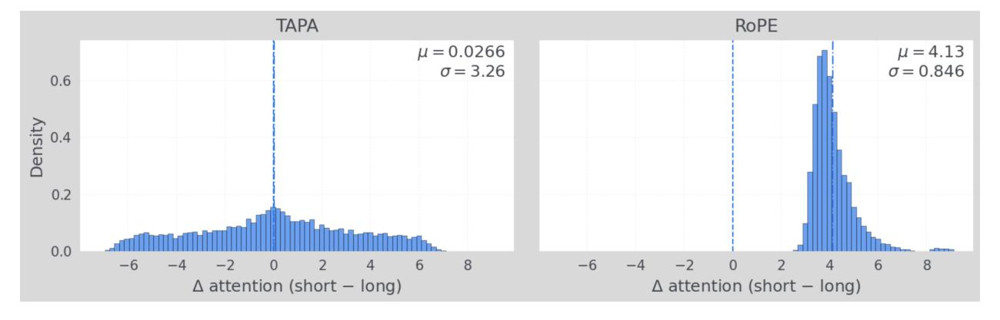

# Positional Encoding via Token-Aware Phase Attention

Yu (Sid) Wang1, Sheng Shen\*, Rémi Munos1, Hongyuan Zhan1, Yuandong Tian1

We prove under practical assumptions that Rotary Positional Embedding (RoPE) introduces an intrinsic distance-dependent bias in attention scores that limits RoPE's ability to model long-context. RoPE extension methods may alleviate this issue, but they typically require post-hoc adjustments after pretraining, such as rescaling or hyperparameters retuning. This paper introduces Token-Aware Phase Attention (TAPA), a new positional encoding method that incorporates a learnable phase function into the attention mechanism. TAPA preserves token interactions over long range, extends to longer contexts with direct and light fine-tuning, extrapolates to unseen lengths, and attains significantly lower perplexity on long-context than RoPE families.

Correspondence: Yu (Sid) Wang at yuwang2020@meta.com

Meta

# 1 Introduction

Rotary Positional Embedding (RoPE) (Su et al., 2021) is a widely adopted positional encoding method in transformers (Vaswani et al., 2017) that applies complex rotations to token representations.

However, RoPE, as originally designed, is not able to extrapolate to context lengths that were not seen during pretraining (Sun et al., 2022), even with extensive continual pretraining at the extended lengths (Chen et al., 2023; Xiong et al., 2023). Various extension methods are proposed to improve RoPE's ability to adapt to longer context, such as increasing RoPE base frequency (Xiong et al., 2023), Position-Interpolation (Chen et al., 2023; Peng et al., 2023b; Ding et al., 2024), YaRN (Peng et al., 2023c) etc.

Many popular publicly available open-source large language models (LLMs) adopt RoPE as their default positional encoding strategy and apply certain RoPE extension methods after pretraining, including LLaMA (Touvron et al., 2023; Dubey et al., 2024), DeepSeek (Team, 2024), Qwen (Bai et al., 2024), Mistral (Jiang et al., 2023), Phi (Abdin et al., 2024a,b), Kimi (Team et al., 2025), PaLM (Chowdhery et al., 2022) etc.

Despite RoPE's widespread use in modern LLMs, the reasons behind RoPE's limitations and extensions remain poorly understood. This theory gap motivates our study. In this paper, we prove that RoPE attention carries a non-trivial distance bias—that is, the attention magnitude is dominated by distance between token positions rather than content. This is apparently undesired in language modeling, because relevant information may be downplayed just because it's in a "bad" position. In addition, our proof shows that certain RoPE extension methods such as reducing base-frequency and PI indeed mitigate this bias issue.

While RoPE extensions help, they remain tied to the rotary structure, and rely on manual interventions after pretraining, such as applying an ad hoc formula to rescale input positions, or adjusting base frequency through extensive empirical tuning. The need for such unnatural post-hoc modifications suggests that a more fundamental limitation is

&lt;sup>1Meta Superintelligence Labs

\*Work done at Meta

present in RoPE's design. Because ideally, a robust positional encoding scheme should be able to fit longer context with minimal fine-tuning and, more importantly, without either hyperparameter or input changes.

We introduce Token-Aware Phase Attention (TAPA), a simple positional encoding framework that inserts a learnable phase function into the attention mechanism. TAPA eliminates undesired distance bias and preserves interactions with long-range context. Importantly, it extends a pretrained model to longer contexts via a direct fine-tuning, without input tweaks or hyperparameter retuning.

Empirically, we pretrain a transformer with LLaMA3 7B model architecture at 8k, fine-tune at 32k, and evaluate up to 64k (Table 1). TAPA matches baselines through 16k. At 32k, TAPA reaches 11.74 perplexity, reducing perplexity by  $\sim$ 9.4% vs. RoPE/PI and  $\sim$ 3.5% vs. YaRN. At 64k, TAPA remains  $\sim$ 11.75 while others blow up to  $\sim$ 2×103, making it the only method whose test perplexity continues decaying up to 49k and remain non-collapsing at 64k.

# 2 Theoretical Estimates for Rotary Positional Embedding (RoPE)

# 2.1 Background

We recall the details of RoPE (Su et al., 2021), and introduce the notations that are important for our future analysis.

**Notation 2.1** (RoPE). We let D be transformer head dimension,  $1/\theta_0$  be RoPE base frequency, and  $\theta_d = \theta_0^{2d/D}$  be the rotation argument of the d-th dimension  $^1$ .

Denote by  $q^{(m)}$  and  $k^{(n)}$  the query and key vector representations for tokens at position m and n. When no ambiguity is present, we shall drop the upper indices m and n to simplify notations. Denote by  $q_{[2d:2d+1]}, k_{[2d:2d+1]} \in \mathbb{R}^2$  the 2-dimensional real vectors that consist of the  $(2d)^{\text{th}}$  and  $(2d+1)^{\text{th}}$  coordinates of q and k (for  $0 \le d \le D/2 - 1$ ). Further, we complexify both vectors into  $q_{[2d:2d+1]}^{\mathbb{C}}$  and  $k_{[2d:2d+1]}^{\mathbb{C}}$ ; that is,

$$q_{[2d:2d+1]}^{\mathbb{C}} = q_{2d} + i \cdot q_{2d+1},$$

$$k_{[2d:2d+1]}^{\mathbb{C}} = k_{2d} + i \cdot k_{2d+1}.$$
(1)

The RoPE attention score between q at position m and k at position n is defined by

$$Attn_{RoPE}(q,k) = \frac{1}{\sqrt{D}} Re \Big[ \sum_{d=0}^{D/2-1} q_{[2d:2d+1]}^{\mathbb{C}} \cdot (k_{[2d:2d+1]}^{\mathbb{C}})^* \cdot e^{i(m-n)\theta_d} \Big], \tag{2}$$

where the operation \* represents the complex conjugation and  $\cdot$  is the multiplication in the complex field. Expanding the right hand side of (2) and recovering the m, n upper indices, we get

$$\operatorname{Attn}_{\mathsf{RoPE}}(q^{(m)}, k^{(n)}) = \frac{1}{\sqrt{D}} \sum_{d=0}^{D/2-1} \left( (q_{2d}^{(m)} k_{2d}^{(n)} + q_{2d+1}^{(m)} k_{2d+1}^{(n)}) \cdot \cos 2\pi (m-n) \theta_d + (q_{2d}^{(m)} k_{2d+1}^{(n)} - q_{2d+1}^{(m)} k_{2d}^{(n)}) \cdot \sin 2\pi (m-n) \theta_d \right)$$

$$=: \frac{1}{\sqrt{D}} \sum_{d=0}^{D/2-1} \left( A_d^{(m,n)} \cos 2\pi (m-n) \theta_d + B_d^{(m,n)} \sin 2\pi (m-n) \theta_d \right).$$
(3)

&lt;sup>1Some literature adopt the notation "b" for base frequency  $1/\theta_0$  and refer to  $1/\theta_d$  as the wavelength of RoPE's d-th dimension. To simplify notations, we adopt " $\theta_0$ " and avoid "b". Increasing RoPE base frequency is simply equivalent to decreasing  $\theta_0$ .

Here we adopt the following handy notations:

$$A_{d}^{(m,n)} =: q_{2d}^{(m)} k_{2d}^{(n)} + q_{2d+1}^{(m)} k_{2d+1}^{(n)}, B_{d}^{(m,n)} =: q_{2d}^{(m)} k_{2d+1}^{(n)} - q_{2d+1}^{(m)} k_{2d}^{(n)}.$$

$$(4)$$

#### 2.2 Distance Bias

It has been widely observed that RoPE attention decays as relative distance increases (Xiong et al., 2023; Sun et al., 2022). We give theoretical explanations for this phenomenon. Let us begin with an asymptotic result.

**Assumption 2.1.** There exists  $\mu_0$ ,  $\nu_0$ , and  $\sigma_0$ , such that for all m, n, d we have

$$\mathbb{E}_{q,k} A_d^{(m,n)} \equiv \mu_0, \quad \mathbb{E}_{q,k} B_d^{(m,n)} \equiv \nu_0, \quad \mathbb{E}_{q,k} |q_d^{(m)} k_d^{(n)}|^2 \equiv \sigma_0^2.$$
 (5)

**Theorem 2.1** (Long-Context Instability). Given Assumption 2.1 and let  $\mu_0, \nu_0$  be as in (5). If  $\{\theta_d\}_{d=1}^{D/2-1}$  are  $\mathbb{Q}$ -linear independent, then for any  $\gamma \in [-\sqrt{\mu_0^2 + \nu_0^2}, \sqrt{\mu_0^2 + \nu_0^2}]$ , there exists  $\{(m_k, n_k)\}_k$  such that

$$\limsup_{k \to \infty} \left| \frac{2}{\sqrt{D}} \mathbb{E}_{q^{(m_k)}, k^{(n_k)}} Attn_{RoPE}(q^{(m_k)}, k^{(n_k)}) - \gamma \right| = \mathcal{O}(\frac{1}{D}).$$
(6)

Remark The Q-linear independence condition is satisfied when  $\theta_0$  is transcendental, or when  $\theta_0$  is algebraic but  $\theta_0^{2/D}$  has degree higher than D/2-1.

Theorem 2.1 reveals an inherent instability in RoPE — its attention carries a token-agnostic, distance-dependent bias which varies so drastically over long range that it sub-converges to any value within a fixed interval up to an error of size 1/D. Next, we establish a quantitative characterization of the distance bias of RoPE.

**Theorem 2.2.** Given Assumption 2.1, there exists  $\theta(\mu_0, \nu_0)$ , such that if  $\theta_0 < \theta(\mu_0, \nu_0)$ , then for any  $1 < |m-n| < \theta_0^{-\frac{1}{4}}/8$  and  $|m'-n'| > \theta_0^{-1}$ , we have

$$\frac{sgn(\mu_0)}{\sqrt{D}} \left( \mathbb{E}_{q^{(m)},k^{(n)}} Attn_{RoPE}(q^{(m)},k^{(n)}) - \mathbb{E}_{q^{(m')},k^{(n')}} Attn_{RoPE}(q^{(m')},k^{(n')}) \right) > |\mu_0|/8$$
(7)

for sufficiently large D. Here  $\mu_0, \nu_0$  are defined in (5).

Theorem 2.2 asserts that when  $\mu_0 > 0$  and context length is roughly  $\mathcal{O}(\theta_0^{-1})$ , RoPE attention favors nearby tokens more than distant ones, with a definite amount of attention score gap on average. This attention gap makes long-context modeling more challenging, because the model must expend extra capacity and computation to overcome the intrinsic bias against distant tokens and recover relevant long-range information. Fortunately, the next Theorem says that one can reduce such gap between any given position-pairs by further decreasing RoPE's  $\theta_0$ . This aligns with the approaches of various RoPE extension methods based on increasing base frequency  $1/\theta_0$  (Xiong et al., 2023), or equivalently, performing positional interpolation (Chen et al., 2023).

**Theorem 2.3.** Given Assumption 2.1, for any  $\epsilon > 0$  and m, n, m', n' > 0, the following holds

$$\frac{1}{\sqrt{D}} \left| \mathbb{E}_{q^{(m)}, k^{(n)}} Attn_{RoPE}(q^{(m)}, k^{(n)}) - \mathbb{E}_{q^{(m')}, k^{(n')}} Attn_{RoPE}(q^{(m')}, k^{(n')}) \right| < \epsilon \tag{8}$$

for sufficiently small  $\theta_0$  and large D.

We introduce notations necessary for proofs in Appendix A, and present the proofs of Theorem 2.1, 2.2, 2.3 in Appendix B, C, and D respectively.

# 3 A New Positional Encoding: Token-Aware Phase Attention (TAPA)

RoPE's distance bias is harmful for long-context language modeling, as it hurts model's ability in feeling long-range dependencies and leveraging distant information. We propose a new positional encoding paradigm to eliminate the undesired distance bias and preserve interactions with arbitrarily far-away tokens.

**Definition 3.1** (TAPA). Let q, k be representation vectors of query and key located at position m and n,  $\phi(q, k)$  be any smooth function on the Cartesian space of (q, k). Furthermore, let  $\alpha$  be a positive real number, D be the transformer head dimension, and  $\mathcal{M} \in \mathbb{R}^{D \times D}$  be any square matrix. Then TAPA associated to  $(\phi, \mathcal{M}, \alpha)$  is given by

$$\operatorname{Attn}_{\phi,\mathcal{M},\alpha}(q,k) = q^{\top} \mathcal{M}k \cdot \cos\left(2\pi |m-n|^{\alpha}\phi(q,k)\right). \tag{9}$$

Note TAPA reduces to the standard inner product attention when  $\mathcal{M} = I_D$  and  $\phi \equiv 0$ . Among the many possible choices of  $\phi$ , we focus on the quadratic form2

$$\phi(q, k) = q^{\mathsf{T}} \mathcal{N} k, \quad \mathcal{N} \in \mathbb{R}^{D \times D}, \tag{10}$$

not only for its simplicity and better expressivity over linear functions, but more importantly because it offers the simplest stationary phase (Stein and Murphy, 1993) for suitable choices of  $\mathcal{N}$  — one that possesses a single non-degenerate critical point. In Subsection 4.5, we compare quadratic phases with linear phases.

To further simplify TAPA, we segment query and key each into two parts

$$q = (q_A, q_P), \quad k = (k_A, k_P)$$
 (11)

such that  $q_A, k_A \in \mathbb{R}^{\theta D}$  and  $q_P, k_P \in \mathbb{R}^{(1-\theta)D}$  for some hyperparameter  $\theta \in (0,1)$ , and define

$$\operatorname{Attn}_{\theta,\alpha}(q,k) = \frac{q_A^{\top} k_A}{\sqrt{\theta D}} \cdot \cos\left(2\pi |m-n|^{\alpha} \frac{q_P^{\top} k_P}{\sqrt{(1-\theta)D}}\right). \tag{12}$$

Note this is a special case of (9) by setting

$$\mathcal{M} = \frac{1}{\sqrt{\theta D}} \cdot \begin{pmatrix} \mathbf{I}_{\theta D} & \mathbf{0} \\ \mathbf{0} & \mathbf{0} \end{pmatrix}, \quad \mathcal{N} = \frac{1}{\sqrt{(1-\theta)D}} \cdot \begin{pmatrix} \mathbf{0} & \mathbf{0} \\ \mathbf{0} & \mathbf{I}_{(1-\theta)D} \end{pmatrix}$$
(13)

Here the query and key subscripts "**A**" and "**P**" stand for "**A**mplitude" and "**P**hase" respectively. The hyperparameter  $\theta$  controls how parameters are allocated between these two components. One notable benefit of the form (12) is that no new parameters or flops are introduced in addition to those of a vanilla transformer.

In contrast to RoPE's distance bias, whose limit points (as  $|m-n| \to \infty$ ) are  $\mathcal{O}(1/D)$ -dense (see Theorem 2.1),

&lt;sup>2For convenience, we refer to (10) as a quadratic form, as it is equivalent to the quadratic form defined on Cartesian space of (q, k) given by  $\frac{1}{2} \begin{pmatrix} q^{\top} & k^{\top} \end{pmatrix} \begin{pmatrix} 0 & \mathcal{N} \\ \mathcal{N}^{\top} & 0 \end{pmatrix} \begin{pmatrix} q \\ k \end{pmatrix}$ .

TAPA's distance bias admits a unique limit of 0:

**Theorem 3.2** (Decaying Bias). Let  $\rho$  be the joint density function of  $q_A$ ,  $k_A$ ,  $q_P$ ,  $k_P$ , and assume  $\rho$  to be Schwartz class. Then there exists  $C(\rho, D) > 0$ , such that for  $m \neq n$  we have

$$\left| \mathbb{E}_{q,k} Attn_{\theta,\alpha}(q^{(m)}, k^{(n)}) \right| < C(\rho, D) \cdot |m - n|^{-\alpha(1-\theta)D}.$$
(14)

The rapid decay (14) is a result of cancellation in an *oscillatory integral* induced by the token-aware quadratic phase. Importantly, *pointwise* attention values need not converge to zero at all. In fact, the next Theorem establishes a lower bound on the variance of TAPA, showing that TAPA stays non-degenerate as distance grows, and is hence able to maintain interactions with arbitrarily distant tokens.

**Theorem 3.3** (Long-Context Non-Degeneracy). Under Assumption 2.1 and let  $\sigma_0^2$  be as in (5), we have

$$\liminf_{|m-n|\to\infty} Var_{q,k}(Attn_{\theta,\alpha}(q^{(m)},k^{(n)})) \ge \frac{\sigma_0^2}{2}.$$
(15)

The proofs of Theorem 3.2 and 3.3 are deferred to Appendix G and H. Lastly, we design experiments to visualize the distance bias of RoPE and TAPA, and obtain empirical evidence that TAPA is far less affected by distance bias than RoPE. See Appendix I for details.

# 4 Experiments

We pretrain Transformers with LLaMA3 7B architecture on 8k context length, fine-tune on 32k, and evaluate up to 64k. Our experiments show that TAPA is able to adapt to 32k by only fine-tuning on less than 0.25% of pretraining tokens, and extrapolate significantly better to the unseen length of 64k compared to all other baselines.

# 4.1 Pretraining

For fair comparison, we pretrain Transformers with LLaMA3 7B (Dubey et al., 2024) architecture from scratch with TAPA (3.1) and RoPE (Su et al., 2021) respectively.

TAPA's formula (12) requires two  $QK^{\top}$  dot products, which falls outside the standard SDPA form implemented by off-the-shelf FlashAttention kernels (Dao et al., 2022). We therefore implement TAPA in PyTorch without flash-style fusion. For a fair comparison, we use the same (non-flash) implementation for RoPE. While a flash-style implementation is feasible—e.g., via PyTorch FlexAttention with an extra  $QK^{\top}$  matmul or a custom Triton kernel, these engineering focus is beyond the scope of this work and we leave it for future study.

For TAPA's implementations, we make no changes to transformer architecture other than removing RoPE and replacing transformer's inner product attention with Equation (12) where  $\alpha = 0.1, \theta = 0.5$ . For RoPE pretraining, we chose base frequency  $1/\theta_0 = 5 \times 10^5$  as suggested by (Xiong et al., 2023).

The pretraining uses Pile (Gao et al., 2020), and each training document is chunked into 8k length segments. The pretraining uses  $512 \times H100$  GPUs with a global batch size of 256 for a total of 200k steps, which results in a total of 420B tokens. We use AdamW (Loshchilov and Hutter, 2017) with  $\beta_1 = 0.9$ ,  $\beta_2 = 0.95$ ,  $\epsilon = 10^{-8}$  and no weight decay. The optimizer linearly warms up from 0 to the maximum learning rate in 5k steps and then decays according to a cosine

| Context window size | 1024  | 2048  | 4096  | 8192  | 16384 | 32768 | 49152  | 65536                         |
|---------------------|-------|-------|-------|-------|-------|-------|--------|-------------------------------|
| RoPE (b=5e5)        | 12.97 | 12.53 | 12.22 | 11.97 | 11.79 | 12.96 | 938.23 | 2280.16                       |
| RoPE (b=2e8)        | 13.00 | 12.54 | 12.23 | 11.98 | 11.80 | 12.96 | 942.94 | 2284.72                       |
| PI                  | 12.99 | 12.54 | 12.23 | 11.98 | 11.80 | 12.97 | 939.17 | 2282.44                       |
| YaRN                | 13.05 | 12.60 | 12.29 | 12.03 | 11.85 | 12.16 | 322.14 | 2284.72 2282.44 1962.55 |
| TAPA                | 13.04 | 12.62 | 12.30 | 12.07 | 11.83 | 11.74 | 11.67  | 11.75                         |

**Table 1** Test perplexities on PG19 test set of LLaMA3 7B transformers first pretrained on 8k context length and further fine-tuned on 32k, and evaluated on  $1k\sim64k$ .

| Context window size | 1024  | 2048  | 4096  | 8192  | 16384   | 32768                            |
|---------------------|-------|-------|-------|-------|---------|----------------------------------|
| RoPE (b=5e5)        | 13.08 | 12.63 | 12.32 | 12.21 | 5878.17 | 16366.63                         |
| YaRN                | 13.09 | 12.64 | 12.33 | 12.22 | 5869.35 | 16342.28                         |
| PI                  | 13.07 | 12.62 | 12.30 | 12.19 | 5872.29 | 16366.63 16342.28 16350.28 |
| TAPA                | 13.12 | 12.66 | 12.34 | 12.22 | 17.96   | 122.71                           |

**Table 2** Test perplexity via directly evaluating LLaMA3 7B transformers pretrained on 8k context length to  $1k\sim32k$ , without finetuning on 32k.

schedule to  $0.1 \times$  maximum learning rate. We use  $10^{-4}$  as the maximum learning rate for RoPE, while for TAPA we find that a smaller learning rate  $2 \times 10^{-5}$  to be suitable.

## 4.2 Long-Context Fine-tuning

To extend to long context, we further fine-tune pretrained models with different Positional Encoding methods on the training split of PG19 (Rae et al., 2019), where each document is chunked into segments of length 32k. We fine-tune with each Positional Encoding method using a global batch size of 128 for 500 steps in total. The optimizer configuration is mostly the same as in pretraining, except that we use  $2 \times 10^{-5}$  as the maximum learning rate across all methods, and warm up for only 50 steps.

For RoPE we fine-tuned with two base frequencies  $b = 1/\theta_0$ . The first reuses the pretraining setting  $b = 5 \times 10^5$ , and the second adopts a larger  $b = 2 \times 10^8$  to detect any additional benefit from further increasing b.

In TAPA fine-tuning, we keep all hyper-parameters, architectures, and attention computations the same from pretraining. This **aligns with the key motivation of TAPA's design** — to enable scaling to longer contexts through direct fine-tuning and, unlike the RoPE family, does not require any position-scaling or hyperparameter tuning post-pretraining.

For PI (Chen et al., 2023), we set the max L'=65536 (i.e. 64k), which is the maximal length we will evaluate our models on. For the same reason we set the scale factor to 8 in YaRN (Peng et al., 2023c). When fine-tuning with the increased base frequency approach (Xiong et al., 2023) we experimented with several options ranging from  $10^{-6}$  to  $2\times10^{-9}$ , and report the best result achieved when base equals to  $4\times10^{-9}$ .

#### 4.3 Long-Context Evaluation

We evaluate all fine-tuned models on the test split of PG19 (Rae et al., 2019) which consist of mostly long sequence samples. To measure models' performance at different context lengths, we consider segmentation of each document

| Context window size | 1024  | 2048  | 4096  | 8192  | 16384 | 32768 | 49152          | 65536 |
|---------------------|-------|-------|-------|-------|-------|-------|----------------|-------|
| Linear Phase        | 14.63 | 14.15 | 13.83 | 13.54 | 13.29 | 13.13 | 13.59 11.67 | 14.82 |
| Quadratic phase     | 13.04 | 12.62 | 12.30 | 12.07 | 11.83 | 11.74 | 11.67          | 11.75 |

**Table 3** Test perplexities on PG19 test set of LLaMA3 7B transformers first pretrained on 8k context length and further fine-tuned on 32k, and evaluated on  $1k\sim64k$ .

with context window size varying from 1k to 64k in the dyadic fashion. For each context window, we closely follow the sliding window method from (Press et al., 2021) with stride = 256 to calculate the test loss.

#### 4.4 Evaluation Results

We report the test perplexity for multiple Positional Encoding methods on context window sizes ranging from 1k to 64k on the checkpoints obtained from Subsection 4.2.

As shown in Table 1, on short to mid context lengths (1k-16k) all position encodings exhibit a similar, monotonically decreasing perplexity curve (from  $\sim 13.0$  at 1k to  $\sim 11.8$  at 16k), with differences within a few hundredths. At 32k, a noticeable difference appears: TAPA attains the lowest perplexity (11.74), followed by YaRN (12.16), while RoPE/PI plateau around 12.96-12.97. Beyond this point, the trends diverge sharply. At 49k-64k, RoPE/PI and YaRN collapse. The perplexities blows up to  $\sim 938-2285$  (RoPE/PI) and  $\sim 322-1963$  (YaRN)—whereas TAPA remains stable (11.67 at 49k, 11.75 at 64k). In other words, while YaRN is more resilient than RoPE/PI it still collapses at very long lengths. TAPA is the only method that preserves low perplexity across the entire 1k-64k range, demonstrating substantially stronger long-context robustness and utilization than the alternatives.

In addition, we consider zero-shot long-context perplexity without 32k fine-tuning. We directly evaluate LLaMA3 7B models pretrained at 8k on 1k–32k and present the results in Table 2. It shows that all position encodings behave similarly on 1k–8k (perplexity decreases from  $\sim$ 13.1 at 1k to  $\sim$ 12.2 at 8k with sub-tenth differences). However, extrapolation beyond 8k fails for RoPE/PI/YaRN: at 16k their perplexities jump to around  $5.87 \times 10^3$ , and at 32k to roughly  $1.63 \times 10^4$ . In contrast, TAPA degrades gracefully, reaching 17.96 at 16k and 122.71 at 32k, which is about  $327 \times$  and  $133 \times$  lower than the next-best baseline, respectively. These results indicate that without any long-context fine-tuning, TAPA retains substantially better long-range generalization relative to all other baselines.

#### 4.5 Ablations: TAPA's phase choice

We compare two phase functions for TAPA: (i) *quadratic* (stationary) phase in (10) and (ii) *linear* (non-stationary) phase:

$$\phi(q,k) = \frac{1}{\sqrt{(1-\theta)D}} \cdot (q^{\top}, k^{\top}) \cdot \mathbb{1}_{(1-\theta)D}.$$
(16)

According to Table 3, TAPA with quadratic phase consistently outperforms the linear variant across all lengths. In the short–mid range (1k–16k), quadratic improves from  $13.04 \rightarrow 11.83$  versus  $14.63 \rightarrow 13.29$  for linear—an absolute gap of 1.3-1.6 ( $\approx 11\%$  relative at 1k and 16k). At longer lengths the divergence grows and stability differs markedly: at 32k, linear reaches 13.13 while quadratic is 11.74 ( $\Delta = 1.39, \approx 11\%$ ); beyond 32k the linear curve becomes non-monotonic and degrades, whereas quadratic remains flat and low. These results align with the intuitions from the theoretical perspective of oscillatory integrals, where non-stationary phases (e.g., linear) induce large, rapidly varying oscillations

in representation space, while stationary phases are less sensitive to small representation changes.

However, it is worth noting that although TAPA with linear phase is suboptimal compared to the quadratic phase, it still dominates the baselines in Table 1 at long ranges, achieving a significantly lower orders of magnitude: e.g., at 49k/64k it attains 13.59/14.82 perplexity versus 322-943 and 1963-2285 for YaRN and RoPE/PI, respectively.

Overall, the stationary (quadratic) phase yields both better accuracy and greater long-context stability, while even the linear-phase TAPA retains strong long-context robustness compared to RoPE family.

## 5 Related Work

## 5.1 Positional Encoding in Transformers

Positional encodings in transformers were originally introduced as fixed sinusoidal embeddings (Vaswani et al., 2023), and later extended to learned embeddings (Radford and Narasimhan, 2018; Radford et al., 2019; Devlin et al., 2019). These absolute position methods inject positional signals independent of token content and is limited by fixed context length. Relative position encodings (Shaw et al., 2018; Dai et al., 2019; Raffel et al., 2019; He et al., 2020; Huang et al., 2020; Ke et al., 2020; Press et al., 2021) address this by letting model attend to relative distances typically as additive biases in the attention scores. CAPE (Likhomanenko et al., 2021) on the other hand augments absolute sinusoidal positional embeddings with randomized continuous shifts and scaling during training.

# 5.2 Rotary Positional Embedding (RoPE) and extensions

Rotary Position Embedding (RoPE) (Su et al., 2021) offers a novel way to encode relative positions by applying complex-valued rotations directly to the representations of queries and keys. However, the original RoPE does poorly in directly extrapolating to long context, leading to various studies and extension methods to mitigate this issue.

XPos (Sun et al., 2022) adds an exponential scaling on top of RoPE to enforce a more explicit preference based on token's relative positions and empirically smooths attention oscillations compared to RoPE.

However, it is observed (Xiong et al., 2023) that XPos with hyperparameters unchanged after pretraining still suffer from the same long-context bottleneck as RoPE and they have to apply a base frequency change to XPos to fix the issue. In fact, the authors of (Xiong et al., 2023) hypothesize that the bottleneck of extrapolation ability of both RoPE and XPos lies in the heavy decay of attention score as relative distance grows; to mitigate such decay they propose to increase RoPE's base frequency, and observed better adaptation on longer context. In (Liu et al., 2023) the authors further study the scaling law of different choices of base frequencies.

An insightful and popular concurrent approach at the time is Position-Interpolation (PI) (Chen et al., 2023), which linearly rescale long context positions to interpolate pretraining position range. Their hypothesis is that directly extrapolating to any unseen position could lead to unstable attention behavior, as in theory the trigonometric terms in RoPE's formula is able to approximate any value (when RoPE's dimension is sufficiently large). It is worth noting that position interpolation is mathematically equivalent to increasing RoPE's base frequency non-uniformly across RoPE dimensions, although they stem from different hypotheses and motivations.

YaRN (Peng et al., 2023c) hypothesizes that applying the same position rescaling or enlarged base frequency to all RoPE dimensions may cause token representations to become closer to each other and make it harder for model to differentiate and understand local relationships; they propose a new interpolation scheme that determines interpolation strength across RoPE dimensions in a non-linear fashion.

Similarly, LongRoPE (Ding et al., 2024) manage to extend to 2 million context length via a non-uniform rescaling that differentiates higher frequency dimensions from lower frequency ones. They apply minimal scalings to early tokens and propose an efficient search algorithm to find optimal scaling configurations.

All these methods rely on heuristic rescaling of input positions or manual hyperparameter adjustments after pretraining in order to extend context length. The rescaling functions are often ad hoc and hyperparameter choices are subtle and case-by-case, typically requiring extensive ablation to identify suitable configurations. In addition, some prior work has also included theoretical analyses of RoPE, such as bounding RoPE attention scores from above (Su et al., 2021), or an interpolation error bound of Positional Interpolation (Chen et al., 2023), but they do not explain the limitation of RoPE or why interpolation helps.

# 5.3 Non-RoPE Approaches to Positional Extrapolation

While not being the focus of this work, it is worth mentioning several non-RoPE extrapolation approaches. NoPE (Haviv et al., 2022; Chi et al., 2023; Kazemnejad et al., 2023) proposes to remove any explicit use of positional encoding from transformers as they hypothesize that the asymmetry of causal mask in language modeling already implicitly encodes positional information. Nevertheless, the limitations of NoPE in scaling to long contexts have been demonstrated both empirically and theoretically (Wang et al., 2024; Ma et al., 2024). LM-Infinite (Han et al., 2023) introduces a Lambda-shaped masking mechanism to enable extrapolation that is applicable to any relative positional encoding; hence it is orthogonal to our approach as we preserve the causal masking mechanism and focus on improving the positional encoding itself. Another line of research explores alternative designs of the attention mechanism, incorporating custom positional encoding schemes. Examples include FNet (Lee-Thorp et al., 2021), LongNet (Fu et al., 2023), RWKV (Peng et al., 2023a), and Hyena (Poli et al., 2023). Since these methods deviate from the standard transformer architecture, whereas our work assumes the traditional attention, we do not discuss them in depth.

#### 6 Conclusion

We introduced TAPA, a new positional–encoding paradigm which, unlike RoPE, requires *no* hyperparameter changes or input re-scalings after pretraining, and adapts to longer context range with only light fine-tuning.

On the theory side, we proved that RoPE carries an intrinsic distance bias in attention, which limits RoPE's long context ability, and we provided a mathematical justification for various RoPE extensions including Position-Interpolation (PI). On the other hand, we established vanishing bias and non-degeneracy guarantees for TAPA as context grows.

Empirically, on LLaMA3 7B models pretrained at 8k and evaluated up to 64k, TAPA matches strong baselines at short ranges, and is the only method that continues to improve up to  $\sim$ 49k, and remains stable at 64k, while RoPE-family methods collapse. Zero-shot tests (no 32k fine-tuning) further confirm TAPA's robustness at long range.

#### References

Marah Abdin, Jyoti Aneja, Harkirat Singh Behl, Sébastien Bubeck, Ronen Eldan, Suriya Gunasekar, Michael Harrison, Russell J. Hewett, Mojan Javaheripi, Piero Kauffmann, James R. Lee, Yin Tat Lee, Yuanzhi Li, Weishung Liu, Caio C'esar Teodoro Mendes, Anh Nguyen, Eric Price, Gustavo de Rosa, Olli Saarikivi, Adil Salim, Shital Shah, Xin Wang, Rachel Ward, Yue Wu, Dingli Yu, Cyril Zhang, and Yi Zhang. Phi-4 technical report. *ArXiv*, abs/2412.08905, 2024a. https://api.semanticscholar.org/CorpusID:274656307.

Marah Abdin, Sam Ade Jacobs, Ammar Ahmad Awan, Jyoti Aneja, Ahmed Awadallah, Hany Hassan Awadalla, Nguyen Bach, Amit Bahree, Arash Bakhtiari, Harkirat Singh Behl, Alon Benhaim, Misha Bilenko, Johan Bjorck, Sébastien Bubeck, Martin Cai, Caio C'esar Teodoro Mendes, Weizhu Chen, Vishrav Chaudhary, Parul Chopra, Allison Del Giorno, Gustavo de Rosa, Matthew Dixon, Ronen Eldan, Dan Iter, Abhishek Goswami, Suriya Gunasekar, Emman Haider, Junheng Hao, Russell J. Hewett, Jamie Huynh, Mojan Javaheripi, Xin Jin, Piero Kauffmann, Nikos Karampatziakis, Dongwoo Kim, Young Jin Kim, Mahoud Khademi, Lev Kurilenko, James R. Lee, Yin Tat Lee, Yuanzhi Li, Chen Liang, Weishung Liu, Eric Lin, Zeqi Lin, Piyush Madan, Arindam Mitra, Hardik Modi, Anh Nguyen, Brandon Norick, Barun Patra, Daniel Perez-Becker, Thomas Portet, Reid Pryzant, Heyang Qin, Marko Radmilac, Liliang Ren, Corby Rosset, Sambudha Roy, Olli Saarikivi, Amin Saied, Adil Salim, Michael Santacroce, Shital Shah, Ning Shang, Hiteshi Sharma, Xianmin Song, Olatunji Ruwase, Praneetha Vaddamanu, Xin Wang, Rachel Ward, Guanhua Wang, Philipp Andre Witte, Michael Wyatt, Can Xu, Jiahang Xu, Sonali Yadav, Fan Yang, Ziyi Yang, Donghan Yu, Cheng-Yuan Zhang, Cyril Zhang, Jianwen Zhang, Li Lyna Zhang, Yi Zhang, Yunan Zhang, Xiren Zhou, and Yifan Yang. Phi-3 technical report: A highly capable language model locally on your phone. *ArXiv*, abs/2404.14219, 2024b. https://api.semanticscholar.org/CorpusID:269293048.

Yifeng Bai, Liang Zhang, Yijun Chen, Junyi Yang, et al. Qwen 2 technical report. Technical Report, 2024. RoPE positional encoding with NTK-aware long-context support.

Shouyuan Chen, Sherman Wong, Liangjian Chen, and Yuandong Tian. Extending context window of large language models via positional interpolation. *ArXiv*, abs/2306.15595, 2023. https://api.semanticscholar.org/CorpusID:259262376.

Ta-Chung Chi, Ting-Han Fan, Li-Wei Chen, Alex Rudnicky, and Peter J. Ramadge. Latent positional information is in the self-attention variance of transformer language models without positional embeddings. In *Annual Meeting of the Association for Computational Linguistics*, 2023. https://api.semanticscholar.org/CorpusID:258840844.

Aakanksha Chowdhery, Sharan Narang, Jacob Devlin, Maarten Bosma, Gaurav Mishra, Adam Roberts, Paul Barham, Hyung Won Chung, Charles Sutton, Sebastian Gehrmann, Parker Schuh, Kensen Shi, Sasha Tsvyashchenko, Joshua Maynez, Abhishek Rao, Parker Barnes, Yi Tay, Noam M. Shazeer, Vinodkumar Prabhakaran, Emily Reif, Nan Du, Ben Hutchinson, Reiner Pope, James Bradbury, Jacob Austin, Michael Isard, Guy Gur-Ari, Pengcheng Yin, Toju Duke, Anselm Levskaya, Sanjay Ghemawat, Sunipa Dev, Henryk Michalewski, Xavier García, Vedant Misra, Kevin Robinson, Liam Fedus, Denny Zhou, Daphne Ippolito, David Luan, Hyeontaek Lim, Barret Zoph, Alexander Spiridonov, Ryan Sepassi, David Dohan, Shivani Agrawal, Mark Omernick, Andrew M. Dai, Thanumalayan Sankaranarayana Pillai, Marie Pellat, Aitor Lewkowycz, Erica Moreira, Rewon Child, Oleksandr Polozov, Katherine Lee, Zongwei Zhou, Xuezhi Wang, Brennan Saeta, Mark Díaz, Orhan Firat, Michele Catasta, Jason Wei, Kathleen S. Meier-Hellstern, Douglas Eck, Jeff Dean, Slav Petrov, and Noah Fiedel. Palm: Scaling language modeling with pathways. *ArXiv*, abs/2204.02311, 2022. https://api.semanticscholar.org/CorpusID:247951931.

Zihang Dai, Zhilin Yang, Yiming Yang, Jaime G. Carbonell, Quoc V. Le, and Ruslan Salakhutdinov. Transformer-xl: Attentive language models beyond a fixed-length context. *ArXiv*, abs/1901.02860, 2019. https://api.semanticscholar.org/CorpusID:57759363.

Tri Dao, Daniel Y. Fu, Stefano Ermon, Atri Rudra, and Christopher R'e. Flashattention: Fast and memory-efficient exact attention with io-awareness. *ArXiv*, abs/2205.14135, 2022. https://api.semanticscholar.org/CorpusID:249151871.

Jacob Devlin, Ming-Wei Chang, Kenton Lee, and Kristina Toutanova. Bert: Pre-training of deep bidirectional transformers

- for language understanding. In *North American Chapter of the Association for Computational Linguistics*, 2019. https://api.semanticscholar.org/CorpusID:52967399.
- Yiran Ding, Li Lyna Zhang, Chengruidong Zhang, Yuanyuan Xu, Ning Shang, Jiahang Xu, Fan Yang, and Mao Yang. Longrope: Extending llm context window beyond 2 million tokens. *ArXiv*, abs/2402.13753, 2024. https://api.semanticscholar.org/CorpusID:267770308.
- Vaibhav Dubey, Pranav Balaji, Xiaoyu Weng, Stuart Rosenberg, Miaoyuan Zhang, Xiang Zhang, et al. Llama 3 technical report. Technical Report, 2024. Confirms use of Rotary Positional Encoding.
- Yao Fu, Hangbo Bao, Zewen Chi, Yijuan Lu, Binyang Li, Chenliang Li, Linjun Shou, Ming Gong, and Nan Duan. Longnet: Scaling transformers to 1,000,000,000 tokens. *ArXiv*, abs/2307.02486, 2023. https://arxiv.org/abs/2307.02486.
- Leo Gao, Stella Biderman, Sid Black, Laurence Golding, Travis Hoppe, Charles Foster, Jason Phang, Horace He, Anish Thite, Noa Nabeshima, Shawn Presser, and Connor Leahy. The pile: An 800gb dataset of diverse text for language modeling. *ArXiv*, abs/2101.00027, 2020. https://api.semanticscholar.org/CorpusID:230435736.
- Chi Han, Qifan Wang, Hao Peng, Wenhan Xiong, Yu Chen, Heng Ji, and Sinong Wang. Lm-infinite: Zero-shot extreme length generalization for large language models. In *North American Chapter of the Association for Computational Linguistics*, 2023. https://api.semanticscholar.org/CorpusID:268357635.
- Adi Haviv, Ori Ram, Ofir Press, Peter Izsak, and Omer Levy. Transformer language models without positional encodings still learn positional information. *ArXiv*, abs/2203.16634, 2022. https://api.semanticscholar.org/CorpusID: 247839823.
- Pengcheng He, Xiaodong Liu, Jianfeng Gao, and Weizhu Chen. Deberta: Decoding-enhanced bert with disentangled attention. *ArXiv*, abs/2006.03654, 2020. https://api.semanticscholar.org/CorpusID:219531210.
- Zhiheng Huang, Davis Liang, Peng Xu, and Bing Xiang. Improve transformer models with better relative position embeddings. In *Findings*, 2020. https://api.semanticscholar.org/CorpusID;221995630.
- Albert Qiaochu Jiang, Alexandre Sablayrolles, Arthur Mensch, Chris Bamford, Devendra Singh Chaplot, Diego de Las Casas, Florian Bressand, Gianna Lengyel, Guillaume Lample, Lucile Saulnier, L'elio Renard Lavaud, Marie-Anne Lachaux, Pierre Stock, Teven Le Scao, Thibaut Lavril, Thomas Wang, Timothée Lacroix, and William El Sayed. Mistral 7b. *ArXiv*, abs/2310.06825, 2023. https://api.semanticscholar.org/CorpusID:263830494.
- Amirhossein Kazemnejad, Inkit Padhi, Karthikeyan Natesan Ramamurthy, Payel Das, and Siva Reddy. The impact of positional encoding on length generalization in transformers. *ArXiv*, abs/2305.19466, 2023. https://api.semanticscholar.org/CorpusID:258987259.
- Guolin Ke, Di He, and Tie-Yan Liu. Rethinking positional encoding in language pre-training. *ArXiv*, abs/2006.15595, 2020. https://api.semanticscholar.org/CorpusID:220249871.
- L. Kuipers and H. Niederreiter. *Uniform Distribution of Sequences*. A Wiley-Interscience publication. Wiley, 1974. ISBN 9780471510451. https://books.google.com/books?id=lCTvAAAAMAAJ.
- James Lee-Thorp, Joshua Ainslie, Ilya Eckstein, and Santiago Ontanon. Fnet: Mixing tokens with fourier transforms. *ArXiv*, abs/2105.03824, 2021. https://arxiv.org/abs/2105.03824.
- Tatiana Likhomanenko, Qiantong Xu, Ronan Collobert, Gabriel Synnaeve, and Alexey Rogozhnikov. Cape: Encoding relative positions with continuous augmented positional embeddings. In *Neural Information Processing Systems*, 2021. https://api.semanticscholar.org/CorpusID:235358538.
- Xiaoran Liu, Hang Yan, Shuo Zhang, Chen An, Xipeng Qiu, and Dahua Lin. Scaling laws of rope-based extrapolation. *ArXiv*, abs/2310.05209, 2023. https://api.semanticscholar.org/CorpusID:263828829.

- Ilya Loshchilov and Frank Hutter. Fixing weight decay regularization in adam. *ArXiv*, abs/1711.05101, 2017. https://api.semanticscholar.org/CorpusID:3312944.
- Xin Ma, Yang Liu, Jingjing Liu, and Xiaoxu Ma. Mesa-extrapolation: A weave position encoding method for enhanced extrapolation in llms. *ArXiv*, abs/2410.15859, 2024. https://api.semanticscholar.org/CorpusID:273502613.
- Bo Peng, Yuxuan Du, Xiaohui Zhang, Zichen Ma, Wei Liu, and Wei Hu. Rwkv: Reinventing rnns for the transformer era. *ArXiv*, abs/2305.13048, 2023a. https://arxiv.org/abs/2305.13048.
- Bowen Peng, Jeffrey Quesnelle, Honglu Fan, and Enrico Shippole. Ntk-aware scaled rope enhances llm long context extrapolation. *ArXiv*, abs/2306.15595, 2023b. https://arxiv.org/abs/2306.15595.
- Bowen Peng, Jeffrey Quesnelle, Honglu Fan, and Enrico Shippole. Yarn: Efficient context window extension of large language models, 2023c. https://arxiv.org/abs/2309.00071.
- Michael Poli, Tri Dao, Nikita Mankad, Beidi Chen, Dan Fu, Atri Rudra, Stefano Ermon, and Christopher Ré. Hyena hierarchy: Towards larger contexts and faster inference in language models. *ArXiv*, abs/2302.10866, 2023. https://arxiv.org/abs/2302.10866.
- Ofir Press, Noah A. Smith, and Mike Lewis. Train short, test long: Attention with linear biases enables input length extrapolation. *ArXiv*, abs/2108.12409, 2021. https://api.semanticscholar.org/CorpusID:237347130.
- Alec Radford and Karthik Narasimhan. Improving language understanding by generative pre-training. 2018. https://api.semanticscholar.org/CorpusID:49313245.
- Alec Radford, Jeff Wu, Rewon Child, David Luan, Dario Amodei, and Ilya Sutskever. Language models are unsupervised multitask learners. 2019. https://api.semanticscholar.org/CorpusID:160025533.
- Jack W. Rae, Anna Potapenko, Siddhant M. Jayakumar, and Timothy P. Lillicrap. Compressive transformers for long-range sequence modelling. *ArXiv*, abs/1911.05507, 2019. https://api.semanticscholar.org/CorpusID:207930593.
- Colin Raffel, Noam M. Shazeer, Adam Roberts, Katherine Lee, Sharan Narang, Michael Matena, Yanqi Zhou, Wei Li, and Peter J. Liu. Exploring the limits of transfer learning with a unified text-to-text transformer. *J. Mach. Learn. Res.*, 21:140:1–140:67, 2019. https://api.semanticscholar.org/CorpusID:204838007.
- Peter Shaw, Jakob Uszkoreit, and Ashish Vaswani. Self-attention with relative position representations. In *North American Chapter of the Association for Computational Linguistics*, 2018. https://api.semanticscholar.org/CorpusID:3725815.
- Elias M. Stein and Timothy S. Murphy. *Harmonic Analysis: Real-Variable Methods, Orthogonality, and Oscillatory Integrals*, volume 43 of *Princeton Mathematical Series*. Princeton University Press, 1993. ISBN 978-0691032160.
- Jianlin Su, Yu Lu, Shengfeng Pan, Bo Wen, and Yunfeng Liu. Roformer: Enhanced transformer with rotary position embedding. *ArXiv*, abs/2104.09864, 2021. https://api.semanticscholar.org/CorpusID:233307138.
- Yutao Sun, Li Dong, Barun Patra, Shuming Ma, Shaohan Huang, Alon Benhaim, Vishrav Chaudhary, Xia Song, and Furu Wei. A length-extrapolatable transformer. *ArXiv*, abs/2212.10554, 2022. https://api.semanticscholar.org/CorpusID: 254877252.
- DeepSeek-AI Team. Deepseek v3 technical report. Technical Report, 2024. Transformer architecture with RoPE and key/query rotary projection.
- Kimi Team, Angang Du, Bofei Gao, Bowei Xing, Changjiu Jiang, Cheng Chen, Cheng Li, Chenjun Xiao, Chenzhuang Du, Chonghua Liao, Chuning Tang, Congcong Wang, Dehao Zhang, Enming Yuan, Enzhe Lu, Feng Tang, Flood Sung, Guangda Wei, Guokun Lai, Haiqing Guo, Han Zhu, Haochen Ding, Hao-Xing Hu, Haoming Yang, Hao Zhang, Haotian Yao, Hao-Dong Zhao, Haoyu Lu, Haoze Li, Haozhen Yu, Hongcheng Gao, Huabin Zheng, Huan Yuan, Jia Chen, Jia-Xing Guo, Jianling Su, Jianzhou Wang, Jie Zhao, Jin Zhang, Jingyuan Liu, Junjie Yan, Junyan Wu, Li-Na Shi, Li-Tao Ye, Long Yu, Meng-Xiao Dong, Neo Y. Zhang, Ningchen Ma, Qi Pan, Qucheng Gong, Shaowei Liu, Shen Ma, Shu-Yan Wei, Sihan Cao, Si-Da Huang, Tao Jiang, Wei-Wei Gao, Weiming Xiong,

- Weiran He, Weixiao Huang, Wenhao Wu, Wen He, Xian sen Wei, Xian-Xian Jia, Xingzhe Wu, Xinran Xu, Xinxing Zu, Xinyu Zhou, Xue biao Pan, Y. Charles, Yang Li, Yan-Ling Hu, Yangyang Liu, Yanru Chen, Ye-Jia Wang, Yibo Liu, Yidao Qin, Yifeng Liu, Yingbo Yang, Yiping Bao, Yulun Du, Yuxin Wu, Yuzhi Wang, Zaida Zhou, Zhaoji Wang, Zhaowei Li, Zhengxin Zhu, Zheng Zhang, Zhexu Wang, Zhiqi Huang, Zihao Huang, Ziya Xu, and Zonghan Yang. Kimi k1.5: Scaling reinforcement learning with llms. *ArXiv*, abs/2501.12599, 2025. https://api.semanticscholar.org/CorpusID:275789974.
- Hugo Touvron, Louis Lavril, Gautier Izacard, Félix Martinet, Marie-Anne Lachaux, Timothée Lacroix, Baptiste Rozière, Neil Goyal, Eric Hambro, Aurelien Azhar, Aurélien Rodriguez, Armand Joulin, and Edouard Grave. Llama 2: Open foundation and conversational models. Technical Report, 2023. Uses rotary positional embeddings (RoPE).
- Ashish Vaswani, Noam M. Shazeer, Niki Parmar, Jakob Uszkoreit, Llion Jones, Aidan N. Gomez, Lukasz Kaiser, and Illia Polosukhin. Attention is all you need. In *Neural Information Processing Systems*, 2017. https://api.semanticscholar.org/CorpusID:13756489.
- Ashish Vaswani, Noam Shazeer, Niki Parmar, Jakob Uszkoreit, Llion Jones, Aidan N. Gomez, Lukasz Kaiser, and Illia Polosukhin. Attention is all you need, 2023. https://arxiv.org/abs/1706.03762.
- Jie Wang, Tao Ji, Yuanbin Wu, Hang Yan, Tao Gui, Qi Zhang, Xuanjing Huang, and Xiaoling Wang. Length generalization of causal transformers without position encoding. In *Annual Meeting of the Association for Computational Linguistics*, 2024. https://api.semanticscholar.org/CorpusID:269213989.
- Thomas Wolff. *Lectures on Harmonic Analysis*, volume 29 of *University Lecture Series*. American Mathematical Society, Providence, RI, 2003. https://www.math.ubc.ca/~ilaba/wolff/.
- Wenhan Xiong, Jingyu Liu, Igor Molybog, Hejia Zhang, Prajjwal Bhargava, Rui Hou, Louis Martin, Rashi Rungta, Karthik Abinav Sankararaman, Barlas Oğuz, Madian Khabsa, Han Fang, Yashar Mehdad, Sharan Narang, Kshitiz Malik, Angela Fan, Shruti Bhosale, Sergey Edunov, Mike Lewis, Sinong Wang, and Hao Ma. Effective long-context scaling of foundation models. *ArXiv*, abs/2309.16039, 2023. https://api.semanticscholar.org/CorpusID:263134982.

# **Appendix**

# A Preparations for proving Theorem 2.1, 2.2, and 2.3

Consider the following decomposition of (3):

$$\frac{1}{\sqrt{D}} \operatorname{Attn}_{\mathsf{ROPE}}(q^{(m)}, k^{(n)}) = \left(\frac{\mu_0}{D} \cdot \sum_{d=0}^{D/2-1} \cos 2\pi (m-n)\theta_d + \frac{\nu_0}{D} \cdot \sum_{d=0}^{D/2-1} \sin 2\pi (m-n)\theta_d\right) \\
+ \frac{1}{D} \left(\sum_{d=0}^{D/2} (A_d - \mu_0) \cos 2\pi (m-n)\theta_d + \sum_{d=0}^{D/2} (B_d - \nu_0) \sin 2\pi (m-n)\theta_d\right) \\
=: \Gamma_{\lambda} + Z_{\lambda} \tag{17}$$

where  $\lambda = m - n$ . Note that  $\mathbb{E}_{q,k} Z_{\lambda} = 0$  by definition (5), and LHS of (7) is precisely  $\Gamma_{\lambda} - \Gamma_{\Lambda}$ . For convenience, we denote it by:

$$\Delta_{\lambda,\Lambda} =: \Gamma_{\lambda} - \Gamma_{\Lambda}. \tag{18}$$

Remark In addition to Assumption 2.1, if we further assume that  $\{A_i\}_i$  and  $\{B_j\}_j$  are sub-gaussian satisfying

$$\mathbb{P}(|A_i - \mu_0| > \eta) < C_1 e^{-C_2 \eta^2}, \quad \mathbb{P}(|B_j - \nu_0| > \eta) < C_1 e^{-C_2 \eta^2}$$
(19)

for some  $C_1, C_2 > 0$ ,  $\mu_0, \nu_0 \in \mathbb{R}$ , all  $\eta > 0$  and  $i, j = 0, \dots, D/2 - 1$ , then one can show3 that the non-deterministic term  $Z_{\lambda} - Z_{\Lambda}$  admits the following control

$$\mathbb{P}(|Z_{\lambda} - Z_{\Lambda}| > \eta) < C_3 e^{-C_4 D \eta^2} \tag{20}$$

for some  $C_3, C_4 > 0$  and all  $\eta > 0$ . In other words, the magnitude of  $Z_{\lambda} - Z_{\Lambda}$  is negligible (with high probability) compared to  $\Delta_{\lambda,\Lambda}$  when D is large.

# B Proof of Theorem 2.1

*Proof of Theorem 2.1.* A direct computation of the expectation of  $Attn_{RoPE}(q^{(m)}, k^{(n)})$  gives:

$$\frac{2}{\sqrt{D}} \mathbb{E}_{q^{(m)}, k^{(n)}} \operatorname{Attn}_{\mathsf{RoPE}}(q^{(m)}, k^{(n)}) =: \frac{2}{D} \sum_{d=0}^{D/2-1} \left( \mu_0 \cos 2\pi (m-n) \theta_d + \nu_0 \sin 2\pi (m-n) \theta_d \right) \\
= \frac{2\sqrt{\mu_0^2 + \nu_0^2}}{D} \sum_{d=0}^{D/2-1} \sin \left( 2\pi (m-n) \theta_d + \phi \right) \tag{21}$$

where  $\phi = \arctan(\mu_0/\nu_0)$ . Define  $\beta = \arcsin(\gamma/\sqrt{\mu_0^2 + \nu_0^2})/2\pi - \phi \mod 1$ . Since  $\{\theta_d\}_{d=1}^{D/2-1}$  are  $\mathbb{Q}$ -linearly independent, it follows from Weyl's criterion that  $((\lambda\theta_1), \cdots, (\lambda\theta_{D/2-1})), \lambda = 1, 2, \cdots$  is uniformly distributed in  $[0,1]^{D/2-1}$  (e.g. Theorem 6.3 and Example 6.1 in Kuipers and Niederreiter (1974)). Here (r) represents the fractional

&lt;sup>3For example, using Laplace transform.

part of a real number r. Consequently, for any  $\epsilon > 0$  we can find  $\lambda_{\epsilon} \in \mathbb{Z}$  sufficiently large such that

$$\left| \left( \left( \lambda_{\epsilon} \theta_{1} \right), \cdots, \left( \lambda_{\epsilon} \theta_{D/2-1} \right) \right) - \left( \beta, \cdots, \beta \right) \right|$$
 (22)

is so small that

$$\left| \frac{2}{D} \sum_{d=0}^{D/2-1} \sin\left(\lambda_{\epsilon} \theta^{2d/D} + \phi\right) - \frac{\gamma}{\sqrt{\mu_0^2 + \nu_0^2}} \right| < \epsilon + \mathcal{O}(\frac{1}{D}). \tag{23}$$

Repeating this argument on a sequence  $\epsilon_k \to 0$  leads to the conclusion of Theorem 2.1.

## C Proof of Theorem 2.2

The proof of Theorem 2.2 employs estimates of the following two sums:

$$C_D(\lambda) =: \frac{1}{D} \sum_{d=0}^{D/2-1} \cos 2\pi \lambda \theta_0^{2d/D},$$

$$S_D(\lambda) =: \frac{1}{D} \sum_{d=0}^{D/2-1} \sin 2\pi \lambda \theta_0^{2d/D}.$$
(24)

**Lemma C.1.** Given  $\theta_0 < 1/10$ ,  $D > 4|\log \theta_0|$ , and  $\lambda > 1$ , then the following inequalities hold:

$$|\mathcal{C}_{D}(\lambda)| \leq \frac{2}{\theta_{0}|\log \theta_{0}|\lambda\pi} + \epsilon(D; \lambda, \theta_{0}, \alpha),$$
  

$$|\mathcal{S}_{D}(\lambda)| \leq \frac{2}{|\log \theta_{0}|} + \epsilon(D; \lambda, \theta_{0}, \alpha),$$
(25)

for all  $\alpha > 0$ , where

$$\epsilon(D; \lambda, \theta_0, \alpha) =: \alpha + \frac{4\pi\lambda\theta_0^{\alpha}}{D}.$$
 (26)

**Lemma C.2.** Assume  $\theta_0 < 1/10$ ,  $D > 4|\log \theta_0|$ , and  $\lambda > 1$ . If  $\lambda \theta_0^{\epsilon_0} < 1/4$  for some  $\epsilon_0 > 0$ , then we have

$$C_D(\lambda) > \frac{1}{2} \cdot (1 - \epsilon_0) \cdot \cos 2\pi \lambda \theta_0^{\epsilon_0} - \frac{1}{|\log \theta_0|} - \epsilon(D; \lambda, \theta_0, \alpha), \tag{27}$$

for all  $\alpha > 0$  where  $\epsilon(D; \lambda, \theta_0, \alpha)$  is defined in (26).

The proofs of Lemma C.1 and C.2 will be given in Appendix E and F.

*Proof of Theorem* 2.2. Choosing  $\epsilon_0 = 1/4$  and using  $\lambda \theta_0^{1/4} < 1/8$ , it follows from Lemma C.2 that

$$C_{D}(\lambda) > \frac{1}{2} \cdot \frac{3}{4} \cdot \frac{\sqrt{2}}{2} - \frac{2}{|\log \theta_{0}|} - \epsilon(D; \lambda, \theta_{0}, \alpha)$$

$$> \frac{1}{4} - \frac{2}{|\log \theta_{0}|} - \epsilon(D; \lambda, \theta_{0}, \alpha).$$
(28)

On the other hand, using  $\Lambda>\theta_0^{-1}$  and Lemma C.1, we have

$$C_D(\Lambda) < \frac{2}{|\log \theta_0|} + \epsilon(D; \Lambda, \theta_0, \alpha). \tag{29}$$

In addition, the following is a direct consequence of Lemma C.1:

$$S_{D}(\lambda) < \frac{2}{|\log \theta_{0}|} + \epsilon(D; \lambda, \theta_{0}, \alpha),$$

$$S_{D}(\Lambda) < \frac{2}{|\log \theta_{0}|} + \epsilon(D; \Lambda, \theta_{0}, \alpha).$$
(30)

Combining (28), (29), and (30), using the definition (5), we bound  $sgn(\mu_0)\Delta_{\lambda,\Lambda}$  (where  $\Delta_{\lambda,\Lambda}$  is defined in (18)) from below as follows:

$$sgn(\mu_{0})\Delta_{\lambda,\Lambda} \geq C_{D}(\lambda) \cdot |\mu_{0}| - |C_{D}(\Lambda) \cdot \mu_{0}| - |S_{D}(\lambda) \cdot \nu_{0}| - |S_{D}(\Lambda) \cdot \nu_{0}|$$

$$> \frac{|\mu_{0}|}{4} - \frac{4(|\mu_{0}| + |\nu_{0}|)}{|\log \theta_{0}|} - 2(|\mu_{0}| + |\nu_{0}|) \cdot \left(\epsilon(D; \lambda, \theta_{0}, \alpha) + \epsilon(D; \Lambda, \theta_{0}, \alpha)\right).$$
(31)

By first choosing  $\theta_0$  such that  $\theta_0 < \exp(-64(|\mu_0| + |\nu_0|)/|\mu_0|)$ , we have

$$\frac{4(|\mu_0| + |\nu_0|)}{|\log \theta_0|} < \frac{|\mu_0|}{16},\tag{32}$$

and then increasing D such that

$$2(|\mu_0| + |\nu_0|) \cdot \left(\epsilon(D; \lambda, \theta_0, \alpha) + \epsilon(D; \Lambda, \theta_0, \alpha)\right) < \frac{|\mu_0|}{16}$$
(33)

for some properly chosen  $\alpha$  (e.g.  $\alpha = 0$ ), we arrive at

$$\operatorname{sgn}(\mu_0)\Delta_{\lambda,\Lambda} > \frac{|\mu_0|}{4} - \frac{|\mu_0|}{16} - \frac{|\mu_0|}{16} = \frac{|\mu_0|}{8}.$$
 (34)

Thus Theorem 2.2 is concluded.

## D Proof of Theorem 2.3

*Proof.* By definition of  $\mathcal{C}_D(\lambda)$  from (24), we have the trivial bound

$$C_D(\lambda) < \frac{1}{2} \tag{35}$$

holds for all  $\lambda$ . Now choose  $\theta_0$  to be sufficiently small such that

$$\max(\lambda \theta_0^{\epsilon_0}, \Lambda \theta_0^{\epsilon_0}) < \frac{1}{4},\tag{36}$$

for some  $\epsilon_0$  to be determined later. Then using (35) and (36), we can apply Lemma C.2 to see that

$$\Delta_{\lambda,\Lambda} < \frac{|\mu_0|}{2} - \frac{|\mu_0|}{2} \cdot (1 - \epsilon_0) \cdot \cos 2\pi \Lambda \theta_0^{\epsilon_0} - \epsilon(D; \Lambda, \theta_0, \alpha) |\mu_0|,$$

$$-\Delta_{\lambda,\Lambda} < \frac{|\mu_0|}{2} - \frac{|\mu_0|}{2} \cdot (1 - \epsilon_0) \cdot \cos 2\pi \lambda \theta_0^{\epsilon_0} - \epsilon(D; \lambda, \theta_0, \alpha) |\mu_0|.$$
(37)

By first choosing  $\epsilon_0 < \frac{\epsilon}{4}$ , then further decreasing  $\theta_0$  such that

$$|\mu_0|\cos 2\pi\Lambda\theta_0^{\epsilon_0} > |\mu_0| - \frac{\epsilon}{4},$$

$$|\mu_0|\cos 2\pi\lambda\theta_0^{\epsilon_0} > |\mu_0| - \frac{\epsilon}{4},$$
(38)

and lastly increasing D such that

$$\epsilon(D; \lambda, \theta_0, \alpha) |\mu_0| < \epsilon/4, 
\epsilon(D; \Lambda, \theta_0, \alpha) |\mu_0| < \epsilon/4,$$
(39)

we obtain

$$|\Delta_{\lambda,\Lambda}| < \epsilon,\tag{40}$$

which proves Theorem 2.3.

Remark One can directly verify Theorem 2.3 using the following elementary facts

$$\lim_{\theta_0 \to 0} \mathcal{C}_D = (\cos 2\pi \lambda + D/2 - 1)/D,$$

$$\lim_{\theta_0 \to 0} \mathcal{S}_D = \sin 2\pi \lambda/D.$$
(41)

Namely, choose a sufficiently large D such that  $4/D < \epsilon/2$ , and then choose  $\theta_0$  sufficiently small. But such argument lacks a quantitative understanding of the limiting behavior and the relation among the variables in question. We adopt an alternative proof above using Lemma C.2 to explicitly quantify the smallness of  $\theta_0$  in terms of  $\lambda$  and  $\epsilon$ .

#### E Proof of Lemma C.1

*Proof of Lemma C.1.* Without ambiguity and for simplicity, drop  $\lambda$  from the expressions of  $C_D(\lambda)$ ,  $S_D(\lambda)$  throughout the proof. First let us focus on  $C_D$ . By treating  $C_D$  as a Riemann sum we can rewrite it as follows:

$$\mathcal{C}_{D} = \left(\frac{1}{D} \sum_{d=0}^{D/2} \cos 2\pi \lambda \theta_{0}^{2d/D} - \frac{1}{2} \int_{0}^{1} \cos 2\pi \lambda \theta_{0}^{x} dx\right) + \frac{1}{2} \int_{0}^{1} \cos 2\pi \lambda \theta_{0}^{x} dx$$

$$= \frac{1}{2} \sum_{d=0}^{D/2} \int_{2d/D}^{2(d+1)/D} \left(\cos 2\pi \lambda \theta_{0}^{2d/D} - \cos 2\pi \lambda \theta_{0}^{x}\right) dx + \frac{1}{2} \int_{0}^{1} \cos 2\pi \lambda \theta_{0}^{x} dx$$

$$= : \frac{1}{2} \Delta + \frac{1}{2} \mathcal{I}. \tag{42}$$

We first consider  $\Delta =: \sum_{d=0}^{D/2} \Delta_d$ . For arbitrary  $\alpha \in (0,1)$  we may split the sum into two parts:

$$\Delta = \sum_{d \le \alpha D/2} \Delta_d + \sum_{d > \alpha D/2} \Delta_d =: \Delta' + \Delta''.$$
(43)

For each term in  $\Delta'$ , we use the fact that cosine functions are bounded by 1 and control it as follows:

$$|\Delta_d| \le \frac{2}{D} \cdot 2 = \frac{4}{D}.\tag{44}$$

For each term in  $\Delta''$ , we instead use the Lipschitz bound of the integrand:

$$|\Delta_d| \le \operatorname{Lip}_d \cdot \frac{4}{D^2},\tag{45}$$

where

$$\operatorname{Lip}_{d} =: \sup_{\left[\frac{2d}{D}, \frac{2(d+1)}{D}\right]} \left| \frac{d}{dx} \cos 2\pi \lambda \theta_{0}^{x} \right| = 2\pi \lambda \left| \log \theta_{0} \cdot \theta_{0}^{x} \sin 2\pi \lambda \theta_{0}^{x} \right| \le 2\pi \lambda \left| \log \theta_{0} \right| \theta_{0}^{2d/D}. \tag{46}$$

Now plugging both (44) and (45) into (43), we obtain:

$$|\Delta'| \leq \frac{D\alpha}{2} \cdot \frac{4}{D} = 2\alpha,$$

$$|\Delta''| \leq \frac{4}{D^2} \cdot 2\pi\lambda |\log \theta_0| \cdot \sum_{d=D\alpha/2+1}^{D/2} \theta_0^{2d/D}$$

$$\leq \frac{4}{D^2} \cdot 2\pi\lambda |\log \theta_0| \cdot \theta_0^{\frac{2}{D}(\frac{D\alpha}{2}+1)} \cdot \frac{1}{1 - \theta_0^{2/D}}$$

$$\leq \frac{8\pi\lambda |\log \theta_0|}{D^2} \cdot \theta_0^{\alpha} \cdot (\frac{1}{1 - \theta_0^{2/D}} - 1).$$

$$(47)$$

Using 2nd order Taylor's expansion with remainder of Lagrange form, we obtain that

$$1 - \theta_0^{2/D} \ge |\log \theta_0| \cdot \frac{2}{D} - |\log \theta_0|^2 \cdot \frac{4}{D^2}. \tag{48}$$

Here we have used the following fact:

$$\sup_{x \in [0, \frac{2}{D}]} \left| \frac{d^2}{dx^2} \theta_0^x \right| \le |\log \theta_0|^2. \tag{49}$$

Now inserting (49) into the estimate of  $\Delta''$  in (47), we get

$$|\Delta''| \le \frac{4\pi\lambda}{D} \cdot \theta_0^{\alpha} \cdot \frac{1}{1 - 2|\log\theta_0|/D} \le \frac{4\pi\lambda}{D} \cdot \theta_0^{\alpha} \cdot \frac{1}{1 - 1/2} = \frac{8\pi\lambda\theta_0^{\alpha}}{D}.$$
 (50)

We have now arrived at the bound for the first term in (43):

$$\left|\frac{\Delta}{2}\right| \le \alpha + \frac{4\pi\lambda\theta_0^{\alpha}}{D} =: \epsilon(D; \lambda, \theta_0, \alpha),\tag{51}$$

where  $\epsilon(D; \lambda, \theta_0, \alpha)$  is defined in (26) and  $\alpha \in (0, 1)$  is arbitrary. Next, we estimate the integral term in (42). By performing a change of variable  $y = \theta_0^x$  we see that

$$\frac{1}{2} \cdot \mathcal{I} = \frac{1}{2|\log \theta_0|} \int_{\theta_0}^1 \frac{\cos 2\pi \lambda y}{y} dy = \frac{1}{2|\log \theta_0|} \int_{\lambda \theta_0}^{\lambda} \frac{\cos 2\pi y}{y} dy. \tag{52}$$

Note the right hand side of (52) is an oscillatory integral, so we may employ the cancellation effect to control it. Define

$$n_0 = \min\{n \in \mathbb{Z} : \lambda \theta_0 \le \frac{1}{4}(4n+1)\},$$

$$N_0 = \max\{n \in \mathbb{Z} : \lambda \ge \frac{1}{4}(4n+5)\}.$$
(53)

Decompose the integration interval of (52) as follows (for brevity we omit the integrand):

$$\int_{\lambda\theta_0}^{\frac{1}{4}(4n_0+1)} + \sum_{n=n_0}^{N_0} \left( \int_{\frac{1}{4}(4n+1)}^{\frac{1}{4}(4n+3)} + \int_{\frac{1}{4}(4n+3)}^{\frac{1}{4}(4n+5)} \right) + \int_{\frac{1}{4}(4N_0+5)}^{\lambda}$$

$$= I_* + \sum_{n=n_0}^{N_0} (I_n^- + I_n^+) + I^*.$$
(54)

According to (53), integrals  $I_*$  and  $I^*$  contain at most a full period of  $\cos 2\pi y$ , and therefore can be trivially bounded:

$$|I^*| + |I_*| \le \frac{1}{\lambda \theta_0} + \frac{1}{\lambda - 1} \le \frac{2}{\lambda \theta_0}.$$
 (55)

Here we used the assumption that  $\theta_0 < 1/10$  and  $\lambda > 1$  in the second inequality above. For the sum term in the middle, we have

$$|I_n^- + I_n^+| = |I_n^-| - |I_n^+| \le \frac{4}{4n+1} \cdot \frac{1}{\pi} - \frac{4}{4n+5} \cdot \frac{1}{\pi} \le \frac{1}{\pi} \cdot \frac{1}{n^2}.$$
 (56)

Here we used the fact that  $\cos 2\pi y$  is constantly non-positive on the integral range of  $I_n^-$ , and therefore

$$|I_n^-| = -\int_{\frac{4n+1}{4}}^{\frac{4n+3}{4}} \frac{\cos 2\pi y}{y} dy \le -\frac{4}{4n+1} \int_{\frac{4n+1}{4}}^{\frac{4n+3}{4}} \cos 2\pi y dy = \frac{4}{4n+1} \cdot \frac{1}{\pi}.$$
 (57)

Similarly,  $\cos 2\pi y$  is constantly non-negative on the integral range of  $I_n^+$ , and thus

$$-|I_n^+| = -\int_{\frac{4n+3}{4}}^{\frac{4n+5}{4}} \frac{\cos 2\pi y}{y} dy \le -\frac{4}{4n+5} \int_{\frac{4n+3}{4}}^{\frac{4n+5}{4}} \cos 2\pi y dy = \frac{4}{4n+5} \cdot \frac{1}{\pi}.$$
 (58)

so the sum admits the following bound:

$$\sum_{n=n_0}^{N_0} (I_n^- + I_n^+) \le \frac{1}{\pi} \sum_{n=n_0}^{N_0} \frac{1}{n^2} \le \frac{1}{\pi} \cdot \frac{1}{n_0 - 1} \le \frac{1}{\pi} \cdot \frac{2}{\lambda \theta_0},\tag{59}$$

where we used the first identity in (53). Inserting (55) and (59) into (52), we have

$$\frac{1}{2} \cdot \mathcal{I} \le \frac{2}{\theta_0 |\log \theta_0| \lambda \pi}.\tag{60}$$

Combining (51) and (60), we concluded the estimate of  $C_D$  in (25). Next we estimate  $S_D$ . We point out that most the proofs of bounding  $S_D$  follows the same line as that of  $C_D$ , so to avoid repetitive argument, therefore we state without proving all results that are achievable through same techniques as its  $C_D$  counterpart, and only focus on addressing the difference.

First, we conduct a similar decomposition of  $S_D$  as (42), into  $\frac{\Delta}{2} + \frac{\mathcal{I}}{2}$ . The estimate of  $\Delta$  follows from exactly the same lines as that of  $C_D$ , hence we omit the details:

$$\frac{\Delta}{2} \le \epsilon(D; \lambda, \theta_0, \alpha). \tag{61}$$

To estimate  $\frac{\mathcal{I}}{2}$ , we again use the change of variable  $y = \theta_0^x$  and similar to (52) we get

$$\frac{\mathcal{I}}{2} = \frac{1}{2|\log \theta_0|} \int_{\lambda \theta_0}^{\lambda} \frac{\sin 2\pi y}{y} dy. \tag{62}$$

To bound this oscillatory integral we adopt the following decomposition of integral region:

$$\int_{\lambda\theta_0}^{1/2} + \sum_{n=0}^{N_0} \left( \int_{\frac{1}{2}(2n+1)}^{\frac{1}{2}(2n+2)} + \int_{\frac{1}{2}(2n+2)}^{\frac{1}{2}(2n+3)} \right) + \int_{\frac{1}{2}(2N_0+3)}^{\lambda}$$

$$= I_* + \sum_{n=0}^{N_0} (I_n^- + I_n^+) + I^*,$$
(63)

where

$$N_0 = \max\{n \in \mathbb{Z} : \lambda \ge \frac{1}{2}(2n+3)\}.$$
(64)

Note again that the integrand is non-positive in  $I_n^-$ , and non-negative in  $I_n^+$ . Similar to (55) we have

$$|I_n^- + I_n^+| \le \frac{1}{\pi} \cdot |-\frac{2}{2n+1} + \frac{2}{2n+3}| = \frac{1}{\pi} \cdot \frac{4}{(2n+1)(2n+3)} < \frac{1}{\pi} \cdot \frac{1}{n^2},\tag{65}$$

and therefore

$$\sum_{n=0}^{N_0} (I_n^- + I_n^+) < \frac{1}{\pi} \sum_{n=0}^{N_0} \frac{1}{n^2} < \frac{\pi}{6} < 1.$$
 (66)

Next, we use the fact that  $\sin 2\pi y/y$  is bounded by 1 on the interval [0, 1/2] to trivially bound  $I_*$ :

$$|I_*| \le \frac{1}{2}.\tag{67}$$

The integral in the last term contains at most a full period, and thus admits the following bound:

$$|I^*| < \frac{1}{\lambda - 1} \le 1.$$
 (68)

Combining (66), (67), and (68), we have

$$\frac{\mathcal{I}}{2} < \frac{2}{|\log \theta_0|}.\tag{69}$$

Lastly, combining (61) and (69), we proved the estimates of  $S_D$  in (25). Thus we concluded Lemma C.1.

# F Proof of Lemma C.2

*Proof of Lemma C.2.* The proof reuses the decomposition (42) and the bound (51), but further needs a lower bound for  $\mathcal{I}/2$ . First we decompose the right hand side integral of (52) as follows:

$$\frac{1}{2|\log \theta_0|} \left( \int_{\lambda \theta_0}^{1/4} + \int_{1/4}^{\lambda} \right) \frac{\cos 2\pi y}{y} dy. \tag{70}$$

Following the same argument to bound the middle term in (66), we have

$$\left| \frac{1}{2|\log \theta_0|} \int_{1/4}^{\lambda} \frac{\cos 2\pi y}{y} dy \right| < \frac{1}{2|\log \theta_0|} \cdot 2 = \frac{1}{|\log \theta_0|}. \tag{71}$$

Next, notice that the integrand stays positive on  $[\lambda \theta_0, 1/4]$ , we hence have

$$\frac{1}{2|\log\theta_{0}|} \int_{\lambda\theta_{0}}^{1/4} \frac{\cos 2\pi y}{y} dy > \frac{1}{2|\log\theta_{0}|} \int_{\lambda\theta_{0}}^{\lambda\theta_{0}^{\epsilon_{0}}} \frac{\cos 2\pi y}{y} dy > \frac{\cos 2\pi \lambda \theta_{0}^{\epsilon_{0}}}{2|\log\theta_{0}|} \cdot \int_{\lambda\theta_{0}}^{\lambda\theta_{0}^{\epsilon_{0}}} \frac{dy}{y}$$

$$= \frac{\cos 2\pi \lambda \theta_{0}^{\epsilon_{0}}}{2|\log\theta_{0}|} \cdot |\log\theta_{0}|(1-\epsilon_{0}) = \frac{1}{2} \cdot (1-\epsilon_{0}) \cdot \cos 2\pi \lambda \theta_{0}^{\epsilon_{0}}.$$
(72)

Finally, combining (51), (71), and (72), we obtain

$$|\mathcal{C}_{D}| \geq \frac{1}{2}\mathcal{I} - \frac{1}{2}|\Delta| \geq \frac{1}{2|\log\theta_{0}|} \int_{\lambda\theta_{0}}^{1/4} \frac{\cos 2\pi y}{y} dy - |\frac{1}{2\log\theta_{0}} \int_{1/4}^{\lambda} \frac{\cos 2\pi y}{y} dy| - \frac{1}{2}|\Delta|$$

$$\geq (1 - \epsilon_{0}) \cdot \cos 2\pi \lambda \theta_{0}^{\epsilon_{0}} - \frac{1}{|\log\theta_{0}|} - \epsilon(D; \lambda, \theta_{0}, \alpha),$$
(73)

which is exactly (27), and hence proved Lemma C.2.

# G Proof of Theorem 3.2

*Proof of Theorem 3.2.* For convenience, we introduce the following notations:

$$x_A \coloneqq (q_A, k_A), \quad x_P \coloneqq (q_P, k_P).$$
 (74)

First let us expand the expression of the expectation of TAPA:

$$\int_{x_A} \frac{x_A^{\top} \cdot J_{\theta D} \cdot x_A}{\sqrt{\theta D}} \left( \int_{x_P} \cos \left( \frac{2\pi |m - n|^{\alpha}}{\sqrt{(1 - \theta)D}} \cdot x_P^{\top} \cdot J_{(1 - \theta)D} \cdot x_P \right) \cdot \rho(x_A, x_P) dx_P \right) dx_A \tag{75}$$

where  $J_d = \begin{pmatrix} \mathbf{0} & I_d \\ I_d & \mathbf{0} \end{pmatrix}$ . Let us further simplify the expression by writing  $\lambda =: \frac{2|m-n|^{\alpha}}{\sqrt{(1-\theta)D}}$ . The inner integral of (75) can now written as

$$\int_{x_P} \cos\left(\pi\lambda \cdot x_P^\top \cdot J \cdot x_P\right) \cdot \rho(x_A, x_P) dx_P = \operatorname{Re}\left(\int_{x_P} e^{-i\pi\lambda \cdot x_P^\top \cdot J \cdot x_P} \cdot \rho(x_A, x_P) dx_P\right). \tag{76}$$

where we omitted the subscript  $(1 - \theta)D$  of J when there is no ambiguity present. Applying Fourier Transform to imaginary Gaussian (e.g. Proposition 6.2 in (Wolff, 2003)), we manage to bound the integral on the right hand side of (76) as follows:

$$\left| \int_{x_P} e^{-i\pi\lambda \cdot x_P^\top \cdot J \cdot x_P} \cdot \rho(x_A, x_P) dx_P \right| \le C\lambda^{-(1-\theta)D} \left( \sup_{x_P} \left| \rho(x_A, x_P) \right| + \lambda^{-2} \sum_{|\alpha_P| = 2} \sup_{x_P} \left| D^{\alpha_P} \rho(x_A, x_P) \right| \right), \quad (77)$$

where the summation is taken over all second order derivatives with respect to the  $x_P$  variable, and C is a universal constant. Since  $\rho$  is in Schwartz class, the following seminorms of  $\rho$  admit fast decay in  $x_A$ :

$$\sup_{x_P} |\rho(x_A, x_P)|, \quad \sup_{x_P} |D^{\alpha_P} \rho(x_A, x_P)|. \tag{78}$$

Therefore the following function is integrable in  $x_A$ :

$$\Phi_{\lambda}(x_A) =: \frac{x_A^{\top} \cdot J_{\theta D} \cdot x_A}{\sqrt{\theta D}} \cdot \left( \sup_{x_P} |\rho(x_A, x_P)| + \lambda^{-2} \sum_{|\alpha_P| = 2} \sup_{x_P} |D^{\alpha_P} \rho(x_A, x_P)| \right). \tag{79}$$

Note when  $|m-n| \neq 0$ , by definition we have  $\lambda \geq C(D) > 0$ . Therefore  $\{\Phi_{\lambda}\}_{\lambda}$  is uniformly bounded in  $L^1$ :

$$\left| \int_{x_A} \Phi_{\lambda}(x_A) dx_A \right| \le C(\rho, D). \tag{80}$$

Combining (75), (77), and (80), we have shown that

$$\left| \mathbb{E}_{q,k} \operatorname{Attn}_{\theta,\alpha}(q^{(m)}, k^{(n)}) \right| \le C(\rho, D) \lambda^{-(1-\theta)D} = C'(\rho, D) |m - n|^{-\alpha(1-\theta)D}.$$
(81)

Thus proves Theorem 3.2.

## H Proof of Theorem 3.3

*Proof.* By exploiting the elementary identity  $\cos^2 x = (1 + \cos 2x)/2$ , we may expand the second moment of Attention as follows:

$$\mathbb{E}\left|\operatorname{Attn}_{\theta,\alpha}\right|^{2} = \frac{1}{2} \int_{x_{A}} \frac{(x_{A}^{\top} \cdot J_{\theta D} \cdot x_{A})^{2}}{\theta D} dx_{A}$$

$$+ \frac{1}{2} \int_{x_{A}} \frac{x_{A}^{\top} \cdot J_{\theta D} \cdot x_{A}}{\sqrt{\theta D}} \left( \int_{x_{P}} \cos\left(\frac{4\pi |m - n|^{\alpha}}{\sqrt{(1 - \theta)D}} \cdot x_{P}^{\top} \cdot J_{(1 - \theta)D} \cdot x_{P}\right) \cdot \rho(x_{A}, x_{P}) dx_{P} \right) dx_{A}$$

$$= I + II.$$
(82)

Notice that

$$I = \frac{1}{2\theta D} \mathbb{E}_{q_A, k_A} |q_A^{\top} k_A|^2 = \frac{\sigma_0^2}{2}$$
 (83)

where we used Assumption 2.1 in the second identity and  $\sigma_0^2$  is defined in 5. Next, we follow an exactly identical argument of estimating  $\mathbb{E}\text{Attn}_{\theta,\alpha}$  (see Appendix G) to obtain

$$|II| \le C''(D,\rho)|m-n|^{-\alpha(1-\theta)D}. \tag{84}$$

Lastly, combining (81), (83), (84), and taking  $\liminf$  as  $|m-n| \to \infty$ , we proved (15), which concludes Theorem 3.3.

# I Visualize distance bias

**Figure 1** Empirical distributions of attention score differences, computed over 10000 randomly sampled pairs with positions drawn from [0, 100] (short range) and [10000, 10100] (long range). The skewed distribution of RoPE reflects its strong distance bias, whereas the near-symmetric distribution of TAPA indicates that no significant bias is present.

To visuallize the distance bias of RoPE and TAPA, we compare the distributions of their attention scores difference between short-range and long-range token pairs. More precisely, given two disjoint intervals  $I_{\rm short}=[0,100]$  and  $I_{\rm long}=[10000,10100]$ , we randomly sample  $\lambda\in I_{\rm short}$  and  $\Lambda\in I_{\rm long}$ , and compute the difference

$$\Delta = Attn_{\lambda} - Attn_{\Lambda}$$
.

We randomly sample 10000 pairs of attention scores satisfying the above positional constraint from the evaluation results on PG19 testset. The resulting histograms (Figure 1) show that TAPA produces a highly symmetric distribution centered near zero ( $\mu \approx 0.03$ ,  $\sigma \approx 3.3$ ), which indicate low distance bias between near and far token-pairs, while RoPE yields a distribution shifted significantly toward positive values ( $\mu \approx 4.1$ ,  $\sigma \approx 0.85$ ), revealing a systematic bias that favors short-range interactions.