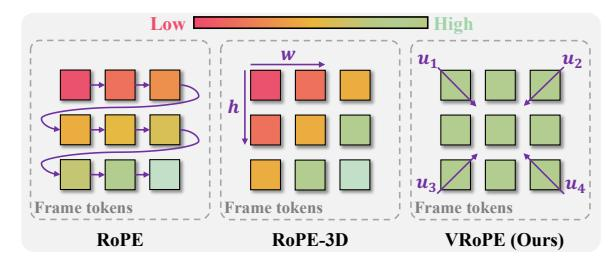
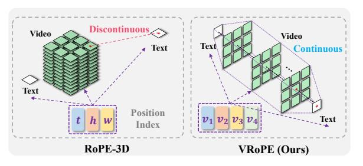
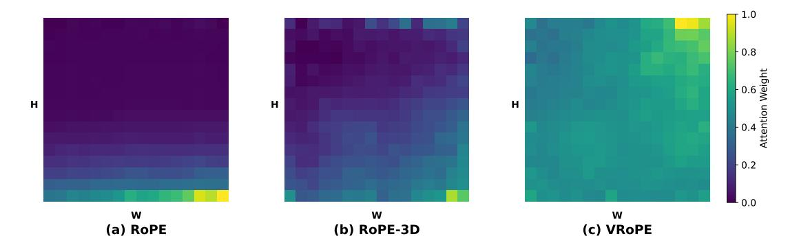
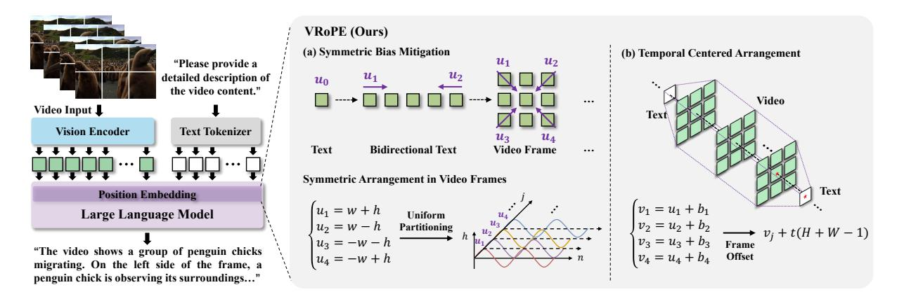
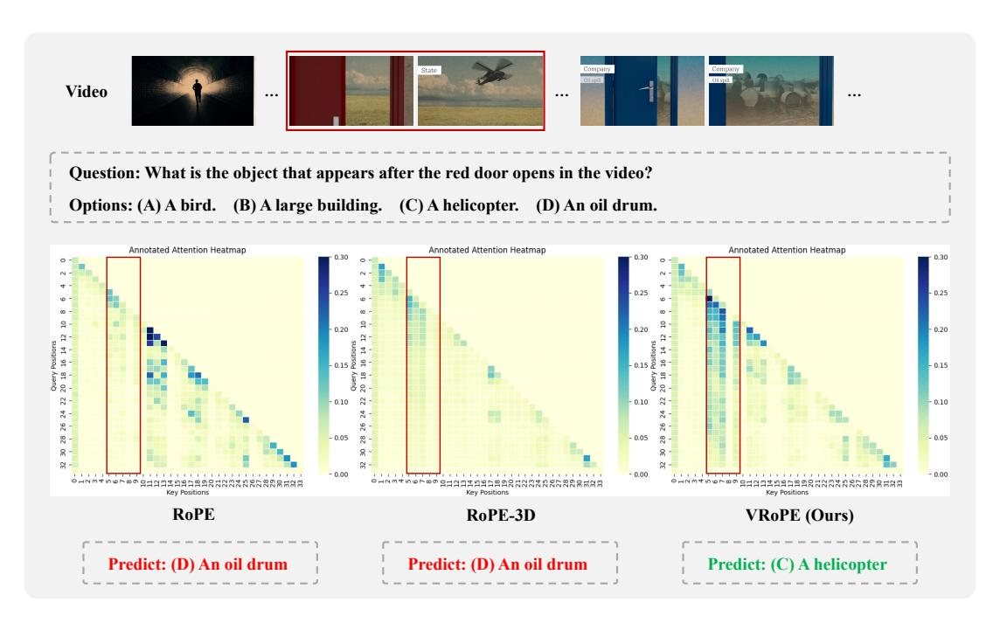

# **VRoPE: Rotary Position Embedding for Video Large Language Models**

Zikang Liu1,2\*, Longteng Guo1\*, Yepeng Tang3\*, Tongtian Yue1,2 Junxian Cai4, Kai Ma4, Qingbin Liu4, Xi Chen4, Jing Liu1,2†,

1Institute of Automation, Chinese Academy of Sciences, 2School of Artificial Intelligence, University of Chinese Academy of Sciences, 3School of Computer Science and Technology, Beijing Jiaotong University, 4Basic Algorithm Center, Tencent

{liuzikang2023,yuetongtian2022}@ia.ac.cn, yepengtang@bjtu.edu.cn {jasoncjxcai,kylekma,qingbinliu,jasonxchen}@tencent.com {longteng.guo,jliu}@nlpr.ia.ac.cn

#### **Abstract**

Rotary Position Embedding (RoPE) has shown strong performance in text-based Large Language Models (LLMs), but extending it to video remains a challenge due to the intricate spatiotemporal structure of video frames. Existing adaptations, such as RoPE-3D, attempt to encode spatial and temporal dimensions separately but suffer from two major limitations: positional bias in attention distribution and disruptions in video-text transitions. To overcome these issues, we propose Video Rotary Position Embedding (VRoPE), a novel positional encoding method tailored for Video-LLMs. Specifically, we introduce a more balanced encoding strategy that mitigates attention biases, ensuring a more uniform distribution of spatial focus. Additionally, our approach restructures positional indices to ensure a smooth transition between video and text tokens. Extensive experiments on different models demonstrate that VRoPE consistently outperforms previous RoPE variants, achieving significant improvements in video understanding, temporal reasoning, and retrieval tasks. Code is available at https://github.com/johncaged/VRoPE.

#### 1 Introduction

In recent years, Large Language Models (LLMs) have achieved remarkable progress (Touvron et al., 2023; Bai et al., 2023). Building on the success of LLMs, Video Large Language Models (Video-LLMs) (Maaz et al., 2023; Li et al., 2024d; Jin et al., 2024) have emerged as a powerful paradigm for video-language understanding. These models typically integrate LLMs with pre-trained vision encoders, enabling the joint modeling of video and textual information. However, a fundamental challenge in Video-LLMs lies in effectively modeling positional relationships within video sequences.

(a) Positional Unbiasedness

(b) Seamless Video-Text Transition

Figure 1: Comparison of RoPE, RoPE-3D, and our VRoPE in video positional encoding. (a) Positional Unbiasedness: RoPE and RoPE-3D exhibit spatial biased attention, particularly towards later tokens or specific frame regions, while VRoPE ensures more uniform attention. (b) Seamless Video-Text Transition: RoPE-3D causes a discontinuity when transitioning from video to text tokens, which VRoPE smooths for better crossmodal dependency modeling.

In LLMs, positional encoding plays a crucial role in enabling models to capture order-dependent patterns, as self-attention mechanisms themselves are inherently permutation-invariant. Among various positional encoding schemes, Rotary Position Embedding (RoPE) (Su et al., 2024) has gained widespread adoption due to its ability to encode relative position relationships. RoPE enables efficient long-range dependencies, making it highly effective in text-based models. However, when applied directly to video data, vanilla RoPE—where video tokens are treated as a simple sequence akin to text—fails to account for the complex spatiotemporal structure inherent in video frames, leading

\*Equal contribution.

†Corresponding author.

to suboptimal representations. Despite its critical role, an effective video-specific positional encoding strategy remains an open challenge.

To optimally encode positional relationships in Video-LLMs, we identify three key properties that an ideal video positional encoding should satisfy:

- (1) Spatiotemporal Structure Modeling. Unlike text, where positional relationships are strictly one-dimensional, video frames exhibit both spatial (width, height) and temporal (frame index) dimensions. An effective encoding must reflect this inherent structure to facilitate accurate modeling of spatiotemporal dependencies. Recent approaches (Wang et al., 2024; Bai et al., 2025), referred to as RoPE-3D, extend RoPE for video structure by splitting the feature channels into three parts to separately encode frame, width, and height positions.
- (2) Positional Unbiasedness. A critical yet often overlooked aspect of positional encoding is its impact on attention distribution. As illustrated in Figure 1 (a), RoPE, by design, applies a long-term decay over increasing positional indices, inadvertently introducing a bias that amplifies attention toward later tokens. This issue persists in RoPE-3D, where spatial positions within video frames are unevenly weighted, causing attention to be disproportionately focused on certain areas—typically the bottom-right regions of frames—while suppressing others, which is shown in Figure 1 (a). Such biases distort spatial contextual modeling, leading to suboptimal video comprehension. An effective video positional encoding should mitigate these biases to ensure uniform attention across the entire frame.
- (3) Seamless Video-Text Transition. For effective multimodal understanding, an ideal positional encoding should ensure a seamless transition between video and text tokens. However, as demonstrated in Figure 1 (b), RoPE-3D introduces a discontinuity when transitioning from video to text tokens, as the positional indices of text tokens are arbitrarily offset by the maximum position index of the video sequence (determined by the largest of frame count, width, and height, which often vary significantly). This artificial "jump" in the positional encoding space disrupts the smooth flow of information between modalities, hindering the model to establish meaningful cross-modal dependencies.

Based on the above principles, we propose Video Rotary Position Embedding (VRoPE), a novel positional encoding method specifically designed for Video-LLMs. Our approach consists of two key components to satisfy those principles. (1) Symmetric Bias Mitigation: To counteract the attention bias present in RoPE-based encodings, we design a symmetric positional representation that encodes each spatial coordinate from vertices to the center. By distributing attention more uniformly across spatial locations, this method prevents positional distortions and improves overall video understanding. (2) Temporal Centered Arrangement: We propose a center-aligned design that spatially aligns the geometric centers of video frames with the textual arrangement axis, and arranges video frames in temporally ordered progression along the textual positional axis. This transformation not only maintains spatial coherence within video frames but also ensures a smooth transition between video and text tokens, mitigating discontinuities in the positional encoding space.

Overall, VRoPE effectively enhances Video-LLMs by preserving spatiotemporal structure, mitigating attention bias, and ensuring smooth video-text transitions. We conduct extensive experiments on different models and training datasets. Our results demonstrate significant performance improvements over RoPE and RoPE-3D on multiple video benchmarks, covering general video understanding, temporal reasoning, long video comprehension, and video retrieval. These findings establish VRoPE as a robust and efficient positional encoding method tailored for Video-LLMs. We hope this work inspires further research on Video-LLM positional encoding and provides valuable insights for future Video-LLM designs.

# 2 Related Work

#### 2.1 Video Large Language Models

Recent advancements in Video-LLMs (Maaz et al., 2023; Li et al., 2023, 2024b; Jin et al., 2024; Li et al., 2024d; Xu et al., 2024) have significantly enhanced video processing by integrating multiple modalities and employing instruction fine-tuning. Notable innovations include Video-ChatGPT (Maaz et al., 2023), which introduced video instruction tuning for text generation, and VideoChat (Li et al., 2023) and VideoChat2 (Li et al., 2024b), which improved modality alignment via cross-attention and multi-stage bootstrapping etc. Other models, such as Chat-UniVi (Jin et al., 2024) and LLaMA-VID (Li et al., 2024d), focus on efficient video representations through techniques like token compression and dual-token methods

that separate context and content. Additionally, PLLaVA (Xu et al., 2024) explores the use of image-pretrained LLaVA models for video tasks, utilizing simple spatial pooling techniques.

#### 2.2 Multimodal Position Embedding

Most Video-LLMs inherit the default design from LLMs by using Rotary Position Embedding (RoPE) (Su et al., 2024) for positional encoding. RoPE encodes relative distance information as absolute position embeddings, offering key advantages like no additional training parameters and improved performance in various tasks (Su et al., 2024). It is widely used in modern LLMs due to its ability to extrapolate context length, extending a model's window size without the need for expensive retraining. However, RoPE's 1D design, effective for text, overlooks the spatiotemporal structure of video data, limiting its suitability for Video-LLMs. To address this, several approaches have adapted RoPE for video. For instance, RoPE-2D (Agrawal et al., 2024; Wang et al., 2024) extends the encoding to capture spatial relationships in video frames, while RoPE-3D (Wang et al., 2024; Bai et al., 2025) divides the channel dimension into three groups to better represent the spatiotemporal dimensions.

However, these approaches still face issues like Positional Attention Bias and Cross-Modal Positional Discontinuity, which are discussed in Section 3. Our VRoPE method addresses these limitations, offering more accurate and robust positional encoding tailored for Video-LLMs.

#### 3 Motivation

#### 3.1 Preliminary: Rotary Position Embedding

Rotary Positional Embedding (RoPE) is a widely adopted method in LLMs that encodes absolute positional information while preserving relative positional relationships. This property makes RoPE particularly effective for self-attention mechanisms, as it allows models to capture the relative distance between tokens in a computationally efficient manner. Given a token embedding  $\mathbf{x}$  at position index m, RoPE applies a complex-valued rotation operation, formulated as:

$$RoPE(\mathbf{x}, m) = \mathbf{x}e^{im\boldsymbol{\theta}}$$
 (1)

where i is the imaginary unit, and the frequency encoding vector  $\theta$  is defined as:

$$\theta_j = \text{base}^{\frac{-2j}{d}} \tag{2}$$

where base is a hyperparameter, d is the feature dimension, and j = [0, 1, ..., d/2 - 1] denotes the index of each feature channel.

In the self-attention mechanism, RoPE transforms absolute position embeddings into relative ones. The attention score between m-th query  $\mathbf{q}_m$  and n-th key  $\mathbf{k}_n$  is

$$\mathbf{A}_{(m,n)} = \Re\left[\mathbf{q}_m \cdot \mathbf{k}_n^* e^{\mathrm{i}(m-n)\boldsymbol{\theta}}\right]$$
 (3)

where  $\Re[\cdot]$  denotes the real part, and \* represents the complex conjugate.

While RoPE excels in sequential text modeling, its direct application to video-text interleaved sequences poses challenges due to the complex spatiotemporal relationships inherent in video frames.

#### 3.2 RoPE for Video-LLMs

In Video-LLMs, video frames are typically processed by vision encoders (e.g., ViTs (Alexey, 2020) or CNNs (He et al., 2016)) and transformed into a sequence of visual tokens. These visual tokens are then concatenated with text tokens and fed into an LLM backbone.

In most existing approaches, video tokens are treated as a simple 1D sequence, with position indices assigned in an increasing order, similar to text. However, this naive approach, referred to as RoPE, overlooks the inherent spatiotemporal structure of video data. Flattening video frames this way disrupts spatiotemporal structure and leads to inefficient position usage. Unlike text, video tokens carry less dense semantic information, and their excessive sequence length can weaken contextual dependencies, making long-range understanding harder.

#### 3.3 RoPE-3D for Video-LLMs

Recent approaches, such as M-RoPE in Qwen2-VL(Wang et al., 2024), have proposed RoPE-3D as an extension of RoPE for video structure preserving. RoPE-3D intuitively partitions the feature dimensions to separately encode spatial (width, height) and temporal (frame index) positions. Given a video token with coordinates (w, h, t), RoPE-3D computes:

$$\operatorname{RoPE-3D}_{j}(\mathbf{x}, w, h, t) = \begin{cases} \operatorname{RoPE}_{j}(\mathbf{x}, w), j \in D_{w} \\ \operatorname{RoPE}_{j}(\mathbf{x}, h), j \in D_{h} \\ \operatorname{RoPE}_{j}(\mathbf{x}, t), j \in D_{t} \end{cases} \tag{4}$$

where where  $D_w$ ,  $D_h$ ,  $D_t$  denote feature partitions assigned to width, height, and temporal axes, respectively. For text tokens, the encoding remains

Figure 2: Attention weight visualization of RoPE, RoPE-3D, and VRoPE. We compute average text-to-video frame attention weights on VideoMME (Fu et al., 2024) benchmark (lighter color indicates higher attention). (a) RoPE exhibits row-wise attention decay within frames. (b) RoPE-3D shows a similar decay from the bottom-right to the top-left, introducing positional bias that skews attention toward spatially closer frame tokens. (c) VRoPE mitigates this bias, leading to a more balanced attention distribution.

Table 1: Average attention weights at the video-text boundary on Video-MME. We use the subsequent text instruction as the query and video/text tokens as keys. Note that text-to-video attention weights of RoPE-3D are an order of magnitude lower than other methods, indicating its positional discontinuity between video and text.

| Method       | Text-to-Text | Text-to-Video |
|--------------|--------------|---------------|
| RoPE         | 1.41e-2      | 2.08e-4       |
| RoPE-3D      | 1.27e-2      | 5.12e-5       |
| VRoPE (Ours) | 1.32e-2      | 3.70e-4       |

consistent with the original RoPE by setting w = h = t = m, ensuring that:

$$RoPE-3D_{i}(\mathbf{x}, m, m, m) \equiv RoPE_{i}(\mathbf{x}, m)$$
 (5)

This design explicitly models spatial and temporal positions while preserving text token behavior. However, RoPE-3D still exhibits two key limitations, which we elaborate on below.

#### 3.4 Problem Analysis

While RoPE-3D introduces a promising design by partitioning the feature dimensions to encode spatial (width, height) and temporal (frame index) positions separately, two critical issues persist when handling video–text data.

(1) Positional Attention Bias. As is demonstrated in Figure 2 (a), RoPE naturally applies a long-term decay over increasing positional indices, which amplify attention toward later positions. Unfortunately, we find that this issue persists in RoPE-3D, where the decay leads to an uneven distribution of focus across spatial positions in video frames.

As is shown in Figure 2 (b), notably, tokens in the bottom-right of each frame receive disproportionately higher attention, while those in the top-left are increasingly suppressed. This imbalance can distort spatial contextual modeling by weakening dependencies on earlier tokens, which in turn affects the model's understanding of the video.

(2) Cross-Modal Positional Discontinuity. RoPE-3D introduces separate positional encodings for spatial (width, height) and temporal (frame index) dimensions. However, when video tokens are concatenated with subsequent text tokens, their positional indices do not follow a smooth transition. Instead, text tokens inherit positional indices that are arbitrarily offset by the maximum position value across spatial (W, H) and temporal dimensions T, i.e., max(W, H, T). This results in an artificial "jump" in the positional encoding space when transitioning from video to text tokens. The discontinuity creates an abrupt and non-uniform gap between the final video token and the subsequent text token. As is shown in Table 1, text-to-video attention weights of RoPE-3D at the video-text boundary are an order of magnitude lower than RoPE and VRoPE, which demonstrates that the discontinuity in position embedding will affect the attention weights. Further, the magnitude of this gap depends on video dimensions rather than being a fixed offset, making it inconsistent across different video-text samples. discrepancy can degrade the model's ability to establish seamless contextual dependencies across modalities. This issue is particularly problematic in long videos, as the increasing frame count Texacerbates the positional gap, which will be

Figure 3: **Left**: the overall architecture of a typical Video-LLM. In this work, our improvements primarily target the positional embedding component of the LLM to enhance its video understanding capability. **Right**: method illustration of VRoPE. (a) We first apply symmetric arrangement to mitigate positional bias in video frames. The RoPE frequencies are uniformly allocated to the four dimensions. (b) We propose to use temporal centered arrangement in video frames to form a seamless video-text transition, which enables video input of arbitrary length without causing discontinuity.

further discussed in Section 5.3.

#### 4 Method: VRoPE

In this section, we introduce Video Rotary Position Embedding (VRoPE), a novel positional encoding method tailored for Video-LLMs. Our approach addresses the inherent limitations of RoPE-3D, including positional attention bias and cross-modal positional discontinuity, by leveraging a combination of Symmetric Bias Mitigation and Temporal Centered Arrangement. The overall framework of VRoPE is illustrated in Figure 3.

#### 4.1 Symmetric Bias Mitigation

As discussed in Section 3.4, both RoPE and RoPE-3D employ a single positional arrangement direction when encoding features within video frames (e.g., row-major scanning for RoPE and top-left to bottom-right ordering for RoPE-3D), inevitably introducing positional attention bias. To address this limitation, we propose Symmetric Bias Mitigation as illustrated in Figure 3 (a).

Specifically, we design a unified symmetric positional arrangement paradigm applicable to arbitrary dimensions. For textual tokens represented as points, their inherent symmetry is preserved. For one-dimensional sequences, we adopt bidirectional positional indexing starting from both endpoints (similar to bidirectional modeling in language models). For two-dimensional planes (i.e., video frames), we implement a four-directional symmetric arrangement extending from frame vertices toward the center. This scheme naturally ex-

tends to three-dimensional space with eight-vertex symmetry, etc. Given an input video frame of size (W, H), we compute four symmetric directional positional arrangements as follows:

$$\begin{pmatrix} u_1 \\ u_2 \\ u_3 \\ u_4 \end{pmatrix} = \begin{pmatrix} w+h \\ w-h \\ -w-h \\ -w+h \end{pmatrix}. \tag{6}$$

Considering that RoPE employs different frequencies across channels, we strategically allocate frequencies to these four symmetric positional indices in a uniform manner. This design enables distinct positional arrangement directions to model features through different RoPE frequencies (high, medium and low).

# 4.2 Temporal Centered Arrangement

While Symmetric Bias Mitigation effectively alleviates positional bias, the inherent discontinuity between video and textual modalities persists. To address this challenge, we propose the Temporal Centered Arrangement for positioning video frames. Given that textual positions inherently satisfy  $u_1 = u_2 = u_3 = u_4$  (demonstrating isotropic symmetry), we first align the geometric center of each video frame with the textual arrangement axis through coordinate transformation. Specifically, for a video of size (W, H, T) with an initial position index  $p_{start}$  (i.e., the last position id + 1 of the previous text), this process can be denoted as:

$$\begin{pmatrix} v_1 \\ v_2 \\ v_3 \\ v_4 \end{pmatrix} = \begin{pmatrix} u_1 \\ u_2 + H - 1 \\ u_3 + H + W - 2 \\ u_4 + W - 1 \end{pmatrix} + p_{start}. \quad (7)$$

Subsequently, we systematically arrange frame positions along the temporal dimension using the following formulation:

$$v_j^t = v_j + t(H + W - 1),$$
 (8)

where t is the frame index. This configuration ensures that: (1) The central position of each video frame coincides with the textual arrangement axis, and (2) Sequential frames naturally extend along the textual positional progression direction through temporal ordering. Consequently, the temporal expansion axis of video sequences becomes intrinsically aligned with the positional growth direction of text tokens, which means that arbitrary length of video input does not affect the continuity between video and text.

Finally, our VRoPE computes the positional encoding as:

$$\begin{aligned} \text{VRoPE}_{j}(\mathbf{x}, v_{1}^{t}, v_{2}^{t}, v_{3}^{t}, v_{4}^{t}) \\ &= \begin{cases} \text{RoPE}_{j}(\mathbf{x}, v_{1}^{t})_{j=4k} \\ \text{RoPE}_{j}(\mathbf{x}, v_{2}^{t})_{j=4k+1} \\ \text{RoPE}_{j}(\mathbf{x}, v_{3}^{t})_{j=4k+2} \\ \text{RoPE}_{j}(\mathbf{x}, v_{4}^{t})_{j=4k+3} \end{cases} \end{aligned} \tag{9}$$

where  $k \in \{0, 1, 2, ...\}$ . For text tokens, we retain the original RoPE encoding structure (Eq. 5) to ensure compatibility with LLMs. Further discussions can be found in Appendix A.

# 5 Experiments

# 5.1 Experimental Setup

Implementation Details. We apply our proposed VRoPE to Video-LLM architectures with three widely used LLM backbones: Vicuna-7B, Qwen2-1.5B, and Qwen2-7B, the resulting models are denoted as Video-Vicuna-7B, Video-Qwen2-1.5B, and Video-Qwen2-7B. For the vision encoder, we leverage Eva-CLIP (Sun et al., 2023), and connect the Vision Encoder to the LLM using a Multi-Layer Perceptron (MLP) (Tolstikhin et al., 2021). We use a  $224 \times 224$  resolution for both image and video inputs. For video input, the number of input frames is 16 and the frames are tokenized using a  $2 \times 2$  pooling kernel with a stride of 2, i.e., each frame has

64 tokens as input. Training follows a two-stage paradigm: in the pre-training stage, only the MLP connector is trained, while in the instruction-tuning stage, both the MLP and LLM backbones are fine-tuned, with the Vision Encoder frozen throughout. During pre-training, we use a batch size of 256 and a learning rate of 1e-3, while for instruction-tuning, we reduce the batch size to 128 and set the learning rate to 2e-5. A warm-up ratio of 0.03 is used, followed by cosine learning rate decay after the linear warm-up phase. The training was conducted on 8 Nvidia A800 GPUs.

Training Data. For Vicuna-7B, we pre-train the model on the LLaVA-558K dataset (Liu et al., 2024a) with WebVid samples (Bain et al., 2021) and fine-tune it on the LLaVA-mix665K (Liu et al., 2024a) dataset augmented with VideoChatGPT data (Maaz et al., 2023). For the Qwen2 LLM series, we pre-train the models on a randomly sampled 1M caption dataset, which includes LLaVA-558K, WebVid, DenseFusion-1M (Li et al., 2024c), VALOR (Liu et al., 2024b), and CC3M (Changpinyo et al., 2021). The models are then fine-tuned on a combination of LLaVA-mix665K, VideoChatGPT, and LLaVA-Video-178K (Zhang et al., 2024).

Evaluation Benchmarks. We evaluated VRoPE across diverse video benchmarks, covering *general video understanding* (Video-MME (Fu et al., 2024)), *video temporal understanding* (MVBench (Li et al., 2024b), TempCompass (Liu et al., 2024c)), *long video understanding* (MLVU (Zhou et al., 2024), LongVideoBench (Wu et al., 2025), EgoSchema (Mangalam et al., 2024)), and *long video retrieval* (Video-NIAH (Zhao et al., 2024)) to validate its effectiveness. The evaluation is conducted using the official code provided by each benchmark.

#### 5.2 Main Results

We evaluate the performance of RoPE, RoPE-3D, and our proposed VRoPE across six video understanding benchmarks. As shown in Table 2, VRoPE consistently outperforms both RoPE and RoPE-3D, achieving the highest average scores across all tasks and backbones.

For instance, in the Video-Vicuna-7B row, VRoPE achieves an average score of 44.48, surpassing RoPE by 1.13 points. Similarly, when evaluated with Qwen2-1.5B and Qwen2-7B, VRoPE demonstrates consistent improvements across all benchmarks. Notably, it outperforms RoPE and

Table 2: Performance comparison of RoPE variants on video benchmarks across different LLM backbones. Results across tasks, including general video understanding (Video-MME), video temporal understanding (MVBench, TempCompass), and long video understanding (MLVU, LongVideoBench, EgoSchema).

| Method                                   | Video-MME (w/o subs) | MLVU @M-Avg         | MVBench                   | LongVideoBench @Val | TempCompass @Multi-Choice | EgoSchema @Test | Avg.          |
|------------------------------------------|-------------------------|------------------------|---------------------------|------------------------|------------------------------|--------------------|---------------|
| Video-Vicuna-7B                          |                         |                        |                           |                        |                              |                    |               |
| w/ RoPE                                  | 38.5                    | 47.00                  | 43.90                     | 41.66                  | 53.10                        | 35.92              | 43.35         |
| w/ RoPE-3D                               | 38.0 ( <b>\</b> 0.5)    | 46.30 ( <b>\_0.7</b> ) | 44.55 (†0.65)             | 40.16 ( <b>↓1.5</b> )  | 54.94 (†1.84)                | 39.79 (†3.87)      | 43.96 (†0.61) |
| w/ VRoPE                                 | 38.9 (†0.4)             | 47.37 (†0.37)          | 45.18 (†1.28)             | 40.69 (\psi_0.97)      | 54.05 (†0.95)                | 40.71 (†4.79)      | 44.48 (†1.13) |
| Video-Qwen2-1.5B                         |                         |                        |                           |                        |                              |                    |               |
| w/ RoPE                                  | 39.0                    | 51.15                  | 51.15                     | 46.63                  | 56.96                        | 48.50              | 48.90         |
| w/ RoPE-3D                               | 39.3 (†0.3)             | 51.19 (†0.04)          | 50.45 ( <b>↓</b> 0.70)    | 48.01 (†1.38)          | 57.97 (†1.01)                | 49.00 ( 0.50)      | 49.32 (†0.42) |
| w/ VRoPE                                 | 42.4 (†3.4)             | 51.76 (†0.61)          | 50.78 ( <b>\_0.37</b> )   | 47.79 (†1.16)          | 57.15 ( <del>\^0.19</del> )  | 49.90 (†1.40)      | 49.96 (†1.06) |
| Video-Qwen2-7B                           |                         |                        |                           |                        |                              |                    |               |
| w/ RoPE                                  | 50.1                    | 54.87                  | 54.33                     | 49.36                  | 63.73                        | 57.14              | 54.92         |
| w/ RoPE-3D                               | 49.5 ( <b>\_0.6</b> )   | 56.06 (†1.19)          | 54.23 ( <del>\</del> 0.1) | 49.55 (†0.19)          | 64.49 (†0.76)                | 58.80 (†1.66)      | 55.44 (†0.52) |
| w/ VRoPE                                 | 50.6 (†0.5)             | 57.81 (†2.94)          | 54.70 (†0.37)             | 50.48 (†1.12)          | 65.88 (†2.15)                | 58.60 (†1.46)      | 56.35 (†1.43) |
|                                          |                         |                        |                           |                        |                              |                    |               |
| (a)                                      | RoPE                    |                        | (b) RoP                   | E-3D                   | (0                           | c) VRoPE           | 4.0           |
| © 20 D                                   |                         | <b>⊗</b> 20            |                           |                        | <u>9</u> 20                  |                    | 1.0           |
| € 40                                     |                         |                        |                           |                        | E 40                         |                    | - 0.8         |
| 40 Depth                                 |                         | Depth (                |                           |                        | 40 60 60                     |                    | Accuracy      |
| 0 00 E                                   |                         | Д 60                   |                           |                        |                              |                    | - 0.6 J       |
| 90 80 80 100 100 100 100 100 100 100 100 |                         | Needle 100             |                           |                        | 80 80 100                    |                    |               |
| 2 100 <b>1</b> 00                        |                         | ≥ 100                  |                           |                        | 100                          |                    | - 0.4         |
| 256 Mg 8M                                | 832 102ª                | ,7 16 256   | 448 640 9                 | 32 1024 1216           | 756 KK 81                    | % 835 VOTA         | 12/6          |
|                                          | Video Frames            | •                      | Number of Vic             |                        |                              | of Video Frame     |               |

Figure 4: Visualization of long video retrieval results on Video-NIAH (Zhao et al., 2024). Our VRoPE consistently achieves high accuracy across varying background lengths and needle depths, showing strong retrieval capability in long videos.

RoPE-3D by significant margins on tasks such as Video-MME (a 3.4-point increase for Qwen2-1.5B) and MLVU (a 2.94-point increase for Qwen2-7B).

These results highlight the superior adaptability of VRoPE across different LLM types and parameter sizes. Importantly, VRoPE introduces no new learnable parameters and does not increase computational complexity, making it a cost-free performance enhancement for Video-LLMs. More results and visualization examples can be found in Appendix B and Appendix C.

#### 5.3 Results on Long Video Retrieval

We compare our method with RoPE (Su et al., 2024) and RoPE-3D (Wang et al., 2024) on the long video retrieval task to evaluate the model's generalization ability with longer video inputs. Following the setup in Video-NIAH (Zhao et al., 2024), we conduct Video Needle-In-A-Haystack (V-NIAH) experiments, where a target "needle" frame is inserted into a sequence of background frames, with the total frame count varying between 256 and 1216.

As shown in Figure 4, the retrieval accuracy of

RoPE drops significantly when the number of input frames exceeds 832, while VRoPE outperforms other approaches by a considerable margin. The quantitative results, presented in Table 4, further evidence this finding. Specifically, VRoPE achieves an accuracy that is 32.19 points higher than RoPE and 14.22 points higher than RoPE-3D when the number of input frames increases to 1024-1216. Notably, these results are obtained even though the input frame count in this range is dozens of times greater than the maximum number seen during training. This demonstrates the exceptional extrapolation ability of VRoPE. Moreover, RoPE-3D underperforms the RoPE baseline for inputs of 256-512, 512-768, and 768-1024 frames, which further proves that the cross-modal positional discontinuity affects the model's ability to understand videos of different lengths.

#### **5.4** Ablation Studies

Comparison of RoPE Variants. We conduct experiments to assess the impact of three key properties: Spatiotemporal Structure Modeling (S.S.M.), Positional Unbiasedness (P.U.), and Seamless

Table 3: We assess various RoPE designs to validate the necessity of the three desired properties: Spatiotemporal Structure Modeling (S.S.M), Positional Unbiasedness (P.U.), and Seamless Video-Text Transition (S.V.T.). The results indicate that the model attains optimal performance when all properties are fully incorporated.

| Method       | S.S.M.   | P.U.     | S.V.T.   | Video-MME                | EgoSchema              | LongVideoBench             | Avg.                       |
|--------------|----------|----------|----------|--------------------------|------------------------|----------------------------|----------------------------|
| RoPE         | ×        | ×        | ~        | 39.0                     | 48.50                  | 46.63                      | 44.71                      |
| RoPE-2D      | <b>✓</b> | X        | <b>✓</b> | 43.2 (†4.2)              | 47.60 ( <b>↓</b> 0.90) | 46.33 ( <del>\</del> 0.30) | 45.71 (†1.00)              |
| RoPE-3D      | <b>~</b> | X        | ×        | 39.3 ( 0.3)              | 49.00 ( 0.50)          | 48.01 (†1.38)              | 45.44 (†0.73)              |
| RoPE-Share   | ×        | ~        | ~        | 39.7 (\(\frac{1}{0.7}\)) | 48.66 (†0.16)          | 45.10 ( <b>\1.53</b> )     | 44.49 ( <del>\</del> 0.22) |
| RoPE-Compact | <b>~</b> | X        | ~        | 38.1 ( <b>↓0.9</b> )     | 50.77 (†2.27)          | 45.96 (\psi_0.67)          | 44.94 (†0.23)              |
| VRoPE        | <b>/</b> | <b>/</b> | ~        | 42.4 (†3.4)              | 49.90 (†1.40)          | 47.79 (†1.16)              | 46.70 (†1.99)              |

Table 4: Average retrieval accuracy across different input frame length intervals on Video-NIAH (Zhao et al., 2024). Compared to RoPE, the performance advantage of VRoPE becomes more pronounced at longer video lengths.

| Method  | 256-512 | 512-768 | 768-1024 | 1024-1216 |
|---------|---------|---------|----------|-----------|
| RoPE    | 94.84   | 87.03   | 73.28    | 54.84     |
| RoPE-3D | 88.90   | 80.94   | 69.69    | 72.81     |
| VRoPE   | 98.28   | 95.16   | 90.31    | 87.03     |

Video-Text Transition (S.V.T.), as discussed in Section 1. The results, summarized in Table 3, highlight the importance of these properties.

We first compare RoPE-2D (Agrawal et al., 2024) and RoPE-3D (Wang et al., 2024) with the baseline RoPE (Su et al., 2024) method. RoPE-2D encodes only the spatial coordinates (w,h) of each frame. While it resolves the cross-modal positional discontinuity, it still suffers from positional bias. Both RoPE-2D and RoPE-3D show improvements over RoPE, demonstrating the benefits of spatiotemporal structure modeling.

Next, we evaluate two additional variants, RoPE-Share and RoPE-Compact, to further ablate the impact of S.S.M. and P.U. RoPE-Share uses identical positional embeddings within each frame, arranged sequentially. While it resolves positional bias and ensures continuity, it neglects the spatial structure of the frames, leading to a performance drop compared to RoPE. RoPE-Compact is an extention of RoPE-3D that addresses positional discontinuity by encoding subsequent text tokens with  $(W+1, H+1, T+1)^T$ , but it deviates from text compatibility requirements, which slightly limits its performance. In contrast, our proposed method (VRoPE) incorporates all three properties, achieving a 1.99-point improvement over the RoPE baseline, surpassing all other variants. More detailed illustration of RoPE-Share and RoPE-Compact can

Table 5: Ablation study on VRoPE components. We evaluate the impact of Symmetric Bias Mitigation (Symmetric) and Temporal Centered Arrangement (Continuity). The model achieves the best performance when both components are applied together.

| Continuity | Symmetric | Video-MME | LongVideoBench |
|------------|-----------|-----------|----------------|
| ×          | ×         | 39.0      | 46.63          |
| <b>✓</b>   | ×         | 42.3      | 46.30          |
| ×          | ~         | 41.3      | 47.27          |
| ~          | ~         | 42.4      | 47.79          |

be found in Appendix D.

Ablation on VRoPE Components. We conduct ablation experiments to evaluate the individual contributions of the Symmetric Bias Mitigation and Temporal Centered Arrangement components. The results, presented in Table 5, reveal that when applied separately, each method produces mixed effects. Specifically, Temporal Centered Arrangement improves performance on Video-MME, indicating its effectiveness in enhancing smooth translation for general video understanding. Symmetric Bias Mitigation shows a significant gain on LongVideoBench, indicating its effectiveness in reducing bias in long video tasks. When combined in VRoPE, the two components work synergistically, resulting in more consistent performance.

## 6 Conclusion

In conclusion, we propose VRoPE, a dedicated positional encoding strategy for Video-LLMs that balances spatiotemporal structure, mitigates attention bias, and ensures a smooth transition between video and text tokens. Extensive experiments on different model scales validate its superior performance in video understanding, temporal reasoning, and retrieval tasks. We believe VRoPE can serve as a useful building block for future Video-LLMs, enabling better video-language understanding.

## 7 Acknowledgments

This research is supported by Artificial Intelligence-National Science and Technology Major Project (2023ZD0121200) and the National Natural Science Foundation of China (6243000159, 62102416), and the Key Research and Development Program of Jiangsu Province under Grant BE2023016-3, and CCF-Tencent Rhino-Bird Open Research Fund.

#### 8 Limitations

While VRoPE demonstrates strong performance, there are some limitations. Due to computational resource constraints, our experiments were limited to models with 1.5B, 7B and 8B (shown in Appendix B) parameters. Larger-scale models could potentially yield further performance gains. Additionally, although VRoPE is adaptable across different dimensions, its extension to other modalities (e.g., audio, 3D point clouds, Electroencephalography (EEG)) and higher-dimensional data (e.g., 4D spatiotemporal or medical imaging data) remains an area for future research and validation.

## References

- Pravesh Agrawal, Szymon Antoniak, Emma Bou Hanna, Baptiste Bout, Devendra Chaplot, Jessica Chudnovsky, Diogo Costa, Baudouin De Monicault, Saurabh Garg, Theophile Gervet, and 1 others. 2024. Pixtral 12b. *arXiv preprint arXiv:2410.07073*.
- Dosovitskiy Alexey. 2020. An image is worth 16x16 words: Transformers for image recognition at scale. *arXiv preprint arXiv: 2010.11929*.
- Jinze Bai, Shuai Bai, Yunfei Chu, Zeyu Cui, Kai Dang, Xiaodong Deng, Yang Fan, Wenbin Ge, Yu Han, Fei Huang, and 1 others. 2023. Qwen technical report. *arXiv preprint arXiv:2309.16609*.
- Shuai Bai, Keqin Chen, Xuejing Liu, Jialin Wang, Wenbin Ge, Sibo Song, Kai Dang, Peng Wang, Shijie Wang, Jun Tang, and 1 others. 2025. Qwen2. 5-vl technical report. *arXiv preprint arXiv:2502.13923*.
- Max Bain, Arsha Nagrani, Gül Varol, and Andrew Zisserman. 2021. Frozen in time: A joint video and image encoder for end-to-end retrieval. In *Proceedings of the IEEE/CVF international conference on computer vision*, pages 1728–1738.
- Soravit Changpinyo, Piyush Sharma, Nan Ding, and Radu Soricut. 2021. Conceptual 12m: Pushing webscale image-text pre-training to recognize long-tail visual concepts. In *Proceedings of the IEEE/CVF conference on computer vision and pattern recognition*, pages 3558–3568.

- Yifan Du, Kun Zhou, Yuqi Huo, Yifan Li, Wayne Xin Zhao, Haoyu Lu, Zijia Zhao, Bingning Wang, Weipeng Chen, and Ji-Rong Wen. 2024. Towards event-oriented long video understanding. *arXiv* preprint arXiv:2406.14129.
- Chaoyou Fu, Yuhan Dai, Yongdong Luo, Lei Li, Shuhuai Ren, Renrui Zhang, Zihan Wang, Chenyu Zhou, Yunhang Shen, Mengdan Zhang, and 1 others. 2024. Video-mme: The first-ever comprehensive evaluation benchmark of multi-modal llms in video analysis. *arXiv preprint arXiv:2405.21075*.
- Kaiming He, Xiangyu Zhang, Shaoqing Ren, and Jian Sun. 2016. Deep residual learning for image recognition. In *Proceedings of the IEEE conference on computer vision and pattern recognition*, pages 770–778.
- Peng Jin, Ryuichi Takanobu, Wancai Zhang, Xiaochun Cao, and Li Yuan. 2024. Chat-univi: Unified visual representation empowers large language models with image and video understanding. In *Proceedings of the IEEE/CVF Conference on Computer Vision and Pattern Recognition*, pages 13700–13710.
- Bo Li, Yuanhan Zhang, Dong Guo, Renrui Zhang, Feng Li, Hao Zhang, Kaichen Zhang, Peiyuan Zhang, Yanwei Li, Ziwei Liu, and 1 others. 2024a. Llava-onevision: Easy visual task transfer. *arXiv preprint arXiv:2408.03326*.
- KunChang Li, Yinan He, Yi Wang, Yizhuo Li, Wenhai Wang, Ping Luo, Yali Wang, Limin Wang, and Yu Qiao. 2023. Videochat: Chat-centric video understanding. *arXiv preprint arXiv:2305.06355*.
- Kunchang Li, Yali Wang, Yinan He, Yizhuo Li, Yi Wang, Yi Liu, Zun Wang, Jilan Xu, Guo Chen, Ping Luo, and 1 others. 2024b. Mybench: A comprehensive multi-modal video understanding benchmark. In *Proceedings of the IEEE/CVF Conference on Computer Vision and Pattern Recognition*, pages 22195–22206.
- Xiaotong Li, Fan Zhang, Haiwen Diao, Yueze Wang, Xinlong Wang, and Ling-Yu Duan. 2024c. Densefusion-1m: Merging vision experts for comprehensive multimodal perception. *arXiv preprint arXiv:2407.08303*.
- Yanwei Li, Chengyao Wang, and Jiaya Jia. 2024d. Llama-vid: An image is worth 2 tokens in large language models. In *European Conference on Computer Vision*, pages 323–340. Springer.
- Haotian Liu, Chunyuan Li, Qingyang Wu, and Yong Jae Lee. 2024a. Visual instruction tuning. *Advances in neural information processing systems*, 36.
- Jing Liu, Sihan Chen, Xingjian He, Longteng Guo, Xinxin Zhu, Weining Wang, and Jinhui Tang. 2024b. Valor: Vision-audio-language omni-perception pretraining model and dataset. *IEEE Transactions on Pattern Analysis and Machine Intelligence*.

- Yuanxin Liu, Shicheng Li, Yi Liu, Yuxiang Wang, Shuhuai Ren, Lei Li, Sishuo Chen, Xu Sun, and Lu Hou. 2024c. Tempcompass: Do video llms really understand videos? *arXiv preprint arXiv:2403.00476*.
- Muhammad Maaz, Hanoona Rasheed, Salman Khan, and Fahad Shahbaz Khan. 2023. Video-chatgpt: Towards detailed video understanding via large vision and language models. *arXiv preprint arXiv:2306.05424*.
- Karttikeya Mangalam, Raiymbek Akshulakov, and Jitendra Malik. 2024. Egoschema: A diagnostic benchmark for very long-form video language understanding. *Advances in Neural Information Processing Systems*, 36.
- Kepan Nan, Rui Xie, Penghao Zhou, Tiehan Fan, Zhenheng Yang, Zhijie Chen, Xiang Li, Jian Yang, and Ying Tai. 2024. Openvid-1m: A large-scale high-quality dataset for text-to-video generation. *arXiv* preprint arXiv:2407.02371.
- Jianlin Su, Murtadha Ahmed, Yu Lu, Shengfeng Pan, Wen Bo, and Yunfeng Liu. 2024. Roformer: Enhanced transformer with rotary position embedding. *Neurocomputing*, 568:127063.
- Quan Sun, Yuxin Fang, Ledell Wu, Xinlong Wang, and Yue Cao. 2023. Eva-clip: Improved training techniques for clip at scale. *arXiv preprint arXiv:2303.15389*.
- Ilya O Tolstikhin, Neil Houlsby, Alexander Kolesnikov, Lucas Beyer, Xiaohua Zhai, Thomas Unterthiner, Jessica Yung, Andreas Steiner, Daniel Keysers, Jakob Uszkoreit, and 1 others. 2021. Mlp-mixer: An all-mlp architecture for vision. *Advances in neural information processing systems*, 34:24261–24272.
- Hugo Touvron, Thibaut Lavril, Gautier Izacard, Xavier Martinet, Marie-Anne Lachaux, Timothée Lacroix, Baptiste Rozière, Naman Goyal, Eric Hambro, Faisal Azhar, and 1 others. 2023. Llama: Open and efficient foundation language models. *arXiv preprint arXiv:2302.13971*.
- Michael Tschannen, Alexey Gritsenko, Xiao Wang, Muhammad Ferjad Naeem, Ibrahim Alabdulmohsin, Nikhil Parthasarathy, Talfan Evans, Lucas Beyer, Ye Xia, Basil Mustafa, and 1 others. 2025. Siglip 2: Multilingual vision-language encoders with improved semantic understanding, localization, and dense features. *arXiv preprint arXiv:2502.14786*.
- Peng Wang, Shuai Bai, Sinan Tan, Shijie Wang, Zhihao Fan, Jinze Bai, Keqin Chen, Xuejing Liu, Jialin Wang, Wenbin Ge, and 1 others. 2024. Qwen2-vl: Enhancing vision-language model's perception of the world at any resolution. *arXiv preprint arXiv:2409.12191*.
- Haoning Wu, Dongxu Li, Bei Chen, and Junnan Li. 2025. Longvideobench: A benchmark for long-context interleaved video-language understanding.

- Advances in Neural Information Processing Systems, 37:28828–28857.
- Lin Xu, Yilin Zhao, Daquan Zhou, Zhijie Lin, See Kiong Ng, and Jiashi Feng. 2024. Pllava: Parameter-free llava extension from images to videos for video dense captioning. *arXiv preprint arXiv:2404.16994*.
- An Yang, Anfeng Li, Baosong Yang, Beichen Zhang, Binyuan Hui, Bo Zheng, Bowen Yu, Chang Gao, Chengen Huang, Chenxu Lv, and 1 others. 2025. Qwen3 technical report. *arXiv preprint arXiv:2505.09388*.
- Yuanhan Zhang, Jinming Wu, Wei Li, Bo Li, Zejun Ma, Ziwei Liu, and Chunyuan Li. 2024. Video instruction tuning with synthetic data. *arXiv preprint arXiv:2410.02713*.
- Zijia Zhao, Haoyu Lu, Yuqi Huo, Yifan Du, Tongtian Yue, Longteng Guo, Bingning Wang, Weipeng Chen, and Jing Liu. 2024. Needle in a video haystack: A scalable synthetic framework for benchmarking video mllms. *arXiv preprint arXiv:2406.09367*.
- Junjie Zhou, Yan Shu, Bo Zhao, Boya Wu, Shitao Xiao, Xi Yang, Yongping Xiong, Bo Zhang, Tiejun Huang, and Zheng Liu. 2024. Mlvu: A comprehensive benchmark for multi-task long video understanding. arXiv preprint arXiv:2406.04264.

Table 6: Performance comparison of RoPE variants on event-based EventBench (Du et al., 2024).

| Method           | EventBench                 |
|------------------|----------------------------|
| Video-Vicuna-7B  |                            |
| w/ RoPE          | 38.97                      |
| w/RoPE-3D        | 39.33 (†0.36)              |
| w/ VRoPE         | 40.38 (†1.41)              |
| Video-Qwen2-1.5B |                            |
| w/ RoPE          | 53.31                      |
| w/RoPE-3D        | 52.76 (\psi_0.55)          |
| w/ VRoPE         | 54.23 (†0.92)              |
| Video-Qwen2-7B   |                            |
| w/ RoPE          | 59.25                      |
| w/ RoPE-3D       | 58.61 ( <del>\</del> 0.64) |
| w/ VRoPE         | 60.35 (†1.1)               |
|                  |                            |

#### **A** Discussion

**Dimensional Adaptability.** A key advantage of VRoPE is its ability to degenerate into lowerdimensional embeddings without altering its fundamental structure. Unlike methods that assign separate feature channels for each coordinate, VRoPE employs linear combinations of the original coordinates, allowing any dimension set to 1 to seamlessly adapt into lower-dimension form. For instance, when H=1, the encoded positions simplify to (w, w, -w, -w), effectively reducing to a 1D form—unlike previous methods that rely on separate encodings, such as (w, 0). This property is particularly beneficial for adapting pre-trained model's positional encodings from images (2D) or videos (3D) to data of varying dimensions without disrupting the original encoding scheme. Consequently, models can transfer more effectively across modalities while preserving consistent positional behavior.

## B More Results

#### **B.1** Results on EventBench

The benchmark evaluated in Section 5.2 already encompasses comprehensive capabilities required for video understanding tasks. To further validate temporal reasoning performance, we conduct additional evaluations focusing on event-based tasks involving complex temporal dependencies. As shown in Table 6, our VRoPE demonstrates consistent improvements across all models compared to existing methods. These results confirm that our

Table 7: Detailed performance comparison of RoPE variants on Video-MME (Fu et al., 2024).

| Method           | Short                    | Medium                   | Long                 |
|------------------|--------------------------|--------------------------|----------------------|
| Video-Vicuna-7B  |                          |                          |                      |
| w/ RoPE          | 46.4                     | 38.0                     | 31.0                 |
| w/ RoPE-3D       | 46.0 ( <del>\</del> 0.4) | 37.5 (\psi_0.5)          | 30.6 (\psi_0.4)      |
| w/ VRoPE         | 46.4 (-)                 | 38.3 (†0.3)              | 31.8 ( 10.8)         |
| Video-Qwen2-1.5B |                          |                          |                      |
| w/ RoPE          | 47.4                     | 37.6                     | 32.2                 |
| w/ RoPE-3D       | 47.1 ( <del>\</del> 0.3) | 37.0 ( <del>\</del> 0.6) | 33.8 (†1.6)          |
| w/ VRoPE         | 50.1 (†2.7)              | 39.3 (†1.7)              | 37.8 (†5.6)          |
| Video-Qwen2-7B   |                          |                          |                      |
| w/ RoPE          | 60.2                     | 47.6                     | 42.5                 |
| w/ RoPE-3D       | 60.0 ( <del>\</del> 0.2) | 46.7 ( <del>\</del> 0.9) | 41.7 ( <b>↓</b> 0.8) |
| w/ VRoPE         | 60.4 (†0.2)              | 47.6 (-)                 | 43.9 (†1.4)          |

Table 8: Results on Video-MME (Du et al., 2024) under lower frame rates (8 frames).

| Method           | Acc.                 |
|------------------|----------------------|
| Video-Qwen2-1.5B |                      |
| w/ RoPE          | 38.9                 |
| w/RoPE-3D        | 37.2 ( <b>\1.7</b> ) |
| w/ VRoPE         | 40.9 (†2.0)          |

approach maintains superior comprehension capabilities when processing videos containing intricate event sequences.

# **B.2** Results on Video-MME with varying lengths

In this section, we analyze the performance of RoPE, RoPE-3D, and our VRoPE across varying input video lengths on the Video-MME dataset, as summarized in Table 7. The results indicate that VRoPE demonstrates marked superiority in processing long-form videos, while also achieving moderate advantages for medium and short videos, maintaining comparable performance to baselines at minimum. This further validates the effectiveness of our approach in enhancing model comprehension capabilities across varying video durations. The consistent improvements underscore our method's robustness in understanding tasks under various video context lengths.

# **B.3** Results under Challenging Conditions

In this section, we evaluate the performance of RoPE, RoPE-3D, and VRoPE on Video-MME under low frame-rate inputs (8 frames), as reported in Table 8. Notably, VRoPE maintains enhanced performance even in these challenging

Figure 5: Attention weight visualization of RoPE, RoPE-3D, and VRoPE. The visualization reveals that VRoPE exhibits stronger attention activation within critical frames (highlighted by red boxes), demonstrating its accurate focus on pivotal spatiotemporal regions. In contrast, RoPE and RoPE-3D display attenuated attention responses in these corresponding areas, indicating insufficient awareness of key events. This attention misalignment consequently leads to erroneous predictions, as evidenced by their incorrect interpretations of the visual content.

sparse-sampling scenarios, empirically confirming the robustness of our approach. This empirical evidence highlights our method's capability to preserve spatiotemporal coherence under severe input degradation.

# **B.4** Results of Larger Models and Datasets

In this section, we validate the superiority of our approach through scaled-up model architectures and expanded training datasets. Specifically, we conduct experiments using SigLIP-2 (Tschannen et al., 2025) and Owen3-8B (Yang et al., 2025) as backbone architectures. We expand the number of input frames to 32 and the resolution is set to  $384 \times 384$ . During the pre-training stage, we utilize LLaVA-558K (Liu et al., 2024a) combined with 500K randomly sampled video-text pairs from OpenVid-1M (Nan et al., 2024). For instruction tuning, we integrate LLaVA-NeXT-790K (Li et al., 2024a), LLaVA-Video-178K (Zhang et al., 2024), and the full OpenVid-1M dataset. This configuration results in approximately 1 million samples for pre-training and 3 million samples for instruction tuning. As demonstrated in Table 9, VRoPE maintains performance advantages even under these enhanced baseline conditions (larger models, expanded datasets, and stronger baselines). These

results further substantiate the generalizability and robustness of our method across diverse architectural scales and data regimes.

#### C Visualization Analysis

In Section 3.4, we analyze the positional attention bias and cross-modal positional discontinuity inherent to RoPE and RoPE-3D. To further substantiate these observations, we provide concrete attention visualization examples in this section. As illustrated in Figure 5, for an input video sequence, our VRoPE effectively focuses on the video frames most relevant to the query (the red door and the helicopter), whereas RoPE and RoPE-3D exhibit insufficient attention to critical frames. This deficiency leads to localization errors and subsequent incorrect responses – for instance, misidentifying the opening of a black door as the opening of a red door in this example. The comparative visualization demonstrates our method's enhanced capability in spatiotemporal feature localization and event understanding.

# D Detailed Illustration of Other RoPE Variants

**RoPE-Share.** RoPE-Share is a 1D positional encoding where all spatial tokens within a video

Table 9: Performance comparison of RoPE variants on larger models and datasets. Results across tasks, including general video understanding (Video-MME), video temporal understanding (MVBench, TempCompass), and long video understanding (MLVU, LongVideoBench, EgoSchema).

| Method         | Video-MME (w/o subs) | MLVU @M-Avg        | MVBench                    | LongVideoBench @Val | TempCompass @Multi-Choice | EgoSchema @Test         | Avg.                       |
|----------------|-------------------------|-----------------------|----------------------------|------------------------|------------------------------|----------------------------|----------------------------|
| Video-Qwen3-8B |                         |                       |                            |                        |                              |                            |                            |
| w/ RoPE        | 61.00                   | 64.96                 | 59.68                      | 60.81                  | 68.67                        | 56.41                      | 61.92                      |
| w/ RoPE-3D     | 61.44 (†0.44)           | 64.50 (\(\psi_0.46\)) | 59.34 ( <del>\</del> 0.34) | 61.00 (†0.19)          | 69.11 (†0.44)                | 56.03 ( <del>\</del> 0.38) | 61.90 ( <del>\</del> 0.02) |
| w/ VRoPE       | 62.56 (†1.56)           | 65.36 (†0.40)         | 59.23 ( <b>\dot_0.45</b> ) | 61.48 (†0.67)          | 68.67 (-)                    | 57.07 (†0.66)              | 62.40 (†0.48)              |

frame share the same positional ID, i.e., the positional IDs of all frame tokens in the tth frame are n+t. Text tokens follow the original encoding:  $n+T+1, n+T+2, \ldots$  While this design eliminates spatial attention bias and ensures crossmodal continuity, it fails to model spatial positional relationships within frames, leading to suboptimal performance (as is shown in Section 5.4).

**RoPE-Compact.** RoPE-Compact is a variant of RoPE-3D. The key difference lies in handling cross-modal boundaries: (1) RoPE-3D assigns the next text token a positional ID of  $(\max(W, H, T), \max(W, H, T), \max(W, H, T))^T$ . For example, if T > W, H, the last video token is  $(W, H, T)^T$ , and the next text token becomes  $(T, T, T)^T$ , causing discontinuity in the w and h dimensions (as shown in Section 5.3). (2) To address the above issue, RoPE-Compact increments each dimension by 1, and uses it as the positional ID for the next text token:  $(W+1, H+1, T+1)^T$ . While this resolves cross-modal discontinuity, it disrupts the pre-trained RoPE's positional frequency patterns of text, degrading performance.

## **E** License Statement

The scientific artifacts used in this work are all publicly available and this work only uses them for research purposes, thus not violating any of the artifacts' licenses. The new models released in this work is also licensed for research purposes only, prohibiting any other misuse.