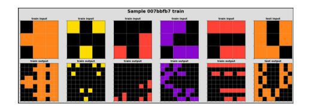
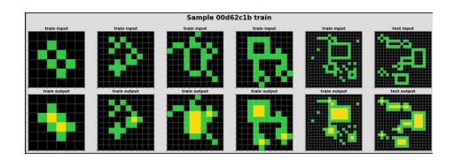
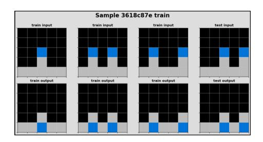

# A 2D nGPT Model For Arc Prize

# Jean-Francois Puget, NVIDIA

#### November 2024

#### Abstract

We present our solution to the ARC Prize 2024 competition on Kaggle. Not only this solution is not on par with best solutions to the competition, but due to lack of time it was not possible to successfully submit it to the competition. Yet, our solution may be of interest for three reasons: it uses a tiny (42M parameters) transformer trained from scratch, it uses an original task specific test time training, and it uses invertible transformations on logits. Our solution yields an accuracy of 17 percents on the public evaluation dataset, which is surprisingly high for a tiny model.

### 1 Introduction

This short paper describes a model developed during last 3 weeks of the 2024 ARC Prize competition hosted on Kaggle [CKL+24]. Not only this model is not competitive with best models for the competition, but due to lack of time it was not possible to successfully submit it to the competition. Yet, our solution may be of interest for three reasons:

- It a tiny 2D transformer trained from scratch for the competition,
- It uses an original task specific test time training scheme,
- It uses invertible transformations on logits.

Before describing the model and how it was trained let's recap the competition. The description from Kaggle [CKL+24] reads:

Current AI systems can not generalize to new problems outside their training data, despite extensive training on large datasets. LLMs have brought AI to the mainstream for a large selection of known tasks. However, progress towards Artificial General Intelligence (AGI) has stalled. Improvements in AGI could enable AI systems that think and invent alongside humans.

The Abstraction and Reasoning Corpus for Artificial General Intelligence (ARC-AGI) benchmark measures an AI system's ability to efficiently learn new skills. Humans easily score 85 percents in ARC,

Figure 1: An ARC task.

whereas the best AI systems only score 34 percents. The ARC Prize competition encourages researchers to explore ideas beyond LLMs, which depend heavily on large datasets and struggle with novel problems.

We took the last sentence at face value and explored the use of a non LLM transformer.

The competition is about learning how to solve graphical tasks like the one in figure 1. For each task, a number of training examples are provided. For each training sample we are given an input and a corresponding output. Inputs and outputs are colored grids of dimension up to 30x30. There are 10 colors. For each task a number of test samples are also provided, but for these ones we can only access the input part. The output of test samples is kept hidden and is used to score submissions to the competition.

The problem is to compute the output of the test samples based on the transformation that was used in the training samples. For instance, in the task of figure 1, the output is obtained by replacing each non black cell of the input by a copy of the full input.

A solution to the competition is a computer program that can, for each task:

- read the training samples,
- infer the transformation that produces the output from the input,
- read the test samples, and apply the transformation to their inputs to produce their output

During the competition we have to submit such program, in the form of a Jupyter notebook. Kaggle then runs the notebook against a hidden set of 100 tasks and reports the percentage of test task that were correctly solved.

The standard way to build a solution in Kaggle is to train or fine tune models offline, then uses these models in an inference pipeline in the submitted notebook.

ARC Prize challenge is unusual because the above does not work at all. The hidden test tasks are different from all the public tasks, and using models pretrained on public tasks isn't effective. To perform well one has to use some form of training on the hidden test set (test time training or TTT). TTT was used by the winners of a similar challenge run last year [CO23]

Figure 2: A constant size task.

About two thirds of the ARC tasks have constant size grids. In these tasks, the size of the output is always the same as the size of the input. Figure 2 shows one such task.

We decided to focus on solving constant size tasks. It remains to be seen if our method can be adapted to tasks where output size differs from input size.

We will now describe the base model, how we modified it to enable task specific training, how we trained it offline, and how we used TTT on the evaluation data.

### 2 A 2D nGPT Model for Constant Size Tasks

We use a transformer that takes as input a grid, and outputs a grid of same size. This transformer is similar to LLMs, GPT2 in particular, except it works with 2D grids rather than 1D sequences. Tokens are replaced by grid cell color indices. There are 10 colors in ARC tasks, plus an 11th color for padding grids to the same dimension when batching.

The architecture is the same as a LLM:

- an embedding layer that turns color indices into vectors,
- a number of attention + feed forward layers,
- a decoding layer producing color logits.

The difference with LLMs is in the attention layers. The attention layers are 2D attention. A grid cell attends to all cells in same row, and it attends to all cell in same column. Each of these attention is a 1D attention and is implemented using pytorch masked scaled dot product attention. Padded areas are masked. We also use rotary positional embeddings (ROPE) on each row and on each columns, reusing the ROPE implementation for 1D sequence.

We also implemented a single attention where every grid cell can attend every other grid cell, with a bias that depends on the distance between cells. We were expecting to improve over the line by line attention. It was the opposite! Maybe we did it wrong, and this is worth revisiting in the future.

There are many variants of transformers we could have started from. We used the recently published normalized transformer (nGPT) from NVIDIA [LHSG24] as it can be trained with less data than non normalized transformers. Given

the original implementation was not publicly available yet we used Phil Wang's nGPT-pytorch [Wan24].

To summarize, we took Phil Wang's nGPT implementation, and replaced the causal attention layer with two non causal, masked, attention layers, one for rows, and one for columns. We used 12 layers with an embedding size (and hidden size for all layers) of 512, resulting in a model with 42.5M trainable parameters.

Tuning the size and number of layers would certainly be useful. Larger models in particular seem possible as our code takes about 2 hours on Kaggle to run TTT on 100 tasks. This is 6 times less than the allowed compute time on Kaggle.

Our code is available at https://github.com/jfpuget/ARC-AGI-Challenge-2024 .

# 3 Task Specific Modeling

Training the model on the public train tasks would not work well for at least two reasons:

- First, there are only 262 constant size tasks, and about 1000 input/output pairs. This is too little data to train any decent size transformer.
- Second, the transformation that maps input to output is task dependent. It could be that the same input yields two different outputs in two different tasks. A single model would not be able to do that.

We discuss how we addressed the first issue in the next section.

The second issue is more tricky. We tackled it by adding a task input to the model. The model has an embedding layer that turns tasks ids into vectors that are added to all color embeddings.

A refinement that proved to be useful was to decrease the rank of tasks embeddings, forcing the model to distill task influence on a smaller manifold. We used a smaller embedding size (e.g. 8) then have a linear layer that maps task embedding to the hidden size (512) of the model. While using a small (8) task embedding size decreased the performance of the model compared to using full size (512), it yields better performance in TTT.

### 4 Invertible Transformations

We used two techniques to increase the size of the training data. First, We generated 10k input/output pairs for each training tasks by using Michael Hodel's re-arc generator [Hod24].

We trained a model using the resulting 2.6M pairs. And we used the original tasks for validation. We got about 55 percents accuracy on the original tasks.

A second way to increase tasks is to use *invertible transformations*. For each task, we could create another task by applying either a 2D symmetry (rotation, transpose) or a color symmetry (permutation). There are 8 2D symmetry, and, depending on the task up to 10 factorial relevant color permutations. Relevant color permutations are permutations which actually modify the tasks. Permuting colors that do not appear in the task is irrelevant. In practice we used between 4 and 16 color permutations per task, and either 2 2D symmetry (transpose or not) or all 8 2D symmetry.

If we use 8 2D symmetry and N color permutations, then we can train our model with 262 times 8 times N tasks, with 10k pairs per tasks. This is about 335 million samples for N=16. The model can be trained in about a day on a 8 A100 machine, using 1 epoch.

We can improve inference accuracy by combining the prediction for all tasks derived from the same original task. Indeed, if a task T2 is derived from task T1 by applying a symmetry S2 and a color permutation P2, then we can map the prediction for T2 back to the original task T1 by applying the inverse of symmetry S2 and the inverse of color permutation P2 to its prediction. We can then use a majority vote to select the most common prediction for T1.

Majority vote is nice, but we can do much better. Indeed, it is possible to map the logits of task T2 to the same space as logits of task T1 using the inverse of S2 and P2. Then we average all logits before the final argmax decoding.

Merging logits moved accuracy on original tasks to about 80 percents. While this result looks very encouraging, it is very optimistic as it requires a much larger compute time than what is available on Kaggle.

It remained to be seen if we could even get something out of TTT.

### 5 TTT

TTT is about training the model when we submit it, i.e. on the hidden test data. We can also evaluate its effectiveness using the public evaluation tasks.

The simplest way to perform TTT is to train the model from scratch on the hidden test data (or on the public evaluation data). However, this is unlikely to work as data is too small, even with symmetry and color permutation augmentation. We can't use Michael Hodel generator either as the hidden task are unknown.

For those reasons it is much better to start from the model pretrained on generated training data as in the previous section. However this model can't be used as is as it has trained embeddings for the training tasks. These embeddings would not work for new tasks.

We therefore reinitialize the task embedding layer with random weights before performing TTT. And while we reinitialize the task embedding layer we can also change it size. Our experiments on evaluation data show that a 8 wide task embedding when pretraining is best followed by a 512 wide task embedding for TTT. We experienced the classical double descent when trying TTT

Figure 3: Blue objects move down.

task embedding sizes ranging from 8 to 512, with a first optimum at 32, then a degradation of accuracy, followed by an improvement till size 512.

Invertible transformations are key for TTT as well. We used them in two ways. First, as for pretraining, we create additional tasks by applying symmetry and/or color permutations. The issue is that each task has a rather small number of pairs, which is a problem.

We switched to a second way where we merge all derived tasks. For a given original task, we add to it all pairs we could get from symmetry and color permutations. The difference with the previous method is that there is a single task embedding for an original task and all its derived tasks. This increases the number of pairs per task, which is good. But it also is detrimental when color or orientation matters.

For instance, in the task of figure 2 above, holes are filled with yellow. If we apply color permutations, then we could get pairs where holes are colored with, say, cyan. This prevents the model from learning which color has to be used for filling holes. Similarly, there are tasks where objects are moved in a specific direction. For instance in figure 3, the blue objects are moved down. Rotating the grid makes it impossible for the model to learn to move things down. In those cases the tasks are blurred by the symmetry or the color permutation.

Fortunately, when we merge derived tasks, the increase in pairs per task offsets the effect of task blurring.

Our first idea for TTT was to freeze all weights except the task embedding layer before training. Alas, it did not work at all. We hypothesize that our model is not elaborate enough to capture task independent solving patterns. Retraining the full model with new task embeddings was the way to go.

As we ran short of time we did not experiment much (TTT was working only the day before last in the competition), but we noticed that if we trained on 100 evaluation tasks at a time, then we got better results than training on 400 tasks at a time. With 100 tasks at a time we could get an accuracy of 26 percents on the constant size test pairs of the evaluation data. Following that logic it could be that performing TTT task per task would have been even better.

We could submit the TTT code only the last afternoon of the competition and it failed. This happens a lot on Kaggle. Usually we use few days to make sure the submission code is robust and doesn't fail. We did not have that luxury here because we did not work fast enough and the competition deadline hit us!

As a result we cannot report figures on the hidden test data. If we assume performance is similar to the of evaluation data, then we can estimate that at best our model would yield 26 percents of constant size test tasks, i.e. about 17 percents of all tasks. This is far less than LLM methods. At the same time it is surprisingly high for 42.5M parameter model trained from scratch.

Note that TTT validation score is quite variable. Seemingly small changes can result in a large variation in accuracy (accuracy ranged from 15 to 26 percents in our case). This is probably due to the small amount of data we deal with. Large variability is bad in general, but it can be a good thing in a challenge with a fixed hidden test set if one can submit enough time to hit the lucky region.

#### 6 Conclusion

We described how to use a tiny 42M parameters transformer to predict output grid in the ARC competition. The model is able to learn from few samples thanks to two key items: it uses a task specific embedding, and it uses symmetry augmentation in both training and inference. Using testing time training it could reach 26 percent accuracy on the constant size evaluation tasks. Unfortunately we lacked time to make our hidden test submission work. An optimistic performance estimate is of 17 on the hidden test, which is both way below LLM based methods, but surprisingly high for a 42M model trained from scratch.

Besides making it work in kaggle submissions, there is a lot we could explore from where we are. For instance, train larger models. Or study where the model works well and where it doesn't. Maybe there is a pattern that can be used to restrict the model use to where it works, to be included in a model ensemble.

# 7 Acknowledgements

We want to thank the competition hosts, Francois Chollet in particular, for designing a very rich and challenging benchmark. Our solution would not exist without Michael Hodel data generator. It would not exist either without Phil Wang (lucidrain) nGPT implementation. Special thanks to Marie Hermance, Ivan Sorokin, and Heng Cherkeng for encouragements to write this paper, and to Guillermo Barbadillo for insightful feedback on an earlier version of this paper.

#### References

[CKL+24] Francois Chollet, Mike Knoop, Bryan Landers, Greg Kamradt, Hansueli Jud, Walter Reade, and Addison Howard. Arc prize 2024. https://kaggle.com/competitions/arc-prize-2024, 2024.

- [CO23] Jack Cole and Mohamed Osman. Dataset-induced metalearning (and other tricks): Improving model efficiency on arc. https://lab42.global/community-model-efficiency/, 2023. Accessed: October 23th, 2024.
- [Hod24] Michael Hodel. Re-arc: Reverse-engineering the abstraction and reasoning corpus. https://github.com/michaelhodel/re-arc, 2024. Accessed: October 23th, 2024.
- [LHSG24] Ilya Loshchilov, Cheng-Ping Hsieh, Simeng Sun, and Boris Ginsburg. ngpt: Normalized transformer with representation learning on the hypersphere. https://arxiv.org/pdf/2410.01131, 2024.
- [Wan24] Phil Wang. ngpt-pytorch. https://github.com/lucidrains/nGPT-pytorch, 2024. Accessed: October 23th, 2024.