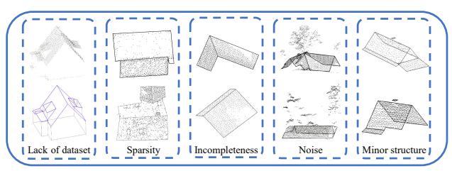
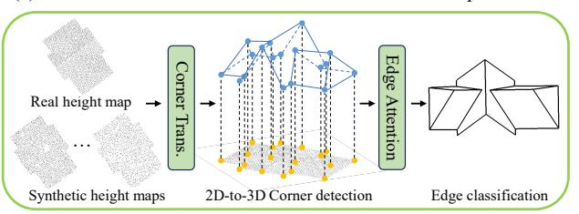
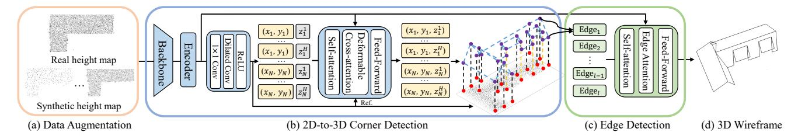
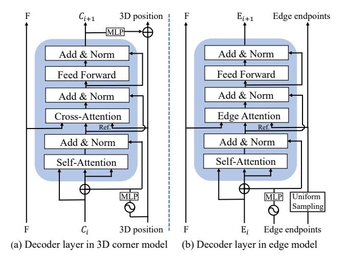
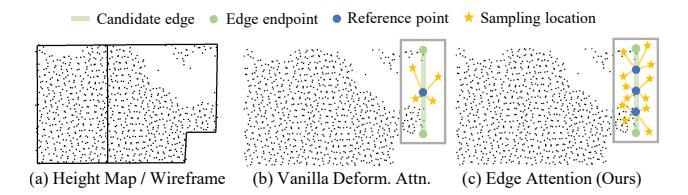
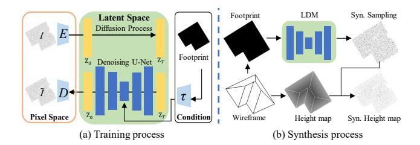
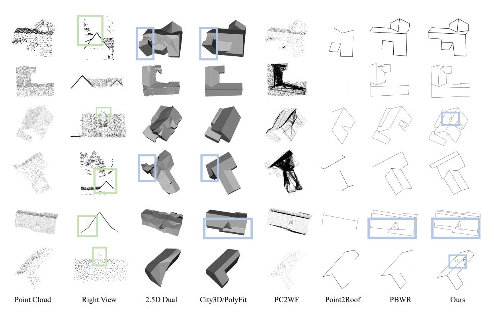
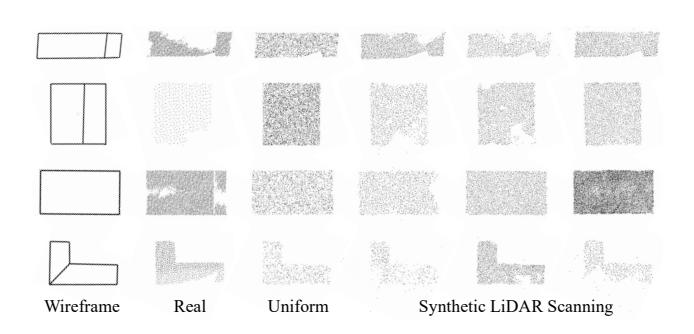
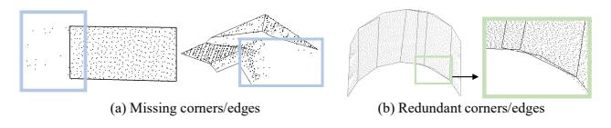

# BWFormer: Building Wireframe Reconstruction from Airborne LiDAR Point Cloud with Transformer

Yuzhou Liu1,2, Lingjie Zhu3, Hanqiao Ye1,2, Shangfeng Huang4,
Xiang Gao1\*, Xianwei Zheng5, Shuhan Shen1,2\*

1Institute of Automation, Chinese Academy of Sciences

2School of Artificial Intelligence, University of Chinese Academy of Sciences

3Cenozoic Robotics 4University of Calgary 5The State Key Lab. LIESMARS, Wuhan University

{liuyuzhou2021, xiang.gao}@ia.ac.cn; shshen@nlpr.ia.ac.cn

#### **Abstract**

In this paper, we present BWFormer, a novel Transformerbased model for building wireframe reconstruction from airborne LiDAR point cloud. The problem is solved in a ground-up manner here by detecting the building corners in 2D, lifting and connecting them in 3D space afterwards with additional data augmentation. Due to the 2.5D characteristic of the airborne LiDAR point cloud, we simplify the problem by projecting the points on the ground plane to produce a 2D height map. With the height map, a heat map is first generated with pixel-wise corner likelihood to predict the possible 2D corners. Then, 3D corners are predicted by a Transformer-based network with extra height embedding initialization. This 2D-to-3D corner detection strategy reduces the search space significantly. To recover the topological connections among the corners, edges are finally predicted from the height map with the proposed edge attention mechanism, which extracts holistic features and preserves local details simultaneously. In addition, due to the limited datasets in the field and the irregularity of the point clouds, a conditional latent diffusion model for LiDAR scanning simulation is utilized for data augmentation. BW-Former surpasses other state-of-the-art methods, especially in reconstruction completeness. Our code is available at: https://github.com/3dv-casia/BWformer/.

## 1. Introduction

Building reconstruction has become more and more important nowadays for wide applications such as smart cities [4, 15, 17], VR/AR [23, 33], autonomous driving [13], and robotics [16]. In recent years, building reconstruction has

(a) Difficulties in wireframe reconstruction from LiDAR point clouds

(b) Overview of BWFormer

Figure 1. (a) There are numerous challenges in reconstructing building wireframe from airborne LiDAR point cloud, such as lack of labeled point cloud dataset with wireframes, sparsity with few points, incomplete areas, noise from trees or other buildings, and minor structures like chimneys. (b) To solve the difficulties above, with synthetic height maps, 2D-to-3D corner detection with reduced search space, and holistic edge attention, BWFormer predicts the final complete wireframe. Trans. is short for Transformer.

seen a breakthrough with the development of deep learning community. Various types of input data, including Li-DAR point clouds, multi-view images, and remote sensing images are utilized for building reconstruction, with the results being represented in different forms such as point clouds, meshes, and wireframes [2, 9, 38]. Among various input types and output representations, airborne LiDAR point clouds are preferred due to their large coverage and high accuracy, and wireframes are favored for their concise representation and low-memory consumption.

\*Corresponding authors

However, several common challenges are presented in building wireframe reconstruction from airborne LiDAR point cloud (as shown in Figure 1(a)). The resolution of the LiDAR is relatively low and inconsistent across the area due to the flight height and angle, resulting in data sparsity and incompleteness. Occlusion and noise are also inevitable, posing extra difficulty to the task. Minor structures like chimneys may be overwhelmed by those artifacts. This motivates the community to come up with effective algorithms to tackle these issues.

Existing deep learning-based methods directly predict building wireframe from 3D point cloud. Point2Roof [11] is the first deep learning-based method to reconstruct roof structures from airborne LiDAR point clouds. It converts the problem into vertex detection and edge prediction tasks and solves them with PointNet++ [20] and the proposed Paired Point Attention (PPA) module. Building3D [28] proposes new feature extraction modules and self-supervised pre-training methods for better wireframe reconstruction performance. However, they suffer from missing corner detection from the sparse and unevenly distributed point clouds. Recently, PBWR [9] proposes a new pipeline to first regress edges and then predict the final wireframe with postprocessing. Nevertheless, it is not end-to-end and relies on the design of post-processing. Apart from the drawbacks discussed, the lack of high-quality datasets also plagues the development of this field.

Focusing on the challenges above, we propose a novel model named BWFormer in this paper for building wireframe reconstruction from airborne LiDAR point cloud (as shown in Figure 1(b)). Due to the 2.5D data characteristic of airborne LiDAR point clouds, there is no roof plane occlusion from the Bird's Eye View (BEV), thus restoring the 3D roof structures from a 2D height map is feasible. And with the 2D input, akin to BEV-related work [12], the mature deformable DTER [39] could be utilized. Specifically, we divide the wireframe reconstruction process into two parts, including corner detection and edge prediction. For 3D corner detection, with the sparse point clouds and large search space in 3D, we adopt a 2D-to-3D corner detection paradigm to deal with it. Firstly, 2D corners are predicted from a corner heat map with pixels of high probabilities. With the known 2D positions, added with the random initialized height embeddings, the 3D corner queries are initialized, which are then refined explicitly in the Transformer decoder. In this way, the search space for 3D corner detection is reduced significantly. Subsequently, with corners detected, possible edges connecting two corners are classified as valid or not. To overcome the sparsity and incompleteness of point clouds, edge attention is performed to extract both the holistic and local features for the final prediction. With valid edges, the 3D wireframe is reconstructed. Last but not the least, for the lack of labeled datasets, we propose a synthetic LiDAR scanning method to simulate the LiDAR sampling locations for data augmentation.

In summary, we outline our contributions below:

- A novel end-to-end method named BWFormer targeting in building wireframe reconstruction from airborne Li-DAR point cloud. Evaluations on the challenging dataset Building3D [28] prove the effectiveness of our model design with +12.2% in WED, +8.1% in ACO, +7.4% in corner F1 score, and +2.2% in edge F1 score improvements comparing with the current state-of-the-art PBWR [9].
- An efficient corner detection module that handles point cloud in 2D image space and 3D space subsequently. It utilizes the 2.5D characteristic of the LiDAR point cloud and reduces the search space significantly.
- An effective edge detection module with edge attention mechanism. It recovers the topological connections among corners from both the local and holistic features from the height map.
- An additional data augmentation module based on the conditional latent diffusion model. It simulates the Li-DAR scanning process with varying LiDAR sampling locations to enhance data diversity.

## 2. Related Work

## 2.1. Structured Building Reconstruction

Reconstructing buildings from point clouds [27] focuses on structured characteristics, such as flat planes and sharp edges, for a concise and accurate representation. Some methods [6, 7] fit buildings with pre-defined building models based on architectural priors, but suffer from the lack of generalization across buildings of diverse shapes. Others detect planes with RANSAC [24] or region-growing algorithms [10] and then solve it as an optimization problem to strike a balance between model complexity and reconstruction precision [18, 38]. However, they encounter challenges with large-scale and detailed scenes for the large time consumption. Besides, many methods treat the building roof as a graph and form the model with vertices and edges [9, 29] while topological errors may occur in some cases.

#### 2.2. Building Wireframe Reconstruction

Wireframe reconstruction identifies and models the edges and vertices of the objects, creating a skeletal representation of their geometric shapes from input data such as images [31, 32] or point clouds [14, 40]. For building wireframe reconstruction, some methods reconstruct the 2D wireframes from satellite images without height information [3, 36]. To restore the 3D structures of buildings, Li-DAR point clouds are commonly used data sources. Different from the densely-scanned point cloud used in the general wireframe reconstruction methods [14, 40], building wireframe reconstruction is challenging due to the sparse,

Figure 2. **Overall architecture of BWFormer.** With real height maps projected from point clouds and synthetic ones from simulated LiDAR scans (a), BWFormer first detects 2D corners and initializes the 3D corner queries with 2D positions. Then, with a Transformer-based network, the 3D corners are predicted (b). Finally, edges are classified as valid or not (c) while valid ones form the final wireframe (d).  $(x_i, y_i, z_i^j)$  indicates the j-th corner initialized in the i-th possible 2D position. The predicted coordinates are in the yellow box while the unpredicted ones are in the gray ones. Besides, 2D corners are marked as red while 3D ones as purple. Lines marking the 2D-3D correspondences are black for one-to-one correspondences while yellow for one-to-many ones. l indicates the number of candidate edges.

incomplete, and noisy point clouds. Point2Roof [11] and methods in Building3D [28] construct roof wireframe from airborne LiDAR point cloud with vertex detection and edge prediction. However, they suffer from missing vertices and edges due to the challenges in detecting vertices and edges in sparse point clouds. PBWR [9] significantly improves reconstruction quality by directly regressing edges, but it relies on post-processing and is not fully end-to-end.

#### 3. Method

With the height maps projected from airborne LiDAR point clouds and each pixel value corresponds to the point height, the proposed BWFormer reconstructs 3D building wireframes from them in an end-to-end manner. As shown in Figure 2, it first detects 2D corners with high possibilities from a heat map predicted with dilated residual networks [34], and then, with xy values known, 3D corners are detected in the 3D space. Finally, edges with 3D corners as the endpoints are classified. For the 2D-to-3D corner detection and edge detection module, they are both DETR-based models [39]. To achieve better performance, we also propose a new height map synthesis method to generate synthetic data and mix both the synthetic and real data for training. In this section, we will first introduce the backbone and Transformer encoder. Then, we give a detailed illustration of our 2D-to-3D corner detection module and edge attention-based edge detection module. Following that, we provide a comprehensive explanation of the loss functions. Finally, we present the synthetic data generation model.

## 3.1. Backbone and Transformer Encoder

With the point cloud projected as height map, BWFormer takes the height map as input and extracts 2D features with a ResNet-50 network [5]. Then the multi-level features added with positional embedding are served as the input of the Transformer encoder. The corner module and edge module are both encoder-decoder-based Transformer networks [39]. For the Transformer encoder, each layer con-

sists of a deformable self-attention layer and a feed-forward network, then, the 2D features serves as the input for the Transformer decoder. For the Transformer decoder, each layer consists of a self-attention layer, a deformable crossattention / edge attention layer, and a feed-forward network.

#### 3.2. 2D-to-3D Corner Detection

For 3D corner detection, there are two major challenges: Firstly, with large search space, detecting corners from sparse point cloud directly is difficult; Secondly, though there is no overlapping for roof planes, corners at different heights may share the same 2D coordinates (yellow lines in Figure 2(b)). To address the above problems, we first detect possible 2D corners and then lift them into 3D space with different heights. This two-stage strategy effectively simplifies the 3D detection task with a smaller search space, yielding superior performance in terms of both reconstruction quality and resource consumption.

**2D Corner Detection.** For the sparse height map, we take the feature map from the multi-scale features outputted by the Transformer encoder, and send it to the dilated convolution layers [34] to predict the 2D corner possibility heat map. Then, with Non-Maximum Suppression (NMS), the top N pixels are selected as the 2D corners, where N is the maximum 2D corner number.

**3D Corner Detection.** As shown in Figure 3(a), 3D corner queries consist of content queries  $C \in \mathbb{R}^{NH \times d}$  and positional queries  $P \in \mathbb{R}^{NH \times d}$ , in which H indicates maximum number of corners that share the same 2D coordinate and d indicates the dimension of decoder embedding. For positional queries, they are generated from corner queries  $R \in \mathbb{R}^{NH \times 3}$  by P = MLP(PE(R)), where corner queries are explicitly represented by 3D corner coordinates, MLP is a multi-layer perception network, and PE is the positional encoding which calculates the d-dimensional sinusoidal positional embedding of the corner queries. In this way, 3D corners with the same 2D positions but different heights could be distinguished. With 2D corners detected, the first

Figure 3. **Illustration of Transformer decoders.** Details of the decoder layer in the 3D corner model (a) and the edge model (b).

two dimensions of corner queries are initialized with them while the height dimension is randomly initialized. In the decoder, the self-attention layer enables information sharing between queries first. Then in the deformable cross-attention layer, reference points are the 2D positions and queries interact with the image features. Finally, height offsets and corner labels are predicted by two separate MLPs using the content queries, and 3D corners are obtained with the corner label predicted as valid.

#### 3.3. Edge Detection

**Edge Transformer.** With 3D corners predicted, we cast the edge detection task as a binary classification problem to label connections between two corners as valid or not.

As shown in Figure 3(b), we represent edge queries with both edge content queries and edge positional queries. Edge content queries are represented with the edge features extracted by the image feature fusion module proposed in HEAT [3] which injects the image features into the edge with deformable attention [39]. Edge positional queries indicate the space position of the edges. The sinusoidal positional embeddings of the edge endpoints are calculated. With an MLP network, the positional queries are obtained.

In the decoder layer, through the interaction of selfattention and edge attention, the final probabilities of the edges are predicted by an MLP from edge queries. With valid edges, the building wireframe is reconstructed.

Edge Attention. Due to the sparsity, incompleteness, and noise of the airborne LiDAR point clouds, it is challenging to determine whether a line connecting two corners is an edge or not. For vanilla deformable attention [39] in edge detection, the reference points are placed at the midpoints of edges, attending to only areas near the midpoints. However, it may fall short of a holistic understanding of edges

Figure 4. **Edge Attention.** (a) The height map and the corresponding ground-truth wireframe (top view). (b) Vanilla deformable attention with only midpoints as reference points. (c) Our proposed edge attention with holistic reference points along the edge.

as depicted in Figure 4.

Taking the sparse and incomplete characteristics of airborne LiDAR point clouds into consideration, it is necessary to pay attention to the whole edge and extract local details from different positions. To this end, we propose the edge attention mechanism to enhance the holistic perception of edges. We uniformly sample M reference points along an edge with the sampling point set S represented as  $\{s_m\}_{m=1}^M$ , where  $s_m$  indicates the m-th sampled point. Then, the edge content queries are replicated M times and focus on the corresponding areas to the sampled points. In the end, a max-pooling operation is performed to aggregate information from all positions.

Given a multi-scale feature map F outputted by the backbone, an edge query  $q \in \mathbb{R}^C$ , and the sampled point set S, the Edge Attention (EA) is calculated by:

$$EA(q, S, F) = MaxPool(MDA(q, s_m, F))|s_m \in S), (1)$$

where MaxPool is the max-pooling operation and MDA is the vanilla multi-head deformable attention. With the proposed edge attention, the edge feature is extracted holistically while the local details are also preserved.

#### 3.4. Loss Functions

**Bipartite Matching.** For 3D corners, we perform bipartite matching between the predicted and the ground-truth ones according to the corner  $L_1$  distance and corner labels. The matching cost C is defined as:

$$C = \sum_{i=1}^{N_{gt}} (d_{L_1}(c_i, c_{\sigma(i)}) + L_{ce}(c_i, c_{\sigma(i)})),$$
 (2)

where  $N_{gt}$  is the number of ground truth corners,  $c_i$  and  $c_{\sigma(i)}$  are the ground-truth corners and the matched corner predictions respectively,  $d_{L_1}(\cdot,\cdot)$  is the  $L_1$  distance between the two corners, and  $L_{ce}(\cdot,\cdot)$  is the binary cross-entropy between the probabilities of two corners. An optimal matching is determined by minimizing the above matching cost.

**Total Loss.** We train our BWFormer model in an end-toend manner, where the total loss is defined as:

$$L = \lambda_1 L_{c_{2D}} + \lambda_2 L_{c_{3D}} + \lambda_3 L_e, \tag{3}$$

Figure 5. **Illustration of synthetic data generation.** The synthetic process includes the LiDAR scanning simulation process and the height map synthesis process. The LiDAR scanning simulation process is based on a conditional generation process. Taking the building footprint as the condition, a latent diffusion model generates the LiDAR sampling locations accordingly. The training process is shown on the left (a), while the synthesis process is shown on the right (b).

where  $L_{c_{2D}}$ ,  $L_{c_{3D}}$ ,  $L_e$  are 2D corner loss, 3D corner loss, and edge loss respectively. And  $\lambda_1$ ,  $\lambda_2$ , and  $\lambda_3$  are the corresponding loss weights. The 2D corner loss is defined as:

$$L_{c_{2D}} = L_{ce}(l_{pre}, l_{at}),$$
 (4)

where  $l_{pre}$  and  $l_{gt}$  are the per-pixel labels for the predicted and ground truth. The 3D corner loss is defined as:

$$L_{c_{3D}} = \frac{1}{N_{gt}} \sum_{i=1}^{N_{gt}} (d_{L_1}(c_i, c_{\sigma(i)}) + L_{ce}(c_i, c_{\sigma(i)})).$$
 (5)

Besides, the edge loss is defined as:

$$L_e = L_{ce}(e_{pre}, e_{qt}), \tag{6}$$

where  $e_{pre}$  and  $e_{gt}$  are the labels for the predicted and ground truth edges respectively.

#### 3.5. Synthetic Data Augmentation

In many domains of computer vision, such as autonomous driving and point cloud understanding, data augmentation with additional synthetic data has proven to be an effective tool to boost the model performance [22, 35]. Limited by the number of real-world LiDAR point clouds of buildings, we introduce a new height map synthesis method to generate synthetic data for augmenting the real-world dataset.

When the airborne LiDAR flies over a building, it emits a laser downward for sampling, and a point cloud is obtained when the laser intersects with the roof of the building. To simulate this process, we divide the synthetic process into the LiDAR scanning simulation process to sample locations on the 2D plane and the height map synthesis process to collect the height of the building at that location.

The LiDAR sampling locations present different data distributions due to the different aircraft types and Li-DAR equipment. Thus, simulating the distribution similar to the real data is important. Latent Diffusion Model (LDM) [21] has proven to be an effective tool for content generation [26, 30]. As shown in Figure 5, a conditional LDM is utilized to simulate the sampling locations with a given building footprint. We project a point cloud along the gravity axis and mark the corresponding pixel as 0 to obtain the sampling image.

**Training Process.** A latent space is constructed by training an autoencoder with the real LiDAR sampling images as input. Given a sampling image I which is a binary image in pixel space, the encoder E encodes I into a latent representation Z, then, the decoder reconstructs the image  $\widetilde{I}$  with  $\widetilde{S} = D(Z) = D(E(I))$ . With the sampling location latent space, a latent diffusion model is trained with the building footprint (fp) as the condition. With the attention mechanism [25], the learning objective is represented as:

$$L = \mathbb{E}_{E(I), fp, \epsilon \sim N(0,1), t}[||\epsilon - \epsilon_{\theta}(z_t, t, \tau(fp))||_2^2], \quad (7)$$

where  $\epsilon$  is the noise added, t is the time step,  $\epsilon_{\theta}$  is the predicted noise, and  $\tau$  is the condition encoder.

**Synthesis Process.** Building footprints are obtained from the 3D wireframe and serve as conditions. With the LDM, the synthetic sampling locations are generated. Finally, with the roof height map calculated from the 3D wireframe and the synthetic LiDAR sampling locations, the LiDAR scanning process is simulated, and synthetic height maps are generated for data augmentation.

With the conditional generation method, the synthesized data is rich and diverse, and the sparsity and missing are well simulated. Mixed with the real data, the data augmentation process boosts the performance of our BWFormer.

#### 4. Experiments

#### 4.1. Dataset and Evaluation Metrics

**Dataset.** We evaluate our method on the Building3D [28] dataset. Building3D is an urban-scale dataset collected with airborne LiDAR. The open-sourced Tallinn city part is divided into a training set (32618) and a test set (3472). Evaluation Metrics. We adopt the same evaluation metrics as Building3D leaderboard 1, which are briefly introduced in the following. For wireframe-level metrics, Wireframe Edit Distance (WED) is a modified version of Graph Edit Distance (GED) [1] to measure the number of elementary graph edit operators for transforming the predicted wireframe to the ground truth [14] while Average Corner Offset (ACO) calculates the average distance between predicted and ground-truth corners. For corner-level and edgelevel metrics, Corner Precision (CP), Corner Recall (CR), Corner F1 (CF1), Edge Precision (EP), Edge Recall (ER) and Edge F1 (EF1) are introduced to evaluate the reconstruction quality of the corners and edges.

Inttps://huggingface.co/spaces/Building3D/ USM3D

|                             | Distance |       | Corner (%) |      |      | Edge (%) |      |      |
|-----------------------------|----------|-------|------------|------|------|----------|------|------|
| Method                      | WED↓     | ACO↓  | CP↑        | CR ↑ | CF1↑ | EP↑      | ER ↑ | EF1↑ |
| PointMAE*[19]               | -        | 0.330 | 75.0       | 47.0 | 58.0 | 52.0     | 12.0 | 20.0 |
| PointM2AE* [20]             | -        | 0.320 | 79.0       | 58.0 | 67.0 | 50.0     | 7.0  | 12.0 |
| Point2Roof [11]             | -        | 0.390 | 65.0       | 30.0 | 41.0 | 66.0     | 8.0  | 14.0 |
| Linear self-supervised [28] | -        | 0.350 | 70.0       | 60.0 | 65.0 | 67.0     | 16.0 | 25.0 |
| Supervised [28]             | -        | 0.290 | 90.0       | 53.0 | 66.0 | 88.0     | 23.0 | 36.0 |
| PC2WF [14]                  | -        | 0.520 | 18.0       | 67.0 | 28.0 | 2.0      | 15.0 | 1.0  |
| PBWR [9]                    | 0.271    | 0.222 | 98.5       | 68.8 | 81.0 | 94.3     | 65.4 | 77.2 |
| BWFormer (Ours)             | 0.238    | 0.204 | 94.9       | 82.7 | 88.4 | 85.5     | 74.1 | 79.4 |

Table 1. Quantitative evaluation results on the Building3D dataset [28]. Results of previous works are taken from [9] and the Building3D leaderboard, where  $X^*$  indicates the method X serves as the feature extractor in the baseline network of Building3D [28]. The best results are in bold font, and the same notation applies to the subsequent tables.

## 4.2. Implementation Details

**Input Pre-processing.** Given a point cloud with the z-axis aligned along the gravity direction, we first normalize it to the range [-1.0, 1.0]. We then project it onto the xy-plane and compute a  $256 \times 256$  height map, where each pixel value represents the average z-value of points projected onto that pixel. Pixels with no projected points are set to 0.

**Model Settings.** Layer numbers in the Transformer encoder and decoder are both 6. N, H, and M defined in Section 3.2 and Section 3.3 are set to be 150, 2, and 5 respectively.  $\lambda_1$ ,  $\lambda_2$ , and  $\lambda_3$  are set to 1, 2000, and 1 respectively. And we train the model for 650 epochs with an initial learning rate of 2e-4, which decays by 10% in the last 50 epochs. For the data augmentation, we mix the synthetic data with the real data in a ratio of 3:1 and train them together.

#### 4.3. Quantitative Evaluations.

We compare BWFormer with seven other approaches, including Point2Roof [11] and its variants (including Point-MAE [19], PointM2AE [20], Linear self-supervised [28], and supervised [28]), PC2WF [14], and PBWR [9]. As shown in Table 1, our method surpasses other SOTA methods, especially on the metrics of corner recall and edge recall, showcasing the superior adaptation of our proposed BWFormer to sparse 3D point clouds with more reconstruction completeness. This is due to our pixel-by-pixel 2D corner detection and 2D-to-3D strategy with a smaller search space, as well as the edge attention mechanism that focuses on both the whole and details. In terms of specific numbers, our method achieves an improvement of +12.2% in WED, +8.1% in ACO, +7.4% in corner F1 score, and +2.2% in edge F1 score with the state-of-the-art method PBWR.

#### 4.4. Qualitative Evaluations.

The qualitative evaluations are shown in Figure 6, and our BWFormer is compared with five representative methods, including 2.5D dual contouring [37], PolyFit-based

City3D [8, 18], PC2WF [14], Point2Roof [11], and PBWR [9]. The first two comparative methods are traditional ones which output mesh models, and the last three are proprietary deep learning-based wireframe reconstruction methods that directly output wireframes.

The traditional methods often strive to fit the point cloud as closely as possible during the optimization process, which makes them very sensitive to noise and would also reconstruct the point clouds of trees (blue boxes in the 1-st and 4-th rows in Figure 6). While they usually fit planes with a threshold of point numbers, they also miss small details like the chimney (green boxes in the 3-rd and 6-th rows in Figure 6). For the deep learning-based methods, prior works lack special designs for the sparse and noisy LiDAR point clouds and are struggling with the missing vertices and edges (5-th to 7-th columns in Figure 6). The results of our BWFormer are more complete and with more details (the last column in Figure 6). Please refer to the supplementary materials for more visualization results.

#### 4.5. Synthetic LiDAR Scanning Evaluation.

We compare our simulated scanning method with several uniform sampling-based methods. For the first three methods, each synthetic data is generated by uniformly sampling points within the building footprint at fixed sparsity levels of 90%, 85%, and 80%, denoted as Uni.(90%), Uni.(85%), and Uni. (80%) respectively. For the last method, a Gaussian distribution (mean value 85.75%, variance 0.19%) on point sparsity is fitted across all real data in the Building3D dataset. For each synthetic sample, the sparsity for uniform sampling is then randomly drawn from this distribution, which is denoted as Uni. (Gau). As shown in Table 2, using the widely-adopted metrics in image generation of Fréchet Inception Distance (FID) and Maximum Mean Discrepancy (MMD), our method significantly outperforms both fixed and Gaussian-based uniform scanning approaches. For the qualitative evaluations, shown in Figure 7, our simulated scanning locations exhibit greater di-

Figure 6. Quantitative evaluation results on the Building3D dataset [28]. The 1-st column is the point clouds segmented with single buildings but messed with noise, the 2-nd column is the right views of the original point clouds in the 1st column but without removing the non-building parts. The results of the traditional methods (3-rd and 4-th columns) are mesh models, while 3D wireframes for deep learning-based methods (5-th to 8-th columns). Though the ground truth wireframe models for the test set are not open-sourced, please refer to the right view and pay attention to the tree noise (1-st and 4-th rows), chimney at the top of the roof (3-rd and 6-th rows), and roof planes of different angles (5-th row). Green boxes mark the details, while the blue ones mark the reconstruction results.

| Metric                            | Uni. (90%) | Uni. (85%) | Uni. (80%) | Uni. (Gau) | Ours |
|-----------------------------------|------------|------------|------------|------------|------|
| FID↓                              | 180.2      | 152.0      | 140.3      | 159.5      | 53.9 |
| $MMD (\times 10^{-2}) \downarrow$ | 2.10       | 2.63       | 2.67       | 0.89       | 0.37 |

Table 2. **Effects of synthetic LiDAR scanning.** The methods of Uni. (X%) and Uni. (Gau) are described in the main text.

versity, reflecting different sparsities and missing regions that closely resemble the real-world data. Additional visualizations are provided in the supplementary materials.

#### 4.6. Ablation Studies

All the ablation studies are done on the test set of the Building3D dataset [28]. Considering the training time, ablation studies on the 2D and 3D corner number, and number of sampling points are trained without the synthetic data.

**Different Components.** As shown in Table 3, the baseline method directly predicts 3D corners from height maps. However, it struggles with sparse point clouds, leading to poor results. The introduction of 2D-3D corner detection significantly improves model performance by leveraging dense 2D corner detection and a smaller search space.

Figure 7. Examples of simulated LiDAR scanning. Compared with uniform sampling of different sparsities (80%, 85%, 90%, and 95% from top to bottom in the 3-rd column), our method highlights data diversity in both sparsity and completeness.

What is more, the adding of edge attention boosts the EF1 by 3.6%. Finally, the use of synthetic height maps enhances both precision and completeness in the reconstruction, demonstrating the effectiveness of data augmentation. **2D and 3D Corner Number.** In the 2D-to-3D corner detection process, the 2D corner number (N) and 3D corner numbers (NH) are both significant for the detection of sparse

|                          | Distance |       | Corner (%) |      |       | Edge (%) |      |      |
|--------------------------|----------|-------|------------|------|-------|----------|------|------|
| Method                   | WED↓     | ACO↓  | CP↑        | CR ↑ | CF1 ↑ | EP↑      | ER ↑ | EF1↑ |
| Baseline                 | 0.463    | 0.415 | 90.4       | 67.0 | 77.0  | 69.2     | 50.2 | 58.2 |
| + 2D-3D corner detection | 0.290    | 0.235 | 93.3       | 79.8 | 86.0  | 81.3     | 69.1 | 74.7 |
| + Edge attention         | 0.253    | 0.207 | 94.1       | 82.8 | 88.1  | 83.7     | 73.6 | 78.3 |
| + Data Augmentation      | 0.238    | 0.204 | 94.9       | 82.7 | 88.4  | 85.5     | 74.1 | 79.4 |

Table 3. Ablation study of different components of BWFormer.

|     |     | Distance(m) |       | Corner (%) |      |       | Edge (%) |      |       |
|-----|-----|-------------|-------|------------|------|-------|----------|------|-------|
| N   | NH  | WED↓        | ACO ↓ | CP↑        | CR ↑ | CF1 ↑ | EP↑      | ER ↑ | EF1 ↑ |
| 100 | 200 | 0.255       | 0.212 | 94.1       | 81.7 | 87.5  | 83.4     | 72.3 | 77.5  |
| 200 | 400 | 0.250       | 0.211 | 93.9       | 82.6 | 87.9  | 83.2     | 73.8 | 78.2  |
| 150 | 150 | 0.322       | 0.220 | 93.4       | 74.2 | 82.7  | 81.0     | 62.9 | 70.8  |
| 150 | 450 | 0.275       | 0.224 | 93.0       | 81.5 | 86.9  | 81.5     | 71.4 | 76.1  |
| 150 | 300 | 0.253       | 0.207 | 94.1       | 82.8 | 88.1  | 83.7     | 73.6 | 78.3  |

Table 4. Analysis on 2D and 3D corner number of BWFormer.

|   | Distan | ice(m) |      | Corner (% | 5)    | Edge (%) |      |      |
|---|--------|--------|------|-----------|-------|----------|------|------|
| M | WED↓   | ACO↓   | CP↑  | CR ↑      | CF1 ↑ | EP↑      | ER ↑ | EF1↑ |
| 3 | 0.272  | 0.224  | 92.8 | 81.8      | 87.0  | 80.5     | 72.0 | 76.0 |
| 4 | 0.268  | 0.216  | 94.2 | 80.9      | 87.0  | 83.3     | 71.1 | 76.7 |
| 5 | 0.253  | 0.207  | 94.1 | 82.8      | 88.1  | 83.7     | 73.6 | 78.3 |
| 6 | 0.255  | 0.209  | 94.1 | 82.3      | 87.8  | 83.4     | 73.1 | 77.9 |
| 7 | 0.259  | 0.211  | 94.6 | 81.5      | 87.6  | 84.0     | 72.0 | 77.5 |

Table 5. Analysis on Number of sampling points of BWFormer.

point clouds. With more 2D corners, the 3D corner queries are more dense while also introducing more memory consumption and introducing more redundancy. we seek a balance between the accuracy and memory consumption to choose 150 as the 2D corner number. For the 3D corners, there are rare cases for 3 corners sharing the same 2D coordinate, but common for 2 corners. Thus, we set H to 2 as our 3D corner number with the same 2D positions and experiments prove the effectiveness. The detailed experimental results are in Table 4.

**Number of Sampling Points.** In this experiment, we study the effect of different numbers of sampling points (M) in the edge attention. For sparse point clouds, it's essential to focus on areas with point clouds covered, which requires high attention to details. However, with too many sampling points, critical information in smaller detailed areas will be diluted and computational overhead will increase significantly. To seek a balance between model performance and computational cost, we set M to 5, as shown in Table 5.

Effectiveness of Data Augmentation. Table 6 shows how the data augmentation strategies influence the model performance. The uniform sampling simulation (Uni.) replaces our simulated LiDAR scanning process with uniform sampling under the Gaussian distribution described in section 4.5. This simple method leads to the performance dropping for the unrealistic data distribution. With our method, both the reconstruction precision and completeness are im-

|                    | Dist  | C     | Corner ( | %)   | Edge (%) |      |      |      |
|--------------------|-------|-------|----------|------|----------|------|------|------|
| Method             | WED↓  | ACO↓  | CP↑      | CR ↑ | CF1↑     | EP↑  | ER ↑ | EF1↑ |
| Real               | 0.253 | 0.207 | 94.1     | 82.8 | 88.1     | 83.7 | 73.6 | 78.3 |
| Uni. $(\times 1)$  | 0.259 | 0.211 | 94.6     | 81.5 | 87.6     | 84.0 | 72.0 | 77.5 |
| Mixed $(\times 1)$ | 0.239 | 0.211 | 94.0     | 83.0 | 88.2     | 84.1 | 74.5 | 79.0 |
| Mixed $(\times 3)$ | 0.238 | 0.204 | 94.9     | 82.7 | 88.4     | 85.5 | 74.1 | 79.4 |
| Mixed $(\times 5)$ | 0.237 | 0.204 | 94.7     | 82.7 | 88.3     | 85.0 | 74.0 | 79.1 |

Table 6. Analysis on data augmentation method of BWFormer. Real indicates training only with the Building3D dataset [28]. Mixed means mixed dataset with both the real-world dataset and synthetic dataset, while the numbers in the brackets behind represent the multiples of the synthetic data and the real-world data.

Figure 8. **Failure case analysis.** (a) Our model sometimes misses corners and edges because of the extremely sparse point clouds. (b) In some cases, redundant corners and edges could be predicted. Blue and green boxes mark the errors in the failure, and the point clouds are added to the wireframes to illustrate the errors.

proved. As the number of synthetic data increases, the effect gradually becomes saturated. We believe that a 3:1 ratio between synthetic data and real data could achieve a balance between training effect and time efficiency.

#### 4.7. Analysis of Failure Cases

Despite significant progress has been made by BWFormer, there are still some failure cases. For extremely sparse point clouds, BWFormer misses corners and edges (as shown in Figure 8(a)). Besides, with the dense 2D corner prediction, in some cases, redundant corners and edges that are close to each other are predicted (as shown in Figure 8(b)).

#### 5. Conclusion

We propose BWFormer, a novel end-to-end Transformer-based network for 3D building wireframe reconstruction from airborne LiDAR point cloud. With 2D-to-3D corner detection, 3D corners are predicted from known 2D positions within a smaller search space, simplifying the problem complexity. For the edge classification, edge attention extracts the holistic edge features while preserving details. Furthermore, synthetic data simulating the LiDAR scanning process is used for data augmentation. Our method outperforms other state-of-the-art methods, particularly in terms of reconstruction completeness. Further ablation experiments demonstrate the effectiveness of our model design.

## Acknowledgements

This work was supported by the Beijing Natural Science Foundation (No. L223003), the National Natural Science Foundation of China (No. U22B2055, 62273345, and 62373349), and the Key R&D Project in Henan Province (No. 231111210300).

## References

- [1] Zeina Abu-Aisheh, Romain Raveaux, Jean-Yves Ramel, and Patrick Martineau. An exact graph edit distance algorithm for solving pattern recognition problems. In *International Conference on Pattern Recognition Applications and Methods (ICPRAM)*, 2015. 5
- [2] Sameer Agarwal, Noah Snavely, Ian Simon, Steven M Seitz, and Richard Szeliski. Building Rome in a day. In *IEEE International Conference on Computer Vision (ICCV)*, pages 72–79, 2009. 1
- [3] Jiacheng Chen, Yiming Qian, and Yasutaka Furukawa. HEAT: Holistic edge attention Transformer for structured reconstruction. In *IEEE/CVF Conference on Computer Vision and Pattern Recognition (CVPR)*, pages 3866–3875, 2022. 2, 4
- [4] Jiali Han, Yuzhou Liu, Mengqi Rong, Xianwei Zheng, and Shuhan Shen. Floorusg: Indoor floorplan reconstruction by unifying 2d semantics and 3d geometry. ISPRS Journal of Photogrammetry and Remote Sensing, 196:490–501, 2023.
- [5] Kaiming He, Xiangyu Zhang, Shaoqing Ren, and Jian Sun. Deep residual learning for image recognition. In *IEEE Conference on Computer Vision and Pattern Recognition (CVPR)*, pages 770–778, 2016. 3
- [6] Hai Huang, Claus Brenner, and Monika Sester. 3D building roof reconstruction from point clouds via generative models. In ACM SIGSPATIAL International Conference on Advances in Geographic Information Systems (SIGSPATIAL), pages 16–24, 2011. 2
- [7] Hai Huang, Claus Brenner, and Monika Sester. A generative statistical approach to automatic 3D building roof reconstruction from laser scanning data. *ISPRS Journal of Photogrammetry and Remote Sensing*, 79:29–43, 2013. 2
- [8] Jin Huang, Jantien Stoter, Ravi Peters, and Liangliang Nan. City3D: Large-scale building reconstruction from airborne lidar point clouds. *Remote Sensing*, 14(9):2254, 2022. 6
- [9] Shangfeng Huang, Ruisheng Wang, Bo Guo, and Hongxin Yang. PBWR: Parametric building wireframe reconstruction from aerial LiDAR point clouds. In *IEEE/CVF Conference on Computer Vision and Pattern Recognition (CVPR)*, pages 27778–27787, 2024. 1, 2, 3, 6
- [10] Florent Lafarge and Clément Mallet. Creating large-scale city models from 3D-point clouds: A robust approach with hybrid representation. *International Journal of Computer Vi*sion, 99:69–85, 2012. 2
- [11] Li Li, Nan Song, Fei Sun, Xinyi Liu, Ruisheng Wang, Jian Yao, and Shaosheng Cao. Point2Roof: End-to-end 3D building roof modeling from airborne LiDAR point clouds. *IS*-

- PRS Journal of Photogrammetry and Remote Sensing, 193: 17–28, 2022. 2, 3, 6
- [12] Zhiqi Li, Wenhai Wang, Hongyang Li, Enze Xie, Chonghao Sima, Tong Lu, Yu Qiao, and Jifeng Dai. BEVFormer: Learning bird's-eye-view representation from multi-camera images via spatiotemporal Transformers. In *European Conference on Computer Vision (ECCV)*, pages 1–18, 2022. 2
- [13] Bencheng Liao, Shaoyu Chen, Yunchi Zhang, Bo Jiang, Qian Zhang, Wenyu Liu, Chang Huang, and Xinggang Wang. MapTRv2: An end-to-end framework for online vectorized HD map construction. *International Journal of Computer Vision*, pages 1–23, 2024. 1
- [14] Yujia Liu, Stefano D'Aronco, Konrad Schindler, and Jan Dirk Wegner. PC2WF: 3D wireframe reconstruction from raw point clouds. In *International Conference on Learning Representations (ICLR)*, 2021. 2, 5, 6
- [15] Yuzhou Liu, Lingjie Zhu, Xiaodong Ma, Hanqiao Ye, Xiang Gao, Xianwei Zheng, and Shuhan Shen. PolyRoom: Roomaware transformer for floorplan reconstruction. In *European Conference on Computer Vision*, pages 322–339, 2024. 1
- [16] Guanxing Lu, Shiyi Zhang, Ziwei Wang, Changliu Liu, Ji-wen Lu, and Yansong Tang. ManiGaussian: Dynamic gaussian splatting for multi-task robotic manipulation. In European Conference on Computer Vision (ECCV), pages 349–366, 2024.
- [17] Xiaodong Ma, Lingjie Zhu, Yuzhou Liu, Zexiao Xie, Xiang Gao, and Shuhan Shen. BPN: Building pointer network for satellite imagery building contour extraction. *IEEE Geoscience and Remote Sensing Letters*, 2024. 1
- [18] Liangliang Nan and Peter Wonka. PolyFit: Polygonal surface reconstruction from point clouds. In *IEEE International Conference on Computer Vision (ICCV)*, pages 2353–2361, 2017. 2, 6
- [19] Charles R Qi, Hao Su, Kaichun Mo, and Leonidas J Guibas. PointNet: Deep learning on point sets for 3D classification and segmentation. In *IEEE Conference on Computer Vision* and Pattern Recognition (CVPR), pages 652–660, 2017. 6
- [20] Charles R Qi, Li Yi, Hao Su, and Leonidas J Guibas. Point-Net++: Deep hierarchical feature learning on point sets in a metric space. In *Advances in Neural Information Processing Systems (NIPS)*, 2017. 2, 6
- [21] Robin Rombach, Andreas Blattmann, Dominik Lorenz, Patrick Esser, and Björn Ommer. High-resolution image synthesis with latent diffusion models. In *IEEE/CVF Conference* on Computer Vision and Pattern Recognition (CVPR), pages 10684–10695, 2022. 5
- [22] Guodong Rong, Byung Hyun Shin, Hadi Tabatabaee, Qiang Lu, Steve Lemke, Mārtiņš Možeiko, Eric Boise, Geehoon Uhm, Mark Gerow, Shalin Mehta, Eugene Agafonov, Tae Hyung Kim, Eric Sterner, Keunhae Ushiroda, Michael Reyes, Dmitry Zelenkovsky, and Seonman Kim. LGSVL simulator: A high fidelity simulator for autonomous driving. In IEEE International Conference on Intelligent Transportation Systems (ITSC), pages 1–6, 2020. 5
- [23] Paul-Edouard Sarlin, Mihai Dusmanu, Johannes L Schönberger, Pablo Speciale, Lukas Gruber, Viktor Larsson, Ondrej Miksik, and Marc Pollefeys. LaMAR:

- Benchmarking localization and mapping for augmented reality. In *European Conference on Computer Vision (ECCV)*, pages 686–704, 2022. 1
- [24] R. Schnabel, R. Wahl, and R. Klein. Efficient RANSAC for point-cloud shape detection. *Computer Graphics Forum*, 26 (2):214–226, 2007. 2
- [25] Ashish Vaswani, Noam Shazeer, Niki Parmar, Jakob Uszkoreit, Llion Jones, Aidan N Gomez, Łukasz Kaiser, and Illia Polosukhin. Attention is all you need. In Advances in Neural Information Processing Systems (NIPS), 2017.
- [26] Vikram Voleti, Chun-Han Yao, Mark Boss, Adam Letts, David Pankratz, Dmitry Tochilkin, Christian Laforte, Robin Rombach, and Varun Jampani. SV3D: Novel multi-view synthesis and 3D generation from a single image using latent video diffusion. In European Conference on Computer Vision (ECCV), pages 439–457, 2024. 5
- [27] Ruisheng Wang, Jiju Peethambaran, and Dong Chen. LiDAR point clouds to 3-D urban models: A review. *IEEE Journal of Selected Topics in Applied Earth Observations and Remote Sensing*, 11(2):606–627, 2018. 2
- [28] Ruisheng Wang, Shangfeng Huang, and Hongxin Yang. Building3D: A urban-scale dataset and benchmarks for learning roof structures from point clouds. In *IEEE/CVF International Conference on Computer Vision (ICCV)*, pages 20076–20086, 2023. 2, 3, 5, 6, 7, 8
- [29] B. Xiong, S. Oude Elberink, and G. Vosselman. A graph edit dictionary for correcting errors in roof topology graphs reconstructed from point clouds. *ISPRS Journal of Photogram*metry and Remote Sensing, 93:227–242, 2014. 2
- [30] Xiang Xu, Joseph Lambourne, Pradeep Jayaraman, Zhengqing Wang, Karl Willis, and Yasutaka Furukawa. BrepGen: A B-rep generative diffusion model with structured latent geometry. ACM Transactions on Graphics, 43 (4):1–14, 2024. 5
- [31] Nan Xue, Tianfu Wu, Song Bai, Fudong Wang, Gui-Song Xia, Liangpei Zhang, and Philip HS Torr. Holisticallyattracted wireframe parsing. In *IEEE/CVF Conference on Computer Vision and Pattern Recognition (CVPR)*, pages 2788–2797, 2020. 2
- [32] Nan Xue, Tianfu Wu, Song Bai, Fu-Dong Wang, Gui-Song Xia, Liangpei Zhang, and Philip HS Torr. Holistically-attracted wireframe parsing: From supervised to self-supervised learning. *IEEE Transactions on Pattern Analysis and Machine Intelligence*, 45(12):14727–14744, 2023. 2
- [33] Hanqiao Ye, Yuzhou Liu, Yangdong Liu, and Shuhan Shen. NeuralPlane: Structured 3D reconstruction in planar primitives with neural fields. In *International Conference on Learning Representations (ICLR)*, 2025. 1
- [34] Fisher Yu, Vladlen Koltun, and Thomas Funkhouser. Dilated residual networks. In *IEEE Conference on Computer Vision and Pattern Recognition (CVPR)*, pages 472–480, 2017. 3
- [35] Xumin Yu, Lulu Tang, Yongming Rao, Tiejun Huang, Jie Zhou, and Jiwen Lu. Point-BERT: Pre-training 3D point cloud Transformers with masked point modeling. In IEEE/CVF Conference on Computer Vision and Pattern Recognition (CVPR), pages 19313–19322, 2022. 5

- [36] Fuyang Zhang, Nelson Nauata, and Yasutaka Furukawa. Conv-MPN: Convolutional message passing neural network for structured outdoor architecture reconstruction. In *IEEE/CVF Conference on Computer Vision and Pattern Recognition (CVPR)*, pages 2798–2807, 2020. 2
- [37] Qian-Yi Zhou and Ulrich Neumann. 2.5D building modeling by discovering global regularities. In *IEEE Conference* on Computer Vision and Pattern Recognition (CVPR), pages 326–333, 2012. 6
- [38] Lingjie Zhu, Shuhan Shen, Xiang Gao, and Zhanyi Hu. Large scale urban scene modeling from MVS meshes. In European Conference on Computer Vision (ECCV), pages 614–629, 2018. 1, 2
- [39] Xizhou Zhu, Weijie Su, Lewei Lu, Bin Li, Xiaogang Wang, and Jifeng Dai. Deformable DETR: Deformable Transformers for end-to-end object detection. In *International Confer*ence on Learning Representations (ICLR), 2021. 2, 3, 4
- [40] Xiangyu Zhu, Dong Du, Weikai Chen, Zhiyou Zhao, Yinyu Nie, and Xiaoguang Han. NerVE: Neural volumetric edges for parametric curve extraction from point cloud. In *IEEE/CVF Conference on Computer Vision and Pattern Recognition (CVPR)*, pages 13601–13610, 2023. 2