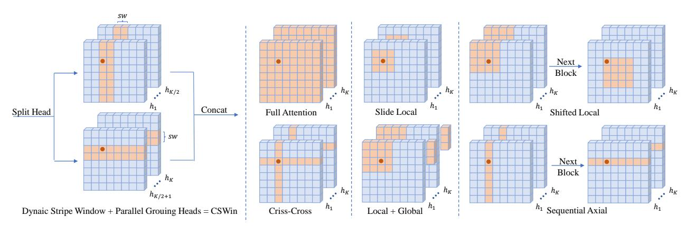
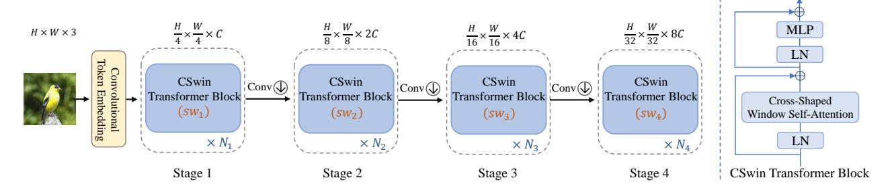
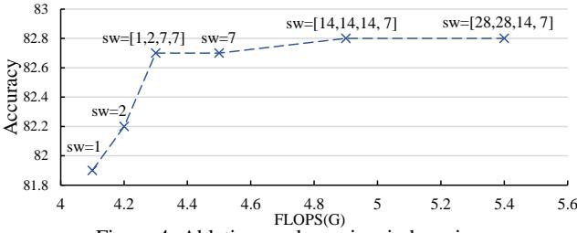

# CSWin Transformer: A General Vision Transformer Backbone with Cross-Shaped Windows

Xiaoyi Dong1\*, Jianmin Bao2, Dongdong Chen3, Weiming Zhang1, Nenghai Yu1, Lu Yuan3, Dong Chen2, Baining Guo2

1University of Science and Technology of China

2Microsoft Research Asia 3Microsoft Cloud + AI

{dlight@mail., zhangwm@, ynh@}.ustc.edu.cn cddlyf@gmail.com {jianbao, luyuan, doch, bainguo }@microsoft.com

## **Abstract**

We present CSWin Transformer, an efficient and effective Transformer-based backbone for general-purpose vision tasks. A challenging issue in Transformer design is that global self-attention is very expensive to compute whereas local self-attention often limits the field of interactions of each token. To address this issue, we develop the Cross-Shaped Window self-attention mechanism for computing self-attention in the horizontal and vertical stripes in parallel that form a cross-shaped window, with each stripe obtained by splitting the input feature into stripes of equal width. We provide a mathematical analysis of the effect of the stripe width and vary the stripe width for different layers of the Transformer network which achieves strong modeling capability while limiting the computation cost. We also introduce Locally-enhanced Positional Encoding (LePE), which handles the local positional information better than existing encoding schemes. LePE naturally supports arbitrary input resolutions, and is thus especially effective and friendly for downstream tasks. Incorporated with these designs and a hierarchical structure, CSWin Transformer demonstrates competitive performance on common vision tasks. Specifically, it achieves 85.4% Top-1 accuracy on ImageNet-1K without any extra training data or label, **53.9** box AP and **46.4** mask AP on the COCO detection task, and 52.2 mIOU on the ADE20K semantic segmentation task, surpassing previous state-of-the-art Swin Transformer backbone by +1.2, +2.0, +1.4, and +2.0 respectively under the similar FLOPs setting. By further pretraining on the larger dataset ImageNet-21K, we achieve 87.5% Top-1 accuracy on ImageNet-1K and high segmentation performance on ADE20K with 55.7 mIoU.

## 1. Introduction

Transformer-based architectures [17,38,53,60] have recently achieved competitive performances compared to their CNN counterparts in various vision tasks. By leveraging the multi-head self-attention mechanism, these vision Transformers demonstrate a high capability in modeling the longrange dependencies, which is especially helpful for handling high-resolution inputs in downstream tasks, *e.g.*, object detection and segmentation. Despite the success, the Transformer architecture with full-attention mechanism [17] is computationally inefficient.

To improve the efficiency, one typical way is to limit the attention region of each token from full-attention to local/windowed attention [38,55]. To bridge the connection between windows, researchers further proposed halo and shift operations to exchange information through nearby windows. However, the receptive field is enlarged quite slowly and it requires stacking a great number of blocks to achieve global self-attention. A sufficiently large receptive field is crucial to the performance especially for the downstream tasks(*e.g.*, object detection and segmentation). Therefore it is important to achieve large receptive filed efficiently while keeping the computation cost low.

In this paper, we present the *Cross-Shaped Window* (CSWin) self-attention, which is illustrated in Figure 1 and compared with existing self-attention mechanisms. With CSWin self-attention, we perform the self-attention calculation in the horizontal and vertical stripes in parallel, with each stripe obtained by splitting the input feature into stripes of equal width. This stripe width is an important parameter of the cross-shaped window because it allows us to achieve strong modelling capability while limiting the computation cost. Specifically, we adjust the stripe width according to the depth of the network: small widths for shallow layers and larger widths for deep layers. A larger stripe width encourages a stronger connection between long-range elements and

\*Work done during an internship at Microsoft Research Asia.

Figure 1. Illustration of different self-attention mechanisms, our CSWin is fundamentally different from two aspects. First, we split multi-heads ( $\{h_1, \ldots, h_K\}$ ) into two groups and perform self-attention in horizontal and vertical stripes simultaneously. Second, we adjust the stripe width according to the depth network, which can achieve better trade-off between computation cost and capability

achieves better network capacity with a small increase in computation cost. We will provide a mathematical analysis of how the stripe width affects the modeling capability and computation cost.

It is worthwhile to note that with CSWin self-attention mechanism, the self-attention in horizontal and vertical stripes are calculated in parallel. We split the multi-heads into **parallel** groups and apply different self-attention operations onto different groups. This parallel strategy introduces no extra computation cost while enlarging the area for computing self-attention within each Transformer block. This strategy is fundamentally different from existing self-attention mechanisms [25, 38, 56, 69] that apply the same attention operation across multi-heads((Figure 1 b,c,d,e), and perform different attention operations **sequentially**(Figure 1 c,e). We will show through ablation analysis that this difference makes CSWin self-attention much more effective for general vision tasks.

Based on the CSWin self-attention mechanism, we follow the hierarchical design and propose a new vision Transformer architecture named "CSWin Transformer" for general-purpose vision tasks. This architecture provides significantly stronger modeling power while limiting computation cost. To further enhance this vision Transformer, we introduce an effective positional encoding, *Locally-enhanced Positional Encoding* (LePE), which is especially effective and friendly for input varying downstream tasks such as object detection and segmentation. Compared with previous positional encoding methods [12, 46, 56], our LePE imposes the positional information within each Transformer block and directly operates on the attention results instead of the attention calculation. The LePE makes CSWin Transformer more effective and friendly for the downstream tasks.

As a general vision Transformer backbone, the CSWin Transformer demonstrates strong performance on image classification, object detection and semantic segmentation tasks. Under the similar FLOPs and model size, CSWin Trans-

former variants significantly outperforms previous state-of-the-art (SOTA) vision Transformers. For example, our base variant CSWin-B achieves **85.4%** Top-1 accuracy on ImageNet-1K without any extra training data or label, **53.9** box AP and **46.4** mask AP on the COCO detection task, **51.7** mIOU on the ADE20K semantic segmentation task, surpassing previous state-of-the-art Swin Transformer counterpart by **+1.2**, **+2.0**, **1.4** and **+2.0** respectively. Under a smaller FLOPs setting, our tiny variant CSWin-T even shows larger performance gains, *i.e.*,, **+1.4** point on ImageNet classification, **+3.0** box AP, **+2.0** mask AP on COCO detection and **+4.6** on ADE20K segmentation. Furthermore, when pretraining CSWin Transformer on the larger dataset ImageNet-21K, we achieve **87.5%** Top-1 accuracy on ImageNet-1K and high segmentation performance on ADE20K with **55.7** mIoU.

#### 2. Related Work

Convolutional neural networks Vision Transformers. (CNN) have dominated the computer vision field for many years and achieved tremendous successes [7, 22, 26–28, 35, 45, 47, 49–51]. Recently, the pioneering work ViT [17] demonstrates that pure Transformer-based architectures can also achieve very competitive results, indicating the potential of handling the vision tasks and natural language processing (NLP) tasks under a unified framework. Built upon the success of ViT, many efforts have been devoted to designing better Transformer based architectures for various vision tasks, including low-level image processing [5,57], image classification [11, 11, 13, 18, 20, 23, 31, 53, 54, 58, 60, 64–66], object detection [3, 73] and semantic segmentation [48, 59, 70]. Rather than concentrating on one special task, some recent works [38, 58, 69] try to design a general vision Transformer backbone for general-purpose vision tasks. They all follow the hierarchical Transformer architecture but adopt different self-attention mechanisms. The main benefit of the hierarchical design is to utilize the multi-scale features and reduce the computation complexity by progressively decreas-

Figure 2. Left: the overall architecture of our proposed CSWin Transformer, Right: the illustration of CSWin Transformer block.

ing the number of tokens. In this paper,we propose a new hierarchical vision Transformer backbone by introducing cross-shaped window self-attention and locally-enhanced positional encoding.

Efficient Self-attentions. In the NLP field, many efficient attention mechanisms [1, 9, 10, 32, 34, 42, 44, 52] have been designed to improve the Transformer efficiency for handling long sequences. Since the image resolution is often very high in vision tasks, designing efficient self-attention mechanisms is also very crucial. However, many existing vision Transformers [17, 53, 60, 66] still adopt the original full self-attention, whose computation complexity is quadratic to the image size. To reduce the complexity, the recent vision Transformers [38, 55] adopt the local self-attention mechanism [43] and its shifted/haloed version to add the interaction across different local windows. Besides, axial self-attention [25] and criss-cross attention [30] propose calculating attention within stripe windows along horizontal or/and vertical axis. While the performance of axial attention is limited by its sequential mechanism and restricted window size, criss-cross attention is inefficient in practice due to its overlapped window design and ineffective due to its restricted window size. They are the most related works with our CSWin, which could be viewed as a much general and efficient format of these previous works.

Positional Encoding. Since self-attention is permutationinvariant and ignores the token positional information, positional encoding is widely used in Transformers to add such positional information back. Typical positional encoding mechanisms include absolute positional encoding (APE) [56], relative positional encoding (RPE) [38,46] and conditional positional encoding (CPE) [12]. APE and RPE are often defined as the sinusoidal functions of a series of frequencies or the learnable parameters, which are designed for a specific input size and are not friendly to varying input resolutions. CPE takes the feature as input and can generate the positional encoding for arbitrary input resolutions. Then the generated positional encoding will be added onto the input feature. Our LePE shares a similar spirit as CPE, but proposes to add the positional encoding as a parallel module to the self-attention operation and operates on projected values in each Transformer block. This design decouples

positional encoding from the self-attention calculation, and can enforce stronger local inductive bias.

## 3. Method

#### 3.1. Overall Architecture

The overall architecture of CSWin Transformer is illustrated in Figure 2. For an input image with size of  $H \times W \times 3$ , we follow [60] and leverage the overlapped convolutional token embedding ( $7 \times 7$  convolution layer with stride 4)) to obtain  $\frac{H}{4} \times \frac{W}{4}$  patch tokens, and the dimension of each token is C. To produce a hierarchical representation, the whole network consists of four stages. A convolution layer  $(3 \times 3$ , stride 2) is used between two adjacent stages to reduce the number of tokens and double the channel dimension. Therefore, the constructed feature maps have  $\frac{H}{2^{i+1}} \times \frac{W}{2^{i+1}}$  tokens for the  $i^{th}$  stage, which is similar to traditional CNN backbones like VGG/ResNet. Each stage consists of  $N_i$ sequential CSWin Transformer Blocks and maintains the number of tokens. CSWin Transformer Block has the overall similar topology as the vanilla multi-head self-attention Transformer block with two differences: 1) It replaces the self-attention mechanism with our proposed Cross-Shaped Window Self-Attention; 2) In order to introduce the local inductive bias, LePE is added as a parallel module to the self-attention branch.

# 3.2. Cross-Shaped Window Self-Attention

Despite the strong long-range context modeling capability, the computation complexity of the original full self-attention mechanism is quadratic to feature map size. Therefore, it will suffer from huge computation cost for vision tasks that take high resolution feature maps as input, such as object detection and segmentation. To alleviate this issue, existing works [38,55] suggest to perform self-attention in a local attention window and apply halo or shifted window to enlarge the receptive filed. However, the token within each Transformer block still has limited attention area and requires stacking more blocks to achieve global receptive filed. To enlarge the attention area and achieve global self-attention more efficiently, we present the cross-shaped window self-attention mechanism, which is achieved by performing self-attention in horizontal and vertical stripes in parallel that

$$X \longrightarrow X' \xrightarrow{Q} SoftMax(\frac{QK^T}{\sqrt{D}})V$$

$$X \longrightarrow X \xrightarrow{Q} SoftMax(\frac{QK^T}{\sqrt{D}})V \longrightarrow LePE(V)$$

$$X \longrightarrow X \xrightarrow{Q} SoftMax(\frac{QK^T}{\sqrt{D}})V \longrightarrow LePE(V)$$

$$X \longrightarrow X \xrightarrow{Q} SoftMax(\frac{QK^T}{\sqrt{D}})V \longrightarrow LePE(V)$$

$$X \longrightarrow X \xrightarrow{Q} SoftMax(\frac{QK^T}{\sqrt{D}})V \longrightarrow LePE(V)$$

$$X \longrightarrow X \xrightarrow{Q} SoftMax(\frac{QK^T}{\sqrt{D}})V \longrightarrow LePE(V)$$

$$X \longrightarrow X \xrightarrow{Q} SoftMax(\frac{QK^T}{\sqrt{D}})V \longrightarrow LePE(V)$$

$$X \longrightarrow X \xrightarrow{Q} SoftMax(\frac{QK^T}{\sqrt{D}})V \longrightarrow LePE(V)$$

$$X \longrightarrow X \xrightarrow{Q} SoftMax(\frac{QK^T}{\sqrt{D}})V \longrightarrow LePE(V)$$

$$X \longrightarrow X \xrightarrow{Q} SoftMax(\frac{QK^T}{\sqrt{D}})V \longrightarrow LePE(V)$$

$$X \longrightarrow X \xrightarrow{Q} SoftMax(\frac{QK^T}{\sqrt{D}})V \longrightarrow LePE(V)$$

$$X \longrightarrow X \xrightarrow{Q} SoftMax(\frac{QK^T}{\sqrt{D}})V \longrightarrow LePE(V)$$

$$X \longrightarrow X \xrightarrow{Q} SoftMax(\frac{QK^T}{\sqrt{D}})V \longrightarrow LePE(V)$$

$$X \longrightarrow X \xrightarrow{Q} SoftMax(\frac{QK^T}{\sqrt{D}})V \longrightarrow LePE(V)$$

Figure 3. Comparison among different positional encoding mechanisms: APE and CPE introduce the positional information before feeding into the Transformer blocks, while RPE and our LePE operate in each Transformer block. Different from RPE that adds the positional information into the attention calculation, our LePE operates directly upon V and acts as a parallel module. \* Here we only draw the self-attention part to represent the Transformer block for simplicity.

form a cross-shaped window.

**Horizontal and Vertical Stripes.** According to the multihead self-attention mechanism, the input feature  $X \in \mathbf{R}^{(H \times W) \times C}$  will be first linearly projected to K heads, and then each head will perform local self-attention within either the horizontal or vertical stripes.

For horizontal stripes self-attention, X is evenly partitioned into non-overlapping horizontal stripes  $[X^1,...,X^M]$  of equal width sw, and each of them contains  $sw \times W$  tokens. Here, sw is the stripe width and can be adjusted to balance the learning capacity and computation complexity. Formally, suppose the projected queries, keys and values of the  $k^{th}$  head all have dimension  $d_k$ , then the output of the horizontal stripes self-attention for  $k^{th}$  head is defined as:

$$\begin{split} X &= [X^1, X^2, \dots, X^M], \\ Y_k^i &= \operatorname{Attention}(X^i W_k^Q, X^i W_k^K, X^i W_k^V), \\ \operatorname{H-Attention}_k(X) &= [Y_k^1, Y_k^2, \dots, Y_k^M] \end{split} \tag{1}$$

Where where  $X^i \in \mathbf{R}^{(sw \times W) \times C}$  and  $M = H/sw, i = 1, \ldots, M.$   $W_k^Q \in \mathbf{R}^{C \times d_k}, W_k^K \in \mathbf{R}^{C \times d_k}, W_k^V \in \mathbf{R}^{C \times d_k}$  represent the projection matrices of queries, keys and values for the  $k^{th}$  head respectively, and  $d_k$  is set as C/K. The vertical stripes self-attention can be similarly derived, and its output for  $k^{th}$  head is denoted as V-Attention $_k(X)$ .

Assuming natural images do not have directional bias, we equally split the K heads into two parallel groups (each has K/2 heads, K is often an even value). The first group of heads perform horizontal stripes self-attention while the second group of heads perform vertical stripes self-attention. Finally the output of these two parallel groups will be concatenated back together.

 $CSWin-Attention(X) = Concat(head_1, ..., head_K)W^O$ 

$$\operatorname{head}_{k} = \begin{cases} \operatorname{H-Attention}_{k}(X) & k = 1, \dots, K/2 \\ \operatorname{V-Attention}_{k}(X) & k = K/2 + 1, \dots, K \end{cases}$$
 (2)

Where  $W^O \in \mathbf{R}^{C \times C}$  is the commonly used projection matrix that projects the self-attention results into the target output dimension (set as C by default). As described above, one key insight in our self-attention mechanism design is splitting the multi-heads into different groups and applying different self-attention operations accordingly. In other words, the attention area of each token within one Transformer block is enlarged via multi-head grouping. By

contrast, existing self-attention mechanisms apply the same self-attention operations across different multi-heads. In the experiment parts, we will show that this design will bring better performance.

**Computation Complexity Analysis.** The computation complexity of CSWin self-attention is:

$$\Omega(CSWin) = HWC * (4C + sw * H + sw * W)$$
 (3)

For high-resolution inputs, considering H,W will be larger than C in the early stages and smaller than C in the later stages, we choose small sw for early stages and larger sw for later stages. In other words, adjusting sw provides the flexibility to enlarge the attention area of each token in later stages in an efficient way. Besides, to make the intermediate feature map size divisible by sw for  $224 \times 224$  input, we empirically set sw to 1, 2, 7, 7 for four stages by default.

Locally-Enhanced Positional Encoding. Since the selfattention operation is permutation-invariant, it will ignore the important positional information within the 2D image. To add such information back, different positional encoding mechanisms have been utilized in existing vision Transformers. In Figure 3, we show some typical positional encoding mechanisms and compare them with our proposed locallyenhanced positional encoding. In details, APE [56] and CPE [12] add the positional information into the input token before feeding into the Transformer blocks, while RPE [46] and our LePE incorporate the positional information within each Transformer block. But different from RPE that adds the positional information within the attention calculation (i.e., Softmax $(QK^T)$ ), we consider a more straightforward manner and impose the positional information upon the linearly projected values. Meanwhile, we notice that RPE introduces bias in a per head manner, while our LePE is a per-channel bias, which may show more potential to serve as positional embeddings.

Mathematically, we denote the input sequence as  $x = (x_1, \ldots, x_n)$  of n elements, and the output of the attention  $z = (z_1, \ldots, z_n)$  of the same length, where  $x_i, z_i \in \mathbb{R}^C$ . Self-attention computation could be formulated as:

$$z_i = \sum_{j=1}^n \alpha_{ij} v_j, \alpha_{ij} = exp(q_i^T k_j / \sqrt{d})$$
 (4)

where  $q_i, k_i, v_i$  are the queue, key and value get by a linear transformation of the input  $x_i$  and d is the feature

| Models  | #Dim | #Blocks  | sw      | #heads     | #Param. | FLOPs |
|---------|------|----------|---------|------------|---------|-------|
| CSWin-T | 64   | 1,2,21,1 | 1,2,7,7 | 2,4,8,16   | 23M     | 4.3G  |
| CSWin-S | 64   | 2,4,32,2 | 1,2,7,7 | 2,4,8,16   | 35M     | 6.9G  |
| CSWin-B | 96   | 2,4,32,2 | 1,2,7,7 | 4,8,16,32  | 78M     |       |
| CSWin-L | 144  | 2,4,32,2 | 1,2,7,7 | 6,12,24,48 | 173M    | 31.5G |

Table 1. Detailed configurations of different variants of CSWin Transformer. The FLOPs are calculated with  $224 \times 224$  input.

dimension. Then our Locally-Enhanced position encoding performs as a learnable per-element bias and Eq.4 could be formulated as:

$$z_i^k = \sum_{j=1}^n (\alpha_{ij}^k + \beta_{ij}^k) v_j^k$$
 (5)

where  $z_i^k$  represents the  $k^{th}$  element of vector  $z_i$ . To make the LePE suitable to varying input size, we set a distance threshold to the LePE and set it to 0 if the Chebyshev distance of token i and j is greater than a threshold  $\tau$  ( $\tau=3$  in the default setting).

## 3.3. CSWin Transformer Block

Equipped with the above self-attention mechanism and positional embedding mechanism, CSWin Transformer block is formally defined as:

$$\begin{split} \hat{X}^{l} &= \text{CSWin-Attention}\left(\text{LN}\left(X^{l-1}\right)\right) + X^{l-1}, \\ X^{l} &= \text{MLP}\left(\text{LN}\left(\hat{X}^{l}\right)\right) + \hat{X}^{l}, \end{split} \tag{6}$$

where  $X^l$  denotes the output of l-th Transformer block or the precedent convolutional layer of each stage.

#### 3.4. Architecture Variants

For a fair comparison with other vision Transformers under similar settings, we build four different variants of CSWin Transformer as shown in Table 1: CSWin-T (Tiny), CSWin-S (Small), CSWin-B (Base), CSWin-L (Large). They are designed by changing the base channel dimension C and the block number of each stage. In all these variants, the expansion ratio of each MLP is set as 4. The head number of the four stages is set as 2,4,8,16 in the first three variants and 6,12,24,48 in the last variant respectively.

#### 4. Experiments

To show the effectiveness of CSWin Transformer as a general vision backbone, we conduct experiments on ImageNet-1K [16] classification, COCO [37] object detection, and ADE20K [72] semantic segmentation. We also perform comprehensive ablation studies to analyze each component of CSWin Transformer. As most of the methods we compared did not report downstream inference speed, we use an extra section to report it for simplicity.

| Method                    | Image Size | #Param. | FLOPs | Throughput | Top-1 |
|---------------------------|------------|---------|-------|------------|-------|
| Eff-B4 [51]               | $380^{2}$  | 19M     | 4.2G  | 349/s      | 82.9  |
| Eff-B5 [51]               | $456^{2}$  | 30M     | 9.9G  | 169/s      | 83.6  |
| Eff-B6 [51]               | $528^{2}$  | 43M     | 19.0G | 96/s       | 84.0  |
| DeiT-S [53]               | $224^{2}$  | 22M     | 4.6G  | 940/s      | 79.8  |
| DeiT-B [53]               | $224^{2}$  | 87M     | 17.5G | 292/s      | 81.8  |
| DeiT-B [53]               | $384^{2}$  | 86M     | 55.4G | 85/s       | 83.1  |
| PVT-S [58]                | $224^{2}$  | 25M     | 3.8G  | 820/s      | 79.8  |
| PVT-M [58]                | $224^{2}$  | 44M     | 6.7G  | 526/s      | 81.2  |
| PVT-L [58]                | $224^{2}$  | 61M     | 9.8G  | 367/s      | 81.7  |
| T2T t -14 [66] | $224^{2}$  | 22M     | 6.1G  | _          | 81.7  |
| $T2T_t$ -19 [66]          | $224^{2}$  | 39M     | 9.8G  | _          | 82.2  |
| T2T t -24 [66] | $224^{2}$  | 64M     | 15.0G | _          | 82.6  |
| CvT-13 [60]               | $224^{2}$  | 20M     | 4.5G  | _          | 81.6  |
| CvT-21 [60]               | $224^{2}$  | 32M     | 7.1G  | _          | 82.5  |
| CvT-21 [60]               | $384^{2}$  | 32M     | 24.9G | -          | 83.3  |
| Swin-T [38]               | $224^{2}$  | 29M     | 4.5G  | 755/s      | 81.3  |
| Swin-S [38]               | $224^{2}$  | 50M     | 8.7G  | 437/s      | 83.0  |
| Swin-B [38]               | $224^{2}$  | 88M     | 15.4G | 278/s      | 83.3  |
| Swin-B [38]               | $384^{2}$  | 88M     | 47.0G | 85/s       | 84.2  |
| CSWin-T                   | $224^{2}$  | 23M     | 4.3G  | 701/s      | 82.7  |
| CSWin-S                   | $224^{2}$  | 35M     | 6.9G  | 437/s      | 83.6  |
| CSWin-B                   | $224^{2}$  | 78M     | 15.0G | 250/s      | 84.2  |
| CSWin-B                   | $384^{2}$  | 78M     | 47.0G |            | 85.4  |

Table 2. Comparison of different models on ImageNet-1K.

| Method   | Param Siz                         | e FLOPs                                  | Top-1               | Method   | Param Size      | FLOPs                                     | Top-1               |
|----------|-----------------------------------|------------------------------------------|---------------------|----------|-----------------|-------------------------------------------|---------------------|
| R-101x3  | 388M 384                          | 2 204.6G                      | 84.4                | R-152x4  | 937M 480        | 2 840.5G                       | 85.4                |
| ViT-B/16 | 86M 384                           | 2 55.4G                       | 84.0                | ViT-L/16 | 307M 384        | 2 190.7G                       | 85.2                |
| Swin-B   | 88M 224 384         | 2 15.4G 2 47.1G | 85.2 86.4        | Swin-L   | 197M 224 384 | 2 34.5G 2 103.9G | 86.3 87.3        |
| CSWin-B  | 78M 224 384 | 2 15.0G 2 47.0G | 85.9 <b>87.0</b> | CSWin-L  | 173M 224        | 2 31.5G 2 96.8G  | 86.5 <b>87.5</b> |

Table 3. ImageNet-1K fine-tuning results by pre-training on ImageNet-21K datasets.

#### 4.1. ImageNet-1K Classification

For fair comparison, we follow the training strategy in DeiT [53] as other baseline Transformer architectures [38, 60]. Specifically, all our models are trained for 300 epochs with the input size of  $224 \times 224$ . We use the AdamW optimizer with weight decay of 0.05 for CSWin-T/S and 0.1 for CSWin-B. The default batch size and initial learning rate are set to 1024 and 0.001, and the cosine learning rate scheduler with 20 epochs linear warm-up is used. We apply increasing stochastic depth [29] augmentation for CSWin-T, CSWin-S, and CSWin-B with the maximum rate as 0.1, 0.3, 0.5 respectively. When reporting the results of  $384 \times 384$  input, we fine-tune the models for 30 epochs with the weight

| Backbone      | #Params | FLOPs |        |             | k R-CN      | N 1x sch |             |             |          |             |             | x + MS | schedule    |             |
|---------------|---------|-------|--------|-------------|-------------|----------|-------------|-------------|----------|-------------|-------------|--------|-------------|-------------|
| Dackbone      | (M)     | (G)   | $AP^b$ | $AP_{50}^b$ | $AP_{75}^b$ | $AP^m$   | $AP_{50}^m$ | $AP_{75}^m$ | $AP^b$   | $AP_{50}^b$ | $AP_{75}^b$ | $AP^m$ | $AP_{50}^m$ | $AP_{75}^m$ |
| Res50 [22]    | 44      | 260   | 38.0   | 58.6        | 41.4        | 34.4     | 55.1        | 36.7        | 41.0     | 61.7        | 44.9        | 37.1   | 58.4        | 40.1        |
| PVT-S [58]    | 44      | 245   | 40.4   | 62.9        | 43.8        | 37.8     | 60.1        | 40.3        | 43.0     | 65.3        | 46.9        | 39.9   | 62.5        | 42.8        |
| ViL-S [69]    | 45      | 218   | 44.9   | 67.1        | 49.3        | 41.0     | 64.2        | 44.1        | 47.1     | 68.7        | 51.5        | 42.7   | 65.9        | 46.2        |
| TwinsP-S [11] | 44      | 245   | 42.9   | 65.8        | 47.1        | 40.0     | 62.7        | 42.9        | 46.8     | 69.3        | 51.8        | 42.6   | 66.3        | 46.0        |
| Twins-S [11]  | 44      | 228   | 43.4   | 66.0        | 47.3        | 40.3     | 63.2        | 43.4        | 46.8     | 69.2        | 51.2        | 42.6   | 66.3        | 45.8        |
| Swin-T [38]   | 48      | 264   | 42.2   | 64.6        | 46.2        | 39.1     | 61.6        | 42.0        | 46.0     | 68.2        | 50.2        | 41.6   | 65.1        | 44.8        |
| CSWin-T       | 42      | 279   | 46.7   | 68.6        | 51.3        | 42.2     | 65.6        | 45.4        | 49.0     | 70.7        | 53.7        | 43.6   | 67.9        | 46.6        |
| Res101 [22]   | 63      | 336   | 40.4   | 61.1        | 44.2        | 36.4     | 57.7        | 38.8        | 42.8     | 63.2        | 47.1        | 38.5   | 60.1        | 41.3        |
| X101-32 [63]  | 63      | 340   | 41.9   | 62.5        | 45.9        | 37.5     | 59.4        | 40.2        | 44.0     | 64.4        | 48.0        | 39.2   | 61.4        | 41.9        |
| PVT-M [58]    | 64      | 302   | 42.0   | 64.4        | 45.6        | 39.0     | 61.6        | 42.1        | 44.2     | 66.0        | 48.2        | 40.5   | 63.1        | 43.5        |
| ViL-M [69]    | 60      | 261   | 43.4   |             |             | 39.7     |             |             | 44.6     | 66.3        | 48.5        | 40.7   | 63.8        | 43.7        |
| TwinsP-B [11] | 64      | 302   | 44.6   | 66.7        | 48.9        | 40.9     | 63.8        | 44.2        | 47.9     | 70.1        | 52.5        | 43.2   | 67.2        | 46.3        |
| Twins-B [11]  | 76      | 340   | 45.2   | 67.6        | 49.3        | 41.5     | 64.5        | 44.8        | 48.0     | 69.5        | 52.7        | 43.0   | 66.8        | 46.6        |
| Swin-S [38]   | 69      | 354   | 44.8   | 66.6        | 48.9        | 40.9     | 63.4        | 44.2        | 48.5     | 70.2        | 53.5        | 43.3   | 67.3        | 46.6        |
| CSWin-S       | 54      | 342   | 47.9   | 70.1        | 52.6        | 43.2     | 67.1        | 46.2        | 50.0     | 71.3        | 54.7        | 44.5   | 68.4        | 47.7        |
| X101-64 [63]  | 101     | 493   | 42.8   | 63.8        | 47.3        | 38.4     | 60.6        | 41.3        | 44.4     | 64.9        | 48.8        | 39.7   | 61.9        | 42.6        |
| PVT-L [58]    | 81      | 364   | 42.9   | 65.0        | 46.6        | 39.5     | 61.9        | 42.5        | 44.5     | 66.0        | 48.3        | 40.7   | 63.4        | 43.7        |
| ViL-B [69]    | 76      | 365   | 45.1   |             |             | 41.0     |             |             | 45.7     | 67.2        | 49.9        | 41.3   | 64.4        | 44.5        |
| TwinsP-L [11] | 81      | 364   | 45.4   |             |             | 41.5     |             |             | <u> </u> |             |             |        |             |             |
| Twins-L [11]  | 111     | 474   | 45.9   |             |             | 41.6     |             |             |          |             |             |        |             |             |
| Swin-B [38]   | 107     | 496   | 46.9   |             |             | 42.3     |             |             | 48.5     | 69.8        | 53.2        | 43.4   | 66.8        | 46.9        |
| CSWin-B       | 97      | 526   | 48.7   | 70.4        | 53.9        | 43.9     | 67.8        | 47.3        | 50.8     | 72.1        | 55.8        | 44.9   | 69.1        | 48.3        |

Table 4. Object detection and instance segmentation performance on the COCO val2017 with the Mask R-CNN framework. The FLOPs (G) are measured at resolution  $800 \times 1280$ , and the models are pre-trained on the ImageNet-1K. ResNet/ResNeXt results are copied from [58].

decay of 1e-8, learning rate of 1e-5, batch size of 512.

In Table 11, we compare our CSWin Transformer with state-of-the-art CNN and Transformer architectures. With the limitation of pages, we only compare with a few classical methods here and make a comprehensive comparison in the supplemental materials.

It shows that our CSWin Transformers outperform previous state-of-the-art vision Transformers by large margins. For example, CSWin-T achieves 82.7% Top-1 accuracy with only 4.3G FLOPs, surpassing CvT-13, Swin-T and DeiT-S by 1.1%, 1.4% and 2.9% respectively. And for the small and base model setting, our CSWin-S and CSWin-B also achieve the best performance. When finetuned on the  $384 \times 384$  input, a similar trend is observed, which well demonstrates the powerful learning capacity of our CSWin Transformers.

Compared with state-of-the-art CNNs, we find our CSWin Transformer is the only Transformer based architecture that achieves comparable or even better results than Efficient-Net [51] under the small and base settings, while using less computation complexity. It is also worth noting that neural architecture search is used in EfficientNet but not in our CSWin Transformer design.

We further pre-train CSWin Transformer on ImageNet-21K dataset, which contains 14.2M images and 21K classes. Models are trained for 90 epochs with the input size of  $224 \times 224$ . We use the AdamW optimizer with weight decay of 0.1 for CSWin-B and 0.2 for CSWin-L, and the default batch size and initial learning rate are set to 2048 and 0.001. When fine-tuning on ImageNet-1K, we train the models for 30 epochs with the weight decay of 1e-8, learning rate of 1e-5, batch size of 512. The increasing stochastic depth [29]

| Backbone     | #Params (M) | FLOPs (G) | $AP^b$ |        | Mask $AP_{75}^b$ | $R$ -CNN $AP^m$ |        | $AP_{75}^m$ |
|--------------|----------------|--------------|--------|--------|------------------|-----------------|--------|-------------|
|              | (141)          | (0)          | 711    | 711 50 | 111 75           | 711             | 111 50 | 711 75      |
| Res50 [22]   | 82             | 739          | 46.3   | 64.3   | 50.5             | 40.1            | 61.7   | 43.4        |
| Swin-T [38]  | 86             | 745          | 50.5   | 69.3   | 54.9             | 43.7            | 66.6   | 47.1        |
| CSWin-T      | 80             | 757          | 52.5   | 71.5   | 57.1             | 45.3            | 68.8   | 48.9        |
| X101-32 [63] | 101            | 819          | 48.1   | 66.5   | 52.4             | 41.6            | 63.9   | 45.2        |
| Swin-S [38]  | 107            | 838          | 51.8   | 70.4   | 56.3             | 44.7            | 67.9   | 48.5        |
| CSWin-S      | 92             | 820          | 53.7   | 72.2   | 58.4             | 46.4            | 69.6   | 50.6        |
| X101-64 [63] | 140            | 972          | 48.3   | 66.4   | 52.3             | 41.7            | 64.0   | 45.1        |
| Swin-B [38]  | 145            | 982          | 51.9   | 70.9   | 56.5             | 45.0            | 68.4   | 48.7        |
| CSWin-B      | 135            | 1004         | 53.9   | 72.6   | 58.5             | 46.4            | 70.0   | 50.4        |

Table 5. Object detection and instance segmentation performance on the COCO val2017 with Cascade Mask R-CNN.

augmentation for both CSWin-B and CSWin-L is set to 0.1. Table.3 reports the results of pre-training on ImageNet-21K. Compared to the results of CSWin-B pre-trained on ImageNet-1K, the large-scale data of ImageNet-21K brings a 1.6%~1.7% gain. CSWin-B and CSWin-L achieve 87.0% and 87.5% top-1 accuracy, surpassing previous methods.

#### 4.2. COCO Object Detection

Next, we evaluate CSWin Transformer on the COCO objection detection task with the Mask R-CNN [21] and Cascade Mask R-CNN [2] framework respectively. Specifically, we pretrain the backbones on the ImageNet-1K dataset and follow the finetuning strategy used in Swin Transformer [38] on the COCO training set.

We compare CSWin Transformer with various backbones: previous CNN backbones ResNet [22], ResNeXt(X) [62], and Transformer backbones PVT [58], Twins [11], and Swin [38]. Table 4 reports the results of the Mask R-CNN

|               |         | . EDV | T 0.01 |         | T T .   | 1.601        |
|---------------|---------|-------|--------|---------|---------|--------------|
| Backbone      | Seman   |       |        |         | Upernet |              |
|               | #Param. | FLOPS | smioU  | #Param. | FLOPS   | SS/MS mIoU   |
| Res50 [22]    | 28.5    | 183   | 36.7   |         |         | <b>/</b>     |
| PVT-S [58]    | 28.2    | 161   | 39.8   |         |         | <b>/</b>     |
| TwinsP-S [11] | 28.4    | 162   | 44.3   | 54.6    | 919     | 46.2/47.5    |
| Twins-S [11]  | 28.3    | 144   | 43.2   | 54.4    | 901     | 46.2/47.1    |
| Swin-T [38]   | 31.9    | 182   | 41.5   | 59.9    | 945     | 44.5/45.8    |
| CSWin-T       | 26.1    | 202   | 48.2   | 59.9    | 959     | 49.3/50.7    |
| Res101 [22]   | 47.5    | 260   | 38.8   | 86.0    | 1029    | <b>/44.9</b> |
| PVT-M [58]    | 48.0    | 219   | 41.6   |         |         | /            |
| TwinsP-B [11] | 48.1    | 220   | 44.9   | 74.3    | 977     | 47.1/48.4    |
| Twins-B [11]  | 60.4    | 261   | 45.3   | 88.5    | 1020    | 47.7/48.9    |
| Swin-S [38]   | 53.2    | 274   | 45.2   | 81.3    | 1038    | 47.6/49.5    |
| CSWin-S       | 38.5    | 271   | 49.2   | 64.6    | 1027    | 50.4/51.5    |
| X101-64 [63]  | 86.4    | _     | 40.2   |         |         | /            |
| PVT-L [58]    | 65.1    | 283   | 42.1   |         |         | /            |
| TwinsP-L [11] | 65.3    | 283   | 46.4   | 91.5    | 1041    | 48.6/49.8    |
| Twins-L [11]  | 103.7   | 404   | 46.7   | 133.0   | 1164    | 48.8/50.2    |
| Swin-B [38]   | 91.2    | 422   | 46.0   | 121.0   | 1188    | 48.1/49.7    |
| CSWin-B       | 81.2    | 464   | 49.9   | 109.2   | 1222    | 51.1/52.2    |
| Swin-B† [38]  | l —     |       |        | 121.0   | 1841    | 50.0/51.7    |
| Swin-L† [38]  |         | —     |        | 234.0   | 3230    | 52.1/53.5    |
| CSWin-B†      |         |       |        | 109.2   | 1941    | 51.8/52.6    |
| CSWin-L†      |         |       |        | 207.7   | 2745    | 54.0/55.7    |
|               |         |       |        |         |         |              |

Table 6. Performance comparison of different backbones on the ADE20K segmentation task. Two different frameworks semantic FPN and Upernet are used. FLOPs are calculated with resolution  $512 \times 2048$ . ResNet/ResNeXt results and Swin FPN results are copied from [58] and [11] respectively. † means the model is pretrained on ImageNet-21K and finetuned with  $640 \times 640$  resolution.

framework with "1×" (12 training epoch) and "3 × +MS" (36 training epoch with multi-scale training) schedule. It shows that our CSWin Transformer variants clearly outperforms all the CNN and Transformer counterparts. In details, our CSWin-T outperforms Swin-T by +4.5 box AP, +3.1 mask AP with the  $1\times$  schedule and +3.0 box AP, +2.0 mask AP with the  $3\times$  schedule respectively. We also achieve similar performance gain on small and base configuration.

Table 5 reports the results with the Cascade Mask R-CNN framework. Though Cascade Mask R-CNN is overall stronger than Mask R-CNN, we observe CSWin Transformers still surpass the counterparts by promising margins under different model configurations.

#### 4.3. ADE20K Semantic Segmentation

We further investigate the capability of CSWin Transformer for Semantic Segmentation on the ADE20K [72] dataset. Here we employ the semantic FPN [33] and Upernet [61] as the basic framework. For fair comparison, we follow previous works [38,58] and train Semantic FPN 80k iterations with batch size as 16, and Upernet 160k iterations with batch size as 16, more details are provided in the supplementary material. In Table 6, we report the results of different methods in terms of mIoU and Multi-scale tested

| Model   | Cascade |       |      | UperNet on ADE20K |         |       |      |      |  |
|---------|---------|-------|------|-------------------|---------|-------|------|------|--|
| Model   | #Param. | FLOPs | FPS  | $AP^{b/m}$        | #Param. | FLOPs | FPS  | mIoU |  |
| Swin-T  | 86M     | 745G  | 15.3 | 50.5/43.7         | 60M     | 945G  | 18.5 | 44.5 |  |
| CSWin-T | 80M     | 757G  | 14.2 | 52.5/45.3         | 60M     | 959G  | 17.3 | 49.3 |  |
| Swin-S  | 107M    | 838G  | 12.0 | 51.8/44.7         | 81M     | 1038G | 15.2 | 47.6 |  |
| CSWin-S | 92M     | 820G  | 11.7 | 53.7/46.4         | 65M     | 1027G | 15.6 | 50.4 |  |
| Swin-B  | 145M    | 982G  | 11.2 | 51.9/45.0         | 121M    | 1188G | 9.92 | 48.1 |  |
| CSWin-B | 135M    | 1004G | 9.6  | 53.9/46.4         | 109M    | 1222G | 9.08 | 51.1 |  |

Table 7. FPS comparison with Swin on downstream tasks.

mIoU (MS mIoU). It can be seen that, our CSWin Transformers significantly outperform previous state-of-the-arts under different configurations. In details, CSWin-T, CSWin-S, CSWin-B achieve +6.7, +4.0, +3.9 higher mIOU than the Swin counterparts with the Semantic FPN framework, and +4.8, +2.8, +3.0 higher mIOU with the Upernet framework. Compared to the CNN counterparts, the performance gain is very promising and demonstrates the potential of vision Transformers again. When using the ImageNet-21K pretrained model, our CSWin-L further achieves 55.7 mIoU and surpasses the previous best model by +2.2 mIoU, while using less computation complexity.

### 4.4. Inference Speed.

Here we report the inference speed of our CSWin and Swin works. For downstream tasks, we report the FPS of Cascade Mask R-CNN for object detection on COCO and UperNet for semantic segmentation on ADE20K. In most cases, the speed of our model is only slightly slower than Swin (less than 10%), but our model outperforms Swin by large margins. For example, on COCO, CSWin-S are +1.9% box AP and +1.7% mask AP higher than Swin-S with similar inference speed(11.7 FPS vs. 12 FPS). Note that our CSWin-T performs better than Swin-B on box AP(+0.6%), mask AP(+0.3%) with much faster inference speed(14.2 FPS vs. 11.2 FPS), indicating our CSWin achieves better accuracy/FPS trade-offs.

#### 4.5. Ablation Study

To better understand CSWin Transformers, we compare each key component with the previous works under a completely fair setting that we use the same architecture and hyper-parameter for the following experiments, and only vary one component for each ablation. For time consideration, we use Mask R-CNN with 1x schedule as the default setting for detection and instance segmentation evaluation, and Semantic FPN with 80k iterations and single-scale test for segmentation evaluation.

**Parallel Multi-Head Grouping.** We first study the effectiveness of our novel "Parallel Multi-Head Grouping" strategy. Here we compare Axial-Attention [25] and Criss-Cross-Attention [30] **under the CSWin-T backbone**. "Attention region" is used as the computation cost metric for detailed

| Model                   | Attention ImageNet |         |       |     |         | CO      | СО    |      |        | ADE20K |         |       |      |         |
|-------------------------|--------------------|---------|-------|-----|---------|---------|-------|------|--------|--------|---------|-------|------|---------|
|                         | Reigon             | #Param. | FLOPs | FPS | Top1(%) | #Param. | FLOPs | FPS  | $AP^b$ | $AP^m$ | #Param. | FLOPs | FPS  | mIoU(%) |
| Axial                   | Н                  | 23M     | 4.2G  | 735 | 81.8    | 42M     | 258G  | 27.9 | 43.4   | 39.4   | 26M     | 186G  | 50.3 | 42.6    |
| CSWin (fix sw=1)        | Н                  | 23M     | 4.1G  | 721 | 81.9    | 42M     | 258G  | 26.8 | 45.2   | 40.8   | 26M     | 179G  | 49.1 | 47.5    |
| Criss-Cross             | H*2-1              | 23M     | 4.2G  | 187 | 82.2    | 42M     | 263G  | 5.5  | 45.2   | 40.9   | 26M     | 186G  | 17.6 | 47.4    |
| CSWin (fix sw=2)        | H*2                | 23M     | 4.2G  | 718 | 82.2    | 42M     | 263G  | 25.1 | 45.6   | 41.4   | 26M     | 186G  | 47.2 | 47.6    |
| CSWin (sw=1,2,7,7; Seq) | sw×H               | 23M     | 4.3G  | 711 | 82.4    | 42M     | 279G  | 22.3 | 45.1   | 41.1   | 26M     | 202G  | 45.2 | 46.2    |
| CSWin (sw=1,2,7,7)      | sw×H               | 23M     | 4.3G  | 701 | 82.7    | 42M     | 279G  | 21.1 | 46.7   | 42.2   | 26M     | 202G  | 44.8 | 48.2    |

Table 8. Stripes-Based attention mechanism comparison. 'Seq' means sequential multi-head attention like Axial-attention. 'Attention Region' means the average number of tokens that each head calculates attention with.

Figure 4. Ablation on dynamic window size.

comparison. To simplify, we assume the attention is calculated on a square input that H=W.

In Table.8, we find that the "parallel multi-head grouping" is efficient and effective, especially for downstream tasks. When we replace the Parallel manner with Sequential, the performance of CSWin degrades on all tasks. When comparing with previous methods under the similar attention region constrain, our sw=1 CSWin performs slightly better than Axial on ImageNet, while outperforming it by a large margin on downstream tasks. Our sw=2 CSWin performs slightly better than Criss-Cross Attention, while the speed of CSWin is  $2\times \sim 5\times$  faster than it on different tasks, this further proves that our "parallel" design is much more efficient.

**Dynamic Stripe Width**. In Fig.4 we study the trade off between stripe width and accuracy. We find that with the increase of stripe width, the compution cost(FLOPS) increase, and the Top-1 classification accuracy improves greatly at the beginning and slows down when the width is large enough. Our default setting [1,2,7,7] achieves a good trade-off between accuracy and FLOPs.

Attention Mechanism Comparison. Following the above analysis on each component of CSWin self-attention, we further compare with existing self-attention mechanisms. As some of the methods need even layers in each stage, for a fair comparison, we use the Swin-T [38] as backbone and only change the self-attention mechanism. In detail, we use 2, 2, 6, 2 blocks for the four stages with the 96 base channel, non-overlapped token embedding [17], and RPE [38]. The results are reported in Table 9. Obviously, our CSWin self-attention mechanism performs better than existing self-attention mechanisms across all the tasks.

**Positional Encoding Comparison.** The proposed LePE is specially designed to enhance the local positional infor-

|                                                                                                                                      | ImageNet Top1(%)                                    | $AP^b$                                      | $AP^m$                                      | ADE20K mIoU(%)                           |
|--------------------------------------------------------------------------------------------------------------------------------------|-----------------------------------------------------|---------------------------------------------|---------------------------------------------|---------------------------------------------|
| Sliding window [43] Shifted window [38] Spatially Sep [11] Sequential Axial [25] Criss-Cross [30] Cross-shaped window | 81.4 81.3 81.5 81.5 81.7 <b>82.2</b> | 42.2 42.7 40.4 42.9 <b>43.4</b> | 39.1 39.5 37.6 39.7 <b>40.2</b> | 41.5 42.9 39.8 43.0 <b>43.4</b> |

Table 9. Comparison of different self-attention mechanisms.

|           | ImageNet |        | OCO    | ADE20K  |
|-----------|----------|--------|--------|---------|
|           | Top1(%)  | $AP^b$ | $AP^m$ | mIoU(%) |
| No PE     | 82.5     | 44.8   | 41.1   | 47.0    |
| APE [17]  | 82.6     | 45.1   | 41.1   | 45.7    |
| CPE [12]  | 82.2     | 45.8   | 41.6   | 46.1    |
| CPE* [12] | 82.4     | 45.4   | 41.3   | 46.6    |
| RPE [46]  | 82.7     | 45.5   | 41.3   | 46.6    |
| LePE      | 82.7     | 46.7   | 42.2   | 48.2    |

Table 10. Comparison of different positional encoding mechanisms.

mation on downstream tasks for various input resolutions. Here we use CSWin-T as the backbone and only very the position encoding. In Table 10, we compare our LePE with other recent positional encoding mechanisms(APE [17], CPE [12], and RPE [46]) for image classification, object detection and image segmentation. Besides, we also test the variants without positional encoding (No PE) and CPE\*, which is obtained by applying CPE before every Transformer block. According to the comparison results, we see that: 1) Positional encoding can bring performance gain by introducing the local inductive bias; 2) Though RPE achieves similar performance on the classification task with fixed input resolution, our LePE performs better (+1.2 box AP and +0.9 mask AP on COCO, +0.9 mIoU on ADE20K) on downstream tasks where the input resolution varies; 3) Compared to APE and CPE, our LePE also achieves better performance.

# 5. Conclusion

In this paper, we have presented a new Vision Transformer architecture named CSWin Transformer. The core design of CSWin Transformer is the CSWin Self-Attention, which performs self-attention in the horizontal and vertical stripes by splitting the multi-heads into *parallel* groups. This multi-head grouping design can enlarge the attention area

of each token within one Transformer block efficiently. On the other hand, the mathematical analysis also allows us to increase the stripe width along the network depth to further enlarge the attention area with subtle extra computation cost. We further introduce locally-enhanced positional encoding into CSWin Transformer for downstream tasks. We achieved the state-of-the-art performance on various vision tasks under constrained computation complexity. We are looking forward to applying it for more vision tasks.

#### References

- [1] Iz Beltagy, Matthew E Peters, and Arman Cohan. Long-former: The long-document transformer. *arXiv preprint arXiv:2004.05150*, 2020. 3
- [2] Zhaowei Cai and Nuno Vasconcelos. Cascade r-cnn: Delving into high quality object detection. In *Proceedings of the IEEE* conference on computer vision and pattern recognition, pages 6154–6162, 2018. 6, 12
- [3] Nicolas Carion, Francisco Massa, Gabriel Synnaeve, Nicolas Usunier, Alexander Kirillov, and Sergey Zagoruyko. End-toend object detection with transformers. In European Conference on Computer Vision, pages 213–229. Springer, 2020.
- [4] Chun-Fu Chen, Quanfu Fan, and Rameswar Panda. Crossvit: Cross-attention multi-scale vision transformer for image classification, 2021. 13
- [5] Hanting Chen, Yunhe Wang, Tianyu Guo, Chang Xu, Yiping Deng, Zhenhua Liu, Siwei Ma, Chunjing Xu, Chao Xu, and Wen Gao. Pre-trained image processing transformer. arXiv preprint arXiv:2012.00364, 2020. 2
- [6] Kai Chen, Jiaqi Wang, Jiangmiao Pang, Yuhang Cao, Yu Xiong, Xiaoxiao Li, Shuyang Sun, Wansen Feng, Ziwei Liu, Jiarui Xu, Zheng Zhang, Dazhi Cheng, Chenchen Zhu, Tianheng Cheng, Qijie Zhao, Buyu Li, Xin Lu, Rui Zhu, Yue Wu, Jifeng Dai, Jingdong Wang, Jianping Shi, Wanli Ouyang, Chen Change Loy, and Dahua Lin. MMDetection: Open mmlab detection toolbox and benchmark. arXiv preprint arXiv:1906.07155, 2019. 12
- [7] Yunpeng Chen, Jianan Li, Huaxin Xiao, Xiaojie Jin, Shuicheng Yan, and Jiashi Feng. Dual path networks. arXiv preprint arXiv:1707.01629, 2017. 2
- [8] Zhengsu Chen, Lingxi Xie, Jianwei Niu, Xuefeng Liu, Longhui Wei, and Qi Tian. Visformer: The vision-friendly transformer, 2021. 13
- [9] Rewon Child, Scott Gray, Alec Radford, and Ilya Sutskever. Generating long sequences with sparse transformers. arXiv preprint arXiv:1904.10509, 2019.
- [10] Krzysztof Choromanski, Valerii Likhosherstov, David Dohan, Xingyou Song, Andreea Gane, Tamas Sarlos, Peter Hawkins, Jared Davis, Afroz Mohiuddin, Lukasz Kaiser, et al. Rethinking attention with performers. arXiv preprint arXiv:2009.14794, 2020. 3
- [11] Xiangxiang Chu, Zhi Tian, Yuqing Wang, Bo Zhang, Haibing Ren, Xiaolin Wei, Huaxia Xia, and Chunhua Shen. Twins: Revisiting spatial attention design in vision transformers. *arXiv* preprint arXiv:2104.13840, 2021. 2, 6, 7, 8, 13

- [12] Xiangxiang Chu, Zhi Tian, Bo Zhang, Xinlong Wang, Xiaolin Wei, Huaxia Xia, and Chunhua Shen. Conditional positional encodings for vision transformers. *arXiv preprint arXiv:2102.10882*, 2021. 2, 3, 4, 8, 13
- [13] Xiangxiang Chu, Bo Zhang, Zhi Tian, Xiaolin Wei, and Huaxia Xia. Do we really need explicit position encodings for vision transformers? arXiv e-prints, pages arXiv-2102, 2021. 2
- [14] MMSegmentation Contributors. Mmsegmentation, an open source semantic segmentation toolbox. https://github. com/open-mmlab/mmsegmentation, 2020. 12
- [15] Ekin D. Cubuk, Barret Zoph, Jonathon Shlens, and Quoc V. Le. Randaugment: Practical automated data augmentation with a reduced search space, 2019. 12
- [16] Jia Deng, Wei Dong, Richard Socher, Li-Jia Li, Kai Li, and Li Fei-Fei. Imagenet: A large-scale hierarchical image database. In 2009 IEEE conference on computer vision and pattern recognition, pages 248–255. Ieee, 2009. 5
- [17] Alexey Dosovitskiy, Lucas Beyer, Alexander Kolesnikov, Dirk Weissenborn, Xiaohua Zhai, Thomas Unterthiner, Mostafa Dehghani, Matthias Minderer, Georg Heigold, Sylvain Gelly, et al. An image is worth 16x16 words: Transformers for image recognition at scale. arXiv preprint arXiv:2010.11929, 2020. 1, 2, 3, 8, 13
- [18] Alaaeldin El-Nouby, Natalia Neverova, Ivan Laptev, and Hervé Jégou. Training vision transformers for image retrieval. arXiv preprint arXiv:2102.05644, 2021. 2
- [19] Haoqi Fan, Bo Xiong, Karttikeya Mangalam, Yanghao Li, Zhicheng Yan, Jitendra Malik, and Christoph Feichtenhofer. Multiscale vision transformers. *arXiv preprint arXiv:2104.11227*, 2021. 13
- [20] Kai Han, An Xiao, Enhua Wu, Jianyuan Guo, Chunjing Xu, and Yunhe Wang. Transformer in transformer. *arXiv preprint arXiv:2103.00112*, 2021. 2, 13
- [21] Kaiming He, Georgia Gkioxari, Piotr Dollár, and Ross Girshick. Mask r-cnn. In *Proceedings of the IEEE international conference on computer vision*, pages 2961–2969, 2017. 6, 12
- [22] Kaiming He, Xiangyu Zhang, Shaoqing Ren, and Jian Sun. Deep residual learning for image recognition. In *Proceedings of the IEEE conference on computer vision and pattern recognition*, pages 770–778, 2016. 2, 6, 7
- [23] Shuting He, Hao Luo, Pichao Wang, Fan Wang, Hao Li, and Wei Jiang. Transreid: Transformer-based object reidentification. *arXiv preprint arXiv:2102.04378*, 2021. 2
- [24] Byeongho Heo, Sangdoo Yun, Dongyoon Han, Sanghyuk Chun, Junsuk Choe, and Seong Joon Oh. Rethinking spatial dimensions of vision transformers, 2021. 13
- [25] Jonathan Ho, Nal Kalchbrenner, Dirk Weissenborn, and Tim Salimans. Axial attention in multidimensional transformers. arXiv preprint arXiv:1912.12180, 2019. 2, 3, 7, 8
- [26] Andrew G Howard, Menglong Zhu, Bo Chen, Dmitry Kalenichenko, Weijun Wang, Tobias Weyand, Marco Andreetto, and Hartwig Adam. Mobilenets: Efficient convolutional neural networks for mobile vision applications. arXiv preprint arXiv:1704.04861, 2017. 2

- [27] Jie Hu, Li Shen, and Gang Sun. Squeeze-and-excitation networks. In *Proceedings of the IEEE conference on computer vision and pattern recognition*, pages 7132–7141, 2018. 2
- [28] Gao Huang, Zhuang Liu, Laurens Van Der Maaten, and Kilian Q Weinberger. Densely connected convolutional networks. In Proceedings of the IEEE conference on computer vision and pattern recognition, pages 4700–4708, 2017.
- [29] Gao Huang, Yu Sun, Zhuang Liu, Daniel Sedra, and Kilian Q Weinberger. Deep networks with stochastic depth. In *European conference on computer vision*, pages 646–661. Springer, 2016. 5, 6, 12
- [30] Zilong Huang, Xinggang Wang, Yunchao Wei, Lichao Huang, Humphrey Shi, Wenyu Liu, and Thomas S. Huang. Cenet: Criss-cross attention for semantic segmentation. *IEEE Transactions on Pattern Analysis and Machine Intelligence*, pages 1–1, 2020. 3, 7, 8
- [31] Zihang Jiang, Qibin Hou, Li Yuan, Daquan Zhou, Xiaojie Jin, Anran Wang, and Jiashi Feng. Token labeling: Training a 85.5% top-1 accuracy vision transformer with 56m parameters on imagenet. arXiv preprint arXiv:2104.10858, 2021.
- [32] Angelos Katharopoulos, Apoorv Vyas, Nikolaos Pappas, and François Fleuret. Transformers are rnns: Fast autoregressive transformers with linear attention. In *International Conference on Machine Learning*, pages 5156–5165. PMLR, 2020.
- [33] Alexander Kirillov, Ross Girshick, Kaiming He, and Piotr Dollár. Panoptic feature pyramid networks. In *Proceedings of the IEEE/CVF Conference on Computer Vision and Pattern Recognition*, pages 6399–6408, 2019. 7, 12
- [34] Nikita Kitaev, Łukasz Kaiser, and Anselm Levskaya. Reformer: The efficient transformer. *arXiv preprint* arXiv:2001.04451, 2020. 3
- [35] Alex Krizhevsky, Ilya Sutskever, and Geoffrey E Hinton. Imagenet classification with deep convolutional neural networks. *Advances in neural information processing systems*, 25:1097–1105, 2012. 2
- [36] Yawei Li, Kai Zhang, Jiezhang Cao, Radu Timofte, and Luc Van Gool. Localvit: Bringing locality to vision transformers, 2021. 13
- [37] Tsung-Yi Lin, Michael Maire, Serge Belongie, James Hays, Pietro Perona, Deva Ramanan, Piotr Dollár, and C Lawrence Zitnick. Microsoft coco: Common objects in context. In European conference on computer vision, pages 740–755. Springer, 2014. 5
- [38] Ze Liu, Yutong Lin, Yue Cao, Han Hu, Yixuan Wei, Zheng Zhang, Stephen Lin, and Baining Guo. Swin transformer: Hierarchical vision transformer using shifted windows. *arXiv* preprint arXiv:2103.14030, 2021. 1, 2, 3, 5, 6, 7, 8, 12, 13
- [39] Ilya Loshchilov and Frank Hutter. Decoupled weight decay regularization, 2019. 12
- [40] Boris T Polyak and Anatoli B Juditsky. Acceleration of stochastic approximation by averaging. *SIAM journal on control and optimization*, 30(4):838–855, 1992. 12
- [41] Ilija Radosavovic, Raj Prateek Kosaraju, Ross Girshick, Kaiming He, and Piotr Dollár. Designing network design spaces, 2020. 13

- [42] Jack W Rae, Anna Potapenko, Siddhant M Jayakumar, and Timothy P Lillicrap. Compressive transformers for long-range sequence modelling. arXiv preprint arXiv:1911.05507, 2019.
- [43] Prajit Ramachandran, Niki Parmar, Ashish Vaswani, Irwan Bello, Anselm Levskaya, and Jonathon Shlens. Standalone self-attention in vision models. arXiv preprint arXiv:1906.05909, 2019. 3, 8
- [44] Aurko Roy, Mohammad Saffar, Ashish Vaswani, and David Grangier. Efficient content-based sparse attention with routing transformers. *Transactions of the Association for Computational Linguistics*, 9:53–68, 2021. 3
- [45] Mark Sandler, Andrew Howard, Menglong Zhu, Andrey Zhmoginov, and Liang-Chieh Chen. Mobilenetv2: Inverted residuals and linear bottlenecks. In *Proceedings of the IEEE conference on computer vision and pattern recognition*, pages 4510–4520, 2018.
- [46] Peter Shaw, Jakob Uszkoreit, and Ashish Vaswani. Selfattention with relative position representations. *arXiv preprint* arXiv:1803.02155, 2018. 2, 3, 4, 8
- [47] Karen Simonyan and Andrew Zisserman. Very deep convolutional networks for large-scale image recognition. *arXiv* preprint arXiv:1409.1556, 2014. 2
- [48] Robin Strudel, Ricardo Garcia, Ivan Laptev, and Cordelia Schmid. Segmenter: Transformer for semantic segmentation. arXiv preprint arXiv:2105.05633, 2021. 2
- [49] Ke Sun, Bin Xiao, Dong Liu, and Jingdong Wang. Deep highresolution representation learning for human pose estimation. In Proceedings of the IEEE/CVF Conference on Computer Vision and Pattern Recognition, pages 5693–5703, 2019.
- [50] Christian Szegedy, Wei Liu, Yangqing Jia, Pierre Sermanet, Scott Reed, Dragomir Anguelov, Dumitru Erhan, Vincent Vanhoucke, and Andrew Rabinovich. Going deeper with convolutions. In *Proceedings of the IEEE conference on computer vision and pattern recognition*, pages 1–9, 2015. 2
- [51] Mingxing Tan and Quoc Le. Efficientnet: Rethinking model scaling for convolutional neural networks. In *International Conference on Machine Learning*, pages 6105–6114. PMLR, 2019. 2, 5, 6, 13
- [52] Yi Tay, Dara Bahri, Liu Yang, Donald Metzler, and Da-Cheng Juan. Sparse sinkhorn attention. In *International Conference* on *Machine Learning*, pages 9438–9447. PMLR, 2020. 3
- [53] Hugo Touvron, Matthieu Cord, Matthijs Douze, Francisco Massa, Alexandre Sablayrolles, and Hervé Jégou. Training data-efficient image transformers & distillation through attention. arXiv preprint arXiv:2012.12877, 2020. 1, 2, 3, 5, 12, 13
- [54] Hugo Touvron, Matthieu Cord, Alexandre Sablayrolles, Gabriel Synnaeve, and Hervé Jégou. Going deeper with image transformers. arXiv preprint arXiv:2103.17239, 2021.
- [55] Ashish Vaswani, Prajit Ramachandran, Aravind Srinivas, Niki Parmar, Blake Hechtman, and Jonathon Shlens. Scaling local self-attention for parameter efficient visual backbones. arXiv preprint arXiv:2103.12731, 2021. 1, 3
- [56] Ashish Vaswani, Noam Shazeer, Niki Parmar, Jakob Uszkoreit, Llion Jones, Aidan N Gomez, Lukasz Kaiser, and Il-

- lia Polosukhin. Attention is all you need. *arXiv preprint* arXiv:1706.03762, 2017. 2, 3, 4
- [57] Ziyu Wan, Jingbo Zhang, Dongdong Chen, and Jing Liao. High-fidelity pluralistic image completion with transformers. arXiv preprint arXiv:2103.14031, 2021. 2
- [58] Wenhai Wang, Enze Xie, Xiang Li, Deng-Ping Fan, Kaitao Song, Ding Liang, Tong Lu, Ping Luo, and Ling Shao. Pyramid vision transformer: A versatile backbone for dense prediction without convolutions. arXiv preprint arXiv:2102.12122, 2021. 2, 5, 6, 7, 12, 13
- [59] Yuqing Wang, Zhaoliang Xu, Xinlong Wang, Chunhua Shen, Baoshan Cheng, Hao Shen, and Huaxia Xia. End-to-end video instance segmentation with transformers. arXiv preprint arXiv:2011.14503, 2020. 2
- [60] Haiping Wu, Bin Xiao, Noel Codella, Mengchen Liu, Xiyang Dai, Lu Yuan, and Lei Zhang. Cvt: Introducing convolutions to vision transformers. arXiv preprint arXiv:2103.15808, 2021. 1, 2, 3, 5, 13
- [61] Tete Xiao, Yingcheng Liu, Bolei Zhou, Yuning Jiang, and Jian Sun. Unified perceptual parsing for scene understanding. In *Proceedings of the European Conference on Computer Vision (ECCV)*, pages 418–434, 2018. 7, 12
- [62] Saining Xie, Ross Girshick, Piotr Dollár, Zhuowen Tu, and Kaiming He. Aggregated residual transformations for deep neural networks. In *Proceedings of the IEEE conference on computer vision and pattern recognition*, pages 1492–1500, 2017. 6
- [63] Saining Xie, Ross Girshick, Piotr Dollár, Zhuowen Tu, and Kaiming He. Aggregated residual transformations for deep neural networks, 2017. 6, 7
- [64] Weijian Xu, Yifan Xu, Tyler Chang, and Zhuowen Tu. Co-scale conv-attentional image transformers. arXiv preprint arXiv:2104.06399, 2021. 2, 13
- [65] Kun Yuan, Shaopeng Guo, Ziwei Liu, Aojun Zhou, Fengwei Yu, and Wei Wu. Incorporating convolution designs into visual transformers. arXiv preprint arXiv:2103.11816, 2021.
- [66] Li Yuan, Yunpeng Chen, Tao Wang, Weihao Yu, Yujun Shi, Zihang Jiang, Francis EH Tay, Jiashi Feng, and Shuicheng Yan. Tokens-to-token vit: Training vision transformers from scratch on imagenet. arXiv preprint arXiv:2101.11986, 2021. 2, 3, 5, 13
- [67] Sangdoo Yun, Dongyoon Han, Seong Joon Oh, Sanghyuk Chun, Junsuk Choe, and Youngjoon Yoo. Cutmix: Regularization strategy to train strong classifiers with localizable features, 2019. 12
- [68] Hongyi Zhang, Moustapha Cisse, Yann N. Dauphin, and David Lopez-Paz. mixup: Beyond empirical risk minimization, 2018. 12
- [69] Pengchuan Zhang, Xiyang Dai, Jianwei Yang, Bin Xiao, Lu Yuan, Lei Zhang, and Jianfeng Gao. Multi-scale vision longformer: A new vision transformer for high-resolution image encoding. arXiv preprint arXiv:2103.15358, 2021. 2, 6, 13
- [70] Sixiao Zheng, Jiachen Lu, Hengshuang Zhao, Xiatian Zhu, Zekun Luo, Yabiao Wang, Yanwei Fu, Jianfeng Feng, Tao Xiang, Philip HS Torr, et al. Rethinking semantic segmentation from a sequence-to-sequence perspective with transformers. arXiv preprint arXiv:2012.15840, 2020. 2

- [71] Zhun Zhong, Liang Zheng, Guoliang Kang, Shaozi Li, and Yi Yang. Random erasing data augmentation, 2017. 12
- [72] Bolei Zhou, Hang Zhao, Xavier Puig, Sanja Fidler, Adela Barriuso, and Antonio Torralba. Scene parsing through ade20k dataset. In *Proceedings of the IEEE conference on computer vision and pattern recognition*, pages 633–641, 2017. 5, 7
- [73] Xizhou Zhu, Weijie Su, Lewei Lu, Bin Li, Xiaogang Wang, and Jifeng Dai. Deformable detr: Deformable transformers for end-to-end object detection. arXiv preprint arXiv:2010.04159, 2020. 2

## **Experiment Details**

In this section, we provide more detailed experimental settings about ImageNet and downstream tasks.

ImageNet-1K Classification. For a fair comparison, we follow the training strategy in DeiT [53]. Specifically, all our models are trained for 300 epochs with the input size of  $224 \times 224$ . We use the AdamW optimizer with weight decay of 0.05 for CSWin-T/S and 0.1 for CSWin-B. The default batch size and initial learning rate are set to 2048 and 2e-3 respectively, and the cosine learning rate scheduler with 20 epochs linear warm-up is used. We adopt most of the augmentation in [53], including RandAugment [15] (rand-m9-mstd0.5-inc1), Mixup [68] (prob=0.8), CutMix [67] (prob=1.0), Random Erasing [71] (prob=0.25) and Exponential Moving Average [40] (prob=0.2,0.4,0.5 for CSWin-T, CSWin-S, and CSWin-B respectively).

When fine-tuning with  $384 \times 384$  input, we follow the setting in [38] that fine-tune the models for 30 epochs with the weight decay of 1e-8, learning rate of 5e-6, batch size of 256. We notice that a large ratio of stochastic depth is beneficial for fine-tuning and keeping it the same as the training stage.

COCO Object Detection and Instance Segmentation. We use two classical object detection frameworks: Mask R-CNN [21] and Cascade Mask R-CNN [2] based on the implementation from mmdetection [6]. For Mask R-CNN, we train it with ImageNet-1K pretrained model with two settings:  $1 \times$  schedule and  $3 \times$ +MS schedule. For  $1 \times$  schedule, we train the model with single-scale input (image is resized to the shorter side of 800 pixels, while the longer side does not exceed 1333 pixels) for 12 epochs. We use AdamW [39] optimizer with a learning rate of 0.0001, weight decay of 0.05 and batch size of 16. The learning rate declines at the 8 and 11 epoch with decay rate 0.1. The stochastic depth is also same as the ImageNet-1K setting that 0.1, 0.3, 0.5 for CSWin-T, CSWin-S, and CSWin-B respectively. For 3×+MS schedule, we train the model with multi-scale input (image is resized to the shorter side between 480 and 800 while the longer side is no longer than 1333) for 36 epochs. The other settings are same as the  $1\times$  except we decay the learning rate at epoch 27 and 33. When it comes to Cascade Mask R-CNN, we use the same  $3\times$ +MS schedule as Mask R-CNN.

**ADE20K Semantic segmentation.** Here we consider two semantic segmentation frameworks: UperNet [61] and Semantic FPN [33] based on the implementation from mm-segmentation [14]. For UperNet, we follow the setting in [38] and use AdamW [39] optimizer with initial learning rate  $6e^{-5}$ , weight decay of 0.01 and batch size of 16 (8 GPUs with 2 images per GPU) for 160K iterations. The learning rate warmups with 1500 iterations at the beginning and decays with a linear decay strategy. We use the default

augmentation setting in mmsegmentation including random horizontal flipping, random re-scaling (ratio range [0.5, 2.0]) and random photo-metric distortion. All the models are trained with input size  $512 \times 512$ . The stochastic depth is set to 0.2, 0.4, 0.6 for CSWin-T, CSWin-S, and CSWin-B respectively. When it comes to testing, we report both single-scale test result and multi-scale test ( $[0.5, 0.75, 1.0, 1.25, 1.5, 1.75] \times$  of that in training).

For Semantic FPN, we follow the setting in [58]. We use AdamW [39] optimizer with initial learning rate  $1e^{-4}$ , weight decay of  $1e^{-4}$  and batch size of 16 (4 GPUs with 4 images per GPU) for 80K iterations.

# **More Experimetns**

With the limitation of pages, we only compare with a few classical methods in our paper, here we make a comprehensive comparison with more current methods on ImageNet-1K. We find that our CSWin performs best in concurrent works.

| ImageNet          | -1K 224 2 tr | ained mod  | els   | ImageNet                       | -1K 224 2 tr | ained mod | els   | ImageNet        | -1K 224 2 tr | ained mod | els   |
|-------------------|-------------------------|------------|-------|--------------------------------|-------------------------|-----------|-------|-----------------|-------------------------|-----------|-------|
| Method            | #Param.                 | FLOPs      | Top-1 | Method                         | #Param.                 | FLOPs     | Top-1 | Method          | #Param.                 | FLOPs     | Top-1 |
| Reg-4G [41]       | 21M                     | 4.0G       | 80.0  | Reg-8G [41]                    | 39M                     | 8.0G      | 81.7  | Reg-16G [41]    | 84M                     | 16.0G     | 82.9  |
| Eff-B4* [51]      | 19M                     | 4.2G       | 82.9  | Eff-B5* [51]                   | 30M                     | 9.9G      | 83.6  | Eff-B6* [51]    | 43M                     | 19.0G     | 84.0  |
| DeiT-S [53]       | 22M                     | 4.6G       | 79.8  | PVT-M [58]                     | 44M                     | 6.7G      | 81.2  | DeiT-B [53]     | 87M                     | 17.5G     | 81.8  |
| PVT-S [58]        | 25M                     | 3.8G       | 79.8  | PVT-L [58]                     | 61M                     | 9.8G      | 81.7  | PiT-B [24]      | 74M                     | 12.5G     | 82.0  |
| T2T-14 [66]       | 22M                     | 5.2G       | 81.5  | T2T-19 [66]                    | 39M                     | 8.9G      | 81.9  | T2T-24 [66]     | 64M                     | 14.1G     | 82.3  |
| ViL-S [69]        | 25M                     | 4.9G       | 82.0  | $T2T_t$ -19 [66]               | 39M                     | 9.8G      | 82.2  | $T2T_t-24$ [66] | 64M                     | 15.0G     | 82.6  |
| TNT-S [20]        | 24M                     | 5.2G       | 81.3  | ViL-M [69]                     | 40M                     | 8.7G      | 83.3  | CPVT-B [12]     | 88M                     | 17.6G     | 82.3  |
| CViT-15 [4]       | 27M                     | 5.6G       | 81.0  | MViT-B [19]                    | 37M                     | 7.8G      | 83.0  | TNT-B [20]      | 66M                     | 14.1G     | 82.8  |
| Visf-S [8]        | 40M                     | 4.9G       | 82.3  | CViT-18 [4]                    | 43M                     | 9.0G      | 82.5  | ViL-B [69]      | 56M                     | 13.4G     | 83.2  |
| LViT-S [36]       | 22M                     | 4.6G       | 80.8  | $CViT_c$ -18 [4]               | 44M                     | 9.5G      | 82.8  | Twins-L [11]    | 99M                     | 14.8G     | 83.7  |
| CoaTL-S [64]      | 20M                     | 4.0G       | 81.9  | Twins-B [11]                   | 56M                     | 8.3G      | 83.2  | Swin-B [38]     | 88M                     | 15.4G     | 83.3  |
| CPVT-S [12]       | 23M                     | 4.6G       | 81.5  | Swin-S [38]                    | 50M                     | 8.7G      | 83.0  | CSWin-B         | 78M                     | 15.0G     | 84.2  |
| Swin-T [38]       | 29M                     | 4.5G       | 81.3  | CvT-21 [60]                    | 32M                     | 7.1G      | 82.5  |                 |                         |           |       |
| CvT-13 [60]       | 20M                     | 4.5G       | 81.6  | CSWin-S                        | 35M                     | 6.9G      | 83.6  |                 |                         |           |       |
| CSWin-T           | 23M                     | 4.3G       | 82.7  |                                |                         |           |       |                 |                         |           |       |
| ImageNet-         | 1K 384 2 fin | etuned mod | iels  | ImageNet-                      | 1K 384 2 fin | etuned mo | dels  | ImageNet-1      | K 384 2 fin  | etuned mo | dels  |
| CvT-13 [60]       | 20M                     | 16.3G      | 83.0  | CvT-21 [60]                    | 32M                     | 24.9G     | 83.3  | ViT-B/16 [17]   | 86M                     | 49.3G     | 77.9  |
| T2T-14 [66]       | 22M                     | 17.1G      | 83.3  | $CViT_c$ -18 [4]               | 45M                     | 32.4G     | 83.9  | DeiT-B [53]     | 86M                     | 55.4G     | 83.1  |
| $CViT_{c}-15$ [4] | 28M                     | 21.4G      | 83.5  | CSWin-S                        | 35M                     | 22.0G     | 85.0  | Swin-B [38]     | 88M                     | 47.0G     | 84.2  |
| CSWin-T           | 23M                     | 14.0G      | 84.3  |                                |                         |           |       | CSWin-B         | 78M                     | 47.0G     | 85.4  |
|                   | (a) Tiny Mo             | del        |       | (b) Small Model (c) Base Model |                         |           |       |                 | del                     |           |       |

Table 11. Comparison of different models on ImageNet-1K classification. \* means the EfficientNet are trained with other input sizes. Here the models are grouped based on the computation complexity.