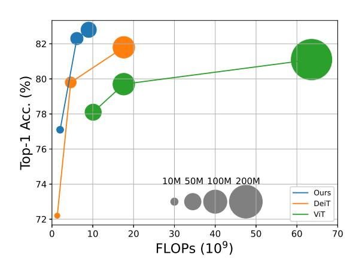
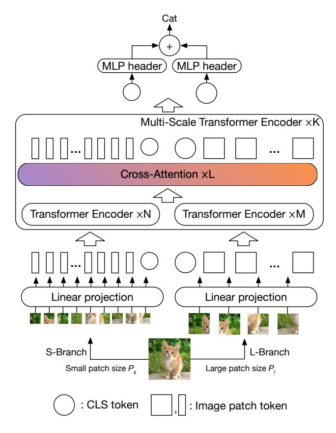
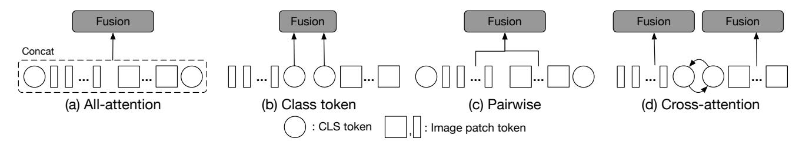
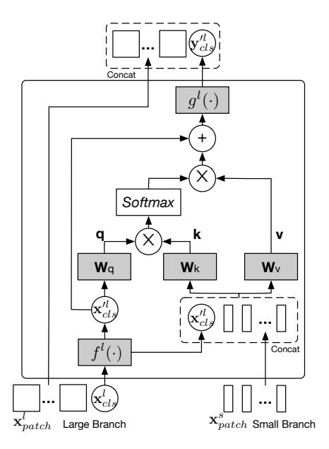
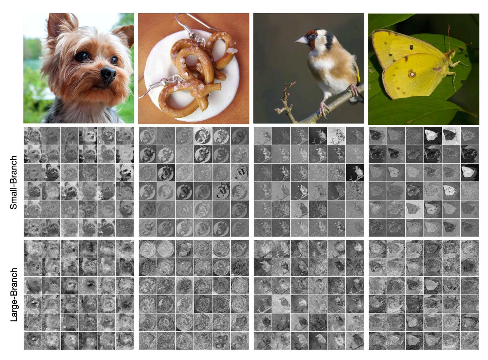

# CrossViT: Cross-Attention Multi-Scale Vision Transformer for Image Classification

# Chun-Fu (Richard) Chen, Quanfu Fan, Rameswar Panda MIT-IBM Watson AI Lab

chenrich@us.ibm.com, qfan@us.ibm.com, rpanda@ibm.com

## **Abstract**

The recently developed vision transformer (ViT) has achieved promising results on image classification compared to convolutional neural networks. Inspired by this, in this paper, we study how to learn multi-scale feature representations in transformer models for image classification. To this end, we propose a dual-branch transformer to combine image patches (i.e., tokens in a transformer) of different sizes to produce stronger image features. Our approach processes small-patch and large-patch tokens with two separate branches of different computational complexity and these tokens are then fused purely by attention multiple times to complement each other. Furthermore, to reduce computation, we develop a simple yet effective token fusion module based on cross attention, which uses a single token for each branch as a query to exchange information with other branches. Our proposed cross-attention only requires linear time for both computational and memory complexity instead of quadratic time otherwise. Extensive experiments demonstrate that our approach performs better than or on par with several concurrent works on vision transformer, in addition to efficient CNN models. For example, on the ImageNet1K dataset, with some architectural changes, our approach outperforms the recent DeiT by a large margin of 2% with a small to moderate increase in FLOPs and model parameters. Our source codes and models are available at https://github.com/IBM/CrossViT.

# 1. Introduction

The novel transformer architecture [36] has led to a big leap forward in capabilities for sequence-to-sequence modeling in NLP tasks [10]. The great success of transformers in NLP has sparked particular interest from the vision community in understanding whether transformers can be a strong competitor against the dominant Convolutional Neural Network based architectures (CNNs) in vision tasks such as ResNet [15] and EfficientNet [34]. Previous re-

Figure 1: Improvement of our proposed approach over **DeiT** [35] and ViT [11]. The circle size is proportional to the model size. All models are trained on ImageNet1K from scratch. The results of ViT are referenced from [45].

search efforts on transformers in vision have, until very recently, been largely focused on combining CNNs with selfattention [3, 48, 31, 32]. While these hybrid approaches achieve promising performance, they have limited scalability in computation compared to purely attention-based transformers. Vision Transformer (ViT) [11], which uses a sequence of embedded image patches as input to a standard transformer, is the first kind of convolution-free transformers that demonstrate comparable performance to CNN models. However, ViT requires very large datasets such as ImageNet21K [9] and JFT300M [33] for training. DeiT [35] subsequently shows that data augmentation and model regularization can enable training of high-performance ViT models with fewer data. Since then, ViT has instantly inspired several attempts to improve its efficiency and effectiveness from different aspects [35, 45, 14, 38, 19].

Along the same line of research on building stronger vision transformers, in this work, we study *how to learn multi-scale feature representations in transformer models for image recognition.* Multi-scale feature representations

have proven beneficial for many vision tasks [5, 4, 22, 21, 25, 24, 7], but such potential benefit for vision transformers remains to be validated. Motivated by the effectiveness of multi-branch CNN architectures such as Big-Little Net [5] and Octave convolutions [6], we propose a dualbranch transformer to combine image patches (i.e. tokens in a transformer) of different sizes to produce stronger visual features for image classification. Our approach processes small and large patch tokens with two separate branches of different computational complexities and these tokens are fused together multiple times to complement each other. Our main focus of this work is to develop feature fusion methods that are appropriate for vision transformers, which has not been addressed to the best of our knowledge. We do so by an efficient cross-attention module, in which each transformer branch creates a non-patch token as an agent to exchange information with the other branch by attention. This allows for linear-time generation of the attention map in fusion instead of quadratic time otherwise. With some proper architectural adjustments in computational loads of each branch, our proposed approach outperforms DeiT [35] by a large margin of 2% with a small to moderate increase in FLOPs and model parameters (See Figure 1).

The main contributions of our work are as follows:

- We propose a novel dual-branch vision transformer to extract multi-scale feature representations for image classification. Moreover, we develop a simple yet effective token fusion scheme based on cross-attention, which is linear in both computation and memory to combine features at different scales.
- Our approach performs better than or on par with several concurrent works based on ViT [11], and demonstrates comparable results with EfficientNet [34] with regards to accuracy, throughput and model parameters.

## 2. Related Works

Our work relates to three major research directions: convolutional neural networks with attention, vision transformer and multi-scale CNNs. Here, we focus on some representative methods closely related to our work.

CNN with Attention. Attention has been widely used in many different forms to enhance feature representations, e.g., SENet [18] uses channel-attention, CBAM [41] adds the spatial attention and ECANet [37] proposes an efficient channel attention to further improve SENet. There has also been a lot of interest in combining CNNs with different forms of self-attention [2, 32, 48, 31, 3, 17, 39]. SASA [31] and SAN [48] deploy a local-attention layer to replace convolutional layer. Despite promising results, prior approaches limited the attention scope to local region due to its complexity. LambdaNetwork [2] recently

introduces an efficient global attention to model both content and position-based interactions that considerably improves the speed-accuracy tradeoff of image classification models. BoTNet [32] replaced the spatial convolutions with global self-attention in the final three bottleneck blocks of a ResNet resulting in models that achieve a strong performance for image classification on ImageNet benchmark. In contrast to these approaches that mix convolution with self-attention, our work is built on top of pure self-attention network like Vision Transformer [11] which has recently shown great promise in several vision applications.

Vision Transformer. Inspired by the success of Transformers [36] in machine translation, convolution-free models that only rely on transformer layers have gone viral in computer vision. In particular, Vision Transformer (ViT) [11] is the first such example of a transformer-based method to match or even surpass CNNs for image classification. Many variants of vision transformers have also been recently proposed that uses distillation for data-efficient training of vision transformer [35], pyramid structure like CNNs [38], or self-attention to improve the efficiency via learning an abstract representation instead of performing all-to-all selfattention [42]. Perceiver [19] leverages an asymmetric attention mechanism to iteratively distill inputs into a tight latent bottleneck, allowing it to scale to handle very large inputs. T2T-ViT [45] introduces a layer-wise Tokens-to-Token (T2T) transformation to encode the important local structure for each token instead of the naive tokenization used in ViT [11]. Unlike these approaches, we propose a dual-path architecture to extract multi-scale features for better visual representation with vision transformers.

Multi-Scale CNNs. Multi-scale feature representations have a long history in computer vision (e.g., image pyramids [1], scale-space representation [29], and coarse-to-fine approaches [28]). In the context of CNNs, multi-scale feature representations have been used for detection and recognition of objects at multiple scales [4, 22, 44, 26], as well as to speed up neural networks in Big-Little Net [5] and OctNet [6]. bLVNet-TAM [12] uses a two-branch multi-resolution architecture while learning temporal dependencies across frames. SlowFast Networks [13] rely on a similar two-branch model, but each branch encodes different frame rates, as opposed to frames with different spatial resolutions. While multi-scale features have shown to benefit CNNs, it's applicability for vision transformer still remains as a novel and largely under-addressed problem.

### 3. Method

Our method is built on top of vision transformer [11], so we first present a brief overview of ViT and then describe our proposed method (CrossViT) for learning multi-scale features for image classification.

Figure 2: An illustration of our proposed transformer architecture for learning multi-scale features with cross-attention (CrossViT). Our architecture consists of a stack of K multi-scale transformer encoders. Each multi-scale transformer encoder uses two different branches to process image tokens of different sizes ( $P_s$  and  $P_l$ ,  $P_s < P_l$ ) and fuse the tokens at the end by an efficient module based on cross attention of the CLS tokens. Our design includes different numbers of regular transformer encoders in the two branches (i.e. N and M) to balance computational costs.

# 3.1. Overview of Vision Transformer

Vision Transformer (ViT) [11] first converts an image into a sequence of patch tokens by dividing it with a certain patch size and then linearly projecting each patch into tokens. An additional classification token (CLS) is added to the sequence, as in the original BERT [10]. Moreover, since self-attention in the transformer encoder is position-agnostic and vision applications highly need position information, ViT adds position embedding into each token, including the CLS token. Afterwards, all tokens are passed through stacked transformer encoders and finally the CLS token is used for classification. A transformer encoder is composed of a sequence of blocks where each block contains multiheaded self-attention (MSA) with a feed-forward

network (FFN). FFN contains two-layer multilayer perceptron with expanding ratio r at the hidden layer, and one GELU non-linearity is applied after the first linear layer. Layer normalization (LN) is applied before every block, and residual shortcuts after every block. The input of ViT,  $\mathbf{x}_0$ , and the processing of the k-th block can be expressed as

$$\mathbf{x}_{0} = [\mathbf{x}_{cls} || \mathbf{x}_{patch}] + \mathbf{x}_{pos}$$

$$\mathbf{y}_{k} = \mathbf{x}_{k-1} + \text{MSA}(\text{LN}(\mathbf{x}_{k-1}))$$

$$\mathbf{x}_{k} = \mathbf{y}_{k} + \text{FFN}(\text{LN}(\mathbf{y}_{k})),$$
(1)

where  $\mathbf{x}_{cls} \in \mathbb{R}^{1 \times C}$  and  $\mathbf{x}_{patch} \in \mathbb{R}^{N \times C}$  are the CLS and patch tokens respectively and  $\mathbf{x}_{pos} \in \mathbb{R}^{(1+N) \times C}$  is the position embedding. N and C are the number of patch tokens and dimension of the embedding, respectively.

It is worth noting that one very different design of ViT from CNNs is the CLS token. In CNNs, the final embedding is usually obtained by averaging the features over all spatial locations while ViT uses the CLS that interacts with patch tokens at every transformer encoder as the final embedding. Thus, we consider CLS as an agent that summarizes all the patch tokens and hence the proposed module is designed based on CLS to form a dual-path multi-scale ViT.

## 3.2. Proposed Multi-Scale Vision Transformer

The granularity of the patch size affects the accuracy and complexity of ViT; with fine-grained patch size, ViT can perform better but results in higher FLOPs and memory consumption. For example, the ViT with a patch size of 16 outperforms the ViT with a patch size of 32 by 6% but the former needs 4× more FLOPs. Motivated by this, our proposed approach is trying to leverage the advantages from more fine-grained patch sizes while balancing the complexity. More specifically, we first introduce a dual-branch ViT where each branch operates at a different scale (or patch size in the patch embedding) and then propose a simple yet effective module to fuse information between the branches.

Figure 2 illustrates the network architecture of our proposed Cross-Attention Multi-Scale Vision Transformer (CrossViT). Our model is primarily composed of K multiscale transformer encoders where each encoder consists of two branches: (1) **L-Branch**: a large (primary) branch that utilizes coarse-grained patch size  $(P_l)$  with more transformer encoders and wider embedding dimensions, (2) **S-Branch**: a small (complementary) branch that operates at fine-grained patch size  $(P_s)$  with fewer encoders and smaller embedding dimensions. Both branches are fused together L times and the CLS tokens of the two branches at the end are used for prediction. Note that for each token of both branches, we also add a learnable position embedding before the multi-scale transformer encoder for learning position information as in ViT [11].

Effective feature fusion is the key for learning multiscale feature representations. We explore four different fu-

Figure 3: **Multi-scale fusion**. (a) All-attention fusion where all tokens are bundled together without considering any characteristic of tokens. (b) Class token fusion, where only CLS tokens are fused as it can be considered as global representation of one branch. (c) Pairwise fusion, where tokens at the corresponding spatial locations are fused together and CLS are fused separately. (d) Cross-attention, where CLS token from one branch and patch tokens from another branch are fused together.

sion strategies: three simple heuristic approaches and the proposed cross-attention module as shown in Figure 3. Below we provide the details on these fusion schemes.

#### 3.3. Multi-Scale Feature Fusion

Let  $\mathbf{x}^i$  be the token sequence (both patch and CLS tokens) at branch i, where i can be l or s for the large (primary) or small (complementary) branch.  $\mathbf{x}^i_{cls}$  and  $\mathbf{x}^i_{patch}$  represent CLS and patch tokens of branch i, respectively.

**All-Attention Fusion.** A straightforward approach is to simply concatenate all the tokens from both branches without considering the property of each token and then fuse information via the self-attention module, as shown in Figure 3(a). This approach requires quadratic computation time since all tokens are passed through the self-attention module. The output  $\mathbf{z}^i$  of the all-attention fusion scheme can be expressed as

$$\begin{aligned} \mathbf{y} &= \left[ f^l(\mathbf{x}^l) \mid\mid f^s(\mathbf{x}^s) \right], \quad \mathbf{o} &= \mathbf{y} + \mathtt{MSA}(\mathtt{LN}(\mathbf{y})), \\ \mathbf{o} &= \left[ \mathbf{o}^l \mid\mid \mathbf{o}^s \right], \quad \mathbf{z}^i &= g^i(\mathbf{o}^i), \end{aligned} \tag{2}$$

where  $f^i(\cdot)$  and  $g^i(\cdot)$  are the projection and back-projection functions to align the dimension.

Class Token Fusion. The CLS token can be considered as an abstract global feature representation of a branch since it is used as the final embedding for prediction. Thus, a simple approach is to sum the CLS tokens of two branches, as shown in Figure 3(b). This approach is very efficient as only one token needs to be processed. Once CLS tokens are fused, the information will be passed back to patch tokens at the later transformer encoder. More formally, the output  $\mathbf{z}^i$  of this fusion module can be represented as

$$\mathbf{z}^{i} = \left[ g^{i} \left( \sum_{j \in \{l, s\}} f^{j}(\mathbf{x}_{cls}^{j}) \right) || \mathbf{x}_{patch}^{i} \right],$$
 (3)

where  $f^i(\cdot)$  and  $g^i(\cdot)$  play the same role as Eq. 2.

**Pairwise Fusion.** Figure 3(c) shows how both branches are fused in pairwise fusion. Since patch tokens are located at

its own spatial location of an image, a simple heuristic way for fusion is to combine them based on their spatial location. However, the two branches process patches of different sizes, thus having different number of patch tokens. We first perform an interpolation to align the spatial size, and then fuse the patch tokens of both branches in a pair-wise manner. On the other hand, the two CLS are fused separately. The output  $\mathbf{z}^i$  of pairwise fusion of branch l and s can be expressed as

$$\mathbf{z}^{i} = \left[ g^{i} \left( \sum_{j \in \{l,s\}} f^{j}(\mathbf{x}_{cls}^{j}) \right) \mid\mid g^{i} \left( \sum_{j \in \{l,s\}} f^{j}(\mathbf{x}_{patch}^{j}) \right) \right],$$

$$(4)$$

where  $f^i(\cdot)$  and  $g^i(\cdot)$  play the same role as Eq. 2.

Cross-Attention Fusion. Figure 3(d) shows the basic idea of our proposed cross-attention, where the fusion involves the CLS token of one branch and patch tokens of the other branch. Specifically, in order to fuse multi-scale features more efficiently and effectively, we first utilize the CLS token at each branch as an agent to exchange information among the patch tokens from the other branch and then back project it to its own branch. Since the CLS token already learns abstract information among all patch tokens in its own branch, interacting with the patch tokens at the other branch helps to include information at a different scale. After the fusion with other branch tokens, the CLS token interacts with its own patch tokens again at the next transformer encoder, where it is able to pass the learned information from the other branch to its own patch tokens, to enrich the representation of each patch token. In the following, we describe the cross-attention module for the large branch (Lbranch), and the same procedure is performed for the small branch (S-branch) by simply swapping the index l and s.

An illustration of the cross-attention module for the large branch is shown in Figure 4. Specifically, for branch l, it first collects the patch tokens from the S-Branch and concatenates its own CLS tokens to them, as shown in Eq. 5.

Figure 4: Cross-attention module for Large branch. The CLS token of the large branch (circle) serves as a query token to interact with the patch tokens from the small branch through attention.  $f^l(\cdot)$  and  $g^l(\cdot)$  are projections to align dimensions. The small branch follows the same procedure but swaps CLS and patch tokens from another branch.

$$\mathbf{x}^{\prime l} = \left[ f^l(\mathbf{x}_{cls}^l) \mid\mid \mathbf{x}_{patch}^s \right], \tag{5}$$

where  $f^l(\cdot)$  is the projection function for dimension alignment. The module then performs cross-attention (CA) between  $\mathbf{x}_{cls}^l$  and  $\mathbf{x}'^l$ , where CLS token is the only query as the information of patch tokens are fused into CLS token. Mathematically, the CA can be expressed as

$$\mathbf{q} = \mathbf{x}_{cls}^{\prime l} \mathbf{W}_{q}, \quad \mathbf{k} = \mathbf{x}^{\prime l} \mathbf{W}_{k}, \quad \mathbf{v} = \mathbf{x}^{\prime l} \mathbf{W}_{v},$$

$$\mathbf{A} = \operatorname{softmax}(\mathbf{q} \mathbf{k}^{T} / \sqrt{C/h}), \quad \operatorname{CA}(\mathbf{x}^{\prime l}) = \mathbf{A} \mathbf{v},$$
(6)

where  $\mathbf{W}_q$ ,  $\mathbf{W}_k$ ,  $\mathbf{W}_v \in \mathbb{R}^{C \times (C/h)}$  are learnable parameters, C and h are the embedding dimension and number of heads. Note that since we only use CLS in the query, the computation and memory complexity of generating the attention map  $(\mathbf{A})$  in cross-attention are linear rather than quadratic as in all-attention, making the entire process more efficient. Moreover, as in self-attention, we also use multiple heads in the CA and represent it as (MCA). However, we do not apply a feed-forward network FFN after the cross-attention. Specifically, the output  $\mathbf{z}^l$  of a cross-attention module of a given  $\mathbf{x}^l$  with layer normalization and residual shortcut is defined as follows.

$$\mathbf{y}_{cls}^{l} = f^{l}\left(\mathbf{x}_{cls}^{l}\right) + \text{MCA}(\text{LN}(\left[f^{l}(\mathbf{x}_{cls}^{l}) \mid\mid \mathbf{x}_{patch}^{s}\right]))$$

$$\mathbf{z}^{l} = \left[g^{l}\left(\mathbf{y}_{cls}^{l}\right) \mid\mid \mathbf{x}_{patch}^{l}\right],$$
(7)

where  $f^l(\cdot)$  and  $g^l(\cdot)$  are the projection and back-projection function for dimension alignment, respectively. We empirically show in Section 4.3 that cross-attention achieves the best accuracy compared to other three simple heuristic approaches while being efficient for mult-scale feature fusion.

# 4. Experiments

In this section, we conduct extensive experiments to show the effectiveness of our proposed CrossViT over existing methods. First, we check the advantages of our proposed model over the baseline DeiT in Table 2, and then we compare with serveral concurrent ViT variants and CNN-based models in Table 3 and Table 4, respectively. Moreover, we also test the transferability of CrossViT on 5 downstream tasks (Table 5). Finally, we perform ablation studies on different fusion schemes in Table 6 and discuss the effect of different parameters of CrossViT in Table 7.

# 4.1. Experimental Setup

**Dataset.** We validate the effectiveness of our proposed approach on the ImageNet1K dataset [9], and use the top-1 accuracy on the validation set as the metrics to evaluate the performance of a model. ImageNet1K contains 1,000 classes and the number of training and validation images are 1.28 millions and 50,000, respectively. We also test the transferability of our approach using several smaller datasets, such as CIFAR10 [20] and CIFAR100 [20].

Training and Evaluation. The original ViT [11] achieves competitive results compared to some of the best CNN models but only when trained on very large-scale datasets (e.g. ImageNet21K [9] and JFT300M [33]). Nevertheless, DeiT [35] shows that with the help of a rich set of data augmentation techniques, ViT can be trained from ImageNet alone to produce comparable results to CNN models. Therefore, in our experiments, we build our models based on DeiT [35], and apply their default hyper-parameters for training. These data augmentation methods include rand augmentation [8], mixup [47] and cutmix [46] as well as random erasing [49]. We also apply drop path [34] for model regularization but instance repetition [16] is only enabled for CrossViT-18 as it does not improve small models.

We train all our models for 300 epochs (30 warm-up epochs) on 32 GPUs with a batch size of 4,096. Other setup includes a cosine linear-rate scheduler with linear warm-up, an initial learning rate of 0.004 and a weight decay of 0.05. During evaluation, we resize the shorter side of an image to 256 and take the center crop  $224 \times 224$  as the input. Moreover, we also fine-tuned our models with a larger resolution ( $384 \times 384$ ) for fair comparison in some cases. Bicubic interpolation was applied to adjust the size of the learnt position embedding, and the finetuning took 30 epochs. More details can be found in supplementary material.

| Model        | Patch     | Patch size |       | Dimension |       | # of heads | M | r |
|--------------|-----------|------------|-------|-----------|-------|------------|---|---|
|              | embedding | Small      | Large | Small     | Large |            |   |   |
| CrossViT-Ti  | Linear    | 12         | 16    | 96        | 192   | 3          | 4 | 4 |
| CrossViT-S   | Linear    | 12         | 16    | 192       | 384   | 6          | 4 | 4 |
| CrossViT-B   | Linear    | 12         | 16    | 384       | 768   | 12         | 4 | 4 |
| CrossViT-9   | Linear    | 12         | 16    | 128       | 256   | 4          | 3 | 3 |
| CrossViT-15  | Linear    | 12         | 16    | 192       | 384   | 6          | 5 | 3 |
| CrossViT-18  | Linear    | 12         | 16    | 224       | 448   | 7          | 6 | 3 |
| CrossViT-9†  | 3 Conv.   | 12         | 16    | 128       | 256   | 4          | 3 | 3 |
| CrossViT-15† | 3 Conv.   | 12         | 16    | 192       | 384   | 6          | 5 | 3 |
| CrossViT-18† | 3 Conv.   | 12         | 16    | 224       | 448   | 7          | 6 | 3 |

Table 1: **Model architectures of CrossViT.** K=3, N=1, L=1 for all models, and number of heads are same for both branches. K denotes the number of multi-scale transformer encoders. M, N and L denote the number of transformer encoders of the small and large branches and the cross-attention modules in one multi-scale transformer encoder. r is the expanding ratio of feed-forward network (FFN) in the transformer encoder. See Figure 2 for details.

**Models.** Table 1 specifies the architectural configurations of the CrossViT models used in our evaluation. Among these models, CrossViT-Ti, CrossViT-S and CrossViT-B set their large (primary) branches identical to the tiny (DeiT-Ti), small (DeiT-S) and base (DeiT-B) models introduced in DeiT [35], respectively. The other models vary by different expanding ratios in FFN (r), depths and embedding dimensions. In particular, the ending number in a model name tells the total number of transformer encoders in the large branch used. For example, CrossViT-15 has 3 multi-scale encoders, each of which includes 5 regular transformers, resulting in a total of 15 transformer encoders.

The original ViT paper [11] shows that a hybrid approach that generates patch tokens from a CNN model such as ResNet-50 can improve the performance of ViT on the ImageNet1K dataset. Here we experiment with a similar idea by substituting the linear patch embedding in ViT by three convolutional layers as the patch tokenizer. These models are differentiated from others by a suffix † in Table 1.

# 4.2. Main Results

Comparisons with DeiT. DeiT [35] is a better trained version of ViT, we thus compare our approach with three baseline models introduced in DeiT, i.e., DeiT-Ti,DeiT-S and DeiT-B. It can be seen from Table 2 that CrossViT improves DeiT-Ti, DeiT-S and DeiT-B by 1.2%, 1.2% and 0.4% points respectively when they are used as the primary branch of CrossViT. This clearly demonstrates that our proposed cross-attention is effective in learning multiscale transformer features for image recognition. By making a few architectural changes (see Table 1), CrossViT further raises the accuracy of the baselines by another 0.3-0.5% point, with only a small increase in FLOPs and model parameters. Surprisingly, the convolution-based embedding provides a significant performance boost to CrossViT-

| Model        | Top-1 Acc. (%)     | FLOPs (G) | Throughput (images/s) | Params (M) |
|--------------|--------------------|--------------|-----------------------|---------------|
| DeiT-Ti      | 72.2               | 1.3          | 2557                  | 5.7           |
| CrossViT-Ti  | 73.4 (+1.2)        | 1.6          | 1668                  | 6.9           |
| CrossViT-9   | 73.9 (+0.5)        | 1.8          | 1530                  | 8.6           |
| CrossViT-9†  | <b>77.1</b> (+3.2) | 2.0          | 1463                  | 8.8           |
| DeiT-S       | 79.8               | 4.6          | 966                   | 22.1          |
| CrossViT-S   | 81.0 (+1.2)        | 5.6          | 690                   | 26.7          |
| CrossViT-15  | 81.5 (+0.5)        | 5.8          | 640                   | 27.4          |
| CrossViT-15† | <b>82.3</b> (+0.8) | 6.1          | 626                   | 28.2          |
| DeiT-B       | 81.8               | 17.6         | 314                   | 86.6          |
| CrossViT-B   | 82.2 (+0.4)        | 21.2         | 239                   | 104.7         |
| CrossViT-18  | 82.5 (+0.3)        | 9.0          | 430                   | 43.3          |
| CrossViT-18† | <b>82.8</b> (+0.3) | 9.5          | 418                   | 44.3          |

Table 2: Comparisons with DeiT baseline on ImageNet1K. The numbers in the bracket show the improvement from each change. See Table 1 for model details.

9 (+3.2%) and CrossViT-15 (+0.8%). As the number of transformer encoders increases, the effectiveness of convolution layers seems to become weaker, but CrossViT-18† still gains another 0.3% improvement over CrossViT-18. We would like to point out that the work of T2T [45] concurrently proposes a different approach based on tokento-token transformation to address the limitation of linear patch embedding in vision transformer.

Despite the design of CrossViT is intended for accuracy, the efficiency is also considered. E.g., CrossViT-9 $\dagger$  and CrossViT-15 $\dagger$  incur 30-50% more FLOPs and parameters than the baselines. However, their accuracy is considerably improved by  $\sim$ 2.5-5%. On the other hand, CrossViT-18 $\dagger$  reduces the FLOPs and parameters almost by half compared to DeiT-B while still being 1.0% more accurate.

Comparisons with SOTA Transformers. We further compare our proposed approach with some very recent concurrent works on vision transformers. They all improve the original ViT [11] with respect to efficiency, accuracy or both. As shown in Table 3, CrossViT-15† outperforms the small models of all the other approaches with comparable FLOPs and parameters. Interestingly when compared with ViT-B, CrossViT-18† significantly outperforms it by 4.9% (77.9% vs 82.8%) in accuracy while requiring 50% less FLOPs and parameters. Furthermore, CrossViT-18† performs as well as TNT-B and better than the others, but also has fewer FLOPs and parameters. Our approach is consistently better than T2T-ViT [45] and PVT [38] in terms of accuracy and FLOPs, showing the efficacy of multi-scale features in vision transformers.

Comparisons with CNN-based Models. CNN-based models are dominant in computer vision applications. In this experiment, we compare our proposed approach with

| Model                               | Top-1 Acc. (%) | FLOPs (G) | Params (M) |
|-------------------------------------|----------------|-----------|------------|
| Peceiver [19] (arXiv, 2021-03)      | 76.4           | -         | 43.9       |
| DeiT-S [35] (arXiv, 2020-12)        | 79.8           | 4.6       | 22.1       |
| CentroidViT-S [42] (arXiv, 2021-02) | 80.9           | 4.7       | 22.3       |
| PVT-S [38] (arXiv, 2021-02)         | 79.8           | 3.8       | 24.5       |
| PVT-M [38] (arXiv, 2021-02)         | 81.2           | 6.7       | 44.2       |
| T2T-ViT-14 [45] (arXiv, 2021-01)    | 80.7           | 6.1*      | 21.5       |
| TNT-S [14] (arXiv, 2021-02)         | 81.3           | 5.2       | 23.8       |
| CrossViT-15 (Ours)                  | 81.5           | 5.8       | 27.4       |
| CrossViT-15† (Ours)                 | 82.3           | 6.1       | 28.2       |
| ViT-B@384 [11] (ICLR, 2021)         | 77.9           | 17.6      | 86.6       |
| DeiT-B [35] (arXiv, 2020-12)        | 81.8           | 17.6      | 86.6       |
| PVT-L [38] (arXiv, 2021-02)         | 81.7           | 9.8       | 61.4       |
| T2T-ViT-19 [45] (arXiv, 2021-01)    | 81.4           | 9.8*      | 39.0       |
| T2T-ViT-24 [45] (arXiv, 2021-01)    | 82.2           | 15.0*     | 64.1       |
| TNT-B [14] (arXiv, 2021-02)         | 82.8           | 14.1      | 65.6       |
| CrossViT-18 (Ours)                  | 82.5           | 9.0       | 43.3       |
| CrossViT-18† (Ours)                 | 82.8           | 9.5       | 44.3       |

\*: We recompute the flops by using our tools

Table 3: Comparisons with recent transformer-based models on ImageNet1K. All models are trained using only ImageNet1K dataset. Numbers are referenced from their recent version as of the submission date.

| Model                     | Top-1 Acc. | FLOPs | Throughput | Params |
|---------------------------|------------|-------|------------|--------|
|                           | (%)        | (G)   | (images/s) | (M)    |
| ResNet-101 [15]           | 76.7       | 7.80  | 678        | 44.6   |
| ResNet-152 [15]           | 77.0       | 11.5  | 445        | 60.2   |
| ResNeXt-101-32×4d [43]    | 78.8       | 8.0   | 477        | 44.2   |
| ResNeXt-101-64×4d [43]    | 79.6       | 15.5  | 289        | 83.5   |
| SEResNet-101 [18]         | 77.6       | 7.8   | 564        | 49.3   |
| SEResNet-152 [18]         | 78.4       | 11.5  | 392        | 66.8   |
| SENet-154 [18]            | 81.3       | 20.7  | 201        | 115.1  |
| ECA-Net101 [37]           | 78.7       | 7.4   | 591        | 42.5   |
| ECA-Net152 [37]           | 78.9       | 10.9  | 428        | 59.1   |
| RegNetY-8GF [30]          | 79.9       | 8.0   | 557        | 39.2   |
| RegNetY-12GF [30]         | 80.3       | 12.1  | 439        | 51.8   |
| RegNetY-16GF [30]         | 80.4       | 15.9  | 336        | 83.6   |
| RegNetY-32GF [30]         | 81.0       | 32.3  | 208        | 145.0  |
| EfficienetNet-B4@380 [34] | 82.9       | 4.2   | 356        | 19     |
| EfficienetNet-B5@456 [34] | 83.7       | 9.9   | 169        | 30     |
| EfficienetNet-B6@528 [34] | 84.0       | 19.0  | 100        | 43     |
| EfficienetNet-B7@600 [34] | 84.3       | 37.0  | 55         | 66     |
| CrossViT-15               | 81.5       | 5.8   | 640        | 27.4   |
| CrossViT-15†              | 82.3       | 6.1   | 626        | 28.2   |
| CrossViT-15†@384          | 83.5       | 21.4  | 158        | 28.5   |
| CrossViT-18               | 82.5       | 9.03  | 430        | 43.3   |
| CrossViT-18†              | 82.8       | 9.5   | 418        | 44.3   |
| CrossViT-18†@384          | 83.9       | 32.4  | 112        | 44.6   |
| CrossViT-18†@480          | 84.1       | 56.6  | 57         | 44.9   |

Table 4: **Comparisons with CNN models on ImageNet1K.** Models are evaluated under  $224 \times 224$  if not specified. The inference throughput is measured under a batch size of 64 on a Nvidia Tesla V100 GPU with cudnn 8.0. We report the averaged speed over 100 iterations.

some of the best CNN models including both hand-crafted (e.g., ResNet [15]) and search based ones (e.g., Efficient-Net [34]). In addition to accuracy, FLOPs and parameters, run-time speed is measured for all the models and shown as

| Model       | CIFAR10 | CIFAR100 | Pet   | CropDiseases | ChestXRay8 |
|-------------|---------|----------|-------|--------------|------------|
| DeiT-S [35] | 99.15   | 90.89    | 94.93 | 99.96        | 55.39      |
| DeiT-B [35] | 99.10*  | 90.80*   | 94.39 | 99.96        | 55.77      |
| CrossViT-15 | 99.00   | 90.77    | 94.55 | 99.97        | 55.89      |
| CrossViT-18 | 99.11   | 91.36    | 95.07 | 99.97        | 55.94      |

\*: numbers reported in the original paper.

Table 5: **Transfer learning performance.** Our CrossViT models are very competitive with the recent DeiT [35] models on all the downstream classification tasks.

inference throughput (images/second) in Table 4. We follow prior work [35] to report accuracy from the original papers. First, when compared to the ResNet family, including ResNet [15], ResNeXt [43], SENet [18], ECA-ResNet [37] and RegNet [30], CrossViT-15 outperforms all of them in accuracy while being smaller and running more efficiently (except ResNet-101, which is slightly faster). In addition, our best models such as CrossViT-15† and CrossViT-18†, when evaluated at higher image resolution, are encouragingly competitive against EfficientNet [34] with regard to accuracy, throughput and parameters. We expect neural architecture search (NAS) [50] to close the performance gap between our approach and EfficientNet.

Transfer Learning. Despite our model achieves better accuracy on ImageNet1K compared to the baselines (Table 2), it is crucial to check generalization of the models by evaluating transfer performance on tasks with fewer samples. We validate this by performing transfer learning on 5 image classification tasks, including CI-FAR10 [20], CIFAR100 [20], Pet [27], CropDisease [23], and ChestXRay8 [40]. While the first four datasets contains natural images, ChestXRay8 consists of medical images. We finetune the whole pretrained models with 1,000 epochs, batch size 768, learning rate 0.01, SGD optimizer, weight decay 0.0001, and using the same data augmentation in training on ImageNet1K. Table 5 shows the results. While being better in ImageNet1K, our model is on par with DeiT models on all the downstream classification tasks. This result assures that our models still have good generalization ability rather than only fit to ImageNet1K.

## 4.3. Ablation Studies

In this section, we first compare the different fusion approaches (Section 3.3), and then analyze the effects of different parameters of our architecture design, including the patch sizes, the channel width and depth of the small branch and number of cross-attention modules. At the end, we also validate that the proposed can cooperate with other concurrent works for better accuracy.

Comparison of Different Fusion Schemes. Table 6 shows the performance of different fusions schemes, including (I) no fusion, (II) all-attention, (III) class token fusion, (IV)

| Fusion          | Top-1 Acc. (%) | FLOPs (G) | Params (M) | Single Branch | nch Acc. (%) S-Branch |
|-----------------|-------------------|--------------|---------------|---------------|--------------------------|
| None            | 80.2              | 5.3          | 23.7          | 80.2          | 0.1                      |
| All-Attention   | 80.0              | 7.6          | 27.7          | 79.9          | 0.5                      |
| Class Token     | 80.3              | 5.4          | 24.2          | 80.6          | 7.6                      |
| Pairwise        | 80.3              | 5.5          | 24.2          | 80.3          | 7.3                      |
| Cross-Attention | 81.0              | 5.6          | 26.7          | 68.1          | 47.2                     |

Table 6: Ablation study with different fusions on ImageNet1K. All models are based on CrossViT-S. Single branch Acc. is computed using CLS from one branch only.

pairwise fusion, and (V) the proposed cross-attention fusion. Among all the compared strategies, the proposed cross-attention fusion achieves the best accuracy with minor increase in FLOPs and parameters. Surprisingly, despite the use of additional self-attention to combine information between two branches, all-attention fails to achieve better performance compared to the simple class token fusion. While the primary L-branch dominates in accuracy by diminishing the effect of complementary S-branch in other fusion strategies, both of the branches in our proposed cross-attention fusion scheme achieve certain accuracy and their ensemble becomes the best, suggesting that these two branches learn different features for different images.

Effect of Patch Sizes. We perform experiments to understand the effect of patch sizes in our CrossViT by testing two pairs of patch sizes such as (8, 16) and (12, 16), and observe that the one with (12, 16) achieves better accuracy with fewer FLOPs as shown in Table 7 (A). Intuitively, (8, 16) should get better results as patch size of 8 provides more fine-grained features; however, it is not good as (12, 16) because of the large difference in granularity between the two branches, which makes it difficult for smooth learning of the features. For the pair (8, 16), the number of patch tokens are  $4 \times$  difference while the ratio of patch tokens are only  $2 \times$  for the model with (12, 16).

Channel Width and Depth in S-branch. Despite our cross-attention is designed to be light-weight, we check the performance by using a more complex S-branch, as shown in Table 7 (B and C). Both models increase FLOPs and parameters without any improvement in accuracy, which we think is due to the fact that L-branch has the main role to extract features while S-branch only provides additional information; thus, a light-weight branch is enough.

**Depth of Cross-Attention and Number of Multi-Scale Transformer Encoders.** To increase frequency of fusion across two branches, we can either stack more cross-attention modules (L) or stack more multi-scale transformer encoders (K) (by reducing M to keep the same total depth of a model). Results are shown in Table 7 (D and E). With CrossViT-S as baseline, too frequent fusion of branches does not provide any performance improvement but intro-

| Model      | Patch Small | n size Large |     | nsion Large | K | N | M | L | Top-1 Acc. (%) | FLOPs (G) | Params (M) |
|------------|----------------|-----------------|-----|----------------|---|---|---|---|-------------------|--------------|---------------|
| CrossViT-S | 12             | 16              | 192 | 384            | 3 | 1 | 4 | 1 | 81.0              | 5.6          | 26.7          |
| A          | 8              | 16              | 192 | 384            | 3 | 1 | 4 | 1 | 80.8              | 6.7          | 26.7          |
| В          | 12             | 16              | 384 | 384            | 3 | 1 | 4 | 1 | 80.1              | 7.7          | 31.4          |
| C          | 12             | 16              | 192 | 384            | 3 | 2 | 4 | 1 | 80.7              | 6.3          | 28.0          |
| D          | 12             | 16              | 192 | 384            | 3 | 1 | 4 | 2 | 81.0              | 5.6          | 28.9          |
| E          | 12             | 16              | 192 | 384            | 6 | 1 | 2 | 1 | 80.9              | 6.6          | 31.1          |

Table 7: **Ablation study with different architecture parameters on ImageNet1K.** The **blue** color indicates changes from CrossViT-S.

duces more FLOPs and parameters. This is because patch token from the other branch is untouched, and the advantages from stacking more than one cross-attention is small as cross-attention is a linear operation without any nonlinearity function. Likewise, using more multi-scale transformer encoders also does not help in performance which is the similar case to increase the capacity of S-branch.

Importance of CLS Tokens. We experiment with one model based on CrossViT-S without CLS tokens, where the model averages the patch tokens of one branch as the CLS token for cross attention with the other branch. This model achieved 80.0% accuracy which is is 1% worse than CrossViT-S (81.0%) on ImageNet1K, showing effectiveness of CLS token in summarizing information of current branch for passing to another one through cross-attention.

Cooperation with Concurrent Works. Our proposed cross-attention is also capable of cooperating with other concurrent ViT variants. We consider T2T-ViT [45] as a case study and use the T2T module to replace linear projection of patch embedding in both branches on CrossViT-18. CrossViT-18+T2T achieves an top-1 accuracy of 83.0% on ImageNet1K, additional 0.5% improvement over CrossViT-18. This shows that our proposed cross-attention is also capable of learning multi-scale features for other ViT variants.

#### 5. Conclusion

In this paper, we present CrossViT, a dual-branch vision transformer for learning multi-scale features, to improve the recognition accuracy for image classification. To effectively combine image patch tokens of different scales, we further develop a fusion method based on cross-attention to exchange information between two branches efficiently in linear time. With extensive experiments, we demonstrate that our proposed model performs better than or on par with several concurrent works on vision transformer, in addition to efficient CNN models. While our current work scratches the surface on multi-scale vision transformers for image classification, we anticipate that in future there will be more works in developing efficient multi-scale transformers for other vision applications, including object detection, semantic segmentation, and video action recognition.

## References

- [1] Edward H Adelson, Charles H Anderson, James R Bergen, Peter J Burt, and Joan M Ogden. Pyramid methods in image processing. *RCA engineer*, 29(6):33–41, 1984. 2
- [2] Irwan Bello. Lambdanetworks: Modeling long-range interactions without attention. In *International Conference on Learning Representations*, 2021. 2
- [3] Irwan Bello, Barret Zoph, Ashish Vaswani, Jonathon Shlens, and Quoc V Le. Attention augmented convolutional networks. In *Proceedings of the IEEE/CVF International Con*ference on Computer Vision, pages 3286–3295, 2019. 1, 2
- [4] Zhaowei Cai, Quanfu Fan, Rogerio S Feris, and Nuno Vasconcelos. A unified multi-scale deep convolutional neural network for fast object detection. In *European conference* on computer vision, pages 354–370. Springer, 2016. 2
- [5] Chun-Fu (Richard) Chen, Quanfu Fan, Neil Mallinar, Tom Sercu, and Rogerio Feris. Big-Little Net: An Efficient Multi-Scale Feature Representation for Visual and Speech Recognition. In *International Conference on Learning Represen*tations, 2019. 2
- [6] Yunpeng Chen, Haoqi Fan, Bing Xu, Zhicheng Yan, Yannis Kalantidis, Marcus Rohrbach, Shuicheng Yan, and Jiashi Feng. Drop an octave: Reducing spatial redundancy in convolutional neural networks with octave convolution. In Proceedings of the IEEE/CVF International Conference on Computer Vision, pages 3435–3444, 2019.
- [7] Bowen Cheng, Bin Xiao, Jingdong Wang, Honghui Shi, Thomas S. Huang, and Lei Zhang. Higherhrnet: Scale-aware representation learning for bottom-up human pose estimation. In *IEEE/CVF Conference on Computer Vision and Pat*tern Recognition, June 2020. 2
- [8] Ekin Dogus Cubuk, Barret Zoph, Jon Shlens, and Quoc Le. RandAugment: Practical Automated Data Augmentation with a Reduced Search Space. In H Larochelle, M Ranzato, R Hadsell, M F Balcan, and H Lin, editors, Advances in Neural Information Processing Systems, pages 18613– 18624. Curran Associates, Inc., 2020. 5
- [9] Jia Deng, Wei Dong, Richard Socher, Li-Jia Li, Kai Li, and Li Fei-Fei. Imagenet: A large-scale hierarchical image database. In 2009 IEEE conference on computer vision and pattern recognition, pages 248–255. Ieee, 2009. 1, 5
- [10] Jacob Devlin, Ming-Wei Chang, Kenton Lee, and Kristina Toutanova. BERT: Pre-training of deep bidirectional transformers for language understanding. In Proceedings of the 2019 Conference of the North American Chapter of the Association for Computational Linguistics: Human Language Technologies, Volume 1 (Long and Short Papers), pages 4171–4186, Minneapolis, Minnesota, June 2019. Association for Computational Linguistics. 1, 3
- [11] Alexey Dosovitskiy, Lucas Beyer, Alexander Kolesnikov, Dirk Weissenborn, Xiaohua Zhai, Thomas Unterthiner, Mostafa Dehghani, Matthias Minderer, Georg Heigold, Sylvain Gelly, Jakob Uszkoreit, and Neil Houlsby. An image is worth 16x16 words: Transformers for image recognition at scale. In *International Conference on Learning Representa*tions, 2021. 1, 2, 3, 5, 6, 7

- [12] Quanfu Fan, Chun-Fu Richard Chen, Hilde Kuehne, Marco Pistoia, and David Cox. More is less: Learning efficient video representations by big-little network and depthwise temporal aggregation. In Advances in Neural Information Processing Systems, pages 2261–2270, 2019. 2
- [13] Christoph Feichtenhofer, Haoqi Fan, Jitendra Malik, and Kaiming He. Slowfast networks for video recognition. In Proceedings of the IEEE International Conference on Computer Vision, pages 6202–6211, 2019. 2
- [14] Kai Han, An Xiao, Enhua Wu, Jianyuan Guo, Chunjing Xu, and Yunhe Wang. Transformer in transformer. arXiv preprint arXiv:2103.00112, 2021. 1, 7
- [15] Kaiming He, Xiangyu Zhang, Shaoqing Ren, and Jian Sun. Deep Residual Learning for Image Recognition. In *The IEEE Conference on Computer Vision and Pattern Recognition*, June 2016. 1, 7
- [16] Elad Hoffer, Tal Ben-Nun, Itay Hubara, Niv Giladi, Torsten Hoefler, and Daniel Soudry. Augment your batch: Improving generalization through instance repetition. In *Proceedings of* the IEEE/CVF Conference on Computer Vision and Pattern Recognition, June 2020. 5
- [17] Han Hu, Zheng Zhang, Zhenda Xie, and Stephen Lin. Local relation networks for image recognition. In *Proceedings* of the IEEE/CVF International Conference on Computer Vision, pages 3464–3473, 2019. 2
- [18] J. Hu, L. Shen, and G. Sun. Squeeze-and-excitation networks. In 2018 IEEE/CVF Conference on Computer Vision and Pattern Recognition, pages 7132–7141, 2018. 2, 7
- [19] Andrew Jaegle, Felix Gimeno, Andy Brock, Oriol Vinyals, Andrew Zisserman, and Joao Carreira. Perceiver: General perception with iterative attention. In Marina Meila and Tong Zhang, editors, Proceedings of the 38th International Conference on Machine Learning, volume 139 of Proceedings of Machine Learning Research, pages 4651–4664. PMLR, 18–24 Jul 2021. 1, 2, 7
- [20] Alex Krizhevsky, Geoffrey Hinton, et al. Learning multiple layers of features from tiny images. 2009. 5, 7
- [21] Xiang Li, Wenhai Wang, Xiaolin Hu, and Jian Yang. Selective kernel networks. In Proceedings of the IEEE/CVF Conference on Computer Vision and Pattern Recognition, June 2019.
- [22] Tsung-Yi Lin, Piotr Dollár, Ross Girshick, Kaiming He, Bharath Hariharan, and Serge Belongie. Feature pyramid networks for object detection. In *Proceedings of the IEEE conference on computer vision and pattern recogni*tion, pages 2117–2125, 2017. 2
- [23] Sharada P Mohanty, David P Hughes, and Marcel Salathé. Using deep learning for image-based plant disease detection. Frontiers in plant science, 7:1419, 2016.
- [24] Seungjun Nah, Tae Hyun Kim, and Kyoung Mu Lee. Deep multi-scale convolutional neural network for dynamic scene deblurring. In *Proceedings of the IEEE Conference on Com*puter Vision and Pattern Recognition, July 2017. 2
- [25] Alejandro Newell, Kaiyu Yang, and Jia Deng. Stacked Hourglass Networks for Human Pose Estimation. In Bastian Leibe, Jiri Matas, Nicu Sebe, and Max Welling, editors, *Proceedings of the European Conference on Computer Vision*,

- pages 483–499, Cham, 2016. Springer International Publishing. 2
- [26] Alejandro Newell, Kaiyu Yang, and Jia Deng. Stacked hourglass networks for human pose estimation. In *European con*ference on computer vision, pages 483–499. Springer, 2016.
  2
- [27] Omkar M. Parkhi, Andrea Vedaldi, Andrew Zisserman, and C. V. Jawahar. Cats and dogs. In *IEEE Conference on Computer Vision and Pattern Recognition*, 2012. 7
- [28] Marco Pedersoli, Andrea Vedaldi, Jordi Gonzalez, and Xavier Roca. A coarse-to-fine approach for fast deformable object detection. *Pattern Recognition*, 48(5):1844–1853, 2015. 2
- [29] Pietro Perona and Jitendra Malik. Scale-space and edge detection using anisotropic diffusion. *IEEE Transactions on pattern analysis and machine intelligence*, 12(7):629–639, 1990.
- [30] Ilija Radosavovic, Raj Prateek Kosaraju, Ross Girshick, Kaiming He, and Piotr Dollar. Designing network design spaces. In *IEEE/CVF Conference on Computer Vision and Pattern Recognition*, June 2020. 7
- [31] Prajit Ramachandran, Niki Parmar, Ashish Vaswani, Irwan Bello, Anselm Levskaya, and Jon Shlens. Stand-Alone Self-Attention in Vision Models. In H Wallach, H Larochelle, A Beygelzimer, F d Alch e Buc, E Fox, and R Garnett, editors, Advances in Neural Information Processing Systems. Curran Associates, Inc., 2019. 1, 2
- [32] Aravind Srinivas, Tsung-Yi Lin, Niki Parmar, Jonathon Shlens, Pieter Abbeel, and Ashish Vaswani. Bottleneck transformers for visual recognition. arXiv preprint arXiv:2101.11605, 2021. 1, 2
- [33] C. Sun, A. Shrivastava, S. Singh, and A. Gupta. Revisiting unreasonable effectiveness of data in deep learning era. In 2017 IEEE International Conference on Computer Vision, pages 843–852, 2017. 1, 5
- [34] Mingxing Tan and Quoc Le. EfficientNet: Rethinking Model Scaling for Convolutional Neural Networks. In Kamalika Chaudhuri and Ruslan Salakhutdinov, editors, *Proceedings* of the 36th International Conference on Machine Learning, pages 6105–6114, Long Beach, California, USA, June 2019. PMLR. 1, 2, 5, 7
- [35] Hugo Touvron, Matthieu Cord, Matthijs Douze, Francisco Massa, Alexandre Sablayrolles, and Herve Jegou. Training data-efficient image transformers & distillation through attention. In Marina Meila and Tong Zhang, editors, *Proceedings of the 38th International Conference on Machine Learning*, volume 139 of *Proceedings of Machine Learning Research*, pages 10347–10357. PMLR, 18–24 Jul 2021. 1, 2, 5, 6, 7
- [36] Ashish Vaswani, Noam Shazeer, Niki Parmar, Jakob Uszkoreit, Llion Jones, Aidan N Gomez, ukasz Kaiser, and Illia Polosukhin. Attention is All you Need. In I Guyon, U V Luxburg, S Bengio, H Wallach, R Fergus, S Vishwanathan, and R Garnett, editors, Advances in Neural Information Processing Systems. Curran Associates, Inc., 2017. 1, 2
- [37] Qilong Wang, Banggu Wu, Pengfei Zhu, Peihua Li, Wang-meng Zuo, and Qinghua Hu. Eca-net: Efficient channel attention for deep convolutional neural networks. In *The IEEE*

- Conference on Computer Vision and Pattern Recognition, 2020, 2, 7
- [38] Wenhai Wang, Enze Xie, Xiang Li, Deng-Ping Fan, Kaitao Song, Ding Liang, Tong Lu, Ping Luo, and Ling Shao. Pyramid vision transformer: A versatile backbone for dense prediction without convolutions, 2021. 1, 2, 6, 7
- [39] Xiaolong Wang, Ross Girshick, Abhinav Gupta, and Kaiming He. Non-local neural networks. In *Proceedings of the IEEE conference on computer vision and pattern recognition*, pages 7794–7803, 2018.
- [40] Xiaosong Wang, Yifan Peng, Le Lu, Zhiyong Lu, Mohammadhadi Bagheri, and Ronald M Summers. Chestx-ray8: Hospital-scale chest x-ray database and benchmarks on weakly-supervised classification and localization of common thorax diseases. In *Proceedings of the IEEE conference on computer vision and pattern recognition*, pages 2097–2106, 2017. 7
- [41] Sanghyun Woo, Jongchan Park, Joon-Young Lee, and In So Kweon. Cbam: Convolutional block attention module. In Proceedings of the European Conference on Computer Vision, September 2018. 2
- [42] Lemeng Wu, Xingchao Liu, and Qiang Liu. Centroid transformers: Learning to abstract with attention. *arXiv preprint arXiv:2102.08606*, 2021. 2, 7
- [43] Saining Xie, Ross Girshick, Piotr Dollár, Zhuowen Tu, and Kaiming He. Aggregated Residual Transformations for Deep Neural Networks. In *The IEEE Conference on Computer Vision and Pattern Recognition*, July 2017. 7
- [44] Songfan Yang and Deva Ramanan. Multi-scale recognition with dag-cnns. In *Proceedings of the IEEE international conference on computer vision*, pages 1215–1223, 2015. 2
- [45] Li Yuan, Yunpeng Chen, Tao Wang, Weihao Yu, Yujun Shi, Francis EH Tay, Jiashi Feng, and Shuicheng Yan. Tokensto-token vit: Training vision transformers from scratch on imagenet, 2021. 1, 2, 6, 7, 8
- [46] Sangdoo Yun, Dongyoon Han, Seong Joon Oh, Sanghyuk Chun, Junsuk Choe, and Youngjoon Yoo. CutMix: Regularization Strategy to Train Strong Classifiers With Localizable Features. In *Proceedings of the IEEE/CVF International* Conference on Computer Vision, Oct. 2019. 5
- [47] Hongyi Zhang, Moustapha Cisse, Yann N. Dauphin, and David Lopez-Paz. mixup: Beyond empirical risk minimization. In *International Conference on Learning Representa*tions, 2018. 5
- [48] Hengshuang Zhao, Jiaya Jia, and Vladlen Koltun. Exploring self-attention for image recognition. In *Proceedings of the IEEE/CVF Conference on Computer Vision and Pattern Recognition*, June 2020. 1, 2
- [49] Zhun Zhong, Liang Zheng, Guoliang Kang, Shaozi Li, and Yi Yang. Random Erasing Data Augmentation. Proceedings of the AAAI Conference on Artificial Intelligence, 34(07):13001–13008, Apr. 2020. 5
- [50] Barret Zoph, Vijay Vasudevan, Jonathon Shlens, and Quoc V. Le. Learning transferable architectures for scalable image recognition. In Proceedings of the IEEE Conference on Computer Vision and Pattern Recognition, June 2018. 7

**Summary** This supplementary material contains the following additional comparisons and hyperparameter details. We first provide more comparisons between the proposed CrossViT and DeiT (see Table 8) and then list the training hyperparameters used in main results, ablation studies and transfer learning, in Table 9.

# A. More Comparisons and Analysis

To further check the advantages of the proposed CrossViT, we trained the models whose architecture are identical to the L-branch (primary) of our models. E.g., DeiT-9 is the baseline for CrossViT-9. As shown in Table 8, the proposed cross-attention fusion consistently improves the baseline vision transformers regardless of their primary branches and patch embeddings, suggesting that the proposed multi-scale fusion is effective for different vision transformers.

Figure 5 visualizes the features of both branches from the last multi-scale transformer encoder of CrossViT. The proposed cross-attention learns different features in both branches, where the small branch generates more low-level features because there are only three transformer encoders while the features of the large branch are more abstract. Both branches complement each other and hence the ensemble results are better.

| Model        | Top-1 Acc. (%) | FLOPs (G) | Params (M) |
|--------------|----------------|-----------|------------|
| DeiT-9       | 72.9           | 1.4       | 6.4        |
| CrossViT-9   | 73.9           | 1.8       | 8.6        |
| DeiT-9†      | 75.6           | 1.5       | 6.6        |
| CrossViT-9†  | 77.1           | 2.0       | 8.8        |
| DeiT-15      | 80.8           | 4.9       | 22.9       |
| CrossViT-15  | 81.5           | 5.8       | 27.4       |
| DeiT-15†     | 81.7           | 5.1       | 23.5       |
| CrossViT-15† | 82.3           | 6.1       | 28.2       |
| DeiT-18      | 81.4           | 7.8       | 37.1       |
| CrossViT-18  | 82.5           | 9.0       | 43.3       |
| DeiT-18†     | 81.2           | 8.1       | 37.9       |
| CrossViT-18† | 82.8           | 9.5       | 44.3       |

Table 8: Comparisons with various baselines on ImageNet1K. See Table 1 of the main paper for model details. † denotes the models using three convolutional layers for patch embedding instead of linear projection.

|                                              | Main Results   | Transfer      |  |
|----------------------------------------------|----------------|---------------|--|
| Batch size                                   | 4,096          | 768           |  |
| Epochs                                       | 300            | 1,000         |  |
| Optimizer                                    | AdamW          | SGD           |  |
| Weight Decay                                 | 0.05           | 1e-4          |  |
| Linear-rate Scheduler (Initial LR)        | Cosine (0.004) | Cosine (0.01) |  |
| Warmup Epochs                                | 30             | 5             |  |
| Warmup linear-rate Scheduler (Initial LR) | Linear (1e-6)  |               |  |
| Data Aug.                                    | RandAugmen     | it (m=9, n=2) |  |
| $Mixup(\alpha)$                              | 0.             | 8             |  |
| CutMix $(\alpha)$                            | 1.             | 0             |  |
| Random Erasing                               | 0.25           | 0.0           |  |
| Instance Repetition*                      | 3              |               |  |
| Drop-path                                    | 0.1            | 0.0           |  |
| Label Smoothing                              | 0.             | 1             |  |

\*: only used for CrossViT-18.

Table 9: **Details of training settings.** 

Figure 5: **Feature visualization of CrossViT-S.** Features of patch tokens of both branches from the last multi-scale transformer encoder are shown. (36 random channels are selected.)