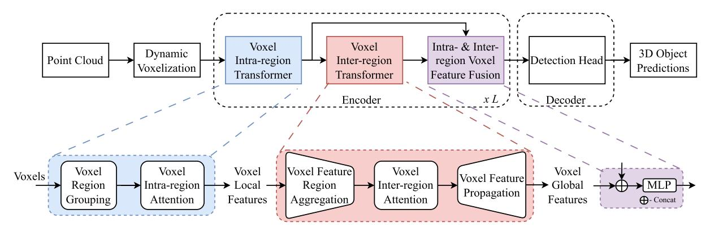
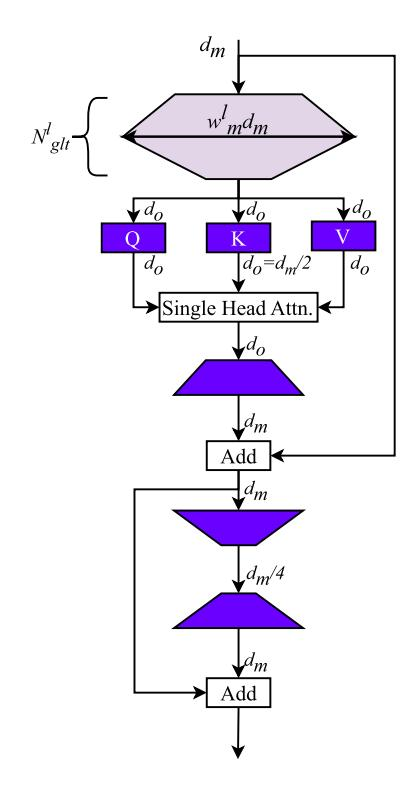
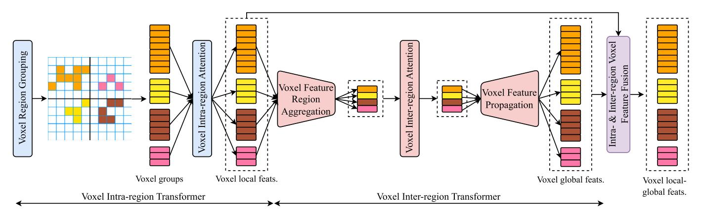
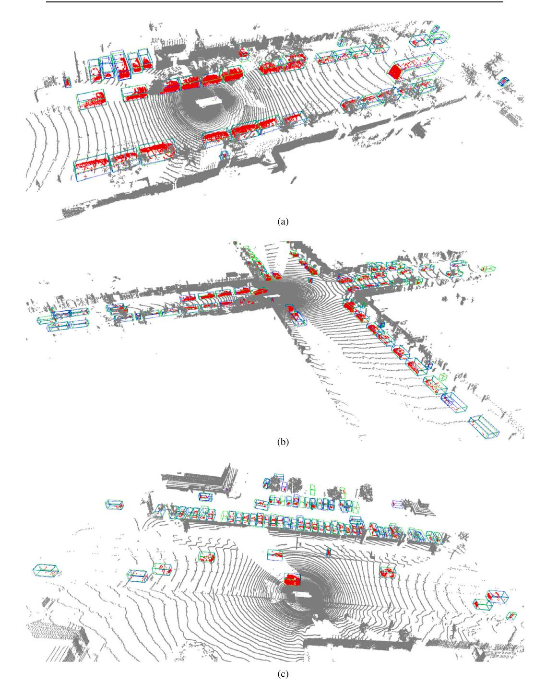

ELSEVIER

Contents lists available at ScienceDirect

# **Intelligent Systems with Applications**

journal homepage: www.journals.elsevier.com/intelligent-systems-with-applications

# DeLiVoTr: Deep and light-weight voxel transformer for 3D object detection

Gopi Krishna Erabati\*, Helder Araujo

Institute of Systems and Robotics, University of Coimbra, Rua Silvio Lima - Polo II, Coimbra, 3030-290, Portugal

### ARTICLE INFO

# Keywords: 3D object detection Transformer Voxel LiDAR Autonomous driving Computer vision

# ABSTRACT

The image-based backbone (feature extraction) networks downsample the feature maps not only to increase the receptive field but also to efficiently detect objects of various scales. The existing feature extraction networks in LiDAR-based 3D object detection tasks follow the feature map downsampling similar to image-based feature extraction networks to increase the receptive field. But, such downsampling of LiDAR feature maps in large-scale autonomous driving scenarios hinder the detection of small size objects, such as pedestrians. To solve this issue we design an architecture that not only maintains the same scale of the feature maps but also the receptive field in the feature extraction network to aid for efficient detection of small size objects. We resort to attention mechanism to build sufficient receptive field and we propose a Deep and Light-weight Voxel Transformer (DeLiVoTr) network with voxel intra- and inter-region transformer modules to extract voxel local and global features respectively. We introduce DeLiVoTr block that uses transformations with expand and reduce strategy to vary the width and depth of the network efficiently. This facilitates to learn wider and deeper voxel representations and enables to use not only smaller dimension for attention mechanism but also a light-weight feed-forward network, facilitating the reduction of parameters and operations. In addition to model scaling, we employ layer-level scaling of DeLiVoTr encoder layers for efficient parameter allocation in each encoder layer instead of fixed number of parameters as in existing approaches. Leveraging layer-level depth and width scaling we formulate three variants of DeLiVoTr network. We conduct extensive experiments and analysis on large-scale Waymo and KITTI datasets. Our network surpasses state-of-the-art methods for detection of small objects (pedestrians) with an inference speed of 20.5 FPS.

# 1. Introduction

3D object detection is one of the fundamental tasks in autonomous driving and robotics. 3D object detection from LiDAR point cloud is a challenging task due to sparse and unordered nature of point cloud. Existing approaches either directly use the point cloud (Shi et al., 2019, Chen et al., 2019, Qi et al., 2018) or quantize the point cloud into voxels (Zhou & Tuzel, 2018, Yan et al., 2018, Yin et al., 2021) to extract the LiDAR features for efficient 3D object detection. Many approaches (Yin et al., 2021, Yan et al., 2018) transform the quantized voxels into Bird's Eye View (BEV) to leverage the techniques from 2D object detection (Redmon & Farhadi, 2018, Liu et al., 2016, Li et al., 2022, Wang et al., 2024, Carion et al., 2020).

The 2D object detection (Redmon & Farhadi, 2018, Liu et al., 2016, Li et al., 2022, Wang et al., 2024) approaches are designed to tackle the objects of varying scales with the help of multi-scale feature maps. However, the scales of objects in the 3D object detection task are con-

centrated in the 3D space (Fan et al., 2022). But many existing 3D object detection approaches (Fan et al., 2021, Lang et al., 2019, Yan et al., 2018, Yin et al., 2021) inherited the concept of multi-scale feature maps from their 2D counterparts, which is not useful for 3D object detection in large-scale outdoor environments. Moreover, the relative size of objects in 3D space compared to perception range is quite low (for instance, perception range for autonomous driving is 150 m  $\times$  150 m but a pedestrian occupies 1 m). With objects of relatively small scale compared to the large scale perception range in autonomous driving, downsampling the LiDAR feature maps for multi-scale features will hinder the detection of small size objects.

To solve these issues, inspired by (Fan et al., 2022) we intend to design an architecture to maintain the same scale of feature maps without downsampling in our proposed LiDAR feature extraction network. However, it brings a drawback of decrease in receptive field compared to the network with feature map downsampling. In order to maintain the same scale of feature maps along with the receptive field, we think

E-mail addresses: gopi.erabati@isr.uc.pt (G.K. Erabati), helder@isr.uc.pt (H. Araujo).

https://doi.org/10.1016/j.iswa.2024.200361

Received 23 January 2024; Received in revised form 3 March 2024; Accepted 13 March 2024

\* Corresponding author.

of attention mechanism (Vaswani et al., 2017) as a better option to obtain a good representation of voxels in a latent space. This is due to the fact that the attention mechanism provides long range dependency and semantically obtains large context which maintains the receptive field of same scale feature maps. However, applying attention mechanism on all the sparse voxels in a large-scale outdoor scenario such as autonomous driving is computationally very expensive.

To tackle the computational complexity, motivated from (Fan et al., 2022), we divide the entire perception range into non-overlapping regions and compute the attention mechanism within each region in our voxel intra-region transformer to obtain voxel local features. Inspired by the concept of shifted window (Liu et al., 2021), SST (Fan et al., 2022) uses the concept of shifted regional grouping to model the objects truncated by windowing. Instead of shifting the windows, we formulate voxel inter-region transformer with voxel feature region aggregation, inter-region attention and voxel feature propagation modules to obtain voxel global features. In the voxel inter-region transformer module, we aggregate the features in each region and model the interactions between the regions to increase the receptive field size. The voxel feature region aggregation not only helps to reduce the computational complexity of our approach but also achieves the global context of the scene. As we intend to maintain the same scale of feature maps in our encoder, we propagate the voxel global features back to the corresponding voxels of each corresponding region and fuse the voxel local and global features to obtain a large context and better semantic voxel features for efficient 3D object detection.

The standard transformer layer (Vaswani et al., 2017) consists of multi-head self-attention (MHSA) and feed-forward network (FFN) which contextualizes the relationships between voxels and learn wider representations respectively. The number of operations in MHSA and FFN are  $\mathcal{O}(d_m n^2)$  and  $\mathcal{O}(8d_m^2)$  respectively, where  $d_m$  is the model dimension and n is number of input tokens. The performance of vanilla attention (Vaswani et al., 2017) based transformer models is often improved by model (width and  $depth^1$ ) scaling. However, the model scaling not only increases the model operations and parameters but also employs constant number of parameters in each transformer layer which may lead to sub optimal solution.

To tackle the issues with standard transformer layer, we propose Deep and Light-weight Voxel Transformer (DeLiVoTr) that inputs Li-DAR point cloud and predicts 3D bounding boxes in an autonomous driving scenario. Here, deep refers to increasing the number of layers in the voxel transformer without increasing the parameters and operations, hence light-weight. The DeLiVoTr network consists of voxelization module (Sec. 3.2), encoder layers (Sec. 3.3) with voxel intra- and interregion transformer (both powered by our proposed DeLiVoTr block) and decoder (Sec. 3.4). Inspired by (Mehta et al., 2021), we introduce DeLiVoTr block (Sec. 3.3.1) with DeLighT transformation (Mehta et al., 2021) that uses group linear transformations (GLTs) with expand and reduce strategy to vary the width and depth of the network efficiently. The expand and reduce layers of DeLighT transformation facilitate to learn wider and deeper voxel representations and therefore it enables to use smaller dimensions for attention and also to replace MHSA with single-head self-attention (SHSA) ( $\mathcal{O}(d_o n^2)$ , where  $d_o = d_m/2$ ) and FFN with light-weight FFN  $(d_m^2/2)$ , thus reducing the total number of parameters. Instead of fixed number of parameters in each encoder layer as in standard transformer layer (Vaswani et al., 2017), we employ layer-level scaling of each encoder layer that facilitates variable-sized encoder layers for efficient parameter allocation. With the layer-level scaling we can employ shallower and narrower encoder layers near the input and deeper and wider encoder layers near the output similar to Convolutional Neural Networks (CNNs) (He et al., 2016). We introduce three variants of our DeLiVoTr network (DeLiVoTr\_base, DeLiVoTr\_small, DeLiVoTr\_large) (Table 4) leveraging the *layer-level depth* and *width* scaling.

We conduct extensive experiments and analysis on the large-scale Waymo Open Dataset (WOD) (Sun et al., 2020) and KITTI dataset (Geiger et al., 2012). Our DeLiVoTr network achieves 72.8 APH, 70.2 APH and 66.8 APH for LEVEL\_1 vehicle, pedestrian and cyclist categories respectively, and 64.5 APH, 63.4 APH and 64.2 APH for LEVEL\_2 vehicle, pedestrian and cyclist categories respectively. Our method surpasses the existing approaches on small size pedestrian class (by leveraging intra- and inter-region transformer powered by our DeLiVoTr block) and achieves competitive performance to other methods on vehicle and cyclist categories. The three variants of our model not only show efficient parameter allocation with lesser GPU memory allocation but also improved performance with an inference speed of 20.5 FPS (LiDAR in the Waymo Open Dataset (Sun et al., 2020) operates at 10 Hz).

We summarize our main contributions as follows:

- We introduce a deep and light-weight voxel transformer (DeLiVoTr) network that can be employed as an efficient backbone network for LiDAR point cloud feature extraction. Unlike existing methods, we maintain not only the same scale of feature maps but also the receptive field by region attention mechanism to efficiently detect the small size objects.
- We propose DeLiVoTr block with DeLighT transformation (Mehta et al., 2021) for efficient parameter allocation in the encoder layers, which powers both the voxel intra- and inter-region transformer.
- We introduce three variants of our network (DeLiVoTr\_base, De-LiVoTr\_small, DeLiVoTr\_large) (Table 4) leveraging the layer-level depth and width scaling.
- We conduct experiments and analysis on Waymo Open Dataset (Sun et al., 2020) and KITTI dataset (Geiger et al., 2012). Our network surpasses the existing approaches on small size *pedestrian* class with an inference speed of 20.5 FPS (LiDAR operates at 10 Hz in WOD).
- We release our source codes to facilitate further research. The source codes are at: https://github.com/gopi-erabati/DeLiVoTr.

# 2. Related work

# 2.1. LiDAR-based 3D object detection

The LiDAR based approaches are classified into four types depending upon the representation of the LiDAR point cloud. Point-based approaches (Shi et al., 2019, Chen et al., 2019, Qi et al., 2018, Wu et al., 2019) directly operate on the point clouds to extract point features from local neighborhoods leveraging the PointNet models (Qi, Su, et al., 2017, Qi, Yi, et al., 2017). The point-based approaches are computationally very expensive for large-scale point clouds such as in autonomous driving. Due to the unordered nature of point clouds, few approaches converts point clouds to 3D voxels. The voxel-based approaches (Zhou & Tuzel, 2018, Maturana & Scherer, 2015) apply 3D CNNs on the 3D voxels to extract the voxel features. However, the 3D CNNs are computationally expensive, therefore (Yan et al., 2018, Yin et al., 2021, Choy et al., 2019) apply 3D sparse convolutions (Graham et al., 2018) to mitigate the memory and efficiency problems with 3D CNNs. Range-view (Fan et al., 2021, Meyer et al., 2019) based methods project the LiDAR point cloud into range view for computational efficiency. Hybrid approaches (Shi et al., 2020, 2023, Sun et al., 2021, Wang et al., 2020, Tang et al., 2020) use different types (Point/Voxel) of representations to extract the LiDAR features for 3D object detection.

Frustum-PointNet (Qi et al., 2018) uses 2D detection approach to generate object proposals and lift them to 3D frustum to detect the 3D objects. Depending on the usage of anchors the methods are divided into *anchor-based* (Zhou & Tuzel, 2018, Yan et al., 2018, Lang et al., 2019, Yang et al., 2020) and *anchor-free* approaches (Yin et al., 2021,

&lt;sup>1 The *depth* of neural network refers to number of layers in the network and *width* of neural network refers to maximum dimension of latent space.

Wang & Solomon, 2021, Erabati & Araujo, 2023, Fan et al., 2021, Chen et al., 2020, Misra et al., 2021).

# 2.2. Transformer-based 3D object detection

Inspired by the seminal work on transformers (Vaswani et al., 2017) in language modeling, researchers started to adapt transformers for various vision tasks such as classification, detection, segmentation etc. ViT (Dosovitskiy et al., 2021) is the first work which demonstrated that an image can be divided into patches and fed to the transformer as input tokens. Vision transformers are used in feature extraction networks (backbone) (Wang et al., 2021, Wang, Xie, et al., 2022, Liu et al., 2021, Yuan et al., 2021, Han et al., 2021), detection tasks (Carion et al., 2020, Zhu et al., 2020, Wang, Guizilini, et al., 2022, Erabati & Araujo, 2023, Wang & Solomon, 2021) and segmentation tasks (Zheng et al., 2021, Xie et al., 2021, Cheng et al., 2022, 2021).

Point cloud transformer (Guo et al., 2021) employs self-attention mechanism globally on the entire point cloud. The complexity of such approach increases quadratically with number of points. Point Transformer (Zhao et al., 2021), Fast Point Transformer (Park et al., 2022), VoTr (Mao et al., 2021), PointFormer (Pan et al., 2021) applies selfattention on local neighborhood of points. The receptive field size of such local neighbor approaches is limited by the neighborhood query. SST (Fan et al., 2022) is a window-based sparse voxel transformer where the voxels are divided into non-overlapping windows and self-attention is calculated among the sparse voxels within the window. The windows are shifted to calculate the attention across windows. This approach lacks a global receptive field as the self-attention is calculated within local regions. In our approach, we divide the voxels into regions similar to SST and employ voxel intra-region transformer to extract voxel local features and further formulate the interactions among the different regions using inter-region attention to extract the voxel global features.

# 3. Methodology

# 3.1. Overview

An overview of Deep and Light-weight Voxel Transformer (DeLiVoTr) is presented in Fig. 1. The DeLiVoTr inputs LiDAR point cloud and predicts 3D bounding boxes in an autonomous driving scenario. It consists of three main modules: voxelization, encoder and decoder. The voxelization (Zhou et al., 2020) module quantizes the point cloud into evenly spaced sparse voxels and generates many-to-one mapping between the points and their corresponding voxels. In addition we employ dynamic voxel feature encoding (VFE) (Wang et al., 2020, Yin et al., 2021) to transform the sparse voxels into a latent space representation. The quantized voxels (tokens) are passed to the DeLiVoTr encoder to extract the voxel features by the encoder layers. As the relative size of objects compared to large-scale outdoor environments is small, instead of a multi-scale feature map representation, we adopt the single-scale feature map design motivated by (Fan et al., 2022), maintaining sufficient receptive field by the attention mechanism (Vaswani et al., 2017, Mehta et al., 2021). Each DeLiVoTr encoder layer consists of voxel intra-region transformer to capture the voxel local features (within the region), voxel inter-region transformer to capture the voxel global features (among the regions) and the intra- and inter-region voxel fusion module to effectively fuse the voxel local and global features. The encoder layer is repeated L number of times with model (width and depth scaling) and layer-level scaling to obtain deep voxel features. The voxel features are rasterized to a BEV feature map according to their respective spatial locations and the BEV feature map is passed to the detection head for 3D object predictions.

# 3.2. Voxelization

Voxelization process quantizes the point cloud into evenly spaced sparse voxels and generates voxel coordinates for each point as a manyto-one mapping between points and their corresponding voxels. Given a point cloud  $\mathcal{P} = \{p_i\}_{i=1}^N$ , where  $p_i \in \mathbb{R}^3$  and N is the number of points, and the voxel size  $(v_x, v_y, v_z)$ , the dynamic voxelization (Zhou et al., 2020) quantizes the point cloud into a set of voxels  $\mathcal{V} = \{(c_i, p_i)\}_{i=1}^N$ , where  $c_i \in \mathbb{R}^3$  is the voxel coordinate for the corresponding point  $p_i$ . The point cloud is discretized into a sparse grid of shape  $(s_x, s_y, s_z)$ . Similar to (Park et al., 2022) we employ centroid-aware voxelization process that considers the distance between a point and it's corresponding voxel centroid to avoid loss due to quantization. The hard voxelization (Zhou & Tuzel, 2018) process assigns fixed number of voxels and points per voxel. The drawbacks of this approach are certain voxels/points are dropped due to the fixed buffer size which leads to information loss, the stochastic drop of voxels/points leads to non-deterministic voxel features and padded voxels results in redundant computation load. To overcome these limitations, we employ dynamic voxelization (Zhou et al., 2020) which completely maps the points to their corresponding voxels with dynamic number of voxels and points. There is minimal information loss in dynamic voxelization and yields deterministic voxel features. The features of voxels and their corresponding points are transformed into a latent space using voxel feature encoding (Wang et al., 2020, Yin et al., 2021) to obtain set of voxel features  $\mathcal{V} = \{(c_i, f_i)\}_{i=1}^M$ where  $f_i \in \mathbb{R}^{d_m}$  is the voxel feature with model dimension  $d_m$  and M is the number of voxels.

### 3.3. DeLiVoTr - encoder

Each DeLiVoTr encoder layer consists of voxel intra-region transformer, voxel inter-region transformer (both powered by DeLiVoTr block (Fig. 2)) to obtain voxel local features and global features respectively and voxel intra- and inter-region feature fusion module to effectively fuse voxel local and global features. The voxel features are finally rasterized to a BEV feature map and passed to the detection head.

# 3.3.1. DeLiVoTr block

The vanilla transformer layer (Vaswani et al., 2017) consists of a MHSA block which contextualizes the relationships between input tokens and a FFN block to learn wider representations. The depth (layers with trainable parameters) of standard transformer layer is 4, which consists of a three parallel linear layers to project input tokens into queries, keys and values, a linear layer which fuses the output of multiple heads and two linear layers in the FFN. The number of operations in MHSA and FFN are  $\mathcal{O}(d_m n^2)$  and  $\mathcal{O}(8d_m^2)$  respectively, where  $d_m$  is the model dimension and n is number of input tokens. The vanilla attention (Vaswani et al., 2017) based transformer models are often scaled to be wider (by increasing the hidden dimension of the model) or deeper (by stacking more number of transformer layers) to improve their performance. However, the model scaling (width or depth or both) not only increases the model parameters and operations in both MHSA and FFN (and complicates learning) but also employs same number of parameters inside each transformer layer which may lead to sub optimal solution.

Motivated by (Mehta et al., 2021), we introduce Deep and Lightweight Voxel Transformer (DeLiVoTr) block as shown in Fig. 2 with DeLighT transformation (Mehta et al., 2021) that uses group linear transformations (GLTs) (Mehta et al., 2018) with expand and reduce layers to vary the width and depth of the network efficiently. The width and depth scaling with DeLighT transformation facilitates learning wider representations efficiently and thus enables to use lesser feature dimension for computing of attention and FFN. Therefore, we can replace the MHSA with single-head self-attention (SHSA) and FFN with lightweight FFN, reducing total number of parameters. In addition to model scaling, similar to (Mehta et al., 2021), we introduce layer-level scaling of DeLiVoTr blocks in the encoder layers that allows variable-sized layers instead of uniform stacking of encoder layers. The layer-level scaling facilitates efficient allocation of parameters with shallower and narrow encoder layers near the input and wider and deeper encoder layers near

Fig. 1. An overview of DeLiVoTr architecture. The input point cloud is quantized into voxels (Sec. 3.2), grouped into different regions and contextualized the relationships among voxel features in intra-region transformer (Sec. 3.3.2) and inter-region transformer (Sec. 3.3.3) (both powered by DeLiVoTr block (Fig. 2)). The intra- and inter-region voxel features are fused together and rasterized to a BEV feature map and passed to the detection head (Sec. 3.4) to predict the 3D objects.

Fig. 2. An overview of DeLiVoTr block in each encoder layer for both voxel intra-region attention and voxel inter-region attention. Layers with learnable parameters (Linear and DeLighT) are shown in color.  $d_m$  is model dimension,  $N_{glt}^I$  and  $w_m^I$  are given in Eq. (2). Adapted from (Mehta et al., 2021).

the output. This is analogous to CNNs (He et al., 2016) with shallower and narrower layers near the input and deeper and wider layers near the output. Each DeLiVoTr block consists of DeLighT transformation module, SHSA module and light-weight FFN module with skip connections as shown in Fig. 2.

**DeLighT transformation.** The DeLighT transformation (Mehta et al., 2021) basically helps to learn wide and deep semantically rich voxel features and thus enables to use lesser dimension for voxel features to compute the computationally expensive attention mechanism. The DeLighT transformation (Mehta et al., 2021) uses GLTs with feature shuffling to share information between different groups and it is formulated in two phases: 1) Expansion phase: In the expansion phase the input voxel features with dimension  $d_m$  are linearly projected to a high-dimensional space  $d_{max} = w_m d_m$ , where  $w_m$  is the width multiplier,

using  $\lceil \frac{N_{glt}}{2} \rceil$  layers, where  $N_{glt}$  is the number of GLT layers. 2) Reduction phase: In the reduction phase the  $d_{max}$ -dimensional voxel features are projected to  $d_o$ -dimensional space, where  $d_o = d_m/2$ , using the remaining  $N_{glt} - \lceil \frac{N_{glt}}{2} \rceil$  layers. The  $d_o$ -dimensional voxel features are fed to SHSA and light-weight FFN to model their relationships.  $N_{glt}$  and  $w_m$  are two significant parameters of DeLighT transformation to scale the depth and width of the model. The wider representation learning ability of DeLighT transformation allows to replace MHSA with SHSA. The output of DeLighT transformation with group linear transformation  $\mathcal G$  for a given input X is  $Y = \mathcal G(X)$ .

**SHSA.** The  $d_o$ -dimensional voxel features are projected to queries (Q), keys (K) and values (V) using three parallel linear layers and scaled dot-product attention is calculated to model the relationships between different voxel features as in Eq. (1). In order to facilitate the skip connections, the  $d_o$ -dimensional output of attention is projected back to  $d_m$ -dimensional space by a linear layer.

$$SHSA(X) = Attention(Q, K, V) = softmax(\frac{QK^{T}}{\sqrt{d_o}})V$$
 (1)

The computational cost of attention in vanilla transformer layer and DeLiVoTr block are  $\mathcal{O}(d_m n^2)$  and  $\mathcal{O}(d_o n^2)$  respectively, where  $d_o = d_m/2$ . Thus, attention in DeLiVoTr block requires 2× fewer computations than vanilla transformer layer.

**Light-weight FFN (L-FFN).** The dimension of tokens in the vanilla transformer is expanded by a factor of 4 in FFN layers. However, since the DeLighT transformation has already facilitated the wider representation of voxel features, we can employ a light-weight FFN layer in the DeLiVoTr block by reducing the dimensionality of voxel features. Specifically, the first linear layer reduces the  $d_m$ -dimensional input to  $d_m/4$  dimension, while the second linear layer expands the  $d_m/4$ -dimensional input back to  $d_m$  dimension. The light-weight FFN reduces the number of parameters by a factor of  $16\times$  compared to standard FFN.

In addition to model scaling, similar to (Mehta et al., 2021), we incorporate layer-level scaling in our DeLiVoTr encoder layers. The two main parameters of DeLighT transformation: number of GLT layers  $(N_{glt})$  and the width multiplier  $(w_m)$  facilitates to learn deep and wide voxel feature representations. Therefore, we can change these parameters for each DeLiVoTr encoder layers to increase the representational ability of voxel features independent of input model dimension  $(d_m)$  and output dimension  $(d_o)$  of DeLighT transformation. Such layer-level scaling is not possible in standard transformer layers because the representation ability of MHSA and FFN formulated in the vanilla transformer layers is dependent on input dimension  $(d_m)$ . The number of GLT layers  $(N_{glt}^l)$  and width multiplier  $(w_m^l)$  for each DeLiVoTr encoder layer l is given as:

Fig. 3. An illustration of DeLiVoTr encoder layer.

$$\begin{split} N_{glt}^{l} &= N_{glt}^{min} + \frac{(N_{glt}^{max} - N_{glt}^{min})l}{L - 1} \\ w_{m}^{l} &= w_{m} + \frac{(N_{glt}^{max} - N_{glt}^{min})l}{N_{glt}^{min}(L - 1)}, \ 0 \leq l \leq L - 1 \end{split} \tag{2}$$

where, L is the number of DeLiVoTr encoder layers,  $N_{glt}^{min}$  and  $N_{glt}^{max}$  are the minimum and maximum number of GLTs in DeLighT transformation. After incorporating layer-level scaling in DeLiVoTr encoder the depth of DeLiVoTr encoder with L encoder layers is  $2(\sum_{l=0}^{L-1}(N_{glt}^l+4))+L$  (here, 2 is because each DeLiVoTr encoder layer consists of intra- and inter-region transformer and L is added to include the linear layer for fusion of intra- and inter-region voxel features), whereas in case of a standard transformer the depth is 2(4L)+L.  $N_{glt}^l$  and  $w_m^l$  are the two key parameters for layer-level scaling facilitating shallower and narrower encoder layers near the input and deeper and wider encoder layers near the output thus enabling efficient allocation of parameters.

# 3.3.2. Voxel intra-region transformer

**Voxel region grouping.** The global attention among all the voxel features is computationally very expensive due to large number of voxels in an outdoor autonomous driving environment. Instead, we divide the voxels ( $\mathcal{V}$ ) into non-overlapping regions with size ( $r_x, r_y, r_z$ ) similar to (Fan et al., 2022), so that the voxels within a region interact with each other to maintain the required receptive field. The voxels are divided into regions depending upon their spatial voxel coordinates ( $c_i$ ) as illustrated in Fig. 3. The voxel region grouping divides the voxels into total number of regions  $R = \frac{s_x}{r_x} \times \frac{s_y}{r_y} \times \frac{s_z}{r_z}$  and the voxels in a region r are given by  $\mathcal{V}_r = \{(c_i, f_i)\}_{i \in r}$ , where  $r \in [1, 2, \dots, R]$ , interact with each other in the intra-region transformer.

As the LiDAR point clouds are sparse in nature the number of voxels in each region varies. Similar to (Fan et al., 2022), we group the regions into batches with similar number of voxels to leverage the parallel computation capability.

**Voxel intra-region attention.** As the voxel features are grouped into different regions based on their corresponding spatial locations by the voxel region grouping module, we can employ voxel intra-region attention for local interaction of input tokens within each region. Let the voxel features in a region r be  $\mathcal{F}_r = \{f_i\}_{i \in \mathcal{V}_r}$  and their corresponding voxel coordinates be  $\mathcal{C}_r = \{c_i\}_{i \in \mathcal{V}_r}$ , the voxel intra-region attention powered by DeLiVoTr block follows the pipeline as:

$$\mathcal{F}_{r}' = \text{LN}(\text{SHSA}(\mathcal{G}(\mathcal{F}_{r}, \text{PE}(\mathcal{C}_{r}))) + \mathcal{F}_{r})$$

$$\mathcal{F}_{r}^{\text{intra}} = \text{LN}(\text{L-FFN}(\mathcal{F}_{r}') + \mathcal{F}_{r}')$$
(3)

where, LN is Layer Normalization, PE is Positional Encoding (Carion et al., 2020), SHSA is Single-Head Self-Attention,  $\mathcal{G}$  is group linear transformations, L-FFN is Light-weight Feed Forward Network and  $\mathcal{F}_r^{\text{intra}} \in \mathbb{R}^{|\mathcal{V}_r| \times d_m}$  is intra-region voxel local features.

# 3.3.3. Voxel inter-region transformer

The voxel intra-region transformer obtains voxel local features within each region. The voxel local features have a limited receptive field which hinders the detection of large size objects. In order to increase the receptive field size of the voxel features, we employ voxel inter-region transformer to obtain voxel global features. The voxel global features are obtained by the interaction of region level features which are obtained by leveraging the voxel feature region aggregation module.

**Voxel feature region aggregation.** For every region r, we aggregate the voxel features spatially located in the corresponding region. For a given region r, the intra-region voxel features are given by  $\mathcal{F}_r^{\text{intra}} = \{f_i^{\text{intra}}\}_{i \in \mathcal{V}_r}$ . We aggregate the voxel features in a given region r as:

$$f_r^{aggr} = \frac{1}{|V_r|} \sum_{i \in V} f_i^{\text{intra}} \tag{4}$$

The total aggregated voxel features for a given input LiDAR point cloud are  $\mathcal{F} = \{f_r^{aggr}\}_{r \in [1,2,\dots,R]}$ . The indexes of the regions are  $C = [1,2,\dots,R]$ .

**Voxel inter-region attention.** The aggregated features in each region potentially represent the semantics of the corresponding region in a latent space. We can formulate voxel inter-region attention mechanism for global interaction of voxel features among all the regions. Given the aggregated voxel features  $\mathcal{F}$  and their corresponding region indexes  $\mathcal{C}$ , the inter-region attention module is similar to Eq. (3) as:

$$\mathcal{F}' = \mathbf{LN}(\mathbf{SHSA}(\mathcal{G}(\mathcal{F}, \mathbf{PE}(\mathcal{C}))) + \mathcal{F})$$

$$\mathcal{F}^{inter} = \mathbf{LN}(\mathbf{L-FFN}(\mathcal{F}') + \mathcal{F}')$$
(5)

where,  $\mathcal{F}^{\text{inter}} \in \mathbb{R}^{R \times d_m}$ .

**Voxel feature propagation.** The voxel inter-region attention features  $(\mathcal{F}^{\text{inter}})$  are a set of voxel inter-region attention features for every region r, i.e.,  $\mathcal{F}^{\text{inter}} = \{f_r^{\text{inter}}\}_{r \in [1,2,\ldots,R]}$ , where  $f_r^{\text{inter}} \in \mathbb{R}^{1 \times d_m}$ . However, the voxel intra-region features for a region r are  $\mathcal{F}_r^{\text{intra}} \in \mathbb{R}^{|\mathcal{V}_r| \times d_m}$ . In order to fuse the intra- and inter-region voxel features, we need to propagate the inter-region voxel features  $(f_r^{\text{inter}} \in \mathbb{R}^{1 \times d_m})$  to all  $|\mathcal{V}_r|$  voxels present in the corresponding region to match the dimension of intra-region voxel features  $(\mathcal{F}_r^{\text{intra}} \in \mathbb{R}^{|\mathcal{V}_r| \times d_m})$ . In order to achieve this, for every region we assign the voxel inter-region feature  $(f_r^{\text{inter}})$  to all the  $|\mathcal{V}_r|$  voxels present in the corresponding region as their voxel inter-region features, as:

$$\mathcal{F}_r^{\text{inter}} = \{ f_r^{\text{inter}} \, \forall \, i \in \mathcal{V}_r \}$$
 (6)

# 3.3.4. Intra- and inter-region voxel feature fusion

The voxel local (intra-region) and global (inter-region) features are fused in the feature fusion module to obtain final voxel features for a region r as:

$$\mathcal{F}_r = \mathbf{MLP}(\mathcal{F}_r^{\text{inter}} \oplus \mathcal{F}_r^{\text{intra}}) \tag{7}$$

where,  $\oplus$  is the concatenation operator and MLP is Multi-Layer Perceptron. The final voxel features obtained in each DeLiVoTr encoder layer are passed to the consecutive encoder layer and the encoder layers are repeated L number of times with *layer-level* scaling to obtain deep semantic voxel features.

#### 3.4. Decoder

The sparse semantically rich voxel features from the encoder are rasterized to a BEV feature map according to their respective spatial locations. The spatial locations with no voxels are filled with zeros. We employ  $3\times 3$  convolutions on the BEV feature map to fill out the holes. For the detection head in the decoder we employ the CenterPoint (Yin et al., 2021) head which predicts class-specific heatmap, sub-voxel location refinement  $(o\in\mathbb{R}^2)$ , height above ground  $(h_g\in\mathbb{R})$ , object size  $(s\in\mathbb{R}^3)$  and yaw rotation angle  $(\sin\alpha,\cos\alpha)\in[-1,1]^2$ , each with its own head. We use the Gaussian Focal Loss (Law & Deng, 2018) as the classification loss ( $\mathcal{L}_{cls}$ ) and L1 loss as the regression loss ( $\mathcal{L}_{reg}$ ). The final loss is the weighted sum of both classification and regression loss:

$$\mathcal{L} = \alpha_{cls} \mathcal{L}_{cls} + \alpha_{reg} \mathcal{L}_{reg} \tag{8}$$

where,  $\alpha_{cls}$  and  $\alpha_{reg}$  are balancing coefficients.

# 4. Experiments

We evaluate our DeLiVoTr model on large-scale publicly available autonomous driving datasets: Waymo Open Dataset (Sun et al., 2020) and KITTI dataset (Geiger et al., 2012). In this section, we provide the implementation details, present the quantitative and qualitative results and ablation studies.

# 4.1. Implementation details

**Waymo dataset.** The Waymo Open Dataset (Sun et al., 2020) consists of 798, 202 and 150 scenes for training, validation and testing respectively. Each consists of more than 200 K LiDAR point clouds collected by LiDAR at 10 frames per second (FPS). Each point cloud covers a scene of 150 m  $\times$  150 m area. *vehicles*, *pedestrians* and *cyclist* categories are used for the evaluation.

**KITTI dataset.** The KITTI dataset (Geiger et al., 2012) consists of 3,712 and 3,769 samples for training and validation. Each sample consists of a LiDAR point cloud captured by a 64-beam LiDAR sensor. Small size objects like *pedestrian* and *cyclist* are used for the evaluation.

**Evaluation metrics.** We follow the official evaluation protocol of Waymo Open Dataset to calculate 3D AP and 3D APH (average precision weighted by heading) for three categories. 0.7 is set as IoU threshold for *vehicle* class and 0.5 is set as IoU threshold for *pedestrian* and *cyclist* classes. There are two different levels of evaluation depending upon number of LiDAR points in the object. The objects with more than five LiDAR point are considered as LEVEL\_1 and objects with less than five LiDAR points are considered as LEVEL\_2. For KITTI dataset, we compute mAP with IoU threshold 0.5 for pedestrian and cyclist categories.

**Model details.** The input data processing such as point cloud range, voxel resolution of LiDAR point clouds for different datasets is given in Table 1. The DeLiVoTr block is set with model dimension  $(d_m)$  128, width multiplier  $(w_m)$  2 and  $N_{glt}^{min}$  and  $N_{glt}^{max}$  varying from 2 to 8 to obtain models with different complexity as shown in Table 4. The number of DeLiVoTr encoder layers (L) is set to 6. The detection head parameters follow CenterPoint (Yin et al., 2021).

**Training details.** Our DeLiVoTr model is implemented based on the MMDetection3D (MMDetection3D contributors, 2020) codebase in Py-Torch (Paszke et al., 2019). We train the model for 24 and 40 epochs with a batch size of 2 and 4 for Waymo and KITTI datasets respectively

Table 1 Model details.

|                            | Waymo                   | KITTI                   |
|----------------------------|-------------------------|-------------------------|
| Point cloud range - X-axis | [-74.88 m, +74.88 m]    | [0 m, 80.64 m]          |
| Point cloud range - Y-axis | [-74.88 m, +74.88 m]    | [-40.32 m, +40.32 m]    |
| Point cloud range - Z-axis | [-2.0 m, +4.0 m]        | [-3.0 m, +1.0 m]        |
| Voxel resolution           | [0.32 m, 0.32 m, 6.0 m] | [0.16 m, 0.16 m, 4.0 m] |
| Region shape               | [12, 12, 1]             | [24, 24, 1]             |

on two RTX 4090 GPUs. We apply fade strategy by disabling copy-and-paste augmentation (Yan et al., 2018) for the last quarter epochs. The model is trained with AdamW (Loshchilov & Hutter, 2017) optimizer with initial learning rate of  $1 \times 10^{-5}$  and weight decay of 0.05.

### 4.2. Results and discussion

#### 4.2.1. Quantitative results

Waymo dataset. The comparison of our DeLiVoTr approach with the state-of-the-art approaches on the Waymo (Sun et al., 2020) *val* set in terms of LEVEL\_1 and LEVEL\_2 AP/APH is as shown in Table 2. Our method achieves 72.8 APH, 70.2 APH and 66.8 APH for LEVEL\_1 *vehicle*, *pedestrian* and *cyclist* categories respectively, and 64.5 APH, 63.4 APH and 64.2 APH for LEVEL\_2 *vehicle*, *pedestrian* and *cyclist* categories respectively. It surpasses the well established approaches such as SEC-OND (Yan et al., 2018), PointPillars (Lang et al., 2019) and VoTr-SSD (Mao et al., 2021) by good margin for *vehicle*, *pedestrian* and *cyclist* categories. *Pedestrian* detection in an autonomous driving scenario is more challenging due to small size and non-rigid nature of pedestrians. Our method surpasses CenterPoint (Yin et al., 2021) and SST (Fan et al., 2022) on small object category like *pedestrian* and achieves a competitive performance on *vehicle* and *cyclist* categories.

The intra-region attention mechanism in our model obtains voxel local features which hugely increases the performance of small objects. As our network maintains the same scale of voxel feature maps without any downsampling, there is no semantic information loss which also helps in the increase of performance of small objects, such as *pedestrians*. Although the scale of the voxel feature maps remains constant, the receptive field is increased by leveraging the inter-region attention mechanism which helps to maintain the performance of *vehicle* category.

KITTI dataset. We compare our DeLiVoTr method with the state-of-the-art approaches on the KITTI (Geiger et al., 2012) val set in terms of  $AP_{BEV}$  for small size object categories such as pedestrian and cyclist as shown in Table 3. Our method outperforms Complex-YOLO (Simony et al., 2018), Li3DeTr (Erabati & Araujo, 2023), SECOND (Yan et al., 2018) and VoxelNet (Zhou & Tuzel, 2018) for easy, moderate and hard samples for small size pedestrian class. Our method surpasses on easy samples of cyclist class and obtains competitive performance on moderate and hard samples of cyclist category.

Variants of DeLiVoTr. As discussed in Sec. 3.3.1, we can assign different values to two significant parameters (width multiplier  $w_m$  and number of GLT layers  $N_{elt}$ ) of our DeLiVoTr block to model the depth and width scaling of our model. The increase of width by width multiplier does not have effect on the number of attention operations in our model (thanks to DeLighT transformation), whereas the increase of width of the model increases the number of attention operations in a standard transformer network (Vaswani et al., 2017). Along with model scaling the layer-level linear scaling with  $N_{glt}^{min}$  for first encoder layer and  $N_{glt}^{max}$  for last encoder layer obtains efficient allocation of parameters with shallower and narrow encoder layers near the input and deeper and wider encoder layers near the output. The parameters  $(N_{glt}^{min}, N_{glt}^{max})$  of DeLiVoTr block allow us to increase the learnable parameters independently of model dimension  $d_m$  and thus we define three variants of our network DeLiVoTr\_base, DeLiVoTr\_small and DeLiVoTr\_large as shown in Table 4.

Table 2
Comparison of recent works on Waymo val dataset (Sun et al., 2020).

| Method                           | Vehicle           |                   | Pede              | strian            | Cyclist           |                   |
|----------------------------------|-------------------|-------------------|-------------------|-------------------|-------------------|-------------------|
|                                  | LEVEL_1 AP/APH | LEVEL_2 AP/APH | LEVEL_1 AP/APH | LEVEL_2 AP/APH | LEVEL_1 AP/APH | LEVEL_2 AP/APH |
| SECOND (Yan et al., 2018)        | 72.8/71.7         | 63.9/63.3         | 68.7/58.2         | 60.7/51.3         | 60.6/59.3         | 58.3/57.0         |
| PointPillars (Lang et al., 2019) | 72.1/71.5         | 63.6/63.1         | 70.6/56.7         | 62.8/50.3         | 64.4/62.3         | 61.9/59.9         |
| VoTr-SSD (Mao et al., 2021)      | 69.0/68.4         | 60.2/59.7         | -                 | -                 | -                 | -                 |
| LaserNet (Meyer et al., 2019)    | 56.1/-            | -/48.4            | 62.9/-            | -/45.4            | -                 | -                 |
| Pillar-OD (Wang et al., 2020)    | 69.8/-            | -                 | 72.51/-           | -                 | -                 | -                 |
| CenterPoint (Yin et al., 2021)   | 74.8/74.2         | 66.7/66.2         | 75.8/69.7         | 68.3/62.6         | 71.3/70.2         | 68.7/67.6         |
| SST (Fan et al., 2022)           | 74.2/73.8         | 65.5/65.1         | 78.7/69.6         | 70.0/61.7         | -                 | -                 |
| DeLiVoTr (Ours)                  | 73.4/72.8         | 65.0/64.5         | 79.2/70.2         | 71.7/63.4         | 68.5/66.8         | 65.9/64.2         |

Table 3 Comparison of recent works in terms of  $AP_{BEV}$  detection on KITTI val set (Geiger et al., 2012).

| Method                             | Pedestrian (IoU = 0.5) |      |      | Cyclist (IoU = 0.5) |      |      |      |         |
|------------------------------------|------------------------|------|------|---------------------|------|------|------|---------|
|                                    | Easy                   | Mod. | Hard | Overall             | Easy | Mod. | Hard | Overall |
| Complex-YOLO (Simony et al., 2018) | 46.0                   | 45.9 | 44.2 | 45.4                | 72.3 | 63.3 | 60.2 | 65.3    |
| Li3DeTr (Erabati & Araujo, 2023)   | 56.5                   | 50.0 | 45.2 | 50.6                | 80.5 | 64.0 | 60.3 | 68.3    |
| SECOND (Yan et al., 2018)          | 56.5                   | 52.9 | 47.7 | 52.4                | 80.5 | 67.1 | 63.1 | 70.2    |
| VoxelNet (Zhou & Tuzel, 2018)      | 65.9                   | 61.0 | 56.9 | 61.3                | 74.4 | 52.1 | 50.4 | 59.0    |
| DeLiVoTr (Ours)                    | 75.2                   | 69.6 | 64.4 | 69.7                | 87.6 | 64.6 | 61.3 | 71.2    |

**Table 4**Comparison of performance (LEVEL\_1 AP) and inference speed (FPS) of different variants of our DeLiVoTr network on a RTX 4090 GPU for different categories. Using 20% of training data on Waymo dataset (Sun et al., 2020).

| Model                  | $N_{glt}^{min}$ | $N_{glt}^{max}$ | $w_{m}$ | #param. | Memory (GB) | Vehicle | Pedestrian | Cyclist | Speed (FPS) |
|------------------------|-----------------|-----------------|---------|---------|-------------|---------|------------|---------|-------------|
| SST (Fan et al., 2022) | -               | -               | -       | 1.60M   | 4.0         | 67.9    | 70.9       | -       | 17.0        |
| DeLiVoTr_small         | 2               | 3               | 1       | 1.56M   | 3.7         | 68.3    | 74.8       | 62.8    | 20.5        |
| DeLiVoTr_base          | 2               | 4               | 2       | 1.76M   | 3.8         | 69.1    | 75.7       | 63.6    | 19.5        |
| DeLiVoTr_large         | 4               | 8               | 2       | 2.47M   | 3.9         | 70.0    | 76.5       | 65.1    | 17.0        |

The DeLiVoTr\_small model efficiently allocates the parameters among the different encoder layers with 1.56M parameters (occupy 3.7 GB of GPU memory), not only achieves improved performance in terms of LEVEL\_1 AP compared to SST but also achieves 20.5 FPS inference speed (20% more than SST). To improve the performance of our network, we have the possibility to adapt the width scaling  $(w_m)$  and layer-level depth scaling  $(N_{glt}^{min}$  and  $N_{glt}^{max})$  of our network to obtain DeLiVoTr\_base and DeLiVoTr\_large variants as shown in Table 4. The three variants of our deep and light-weight voxel transformer operate above 17 FPS at real-time (Remember, the LiDAR in the Waymo dataset (Sun et al., 2020) operates at 10 Hz).

**Performance by object distance.** We compare the performance of our DeLiVoTr model by object distance for *vehicle* category on the Waymo dataset (Sun et al., 2020) in terms of LEVEL\_1 APH as shown in Table 5. The vehicles are split into three categories basing on the distance between object center and ego vehicle:  $[0\sim m, 30\sim m]$ ,  $[30\sim m, 50\sim m]$  and  $[50\sim m, +\infty]$ . Our model show improvements of 3.1 APH, 4.2 APH and 6.2 APH for 0-30 m, 30-50 m and 50 m-Inf respectively. The inter-region attention mechanism which contextualize long range dependency between different regions achieves high gain in performance (6.2 APH) for *vehicles* which are far away from ego vehicle.

We compare the performance of our model by object distance for *pedestrian* category on the Waymo dataset (Sun et al., 2020) in terms of LEVEL\_1 AP as shown in Table 6. The pedestrians are split into three categories basing on the distance from ego vehicle, similar to *vehicle* category. Our model achieves an improvement of 0.9 AP and 5.7 mAP for 30-50 m and 50 m-Inf respectively. The improvement in the performance of small objects (*pedestrians*) is attributed to two important characteristics of our network: maintaining the same scale of voxel feature maps without any downsampling and at the same time maintaining

the receptive field by the attention modules. The high performance gain for *pedestrians* far away from ego vehicle is possible due to the long range context information provided by our inter-region attention module.

# 4.2.2. Ablation studies

**Voxel resolution.** We compare the performance of our network in terms of LEVEL\_1 AP for different voxel resolutions on Waymo dataset (Sun et al., 2020) as shown in Table 7. The decrease in voxel resolution has slight impact in performance of our network. The optimized voxel resolution is based on the accuracy-speed trade-off requirement for specific application.  $0.32 \text{ m} \times 0.32 \text{ m}$  voxel resolution works better for our method as a trade-off between performance and efficiency.

**Region shape.** We compare the performance of our network in terms of LEVEL\_1 AP for different region shapes as shown in Table 8. The increase in region size increases the receptive field but at the same time the computational complexity of the model increases as the number of voxels in a region increases.  $12 \times 12$  region shape (3.84 m  $\times$  3.84 m) works better for our approach for performance-efficiency tradeoff. Large local regions help to obtain large context information which aid for the performance of small objects like *pedestrians*. The performance of large size objects like *vehicles* is maintained by the inter-region attention mechanism of our model.

**Attention mechanism.** We compare the performance of our network in terms of LEVEL\_1 APH for different attention mechanisms as shown in Table 9. The number of operations in vanilla MHSA (Vaswani et al., 2017) and FFN are  $\mathcal{O}(d_m n^2)$  and  $\mathcal{O}(8d_m^2)$  respectively, where  $d_m$  is the model dimension and n is number of input tokens. To improve the performance of vanilla transformer (Vaswani et al., 2017), we need to either increase the model dimension (*width* scaling) or stack more

**Table 5**Performance of our model by object distance for *vehicle* category on the Waymo dataset (Sun et al., 2020) in terms of LEVEL\_1 APH. The scores in green indicate the increase in performance with respect to scores in underline.

| Method                           | [Om, 30m]  | [30m,50m]         | [50m,+∞]              |
|----------------------------------|------------|-------------------|-----------------------|
| LaserNet (Meyer et al., 2019)    | 68.7       | 51.4              | 28.6                  |
| PointPillars (Lang et al., 2019) | 84.4       | 58.6              | 35.2                  |
| StarNet (Ngiam et al., 2019)     | 82.4       | 53.2              | 25.7                  |
| SECOND (Yan et al., 2018)        | 87.5       | 64.6              | 39.6                  |
| VoTr-SSD (Mao et al., 2021)      | 87.6       | 66.1              | 41.4                  |
| DeLiVoTr (Ours)                  | 90.7 ↑ 3.1 | 70.3 <b>↑</b> 4.2 | 47.6 ↑ <del>6.2</del> |

**Table 6**Performance of our model by object distance for *pedestrian* category on the Waymo dataset (Sun et al., 2020) in terms of LEVEL\_1 AP. The scores in green indicate the increase in performance with respect to scores in underline.

| Method                           | [0m,30m] | [30m,50m]                | [50m,+∞]   |
|----------------------------------|----------|--------------------------|------------|
| RSN (Sun et al., 2021)           | 83.9     | 74.1                     | 62.1       |
| PointPillars (Lang et al., 2019) | 72.5     | 71.9                     | 63.8       |
| SST (Fan et al., 2022)           | 85.3     | 77.0                     | 63.4       |
| DeLiVoTr (Ours)                  | 83.9     | <b>77.9</b> ↑ <b>0.9</b> | 69.1 ↑ 5.7 |

**Table 7**Performance of our network in terms of LEVEL\_1 AP for different voxel resolutions. Using 20% of training data.

| Voxel resolution |         | LEVEL_1 AP |         |  |  |  |
|------------------|---------|------------|---------|--|--|--|
|                  | Vehicle | Pedestrian | Cyclist |  |  |  |
| 0.36             | 68.0    | 74.5       | 62.5    |  |  |  |
| 0.32             | 69.1    | 75.7       | 63.6    |  |  |  |
| 0.28             | 69.2    | 75.6       | 63.5    |  |  |  |

**Table 8**Performance of our network in terms of LEVEL\_1 AP for different region shapes. Using 20% of training data.

| Region shape   |         | LEVEL_1 AP |         |  |  |  |
|----------------|---------|------------|---------|--|--|--|
|                | Vehicle | Pedestrian | Cyclist |  |  |  |
| 9 × 9          | 68.0    | 74.5       | 62.4    |  |  |  |
| $12\times12$   | 69.1    | 75.7       | 63.6    |  |  |  |
| $15 \times 15$ | 69.0    | 75.8       | 63.5    |  |  |  |

number of transformer layers (*depth* scaling). However, this not only increases the number of parameters of network but also allocates same number of parameters in each transformer layer leading to sub optimal solution.

An efficient attention mechanism (FlashAttention (Dao et al., 2022)) is proposed to tackle the quadratic complexity of the self-attention mechanism by reducing the memory read/write cycles of GPU high bandwidth memory (HBM). FlashAttention is developed mainly on two ideas: *tiling* and *recomputation*, to not only speed up the attention mechanism but also to reduce the memory complexity from quadratic to linear. In our case, we replace the standard attention (Vaswani et al., 2017) with the FlashAttention in the standard transformer encoder layers and we observe that the performance of FlashAttention is slightly similar to MHSA except for the lower GPU memory allocation. This is may be due to lesser number of voxels (~150) (sequence length) in each local region and FlashAttention shows improved inference speed for larger sequence lengths (> 512).

In our DeLiVoTr attention mechanism we employ *width* and *depth* scaling in the DeLighT transformation so that the SHSA mechanism  $(\mathcal{O}(d_on^2)$ , where  $d_o=d_m/2)$  operates at a reduced factor of model dimension, thus reducing the number of parameters. The *width* and *depth* 

scaling in the DeLiVoTr block learns the wider and deeper voxel feature representation which improves the performance as shown in Table 9. In addition to model scaling we also employ layer-level scaling of De-LiVoTr encoder layers for efficient parameter allocation with shallower and narrower encoder layers near the input and deeper and wider encoder layers near the output. Such layer-level scaling is not possible with vanilla transformer layers (Vaswani et al., 2017) because the representation ability of MHSA and FFN formulated in the vanilla transformer layers is a function of model dimension. As our model learns wider representation in DeLighT transformation, we can replace FFN with light-weight FFN and the depth (learnable layers) of each DeLiVoTr layer is more than the depth of vanilla transformer layer by the number of GLT layers. Thus, our deep and light-weight voxel transformer achieves better performance as shown in Table 9, in terms of lesser number of parameters, lesser GPU memory allocation and higher inference speed.

# 4.2.3. Qualitative results

The qualitative results of our DeLiVoTr network are illustrated in Fig. 4. While maintaining the same scale of voxel feature maps to aid the detection of small size objects, such as *pedestrians*, the attention mechanism (DeLiVoTr block (Sec. 3.3.1)) in our intra- and inter-region transformer module helps to maintain the receptive field. This is illustrated by detection of not only small size objects (*pedestrians*) but also large size objects (*vehicles*) as shown in Fig. 4. A short demo video demonstrating the predictions of our DeLiVoTr network on Waymo Open Dataset is presented at <a href="https://youtu.be/jnYDfZbVsjw">https://youtu.be/jnYDfZbVsjw</a>.

# 5. Conclusion

In this paper, we develop a LiDAR-based feature extraction network which not only maintains the same scale of voxel feature maps but also the receptive field of voxel features to aid the detection of small size objects in an autonomous driving scenario, such as *pedestrians*. We propose deep and light-weight voxel transformer (DeLiVoTr) network with voxel intra- and inter-region transformer modules to obtain voxel local and global features respectively. We introduce DeLiVoTr block which is the core module of our network with transformations to vary the *width* and *depth* of network efficiently. This enables to learn wider and deeper voxel representations and therefore we can use smaller feature dimension for attention mechanism and replace FFN with light-weight FFN,

**Table 9**Performance of our network in terms of LEVEL\_1 APH for different attention mechanisms.

| Attention type                     | #param. | Memory (GB) | Vehicle | Pedestrian | Cyclist | Speed (FPS) |
|------------------------------------|---------|-------------|---------|------------|---------|-------------|
| MHSA (Vaswani et al., 2017)        | 2.40M   | 4.1         | 72.3    | 69.8       | 66.2    | 19.0        |
| Flash Attention (Dao et al., 2022) | 1.60M   | 3.8         | 72.2    | 69.3       | 65.9    | 19.2        |
| DeLiVoTr (Ours)                    | 1.56M   | 3.7         | 72.8    | 70.2       | 66.8    | 20.5        |

Fig. 4. Visualization of results of our DeLiVoTr network on Waymo (Sun et al., 2020) dataset. Blue and green boxes represent predictions and ground truth respectively. Points inside the bounding boxes are shown in red. Best viewed in color and zoom-in.

facilitating the reduction of model parameters. We employ *layer-level* scaling for efficient parameter allocation with shallower and narrower encoder layers near the input and deeper and wider encoder layers near the output, similar to CNNs (He et al., 2016). We formulate three variants of our DeLiVoTr network (DeLiVoTr\_base, DeLiVoTr\_small, De-

LiVoTr\_large) (Table 4) leveraging the *layer-level depth* and *width* scaling. Our network surpasses existing state-of-the-art methods on Waymo Open Dataset and KITTI dataset for detection of small objects, such as *pedestrians*, with an inference speed of 20.5 FPS (LiDAR operates at 10 Hz in WOD).

#### **CRediT** authorship contribution statement

**Gopi Krishna Erabati:** Conceptualization, Investigation, Methodology, Software, Writing – original draft. **Helder Araujo:** Funding acquisition, Resources, Supervision, Writing – review & editing.

### **Declaration of competing interest**

The authors declare that they have no known competing financial interests or personal relationships that could have appeared to influence the work reported in this paper.

#### Data availability

The link to code is shared in the paper.

### Acknowledgements

This work has been supported by European Union's H2020 MSCA-ITN-ACHIEVE [Grant No. 765866], Fundação para a Ciência e a Tecnologia (FCT) for ISR - Coimbra [Ref. No. UIDB/00048/2020 https://doi.org/10.54499/UIDB/00048/2020] and FCT Portugal PhD research grant [Ref. No. 2021.06219.BD].

### References

- Carion, N., Massa, F., Synnaeve, G., Usunier, N., Kirillov, A., & Zagoruyko, S. (2020). End-to-end object detection with transformers. In European conference on computer vision (pp. 213–229). Springer.
- Chen, Q., Sun, L., Wang, Z., Jia, K., & Yuille, A. (2020). Object as hotspots: An anchor-free 3d object detection approach via firing of hotspots. In *European conference on computer vision* (pp. 68–84). Springer.
- Chen, Y., Liu, S., Shen, X., & Jia, J. (2019). Fast point R-CNN. In Proceedings of the IEEE/CVF international conference on computer vision (pp. 9775–9784).
- Cheng, B., Misra, I., Schwing, A. G., Kirillov, A., & Girdhar, R. (2022). Masked-attention mask transformer for universal image segmentation. In Proceedings of the IEEE/CVF conference on computer vision and pattern recognition (pp. 1290–1299).
- Cheng, B., Schwing, A., & Kirillov, A. (2021). Per-pixel classification is not all you need for semantic segmentation. Advances in Neural Information Processing Systems, 34, 17864–17875.
- Choy, C., Gwak, J., & Savarese, S. (2019). 4d spatio-temporal convnets: Minkowski convolutional neural networks. In Proceedings of the IEEE/CVF conference on computer vision and pattern recognition (CVPR).
- Dao, T., Fu, D., Ermon, S., Rudra, A., & Ré, C. (2022). Flashattention: Fast and memory-efficient exact attention with IO-awareness. Advances in Neural Information Processing Systems. 35, 16344–16359.
- Dosovitskiy, A., Beyer, L., Kolesnikov, A., Weissenborn, D., Zhai, X., Unterthiner, T., Dehghani, M., Minderer, M., Heigold, G., Gelly, S., Uszkoreit, J., & Houlsby, N. (2021). An image is worth 16x16 words: Transformers for image recognition at scale. In *International conference on learning representations*. Retrieved from https://openreview.net/forum?id=YicbFdNTTv.
- Erabati, G. K., & Araujo, H. (2023). Li3detr: A lidar based 3d detection transformer. In *Proceedings of the IEEE/CVF winter conference on applications of computer vision* (pp. 4250–4259).
- Fan, L., Pang, Z., Zhang, T., Wang, Y. X., Zhao, H., Wang, F., Wang, N., & Zhang, Z. (2022). Embracing single stride 3d object detector with sparse transformer. In Proceedings of the IEEE/CVF conference on computer vision and pattern recognition (pp. 8458–8468).
- Fan, L., Xiong, X., Wang, F., Wang, N., & Zhang, Z. (2021). Rangedet: In defense of range view for lidar-based 3d object detection. In Proceedings of the IEEE/CVF international conference on computer vision (pp. 2918–2927).
- Geiger, A., Lenz, P., & Urtasun, R. (2012). Are we ready for autonomous driving? The KITTI vision benchmark suite. In Conference on computer vision and pattern recognition (CVPR).
- Graham, B., Engelcke, M., & Van Der Maaten, L. (2018). 3d semantic segmentation with submanifold sparse convolutional networks. In *Proceedings of the IEEE conference on computer vision and pattern recognition* (pp. 9224–9232).
- Guo, M. H., Cai, J. X., Liu, Z. N., Mu, T. J., Martin, R. R., & Hu, S. M. (2021). Pct: Point cloud transformer. *Computational Visual Media*, 7, 187–199.
- Han, K., Xiao, A., Wu, E., Guo, J., Xu, C., & Wang, Y. (2021). Transformer in transformer. Advances in Neural Information Processing Systems, 34, 15908–15919.
- He, K., Zhang, X., Ren, S., & Sun, J. (2016). Deep residual learning for image recognition. In Proceedings of the IEEE conference on computer vision and pattern recognition (pp. 770–778).
- Lang, A. H., Vora, S., Caesar, H., Zhou, L., Yang, J., & Beijbom, O. (2019). Pointpillars: Fast encoders for object detection from point clouds. In Proceedings of the IEEE/CVF conference on computer vision and pattern recognition (pp. 12697–12705).

- Law, H., & Deng, J. (2018). Cornernet: Detecting objects as paired keypoints. In Proceedings of the European conference on computer vision (ECCV) (pp. 734–750).
- Li, C., Li, L., Jiang, H., Weng, K., Geng, Y., Li, L., Ke, Z., Li, Q., Cheng, M., Nie, W., Li, Y., Zhang, B., Liang, Y., Zhou, L., Xu, X., Chu, X., Wei, X., & Wei, X. (2022). Yolov6: A single-stage object detection framework for industrial applications. Retrieved from arXiv:2209.02976.
- Liu, W., Anguelov, D., Erhan, D., Szegedy, C., Reed, S., Fu, C. Y., & Berg, A. C. (2016). Ssd: Single shot multibox detector. In *European conference on computer vision* (pp. 21–37). Springer.
- Liu, Z., Lin, Y., Cao, Y., Hu, H., Wei, Y., Zhang, Z., Lin, S., & Guo, B. (2021). Swin transformer: Hierarchical vision transformer using shifted windows. In *Proceedings of the IEEE/CVF international conference on computer vision* (pp. 10012–10022).
- Loshchilov, I., & Hutter, F. (2017). Decoupled weight decay regularization. arXiv preprint. Retrieved from arXiv:1711.05101.
- Mao, J., Xue, Y., Niu, M., Bai, H., Feng, J., Liang, X., Xu, H., & Xu, C. (2021). Voxel transformer for 3d object detection. In *Proceedings of the IEEE/CVF international conference on computer vision* (pp. 3164–3173).
- Maturana, D., & Scherer, S. (2015). Voxnet: A 3d convolutional neural network for realtime object recognition. In 2015 IEEE/RSJ international conference on intelligent robots and systems (IROS), IEEE (pp. 922–928).
- Mehta, S., Ghazvininejad, M., Iyer, S., Zettlemoyer, L., & Hajishirzi, H. (2021). Delight: Deep and light-weight transformer. In *International conference on learning representa*tions. Retrieved from https://openreview.net/forum?id = ujmgfuxSLrO.
- Mehta, S., Koncel-Kedziorski, R., Rastegari, M., & Hajishirzi, H. (2018). Pyramidal recurrent unit for language modeling. arXiv preprint. Retrieved from arXiv:1808.09029.
- Meyer, G. P., Laddha, A., Kee, E., Vallespi-Gonzalez, C., & Wellington, C. K. (2019).
  Lasernet: An efficient probabilistic 3d object detector for autonomous driving. In Proceedings of the IEEE/CVF conference on computer vision and pattern recognition (pp. 12677–12686).
- Misra, I., Girdhar, R., & Joulin, A. (2021). An end-to-end transformer model for 3d object detection. In Proceedings of the IEEE/CVF international conference on computer vision (pp. 2906–2917).
- MMDetection3D contributors (2020). MMDetection3D: OpenMMLab next-generation platform for general 3D object detection. Retrieved from https://github.com/openmmlab/mmdetection3d.
- Ngiam, J., Caine, B., Han, W., Yang, B., Chai, Y., Sun, P., Zhou, Y., Yi, X., Alsharif, O., Nguyen, P., et al. (2019). Starnet: Targeted computation for object detection in point clouds. arXiv preprint. Retrieved from arXiv:1908.11069.
- Pan, X., Xia, Z., Song, S., Li, L. E., & Huang, G. (2021). 3d object detection with point-former. In Proceedings of the IEEE/CVF conference on computer vision and pattern recognition (pp. 7463–7472).
- Park, C., Jeong, Y., Cho, M., & Park, J. (2022). Fast point transformer. In Proceedings of the IEEE/CVF conference on computer vision and pattern recognition (pp. 16949–16958).
- Paszke, A., Gross, S., Massa, F., Lerer, A., Bradbury, J., Chanan, G., Killeen, T., Lin, Z., Gimelshein, N., Antiga, L., Desmaison, A., Kopf, A., Yang, E., DeVito, Z., Raison, M., Tejani, A., Chilamkurthy, S., Steiner, B., Fang, L., ... Chintala, S. (2019). Pytorch: An imperative style, high-performance deep learning library. In H. Wallach, H. Larochelle, A. Beygelzimer, F. d'Alché-Buc, E. Fox, & R. Garnett (Eds.), Advances in neural information processing systems: Vol. 32 (pp. 8024–8035). Curran Associates, Inc. Retrieved from http://papers.neurips.cc/paper/9015-pytorch-animperative-style-high-performance-deep-learning-library.pdf.
- Qi, C. R., Liu, W., Wu, C., Su, H., & Guibas, L. J. (2018). Frustum pointnets for 3d object detection from RGB-D data. In Proceedings of the IEEE conference on computer vision and pattern recognition (pp. 918–927).
- Qi, C. R., Su, H., Mo, K., & Guibas, L. J. (2017). Pointnet: Deep learning on point sets for 3d classification and segmentation. In *Proceedings of the IEEE conference on computer* vision and pattern recognition (pp. 652–660).
- Qi, C. R., Yi, L., Su, H., & Guibas, L. J. (2017). Pointnet++: Deep hierarchical feature learning on point sets in a metric space. Advances in Neural Information Processing Systems, 30.
- Redmon, J., & Farhadi, A. (2018). Yolov3: An incremental improvement. arXiv preprint. Retrieved from arXiv:1804.02767.
- Shi, S., Guo, C., Jiang, L., Wang, Z., Shi, J., Wang, X., & Li, H. (2020). Pv-rcnn: Point-voxel feature set abstraction for 3d object detection. In Proceedings of the IEEE/CVF conference on computer vision and pattern recognition (pp. 10529–10538).
- Shi, S., Jiang, L., Deng, J., Wang, Z., Guo, C., Shi, J., Wang, X., & Li, H. (2023). Pv-rcnn++: Point-voxel feature set abstraction with local vector representation for 3d object detection. *International Journal of Computer Vision*, 131, 531–551.
- Shi, S., Wang, X., & Li, H. (2019). Pointrcnn: 3d object proposal generation and detection from point cloud. In Proceedings of the IEEE/CVF conference on computer vision and pattern recognition (pp. 770–779).
- Simony, M., Milzy, S., Amendey, K., & Gross, H. M. (2018). Complex-yolo: An Euler-region-proposal for real-time 3d object detection on point clouds. In *Proceedings of the European conference on computer vision (ECCV) workshops.*
- Sun, P., Kretzschmar, H., Dotiwalla, X., Chouard, A., Patnaik, V., Tsui, P., Guo, J., Zhou, Y., Chai, Y., Caine, B., et al. (2020). Scalability in perception for autonomous driving: Waymo open dataset. In Proceedings of the IEEE/CVF conference on computer vision and pattern recognition (pp. 2446–2454).
- Sun, P., Wang, W., Chai, Y., Elsayed, G., Bewley, A., Zhang, X., Sminchisescu, C., & Anguelov, D. (2021). Rsn: Range sparse net for efficient, accurate lidar 3d object

- detection. In Proceedings of the IEEE/CVF conference on computer vision and pattern recognition (pp. 5725–5734).
- Tang, H., et al. (2020). Searching efficient 3D architectures with sparse point-voxel convolution. In A. Vedaldi, H. Bischof, T. Brox, & J. M. Frahm (Eds.), Lecture notes in computer science: Vol. 12373. Computer vision ECCV 2020. Cham: Springer. Retrieved from https://doi.org/10.1007/978-3-030-58604-1\_41.
- Vaswani, A., Shazeer, N., Parmar, N., Uszkoreit, J., Jones, L., Gomez, A. N., Kaiser, Ł., & Polosukhin, I. (2017). Attention is all you need. Advances in Neural Information Processing Systems, 30.
- Wang, C. Y., Yeh, I. H., & Liao, H. Y. M. (2024). Yolov9: Learning what you want to learn using programmable gradient information. Retrieved from arXiv:2402.13616.
- Wang, W., Xie, E., Li, X., Fan, D. P., Song, K., Liang, D., Lu, T., Luo, P., & Shao, L. (2021).
  Pyramid vision transformer: A versatile backbone for dense prediction without convolutions. In *Proceedings of the IEEE/CVF international conference on computer vision* (pp. 568–578).
- Wang, W., Xie, E., Li, X., Fan, D. P., Song, K., Liang, D., Lu, T., Luo, P., & Shao, L. (2022).
  Pvt v2: Improved baselines with pyramid vision transformer. *Computational Visual Media*, 8, 415–424.
- Wang, Y., Fathi, A., Kundu, A., Ross, D. A., Pantofaru, C., Funkhouser, T., & Solomon, J. (2020). Pillar-based object detection for autonomous driving. In *European conference on computer vision* (pp. 18–34). Springer.
- Wang, Y., Guizilini, V. C., Zhang, T., Wang, Y., Zhao, H., & Solomon, J. (2022). Detr3d: 3d object detection from multi-view images via 3d-to-2d queries. In *Conference on robot learning*, PMLR (pp. 180–191).
- Wang, Y., & Solomon, J. M. (2021). Object dgcnn: 3d object detection using dynamic graphs. Advances in Neural Information Processing Systems, 34.
- Wu, W., Qi, Z., & Fuxin, L. (2019). Pointconv: Deep convolutional networks on 3d point clouds. In Proceedings of the IEEE/CVF conference on computer vision and pattern recognition (pp. 9621–9630).
- Xie, E., Wang, W., Yu, Z., Anandkumar, A., Alvarez, J. M., & Luo, P. (2021). Segformer: Simple and efficient design for semantic segmentation with transformers. Advances in Neural Information Processing Systems, 34, 12077–12090.

- Yan, Y., Mao, Y., & Li, B. (2018). Second: Sparsely embedded convolutional detection. Sensors, 18, 3337.
- Yang, Z., Sun, Y., Liu, S., & Jia, J. (2020). 3DSSD: Point-based 3d single stage object detector. In Proceedings of the IEEE/CVF conference on computer vision and pattern recognition (pp. 11040–11048).
- Yin, T., Zhou, X., & Krahenbuhl, P. (2021). Center-based 3d object detection and tracking. In Proceedings of the IEEE/CVF conference on computer vision and pattern recognition (pp. 11784–11793).
- Yuan, L., Chen, Y., Wang, T., Yu, W., Shi, Y., Jiang, Z. H., Tay, F. E., Feng, J., & Yan, S. (2021). Tokens-to-token vit: Training vision transformers from scratch on imagenet. In *Proceedings of the IEEE/CVF international conference on computer vision* (pp. 558–567).
- Zhao, H., Jiang, L., Jia, J., Torr, P. H., & Koltun, V. (2021). Point transformer. In Proceedings of the IEEE/CVF international conference on computer vision (pp. 16259–16268).
- Zheng, S., Lu, J., Zhao, H., Zhu, X., Luo, Z., Wang, Y., Fu, Y., Feng, J., Xiang, T., Torr, P. H., et al. (2021). Rethinking semantic segmentation from a sequence-to-sequence perspective with transformers. In *Proceedings of the IEEE/CVF conference on computer vision and pattern recognition* (pp. 6881–6890).
- Zhou, Y., Sun, P., Zhang, Y., Anguelov, D., Gao, J., Ouyang, T., Guo, J., Ngiam, J., & Vasudevan, V. (2020). End-to-end multi-view fusion for 3d object detection in lidar point clouds. In *Conference on robot learning*, *PMLR* (pp. 923–932).
- Zhou, Y., & Tuzel, O. (2018). Voxelnet: End-to-end learning for point cloud based 3d object detection. In Proceedings of the IEEE conference on computer vision and pattern recognition (pp. 4490–4499).
- Zhu, X., Su, W., Lu, L., Li, B., Wang, X., & Dai, J. (2020). Deformable detr: Deformable transformers for end-to-end object detection. arXiv preprint. Retrieved from arXiv: 2010.04159.