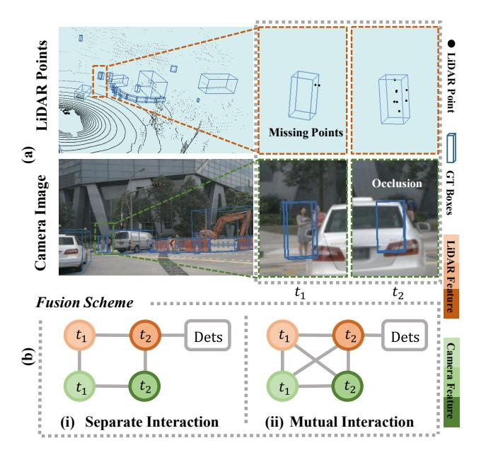
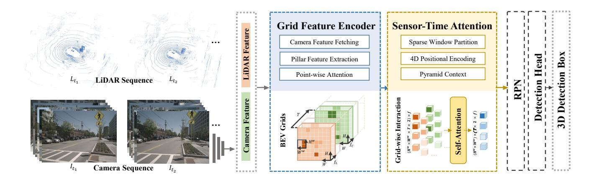
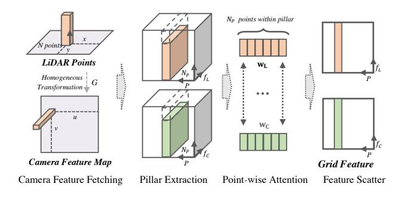
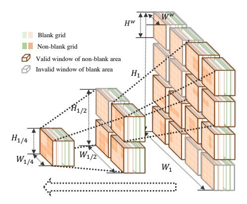
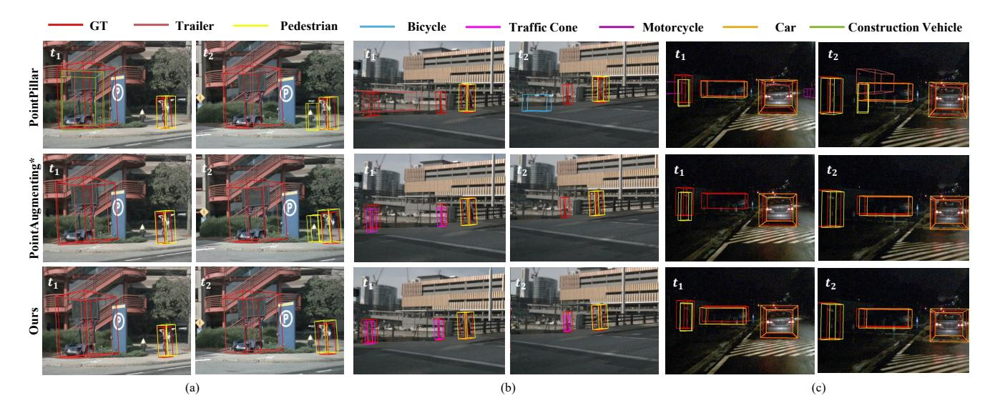

# LIFT: Learning 4D LiDAR Image Fusion Transformer for 3D Object Detection

Yihan Zeng1 Da Zhang2 Chunwei Wang1 Zhenwei Miao2
Ting Liu2 Xin Zhan2 Dayang Hao2 Chao Ma1\*

1 MoE Key Lab of Artificial Intelligence, AI Institute, Shanghai Jiao Tong University

2 Alibaba DAMO Academy

{zengyihan, weiwei0224, chaoma}@sjtu.edu.cn, zhangda.zhang@alibaba-inc.com

#### **Abstract**

LiDAR and camera are two common sensors to collect data in time for 3D object detection under the autonomous driving context. Though the complementary information across sensors and time has great potential of benefiting 3D perception, taking full advantage of sequential crosssensor data still remains challenging. In this paper, we propose a novel LiDAR Image Fusion Transformer (LIFT) to model the mutual interaction relationship of cross-sensor data over time. LIFT learns to align the input 4D sequential cross-sensor data to achieve multi-frame multi-modal information aggregation. To alleviate computational load, we project both point clouds and images into the bird-eye-view maps to compute sparse grid-wise self-attention. LIFT also benefits from a cross-sensor and cross-time data augmentation scheme. We evaluate the proposed approach on the challenging nuScenes and Waymo datasets, where our LIFT performs well over the state-of-the-art and strong baselines.

#### 1. Introduction

3D object detection plays the primary role in scene understanding for autonomous driving, where cameras and LiDAR are two standard complementary sensors for autonomous vehicles to perceive environments in time. Cameras provide sequential 2D images with rich texture and color cues, while LiDAR specializes in distance sensing via continuous sparse 3D points. Successfully detecting 3D objects in the environments hinges on the best exploitation of all available data across sensors and time to cooperate complementary information. However, we observe that the cross-sensor information may be misaligned over time, as illustrated in Figure 1(a). The reasons lie in two aspects. First, there may exist asynchronous timelines between Li-DAR and cameras. Second, the different coordinate systems across sensors introduce spatial misalignment even between

Figure 1. Illustration of the information interaction between sequential cross-sensor data. (a) The misaligned complementary information cross sensors over time. (b) Information fusion scheme: (i) Integrating the cross-sensor data at the corresponding timestamp, then combining the sequential information within sensor streams. (ii) Aggregating information from all timestamps in cross-sensor data streams. Mutual interaction can better connect misaligned complementary information across sensors and time.

synchronized images and point clouds.

Due to the challenges of jointly processing sequential cross-sensor data, existing 3D object detection algorithms independently perform information fusion over time or across sensors. On one hand, a large portion of approaches attempt to exploit the valuable temporal information from multiple frames or a longer sequential input [18, 35, 41, 42]. In addition to the straight-forward point concatenation [20, 35] to produce denser point cloud, con-

\* Corresponding author.

volution layers [18], recurrent networks [8, 42], and objectcentric fusion module [24, 36, 41] have shown favorable results on modeling temporal information. On the other hand, many approaches make use of cross-sensor data, which contains richer textures and broader context than singlemodal input especially for small objects or instances at far range. The typical cross-sensor fusion schemes include proposal-level feature concatenation [11, 22], feature projection [15,20] and point-wise concatenation [27,31]. However, existing approaches do not take full advantage of information fusion across sensors and time simultaneously, which potentially limits the performance of multi-modal 3D object detection. Though the very recent work [20] makes an early trial of learning a 4D network, in fact, it uses a preprocessing scheme to concatenate points as temporal fusion, which treats the information interaction as separate parts. By contrast, as shown in Figure 1(b), we propose to explicitly model the mutual correlations between cross-sensor data over time, aiming at the full utilization of misaligned complementary information.

Recent advances in sequential modeling [1, 30, 34] and audio-visual fusion [7, 29] demonstrates that Transformer, as an emerging powerful architecture, is very competent in modeling the information interaction for sequential data or cross-modal data. That is mainly because that the mutual relationship can be easily encoded by the intrinsic self-attention module in Transformer. However, it is not feasible to directly apply the standard Transformer architecture for sensor-time fusion in 3D object detection, owing to two facts: 1) The massive amount of 3D points as a sequence input is computationally prohibitive for Transformer. 2) The mutual interaction across sensors and time is beyond the scope of Transformer.

To address the above issues, we present a novel LiDAR Image Fusion Transformer, short for LIFT, to learn the 4D spatiotemporal information fusion across sensor and time. Specifically, LIFT contains a grid feature encoder and a sensor-time 4D attention network. In the grid feature encoder, we fetch camera features for corresponding points and conduct pillar feature extraction to project both LiDAR points and point-wise camera features into the Bird-Eye-View (BEV) space. By keeping a relatively small number of grids, we are able to efficiently compute the inter-grid mutual interactions and the intra-grid fine-grained attention. The grid-wise sensor-time relations naturally reside in 4D and thus can be encoded by an attention network. In more detail, we design a 4D positional encoding module to locate the tokens across sensors and time, and further reduce computational overhead by sparse window partition and pyramid context structure with enlarged receptive fields. Additionally, we equip our detector with a novel sensor-time consistent data augmentation scheme.

In brief, our contributions can be summarized as follows:

- To our knowledge, we first propose the Transformerbased end-to-end 3D detection framework that explores the integrated utilization of sequential multimodal data. The proposed method is capable to align the 4D spatiotemporal cross-sensor information.
- We propose a simple yet effective data augmentation technique to preserve both the cross-sensor and cross-time consistency to facilitate training 3D detectors.
- We conduct extensive experiments on the challenging large-scale nuScenes and Waymo datasets. The proposed LIFT performs well over the state-of-the-art.

## 2. Related Work

Point Cloud Object Detection. LiDAR-based 3D detectors localize and classify objects from point clouds, which can be broadly grouped into two categories: point-based and grid-based. The point-based methods [26, 39, 40] take raw points as input and apply PointNet [23] to extract point-wise features and generate proposals for each point. The gridbased methods [12, 35, 37, 38, 43, 48] propose to convert point clouds into regular grids as input. PointPillars [12] typically transfers point clouds into a BEV pseudo image, while Voxelization [25, 35, 48] maps point clouds into regular 3D voxels. Compared to point-based methods, gridbased methods are computationally efficient, accelerating the training on large-scale datasets such as nuScenes [2] and Waymo [28] with state-of-the-art detection performance. In this work, we follow PointPillars [12] to transfer point cloud into a BEV feature map.

Temporal Fusion. A straight-forward temporal fusion scheme is to concatenate points from adjacent frames [2, 20, 35], which yields denser point representation but without explicit consideration of temporal correlation. Instead, some recent approaches [8, 24, 41, 42] make further exploration to model the temporal information interaction at the feature level, including object-centric design [24,36,41] and scene-centric design [8, 18, 42]. For the object-centric design, temporal feature fusion is conducted on top of object proposals. This helps to aggregate information efficiently over a long temporal span but depends on the quality of proposal generation. For the scene-centric design, feature fusion is performed based on the whole scene. Fast-and-Furious [18] uses convolution layers to fuse middle-level features. Furthermore, recurrent networks [8, 42] show improvements when modeling temporal correlation. However, the RNN-based methods are computationally intensive given the high dimensional features. In this work, we propose a novel Transformer-based module to encode the interaction relationships across frames. Compared to early works [46], our method explores the spatiotemporal correlation in a unified module. In addition, our network is designed with cross-sensor fusion together.

Figure 2. Architecture of LiDAR Image Fusion Transformer (LIFT). LIFT takes both sequential LiDAR point clouds and sequential camera images as input, which are processed into BEV grids by *Grid Feature Encoder* and fused with *Sensor-Time 4D Attention*.

**Cross-Sensor Fusion.** Cross-sensor fusion between cameras and LiDAR has shown great advantages for 3D object detection. Some approaches perform fusion based on 2D detection results [22] or object region proposals [3,11]. Another line of attempts [14, 15, 44] fuse cross-modal features at the BEV space [15, 44]. From a different perspective, other methods [9, 27, 31, 47] perform fusion at point level. For example, PointPainting [31] and PointAugmenting [32] respectively fetch segmentation scores and image features for each LiDAR points by project points into camera images. Despite the demonstrated success, those projectionbased approaches are easily affected by projection errors, resulting in ambiguous fusion with misaligned information. In this work, we build a Transformer-based architecture to rethink the cross-modal information interaction problem in the time stream.

**Transformer.** Transformers were first proposed for the sequence-to-sequence machine translation task [30]. The core mechanism of Transformers, self-attention, makes it particularly suitable for modeling sequential relationship [5, 10, 13, 19]. The self-attention operation also provides a natural potential for cross-modal information fusion. Examples include fusing audio and visual signals for audio enhancement [29], speech recognition [7] and video retrieval [4]. In the context of autonomous driving, several works apply the attention mechanism to fuse global cross-modal signals for motion forecasting and planning [21, 33]. In this work, we apply the self-attention in sparse 4D windows, considering both the spatiotemporal and cross-sensor interaction at the same time.

## 3. LiDAR Image Fusion Transformer

In this work, we present LiDAR Image Fusion Transformer (LIFT), an end-to-end single-stage 3D object detection approach, which takes both sequential point clouds and

images as input and aims at exploiting their mutual interactions. Figure 2 illustrates the overall architecture of our proposed method, which consists of two main components: (1) *Grid Feature Encoder* (Section 3.1) to process the input sequential cross-sensor data into grid features. (2) *Sensor-Time 4D Attention* (Section 3.2) to learn the 4D sensor-time interaction relations given the grid-wise BEV representations. Furthermore, we equip our LIFT with sensor-time data augmentation (Section 3.3).

#### 3.1. Grid Feature Encoder

Compared to a typical point cloud detectors, which learns to classify and localize objects based on single-frame LiDAR point cloud, LIFT takes both sequential point clouds and camera images as input. Specifically, the point clouds can be presented as a sequence of frames  $\mathcal{L} = \{L_{t_i}\}_{i=1}^T$ , where  $L_t = \{l_1, \ldots, l_{N_L}\}$  consists of  $N_L$  LiDAR points  $l_i \in \mathbb{R}^d$  scattered over the 3D coordinate space. Besides, camera images are presented in time stream  $\mathcal{I} = \{I_{t_i}\}_{i=1}^T, I_t \in \mathbb{R}^{U \times V \times 3 \times N_C}$ , where U and V denotes the original image size, and  $N_C$  is the number of images per scan. For sequential data processing, we use the prior of vehicle pose to remove the effects of ego-motion between different point clouds, then we process each frame following the feature generation pipeline as shown in Figure 3.

Camera Feature Fetching. For perspective alignment between modalities, we first align the representations for cross-sensor data input. Specifically, for the camera input, we use the off-the-shelf 2D object detector [45] to extract image features. Then we project point clouds onto the image plane by a prior homogeneous transformation  $G \in \mathbb{R}^{4\times 4}$  for fetching the corresponding point-wise image features. There are two benefits. First, the point-level representation aligns images and points in the same 3D coordinate, enabling fine-grained interaction across sensor fea-

Figure 3. Pipeline of Grid Feature Encoder. We fetch the corresponding camera features for LiDAR points and then capture pillar features for each modality respectively. Besides, point-wise attention is conducted between two modalities within stacked pillars. Finally, the pillar features are scattered into 2D BEV grids.

tures. Second, the fetched image feature involves a specific range of receptive field in the image, which helps to alleviate the projection biases between two modalities.

Pillar Feature Extraction. The number of raw LiDAR points is huge and directly computing point-wise relations is a heavy load to bear. In contrast, the number of BEV grids is small. As such, we encode both point clouds and camera images into the BEV maps separately. Though the projection from 3D points to the 2D space yields information loss of the height dimension, such a loss hardly affects the intrinsic geometry of 3D objects in autonomous-driving scenes. Finally, the point-wise correlations are translated to grid-wise correlations in the BEV. Also note that the image feature extraction is independent of point cloud feature extraction, thus the modality differences are well preserved for further processing.

In more detail, we follow PointPillars [12] to quantize point clouds into P vertical pillars on fixed-size 2D grids. Then we perform linear transformation and max-pooling on each pillar as grid features, which are further scattered into BEV representation  $M^L \in \mathbb{R}^{H \times W \times f_L}$ , where H and W denote the BEV map size and  $f_L$  denotes the feature dimension. Similarly, we obtain the camera features  $M^C \in \mathbb{R}^{H \times W \times f_C}$  in the BEV as well.

**Point-wise Attention.** Inside each pillar, we propose to enhance the pillar encoding via learning a fine-grained correlation among points. Namely, we use two separate learnable linear layers both with  $N_P$  outputs to learn weights  $\mathbf{w_L} \in \mathbb{R}^{N_P}$  and  $\mathbf{w_C} \in \mathbb{R}^{N_P}$ . The weights  $\mathbf{w_L}$  and  $\mathbf{w_C}$  is learned from the combination of point cloud feature and image feature and followed by the sigmoid activation function. Then two weights are applied to the point cloud and the image features over the  $N_P$  points within the pillar, respectively. This allows for dynamic information aggregation

across two modalities at the fine-grained level with negligible extra cost.

#### 3.2. Sensor-Time 4D Attention

To model the mutual correlations of sequential point clouds and camera features, our key motivation is to exploit the self-attention mechanism in Transformer to aggregate complementary information. The classic transformer architecture [30] takes a sequence as input consisting of discrete tokens, each represented by a feature vector. In this work, the input sequence consists of sequential point cloud and image features. Formally, we assign the grid-wise features from BEV maps  $\{M_{t_i}^L, M_{t_i}^C\}_{i=1}^T$  as input tokens. To adapt to 3D object detection, we present three critical designs on top of the classic transformer to model the information interaction across sensors and time, including *Sparse Window Partition, Pyramid Context*, and *4D Positional Encoding*.

Sparse Window Partition. Although the number of tokens has been sufficiently reduced via the grid feature encoder, a small grid size usually results in a high-resolution map for favorable performance. Directly computing the tokenwise relations on the whole grip map is still not manageable. Thus, can we further reduce the network complexity while maintaining the detection accuracy? Motivated by the window partition mechanism [16], we constrain the local self-attention computation within partitioned windows, which largely reduces the number of input tokens. Compared to 2D vision tasks that take pixels in images as input, our BEV map in 3D vision is highly sparse, where the proportion of blank areas without any points is much larger than that of non-blank areas. To leverage the sparsity, we drop out the windows that only contain blank areas to further alleviate the computational load. Let the window size be  $H^{\mathrm{w}} \times W^{\mathrm{w}}$ , we obtain  $\mathbf{S}[\frac{H}{H^{\mathrm{w}}}, \frac{W}{W^{\mathrm{w}}}]$  non-overlapping windows, where S denote the selected sparse non-blank windows. Given the input sequence  $F_{in} \in \mathbb{R}^{N_F \times f}$ , where  $N_F = H^{\rm w} \times W^{\rm w} \times T \times m$  is the total number of tokens, T denotes the number of frames and m is the number of modalities, we use dot-product attention to model the mutual correlations among input tokens. We formally have:

$$\begin{split} Q &= F_{\rm in} \mathbf{M}_q, K = F_{\rm in} \mathbf{M}_k, V = F_{\rm in} \mathbf{M}_v, \\ A(Q, K, V) &= \mathrm{softmax}(\frac{QK^T}{\sqrt{d}})V, \end{split} \tag{1}$$

where Q, K, V are the query, key and value features obtained by a linear transformation on the input sequence, and  $\mathbf{M}_q, \mathbf{M}_k, \mathbf{M}_v \in \mathbb{R}^{f \times d}$  are the transformation matrix. A nonlinear transformation is applied to the attention weights to produce the output features:

$$F_{\text{out}} = \text{MLP}(A) + F_{\text{in}}.$$
 (2)

Therefore the grid features are aggregated over all tokens with learnable attention weights.

Figure 4. An illustration of pyramid context structure based on sparse windows with  $N_M=3$ . We sparsify the attention window on BEV maps according to whether the partitioned windows include only blank areas. Besides, we adapt the map scale in a pyramid structure, where the down-sampled map provides a larger receptive field.

**Pyramid Context.** Another issue with the window-based attention is that the limited local regions may not be sufficient to cover dynamic objects with large motions in adjacent frames. An intuitive solution is to enlarge the size of local windows. However, this would largely increase the parameter volume of attention  $QK^T$ , yielding heavy computational load. To enlarge the receptive field with light computation, we consider to resize BEV maps instead, where smaller resolution corresponds to larger receptive regions with fixed window size as demonstrated in Figure 4. In particular, we downsample the original BEV map  $\{M\}$  with the factor j, and then apply the aforementioned window-based attention on the packed input  $\{\{M\}_j\}^{j\in\{\frac{1}{2^{j-1}}\}_{i=1}^{N_M}}$  with shared parameters, where  $N_M$  is the number of scales. Consequently, the attention computation is adapted to:

$$\begin{split} A_{j}(Q_{j}, K_{j}, V_{j}) &= \operatorname{softmax}(\frac{Q_{j}K_{j}^{T}}{\sqrt{d}})V_{j}, \\ F_{\text{out}} &= \sum_{j} \operatorname{Up}(\operatorname{MLP}(A_{j})) + F_{\text{in}}, \end{split} \tag{3}$$

where the upsample operation  $Up(\cdot)$  is used to recover the original resolution. With linear computing complexity, the proposed pyramid context is scalable.

**4D Positional Encoding.** As vanilla self-attention is unordered, it is crucial to encode the locations of tokens in the input sequence. A common practice of positional encoding is to supplement the feature vector with positional priors. In this work, the candidate tokens in the input sequences are across both sensors and time, which requires 4-Dimensional positional encoding. Thus we introduce a 4D relative position encoder  $B \in \mathbb{R}^{(H^{w})^{2} \times (W^{w})^{2} \times T^{2} \times m^{2}}$ , where the positional matrix is parameterized as  $\hat{B} \in \mathbb{R}^{(H^{w})^{2} \times (W^{w})^{2} \times T^{2} \times m^{2}}$ 

 $\mathbb{R}^{(2H^{\mathrm{w}}-1)\times(2W^{\mathrm{w}}-1)\times(2T-1)\times(2m-1)}$  and the values in B are taken from  $\hat{B}$ . Specifically, the relative position along the spatial dimension lies in the range of  $[-H^{\mathrm{w}}+1,H^{\mathrm{w}}-1]$  and  $[-W^{\mathrm{w}}+1,W^{\mathrm{w}}-1]$ . The temporal dimension range and cross-sensor dimension range are respectively [-T+1,T-1] and [-m+1,m-1]. Thus the learnable position encoder contributes to locating each token with a position embedding, which takes the 4D relative relationship of information into account.

#### 3.3. Sensor-Time Data Augmentation

GT-Paste [35] currently serves as a popular augmentation technique for single-frame point cloud detection, which pastes virtual 3D objects in the forms of point cloud and its corresponding ground-truth box from other scenes to the current training frame. This operation largely improves the performance by alleviating the class imbalance problem and accelerating convergence. However, the naive GT-paste is not applicable in our work due to the destruction of data consistency across sensors and time. To address this issue, we propose a sensor-time data augmentation scheme that extends the vanilla augmentation pipeline to preserve both cross-sensor and cross-time consistency.

As the naive GT-paste scheme randomly picks up the virtual LiDAR object pattern  $O_{t'}$  from its original source scene  $S_{t'}$  and then paste into current training scene  $S_t$ , it treats the selected object as independent individuals. By contrast, we extend those candidates as a temporal consistent sequence to maintain cross-time consistency for sequential input. Concretely, with the training sequence of scenes  $\{S_{t-\Delta t}\}_{\Delta t=0,1,\ldots,T-1}$ , we expand the virtual LiDAR pattern candidate as a sequence  $\{O_{t^{\prime}-\Delta t}\}$  by searching from the past scenes  $\{S_{t'-\Delta t}\}$ . Notably, it is necessary to maintain the relative motion relationship within sequence, which serves as part of supervisory signal for training. Since the ego-motion between adjacent frames are different in source scenes and training scenes, we first transfer the virtual patterns in history source scene  $S_{t'-\Delta t}$  into the original source scene  $S_{t'}$  with homogeneous transformation  $\mathbf{K}_{(t'-\Delta t) \to t'}$ , and then transform them into corresponding history training scene  $S_{t-\Delta t}$  with transformation  $K_{t\to(t-\Delta t)}$ . Thus the pasted sequential patterns preserve its original motion states. To further maintain the cross-sensor consistency, we paste the corresponding image patches  $\{I_{O_{t^{'}-\Delta t}}\}$  into the training image frames  $\{I_{t-\Delta t}\}$ . Following [32], we calculate the occlusion perspective to filter out the occluded point. Leveraging the above designs, we propose a generaluse augmentation scheme that is feasible to any sequential cross-sensor training data input.

# 4. Experiments

We evaluate the proposed method on both the nuScenes dataset and Waymo datasets, and conduct extensive ablation

| Method                | Information | mAP  | NDS  | Car  | Truck | C.V. | Bus  | Trailer | Barrier | Motor. | Bicycle | Ped. | T.C. |
|-----------------------|-------------|------|------|------|-------|------|------|---------|---------|--------|---------|------|------|
| PointPillars [12]     | L           | 30.5 | 45.3 | 68.4 | 23.0  | 4.1  | 28.2 | 23.4    | 38.9    | 27.4   | 1.1     | 59.7 | 30.8 |
| 3DVID [42]            | L+T         | 45.4 | -    | 79.7 | 33.6  | 18.1 | 47.1 | 43.0    | 48.8    | 40.7   | 7.9     | 76.5 | 58.8 |
| PointPainting [31]    | L+I         | 46.4 | 58.1 | 77.9 | 35.8  | 15.8 | 36.2 | 37.3    | 60.2    | 41.5   | 24.1    | 73.3 | 62.4 |
| TCT [46]              | L+T         | 50.5 | -    | 83.2 | 51.5  | 15.6 | 63.7 | 33.0    | 53.8    | 54.0   | 53.8    | 74.9 | 52.5 |
| PointAugmenting* [32] | L+I         | 61.5 | 67.2 | 86.0 | 50.9  | 26.4 | 58.9 | 55.8    | 68.9    | 64.4   | 40.7    | 83.9 | 79.0 |
| LIFT (Ours)           | L+I+T       | 65.1 | 70.2 | 87.7 | 55.1  | 29.4 | 62.4 | 59.3    | 69.3    | 70.8   | 47.7    | 86.1 | 83.2 |

Table 1. Performance comparisons on the nuScenes test set. We report the overall mAP, NDS and mAP for each detection category, where L denotes Lidar modality, I denotes Image modality and T denotes Temporal input. \*: reproduced results based on PointPillars.

| Method                | Veh  | icle | Pede | strian | Сус  | clist | Overall |      |
|-----------------------|------|------|------|--------|------|-------|---------|------|
| Method                | L_1  | L_2  | L_1  | L_2    | L_1  | L_2   | L_1     | L_2  |
| PointPillars          | 66.0 | 61.3 | 67.4 | 62.3   | 62.8 | 62.4  | 65.4    | 62.0 |
| PointPainting [31]    | 66.6 | 61.9 | 63.5 | 61.2   | 63.5 | 61.2  | 64.5    | 61.4 |
| PointAugmenting* [32] | 68.1 | 63.3 | 66.9 | 62.1   | 65.4 | 63.0  | 66.8    | 62.8 |
| LIFT (Ours)           | 69.0 | 64.2 | 69.9 | 65.3   | 69.2 | 66.5  | 69.4    | 65.3 |

Table 2. Performance comparisons on the Waymo validation set. We report LEVEL\_1 and LEVEL\_2 mAP(%) for all categories (L\_1 and L\_2). All models are built on the PointPillars backbone.

studies to validate our design choices.

#### 4.1. Experimental Setup

**Datasets.** We apply two widely used auto-driving datasets including nuScenes [2] and Waymo [28]. The nuScenes dataset is collected by six cameras and a 32-beam LiDAR, consisting of 700, 150 and 150 scenes for training, validation and test respectively. Each scene is 20 seconds long with 20 Hz frequency. 3D bounding boxes are annotated at 2 Hz with 10 categories in 360 degree field of view. We follow the official evaluation protocol [2] and use mAP and NDS as the evaluation metrics on nuScenes. The Waymo dataset uses five cameras and five 64-beam LiDAR and contains 798 training scenes and 202 validation scenes. Data collection and 3D annotation are both at 10 Hz frequency. We follow the official evaluation metrics mAP and report two difficulty levels: LEVEL\_1 and LEVEL\_2.

Network Architecture and Training Details. For the sequential cross-sensor input, we use T=2 different key frames and m=2 different modalities. For network design, we use  $H^{w} = W^{w} = 4$  as the window size and each window takes as input  $N_F = 64$  tokens with feature dimension f = 64. We apply  $N_M = 3$  different scales and set the number of attention heads to 2 in all experiments. We limit the max number of points within each pillar to 20. For nuScenes data, we set the detection range to [-51.2m, 51.2m] for X and Y axis, and [-5m, 3m] for the Z axis, which is voxelized with (0.2m, 0.2m, 8m) grid size. We utilize 10 sweeps for Li-DAR enhancement and limit the max number of non-empty pillars to 30000. For Waymo data, the detection range is set to [-71.68m, 71.68m] for X and Y axis, [-2m, 4m] for Z axis, with (0.32m, 0.32m, 6m) grid size. The max number of non-empty pillars is limited to 32000. Following CenterPoint [43], we use the adamW [17] optimizer with the one-cycle policy [6]. During training, additional to our proposed sensor-time data augmentation, we use random flipping, global scaling, global rotation and global translation. Models are trained for 20 epochs on 8 V100 GPUs.

#### 4.2. Main Results

nuScenes Results. We compare our algorithm with the state-of-the-art approaches as illustrated in Table 1. For fair comparison, all the presented methods are pillarbased detectors. In particular, PointPillars [12] is a singleframe point cloud detector that is used as the baseline of our model. 3DVID [42] uses a ConvGRU module to exploit the temporal information from sequential point clouds. TCT [46] applies a channel-wise transformer network to integrate the information of multiple point cloud frames. PointPainting [31] and PointAugmenting [32] are typical methods that fuse camera features with LiDAR points. Our method outperforms these approaches by large margins, boosting the original PointPillars by 34.6\% and the current best PointAugmenting method by 3.6%. Table 1 shows that, although 3D object detectors generally benefit from cross-sensor or cross-time information fusion, our proposed method makes the best of all available data across sensors and time by modeling the mutual correlation, and thus achieves state-of-the-art performance.

Waymo Results. We also make comparisons on the Waymo dataset in Table 2. We reproduce all models based on PointPillars as well. Note that the camera configurations in Waymo are different from nuScenes, covering only around 250 degree field. In contrast to applying two models on camera FOV and LiDAR FOV separately as in PointAugmenting [32], we apply a unified model on full view as adaption to real application. Results show that previous cross-modal detectors fail to achieve consistent improvements on pedestrian and cyclist categories. However, our method generalizes and scales well, which consistently outperforms previous methods, especially boosts the original LiDAR-only detector on the challenging pedestrian and cyclist categories by large margins.

**Qualitative Results.** We qualitatively compare with Point-Pillars and PointAugmenting on the nuScenes dataset in

| Mathad | Cahama    | Inf      | ormat        | ion          |       |       |
|--------|-----------|----------|--------------|--------------|-------|-------|
| Method | Scheme    | L        | I            | Т            | mAP   | NDS   |
|        |           | <b>√</b> |              |              | 24.83 | 40.36 |
|        | Concat    | <b>√</b> |              | <b>√</b>     | 26.74 | 42.97 |
| (I)    |           | ✓        | $\checkmark$ |              | 41.59 | 48.60 |
|        |           | ✓        | $\checkmark$ | $\checkmark$ | 44.57 | 52.19 |
|        |           | <b>√</b> |              | <b>√</b>     | 27.75 | 43.71 |
| (II)   | Self-Attn | ✓        | $\checkmark$ |              | 43.22 | 49.49 |
|        |           | ✓        | $\checkmark$ | $\checkmark$ | 47.04 | 54.40 |

Table 3. Analysis of information fusion and fusion schemes. Concat: concatenate the grid-wise BEV features between different inputs and fuse with convolution layers. Self-Attn: treat grid features as separate tokens and fuse with self-attention. Inputs: Lidar points (L), images (I), and sequential information in time (T).

| Length        | Ours  | Δ      | Cat [20] | Δ      |
|---------------|-------|--------|----------|--------|
| T = 1         | 24.83 | -      | 24.83    | -      |
| T = 2         | 27.75 | +2.92  | 26.60    | +1.57  |
| T = 3         | 30.37 | +5.54  | 25.64    | +0.81  |
| T = 4         | 30.77 | +5.94  | 25.52    | +0.69  |
| T = 5         | 30.97 | +6.14  | 26.07    | +1.24  |
| T = 2  (+Img) | 47.04 | +22.21 | 43.74    | +19.91 |

Table 4. Comparisons of the input sequence lengths. Cat: the point concatenation scheme [20] for sequential point clouds. Ours: the proposed fusion method using self-attention.

Figure 5. By introducing the cross-sensor information in camera features, the 3D detector can better perceive small objects and eliminate false detections. Besides, our method can further enhance the 3D perception by exploiting the complementary information across sensors and time, which is beneficial to more accurate and stable predictions.

#### 4.3. Ablation Studies

We conduct ablation studies on the nuScenes dataset to validate each proposed component. For efficiency, we apply 1/8 subset of the training set to train the network and test on the whole validation set.

**Effects of information fusion.** We compare different information fusion settings and fusion schemes in Table 3. We summarize the following observations:

(1) Benefits of information fusion (I): Based on a single-frame point cloud detector (first line), the introduction of camera feature (second line) and sequential point cloud (third line) yields considerable improvements of +16.76% and +1.91% mAP respectively, illustrating the valuable complementary information from cross-sensor and temporal data. Furthermore, combining the LiDAR and image streams together leads to a large gain of +19.74% mAP. This motivates us to take the full advantage of all available data across sensors and time.

|     | Naive | Cross        | I            | T            | mAP   | NDS   |
|-----|-------|--------------|--------------|--------------|-------|-------|
| (a) |       |              |              |              | 24.83 | 40.36 |
| (b) | ✓     |              |              |              | 27.64 | 43.09 |
| (c) |       |              |              | <b>√</b>     | 27.75 | 43.71 |
| (d) |       | $\checkmark$ |              | $\checkmark$ | 32.11 | 47.51 |
| (e) |       |              | <b>√</b>     | <b>√</b>     | 47.04 | 54.40 |
| (f) |       | $\checkmark$ | $\checkmark$ | $\checkmark$ | 51.78 | 58.96 |

Table 5. Effectiveness of data augmentation. Naive [35]: original copy-and-paste scheme on point cloud only. cross: our cross-sensor and cross-time augmentation. T: the sequential input of point cloud. I+T: the sequential input of both images and points.

|     | PA           | PE           | PC           | Sparse       | mAP   | NDS   |
|-----|--------------|--------------|--------------|--------------|-------|-------|
| (g) |              |              |              |              | 49.76 | 57.84 |
| (h) | $\checkmark$ |              |              |              | 50.25 | 57.95 |
| (i) | $\checkmark$ | $\checkmark$ |              |              | 50.50 | 58.44 |
| (j) | $\checkmark$ | $\checkmark$ | $\checkmark$ |              | 51.30 | 58.51 |
| (k) | $\checkmark$ | $\checkmark$ | $\checkmark$ | $\checkmark$ | 51.78 | 58.96 |

Table 6. Ablation results on architecture components. PA: the point-wise attention operation in grid feature encoder. PE: our proposed 4D relative positional encoding . PC: the pyramid context. Sparse: the sparse window partition for 4D attention.

(2) Benefits of fusion scheme (I, II): On top of the single-frame point cloud detector, our proposed sensor-time 4D attention module (last line) achieves an overall +22.21% performance gain. Besides, the proposed attention fusion scheme (II) consistently achieves better detection accuracy than the simple concatenation fusion scheme (I), i.e. 43.22 vs 41.59 for L+I input and 27.75 vs 26.74 for L+T input. The information misalignment is a crucial problem for feature fusion, and cannot be well handled by straightforward concatenation. The superior performance demonstrates the capability of our proposed attention mechanism to effectively model the information interaction across sensors and time.

In Table 4, we further illustrate the ability of our method to model temporal correlations. As shown in the last line, replacing our attention mechanism with the point concatenation scheme for temporal fusion [20] yields a 3.3% mAP drop. Comparing Ours (second column) with Cat (fourth column), we consistently observe larger discrepancy when increasing the length of the input sequence, which suggests the superiority of our method to aggregate information over a longer time period. Note that we set T=2 throughout experiments to alleviate computational load.

Effects of sensor-time data augmentation. We validate the effectiveness of our proposed data augmentation scheme in Table 5. As illustrated in (a) and (b), the original copyand-paste operation yields an improvement of +2.81% mAP, indicating the importance of data augmentation on

Figure 5. Qualitative results. We compare with LiDAR-only PointPillars [12] and cross-modal PointAugmenting [32]. (a) illustrates the superiority of temporal fusion, where our method can alleviate false positive detection on human-like objects in  $t_2$  to preserve temporal consistency with  $t_1$ . In (b), cross-sensor information helps reduce detection errors, and our method consistently detects the traffic cone in adjacent frames. The night-view images in (c) introduces ambiguous features that result in false negative car detection in PointAugmenting, while our method successfully utilizes the mutual information across sensors and time to recall the car object. Best viewed in color.

| Method                  | mAP   | Image  | Fusion | Total  |
|-------------------------|-------|--------|--------|--------|
| LIFT (448 × 800)        | 51.78 | 151 ms | 164 ms | 315 ms |
| LIFT (w/o Sparse)       | 51.30 | 151 ms | 201 ms | 352 ms |
| LIFT (896 × 1600)       | 51.83 | 714 ms | 164 ms | 878 ms |
| LIFT $(224 \times 400)$ | 44.20 | 46 ms  | 167 ms | 213 ms |

Table 7. Run-time comparison on the nuScenes dataset. We report the runtime for image backbone (Image), encoder and attention fusion (Fusion) and end-to-end inference (Total).

sequential cross-modal input. By comparing (c) vs (d) and (e) vs (f), our augmentation consistently achieves +4.36% mAP and +4.74% mAP gains on sequential point cloud and sequential cross-sensor data respectively, showing that our scheme is capable to preserve the cross-modal and temporal data consistency.

Effects of architecture designs. We report the ablation results of the proposed architecture components in Table 6. Note that all experiments are conducted with the proposed sensor-time data augmentation scheme. From (g) to (k), we observe progressive performance gains with the proposed point-wise attention (PA), 4D positional encoding (PE), pyramid context (PC) and sparse window partition (Sparse). Comparing (g) and (k), the proposed network components further improve mAP by 2.02%.

**Run-time efficiency.** We report the runtime efficiency in Table 7. As the Transformer design inevitably introduces extra computational load, our sparse window design can effectively reduce the Fusion time from  $201 \ ms$  to  $164 \ ms$ ,

resulting in an end-to-end runtime of 315~ms on par with the recent state-of-the-art detectors [25, 36]. We also observe a large runtime jump (i.e. 878~ms) using a larger  $896 \times 1600$  image resolution, and a significant performance drop (i.e. 44.2~mAP) with a smaller  $224 \times 400$  resolution. Thus, we choose the final design based on the tradeoffs between speed and accuracy.

# 5. Conclusion

We have presented LIFT, a LiDAR Image Fusion Transformer that simultaneously aligns the spatiotemporal crosssensor 4D information for 3D object detection in real-world autonomous-driving scenarios. Particularly, we encode both the LiDAR frames and camera images as sparsely-located BEV grid features and propose a sensor-time 4D attention module to effectively and efficiently capture the mutual correlations. Furthermore, we devise a general yet simple data augmentation technique to enhance the training dynamics while persevering the data consistency. With the proposed end-to-end single-stage 3D object detector, we improved strong baselines by large margins and achieved state-of-the-art performance on the challenging nuScenes and Waymo benchmark datasets.

Acknowledgements. This work was supported in part by NSFC (61906119, U19B2035), Shanghai Municipal Science and Technology Major Project (2021SHZDZX0102), the National Key Research and Development Program of China (2020AAA0108104), Alibaba Innovative Research (AIR) Program and Alibaba Research Intern Program.

#### References

- [1] Gedas Bertasius, Heng Wang, and Lorenzo Torresani. Is space-time attention all you need for video understanding? *arXiv preprint arXiv:2102.05095*, 2021. 2
- [2] Holger Caesar, Varun Bankiti, Alex H Lang, Sourabh Vora, Venice Erin Liong, Qiang Xu, Anush Krishnan, Yu Pan, Giancarlo Baldan, and Oscar Beijbom. nuscenes: A multimodal dataset for autonomous driving. In CVPR, pages 11621–11631, 2020. 2, 6
- [3] Xiaozhi Chen, Huimin Ma, Ji Wan, Bo Li, and Tian Xia. Multi-view 3d object detection network for autonomous driving. In *CVPR*, pages 1907–1915, 2017. 3
- [4] Valentin Gabeur, Chen Sun, Karteek Alahari, and Cordelia Schmid. Multi-modal transformer for video retrieval. In ECCV, pages 214–229, 2020. 3
- [5] Francesco Giuliari, Irtiza Hasan, Marco Cristani, and Fabio Galasso. Transformer networks for trajectory forecasting. arXiv preprint arXiv:2003.08111, 2020. 3
- [6] Sylvain Gugger. The 1cycle policy, 2018. 6
- [7] David Harwath, Antonio Torralba, and James R Glass. Unsupervised learning of spoken language with visual context. In *NeurIPS*, 2017. 2, 3
- [8] Rui Huang, Wanyue Zhang, Abhijit Kundu, Caroline Pantofaru, David A Ross, Thomas Funkhouser, and Alireza Fathi. An 1stm approach to temporal 3d object detection in 1idar point clouds. In ECCV, pages 266–282, 2020. 2
- [9] Tengteng Huang, Zhe Liu, Xiwu Chen, and Xiang Bai. Epnet: Enhancing point features with image semantics for 3d object detection. In *ECCV*, pages 35–52, 2020. 3
- [10] Yingfan Huang, HuiKun Bi, Zhaoxin Li, Tianlu Mao, and Zhaoqi Wang. Stgat: Modeling spatial-temporal interactions for human trajectory prediction. In *ICCV*, pages 6272–6281, 2019. 3
- [11] Jason Ku, Melissa Mozifian, Jungwook Lee, Ali Harakeh, and Steven L Waslander. Joint 3d proposal generation and object detection from view aggregation. In *IROS*, pages 1–8, 2018. 2, 3
- [12] Alex H Lang, Sourabh Vora, Holger Caesar, Lubing Zhou, Jiong Yang, and Oscar Beijbom. Pointpillars: Fast encoders for object detection from point clouds. In CVPR, pages 12697–12705, 2019. 2, 4, 6, 8
- [13] Lingyun Li, Luke, Bin Yang, Ming Liang, Wenyuan Zeng, Mengye Ren, Sean Segal, and Raquel Urtasun. End-to-end contextual perception and prediction with interaction transformer. arXiv preprint arXiv:2008.05927, 2020. 3
- [14] Ming Liang, Bin Yang, Yun Chen, Rui Hu, and Raquel Urtasun. Multi-task multi-sensor fusion for 3d object detection. In CVPR, pages 7345–7353, 2019. 3
- [15] Ming Liang, Bin Yang, Shenlong Wang, and Raquel Urtasun. Deep continuous fusion for multi-sensor 3d object detection. In ECCV, pages 641–656, 2018. 2, 3
- [16] Ze Liu, Yutong Lin, Yue Cao, Han Hu, Yixuan Wei, Zheng Zhang, Stephen Lin, and Baining Guo. Swin transformer: Hierarchical vision transformer using shifted windows. arXiv preprint arXiv:2103.14030, 2021. 4
- [17] Ilya Loshchilov and Frank Hutter. Decoupled weight decay regularization. arXiv preprint arXiv:1711.05101, 2017. 6

- [18] Wenjie Luo, Bin Yang, and Raquel Urtasun. Fast and furious: Real time end-to-end 3d detection, tracking and motion forecasting with a single convolutional net. In CVPR, pages 3569–3577, 2018. 1, 2
- [19] Jean Mercat, Thomas Gilles, Nicole Zoghby, El, Guillaume Sandou, Dominique Beauvois, and Guillermo Pita Gil. Multi-head attention for multi-modal joint vehicle motion forecasting. In *ICRA*, pages 9638–9644, 2020. 3
- [20] AJ Piergiovanni, Vincent Casser, Michael S Ryoo, and Anelia Angelova. 4d-net for learned multi-modal alignment. In *ICCV*, pages 15435–15445, 2021. 1, 2, 7
- [21] Aditya Prakash, Kashyap Chitta, and Andreas Geiger. Multi-modal fusion transformer for end-to-end autonomous driving. In CVPR, pages 7077–7087, 2021. 3
- [22] Charles R Qi, Wei Liu, Chenxia Wu, Hao Su, and Leonidas J Guibas. Frustum pointnets for 3d object detection from rgb-d data. In CVPR, pages 918–927, 2018. 2, 3
- [23] Charles R Qi, Hao Su, Kaichun Mo, and Leonidas J Guibas. Pointnet: Deep learning on point sets for 3D classification and segmentation. In CVPR, pages 652–660, 2017.
- [24] Charles R Qi, Yin Zhou, Mahyar Najibi, Pei Sun, Khoa Vo, Boyang Deng, and Dragomir Anguelov. Offboard 3d object detection from point cloud sequences. In CVPR, pages 6134– 6144, 2021.
- [25] Shaoshuai Shi, Chaoxu Guo, Li Jiang, Zhe Wang, Jianping Shi, Xiaogang Wang, and Hongsheng Li. PV-RCNN: Pointvoxel feature set abstraction for 3d object detection. In CVPR, pages 10529–10538, 2020. 2, 8
- [26] Shaoshuai Shi, Xiaogang Wang, and Hongsheng Li. Pointrcnn: 3D object proposal generation and detection from point cloud. In CVPR, pages 770–779, 2019. 2
- [27] Vishwanath A Sindagi, Yin Zhou, and Oncel Tuzel. Mvxnet: Multimodal voxelnet for 3d object detection. In *ICRA*, pages 7276–7282, 2019. 2, 3
- [28] Pei Sun, Henrik Kretzschmar, Xerxes Dotiwalla, Aurelien Chouard, Vijaysai Patnaik, Paul Tsui, James Guo, Yin Zhou, Yuning Chai, Benjamin Caine, et al. Scalability in perception for autonomous driving: Waymo open dataset. In CVPR, pages 2446–2454, 2020. 2, 6
- [29] Efthymios Tzinis, Scott Wisdom, Aren Jansen, Shawn Hershey, Tal Remez, Daniel PW Ellis, and John R Hershey. Into the wild with audioscope: Unsupervised audio-visual separation of on-screen sounds. arXiv preprint arXiv:2011.01143, 2020. 2, 3
- [30] Ashish Vaswani, Noam Shazeer, Niki Parmar, Jakob Uszkoreit, Llion Jones, Aidan N Gomez, Łukasz Kaiser, and Illia Polosukhin. Attention is all you need. In *NeurIPS*, pages 5998–6008, 2017. 2, 3, 4
- [31] Sourabh Vora, Alex H Lang, Bassam Helou, and Oscar Beijbom. Pointpainting: Sequential fusion for 3d object detection. In CVPR, pages 4604–4612, 2020. 2, 3, 6
- [32] Chunwei Wang, Chao Ma, Ming Zhu, and Xiaokang Yang. Pointaugmenting: Cross-modal augmentation for 3d object detection. In *CVPR*, pages 11794–11803, 2021. 3, 5, 6, 8
- [33] Bob Wei, Mengye Ren, Wenyuan Zeng, Ming Liang, Bin Yang, and Raquel Urtasun. Perceive, attend, and drive: Learning spatial attention for safe self-driving. In *ICRA*, pages 4875–4881, 2021. 3

- [34] Chao-Yuan Wu and Philipp Krahenbuhl. Towards long-form video understanding. In CVPR, pages 1884–1894, 2021. 2
- [35] Yan Yan, Yuxing Mao, and Bo Li. Second: Sparsely embedded convolutional detection. *Sensors*, 18(10):3337, 2018. 1, 2, 5, 7
- [36] Bin Yang, Min Bai, Ming Liang, Wenyuan Zeng, and Raquel Urtasun. Auto4d: Learning to label 4d objects from sequential point clouds. arXiv preprint arXiv:2101.06586, 2021. 2, 8
- [37] Bin Yang, Ming Liang, and Raquel Urtasun. HDNet: Exploiting hd maps for 3D object detection. In *CoRL*, pages 146–155, 2018.
- [38] Bin Yang, Wenjie Luo, and Raquel Urtasun. Pixor: Realtime 3D object detection from point clouds. In CVPR, pages 7652–7660, 2018. 2
- [39] Zetong Yang, Yanan Sun, Shu Liu, and Jiaya Jia. 3DSSD: Point-based 3D single stage object detector. In CVPR, pages 11040–11048, 2020.
- [40] Zetong Yang, Yanan Sun, Shu Liu, Xiaoyong Shen, and Jiaya Jia. Std: Sparse-to-dense 3D object detector for point cloud. In *ICCV*, pages 1951–1960, 2019.
- [41] Zetong Yang, Yin Zhou, Zhifeng Chen, and Jiquan Ngiam. 3d-man: 3d multi-frame attention network for object detection. In CVPR, pages 1863–1872, 2021. 1, 2
- [42] Junbo Yin, Jianbing Shen, Chenye Guan, Dingfu Zhou, and Ruigang Yang. Lidar-based online 3d video object detection with graph-based message passing and spatiotemporal transformer attention. In CVPR, pages 11495–11504, 2020. 1, 2,
- [43] Tianwei Yin, Xingyi Zhou, and Philipp Krähenbühl. Center-based 3d object detection and tracking. arXiv preprint arXiv:2006.11275, 2020. 2, 6
- [44] Jin Hyeok Yoo, Yeocheol Kim, Ji Song Kim, and Jun Won Choi. 3d-cvf: Generating joint camera and lidar features using cross-view spatial feature fusion for 3d object detection. *arXiv* preprint arXiv:2007.08856, 2020. 3
- [45] Fisher Yu, Dequan Wang, Evan Shelhamer, and Trevor Darrell. Deep layer aggregation. In CVPR, pages 2403–2412, 2018. 3
- [46] Zhenxun Yuan, Xiao Song, Lei Bai, Zhe Wang, and Wanli Ouyang. Temporal-channel transformer for 3d lidar-based video object detection for autonomous driving. TCSVT, 2021. 2, 6
- [47] Yihan Zeng, Chao Ma, Ming Zhu, Zhiming Fan, and Xi-aokang Yang. Cross-modal 3d object detection and tracking for auto-driving. In *IROS*, 2021. 3
- [48] Yin Zhou and Oncel Tuzel. Voxelnet: End-to-end learning for point cloud based 3d object detection. In CVPR, pages 4490–4499, 2018. 2