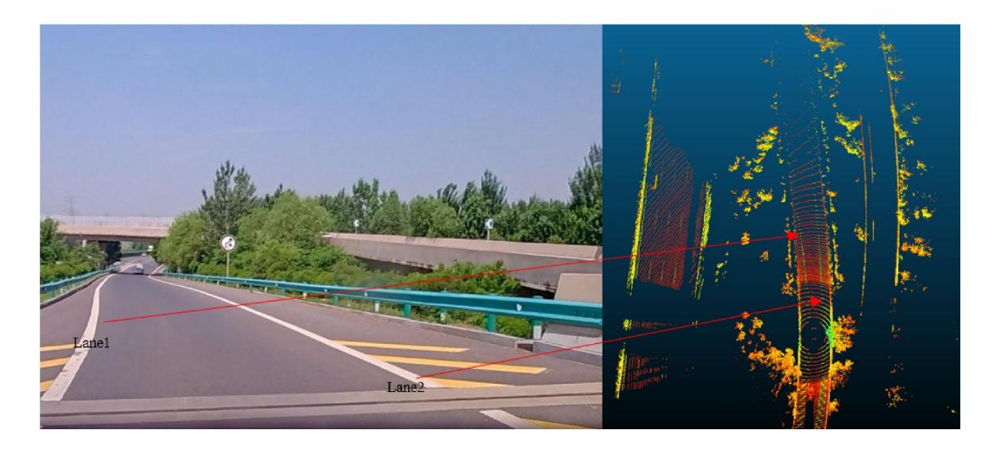
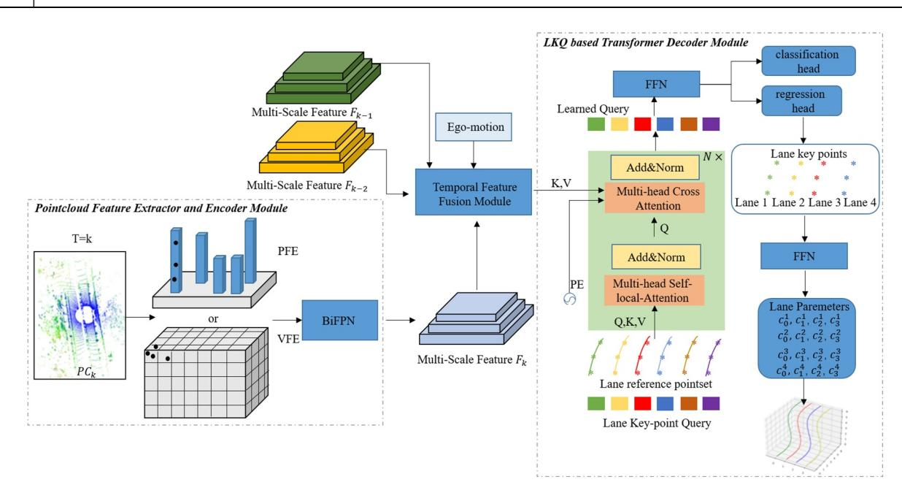
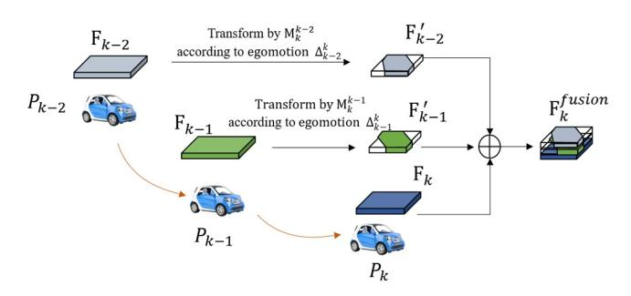
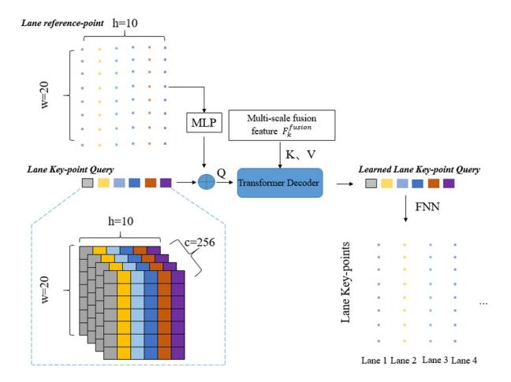
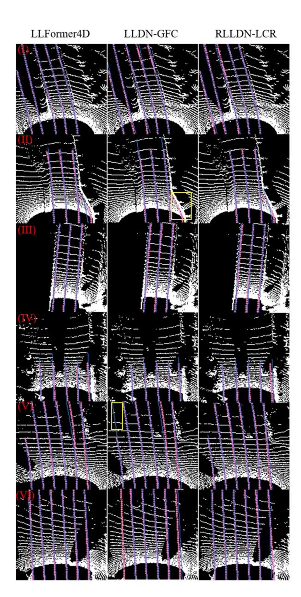
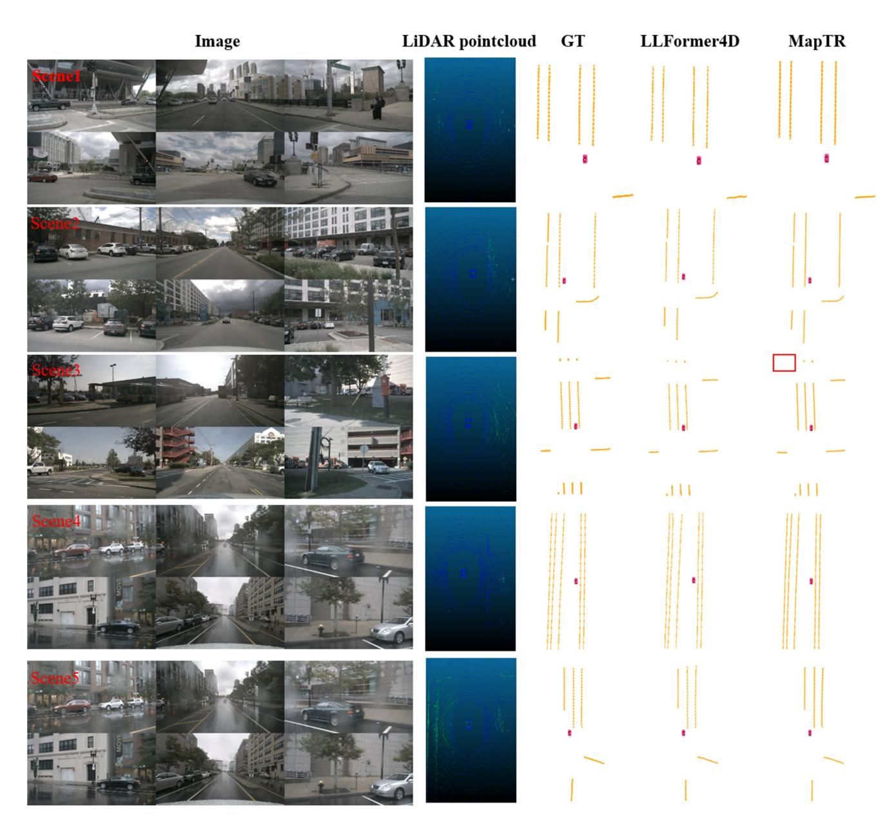
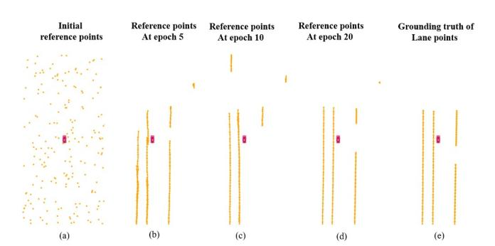
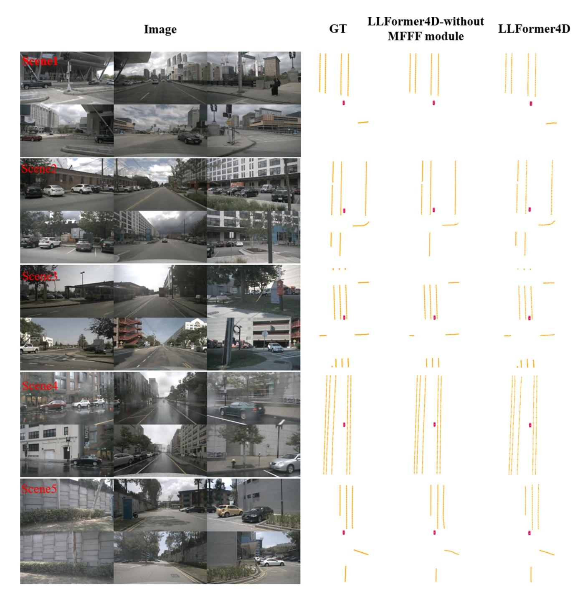

DOI: 10.1049/cvi2.12338

#### ORIGINAL RESEARCH

# LLFormer4D: LiDAR-based lane detection method by temporal feature fusion and sparse transformer

Jun Hu1 | Chaolu Feng2 | Haoxiang Jie1 | Zuotao Ning1 | Xinyi Zuo3 | Wei Liu1,4 | Xiangyu Wei5

#### Correspondence

Haoxiang Jie. Email: jie.hx@reachauto.com

#### Funding information

Development and Application of Vehicle Cloud Collaboration Self-Evolution Platform for Advanced Automatic Driving, Grant/Award Number: 2022JH1/10400030; Intelligent Control Theories and Key Technologies of Heterogeneous Unmanned Electric Commercial Vehicles Formation, Grant/ Award Number: U22A2043

#### **Abstract**

Lane detection is a fundamental problem in autonomous driving, which provides vehicles with essential road information. Despite the attention from scholars and engineers, lane detection based on LiDAR meets challenges such as unsatisfactory detection accuracy and significant computation overhead. In this paper, the authors propose LLFormer4D to overcome these technical challenges by leveraging the strengths of both Convolutional Neural Network and Transformer networks. Specifically, the Temporal Feature Fusion module is introduced to enhance accuracy and robustness by integrating features from multi-frame point clouds. In addition, a sparse Transformer decoder based on Lane Keypoint Query is designed, which introduces key-point supervision for each lane line to streamline the post-processing. The authors conduct experiments and evaluate the proposed method on the K-Lane and nuScenes map datasets respectively. The results demonstrate the effectiveness of the presented method, achieving second place with an F1 score of 82.39 and a processing speed of 16.03 Frames Per Seconds on the K-Lane dataset. Furthermore, this algorithm attains the best mAP of 70.66 for lane detection on the nuScenes map dataset.

#### KEYWORDS

automobiles, edge detection, intelligent transportation systems, laser ranging, learning (artificial intelligence)

#### 1 | INTRODUCTION

Lane detection, as a major task of intelligent driving systems, provides necessary road information for Advanced Driving Assistance System functions such as Lane Departure Warning, Lane Keeping Assist, Auto Lane Change, and Traffic Jam Assist. In terms of the overall process, the existing lane line detection algorithms can be classified into the following two categories. One architecture involves obtaining a discrete set of lane line points through traditional methods [1, 2] or via

detection [3, 4] or segmentation [5, 6] based on Convolutional Neural Network (CNN) networks, followed by fitting the lane line curve during post-processing. Another architecture involves end-to-end output of lane line parameters from sensors input data [7, 8].

Previously, due to the limitations of hardware devices and datasets, scholarly research on lane detection mainly focused on using the single modality of the camera. Moreover, in the early stages of research, the investigation of 2D lane detection [9] based on cameras dominated the industry [10–12]. These

This is an open access article under the terms of the Creative Commons Attribution-NonCommercial-NoDerivs License, which permits use and distribution in any medium, provided the original work is properly cited, the use is non-commercial and no modifications or adaptations are made.

© 2024 The Author(s). IET Computer Vision published by John Wiley & Sons Ltd on behalf of The Institution of Engineering and Technology.

&lt;sup>1Neusoft Reach Automotive Technology (Shenyang) Co., Ltd., Shenyang, China

&lt;sup>2Key Laboratory of Intelligent Computing in Medical Image, Ministry of Education, Shenyang, China

&lt;sup>3Shenyang Institute of Automation, Chinese Academy of Sciences, Shenyang, China

&lt;sup>4School of Computer Science and Engineering, Northeastern University, Shenyang, China

5Horizon Robotics, Shanghai, China

2 of 12 HU et al.

methods typically employ 2D CNN networks [13] to infer lanes in the front view (FV). Following this, through operations like Inverse Perspective Mapping (IPM), the results in FV are converted into the bird's-eye-view (BEV) for subsequent planning and control modules [14]. With the advancement of image BEV perception technology, 3D image lane line detection has gradually garnered the attention of scholars, leading to the emergence of various representative algorithms [15–17].

However, the above-mentioned camera-based lane detection methods still suffer from several disadvantages. The performance of the lane line detection network is greatly affected by external lighting conditions. The depth information of the lane cannot be accurately obtained by the camera. Additionally, extra distortion and errors are introduced when the detected lane is converted from the FV perspective to the BEV perspective, affecting subsequent functions.

Benefiting from the development of LiDAR hardware, there has been a remarkable improvement over the LiDAR resolution and point cloud intensity information [18]. As shown in Figure 1, we can visually identify the lane points (as indicated by the green points in the ground wave line) in the LiDAR intensity point cloud map. Lidar, as a range sensing sensor, provides higher three-dimensional measurement accuracy and tolerates noises from lighting variation. Therefore, the LiDAR lane detection scheme has the advantages of higher accuracy and better environmental adaptability, gradually attracting the attention of researchers.

As a representative method of LiDAR-based lane detection algorithms, LLDN-GFC [19] is the first one to employ a Deep Neural Network for 3D lane detection. However, to capture the global characteristics of the lane, this method utilises the Multi-layer Perception (MLP)-Mixer structure, which results in considerable computational overhead. In addition, LLFormer

[8] is the first approach to use the CNN + DETR-Transformer structure for LiDAR-based lane detection, which directly outputs lane parameters through Lane Query. Although this strategy shows a fine real-time performance, the lane curve deduced based on Lane Query experiences an under-fitting due to the laser point cloud at longer distances.

In addition, we further summarise and analyse the characteristics of the above-mentioned lane line detection task. Firstly, lane lines are usually smooth, continuous, and narrow curves. Secondly, lane lines typically traverse the entire field of view (FOV) of the utilised sensor, with the lane line itself being relatively sparse compared to the input image or point cloud. Thirdly, paired lane lines often exhibit parallelism and have significant lateral spacing. Lastly, lane detection algorithms must be optimised for computational efficiency to meet the real-time requirements of industrial applications (greater than 10 Frames Per Seconds (FPS)).

Based on sufficiently analysing the characteristics of the lane detection task and the existing methods, this manuscript presents a LiDAR lane detection approach based on spatiotemporal Transformer, called LLFormer4D. LLFormer4D generally follows the network structure of CNN + DETR-Transformer from the previous work, LLFormer. Additionally, after extracting the BEV feature map via the CNN network, we introduce multi-frame laser point cloud information through the designed Multi-Frame Feature Fusion (MFFF) module to compensate for the data sparsity from using a single-frame laser point cloud, aiming to improve the accuracy, continuity, and stability of the lane detection performance. Lastly, through the Lane Key-point Query (LKQ), LLFormer4D gains the supervision and regression of lane key points and ultimately achieves high-precision referencing of lane parameters through the forward neural network.

FIGURE 1 Illustration of lane divider in high-resolution LiDAR point cloud. This figure shows an image of a specific frame in a high-speed scenario and its corresponding 128-line LiDAR point cloud. Also, it illustrates the correspondence of Lane 1 and Lane 2 in both the image and the point cloud. The point cloud in the right image is coloured based on LiDAR point cloud intensity information, demonstrating that the 128-line LiDAR has a high point cloud density, resulting in better detection performance. Notably, the point cloud of the lane is clearly distinguishable from other point clouds in terms of intensity, enabling neural networks to identify lane lines based on point cloud information.

HU et al.. 3 of 12

In brief, our contributions are as follow:

- The proposed MFFF module compensates for the sparsity of the laser point cloud by fusing multi-frame point cloud features, thereby improving the algorithm's performance in lane detection.
- The design of the instantiated LKQ effectively alleviates the under-fitting problem present in the vanilla LLFormer algorithm, which directly supervises the lane curve parameters with Lane Query. This significantly enhances the algorithm's accuracy in curved scenes.
- The proposed algorithm achieves an optimal balance among real-time performance, robustness, and accuracy. Specifically, LLFormer4D achieves a total F1 Score of 82.39 with a running frequency of 16.03 FPS on the K-Lane [20] dataset, and attains the best average precision (AP) score of 70.66 with a running frequency of 4.56 FPS on the nuScenes [21] dataset. The low-computation-cost version (LLFormer4D-tiny) achieves a total F1 Score of 74.78 with a running frequency of 27.6 FPS on the K-Lane dataset, and an AP score of 64.37 with a frequency of 10.42 FPS on the nuScenes dataset.

# 2 | RELATED WORKS

# 2.1 | Camera-based 2D lane detection

In this paper, camera-based 2D lane detection methods are categorised into five technical routes: row-wise detection-based methods, anchor-based methods, segmentation-based methods, parametric prediction methods, and attention-based methods.

Row-wise detection methods [6, 22] detect key points row by row in 2D FV images and then fit lane curves through postprocessing. These methods can make good use of shape prior information, predicting the lane location by key points for each row. However, the row-wise formulation has a main problem of instance-level discrimination. Furthermore, anchor-based methods [23, 24], to adapt to the lane detection task, borrow the idea of anchor frames from the field of object detection and improve the anchor itself. For example, CurveLane [25] and PointLaneNet [12] utilise vertical lines as anchors. However, these methods require predefined anchors, resulting in a low degree of freedom in formulating the lane shape. Additionally, segmentation-based methods are widely used in the industry [5, 25, 26]. Still, these methods require a post-clustering strategy to distinguish each lane instance after segmenting the foreground data, which can be very timeconsuming in some complex scenarios. Moreover, some researchers try to predict the lane curve parameters end-to-end [7, 27]. For example, LSTR [7] uses the CNN + Transformer structure to learn the curve parameters of lanes through Object Query. These methods do not require a complex postprocessing process, but the given cubic polynomial prior assumption can lead to under-fitting in some scenarios, resulting in low detection accuracy. Finally, In these methods [10, 28], the attention operation is introduced into the lane

detection network, which may benefit better global feature extraction of the lane curve via the attention structure.

#### 2.2 | Camera-based 3D lane detection

The 2D lane detected under the front view image lacks depth information, and it is usually necessary to use IPM and other operations to convert it into the vehicle body coordinate system for subsequent planning and control modules. However, this conversion process often introduces significant errors and distortions. Recently, some scholars have tried to draw on vision BEV perception technology [29, 30] to directly extract lane line features in 3D space based on 2D front view images. For example, 3D-LaneNet + [31] divides the BEV features into non-overlapping cells and detects lanes by regressing the lateral offset distance relative to the cell centre, line angle and height offset. BEV-LaneDet [17] proposes the Spatial Transformation Pyramid to transform FV feature maps into BEV features and perform lane detection in BEV space. PersFormer [15] and CurveFormer [32] use the Transformer network to learn the BEV feature from the front view images and further perform 3D lane detection.

#### 2.3 | LiDAR-based 3D lane detection

In early LiDAR-based lane detection studies, scholars often judge potential lane points based on given intensity thresholds. Then, the final lane curve is obtained by combining clustering operations, noise removal and polynomial fitting [33, 34]. These methods rely on manually set thresholds, and the rule-based post-processing process is time-consuming, and cannot meet the complex scenarios encountered by intelligent driving.

In recent years, some scholars have attempted to perform LiDAR-based lane detection by using deep learning networks [35, 36]. In this work [37], a CNN backbone is utilised to detect the ego lane lines in the highways based on LiDAR. D. Paek et al. publish the first LiDAR lane dataset (K-Lane) and propose the LLDN-GFC algorithm [19] and RLLD-LCR algorithm [38]. H. Jie et al. describe the LLFormer algorithm [8], which uses voxel feature encoding to extract features from 3D LiDAR point clouds. It then employs the Lane Query-based Transformer encoder to realise the inference of lane curve parameters.

#### 3 | THE PROPOSED METHOD

#### 3.1 Overview of the proposed network

The overall structure of the proposed LLFormer4D is shown in Figure 2. In the *kth* frame, the raw LiDAR point clouds are processed by the Feature Extractor and Encoder Module to obtain a multi-scale BEV feature map  $F_k$ . Then, the multi-scale features  $F_k - 2$ ,  $F_k - 1$  and  $F_k$  are aligned in the temporal

4 of 12 HU ET AL.

FIGURE 2 Overview of the proposed method. The LiDAR point cloud  $PC_k$  of frame K is processed by the Pointcloud Feature Extractor and Encoder Module to obtain the multi-scale feature map  $F_k$ . Subsequently, it, along with the historical frame feature maps  $F_{k-1}$  and  $F_{k-2}$ , as well as the ego-motion information obtained from the CAN-bus, is input into the TFF module to output a fused feature map. Next, the fused feature map is sent to the LKQ-based Transformer decoder module, where it undergoes linear mapping to obtain K and V, and interacts with the LKQ (based on cross-attention). Finally, the algorithm utilises the learnt LKQ to classify and regress the lane key points. LKQ, Lane Key-point Query; TFF, Temporal Feature Fusion.

dimension by the proposed Temporal Feature Fusion (TFF) module based on ego-motion information, which outputs the fusion feature  $F_k^{fusion}$ . Furthermore, the multi-scale features  $F_k^{fusion}$  are fed into the LKQ based Transformer Decoder Module to realise instance-by-instance lane key-point detection. Each LKQ corresponds to one lane instance and the classification results and position information of each lane key point can be calculated by the learnt LKQ through the Feed-Forward Neural Network (FNN) and network head. Finally, the lane curve parameters are fitted from the lane key points through the FNN.

# 3.2 | Point-cloud feature extractor and Encoder Module

In this module, we initially extract BEV feature  $F_{KE}$  from the raw LiDAR point cloud using either the Pillar-based Feature extractor (PFE) or the voxel feature encoder (VFE). Both PFE and VFE represent classic methods for encoding features in point clouds. VFE, originating from VoxelNet [39], partitions the 3D point cloud into voxels along the length, width, and height directions. Subsequently, it employs MLP and maximum pooling operations to derive the feature tensor  $T_k \sim Dimension(H*W*D*C)$ . The features  $T_k$  obtained through VFE form a 4D tensor, with H, W, and D representing the voxel numbers along the X, Y, and Z axes, and C denoting the feature dimension. Given that 3D CNN operations typically follow VFE, we introduce a space-to-channel operation [40] post-VFE to convert  $T_k$  into a 3D tensor, denoted as

 $T_k' \sim Dimension(H*W*DC)$ , thereby mitigating the computational overhead associated with 3D convolution. On the other hand, PFE, derived from PointPillars [41], follows a similar overall process to VFE. However, PFE divides the original 3D point cloud into pillars along the X and Y axes and then extracts the 3D feature tensor using an MLP network and pooling operations. Consequently, the subsequent backbone for PFE is typically a 2D CNN network.

Following the VFE/PFE, we employ the Bidirectional Feature Pyramid Network operation [42] to acquire multiscale feature map  $F_k$  through cross-scale connections and weighted feature fusion. Specifically, in LLFormer4D, we leverage three feature maps with down-sampling sizes of 2, where  $F_k = \{F_k^i, i \in 0, 1, 2\}$ .

# 3.3 | Temporal Feature Fusion module

In the proposed MFFF Module, we aim to combine egomotion information to align the point cloud features of multiple historical frames to the current frame and perform feature fusion. Historical point cloud features capture information about the surrounding environment from LiDAR data in previous frames. By integrating these historical features with those from the current frame, challenges such as missed or false lane line detections—caused by occlusions or perspective distortions—can be effectively mitigated. The effectiveness of this approach has been validated in the ablation study section of this paper. The advantages of combining multi-frame point cloud feature information through the MFFF module are summarised as follows: HU et al. 5 of 12

• It can compensate for the sparsity of point clouds and improve the detection accuracy of the algorithm.

- It can reduce the influence of vehicle occlusion on lane line detection and improve the robustness of the algorithm.
- It can maintain the continuity and smoothness of lane detection results across multiple frames.

However, point clouds captured at different times are obtained under distinct vehicle coordinate systems. Therefore, before fusion, it is necessary to be uniformly transformed into the current vehicle coordinate system to eliminate the effects of vehicle motion on the point cloud features. Directly applying motion transformations to each point in the original point cloud to align multiple frames with the current frame, followed by feature extraction and fusion, would require substantial computational resources, leading to suboptimal realtime performance. To address this, historical point cloud features—represented as feature maps in the BEV perspective after voxelisation—can be aligned with the current frame's coordinate system using spatial transformations based on the vehicle's trajectory within the BEV space. This method requires only a Euclidean transformation of each pixel in the feature map, substantially reducing computational demands and enhancing real-time performance compared to processing the original point cloud.

The following Figure 3 depicts the detailed process of the TFF. Assume that the position of the vehicle at frame k is  $P_k$ , and the corresponding multi-scale point cloud feature is  $F_k = \{F_k^i, i \in 0, 1, 2\}$ . The ego-motion of the vehicle from

FIGURE 3 Temporal Feature Fusion (TFF) process. Due to the sparsity of LiDAR point clouds, we combined the multi-frame LiDAR feature map information to enhance the algorithm's detection performance and robustness. For the historical feature map  $F_{k-1}$ , we transform it into the current coordinate system using ego-motion information. First, we calculate the ego-vehicle transformation matric  $M_{k-1}^k$  based on the ego-motion  $\Delta_{k-1}^k$ , as per equation 1. Subsequently, the inverse transformation matrix  $M_k^{k-1}$  is computed for the historical feature map using equation 2. The results in the transformed feature map  $F'_{k-1}$ , which compensates for the effects of egovehicle motion, as described in equation 3. A similar process is applied to the historical feature map  $F_{k-2}$ , yielding the transformed feature map  $F'_{k-2}$ , as shown in equation 4. After rotation and translation transformations, these feature maps were converted into the current frame's vehicle coordinate system  $P_k$ . They were then concatenated with the current frame's feature map  $F_k$  and processed through convolution operations to obtain the multi-scale temporal fusion feature  $F_k^{fusion}$ , as shown in Figure 5.

 $P_{k-1}$  to  $P_k$  is  $\Delta_{k-1}^k$  and can be calculated by equation 1, where  $\delta_{yaw}^{k-1,k}, \delta_x^{k-1,k}, \delta_y^{k-1,k}$  represent the variation in the heading angle, x-axis, and y-axis directions, respectively. According to vehicle kinematics, we can obtain the homogeneous transformations matrix  $M_{k-1}^k$  based on the ego-motion  $\Delta_{k-1}^k$  by equation 1, which describes the motion of the vehicle from  $P_{k-1}$  to  $P_k$ .

$$\Delta_{k-1}^{k} = \begin{bmatrix} \delta_{yaw}^{k-1,k}, \delta_{x}^{k-1,k}, \delta_{y}^{k-1,k} \end{bmatrix} \sim M_{k-1}^{k}$$

$$= \begin{bmatrix} \cos\left(\delta_{yaw}^{k-1,k}\right) & -\sin\left(\delta_{yaw}^{k-1,k}\right) & \delta_{x}^{k-1,k} \\ \sin\left(\delta_{yaw}^{k-1,k}\right) & \cos\left(\delta_{yaw}^{k-1,k}\right) & \delta_{y}^{k-1,k} \end{bmatrix}$$

$$0 \qquad 0 \qquad 1$$

$$(1)$$

Then, we can see the BEV feature map  $F_{k-1}$  as image, and use the inverse matrix  $M_k^{k-1}$  to rotate and translate the feature map  $F_{k-1}$  to obtain its representation  $F'_{k-1}$  in the current frame coordinate system  $Coord_k = \{x_k, P_k, y_k\}$ . The above process can be represented by equation 2 and equation 3. Similarly, we can get  $F'_{k-2}$  based on equation 4. Furthermore, we concatenate the features of  $F'_{k-2}$ ,  $F'_{k-1}$ ,  $F_k$  and crop the feature map based on the field of view (FOV) in the current frame, which is expressed by  $[\star]_{FOV}$  and the empty parts are zero-filled. Finally, the multi-frame fusion feature  $F_k^{Fusion}$  is obtained by CNN layer processing, and this process is shown in equation 5.

$$\Delta_k^{k-1} = \left[ -\delta_{yaw}^{k-1,k}, -\delta_x^{k-1,k}, -\delta_y^{k-1,k} \right] \sim M_k^{k-1} \tag{2}$$

$$F_{k-1}' = \left\{ F_{k-1}^{i'} | i = 0, 1, 2 \right\}, F_{k-1}^{i'} = M_k^{k-1} F_{k-1}^i \tag{3}$$

$$F_{k-2}' = \left\{ F_{k-2}^{i'} | i = 0, 1, 2 \right\}, F_{k-2}^{i'} = M_k^{k-2} F_{k-2}^i \tag{4} \label{eq:4}$$

$$F_{k}^{fusion} = \mu \Big( \big[ F_{k-2}' \oplus F_{k-1}' \oplus F_{k} \big]_{FOV} \Big)$$
 (5)

Where  $\mu(\star)$  represents CNN operation.

# 3.4 | LKQ-based sparse Transformer Decoder Module

Previous studies, like LSTR [7] and LLFormer [8], have shown that a Transformer decoder based on instantiated Query can effectively eliminate the time-consuming post-processing during lane curve detection. This kind of sparse Query token can reduce the number of cross-attention operations in the Transformer decoder [43, 44], enhancing the efficiency of the algorithm compared to directly using a dense Map Query [29]. Nevertheless, LLFormer and LSTR both assume a cubic curve for the lane and employ Lane Query to directly learn the parameters of the cubic curve, leading to unsatisfactory accuracy in these

6 of 12 HU ET AL.

algorithms. In this paper, we integrate key point concepts from row-wise detection-based methods to improve the Lane Query-based Transformer Decoder layer in LLFormer and introduce the LKQ based Transformer decoder module. The lane reference points are initialised as randomly learnable parameters. During the training process, these parameters are continuously learnt and updated to acquire prior knowledge. As demonstrated in Efficient DETR [45], Anchor DETR [46], and DETR3D [43], the reference points in the Transformer decoder layer can provide the initial position of the target and interact with the object query for calculation. The initialisation and interaction can accelerate the convergence of the Transformer decoder layer and improve detection performance.

As illustrated in Figure 4, we utilise hLKQ to learn features of lane key points row by row with h representing the assumed maximum number of lanes. Each LKQ of w\*c dimension represents a lane instance with w denoting the number of key points, and c indicating the feature dimension of the key points to be learnt. In addition, we use lane reference points to explicitly supervise the position of key points, accelerating the convergence of the decoder layer. Specifically, the lane reference points are transformed into a feature tensor of c dimension through the MLP layer and subsequently concatenated with the LKQ. The result will undergo a self-attention operation and output the Q token, as shown in equation 6.

$$Attention(Q, K, V) = softmax\left(\frac{QK^{T}}{\sqrt{d_k}}\right)V \qquad (6)$$

Where  $d_k$  denotes the feature dimension of each head in the multi-head attention calculation.

Furthermore, the Q token, the K token obtained from  $F_b^{Fusion}$ , and the V token undergo cross-attention computation.

**FIGURE 4** LKQ-based sparse Transformer decoder network. The 2D Lane reference-point is encoded to a 256-dimensional vector via MLP and concatenated with the LKQ to form the Q query. The multi-scale Temporal fusion feature map  $\vec{P}_k^{fusion}$  undergoes linear mapping [47] to obtain the K query and V query. Q, K, and V are processed through the Transformer decoder layer to obtain the learnt Query, which is then passed through the FNN layer to generate the instantiated lane detection results. LKQ, Lane Keypoint Query; MLP, Multi-layer Perception.

This process is repeated N times to obtain the learnt LKQ as formulated in equation 7.

$$DeformaAttn(Q, p_q, F_k^{Fusion})$$

$$= \sum_{m=1}^{M} W_m \left[ \sum_{k=1}^{K} A_{mqk} \cdot W'_m F_{kth}^{Fusion} (P_q + \Delta p_{mqk}) \right]$$
(7)

Where Q is regarded as a query with  $p_q$  as its position, and  $F_k^{Fusion}$  denotes the fused multi-scale features.  $W_m$  represents the outputs of different heads,  $W_m'$  is used to transform  $F_k^{Fusion}$  to value, and  $A_{mqk}$  represents the attention weights. For  $\Delta p_{mqk}$ , it is the positional offset of the sampling set point concerning the reference point.

The prediction head of LLFormer4D consists of a classification branch and a point regression branch. The classification branch predicts the instance class score, while the point regression branch predicts the positions of the key points.

#### 3.5 | Loss function

The loss function comprises two components: classification loss and point loss. The classification loss determines the confidence level of curve detection results, while the point loss calculates the shape and position of the lane curve.

We calculate the classification loss using the cross-entropy loss function, with the formula as follows:

$$L_{cls} = \frac{1}{N} - [y_i \cdot \log(p_i) + (1 - y_i) \cdot \log(1 - p_i)]$$
 (8)

Point loss, as shown in equation 9, supervises the location of each predicted point. The ground truth (GT) point that best matches the predicted point is identified. The point loss is the Manhattan distance calculated between each pair of assigned points.

$$L_{pts} = \sum_{i=1}^{N} D_{Manhattan}(p_i, g_i)$$
 (9)

TABLE 1 Results on K-Lane dataset.

|                 |          | F1 score |       |       |        |       |
|-----------------|----------|----------|-------|-------|--------|-------|
| Method          | Modality | Total    | Night | Curve | Crowed | FPS   |
| Heuristic [34]  | LiDAR    | 26.40    | 26.00 | 27.60 | 16.70  | 9.10  |
| SCNN [26]       | LiDAR    | 71.60    | 66.10 | 64.40 | 69.70  | 15.50 |
| LLDN-GFC [19]   | LiDAR    | 82.10    | 82.00 | 78.00 | 75.90  | 5.70  |
| RLLDN-LCR [38]  | LiDAR    | 82.74    | 82.92 | 76.16 | 74.32  | 6.30  |
| LLFormer [8]    | LiDAR    | 73.70    | 74.70 | 59.80 | 67.50  | 35.90 |
| LLFormer4D-tiny | LiDAR    | 74.78    | 75.21 | 64.22 | 68.69  | 27.60 |
| LLFormer4D      | LiDAR    | 82.39    | 83.01 | 72.13 | 79.03  | 16.03 |

Note: The best results for each column in the table are indicated in bold font

HU ET AL. 7 of 12

### 4 | EXPERIMENT AND EVALUATION

#### 4.1 Datasets

We evaluate LLFormer4D using two public LiDAR lane datasets, K-Lane and nuScenes map. The K-Lane dataset employs an Ouster OS264 LiDAR sensor for data acquisition with a maximum distance of 240 m. There are 15,382 frames of data containing LiDAR point clouds of urban roads and highways under different conditions and scenarios. The

FIGURE 5 Lane detection results based on K-Lane dataset. We selected various scenarios such as straight roads, curves, and narrowing roads for testing and compared our results with the current SOTA algorithms LLDN-GFC and RLLDN-LCR on this dataset. In the figures, the pink curves represent the GT of the lane lines, while the blue curves represent the detection results of our algorithm. GT, ground truth; SOTA, state of the arts.

perceptual range is [0 m, 46.08 m] along the X-axis [-11.52 m, 11.52 m] along the Y-axis, and [-4.0 m, 4.0 m] along the Z-axis.

The nuScenes map dataset contains 1000 scenes with each lasting about 20 s. We chose the lane divider, a map element, for evaluation. The perceptual range is [-15.0 m, 15.0 m] along the *X*-axis [-30.0 m, 30.0 m] along the *Y*-axis, and [-5.0 m, 3.0 m] along the *Z*-axis.

#### 4.2 | Evaluation metrics

For the K-Lane dataset, the F1 score serves as a criterion to assess the correctness of detecting lane curve locations. The F1 score can be expressed as:

$$F_1 = \frac{TP}{TP + 0.5(FP + FN)} \tag{10}$$

For the nuScenes dataset, we used AP to evaluate the quality of lane detection. The chamfer distance is utilised to assess the alignment between the predicted value and the GT. We compute the  $AP_{\tau}$  at multiple  $D_{\textit{chamfer}}$  thresholds  $\tau \in T, T = \{0.5, 1.0, 1.5\}$ , and the final AP metric is detailed as:

$$AP = \frac{\sum_{\tau \in T} AP_{\tau}}{|T|} \tag{11}$$

# 4.3 | Implementation details

The inputs of our model consist of points. The learning rate is set to cosine annealing learning with a minimum learning rate of  $1e^{-6}$ . The batch size is set to 6, and the AdamW optimiser is used. We apply the voxel feature extractor and sparse convolution to be the backbone. The number of training epochs is

TABLE 2 Results on nuScenes map val dataset.

| Method            | Modality         | Backbone                  | Epochs | AP    | FPS   |
|-------------------|------------------|---------------------------|--------|-------|-------|
| HDMapNet [48]     | Camera           | Effi-B0                   | 30     | 21.70 | 0.80  |
| HDMapNet          | LiDAR            | PointPillars              | 30     | 24.10 | 1.00  |
| HDMapNet          | Camera& LiDAR | Effi-B0& PointPillars  | 30     | 29.60 | 0.50  |
| VectorMapNet [49] | Camera           | ResNet50                  | 110    | 47.30 | 2.90  |
| VectorMapNet      | LiDAR            | PointPillars              | 110    | 37.60 | -     |
| VectorMapNet      | Camera& LiDAR | ResNet50& PointPillars | 110    | 47.50 | -     |
| MapTR [50]        | Camera           | ResNet50                  | 24     | 51.50 | 11.20 |
| MapTRV2 [51]      | Camera& LiDAR | ResNet50& SECOND       | 24     | 66.50 | 5.80  |
| LLFormer [8]      | LiDAR            | VoxelNet                  | 20     | 53.71 | 5.90  |
| LLFormer4D-tiny   | LiDAR            | PointPillars              | 20     | 64.37 | 10.42 |
| LLFormer4D        | LiDAR            | VoxelNet                  | 20     | 70.66 | 4.56  |

8 of 12 HU et al.

set to 20. We utilise RTX3090 Ti graphic process unit and PyTorch 1.8.1 to conduct experiments on the machine with an Ubuntu 18.04.

# 4.4 | Experiment results

# 4.4.1 | Results on the K-lane dataset

We assess the LLFormer4D on the K-Lane dataset and compare it with current state-of-the-art lane detection

methods. To achieve higher detection accuracy, we employ the voxel-based backbone in LLFormer4D. Table 1 presents the experimental results, including the overall F1 score and F1 scores under representative scenarios (Night, Curve, and Crowded scenarios). Additionally, real-time performance FPS is listed in the table.

From Table 1, it is evident that the F1 Score of LLFormer4D reaches the second place on the K-Lane test set, with a total F1 score of 82.39%, just 0.35% below the current state of the arts (SOTA) method RLLDN-LCR. In night and crowded scenarios, the proposed method achieves the best accuracy with

FIGURE 6 Lane detection results on nuScenes val dataset. We further tested and validated the algorithm on the nuScenes dataset, comparing it with several representative algorithms in this dataset. In this figure, we selected five scenarios, including straight roads, intersections, and T-junctions, and provided corresponding scene images and LiDAR point cloud images, along with the GT of the lane lines. We also displayed the lane detection visualisation results of the LLFormer algorithm and the MapTR algorithm, which is the current SOTA algorithm in this dataset. GT, ground truth; SOTA, state of the arts.

HU et al. 9 of 12

corresponding F1 scores of 83.01% and 79.03%. Moreover, the proposed method operates at 16.03FPS, faster than the current SOTA method.

Being less suitable for high real-time performance requirements, the LLDN-GFC and RLLDN-LCR algorithms using the Global Feature Correlation module have lower real-time performance with the FPS of 5.7 and 6.3 respectively. Notably, the previous work, LLFormer, achieves the best real-time performance on the K-Lane dataset with an FPS of 35.9. Specifically, LLFormer employs the lane query to end-to-end learn the cubic curve parameters of the lane lines through the Transformer layer. However, it faces challenges of underfitting in curves and crowded scenarios due to sparse laser point clouds from the distance range.

In LLFormer4D, the introduction of lane reference-point and LKQs significantly improves the ability of the algorithm to supervise key points of lane dividers at each distance range. In addition, the fusion of temporal features enhances the reasoning ability in occluded lane divider scenarios. Although the real-time performance is lower than that of LLFormer due to the introduction of time-dimensional features, the running frequency of 16.03 FPS still meets engineering requirements.

Furthermore, to achieve better real-time performance, we explore the use of the pillar-based backbone in LLFormer4D, resulting in the LLFormer4D-tiny algorithm. As shown in Table 1, LLFormer4D-tiny runs at 27.6 FPS on the K-Lane dataset, balancing accuracy between LLFormer and LLFormer4D.

Finally, Figure 5 provides visualisations, where the pink line represents the GT, and the blue line represents the detection results of LLFormer4D. The algorithm demonstrates high inference accuracy in curve scenes (I), lane-narrowing scenes (II), straight road scenes (III), crowded scenes (IV), multi-lane scenes (V), and lane divider occlusion scenes (VI). However, in scenes (II) and scenes (V), the LLDN-GFC algorithm shows notible missed detections and false positives, as indicated by the yellow boxes in Figure 5.

#### 4.4.2 | Results on the nuScenes dataset

We further evaluate the LLFormer4D algorithm on the nuScenes dataset, a representative dataset for autonomous driving. The comparison includes current state-of-the-art lane detection algorithms on different sensor modalities. In Table 2, we present the sensor modality, backbone model, number of trained epochs, AP index, and FPS indicator used by the selected lane detection algorithms.

As observed in Table 2, the LLFormer4D algorithm achieves the highest lane detection accuracy in the nuScenes validation dataset, with the overall AP index peaking at 70.66. This result is greatly superior  $(4.16\uparrow)$  to the SOTA algorithm (MapTRV2). The effectiveness of the proposed algorithm is further validated. It is noteworthy that the use of a 32-beam LiDAR in the nuScenes dataset leads to relatively sparse point clouds. The annotation frequency of the dataset is 2Hz, with an annotation keyframe every 10 point

clouds. Therefore, it is typical to superimpose 10 consecutive frames of point clouds and process the combined frame as a whole input. In this context, the real-time advantage of the PointPillars-based LLFormer4D-tiny is evident, which performs an inference time of 10.42FPS in the point cloud preprocessing stage.

Figure 6 provides specific visualisations, including scene pictures obtained by six cameras, GT lane dividers, and lanes inferred by the LLFormer4D. The depicted scenarios encompass urban, suburbs, and complex intersections, demonstrating the performance of lane divider detection in accuracy. Notably, in Scene3, the MapTR algorithm presents significant missed detections, which are highlighted by red boxes in Figure 6.

During the model training process, reference points are randomly generated at the initial step. As iterations progress,

**FIGURE** 7 Visualisation of reference points during Training. This graph visualises the progression of reference points during training in a straight-line driving scenario. In the initial training phase (a), reference points are randomly generated through a uniform distribution. As training progresses, the lane key points detected and output by the network are utilised to iteratively update the reference points. By epoch 5 and epoch 10, the reference points begin to approximate the shape of the lane lines, as shown in (b) and (c). By epoch 20, the reference points have closely aligned with the ground truth (GT) of the lane points, as illustrated in (d) and (e). This demonstrates that the incorporation of prior information from Reference points effectively accelerates the convergence of the network model.

TABLE 3 Results of ablation experiments on nuScenes val dataset.

| Method                                | Backbone     | Epochs | AP    | FPS   |
|---------------------------------------|--------------|--------|-------|-------|
| Single frame with vanilla transformer | PointPillars | 20     | 48.31 | 2.73  |
| Single frame with vanilla transformer | VoxelNet     | 20     | 53.71 | 1.90  |
| Single frame with LKQ into the model  | PointPillars | 20     | 59.63 | 18.40 |
| Single frame with LKQ into the model  | VoxelNet     | 20     | 68.60 | 7.63  |
| LLFormer4D-tiny                       | PointPillars | 20     | 64.37 | 10.42 |
| LLFormer4D                            | VoxelNet     | 20     | 70.66 | 4.56  |

Note: The best results for each column in the table are indicated in bold font. Abbreviation: LKQ, Lane Key-point Query. 10 of 12 HU et al..

the lane key points detected and output by the network are stored and used to update the reference points. Throughout the training iterations, reference points are combined with LKQs, as illustrated in Figure 4. This mechanism enables the network to leverage prior information from historical detection results, thereby accelerating convergence.

Figure 7 depicts the evolution of reference points during the iteration process, using a straight-driving scenario as an example. Initially, randomised reference points are progressively updated with lane key points detected in earlier iterations. These updated reference points provide the network with prior knowledge about the lane structure, expediting the convergence of the LKQ-based sparse Transformer decoder network. Furthermore, during model inference, reference points are randomly initialised at the beginning of each scenario. As the process unfolds, they are updated using lane key

FIGURE 8 Lane detection ablation experiments results on nuScenes val dataset. We compared the results of the LLFormer4D with those of single-frame ablation experiments. When using single frame detection, the detection effect on shorter lane lines will be poor, and there may be cases where lane lines are missed in the detection results. In addition, the shape detection for distant and shorter lane lines is not accurate enough. LLformer4D provides sufficient information for the model with the addition of history frames, which can effectively avoid these problems.

HU et al. 11 of 12

points detected in the previous frame, ensuring consistency and improved predictive performance.

# 4.5 | Ablation study

In this subsection, we conduct ablation studies on the nuScenes validation dataset to evaluate the effectiveness of the proposed modules in our method. For each algorithm, the results are presented in Table 3, with 20 epochs trained, the accuracy and real-time performance provided. As shown in Table 3, using the pillar-based backbone combined with a vanilla Transformer decoding layer and employing the single-frame laser point cloud as input yields an algorithm with a real-time performance of only 2.73 FPS and an AP of 48.31. When the Voxelnet is chosen as the backbone, the AP of the algorithm increases to 53.71, but real-time performance further drops to 1.6 FPS.

In terms of the LKQ-based Transformer decoding layer, its introduction fairly improves the accuracy and real-time performance. Using PointPillar as the backbone coupled with the LKQ-based Transformer decoder, results in an improved AP of 59.63 and a real-time performance of 18.4 FPS. Similarly, using voxelnet as the backbone, this algorithm achieves an optimised AP of 68.6 and a real-time performance of 7.63 FPS. Furthermore, introducing time-dimensional features through the TFF module contributes to the development of LLFormer4D-tiny and LLFormer4D. Compared with the methods with LKQ, LLFormer4D-tiny and LLFormer4D show corresponding improvements of 4.74 and 2.06 in the AP metric. We further present the visual comparison results between using a single frame with LKQ input into the model with VoxelNet as the backbone (LLFormer4D-without MFFF module) and LLFormer4D using VoxelNet as the backbone across multiple scenarios, as shown in Figure 8. It can be observed that, particularly in scenarios 1 and 3, the introduction of multi-frame feature information significantly enhances the detection capability of the algorithm. However, in comparison to methods with only single frames, those using time-dimensional feature fusion bring a reduction in the realtime performance with running frequencies of 10.42 FPS and 4.56 FPS respectively.

#### 5 | CONCLUSIONS

In this paper, we introduce LLFormer4D for LiDAR Lane Detection in autonomous driving. In LLFormer4D, the proposed TFF module can efficiently combine historical frame features to improve the accuracy and robustness of lane detection. Additionally, we propose the LKQ Transformer decoder enhancing the accuracy for the regression of key points of the lane. Extensive experiments on K-Lane and nuScenes datasets demonstrate its outstanding performance and potential to boost the accuracy of lane detection.

We will explore integrating image information based on LLFormer4D to achieve the detection of road structure, including lane curves, road boundaries and pedestrian crossings using multi-modal sensors in future work.

#### **AUTHOR CONTRIBUTIONS**

Jun Hu: Conceptualisation; funding acquisition. Chaolu Feng: Data curation; investigation. Haoxiang Jie: Formal analysis; methodology. Zuotao Ning: Visualisation; writing review & editing. Xinyi Zuo: Data curation. Wei Liu: Funding acquisition; supervision. Xiangyu Wei: Resources; software.

#### **ACKNOWLEDGEMENTS**

This research is funded by (a) Development and Application of Vehicle Cloud Collaboration Self-Evolution Platform for Advanced Automatic Driving under Grant 2022JH1/10400030, and (b) Intelligent Control Theories and Key Technologies of Heterogeneous Unmanned Electric Commercial Vehicles Formation under Grant U22A2043.

#### CONFLICT OF INTEREST STATEMENT

There is no conflict of interest in this work.

#### DATA AVAILABILITY STATEMENT

The data that support the findings of this study are openly available in [K-Lane] at https://github.com/kaist-avelab/K-Lane, reference number [20]; and [nuScenes] at https://www.nuscenes.org, reference number [21].

#### REFERENCES

- Dong, Y., et al.: Robust lane detection and tracking for lane departure warning. In: 2012 International Conference on Computational Problem-Solving (ICCP), pp. 461–464. IEEE (2012)
- Deng, G., Wu, Y.: Double lane line edge detection method based on constraint conditions hough transform. In: 2018 17th International Symposium on Distributed Computing and Applications for Business Engineering and Science (DCABES), pp. 107–110. IEEE (2018)
- Ko, Y., et al.: Key points estimation and point instance segmentation approach for lane detection. IEEE Trans. Intell. Transport. Syst. 23(7), 8949–8958 (2021). https://doi.org/10.1109/tits.2021.3088488
- Wang, J., et al.: A keypoint-based global association network for lane detection. In: Proceedings of the IEEE/CVF Conference on Computer Vision and Pattern Recognition, pp. 1392–1401 (2022)
- Neven, D., et al.: Towards end-to-end lane detection: an instance segmentation approach. In: 2018 IEEE Intelligent Vehicles Symposium (IV), pp. 286–291. IEEE (2018)
- Qin, Z., Wang, H., Li, X.: Ultra fast structure-aware deep lane detection. In: Computer Vision–ECCV 2020: 16th European Conference, Glasgow, UK, August 23–28, 2020, Proceedings, Part XXIV 16, pp. 276–291. Springer (2020)
- Liu, R., et al.: End-to-end lane shape prediction with transformers. In: Proceedings of the IEEE/CVF Winter Conference on Applications of Computer Vision, pp. 3694

  –3702 (2021)
- Jie, H., et al.: Llformer: an efficient and real-time lidar lane detection method based on transformer. In: Proceedings of the 2023 5th International Conference on Pattern Recognition and Intelligent Systems, pp. 18– 23 (2023)
- Liu, J., et al.: Mh6d: multi-hypothesis consistency learning for categorylevel 6-d object pose estimation. IEEE Transact. Neural Networks Learn. Syst., 1–14 (2024). https://doi.org/10.1109/tnnls.2024.3360712
- Tabelini, L., et al.: Keep your eyes on the lane: real-time attention-guided lane detection. In: Proceedings of the IEEE/CVF Conference on Computer Vision and Pattern Recognition, pp. 294–302 (2021)

12 of 12 HU et al..

- Wang, Q., et al.: Dynamic data augmentation based on imitating real scene for lane line detection. Rem. Sens. 15(5), 1212 (2023). https://doi. org/10.3390/rs15051212
- Chen, Z., Liu, Q., Lian, C.: Pointlanenet: efficient end-to-end cnns for accurate real-time lane detection. In: 2019 IEEE Intelligent Vehicles Symposium (IV), pp. 2563–2568. IEEE (2019)
- Liu, J., et al.: Robotic continuous grasping system by shape transformerguided multiobject category-level 6-d pose estimation. IEEE Trans. Ind. Inf. 19(11), 11171–11181 (2023). https://doi.org/10.1109/tii.2023. 3244348
- Brabandere, B., et al.: End-to-end lane detection through differentiable least-squares fitting. Computer Science, 905–913 (2019). https://doi.org/ 10.1109/iccvw.2019.00119
- Chen, L., et al.: Persformer: 3d lane detection via perspective transformer and the openlane benchmark. In: European Conference on Computer Vision, pp. 550–567. Springer (2022)
- Garnett, N., et al.: 3d-lanenet: end-to-end 3d multiple lane detection. In: Proceedings of the IEEE/CVF International Conference on Computer Vision, pp. 2921–2930 (2019)
- Wang, R., et al.: Bev-lanedet: an efficient 3d lane detection based on virtual camera via key-points. In: Proceedings of the IEEE/CVF Conference on Computer Vision and Pattern Recognition, pp. 1002–1011 (2023)
- Zhong, C., Li, B., Wu, T.: Off-road drivable area detection: a learning-based approach exploiting lidar reflection texture information. Rem. Sens. 15(1), 27 (2022). https://doi.org/10.3390/rs15010027
- Paek, D.-H., Kong, S.-H., Wijaya, K.T.: K-lane: lidar lane dataset and benchmark for urban roads and highways. In: Proceedings of the IEEE/ CVF Conference on Computer Vision and Pattern Recognition, pp. 4450–4459 (2022)
- Paek, D.-H., Kong, S.-H., Wijaya, K.T.: K-lane: lidar lane dataset and benchmark for urban roads and highways. In: 2022 IEEE/CVF Conference on Computer Vision and Pattern Recognition Workshops (CVPRW), pp. 4449–4458 (2022)
- Caesar, H., et al.: nuscenes: a multimodal dataset for autonomous driving. CVPR (2020)
- Jayasinghe, O., et al.: Swiftlane: towards fast and efficient lane detection.
   In: 2021 20th IEEE International Conference on Machine Learning and Applications (ICMLA), pp. 859–864. IEEE (2021)
- Li, X., et al.: Line-cnn: end-to-end traffic line detection with line proposal unit. IEEE Trans. Intell. Transport. Syst. 21(1), 248–258 (2019). https://doi.org/10.1109/tits.2019.2890870
- Liu, L., et al.: Condlanenet: a top-to-down lane detection framework based on conditional convolution. In: Proceedings of the IEEE/CVF International Conference on Computer Vision, pp. 3773–3782 (2021)
- Xu, H., et al.: Curvelane-nas: unifying lane-sensitive architecture search and adaptive point blending. In: Computer Vision–ECCV 2020: 16th European Conference, Glasgow, UK, August 23–28, 2020, Proceedings, Part XV 16, pp. 689–704. Springer (2020)
- Pan, X., et al.: Spatial as deep: spatial cnn for traffic scene understanding. Proc. AAAI Conf. Artif. Intell. 32(1), (2018) https://doi.org/10.1609/aaai.v32i1.12301
- Tabelini, L., et al.: Polylanenet: lane estimation via deep polynomial regression. In: 2020 25th International Conference on Pattern Recognition (ICPR), pp. 6150–6156. IEEE (2021)
- Han, J., et al.: Laneformer: object-aware row-column transformers for lane detection. Proc. AAAI Conf. Artif. Intell. 36(1), 799–807 (2022). https://doi.org/10.1609/aaai.v36i1.19961
- Li, Z., et al.: Bevformer: learning bird's-eye-view representation from multi-camera images via spatiotemporal transformers. In: European Conference on Computer Vision, pp. 1–18. Springer (2022)
- Philion, J., Fidler, S.: Lift, splat, shoot: encoding images from arbitrary camera rigs by implicitly unprojecting to 3d. In: Computer Vision–ECCV 2020: 16th European Conference, Glasgow, UK, August 23–28, 2020, Proceedings, Part XIV 16, pp. 194–210. Springer (2020)
- 31. Efrat, N., et al.: 3d-lanenet+: anchor free lane detection using a semi-local representation. arXiv preprint arXiv:2011.01535, (2020)

 Bai, Y., et al.: Curveformer: 3d lane detection by curve propagation with curve queries and attention. In: 2023 IEEE International Conference on Robotics and Automation (ICRA), pp. 7062–7068. IEEE (2023)

- Lindner, P., et al.: Multi-channel lidar processing for lane detection and estimation. In: 2009 12th International IEEE Conference on Intelligent Transportation Systems, pp. 1–6. IEEE (2009)
- Hernandez, D.C., Hoang, V.-D., Jo, K.-H.: Lane surface identification based on reflectance using laser range finder. In: 2014 IEEE/SICE International Symposium on System Integration, pp. 621–625. IEEE (2014)
- Liu, J., et al.: Hff6d: hierarchical feature fusion network for robust 6d object pose tracking. IEEE Trans. Circ. Syst. Video Technol. 32(11), 7719–7731 (2022). https://doi.org/10.1109/tcsvt.2022.3181597
- Liu, J., et al.: Deep learning-based object pose estimation: a comprehensive survey. arXiv preprint arXiv:2405.07801. (2024)
- Martinek, P., et al.: Lidar-based deep neural network for reference lane generation. In: 2020 IEEE Intelligent Vehicles Symposium (IV), pp. 89– 94. IEEE (2020)
- Paek, D.-H., Wijaya, K.T., Kong, S.-H.: Row-wise lidar lane detection network with lane correlation refinement. In: 2022 IEEE 25th International Conference on Intelligent Transportation Systems (ITSC), pp. 4328–4334. IEEE (2022)
- Zhou, Y., Tuzel, O.: Voxelnet: end-to-end learning for point cloud based 3d object detection. In: Proceedings of the IEEE Conference on Computer Vision and Pattern Recognition, pp. 4490–4499 (2018)
- Yan, Y., Mao, Y., Li, B.: Second: sparsely embedded convolutional detection. Sensors 18(10), 3337 (2018). https://doi.org/10.3390/ s18103337
- Lang, A.H., et al.: Pointpillars: fast encoders for object detection from point clouds. In: Proceedings of the IEEE/CVF Conference on Computer Vision and Pattern Recognition, pp. 12697–12705 (2019)
- Tan, M., Pang, R., Le, Q.V.: Efficientdet: scalable and efficient object detection. In: Proceedings of the IEEE/CVF Conference on Computer Vision and Pattern Recognition, pp. 10781–10790 (2020)
- Wang, Y., et al.: Detr3d: 3d object detection from multi-view images via 3d-to-2d queries. In: Conference on Robot Learning, pp. 180–191. PMLR (2022)
- Lin, X., et al.: Sparse4d: multi-view 3d object detection with sparse spatial-temporal fusion. arXiv preprint arXiv:2211.10581. (2022)
- Yao, Z., et al.: Efficient detr: improving end-to-end object detector with dense prior. arXiv preprint arXiv:2104.01318. (2021)
- Wang, Y., et al.: Anchor detr: query design for transformer-based detector. Proc. AAAI Conf. Artif. Intell. 36(3), 2567–2575 (2022). https://doi.org/10.1609/aaai.v36i3.20158
- Paul, S., Chen, P.-Y.: Vision transformers are robust learners. Proc. AAAI Conf. Artif. Intell. 36(2), 2071–2081 (2022). https://doi.org/10.1609/ aaai.v36i2.20103
- Li, Q., et al.: Hdmapnet: an online hd map construction and evaluation framework. In: 2022 International Conference on Robotics and Automation (ICRA), pp. 4628–4634. IEEE (2022)
- Liu, Y., et al.: Vectormapnet: end-to-end vectorized hd map learning. In: International Conference on Machine Learning, pp. 22352–22369. PMLR (2023)
- Liao, B., et al.: Maptr: structured modeling and learning for online vectorized hd map construction. arXiv preprint arXiv:2208.14437. (2022)
- Liao, B., et al.: Maptrv2: an end-to-end framework for online vectorized hd map construction. arXiv preprint arXiv:2308.05736. (2023)

How to cite this article: Hu, J., et al.: LLFormer4D: LiDAR-based lane detection method by temporal feature fusion and sparse transformer. IET Comput. Vis. e12338 (2025). https://doi.org/10.1049/cvi2.12338