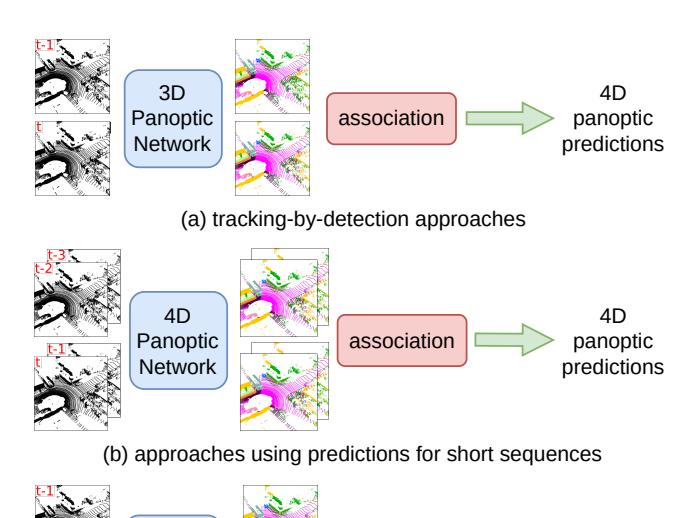
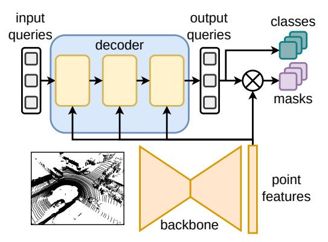
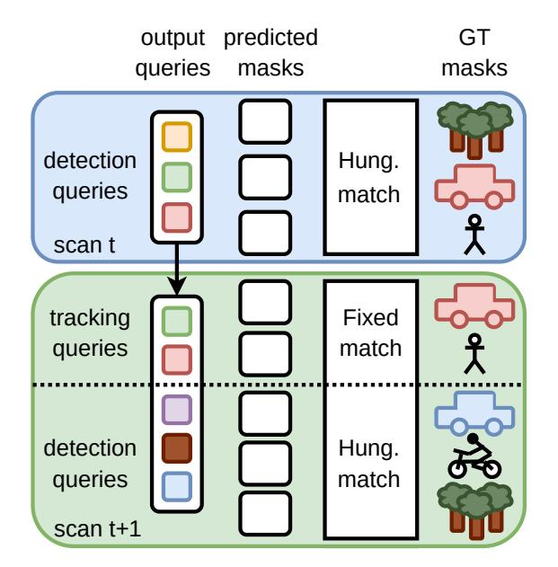
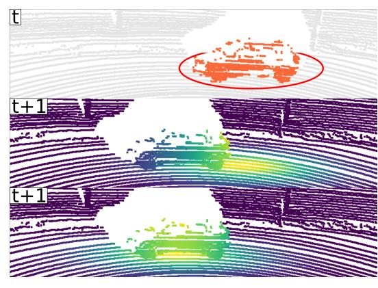
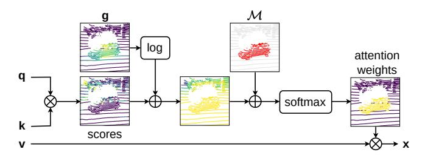
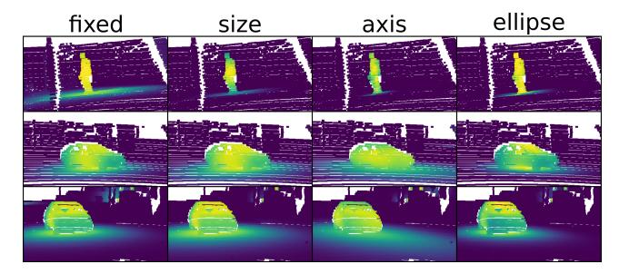
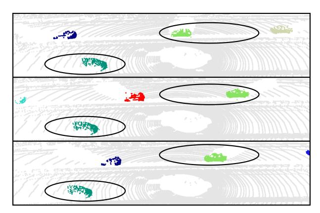

# Mask4D: End-to-End Mask-Based 4D Panoptic Segmentation for LiDAR Sequences

Rodrigo Marcuzzi Lucas Nunes Louis Wiesmann Elias Marks Jens Behley Cyrill Stachniss

Abstract—Scene understanding is crucial for autonomous systems to reliably navigate in the real world. Panoptic segmentation of 3D LiDAR scans allows us to semantically describe a vehicle's environment by predicting semantic classes for each 3D point and to identify individual instances through different instance IDs. To describe the dynamics of the surroundings, 4D panoptic segmentation further extends this information with temporarily consistent instance IDs to identify the different instances in the scans consistently over whole sequences. Previous approaches for 4D panoptic segmentation rely on post-processing steps and are often not end-to-end trainable. In this paper, we propose a novel approach that can be trained end-to-end and directly predicts a set of non-overlapping masks along with their semantic classes and instance IDs that are consistent over time without any postprocessing like clustering or associations between predictions. We extend a mask-based 3D panoptic segmentation model to 4D by reusing queries that decoded instances in previous scans. This way, each query decodes the same instance over time, carries its ID and the tracking is performed implicitly. This enables us to jointly optimize segmentation and tracking and directly supervise for 4D panoptic segmentation.

Index Terms—Semantic Scene Understanding, Deep Learning Methods

#### I. Introduction

N the context of autonomous navigation with robots or self-driving cars, spatio-temporal scene understanding is crucial to navigate the environment. It is necessary to segment the scene and identify other agents and track their motion over time. In this paper, we investigate the problem of 4D panoptic segmentation for 3D LiDAR scans [1], which requires a semantic annotation of each LiDAR scan but also information about the evolution of the individual instances throughout the whole sequence. As illustrated in Fig. 1, existing approaches use post-processing steps like clustering or association between predictions to output the final 4D predictions. This does not allow for end-to-end training. These approaches either follow the tracking-by-detection paradigm and associate

All authors are with the University of Bonn, Germany. Cyrill Stachniss is additionally with the Department of Engineering Science at the University of Oxford, UK, and with the Lamarr Institute for Machine Learning and Artificial Intelligence, Germany.

Manuscript received: Jun 23, 2023; Revised: Aug 25, 2023; Accepted: Sep 21, 2023. This paper was recommended for publication by Editor Markus Vincze upon evaluation of the Associate Editor and Reviewers' comments.

This work has partially been funded by the Deutsche Forschungsgemeinschaft (DFG, German Research Foundation) under Germany's Excellence Strategy, EXC-2070 – 390732324 – PhenoRob and by the European Union's Horizon 2020 research and innovation programme under grant agreement No 101017008 (Harmony). All authors are with the University of Bonn, Germany. Cyrill Stachniss is additionally with the Department of Engineering Science at the University of Oxford, UK, and with the Lamarr Institute for Machine Learning and Artificial Intelligence, Germany.

Digital Object Identifier (DOI): see top of this page.

(c) proposed end-to-end approach

Mask4D

4D

panoptic

predictions

Fig. 1: Different ways to obtain 4D Panoptic Segmentation: (a) tracking-by-detection: segment individual scans and associate predictions over time [24], [14]. (b) predictions for a few scans: use aggregated scans as input and clusters over the 4D point cloud. To get consistent instances over the whole sequence, associate the short sequence predictions [1], [16], [12], [36]. Other approaches rely on post-processing steps like clustering and association while our method (c) is end-to-end trainable, operates on a scan-to-scan basis and directly outputs 4D predictions.

scan-wise predictions [24], [14] or they aggregate scans and perform clustering to obtain predictions for short sequences that they later associate across such short sequences [1], [16], [12], [36]. We investigate tackling this task in an end-to-end manner jointly optimizing for segmentation and association, which cannot be done with non end-to-end methods. Our approach uses the same network to perform 3D and 4D panoptic segmentation without relying on any post-processing step, which often requires hyperparameter tuning or a manual cost matrix design. Furthermore, we modify cross-attention to add spatial prior information of the instance position given previous detections. How to combine appearance and spatial information is crucial and has a critical influence on the performance. By proposing a fully end-to-end trainable approach, we allow the model to choose the best way of combining these different types of information for this particular task in different contexts.

The main contribution of this paper is a model that performs 4D panoptic segmentation that can be trained end-to-end without any post-processing step. Inspired by MaskPLS [23], we combine learnable queries and point features from a backbone to obtain binary masks and semantic classes for each scan. To perform tracking, the queries that predicted instances in the previous scan, are used in the subsequent steps to decode the same instances and obtain consistent instance IDs throughout the whole 3D LiDAR sequence. We propose a loss function that provides negative samples during training to enforce dissimilar feature vectors for different instances and improves the tracking performance. Query-based detection networks tend to focus mainly on the appearance of the instances and often do not include important position information. To alleviate this problem, we leverage the sequential nature of commonly used 3D LiDAR scans and propose position-aware mask attention. This modification allows us to increase the attention weights on areas where the instance is located based on previous detections and motion estimation.

In sum, we make three key claims: First, our method achieves competitive performance in 4D panoptic segmentation while being end-to-end trainable without the need for any post-processing step. Second, our proposed loss function improves the tracking performance by providing negative samples. Third, our position-aware mask attention improves the performance by including spatial prior information from the LiDAR sequence.

The implementation of our approach is publicly available at https://github.com/PRBonn/Mask4D.

#### II. RELATED WORK

Semantic Segmentation on point clouds can be solved using different data representations. Some approaches work directly on raw, unstructured point clouds [29], [13], while other works [27], [21] project the 3D points into a range image and use 2D convolutional networks. State-of-the-art approaches often partition the space in 3D voxels [7], [28] and use sparse convolutions [10] to reduce the memory usage. In this context, Zu et al. [37] divide the space in cylindrical partitions while Lai et al. [17] use radial windows to partition the space in narrow and long voxels.

**3D Panoptic Segmentation** [15] refers to the joint task of fusing semantic and instance segmentation using 3D point clouds. Bottom-up methods [11], [19], [20], [26] are predominant in the LiDAR domain. They use semantic predictions to filter out the background and group the remaining points into instances with a post-processing step. Recently, Marcuzzi et al. [23] propose to exploit query-based transformer architectures [6], [31] and obtain end-to-end 3D panoptic segmentation by predicting a set of binary masks and their semantic classes.

**4D Panoptic Segmentation** is the extension of 3D panoptic segmentation of LiDAR scans to the temporal domain by requiring temporally consistent instance IDs. Aygun et al. [1] addresses the task with 4D-PLS by inputting aggregated scans and performing segmentation by grouping instances over time. In a post-processing step, they associate the short sequences predictions to get sequence-level predictions. 4D-Stop [16]

Fig. 2: MaskPLS overview. The features from the backbone are combined in each decoder layer with N learnable queries. We obtain the mask predictions via the dot product between queries and point features and the semantic class from the queries.

and 4D-DS-Net [12] follow the same approach with different clustering strategies. MOPT [14] and CA-Net [24] instead rely on tracking-by-detection and segment instances in individual scans and associate them across time. Zhu et al. [36] propose rotation-equivariant modules that they apply to existing networks to improve their performances.

**Detection and Tracking** in the LiDAR domain is usually solved using convolutional networks. PointPillars [18] projects LiDAR points into the XY plane and extracts column features, while Yan et al. [33] use sparse 3D convolutions and predict bounding boxes. CenterPoint [34] represents objects as points and tracks them by greedy closest-point matching. Weng et al. [32] provide a strong tracking baseline using 3D object detectors with a motion model to perform associations. In the image domain, recent state-of-the-art object detectors build on the ideas of DETR [5] and use transformers [30] with learnable queries to decode bounding boxes and semantic classes. Several end-to-end tracking methods [25], [35] adopt this paradigm and use previous output queries for the following camera images to decode consistent instances over time.

In this paper, we propose to perform 4D panoptic segmentation in an end-to-end manner without any post-processing. We build on top of MaskPLS [23] and use the queries to decode the same instance over time to obtain consistent instance IDs throughout the whole LiDAR sequence. This leads to an approach that allows us to directly train for the desired task and jointly optimize segmentation and association.

### III. OUR APPROACH

We base our work on MaskPLS [23], a mask-based 3D panoptic segmentation network which is end-to-end trainable and directly outputs a set of binary masks and their corresponding semantic classes. It consists of a feature extractor and a transformer decoder to combine learnable queries, which act as mask proposals, with the features and obtain the mask predictions. We extend this work to the temporal domain by reusing the queries that detected instances in previous scans to track the same instance over time and modify cross-attention to include spatial information about the instance position given the detections in previous scans.

Fig. 3: Overview of our method. We extract point features and combine them with the learnable queries to perform panoptic segmentation by predicting masks and semantic classes. We reuse the output queries that decoded instances as tracking queries in the next scans. After each detection, we fit an ellipse into the instances to get its center, size and orientation and generate a kernel to modify the attention weights. The tracking queries carry the identity of the instances, allowing us to keep consistent instance IDs over time.

#### A. Brief MaskPLS Review

First, we review the concepts of the 3D model MaskPLS [23], also illustrated in Fig. 2. It consists of a backbone to extract M point-wise features  $\mathbf{f} \in \mathbb{R}^C$  from the point cloud with M points and a transformer decoder with mask attention and N learnable queries  $\mathbf{q} \in \mathbb{R}^C$ . The queries are learnable feature vectors used as mask proposals which are input to the decoder. They are refined through consecutive decoder layers to predict the masks in the scan, either an instance of a thing class or a full stuff class. Each of the D decoder layers follows the original transformer decoder [30] replacing cross-attention with mask attention between the queries and point features from the backbone followed by selfattention and a feedforward network (FFN). The mask scores for each output query, i.e., the scores of each point for each of the N predicted masks  $\mathbf{m}_i \in [0,1]^M$ , are obtained from the output query  $q_i$  and the point features f, as follows:

$$\hat{\mathbf{m}}_i = \operatorname{sigmoid}(\mathbf{f}\mathbf{q}_i^{\top}). \tag{1}$$

The final predictions are obtained by performing argmax over the semantic logits and over the mask scores. For further information, refer to MaskPLS [23].

In MaskPLS, a fixed number of N queries at the input must decode all classes and objects in the scene. These queries get refined through the cross and self-attention layers in the decoder and the output queries are combined with the point features to decode a single mask.

#### B. Mask4D for 4D Panoptic Segmentation

In MaskPLS, the output queries that detected instances have information about the instance's appearance and position. Assuming that instances do not change too much its appearance or position in two consecutive LiDAR scans, we can use the output queries, to detect always that same instance over time. This way, we leverage the existing 3D model and modify it to perform 4D panoptic segmentation.

In our proposed approach, we use two groups of queries as input: detection queries  $Q_{\rm det}$  and tracking queries  $Q_{\rm tr}$ , and we input them simultaneously into the network at each step together with the LiDAR scan. New instances and the stuff classes are decoded by the fixed N detection queries

 $Q_{\rm det}$  while the already tracked instances are decoded by their corresponding tracking queries  $Q_{\rm tr}$  and thus keep a consistent instance ID. The number of  $Q_{\rm tr}$  varies over time depending on the number of instances being tracked. This way, we do not perform any association or post-processing, and our approach directly outputs for each point a semantic class and instance IDs which are consistent over time.

Tracking using queries: We depict the inference of our model in Fig. 3. First, we detect all the instances and the stuff classes with  $Q_{\text{det}}$ . Each time we decode a new instance, we take its corresponding output query to initialize a new tracking query, which carries the instance identity across the whole LiDAR sequence. We initialize a new tracking query when the classification score is larger than a threshold  $\tau_{\text{new}}$ . In the next scan, we concatenate  $Q_{\text{det}}$  and  $Q_{\text{tr}}$  and input them to the decoder, along with the point features from the backbone. We decode the stuff classes and the new appearing instances with  $Q_{\text{det}}$  and the already tracked instances with  $Q_{\text{det}}$ and assign consistent instance IDs. To adapt to the changing appearance of the instance, we replace the tracking query with the corresponding output query after each detection. The self-attention applied to all queries allows us to detect new instances and avoid the re-detection of the tracked objects.

**Re-identification**: To handle occlusions or instances that temporally leave the scene, we keep queries of all tracked instances, even if they have not been detected (inactive) for a maximum of  $\tau_{\text{life}}$  scans. If an inactive query decodes an instance with a classification score larger than a threshold  $\tau_{\text{re}}$ , we perform re-identification and assign the ID of the inactive track to the instance. This way, we preserve the identity of the instances even in the case of short-term occlusions.

#### C. Training Setup

We illustrate our training procedure in Fig. 4. For simplicity, we only show the predicted mask and the paired ground truth mask for each output query, to depict how we compute the loss functions. We train our model by sequentially providing S scans randomly sampled from a sequence of length L. The aim of the training is for the model to segment the whole scan and each instance over time with the same query, giving a consistent instance ID. We segment the first scan using

Fig. 4: Training setup of Mask4D. We run the inference for scan t and compute the losses on the pairs matched using the Hungarian algorithm. At t+1 we input detection and tracking queries and compute the losses over two sets. First, with a fixed matching for the tracking queries and second, with the Hungarian algorithm for the detection queries to match with new instances and stuff classes.

only  $Q_{\rm det}$  to decode all instances and stuff classes and use the Hungarian algorithm to match them with the ground truth masks and compute the losses as in MaskPLS. For the subsequent S-1 scans, we use the same set  $Q_{\rm det}$  but concatenate the output queries that decoded instances in the previous step as  $Q_{\rm tr}$ . We want detection queries to decode only the new instances and stuff masks and tracking queries to decode the already tracked instances. To do that, we perform a fixed matching between the prediction of  $Q_{\rm tr}$  and their ground truth masks and then the Hungarian algorithm for predictions given by  $Q_{\rm det}$ .

### D. Loss Function

**MaskPLS loss review.** In MaskPLS, the Hungarian algorithm matches all predicted masks  $\mathcal{Z}$  and ground truth masks  $\mathcal{Y}$  to compute the cross-entropy loss for the class and a mask loss over the K matched pairs:

$$\mathcal{L}_m = \sum_{j=1}^{K} -\lambda_{\mathrm{cls}} \log \hat{p}_j(c_i) + \mathcal{L}_{\mathrm{mask}},$$
 (2)

where  $\hat{p}_j(c_i)$  is the probability of class  $c_i$  and  $\mathcal{L}_{\text{mask}}$  is the combination of dice loss Di and binary cross-entropy CE:

$$\mathcal{L}_{\text{mask}} = \sum_{k=1}^{M} \lambda_{\text{d}} \text{Di}(\mathbf{m}_{i}(k), \hat{\mathbf{m}}_{j}(k)) + \lambda_{\text{b}} \text{CE}(\mathbf{m}_{i}(k), \hat{\mathbf{m}}_{j}(k)), \quad (3)$$

where  $\mathbf{m}_i$  is the ground truth mask i,  $\hat{\mathbf{m}}_j$  the mask scores for query j and M is the number of points. For the non-matched masks  $\mathcal{Z}_n$ , the model is enforced to predict the "no\_object" class  $\emptyset$  by computing only the class loss with  $\alpha < 1$ :

$$\mathcal{L}_n = \sum_{j \in \mathcal{Z}_n} -\alpha \log \hat{p}_j(\emptyset). \tag{4}$$

Their final loss  $\mathcal{L}_d$  is given by the sum of both losses:

$$\mathcal{L}_d = \mathcal{L}_m + \mathcal{L}_n \tag{5}$$

The loss supervises the mask predictions obtained with the input queries and after each of the  ${\cal D}$  decoder layers.

**Detection and tracking loss:** We enforce tracking queries  $Q_{\rm tr}$  to decode the same instance over time and detection queries  $Q_{\rm det}$  to decode new instances and stuff classes.

In the first scan, we are not tracking any instance and therefore use the same procedure as MaskPLS to compute our detection loss  $\mathcal{L}_d$  following Eq. (5). For the following steps, the set of predictions  $\mathcal{Z} = \mathcal{Z}_{\text{det}} \cup \mathcal{Z}_{\text{tr}}$  consists on the predictions  $\mathcal{Z}_{\text{det}}$  made by  $Q_{\text{det}}$  and the predictions  $\mathcal{Z}_{\text{tr}} = \mathcal{Z}_{\text{ac}} \cup \mathcal{Z}_{\text{in}}$  made by  $Q_{\text{tr}}$ , which correspond to the tracked instances present in the current scan (active)  $\mathcal{Z}_{\text{ac}}$  and the tracked instances not present in the scan (inactive)  $\mathcal{Z}_{\text{in}}$ . We first perform a fixed matching between the active tracking predictions  $\mathcal{Z}_{\text{ac}}$  and their corresponding ground truth masks and compute the tracking loss  $\mathcal{L}_t$  over the matched pairs using the same function as in Eq. (2).

Second, we remove tracking predictions and their ground truth and compute  $\mathcal{L}_d$  using Eq. (5) over the rest of the predictions  $\mathcal{Z}_h = \mathcal{Z}_{\text{det}} \cup \mathcal{Z}_{\text{in}}$  for the new appearing instances and stuff masks. We also supervise intermediate outputs with the detection loss, which gives D+1 terms for each tracking loss term. In addition, the first scan is only supervised for detection, which creates an imbalance between the losses that we compensate by down weighting  $\mathcal{L}_d$  with  $\alpha_d < 1$  and increase the contribution of  $\mathcal{L}_t$  by  $\alpha_t > 1$  in our detection and tracking loss  $\mathcal{L}_{dt}$ :

$$\mathcal{L}_{dt} = \alpha_d \mathcal{L}_d + \alpha_t \mathcal{L}_t. \tag{6}$$

**Matching loss.** During training, the fixed matching enforces the tracking predictions to resemble the right instances. During inference, however, a detection query could decode a tracked instance and a tracking query could decode a wrong instance. To account for that, we use the Hungarian algorithm between all predictions and ground truth and compute two losses. We select the  $K'_{\text{det}}$  instances predicted by  $Q_{\text{det}}$  that matched tracked instances and compute the loss in Eq. (4). This way, we optimize these queries to predict "no\_object" to avoid decoding a tracked instance at inference.

Then, we select the  $K'_{\rm tr}$  pairs of prediction and ground truth corresponding to instances predicted by  $Q_{\rm tr}$  that matched a wrong instance and perform a dissimilarity loss to enforce that the masks are different. We invert the ground truth mask  ${\bf m}$  to generate the target as follows:  ${\bf m}_i^* = |1-{\bf m}_i|$ . We only compute the loss over the foreground points  ${\cal F} = \{i \mid {\bf m}(i) = 1\}$  of the ground truth mask  ${\bf m}$ . The dissimilarity loss  ${\cal L}_{\rm dis}$  is the same function in Eq. (3) but only applied to the subset of foreground points  ${\cal F}$ :

$$\mathcal{L}_{\text{dis}} = \sum_{k \in \mathcal{F}} \lambda_{\text{d}}^* \text{Di}(\mathbf{m}_i^*(k), \hat{\mathbf{m}}_j(k)) + \lambda_{\text{b}}^* \text{CE}(\mathbf{m}_i^*(k), \hat{\mathbf{m}}_j(k)), \quad (7)$$

where  $\mathbf{m}_i^*$  is the inverted version of  $\mathbf{m}$  and  $\hat{\mathbf{m}}_j$  are the mask scores for query j. This enforces low scores for predictions obtained by  $Q_{\text{tr}}$  that match another instance, which can be thought of as negative samples.

The complete matching loss  $\mathcal{L}_{match}$  is:

$$\mathcal{L}_{\text{match}} = \sum_{j=1}^{K'_{\text{det}}} -\alpha \log \hat{p}_j(\emptyset) + \sum_{j=1}^{K'_{\text{tr}}} \mathcal{L}_{dis}.$$
 (8)

Our final loss  $\mathcal{L}$  is the summation:  $\mathcal{L} = \mathcal{L}_{dt} + \mathcal{L}_{match}$ 

#### E. Position-aware Mask Attention

Analysing the network predictions, we observe ID switches between instances in different positions in the scan like cars in different lanes. We argue that the problem might be that the queries encode mainly appearance information and lack important spatial knowledge.

To alleviate this problem, we propose position-aware mask attention. We leverage predictions of previous scans by adding information about the position and size of the instances to the cross-attention. Each time we detect an instance, we fit an ellipse to infer its position, size and orientation and generate a Gaussian-like kernel to modify the binary mask and the attention weights in the next step. The kernel increases the weights of points around the instance center to provide prior information from previous detections.

Ellipse fitting. We calculate the instance 2D center  $\mu = (\mu_x, \mu_y)^{\top}$  as the mean of all instance point coordinates and fit a 2D ellipse, as shown in Fig. 5 (top), using Singular Value Decomposition over the set of instance points  $\mathcal{I}$ . We compute  $U\Sigma V^* = \text{SVD}(\mathcal{I})$ , where  $\Sigma = \text{diag}(s_1, s_2)$ . We use the singular values  $s_1, s_2$  as the magnitude of the semiaxes and  $V^*$  as the orientation.

**Kernel generation.** We generate a Gaussian-like kernel  $\mathbf{g} \in \mathbb{R}^M$  for the M points for each instance  $\mathcal{I}$ , i.e., a kernel with value one at its center and exponentially decaying. We use an anisotropic squared exponential function  $G(\mathbf{x})$ :

$$G(\mathbf{x}) = \exp\left(-\frac{1}{2}(\mathbf{x} - \mu')^{\top} \mathcal{K}'(\mathbf{x} - \mu')\right). \tag{9}$$

We use  $R = V^*$  as rotation matrix to match the orientation of the instance and scale the kernel according to the instance size using the singular values  $s_1, s_2$ . We compute the new mean and covariance matrix as:

$$\mu' = R\mu, \quad \text{with} \quad K' = RKR^{\top}, \tag{10}$$

where

$$K = \begin{pmatrix} s_1^2 & 0\\ 0 & s_2^2 \end{pmatrix}. \tag{11}$$

We obtain our Gaussian-like kernel  $\mathbf{g} \in \mathbb{R}^M$  by applying  $G(\mathbf{x})$  to the point cloud, i.e.,  $\mathbf{g}(i) = G(i), 1 \leq i \leq M$ .

**Mask generation.** Mask attention [6] is a variation of cross-attention that only attends within the foreground region of a binary mask for each query i and its output  $x_i$  is:

$$\mathbf{x}_i = \operatorname{softmax}(\mathcal{M}_i + \mathbf{q}_i \mathbf{k}^\top) \mathbf{v},$$
 (12)

where  $\mathbf{k} = \mathbf{v}$  are the point-wise features and the attention mask  $\mathcal{M}_i$  is given by:

$$\mathcal{M}_i(j) = \begin{cases} 0 & \text{if } \bar{\mathbf{m}}_i(j) = 1\\ -\infty & \text{otherwise} \end{cases}, \tag{13}$$

Fig. 5: Application of the Gaussian-like kernel. At time t (top) we fit a 2D ellipse around the instance and generate our kernel. At t+1, we apply the kernel as spatial prior. Compensating only the ego-motion (middle), the kernel does not consider the instance velocity, does not fully cover the instance and includes other points. Using a motion model (bottom), we apply the kernel closer to the instance position. Colors depict the magnitude of the kernel for each point.

where  $\bar{\mathbf{m}}_i(j)$  is the binarized mask prediction  $\hat{\mathbf{m}}_i$  (threshold at 0.5) of the previous layer for each point j, as in Eq. (1).

We apply the kernel  $\mathbf{g}$  to the binary mask to consider the area where the instance is located. We compute  $\mathbf{g}$  with Eq. (9) using the last detection for each instance, add it to the mask scores and normalize the weights to obtain  $\hat{\mathbf{m}}'_i = \text{norm}(\hat{\mathbf{m}}_i + \mathbf{g})$ . The new attention mask is given by:

$$\mathcal{M}'_{i}(j) = \begin{cases} 0 & \text{if } \bar{\mathbf{m}}'_{i}(j) = 1\\ -\infty & \text{otherwise} \end{cases}, \tag{14}$$

where  $\bar{\mathbf{m}}_i'$  is the binarized (the sholded at 0.5) version of  $\hat{\mathbf{m}}_i'$ . We generate a different kernel for each tracking query and use zeros as the kernel for the detection queries.

Attention weights. We want to use the spatial information to also modify the attention weights and emphasize the contribution of points around the instance position. Following previous works [8], we add the logarithm of the kernel to the attention weights before the softmax, as shown in Fig. 6, and compute our position-aware mask attention as:

$$\mathbf{x}_i = \operatorname{softmax}(\mathcal{M}_i' + (\mathbf{q}_i \mathbf{k}^\top) + \log(\mathbf{g}))\mathbf{v}_i.$$
 (15)

#### F. Motion Compensation for Position-aware Mask Attention

To better estimate the instance locations, we compensate the ego-motion using a SLAM approach [4] to help in the association process. After each detection, we update previous instance centers  $\mu_{t-1}$  by applying the relative transformation  $T_{t-1}^t$  between previous and current scan and apply the kernel around the new instance center  $\mu_t = T_{t-1}^t \mu_{t-1}$ . However, the compensation does not consider the motion of the instances, as observed in Fig. 5 (middle). To account for the motion, we predict the new positions of the instances with a constant velocity motion model and apply the kernel around the new instance centers, as depicted in Fig. 5 (bottom). We update the inactive queries as well for re-identification.

#### IV. EXPERIMENTAL EVALUATION

The main focus of this work is an approach for 4D panoptic segmentation that does not require any post-processing step

Fig. 6: Structure of position-aware mask attention. We add the logarithm of the kernel as spatial prior to the attention scores and apply the attention mask to consider a subset of points within the mask. The resulting attention weights focus on the desired instance.

and can be trained in an end-to-end fashion. In this section, we present our experiments to show that (i) our method achieves competitive performance in 4D panoptic segmentation while being end-to-end trainable without the need for any post-processing step, (ii) our proposed loss function improves the tracking performance by providing negative samples, (iii) our position-aware mask attention improves the performance by including spatial prior information from the LiDAR sequence.

#### A. Experimental Setup

We evaluate our method using the 4D Panoptic Segmentation benchmark [1] of SemanticKITTI [2], [3]. It provides point-wise annotations for 22 sequences of the KITTI odometry dataset [9]. We use the LiDAR Segmentation and Tracking Quality (LSTQ) metric [1] given by  $LSTQ = \sqrt{S_{\rm cls} \times S_{\rm assoc}}$ , which is the geometric mean of the classification score  $S_{\rm cls}$  and the association score  $S_{\rm assoc}$ . We further report the intersection over union for stuff IoUSt and things classes IoUTh.

#### B. Implementation Details and Parameters

We build on top of MaskPLS using D=6 decoder layers, SphereFormer [17] as backbone and N=100 detection queries. We keep inactive tracks for  $\tau_{\rm life}=5$  scans and use  $\tau_{\rm new}=\tau_{\rm re}=0.8$  for new detected instances and reidentification. We use the same cost as MaskPLS for the matching and the same weights to build  $\mathcal{L}_d$  and  $\mathcal{L}_t$ , which we combine in  $\mathcal{L}_{dt}$  using  $\alpha_d=0.5$ ,  $\alpha_t=50$  to empirically equalize the losses. For the disimilarity loss  $\mathcal{L}_{\rm dis}$ , we use  $\lambda_{\rm d}^*=\lambda_{\rm b}^*=20$ . We train for 50 epochs using AdamW [22] optimizer and 0.0001 as a fixed learning rate. We use S=3 scans randomly picked from a sequence of L=10 as input.

### C. Performance

The first experiment shows the performance of our approach on the SemanticKITTI validation set in Tab. I and test set in Tab. II. Our method achieves competitive performance in 4D panoptic segmentation while being end-to-end trainable without the need for any post-processing step. Our model ranks second in the benchmark without requiring the hyperparameter tuning necessary for the post-processing steps and allows us to optimize jointly for segmentation and association. In contrast, CA-Net [24] uses a clustering step to predict instances and later an association step, which needs a manually designed cost function. The other works [1], [12], [16], [36] follow a similar

| Method         | LSTQ        | $S_{assoc}$ | $S_{cls}$ | IoU St | IoU Th |
|----------------|-------------|-------------|-----------|-------------------|-------------------|
| 4DPLS[1]       | 62.7        | 65.1        | 60.5      | 65.4              | 61.3              |
| 4D-DS-Net[12]  | 68.0        | 71.3        | 64.8      | 64.5              | 65.3              |
| CA-Net[24]     | 68.0        | 72.9        | 63.4      | 64.6              | 62.0              |
| 4D-StOP[16]    | 67.0        | 74.4        | 60.3      | 65.3              | 60.9              |
| Eq-4D-StOP[36] | <u>70.1</u> | 77.6        | 63.4      | 66.4              | <u>67.1</u>       |
| Mask4D (ours)  | 71.4        | <u>75.4</u> | 67.5      | <u>65.8</u>       | 69.9              |

TABLE I: SemanticKITTI validation set results. Bold numbers indicate the best results and underlined the second best.

| Method         | LSTQ | $S_{assoc}$ | $S_{cls}$ | loU St | IoU Th |
|----------------|------|-------------|-----------|-------------------|-------------------|
| 4DPLS[1]       | 56.9 | 56.3        | 57.4      | 66.9              | 51.6              |
| 4D-DS-Net[12]  | 62.3 | 65.8        | 58.9      | 65.6              | 49.8              |
| CA-Net[24]     | 63.1 | 65.7        | 60.6      | 66.9              | 52.0              |
| 4D-StOP[16]    | 63.9 | 69.5        | 58.8      | 67.7              | <u>53.8</u>       |
| Eq-4D-StOP[36] | 67.0 | 72.0        | 62.4      | <u>69.1</u>       | 60.9              |
| Mask4D (ours)  | 64.3 | 66.4        | 62.2      | 69.9              | 52.2              |

TABLE II: SemanticKITTI test set results. Bold numbers indicate the best results and underlined the second best.

procedure and use a clustering step to obtain 4D predictions on short sequences of a few scans and an association step to combine them into the final 4D predictions. Particularly, 4DPLS, 4D-StOP and Eq-4d-StOP save all the predictions and run an offline association step to stitch them together, finding the best association between overlapping tracklets.

#### D. Ablation Studies

We show the influence of our contributions in the performance of our approach, namely the loss function, different ways of computing the Gaussian-like kernel and the motion compensation. To reduce the total wall-clock training time, we train the model using S=2 scans as input for 25 epochs.

- 1) Loss Functions: This experiment supports our second claim, that our proposed loss function improves the tracking performance by providing negative samples. To evaluate only the influence of the loss functions, we train the models with mask attention and show the results in Tab. III. First, we use the detection and tracking loss and obtain LSTQ=61.7%. Next, we add our matching loss to provide negative samples and improve the association  $S_{\rm assoc}$  by 9.5 percent points but hinder  $S_{\rm cls}$  by 0.4 percent points. Adding our loss improves the tracking but harms the segmentation performance.
- 2) Kernel Computation: In this experiment, we illustrate how our modification of mask attention improves the performance by including spatial prior information from the LiDAR sequence. We show different ways of computing the Gaussian-like kernel in Fig. 7 and the performance of the model in Tab. IV. In setting (C), no kernel is applied and in setting (D), we compensate the ego-motion and apply a fixed-size isotropic kernel (as shown in Fig. 7-col.1) only to the binary mask and not to the attention weights. We improve Sassoc by 2.8 percent points and LSTQ by 1 percent point.

Next, we compensate the ego-motion and use different kernels to adapt to the instances. In setting (E), we use the same kernel as in (D) and LTSQ improves by 1.4 percent points. In setting (F), the size of the kernel is proportional to

| # | tracking     | matching | LSTQ | $S_{ m assoc}$ | $S_{ m cls}$ | IoU St | IoU Th |
|---|--------------|----------|------|----------------|--------------|-------------------|-------------------|
| A | ✓            |          | 61.7 | 56.5           | 67.3         | 66.3              | 68.7              |
| В | $\checkmark$ | ✓        | 66.5 | 66.0           | 66.9         | 66.9              | 66.8              |

TABLE III: Influence of the loss functions on the validation set.

Fig. 7: Different kernels for position-aware mask attention. Col.1 shows an isotropic kernel with fixed size which does not adapt to different instances and includes background points. Col.2 shows an isotropic kernel scaled by the size of the instance, which adapts better to different classes. Col.3 shows an anisotropic axis-aligned kernel scaled by the instance size. It adapts to axis-oriented instances (middle) but not to non-aligned instances (bottom). Col.4 shows an anisotropic kernel scaled and rotated to match size and the orientation. It adapts to different classes and different orientations. Colors depict the magnitude of the kernel for each point.

the size of the instance, as seen in Fig. 7-col.2, which improves the performance by 1.7 percent points. Third, in setting (G), we compute the instance size in the X and Y coordinates and generate an axis-aligned anisotropic kernel scaled with the size of the instance, as shown in Fig. 7-col.3. The performance improves by 1.5 percent points but drops by 0.2 percent points related to the (F). Finally, in setting (H) we fit an ellipse into the instance using SVD and compute an anisotropic kernel scaled and rotated to match the instance, as seen in Fig. 7-col.4 and improve Sassoc by 1.8 percent points and LSTQ reaches 69.4%. This shows the improvement given by our proposed position-aware mask attention which makes the model slower, taking 500 ms per scan in contrast with the 300 ms needed by MaskPLS when measured on an NVIDIA RTX A5000 GPU.

3) Motion Compensation: In the next experiment, we illustrate how the motion compensation for the instances affects the performance of the model and show our results in Tab. V. We use the anisotropic kernel based on the ellipse computation. The validation set (sequence 08) occurs inside a city, with the ego-car moving at a low speed and with only 11% of the instances moving. In contrast, in sequence 01 the ego-car drives on a highway and all instances are moving. The results in both sequences depict the influence of the motion compensation also in dynamic environments.

In setting (I), we apply the Gaussian-like kernel using the instance centers in the coordinates of the previous scan. This spatial information helps for instances located further apart, as mentioned in Sec. III-E. Next, in setting (J), we compensate the ego-motion by applying the relative transformation between scans increasing LSTQ by 0.5 percent points for sequence 08 and 2.2 percent points for sequence 01 because the kernel is applied closer to the actual instance center but we do not account for the motion of dynamic instances, as seen Fig. 5-middle. Finally, in setting (K), we predict instance centers with a constant velocity motion model and compute

| # | Kernel    | LSTQ | S assoc | $S_{cls}$ | loU St | IoU Th |
|---|-----------|------|--------------------|-----------|-------------------|-------------------|
| C | no kernel | 66.5 | 66.0               | 66.9      | 66.9              | 66.8              |
| D | only mask | 67.5 | 68.8               | 66.3      | 66.3              | 66.1              |
| E | fixed     | 68.9 | 70.9               | 67.0      | 66.6              | 68.7              |
| F | size      | 69.2 | 71.7               | 66.7      | 66.6              | 69.2              |
| G | size xy   | 69.0 | 70.4               | 67.7      | 66.7              | 68.9              |
| H | ellipse   | 69.4 | 71.8               | 67.2      | 66.7              | 68.8              |

TABLE IV: Influence of how to calculate the kernel on SemanticKITTI validation set. (C) not applying any kernel, (D) using the kernel only for the binary mask attention and (E-G) applying the kernel computed in different ways: (E) fixed size, (F) scaled with the instance size, (G) scaled with the instance size in X and Y; and (H) scaled and rotated to match instance size and orientation.

| #           | center update                              | LSTQ                 |                      | $S_{assoc}$          |                      | $S_{\mathrm{cls}}$   |                      |
|-------------|--------------------------------------------|----------------------|----------------------|----------------------|----------------------|----------------------|----------------------|
|             | sequence                                   | 08                   | 01                   | 08                   | 01                   | 08                   | 01                   |
| I J K | local coords ego-motion motion model | 68.9 69.4 69.7 | 68.7 70.9 71.6 | 70.5 71.8 72.3 | 82.1 82.6 84.2 | 67.2 67.2 67.1 | 57.5 60.9 60.9 |

TABLE V: Influence of the different pose compensations on SemanticKITTI sequence 08 and sequence 01.

the kernel around it, as shown at the bottom of Fig. 5. We improve the performance by 0.3 percent points for sequence 08 and 0.7 percent points for sequence 01.

#### E. Queries for Tracking

In this last experiment, we show an insight into why we add spatial information to better track instances over time. In Fig. 8, we show the consecutive instance predictions of MaskPLS for a few scans. The colors represent the query number that detected the instance as its ID. In the circled areas, we observe certain consistency in the instance IDs. On the left, the car that follows the ego-car remains in a similar relative position and gets assigned the same ID because is decoded by the same query. On the right, the same instance ID is assigned to different cars that traverse the same spatial region. These examples show that the queries decode masks in a particular spatial region. This observation motivates our proposed position-aware mask attention to include spatial information instead of relying only on the query information, which always points to the same relative position.

#### V. CONCLUSION

We presented a novel approach to perform 4D panoptic segmentation without any post-processing step that achieves competitive performance while being end-to-end trainable. We use a mask-based 3D panoptic segmentation network and extend it to 4D by using queries to segment the same instance over time. The experiments show that our proposed loss function improves the performance by providing negative samples. Finally, our position-aware mask attention allows us to include spatial prior information in the cross-attention and improve the association. This enables us to jointly optimize for segmentation and association and let the network choose how to combine appearance and position information.

Fig. 8: Instance segmentation results of sequential scans using MaskPLS. Colors depict instance IDs. Instances at a similar spatial location are decoded by the same query over time and therefore keep the same ID. The queries decode instances in a specific area.

#### REFERENCES

- M. Aygun, A. Osep, M. Weber, M. Maximov, C. Stachniss, J. Behley, and L. Leal-Taixe. 4D Panoptic LiDAR Segmentation. In *Proc. of the* IEEE/CVF Conf. on Computer Vision and Pattern Recognition (CVPR), 2021.
- [2] J. Behley, M. Garbade, A. Milioto, J. Quenzel, S. Behnke, J. Gall, and C. Stachniss. Towards 3D LiDAR-based Semantic Scene Understanding of 3D Point Cloud Sequences: The SemanticKITTI Dataset. *Intl. Jour*nal of Robotics Research (IJRR), 40(8–9):959–967, 2021.
- [3] J. Behley, M. Garbade, A. Milioto, J. Quenzel, S. Behnke, C. Stachniss, and J. Gall. SemanticKITTI: A Dataset for Semantic Scene Understanding of LiDAR Sequences. In Proc. of the IEEE/CVF Intl. Conf. on Computer Vision (ICCV), 2019.
- [4] J. Behley and C. Stachniss. Efficient Surfel-Based SLAM using 3D Laser Range Data in Urban Environments. In *Proc. of Robotics: Science and Systems (RSS)*, 2018.
- [5] N. Carion, F. Massa, G. Synnaeve, N. Usunier, A. Kirillov, and S. Zagoruyko. End-to-end object detection with transformers. In *Proc. of the Europ. Conf. on Computer Vision (ECCV)*, 2020.
- [6] B. Cheng, I. Misra, A.G. Schwing, A. Kirillov, and R. Girdhar. Maskedattention mask transformer for universal image segmentation. In Proc. of the IEEE/CVF Conf. on Computer Vision and Pattern Recognition (CVPR), 2022.
- [7] C. Choy, J. Gwak, and S. Savarese. 4D Spatio-Temporal ConvNets: Minkowski Convolutional Neural Networks. In Proc. of the IEEE/CVF Conf. on Computer Vision and Pattern Recognition (CVPR), 2019.
- [8] P. Gao, M. Zheng, X. Wang, J. Dai, and H. Li. Fast Convergence of DETR With Spatially Modulated Co-Attention. In Proc. of the IEEE/CVF Intl. Conf. on Computer Vision (ICCV), 2021.
- [9] A. Geiger, P. Lenz, and R. Urtasun. Are we ready for Autonomous Driving? The KITTI Vision Benchmark Suite. In Proc. of the IEEE Conf. on Computer Vision and Pattern Recognition (CVPR), 2012.
- [10] B. Graham, M. Engelcke, and L. van der Maaten. 3D Semantic Segmentation with Submanifold Sparse Convolutional Networks. In Proc. of the IEEE/CVF Conf. on Computer Vision and Pattern Recognition (CVPR), 2018
- [11] F. Hong, H. Zhou, X. Zhu, H. Li, and Z. Liu. LiDAR-Based Panoptic Segmentation via Dynamic Shifting Network. In Proc. of the IEEE/CVF Conf. on Computer Vision and Pattern Recognition (CVPR), 2021.
- [12] F. Hong, H. Zhou, X. Zhu, H. Li, and Z. Liu. Lidar-based 4d panoptic segmentation via dynamic shifting network. arXiv preprint, arXiv:2203.07186, 2022.
- [13] Q. Hu, B. Yang, L. Xie, S. Rosa, Y. Guo, Z. Wang, N. Trigoni, and A. Markham. RandLA-Net: Efficient Semantic Segmentation of Large-Scale Point Clouds. In *Proc. of the IEEE/CVF Conf. on Computer Vision* and Pattern Recognition (CVPR), 2020.
- [14] J.V. Hurtado, R. Mohan, W. Burgard, and A. Valada. Mopt: Multi-object panoptic tracking. In *Proc. of the IEEE/CVF Conf. on Computer Vision* and Pattern Recognition (CVPR), 2020.
- [15] A. Kirillov, K. He, R. Girshick, C. Rother, and P. Dollár. Panoptic Segmentation. In Proc. of the IEEE/CVF Conf. on Computer Vision and Pattern Recognition (CVPR), 2019.

- [16] L. Kreuzberg, I.E. Zulfikar, S. Mahadevan, F. Engelmann, and B. Leibe. 4d-stop: Panoptic segmentation of 4d lidar using spatio-temporal object proposal generation and aggregation. In *Proc. of the Europ. Conf. on Computer Vision (ECCV)*, 2022.
- [17] X. Lai, Y. Chen, F. Lu, J. Liu, and J. Jia. Spherical transformer for lidar-based 3d recognition. In Proc. of the IEEE/CVF Conf. on Computer Vision and Pattern Recognition (CVPR), 2023.
- [18] A. Lang, S. Vora, H. Caesar, L. Zhou, J. Yang, and O. Beijbom. PointPillars: Fast Encoders for Object Detection From Point Clouds. In Proc. of the IEEE/CVF Conf. on Computer Vision and Pattern Recognition (CVPR), 2019.
- [19] E. Li, R. Razani, Y. Xu, and B. Liu. Smac-seg: Lidar panoptic segmentation via sparse multi-directional attention clustering. In Proc. of the IEEE Intl. Conf. on Robotics & Automation (ICRA), 2022.
- [20] J. Li, X. He, Y. Wen, Y. Gao, X. Cheng, and D. Zhang. Panoptic-phnet: Towards real-time and high-precision lidar panoptic segmentation via clustering pseudo heatmap. In Proc. of the IEEE/CVF Conf. on Computer Vision and Pattern Recognition (CVPR), 2022.
- [21] S. Li, X. Chen, Y. Liu, D. Dai, C. Stachniss, and J. Gall. Multi-scale Interaction for Real-time LiDAR Data Segmentation on an Embedded Platform. *IEEE Robotics and Automation Letters (RA-L)*, 7(2):738–745, 2022.
- [22] I. Loshchilov and F. Hutter. Decoupled weight decay regularization. In Proc. of the Int. Conf. on Learning Representations (ICLR), 2019.
- [23] R. Marcuzzi, L. Nunes, L. Wiesmann, J. Behley, and C. Stachniss. Mask-Based Panoptic LiDAR Segmentation for Autonomous Driving. *IEEE Robotics and Automation Letters (RA-L)*, 8(2):1141–1148, 2023.
- [24] R. Marcuzzi, L. Nunes, L. Wiesmann, I. Vizzo, J. Behley, and C. Stachniss. Contrastive Instance Association for 4D Panoptic Segmentation for Sequences of 3D LiDAR Scans. In *Proc. of the IEEE Intl. Conf. on Robotics & Automation (ICRA)*, 2022.
- [25] T. Meinhardt, A. Kirillov, L. Leal-Taixé, and C. Feichtenhofer. Track-Former: Multi-Object Tracking With Transformers. In Proc. of the IEEE/CVF Conf. on Computer Vision and Pattern Recognition (CVPR), 2022.
- [26] A. Milioto, J. Behley, C. McCool, and C. Stachniss. LiDAR Panoptic Segmentation for Autonomous Driving. In Proc. of the IEEE/RSJ Intl. Conf. on Intelligent Robots and Systems (IROS), 2020.
- [27] A. Milioto, I. Vizzo, J. Behley, and C. Stachniss. RangeNet++: Fast and Accurate LiDAR Semantic Segmentation. In *Proc. of the IEEE/RSJ Intl. Conf. on Intelligent Robots and Systems (IROS)*, 2019.
- [28] H. Tang, Z. Liu, S. Zhao, Y. Lin, J. Lin, H. Wang, and S. Han. Searching Efficient 3D Architectures with Sparse Point-Voxel Convolution. In Proc. of the Europ. Conf. on Computer Vision (ECCV), 2020.
- [29] H. Thomas, C. Qi, J. Deschaud, B. Marcotegui, F. Goulette, and L. Guibas. KPConv: Flexible and Deformable Convolution for Point Clouds. In *Proc. of the IEEE/CVF Intl. Conf. on Computer Vision* (ICCV), 2019.
- [30] A. Vaswani, N. Shazeer, N. Parmar, J. Uszkoreit, L. Jones, A.N. Gomez, L. Kaiser, and I. Polosukhin. Attention Is All You Need. In *Proc. of the Conf. on Neural Information Processing Systems (NeurIPS)*, 2017.
- [31] H. Wang, Y. Zhu, H. Adam, A. Yuille, and L.C. Chen. MaX-DeepLab: End-to-end panoptic segmentation with mask transformers. In Proc. of the IEEE/CVF Conf. on Computer Vision and Pattern Recognition (CVPR), 2021.
- [32] X. Weng, J. Wang, D. Held, and K. Kitani. 3d multi-object tracking: A baseline and new evaluation metrics. In Proc. of the IEEE/RSJ Intl. Conf. on Intelligent Robots and Systems (IROS), 2020.
- [33] Y. Yan, Y. Mao, and B. Li. Second: Sparsely embedded convolutional detection. Sensors, 18(10):3337, 2018.
- [34] T. Yin, X. Zhou, and P. Krahenbuhl. Center-Based 3D Object Detection and Tracking. In Proc. of the IEEE/CVF Conf. on Computer Vision and Pattern Recognition (CVPR), 2021.
- [35] F. Zeng, B. Dong, Y. Zhang, T. Wang, X. Zhang, and Y. Wei. Motr: End-to-end multiple-object tracking with transformer. In *Proc. of the Europ. Conf. on Computer Vision (ECCV)*, 2022.
- [36] M. Zhu, S. Han, H. Cai, S. Borse, M.G. Jadidi, and F.M. Porikli. 4d panoptic segmentation as invariant and equivariant field prediction. arXiv preprint, arXiv:2303.15651, 2023.
- [37] X. Zhu, H. Zhou, T. Wang, F. Hong, Y. Ma, W. Li, H. Li, and D. Lin. Cylindrical and Asymmetrical 3D Convolution Networks for LiDAR Segmentation. In Proc. of the IEEE/CVF Conf. on Computer Vision and Pattern Recognition (CVPR), 2021.

#### 9

## CERTIFICATE OF REPRODUCIBILITY

The authors of this publication declare that:

- 1) The software related to this publication is distributed in the hope that it will be useful, support open research, and simplify the reproducability of the results but it comes without any warrenty and without even the implied warranty of merchantability or fitness for a particular purpose.
- 2) *Rodrigo Marcuzzi* primarily developed the implementation related to this paper. This was done on Ubuntu 22.04.
- 3) *Lucas Nunes* verified that the code can be executed on a machine that follows the software specification given in the Git repository available at:

## https://github.com/PRBonn/Mask4D

4) *Lucas Nunes* verified that the experimental results presented in this publication can be reproduced using the implementation used at submission, which is labeled with a tag in the Git repository and can be retrieved using the command:

git checkout RAL