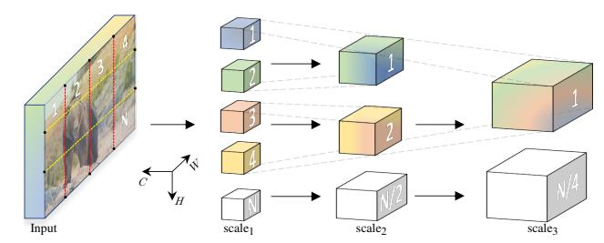
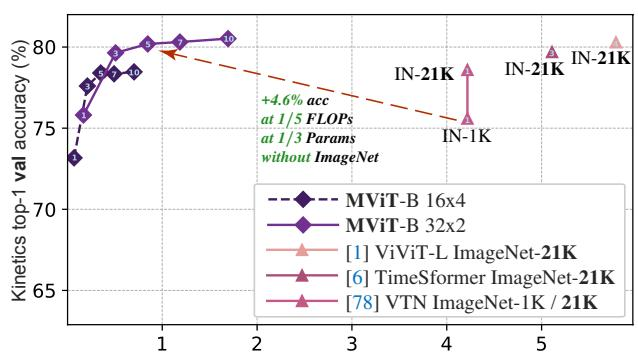
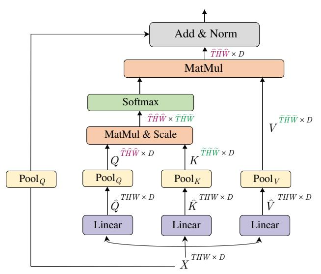
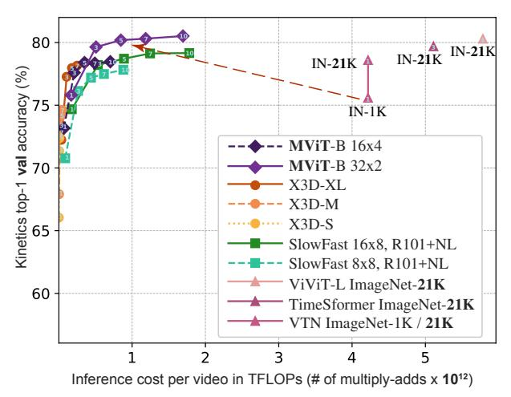
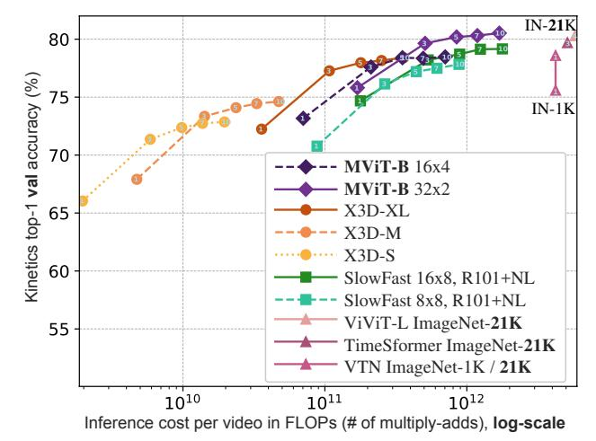
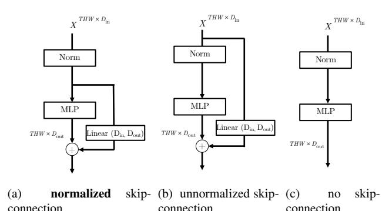
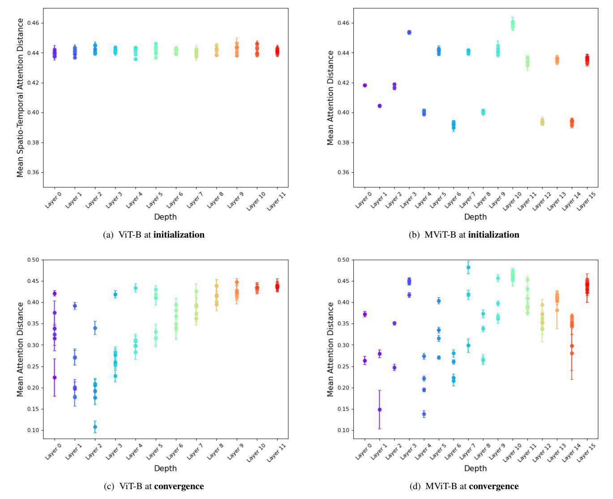

# **Multiscale Vision Transformers**

Haoqi Fan \*, 1 Bo Xiong \*, 1 Karttikeya Mangalam \*, 1, 2
Yanghao Li \*, 1 Zhicheng Yan 1 Jitendra Malik 1, 2 Christoph Feichtenhofer \*, 1

1Facebook AI Research

2UC Berkeley

## **Abstract**

We present Multiscale Vision Transformers (MViT) for video and image recognition, by connecting the seminal idea of multiscale feature hierarchies with transformer models. Multiscale Transformers have several channel-resolution scale stages. Starting from the input resolution and a small channel dimension, the stages hierarchically expand the channel capacity while reducing the spatial resolution. This creates a multiscale pyramid of features with early layers operating at high spatial resolution to model simple low-level visual information, and deeper layers at spatially coarse, but complex, high-dimensional features. We evaluate this fundamental architectural prior for modeling the dense nature of visual signals for a variety of video recognition tasks where it outperforms concurrent vision transformers that rely on large scale external pre-training and are 5-10× more costly in computation and parameters. We further remove the temporal dimension and apply our model for image classification where it outperforms prior work on vision transformers. Code is available at: https: //github.com/facebookresearch/SlowFast.

## 1. Introduction

We begin with the intellectual history of neural network models for computer vision. Based on their studies of cat and monkey visual cortex, Hubel and Wiesel [55] developed a hierarchical model of the visual pathway with neurons in lower areas such as V1 responding to features such as oriented edges and bars, and in higher areas to more specific stimuli. Fukushima proposed the Neocognitron [32], a neural network architecture for pattern recognition explicitly motivated by Hubel and Wiesel's hierarchy. His model had alternating layers of simple cells and complex cells, thus incorporating downsampling, and shift invariance, thus incorporating convolutional structure. LeCun et al. [65] took the additional step of using backpropagation to train the weights of this network. But already the main aspects of hierarchy of visual processing had been established: (i) Reduction in spatial resolution as one goes up the processing hierarchy and (ii) Increase in the number of different "channels", with each

Figure 1. **Multiscale Vision Transformers** learn a hierarchy from *dense* (in space) and *simple* (in channels) to *coarse* and *complex* features. Several resolution-channel *scale* stages progressively *increase* the channel capacity of the intermediate latent sequence while *reducing* its length and thereby spatial resolution.

channel corresponding to ever more specialized features.

In a parallel development, the computer vision community developed *multiscale* processing, sometimes called "pyramid" strategies, with Rosenfeld and Thurston [85], Burt and Adelson [8], Koenderink [61], among the key papers. There were two motivations (*i*) To decrease the computing requirements by working at lower resolutions and (*ii*) A better sense of "context" at the lower resolutions, which could then guide the processing at higher resolutions (this is a precursor to the benefit of "depth" in today's neural networks.)

The Transformer [98] architecture allows learning arbitrary functions defined over sets and has been scalably successful in sequence tasks such as language comprehension [26] and machine translation [7]. Fundamentally, a transformer uses blocks with two basic operations. First, is an attention operation [4] for modeling inter-element relations. Second, is a multi-layer perceptron (MLP), which models relations within an element. Intertwining these operations with normalization [2] and residual connections [44] allows transformers to generalize to a wide variety of tasks.

Recently, transformers have been applied to key computer vision tasks such as image classification. In the spirit of architectural universalism, vision transformers [25, 95] approach performance of convolutional models across a variety of data and compute regimes. By only having a first layer that 'patchifies' the input in spirit of a 2D convolution, followed by a stack of transformer blocks, the vision transformer aims to showcase the power of the transformer architecture using little inductive bias.

\*Equal technical contribution.

In this paper, our intention is to connect the seminal idea of *multiscale feature hierarchies* with the transformer model. We posit that the fundamental vision principle of resolution and channel scaling, can be beneficial for transformer models across a variety of visual recognition tasks.

We present Multiscale Vision Transformers (MViT), a transformer architecture for modeling visual data such as images and videos. Consider an input image as shown in Fig. 1. Unlike conventional transformers, which maintain a constant channel capacity and resolution throughout the network, Multiscale Transformers have several channel-resolution 'scale' stages. Starting from the image resolution and a small channel dimension, the stages *hierarchically expand* the *channel* capacity while *reducing* the *spatial* resolution. This creates a multiscale pyramid of feature activations inside the transformer network, effectively connecting the principles of transformers with multi scale feature hierarchies.

Our conceptual idea provides an effective design advantage for vision transformer models. The early layers of our architecture can operate at high spatial resolution to model *simple* low-level visual information, due to the lightweight channel capacity. In turn, the deeper layers can effectively focus on spatially coarse but *complex* high-level features to model visual semantics. The fundamental advantage of our multiscale transformer arises from the extremely dense nature of visual signals, a phenomenon that is even more pronounced for space-time visual signals captured in *video*.

A noteworthy benefit of our design is the presence of strong implicit temporal bias in video multiscale models. We show that vision transformer models [25] trained on natural video suffer no performance decay when tested on videos with *shuffled* frames. This indicates that these models are not effectively using the temporal information and instead rely heavily on appearance. In contrast, when testing our MViT models on shuffled frames, we observe significant accuracy decay, indicating strong use of temporal information.

Our focus in this paper is video recognition, and we design and evaluate MViT for video tasks (Kinetics [59, 10], Charades [86], SSv2 [38] and AVA [39]). MViT provides a significant performance gain over concurrent video transformers [78, 6, 1], without any external pre-training data.

In Fig. A.4 we show the computation/accuracy trade-off for video-level inference, when varying the number of temporal clips used in MViT. The vertical axis shows accuracy on Kinetics-400 and the horizontal axis the overall inference cost in FLOPs for different models, MViT and concurrent ViT [25] video variants: VTN [78], TimeSformer [6], ViViT [1]. To achieve similar accuracy level as MViT, these models require significant more computation and parameters (e.g. ViViT-L [1] has 6.8× higher FLOPs and 8.5× more parameters at equal accuracy, more analysis in §A.1) and need large-scale external pre-training on ImageNet-21K (which contains around 60× more labels than Kinetics-400).

Inference cost per video in TFLOPs (# of multiply-adds x  $10^{12}$ )

Figure 2. Accuracy/complexity trade-off on Kinetics-400 for varying # of inference clips per video shown in MViT curves. Concurrent vision-transformer based methods [78,6,1] require over 5× more computation *and large-scale external pre-training* on ImageNet-21K (IN-21K), to achieve equivalent MViT accuracy.

We further apply our architecture to an image classification task on ImageNet [21], by *simply removing the temporal dimension* of the video model found with ablation experiments on Kinetics, and show significant gains over single-scale vision transformers for image recognition.

### 2. Related Work

Convolutional networks (ConvNets). Incorporating downsampling, shift invariance, and shared weights, ConvNets are de-facto standard backbones for computer vision tasks for image [65, 62, 88, 90, 46, 12, 15, 34, 93, 81, 41] and video [87, 31, 11, 79, 69, 106, 96, 30, 105, 35, 29, 117, 57].

**Self-attention in ConvNets.** Self-attention mechanisms has been used for image understanding [82, 114, 52], unsupervised object recognition [74] as well as vision and language [77, 66]. Hybrids of self-attention operations and convolutional networks have also been applied to image understanding [51] and video recognition [101].

**Vision Transformers.** Much of current enthusiasm in application of Transformers [98] to vision tasks commences with the Vision Transformer (ViT) [25] and Detection Transformer [9]. We build directly upon [25] with a staged model allowing channel expansion and resolution downsampling. DeiT [95] proposes a data efficient approach to training ViT. Our training recipe builds on, and we compare our image classification models to, DeiT under identical settings.

An emerging thread of work aims at applying transformers to vision tasks such as object detection [5], semantic segmentation [115,99], 3D reconstruction [72], pose estimation [107], generative modeling [14], image retrieval [27], medical image segmentation [13,97,111], point clouds [40], video instance segmentation [103], object re-identification [47], video retrieval [33], video dialogue [64], video object detection [110] and multi-modal tasks [73, 23, 80, 53, 108]. A separate line of works attempts at modeling visual data with learnt discretized token sequences [104, 83, 14, 109, 18].

**Efficient Transformers.** Recent works [100, 60, 17, 94, 20, 16, 67] reduce the quadratic attention complexity to make transformers more efficient for natural language processing applications, which is complementary to our approach.

Three concurrent works propose a ViT-based architecture for video [78, 6, 1]. However, these methods rely on pretraining on vast amount of external data such as ImageNet-21K [21], and thus use the vanilla ViT [25] with minimal adaptations. In contrast, our MViT introduces multiscale feature hierarchies for transformers, allowing effective modeling of dense visual input without large-scale external data.

# 3. Multiscale Vision Transformer (MViT)

Our generic Multiscale Transformer architecture builds on the core concept of *stages*. Each stage consists of multiple transformer blocks with specific space-time resolution and channel dimension. The main idea of Multiscale Transformers is to progressively *expand* the channel capacity, while *pooling* the resolution from input to output of the network.

# 3.1. Multi Head Pooling Attention

We first describe Multi Head Pooling Attention (MHPA), a self attention operator that enables flexible resolution modeling in a transformer block allowing Multiscale Transformers to operate at progressively changing spatiotemporal resolution. In contrast to original Multi Head Attention (MHA) operators [98], where the channel dimension and the spatiotemporal resolution remains fixed, MHPA *pools* the sequence of latent tensors to reduce the sequence length (resolution) of the attended input. Fig. 3 shows the concept.

Concretely, consider a D dimensional input tensor X of sequence length  $L, X \in \mathbb{R}^{L \times D}$ . Following MHA [25], MHPA projects the input X into intermediate query tensor  $\hat{Q} \in \mathbb{R}^{L \times D}$ , key tensor  $\hat{K} \in \mathbb{R}^{L \times D}$  and value tensor  $\hat{V} \in \mathbb{R}^{L \times D}$  with linear operations

$$\hat{Q} = XW_O \quad \hat{K} = XW_K \quad \hat{V} = XW_V$$

/ with weights  $W_Q, W_K, W_V$  of dimensions  $D \times D$ . The obtained intermediate tensors are then pooled in sequence length, with a pooling operator  $\mathcal{P}$  as described below.

**Pooling Operator.** Before attending the input, the intermediate tensors  $\hat{Q}, \hat{K}, \hat{V}$  are pooled with the pooling operator  $\mathcal{P}(\cdot; \Theta)$  which is the cornerstone of our MHPA and, by extension, of our Multiscale Transformer architecture.

The operator  $\mathcal{P}(\cdot; \Theta)$  performs a pooling kernel computation on the input tensor along each of the dimensions. Unpacking  $\Theta$  as  $\Theta := (\mathbf{k}, \mathbf{s}, \mathbf{p})$ , the operator employs a pooling kernel  $\mathbf{k}$  of dimensions  $k_T \times k_H \times k_W$ , a stride  $\mathbf{s}$  of corresponding dimensions  $s_T \times s_H \times s_W$  and a padding  $\mathbf{p}$  of corresponding dimensions  $p_T \times p_H \times p_W$  to reduce an

Figure 3. **Pooling Attention** is a flexible attention mechanism that (i) allows obtaining the reduced space-time resolution  $(\hat{T}\hat{H}\hat{W})$  of the input (THW) by pooling the query,  $Q = \mathcal{P}(\hat{Q}; \Theta_Q)$ , and/or (ii) computes attention on a reduced length  $(\tilde{T}\tilde{H}\tilde{W})$  by pooling the key,  $K = \mathcal{P}(\hat{K}; \Theta_K)$ , and value,  $V = \mathcal{P}(\hat{V}; \Theta_V)$ , sequences.

input tensor of dimensions  $\mathbf{L} = T \times H \times W$  to  $\tilde{\mathbf{L}}$  given by,

$$\tilde{\mathbf{L}} = \left| \frac{\mathbf{L} + 2\mathbf{p} - \mathbf{k}}{\mathbf{s}} \right| + 1$$

with the equation applying coordinate-wise. The pooled tensor is flattened again yielding the output of  $\mathcal{P}(Y; \boldsymbol{\Theta}) \in \mathbb{R}^{\tilde{L} \times D}$  with reduced sequence length,  $\tilde{L} = \tilde{T} \times \tilde{H} \times \tilde{W}$ .

By default we use *overlapping* kernels  $\mathbf{k}$  with *shape-preserving* padding  $\mathbf{p}$  in our pooling attention operators, so that  $\tilde{L}$ , the sequence length of the output tensor  $\mathcal{P}(Y; \boldsymbol{\Theta})$ , experiences an overall reduction by a factor of  $s_T s_H s_W$ .

**Pooling Attention.** The pooling operator  $P(\cdot;\Theta)$  is applied to all the intermediate tensors  $\hat{Q}$ ,  $\hat{K}$  and  $\hat{V}$  independently with chosen pooling kernels  $\mathbf{k}$ , stride  $\mathbf{s}$  and padding  $\mathbf{p}$ . Denoting  $\theta$  yielding the pre-attention vectors  $Q = \mathcal{P}(\hat{Q};\Theta_Q)$ ,  $K = \mathcal{P}(\hat{K};\Theta_K)$  and  $V = \mathcal{P}(\hat{V};\Theta_V)$  with reduced sequence lengths. Attention is now computed on these shortened vectors, with the operation,

$$\operatorname{Attention}(Q,K,V) = \operatorname{Softmax}(QK^T/\sqrt{D})V.$$

Naturally, the operation induces the constraints  $\mathbf{s}_K \equiv \mathbf{s}_V$  on the pooling operators. In summary, pooling attention is computed as,

$$\mathrm{PA}(\cdot) = \mathrm{Softmax}(\mathcal{P}(Q; \mathbf{\Theta}_Q) \mathcal{P}(K; \mathbf{\Theta}_K)^T / \sqrt{d}) \mathcal{P}(V; \mathbf{\Theta}_V),$$

where  $\sqrt{d}$  is normalizing the inner product matrix row-wise. The output of the Pooling attention operation thus has its sequence length reduced by a *stride* factor of  $s_T^Q s_H^Q s_W^Q$  following the shortening of the query vector Q in  $\mathcal{P}(\cdot)$ .

| stage              | operators                                                              | output sizes                                         |
|--------------------|------------------------------------------------------------------------|------------------------------------------------------|
| data layer         | stride $\tau \times 1 \times 1$                                        | $T \times H \times W$                                |
| patch 1 | $1 \times 16 \times 16$ , D stride $1 \times 16 \times 16$          | $D \times T \times \frac{H}{16} \times \frac{W}{16}$ |
| scale 2 | $\left[\begin{array}{c} MHA(D) \\ MLP(4D) \end{array}\right] \times N$ | $D \times T \times \frac{H}{16} \times \frac{W}{16}$ |

Table 1. **Vision Transformers (ViT)** base model starts from a data layer that samples visual input with rate  $\tau \times 1 \times 1$  to  $T \times H \times W$  resolution, where T is the number of frames H height and W width. The first layer, patch1 projects patches (of shape  $1 \times 16 \times 16$ ) to form a sequence, processed by a stack of N transformer blocks (stage2) at uniform channel dimension (D) and resolution  $(T \times \frac{H}{16} \times \frac{W}{16})$ .

**Multiple heads.** As in [98] the computation can be parallelized by considering h heads where each head is performing the pooling attention on a non overlapping subset of D/h channels of the D dimensional input tensor X.

**Computational Analysis.** Since attention computation scales quadratically w.r.t. the sequence length, pooling the key, query and value tensors has dramatic benefits on the fundamental compute and memory requirements of the Multiscale Transformer model. Denoting the sequence length reduction factors by  $f_Q$ ,  $f_K$  and  $f_V$  we have,

$$f_j = s_T^j \cdot s_H^j \cdot s_W^j, \ \forall \ j \in \{Q, K, V\}.$$

Considering the input tensor to  $\mathcal{P}(;\Theta)$  to have dimensions  $D \times T \times H \times W$ , the run-time complexity of MHPA is  $O(THWD/h(D+THW/f_Qf_K))$  per head and the memory complexity is  $O(THWh(D/h+THW/f_Qf_K))$ .

This trade-off between the number of channels D and sequence length term  $THW/f_Qf_K$  informs our design choices about architectural parameters such as number of heads and width of layers. We refer the reader to the supplement for a detailed analysis and discussions on the time-memory complexity trade-off.

#### 3.2. Multiscale Transformer Networks

Building upon Multi Head Pooling Attention (Sec. 3.1), we describe the Multiscale Transformer model for visual representation learning using exclusively MHPA and MLP layers. First, we present a brief review of the Vision Transformer Model that informs our design.

**Preliminaries:** Vision Transformer (ViT). The Vision Transformer (ViT) architecture [25] starts by dicing the input video of resolution  $T \times H \times W$ , where T is the number of frames H the height and W the width, into non-overlapping patches of size  $1 \times 16 \times 16$  each, followed by point-wise application of linear layer on the flattened image patches to to project them into the latent dimension, D, of the transformer. This is *equivalent* to a convolution with equal kernel size and stride of  $1 \times 16 \times 16$  and is shown as patch1 stage in the model definition in Table 1.

Next, a positional embedding  $\mathbf{E} \in \mathbb{R}^{L \times D}$  is added to each element of the projected sequence of length L with

| stages             | operators                                                         | output sizes                                                      |
|--------------------|-------------------------------------------------------------------|-------------------------------------------------------------------|
| data layer         | stride $\tau \times 1 \times 1$                                   | $D \times T \times H \times W$                                    |
| cube 1  | $c_T \times c_H \times c_W$ , D stride $s_T \times 4 \times 4$ | $D \times \frac{T}{s_T} \times \frac{H}{4} \times \frac{W}{4}$    |
| scale 2 | $\begin{bmatrix} MHPA(D) \\ MLP(4D) \end{bmatrix} \times N_2$     | $D \times \frac{T}{s_T} \times \frac{H}{4} \times \frac{W}{4}$    |
| scale 3 | $\begin{bmatrix} MHPA(2D) \\ MLP(8D) \end{bmatrix} \times N_3$    | $2D \times \frac{T}{s_T} \times \frac{H}{8} \times \frac{W}{8}$   |
| scale 4 | $\begin{bmatrix} MHPA(4D) \\ MLP(16D) \end{bmatrix} \times N_4$   | $4D \times \frac{T}{s_T} \times \frac{H}{16} \times \frac{W}{16}$ |
| scale 5 | $\begin{bmatrix} MHPA(8D) \\ MLP(32D) \end{bmatrix} \times N_5$   | $8D \times \frac{T}{s_T} \times \frac{H}{32} \times \frac{W}{32}$ |

Table 2. **Multiscale Vision Transformers (MViT)** base model. Layer cube1, projects *dense* space-time cubes (of shape  $c_t \times c_y \times c_w$ ) to D channels to reduce spatio-temporal resolution to  $\frac{T}{s_T} \times \frac{H}{4} \times \frac{W}{4}$ . The subsequent stages progressively down-sample this resolution (at beginning of a stage) with MHPA while simultaneously increasing the channel dimension, in MLP layers, (at the end of a stage). Each stage consists of  $N_*$  transformer blocks, denoted in [brackets].

dimension D to encode the positional information and break permutation invariance. A learnable class embedding is appended to the projected image patches.

The resulting sequence of length of L+1 is then processed sequentially by a stack of N transformer blocks, each one performing attention (MHA [98]), multi-layer perceptron (MLP) and layer normalization (LN [3]) operations. Considering X to be the input of the block, the output of a single transformer block,  $\operatorname{Block}(X)$  is computed by

$$X_1 = \text{MHA}(\text{LN}(X)) + X$$
$$\text{Block}(X) = \text{MLP}(\text{LN}(X_1)) + X_1.$$

The resulting sequence after N consecutive blocks is layer-normalized and the class embedding is extracted and passed through a linear layer to predict the desired output (e.g. class). By default, the hidden dimension of the MLP is 4D. We refer the reader to [25,98] for details.

In context of the present paper, it is noteworthy that ViT maintains a constant channel capacity and spatial resolution throughout all the blocks (see Table 1).

Multiscale Vision Transformers (MViT). Our key concept is to progressively *grow* the *channel* resolution (*i.e.* dimension), while simultaneously *reducing* the *spatiotemporal* resolution (*i.e.* sequence length) throughout the network. By design, our MViT architecture has *fine* spacetime (and *coarse* channel) resolution in early layers that is up-/downsampled to a coarse spacetime (and *fine* channel) resolution in late layers. MViT is shown in Table 2.

**Scale stages.** A *scale stage* is defined as a set of N transformer blocks that operate on the same *scale* with identical resolution across channels and space-time dimensions  $D \times T \times H \times W$ . At the input (cube1 in Table 2), we project the patches (or cubes if they have a temporal extent) to a smaller channel dimension (*e.g.*  $8 \times$  smaller than a typical ViT model), but long sequence (*e.g.*  $4 \times 4 = 16 \times$  denser than a typical ViT model; *cf.* Table 1).

| stage              | operators                                                       | output sizes |
|--------------------|-----------------------------------------------------------------|--------------|
| data               | stride $8 \times 1 \times 1$                                    | 8×224×224    |
| patch 1 | $1 \times 16 \times 16,768$ stride $1 \times 16 \times 16$   | 768×8×14×14  |
| scale 2 | $\begin{bmatrix} MHA(768) \\ MLP(3072) \end{bmatrix} \times 12$ | 768×8×14×14  |

| stage              | operators                  | operators                                        |             |
|--------------------|----------------------------|--------------------------------------------------|-------------|
| data               | stride $4 \times 1 \times$ | 1                                                | 16×224×224  |
| cube 1  | ,                          | $3\times7\times7,96$ stride $2\times4\times4$ |             |
| scale 2 | MHPA(96) MLP(384)       | ×1                                               | 96×8×56×56  |
| scale 3 | MHPA(192) MLP(768)      | ×2                                               | 192×8×28×28 |
| scale 4 | MHPA(384) MLP(1536)     | ×11                                              | 384×8×14×14 |
| scale 5 | MHPA(768) MLP(3072)     | ×2                                               | 768×8×7×7   |

| stage              | operators                    | operators                                          |             |
|--------------------|------------------------------|----------------------------------------------------|-------------|
| data               | stride $4 \times 1 \times 1$ | 1                                                  | 16×224×224  |
| cube 1  |                              | $3\times8\times8, 128$ stride $2\times8\times8$ |             |
| scale 2 | MHPA(128) MLP(512)        |                                                    |             |
| scale 3 | MHPA(256) MLP(1024)       | ×7                                                 | 256×8×14×14 |
| scale 4 | MHPA(512) MLP(2048) ×6    |                                                    | 512×8×7×7   |
|                    |                              |                                                    |             |

(a) VIT-B with 179.6G FLOPs, 87.2M param, (b) MViT-B with 70.5G FLOPs, 36.5M param, (c) MViT-S with 32.9G FLOPs, 26.1M param, 16.8G memory, and 68.5% top-1 accuracy.

6.8G memory, and 77.2% top-1 accuracy.

4.3G memory, and 74.3% top-1 accuracy.

Table 3. Comparing ViT-B to two instantiations of MViT with varying complexity, MViT-S in (c) and MViT-B in (b). MViT-S operates at a lower spatial resolution and lacks a first high-resolution stage. The top-1 accuracy corresponds to 5-Center view testing on K400. FLOPs correspond to a single inference clip, and memory is for a training batch of 4 clips. See Table 2 for the general MViT-B structure.

At a stage transition (e.g.  $scale_1$  to  $scale_2$  to in Table 2), the channel dimension of the processed sequence is upsampled while the length of the sequence is down-sampled. This effectively reduces the spatio-temporal resolution of the underlying visual data while allowing the network to assimilate the processed information in more complex features.

**Channel expansion.** When transitioning from one stage to the next, we expand the channel dimension by increasing the output of the final MLP layer in the previous stage by a factor that is relative to the resolution change introduced at the stage. Concretely, if we down-sample the space-time resolution by  $4\times$ , we increase the channel dimension by 2×. For example, scale3 to scale4 changes resolution from  $2D \times \frac{T}{s_T} \times \frac{H}{8} \times \frac{T}{8}$  to  $4D \times \frac{T}{s_T} \times \frac{H}{16} \times \frac{T}{16}$  in Table 2. This roughly preserves the computational complexity across stages, and is similar to ConvNet design principles [87, 45].

Query pooling. The pooling attention operation affords flexibility not only in the length of key and value vectors but also in the length of the query, and thereby output, sequence. Pooling the query vector  $\mathcal{P}(Q; \mathbf{k}; \mathbf{p}; \mathbf{s})$  with a kernel  $\mathbf{s} \equiv (s_T^Q, s_H^Q, s_W^Q)$  leads to sequence reduction by a factor of  $s_T^Q \cdot s_H^Q \cdot s_W^Q$ . Since, our intention is to decrease resolution at the beginning of a stage and then preserve this resolution throughout the stage, only the first pooling attention operator of each stage operates at non-degenerate query stride  $s^Q > 1$ , with all other operators constrained to  $\mathbf{s}^Q \equiv (1, 1, 1)$ .

**Key-Value pooling.** Unlike Query pooling, changing the sequence length of key K and value V tensors, does not change the output sequence length and, hence, the space-time resolution. However, they play a key role in overall computational requirements of the pooling attention operator.

We decouple the usage of K, V and Q pooling, with Q pooling being used in the first layer of each stage and K, V pooling being employed in all other layers. Since the sequence length of key and value tensors need to be identical to allow attention weight calculation, the pooling stride used on K and value V tensors needs to be identical. In our default setting, we constrain all pooling parameters  $(\mathbf{k}; \mathbf{p}; \mathbf{s})$ to be identical i.e.  $\Theta_K \equiv \Theta_V$  within a stage, but vary s adaptively w.r.t. to the scale across stages.

**Skip connections.** Since the channel dimension and sequence length change inside a residual block, we pool the skip connection to adapt to the dimension mismatch between its two ends. MHPA handles this mismatch by adding the query pooling operator  $\mathcal{P}(\cdot; \Theta_{\mathcal{O}})$  to the residual path. As shown in Fig. 3, instead of directly adding the input X of MHPA to the output, we add the pooled input X to the output, thereby matching the resolution to attended query Q.

For handling the channel dimension mismatch between stage changes, we employ an extra linear layer that operates on the layer-normalized output of our MHPA operation. Note that this differs from the other (resolution-preserving) skipconnections that operate on the un-normalized signal.

## 3.3. Network instantiation details

Table 3 shows concrete instantiations of the base models for Vision Transformers [25] and our Multiscale Vision Transformers. ViT-Base [25] (Table 3b) initially projects the input to patches of shape  $1 \times 16 \times 16$  with dimension D = 768, followed by stacking N = 12 transformer blocks. With an  $8\times224\times224$  input the resolution is fixed to  $768 \times 8 \times 14 \times 14$  throughout all layers. The sequence length (spacetime resolution + class token) is  $8 \cdot 14 \cdot 14 + 1 = 1569$ .

Our MViT-Base (Table 3b) is comprised of 4 scale stages, each having several transformer blocks of consistent channel dimension. MViT-B initially projects the input to a channel dimension of D = 96 with overlapping space-time cubes of shape  $3\times7\times7$ . The resulting sequence of length 8\*56\*56+1 = 25089 is reduced by a factor of 4 for each additional stage, to a final sequence length of 8\*7\*7+1=393 at scale4. In tandem, the channel dimension is up-sampled by a factor of 2 at each stage, increasing to 768 at scale4. Note that all pooling operations, and hence the resolution downsampling, is performed only on the data sequence without involving the processed class token embedding.

We set the number of MHPA heads to h = 1 in the scale1 stage and increase the number of heads with the channel dimension (channels per-head D/h remain consistent at 96).

At each stage transition, the previous stage output MLP dimension is increased by  $2\times$  and MHPA pools on Q tensors with  $\mathbf{s}^Q = (1, 2, 2)$  at the input of the next stage.

| model                           | pre-train    | top-1 | top-5 | FLOPs×views              | Param |
|---------------------------------|--------------|-------|-------|--------------------------|-------|
| Two-Stream I3D [11]             | -            | 71.6  | 90.0  | 216 × NA                 | 25.0  |
| ip-CSN-152 [96]                 | -            | 77.8  | 92.8  | 109×3×10                 | 32.8  |
| SlowFast $8 \times 8 + NL$ [30] | -            | 78.7  | 93.5  | 116×3×10                 | 59.9  |
| SlowFast 16×8 +NL [30]          | -            | 79.8  | 93.9  | 234×3×10                 | 59.9  |
| X3D-M [29]                      | -            | 76.0  | 92.3  | 6.2×3×10                 | 3.8   |
| X3D-XL [29]                     | -            | 79.1  | 93.9  | 48.4×3×10                | 11.0  |
| ViT-B-VTN [78]                  | ImageNet-1K  | 75.6  | 92.4  | 4218×1×1                 | 114.0 |
| ViT-B-VTN [78]                  | ImageNet-21K | 78.6  | 93.7  | 4218×1×1                 | 114.0 |
| ViT-B-TimeSformer [6]           | ImageNet-21K | 80.7  | 94.7  | 2380×3×1                 | 121.4 |
| ViT-L-ViViT [1]                 | ImageNet-21K | 81.3  | 94.7  | 3992×3×4                 | 310.8 |
| ViT-B (our baseline)            | ImageNet-21K | 79.3  | 93.9  | 180×1×5                  | 87.2  |
| ViT-B (our baseline)            | -            | 68.5  | 86.9  | 180×1×5                  | 87.2  |
| MViT-S                          | -            | 76.0  | 92.1  | 32.9×1×5                 | 26.1  |
| MViT-B, $16\times4$             | -            | 78.4  | 93.5  | $70.5 \times 1 \times 5$ | 36.6  |
| MViT-B, $32\times3$             | -            | 80.2  | 94.4  | 170×1×5                  | 36.6  |
| MViT-B, $64 \times 3$           | -            | 81.2  | 95.1  | 455×3×3                  | 36.6  |
| T 11 4 C                        |              |       |       | TT- 11 401               | ****  |

Table 4. Comparison with previous work on Kinetics-400. We report the inference cost with a single "view" (temporal clip with spatial crop)  $\times$  the number of views (FLOPs $\times$ viewspace $\times$ viewtime). Magnitudes are Giga (109) for FLOPs and Mega (106) for Param. Accuracy of models trained with external data is de-emphasized.

We employ K, V pooling in all MHPA blocks, with  $\Theta_K \equiv \Theta_V$  and  $\mathbf{s}^Q = (1, 8, 8)$  in  $\mathrm{scale}_1$  and adaptively decay this stride w.r.t. to the scale across stages such that the K, V tensors have consistent scale across all blocks.

## 4. Experiments: Video Recognition

**Datasets.** We use Kinetics-400 [59] (K400) (~240k training videos in 400 classes) and Kinetics-600 [11]. We further assess transfer learning performance for on Something-Something-v2 [38], Charades [86], and AVA [39].

We report top-1 and top-5 classification accuracy (%) on the validation set, computational cost (in FLOPs) of a single, spatially center-cropped clip and the number of clips used.

**Training.** By default, all models are trained *from random initialization* ("*from scratch*") on Kinetics, *without* using ImageNet [22] or other pre-training. Our training recipe and augmentations follow [30,95]. For Kinetics, we train for 200 epochs with 2 repeated augmentation [50] repetitions.

We report ViT baselines that are *fine-tuned* from ImageNet, using a 30-epoch version of the training recipe in [30].

For the temporal domain, we sample a clip from the full-length video, and the input to the network are T frames with a temporal stride of  $\tau$ ; denoted as  $T \times \tau$  [30].

**Inference.** We apply two testing strategies following [30, 29]: (i) Temporally, uniformly samples K clips (e.g. K=5) from a video, scales the shorter spatial side to 256 pixels and takes a  $224 \times 224$  center crop, and (ii), the same as (i) temporally, but take 3 crops of  $224 \times 224$  to cover the longer spatial axis. We average the scores for all individual predictions.

All implementation specifics are in §D.

#### 4.1. Main Results

**Kinetics-400.** Table 4 compares to prior work. From top-to-bottom, it has four sections and we discuss them in turn.

| model                  | pretrain | top-1 | top-5 | GFLOPs×views              | Param |
|------------------------|----------|-------|-------|---------------------------|-------|
| SlowFast 16×8 +NL [30] | -        | 81.8  | 95.1  | 234×3×10                  | 59.9  |
| X3D-M                  | -        | 78.8  | 94.5  | 6.2×3×10                  | 3.8   |
| X3D-XL                 | -        | 81.9  | 95.5  | $48.4 \times 3 \times 10$ | 11.0  |
| ViT-B-TimeSformer [6]  | IN-21K   | 82.4  | 96.0  | 1703×3×1                  | 121.4 |
| ViT-L-ViViT [1]        | IN-21K   | 83.0  | 95.7  | 3992×3×4                  | 310.8 |
| <b>MViT</b> -B, 16×4   | -        | 82.1  | 95.7  | 70.5×1×5                  | 36.8  |
| MViT-B, $32\times3$    | -        | 83.4  | 96.3  | 170×1×5                   | 36.8  |
| MViT-B-24, $32\times3$ | -        | 83.8  | 96.3  | 236×1×5                   | 52.9  |
|                        |          |       | _     |                           | _     |

Table 5. Comparison with previous work on Kinetics-600.

The first Table 4 section shows prior art using ConvNets. The second section shows concurrent work using Vision Transformers [25] for video classification [78,6]. Both approaches rely on ImageNet pre-trained base models. ViT-B-VTN [78] achieves 75.6% top-1 accuracy, which is boosted by 3% to 78.6% by merely changing the pre-training from ImageNet-1K to ImageNet-21K. ViT-B-TimeSformer [6] shows another 2.1% gain on top of VTN, at higher cost of 7140G FLOPs and 121.4M parameters. ViViT improves accuracy further with an even larger ViT-L model.

The third section in Table 4 shows our ViT baselines. We first list our ViT-B, also pre-trained on the ImageNet-21K, which achieves 79.3%, thereby being 1.4% lower than ViT-B-TimeSformer, but is with 4.4× fewer FLOPs and 1.4× fewer parameters. This result shows that *simply fine-tuning an off-the-shelf ViT-B model from ImageNet-21K* [25] provides a strong baseline on Kinetics. However, training this model from-scratch with the same fine-tuning recipe will result in 34.3%. Using our "training-from-scratch" recipe will produce 68.5% for this ViT-B model, using the same 1×5, spatial × temporal, views for video-level inference.

The final section of Table 4 lists our **MViT** results. All our models are *trained-from-scratch* using this recipe, *without* any external pre-training. Our small model, **MViT**-S produces 76.0% while being relatively lightweight with 26.1M param and  $32.9 \times 5 = 164.5$ G FLOPs, outperforming ViT-B by +7.5% at 5.5× less compute in *identical* train/val setting.

Our base model, MViT-B provides 78.4%, a +9.9% accuracy boost over ViT-B under *identical settings*, while having  $2.6\times/2.4\times$  fewer FLOPs/parameters. When changing the frame sampling from  $16\times4$  to  $32\times3$  performance increases to 80.2%. Finally, we take this model and fine-tune it for 5 epochs with longer 64 frame input, after interpolating the temporal positional embedding, to reach 81.2% top-1 using 3 spatial and 3 temporal views for inference (it is sufficient test with fewer temporal views if a clip has more frames). Further quantitative and qualitative results are in §A.

**Kinetics-600** [11] is a larger version of Kinetics. Results are in Table 5. We train MViT from-scratch, without any pre-training. MViT-B, 16×4 achieves 82.1% top-1 accuracy. We further train a deeper 24-layer model with longer sampling, MViT-B-24, 32×3, to investigate model scale on this larger dataset. MViT achieves state-of-the-art of 83.4% with 5-clip center crop testing while having 56.0× fewer FLOPs and 8.4× fewer parameters than ViT-L-ViViT [1] which relies on large-scale ImageNet-21K pre-training.

| model                   | pretrain   | top-1 | top-5 | FLOPs×views | Param |
|-------------------------|------------|-------|-------|-------------|-------|
| TSM-RGB [71]            | IN-1K+K400 | 63.3  | 88.2  | 62.4×3×2    | 42.9  |
| MSNet [63]              | IN-1K      | 64.7  | 89.4  | 67×1×1      | 24.6  |
| TEA [68]                | IN-1K      | 65.1  | 89.9  | 70×3×10     | -     |
| ViT-B-TimeSformer [6]   | IN-21K     | 62.5  | -     | 1703×3×1    | 121.4 |
| ViT-B (our baseline)    | IN-21K     | 63.5  | 88.3  | 180×3×1     | 87.2  |
| SlowFast R50, 8×8 [30]  |            | 61.9  | 87.0  | 65.7×3×1    | 34.1  |
| SlowFast R101, 8×8 [30] |            | 63.1  | 87.6  | 106×3×1     | 53.3  |
| <b>MViT</b> -B, 16×4    | K400       | 64.7  | 89.2  | 70.5×3×1    | 36.6  |
| MViT-B, $32\times3$     |            | 67.1  | 90.8  | 170×3×1     | 36.6  |
| MViT-B, $64 \times 3$   |            | 67.7  | 90.9  | 455×3×1     | 36.6  |
| <b>MViT</b> -B, 16×4    |            | 66.2  | 90.2  | 70.5×3×1    | 36.6  |
| MViT-B, $32\times3$     | K600       | 67.8  | 91.3  | 170×3×1     | 36.6  |
| MViT-B-24, $32\times3$  |            | 68.7  | 91.5  | 236×3×1     | 53.2  |

Table 6. Comparison with previous work on SSv2.

**Something-Something-v2** (SSv2) [38] is a dataset with videos containing object interactions, which is known as a 'temporal modeling' task. Table 6 compares our method with the state-of-the-art. We first report a simple ViT-B (our baseline) that uses ImageNet-21K pre-training. Our **MViT**-B with 16 frames has 64.7% top-1 accuracy, which is better than the SlowFast R101 [30] which shares the same setting (K400 pre-training and 3×1 view testing). With more input frames, our **MViT**-B achieves 67.7% and the deeper **MViT**-B-24 achieves 68.7% using our K600 pre-trained model of above. In general, Table 6 verifies the capability of temporal modeling for MViT.

| model                       | model pretrain  |      | FLOPs×views               | Param |
|-----------------------------|-----------------|------|---------------------------|-------|
| Nonlocal [101]              | DV 117 - 17 400 | 37.5 | 544×3×10                  | 54.3  |
| STRG +NL [102]              | IN-1K+K400      | 39.7 | 630×3×10                  | 58.3  |
| Timeception [56]            |                 | 41.1 | N/A×N/A                   | N/A   |
| LFB +NL [105]               |                 | 42.5 | 529×3×10                  | 122   |
| SlowFast 50, 8×8 [30]       |                 | 38.0 | 65.7×3×10                 | 34.0  |
| SlowFast 101+NL, 16×8 [30]  | K400            | 42.5 | 234×3×10                  | 59.9  |
| X3D-XL [29]                 |                 | 43.4 | $48.4 \times 3 \times 10$ | 11.0  |
| <b>MViT</b> -B, 16×4        |                 | 40.0 | $70.5 \times 3 \times 10$ | 36.4  |
| MViT-B, $32\times3$         |                 | 44.3 | 170×3×10                  | 36.4  |
| MViT-B, $64 \times 3$       |                 | 46.3 | 455×3×10                  | 36.4  |
| SlowFast R101+NL, 16×8 [30] |                 | 45.2 | 234×3×10                  | 59.9  |
| X3D-XL [29]                 |                 | 47.1 | $48.4 \times 3 \times 10$ | 11.0  |
| <b>MViT</b> -B, 16×4        | K600            | 43.9 | $70.5 \times 3 \times 10$ | 36.4  |
| MViT-B, $32\times3$         |                 | 47.1 | 170×3×10                  | 36.4  |
| MViT-B-24, $32\times3$      |                 | 47.7 | 236×3×10                  | 53.0  |

Table 7. Comparison with previous work on Charades.

**Charades** [86] is a dataset with longer range activities. We validate our model in Table 7. With similar FLOPs and parameters, our **MViT**-B 16×4 achieves better results (+2.0 mAP) than SlowFast R50 [30]. As shown in the Table, the performance of **MViT**-B is further improved by increasing the number of input frames and **MViT**-B layers and using K600 pre-trained models.

**AVA** [39] is a dataset with for spatiotemporal-localization of human actions. We validate our MViT on this detection task. Details about the detection architecture of MViT can be found in §D.2. Table 8 shows the results of our MViT models compared with SlowFast [30] and X3D [29]. We observe that MViT-B can be competitive to SlowFast and X3D using the same pre-training and testing strategy.

| model                       | pretrain | val mAP | FLOPs | Param |
|-----------------------------|----------|---------|-------|-------|
| SlowFast, 4×16, R50 [30]    |          | 21.9    | 52.6  | 33.7  |
| SlowFast, 8×8, R101 [30]    |          | 23.8    | 138   | 53.0  |
| <b>MViT</b> -B, 16×4        | K400     | 24.5    | 70.5  | 36.4  |
| MViT-B, $32\times3$         |          | 26.8    | 170   | 36.4  |
| MViT-B, $64 \times 3$       |          | 27.3    | 455   | 36.4  |
| SlowFast, 8×8 R101+NL [30]  |          | 27.1    | 147   | 59.2  |
| SlowFast, 16×8 R101+NL [30] |          | 27.5    | 296   | 59.2  |
| X3D-XL [29]                 | K600     | 27.4    | 48.4  | 11.0  |
| <b>MViT</b> -B, 16×4        | Kooo     | 26.1    | 70.5  | 36.3  |
| MViT-B, $32\times3$         |          | 27.5    | 170   | 36.4  |
| <b>MViT</b> -B-24, 32×3     |          | 28.7    | 236   | 52.9  |

Table 8. Comparison with previous work on AVA v2.2. All methods use *single center crop* inference following [29].

## 4.2. Ablations on Kinetics

We carry out ablations on Kinetics-400 (K400) using 5-clip center  $224\times224$  crop testing. We show top-1 accuracy (Acc), as well as computational complexity measured in GFLOPs for a single clip input of spatial size  $224^2$ . Inference computational cost is proportional as a fixed number of 5 clips is used (to roughly cover the inferred videos with  $T\times\tau=16\times4$  sampling.) We also report Parameters in M(106) and training GPU memory in G(109) for a batch size of 4. By default all MViT ablations are with MViT-B,  $T\times\tau=16\times4$  and max-pooling in MHSA.

| model  | shuffling | FLOPs (G) | Param (M) | Acc                  |
|--------|-----------|-----------|-----------|----------------------|
| MViT-B |           | 70.5      | 26.5      | 77.2                 |
| MViT-B | ✓         | 70.5      | 36.5      | 70.1 ( <b>-7.1</b> ) |
| ViT-B  |           | 179.6     | 87.2      | 68.5                 |
| ViT-B  | ✓         | 179.0     | 07.2      | 68.4 ( <b>-0.1</b> ) |

Table 9. **Shuffling frames in inference. MViT**-B severely drops (-7.1%) for shuffled temporal input, but ViT-B models appear to *ignore* temporal information as accuracy remains similar (-0.1%).

**Frame shuffling.** Table 9 shows results for randomly shuffling the input frames in time during testing. All models are trained without any shuffling and have temporal embeddings. We notice that our **MViT**-B architecture suffers a significant accuracy drop of **-7.1%** (77.2  $\rightarrow$  70.1) for shuffling inference frames. By contrast, ViT-B is surprisingly robust for shuffling the temporal order of the input.

This indicates that a naïve application of ViT to video does not model temporal information, and the temporal positional embedding in ViT-B seems to be fully ignored. We also verified this with the 79.3% ImageNet-21K pre-trained ViT-B of Table 4, which has *the same accuracy* of 79.3% for shuffling test frames, suggesting that it implicitly performs bag-of-frames video classification in Kinetics.

| variant               | $[N_1, N_2]$ | FLOPs (G)     | Mem (G)           | Acc         |
|-----------------------|--------------|---------------|-------------------|-------------|
| ViT-B                 | [12, 0]      | 179.6         | 16.8              | 68.5        |
| 2-scale ViT-B, Q pool | [6, 6]       | 111.1 (-68.5) | 9.8 (-7.0)        | 71.0 (+1.5) |
| ViT-B, $K, V$ pool    | [12, 0]      | 148.4 (-31.2) | <b>8.9</b> (-7.9) | 69.1 (+0.6) |

Table 10. Query (scale stage) and Key-Value pooling on ViT-B. Introducing a *single* extra resolution stage into ViT-B boosts accuracy by +1.5%. Pooling K, V provides +0.6% accuracy. Both techniques allow dramatic FLOPs/memory savings.

Two scales in ViT. We provide a simple experiment that ablates the effectiveness of scale-stage design on ViT-B. For this we add a *single scale stage* to the ViT-B model. To isolate the effect of having different scales in ViT, we do not alter the channel dimensionality for this experiment. We do so by performing Q-Pooling with  $\mathbf{s}^Q \equiv (1,2,2)$  after 6 Transformer blocks (cf. Table 3). Table 10 shows the results. Adding a single scale stage to the ViT-B baseline boosts accuracy by +1.5% while deceasing FLOPs and memory cost by 38% and 41%. Pooling Key-Value tensors reduces compute and memory cost while slightly increasing accuracy.

|       | positional embedding     | Param (M) | Acc  |
|-------|--------------------------|-----------|------|
| (i)   | none                     | 36.2      | 75.8 |
| (ii)  | space-only               | 36.5      | 76.7 |
| (iii) | joint space-time         | 38.6      | 76.5 |
| (iv)  | separate in space & time | 36.5      | 77.2 |

Table 11. Effect of separate space-time positional embedding. Backbone: MViT-B, 16×4. FLOPs are 70.5G for all variants.

Separate space & time embeddings in MViT. In Table 11, we ablate using (i) none, (ii) space-only, (iii) joint space-time, and (iv) a separate space and time (our default), positional embeddings. We observe that no embedding (i) decays accuracy by -0.9% over using just a spatial one (ii) which is roughly equivalent to a joint spatiotemporal one (iii). Our separate space-time embedding (iv) is best, and also has 2.1M fewer parameters than a joint spacetime embedding.

| $T \times \tau$ | $c_T \times c_H \times c_W$ | $s_T \times s_H \times s_W$ | FLOPs | Param | Acc  |
|-----------------|-----------------------------|-----------------------------|-------|-------|------|
| 8×8             | 1×4×4                       | 1×4×4                       | 69.4  | 36.5  | 74.5 |
| $8 \times 8$    | $1 \times 7 \times 7$       | $1\times4\times4$           | 69.6  | 36.5  | 75.6 |
| $8\times8$      | 3×7×7                       | $1\times4\times4$           | 70.5  | 36.5  | 75.9 |
| $16\times4$     | $3\times7\times7$           | $2\times4\times4$           | 70.5  | 36.5  | 77.2 |
| $32\times2$     | 3×7×7                       | $4\times4\times4$           | 70.5  | 36.5  | 77.2 |
| $32\times2$     | 7×7×7                       | $4\times4\times4$           | 70.5  | 36.5  | 77.3 |

Table 12. **Input sampling**: We vary sampling rate  $T \times \tau$ , the size  $\mathbf{c} = c_T \times c_H \times c_W$  and stride of  $\mathbf{s} = s_T \times s_H \times s_W$  the cube1 layer that projects space-time cubes. Cubes with temporal extent  $c_T > 1$  are beneficial. Our default setting is <u>underlined</u>.

Input Sampling Rate. Table 12 shows results for different cubification kernel size c and sampling stride s (cf. Table 2). We observe that sampling patches,  $\mathbf{c}_T = 1$ , performs worse than sampling cubes with  $\mathbf{c}_T > 1$ . Further, sampling twice as many frames, T = 16, with twice the cube stride,  $s_T = 2$ , keeps the cost constant but boosts performance by +1.3% (75.9%  $\rightarrow$  77.2%). Also, sampling overlapping input cubes  $\mathbf{s} < \mathbf{c}$  allows better information flow and benefits performance. While  $\mathbf{c}_T > 1$  helps, very large temporal kernel size ( $\mathbf{c}_T = 7$ ) doesn't futher improve performance.

**Stage distribution.** The ablation in Table 13 shows the results for distributing the number of transformer blocks in each individual scale stage. The overall number of transformer blocks, N=16 is consistent. We observe that having more blocks in early stages increases memory and having

| variant   | $[N_2, N_3, N_4, N_5]$ | FLOPs | Param | Mem  | Acc  |
|-----------|------------------------|-------|-------|------|------|
| V1        | [2, 6, 6, 2]           | 90.2  | 29.5  | 11.0 | 76.3 |
| V2        | [2, 4, 6, 4]           | 86.9  | 42.8  | 10.3 | 75.9 |
| V3        | [2, 4, 8, 2]           | 88.3  | 32.2  | 10.5 | 76.6 |
| V4        | [2, 2, 8, 4]           | 85.0  | 45.5  | 9.7  | 76.7 |
| <u>V5</u> | [1, 2, 11, 2]          | 83.6  | 36.5  | 9.1  | 77.1 |
| V6        | [2, 2, 10, 2]          | 86.4  | 34.9  | 11.3 | 76.9 |

Table 13. **Scale blocks**: We ablate the stage configuration as the number of blocks N in stages of **MViT**-B (*i.e.* where to pool Q). The overall number of transformer blocks is constant with N=16.

more blocks later stages the parameters of the architecture. Shifting the majority of blocks to the scale4 stage (Variant V5 and V6 in Table 13) achieves the best trade-off.

| stride s            | adaptive | FLOPs | Mem  | Acc  |
|---------------------|----------|-------|------|------|
| none                | n/a      | 130.8 | 16.3 | 77.6 |
| $1\times4\times4$   |          | 71.4  | 8.2  | 75.9 |
| $2\times4\times4$   |          | 64.3  | 6.6  | 74.8 |
| $2\times4\times4$   | ✓        | 83.6  | 9.1  | 77.1 |
| $1\times8\times8$   | ✓        | 70.5  | 6.8  | 77.2 |
| $2\times 8\times 8$ | ✓        | 63.7  | 6.3  | 75.8 |

Table 14. **Key-Value pooling**: Vary stride  $\mathbf{s} = s_T \times s_H \times s_W$ , for pooling K and V. "adaptive" reduces stride w.r.t. stage resolution.

**Key-Value pooling.** The ablation in Table 14 analyzes the pooling stride  $\mathbf{s} = s_T \times s_H \times s_W$ , for pooling K and V tensors. Here, we compare an "adaptive" pooling that uses a stride w.r.t. stage resolution, and keeps the K,V resolution fixed across all stages, against a non-adaptive version that uses the same stride at every block. First, we compare the baseline which uses no K,V pooling with non-adaptive pooling with a fixed stride of  $2\times 4\times 4$  across all stages: this drops accuracy from 77.6% to 74.8 (and reduces FLOPs and memory by over 50%). Using an adaptive stride that is  $1\times 8\times 8$  in the scale1 stage,  $1\times 4\times 4$  in scale2, and  $1\times 2\times 2$  in scale3 gives the best accuracy of 77.2% while still preserving most of the efficiency gains in FLOPs and memory.

| kernel <b>k</b>   | pooling func | Param | Acc  |
|-------------------|--------------|-------|------|
| s                 | max          | 36.5  | 76.1 |
| 2s + 1            | max          | 36.5  | 75.5 |
| s + 1             | max          | 36.5  | 77.2 |
| s + 1             | average      | 36.5  | 75.4 |
| s+1               | conv         | 36.6  | 78.3 |
| $3\times3\times3$ | conv         | 36.6  | 78.4 |

Table 15. **Pooling function**: Varying the kernel **k** as a function of stride **s**. Functions are average or max pooling and conv which is a learnable, channel-wise convolution.

**Pooling function.** The ablation in Table 15 looks at the kernel size  $\mathbf{k}$  w.r.t. the stride  $\mathbf{s}$ , and the pooling function (max/average/conv). First, we see that having equivalent kernel and stride  $\mathbf{k}$ =s provides 76.1%, increasing the kernel size to  $\mathbf{k}$ =2s+1 decays to 75.5%, but using a kernel  $\mathbf{k}$ =s+1 gives a clear benefit of 77.2%. This indicates that *overlapping pooling is effective*, but a too large overlap (2s+1) hurts.

Second, we investigate average instead of max-pooling and observe that accuracy decays by from 77.2% to 75.4%.

Third, we use conv-pooling by a learnable, channelwise convolution followed by LN. This variant has +1.2% over max pooling and is used for all experiments in §4.1 and §5.

| model              | clips/sec | Acc  | FLOPs×views              | Param |
|--------------------|-----------|------|--------------------------|-------|
| X3D-M [29]         | 7.9       | 74.1 | 4.7×1×5                  | 3.8   |
| SlowFast R50 [30]  | 5.2       | 75.7 | 65.7×1×5                 | 34.6  |
| SlowFast R101 [30] | 3.2       | 77.6 | 125.9×1×5                | 62.8  |
| ViT-B [25]         | 3.6       | 68.5 | 179.6×1×5                | 87.2  |
| MViT-S, max-pool   | 12.3      | 74.3 | 32.9×1×5                 | 26.1  |
| MViT-B, max-pool   | 6.3       | 77.2 | $70.5 \times 1 \times 5$ | 36.5  |
| MViT-S, conv-pool  | 9.4       | 76.0 | $32.9 \times 1 \times 5$ | 26.1  |
| MViT-B, conv-pool  | 4.8       | 78.4 | $70.5 \times 1 \times 5$ | 36.6  |
| m 11 16 0 1 1      |           |      | TA 400                   |       |

Table 16. **Speed-Accuracy tradeoff on Kinetics-400.** Training throughput is measured in clips/s. MViT is *fast* and *accurate*.

**Speed-Accuracy tradeoff.** In Table 16, we analyze the speed/accuracy trade-off of our MViT models, along with their counterparts vision transformer (ViT [25]) and ConvNets (SlowFast 8×8 R50, SlowFast 8×8 R101 [30], & X3D-L [29]). We measure training throughput as the number of video clips per second on a single M40 GPU.

We observe that both MViT-S and MViT-B models are not only significantly more accurate but also much faster than both the ViT-B baseline and convolutional models. Concretely, MViT-S has 3.4× higher throughput speed (clips/s), is +5.8% more accurate (Acc), and has 3.3× fewer parameters (Param) than ViT-B. Using a conv instead of maxpooling in MHSA, we observe a training speed reduction of ~20% for convolution and additional parameter updates.

## 5. Experiments: Image Recognition

We apply our video models on static image recognition by using them with single frame, T=1, on ImageNet-1K [22].

**Training.** Our recipe is identical to DeiT [95] and summarized in the supplementary material. Training is for 300 epochs and results improve for training longer [95].

#### **5.1. Main Results**

For this experiment, we take our models which were designed by ablation studies for video classification on Kinetics and *simply remove the temporal dimension*. Then we train and validate them ("from scratch") on ImageNet.

Table 17 shows the comparison with previous work. From top to bottom, the table contains RegNet [81] and Efficient-Net [93] as ConvNet examples, and DeiT [95], with DeiT-B being identical to ViT-B [25] but trained with the improved recipe in [95]. Therefore, this is the vision transformer counterpart we are interested in comparing to.

The bottom section in Table 17 shows results for our Multiscale Vision Transformer (MViT) models.

| model                                      | Acc  | FLOPs (G) | Param (M) |
|--------------------------------------------|------|-----------|-----------|
| RegNetZ-4GF [24]                           | 83.1 | 4.0       | 28.1      |
| RegNetZ-16GF [24]                          | 84.1 | 15.9      | 95.3      |
| EfficientNet-B7 [93]                       | 84.3 | 37.0      | 66.0      |
| DeiT-S [95]                                | 79.8 | 4.6       | 22.1      |
| DeiT-B [95]                                | 81.8 | 17.6      | 86.6      |
| DeiT-B $\uparrow$ 384 2 [95]    | 83.1 | 55.5      | 87.0      |
| MViT-B-16, max-pool                        | 82.5 | 7.8       | 37.0      |
| MViT-B-24, max-pool                        | 83.1 | 10.9      | 53.5      |
| MViT-B-24-wide-320 2 , max-pool | 84.3 | 32.7      | 72.9      |
| MViT-B-16                                  | 83.0 | 7.8       | 37.0      |
| <b>MViT</b> -B-24-wide-320 2    | 84.8 | 32.7      | 72.9      |

Table 17. Comparison to prior work on ImageNet. RegNet and EfficientNet are ConvNet examples that use different training recipes. DeiT/MViT are ViT-based and use identical recipes [95].

We show models of different depth, MViT-B-Depth, (16, 24, and 32), where MViT-B-16 is our base model and the deeper variants are simply created by repeating the number of blocks  $N_*$  in each scale stage (cf. Table 3b). "wide" denotes a larger channel dimension of D=112. All our models are trained using the identical recipe as DeiT [95].

We make the following observations:

- (i) Our lightweight **MViT**-B-16 achieves 82.5% top-1 accuracy, with only 7.8 GFLOPs, which outperforms the DeiT-B counterpart by +0.7% with lower computation cost (2.3×fewer FLOPs and Parameters). If we use conv instead of max-pooling, this number is increased by +0.5% to 83.0%.
- (ii) Our deeper model **MViT**-B-24, provides a gain of +0.6% accuracy at slight increase in computation.
- (iii) A larger model, **MViT**-B-24-wide with input resolution  $320^2$  reaches 84.3%, corresponding to a +1.2% gain, at  $1.7 \times$  fewer FLOPs, over DeiT-B $\uparrow$ 3842. Using convolutional, instead of max-pooling elevates this to **84.8**%.

These results suggest that Multiscale Vision Transformers have an architectural advantage over Vision Transformers.

#### 6. Conclusion

We have presented Multiscale Vision Transformers that aim to connect the fundamental concept of multiscale feature hierarchies with the transformer model. MViT hierarchically expands the feature complexity while reducing visual resolution. In empirical evaluation, MViT shows a fundamental advantage over single-scale vision transformers for video and image recognition. We hope that our approach will foster further research in visual recognition.

#### **Appendix**

In this appendix, §A contains further *ablations* for Kinetics (§A.1) & ImageNet (§A.2), §C contains an *analysis* on computational complexity of MHPA, and §B qualitative *observations* in MViT and ViT models. §D contains additional *implementation details* for: Kinetics (§D.1), AVA (§D.2), Charades (§D.3), SSv2 (§D.4), and ImageNet (§D.5).

Figure A.4. Accuracy/complexity trade-off on K400-val for varying # of inference clips per video. The top-1 accuracy (vertical axis) is obtained by K-Center clip testing where the number of temporal clips  $K \in \{1, 3, 5, 7, 10\}$  is shown in each curve. The horizontal axis measures the full inference cost per video. The left-sided plots show a linear and the right plots a logarithmic (log) scale.

## A. Additional Results

## A.1. Ablations: Kinetics Action Classification

Inference cost. In the spirit of [29] we aim to provide further ablations for the effect of using *fewer* testing clips for efficient video-level inference. In Fig. A.4 we analyze the trade-off for the full inference of a video, when varying the number of temporal clips used. The vertical axis shows the top-1 accuracy on K400-val and the horizontal axis the overall inference cost in FLOPs for different model families: MViT, X3D [29], SlowFast [30], and concurrent ViT models, VTN [78] ViT-B-TimeSformer [6] ViT-L-ViViT [1], pre-trained on ImageNet-21K.

We first compare MViT with concurrent Transformerbased methods in the left plot in Fig. A.4. All these methods, VTN [78], TimeSformer [6] and ViViT [1], pre-train on ImageNet-21K and use the ViT [25] model with modifications on top of it. The inference FLOPs of these methods are around 5-10×higher than MViT models with equivalent performance; for example, ViT-L-ViViT [1] uses 4 clips of 1446G FLOPs (i.e. 5.78 TFLOPs) each to produce 80.3% accuracy while MViT-B, 32×3 uses 5 clips of 170G FLOPs (i.e. 0.85 TFLOPs) to produce 80.2% accuracy. Therefore, MViT-L can provide similar accuracy at 6.8× lower FLOPs (and  $8.5 \times$  lower parameters), than concurrent ViViT-L [1]. More importantly, the MViT result is achieved without external data. All concurrent Transformer based works [78, 6, 1] require the huge scale ImageNet-21K to be competitive, and the performance degrades significantly (-3% accuracy, see IN-1K in Fig. A.4 for VTN [78]). These works further report failure of training without ImageNet initialization.

The plot in Fig. A.4 right shows this same plot with a logarithmic scale applied to the FLOPs axis. Using this scaling it is clearer to observe that smaller models convolutional

models (X3D-S and X3D-M) can still provide more efficient inference in terms of multiply-add operations and MViT-B compute/accuracy trade-off is similar to X3D-XL.

**Ablations on skip-connections.** Recall that, at each scale-stage transition in MViT, we expand the channel dimension by increasing the output dimension of the previous stages' MLP layer; therefore, it is not possible to directly apply the original skip-connection design [25], because the input channel dimension ( $D_{\rm in}$ ) differs from the output channel dimension ( $D_{\rm out}$ ). We ablate three strategies for this:

- (a) First normalize the input with layer normalization and then expand its channel dimension to match the output dimension with a linear layer (Fig. A.5a); this is our default.
- (b) Directly expand the channel dimension of the input by using a linear layer to match the dimension (Fig. A.5b).
  - (c) No skip-connection for stage-transitions (Fig. A.5c).

Figure A.5. **Skip-connections at stage-transitions.** Three skip-connection variants for expanding channel dimensions: (a) first normalize the input with layer normalization (Norm) and then expand its channel dimension; (b) directly expand the channel dimension of the input; (c) no skip-connection at stage-transitions.

|     | method                       | top-1 | top-5 |
|-----|------------------------------|-------|-------|
| (a) | normalized skip-connection   | 77.2  | 93.1  |
| (b) | unnormalized skip-connection | 74.6  | 91.3  |
| (c) | no skip-connection           | 74.7  | 91.8  |

Table A.1. Skip-connections at stage-transitions on K400. We use our base model, MViT-B  $16\times4$ . Normalizing the skip-connection at channel expansion is essential for good performance.

Table A.1 shows the Kinetics-400 ablations for all 3 variants. Our default of using a normalized skip-connection (a) obtains the best results with 77.2% top-1 accuracy, while using an un-normalized skip-connection after channel expansion (b) decays significantly to 74.6% and using no skip-connection for all stage-transitions (c) has a similar result. We hypothesize that for expanding the channel dimension, normalizing the signal is essential to foster optimization, and use this design as our default in all other experiments.

| backbone           | recipe | Acc  |
|--------------------|--------|------|
| SlowFast R50, 8×8  | [30]   | 77.0 |
| SlowFast R50, 8×8  | MViT   | 67.4 |
| SlowFast R101, 8×8 | [30]   | 78.0 |
| SlowFast R101, 8×8 | MViT   | 61.6 |

Table A.2. SlowFast models with MViT recipe on Kinetics-400. The default recipe is using the recipe from the original paper. Accuracy is evaluated on  $10\times3$  views.

**SlowFast with MViT recipe.** To investigate if our training recipe can benefit ConvNet models, we apply the same augmentations and training recipe as for MViT to SlowFast in Table A.2. The results suggest that SlowFast models do not benefit from the MViT recipe directly and more studies are required to understand the effect of applying our training-from-scratch recipe to ConvNets, as it seems higher capacity ConvNets (R101) perform worse when using our recipe.

## A.2. Ablations: ImageNet Image Classification

We carry out ablations on ImageNet with the **MViT**-B-16 model with 16 layers, and show top-1 accuracy (Acc) as well as computational complexity measured in GFLOPs (floating-point operations). We also report Parameters in  $M(10^6)$  and training GPU memory in  $G(10^9)$  for a batch size of 512.

| stride s   | FLOPs | Mem  | Acc  |
|------------|-------|------|------|
| 8×8        | 7.2   | 9.0  | 81.6 |
| $4\times4$ | 7.8   | 11.9 | 82.5 |
| $2\times2$ | 9.0   | 13.2 | 81.8 |
| none       | 10.4  | 17.3 | 82.3 |

Table A.3. **ImageNet: Key-Value pooling:** We vary stride  $s_H \times s_W$ , for pooling K and V. We use "adaptive" pooling that reduces stride w.r.t. stage resolution.

**Key-Value pooling for image classification.** The ablation in Table A.3 analyzes the pooling stride  $s = s_H \times s_W$ , for pooling K and V tensors. Here, we use our default 'adaptive'

pooling that uses a stride w.r.t. stage resolution, and keeps the K, V resolution *fixed* across all stages.

First, we compare the baseline which uses pooling with a fixed stride of  $4\times4$  with a model has a stride of  $8\times8$ : this drops accuracy from 82.5% to 81.6%, and reduces FLOPs and memory by 0.6G and 2.9G.

Second, we reduce the stride to  $2\times 2$ , which increases FLOPs and memory significantly but performs 0.7% worse than our default stride of  $4\times 4$ .

Third, we remove the K, V pooling completely which increases FLOPs by 33% and memory consumption by 45%, while providing lower accuracy than our default.

Overall, the results show that our K, V pooling is an effective technique to *increase* accuracy *and decrease* cost (FLOPs/memory) for image classification.

## **B.** Qualitative Experiments: Kinetics

In Figure A.6, we plot the mean attention distance for all heads across all the layers of our Multiscale Transformer model and its Vision Transformer counterpart, at initialization with random weights, and at convergence after training. Each head represents a point in the plots (ViT-B has more heads). Both the models use the exact same weight initialization scheme and the difference in the attention signature stems purely from the multiscale skeleton in MViT. We observe that the dynamic range of attention distance is about 4× larger in the MViT model than ViT at initialization itself (A.6a vs. A.6b). This signals the strong inductive bias stemming from the multiscale design of MViT. Also note that while at initialization, every layer in ViT has roughly the same mean attention distance, the MViT layers have strikingly different mean attention signatures indicating distinct predilections towards global and local features.

The bottom row of Fig. A.6 shows the same plot for a converged Vision Transformer (A.6c) and Multiscale Vision Transformer (A.6d) model.

We notice very different trends between the two models *after training*. While the ViT model (A.6c) has a consistent increase in attention distance across layers, the MViT model (A.6d) is not monotonic at all. Further, the intra-head variation in the ViT model decreases as the depth saturates, while, for MViT, different heads are still focusing on different features even in the higher layers. This suggests that some of the capacity in the ViT model might indeed be wasted with redundant computation while the lean MViT heads are more judiciously utilizing their compute. Noticeable is further a larger delta (between initialization in Fig. A.6a and convergence in A.6c) in the overall attention distance signature in the ViT model, compared to MViT's location distribution.

Figure A.6. **Mean attention distance** across layers *at initialization/convergence* for Vision Transformer (a)/(c) & Multiscale Vision Transformers (b)/(d). Each point shows the normalized average attention distance (weighted by the attention scores, with 1.0 being maximum possible distance) for each head in a layer. MViT attends close and distant features throughout the network hierarchy.

## C. Computational Analysis

Since attention is quadratic in compute and memory complexity, pooling the key, query and value vectors have direct benefits on the fundamental compute and memory requirements of the pooling operator and by extension, on the complete Multiscale Transformer model. Consider an input tensor of dimensions  $T \times H \times W$  and corresponding sequence length  $L = T \cdot H \cdot W$ . Further, assume the key, query and value strides to be  $\mathbf{s}^K$ ,  $\mathbf{s}^Q$  and  $\mathbf{s}^V$ . As described in Sec. 3.1 in main paper, each of the vectors would experience a sptio-temporal resolution downsampling by a factor of their corresponding strides. Equivalently, the sequence length of query, key and value vectors would be reduced by a factor of  $f^Q$ ,  $f^K$  and  $f^V$  respectively, where,

$$f^j = s_T^j \cdot s_H^j \cdot s_W^j, \ \forall \ j \in \{Q, K, V\}.$$

Computational complexity. Using these shorter sequences yields a corresponding reduction in space and runtime complexities for the pooling attention operator. Considering key, query and value vectors to have sequence lengths  $L/f_k$ ,  $L/f_q$  and  $L/f_v$  after pooling, the overall runtime complexity of computing the key, query and value embeddings is  $O(THWD^2/h)$  per head, where h is the number of heads in MHPA. Further, the runtime complexity for calculating the full attention matrix and the weighed sum of value vectors with reduced sequence lengths is  $O(T^2H^2W^2D/f_qf_hh)$  per head. Computational complexity for pooling is

$$T(\mathcal{P}(\cdot; \mathbf{\Theta})) = O\left(THW \cdot D \cdot \frac{k_T k_W k_H}{s_T s_W s_H}\right),$$

which is negligible compared to the quadratic complexity of the attention computation and hence can be ignored in asymptotic notation. Thus, the final runtime complexity of MHPA is  $O(THWD(D+THW/f_qf_k))$ .

**Memory complexity.** The space complexity for storing the sequence itself and other tensors of similar sizes is O(THWD). Complexity for storing the full attention matrix is  $O(T^2H^2W^2h/f_qf_k)$ . Thus the total space complexity of MHPA is  $O(THWh(D/h + THW/f_qf_k))$ .

**Design choice.** Note the trade-off between the number of channels D and the sequence length term  $THW/f_qf_k$  in both space and runtime complexity. This tradeoff in multi head pooling attention informs two critical design choices of Multiscale Transformer architecture.

First, as the effective spatio-temporal resolution decreases with layers because of diminishing  $THW/f_qf_k$ , the channel capacity is increased to keep the computational time spent (FLOPs) roughly the same for each stage.

Second, for a fixed channel dimension, D, higher number of heads h cause a prohibitively larger memory requirement because of the  $(D+h*THW/f_qf_k)$  term. Hence, Multiscale Transformer starts with a small number of heads which is increased as the resolution factor  $THW/f_qf_k$  decreases, to hold the effect of  $(D+h*THW/f_qf_k)$  roughly constant.

## **D. Additional Implementation Details**

We implement our model with PySlowFast [28]. Code and models are available at: https://github.com/facebookresearch/SlowFast.

### **D.1. Details: Kinetics Action Classification**

Architecture details. As in original ViT [25], we use residual connections [45] and Layer Normalization (LN) [2] in the pre-normalization configuration that applies LN at the beginning of the residual function, and our MLPs consist of two linear layers with GELU activation [48], where the first layer expands the dimension from D to 4D, and the second restores the input dimension D, except at the end of a scale-stage, where we increase this channel dimensions to match the input of the next scale-stage. At such stage-transitions, our skip connections receive an extra linear layer that takes as input the layer-normalized signal which is also fed into the MLP. In case of Q-pooling at scale-stage transitions, we correspondingly pool the skip-connection signal.

**Optimization details.** We use the truncated normal distribution initialization in [42] and adopt synchronized AdamW [76] training on 128 GPUs following the recipe

in [95, 30]. For Kinetics, we train for 200 epochs with 2 repeated augmentation [50] repetitions. The mini-batch size is 4 clips per GPU (so the overall batchsize is 512).

We adopt a half-period cosine schedule [75] of learning rate decaying: the learning rate at the n-th iteration is  $\eta \cdot 0.5[\cos(\frac{n}{n_{\max}}\pi)+1]$ , where  $n_{\max}$  is the maximum training iterations and the base learning rate  $\eta$  is set as  $1.6 \cdot 10^{-3}$ . We linearly scale the base learning rate w.r.t. the overall batch-size,  $\eta = 1.6 \cdot 10^{-3} \frac{\text{batchsize}}{512}$ , and use a linear warm-up strategy in the first 30 epochs [37]. The cosine schedule is completed when reaching a final learning rate of  $1.6 \cdot 10^{-5}$ . We extract the class token after the last stage and use it as the input to the final linear layer to predict the output classes. For **Kinetics-600** all hyper-parameters are identical to K400.

**Regularization details.** We use weight decay of  $5 \cdot 10^{-2}$ , a dropout [49] of 0.5 before the final classifier, label-smoothing [92] of 0.1 and use stochastic depth [54] (*i.e.* drop-connect) with rate 0.2.

Our data augmentation is performed on input clips by applying the same transformation across all frames. To each clip, we apply a random horizontal flip, Mixup [113] with  $\alpha=0.8$  to half of the clips in a batch and CutMix [112] to the other half, Random Erasing [116] with probability 0.25, and Rand Augment [19] with probability of 0.5 for 4 layers of maximum magnitude 7.

For the temporal domain, we randomly sample a clip from the full-length video, and the input to the network are T frames with a temporal stride of  $\tau$ ; denoted as  $T \times \tau$  [30]. For the spatial domain, we use Inception-style [91] cropping that randomly resizes the input area between a [min, max], scale of [0.08, 1.00], and jitters aspect ratio between 3/4 to 4/3, before taking an  $H \times W = 224 \times 224$  crop.

Fine-tuning from ImageNet. To fine-tune our ViT-B baseline, we extend it to take a video clip of T=8 frames as input and initialize the model weights from the ViT-B model [25] pre-trained on ImageNet-21K dataset. The positional embedding is duplicated for each frame. We fine-tune the model for 30 epochs with SGD using the recipe in [30]. The mini-batch size is 2 clips per GPU and a half-period cosine learning rate decay is used. We linearly scale the base learning rate w.r.t. the overall batch-size,  $\eta=10^{-3}\frac{\text{batchsize}}{16}$ . Weight decay is set to  $10^{-4}$ .

#### **D.2. Details: AVA Action Detection**

**Dataset.** The AVA dataset [39] has bounding box annotations for spatiotemporal localization of (possibly multiple) human actions. It has 211k training and 57k validation video segments. We follow the standard protocol reporting mean Average Precision (mAP) on 60 classes [39] on AVA v2.2.

**Detection architecture.** We follow the detection architecture in [30] to allow direct comparison of MViT against SlowFast networks as a backbone.

First, we reinterpret our transformer spacetime cube outputs from MViT as a spatial-temporal feature map by concatenating them according to the corresponding temporal and spatial location.

Second, we employ a the detector similar to Faster R-CNN [84] with minimal modifications adapted for video. Region-of-interest (RoI) features [36] are extracted at the generated feature map from MViT by extending a 2D proposal at a frame into a 3D RoI by replicating it along the temporal axis, similar as done in previous work [39,89,58], followed by application of frame-wise RoIAlign [43] and temporal global average pooling. The RoI features are then max-pooled and fed to a per-class, sigmoid classifier for prediction.

**Training.** We initialize the network weights from the Kinetics models and adopt synchronized SGD training on 64 GPUs. We use 8 clips per GPU as the mini-batch size and a half-period cosine schedule of learning rate decaying. The base learning rate is set as 0.6. We train for 30 epochs with linear warm-up [37] for the first 5 epochs and use a weight decay of  $10^{-8}$  and stochastic depth [54] with rate 0.4. Ground-truth boxes, and proposals overlapping with ground-truth boxes by IoU > 0.9, are used as the samples for training. The region proposals are identical to the ones used in [30].

**Inference.** We perform inference on a single clip with T frames sampled with stride  $\tau$  centered at the frame that is to be evaluated.

## **D.3. Details: Charades Action Classification**

**Dataset.** Charades [86] has ~9.8k training videos and 1.8k validation videos in 157 classes in a multi-label classification setting of longer activities spanning ~30 seconds on average. Performance is measured in mean Average Precision (mAP).

**Training.** We fine-tune our MViT models from the Kinetics models. A per-class sigmoid output is used to account for the multi-class nature. We train with SGD on 32 GPUs for 200 epochs using 8 clips per GPU. The base learning rate is set as 0.6 with half-period cosine decay. We use weight decay of  $10^{-7}$  and stochastic depth [54] with rate 0.45. We perform the same data augmentation schemes as for Kinetics in §D.1, except of using Mixup.

**Inference.** To infer the actions over a single video, we spatio-temporally max-pool prediction scores from multiple clips in testing [30].

## **D.4. Details: Something-Something V2 (SSv2)**

**Dataset.** The Something-Something V2 dataset [38] contains 169k training, and 25k validation videos. The videos show human-object interactions to be classified into 174 classes. We report accuracy on the validation set.

**Training.** We fine-tune the pre-trained Kinetics models. We train for 100 epochs using 64 GPUs with 8 clips per GPU and a base learning rate of 0.02 with half-period cosine decay [75]. Weight decay is set to  $10^{-4}$  and stochastic depth rate [54] is 0.4. Our training augmentation is the same as in D.1, but as SSv2 requires distinguishing between directions, we disable random flipping in training. We use segment-based input frame sampling [70] that splits each video into segments, and from each of them, we sample one frame to form a clip.

**Inference.** We take single clip with 3 spatial crops to form predictions over a single video in testing.

## D.5. Details: ImageNet

**Datasets.** For image classification experiments, we perform our experiments on ImageNet-1K [22] dataset that has  $\sim$ 1.28M images in 1000 classes. We train models on the train set and report top-1 and top-5 classification accuracy (%) on the val set. Inference cost (in FLOPs) is measured from a single center-crop with resolution of  $224^2$  if the input resolution was not specifically mentioned.

**Training.** We use the training recipe of DeiT [95] and summarize it here for completeness. We train for 100 epochs with 3 repeated augmentation [50] repetitions (overall computation equals 300 epochs), using a batch size of 4096 in 64 GPUs. We use truncated normal distribution initialization [42] and adopt synchronized AdamW [76] optimization with a base learning rate of 0.0005 per 512 batch-size that is warmed up and decayed as half-period cosine, as in [95]. We use a weight decay of 0.05, label-smoothing [92] of 0.1. Stochastic depth [54] (i.e. drop-connect) is also used with rate 0.1 for model with depth of 16 (MViT-B-16), and rate 0.3 for deeper models (MViT-B-24). Mixup [113] with  $\alpha = 0.8$  to half of the clips in a batch and CutMix [112] to the other half, Random Erasing [116] with probability 0.25, and Rand Augment [19] with maximum magnitude 9 and probability of 0.5 for 4 layers (for max-pooling) or 6 layers (for conv-pooling).

## Acknowledgements

We are grateful for discussions with Chao-Yuan Wu, Ross Girshick, and Kaiming He.

#### References

- [1] Anurag Arnab, Mostafa Dehghani, Georg Heigold, Chen Sun, Mario Lučić, and Cordelia Schmid. Vivit: A video vision transformer. *arXiv preprint arXiv:2103.15691*, 2021. 2, 3, 6, 10
- [2] Jimmy Lei Ba, Jamie Ryan Kiros, and Geoffrey E Hinton. Layer normalization. arXiv preprint arXiv:1607.06450, 2016. 1, 13

- [3] Jimmy Lei Ba, Jamie Ryan Kiros, and Geoffrey E Hinton. Layer normalization. arXiv:1607.06450, 2016. 4
- [4] Dzmitry Bahdanau, Kyunghyun Cho, and Yoshua Bengio. Neural machine translation by jointly learning to align and translate. arXiv preprint arXiv:1409.0473, 2014.
- [5] Josh Beal, Eric Kim, Eric Tzeng, Dong Huk Park, Andrew Zhai, and Dmitry Kislyuk. Toward transformer-based object detection. arXiv preprint arXiv:2012.09958, 2020. 2
- [6] Gedas Bertasius, Heng Wang, and Lorenzo Torresani. Is space-time attention all you need for video understanding? *arXiv preprint arXiv:2102.05095*, 2021. 2, 3, 6, 7, 10
- [7] Tom B Brown, Benjamin Mann, Nick Ryder, Melanie Subbiah, Jared Kaplan, Prafulla Dhariwal, Arvind Neelakantan, Pranav Shyam, Girish Sastry, Amanda Askell, et al. Language models are few-shot learners. arXiv preprint arXiv:2005.14165, 2020.
- [8] Peter J Burt and Edward H Adelson. The laplacian pyramid as a compact image code. In *Readings in computer vision*, pages 671–679. Elsevier, 1987. 1
- [9] Nicolas Carion, Francisco Massa, Gabriel Synnaeve, Nicolas Usunier, Alexander Kirillov, and Sergey Zagoruyko. Endto-end object detection with transformers. In *Proc. ECCV*, pages 213–229. Springer, 2020. 2
- [10] Joao Carreira, Eric Noland, Andras Banki-Horvath, Chloe Hillier, and Andrew Zisserman. A short note about Kinetics-600. arXiv:1808.01340, 2018. 2
- [11] Joao Carreira and Andrew Zisserman. Quo vadis, action recognition? a new model and the kinetics dataset. In *Proc.* CVPR, 2017. 2, 6
- [12] Chun-Fu Chen, Quanfu Fan, Neil Mallinar, Tom Sercu, and Rogerio Feris. Big-little net: An efficient multi-scale feature representation for visual and speech recognition. *arXiv* preprint arXiv:1807.03848, 2018. 2
- [13] Jieneng Chen, Yongyi Lu, Qihang Yu, Xiangde Luo, Ehsan Adeli, Yan Wang, Le Lu, Alan L Yuille, and Yuyin Zhou. Transunet: Transformers make strong encoders for medical image segmentation. arXiv preprint arXiv:2102.04306, 2021.
- [14] Mark Chen, Alec Radford, Rewon Child, Jeffrey Wu, Hee-woo Jun, David Luan, and Ilya Sutskever. Generative pre-training from pixels. In *Proc. ICML*, pages 1691–1703. PMLR, 2020. 2
- [15] Yunpeng Chen, Haoqi Fang, Bing Xu, Zhicheng Yan, Yannis Kalantidis, Marcus Rohrbach, Shuicheng Yan, and Jiashi Feng. Drop an octave: Reducing spatial redundancy in convolutional neural networks with octave convolution. *arXiv* preprint arXiv:1904.05049, 2019. 2
- [16] Rewon Child, Scott Gray, Alec Radford, and Ilya Sutskever. Generating long sequences with sparse transformers. arXiv preprint arXiv:1904.10509, 2019. 3
- [17] Krzysztof Choromanski, Valerii Likhosherstov, David Dohan, Xingyou Song, Andreea Gane, Tamas Sarlos, Peter Hawkins, Jared Davis, Afroz Mohiuddin, Lukasz Kaiser, et al. Rethinking attention with performers. arXiv preprint arXiv:2009.14794, 2020. 3
- [18] Xiangxiang Chu, Bo Zhang, Zhi Tian, Xiaolin Wei, and Huaxia Xia. Do we really need explicit position encodings

- for vision transformers? arXiv preprint arXiv:2102.10882, 2021. 2
- [19] Ekin D Cubuk, Barret Zoph, Jonathon Shlens, and Quoc V Le. Randaugment: Practical automated data augmentation with a reduced search space. In *Proc. CVPR*, 2020. 13, 14
- [20] Zihang Dai, Guokun Lai, Yiming Yang, and Quoc V Le. Funnel-transformer: Filtering out sequential redundancy for efficient language processing. arXiv preprint arXiv:2006.03236, 2020. 3
- [21] Jia Deng, Wei Dong, Richard Socher, Li-Jia Li, Kai Li, and Li Fei-Fei. Imagenet: A large-scale hierarchical image database. In *Proc. CVPR*, pages 248–255. Ieee, 2009. 2, 3
- [22] J. Deng, W. Dong, R. Socher, L.-J. Li, K. Li, and L. Fei-Fei. ImageNet: A large-scale hierarchical image database. In *Proc. CVPR*, 2009. 6, 9, 14
- [23] Karan Desai and Justin Johnson. Virtex: Learning visual representations from textual annotations. arXiv preprint arXiv:2006.06666, 2020. 2
- [24] Piotr Dollár, Mannat Singh, and Ross Girshick. Fast and accurate model scaling. In *Proc. CVPR*, 2021. 9
- [25] Alexey Dosovitskiy, Lucas Beyer, Alexander Kolesnikov, Dirk Weissenborn, Xiaohua Zhai, Thomas Unterthiner, Mostafa Dehghani, Matthias Minderer, Georg Heigold, Sylvain Gelly, et al. An image is worth 16x16 words: Transformers for image recognition at scale. arXiv preprint arXiv:2010.11929, 2020. 1, 2, 3, 4, 5, 6, 9, 10, 13
- [26] Sergey Edunov, Myle Ott, Michael Auli, and David Grangier. Understanding back-translation at scale. arXiv preprint arXiv:1808.09381, 2018. 1
- [27] Alaaeldin El-Nouby, Natalia Neverova, Ivan Laptev, and Hervé Jégou. Training vision transformers for image retrieval. *arXiv preprint arXiv:2102.05644*, 2021. 2
- [28] Haoqi Fan, Yanghao Li, Bo Xiong, Wan-Yen Lo, and Christoph Feichtenhofer. PySlowFast. https://github.com/facebookresearch/slowfast, 2020. 13
- [29] Christoph Feichtenhofer. X3d: Expanding architectures for efficient video recognition. In *Proc. CVPR*, pages 203–213, 2020. 2, 6, 7, 9, 10
- [30] Christoph Feichtenhofer, Haoqi Fan, Jitendra Malik, and Kaiming He. SlowFast networks for video recognition. In *Proc. ICCV*, 2019. 2, 6, 7, 9, 10, 11, 13, 14
- [31] Christoph Feichtenhofer, Axel Pinz, and Andrew Zisserman. Convolutional two-stream network fusion for video action recognition. In *Proc. CVPR*, 2016. 2
- [32] Kunihiko Fukushima and Sei Miyake. Neocognitron: A self-organizing neural network model for a mechanism of visual pattern recognition. In *Competition and cooperation in neural nets*, pages 267–285. Springer, 1982. 1
- [33] Valentin Gabeur, Chen Sun, Karteek Alahari, and Cordelia Schmid. Multi-modal transformer for video retrieval. In *Proc. ECCV*, volume 5. Springer, 2020. 2
- [34] Shanghua Gao, Ming-Ming Cheng, Kai Zhao, Xin-Yu Zhang, Ming-Hsuan Yang, and Philip HS Torr. Res2net: A new multi-scale backbone architecture. *IEEE PAMI*, 2019.
- [35] Rohit Girdhar, Joao Carreira, Carl Doersch, and Andrew Zisserman. Video action transformer network. In *Proc.* CVPR, 2019. 2

- [36] Ross Girshick. Fast R-CNN. In Proc. ICCV, 2015. 14
- [37] Priya Goyal, Piotr Dollár, Ross Girshick, Pieter Noordhuis, Lukasz Wesolowski, Aapo Kyrola, Andrew Tulloch, Yangqing Jia, and Kaiming He. Accurate, large minibatch SGD: training ImageNet in 1 hour. arXiv:1706.02677, 2017. 13, 14
- [38] Raghav Goyal, Samira Ebrahimi Kahou, Vincent Michalski, Joanna Materzynska, Susanne Westphal, Heuna Kim, Valentin Haenel, Ingo Fruend, Peter Yianilos, Moritz Mueller-Freitag, et al. The "Something Something" video database for learning and evaluating visual common sense. In *ICCV*, 2017. 2, 6, 7, 14
- [39] Chunhui Gu, Chen Sun, David A. Ross, Carl Vondrick, Caroline Pantofaru, Yeqing Li, Sudheendra Vijayanarasimhan, George Toderici, Susanna Ricco, Rahul Sukthankar, Cordelia Schmid, and Jitendra Malik. AVA: A video dataset of spatio-temporally localized atomic visual actions. In *Proc. CVPR*, 2018. 2, 6, 7, 13, 14
- [40] Meng-Hao Guo, Jun-Xiong Cai, Zheng-Ning Liu, Tai-Jiang Mu, Ralph R Martin, and Shi-Min Hu. Pct: Point cloud transformer. arXiv preprint arXiv:2012.09688, 2020.
- [41] Zhang Hang, Chongruo Wu, Zhongyue Zhang, Yi Zhu, Zhi Zhang, Haibin Lin, and Yue Sun. Resnest: Split-attention networks. 2020. 2
- [42] Boris Hanin and David Rolnick. How to start training: The effect of initialization and architecture. *arXiv preprint arXiv:1803.01719*, 2018. 13, 14
- [43] Kaiming He, Georgia Gkioxari, Piotr Dollár, and Ross Girshick. Mask R-CNN. In Proc. ICCV, 2017. 14
- [44] Kaiming He, Xiangyu Zhang, Shaoqing Ren, and Jian Sun. Delving deep into rectifiers: Surpassing human-level performance on imagenet classification. In *Proc. CVPR*, 2015.
- [45] Kaiming He, Xiangyu Zhang, Shaoqing Ren, and Jian Sun. Deep residual learning for image recognition. In *Proc. CVPR*, 2016. 5, 13
- [46] Kaiming He, Xiangyu Zhang, Shaoqing Ren, and Jian Sun. Identity mappings in deep residual networks. In *Proc. ECCV*, 2016.
- [47] Shuting He, Hao Luo, Pichao Wang, Fan Wang, Hao Li, and Wei Jiang. Transreid: Transformer-based object reidentification. *arXiv preprint arXiv:2102.04378*, 2021. 2
- [48] Dan Hendrycks and Kevin Gimpel. Gaussian error linear units (GELUs). arXiv preprint arXiv:1606.08415, 2016. 13
- [49] Geoffrey E Hinton, Nitish Srivastava, Alex Krizhevsky, Ilya Sutskever, and Ruslan R Salakhutdinov. Improving neural networks by preventing co-adaptation of feature detectors. *arXiv:1207.0580*, 2012. 13
- [50] Elad Hoffer, Tal Ben-Nun, Itay Hubara, Niv Giladi, Torsten Hoefler, and Daniel Soudry. Augment your batch: Improving generalization through instance repetition. In *Proc. CVPR*, pages 8129–8138, 2020. 6, 13, 14
- [51] Han Hu, Jiayuan Gu, Zheng Zhang, Jifeng Dai, and Yichen Wei. Relation networks for object detection. In *Proc. CVPR*, pages 3588–3597, 2018. 2
- [52] Han Hu, Zheng Zhang, Zhenda Xie, and Stephen Lin. Local relation networks for image recognition. In *Proc. ICCV*, pages 3464–3473, 2019. 2

- [53] Ronghang Hu and Amanpreet Singh. Transformer is all you need: Multimodal multitask learning with a unified transformer. *arXiv preprint arXiv:2102.10772*, 2021. 2
- [54] Gao Huang, Yu Sun, Zhuang Liu, Daniel Sedra, and Kilian Q Weinberger. Deep networks with stochastic depth. In *Proc.* ECCV, 2016. 13, 14
- [55] DH Hubel and TN Wiesel. Receptive fields of optic nerve fibres in the spider monkey. *The Journal of physiology*, 154(3):572–580, 1960.
- [56] Noureldien Hussein, Efstratios Gavves, and Arnold WM Smeulders. Timeception for complex action recognition. In *Proc. CVPR*, 2019. 7
- [57] Boyuan Jiang, MengMeng Wang, Weihao Gan, Wei Wu, and Junjie Yan. Stm: Spatiotemporal and motion encoding for action recognition. In *Proc. CVPR*, pages 2000–2009, 2019.
- [58] Huaizu Jiang, Deqing Sun, Varun Jampani, Ming-Hsuan Yang, Erik Learned-Miller, and Jan Kautz. Super slomo: High quality estimation of multiple intermediate frames for video interpolation. In *Proc. CVPR*, 2018. 14
- [59] Will Kay, Joao Carreira, Karen Simonyan, Brian Zhang, Chloe Hillier, Sudheendra Vijayanarasimhan, Fabio Viola, Tim Green, Trevor Back, Paul Natsev, et al. The kinetics human action video dataset. arXiv:1705.06950, 2017. 2, 6
- [60] Nikita Kitaev, Łukasz Kaiser, and Anselm Levskaya. Reformer: The efficient transformer. arXiv preprint arXiv:2001.04451, 2020. 3
- [61] Jan J Koenderink. The structure of images. *Biological cybernetics*, 50(5):363–370, 1984.
- [62] Alex Krizhevsky, Ilya Sutskever, and Geoffrey E Hinton. ImageNet classification with deep convolutional neural networks. In NIPS, 2012. 2
- [63] Heeseung Kwon, Manjin Kim, Suha Kwak, and Minsu Cho. Motionsqueeze: Neural motion feature learning for video understanding. In *Proc. ECCV*, pages 345–362. Springer, 2020. 7
- [64] Hung Le, Doyen Sahoo, Nancy F Chen, and Steven CH Hoi. Multimodal transformer networks for end-to-end video-grounded dialogue systems. *arXiv preprint arXiv:1907.01166*, 2019. 2
- [65] Yann LeCun, Bernhard Boser, John S Denker, Donnie Henderson, Richard E Howard, Wayne Hubbard, and Lawrence D Jackel. Backpropagation applied to handwritten zip code recognition. *Neural computation*, 1(4):541–551, 1989. 1, 2
- [66] Liunian Harold Li, Mark Yatskar, Da Yin, Cho-Jui Hsieh, and Kai-Wei Chang. Visualbert: A simple and performant baseline for vision and language. arXiv preprint arXiv:1908.03557, 2019. 2
- [67] Rui Li, Chenxi Duan, and Shunyi Zheng. Linear attention mechanism: An efficient attention for semantic segmentation. arXiv preprint arXiv:2007.14902, 2020. 3
- [68] Yan Li, Bin Ji, Xintian Shi, Jianguo Zhang, Bin Kang, and Limin Wang. Tea: Temporal excitation and aggregation for action recognition. In *Proc. CVPR*, pages 909–918, 2020. 7
- [69] Zhenyang Li, Kirill Gavrilyuk, Efstratios Gavves, Mihir Jain, and Cees GM Snoek. VideoLSTM convolves, attends and

- flows for action recognition. *Computer Vision and Image Understanding*, 166:41–50, 2018. 2
- [70] Ji Lin, Chuang Gan, and Song Han. Temporal shift module for efficient video understanding. In *Proc. ICCV*, 2019. 14
- [71] Ji Lin, Chuang Gan, and Song Han. Tsm: Temporal shift module for efficient video understanding. In *Proc. CVPR*, pages 7083–7093, 2019. 7
- [72] Kevin Lin, Lijuan Wang, and Zicheng Liu. End-to-end human pose and mesh reconstruction with transformers. *arXiv* preprint arXiv:2012.09760, 2020. 2
- [73] Wei Liu, Sihan Chen, Longteng Guo, Xinxin Zhu, and Jing Liu. Cptr: Full transformer network for image captioning. arXiv preprint arXiv:2101.10804, 2021. 2
- [74] Francesco Locatello, Dirk Weissenborn, Thomas Unterthiner, Aravindh Mahendran, Georg Heigold, Jakob Uszkoreit, Alexey Dosovitskiy, and Thomas Kipf. Object-centric learning with slot attention. arXiv preprint arXiv:2006.15055, 2020. 2
- [75] Ilya Loshchilov and Frank Hutter. SGDR: Stochastic gradient descent with warm restarts. arXiv:1608.03983, 2016.
  13, 14
- [76] Ilya Loshchilov and Frank Hutter. Fixing weight decay regularization in adam. 2018. 13, 14
- [77] Jiasen Lu, Dhruv Batra, Devi Parikh, and Stefan Lee. Vilbert: Pretraining task-agnostic visiolinguistic representations for vision-and-language tasks. arXiv preprint arXiv:1908.02265, 2019. 2
- [78] Daniel Neimark, Omri Bar, Maya Zohar, and Dotan Asselmann. Video transformer network. *arXiv preprint arXiv:2102.00719*, 2021. 2, 3, 6, 10
- [79] Zhaofan Qiu, Ting Yao, and Tao Mei. Learning spatiotemporal representation with pseudo-3d residual networks. In *Proc. ICCV*, 2017. 2
- [80] Alec Radford, Jong Wook Kim, Chris Hallacy, Aditya Ramesh, Gabriel Goh, Sandhini Agarwal, Girish Sastry, Amanda Askell, Pamela Mishkin, Jack Clark, et al. Learning transferable visual models from natural language supervision. arXiv preprint arXiv:2103.00020, 2021. 2
- [81] Ilija Radosavovic, Raj Prateek Kosaraju, Ross Girshick, Kaiming He, and Piotr Dollár. Designing network design spaces. In *Proc. CVPR*, June 2020. 2, 9
- [82] Prajit Ramachandran, Niki Parmar, Ashish Vaswani, Irwan Bello, Anselm Levskaya, and Jonathon Shlens. Standalone self-attention in vision models. arXiv preprint arXiv:1906.05909, 2019. 2
- [83] Aditya Ramesh, Mikhail Pavlov, Gabriel Goh, Scott Gray, Chelsea Voss, Alec Radford, Mark Chen, and Ilya Sutskever. Zero-shot text-to-image generation. arXiv preprint arXiv:2102.12092, 2021. 2
- [84] Shaoqing Ren, Kaiming He, Ross Girshick, and Jian Sun. Faster R-CNN: Towards real-time object detection with region proposal networks. In NIPS, 2015. 14
- [85] Azriel Rosenfeld and Mark Thurston. Edge and curve detection for visual scene analysis. *IEEE Transactions on computers*, 100(5):562–569, 1971.
- [86] Gunnar A Sigurdsson, Gül Varol, Xiaolong Wang, Ali Farhadi, Ivan Laptev, and Abhinav Gupta. Hollywood in

- homes: Crowdsourcing data collection for activity understanding. In ECCV, 2016. 2, 6, 7, 14
- [87] Karen Simonyan and Andrew Zisserman. Two-stream convolutional networks for action recognition in videos. In NIPS, 2014. 2, 5
- [88] Karen Simonyan and Andrew Zisserman. Very deep convolutional networks for large-scale image recognition. In *Proc. ICLR*, 2015. 2
- [89] Chen Sun, Abhinav Shrivastava, Carl Vondrick, Kevin Murphy, Rahul Sukthankar, and Cordelia Schmid. Actor-centric relation network. In ECCV, 2018. 14
- [90] Christian Szegedy, Wei Liu, Yangqing Jia, Pierre Sermanet, Scott Reed, Dragomir Anguelov, Dumitru Erhan, Vincent Vanhoucke, and Andrew Rabinovich. Going deeper with convolutions. In *Proc. CVPR*, 2015. 2
- [91] Christian Szegedy, Wei Liu, Yangqing Jia, Pierre Sermanet, Scott Reed, Dragomir Anguelov, Dumitru Erhan, Vincent Vanhoucke, and Andrew Rabinovich. Going deeper with convolutions. In *Proc. CVPR*, 2015. 13
- [92] Christian Szegedy, Vincent Vanhoucke, Sergey Ioffe, Jonathon Shlens, and Zbigniew Wojna. Rethinking the inception architecture for computer vision. arXiv:1512.00567, 2015. 13, 14
- [93] Mingxing Tan and Quoc V Le. Efficientnet: Rethinking model scaling for convolutional neural networks. arXiv preprint arXiv:1905.11946, 2019. 2, 9
- [94] Yi Tay, Dara Bahri, Liu Yang, Donald Metzler, and Da-Cheng Juan. Sparse sinkhorn attention. In *Proc. ICML*, pages 9438–9447. PMLR, 2020. 3
- [95] Hugo Touvron, Matthieu Cord, Matthijs Douze, Francisco Massa, Alexandre Sablayrolles, and Hervé Jégou. Training data-efficient image transformers & distillation through attention. arXiv preprint arXiv:2012.12877, 2020. 1, 2, 6, 9, 13, 14
- [96] Du Tran, Heng Wang, Lorenzo Torresani, and Matt Feiszli. Video classification with channel-separated convolutional networks. In *Proc. ICCV*, 2019. 2, 6
- [97] Jeya Maria Jose Valanarasu, Poojan Oza, Ilker Hacihaliloglu, and Vishal M Patel. Medical transformer: Gated axialattention for medical image segmentation. arXiv preprint arXiv:2102.10662, 2021. 2
- [98] Ashish Vaswani, Noam Shazeer, Niki Parmar, Jakob Uszkoreit, Llion Jones, Aidan N Gomez, Lukasz Kaiser, and Illia Polosukhin. Attention is all you need. arXiv preprint arXiv:1706.03762, 2017. 1, 2, 3, 4
- [99] Huiyu Wang, Yukun Zhu, Hartwig Adam, Alan Yuille, and Liang-Chieh Chen. Max-deeplab: End-to-end panoptic segmentation with mask transformers. arXiv preprint arXiv:2012.00759, 2020. 2
- [100] Sinong Wang, Belinda Li, Madian Khabsa, Han Fang, and Hao Ma. Linformer: Self-attention with linear complexity. arXiv preprint arXiv:2006.04768, 2020. 3
- [101] Xiaolong Wang, Ross Girshick, Abhinav Gupta, and Kaiming He. Non-local neural networks. In *Proc. CVPR*, 2018.
  2. 7
- [102] Xiaolong Wang and Abhinav Gupta. Videos as space-time region graphs. In *Proc. ECCV*, 2018. 7

- [103] Yuqing Wang, Zhaoliang Xu, Xinlong Wang, Chunhua Shen, Baoshan Cheng, Hao Shen, and Huaxia Xia. Endto-end video instance segmentation with transformers. *arXiv* preprint arXiv:2011.14503, 2020. 2
- [104] Bichen Wu, Chenfeng Xu, Xiaoliang Dai, Alvin Wan, Peizhao Zhang, Masayoshi Tomizuka, Kurt Keutzer, and Peter Vajda. Visual transformers: Token-based image representation and processing for computer vision. arXiv preprint arXiv:2006.03677, 2020. 2
- [105] Chao-Yuan Wu, Christoph Feichtenhofer, Haoqi Fan, Kaiming He, Philipp Krähenbühl, and Ross Girshick. Long-term feature banks for detailed video understanding. In *Proc. CVPR*, 2019. 2, 7
- [106] Saining Xie, Chen Sun, Jonathan Huang, Zhuowen Tu, and Kevin Murphy. Rethinking spatiotemporal feature learning for video understanding. *arXiv:1712.04851*, 2017. 2
- [107] Sen Yang, Zhibin Quan, Mu Nie, and Wankou Yang. Transpose: Towards explainable human pose estimation by transformer. arXiv preprint arXiv:2012.14214, 2020. 2
- [108] Jun Yu, Jing Li, Zhou Yu, and Qingming Huang. Multimodal transformer with multi-view visual representation for image captioning. *IEEE transactions on circuits and systems for* video technology, 30(12):4467–4480, 2019. 2
- [109] Li Yuan, Yunpeng Chen, Tao Wang, Weihao Yu, Yujun Shi, Francis EH Tay, Jiashi Feng, and Shuicheng Yan. Tokensto-token vit: Training vision transformers from scratch on imagenet. arXiv preprint arXiv:2101.11986, 2021. 2
- [110] Zhenxun Yuan, Xiao Song, Lei Bai, Wengang Zhou, Zhe Wang, and Wanli Ouyang. Temporal-channel transformer for 3d lidar-based video object detection in autonomous driving. arXiv preprint arXiv:2011.13628, 2020. 2
- [111] Boxiang Yun, Yan Wang, Jieneng Chen, Huiyu Wang, Wei Shen, and Qingli Li. Spectr: Spectral transformer for hyperspectral pathology image segmentation. arXiv preprint arXiv:2103.03604, 2021. 2
- [112] Sangdoo Yun, Dongyoon Han, Seong Joon Oh, Sanghyuk Chun, Junsuk Choe, and Youngjoon Yoo. Cutmix: Regularization strategy to train strong classifiers with localizable features. In *Proc. ICCV*, 2019. 13, 14
- [113] Hongyi Zhang, Moustapha Cisse, Yann N Dauphin, and David Lopez-Paz. Mixup: Beyond empirical risk minimization. In *Proc. ICLR*, 2018. 13, 14
- [114] Hengshuang Zhao, Jiaya Jia, and Vladlen Koltun. Exploring self-attention for image recognition. In *Proc. CVPR*, pages 10076–10085, 2020. 2
- [115] Hengshuang Zhao, Li Jiang, Jiaya Jia, Philip Torr, and Vladlen Koltun. Point transformer. *arXiv preprint* arXiv:2012.09164, 2020. 2
- [116] Zhun Zhong, Liang Zheng, Guoliang Kang, Shaozi Li, and Yi Yang. Random erasing data augmentation. In *Proceedings* of the AAAI Conference on Artificial Intelligence, volume 34, pages 13001–13008, 2020. 13, 14
- [117] Bolei Zhou, Alex Andonian, Aude Oliva, and Antonio Torralba. Temporal relational reasoning in videos. In ECCV, 2018. 2