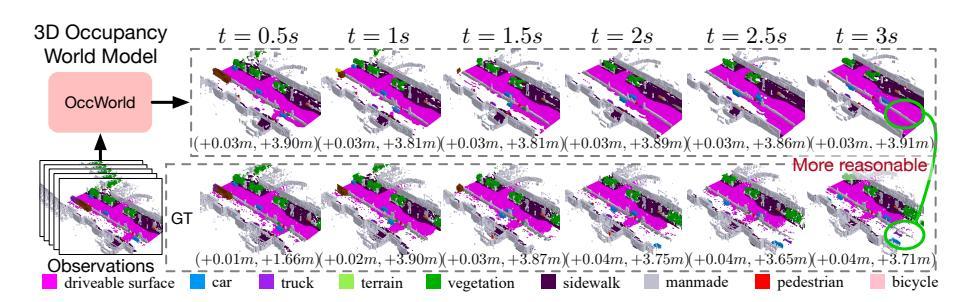
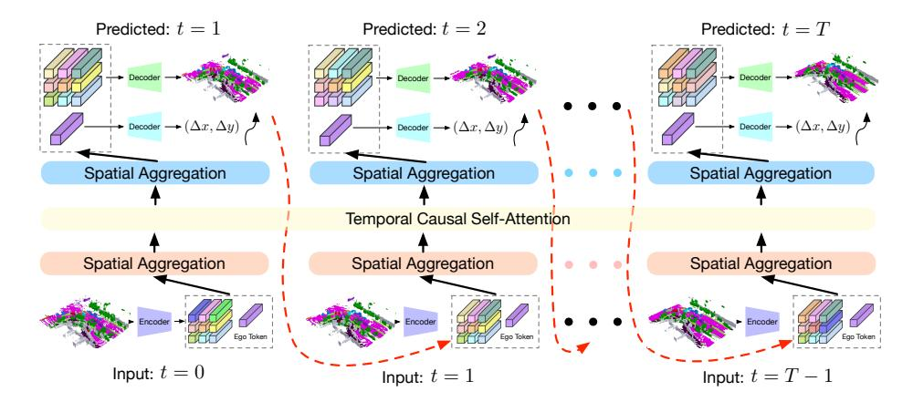
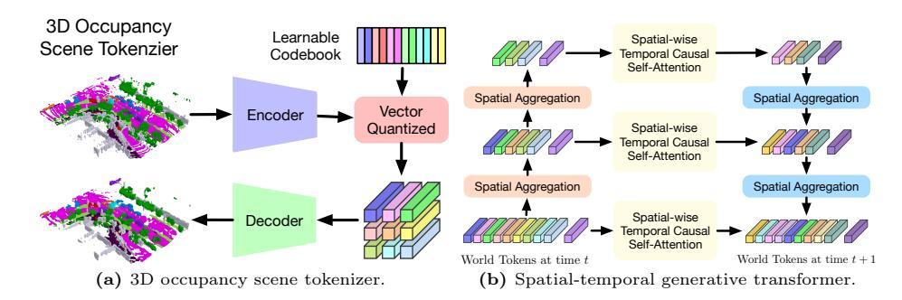
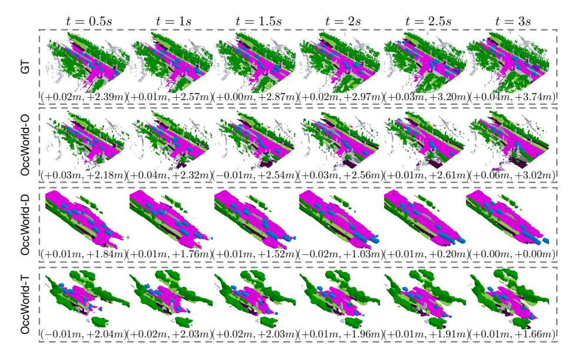
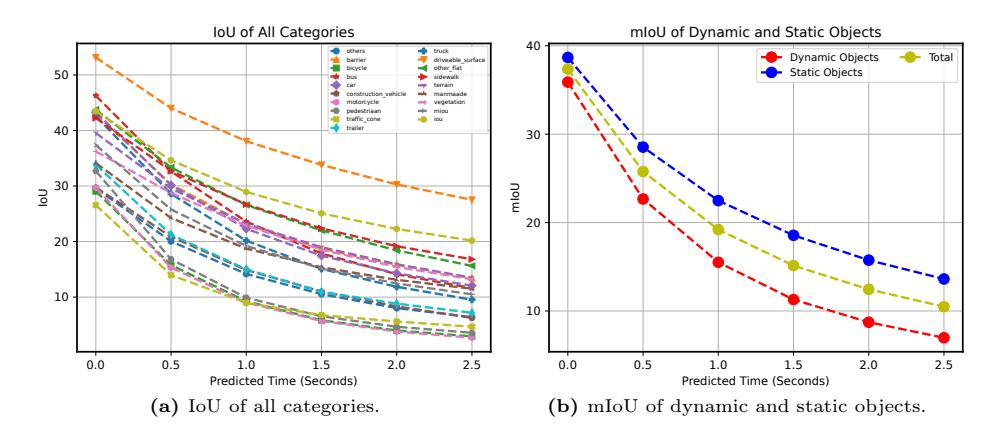

# OccWorld: Learning a 3D Occupancy World Model for Autonomous Driving

Wenzhao Zheng1,2\*, Weiliang Chen1\*, Yuanhui Huang1, Borui Zhang1, Yueqi Duan1, and Jiwen Lu1†

1Tsinghua University 2UC Berkeley
https://wzzheng.net/OccWorld
wenzhao.zheng@outlook.com;
{chen-wl20,huangyh22,zhang-br21}@mails.tsinghua.edu.cn;
{duanyueqi,lujiwen}@tsinghua.edu.cn

Fig. 1: Given past 3D occupancy observations, our self-supervised OccWorld can forecast future scene evolutions and ego movements jointly. This task requires a spatial understanding of the 3D scene and temporal modeling of how driving scenarios develop. We observe that OccWorld successfully forecasts the movements of surrounding agents and future map elements such as drivable areas. OccWorld even generates more reasonable drivable areas than the ground truth, demonstrating its ability to understand the scene rather than memorizing training data.

Abstract. Understanding how the 3D scene evolves is vital for making decisions in autonomous driving. Most existing methods achieve this by predicting the movements of object boxes, which cannot capture more fine-grained scene information. In this paper, we explore a new framework of learning a world model, OccWorld, in the 3D occupancy space to simultaneously predict the movement of the ego car and the evolution of the surrounding scenes. We propose to learn a world model based on 3D occupancy rather than 3D bounding boxes and segmentation maps for three reasons: 1) expressiveness. 3D occupancy can describe the more fine-grained 3D structure of the scene; 2) efficiency. 3D occupancy is more economical to obtain (e.g., from sparse LiDAR points). 3) versatility. 3D occupancy can adapt to both vision and LiDAR. To facilitate the modeling of the world evolution, we learn a reconstruction-based scene tokenizer on the 3D occupancy to obtain discrete scene tokens

\* Equal contributions.

&lt;sup>† Corresponding author.

to describe the surrounding scenes. We then adopt a GPT-like spatial-temporal generative transformer to generate subsequent scene and ego tokens to decode the future occupancy and ego trajectory. Extensive experiments on nuScenes demonstrate the ability of OccWorld to effectively model the driving scene evolutions. OccWorld also produces competitive planning results without using instance and map supervision. Code: https://github.com/wzzheng/OccWorld.

### 1 Introduction

Autonomous driving has been widely explored in recent years and demonstrated promising results in various scenarios [21,58,67,71]. While LiDAR-based models typically show strong performance and robustness in 3D perception due to its capture of structural information [7,36,52,62,63], the more hardware-economical vision-centric solutions have dramatically caught up with the increased perception ability of deep networks [19,33,34,43,45].

Forecasting future scene evolutions is important to the safety of autonomous driving vehicles. Most existing methods follow a conventional pipeline of perception, prediction, and planning [17,18,26]. Perception aims to obtain a semantic understanding of the surrounding scene such as 3D object detection [19,33,34,65] and semantic map construction [31,35,37,68]. The subsequent prediction module captures the motion of other traffic participants [11,14,25,68], and the planning module then makes decisions based on previous outputs [17,18,26,46]. However, this serial design usually requires ground-truth labels at each stage of training, yet the instance-level bounding boxes and high-definition maps are difficult to annotate. Furthermore, they usually only predict the motion of object bounding boxes, failing to capture more fine-grained information about the 3D scene.

In this paper, we explore a new paradigm to simultaneously predict the evolution of the surrounding scene and plan the future trajectory of the self-driving vehicle. We propose OccWorld, a world model in the 3D semantic occupancy space, to model the development of the driving scenes. We adopt 3D semantic occupancy as the scene representation over the conventional 3D bounding boxes and segmentation maps, which can describe the more fine-grained 3D structure of the scene. Moreover, 3D occupancy can be effectively learned from sparse Li-DAR points [21], and thus is a potentially more economical way to describe the surrounding scenes. Given the 3D semantic occupancy representation of the current scene. OccWorld aims to predict how it evolves as the self-driving vehicle advances. To achieve this, we first employ a vector-quantized variational autoencoder (VQVAE) [42] to refine high-level concepts and obtain discrete scene tokens in a self-supervised manner. We then tailor the generative pre-training transformers (GPT) [2] architecture and propose a spatial-temporal generative transformer to predict the subsequent scene tokens and ego tokens to forecast the future occupancy and ego trajectory, respectively. We first perform spatial mixing to aggregate scene tokens and obtain multi-scale tokens to represent scenes at multiple levels. We then apply temporal attention to tokens at different levels to predict tokens for the next frame and use a U-net structure to integrate them. Finally, we use the trained VQVAE decoder to transform scene tokens to the occupancy space and learn a trajectory decoder to obtain ego planning results.

To demonstrate the effectiveness of OccWorld, we formulate a challenging task of 4D occupancy forecasting, which aims to predict the 3D occupancy of the following frames given a few past frames. Our OccWorld can effectively forecast future evolutions including moving agents and static elements as shown in Figure 1, and achieves an average IoU of 26.63 and mIoU of 17.13 for 3s future given 2s history, OccWorld can also produce planning trajectories with an L2 error of 1.17 and a collision rate of 0.60% without using any instance and map annotations. Combined with self-supervised 3D occupancy learned from images [20], OccWorld achieves non-trivial 4D occupancy forecasting and planning results without any human-annotated labels, paving the way for scaling to large interpretable end-to-end autonomous driving models.

# 2 Related Work

3D Occupancy Prediction: 3D occupancy prediction aims to predict whether each voxel in the 3D space is occupied and its semantic label if occupied [21, 22, 53, 54, 57, 58, 69, 72]. Early methods exploited LiDAR as inputs to complete the 3D occupancy of the entire 3D scene [6, 30, 47, 60]. Recent methods began to explore the more challenging vision-based 3D occupancy prediction [4, 21] or applying vision backbones to efficiently perform LiDAR-based 3D occupancy prediction [72]. 3D occupancy provides more comprehensive descriptions of the surrounding scene and includes both dynamic and static elements [21, 58, 72]. It can also be efficiently learned from sparse accumulated multiple LiDAR scans [58], LiDAR [21], or video sequences [5]. However, existing methods only focus on obtaining the 3D semantic occupancy and ignore its temporal evolution, which is vital to the safety of autonomous driving. In this paper, we explore the task of 4D occupancy forecasting and propose a 3D occupancy world model to for it.

World Models for Autonomous Driving: World models have a long history in control engineering and artificial intelligence [50], which are usually defined as producing the next scene observation given action and past observations [12]. The development of deep neural networks [13,49,51] promoted the use of deep generative models [10,29] as world models. Based on large pre-trained image generative models like StableDiffusion [48], recent methods [9,15,32,56,61] can generate realistic driving sequences of diverse scenarios. However, they produce future observations in the 2D image space, lacking understanding of the 3D surrounding scene. Some other methods explore forecasting point clouds using unannotated LiDAR scans [27, 28, 41, 59], which ignore the semantic information and cannot be applied to vision-based or fusion-based autonomous driving. Considering this, we explore a world model in the 3D occupancy space to more comprehensively model the 3D scene evolution.

**End-to-End Autonomous Driving:** The ultimate goal of autonomous driving is to obtain controlling signals based on observations of the surrounding scenes. Recent methods follow this concept to output planning results for

the ego car given sensor inputs [17, 18, 26, 54, 64]. Most of them follow a conventional pipeline of perception [21, 33, 34, 58, 67], prediction [11, 14, 38, 68], and planning [23, 24, 55, 70]. They usually first perform BEV perception to extract relevant information (e.g., 3D agent boxes, semantic maps, tracklets) and then exploit them to infer future trajectories of agents and the ego vehicle. The following methods incorporated more data [64] or extracted more intermediate features [17, 18, 26] to provide more information for the planner, which achieved remarkable performance. Most methods only model object motions and cannot capture the fine-grained structural and semantic information of the surroundings [11, 14, 25, 26, 68]. Differently, we propose a world model to predict the evolution of both the surrounding dynamic and static elements.

# 3 Proposed Approach

### 3.1 World Model for Autonomous Driving

Autonomous driving aims to automatically steer a vehicle to fully prevent or partially reduce actions from human drivers [18]. Formally, the objective of autonomous driving is to obtain the control commands  $\mathbf{c}^T$  (e.g., throttle, steer, break) for the present time stamp T given the sensor inputs  $\{\mathbf{s}^T, \mathbf{s}^{T-1}, \cdots, \mathbf{s}^{T-t}\}$  from the current and past t frames.

As the mapping from trajectories to control signals is highly dependent on the vehicle specifications and status, the literature usually assumes a given satisfactory controller and focuses on trajectory planning. An autonomous driving model A then takes input as the sensor inputs and ego trajectory from the past T frames and predicts the ego trajectory of future f frames:

$$A(\{\mathbf{s}^T, \mathbf{s}^{T-1}, \cdots, \mathbf{s}^{T-t}\}, \{\mathbf{p}^T, \mathbf{p}^{T-1}, \cdots, \mathbf{p}^{T-t}\})$$

$$= \{\mathbf{p}^{T+1}, \mathbf{p}^{T+2}, \cdots, \mathbf{p}^{T+f}\},$$
(1)

where  $\mathbf{p}^t$  denotes the 3D ego position at the t-th time.

The conventional pipeline usually follows a design of perception, prediction, and planning [17, 18, 26]. The perception module  $p_{er}$  perceives the surrounding scenes and extracts high-level information  $\mathbf{z}$  from the input sensor data  $\mathbf{s}$ . The prediction module  $p_{re}$  then integrates the high-level information  $\mathbf{z}$  to predict the future trajectory  $\mathbf{t}_i$  of each agent in the scene. The planning module  $p_{la}$  finally processes the perception and prediction results  $\{\mathbf{z}, \{\mathbf{t}_i\}\}$  to plan the motion of the ego vehicle. The conventional pipeline can be formulated as:

$$p_{la}(p_{er}(\{\mathbf{s}^{T}, \cdots, \mathbf{s}^{T-t}\}), p_{re}(p_{er}(\{\mathbf{s}^{T}, \cdots, {}^{T-t}\})))$$

$$= \{\mathbf{p}^{T+1}, \mathbf{p}^{T+2}, \cdots, \mathbf{p}^{T+f}\}.$$
(2)

Despite the promising performance of this framework [17, 18, 26], it usually requires labels at each stage, which can be laborious to annotate. It only considers object-level movement and fails to model more fine-grained evolutions.

Fig. 2: Framework of our OccWorld for 4D semantic occupancy forecasting and motion planning. We adopt a GPT-like generative architecture to predict the next scene from previous scenes in an autoregressive manner. We adapt GPT [2] to the autonomous driving scenario with two key designs: 1) We train a 3D occupancy scene tokenizer to produce discrete high-level representations of the 3D scene; 2) We perform spatial mixing before and after spatial-wise temporal causal self-attention to efficiently produce globally consistent scene predictions. We use ground-truth and predicted scene tokens as inputs for future generations for training and inference, respectively.

Motivated by this, we explore a new world-model-based autonomous driving paradigm to comprehensively model the evolution of the surrounding scenes and the ego movements. Inspired by the success of generative pre-training transformers (GPT) [2] in natural language processing (NLP), we propose an autoregressive generative modeling framework for autonomous driving scenarios. We define a world model w to act on scene representations  $\mathbf{y}$  and be able to predict future scenes. Formally, we formulate the function of a world model w as follows:

$$w(\{\mathbf{y}^T, \dots, \mathbf{y}^{T-t}\}, \{\mathbf{p}^T, \dots, \mathbf{p}^{T-t}\}) = \mathbf{y}^{T+1}, \mathbf{p}^{T+1}.$$
 (3)

Having obtained the predicted scene  $\mathbf{y}^{T+1}$  and the ego position  $\mathbf{p}^{T+1}$ , we add them to the input and predict the next frame in an auto-regressive manner, as shown in Fig. 2. The world model w captures the joint distribution of the scene evolution and the ego movement, considering their high-order interactions.

### 3.2 3D Occupancy Scene Tokenizer

As the world model w operates on the scene representation  $\mathbf{y}$ , the choice of  $\mathbf{y}$  is vital to w. We select the 3D scene representation  $\mathbf{y}$  based on three principles: 1) **expressiveness**. It should be able to comprehensively contain the 3D structural and semantic information of the 3D scene; 2) **efficiency**. It should be economical to learn (e.g., from weak supervision or self-supervision); 3) **versatility**. It should be able to adapt to both vision and LiDAR modalities.

Considering these principles, we propose to adopt 3D occupancy as the 3D scene representation  $\mathbf{y} \in \mathbb{R}^{H \times W \times D}$ . 3D occupancy partitions the surrounding 3D space into  $H \times W \times D$  voxels and assigns each voxel with a label l denoting whether it is occupied and which material it is occupied with. 3D occupancy provides a dense representation of the 3D scene and can describe both the 3D structural and semantic information of the scene. It can be effectively learned from sparse LiDAR annotations [21] or potentially from self-supervision of temporal frames [20]. 3D occupancy is also modality-agnostic and can be obtained from monocular camera [4], surrounding cameras [21, 54, 58], or LiDAR [72].

Despite its comprehensiveness, 3D occupancy only provides a low-level understanding of the scene, making it difficult to directly model its evolution. We therefore propose a self-supervised way to tokenize the scene into high-level tokens from 3D occupancy. We train a vector-quantized autoencoder (VQ-VAE) [42] on  $\bf y$  to obtain discrete tokens  $\bf z$  to better represent the scene, as shown in Fig. 3a.

For efficiency, we first transform the 3D occupancy  $\mathbf{y} \in \mathbb{R}^{H \times W \times D}$  to a BEV representation  $\hat{\mathbf{y}} \in \mathbb{R}^{H \times W \times DC'}$  by assigning each category with a learnable class embedding  $\in \mathbb{R}^{C'}$  and concatenating them in the height dimension. We then adopt a lightweight encoder composed of 2D convolutions to obtain downsampled features  $\hat{\mathbf{z}} \in \mathbb{R}^{\frac{H}{d} \times \frac{W}{d} \times C}$ , where d is the down-sampling factor.

To obtain a more compact representation, we simultaneously learn a codebook  $\mathbf{C} \in \mathbb{R}^{N \times C}$  containing N codes. Each code  $\mathbf{c} \in \mathbb{R}^C$  encodes a high-level concept of the scene, e.g., whether a position is occupied by a car. We quantized each spatial feature  $\hat{\mathbf{z}}_{ij}$  in  $\hat{\mathbf{z}}$  by classifying it to the nearest code  $\mathcal{N}(\hat{\mathbf{z}}_{ij}, \mathbf{C})$ :

$$\mathbf{z}_{ij} = \mathcal{N}(\hat{\mathbf{z}}_{ij}, \mathbf{C}) = \min_{\mathbf{c} \in \mathbf{C}} ||\hat{\mathbf{z}}_{ij} - \mathbf{c}||_2,$$
 (4)

where  $||\cdot||_2$  denotes the L2 norm. We then integrate the quantized features  $\{\mathbf{z}_{ij}\}$  to obtain the final scene representation  $\mathbb{R}^{\frac{H}{d} \times \frac{W}{d} \times C}$ .

To reconstruct  $\widetilde{\mathbf{y}}$  from the learned scene representation  $\mathbf{z}$ , we use a decoder of 2D deconvolution layers to progressively upsample  $\mathbf{z}$  to its original BEV resolution  $H \times W \times C''$ . We then perform a split in the channel dimension to reconstruct the height dimension  $H \times W \times D \times \frac{C''}{D}$  and apply a softmax layer on each spatial feature to classify them into semantic occupancy.

The scene tokenizer transforms 3D occupancy into a more compact discrete space to encode higher-level concepts. This refined compact space facilitates the modeling of scene evolution for the subsequent world model.

#### 3.3 Spatial-Temporal Generative Transformer

The core of autonomous driving is the prediction of how the surrounding world evolves and planning the movement of the ego vehicle accordingly. While conventional methods consider them separately [17,18], we propose a world model w to jointly model the distributions of scene evolution and ego trajectory.

As defined in (3), a world model w takes as inputs the past scenes and ego positions and predicts their outcome after driving a certain time interval. Following the principles of expressiveness, efficiency, and versatility, we adopt

Fig. 3: Illustration of the proposed modules. (a) We use CNNs to encode the 3D occupancy and perform vector quantization to obtain discrete tokens using a learnable codebook [42]. We then employ a decoder to reconstruct the input 3D occupancy using the quantized tokens and train the autoencoder and codebook simultaneously. (b) As each scene is represented by world tokens, we adopt spatial mixing to model their intrinsic dependencies and obtain multi-scale world tokens to capture multi-level information. We perform spatial-wise temporal causal self-attention at each level to forecast the next scene and employ a U-net structure to aggregate multi-scale predictions.

3D occupancy  $\mathbf{y}$  as the scene representation and use a self-supervised tokenizer to obtain high-level scene tokens  $\mathbf{T} = \{\mathbf{z}_i\}$ . To integrate the ego movement, we further aggregate  $\mathbf{T}$  with an ego token  $\mathbf{z}_0 \in \mathbb{R}^C$  to encode the spatial ego position. The proposed OccWorld w then functions on the world tokens  $\mathbf{T}$ :

$$w(\mathbf{T}^T, \cdots, \mathbf{T}^{T-t}) = \mathbf{T}^{T+1},\tag{5}$$

where T is the current time stamp, and t is the number of history frames.

Inspired by the remarkable sequential prediction performance of GPT [2], we adopt a GPT-like autoregressive transformer architecture to instantiate (5). However, the migration of GPT from natural language processing to autonomous driving is not trivial. GPTs predict a single token each time, while the world model w in autonomous driving is required to predict a set of tokens  $\mathbf{T}$  as the next future. Due to the vast number of world tokens, directly leveraging the GPT architecture to predict each token  $\in \mathbf{T}^{T+1}$  is both inefficient and ineffective.

Both the spatial relations of world tokens within each time stamp and the temporal relations of tokens across different time stamps should be considered to comprehensively model the world evolution. Therefore, we propose a spatial-temporal generative transformer architecture to effectively process past world tokens and make predictions of the next future, as shown in Fig. 3b.

We apply spatial aggregation (e.g., self-attention [8]) to world tokens  $\mathbf{T}$  to enable interactions between scene tokens and ego tokens. We then merge the scene tokens in each  $2 \times 2$  window with a stride of 2 to achieve a 1/4 down-sampling. We repeat this procedure for K times to obtain world tokens of hierarchical scales  $\{\mathbf{T}_0, \cdots, \mathbf{T}_K\}$  to describe the 3D scene at different levels.

We use several sub-world models  $w = \{w_0, \dots, w_K\}$  to predict the future at different spatial scales. For each sub-world model  $w_i$ , we impose temporal

attention on the tokens  $\{\mathbf{z}_{j,i}^T, \cdots, \mathbf{z}_{j,i}^{T-t}\}$  at each position j to obtain the predicted corresponding token  $\mathbf{z}_{i,i}^{T-t}$  of the next frame:

$$\hat{\mathbf{z}}_{j,i}^{T+1} = \text{TA}(\mathbf{z}_{j,i}^T, \cdots, \mathbf{z}_{j,i}^{T-t}), \tag{6}$$

where TA denotes masked temporal attention which blocks the effect of future tokens to previous tokens.  $\mathbf{z}_{j,i}^t \in \mathbf{T}_i^t$  represents the j-th world token of the i-th scale at time stamp t. We finally employ a U-net structure to aggregate predicted tokens at different scales to ensure spatial consistency.

Our spatial-temporal generative transformer models the world evolution considering the joint distributions of world tokens within each time and across time. The temporal attention predicts the evolution of a fixed position in the surroundings, while the spatial aggregation makes each token aware of the global scene.

### 3.4 OccWorld: a 3D Occupancy World Model

In this subsection, we present the overall training framework of the proposed OccWorld model for autonomous driving. Having obtained the forecasted world tokens, we reuse the scene decoder d to decode the predicted 3D occupancy  $\hat{\mathbf{y}}^{T+1} = d(\hat{\mathbf{z}}^{T+1})$  and additionally learn an ego decoder  $d_{ego}$  to produce the ego displacement  $\hat{p}^{T+1} = d_{ego}(\hat{z}_0^{T+1})$  w.r.t the current frame.

We adopt a two-stage strategy to effectively train our OccWorld. For the first stage, we train the scene tokenizer e and decoder d using 3D occupancy loss [21]:

$$J_{e,d} = L_{soft}(d(e(\mathbf{y})), \mathbf{y}) + \lambda_1 \ L_{lovasz}(d(e(\mathbf{y})), \mathbf{y}), \tag{7}$$

where  $L_{soft}$  and  $L_{lovasz}$  is the softmax and lovasz-softmax loss [1], respectively.

For the second stage, we adopt the learned scene tokenizer e to obtain scene tokens  $\mathbf{z}$  for all the frames and constrain the discrepancy between predicted tokens  $\hat{\mathbf{z}}$  and  $\mathbf{z}$ . Due to the use of discrete tokens, we apply the softmax loss to enforce the correct classification of  $\hat{\mathbf{z}}$  to the correct codes in the codebook  $\mathbf{C}$  as  $\mathbf{z}$ . For the ego token, we simultaneously learn the ego decoder  $d_{ego}$  and apply L2 loss on the predicted displacement  $\hat{p} = d_{ego}(\hat{\mathbf{z}}_0)$  and the ground-truth one  $\mathbf{p}$ . The overall objective for the second stage can be formulated as follows:

$$J_{w,d_{ego}} = \sum_{t=1}^{T} (\sum_{j=1}^{M_0} L_{soft}(\hat{\mathbf{z}}_{j,0}^t, \mathbf{C}(\mathbf{z}_{j,0}^t) + \lambda_2 L_{L2}(d_{ego}(\hat{\mathbf{z}}_0^t), \mathbf{p}^t)),$$
(8)

where T and  $M_0$  are the number of frames and the number of spatial tokens of the original scale, respectively.  $\mathbf{C}(\cdot)$  denotes the index of the corresponding code in the codebook  $\mathbf{C}$ .  $L_{L2}$  measures the L2 discrepancy between two trajectories.

For efficient training, we use tokens obtained by the scene tokenizer e as inputs but apply masked temporal attention [2] to block the effect of future tokens on previous ones. For inference, we progressively predict world tokens of the next frame using predicted past tokens instead of ground-truth ones.

The proposed OccWorld can be applied to different types of 3D occupancy to adapt to different settings (e.g., end-to-end autonomous driving). The scene representation model r can be an oracle that provides ground-truth occupancy, or a perception model that is trained using dense supervision (e.g., accumulated LiDAR [58]), sparse supervision (e.g., LiDAR [21]), or self-supervision (e.g., videos [5]). Different from the conventional perception, predicting, and planning pipeline for autonomous driving, OccWorld models the joint evolution of the surrounding scene and the ego movement to capture high-order interactions with the environment. Combined with machine-annotated [58], LiDAR-collected [21], or self-supervised [20] 3D occupancy, OccWorld has the potential to scale up to large-scale training data, paving the way for training large driving models.

# 4 Experiments

## 4.1 Task Descriptions

In this paper, we explore a world-model-based framework for autonomous driving and propose OccWorld to model the joint evolutions of ego trajectory and scene evolutions. We conduct two tasks to evaluate our OccWorld: 4D occupancy forecasting on Occ3D [53] and motion planning on nuScenes [3].

4D occupancy forecasting. 3D occupancy prediction aims to reconstruct the semantic occupancy for each voxel in the surrounding space and cannot capture the temporal evolution of the 3D occupancy. In this paper, we explore 4D occupancy forecasting, which aims to forecast future 3D occupancy given historical occupancy. We use the mean intersection of region (mIoU) of all the semantic categories between forecasted and ground-truth occupancy to measure the semantic forecast performance. We adopt the intersection of region (IoU) between occupied and unoccupied voxels to evaluate the structural forecast quality. We report the forecasting performance for future frames of 1s, 2s, and 3s.

Motion planning. Motion planning aims to produce safe future trajectories for the vehicle given ground-truth surrounding information or perception results. The planned trajectory is represented by a series of 2D waypoints in the BEV plane. We use L2 error and box collision rate to measure the quality of the planned trajectory. The L2 error computes the L2 distance between the planned waypoint and the ground-truth waypoint at a given time stamp. The box collision rate measures the frequency of intersection between the BEV box of the ego vehicle and other traffic agents for a certain period of time. We follow previous methods [17] and report planning performance for the future 1s, 2s, and 3s.

## 4.2 Datasets Details

**nuScenes** [3] contains 1000 driving scenes, i.e., videos of 6 surrounding cameras with 360° horizontal FOV and 32-beam LiDAR point clouds for 20 seconds, and provides annotated at 2Hz for keyframes. We follow the official split [3] and employ 700 and 150 scenes for training and validation, respectively.

**Table 1: 4D occupancy forecasting performance.** Aux. Sup. denotes auxiliary supervision apart from the ego trajectory. Avg. denotes the average performance of that in 1s, 2s, and 3s. We use bold numbers to denote the best results.

| Method     | Input  | Aux. Sup. | mIoU (%) ↑ |       |       |       | IoU (%) ↑ |       |       |       |       | FPS   |      |
|------------|--------|-----------|------------|-------|-------|-------|-----------|-------|-------|-------|-------|-------|------|
|            |        |           | 0s         | 1s    | 2s    | 3s    | Avg.      | 0s    | 1s    | 2s    | 3s    | Avg.  | FFS  |
| Copy&Paste | 3D-Occ | None      | 66.38      | 14.91 | 10.54 | 8.52  | 11.33     | 62.29 | 24.47 | 19.77 | 17.31 | 20.52 | -    |
| OccWorld-O | 3D-Occ | None      | 66.38      | 25.78 | 15.14 | 10.51 | 17.14     | 62.29 | 34.63 | 25.07 | 20.18 | 26.63 | 18.0 |
| OccWorld-D | Camera | 3D-Occ    | 18.63      | 11.55 | 8.10  | 6.22  | 8.62      | 22.88 | 18.90 | 16.26 | 14.43 | 16.53 | 2.8  |
| OccWorld-T | Camera | Lidar     | 7.21       | 4.68  | 3.36  | 2.63  | 3.56      | 10.66 | 9.32  | 8.23  | 7.47  | 8.34  | 2.8  |
| OccWorld-S | Camera | None      | 0.27       | 0.28  | 0.26  | 0.24  | 0.26      | 4.32  | 5.05  | 5.01  | 4.95  | 5.00  | 2.8  |

Occ3D [53] provides 3D semantic occupancy annotations for nuScenes. Each scene is split into  $200 \times 200 \times 16$  voxels covering a -40m  $\sim$  40m area along the X and Y axis and -1m  $\sim$  5.4m along the Z axis. Each voxel is annotated as occupied or unoccupied and an additional semantic category if occupied.

## 4.3 Implementation Details

We followed existing works [18,26] and used a 2-second historical context to forecast the subsequent 3 seconds. We encode instructions and incorporate them via cross-attention to the ego token. The scene tokenizer employs a down-sampling factor of 4, featuring a codebook with a size of 512 and a dimension of 128. The spatial-temporal generative transformer comprises 3 scales, each incorporating 6 layers of spatial-wise temporal attention for scene tokens with 2 layers of spatial cross-attention and temporal cross-attention for ego planning tokens.

During training, we applied mask operations to all temporal attention mechanisms to prevent the influence of future information on forecasting. For inference, we employ autoregressive prediction to foresee 3 seconds into the future based on a 2-second historical context. We adopted AdamW [40] with a Cosine Annealing scheduler [39] for training. We set an initial learning rate of  $10^{-3}$  and the weight decay at 0.01. We use a batch size of 1 per GPU on 8 NVIDIA 4090 GPUs.

#### 4.4 Results and Analysis

4D occupancy forecasting. We evaluated our OccWorld in several settings: OccWorld-O (using ground-truth 3D occupancy), OccWorld-D (using predicted results of TPVFormer [21] trained with dense ground-truth 3D occupancy), OccWorld-T (using predicted results of TPVFormer [21] trained with sparse semantic LiDAR), and OccWorld-S (using predicted results of self-supervised SelfOcc [20]). Copy&Paste denotes copying the current ground-truth occupancy as future observations. The 0s results represent the reconstruction accuracy.

Table 1 shows that OccWorld-O can learn the underlying scene evolution and generate non-trivial future 3D occupancy with much better results than Copy&Paste. OccWorld-D, OccWorld-T, and OccWorld-S can be seen as end-to-end vision-based 4D occupancy forecasting methods as they take surrounding

Fig. 4: Visualizations of the forecasting and planning results of OccWorld-O, OccWorld-D, and OccWorld-T.

images as input. This task is very challenging since it requires both 3D structure reconstruction and forecasting. It is especially difficult for OccWorld-S which exploits no 3D occupancy information during training. Still, OccWorld generates future 3D occupancy with non-trivial mIoU and IoU on the end-to-end setting.

The performance drop over time results from the generative nature of our method. Driving scenarios are essentially random distributions (i.e., drivers can make different yet reasonable decisions), while the ground-truth trajectory only provides one possible future. As shown in Fig. 1, the forecastings of OccWorld might not exactly match the ground truth but are still reasonable. Different from motion annotations, 3D occupancy only provides local perception, rendering the performance drop if the car advances a long distance. In real scenarios, the autonomous driving system continuously perceives the surroundings and only needs to make instant decisions, rendering near-future planning more important.

Visualizations. We visualize the output results of the proposed OccWorld in Fig. 4. We see that our models can successfully forecast the movements of cars and can complete unseen map elements in the inputs such as drivable areas. The planning trajectory is also more accurate with better 4D occupancy forecasting.

Motion planning. We compare the motion planning performance of our OccWorld with state-of-the-art end-to-end methods, as shown in Table 2. We also evaluate our model under different settings (-O, -D, -T, -S). We see that UniAD achieves the best overall performance, which exploits various types of auxiliary supervision to improve its planning quality. Despite the strong performance, the additional annotations in the 3D space are very difficult to obtain, making it dif-

**Table 2: Motion planning performance.** We use bold and underlined numbers to denote the best and second-best results, respectively. B, Mo, Ma, D, T, O denote using the auxiliary supervision signal of box, motion, map, depth, tracklets, and occupancy, respectively. † denotes using the metric computation code adopted in VAD [26].

| Method                                                                                                                                                  | Input                                          | Aux. Sup.                                                                          | ls                     | L2 ( 2s                  | m) ↓ 3s           | Avg.                                        | Colli 1s                 | sion 2s             | Rate 3s            | (%) ↓ Avg.                | FPS                                                                                                   |
|---------------------------------------------------------------------------------------------------------------------------------------------------------|------------------------------------------------|------------------------------------------------------------------------------------|------------------------|-----------------------------|----------------------|---------------------------------------------|-----------------------------|---------------------|-----------------------|------------------------------|-------------------------------------------------------------------------------------------------------|
| IL [44] NMP [66] FF [16] EO [27]                                                                                                               | LiDAR LiDAR LiDAR LiDAR               | None B & Mo Freespace Freespace                                                    | $0.53 \\ 0.55$         | $1.25 \\ 1.20$              | $2.67 \\ 2.54$       | 1.35 1.48 1.43 1.60                | <b>0.04</b> 0.06         | $\frac{0.12}{0.17}$ | $\frac{0.87}{1.07}$   | $0.34 \\ 0.43$               | - - -                                                                                           |
| ST-P3 [17] UniAD [18] VAD-Tiny [26] VAD-Base [26] OccNet [54]                                                                               | Camera Camera Camera Camera Camera | Ma & B & D Ma & B & Mo & T & O Ma & B & Mo Ma & B & Mo Ma & B & Mo 3D-Occ & Ma & B | $0.48 \\ 0.60 \\ 0.54$ | <b>0.96</b> 1.23 1.15 | 1.65 2.06 1.98 | 2.11 <b>1.03</b> 1.30 1.22 2.14 | 0.05 0.31 <b>0.04</b> | 0.17 $0.53$ $0.39$  | <b>0.71</b> 1.33 1.17 | <b>0.31</b> 0.72 0.53        | $   \begin{array}{r}     1.6 \\     1.8 \\     \underline{16.8} \\     4.5 \\     2.6   \end{array} $ |
| OccNet [54] OccWorld-O                                                                                                                               | 3D-Occ 3D-Occ                               | Ma & B None                                                                     |                        |                             |                      | $\frac{2.25}{1.17}$                         |                             |                     |                       | 0.69 0.60                 | - 18.0                                                                                             |
| OccWorld-D OccWorld-T OccWorld-S                                                                                                                  | Camera Camera Camera                     | 3D-Occ LiDAR None                                                            | 0.54                   | 1.36                        | 2.66                 | 1.40 1.52 1.83                        | 0.12                        | 0.40                | 1.59                  | 0.70                         | 2.8 2.8 2.8                                                                                     |
| VAD-Tiny † [26] VAD-Base † [26]                                                                                                |                                                | Ma & B & Mo Ma & B & Mo                                                         |                        |                             |                      |                                             |                             |                     |                       | 0.38 <b>0.22</b>          | $\frac{16.8}{4.5}$                                                                                    |
| $\begin{array}{c} OccWorld\text{-}O^{\dagger} \\ OccWorld\text{-}D^{\dagger} \\ OccWorld\text{-}T^{\dagger} \\ OccWorld\text{-}S^{\dagger} \end{array}$ | 3D-Occ Camera Camera Camera           | None 3D-Occ LiDAR None                                                    | $\frac{0.39}{0.40}$    | $0.73 \\ 0.77$              | 1.18 1.28         | 0.64 0.77 0.82 0.99                | 0.11 0.12                | $\frac{0.19}{0.22}$ | 0.67 $0.56$           | 0.24 0.32 0.30 0.76 | 2.8 2.8 2.8 2.8                                                                              |

ficult to scale to large-scale driving data. Alternatively, OccWorld demonstrates competitive performance by employing 3D occupancy as the scene representation which can be efficiently obtained by accumulating LiDAR scans [58].

We observe that using ground-truth 3D occupancy as inputs, our OccWorld-O outperforms the previous perception-prediction-planning-based method OccNet [54] by a large margin without using maps and bounding boxes as supervision, demonstrating the superiority of the world-model paradigm for autonomous driving. Our end-to-end models OccWorld-D and OccWorld-T also demonstrate competitive performance using only 3D occupancy as supervision and OccWorld-S delivers non-trivial results with no supervision other than the future trajectory, showing the potential for interpretable end-to-end autonomous driving.

Though our model demonstrates competitive L2 error, it falls behind on the collision rate. This is because it is more difficult to learn safe trajectories without the guidance of freespace or bounding box. Still, OccWorld demonstrates comparable collision rates with OccNet which exploits map and box supervision, showing that OccWorld can learn the concept of freespace with 3D occupancy.

We also see that OccWorld shows excellent short-term planning performance (1s), but worsens quickly when planning longer futures. For example, OccWorld-

Table 3: Effect of different hyperparameters for the scene tokenizer. We use bold numbers to denote the best results.

| Setting             | Reconstruction |       | Forecasting mIoU (%) ↑ |       |       |       | Planning L2 (m) ↓ |      |      |      | FPS  |
|---------------------|----------------|-------|------------------------|-------|-------|-------|-------------------|------|------|------|------|
|                     | mIoU ↑         | IoU ↑ | 1s                     | 2s    | 3s    | Avg.  | 1s                | 2s   | 3s   | Avg. | FIS  |
| $(50^2, 128, 512)$  | 66.38          | 62.29 | 25.78                  | 15.14 | 10.51 | 17.14 | 0.43              | 1.08 | 1.99 | 1.17 | 18.0 |
| $(50^2, 128, 256)$  | 63.40          | 60.33 | 24.25                  | 14.34 | 10.13 | 16.24 | 0.42              | 1.08 | 1.95 | 1.15 | 17.8 |
| $(50^2, 128, 1024)$ | 60.50          | 59.07 | 23.55                  | 14.66 | 10.68 | 16.30 | 0.47              | 1.18 | 2.19 | 1.28 | 17.8 |
| $(25^2, 256, 512)$  | 36.28          | 44.02 | 12.10                  | 8.13  | 6.20  | 8.81  | 3.27              | 6.54 | 9.78 | 6.53 | 28.1 |
| $(100^2, 128, 512)$ | 78.12          | 71.63 | 18.71                  | 10.75 | 7.68  | 12.38 | 0.50              | 1.25 | 2.33 | 1.36 | 6.7  |
| $(50^2, 64, 512)$   | 64.98          | 61.50 | 21.83                  | 12.90 | 9.28  | 14.67 | 0.49              | 1.24 | 2.26 | 1.33 | 20.1 |

Table 4: Ablation study of the spatial-temporal generative transformer. We report average results over the 1s, 2s, and 3s.

| Method                   | Forec      | ast       |         | FPS                                                               |      |  |  |
|--------------------------|------------|-----------|---------|-------------------------------------------------------------------|------|--|--|
| Method                   | mIoU (%) ↑ | IoU (%) ↑ | L2 (m)↓ | $2 \text{ (m)} \downarrow \text{ Collision Rate (\%)} \downarrow$ |      |  |  |
| OccWorld-O               | 17.14      | 26.63     | 1.17    | 0.60                                                              | 18.0 |  |  |
| w/o spatial attn         | 10.07      | 21.44     | 1.42    | 1.21                                                              | 28.6 |  |  |
| w/o temporal attn        | 8.98       | 20.10     | 2.06    | 2.56                                                              | 26.5 |  |  |
| w/o ego                  | 15.13      | 24.66     | -       | -                                                                 | 18.8 |  |  |
| ${\rm w/o}$ ego temporal | 12.07      | 23.09     | 5.89    | 6.23                                                              | 18.5 |  |  |

O achieves the best L2 error at 1s among all the methods but reaches 1.99 at 3s compared to 1.65 of UniAD. This might result from the diverse future generations of world models, which might deviate from the ground-truth trajectory.

Analysis of the scene tokenizer. We analyze the effect of different hyperparameters for the scene tokenizer in Table 3. The setting (S, C, N) denotes latent spatial resolution S, latent channel dimension C, and the codebook size N. We see that using a larger codebook than 512 leads to overfitting and using a smaller S, C, and N might not be enough to capture the scene distribution. The reconstruction accuracy improves with a larger spatial resolution, yet leading to poor forecasting and planning performance. This is because the tokens cannot learn high-level concepts, resulting in more difficulty in forecasting the future.

Analysis of the spatial-temporal generative transformer. We conducted an ablation study on both 4D occupancy forecasting and motion planning to analyze the design of the proposed spatial-temporal generative transformer, as shown in Table 4. w/o spatial attn denotes discarding spatial aggregation and directly applying temporal attention to the input tokens. w/o temporal attn represents that we replace the temporal attention with a simple convolution to output the next scene using the current world tokens. w/o ego represents that we discard the ego token. w/o ego temporal represents that we replace the temporal attention of the ego token with a simple MLP. We observe that using spatial aggregation to model spatial dependencies and using temporal attention to integrate history information is vital to the performance of both 4D occupancy forecasting and motion planning tasks. Also, only performing the 4D occupancy

Fig. 5: Analysis of the performance for static and dynamic objects.

forecasting task without predicting motion reduces the performance. This verifies the effectiveness of joint modeling of scene evolutions and ego trajectories. Finally, discarding the ego temporal attention leads to poor planning and surprisingly worse 3D forecast occupancy performance. We think this is because integrating a wrongly predicted ego trajectory will mislead the forecasting.

Analysis of dynamic object prediction. We analyze the performance of our model on static and dynamic objects as shown in Fig. 5. We see that the performance for dynamic objects is lower, indicating modeling dynamic objects is more challenging. This is reasonable since the observations of dynamic objects results from both the movements of the ego vehicle and the objects themselves. Still, OccWorld can successfully predict the future trajectories of dynamic objects, which is more important for making decisions.

### 5 Conclusion and Discussions

In this paper, we have presented a 3D occupancy world model (OccWorld) to model the joint evolutions of ego movements and surrounding scenes. We have employed a 3D occupancy scene tokenizer to extract high-level concepts and used a spatial-temporal generative transformer for future prediction in an autoregressive manner. Both quantitive and visualization results have shown that OccWorld can effectively predict future scene evolutions in the comprehensive 3D semantic occupancy space. We believe that OccWorld has paved the way for interpretable end-to-end autonomous driving without additional supervision signals and facilitated the scaling to large driving models.

**Limitations.** OccWorld simultaneously models the ego movements and scene evolutions, yet cannot predict the futures conditioned on certain driving commands. However, the ability to forecast multiple futures based on different conditions is important for a world model and is an interesting future direction.

# Acknowledgements

This work was supported in part by the National Key Research and Development Program of China under Grant 2023YFB280690, and in part by the National Natural Science Foundation of China under Grant 62321005, Grant 62336004, and Grant 62125603.

# References

- 1. Berman, M., Triki, A.R., Blaschko, M.B.: The lovász-softmax loss: A tractable surrogate for the optimization of the intersection-over-union measure in neural networks. In: CVPR. pp. 4413–4421 (2018)
- Brown, T., Mann, B., Ryder, N., Subbiah, M., Kaplan, J.D., Dhariwal, P., Nee-lakantan, A., Shyam, P., Sastry, G., Askell, A., et al.: Language models are few-shot learners. NeurIPS 33, 1877–1901 (2020)
- 3. Caesar, H., Bankiti, V., Lang, A.H., Vora, S., Liong, V.E., Xu, Q., Krishnan, A., Pan, Y., Baldan, G., Beijbom, O.: nuscenes: A multimodal dataset for autonomous driving. In: CVPR (2020)
- Cao, A.Q., de Charette, R.: Monoscene: Monocular 3d semantic scene completion. In: CVPR. pp. 3991–4001 (2022)
- Cao, A.Q., de Charette, R.: Scenerf: Self-supervised monocular 3d scene reconstruction with radiance fields. In: ICCV. pp. 9387–9398 (2023)
- Chen, X., Lin, K.Y., Qian, C., Zeng, G., Li, H.: 3d sketch-aware semantic scene completion via semi-supervised structure prior. In: CVPR. pp. 4193–4202 (2020)
- 7. Cheng, R., Razani, R., Taghavi, E., Li, E., Liu, B.: 2-s3net: Attentive feature fusion with adaptive feature selection for sparse semantic segmentation network. In: CVPR. pp. 12547–12556 (2021)
- 8. Dosovitskiy, A., Beyer, L., Kolesnikov, A., Weissenborn, D., Zhai, X., Unterthiner, T., Dehghani, M., Minderer, M., Heigold, G., Gelly, S., et al.: An image is worth 16x16 words: Transformers for image recognition at scale. In: ICLR (2020)
- Gao, R., Chen, K., Xie, E., Hong, L., Li, Z., Yeung, D.Y., Xu, Q.: Magicdrive: Street view generation with diverse 3d geometry control. arXiv preprint arXiv:2310.02601 (2023)
- 10. Goodfellow, I., Pouget-Abadie, J., Mirza, M., Xu, B., Warde-Farley, D., Ozair, S., Courville, A., Bengio, Y.: Generative adversarial nets. NeurIPS **27** (2014)
- Gu, J., Hu, C., Zhang, T., Chen, X., Wang, Y., Wang, Y., Zhao, H.: Vip3d: End-to-end visual trajectory prediction via 3d agent queries. arXiv preprint arXiv:2208.01582 (2022)
- 12. Ha, D., Schmidhuber, J.: World models. arXiv preprint arXiv:1803.10122 (2018)
- 13. He, K., Zhang, X., Ren, S., Sun, J.: Deep residual learning for image recognition. In: CVPR. pp. 770–778 (2016)
- 14. Hu, A., Murez, Z., Mohan, N., Dudas, S., Hawke, J., Badrinarayanan, V., Cipolla, R., Kendall, A.: Fiery: Future instance prediction in bird's-eye view from surround monocular cameras. In: ICCV (2021)
- 15. Hu, A., Russell, L., Yeo, H., Murez, Z., Fedoseev, G., Kendall, A., Shotton, J., Corrado, G.: Gaia-1: A generative world model for autonomous driving. arXiv preprint arXiv:2309.17080 (2023)
- 16. Hu, P., Huang, A., Dolan, J., Held, D., Ramanan, D.: Safe local motion planning with self-supervised freespace forecasting. In: CVPR (2021)

- 17. Hu, S., Chen, L., Wu, P., Li, H., Yan, J., Tao, D.: St-p3: End-to-end vision-based autonomous driving via spatial-temporal feature learning. In: ECCV (2022)
- Hu, Y., Yang, J., Chen, L., Li, K., Sima, C., Zhu, X., Chai, S., Du, S., Lin, T., Wang, W., et al.: Planning-oriented autonomous driving. In: CVPR. pp. 17853– 17862 (2023)
- 19. Huang, J., Huang, G., Zhu, Z., Du, D.: Bevdet: High-performance multi-camera 3d object detection in bird-eye-view. arXiv preprint arXiv:2112.11790 (2021)
- Huang, Y., Zheng, W., Zhang, B., Zhou, J., Lu, J.: Selfocc: Self-supervised vision-based 3d occupancy prediction. In: CVPR (2024)
- Huang, Y., Zheng, W., Zhang, Y., Zhou, J., Lu, J.: Tri-perspective view for vision-based 3d semantic occupancy prediction. In: CVPR. pp. 9223–9232 (2023)
- 22. Huang, Y., Zheng, W., Zhang, Y., Zhou, J., Lu, J.: Gaussianformer: Scene as gaussians for vision-based 3d semantic occupancy prediction. In: ECCV (2024)
- 23. Huang, Z., Liu, H., Lv, C.: Gameformer: Game-theoretic modeling and learning of transformer-based interactive prediction and planning for autonomous driving. arXiv preprint arXiv:2303.05760 (2023)
- 24. Huang, Z., Liu, H., Wu, J., Lv, C.: Differentiable integrated motion prediction and planning with learnable cost function for autonomous driving. IEEE transactions on neural networks and learning systems (2023)
- Jiang, B., Chen, S., Wang, X., Liao, B., Cheng, T., Chen, J., Zhou, H., Zhang, Q., Liu, W., Huang, C.: Perceive, interact, predict: Learning dynamic and static clues for end-to-end motion prediction. arXiv preprint arXiv:2212.02181 (2022)
- 26. Jiang, B., Chen, S., Xu, Q., Liao, B., Chen, J., Zhou, H., Zhang, Q., Liu, W., Huang, C., Wang, X.: Vad: Vectorized scene representation for efficient autonomous driving. arXiv preprint arXiv:2303.12077 (2023)
- 27. Khurana, T., Hu, P., Dave, A., Ziglar, J., Held, D., Ramanan, D.: Differentiable raycasting for self-supervised occupancy forecasting. In: ECCV (2022)
- 28. Khurana, T., Hu, P., Held, D., Ramanan, D.: Point cloud forecasting as a proxy for 4d occupancy forecasting. In: CVPR. pp. 1116–1124 (2023)
- Kingma, D.P., Welling, M.: Auto-encoding variational bayes. arXiv preprint arXiv:1312.6114 (2013)
- 30. Li, J., Han, K., Wang, P., Liu, Y., Yuan, X.: Anisotropic convolutional networks for 3d semantic scene completion. In: CVPR. pp. 3351–3359 (2020)
- 31. Li, Q., Wang, Y., Wang, Y., Zhao, H.: Hdmapnet: An online hd map construction and evaluation framework. In: ICRA (2022)
- 32. Li, X., Zhang, Y., Ye, X.: Driving diffusion: Layout-guided multi-view driving scene video generation with latent diffusion model. arXiv preprint arXiv:2310.07771 (2023)
- 33. Li, Y., Ge, Z., Yu, G., Yang, J., Wang, Z., Shi, Y., Sun, J., Li, Z.: Bevdepth: Acquisition of reliable depth for multi-view 3d object detection. arXiv preprint arXiv:2206.10092 (2022)
- 34. Li, Z., Wang, W., Li, H., Xie, E., Sima, C., Lu, T., Yu, Q., Dai, J.: Bevformer: Learning bird's-eye-view representation from multi-camera images via spatiotemporal transformers. In: ECCV (2022)
- 35. Liao, B., Chen, S., Wang, X., Cheng, T., Zhang, Q., Liu, W., Huang, C.: Maptr: Structured modeling and learning for online vectorized hd map construction. arXiv preprint arXiv:2208.14437 (2022)
- Liong, V.E., Nguyen, T.N.T., Widjaja, S., Sharma, D., Chong, Z.J.: Amvnet: Assertion-based multi-view fusion network for lidar semantic segmentation. arXiv preprint arXiv:2012.04934 (2020)

- 37. Liu, Y., Wang, Y., Wang, Y., Zhao, H.: Vectormapnet: End-to-end vectorized hd map learning. arXiv preprint arXiv:2206.08920 (2022)
- 38. Liu, Y., Zhang, J., Fang, L., Jiang, Q., Zhou, B.: Multimodal motion prediction with stacked transformers. In: CVPR (2021)
- Loshchilov, I., Hutter, F.: Sgdr: Stochastic gradient descent with warm restarts. arXiv preprint arXiv:1608.03983 (2016)
- Loshchilov, I., Hutter, F.: Decoupled weight decay regularization. arXiv preprint arXiv:1711.05101 (2017)
- 41. Mersch, B., Chen, X., Behley, J., Stachniss, C.: Self-supervised point cloud prediction using 3d spatio-temporal convolutional networks. In: CoRL. pp. 1444–1454 (2022)
- 42. Oord, A.v.d., Vinyals, O., Kavukcuoglu, K.: Neural discrete representation learning. arXiv preprint arXiv:1711.00937 (2017)
- 43. Philion, J., Fidler, S.: Lift, splat, shoot: Encoding images from arbitrary camera rigs by implicitly unprojecting to 3d. In: ECCV. pp. 194–210 (2020)
- 44. Ratliff, N.D., Bagnell, J.A., Zinkevich, M.A.: Maximum margin planning. In: Proceedings of the 23rd international conference on Machine learning. pp. 729–736 (2006)
- 45. Reading, C., Harakeh, A., Chae, J., Waslander, S.L.: Categorical depth distribution network for monocular 3d object detection. In: CVPR (2021)
- 46. Renz, K., Chitta, K., Mercea, O.B., Koepke, A., Akata, Z., Geiger, A.: Plant: Explainable planning transformers via object-level representations. arXiv preprint arXiv:2210.14222 (2022)
- 47. Roldao, L., de Charette, R., Verroust-Blondet, A.: Lmscnet: Lightweight multiscale 3d semantic completion. In: 2020 International Conference on 3D Vision (3DV). pp. 111–119 (2020)
- 48. Rombach, R., Blattmann, A., Lorenz, D., Esser, P., Ommer, B.: High-resolution image synthesis with latent diffusion models. In: CVPR. pp. 10684–10695 (2022)
- Simonyan, K., Zisserman, A.: Very deep convolutional networks for large-scale image recognition. arXiv abs/1409.1556 (2014)
- 50. Sutton, R.S.: Dyna, an integrated architecture for learning, planning, and reacting. ACM Sigart Bulletin 2(4), 160–163 (1991)
- 51. Szegedy, C., Liu, W., Jia, Y., Sermanet, P., Reed, S.E., Anguelov, D., Erhan, D., Vanhoucke, V., Rabinovich, A.: Going deeper with convolutions. In: CVPR. pp. 1–9 (2015)
- 52. Tang, H., Liu, Z., Zhao, S., Lin, Y., Lin, J., Wang, H., Han, S.: Searching efficient 3d architectures with sparse point-voxel convolution. In: ECCV. pp. 685–702 (2020)
- 53. Tian, X., Jiang, T., Yun, L., Wang, Y., Wang, Y., Zhao, H.: Occ3d: A large-scale 3d occupancy prediction benchmark for autonomous driving. arXiv preprint arXiv:2304.14365 (2023)
- 54. Tong, W., Sima, C., Wang, T., Chen, L., Wu, S., Deng, H., Gu, Y., Lu, L., Luo, P., Lin, D., et al.: Scene as occupancy. In: ICCV. pp. 8406–8415 (2023)
- 55. Vitelli, M., Chang, Y., Ye, Y., Ferreira, A., Wołczyk, M., Osiński, B., Niendorf, M., Grimmett, H., Huang, Q., Jain, A., et al.: Safetynet: Safe planning for real-world self-driving vehicles using machine-learned policies. In: 2022 International Conference on Robotics and Automation (ICRA). pp. 897–904 (2022)
- 56. Wang, X., Zhu, Z., Huang, G., Chen, X., Lu, J.: Drivedreamer: Towards real-world-driven world models for autonomous driving. arXiv preprint arXiv:2309.09777 (2023)

- 57. Wang, X., Zhu, Z., Xu, W., Zhang, Y., Wei, Y., Chi, X., Ye, Y., Du, D., Lu, J., Wang, X.: Openoccupancy: A large scale benchmark for surrounding semantic occupancy perception. arXiv preprint arXiv:2303.03991 (2023)
- 58. Wei, Y., Zhao, L., Zheng, W., Zhu, Z., Zhou, J., Lu, J.: Surroundocc: Multi-camera 3d occupancy prediction for autonomous driving. In: ICCV. pp. 21729–21740 (2023)
- 59. Weng, X., Wang, J., Levine, S., Kitani, K., Rhinehart, N.: Inverting the pose forecasting pipeline with spf2: Sequential pointcloud forecasting for sequential pose forecasting. In: CoRL. pp. 11–20 (2021)
- 60. Yan, X., Gao, J., Li, J., Zhang, R., Li, Z., Huang, R., Cui, S.: Sparse single sweep lidar point cloud segmentation via learning contextual shape priors from scene completion. In: AAAI. vol. 35, pp. 3101–3109 (2021)
- Yang, K., Ma, E., Peng, J., Guo, Q., Lin, D., Yu, K.: Bevcontrol: Accurately controlling street-view elements with multi-perspective consistency via bev sketch layout. arXiv preprint arXiv:2308.01661 (2023)
- Ye, D., Zhou, Z., Chen, W., Xie, Y., Wang, Y., Wang, P., Foroosh, H.: Lidarmultinet: Towards a unified multi-task network for lidar perception. arXiv preprint arXiv:2209.09385 (2022)
- 63. Ye, M., Wan, R., Xu, S., Cao, T., Chen, Q.: Drinet++: Efficient voxel-as-point point cloud segmentation. arXiv preprint arXiv: 2111.08318 (2021)
- 64. Ye, T., Jing, W., Hu, C., Huang, S., Gao, L., Li, F., Wang, J., Guo, K., Xiao, W., Mao, W., et al.: Fusionad: Multi-modality fusion for prediction and planning tasks of autonomous driving. arXiv preprint arXiv:2308.01006 (2023)
- 65. Zeng, S., Zheng, W., Lu, J., Yan, H.: Hardness-aware scene synthesis for semi-supervised 3d object detection. TMM (2024)
- 66. Zeng, W., Luo, W., Suo, S., Sadat, A., Yang, B., Casas, S., Urtasun, R.: End-to-end interpretable neural motion planner. In: CVPR (2019)
- 67. Zhang, Y., Zhu, Z., Zheng, W., Huang, J., Huang, G., Zhou, J., Lu, J.: Beverse: Unified perception and prediction in birds-eye-view for vision-centric autonomous driving. arXiv preprint arXiv:2205.09743 (2022)
- 68. Zhang, Y., Zhu, Z., Zheng, W., Huang, J., Huang, G., Zhou, J., Lu, J.: Beverse: Unified perception and prediction in birds-eye-view for vision-centric autonomous driving. arXiv preprint arXiv:2205.09743 (2022)
- 69. Zhao, L., Xu, X., Wang, Z., Zhang, Y., Zhang, B., Zheng, W., Du, D., Zhou, J., Lu, J.: Lowrankocc: Tensor decomposition and low-rank recovery for vision-based 3d semantic occupancy prediction. In: CVPR. pp. 9806–9815 (2024)
- 70. Zhou, J., Wang, R., Liu, X., Jiang, Y., Jiang, S., Tao, J., Miao, J., Song, S.: Exploring imitation learning for autonomous driving with feedback synthesizer and differentiable rasterization. In: IROS. pp. 1450–1457 (2021)
- Zhu, X., Zhou, H., Wang, T., Hong, F., Ma, Y., Li, W., Li, H., Lin, D.: Cylindrical and asymmetrical 3d convolution networks for lidar segmentation. In: CVPR. pp. 9939–9948 (2021)
- Zuo, S., Zheng, W., Huang, Y., Zhou, J., Lu, J.: Pointocc: Cylindrical triperspective view for point-based 3d semantic occupancy prediction. arXiv preprint arXiv:2308.16896 (2023)