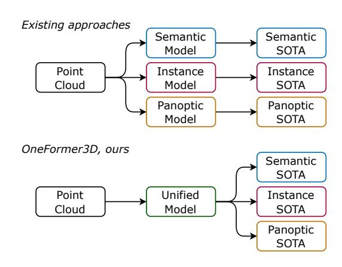
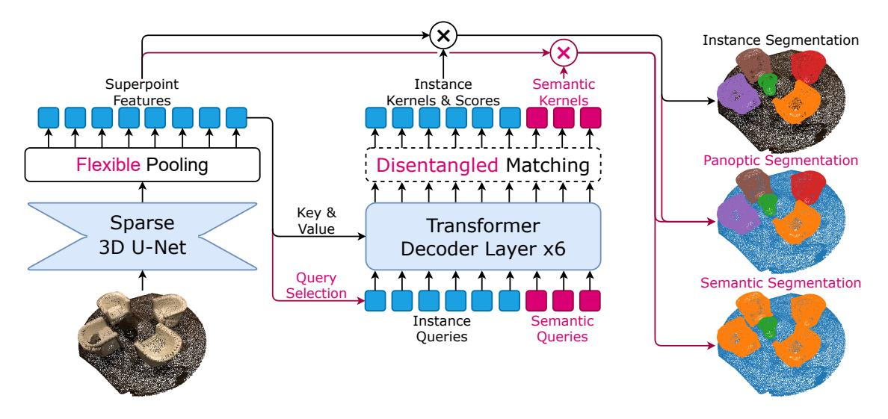

# OneFormer3D: One Transformer for Unified Point Cloud Segmentation

# Maxim Kolodiazhnyi, Anna Vorontsova, Anton Konushin, Danila Rukhovich Samsung Research

{m.kolodiazhn, a.vorontsova, a.konushin, d.rukhovich}@samsung.com

## **Abstract**

Semantic, instance, and panoptic segmentation of 3D point clouds have been addressed using task-specific models of distinct design. Thereby, the similarity of all segmentation tasks and the implicit relationship between them have not been utilized effectively. This paper presents a unified, simple, and effective model addressing all these tasks jointly. The model, named OneFormer3D, performs instance and semantic segmentation consistently, using a group of learnable kernels, where each kernel is responsible for generating a mask for either an instance or a semantic category. These kernels are trained with a transformerbased decoder with unified instance and semantic queries passed as an input. Such a design enables training a model end-to-end in a single run, so that it achieves top performance on all three segmentation tasks simultaneously. Specifically, our OneFormer3D ranks 1st and sets a new state-of-the-art (+2.1 mAP50) in the ScanNet test leaderboard. We also demonstrate the state-of-the-art results in semantic, instance, and panoptic segmentation of ScanNet  $(+21 \ PQ)$ , ScanNet200  $(+3.8 \ mAP_{50})$ , and S3DIS  $(+0.8 \ mAP_{50})$ mIoU) datasets.

#### 1. Introduction

3D point cloud segmentation is the task of grouping points into meaningful segments. Such a segment may comprise points of the same semantic category or belonging to the same single object (an instance). Semantic- and instance-based grouping give rise to three formulations of the segmentation task: semantic, instance, and panoptic. Semantic segmentation outputs a mask for each semantic category, so that each point in a point cloud gets assigned with a semantic label. Instance segmentation returns a set of masks of individual objects; since some regions cannot be treated as an distinguishable object but rather serve as a background (like a *floor* or a *ceiling*), only a part of points in a point cloud is being labeled. Panoptic segmentation is the most general formulation: it implies predicting a mask for each foreground object (*thing*), and a semantic label for each back-

Figure 1. Traditional 3D point cloud segmentation methods address different tasks with task-specific models to achieve the best performance. We propose OneFormer3D, a 3D segmentation framework that tackles semantic, instance, and panoptic segmentation tasks with a multi-task train-once design.

ground point (stuff).

Despite all three 3D segmentation tasks actually imply predicting a set of masks, they are typically solved with models of completely different architectures. 3D semantic segmentation methods rely on U-Net-like networks [6, 22, 25, 27, 34, 40, 48]. 3D instance segmentation methods combine semantic segmentation models with aggregation schemes based either on clustering [3, 10, 13, 21, 35, 49], object detection [11, 15], or transformer decoders [31, 32]. 3D panoptic segmentation methods [23, 38, 44] perform panoptic segmentation in 2D images, than lift the predicted masks into 3D space and aggregate them point-wise. The question naturally arises: is it possible to tackle all three 3D segmentation tasks jointly with a single unified approach?

Recenty, various ways of unifying 2D segmentation methods have been proposed [4, 5, 41]. All these methods train a single panoptic model on all three tasks, so that high performance is obtained without changing the network architecture. Still, the best results are achieved when the model is trained for each task separately. As can be expected, such a training policy results in three times larger

time- and memory footprint: training lasts longer and produces different sets of model weights for each task. This drawback was eliminated in a recent OneFormer [12] – a multi-task unified image segmentation approach, which outperforms existing state-of-the-arts in all three image segmentation tasks after training on a panoptic dataset jointly.

Following the same path, we propose OneFormer3D, the first multi-task unified 3D segmentation framework (Fig. 1). Using a well-known SPFormer [32] baseline, we add semantic queries in parallel with instance queries in a transformer decoder to unify predicting semantic and instance segmentation masks. Then, we identify the reasons for unstable performance of transformer-based 3D instance segmentation, and resolve the issues with a novel query selection mechanism and a new efficient matching strategy. Finally, we come up with a single unified model trained only once, that outperforms 3D semantic, 3D instance, and 3D panoptic segmentation methods – even though they are specifically tuned for each task.

To summarize, our contributions are as follows:

- OneFormer3D the first multi-task unified 3D segmentation framework, which allows training a single model on a common panoptic dataset to solve three segmentation tasks jointly;
- A novel query selection strategy and an efficient matching strategy without Hungarian algorithm, that should be used in combination for the best quality;
- State-of-the-art results in 3D semantic, 3D instance, and 3D panoptic segmentation in three indoor benchmarks: ScanNet [8], ScanNet200 [28], and S3DIS [1].

## 2. Related Work

#### 2.1. 3D Point Cloud Segmentation

**3D Semantic Segmentation.** Learning-based methods for semantic segmentation of 3D point clouds leverage U-Net-like models to process either 3D points (point-based) or voxels (voxel-based). Point-based methods exploit hand-crafted aggregation mechanisms [22, 25, 27, 34] or transformer blocks [40, 48] for direct processing of points. Voxel-based methods transform a point cloud of an irregular structure to a regular voxel grid, and pass these voxels through dense [11] or sparse [6] 3D convolutional network. Considering time- and memory efficiency, we opt for a sparse convolutional U-Net as a backbone, and combine it with a transformer decoder; to the best of our knowledge, OneFormer3D is the ever-first method using such a decoder to solve the 3D semantic segmentation task for indoor scenes.

**3D Instance Segmentation.** Instance segmentation of 3D point clouds is typically addressed with 3D semantic segmentation followed by per-point features aggregation. Ear-

lier approaches can be classified into top-down proposal-based methods [11, 15, 33, 45] or bottom-up grouping-based methods [3, 10, 13, 21, 35]. Current state-of-the-art results belong to recently emerged transformer-based methods, that outperform the predecessors in both accuracy [31] and inference speed [32]. We consider SPFormer [32] as our baseline, and extend it, so that it solves not a single 3D instance segmentation but all three 3D segmentation tasks.

**3D Panoptic Segmentation.** Panoptic segmentation of 3D point clouds is an underexplored problem, with only few existing solutions [23, 38, 44]; all of them being trained and validated only on the ScanNet dataset. These methods apply panoptic segmentation to a set of RGB images, lift the predicted 2D panoptic masks into 3D space, and obtain final 3D panoptic masks through aggregation. On the contrary, our OneFormer3D does not require additional RGB data to achieve state-of-the-art panoptic segmentation quality.

## 2.2. Unified 2D Image Segmentation

Unified 2D segmentation has been extensively researched over the past years, resulting in a variety of methods proposed [4, 5, 41]. K-Net [47] uses a convolutional network with dynamic learnable instance and semantic kernels with bipartite matching. MaskFormer [4] is a transformer-based architecture for mask classification. It was inspired by object detection [2], where the image is first fed to the encoder to obtain queries, then the decoder outputs proposals based on these queries. Mask2Former [5] extends MaskFormer with learnable queries, deformable multi-scale attention in the decoder, and a masked cross-attention, setting a new state-of-the-art in all three segmentation tasks. However, all methods mentioned above still require training the model individually for each task to achieve the best performance. OneFormer [12] was the pioneer 2D image segmentation approach, that employs task-conditioned joint training strategy and achieves state-of-the-art results in three segmentation tasks simultaneously with a single model. Similarly, we build OneFormer3D for 3D point cloud segmentation.

## 3. Proposed Method

The general scheme of OneFormer3D is shown in Fig. 2, with a baseline components depicted in blue and novelty points highlighted with a red color. Our framework is inherited from SPFormer [32], which was originally proposed to tackle 3D instance segmentation. SPFormer is chosen due to its straightforward pipeline, fast inference, and small memory footprint during both training and inference; yet, any modern 3D instance segmentation method with a transformer decoder can be used instead (e.g., Mask3D [31]).

First, a sparse 3D U-net extracts point-wise features (Sec. 3.1). Then, these features pass through a flexible

Figure 2. The OneFormer3D framework is based on SPFormer (blue), but features a number of improvements (red). Taking a 3D point cloud as input, our trained model solves 3D instance, 3D semantic, and 3D panoptic segmentation tasks. The dotted line depicts components that are applied only during the training.

pooling, that obtains superpoint features through simply averaging features of points in a superpoint. Superpoint features serve as keys and values for a transformer decoder (Sec. 3.2), that also accepts learnable semantic and instance queries as inputs. The decoder captures superpoints information via a cross-attention mechanism, and outputs a set of learned kernels, each representing a single object mask of an instance identity (from an instance query) or a semantic region (from a semantic query). A disentangled matching strategy is adopted to train instance kernels in an end-to-end manner (Sec. 3.3). As a result, a trained OneFormer3D can seamlessly solve semantic, instance, and panoptic segmentation (Sec. 3.4).

# 3.1. Backbone and Pooling

**Sparse 3D U-Net.** Assuming that an input point cloud contains N points, the input can be formulated as  $P \in \mathbb{R}^{N \times 6}$ . Each 3D point is parameterized with three colors r, g, b, and three coordinates x, y, z. Following [6], we voxelize point cloud, and use a U-Net-like backbone composed of sparse 3D convolutions to extract point-wise features  $P' \in \mathbb{R}^{N \times C}$ .

Flexible pooling. For a greater flexibility, we implement pooling based on either superpoints or voxels. In a superpoint pooling scenario, superpoint features  $\mathbf{S} \in \mathbb{R}^{M \times C}$  are obtained via average pooling of point-wise features  $\mathbf{P}' \in \mathbb{R}^{N \times C}$  w.r.t. pre-computed superpoints [18]. Without loss of generality, we suppose that there are M superpoints in an input point cloud. In a voxel pooling scenario, we pool backbone features w.r.t. voxel grid. Voxelization is a trivial operation with a negligible computational overhead; ac-

cordingly, it can be preferred to computationally-heavy superpoint clustering in resource-constrained usage scenarios. We refer to this superpoint-based / voxel-based pooling as *flexible pooling*. This procedure transforms an input point cloud comprised of millions of points into only hundreds of superpoints or thousands of voxels, which significantly reduces the computational cost of subsequent processing.

#### 3.2. Query Decoder

A query decoder takes  $K_{ins} + K_{sem}$  queries as inputs and transforms them into  $K_{ins} + K_{sem}$  kernels. Then, superpoint features are convolved with these kernels to produce  $K_{ins}$  instance and  $K_{sem}$  semantic masks, respectively. The architecture of a query decoder is inherited from SP-Former [32]: similarly, six sequential transformer decoder layers employ self-attention on queries and cross-attention with keys and values from superpoint features. Semantic queries are initialized randomly, same as in existing 3D instance segmentation methods [31, 32]. Instance queries are initialized through the *query selection* strategy.

**Query selection.** State-of-the-art 2D object detection and 2D instance segmentation methods [20, 46, 51] initialize queries using advanced strategies, usually referred to as *query selection*. Specifically, input queries are initialized with features from a transformer encoder, sampled based on an objectness score. This score is estimated by the same model, which is guided by an additional objectness loss during the training. The described technique is proved to speed up the training, while jointly improving the overall accuracy. Yet, to the best of our knowledge, a similar approach was never applied in 3D object detection or 3D seg-

mentation. So, we aim to close this gap with a simplified version of query selection adapted for 3D data and a non-transformer encoder. Particularly, we initialize queries with backbone features after a flexible pooling. By a query selection, we randomly select only a half of initialized queries for an extra augmentation during the training. During the inference, we initialize queries similarly, but do not filter queries to keep all input information.

#### 3.3. Training

To train a transformer-based method end-to-end, we need to define a cost function between queries and ground truth objects, develop a matching strategy that minimizes this cost function, and formulate a loss function being applied to the matched pairs.

**Cost function.** Following SPFormer [32], we use a pairwise matching cost  $C_{ik}$  to measure the similarity of the *i*-th proposal and the *k*-th ground truth.  $C_{ik}$  is derived from a classification probability and a superpoint mask matching cost  $C_{ik}^{mask}$ :

$$C_{ik} = -\lambda \cdot p_{i,c_k} + C_{ik}^{mask}, \tag{1}$$

where  $p_{i,c_k}$  indicates the probability of *i*-th proposal belonging to the  $c_k$  semantic category. In our experiments, we use  $\lambda_{cls}=0.5$ . The superpoint mask matching cost  $\mathcal{C}_{ik}^{mask}$  is a sum of a binary cross-entropy (BCE) and a Dice loss with a Laplace smoothing:

$$C_{ik}^{mask} = BCE(m_i, m_k^{gt}) + 1 - 2\frac{m_i \cdot m_k^{gt} + 1}{|m_i| + |m_k^{gt}| + 1}, \quad (2)$$

where  $m_i$  and  $m_k^{gt}$  are a predicted and ground truth mask of a superpoint, respectively.

**Disentangled matching.** Previous state-of-the-art 2D transformer-based methods [2, 4, 5, 20] and 3D transformer-based methods [31, 32] exploit a bipartite matching strategy based on a Hungarian algorithm [16]. This commonly-used approach has though a major drawback: an excessive number of meaningful matches between proposals and ground truth instances makes the training process long-lasting and unstable.

On the contrary, we perform a simple trick that eliminates the need for resource-exhaustive Hungarian matching. Since an instance query is initialized with features of a superpoint, this instance query can be unambiguously matched with this superpoint. We assume that a superpoint can belong only to one instance, that gives a correspondence between a superpoint and a ground truth object. By bringing everything together, we can establish the correspondence between a ground truth object, a superpoint, an instance

query, and an instance proposal derived from this instance query. Finally, by skipping intermediate correspondences, we can directly match an instance proposal to a ground truth instance. The obtained correspondence *disentangles* the bipartite graph of proposals and ground truth instances, that is why we refer to it as our *disentangled matching*.

Still, the number of proposals exceeds the number of ground truth instances, so we need to filter out proposals that do not correspond to ground truth objects to obtain a bipartite matching. The disentangled matching trick simplifies cost function optimization, as we can set the most weights in a cost matrix to infinity:

$$\hat{\mathcal{C}}_{ik} = \begin{cases} \mathcal{C}_{ik} & \text{if } i\text{-th superpoint } \in k\text{-th object} \\ +\infty & \text{otherwise} \end{cases}$$
 (3)

In a standard case, all cost matrix elements are non-infinite, and the optimal solution can be obtained via a Hungarian matching with a computational complexity of  $O(K_{ins}^3)$ . Our disentangled matching is notably more efficient, having a  $O(K_{ins})$  complexity. For a ground truth instance k, we only need to select the proposal i with the least  $\hat{C}_{ik}$ . Since there is only one non-infinite value per proposal, this operation is trivial and can be performed in a linear time.

**Loss.** After matching proposals with ground truth instances, instance losses can finally be calculated. Classification errors are penalized with a cross-entropy loss  $\mathcal{L}_{cls}$ . Besides, for each match between a proposal and a ground truth instance, we compute the superpoint mask loss as a sum of binary cross-entropy  $\mathcal{L}_{bce}$  and a Dice loss  $\mathcal{L}_{dice}$ .

 $K_{sem}$  semantic queries correspond to ground truth masks of  $K_{sem}$  semantic categories given in a fixed order, so no specific matching is required. The semantic loss  $L_{sem}$  is defined as a binary cross-entropy.

The total loss  $\mathcal{L}$  is formulated as:

$$\mathcal{L} = \beta \cdot \mathcal{L}_{cls} + \mathcal{L}_{bce} + \mathcal{L}_{dice} + L_{sem}, \tag{4}$$

where  $\beta = 0.5$  as in [32].

#### 3.4. Inference

During inference, given an input point cloud, OneFormer3D directly predicts  $K_{sem}$  semantic masks and  $K_{ins}$  instance with classification scores  $p_i, i \in 1, ..., K_{ins}$ , where each mask  $m_i$  is a set of superpoints. Then, we convolve superpoint features  $\mathbf{S} \in \mathbb{R}^{M \times C}$  with each predicted kernel  $l_i \in \mathbb{R}^{1 \times C}$  to get a mask  $m_i \in \mathbb{R}^{M \times 1}$ :  $m_i = \mathbf{S} * l_i$ . The final binary segmentation masks are obtained by thresholding probability scores. Besides, for  $m_i$ , we calculate a mask score  $q_i \in [0,1]$  by averaging probabilities exceeding the threshold, and use it to set an initial ranking score  $s_i$ :  $s_i = p_i \cdot q_i$ . Finally,  $s_i$  values are leveraged for re-ranking predicted instances using matrix-NMS [37].

Panoptic prediction is obtained from instance and semantic outputs. It is initialized with estimated semantics, then, instance predictions are overlaid consequently, sorted by a ranking score in an increasing order.

# 4. Experiments

## 4.1. Experimental Settings

**Datasets.** The experiments are conducted on ScanNet [8], ScanNet200 [28], and S3DIS [1] datasets. ScanNet [8] contains 1613 scans divided into training, validation, and testing splits of 1201, 312, and 100 scans, respectively. 3D instance segmentation is typically evaluated using 18 object categories. Two more categories (wall and floor) are added for semantic and panoptic evaluation. We report results on both validation and hidden test splits. ScanNet200 [28] extends the original ScanNet semantic annotation with finegrained categories with the long-tail distribution, resulting in 198 instance with 2 more semantic classes. The training, validation, and testing splits are similar to the original ScanNet dataset. The S3DIS dataset [1] features 272 scenes within 6 large areas. Following the standard evaluation protocol, we assess the segmentation quality on scans from Area-5, and via 6 cross-fold validation, using 13 semantic categories in both settings. Following the official [1] split, we classify these 13 categories as either structured or furniture, and define 5 furniture categories (table, chair, sofa, bookcase, and board) as thing, and the remaining eight categories as stuff for panoptic evaluation.

**Metrics.** We use mIoU to measure the quality of 3D semantic segmentation. For 3D instance segmentation, we report a mean average precision (mAP), which is an average of scores obtained with IoU thresholds set from 50% to 95%, with a step size of 5%. mAP50 and mAP25 denote the scores with IoU thresholds of 50% and 25%, respectively. Additionally, we calculate mean precision (mPrec), and mean recall (mRec) for S3DIS, following the standard evaluation protocol established in this benchmark. The accuracy of panoptic predictions is assessed with the PQ score [14]; we also report PQth and PQst, estimated for *thing* and *stuff* categories, respectively.

**Implementation Details.** Our OneFormer3D is implemented in MMDetection3D framework [7]. All training details are inherited from SPFormer [32], including using AdamW optimizer with an initial learning rate of 0.0001, weight decay of 0.05, batch size of 4, and polynomial scheduler with a base of 0.9 for 512 epochs. We apply the standard augmentations: horizontal flipping, random rotations around the z-axis, elastic distortion, and random scaling. On ScanNet and ScanNet200, we apply graph-based

superpoint clusterization [18] and use a voxel size of 2cm. On S3DIS, voxel size is set to 5cm due to larger scenes.

## 4.2. Comparison to Prior Work

We compare our OneFormer3D with previous art on three indoor benchmarks: ScanNet [8], S3DIS [1], and Scan-Net200 [28] in Tab. 2, 3, and 4, respectively. On the Scan-Net validation split, we set a new state-of-the art in instance, semantic, and panoptic segmentation tasks with a unified approach. Specifically, the instance segmentation scores increase by +2.9 mAP25, +4.4 mAP25, and +4.1 mAP compared to SPFormer [32] and a more recent Mask3D [31], which is a notable improvement. Besides, OneFormer3D scores top-1 in the ScanNet hidden test leaderboard at 17 Nov. 2023 with 80.1 mAP50 (+2.1 w.r.t. Mask3D), and incredible 89.6 mAP25 (+2.1 w.r.t. TD3D [15]). At the same time, OneFormer3D supersedes PointTransformerV2[40], a state-of-the-art semantic segmentation method, by +1.2 mIoU. Panoptic segmentation has not been investigated so extensively as the other two segmentation tasks, so this track is represented with few baselines demonstrating mediocre performance. Respectively, the improvement here is especially tangible: OneFormer3D outperforms TUPPer-Map by +21.0 PQ, hitting as high as 71.2.

| Method         | Presented at | Box mAP 25 | Box mAP 50 |
|----------------|--------------|--------------------------|--------------------------|
| VoteNet [26]   | ICCV'19      | 58.6                     | 33.5                     |
| PBNet [49]     | ICCV'23      | 69.3                     | 60.1                     |
| FCAF3D [29]    | ECCV'22      | 71.5                     | 57.3                     |
| SoftGroup [35] | CVPR'22      | 71.6                     | 59.4                     |
| TR3D [30]      | ICIP'23      | 72.9                     | 59.3                     |
| CAGroup3D [36] | NeurIPS'22   | 75.1                     | 61.3                     |
| OneFormer3D    |              | 76.9                     | 65.3                     |

Table 1. Comparison of existing 3D object detection methods on the ScanNet validation split.

Besides, we adopt OneFormer3D to 3D object detection by enclosing predicted 3D instances with tight axis-aligned 3D bounding boxes. The comparison with existing 3D object detection methods in presented in Tab. 1. As can be seen, OneFormer3D achieves +4.0 mAP50 w.r.t. a strong CAGroup3D[36] baseline, setting a new state-of-the-art in 3D object detection with 65.1 mAP50 with no extra training.

On S3DIS dataset, our unified approach demonstrates state-of-the-art results on all segmentation tasks, in both Area-5 and 6-fold cross-validation benchmarks. Here, the most significant gain is achieved in instance segmentation on 6-fold cross-validation, with +1.5 mAP50 and +1.2 mAP w.r.t. Mask3D. In both benchmarks, we outperform state-of-the-art TD3D and Mask3D in terms of mPrec50 and mRec50. Despite we find these metrics less representative

| Method                            | Presented at |            | Instance    |      | Semantic |      | Panoptio     |           |
|-----------------------------------|--------------|------------|-------------|------|----------|------|--------------|-----------|
| Wethod                            | i resemed at | $mAP_{25}$ | $mAP_{50}$  | mAP  | mIoU     | PQ   | $PQ_{th} \\$ | $PQ_{st}$ |
| Validation split                  |              |            |             |      |          |      |              |           |
| 3D-SIS [11]                       | CVPR'19      | 35.7       | 18.7        |      |          |      |              |           |
| GSPN [45]                         | CVPR'19      | 53.4       | 37.8        | 19.3 |          |      |              |           |
| NeuralBF [33]                     | WACV'23      | 71.1       | 55.5        | 36.0 |          |      |              |           |
| PointGroup [13]                   | CVPR'20      | 71.3       | 56.7        | 34.8 |          |      |              |           |
| OccuSeg [9]                       | CVPR'20      | 71.9       | 60.7        | 44.2 |          |      |              |           |
| DyCo3D [10]                       | CVPR'21      | 72.9       | 57.6        | 35.4 |          |      |              |           |
| SSTNet [21]                       | ICCV'21      | 74.0       | 64.3        | 49.4 |          |      |              |           |
| HAIS [3]                          | ICCV'21      | 75.6       | 64.4        | 43.5 |          |      |              |           |
| DKNet [41]                        | ICCV'22      | 76.9       | 66.7        | 50.8 |          |      |              |           |
| SoftGroup [35]                    | CVPR'22      | 78.9       | 67.6        | 45.8 |          |      |              |           |
| PBNet [49]                        | ICCV'23      | 78.9       | 70.5        | 54.3 |          |      |              |           |
| TD3D [15]                         | WACV'24      | 81.9       | 71.2        | 47.3 |          |      |              |           |
| ISBNet [24]                       | CVPR'23      | 82.5       | 73.1        | 54.5 |          |      |              |           |
| SPFormer [32]                     | AAAI'23      | 82.9       | 73.9        | 56.3 |          |      |              |           |
| Mask3D [31]                       | ICRA'23      | 83.5       | 73.7        | 55.2 |          |      |              |           |
| PointNet++ [25]                   | NeurIPS'17   |            |             |      | 53.5     |      |              |           |
| PointConv [39]                    | CVPR'19      |            |             |      | 61.0     |      |              |           |
| PointASNL [43]                    | CVPR'20      |            |             |      | 63.5     |      |              |           |
| KPConv [34]                       | ICCV'19      |            |             |      | 69.2     |      |              |           |
| PointTransformer [48]             | ICCV'21      |            |             |      | 70.6     |      |              |           |
| PointNeXt-XL [27]                 | NeurIPS'22   |            |             |      | 71.5     |      |              |           |
| MinkUNet [6]                      | CVPR'19      |            |             |      | 72.2     |      |              |           |
| PointMetaBase-XXL [22]            | CVPR'23      |            |             |      | 72.8     |      |              |           |
| Stratified Transformer [17]       | CVPR'22      |            |             |      | 74.3     |      |              |           |
| PointTransformerV2 [40]           | NeurIPS'22   |            |             |      | 75.4     |      |              |           |
| SceneGraphFusion [38]             | CVPR'21      |            |             |      |          | 31.5 | 30.2         | 43.4      |
| PanopticFusion [23]               | IROS'19      |            |             |      |          | 33.5 | 30.8         | 58.4      |
| TUPPer-Map [44]                   | IROS'21      |            |             |      |          | 50.2 | 47.8         | 71.5      |
| OneFormer3D (ours)                |              | 86.4       | <b>78.1</b> | 59.3 | 76.6     | 71.2 | 69.6         | 86.1      |
| Hidden test split at 17 Nov. 2023 |              |            |             |      |          |      |              |           |
| NeuralBF [33]                     | WACV'23      | 71.8       | 55.5        | 35.3 |          |      |              |           |
| DyCo3D [10]                       | CVPR'21      | 76.1       | 64.1        | 39.5 |          |      |              |           |
| PointGroup [13]                   | CVPR'20      | 77.8       | 63.6        | 40.7 |          |      |              |           |
| SSTNet [21]                       | ICCV'21      | 78.9       | 69.8        | 50.6 |          |      |              |           |
| HAIS [3]                          | ICCV'21      | 80.3       | 69.9        | 45.7 |          |      |              |           |
| DKNet [41]                        | ICCV'22      | 81.5       | 71.8        | 53.2 |          |      |              |           |
| ISBNet [24]                       | CVPR'23      | 83.5       | 75.7        | 55.9 |          |      |              |           |
| SPFormer [32]                     | AAAI'23      | 85.1       | 77.0        | 54.9 |          |      |              |           |
| SoftGroup [35]                    | CVPR'22      | 86.5       | 76.1        | 50.4 |          |      |              |           |
| Mask3D [31]                       | ICRA'23      | 87.0       | 78.0        | 56.6 |          |      |              |           |
| TD3D [15]                         | WACV'24      | 87.5       | 75.1        | 48.9 |          |      |              |           |
|                                   | · · · - ·    | - /        |             |      |          |      |              |           |

Table 2. Comparison of the existing segmentation methods on ScanNet. Our OneFormer3D sets the new state-of-the art in all segmentation tasks: instance, semantic, and panoptic.

than mAP, we report them to fairly compare with previous methods, and to maintain consistency of the established evaluation protocol.

We also demonstrate the top 3D instance segmentation quality on the ScanNet200 validation split, achieving at least +3 in mAP25, mAP50, and mAP. To the best of

our knowledge, no panoptic segmentation results on Scan-Net200 and S3DIS has been reported so far, so we provide our scores as a basis for the future research in this field.

| M-4- J                      |            | In          | stance       |             | Semantic |      | Panoptic     | :            |
|-----------------------------|------------|-------------|--------------|-------------|----------|------|--------------|--------------|
| Method                      | $mAP_{50}$ | mAP         | $mPrec_{50}$ | $mRec_{50}$ | mIoU     | PQ   | $PQ_{th} \\$ | $PQ_{st} \\$ |
| Area-5 validation           |            |             |              |             |          |      |              |              |
| PointGroup [13]             | 57.8       |             | 61.9         | 62.1        |          |      |              |              |
| DyCo3D [10]                 |            |             | 64.3         | 64.2        |          |      |              |              |
| SSTNet [21]                 | 59.3       | 42.7        | 65.5         | 64.2        |          |      |              |              |
| DKNet [41]                  |            |             | 70.8         | 65.3        |          |      |              |              |
| HAIS [3]                    |            |             | 71.1         | 65.0        |          |      |              |              |
| TD3D [15]                   | 65.1       | 48.6        | 74.4         | 64.8        |          |      |              |              |
| SoftGroup [35]              | 66.1       | 51.6        | 73.6         | 66.6        |          |      |              |              |
| PBNet [49]                  | 66.4       | 53.5        | 74.9         | 65.4        |          |      |              |              |
| SPFormer [32]               | 66.8       |             | 72.8         | 67.1        |          |      |              |              |
| Mask3D [31]                 | 71.9       | 57.8        | 74.3         | 63.7        |          |      |              |              |
| SegGCN [19]                 |            |             |              |             | 63.6     |      |              |              |
| MinkUNet [6]                |            |             |              |             | 65.4     |      |              |              |
| PAConv [42]                 |            |             |              |             | 66.6     |      |              |              |
| KPConv[34]                  |            |             |              |             | 67.1     |      |              |              |
| PointTransformer [48]       |            |             |              |             | 70.4     |      |              |              |
| PointNeXt-XL [27]           |            |             |              |             | 70.5     |      |              |              |
| PointTransformerV2 [40]     |            |             |              |             | 71.6     |      |              |              |
| Stratified Transformer [17] |            |             |              |             | 72.0     |      |              |              |
| OneFormer3D (ours)          | 72.0       | <b>58.7</b> | <b>79.7</b>  | 73.0        | 72.4     | 62.2 | 58.4         | 65.5         |
| 6-fold cross-validation     |            |             |              |             |          |      |              |              |
| PointGroup [13]             | 64.0       |             | 69.6         | 69.2        |          |      |              |              |
| HAIS [3]                    |            |             | 73.2         | 69.4        |          |      |              |              |
| SSTNet [21]                 | 67.8       | 54.1        | 73.5         | 73.4        |          |      |              |              |
| DKNet [41]                  |            |             | 75.3         | 71.1        |          |      |              |              |
| TD3D [15]                   | 68.2       | 56.2        | 76.3         | 74.0        |          |      |              |              |
| SoftGroup [35]              | 68.9       | 54.4        | 75.3         | 69.8        |          |      |              |              |
| SPFormer [32]               | 69.2       |             | 74.0         | 71.1        |          |      |              |              |
| PBNet [49]                  | 70.6       | 59.5        | 80.1         | 72.9        |          |      |              |              |
| Mask3D [31]                 | 74.3       | 61.8        | 76.5         | 66.2        |          |      |              |              |
| PointNet++ [25]             |            |             |              |             | 56.7     |      |              |              |
| MinkUNet [6]                |            |             |              |             | 69.1     |      |              |              |
| KPConv [34]                 |            |             |              |             | 70.6     |      |              |              |
| PointTransformer [48]       |            |             |              |             | 73.5     |      |              |              |
| PointNeXt-XL [27]           |            |             |              |             | 74.9     |      |              |              |
| OneFormer3D (ours)          | 75.8       | 63.0        | 82.3         | 74.1        | 75.0     | 68.5 | 61.5         | 74.5         |

Table 3. Comparison of existing segmentation methods on S3DIS. Our OneFormer3D sets the new state-of-the art in all segmentation tasks: instance, semantic, and panoptic.

| Method                   |               | Instance   |      | Semantic |      | Panoptio     | ;            |
|--------------------------|---------------|------------|------|----------|------|--------------|--------------|
| Method                   | $mAP_{25} \\$ | $mAP_{50}$ | mAP  | mIoU     | PQ   | $PQ_{th} \\$ | $PQ_{st} \\$ |
| PointGroup[13]           |               | 24.5       |      |          |      |              |              |
| PointGroup + LGround[28] |               | 26.1       |      |          |      |              |              |
| TD3D[15]                 | 40.4          | 34.8       | 23.1 |          |      |              |              |
| Mask3D[31]               | 42.3          | 37.0       | 27.4 |          |      |              |              |
| MinkUNet[6]              |               |            |      | 25.0     |      |              |              |
| MinkUNet + LGround[28]   |               |            |      | 28.9     |      |              |              |
| OneFormer3D (ours)       | 45.4          | 40.8       | 30.6 | 30.1     | 31.2 | 30.7         | <b>78.6</b>  |

Table 4. Comparison of existing segmentation methods on the ScanNet200 validation split. Our OneFormer3D sets the new state-of-the art in all segmentation tasks: instance, semantic, and panoptic.

| QS     | Matching      | mAP 25 | mAP 50 | mAP  |
|--------|---------------|-------------------|-------------------|------|
| SPForm | ier, baseline |                   |                   |      |
|        | Hungarian     | 82.9              | 73.9              | 56.3 |
| OneFor | mer3D, ours   |                   |                   |      |
|        | Hungarian     | 84.4              | 75.6              | 58.0 |
| ✓      | Hungarian     | 84.6              | 75.9              | 58.1 |
|        | disentangled  | 86.4              | 78.1              | 59.3 |

Table 5. Comparison of query initialization and matching strategies on the ScanNet validation split. QS is our query selection.

#### 4.3. Ablation Studies

Query selection & disentangled matching. First, we ablate key novel components of our pipeline on the Scan-Net validation split, and report the results in Tab. 5. In this study, we only compare instance segmentation metrics, since both ablated components do not affect semantic segmentation. SPFormer [32] uses random query initialization and Hungarian matching strategy; we evaluate it with the same backbone for a fair comparison. Evidently, our reimplementation with joint instance and semantic training has a minor gain over the baseline. Besides, our query selection scheme does not improve the quality if combined with the baseline bipartite matching scheme. But, the synergy of these two modifications allows for the state-of-the-art results, improving  $mAP_{25}$ ,  $mAP_{50}$ , and mAP by at least +1.3.

**Pretraining and pooling.** Previous state-of-the-art methods [3, 31, 32, 35] use pretraining to achieve the highest scores on S3DIS, as this dataset is fairly small, with 272 scenes in total. Following the best practices, we pre-train our OneFormer3D on ScanNet, which gives significant performance boost: +8.0 mAP50 and +10.2 mIoU (Tab. 6). When being pretrained on ScanNet, OneFormer3D and SP-Former demonstrate comparable results. We also leverage a large scale synthetic Structured3D [50] dataset for pretraining, which is an order of magnitude larger than ScanNet, with as many as 21835 scenes. In this experiment, benefits from using a larger amount of training data exceed the possible negative effect of a domain gap: the best results are achieved with pretraining on a mixture of real and synthetic data, bringing at least +11.5 in both mAP50 and mIoU.

Besides, we investigate how our flexible pooling affects the final performance. To this end, we switch it off by replacing superpoints with voxels of 5cm. According to the Tab. 6, the gain is at least of +1.2 in both mAP50 and mIoU. Yet, we should mention that superpoint clustering takes almost a half of the entire inference time, so removing it causes at least two times speed-up and eliminates the need to select and tune such an algorithm for each dataset.

| Pret Scan- Net | rain on Struc- tured3D | Pooling    | Instance mAP 50 | Semantic mIoU |
|----------------------|------------------------------|------------|-------------------------------|------------------|
| SPFormer,            | baseline                     |            |                               |                  |
| ✓                    |                              | superpoint | 66.8                          |                  |
| OneForme             | r3D, ours                    |            |                               |                  |
|                      |                              | voxel      | 60.5                          | 59.1             |
| ✓                    |                              | voxel      | 68.5                          | 69.3             |
| ✓                    |                              | superpoint | 67.1                          | 68.1             |
|                      | ✓                            | voxel      | 65.1                          | 66.2             |
| ✓                    | ✓                            | voxel      | 72.0                          | 72.4             |

Table 6. Ablation study of pretraining and feature pooling on S3DIS Area 5. We demonstrate the benefits of pretraining on the mixture of real ScanNet and synthetic Structured3D data.

| Instance queries | Semantic queries | Instance mAP 50 | Semantic mIoU | Panoptic PQ |
|---------------------|------------------|-------------------------------|------------------|----------------|
| <b>✓</b>            |                  | 78.1                          |                  |                |
|                     | ✓                |                               | 72.8             |                |
| ✓                   | ✓                | 78.1                          | 76.6             | 71.2           |

Table 7. Benefits of joint instance-semantic training on ScanNet validation split. Not only OneFormer3D allows panoptic segmentation for free, but also improves semantic segmentation.

**Joint training.** Training a single unified model but three reduces the training time three times, but, more importantly, it also improves segmentation metrics. As can be seen from Tab. 7, instance segmentation accuracy remains unchanged, while the accuracy of semantic predictions grows by as much as +3.4 mIoU. We assume that using a large transformer decoder causes overfitting for a semantic segmentation task, but adding an extra instance segmentation task serves as a regularization and reduces the overfitting, hence improving semantic scores. For instance segmentation, the improvement is negligible, mainly because semantic annotations for all non-*stuff* classes can be derived from instance one, so adds limited new information for model training.

## 5. Conclusion

In this paper, we proposed a novel transformer-based framework, OneFormer3D, that unifies three 3D point cloud segmentations tasks: instance, semantic, and panoptic. Trained only once on a panoptic dataset, OneFormer3D consistently outperforms existing segmentation approaches – even though they are trained separately on each task. We also identified the weaknesses of existing transformer-based 3D instance segmentation methods, and addressed them with a novel query selection and disentangled matching strategies. In extensive experiments on ScanNet, ScanNet200, and S3DIS, OneFormer3D established a new state-of-the-art in all three 3D segmentation tasks.

### References

- [1] Iro Armeni, Ozan Sener, Amir R Zamir, Helen Jiang, Ioannis Brilakis, Martin Fischer, and Silvio Savarese. 3d semantic parsing of large-scale indoor spaces. In *Proceedings of the IEEE conference on computer vision and pattern recognition*, pages 1534–1543, 2016. 2, 5
- [2] Nicolas Carion, Francisco Massa, Gabriel Synnaeve, Nicolas Usunier, Alexander Kirillov, and Sergey Zagoruyko. End-toend object detection with transformers. In *European confer*ence on computer vision, pages 213–229. Springer, 2020. 2,
- [3] Shaoyu Chen, Jiemin Fang, Qian Zhang, Wenyu Liu, and Xinggang Wang. Hierarchical aggregation for 3d instance segmentation. In *Proceedings of the IEEE/CVF Interna*tional Conference on Computer Vision, pages 15467–15476, 2021. 1, 2, 6, 7, 8
- [4] Bowen Cheng, Alex Schwing, and Alexander Kirillov. Perpixel classification is not all you need for semantic segmentation. Advances in Neural Information Processing Systems, 34:17864–17875, 2021. 1, 2, 4
- [5] Bowen Cheng, Ishan Misra, Alexander G Schwing, Alexander Kirillov, and Rohit Girdhar. Masked-attention mask transformer for universal image segmentation. In *Proceedings of the IEEE/CVF conference on computer vision and pattern recognition*, pages 1290–1299, 2022. 1, 2, 4
- [6] Christopher Choy, Jun Young Gwak, and Silvio Savarese. 4d spatio-temporal convnets: Minkowski convolutional neural networks. In *Proceedings of the IEEE/CVF conference on computer vision and pattern recognition*, pages 3075–3084, 2019. 1, 2, 3, 6, 7
- [7] MMDetection3D Contributors. MMDetection3D: Open-MMLab next-generation platform for general 3D object detection. https://github.com/open-mmlab/mmdetection3d, 2020. 5
- [8] Angela Dai, Angel X Chang, Manolis Savva, Maciej Halber, Thomas Funkhouser, and Matthias Nießner. Scannet: Richly-annotated 3d reconstructions of indoor scenes. In *Proceedings of the IEEE conference on computer vision and pattern recognition*, pages 5828–5839, 2017. 2, 5
- [9] Lei Han, Tian Zheng, Lan Xu, and Lu Fang. Occuseg: Occupancy-aware 3d instance segmentation. In *Proceedings* of the IEEE/CVF conference on computer vision and pattern recognition, pages 2940–2949, 2020. 6
- [10] Tong He, Chunhua Shen, and Anton Van Den Hengel. Dyco3d: Robust instance segmentation of 3d point clouds through dynamic convolution. In *Proceedings of the IEEE/CVF conference on computer vision and pattern recognition*, pages 354–363, 2021. 1, 2, 6, 7
- [11] Ji Hou, Angela Dai, and Matthias Nießner. 3d-sis: 3d semantic instance segmentation of rgb-d scans. In *Proceedings* of the IEEE/CVF conference on computer vision and pattern recognition, pages 4421–4430, 2019. 1, 2, 6
- [12] Jitesh Jain, Jiachen Li, Mang Tik Chiu, Ali Hassani, Nikita Orlov, and Humphrey Shi. Oneformer: One transformer to rule universal image segmentation. In *Proceedings of*

- the IEEE/CVF Conference on Computer Vision and Pattern Recognition, pages 2989–2998, 2023. 2
- [13] Li Jiang, Hengshuang Zhao, Shaoshuai Shi, Shu Liu, Chi-Wing Fu, and Jiaya Jia. Pointgroup: Dual-set point grouping for 3d instance segmentation. In *Proceedings of the IEEE/CVF conference on computer vision and Pattern recognition*, pages 4867–4876, 2020. 1, 2, 6, 7
- [14] Alexander Kirillov, Kaiming He, Ross Girshick, Carsten Rother, and Piotr Dollár. Panoptic segmentation. In Proceedings of the IEEE/CVF conference on computer vision and pattern recognition, pages 9404–9413, 2019. 5
- [15] Maksim Kolodiazhnyi, Danila Rukhovich, Anna Vorontsova, and Anton Konushin. Top-down beats bottom-up in 3d instance segmentation. *arXiv preprint arXiv:2302.02871*, 2023. 1, 2, 5, 6, 7
- [16] Harold W Kuhn. The hungarian method for the assignment problem. *Naval research logistics quarterly*, 2(1-2):83–97, 1955. 4
- [17] Xin Lai, Jianhui Liu, Li Jiang, Liwei Wang, Hengshuang Zhao, Shu Liu, Xiaojuan Qi, and Jiaya Jia. Stratified transformer for 3d point cloud segmentation. In *Proceedings of* the IEEE/CVF Conference on Computer Vision and Pattern Recognition, pages 8500–8509, 2022. 6, 7
- [18] Loic Landrieu and Martin Simonovsky. Large-scale point cloud semantic segmentation with superpoint graphs. In *Proceedings of the IEEE conference on computer vision and pattern recognition*, pages 4558–4567, 2018. 3, 5
- [19] Huan Lei, Naveed Akhtar, and Ajmal Mian. Seggcn: Efficient 3d point cloud segmentation with fuzzy spherical kernel. In *Proceedings of the IEEE/CVF conference on computer vision and pattern recognition*, pages 11611–11620, 2020. 7
- [20] Feng Li, Hao Zhang, Huaizhe Xu, Shilong Liu, Lei Zhang, Lionel M Ni, and Heung-Yeung Shum. Mask dino: Towards a unified transformer-based framework for object detection and segmentation. In *Proceedings of the IEEE/CVF Con*ference on Computer Vision and Pattern Recognition, pages 3041–3050, 2023. 3, 4
- [21] Zhihao Liang, Zhihao Li, Songcen Xu, Mingkui Tan, and Kui Jia. Instance segmentation in 3d scenes using semantic superpoint tree networks. In *Proceedings of the IEEE/CVF International Conference on Computer Vision*, pages 2783–2792, 2021. 1, 2, 6, 7
- [22] Haojia Lin, Xiawu Zheng, Lijiang Li, Fei Chao, Shanshan Wang, Yan Wang, Yonghong Tian, and Rongrong Ji. Meta architecture for point cloud analysis. In *Proceedings of the IEEE/CVF Conference on Computer Vision and Pattern Recognition*, pages 17682–17691, 2023. 1, 2, 6
- [23] Gaku Narita, Takashi Seno, Tomoya Ishikawa, and Yohsuke Kaji. Panopticfusion: Online volumetric semantic mapping at the level of stuff and things. In 2019 IEEE/RSJ International Conference on Intelligent Robots and Systems (IROS), pages 4205–4212. IEEE, 2019. 1, 2, 6
- [24] Tuan Duc Ngo, Binh-Son Hua, and Khoi Nguyen. Isbnet: a 3d point cloud instance segmentation network with instanceaware sampling and box-aware dynamic convolution. In Proceedings of the IEEE/CVF Conference on Computer Vision and Pattern Recognition, pages 13550–13559, 2023. 6

- [25] Charles Ruizhongtai Qi, Li Yi, Hao Su, and Leonidas J Guibas. Pointnet++: Deep hierarchical feature learning on point sets in a metric space. *Advances in neural information processing systems*, 30, 2017. 1, 2, 6, 7
- [26] Charles R Qi, Or Litany, Kaiming He, and Leonidas J Guibas. Deep hough voting for 3d object detection in point clouds. In proceedings of the IEEE/CVF International Conference on Computer Vision, pages 9277–9286, 2019. 5
- [27] Guocheng Qian, Yuchen Li, Houwen Peng, Jinjie Mai, Hasan Hammoud, Mohamed Elhoseiny, and Bernard Ghanem. Pointnext: Revisiting pointnet++ with improved training and scaling strategies. *Advances in Neural Information Processing Systems*, 35:23192–23204, 2022. 1, 2, 6, 7
- [28] David Rozenberszki, Or Litany, and Angela Dai. Language-grounded indoor 3d semantic segmentation in the wild. In *European Conference on Computer Vision*, pages 125–141. Springer, 2022. 2, 5, 7
- [29] Danila Rukhovich, Anna Vorontsova, and Anton Konushin. Fcaf3d: Fully convolutional anchor-free 3d object detection. In European Conference on Computer Vision, pages 477–493. Springer, 2022. 5
- [30] Danila Rukhovich, Anna Vorontsova, and Anton Konushin. Tr3d: Towards real-time indoor 3d object detection. arXiv preprint arXiv:2302.02858, 2023. 5
- [31] Jonas Schult, Francis Engelmann, Alexander Hermans, Or Litany, Siyu Tang, and Bastian Leibe. Mask3d: Mask transformer for 3d semantic instance segmentation. In 2023 IEEE International Conference on Robotics and Automation (ICRA), pages 8216–8223. IEEE, 2023. 1, 2, 3, 4, 5, 6, 7, 8
- [32] Jiahao Sun, Chunmei Qing, Junpeng Tan, and Xiangmin Xu. Superpoint transformer for 3d scene instance segmentation. In *Proceedings of the AAAI Conference on Artificial Intelligence*, pages 2393–2401, 2023. 1, 2, 3, 4, 5, 6, 7, 8
- [33] Weiwei Sun, Daniel Rebain, Renjie Liao, Vladimir Tankovich, Soroosh Yazdani, Kwang Moo Yi, and Andrea Tagliasacchi. Neuralbf: Neural bilateral filtering for topdown instance segmentation on point clouds. In *Proceed*ings of the IEEE/CVF Winter Conference on Applications of Computer Vision, pages 551–560, 2023. 2, 6
- [34] Hugues Thomas, Charles R Qi, Jean-Emmanuel Deschaud, Beatriz Marcotegui, François Goulette, and Leonidas J Guibas. Kpconv: Flexible and deformable convolution for point clouds. In *Proceedings of the IEEE/CVF international conference on computer vision*, pages 6411–6420, 2019. 1, 2, 6, 7
- [35] Thang Vu, Kookhoi Kim, Tung M Luu, Thanh Nguyen, and Chang D Yoo. Softgroup for 3d instance segmentation on point clouds. In *Proceedings of the IEEE/CVF Conference* on Computer Vision and Pattern Recognition, pages 2708– 2717, 2022. 1, 2, 5, 6, 7, 8
- [36] Haiyang Wang, Shaocong Dong, Shaoshuai Shi, Aoxue Li, Jianan Li, Zhenguo Li, Liwei Wang, et al. Cagroup3d: Classaware grouping for 3d object detection on point clouds. Advances in Neural Information Processing Systems, 35: 29975–29988, 2022. 5
- [37] Xinlong Wang, Rufeng Zhang, Tao Kong, Lei Li, and Chunhua Shen. Solov2: Dynamic and fast instance segmenta-

- tion. Advances in Neural information processing systems, 33:17721–17732, 2020. 4
- [38] Shun-Cheng Wu, Johanna Wald, Keisuke Tateno, Nassir Navab, and Federico Tombari. Scenegraphfusion: Incremental 3d scene graph prediction from rgb-d sequences. In Proceedings of the IEEE/CVF Conference on Computer Vision and Pattern Recognition, pages 7515–7525, 2021. 1, 2, 6
- [39] Wenxuan Wu, Zhongang Qi, and Li Fuxin. Pointconv: Deep convolutional networks on 3d point clouds. In *Proceedings* of the IEEE/CVF Conference on computer vision and pattern recognition, pages 9621–9630, 2019. 6
- [40] Xiaoyang Wu, Yixing Lao, Li Jiang, Xihui Liu, and Hengshuang Zhao. Point transformer v2: Grouped vector attention and partition-based pooling. Advances in Neural Information Processing Systems, 35:33330–33342, 2022. 1, 2, 5, 6, 7
- [41] Yizheng Wu, Min Shi, Shuaiyuan Du, Hao Lu, Zhiguo Cao, and Weicai Zhong. 3d instances as 1d kernels. In *European Conference on Computer Vision*, pages 235–252. Springer, 2022. 1, 2, 6, 7
- [42] Mutian Xu, Runyu Ding, Hengshuang Zhao, and Xiaojuan Qi. Paconv: Position adaptive convolution with dynamic kernel assembling on point clouds. In *Proceedings of* the IEEE/CVF Conference on Computer Vision and Pattern Recognition, pages 3173–3182, 2021. 7
- [43] Xu Yan, Chaoda Zheng, Zhen Li, Sheng Wang, and Shuguang Cui. Pointasnl: Robust point clouds processing using nonlocal neural networks with adaptive sampling. In *Proceedings of the IEEE/CVF conference on computer vision and pattern recognition*, pages 5589–5598, 2020. 6
- [44] Zhiliu Yang and Chen Liu. Tupper-map: Temporal and unified panoptic perception for 3d metric-semantic mapping. In 2021 IEEE/RSJ International Conference on Intelligent Robots and Systems (IROS), pages 1094–1101. IEEE, 2021. 1, 2, 6
- [45] Li Yi, Wang Zhao, He Wang, Minhyuk Sung, and Leonidas J Guibas. Gspn: Generative shape proposal network for 3d instance segmentation in point cloud. In *Proceedings of the IEEE/CVF Conference on Computer Vision and Pattern Recognition*, pages 3947–3956, 2019. 2, 6
- [46] Hao Zhang, Feng Li, Shilong Liu, Lei Zhang, Hang Su, Jun Zhu, Lionel M Ni, and Heung-Yeung Shum. Dino: Detr with improved denoising anchor boxes for end-to-end object detection. *arXiv* preprint arXiv:2203.03605, 2022. 3
- [47] Wenwei Zhang, Jiangmiao Pang, Kai Chen, and Chen Change Loy. K-net: Towards unified image segmentation. Advances in Neural Information Processing Systems, 34:10326–10338, 2021. 2
- [48] Hengshuang Zhao, Li Jiang, Jiaya Jia, Philip HS Torr, and Vladlen Koltun. Point transformer. In *Proceedings of the IEEE/CVF international conference on computer vision*, pages 16259–16268, 2021. 1, 2, 6, 7
- [49] Weiguang Zhao, Yuyao Yan, Chaolong Yang, Jianan Ye, Xi Yang, and Kaizhu Huang. Divide and conquer: 3d point cloud instance segmentation with point-wise binarization. In *Proceedings of the IEEE/CVF International Conference on Computer Vision*, pages 562–571, 2023. 1, 5, 6, 7

- [50] Jia Zheng, Junfei Zhang, Jing Li, Rui Tang, Shenghua Gao, and Zihan Zhou. Structured3d: A large photo-realistic dataset for structured 3d modeling. In *Computer Vision–ECCV 2020: 16th European Conference, Glasgow, UK, August 23–28, 2020, Proceedings, Part IX 16*, pages 519–535. Springer, 2020. 8
- [51] Xizhou Zhu, Weijie Su, Lewei Lu, Bin Li, Xiaogang Wang, and Jifeng Dai. Deformable detr: Deformable transformers for end-to-end object detection. *arXiv preprint arXiv:2010.04159*, 2020. 3