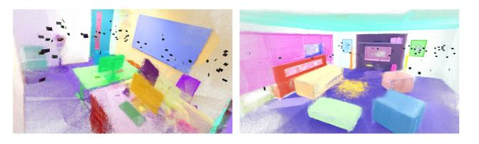
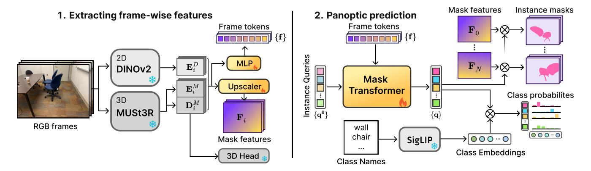
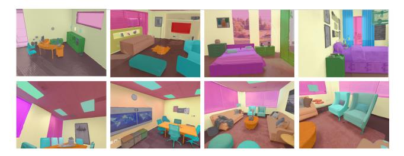
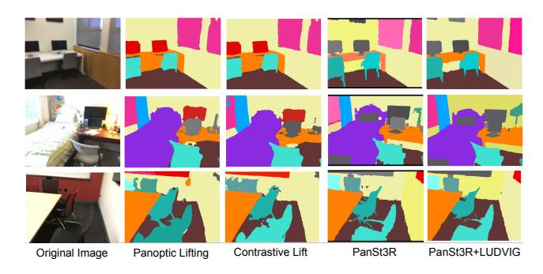
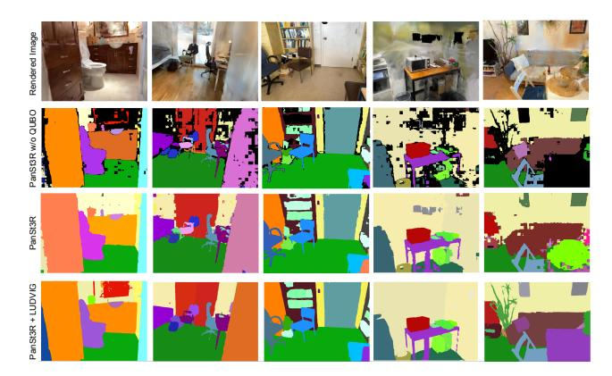

# PanSt3R: Multi-view Consistent Panoptic Segmentation

Lojze Žust Yohann Cabon Juliette Marrie Leonid Antsfeld Boris Chidlovskii Jérôme Revaud Gabriela Csurka Naver Labs Europe

firstname.lastname@naverlabs.com

#### **Abstract**

Panoptic segmentation in 3D is a fundamental problem in scene understanding. Existing approaches typically rely on costly test-time optimizations (often based on NeRF) to consolidate 2D predictions of off-the-shelf panoptic segmentation methods into 3D. Instead, in this work, we propose a unified and integrated approach PanSt3R, which eliminates the need for test-time optimization by jointly predicting 3D geometry and multi-view-consistent panoptic segmentation in a single forward pass. Our approach harnesses the 3D representations of MUSt3R, a recent scalable multi-view version of DUSt3R, and 2D representations of DINOv2, then performs joint multi-view panoptic prediction via a mask transformer architecture. We additionally revisit the standard post-processing mask merging procedure and introduce a more principled approach for multi-view segmentation. We also introduce a simple method for generating novel-view predictions based on the predictions of PanSt3R and vanilla 3DGS. Overall, the proposed PanSt3R is conceptually simple yet fast and scalable, and achieves state-of-the-art performance on several benchmarks, while being orders of magnitude faster. More information and examples available on our project page.

### 1. Introduction

Robust understanding of the semantics of 3D scenes is key to many applications like virtual reality, robot navigation, or autonomous driving. Such use cases require an accurate decomposition of the 3D environment into separate object instances of known classes. In 2D vision, this joint task of semantic and instance segmentation, denoted as panoptic image segmentation [24], consists of instance segmentation of *things* classes (*i.e.* countable objects such as cars) and semantic segmentation of *stuff* classes (*i.e.* uncountable classes such as road or sky). Following [24], a large number of solutions have been proposed for 2D panoptic segmentation, based on CNNs [8, 30, 33, 37, 64], Transformers [14, 15, 29, 43, 67, 79], or more recently diffusion mod-

Figure 1. PanSt3R jointly predicts 3D geometry and panoptic segmentation of a scene in a **single forward pass**.

els [6, 56, 60, 65].

Several recent works [21, 27, 45, 51, 66] have extended panoptic segmentation to 3D scenes represented as point clouds, meshes or voxels. These methods typically take a 3D representation (*e.g.* a point cloud) as input and label it using neural networks, such as PointNet [41, 42], designed for direct operation on such data. However, acquiring dense and accurate point clouds requires dedicated sensors and recent models [26, 49, 55, 58, 61] struggle with noisy or sparse point clouds derived from unposed images.

Instead, in this work, we propose to *jointly* perform 3D reconstruction and panoptic segmentation given an unconstrained set of unposed images or video frames. In this sense our method is closer to NeRF-based [2, 16, 25, 50, 57, 75] or 3DGS-based methods [62] that start from a collection of images. These approaches typically rely on posed images and off-the-shelf 2D panoptic segmentation models [15], followed by lifting and fusing the 2D panoptic predictions to 3D via NeRFs [36] or 3DGS [22].

While this allows for aggregation of potentially inconsistent and noisy 2D panoptic labels from multiple images into consistent 3D labels, these methods have several limitations: (1) they depend on accurate camera poses, (2) they require costly test-time optimization to align 2D segmentations with 3D geometry, and (3) they inherently separate the 2D segmentation and 3D reconstruction pipelines, potentially sacrificing efficiency and accuracy.

We argue that 3D reconstruction and 3D panoptic segmentation are two intrinsically connected tasks, both involving reasoning in terms of 3D geometry of the scene and its instance decomposition. Therefore, we propose to

model the 3D geometry and its panoptic segmentation in a unified, end-to-end framework that performs directly multiview consistent panoptic segmentation. Existing works for such panoptic 3D reconstruction usually focus on single-image inputs [11, 74] or require posed video inputs [63].

Instead, building on top of the recent 3D reconstruction network MUSt3R [61], we propose PanSt3R (Panoptic MUSt3R) which jointly predicts the 3D scene geometry and its panoptics from an unconstrained collection of unposed images in a single forward pass. PanSt3R leverages two pre-trained feature extractors to encode frames in both semantic (2D) and 3D-aware information, then directly regresses 3D geometry via a 3D head, and performs multiview instance mask prediction via a Mask2Former-like decoder. These mask predictions are finally filtered using a lightweight novel quadratic binary optimization framework (OUBO). This turns out to be a crucial step in our method, as we show that the standard filtering technique is poorly suited for multi-view predictions. Finally, we demonstrate that it is straightforward to generate novel view panoptic predictions based on the outputs of our method via simple test-time uplifting of labels to 3DGS [35].

In summary, our main contributions are as follows. We introduce a method for joint 3D reconstruction and panoptic segmentation, which tackles the problem with a single forward pass. The approach is simple, fast, and operates on hundreds of images without requiring any camera parameters or test-time optimization. Second, we propose a novel and mathematically grounded mask prediction merging strategy to further improve the quality of multi-view panoptic predictions. Third, we introduce two distinct and simple approaches for novel-view synthesis with panoptic segmentation, leveraging our framework and 3D Gaussian Splatting. Finally, we conduct extensive evaluation and ablative studies on several datasets, obtaining state-of-theart results, both in terms of panoptic quality and inference speed.

# 2. Related work

**2D Panoptic Segmentation** is a unification of semantic and instance segmentation tasks. Its goal is to decompose an image into different regions, each region corresponding to an individual object (denoted as *thing*) or uncountable concepts like 'sky' or 'ground' (denoted as *stuff*). The first panoptic methods extended Mask R-CNN [19] to design a deformable-convolution-based semantic segmentation head and solve the two subtasks simultaneously [13, 23, 24, 37, 64]. Another set of models [8, 40, 59, 68] build upon the DeepLab architecture [31]. Instead, [30] combines a proposal attention module with a mask attention module, [33] proposes an end-to-end occlusion-aware pipeline, and [52] introduces a fully differentiable end-to-end network for

class-agnostic instance segmentation jointly trained with a semantic segmentation branch. Gao et al. [17] jointly trains semantic class labeling with a pixel-pair affinity pyramid, and Yuan et al. [71] generalizes object-contextual representations to panoptic segmentation.

With the success of Vision Transformers, Mask2Former [15], inspired by DETR [4], adopted a more unified approach to directly produce panoptic output, posing the task as a mask prediction and classification problem. Several recent extensions also aim for openvocabulary segmentation capabilities (*e.g.* using a CLIP text encoder) [7, 14, 18, 20, 29, 43, 67, 70]. Recently, several diffusion-based methods were also proposed for this task [6, 56, 60, 65].

**3D Panoptic Segmentation** is a direct extension of 2D panoptic segmentation for 3D scenes. We can distinguish between several categories of approaches. First, methods that directly process an input 3D point cloud, typically obtained by dedicated sensors (ToF or LIDAR), thereby assuming prior knowledge of the 3D scene geometry [21, 27, 45, 51, 66].

The second category of methods, closer to our approach, requires only a set of input images and respective camera parameters (if not provided directly, the latter is usually obtained via standard SfM techniques [48]). Existing approaches in this category are either based on NeRF [36], or Gaussian Splatting [22], with implicit or explicit labeled 3D representations as output, respectively. These methods typically perform 3D panoptic segmentation by lifting 2D segmentation masks obtained with pre-trained 2D panoptic segmentation models (*e.g.* Mask2Former [15]) to 3D. Zhi et al. [75] showed that noisy 2D semantic segmentations can be fused into a consistent volumetric model by a NeRF, and their model was extended to instance and panoptic segmentation in [16, 25, 57].

Panoptic NeRF [16] starts from a set of sparse images, coarse 3D bounding primitives and noisy 2D predictions to generate panoptic labels via volumetric rendering. Panoptic Neural Fields (PNF) [25] learns a panoptic radiance field with a separate instance MLP and a semantic MLP by explicitly decomposing the scene into a set of objects and amorphous background. These MLPs collectively define the panoptic-radiance field describing 3D point color, semantic and instance labels. DM-NeRF [57] introduced an object field component to learn unique codes for all individual objects in 3D space from 2D supervision and panoptic segmentation with an extra semantic branch parallel to object code branch. Panoptic Lifting (PanLift) [50] relies on TensoRF [5] on top of which they introduce lightweight output heads for learning semantic and instance fields. The core idea of Contrastive Lift [2] is a slow-fast clustering objective function well suited for scenes with a large number of objects. They lift 2D segments to 3D fusing them by means of a neural field representation, which encourages multi-view consistency across frames.

On the Gaussian Spatting side, PLGS [62] learns to embed an additional semantic and instance probability vectors for each Gaussian, which can be rendered on novel views in parallel to RGB. To handle noisy panoptic predictions, they rely on Scaffold-GS architecture [34] where additional depth maps are provided as input and 3D Gaussians are initialized with semantic anchor points used for smooth regularization during training. Instead, PCF-Lift [78] addressed the degradation of performance in complex scenes caused by noisy and error-prone 2D segmentations by introducing Probabilistic Contrastive Fusion (PCF), which learns to embed probabilistic features to robustly handle inaccurate segmentations and inconsistent instance IDs.

Alternatively, a category of methods explores joint prediction of 3D geometry and panoptics of the scene. However, these approaches are either limited to single-image inputs [10, 11, 74], or rely on posed and ordered collection of input frames [63, 77].

In contrast to all these methods, our approach works on collections of unordered and unposed input images without camera parameters or depth maps, and directly outputs a 3D reconstruction annotated with panoptic labels in a single forward pass (see examples in Fig. 1).

#### 3. Method

**Problem statement.** Given a set of N images  $I_1 \dots I_N \in \mathbb{R}^{W \times H \times 3}$ , we aim to jointly perform 3D reconstruction and panoptic segmentation, producing a global 3D point, a semantic class, and an instance ID for every pixel in each input image. Formally, these outputs materialize as 3D point-maps  $\mathbf{X} \in \mathbb{R}^{N \times W \times H \times 3}$ , semantic segmentation masks  $\mathbf{M}^{\text{CLS}} \in \{1 \dots C\}^{N \times W \times H}$ , and instance segmentation masks  $\mathbf{M}^{\text{INST}} \in \{1 \dots m\}^{N \times W \times H}$ , where W and H denote the image width and height, C the number of classes and M the maximum number of instances M in the scene.

**Summary.** Our method builds upon recent progress made in the 3D reconstruction community. Specifically, our approach is based on MUSt3R [3], a Transformer-based powerful and scalable 3D reconstruction method, which we augment with panoptic capabilities inspired by Mask2Former [9]. In Sec. 3.1 we detail the overall architecture of our network. Since the network outputs raw mask predictions that are potentially overlapping, a merging step is necessary to select a globally optimal set of instances (Sec. 3.2). In order to generate panoptic segmentations for novel viewpoints, we optionally project the labeled point cloud into a set of 3D Gaussians (Sec. 3.3).

### 3.1. PanSt3R

The overall PanSt3R architecture is illustrated in Fig. 2 and detailed below. It consists of a feature extraction step that leverages foundational models for 2D and 3D feature extraction, followed by instance mask proposal generation.

Feature extraction. Our network starts by extracting dense semantic and 3D-aware representations from the set of input images by leveraging two pretrained backbones. Namely, we extract DINOv2 features for each input image, which have been shown to capture dense and semantically meaningful representations of the scene [38]. Likewise, we extract MUSt3R [3] features for each input image. MUSt3R is a recent extension of DUSt3R [26, 61], a foundation model for 3D vision, excelling at reconstructing the geometry of a scene given only sparse views. In practice, MUSt3R processes images sequentially while maintaining an internal memory of the previously seen images, thereby allowing the encoding of multi-view-consistent representations. Like DINOv2, MUSt3R is a Transformer-based network, but it contains an additional decoder to leverage its internal memory. This way, it can encode both local and global scene geometry using its encoder and decoder, respectively.

Formally, we denote by  $\mathbf{E}_n^D = \mathrm{ENC}^\mathrm{D}(I_n)$  the DINOv2 feature maps of image  $I_n$  and by  $\mathbf{E}_n^M = \mathrm{EnC}^{\mathsf{M}}(I_n)$  and  $\mathbf{D}_n^M = \mathrm{DEC}(\mathbf{E}_n^M)$  the encoder and decoder feature maps from MUSt3R. Note that by feature maps, we refer to an array of tokens, where each token corresponds to a small  $16 \times 16$  patch in the image, *i.e.* we have in reality  $\mathbf{E}_n^D, \mathbf{E}_n^M, \mathbf{D}_n^M$  multi-channel feature maps of size  $\frac{W}{16} \times \frac{H}{16}$  and the number of channels corresponding to the respective feature dimensions  $d_{ED} = d_{EM} = 1024$  and  $d_{DM} = 768$ . As shown in Fig. 2, the three token maps are concatenated along the feature dimension and passed through an MLP to form compact joint 3D-semantic token representations  $\{\mathbf{f}_n\}$ with  $\mathbf{f}_n \in \mathbb{R}^{d_t}$ , where  $d_f = 768$ . The concatenated feature maps are also used to construct high-resolution mask features  $\mathbf{F}_n \in R^{\frac{W}{2} \times \frac{H}{2} \times d_F}$  used for mask prediction, with  $d_F = 256$ . For that, we perform a series of MLP and  $2\times$ upsampling operations to gradually upscale them until we reach the output resolution.

**3D geometry.** We leverage MUSt3R's innate capabilities to reconstruct 3D point clouds. For every image, MUSt3R predicts a global point cloud in the first image's coordinate frame, a local point cloud, and a confidence map. Specifically, given the decoder features  $\mathbf{D}_n^M$ , a prediction head HEAD3D regresses 3D coordinates and confidences for each pixel, *i.e.*  $\mathbf{X}_n^g, \mathbf{X}_n^l, \mathbf{C}_n = \text{HEAD}^{3D}(\mathbf{D}_n^M) \in \mathbb{R}^{W \times H \times 3}$ .

Mask prediction and classification. We follow Mask2Former [15] in formulating panoptic segmentation as a binary mask prediction and classification problem. We extend this formulation to the multi-view setting, generating globally consistent masks for each instance, *i.e.*, the same

 $^1\mathrm{In}$  our experiments m=200. Instance IDs are not shared between classes and uniquely identify each object or stuff region in the scene.

Figure 2. **PanSt3R architecture**. 1) input unposed RGB frames are passed through pretrained DINOv2 and MUSt3R to extract 2D semantic and globally aligned 3D geometric features respectively. Frame tokens and mask features are constructed from per-frame concatenated features. 2) A mask transformer is used to decode instance masks and their class probabilities, by cross-attending learnable instance queries with extracted frame tokens.

instance ID is assigned to a 3D object instance across all views it appears in.

This is achieved by a series of learnable queries denoted by  $\{\mathbf{q}_j^0\}$ , shared by all views and used to represent different instances of *things* and *stuff* classes in the input scene. These learnable query features can hence be seen as region proposals. They are input to a mask transformer DECP that attends to multi-view frame tokens  $\{\mathbf{f}_n\}$  using cross-attention. This results in a set of refined queries  $\{\mathbf{q}_j\} = \mathrm{DEC}^{\mathrm{P}}(\{\mathbf{q}_j^0\}, \{\mathbf{f}_n\})$ , which serve as the base for instance classification and mask prediction.

To enable training across multiple datasets with diverse labeling conventions, we adopt an open-vocabulary approach for instance classification. Specifically, the class probabilities for each query are computed as the cosine similarity between the query embeddings and SigLIP [39, 72] generated text embeddings of class names2. Second, the mask prediction of each query is obtained via a dot product with the high-resolution mask features  $\mathbf{F}_n$ . We denote the resulting instance mask for the image  $I_n$  and query j as

$$\mathbf{M}_{j,n} = \operatorname{sigmoid}(\mathbf{F}_n \cdot \mathbf{q}_j^{\mathrm{M}}) \in \mathbb{R}^{\frac{W}{2} \times \frac{H}{2}}, \tag{1}$$

where  $\mathbf{q}_{j}^{\mathrm{M}} = \mathrm{LIN}^{\mathrm{M}}(\mathbf{q}_{j})$  is the mask embedding of  $\mathbf{q}_{j}$ .

**Training loss.** We follow the training protocol of Mask2Former [15], which comprises three losses: a focal loss  $\mathcal{L}_{cls}$  for instance classification [28], and a combination of dice loss  $\mathcal{L}_{dice}$ [54] and binary cross-entropy  $\mathcal{L}_{bce}$  for mask prediction. The final loss is a weighted combination

$$\mathcal{L} = \lambda_c \mathcal{L}_{cls} + \lambda_d \mathcal{L}_{dice} + \lambda_b \mathcal{L}_{bce}. \tag{2}$$

**Discussion.** While our panoptic prediction network is largely inspired by Mask2Former [15], we would like to

point out a few key innovations. Most notably, our network is inherently multi-view, processing multiple images simultaneously and directly predicting consistent panoptic segmentation across all views. This is enabled by leveraging 3D-aware features from MUSt3R and employing a *shared set of queries*, where each query explicitly targets the same object instance across all view. Unlike [15], we do not construct a multi-resolution feature pyramid, but instead we retain the original frame tokens to limit the memory footprint. We adapt an open-vocabulary classification head [73], facilitating training on heterogeneous datasets and improving test-time performance.

# 3.2. Merging mask predictions

Given the set of multi-view mask predictions from Eq. (1), denoted  $\mathbf{M}_i \in \mathbb{R}^{N \times \frac{W}{2} \times \frac{H}{2}}$  for each query i, our goal is to find a subset of masks that optimally cover the  $N \times \frac{W}{2} \times \frac{H}{2}$  output pixel space, minimizing the overlap between selected masks while reducing the area of empty regions (i.e. , holes). Mathematically, this can be formalized as a quadratic unconstrained binary optimization (QUBO) problem:

$$u^* = \max_{u \in \{0,1\}^m} \sum_i u_i Q_i - \sum_{i < i} u_i u_j Q_{i,j},$$
 (3)

where u is a boolean assignment of proposals, the weight  $Q_i = \sum_k \mathbf{M}_{i,k}$  represents the area  $|\mathcal{M}_i|$  covered by mask proposal i, and  $Q_{i,j}$  represents the area in excess when selecting both mask proposals i and j due to their overlap:

$$Q_{i,j} = |\mathcal{M}_i \cap \mathcal{M}_j| = \sum_k \min(\mathbf{M}_{i,k}, \mathbf{M}_{j,k}),$$
  
since  $|\mathcal{M}_i \cup \mathcal{M}_j| = |\mathcal{M}_i| + |\mathcal{M}_j| - |\mathcal{M}_i \cap \mathcal{M}_j|$ . (4)

To limit the selection of overlapping regions, we further multiply  $Q_{i,j}$  by a penalty  $\lambda_p > 1$ , (typically  $\lambda_p = 2$ ). Since QUBO is an NP-hard problem, we rely on simulated annealing [47] to find a near-optimal solution efficiently.

 $^2p_{i,j}=\sin(\mathbf{q}_j^{\mathrm{CLS}},\mathbf{t}_i)$ , where  $\mathbf{q}_j^{\mathrm{CLS}}=\mathrm{LIN}^{\mathrm{CLS}}(\mathbf{q}_j)$  is the class embedding of the query  $\mathbf{q}_j$  and  $\mathbf{t}_i$  is the text embedding of the class i.

Given  $u^*$ , we construct instance masks  $\mathbf{M}^{\text{INST}}$  by merging the final assigned masks via per-pixel  $\arg\max$ .  $\mathbf{M}^{\text{CLS}}$  is obtained by assigning the highest probability class  $c_j = \arg\max_i p_{i,j}$  within the mask area of an instance.

**Discussion.** The standard mask merging procedure as introduced in MaskFormer [9] is substantially different from ours. In a nutshell, it consists of first filtering out low-confidence mask predictions to get a pool of candidate masks. This is followed by a pixel-wise voting process to select the most confident mask at each location. Finally, additional filtering is applied to remove predictions that lack sufficient vote support. While this heuristic procedure is simple and typically performs well for single images, it often fails to integrate the multi-view constraints essential for 3D panoptic segmentation. Indeed, as shown in Sec. 4.5, our QUBO procedure results in a large boost in performance, thanks to its global optimization of instance masks across all views.

#### 3.3. Panoptic labels on novel views with 3DGS

In order to compare our model with other methods [2, 16, 25, 50, 57, 62], which evaluate the panoptic performance on unseen views, we additionally rely on Gaussian Splatting (3DGS) [22]. We explore two possible strategies: (i) we simply generate novel RGB views with vanilla 3DGS and predict the panoptic segmentation by a simple forward pass of PanSt3R on the rendered images; or (ii) we uplift the predicted panoptic segmentations to 3D and render the segmentations on novel views. Since the first strategy is trivial and self-explanatory, we now describe the second strategy in more detail. In the following, we denote 2D images  $I_1, \ldots, I_N$  and instance mask predictions  $\mathbf{M}^{\text{INST}}$ , as output by the QUBO mask merging described above.

Scene optimization. The 3DGS optimizes the means and covariances of the Gaussian densities, their opacities, and the color function parametrized by spherical harmonics [22]. Denoting by  $\theta$  the color-related parameters and by  $\psi$  the other parameters, the 3DGS optimizes the following reconstruction loss:

$$\mathcal{L}_{rgb} = \frac{1}{N} \sum_{n=1}^{N} \mathcal{L}(I_n, \hat{I}_n(\theta, \psi)), \tag{5}$$

where  $\hat{I}_n(\theta)$  is the image rendered in the direction corresponding to view n, and  $\mathcal{L}$  is a combination of  $\mathcal{L}_1$  and SSIM loss functions [22].

**Panoptic regularization.** Optimizing Gaussians using only RGB supervision may cause them to span multiple object instances or semantic boundaries, which can negatively impact subsequent label uplifting. To address this, we propose an additional regularization term to align Gaussians to the predicted panoptic masks.

Concretely, we assign a unique RGB color to each instance ID in  $\mathbf{M}_n^{\text{INST}}$ , producing an instance color map  $P_n \in \mathbb{R}^{3 \times W \times H}$  for each image  $I_n$ , which we use as a lightweight supervision signal. We introduce an additional set of Gaussian color parameters  $\hat{\theta}$ , and an auxiliary loss and an auxiliary loss that supervises the rendering of instance color maps during Gaussian optimization:

$$\mathcal{L}_{reg}(\theta,\phi) = \frac{1}{N} \sum_{n=1}^{N} \mathcal{L}_1(P_n, \hat{P}_n(\hat{\theta}, \psi)), \tag{6}$$

where  $\hat{P}_n(\theta, \phi)$  is the rendered panoptic image. We optimize the Gaussians with the following weighted combination of the two losses:

$$\min_{\theta, \phi} \quad \mathcal{L}_{rgb}(\theta, \psi) + \lambda \mathcal{L}_{reg}(\hat{\theta}, \psi) \tag{7}$$

with weight  $\lambda$  set to 1 in all our experiments.

Uplifting with LUDVIG. To uplift the instance labels into the optimized Gaussian Splatting scene, we opt for LUDVIG [35], a recent 3DGS-based feature uplifting method that simply averages 2D pixel features across all views. Instead of using LUDVIG to uplift features, we utilize it to uplift one-hot encoded instance labels  $M_n^0 \in \{0,1\}^{m \times W \times H}$  obtained from  $\mathbf{M}_n^{\text{INST}}$ . We define  $\mathcal{S}_i$  as the set of view-pixel pairs (n,u) impacted by Gaussian  $\mathcal{G}_i$  during forward rendering. This impact is quantified by the weight  $w_i(n,u)$  resulting from  $\alpha$ -blending. LUDVIG defines the 3D feature  $\mathbf{g}_i$  for the Gaussian  $\mathcal{G}_i$  as the following weighted sum:

$$\mathbf{g}_{i} = \sum_{(n,u)\in\mathcal{S}_{i}} \frac{w_{i}(n,u)}{Z_{w}} M_{n}^{0}(u), \quad Z_{w} = \sum_{(n,p)\in\mathcal{S}_{i}} w_{i}(n,p),$$
 (8)

After uplifting to 3D and and reprojecting to 2D, the final 2D rendered instance label is obtained as the  $\arg \max$  along the instance label dimension.

# 4. Experimental evaluation

# 4.1. Implementation details

**Training datasets.** To train our method, we employ a mix of 2D (single-view) and 3D (set of multi-view posed images) datasets for which ground truth panoptic segmentations are available (see Tab. 1). ScanNet++ [69] is comprised of 1006 high-resolution 3D indoor scenes with dense semantic (100 class labels) and instance annotations. We use the V2 version of the dataset and follow the official split, *i.e.* 850 scenes for training and 50 scenes for validation. Aria Synthetic Environments (ASE) [1] is a procedurally-generated synthetic dataset containing 100K unique multi-room interior scenes populated with around 8K 3D objects from which we randomly sampled 750 scenes. With Infini-Gen [44], another tool for procedural generation of 3D data,

Table 1. Statistics for datasets used during training (top) and evaluation (bottom). "MV" denotes available multi-view data.

|          | Dataset        | real     | MV           | # scenes | # classes |
|----------|----------------|----------|--------------|----------|-----------|
| Training | ScanNet++ [69] | ✓        | ✓            | 855      | 100       |
|          | ASE [1]        | x        | $\checkmark$ | 750      | 44        |
|          | Infinigen [44] | х        | $\checkmark$ | 936      | 76        |
|          | COCO [32]      | ✓        | X            | 118k     | 80        |
|          | ADE20k [76]    | ✓        | X            | 20k      | 150       |
|          | ScanNet++ [69] | <b>√</b> | ✓            | 50       | 100       |
| Eval     | ScanNet [12]   | ✓        | $\checkmark$ | 12       | 20        |
|          | Hypersim [46]  | х        | $\checkmark$ | 6        | 20        |
|          | Replica [53]   | x        | $\checkmark$ | 7        | 20        |

we generate 936 indoor scenes of 25 images each. Finally, we also leverage two widely used 2D panoptic segmentation datasets, COCO [32] and ADE20K [76], which consist of high-resolution images with precise manual annotations. Adding these datasets is useful to improve generalization and robustness, since they offer a larger visual diversity. To simulate multi-view data on 2D images, we sample several geometric and photometric variants of the input image including crops, rotations, and color jittering.

**Training details.** The DINOv2 and MUSt3R backbones (resp. ViT-L, and ViT-L+ViT-B architectures) are initialized with their pretrained weights and frozen during PanSt3R training. In preliminary experiments, we observed that finetuning MUSt3R does not have a big impact on the final performance, but incurs significant additional training cost. Since each dataset comes with a different set of classes, we restrict the focal loss supervision  $\mathcal{L}_{cls}$  to within the set of ground-truth classes of each dataset during training. Additional training details are provided in the Supplementary.

**Test-time keyframes.** Since the number of test views can be large during inference (e.g. hundreds), we adopt the same technique as in [3] to reduce the computational and memory footprint. Namely, we efficiently cluster the set of input images using retrieval techniques and select a small set of 50 keyframes using the farthest-point-sampling (FPS) algorithm to maximize coverage. Frame tokens  $\{\mathbf{f}_n\}$  are then only selected from these keyframes, which is enough to generate relevant queries  $\{\mathbf{q}_j\}$ , as shown in Sec. 4.5. We then process the remaining views frame-by-frame, only extracting the per-frame features  $\mathbf{F}_n$  and directly performing mask prediction via Eq. (1), with the decoded queries  $\{\mathbf{q}_j\}$  obtained from the keyframes.

# 4.2. Evaluation metrics

**Panoptic Quality (PQ).** The Panoptic Quality (PQ) score [24] is defined as

$$PQ = \frac{2\sum_{(p,g)\in TP} IoU(p,g)}{2|TP| + |FP| + |FN|},$$
(9)

where p is a predicted instance and g is a GT class instance. Intuitively, this score averages IoU of matched segments

Table 2. We report results for direct predictions of PanSt3R on rendered test images (with and without QUBO), as well as results obtained via the simple 3DGS uplifting approach with LUDVIG. †Timing for building the 3DGS. Note that given access to target view images, PanSt3R can make predictions without the need for 3DGS (and camera parameters).

| Method               | Req. Poses | Hyper- sim | Rep- lica | Scan Net | Time (min)                  |
|----------------------|---------------|---------------|--------------|-------------|-----------------------------|
| DM-NeRF [57]         | <b>√</b>      | 51.6          | 44.1         | 41.7        | ~ 900                       |
| PNF [25]             | $\checkmark$  | 44.8          | 41.1         | 48.3        | -                           |
| PanLift [50]         | $\checkmark$  | 60.1          | 57.9         | 58.9        | ~ 450                       |
| Contrastive Lift [2] | $\checkmark$  | 62.3          | 59.1         | 62.3        | $\sim 420$                  |
| PLGS [62]            | $\checkmark$  | 62.4          | 57.8         | 58.7        | ~ 120                       |
| PCF-Lift [78]        | $\checkmark$  | -             | -            | 63.5        | -                           |
| PanSt3R w/o QUBO     | †             | 51.6          | 57.3         | 59.5        | $\sim 4  (+35^{\dagger})$   |
| PanSt3R              | †             | 56.5          | 62.0         | 65.7        | $\sim 4.5  (+35^{\dagger})$ |
| PanSt3R + LUDVIG     | ✓             | 66.3          | 60.6         | 67.5        | $\sim 40$                   |

Figure 3. Qualitative examples of novel-view panoptic segmentation on **Hypersim** and **Replica** scenes. Predictions are overlaid on top of original images, and colors and their nuances denote different classes and object instances respectively.

while penalizing segments with wrong matches (False Positives) or without matches (False Negatives). It can be seen as a combination of two terms, segmentation quality  $SQ = 1/|TP|\sum_{(p,g)\in TP} IoU(p,g)$ , and a recognition quality  $RQ = TP/(2 \cdot |TP| + |FP| + |FN|)$ .

**Extension to 3D scenes.** PQ can be trivially computed at the scene level by pretending that the scene is a concatenation of all images, effectively tying predictions between all images. This metric, coined scene-PQ (PQsc), was first proposed in [50] to evaluate the results of 3D panoptic segmentation. As we always use the scene-PQ metric, we omit the upper-script "sc" for brevity in the following. To compute the overall results for a dataset, we average the per-scene PQs across all scenes.

#### 4.3. Evaluation on the PanLift benchmark

We first evaluate our method on the Panoptic Lifting (Pan-Lift) benchmark [50]. It comprises 12 scenes from Scan-Net [12], 6 scenes from Hypersim [46] and 7 scenes from Replica [53] (see details in [50]). We use the same splits between seen and unseen (novel) views as in [2, 50].

For PanSt3R, we experiment with the two strategies presented in Sec. 3.3: (i) we simply render a novel image of the target viewpoint using an off-the-shelf 3DGS model, and

Figure 4. Qualitative comparison of novel-view panoptic segmentation on **ScanNet** [12] scenes. Colors and their nuances denote different classes and object instances respectively.

perform a forward pass on rendered images with PanSt3R; or (ii) we utilize the LUDVIG uplifting strategy to directly construct a panoptic 3DGS-based scene representation. Given access to target-view images, PanSt3R can directly predict panoptic segmentation in a forward pass, in principle not requiring poses or 3DGS. However, to be more inline with the competing methods, which predict panoptic segmentation based on test poses, not images, we compute the PQ results for PanSt3R (and PanSt3R w/o QUBO) on test images rendered with vanilla 3DGS built with posed training images3.

Comparison with existing methods. 3D panoptic segmentation methods either directly process an input 3D point cloud (see discussion in Supplementary), or they revolve around the idea of performing 3D panoptic segmentation by lifting 2D segmentation masks obtained with off-the shelf pre-trained 2D panoptic segmentation models, often Mask2Former [62] pretrained on COCO [32]. Then they map the COCO panoptic classes to the following 21 classes: wall, floor, cabinet, bed, chair, sofa, table, door, window, counter, shelves, curtain, ceiling, refrigerator, television, person, toilet, sink, lamp, bag and other. In general, these methods lift and align the 2D predictions to 3D with a test-time optimization of a NeRF or 3DGS.

We compare our PanSt3R variants on the PanoLift datasets against state-of-the art methods in Tab. 2, where DM-NeRF [57], PNF [25], PanLift [50] and Contrastive Lift [2] are NeRF-based approaches, and PLGS [62] and PCF-Lift [78] rely on 3DGS to uplift 2D panoptic segmentation masks. PanSt3R inference is performed using the full training class set, then classes are re-mapped to the target 21 classes, similar to existing work. In Fig. 3 we provide visual examples for PanSt3R+LUDVIG on different datasets and scenes, and in Fig. 4 we provide qualitative comparisons between PanSt3R, PanSt3R+LUDVIG, PanLift and Contrastive Lift.

Table 3. Results on the ScanNet++ val set. We report result of our default model PanSt3R (full) and one trained only on ScanNet++. PanSt3R is compared with PanLift [50] and Contrastive Lift [2], utilizing Mask2Former [15] finetuned on ScanNet++.

| Method               | PQ   | $PQ_{th} \\$ | $PQ_{st} \\$ | Time (min) |
|----------------------|------|--------------|--------------|------------|
| PanLift [50]         | 29.5 | 15.6         | 59.4         | ~ 500      |
| Contrastive Lift [2] | 28.4 | 14.8         | 56.3         | $\sim 460$ |
| PanSt3R (ScanNet++)  | 46.7 | 43.2         | 55.8         | $\sim 2.3$ |
| + LUDVIG             | 54.8 | 52.4         | 62.4         | ~ 35       |
| PanSt3R (full)       | 49.1 | 45.8         | 58.7         | $\sim 2.3$ |
| + LUDVIG             | 54.7 | 51.7         | 62.4         | $\sim 35$  |

**Discussion.** PanSt3R + LUDVIG set a new state-of-theart, except on Replica, where direct forward pass prediction of PanSt3R on rendered views performs slightly better. On Hypersim and ScanNet, uplifting the panoptic segmentations performs much better than direct forward with PanSt3R due to the noise reduction effect of multi-view feature aggregation (Fig. 4). Notably, PanSt3R accomplishes this while being far more computationally efficient than previous methods, even when uplifting to 3DGS via LUDVIG. Additionally, using a simple direct prediction with PanSt3R on re-rendered images is enough to outperform all previous methods on two out of three datasets (except Hypersim), with potentially no need for camera parameters in contrast to existing methods.

#### 4.4. Evaluation on ScanNet++

We also evaluate PanSt3R on the validation set of the ScanNet++ [69]. For each of the 50 validation scenes, we randomly select 100 frames (only iPhone images) and use PanSt3R to predict multi-view consistent panoptic segmentations for these images in a single forward pass. We then randomly select 50 images from the remaining pool of images to serve as test views in order to evaluate the panoptic segmentation on novel unseen viewpoints with the same process as used in the PanLift benchmark. A major difference compared to PanLift is a much larger number of classes (100 instead of 20), including small objects (e.g. crate, paper, socket, cup, smoke detector, soap dispenser), hence requiring much more fine-grained segmentation. To better assess the performance of the models, we also report PQth and PQst, denoting panoptic quality computed separately on *thing* and on *stuff* classes.

Comparison with existing methods. Due to a lack of published results for panoptic segmentation on ScanNet++, we compare our method to PanLift [50] and Contrastive Lift [2] using the official code and uplift the predictions of Mask2Former, finetuned on the ScanNet++ training set. To ensure a fair comparison, we also evaluate a variant of PanSt3R trained only on the ScanNet++ training set, de-

&lt;sup>3Note that prediction quality of PanSt3R is limited by the fidelity of 3DGS rendered views. Direct prediction on test images yields notably better results (see Supplementary).

Figure 5. Qualitative results of novel-view panoptic segmentation on various **ScanNet**++ [12] scenes. Colors and their nuances denote different classes and their instances. Note that due to the large number of classes (100), some may share similar colors.

noted as PanSt3R (ScanNet++) alongside our full model4. Quantitative and qualitative results are presented in Tab. 3 and Fig. 5 respectively.

Discussion We observe that all PanSt3R variants (full or ScanNet++ only, with or without LUDVIG) largely outperform both PanLift and Contrastive Lift by more than 10% in PQ, while being an order of magnitude faster. Analysis reveals, that related approaches encounter difficulties with thing instances, especially small objects (see PQth scores). Additionally, we observe that NeRF optimization struggles when using 'only' 100 training views. In comparison, PanSt3R's performance is relatively invariant to the number of views, since it builds upon the sparse view reconstruction framework of DUSt3R and MUSt3R (see ablations in Sec. 4.5). When we compare PanSt3R and PanSt3R (ScanNet++), we observe that the model trained on more data is slightly better, but the gap disappears when using LUDVIG. Finally, we once again observe that uplifting labels with LUDVIG results in a significant improvement both quantitatively and qualitatively (see Fig. 5).

#### 4.5. Ablative studies

We perform a range of comparative experiments and ablative studies to evaluate the impact of various components and model configurations on the method's performance. We primarily assess the role of using 2D DINOv2 and 3D MUSt3R encoders, as well as the impact of QUBO and GS regularization. Further ablative experiences can be found in the Supplementary.

**Impact of 2D & 3D features.** We ablate the contribution of our two feature extraction backbones on the final performance. For this study, we use a smaller architecture,

Table 4. Ablating the importance of 3D (MUSt3R [3]) and 2D (DINOv2 [38]) features on the ScanNet++ validation set. Results are shown for PanSt3R (224, ScanNet++)+LUDVIG.

| features | PQ   | $PQ_{th} \\$ | $PQ_{st} \\$ |
|----------|------|--------------|--------------|
| 3D + 2D  | 50.4 | 45.4         | 61.1         |
| 3D       | 46.4 | 40.7         | 58.8         |
| 2D       | 35.7 | 28.4         | 51.9         |

Table 5. Analyzing the effect of the QUBO merging strategy (Sec. 3.2). Results are reported for PanSt3R+LUDVIG.

| QUBO | Hypersim | Replica | ScanNet | ScanNet++ |
|------|----------|---------|---------|-----------|
| X    | 58.1     | 60.8    | 60.2    | 50.8      |
|      | 66.7     | 60.7    | 67.3    | 52.0      |

starting from MUSt3R/DINOv2 with a 224x224 input resolution and trained on the ScanNet++ training set only. Result obtained using only the 2D (DINOv2) or 3D (MUSt3R) features are presented in Tab. 4. We observe a clear complementarity effect between 2D semantic features of DINOv2 and 3D geometric features of MUSt3R.

Mask merging strategy. We evaluate the impact of the QUBO-based mask merging strategy (Sec. 3.2). In Tab. 2 and Fig. 5, we compare two versions of PanSt3R, with and without QUBO (*i.e.* using the standard merging strategy from MaskFormer [9]). The same experiments are performed with additional LUDVIG uplifting in Tab. 5. We observe an overall large gap in terms of PQ (except for PanSt3R+LUDVIG on Replica), which highlights the inadequacy of the standard merging scheme when dealing with multi-view segmentation. In a sense, this is expected, as the standard scheme is purely heuristic and instances are selected only locally, without considering any global consistency.

#### 5. Conclusion

We have presented PanSt3R, a novel approach for joint 3D reconstruction and 3D panoptic segmentation operating on unposed and uncalibrated collections of images. The proposed approach, building upon recent progress in 2D and 3D foundation models, is conceptually simple yet effective, achieving state-of-the-art results on multiple benchmarks. Despite not relying on any depth input nor camera parameters, and without the need for costly test-time optimization, PanSt3R is able to decompose a scene into a set of instances in an efficient manner producing high-quality results and paving the way to promising future applications in the fields of robotics, virtual reality and autonomous driving.

 $^4\mathrm{The}$  same model weights as in in Tab. 2, but using the 100 ScanNet++ classes during inference.

# References

- [1] Armen Avetisyan, Christopher Xie, Henry Howard-Jenkins, Tsun-Yi Yang, Samir Aroudj, Suvam Patra, Fuyang Zhang, Duncan P. Frost, Luke Holland, Campbell Orme, Jakob Engel, Edward Miller, Richard A. Newcombe, and Vasileios Balntas. SceneScript: Reconstructing Scenes With An Autoregressive Structured Language Model. arXiv:2403.13064, 2024. 5, 6
- [2] Yash Bhalgat, Iro Laina, João F. Henriques, Andrew Zisserman, and Andrea Vedaldi. Contrastive Lift: 3D Object Instance Segmentation by Slow-Fast Contrastive Fusion. In *NeurIPS*, 2024. 1, 2, 5, 6, 7
- [3] Yohann Cabon, Lucas Stoffl, Leonid Antsfeld, Gabriela Csurka, Boris Chidlovskii, Jérôme Revaud, and Vincent Leroy. MUSt3R: Multi-view Network for Stereo 3D Reconstruction. In CVPR, 2025. 3, 6, 8
- [4] Nicolas Carion, Francisco Massa, Gabriel Synnaeve, Nicolas Usunier, Alexander Kirillov, and Sergey Zagoruyko. End-to-End Object Detection with Transformers. In ECCV, 2020. 2
- [5] Anpei Chen, Zexiang Xu, Andreas Geiger, Jingyi Yu, and Hao Su. TensoRF: Tensorial Radiance Fields. In ECCV, 2022. 2
- [6] Ting Chen, Lala Li, Saurabh Saxena, Geoffrey Hinton, and David J. Fleet. A Generalist Framework for Panoptic Segmentation of Images and Videos. In *ICCV*, 2023. 1, 2
- [7] Xi Chen, Shuang Li, Ser-Nam Lim, Antonio Torralba, and Hengshuang Zhao. Open-vocabulary Panoptic Segmentation with Embedding Modulation. In *ICCV*, 2023. 2
- [8] Bowen Cheng, Maxwell D. Collins, Yukun Zhu, Ting Liu, Thomas S. Huang, Hartwig Adam, and Liang-Chieh Chen. Panoptic-DeepLab: A Simple, Strong, and Fast Baseline for Bottom-Up Panoptic Segmentation. In CVPR, 2020. 1, 2
- [9] Bowen Cheng, Alexander G. Schwing, and Alexander Kirillov. Per-Pixel Classification is Not All You Need for Semantic Segmentation. In *NeurIPS*, 2021. 3, 5, 8
- [10] Tao Chu, Pan Zhang, Qiong Liu, and Jiaqi Wang. BUOL: A Bottom-Up Framework with Occupancy-aware Lifting for Panoptic 3D Scene Reconstruction From A Single Image . In CVPR, 2023. 3
- [11] Manuel Dahnert, Ji Hou, Matthias Niessner, and Angela Dai. Panoptic 3d scene reconstruction from a single rgb image. In NeurIPS, 2021. 2, 3
- [12] Angela Dai, Angel X. Chang, Manolis Savva, Maciej Halber, Thomas Funkhouser, and Matthias Nießner. ScanNet: Richly-Annotated 3D Reconstructions of Indoor Scenes. In CVPR, 2017. 6, 7, 8
- [13] Daan de Geus, Panagiotis Meletis, and Gijs Dubbelman. Panoptic Segmentation with a Joint Semantic and Instance Segmentation Network. arXiv:1809.02110, 2018. 2
- [14] Zheng Ding, Jieke Wang, and Zhuowen Tu. Open-Vocabulary Universal Image Segmentation with MaskCLIP. In *ICML*, 2023, 1, 2
- [15] Yu Du, Fangyun Wei, Zihe Zhang, Miaojing Shi, Yue Gao, and Guoqi Li. Masked-attention Mask Transformer for Universal Image Segmentation. In CVPR, 2022. 1, 2, 3, 4, 7
- [16] Xiao Fu, Shangzhan Zhang, Tianrun Chen, Yichong Lu, Lanyun Zhu, Xiaowei Zhou, Andreas Geiger, and Yiyi Liao.

- Panoptic NeRF: 3D-to-2D Label Transfer for Panoptic Urban Scene Segmentation. In 3DV, 2022. 1, 2, 5
- [17] Naiyu Gao, Yanhu Shan, Yupei Wang, Xin Zhao, Yinan Yu, Ming Yang, and Kaiqi Huang. SSAP: Single-Shot Instance Segmentation With Affinity Pyramid. In *ICCV*, 2019. 2
- [18] Xiuye Gu, Yin Cui, Jonathan Huang, Abdullah Rashwan, Xuan Yang, Xingyi Zhou, Golnaz Ghiasi, Weicheng Kuo, Huizhong Chen, Liang-Chieh Chen, and David A. Ross. 3DaTaSeg: Taming a Universal Multi-Dataset Multi-Task Segmentation Model. In *NeurIPS*, 2023. 2
- [19] Kaiming He, Georgia Gkioxari, Piotra Dollár, and Ross Girshick. Mask R-CNN. In ICCV, 2017. 2
- [20] Shuting He, Henghui Ding, and Wei Jiang. Primitive Generation and Semantic-related Alignment for Universal Zero-Shot Segmentation. In CVPR, 2023. 2
- [21] Fangzhou Hong, Hui Zhou, Xinge Zhu, Hongsheng Li, and Ziwei Liu. LiDAR-based Panoptic Segmentation via Dynamic Shifting Network. In CVPR, 2021. 1, 2
- [22] Bernhard Kerbl, Georgios Kopanas, Thomas Leimkuehler, and George Drettakis. 3D Gaussian Splatting for Real-Time Radiance Field Rendering. ACM Transactions on Graphics, 42(4):1–14, 2023. 1, 2, 5
- [23] Alexander Kirillov, Kaiming He, Ross Girshick, Carsten Rother, and Piotr Dollár. Panoptic Feature Pyramid Networks. In CVPR, 2019. 2
- [24] Alexander Kirillov, Kaiming He, Ross Girshick, Carsten Rother, and Piotr Dollár. Panoptic Segmentation. In CVPR, 2019. 1, 2, 6
- [25] Abhijit Kundu, Kyle Genova, Xiaoqi Yin, Alireza Fathi, Caroline Pantofaru, Leonidas Guibas, Andrea Tagliasacchi, Frank Dellaert, and Thomas Funkhouser. Panoptic Neural Fields: A Semantic Object-Aware Neural Scene Representation. In CVPR, 2022. 1, 2, 5, 6, 7
- [26] Vincent Leroy, Yohann Cabon, and Jérôme Revaud. Grounding Image Matching in 3D with MASt3R. In ECCV, 2024. 1, 3
- [27] Jinke Li, Xiao He, Yang Wen, Yuan Gao, Xiaoqiang Cheng, and Dan Zhang. Panoptic-PHNet: Towards Real-Time and High-Precision LiDAR Panoptic Segmentation via Clustering Pseudo Heatmap. In CVPR, 2022. 1, 2
- [28] Xiang Li, Wenhai Wang, Lijun Wu, Shuo Chen, Xiaolin Hu, Jun Li, Jinhui Tang, and Jian Yang. Generalized Focal Loss: Learning Qualified and Distributed Bounding Boxes for Dense Object Detection. In *NeurIPS*, 2020. 4
- [29] Xiangtai Li, Haobo Yuan, Wei Li, Henghui Ding, Size Wu, Wenwei Zhang, Yining Li, Kai Chen, and Chen Change Loy. OMG-Seg: Is One Model Good Enough For All Segmentation? In CVPR, 2024. 1, 2
- [30] Yanwei Li, Xinze Chen, Zheng Zhu, Lingxi Xie, Guan Huang, Dalong Du, and Xingang Wang. Attention-Guided Unified Network for Panoptic Segmentation. In CVPR, 2019.
  1, 2
- [31] Chen Liang-Chieh, George Papandreou, Iasonas Kokkinos, Kevin Murphy, and Alan Yuille. Semantic Image Segmentation with Deep Convolutional Nets and Fully Connected CRFs. In *ICLR*, 2015. 2

- [32] Tsung-Yi Lin, Michael Maire, Serge Belongie, James Hays, Pietro Perona, Deva Ramanan, Piotr Dollár, and C. Lawrence Zitnick. Microsoft COCO: Common Objects in Context. In ECCV, 2014. 6, 7
- [33] Huanyu Liu, Chao Peng, Changqian Yu, Jingbo Wang, Xu Liu, Gang Yu, and Wei Jiang. An End-to-End Network for Panoptic Segmentation. In CVPR, 2019. 1, 2
- [34] Tao Lu, Mulin Yu, Linning Xu, Yuanbo Xiangli, Limin Wang, Dahua Lin, and Bo Dai. Scaffold-GS: Structured 3D Gaussians for View-Adaptive Rendering. In CVPR, 2024. 3
- [35] Juliette Marrie, Romain Ménégaux, Michael Arbel, Diane Larlus, and Julien Mairal. LUDVIG: Learning-free Uplifting of 2D Visual Features to Gaussian Splatting scenes. arXiv:2410.14462, 2024. 2, 5
- [36] Ben Mildenhall, Pratul P. Srinivasan, Matthew Tancik, Jonathan T. Barron, Ravi Ramamoorthi, and Ren Ng. NeRF: Representing Scenes as Neural Radiance Fields for View Synthesis. In ECCV, 2020. 1, 2
- [37] Rohit Mohan and Abhinav Valada. EfficientPS: Efficient Panoptic Segmentation. *International Journal of Computer Vision*, 129:1551–1579, 2021. 1, 2
- [38] Maxime Oquab, Timothée Darcet, Théo Moutakanni, Huy Vo, Marc Szafraniec, Vasil Khalidov, Pierre Fernandez, Daniel Haziza, Francisco Massa, Alaaeldin El-Nouby, Mahmoud Assran, Nicolas Ballas, Wojciech Galuba, Russell Howes, Po-Yao Huang, Shang-Wen Li, Ishan Misra, Michael Rabbat, Vasu Sharma, Gabriel Synnaeve, Hu Xu, Hervé Jegou, Julien Mairal, Patrick Labatut, Armand Joulin, and Piotr Bojanowski. DINOv2: Learning Robust Visual Features without Supervision. *Transactions on Machine Learning Research*, 3(1), 2024. 3, 8
- [39] Songyou Peng and Kyle Genova. OpenScene: 3D Scene Understanding with Open Vocabularies. In CVPR, 2023. 4
- [40] Lorenzo Porzi, Samuel Rota Buló, Aleksander Colovic, and Peter Kontschieder. Seamless Scene Segmentation. In CVPR, 2019. 2
- [41] Charles R. Qi, Hao Su, Kaichun Mo, and Leonidas J. Guibas. PointNet: Deep Learning on Point Sets for 3D Classification and Segmentation. In CVPR, 2017.
- [42] Charles Ruizhongtai Qi, Li Yi, Hao Su, and Leonidas J. Guibas. PointNet++: Deep Hierarchical Feature Learning on Point Sets in a Metric Space. In *NeurIPS*, 2017. 1
- [43] Jie Qin, Jie Wu, Pengxiang Yan, Ming Li, Ren Yuxi, Xue-feng Xiao, Yitong Wang, Rui Wang, Shilei Wen, Xin Pan, and Xingang Wang. FreeSeg: Unified, Universal and Open-Vocabulary Image Segmentation. In CVPR, 2023. 1, 2
- [44] Alexander Raistrick, Lingjie Mei, Karhan Kayan, David Yan, Yiming Zuo, Beining Han, Hongyu Wen, Meenal Parakh, Stamatis Alexandropoulos, Lahav Lipson, Zeyu Ma, and Jia Deng. Infinigen Indoors: Photorealistic Indoor Scenes using Procedural Generation. In CVPR, 2024. 5,
- [45] Ryan Razani, Ran Cheng, Enxu Li, Ehsan Taghavi, Yuan Ren, and Liu Bingbing. GP-S3Net: Graph-based Panoptic Sparse Semantic Segmentation Network. In *ICCV*, 2021. 1,
- [46] Mike Roberts, Jason Ramapuram, Anurag Ranjan, Atulit Kumar, Miguel Angel Bautista, Nathan Paczan, Russ Webb,

- and Joshua M. Susskind. Hypersim: A Photorealistic Synthetic Dataset for Holistic Indoor Scene Understanding. In *ICCV*, 2021. 6
- [47] S. S. Kirkpatrick, Gelatt C. D. Jr., and M. P. Vecchi. Optimization by Simulated Annealing. *Science*, 220, 1983. 4
- [48] Johannes Lutz Schönberger and Jan-Michael Frahm. Structure-from-Motion Revisited. In CVPR, 2016. 2
- [49] Philipp Schröppel, Jan Bechtold, Artemij Amiranashvili, and Thomas Brox. A Benchmark and a Baseline for Robust Multi-view Depth Estimation. In 3DV, 2022. 1
- [50] Yawar Siddiqui, Lorenzo Porzi, Samuel Rota Bulò, Norman Müller, Matthias Nießner, Angela Dai, and Peter Kontschieder. Panoptic Lifting for 3D Scene Understanding With Neural Fields. In CVPR, 2023. 1, 2, 5, 6, 7
- [51] Kshitij Sirohi, Rohit Mohan, Daniel Büscher, Wolfram Burgard, and Abhinav Valada. EfficientLPS: Efficient LiDAR Panoptic Segmentation. *IEEE Transactions on Robotics*, 38 (3):1894–1914, 2021. 1, 2
- [52] Konstantin Sofiiuk, Olga Barinova, and Anton Konushin. AdaptIS: Adaptive Instance Selection Network. In ICCV, 2019.
- [53] Julian Straub, Thomas Whelan, Lingni Ma, Yufan Chen, Erik Wijmans, Simon Green, Jakob J. Engel, Raul Mur-Artal, Carl Ren, Shobhit Verma, Anton Clarkson, Mingfei Yan, Brian Budge, Yajie Yan, Xiaqing Pan, June Yon, Yuyang Zou, Kimberly Leon, Nigel Carter, Jesus Briales, Tyler Gillingham, Elias Mueggler, Luis Pesqueira, Manolis Savva, Dhruv Batra, Hauke M. Strasdat, Renzo De Nardi, Michael Goesele, Steven Lovegrove, and Richard Newcombe. The Replica Dataset: A Digital Replica of Indoor Spaces. arXiv:1906.05797, 2019. 6
- [54] Carole H. Sudre, Wenqi Li, Tom Vercauteren, Sébastien Ourselin, and M. Jorge Cardoso. Generalised Dice Overlap as a Deep Learning Loss Function for Highly Unbalanced Segmentations. In *DLMIA*, 2017. 4
- [55] Zhenggang Tang, Yuchen Fan, Dilin Wang, Hongyu Xu, Rakesh Ranjan, Alexander Schwing, and Zhicheng Yan. MV-DUSt3R+: Single-Stage Scene Reconstruction from Sparse Views in 2 Seconds. arXiv:2412.06974, 2024. 1
- [56] Wouter Van Gansbeke and Bert De Brabandere. A Simple Latent Diffusion Approach for Panoptic Segmentation and Mask Inpainting. In ECCV, 2024. 1, 2
- [57] Bing Wang, Lu Chen, and Bo Yang. DM-NeRF: 3D Scene Geometry Decomposition and Manipulation from 2D Images. In *ICLR*, 2023. 1, 2, 5, 6, 7
- [58] Hengyi Wang and Lourdes Agapito. 3D Reconstruction with Spatial Memory. arXiv:2408.16061, 2024. 1
- [59] Huiyu Wang, Yukun Zhu, Bradley Green, Hartwig Adam, Alan L. Yuille, and Liang-Chieh Chen. Axial-DeepLab: Stand-Alone Axial-Attention for Panoptic Segmentation. In ECCV, 2020. 2
- [60] Hefeng Wang, Jiale Cao, Rao Muhammad Anwer, Jin Xie, Fahad Shahbaz Khan, and Yanwei Pang. DFormer: Diffusion-guided Transformer for Universal Image Segmentation. arXiv:2306.02240, 2023. 1, 2
- [61] Shuzhe Wang, Vincent Leroy, Yohann Cabon, Boris Chidlovskii, and Jérôme Revaud. DUSt3R: Geometric 3D Vision Made Easy. In CVPR, 2024. 1, 2, 3

- [62] Yu Wang, Xiaobao Wei, Ming Lu, and Guoliang Kang. PLGS: Robust Panoptic Lifting with 3D Gaussian Splatting. arXiv:2410.17505, 2024. 1, 3, 5, 6, 7
- [63] Dong Wu, Zike Yan, and Hongbin Zha. PanoRecon: Real-Time Panoptic 3D Reconstruction from Monocular Video. In CVPR, 2024. 2, 3
- [64] Yuwen Xiong, Renjie Liao, Hengshuang Zhao, Rui Hu, Min Bai, Ersin Yumer, and Raquel Urtasun. UPSNet: A Unified Panoptic Segmentation Network. In CVPR, 2019. 1, 2
- [65] Jiarui Xu, Sifei Liu, Arash Vahdat, Wonmin Byeon, Xiaolong Wang, and Shalini De Mello. Open-Vocabulary Panoptic Segmentation with Text-to-Image Diffusion Models. In CVPR, 2023. 1, 2
- [66] Shuangjie Xu, Rui Wan, Maosheng Ye, Xiaoyi Zou, and Tongyi Cao. Sparse Cross-scale Attention Network for Efficient LiDAR Panoptic Segmentation. In AAAI, 2022. 1,
- [67] Xin Xu, Tianyi Xiong, Zheng Ding, and Zhuowen Tu. MasQCLIP for Open-Vocabulary Universal Image Segmentation. In *ICCV*, 2023. 1, 2
- [68] Tien-Ju Yang, Maxwell D. Collins, Yukun Zhu, Jyh-Jing Hwang, Ting Liu, Xiao Zhang, Vivienne Sze, George Papandreou, and Liang-Chieh Chen. DeeperLab: Single-Shot Image Parser. arXiv:1902.05093, 2019.
- [69] Chandan Yeshwanth, Yueh-Cheng Liu, Matthias Nießner, and Angela Dai. ScanNet++: A High-Fidelity Dataset of 3D Indoor Scenes. In ICCV, 2023. 5, 6, 7
- [70] Qihang Yu, Ju He, Xueqing Deng, Xiaohui Shen, and Liang-Chieh Chen. Convolutions Die Hard: Open-Vocabulary Segmentation with Single Frozen Convolutional CLIP. In *NeurIPS*, 2023. 2
- [71] Yuhui Yuan, Xilin Chen, and Jingdong Wang. Object-Contextual Representations for Semantic Segmentation. In ECCV, 2020. 2
- [72] Xiaohua Zhai, Basil Mustafa, Alexander Kolesnikov, and Lucas Beyer. Sigmoid Loss for Language Image Pre-Training. In ICCV, 2023. 4
- [73] Hao Zhang, Feng Li, Xueyan Zou, Shilong Liu, Chunyuan Li, Jianwei Yang, and Lei Zhang. A Simple Framework for Open-Vocabulary Segmentation and Detection. In *ICCV*, 2023. 4
- [74] Xiang Zhang, Zeyuan Chen, Fangyin Wei, and Zhuowen Tu. Uni-3D: A Universal Model for Panoptic 3D Scene Reconstruction. In *ICCV*, 2023. 2, 3
- [75] Shuaifeng Zhi, Tristan Laidlow, Stefan Leutenegger, and Andrew J. Davison. In-Place Scene Labelling and Understanding with Implicit Scene Representation. In *ICCV*, 2021. 1,
- [76] Bolei Zhou, Hang Zhao, Xavier Puig, Sanja Fidler, Adela Barriuso, and Antonio Torralba. Scene Parsing through ADE20K Dataset. In CVPR, 2017. 6
- [77] Zhen Zhou, Yunkai Ma, Junfeng Fan, Shaolin Zhang, Fengshui Jing, and Min Tan. EPRecon: An Efficient Framework for Real-Time Panoptic 3D Reconstruction from Monocular Video. arXiv:2409.01807, 2024. 3
- [78] Runsong Zhu, Shi Qiu, Qianyi Wu, Ka-Hei Hui, Pheng-Ann Heng, and Chi-Wing Fu. PCF-Lift: Panoptic Lifting by Probabilistic Contrastive Fusion. In ECCV, 2024. 3, 6, 7

[79] Xueyan Zou, Zi-Yi Dou, Jianwei Yang, Zhe Gan, Linjie Li, Chunyuan Li, Xiyang Dai, Harkirat Behl, Jianfeng Wang, Lu Yuan, Nanyun Peng, Lijuan Wang, Yong Jae Lee, and Jianfeng Gao. Generalized Decoding for Pixel, Image, and Language. In CVPR, 2023. 1