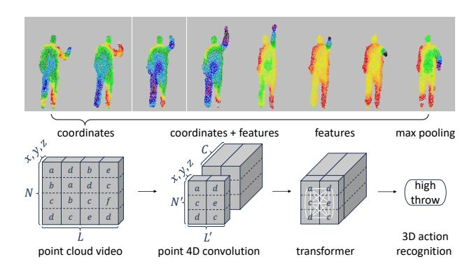
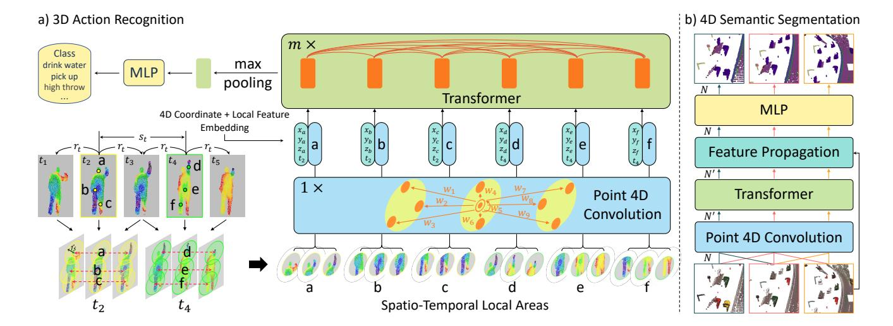
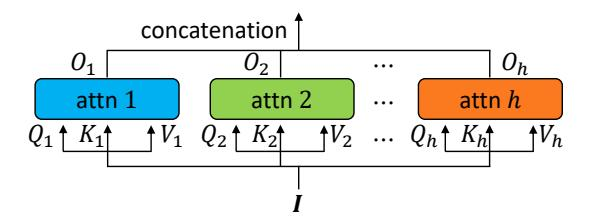
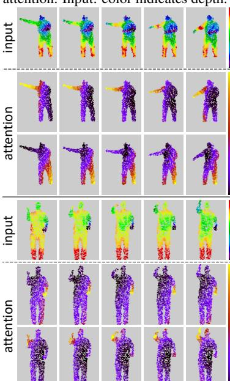
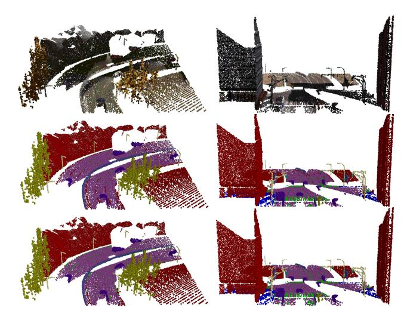
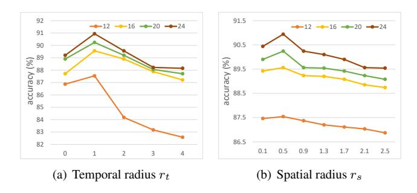
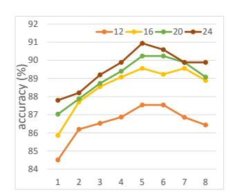
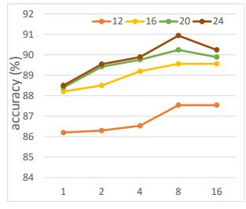

# Point 4D Transformer Networks for Spatio-Temporal Modeling in Point Cloud Videos

Hehe Fan
School of Computing
National University of Singapore

Yi Yang ReLER University of Technology Sydney

Mohan Kankanhalli School of Computing National University of Singapore

#### **Abstract**

Point cloud videos exhibit irregularities and lack of order along the spatial dimension where points emerge inconsistently across different frames. To capture the dynamics in point cloud videos, point tracking is usually employed. However, as points may flow in and out across frames, computing accurate point trajectories is extremely difficult. Moreover, tracking usually relies on point colors and thus may fail to handle colorless point clouds. In this paper, to avoid point tracking, we propose a novel Point 4D Transformer (P4Transformer) network to model raw point cloud videos. Specifically, P4Transformer consists of (i) a point 4D convolution to embed the spatio-temporal local structures presented in a point cloud video and (ii) a transformer to capture the appearance and motion information across the entire video by performing self-attention on the embedded local features. In this fashion, related or similar local areas are merged with attention weight rather than by explicit tracking. Extensive experiments, including 3D action recognition and 4D semantic segmentation, on four benchmarks demonstrate the effectiveness of our P4Transformer for point cloud video modeling.

#### 1. Introduction

Point cloud videos are a rich source of visual information and can be seen as a window into the dynamics of the 3D world we live in, showing how objects move against backgrounds and what happens when we perform an action. Moreover, point cloud videos provide more flexibility for action recognition in poor visibility environments, and covers more precise geometry dynamics than conventional videos. Therefore, understanding point cloud videos is important for intelligent systems to interact with the world.

Figure 1. Illustration of point cloud video modeling by our Point 4D Transformer (P4Transformer) network. Color encodes depth. A point cloud video is a sequence of irregular and unordered 3D coordinate sets. Points in different frames are not consistent. Our P4Transformer consists of a point 4D convolution and a transformer. The convolution encodes a point cloud video  $(3 \times L \times N)$ , where L and N denote the number of frames and the number of points in each frame, to a coordinate tensor  $(3 \times L' \times N')$  and a feature tensor  $(C \times L' \times N')$ . The transformer performs self-attention on the embedded tensors to capture the global spatio-temporal structure across the entire point cloud video.

Essentially, a point cloud video is a sequence of 3D coordinate sets. When point colors are available, they are often appended as additional features. However, because coordinate sets are irregular and unordered, and points emerge inconsistently across different sets/frames, modeling the spatiotemporal structure in point cloud videos is extremely challenging.

In order to capture the dynamics from point clouds, one solution is to first convert a point cloud video into a sequence of regular and ordered voxels and then apply conventional grid based convolutions to these voxels. However, as points are usually sparse, directly performing convolu-

tions on the entire space along the time dimension is computationally inefficient. Therefore, special engineering efforts, *e.g.*, sparse convolution [6], are usually needed. Moreover, voxelization requires additional computation [59], which restricts applications that require real-time processing. Another solution is to directly model raw point cloud videos by grouping local points, in which point tracking is employed to preserve the temporal structure [36]. However, as points may flow in and out across frames, accurately tracking points is extremely difficult. In particular, when videos become long, the tracking error increases. Moreover, point tracking usually requires point colors. It may fail to handle colorless point clouds when point colors are not available.

In this paper, to avoid tracking points, we propose a novel Point 4D Transformer Network (P4Transformer) to model the spatio-temporal structure in raw point cloud videos. First, we develop a point 4D convolution to encode the spatio-temporal local structures in a point cloud video. Our point 4D convolution is directly performed on raw points without voxelization and therefore saves computation time. Moreover, by merging local points along the spatial and temporal dimensions, point 4D convolution reduces the number of points to be processed by the subsequent transformer. Second, instead of grouping these embedded local areas with tracking [36], we propose to utilize the transformer to capture the global appearance and motion information across the entire video. By performing self-attention [53], related local areas are adaptively merged based on the attention weight.

We evaluate our P4Transformer on a video-level classification task, *i.e.*, 3D action recognition, and a point-level prediction task, *i.e.*, 4D semantic segmentation. Experiments on the MSR-Action3D [28], NTU RGB+D 60 [45], NTU RGB+D 120 [30] and Synthia 4D [6] datasets demonstrate the effectiveness of our method. The contributions of this paper are threefold:

- To avoid point tracking, we propose a transformer based network, named P4Transformer, for spatiotemporal modeling of raw point cloud videos. To the best of our knowledge, we are the first to apply transformer in point cloud video modeling.
- To embed spatio-temporal local structures and reduce the number of points to be processed by transformers, we propose a point 4D convolution.
- Extensive experiments on four datasets show that the proposed P4Transformer effectively improves the accuracy of 3D action recognition and 4D semantic segmentation.

### 2. Related Work

Spatio-Temporal Modeling in Grid based Videos. Deep neural networks have achieved excellent performance on spatio-temporal modeling in RGB/RGBD videos. To capture the complementary information about appearance and motion, two-stream convolutional neural networks [49, 56] use a spatial stream and an optical flow stream for video understanding. As video is a kind of sequence, recurrent neural networks [19, 7, 65] are employed to capture the temporal dependencies [38, 13]. Similar to recurrent neural networks, 1D convolutional neural networks [24] can also be used to model the temporal structure across frame features. Besides, pooling techniques [12] are also employed to select and merge frames into a global video representation. In addition, 3D convolutional neural networks [51, 4, 52] can directly learn spatio-temporal representations from videos by stacking 2D frames into 3D pixel tensors. Meanwhile, interpretable video or action reasoning methods [66, 16] are proposed by explicitly parsing changes in videos. For RGBD videos, grid based methods are also widely used to fuse RGB and depth information [30, 20].

**Deep Learning on Static Point Clouds.** Deep learning has been widely used in many point cloud problems, such as classification, object part segmentation, scene semantic segmentation [42, 43, 29, 60, 50], reconstruction [8, 63, 27] and object detection [5, 41]. Most recent works aim to process raw point clouds without converting point clouds into regular voxels. However, these methods mainly focus on static point clouds and do not take the temporal dynamics of point clouds into account.

Point Cloud Video Processing. Point cloud video modeling is a fairly new task but very important for intelligent agents to understand the dynamic 3D world we live in. Two major categories of methods have been explored. The first one is based on voxelization. For example, Fast and Furious (FaF) [37] converts 3D point cloud frames into 2D bird's view voxels and then extracts features via 3D convolutions. MinkowskiNet [6] uses 4D Spatio-Temporal ConvNets to extract appearance and motion from 4D occupancy voxel grids. 3DV [59] first employs a temporal rank pooling to merge point motion into a voxel set and then applies PointNet++ [43] to extract the spatio-temporal representation from the set. The second category is directly performed on raw points. For example, Fan and Yang [14] proposed a series of point recurrent neural networks (PointRNNs) for moving point cloud prediction. MeteorNet [36] appends a temporal dimension to PointNet++ to process 4D points, in which a point tracking based chained-flow grouping is used when merging points. PSTNet [15] constructs the spatio-temporal hierarchy to alleviate the requirement of point tracking. Our P4Transformer belongs to the second category, but aims to avoid point tracking when capturing spatio-temporal correlation across entire point cloud videos.

**Transformer Networks.** Self-attention based architectures, Transformers [53, 9] in particular, have substantially helped advance in natural language processing. In computer

Figure 2. Illustration of the proposed Point 4D Transformer (P4Transformer) networks. a) 3D action recognition. (1) Based on temporal radius  $(r_t)$ , temporal stride  $(s_t)$ , spatial radius  $(r_s)$  and spatial subsampling rate  $(s_s)$ , we construct a few spatio-temporal local areas. (2) Our point 4D convolution encodes each spatio-temporal local area to a feature vector. (3) 4D coordinates are integrated into the corresponding local features by an embedding layer. (4) Our transformer performs self-attention on spatio-temporal local features and each local feature is updated by adding more information from similar or related areas. (5) A max pooling merges local features to a global feature, which is then mapped to action predictions by an MLP. b) 4D semantic segmentation. After the transformer, feature propagation layers recover the subsampled N' points to the original N points by interpolating features. Finally, an MLP maps interpolated features to point predictions.

vision, the community has used self-attention to capture non-local correlation [58, 3, 22, 10, 11] or leverage universal features [34]. Inspired by these methods, to avoid point tracking, we employ a transformer to capture the spatiotemporal structure of raw point cloud videos.

# 3. Point 4D Transformer Networks

In this section, we describe the proposed Point 4D Transformer (P4Transformer) network in detail. Our P4Transformer consists of a point 4D convolution and a transformer. In Section 3.1, we present how the point 4D convolution encodes spatio-temporal local structures in point cloud videos. In Section 3.2, we introduce the transformer, which aims to capture the appearance and motion information across entire point cloud videos. Finally, we show how to apply our P4Transformer to 3D action recognition and 4D semantic segmentation in Section 3.3.

# 3.1. Point 4D Convolution

Let  $P_t \in \mathbb{R}^{3 \times N}$  and  $F_t \in \mathbb{R}^{C \times N}$  denote the point coordinates and features of the t-th frame in a point cloud video, where N and C denote the number of points and feature channels, respectively. Note that, because the MSR-Action3D [28], NTU RGB+D 60 [45] and NTU RGB+D 120 [30] datasets do not provide corresponding point colors,  $F_t$  is not provided. For Synthia 4D [6], the point colors are provided and  $F_t$  is thus available. As we aim to develop a generic network for point cloud video processing and dif-

ferent point features (e.g., color, density and remission) may be involved, we assume that  $F_t$  is available. Given a point cloud video ( $[P_1; F_1], [P_2; F_2], \cdots, [P_L; F_L]$ ), where L is the number of frames, we propose a point 4D convolution to extract local structure and subsample points to be processed by the subsequent transformer, generating an encoded sequence ( $[P_1'; F_1'], [P_2'; F_2'], \cdots, [P_{L'}'; F_{L'}']$ ), where  $P_t' \in \mathbb{R}^{3 \times N'}$  and  $F_t' \in \mathbb{R}^{C' \times N'}$ . Usually, N' < N and L' < L.

Conventional grid based convolutions [23, 18, 51, 4, 17] have proven to be useful local structure modeling. The key in convolution is to learning the kernel for all displacements (including direction and magnitude) from a center grid to its neighbor grids, which is then applied to grid features to capture the local structure. For example, a 3D convolution with a kernel size (3,3,3) can capture the local structure from  $3 \times 3 \times 3 = 27$  displacements. Inspired by traditional convolutions, our point 4D convolution is formulated as follows:

$$\mathbf{F}_{t}^{\prime(x,y,z)} = \sum_{(\delta_{x},\delta_{y},\delta_{z},\delta_{t})\in G} \zeta(\delta_{x},\delta_{y},\delta_{z},\delta_{t}) \cdot \mathbf{F}_{t+\delta_{t}}^{(x+\delta_{x},y+\delta_{y},z+\delta_{z})}$$

$$= \sum_{\delta_{t}=-r_{t}}^{r_{t}} \sum_{||(\delta_{x},\delta_{y},\delta_{z})||\leq r_{s}} \zeta(\delta_{x},\delta_{y},\delta_{z},\delta_{t}) \cdot \mathbf{F}_{t+\delta_{t}}^{(x+\delta_{x},y+\delta_{y},z+\delta_{z})},$$
(1)

where  $(x,y,z) \in P_t$  and  $(\delta_x,\delta_y,\delta_z,\delta_t)$  represents spatial-temporal displacement and  $\cdot$  is matrix multiplication.  $F_t^{(x,y,z)} \in \mathbb{R}^{C \times 1}$  denotes the feature of point at position (x,y,z,t) in the point cloud video. The  $\sum$  can be imple-

mented with different pooling methods, i.e., sum-pooling, max-pooling and average-pooling. G is the spatio-temporal local region around point (x,y,z,t). Note that, because space and time are orthogonal and independent of each other, we can split the region G into a sequence of spatial areas, which is defined by a spatial radius  $r_s$  and a temporal radius  $r_t$ .

Because displacements in grid data are discrete and regular, traditional convolutions can directly learn a kernel for all displacements within a region. However, point coordinates are continuous and irregular, and the number of potential displacements is infinite. Therefore, we propose to indirectly generate a kernel by a function h, instead of directly learning the kernel. Specifically,  $\zeta: \mathbb{R}^{1\times 4} \to \mathbb{R}^{C'\times C}$  is a parameterized function of  $(\delta_x, \delta_y, \delta_z, \delta_t)$  to generate kernels based on input displacements:

$$\zeta(\delta_x, \delta_y, \delta_z, \delta_t) \cdot \boldsymbol{f} = (\boldsymbol{W}_d \cdot (\delta_x, \delta_y, \delta_z, \delta_t)^T) \odot (\boldsymbol{W}_f \cdot \boldsymbol{f}), (2)$$

where  $\boldsymbol{f} = \boldsymbol{F}_{t+\delta_t}^{(x+\delta_x,y+\delta_y,z+\delta_z)}$  is the point feature,  $\boldsymbol{W}_d \in \mathbb{R}^{C'\times 4}$  is to transform 4D displacements,  $\boldsymbol{W}_f \in \mathbb{R}^{C'\times C}$  aims to increase point feature dimension to improve the feature representation ability, and  $\odot$  is an element-wise operator, e.g., addition or product. In this fashion,  $\zeta(\delta_x,\delta_y,\delta_z,\delta_t)$  can generate kernels for all potential displacements. When  $\boldsymbol{F}_t$  is not available, the function is implemented as  $\zeta(\delta_x,\delta_y,\delta_z,\delta_t)=\boldsymbol{W}_d\cdot(\delta_x,\delta_y,\delta_z,\delta_t)^T$ . We can also append a multilayer perceptron (MLP) to Eq. (2) to enhance the modeling.

Grid based convolutions can be easily performed on regular conventional videos by sliding on grids. However, because point cloud videos are spatially irregular as well as unordered and points emerge inconsistently across different frames, it is challenging to perform convolution on them. Moreover, in contrast to grid based convolutions, which are performed on all areas, our point based convolution should avoid empty regions. To this end, we use a method similar to [15] to generate spatio-temporal local areas before performing point 4D convolution. Specifically, as shown in Fig. 2(a), we first select some frames based on the temporal stride  $s_t$ . Second, we use the farthest point sampling (FPS) [43] to subsample  $N' = N/s_s$  points in each selected frame, where  $s_s$  is the spatial subsampling rate. These subsampled points are then transferred to the  $r_t$  nearest frames. The original and transferred subsampled points form the central axis of a spatio-temporal local area. Finally, spatial neighbors are searched based on spatial radius  $r_s$  for each subsampled point in the selected or  $r_t$  nearest frames.

# 3.2. Transformer

#### 3.2.1 4D Coordinate and Local Feature Embedding

After point 4D convolution, the spatio-temporal local areas of the t-th frame are encoded to representations  $F'_t$ .

Because similar local regions share similar representations, we can merge related areas based on their similarities instead of explicit tracking. Moreover, because point positions also reflect the relationship among local regions, we can exploit them to enhance representations for performing self-attention. Therefore, we combine anchor coordinates, *i.e.*, (x, y, z, t), and local area features as the input to our transformer,

$$\mathbf{I}^{(x,y,z,t)} = \mathbf{W}_i \cdot (x,y,z,t)^T + \mathbf{F}_t^{\prime(x,y,z)},$$
 (3)

where  $W_i \in \mathbb{R}^{C' \times 4}$  is the weight to convert 4D coordinates and  $I \in \mathbb{R}^{C' \times L'N'}$  is the self-attention input.

#### 3.2.2 Self-Attention

Given I, we aim to merge related local areas based on their similarities so that each point has a larger receptive field to perceive what happens around it. To this end, we perform self-attention [53] on I. Specifically, the self-attention can be described as mapping a query and a set of key-value pairs to an output, where the queries, keys and values are generated by the input itself and the output is computed as a weighted sum of the values:

$$egin{aligned} oldsymbol{Q} &= oldsymbol{W}_q \cdot oldsymbol{I}, & oldsymbol{K} &= oldsymbol{W}_k \cdot oldsymbol{I}, & oldsymbol{V} &= oldsymbol{W}_v \cdot oldsymbol{K}, & oldsymbol{Q} &= oldsymbol{V} \cdot \operatorname{attention}(oldsymbol{Q}, oldsymbol{K}), \end{aligned}$$

$$oldsymbol{O} &= oldsymbol{V} \cdot \operatorname{attention}(oldsymbol{Q}, oldsymbol{K}), & oldsymbol{Q} &= oldsymbol{V} \cdot \operatorname{attention}(oldsymbol{Q}, oldsymbol{K}), & oldsymbol{Q} &= oldsymbol{V} \cdot \operatorname{attention}(oldsymbol{Q}, oldsymbol{K}), & oldsymbol{Q} &= oldsymbol{V} \cdot \operatorname{attention}(oldsymbol{Q}, oldsymbol{K}), & oldsymbol{Q} &= oldsymbol{V} \cdot \operatorname{attention}(oldsymbol{Q}, oldsymbol{K}), & oldsymbol{Q} &= oldsymbol{V} \cdot \operatorname{attention}(oldsymbol{Q}, oldsymbol{K}), & oldsymbol{Q} &= oldsymbol{V} \cdot \operatorname{attention}(oldsymbol{Q}, oldsymbol{K}), & oldsymbol{Q} &= oldsymbol{V} \cdot \operatorname{attention}(oldsymbol{Q}, oldsymbol{K}), & oldsymbol{Q} &= oldsymbol{Q} \cdot oldsymbol{Q} \cdot oldsymbol{Q} \cdot oldsymbol{Q} = oldsymbol{Q} \cdot oldsymbol{Q} \cdot oldsymbol{Q} \cdot oldsymbol{Q} = oldsymbol{Q} \cdot oldsymbol{Q} \cdot oldsymbol{Q} \cdot oldsymbol{Q} = oldsymbol{Q} \cdot oldsymbol{Q} \cdot oldsymbol{Q} \cdot oldsymbol{Q} = oldsymbol{Q} \cdot oldsymbol{Q} \cdot oldsymbol{Q} \cdot oldsymbol{Q} = oldsymbol{Q} \cdot oldsymbol{Q} \cdot oldsymbol{Q} \cdot oldsymbol{Q} = oldsymbol{Q} \cdot oldsymbol{Q} \cdot oldsymbol{Q} \cdot oldsymbol{Q} = oldsymbol{Q} \cdot oldsymbol{Q} \cdot oldsymbol{Q} \cdot oldsymbol{Q} \cdot oldsymbol{Q} \cdot oldsymbol{Q} \cdot oldsymbol{Q} \cdot oldsymbol{Q} = oldsymbol{Q} \cdot oldsymbol{Q} \cdot oldsymbol{Q} \cdot oldsymbol{Q} \cdot oldsymbol{Q} \cdot oldsymbol{Q} \cdot oldsymbol{Q} \cdot oldsymbol{Q} \cdot oldsymbol{Q} \cdot oldsymbol{Q} \cdot oldsymbol{Q} \cdot oldsymbol{Q} \cdot oldsymbol{Q} \cdot oldsymbol{Q} \cdot oldsymbol{Q} \cdot oldsymbol{Q} \cdot oldsymbol{Q} \cdot oldsymbol{Q} \cdot oldsymbol{Q} \cdot oldsymbol{Q} \cdot oldsymbol{Q} \cdot oldsymbol{Q} \cdot oldsymbol{Q} \cdot oldsymbol{Q} \cdot oldsymbol{Q} \cdot oldsymbol{Q} \cdot oldsymbol{Q} \cdot oldsymbol{Q} \cdot oldsymbol{Q} \cdot oldsymbol{Q} \cdot oldsymbol{Q} \cdot oldsymbol{Q} \cdot oldsymbol{Q} \cdot oldsymbol{Q} \cdot oldsymbol{Q} \cdot oldsym$$

where  $\boldsymbol{W}_q, \boldsymbol{W}_k \in \mathbb{R}^{C^k \times C'}$ ,  $\boldsymbol{W}_v \in \mathbb{R}^{C^v \times C'}$  and  $C^k$  and  $C^v$  are the dimension of key and value, respectively. First, we generate queries  $\boldsymbol{Q} \in \mathbb{R}^{C^k \times L'N'}$ , keys  $\boldsymbol{K} \in \mathbb{R}^{C^k \times L'N'}$  and values  $\boldsymbol{V} \in \mathbb{R}^{C^v \times L'N'}$  based on the input  $\boldsymbol{I}$ . Then, we compute the dot products of the query with all keys and apply a softmax function to obtain the weights attention $(\boldsymbol{Q}, \boldsymbol{K}) \in \mathbb{R}^{L'N' \times L'N'}$ . Given a local area, related or similar areas will have larger attention weights than others. Finally, the output  $\boldsymbol{O} \in \mathbb{R}^{C^v \times L'N'}$  is computed as a weighted sum of the values  $\boldsymbol{V}$ . Specifically, for a point (x,y,z,t), its new feature is computed as  $\boldsymbol{O}^{(x,y,z,t)} = \sum \operatorname{attention}(\boldsymbol{Q}, \boldsymbol{K})^{(x,y,z,t),(x',y',z',t')} \times \boldsymbol{V}^{(x',y',z',t')}$ , where (x',y',z',t') belongs to the set of  $\boldsymbol{I}$ 's 4D coordinates.

Note that, given a query, the softmax function is performed on the entire video, which is referred to as *video-level* self-attention is this paper. Another option is the so-called *frame-level* self-attention, which applies softmax to each frame individually, so that the sum of weights in each frame is 1. This option assumes that each query point appears in all frames. However, points may flow in and out across frames, especially for long point cloud videos. Such an assumption is not reasonable. Therefore, we employ the video-level self-attention, which performs softmax on all L'N' points.

Figure 3. Illustration of multi-head attention.

Instead of performing a single self-attention, we employ multi-head attention [53], which performs Eq. (4) h times with independent  $W_q$ ,  $W_k$  and  $W_v$ , to enhance the learning ability of the transformer. The final output of the multi-head attention is the concatenation of h individual self-attentions' outputs. The multi-head structure is illustrated in Fig. 3. Besides the multi-head attention mechanism, we follow [53, 10] to equip the transformer with LayerNorms [1], linear layers, ReLUs and residual connections [18]. Like most deep neural networks, we stack multiple (m) transformers to improve the modeling ability.

# 3.3. P4Transformer Networks for 3D Action Recognition and 4D Semantic Segmentation

To evaluate the ability to model point cloud videos, we apply our P4Transformer to 3D action recognition and 4D semantic segmentation. Action recognition is a fundamental task for video modeling, which can be seen as a videolevel classification task. As shown in Fig. 2(a), given a point cloud video, we first use a point 4D convolution layer to encode spatio-temporally local areas. Second, m transformer layers (self-attention blocks) are stacked to capture appearance and motion information across all encoded local features. Third, a max pooling merges the transformed local features to a single global one. Finally, an MLP layer converts the global feature to action predictions.

The 4D semantic segmentation can be seen as a point-level classification task. The architecture is shown in Fig. 2(b). Because point cloud frames for segmentation are usually high-resolution, we stack multiple point 4D convolution layers to exponentially reduce the number of points to be processed by the transformer. After the transformer, because the point 4D convolution layers subsample points, we add feature propagation layers to interpolate point features. Inspired by [43], we use inverse distance weighted average based on k nearest neighbors:

$$\boldsymbol{F}_{t}^{\prime\prime(x,y,z)} = \frac{\sum_{i=1}^{k} w(\delta_{x}, \delta_{y}, \delta_{z}) \boldsymbol{O}^{(x+\delta_{x}, y+\delta_{y}, z+\delta_{z}, t)}}{\sum_{i=1}^{k} w(\delta_{x}, \delta_{y}, \delta_{z})}, \quad (5)$$

where  $w(\delta_x, \delta_y, \delta_z) = \frac{1}{\|(\delta_x, \delta_y, \delta_z)\|^2}$ . In this paper, we use k=3. Skip connections are added between the corresponding convolution layers and propagation layers. After the last feature interpolation layer, we add an MLP layer that converts point features to point predictions.

Table 1. Action recognition accuracy (%) on MSR-Action3D [28].

| Method               | Input    | # Frames | Accuracy |
|----------------------|----------|----------|----------|
| Vieira et al. [54]   | depth    | 20       | 78.20    |
| Kläser et al. [21]   | depth    | 18       | 81.43    |
| Actionlet [55]       | skeleton | all      | 88.21    |
| PointNet++ [43]      | point    | 1        | 61.61    |
|                      | 1        | 4        | 78.11    |
|                      |          | 8        | 81.14    |
| MeteorNet [36]       | point    | 12       | 86.53    |
|                      |          | 16       | 88.21    |
|                      |          | 24       | 88.50    |
|                      |          | 4        | 80.13    |
|                      |          | 8        | 83.17    |
| D4T                  |          | 12       | 87.54    |
| P4Transformer (ours) | point    | 16       | 89.56    |
|                      |          | 20       | 90.24    |
|                      |          | 24       | 90.94    |

# 4. Experiments

# 4.1. 3D Action Recognition

To show the effectiveness in video-level classification, we apply P4Transformer to 3D action recognition. Following [36, 59], we sample 2,048 points for each frame. Point cloud videos are split into multiple clips (with a fixed number of frames) as inputs. For training, video-level labels are used as clip-level labels. For evaluation, the mean of the clip-level predicted probabilities is used as the video-level prediction. Point colors are not used.

By default, the temporal radius  $r_t$  is set to 1 so that point 4D convolution can capture temporal local correlation. The temporal stride is set to 2 to subsample frames. The spatial subsampling rate  $s_s$  is set to 32. The spatial radius  $r_s$  is specified in different datasets. The transformer contains 5 self-attention (m=5) blocks, with 8 heads (h=8) per block. We train our models for 50 epochs with the SGD optimizer. Learning rate is set to 0.01, and decays with a rate of 0.1 at the 20th epoch and the 30th epoch, respectively.

We compare our P4Transformer with skeleton-based, depth-based and point-based methods on this task. Note that, skeleton-based methods rely on additional body keypoint detection algorithms and cannot capture other objects' motion except for human. Moreover, only using body keypoints ignores scene information that may also provide rich and important cues for action recognition. Depth-based methods project 3D data to 2D depth frame and thus distort the real 3D shape [59].

# 4.1.1 MSR-Action3D

The MSR-Action3D [28] dataset consists of 567 Kinect v1 depth videos, including 20 action categories and 23K frames in total. We use the same training/test split as previ-

Table 2. Action recognition accuracy (%) on NTU RGB+D 60 [45] and NTU RGB+D 120 [30]. Figure 4. Visualization of transformer's

| Method                         | Input         | NTU RG  | B+D 60 | NTU RGB+D 120 |       |  |
|--------------------------------|---------------|---------|--------|---------------|-------|--|
| Method                         | при           | Subject | View   | Subject       | Setup |  |
| SkeleMotion [2]                | skeleton      | 69.6    | 80.1   | 67.7          | 66.9  |  |
| GCA-LSTM [33]                  | skeleton      | 74.4    | 82.8   | 58.3          | 59.3  |  |
| FSNet [31]                     | skeleton      | -       | -      | 59.9          | 62.4  |  |
| Two Stream Attention LSTM [32] | skeleton      | 77.1    | 85.1   | 61.2          | 63.3  |  |
| Body Pose Evolution Map [35]   | skeleton      | -       | -      | 64.6          | 66.9  |  |
| AGC-LSTM [48]                  | skeleton      | 89.2    | 95.0   | -             | -     |  |
| AS-GCN [26]                    | skeleton      | 86.8    | 94.2   | -             | -     |  |
| VA-fusion [64]                 | skeleton      | 89.4    | 95.0   | -             | -     |  |
| 2s-AGCN [47]                   | skeleton      | 88.5    | 95.1   |               |       |  |
| DGNN [46]                      | skeleton      | 89.9    | 96.1   | -             | -     |  |
| HON4D [40]                     | depth         | 30.6    | 7.3    | -             | -     |  |
| SNV [62]                       | depth         | 31.8    | 13.6   | -             | -     |  |
| HOG 2 [39]          | depth         | 32.2    | 22.3   | -             |       |  |
| Li et al. [25]                 | depth         | 68.1    | 83.4   | -             | -     |  |
| Wang <i>et al.</i> [57]        | depth         | 87.1    | 84.2   | -             |       |  |
| MVDI [61]                      | depth         | 84.6    | 87.3   | -             | -     |  |
| NTU RGB+D 120 Baseline [30]    | depth         | -       | -      | 48.7          | 40.1  |  |
| PointNet++ (appearance) [43]   | point         | 80.1    | 85.1   | 72.1          | 79.4  |  |
| 3DV (motion) [59]              | voxel         | 84.5    | 95.4   | 76.9          | 92.5  |  |
| 3DV-PointNet++ [59]            | voxel + point | 88.8    | 96.3   | 82.4          | 93.5  |  |
| P4Transformer (ours)           | point         | 90.2    | 96.4   | 86.4          | 93.5  |  |

Figure 4. Visualization of transformer's attention. Input: color indicates depth.

ous works [55, 36]. We conduct experiments with 10 times and report the mean. As default, the spatial radius  $r_s$  is set to 0.5 for this dataset.

The performance comparisons are reported in Table 1. Our method outperforms all the state-of-the-art methods, demonstrating the superiority of the proposed P4Transformer on feature extraction.

We visualize a few transformer's attention weights in Fig. 4. For input, color indicates depth. For attention, brighter color indicates higher weight. As expected, the transformer is able to pay attention to the correct regions across the frames. This supports our intuition that the transformer can take the place of explicit point tracking when capturing spatio-temporal structure of point cloud videos.

#### 4.1.2 NTU RGB+D 60 and NTU RGB+D 120

The NTU RGB+D 60 [45] is the second largest dataset for 3D action recognition. It consists of 56K videos, with 60 action categories and 4M frames in total. The videos are captured using Kinect v2, with 3 cameras and 40 subjects (performers). The dataset defines two types of evaluation, *i.e.*, cross-subject and cross-view. The cross-subject evaluation splits the 40 performers into training and test groups. Each group consists of 20 performers. The cross-view evaluation uses all the samples from camera 1 for testing and samples from cameras 2 and 3 for training.

The NTU RGB+D 120 [30] dataset, the largest dataset for 3D action recognition, is an extension of NTU RGB+D 60. It consists of 114K videos, with 120 action categories

Table 3. Running time (ms) per video on NTU RGB+D 60 [45].

| Method               | CPU  | GPU | Overall |
|----------------------|------|-----|---------|
| 3DV-PointNet++ [59]  | 2295 | 473 | 2768    |
| P4Transformer (ours) | 11   | 854 | 865     |

and 8M frames in total. The videos are also captured by Kinect v2, with 106 performers and 32 collection setups (locations and backgrounds). Besides cross-subject evaluation, the dataset defines a new evaluation setting, *i.e.*, cross-setup, where 16 setups are used for training, and the others are used for testing. The spatial radius  $r_s$  is set to 0.1 for these two datasets.

Comparison with state-of-the-art methods. As indicated in Table 2, P4Transformer outperforms all the other approaches in all evaluation settings. Particularly, as indicated by the cross-setup evaluation on NTU RGB+D 120, P4Transformer outperforms the second best 3DV-PointNet++ [59] by 4.0%. Moreover, compared to 3DV that extracts motion from voxels, P4Transformer directly models the dynamic information of raw point cloud sequences and thus is efficient.

Computational efficiency. We provide a running time comparison with the second best 3DV-PointNet++ [59]. The average running time per video is shown in Table 3. Experiments are conducted using 1 Nvidia RTX 2080Ti GPU on NTU RGB+D 60. Compared to 3DV-PointNet++, P4Transformer reduces running time by 1903ms, demonstrating that P4Transformer is very efficient.

| Table 4. 4D semantic segmentation results ( | (mIoU %) or | on the Synthia 4D dataset [6]. |
|---------------------------------------------|-------------|--------------------------------|
|                                             |             |                                |

| Method                                                                      | Input                   | # Frames         | Track    | Bldn               | Road                             | Sdwlk                 | Fence                            | Vegittn                          | Pole                  | Car                   | T. Sign                                 | Pedstrn                          | Bicycl                       | Lane                             | T. Light                         | mIoU                             |
|-----------------------------------------------------------------------------|-------------------------|------------------|----------|--------------------|----------------------------------|-----------------------|----------------------------------|----------------------------------|-----------------------|-----------------------|-----------------------------------------|----------------------------------|------------------------------|----------------------------------|----------------------------------|----------------------------------|
| 3D MinkNet14 [6] 4D MinkNet14 [6]                                        | voxel voxel          | 1 3              |          | 07.07              | 97.68 98.26                   | 69.43 73.47        | 86.52 87.19                   | 98.11 <b>99.10</b>            |                       | 93.50 94.01        | 79.45 79.04                          | 92.27 <b>92.62</b>            | 0.00                         | 44.61 50.01                   | 66.69 68.14                   | 76.24 77.46                   |
| PointNet++ [43] MeteorNet-m [36] MeteorNet-m [36] MeteorNet-l [36] | point point point point | 1 2 2 3 |          | <b>98.22</b> 97.65 | 97.72 97.79 97.83 97.72 | 90.98 90.03        | 92.75 93.18 94.06 94.00 | 97.12 98.31 97.41 97.98 | 97.45 97.79        | 94.30                 | 66.87 76.35 82.01 <b>84.07</b> | 78.64 81.05 79.14 80.90 | 0.00 0.00 0.00 0.00 | 72.93 74.09 72.59 71.14 | 75.17 75.92 77.92 77.60 | 79.35 81.47 81.72 81.80 |
| P4Transformer (ours                                                         | /   I                   | 1 3              | -   x | 96.76              | 98.23 <b>98.35</b>            | 92.11 <b>94.03</b> | 95.23 <b>95.23</b>            | 98.62 98.28                   | 97.77 <b>98.01</b> | 95.46 <b>95.60</b> | 80.75 81.54                          | 85.48 85.18                   | 0.00                         | 74.28 <b>75.95</b>            | 74.22 <b>79.07</b>            | 82.41   <b>83.16</b>          |

Figure 5. Visualization of 4D semantic segmentation. Top: inputs. Middle: ground truth. Bottom: P4Transformer predictions.

# 4.2. 4D Semantic Segmentation

To demonstrate that our P4Transformer can be used for point-level prediction tasks, we employ P4Transformer for 4D semantic segmentation. Following the works [6, 36], we conduct experiments on video clips with length of 3 frames. Note that, although 4D semantic segmentation can be achieved from a single frame, exploring temporal correlation would help understanding the structure of scenes, and thus improving segmentation accuracy and robustness to noise. The mean Intersection over Union (mIoU) is used as the evaluation metric.

Synthia 4D [6] uses the Synthia dataset [44] to create 3D videos, which includes 6 videos of driving scenarios, where both objects and cameras are moving. Each video consists of 4 stereo RGB-D images taken from the top of a moving car. Following [36], we reconstruct 3D point cloud videos from RGB and depth images, and use the same training/validation/test split, with 19,888/815/1,886 frames, respectively.

As seen in Table 4, the proposed P4Transformer with 3

Figure 6. Influence of the temporal radius  $r_t$  and spatial radius  $r_s$ . The MSR-Action3D dataset is used.

frames outperforms the state-of-the-art methods. Moreover, our method achieves seven best accuracies among them, demonstrating the effectiveness of P4Transformer. We visualize two segmentation results from the Synthia 4D dataset in Fig. 5. Our method can accurately segment most objects.

We also observe that tracking does not always improve accuracy. We speculate that this phenomenon might be caused by unreliable point tracking results, which hinder temporal modeling.

#### 4.3. Ablation Study

The point 4D convolution and transformer are two important components of our method. In this section, we investigate the effects of the design choices in these two components on MSR-Action3D.

# 4.3.1 Point 4D Convolution: Temporal Radius and Spatial Radius

Kernel size is a basic attribute of convolutional operations, which controls local structure modeling. To effectively model the local structure, conventional CNNs usually use small kernel sizes. In this paper, the kernel size of our point 4D convolution consists of a temporal radius  $r_t$  and a spatial radius  $r_s$ . We investigate the influence of the two radiuses on spatio-temporal modeling.

The temporal radius  $r_t$  controls the temporal dynamics modeling of point cloud videos. As shown in Fig. 6(a),

- (a) Number of transformer layers or self-attention blocks (m)
- (b) Number of heads (h) of each self-attention block

Figure 7. Influence of the number of transformer layers (m) and the number of heads (h) on 3D action recognition. Note that, when we change the number of heads, the total feature dimension of each transformer layer is fixed. The MSR-Action3D dataset is used.

when  $r_t$  is set to 0, point 4D convolution does not capture the temporal correlation. However, P4Transformer can still model spatio-temporal structure by the subsequent transformer, and thus achieve satisfactory accuracy. When  $r_t$  is set to 1, the temporal local structure of 3 frames is captured. In this case, our convolution has the ability to model the spatio-temporal correlation. Compared to  $r_t=0$ , where only spatial structure is captured, the outputs of point 4D convolution with  $r_t=1$  is more rich and informative, and therefore facilitates the subsequent transformer to perform self-attention. Consequently, the 3D action recognition accuracy is improved. However, when  $r_t>1$ , the performance gradually decreases. This is because, points flow in and out in videos, especially for long videos. Noise is inevitably introduced when using long temporal radiuses.

The spatial search radius  $r_s$  controls the region of the spatial structure to be modeled. As shown in Fig. 6(b), using a too small  $r_s$  cannot capture sufficient spatial structure information. However, when using large  $r_s$ , it will decrease the discriminativeness of local structure. Therefore, the 3D action recognition accuracy decreases.

# 4.3.2 Transformer: Number of Transformers, Number of Heads and Frame-level Self-Attention

Like most deep neural networks, we can stack multiple transformer layers to increase the learning ability of the proposed P4Transformer. As shown Fig. 7(a), with more transformer layers, P4Transformer can achieve better accuracy. However, too many layers decrease performance. This is because, when networks become deeper, gradients may be vanishing or exploding, making networks difficult to train.

To investigate the influence of the number of heads on our transformer, we keep the total feature dimension fixed. Specifically, the total feature dimension is fixed to 1024. Suppose there are h heads, then the feature dimension of each self-attention is 1024/h. As shown Fig. 7(b), using

Table 5. Influence of frame-level and video-level self-attention on 3D action recognition. The MSR-Action3D dataset is used.

| Self-attention | 12           | 16           | 20           | 24           |
|----------------|--------------|--------------|--------------|--------------|
| Frame-level    | 70.65        | 76.45        | 78.16        | 79.18        |
| Video-level    | <b>87.54</b> | <b>89.56</b> | <b>90.24</b> | <b>90.94</b> |

more heads can effectively increase accuracy. However, using too many heads makes the feature dimension of each head too short. The feature of each head cannot carry enough information for performing attention. The accuracy therefore decreases.

Finally, we evaluate the impact of the frame-level and the video-level self-attention on point cloud video modeling. As shown in Table 5, the video-level self-attention achieves much better accuracy than the frame-level one. This is because, based on the assumption that the query appears in each frame, the frame-level attention performs the softmax function in each individual frame. However, this does not match the fact that points may flow in and out across frames, especially for long videos. By contrast, the video-level self-attention performs the softmax function across the entire video, in which flowing-out points can be ignored with low attention, thus facilitating temporal modeling and improving action recognition accuracy.

#### 4.3.3 Clip Length

Because information is not equally distributed in point cloud videos along time, short video clips may miss key frames for action reasoning and confuse models as noise. As shown in Table 1, increasing clip length effectively benefits models for 3D action recognition.

#### 5. Conclusion

In this paper, we propose a Point 4D Transformer (P4Transformer) network to capture spatio-temporal correlation from raw point cloud videos. P4Transformer consists of a point 4D convolution and a transformer. The point 4D convolution embeds the spatio-temporal local structures to compact representations and subsamples frames and points for the subsequent transformer processing. The transformer captures the appearance and motion information across the entire point cloud video by performing self-attention on the embedded local representations. Extensive experiments demonstrate the effectiveness of our P4Transformer on point cloud video modeling.

#### Acknowledgments

This research is supported by the Agency for Science, Technology and Research (A\*STAR) under its AME Programmatic Funding Scheme (#A18A2b0046).

### References

- [1] Lei Jimmy Ba, Jamie Ryan Kiros, and Geoffrey E. Hinton. Layer normalization. *arXiv*, 1607.06450, 2016.
- [2] Carlos Caetano, Jessica Sena de Souza, François Brémond, Jefersson A. dos Santos, and William Robson Schwartz. Skelemotion: A new representation of skeleton joint sequences based on motion information for 3d action recognition. In *IEEE International Conference on Advanced Video* and Signal Based Surveillance, AVSS, 2019.
- [3] Nicolas Carion, Francisco Massa, Gabriel Synnaeve, Nicolas Usunier, Alexander Kirillov, and Sergey Zagoruyko. End-toend object detection with transformers. arXiv, 2005.12872, 2020.
- [4] João Carreira and Andrew Zisserman. Quo vadis, action recognition? A new model and the kinetics dataset. In CVPR, 2017.
- [5] Xiaozhi Chen, Huimin Ma, Ji Wan, Bo Li, and Tian Xia. Multi-view 3d object detection network for autonomous driving. In CVPR, 2017.
- [6] Christopher B. Choy, JunYoung Gwak, and Silvio Savarese. 4d spatio-temporal convnets: Minkowski convolutional neural networks. In CVPR, 2019.
- [7] Junyoung Chung, Çaglar Gülçehre, KyungHyun Cho, and Yoshua Bengio. Empirical evaluation of gated recurrent neural networks on sequence modeling. arXiv, 1412.3555, 2014.
- [8] Angela Dai, Angel X. Chang, Manolis Savva, Maciej Halber, Thomas A. Funkhouser, and Matthias Nießner. Scannet: Richly-annotated 3d reconstructions of indoor scenes. In CVPR, 2017.
- [9] Jacob Devlin, Ming-Wei Chang, Kenton Lee, and Kristina Toutanova. BERT: pre-training of deep bidirectional transformers for language understanding. In Proceedings of the 2019 Conference of the North American Chapter of the Association for Computational Linguistics: Human Language Technologies, NAACL-HLT, 2019.
- [10] Alexey Dosovitskiy, Lucas Beyer, Alexander Kolesnikov, Dirk Weissenborn, Xiaohua Zhai, Thomas Unterthiner, Mostafa Dehghani, Matthias Minderer, Georg Heigold, Sylvain Gelly, Jakob Uszkoreit, and Neil Houlsby. An image is worth 16x16 words: Transformers for image recognition at scale. In *ICLR*, 2021.
- [11] Heming Du, Xin Yu, and Liang Zheng. VTNet: Visual transformer network for object goal navigation. In *ICLR*, 2021.
- [12] Hehe Fan, Xiaojun Chang, De Cheng, Yi Yang, Dong Xu, and Alexander G. Hauptmann. Complex event detection by identifying reliable shots from untrimmed videos. In *ICCV*, 2017.
- [13] Hehe Fan, Zhongwen Xu, Linchao Zhu, Chenggang Yan, Jianjun Ge, and Yi Yang. Watching a small portion could be as good as watching all: Towards efficient video classification. In *IJCAI*, 2018.
- [14] Hehe Fan and Yi Yang. Pointrnn: Point recurrent neural network for moving point cloud processing. arXiv, 1910.08287, 2019
- [15] Hehe Fan, Xin Yu, Yuhang Ding, Yi Yang, and Mohan Kankanhalli. PSTNet: Point spatio-temporal convolution on point cloud sequences. In *ICLR*, 2021.

- [16] Hehe Fan, Tao Zhuo, Xin Yu, Yi Yang, and Mohan Kankanhalli. Understanding atomic hand-object interaction with human intention. *IEEE Trans. Circuits Syst. Video Technol.*, 2021.
- [17] Kensho Hara, Hirokatsu Kataoka, and Yutaka Satoh. Can spatiotemporal 3d cnns retrace the history of 2d cnns and imagenet? In CVPR, 2018.
- [18] Kaiming He, Xiangyu Zhang, Shaoqing Ren, and Jian Sun. Deep residual learning for image recognition. In CVPR, 2016.
- [19] Sepp Hochreiter and Jürgen Schmidhuber. Long short-term memory. *Neural Computation*, 9(8):1735–1780, 1997.
- [20] Jianfang Hu, Wei-Shi Zheng, Jiahui Pan, Jianhuang Lai, and Jianguo Zhang. Deep bilinear learning for RGB-D action recognition. In ECCV, 2018.
- [21] Alexander Kläser, Marcin Marszalek, and Cordelia Schmid. A spatio-temporal descriptor based on 3d-gradients. In BMVC, 2008.
- [22] Alexander Kolesnikov, Lucas Beyer, Xiaohua Zhai, Joan Puigcerver, Jessica Yung, Sylvain Gelly, and Neil Houlsby. Big transfer (bit): General visual representation learning. *arXiv*, 1912.11370, 2019.
- [23] Alex Krizhevsky, Ilya Sutskever, and Geoffrey E. Hinton. Imagenet classification with deep convolutional neural networks. In *NeurIPS*, 2012.
- [24] Colin Lea, Michael D. Flynn, René Vidal, Austin Reiter, and Gregory D. Hager. Temporal convolutional networks for action segmentation and detection. In CVPR, 2017.
- [25] Junnan Li, Yongkang Wong, Qi Zhao, and Mohan S. Kankanhalli. Unsupervised learning of view-invariant action representations. In *NeurIPS*, 2018.
- [26] Maosen Li, Siheng Chen, Xu Chen, Ya Zhang, Yanfeng Wang, and Qi Tian. Actional-structural graph convolutional networks for skeleton-based action recognition. In CVPR, 2019.
- [27] Ruihui Li, Xianzhi Li, Chi-Wing Fu, Daniel Cohen-Or, and Pheng-Ann Heng. PU-GAN: A point cloud upsampling adversarial network. In *ICCV*, 2019.
- [28] Wanqing Li, Zhengyou Zhang, and Zicheng Liu. Action recognition based on a bag of 3d points. In CVPR Workshops, 2010.
- [29] Yangyan Li, Rui Bu, Mingchao Sun, Wei Wu, Xinhan Di, and Baoquan Chen. Pointcnn: Convolution on x-transformed points. In *NeurIPS*, 2018.
- [30] Jun Liu, Amir Shahroudy, Mauricio Perez, Gang Wang, Ling-Yu Duan, and Alex C. Kot. NTU RGB+D 120: A largescale benchmark for 3d human activity understanding. *IEEE Trans. Pattern Anal. Mach. Intell.*, 42(10):2684–2701, 2020.
- [31] Jun Liu, Amir Shahroudy, Gang Wang, Ling-Yu Duan, and Alex C. Kot. Skeleton-based online action prediction using scale selection network. *IEEE Trans. Pattern Anal. Mach. Intell.*, 42(6):1453–1467, 2020.
- [32] Jun Liu, Gang Wang, Ling-Yu Duan, Kamila Abdiyeva, and Alex C. Kot. Skeleton-based human action recognition with global context-aware attention LSTM networks. *IEEE Trans. Image Processing*, 27(4):1586–1599, 2018.

- [33] Jun Liu, Gang Wang, Ping Hu, Ling-Yu Duan, and Alex C. Kot. Global context-aware attention LSTM networks for 3d action recognition. In CVPR, 2017.
- [34] Lu Liu, William L. Hamilton, Guodong Long, Jing Jiang, and Hugo Larochelle. A universal representation transformer layer for few-shot image classification. In *ICLR*, 2021.
- [35] Mengyuan Liu and Junsong Yuan. Recognizing human actions as the evolution of pose estimation maps. In CVPR, pages 1159–1168, 2018.
- [36] Xingyu Liu, Mengyuan Yan, and Jeannette Bohg. Meteornet: Deep learning on dynamic 3d point cloud sequences. In *ICCV*, 2019.
- [37] Wenjie Luo, Bin Yang, and Raquel Urtasun. Fast and furious: Real time end-to-end 3d detection, tracking and motion forecasting with a single convolutional net. In CVPR, 2018.
- [38] Joe Yue-Hei Ng, Matthew J. Hausknecht, Sudheendra Vijayanarasimhan, Oriol Vinyals, Rajat Monga, and George Toderici. Beyond short snippets: Deep networks for video classification. In CVPR, 2015.
- [39] Eshed Ohn-Bar and Mohan M. Trivedi. Joint angles similarities and HOG2 for action recognition. In CVPR Workshops, 2013.
- [40] Omar Oreifej and Zicheng Liu. HON4D: histogram of oriented 4d normals for activity recognition from depth sequences. In CVPR, 2013.
- [41] Charles Ruizhongtai Qi, Or Litany, Kaiming He, and Leonidas J. Guibas. Deep hough voting for 3d object detection in point clouds. In *ICCV*, 2019.
- [42] Charles Ruizhongtai Qi, Hao Su, Kaichun Mo, and Leonidas J. Guibas. Pointnet: Deep learning on point sets for 3d classification and segmentation. In CVPR, 2017.
- [43] Charles Ruizhongtai Qi, Li Yi, Hao Su, and Leonidas J. Guibas. Pointnet++: Deep hierarchical feature learning on point sets in a metric space. In *NeurIPS*, 2017.
- [44] Germán Ros, Laura Sellart, Joanna Materzynska, David Vázquez, and Antonio M. López. The SYNTHIA dataset: A large collection of synthetic images for semantic segmentation of urban scenes. In CVPR, 2016.
- [45] Amir Shahroudy, Jun Liu, Tian-Tsong Ng, and Gang Wang. NTU RGB+D: A large scale dataset for 3d human activity analysis. In *CVPR*, 2016.
- [46] Lei Shi, Yifan Zhang, Jian Cheng, and Hanqing Lu. Skeleton-based action recognition with directed graph neural networks. In CVPR, 2019.
- [47] Lei Shi, Yifan Zhang, Jian Cheng, and Hanqing Lu. Twostream adaptive graph convolutional networks for skeletonbased action recognition. In CVPR, 2019.
- [48] Chenyang Si, Wentao Chen, Wei Wang, Liang Wang, and Tieniu Tan. An attention enhanced graph convolutional LSTM network for skeleton-based action recognition. In CVPR, 2019.
- [49] Karen Simonyan and Andrew Zisserman. Two-stream convolutional networks for action recognition in videos. In *NeurIPS*, 2014.
- [50] Hugues Thomas, Charles R. Qi, Jean-Emmanuel Deschaud, Beatriz Marcotegui, François Goulette, and Leonidas J. Guibas. Kpconv: Flexible and deformable convolution for point clouds. In *ICCV*, 2019.

- [51] Du Tran, Lubomir D. Bourdev, Rob Fergus, Lorenzo Torresani, and Manohar Paluri. Learning spatiotemporal features with 3d convolutional networks. In *ICCV*, 2015.
- [52] Du Tran, Heng Wang, Lorenzo Torresani, Jamie Ray, Yann LeCun, and Manohar Paluri. A closer look at spatiotemporal convolutions for action recognition. In CVPR, 2018.
- [53] Ashish Vaswani, Noam Shazeer, Niki Parmar, Jakob Uszkoreit, Llion Jones, Aidan N. Gomez, Lukasz Kaiser, and Illia Polosukhin. Attention is all you need. In *NeurIPS*, 2017.
- [54] Antônio Wilson Vieira, Erickson R. Nascimento, Gabriel L. Oliveira, Zicheng Liu, and Mario Fernando Montenegro Campos. STOP: space-time occupancy patterns for 3d action recognition from depth map sequences. In Progress in Pattern Recognition, Image Analysis, Computer Vision, and Applications 17th Iberoamerican Congress, CIARP, 2012.
- [55] Jiang Wang, Zicheng Liu, Ying Wu, and Junsong Yuan. Mining actionlet ensemble for action recognition with depth cameras. In CVPR, 2012.
- [56] Limin Wang, Yuanjun Xiong, Zhe Wang, Yu Qiao, Dahua Lin, Xiaoou Tang, and Luc Van Gool. Temporal segment networks: Towards good practices for deep action recognition. In ECCV, 2016.
- [57] Pichao Wang, Wanqing Li, Zhimin Gao, Chang Tang, and Philip O. Ogunbona. Depth pooling based large-scale 3-d action recognition with convolutional neural networks. *IEEE Trans. Multimedia*, 20(5):1051–1061, 2018.
- [58] Xiaolong Wang, Ross B. Girshick, Abhinav Gupta, and Kaiming He. Non-local neural networks. In CVPR, 2018.
- [59] Yancheng Wang, Yang Xiao, Fu Xiong, Wenxiang Jiang, Zhiguo Cao, Joey Tianyi Zhou, and Junsong Yuan. 3dv: 3d dynamic voxel for action recognition in depth video. In CVPR, 2020.
- [60] Wenxuan Wu, Zhongang Qi, and Fuxin Li. Pointconv: Deep convolutional networks on 3d point clouds. In CVPR, 2019.
- [61] Yang Xiao, Jun Chen, Yancheng Wang, Zhiguo Cao, Joey Tianyi Zhou, and Xiang Bai. Action recognition for depth video using multi-view dynamic images. *Inf. Sci.*, 480:287–304, 2019.
- [62] Xiaodong Yang and Yingli Tian. Super normal vector for activity recognition using depth sequences. In *CVPR*, 2014.
- [63] Lequan Yu, Xianzhi Li, Chi-Wing Fu, Daniel Cohen-Or, and Pheng-Ann Heng. Pu-net: Point cloud upsampling network. In CVPR, 2018.
- [64] Pengfei Zhang, Cuiling Lan, Junliang Xing, Wenjun Zeng, Jianru Xue, and Nanning Zheng. View adaptive neural networks for high performance skeleton-based human action recognition. *IEEE Trans. Pattern Anal. Mach. Intell.*, 41(8):1963–1978, 2019.
- [65] Xiaohan Zhang, Lu Liu, Guodong Long, Jing Jiang, and Shenquan Liu. Episodic memory governs choices: An rnn-based reinforcement learning model for decision-making task. *Neural Networks*, 134:1–10, 2021.
- [66] Tao Zhuo, Zhiyong Cheng, Peng Zhang, Yongkang Wong, and Mohan S. Kankanhalli. Explainable video action reasoning via prior knowledge and state transitions. In ACM Multimedia, 2019.