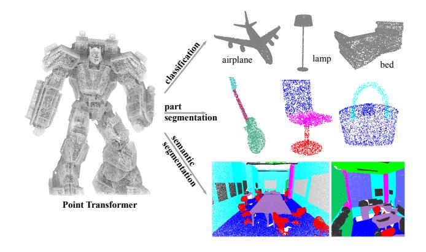
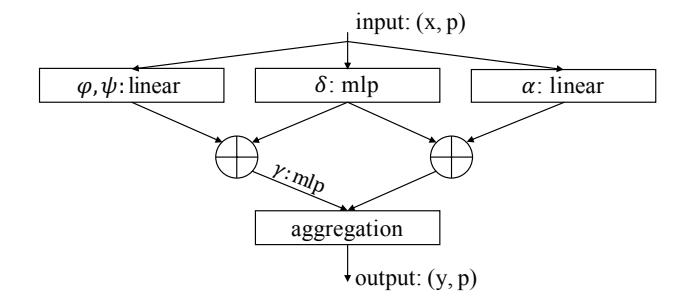
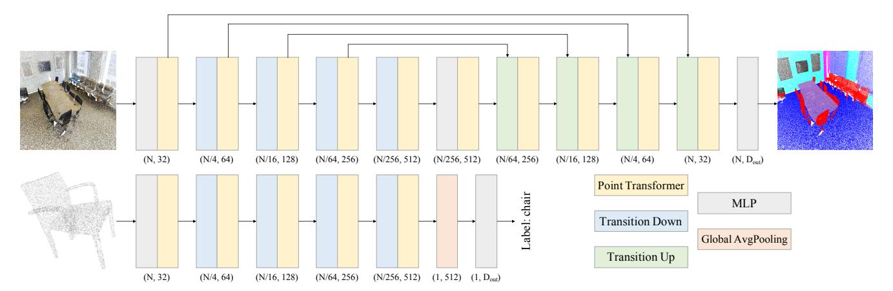
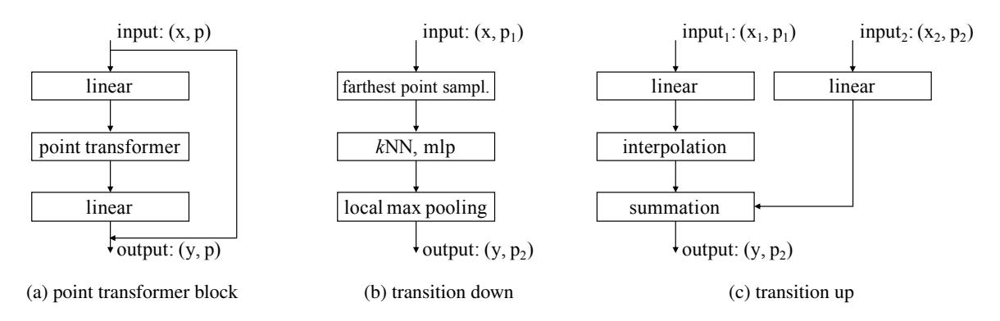
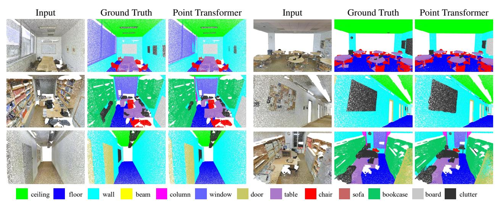
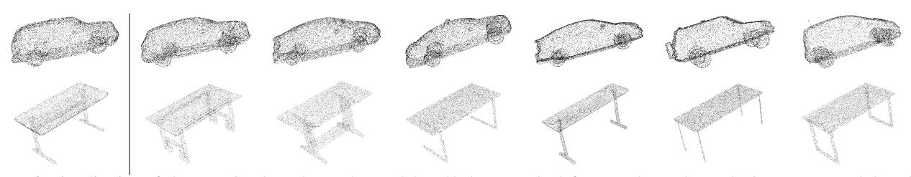
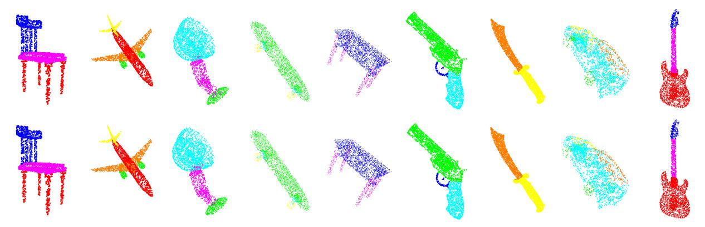

## **Point Transformer**

Hengshuang Zhao1,2 Li Jiang3 Jiaya Jia3 Philip Torr1 Vladlen Koltun4

1University of Oxford 2The University of Hong Kong

3The Chinese University of Hong Kong 4Intel Labs

## **Abstract**

Self-attention networks have revolutionized natural language processing and are making impressive strides in image analysis tasks such as image classification and object detection. Inspired by this success, we investigate the application of self-attention networks to 3D point cloud processing. We design self-attention layers for point clouds and use these to construct self-attention networks for tasks such as semantic scene segmentation, object part segmentation, and object classification. Our Point Transformer design improves upon prior work across domains and tasks. For example, on the challenging S3DIS dataset for large-scale semantic scene segmentation, the Point Transformer attains an mIoU of 70.4% on Area 5, outperforming the strongest prior model by 3.3 absolute percentage points and crossing the 70% mIoU threshold for the first time.

## 1. Introduction

3D data arises in many application areas such as autonomous driving, augmented reality, and robotics. Unlike images, which are arranged on regular pixel grids, 3D point clouds are sets embedded in continuous space. This makes 3D point clouds structurally different from images and precludes immediate application of deep network designs that have become standard in computer vision, such as networks based on the discrete convolution operator.

A variety of approaches to deep learning on 3D point clouds have arisen in response to this challenge. Some voxelize the 3D space to enable the application of 3D discrete convolutions [23, 32]. This induces massive computational and memory costs and underutilizes the sparsity of point sets in 3D. Sparse convolutional networks relieve these limitations by operating only on voxels that are not empty [9, 3]. Other designs operate directly on points and propagate information via pooling operators [25, 27] or continuous convolutions [42, 37]. Another family of approaches connect the point set into a graph for message passing [44, 19].

In this work, we develop an approach to deep learning on point clouds that is inspired by the success of transformers

Figure 1. The Point Transformer can serve as the backbone for various 3D point cloud understanding tasks such as object classification, object part segmentation, and semantic scene segmentation.

in natural language processing [39, 45, 5, 4, 51] and image analysis [10, 28, 54]. The transformer family of models is particularly appropriate for point cloud processing because the self-attention operator, which is at the core of transformer networks, is in essence a set operator: it is invariant to permutation and cardinality of the input elements. The application of self-attention to 3D point clouds is therefore quite natural, since point clouds are essentially sets embedded in 3D space.

We flesh out this intuition and develop a self-attention layer for 3D point cloud processing. Based on this layer, we construct Point Transformer networks for a variety of 3D understanding tasks. We investigate the form of the self-attention operator, the application of self-attention to local neighborhoods around each point, and the encoding of positional information in the network. The resulting networks are based purely on self-attention and pointwise operations.

We show that Point Transformers are remarkably effective in 3D deep learning tasks, both at the level of detailed object analysis and large-scale parsing of massive scenes. In particular, Point Transformers set the new state of the art on large-scale semantic segmentation on the S3DIS dataset (70.4% mIoU on Area 5), shape classification on Model-Net40 (93.7% overall accuracy), and object part segmenta-

tion on ShapeNetPart (86.6% instance mIoU). Our full implementation and trained models will be released upon acceptance. In summary, our main contributions include the following.

- We design a highly expressive Point Transformer layer for point cloud processing. The layer is invariant to permutation and cardinality and is thus inherently suited to point cloud processing.
- Based on the Point Transformer layer, we construct high-performing Point Transformer networks for classification and dense prediction on point clouds. These networks can serve as general backbones for 3D scene understanding.
- We report extensive experiments over multiple domains and datasets. We conduct controlled studies to examine specific choices in the Point Transformer design and set the new state of the art on multiple highly competitive benchmarks, outperforming long lines of prior work.

#### 2. Related Work

For 2D image understanding, pixels are placed in regular grids and can be processed with classical convolution. In contrast, 3D point clouds are unordered and scattered in 3D space: they are essentially sets. Learning-based approaches to processing 3D point clouds can be classified into the following types: projection-based, voxel-based, and point-based networks.

Projection-based networks. For processing irregular inputs like point clouds, an intuitive way is to transform irregular representations to regular ones. Considering the success of 2D CNNs, some approaches [34, 18, 2, 14, 16] adopt multi-view projection, where 3D point clouds are projected into various image planes. Then 2D CNNs are used to extract feature representations in these image planes, followed by multi-view feature fusion to form the final output representations. In a related approach, TangentConv [35] projects local surface geometry onto a tangent plane at every point, forming tangent images that can be processed by 2D convolution. However, this approach heavily relies on tangent estimation. In projection-based frameworks, the geometric information inside point clouds is collapsed during the projection stage. These approaches may also underutilize the sparsity of point clouds when forming dense pixel grids on projection planes. The choice of projection planes may heavily influence recognition performance and occlusion in 3D may impede accuracy.

**Voxel-based networks.** An alternative approach to transforming irregular point clouds to regular representations is 3D voxelization [23, 32], followed by convolutions in 3D. When applied naively, this strategy can incur massive com-

putation and memory costs due to the cubic growth in the number of voxels as a function of resolution. The solution is to take advantage of sparsity, as most voxels are usually unoccupied. For example, OctNet [29] uses unbalanced octrees with hierarchical partitions. Approaches based on sparse convolutions, where the convolution kernel is only evaluated at occupied voxels, can further reduce computation and memory requirements [9, 3]. These methods have demonstrated good accuracy but may still lose geometric detail due to quantization onto the voxel grid.

**Point-based networks.** Rather than projecting or quantizing irregular point clouds onto regular grids in 2D or 3D, researchers have designed deep network structures that ingest point clouds directly, as sets embedded in continuous space. PointNet [25] utilizes permutation-invariant operators such as pointwise MLPs and pooling layers to aggregate features across a set. PointNet++ [27] applies these ideas within a hierarchical spatial structure to increase sensitivity to local geometric layout. Such models can benefit from efficient sampling of the point set, and a variety of sampling strategies have been developed [27, 7, 46, 50, 11].

A number of approaches connect the point set into a graph and conduct message passing on this graph. DGCNN [44] performs graph convolutions on kNN graphs. PointWeb [55] densely connects local neightborhoods. ECC [31] uses dynamic edge-conditioned filters where convolution kernels are generated based on edges inside point clouds. SPG [15] operates on a superpoint graph that represents contextual relationships. KCNet [30] utilizes kernel correlation and graph pooling. Wang et al. [40] investigate the local spectral graph convolution. GACNet [41] employs graph attention convolution and HPEIN [13] builds a hierarchical point-edge interaction architecture. DeepGCNs [19] explore the advantages of depth in graph convolutional networks for 3D scene understanding.

A number of methods are based on continuous convolutions that apply directly to the 3D point set, with no quantization. PCCN [42] represents convolutional kernels as MLPs. SpiderCNN [49] defines kernel weights as a family of polynomial functions. Spherical CNN [8] designs spherical convolution to address the problem of 3D rotation equivariance. PointConv [46] and KPConv [37] construct convolution weights based on the input coordinates. InterpCNN [22] utilizes coordinates to interpolate pointwise kernel weights. PointCNN [20] proposes to reorder the input unordered point clouds with special operators. Ummenhofer et al. [38] apply continuous convolutions to learn particle-based fluid dynamics.

**Transformer and self-attention.** Transformer and self-attention models have revolutionized machine translation and natural language processing [39, 45, 5, 4, 51]. This has inspired the development of self-attention networks for 2D image recognition [10, 28, 54, 6]. Hu et al. [10] and

Ramachandran et al. [28] apply scalar dot-product self-attention within local image patches. Zhao et al. [54] develop a family of vector self-attention operators. Dosovit-skiy et al. [6] treat images as sequences of patches.

Our work is inspired by the findings that transformers and self-attention networks can match or even outperform convolutional networks on sequences and 2D images. Self-attention is of particular interest in our setting because it is intrinsically a set operator: positional information is provided as attributes of elements that are processed as a set [39, 54]. Since 3D point clouds are essentially sets of points with positional attributes, the self-attention mechanism seems particularly suitable to this type of data. We thus develop a Point Transformer layer that applies self-attention to 3D point clouds.

There are a number of previous works [48, 21, 50, 17] that utilize attention for point cloud analysis. They apply global attention on the whole point cloud, which introduces heavy computation and renders these approaches inapplicable to large-scale 3D scene understanding. They also utilize scalar dot-product attention, where different channels share the same aggregation weights. In contrast, we apply selfattention locally, which enables scalability to large scenes with millions of points, and we utilize vector attention, which we show to be important for achieving high accuracy. We also demonstrate the importance of appropriate position encoding in large-scale point cloud understanding, in contrast to prior approaches that omitted position information. Overall, we show that appropriately designed self-attention networks can scale to large and complex 3D scenes, and substantially advance the state of the art in large-scale point cloud understanding.

#### 3. Point Transformer

We begin by briefly revisiting the general formulation of transformers and self-attention operators. Then we present the point transformer layer for 3D point cloud processing. Lastly, we present our network architecture for 3D scene understanding.

# 3.1. Background

Transformers and self-attention networks have revolutionized natural language processing [39, 45, 5, 4, 51] and have demonstrated impressive results in 2D image analysis [10, 28, 54, 6]. Self-attention operators can be classified into two types: scalar attention [39] and vector attention [54].

Let  $\mathcal{X} = \{\mathbf{x}_i\}_i$  be a set of feature vectors. The standard scalar dot-product attention layer can be represented as follows:

$$\mathbf{y}_i = \sum_{\mathbf{x}_j \in \mathcal{X}} \rho \left( \varphi(\mathbf{x}_i)^\top \psi(\mathbf{x}_j) + \delta \right) \alpha(\mathbf{x}_j), \tag{1}$$

where  $\mathbf{y}_i$  is the output feature.  $\varphi$ ,  $\psi$ , and  $\alpha$  are pointwise feature transformations, such as linear projections or MLPs.  $\delta$  is a position encoding function and  $\rho$  is a normalization function such as *softmax*. The scalar attention layer computes the scalar product between features transformed by  $\varphi$  and  $\psi$  and uses the output as an attention weight for aggregating features transformed by  $\alpha$ .

In vector attention, the computation of attention weights is different. In particular, attention weights are *vectors* that can modulate individual feature channels:

$$\mathbf{y}_i = \sum_{\mathbf{x}_j \in \mathcal{X}} \rho \left( \gamma(\beta(\varphi(\mathbf{x}_i), \psi(\mathbf{x}_j)) + \delta) \right) \odot \alpha(\mathbf{x}_j), \quad (2)$$

where  $\beta$  is a relation function (e.g., subtraction) and  $\gamma$  is a mapping function (e.g., an MLP) that produces attention vectors for feature aggregation.

Both scalar and vector self-attention are set operators. The set can be a collection of feature vectors that represent the entire signal (e.g., sentence or image) [39, 6] or a collection of feature vectors from a local patch within the signal (e.g., an image patch) [10, 28, 54].

## 3.2. Point Transformer Layer

Self-attention is a natural fit for point clouds because point clouds are essentially sets embedded irregularly in a metric space. Our point transformer layer is based on vector self-attention. We use the subtraction relation and add a position encoding  $\delta$  to both the attention vector  $\gamma$  and the transformed features  $\alpha$ :

$$\mathbf{y}_{i} = \sum_{\mathbf{x}_{j} \in \mathcal{X}(i)} \rho \left( \gamma(\varphi(\mathbf{x}_{i}) - \psi(\mathbf{x}_{j}) + \delta) \right) \odot \left( \alpha(\mathbf{x}_{j}) + \delta \right)$$
(3)

Here the subset  $\mathcal{X}(i) \subseteq \mathcal{X}$  is a set of points in a local neighborhood (specifically, k nearest neighbors) of  $\mathbf{x}_i$ . Thus we adopt the practice of recent self-attention networks for image analysis in applying self-attention locally, within a local neighborhood around each datapoint [10, 28, 54]. The mapping function  $\gamma$  is an MLP with two linear layers and one ReLU nonlinearity. The point transformer layer is illustrated in Figure 2.

Figure 2. Point transformer layer.

Figure 3. Point transformer networks for semantic segmentation (top) and classification (bottom).

Figure 4. Detailed structure design for each module.

## 3.3. Position Encoding

Position encoding plays an important role in self-attention, allowing the operator to adapt to local structure in the data [39]. Standard position encoding schemes for sequences and image grids are crafted manually, for example based on sine and cosine functions or normalized range values [39, 54]. In 3D point cloud processing, the 3D point coordinates themselves are a natural candidate for position encoding. We go beyond this by introducing trainable, parameterized position encoding. Our position encoding function  $\delta$  is defined as follows:

$$\delta = \theta(\mathbf{p}_i - \mathbf{p}_j). \tag{4}$$

Here  $\mathbf{p}_i$  and  $\mathbf{p}_j$  are the 3D point coordinates for points i and j. The encoding function  $\theta$  is an MLP with two linear layers and one ReLU nonlinearity. Notably, we found that position encoding is important for both the attention generation branch and the feature transformation branch. Thus Eq. 3 adds the trainable position encoding in both branches. The position encoding  $\theta$  is trained end-to-end with the other subnetworks.

#### 3.4. Point Transformer Block

We construct a residual point transformer block with the point transformer layer at its core, as shown in Figure 4(a). The transformer block integrates the self-attention layer, linear projections that can reduce dimensionality and accelerate processing, and a residual connection. The input is a set of feature vectors  $\mathbf{x}$  with associated 3D coordinates  $\mathbf{p}$ . The point transformer block facilitates information exchange between these localized feature vectors, producing new feature vectors for all data points as its output. The information aggregation adapts both to the content of the feature vectors and their layout in 3D.

#### 3.5. Network Architecture

We construct complete 3D point cloud understanding networks based on the point transformer block. Note that the point transformer is the primary feature aggregation operator throughout the network. We do not use convolutions for preprocessing or auxiliary branches: the network is based entirely on point transformer layers, pointwise transformations, and pooling. The network architectures are visualized in Figure 3.

**Backbone structure.** The feature encoder in point transformer networks for semantic segmentation and classification has five stages that operate on progressively downsampled point sets. The downsampling rates for the stages are [1, 4, 4, 4, 4], thus the cardinality of the point set produced by each stage is [N, N/4, N/16, N/64, N/256], where N is the number of input points. Note that the number of stages and the downsampling rates can be varied depending on the application, for example to construct light-weight backbones for fast processing. Consecutive stages are connected by transition modules: transition down for feature encoding and transition up for feature decoding.

Transition down. A key function of the transition down module is to reduce the cardinality of the point set as required, for example from N to N/4 in the transition from the first to the second stage. Denote the point set provided as input to the transition down module as  $\mathcal{P}_1$  and denote the output point set as  $\mathcal{P}_2$ . We perform farthest point sampling [27] in  $\mathcal{P}_1$  to identify a well-spread subset  $\mathcal{P}_2 \subset \mathcal{P}_1$ with the requisite cardinality. To pool feature vectors from  $\mathcal{P}_1$  onto  $\mathcal{P}_2$ , we use a kNN graph on  $\mathcal{P}_1$ . (This is the same k as in Section 3.2. We use k = 16 throughout and report a controlled study of this hyperparameter in Section 4.4.) Each input feature goes through a linear transformation, followed by batch normalization and ReLU, followed by max pooling onto each point in  $\mathcal{P}_2$  from its k neighbors in  $\mathcal{P}_1$ . The transition down module is schematically illustrated in Figure 4(b).

**Transition up.** For dense prediction tasks such as semantic segmentation, we adopt a U-net design in which the encoder described above is coupled with a symmetric decoder [27, 3]. Consecutive stages in the decoder are connected by transition up modules. Their primary function is to map features from the downsampled input point set  $\mathcal{P}_2$  onto its superset  $\mathcal{P}_1 \supset \mathcal{P}_2$ . To this end, each input point feature is processed by a linear layer, followed by batch normalization and ReLU, and then the features are mapped onto the higher-resolution point set  $\mathcal{P}_1$  via trilinear interpolation. These interpolated features from the preceding decoder stage are summarized with the features from the corresponding encoder stage, provided via a skip connection. The structure of the transition up module is illustrated in Figure 4(c).

**Output head.** For semantic segmentation, the final decoder stage produces a feature vector for each point in the input point set. We apply an MLP to map this feature to the final logits. For classification, we perform global average pooling over the pointwise features to get a global feature vector for the whole point set. This global feature is passed through an MLP to get the global classification logits.

## 4. Experiments

We evaluate the effectiveness of the presented Point Transformer design on a number of domains and tasks. For 3D semantic segmentation, we use the challenging Stanford Large-Scale 3D Indoor Spaces (S3DIS) dataset [1]. For 3D shape classification, we use the widely adopted ModelNet40 dataset [47]. And for object part segmentation, we use ShapeNetPart [52].

Implementation details. We implement the Point Transformer in PyTorch [24]. We use the SGD optimizer with momentum and weight decay set to 0.9 and 0.0001, respectively. For semantic segmentation on S3DIS, we train for 40K iterations with initial learning rate 0.5, dropped by 10x at steps 24K and 32K. For 3D shape classification on ModelNet40 and 3D object part segmentation on ShapeNetPart, we train for 200 epochs. The initial learning rate is set to 0.05 and is dropped by 10x at epochs 120 and 160.

## 4.1. Semantic Segmentation

**Data and metric.** The S3DIS [1] dataset for semantic scene parsing consists of 271 rooms in six areas from three different buildings. Each point in the scan is assigned a semantic label from 13 categories (ceiling, floor, table, etc.). Following a common protocol [36, 27], we evaluate the presented approach in two modes: (a) Area 5 is withheld during training and is used for testing, and (b) 6-fold cross-validation. For evaluation metrics, we use mean classwise intersection over union (mIoU), mean of classwise accuracy (mAcc), and overall pointwise accuracy (OA).

**Performance comparison.** The results are presented in Tables 1 and 2. The Point Transformer outperforms all prior models according to all metrics in both evaluation modes. On Area 5, the Point Transformer attains mIoU/mAcc/OA of 70.4%/76.5%/90.8%, outperforming all prior work by multiple percentage points in each metric. The Point Transformer is the first model to pass the 70% mIoU bar, outperforming the prior state of the art by 3.3 absolute percentage points in mIoU. The Point Transformer outperforms MLPs-based frameworks such as PointNet [25], voxelbased architectures such as SegCloud [36], graph-based methods such as SPGraph [15], attention-based methods such as PAT [50], sparse convolutional networks such as MinkowskiNet [3], and continuous convolutional networks such as KPConv [37]. Point Transformer also substantially outperforms all prior models under 6-fold cross-validation. The mIoU in this mode is 73.5%, outperforming the prior state of the art (KPConv) by 2.9 absolute percentage points. The number of parameters in Point Transformer (4.9M) is much smaller than in current high-performing architectures such as KPConv (14.9M) and SparseConv (30.1M).

**Visualization.** Figure 5 shows the Point Transformer's predictions. We can see that the predictions are very close to

| Method            | OA   | mAcc | mIoU | ceiling | floor | wall | beam | column | window | door | table | chair | sofa | bookcase | board | clutter |
|-------------------|------|------|------|---------|-------|------|------|--------|--------|------|-------|-------|------|----------|-------|---------|
| PointNet [25]     | -    | 49.0 | 41.1 | 88.8    | 97.3  | 69.8 | 0.1  | 3.9    | 46.3   | 10.8 | 59.0  | 52.6  | 5.9  | 40.3     | 26.4  | 33.2    |
| SegCloud [36]     | -    | 57.4 | 48.9 | 90.1    | 96.1  | 69.9 | 0.0  | 18.4   | 38.4   | 23.1 | 70.4  | 75.9  | 40.9 | 58.4     | 13.0  | 41.6    |
| TangentConv [35]  | -    | 62.2 | 52.6 | 90.5    | 97.7  | 74.0 | 0.0  | 20.7   | 39.0   | 31.3 | 77.5  | 69.4  | 57.3 | 38.5     | 48.8  | 39.8    |
| PointCNN [20]     | 85.9 | 63.9 | 57.3 | 92.3    | 98.2  | 79.4 | 0.0  | 17.6   | 22.8   | 62.1 | 74.4  | 80.6  | 31.7 | 66.7     | 62.1  | 56.7    |
| SPGraph [15]      | 86.4 | 66.5 | 58.0 | 89.4    | 96.9  | 78.1 | 0.0  | 42.8   | 48.9   | 61.6 | 84.7  | 75.4  | 69.8 | 52.6     | 2.1   | 52.2    |
| PCCN [42]         | -    | 67.0 | 58.3 | 92.3    | 96.2  | 75.9 | 0.3  | 6.0    | 69.5   | 63.5 | 66.9  | 65.6  | 47.3 | 68.9     | 59.1  | 46.2    |
| PAT [50]          | -    | 70.8 | 60.1 | 93.0    | 98.5  | 72.3 | 1.0  | 41.5   | 85.1   | 38.2 | 57.7  | 83.6  | 48.1 | 67.0     | 61.3  | 33.6    |
| PointWeb [55]     | 87.0 | 66.6 | 60.3 | 92.0    | 98.5  | 79.4 | 0.0  | 21.1   | 59.7   | 34.8 | 76.3  | 88.3  | 46.9 | 69.3     | 64.9  | 52.5    |
| HPEIN [13]        | 87.2 | 68.3 | 61.9 | 91.5    | 98.2  | 81.4 | 0.0  | 23.3   | 65.3   | 40.0 | 75.5  | 87.7  | 58.5 | 67.8     | 65.6  | 49.4    |
| MinkowskiNet [37] | -    | 71.7 | 65.4 | 91.8    | 98.7  | 86.2 | 0.0  | 34.1   | 48.9   | 62.4 | 81.6  | 89.8  | 47.2 | 74.9     | 74.4  | 58.6    |
| KPConv [37]       | -    | 72.8 | 67.1 | 92.8    | 97.3  | 82.4 | 0.0  | 23.9   | 58.0   | 69.0 | 81.5  | 91.0  | 75.4 | 75.3     | 66.7  | 58.9    |
| PointTransformer  | 90.8 | 76.5 | 70.4 | 94.0    | 98.5  | 86.3 | 0.0  | 38.0   | 63.4   | 74.3 | 89.1  | 82.4  | 74.3 | 80.2     | 76.0  | 59.3    |

Table 1. Semantic segmentation results on the S3DIS dataset, evaluated on Area 5.

| Method           | OA   | mAcc | mIoU |
|------------------|------|------|------|
| PointNet [25]    | 78.5 | 66.2 | 47.6 |
| RSNet [12]       | _    | 66.5 | 56.5 |
| SPGraph [15]     | 85.5 | 73.0 | 62.1 |
| PAT [50]         | _    | 76.5 | 64.3 |
| PointCNN [20]    | 88.1 | 75.6 | 65.4 |
| PointWeb [55]    | 87.3 | 76.2 | 66.7 |
| ShellNet [53]    | 87.1 | _    | 66.8 |
| RandLA-Net [37]  | 88.0 | 82.0 | 70.0 |
| KPConv [37]      | _    | 79.1 | 70.6 |
| PointTransformer | 90.2 | 81.9 | 73.5 |

Table 2. Semantic segmentation results on the S3DIS dataset, evaluated with 6-fold cross-validation.

the ground truth. Point Transformer captures detailed semantic structure in complex 3D scenes, such as the legs of chairs, the outlines of poster boards, and the trim around doorways.

| Method               | input | mAcc | OA   |
|----------------------|-------|------|------|
| 3DShapeNets [47]     | voxel | 77.3 | 84.7 |
| VoxNet [23]          | voxel | 83.0 | 85.9 |
| Subvolume [26]       | voxel | 86.0 | 89.2 |
| MVCNN [34]           | image | _    | 90.1 |
| PointNet [25]        | point | 86.2 | 89.2 |
| A-SCN [48]           | point | 87.6 | 90.0 |
| Set Transformer [17] | point | _    | 90.4 |
| PAT [50]             | point | _    | 91.7 |
| PointNet++ [27]      | point | _    | 91.9 |
| SpecGCN [40]         | point | _    | 92.1 |
| PointCNN [20]        | point | 88.1 | 92.2 |
| DGCNN [44]           | point | 90.2 | 92.2 |
| PointWeb [55]        | point | 89.4 | 92.3 |
| SpiderCNN [49]       | point | _    | 92.4 |
| PointConv [46]       | point | _    | 92.5 |
| Point2Sequence [21]  | point | 90.4 | 92.6 |
| KPConv [37]          | point | _    | 92.9 |
| InterpCNN [22]       | point | _    | 93.0 |
| PointTransformer     | point | 90.6 | 93.7 |
|                      |       |      |      |

Table 3. Shape classification results on the ModelNet40 dataset.

## 4.2. Shape Classification

**Data and metric.** The ModelNet40 [47] dataset contains 12,311 CAD models with 40 object categories. They are split into 9,843 models for training and 2,468 for testing. We follow the data preparation procedure of Qi et al. [27] and uniformly sample the points from each CAD model together with the normal vectors from the object meshes. For evaluation metrics, we use the mean accuracy within each category (mAcc) and the overall accuracy (OA) over all classes.

**Performance comparison.** The results are presented in Table 3. The Point Transformer sets the new state of the art in both metrics. The overall accuracy of Point Transformer on ModelNet40 is 93.7%. It outperforms strong graph-based models such as DGCNN [44], attention-based models such as A-SCN [48] and Point2Sequence [21], and strong point-based models such as KPConv [37].

**Visualization.** To probe the representation learned by the Point Transformer, we conduct shape retrieval by retrieving nearest neighbors in the space of the output features produced by the Point Transformer Some results are shown in Figure 6. The retrieved shapes are very similar to the query, and when they differ, they differ along aspects that we perceive as less semantically salient, such as legs of desks.

#### 4.3. Object Part Segmentation

**Data and metric.** The ShapeNetPart dataset [52] is annotated for 3D object part segmentation. It consists of 16,880 models from 16 shape categories, with 14,006 3D models for training and 2,874 for testing. The number of parts for each category is between 2 and 6, with 50 different parts in total. We use the sampled point sets produced by Qi et al. [27] for a fair comparison with prior work. For evaluation metrics, we report category mIoU and instance mIoU.

**Performance comparison.** The results are presented in Table 4. The Point Transformer outperforms all prior models as measured by instance mIoU. (Note that we did not use loss-balancing during training, which can boost category mIoU.)

| Method              | cat. mIoU | ins. mIoU |
|---------------------|-----------|-----------|
| PointNet [25]       | 80.4      | 83.7      |
| A-SCN [48]          | _         | 84.6      |
| PCNN [42]           | 81.8      | 85.1      |
| PointNet++ [27]     | 81.9      | 85.1      |
| DGCNN [44]          | 82.3      | 85.1      |
| Point2Sequence [21] | _         | 85.2      |
| SpiderCNN [49]      | 81.7      | 85.3      |
| SPLATNet [33]       | 83.7      | 85.4      |
| PointConv [46]      | 82.8      | 85.7      |
| SGPN [43]           | 82.8      | 85.8      |
| PointCNN [20]       | 84.6      | 86.1      |
| InterpCNN [22]      | 84.0      | 86.3      |
| KPConv [37]         | 85.1      | 86.4      |
| PointTransformer    | 83.7      | 86.6      |

Table 4. Object part segmentation results on the ShapeNetPart dataset.

| k  | mIoU | mAcc | OA   |
|----|------|------|------|
| 4  | 59.6 | 66.0 | 86.0 |
| 8  | 67.7 | 73.8 | 89.9 |
| 16 | 70.4 | 76.5 | 90.8 |
| 32 | 68.3 | 75.0 | 89.8 |
| 64 | 67.7 | 74.1 | 89.9 |

Table 5. Ablation study: number of neighbors k in the definition of local neighborhoods.

| Pos. encoding          | mIoU | mAcc        | OA   |
|------------------------|------|-------------|------|
| none                   | 64.6 | 71.9        | 88.2 |
| absolute               | 66.5 | 73.2        | 88.9 |
| relative               | 70.4 | <b>76.5</b> | 90.8 |
| relative for attention | 67.0 | 73.0        | 89.3 |
| relative for feature   | 68.7 | 74.4        | 90.4 |

Table 6. Ablation study: position encoding.

| Operator         | mIoU | mAcc        | OA   |
|------------------|------|-------------|------|
| MLP              | 61.7 | 68.6        | 87.1 |
| MLP+pooling      | 63.7 | 71.0        | 87.8 |
| scalar attention | 64.6 | 71.9        | 88.4 |
| vector attention | 70.4 | <b>76.5</b> | 90.8 |

Table 7. Ablation study: form of self-attention operator.

**Visualization.** Object part segmentation results on a number of models are shown in Figure 7. The Point Transformer's part segmentation predictions are clean and close to the ground truth.

## 4.4. Ablation Study

We now conduct a number of controlled experiments that examine specific decisions in the Point Transformer design. These studies are performed on the semantic segmentation task on the S3DIS dataset, tested on Area 5.

**Number of neighbors.** We first investigate the setting of the number of neighbors k, which is used in determining the local neighborhood around each point. The results are shown in Table 5. The best performance is achieved when k is set to 16. When the neighborhood is smaller (k=4 or k=8), the model may not have sufficient context for its predictions. When the neighborhood is larger (k=32 or k=64), each self-attention layer is provided with a large number of datapoints, many of which may be farther and less relevant. This may introduce excessive noise into the processing, lowering the model's accuracy.

**Softmax regularization.** We conduct an ablation study on the normalization function  $\rho$  in Eq. 3. The performance without softmax regularization on S3DIS Area5 is 66.5%/72.8%/89.3%, in terms of mIoU/mAcc/OA. It is much lower than the performance with softmax regularization (70.4%/76.5%90.8%). This suggests that the normalization is essential in this setting.

**Position encoding.** We now study the choice of the position encoding  $\delta$ . The results are shown in Table 6. We can see that without position encoding, the performance drops significantly. With absolute position encoding, the performance is higher than without. Relative position encoding yields the highest performance. When relative position encoding is added only to the attention generation branch (first term in Eq. 3) or only to the feature transformation branch (second term in Eq. 3), the performance drops again, indicating that adding the relative position encoding to both branches is important.

Attention type. Finally, we investigate the type of selfattention used in the point transformer layer. The results are shown in Table 7. We examine four conditions. 'MLP' is a no-attention baseline that replaces the point transformer layer in the point transformer block with a pointwise MLP. 'MLP+pooling' is a more advanced no-attention baseline that replaces the point transformer layer with a pointwise MLP followed by max pooling within each kNN neighborhood: this performs feature transformation at each point and enables each point to exchange information with its local neighborhood, but does not leverage attention mechanisms. 'scalar attention' replaces the vector attention used in Eq. 3 by scalar attention, as in Eq. 1 and in the original transformer design [39]. 'vector attention' is the formulation we use, presented in Eq. 3. We can see that scalar attention is more expressive than the no-attention baselines, but is in turn outperformed by vector attention. The performance gap between vector and scalar attention is significant: 70.4% vs. 64.6%, an improvement of 5.8 absolute percentage points. Vector attention is more expressive since it supports adaptive modulation of individual feature channels, not just whole feature vectors. This expressivity appears to be very beneficial in 3D data processing.

Figure 5. Visualization of semantic segmentation results on the S3DIS dataset.

Figure 6. Visualization of shape retrieval results on the ModelNet40 dataset. The leftmost column shows the input query and the other columns show the retrieved models.

Figure 7. Visualization of object part segmentation results on the ShapeNetPart dataset. The ground truth is in the top row, Point Transformer predictions on the bottom.

## 5. Conclusion

Transformers have revolutionized natural language processing and are making impressive gains in 2D image analysis. Inspired by this progress, we have developed a transformer architecture for 3D point clouds. Transformers are perhaps an even more natural fit for point cloud processing than they are for language or image processing, because point clouds are essentially sets embedded in a metric space, and the self-attention operator at the core of trans-

former networks is fundamentally a set operator. We have shown that beyond this conceptual compatibility, transformers are remarkably effective in point cloud processing, outperforming state-of-the-art designs from a variety of families: graph-based models, sparse convolutional networks, continuous convolutional networks, and others. We hope that our work will inspire further investigation of the properties of point transformers, the development of new operators and network designs, and the application of transformers to other tasks, such as 3D object detection.

## References

- Iro Armeni, Ozan Sener, Amir R. Zamir, Helen Jiang, Ioannis Brilakis, Martin Fischer, and Silvio Savarese. 3D semantic parsing of large-scale indoor spaces. In CVPR, 2016.
- [2] Xiaozhi Chen, Huimin Ma, Ji Wan, Bo Li, and Tian Xia. Multi-view 3d object detection network for autonomous driving. In CVPR, 2017.
- [3] Christopher Choy, Jun Young Gwak, and Silvio Savarese. 4d spatio-temporal convnets: Minkowski convolutional neural networks. In CVPR, 2019. 1, 2, 5
- [4] Zihang Dai, Zhilin Yang, Yiming Yang, Jaime Carbonell, Quoc V. Le, and Ruslan Salakhutdinov. Transformer-XL: Attentive language models beyond a fixed-length context. In ACL, 2019. 1, 2, 3
- [5] Jacob Devlin, Ming-Wei Chang, Kenton Lee, and Kristina Toutanova. BERT: Pre-training of deep bidirectional transformers for language understanding. In *NAACL-HLT*, 2019. 1, 2, 3
- [6] Alexey Dosovitskiy, Lucas Beyer, Alexander Kolesnikov, Dirk Weissenborn, Xiaohua Zhai, Thomas Unterthiner, Mostafa Dehghani, Matthias Minderer, Georg Heigold, Sylvain Gelly, et al. An image is worth 16x16 words: Transformers for image recognition at scale. ICLR, 2021. 2, 3
- [7] Oren Dovrat, Itai Lang, and Shai Avidan. Learning to sample. In CVPR, 2019.
- [8] Carlos Esteves, Christine Allen-Blanchette, Ameesh Makadia, and Kostas Daniilidis. Learning so (3) equivariant representations with spherical cnns. In ECCV, 2018. 2
- [9] Benjamin Graham, Martin Engelcke, and Laurens Van Der Maaten. 3d semantic segmentation with submanifold sparse convolutional networks. In CVPR, 2018. 1, 2
- [10] Han Hu, Zheng Zhang, Zhenda Xie, and Stephen Lin. Local relation networks for image recognition. In *ICCV*, 2019. 1, 2, 3
- [11] Qingyong Hu, Bo Yang, Linhai Xie, Stefano Rosa, Yulan Guo, Zhihua Wang, Niki Trigoni, and Andrew Markham. Randla-net: Efficient semantic segmentation of large-scale point clouds. In CVPR, 2020. 2
- [12] Qiangui Huang, Weiyue Wang, and Ulrich Neumann. Recurrent slice networks for 3d segmentation of point clouds. In CVPR, 2018. 6
- [13] Li Jiang, Hengshuang Zhao, Shu Liu, Xiaoyong Shen, Chi-Wing Fu, and Jiaya Jia. Hierarchical point-edge interaction network for point cloud semantic segmentation. In *ICCV*, 2019. 2, 6
- [14] Asako Kanezaki, Yasuyuki Matsushita, and Yoshifumi Nishida. Rotationnet: Joint object categorization and pose estimation using multiviews from unsupervised viewpoints. In CVPR, 2018. 2
- [15] Loic Landrieu and Martin Simonovsky. Large-scale point cloud semantic segmentation with superpoint graphs. In CVPR, 2018. 2, 5, 6
- [16] Alex H Lang, Sourabh Vora, Holger Caesar, Lubing Zhou, Jiong Yang, and Oscar Beijbom. Pointpillars: Fast encoders for object detection from point clouds. In *CVPR*, 2019. 2

- [17] Juho Lee, Yoonho Lee, Jungtaek Kim, Adam Kosiorek, Seungjin Choi, and Yee Whye Teh. Set transformer: A framework for attention-based permutation-invariant neural networks. In *ICML*, 2019. 3, 6
- [18] Bo Li, Tianlei Zhang, and Tian Xia. Vehicle detection from 3d lidar using fully convolutional network. In RSS, 2016. 2
- [19] Guohao Li, Matthias Muller, Ali Thabet, and Bernard Ghanem. Deepgcns: Can gcns go as deep as cnns? In *ICCV*, 2019. 1, 2
- [20] Yangyan Li, Rui Bu, Mingchao Sun, Wei Wu, Xinhan Di, and Baoquan Chen. Pointenn: Convolution on X-transformed points. In NIPS, 2018. 2, 6, 7
- [21] Xinhai Liu, Zhizhong Han, Yu-Shen Liu, and Matthias Zwicker. Point2sequence: Learning the shape representation of 3d point clouds with an attention-based sequence to sequence network. In AAAI, 2019. 3, 6, 7
- [22] Jiageng Mao, Xiaogang Wang, and Hongsheng Li. Interpolated convolutional networks for 3d point cloud understanding. In *ICCV*, 2019. 2, 6, 7
- [23] Daniel Maturana and Sebastian Scherer. Voxnet: A 3d convolutional neural network for real-time object recognition. In *IROS*, 2015. 1, 2, 6
- [24] Adam Paszke, Sam Gross, Francisco Massa, Adam Lerer, James Bradbury, Gregory Chanan, Trevor Killeen, Zeming Lin, Natalia Gimelshein, Luca Antiga, et al. PyTorch: An imperative style, high-performance deep learning library. In NIPS, 2019. 5
- [25] Charles Ruizhongtai Qi, Hao Su, Kaichun Mo, and Leonidas J. Guibas. Pointnet: Deep learning on point sets for 3d classification and segmentation. In CVPR, 2017. 1, 2, 5, 6, 7
- [26] Charles Ruizhongtai Qi, Hao Su, Matthias Nießner, Angela Dai, Mengyuan Yan, and Leonidas Guibas. Volumetric and multi-view cnns for object classification on 3d data. In CVPR, 2016. 6
- [27] Charles Ruizhongtai Qi, Li Yi, Hao Su, and Leonidas J. Guibas. Pointnet++: Deep hierarchical feature learning on point sets in a metric space. In *NIPS*, 2017. 1, 2, 5, 6, 7
- [28] Prajit Ramachandran, Niki Parmar, Ashish Vaswani, Irwan Bello, Anselm Levskaya, and Jonathon Shlens. Stand-alone self-attention in vision models. In *NeurIPS*, 2019. 1, 2, 3
- [29] Gernot Riegler, Ali Osman Ulusoy, and Andreas Geiger. Octnet: Learning deep 3d representations at high resolutions. In CVPR, 2017. 2
- [30] Yiru Shen, Chen Feng, Yaoqing Yang, and Dong Tian. Mining point cloud local structures by kernel correlation and graph pooling. In *CVPR*, 2018. 2
- [31] Martin Simonovsky and Nikos Komodakis. Dynamic edgeconditioned filters in convolutional neural networks on graphs. In CVPR, 2017. 2
- [32] Shuran Song, Fisher Yu, Andy Zeng, Angel X Chang, Manolis Savva, and Thomas Funkhouser. Semantic scene completion from a single depth image. In CVPR, 2017. 1, 2
- [33] Hang Su, Varun Jampani, Deqing Sun, Subhransu Maji, Evangelos Kalogerakis, Ming-Hsuan Yang, and Jan Kautz. Splatnet: Sparse lattice networks for point cloud processing. In CVPR, 2018. 7

- [34] Hang Su, Subhransu Maji, Evangelos Kalogerakis, and Erik G. Learned-Miller. Multi-view convolutional neural networks for 3d shape recognition. In *ICCV*, 2015. 2, 6
- [35] Maxim Tatarchenko, Jaesik Park, Vladlen Koltun, and Qian-Yi Zhou. Tangent convolutions for dense prediction in 3d. In CVPR, 2018. 2, 6
- [36] Lyne P. Tchapmi, Christopher B. Choy, Iro Armeni, JunYoung Gwak, and Silvio Savarese. Segcloud: Semantic segmentation of 3d point clouds. In 3DV, 2017. 5, 6
- [37] Hugues Thomas, Charles R Qi, Jean-Emmanuel Deschaud, Beatriz Marcotegui, François Goulette, and Leonidas J Guibas. Kpconv: Flexible and deformable convolution for point clouds. In *ICCV*, 2019. 1, 2, 5, 6, 7
- [38] Benjamin Ummenhofer, Lukas Prantl, Nils Thuerey, and Vladlen Koltun. Lagrangian fluid simulation with continuous convolutions. In *ICLR*, 2020. 2
- [39] Ashish Vaswani, Noam Shazeer, Niki Parmar, Jakob Uszkoreit, Llion Jones, Aidan N Gomez, Łukasz Kaiser, and Illia Polosukhin. Attention is all you need. In NIPS, 2017. 1, 2, 3, 4, 7
- [40] Chu Wang, Babak Samari, and Kaleem Siddiqi. Local spectral graph convolution for point set feature learning. In ECCV, 2018. 2, 6
- [41] Lei Wang, Yuchun Huang, Yaolin Hou, Shenman Zhang, and Jie Shan. Graph attention convolution for point cloud semantic segmentation. In CVPR, 2019.
- [42] Shenlong Wang, Simon Suo, Wei-Chiu Ma, Andrei Pokrovsky, and Raquel Urtasun. Deep parametric continuous convolutional neural networks. In CVPR, 2018. 1, 2, 6, 7
- [43] Weiyue Wang, Ronald Yu, Qiangui Huang, and Ulrich Neumann. Sgpn: Similarity group proposal network for 3d point cloud instance segmentation. In CVPR, 2018. 7
- [44] Yue Wang, Yongbin Sun, Ziwei Liu, Sanjay E. Sarma, Michael M. Bronstein, and Justin M. Solomon. Dynamic graph cnn for learning on point clouds. *TOG*, 2019. 1, 2, 6, 7

- [45] Felix Wu, Angela Fan, Alexei Baevski, Yann N Dauphin, and Michael Auli. Pay less attention with lightweight and dynamic convolutions. In *ICLR*, 2019. 1, 2, 3
- [46] Wenxuan Wu, Zhongang Qi, and Li Fuxin. Pointconv: Deep convolutional networks on 3d point clouds. In CVPR, 2019. 2, 6, 7
- [47] Zhirong Wu, Shuran Song, Aditya Khosla, Fisher Yu, Linguang Zhang, Xiaoou Tang, and Jianxiong Xiao. 3d shapenets: A deep representation for volumetric shapes. In CVPR, 2015. 5, 6
- [48] Saining Xie, Sainan Liu, Zeyu Chen, and Zhuowen Tu. Attentional shapecontextnet for point cloud recognition. In CVPR, 2018. 3, 6, 7
- [49] Yifan Xu, Tianqi Fan, Mingye Xu, Long Zeng, and Yu Qiao. Spidercnn: Deep learning on point sets with parameterized convolutional filters. In ECCV, 2018. 2, 6, 7
- [50] Jiancheng Yang, Qiang Zhang, Bingbing Ni, Linguo Li, Jinxian Liu, Mengdie Zhou, and Qi Tian. Modeling point clouds with self-attention and gumbel subset sampling. In CVPR, 2019. 2, 3, 5, 6
- [51] Zhilin Yang, Zihang Dai, Yiming Yang, Jaime Carbonell, Ruslan Salakhutdinov, and Quoc V. Le. XLNet: Generalized autoregressive pretraining for language understanding. In *NeurIPS*, 2019. 1, 2, 3
- [52] Li Yi, Vladimir G Kim, Duygu Ceylan, I-Chao Shen, Mengyan Yan, Hao Su, Cewu Lu, Qixing Huang, Alla Sheffer, and Leonidas Guibas. A scalable active framework for region annotation in 3d shape collections. TOG, 2016. 5, 6
- [53] Zhiyuan Zhang, Binh-Son Hua, and Sai-Kit Yeung. Shellnet: Efficient point cloud convolutional neural networks using concentric shells statistics. In *ICCV*, 2019. 6
- [54] Hengshuang Zhao, Jiaya Jia, and Vladlen Koltun. Exploring self-attention for image recognition. In CVPR, 2020. 1, 2, 3, 4
- [55] Hengshuang Zhao, Li Jiang, Chi-Wing Fu, and Jiaya Jia. PointWeb: Enhancing local neighborhood features for point cloud processing. In CVPR, 2019. 2, 6