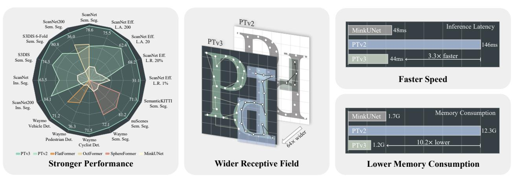
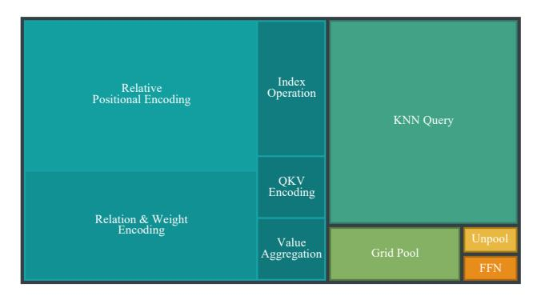
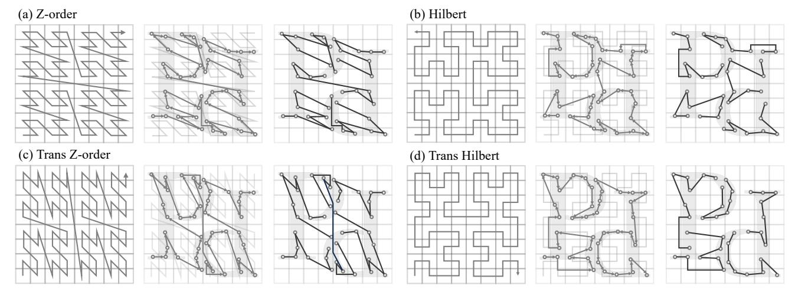
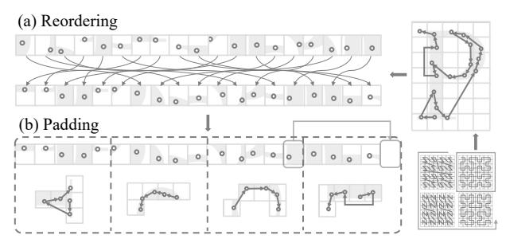
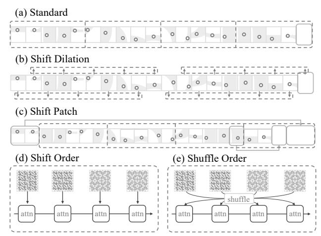
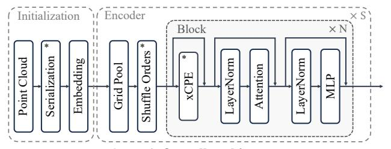

# Point Transformer V3: Simpler, Faster, Stronger

Xiaoyang Wu1,2 Li Jiang3 Peng-Shuai Wang4 Zhijian Liu5 Xihui Liu1 Yu Qiao2 Wanli Ouyang2 Tong He2\* Hengshuang Zhao1\*

1HKU 2SH AI Lab 3CUHK(SZ) 4PKU 5MIT

https://github.com/Pointcept/PointTransformerV3

Figure 1. **Overview of Point Transformer V3 (PTv3).** Compared to its predecessor, PTv2 [90], our PTv3 shows superiority in the following aspects: 1. *Stronger performance*. PTv3 achieves state-of-the-art results across a variety of indoor and outdoor 3D perception tasks. 2. *Wider receptive field*. Benefit from the simplicity and efficiency, PTv3 expands the receptive field from 16 to 1024 points. 3. *Faster speed*. PTv3 significantly increases processing speed, making it suitable for latency-sensitive applications. 4. *Lower Memory Consumption*. PTv3 reduces memory usage, enhancing accessibility for broader situations.

# **Abstract**

This paper is not motivated to seek innovation within the attention mechanism. Instead, it focuses on overcoming the existing trade-offs between accuracy and efficiency within the context of point cloud processing, leveraging the power of scale. Drawing inspiration from recent advances in 3D large-scale representation learning, we recognize that model performance is more influenced by scale than by intricate design. Therefore, we present Point Transformer V3 (PTv3), which prioritizes simplicity and efficiency over the accuracy of certain mechanisms that are minor to the overall performance after scaling, such as replacing the precise neighbor search by KNN with an efficient serialized neighbor mapping of point clouds organized with specific patterns. This principle enables significant scaling, expanding the receptive field from 16 to 1024 points while remaining efficient (a  $3\times$  increase in processing speed and a  $10\times$ improvement in memory efficiency compared with its predecessor, PTv2). PTv3 attains state-of-the-art results on over 20 downstream tasks that span both indoor and outdoor scenarios. Further enhanced with multi-dataset joint training, PTv3 pushes these results to a higher level.

### 1. Introduction

Deep learning models have experienced rapid advancements in various areas, such as 2D vision [24, 38, 78, 86] and natural language processing (NLP) [1, 37, 56, 79], with their progress often attributed to the effective utilization of scale, encompassing factors such as the size of datasets, the number of model parameters, the range of effective receptive field, and the computing power allocated for training.

However, in contrast to the progress made in 2D vision or NLP, the development of 3D backbones [16, 46, 62, 88] has been hindered in terms of scale, primarily due to the limited size and diversity of point cloud data available in separate domains [92]. Consequently, there exists a gap in applying scaling principles that have driven advancements in other fields [37]. This absence of scale often leads to a limited trade-off between accuracy and speed on 3D backbones, particularly for models based on the transformer architecture [27, 106]. Typically, this trade-off involves sacrificing efficiency for accuracy. Such limited efficiency impedes some of these models' capacity to fully leverage the inherent strength of transformers in scaling the range of receptive fields, hindering their full potential in 3D data processing.

A recent advancement [92] in 3D representation learn-

\*Corresponding author.

ing has made progress in overcoming the data scale limitation in point cloud processing by introducing a synergistic training approach spanning multiple 3D datasets. Coupled with this strategy, the efficient convolutional backbone [13] has effectively bridged the accuracy gap commonly associated with point cloud transformers [40, 90]. However, point cloud transformers themselves have not yet fully benefited from this privilege of scale due to their efficiency gap compared to sparse convolution. This discovery shapes the initial motivation for our work: to re-weigh the design choices in point transformers, with the lens of the scaling principle. We posit that model performance is more significantly influenced by scale than by intricate design.

Therefore, we introduce Point Transformer V3 (PTv3), which prioritizes simplicity and efficiency over the accuracy of certain mechanisms, thereby enabling scalability. Such adjustments have an ignorable impact on overall performance after scaling. Specifically, PTv3 makes the following adaptations to achieve superior efficiency and scalability:

- Inspired by two recent advancements [51, 83] and recognizing the scalability benefits of structuring unstructured point clouds, PTv3 shifts from the traditional spatial proximity defined by K-Nearest Neighbors (KNN) query, accounting for 28% of the forward time. Instead, it explores the potential of serialized neighborhoods in point clouds, organized according to specific patterns.
- PTv3 replaces more complex attention patch interaction mechanisms, like shift-window (impeding the fusion of attention operators) and the neighborhood mechanism (causing high memory consumption), with a streamlined approach tailored for serialized point clouds.
- PTv3 eliminates the reliance on relative positional encoding, which accounts for 26% of the forward time, in favor of a simpler prepositive sparse convolutional layer.

We consider these designs as intuitive choices driven by the scaling principles and advancements in existing point cloud transformers. Importantly, this paper underscores the critical importance of recognizing how scalability affects backbone design, instead of detailed module designs.

This principle significantly enhances scalability, overcoming traditional trade-offs between accuracy and efficiency (see Fig. 1). PTv3, compared to its predecessor, has achieved a 3.3× increase in inference speed and a 10.2× reduction in memory usage. More importantly, PTv3 capitalizes on its inherent ability to scale the range of perception, expanding its receptive field from 16 to 1024 points while maintaining efficiency. This scalability underpins its superior performance in real-world perception tasks, where PTv3 achieves state-of-the-art results across over 20 downstream tasks in both indoor and outdoor scenarios. Further augmenting its data scale with multi-dataset training [92], PTv3 elevates these results even more. We hope that our insights will inspire future research in this direction.

## 2. Related Work

**3D understanding.** Conventionally, deep neural architectures for understanding 3D point cloud data can be broadly classified into three categories based on their approach to modeling point clouds: projection-based, voxel-based, and point-based methods. Projection-based methods project 3D points onto various image planes and utilize 2D CNN-based backbones for feature extraction [8, 43, 45, 71]. Voxelbased approaches transform point clouds into regular voxel grids to facilitate 3D convolution operations [53, 70], with their efficiency subsequently enhanced by sparse convolution [13, 25, 84]. However, they often lack scalability in terms of the kernel sizes. Point-based methods, by contrast, process point clouds directly [52, 62, 63, 77, 105] and have recently seen a shift towards transformer-based architectures [27, 65, 90, 101, 106]. While these methods are powerful, their efficiency is frequently constrained by the unstructured nature of point clouds, which poses challenges to scaling their designs.

**Serialization-based method.** Recent works [7, 51, 83] have introduced approaches diverging from the traditional paradigms of point cloud processing, which we categorized as serialization-based. These methods structure point clouds by sorting them according to specific patterns, transforming unstructured, irregular point clouds into manageable sequences while preserving certain spatial proximity. OctFormer [83] inherits order during octreelization, akin to z-order, offering scalability but still constrained by the octree structure itself. FlatFormer [51], on the other hand, employs a window-based sorting strategy for grouping point pillars, akin to window partitioning. However, this design lacks scalability in the receptive field and is more suited to pillar-based 3D object detectors. These pioneering works mark the inception of serialization-based methods. Our PTv3 builds on this foundation, defining and exploring the full potential of point cloud serialization.

**3D representation learning.** In contrast to 2D domains, where large-scale pre-training has become a standard approach for enhancing downstream tasks [6], 3D representation learning is still in a phase of exploration. Most studies still rely on training models from scratch using specific target datasets [94]. While major efforts in 3D representation learning focused on individual objects [57, 68, 69, 87, 103], some recent advancements have redirected attention towards training on real-world scene-centric point clouds [30, 36, 91, 94, 107]. This shift signifies a major step forward in 3D scene understanding. Notably, Point Prompt Training (PPT) [92] introduces a new paradigm for largescale representation learning through multi-dataset synergistic learning, emphasizing the importance of scale. This approach greatly influences our design philosophy and initial motivation for developing PTv3, and we have incorporated this strategy in our final results.

| Outdoor Efficiency (1 | Trai    | ning          | Inference     |              |              |
|-----------------------|---------|---------------|---------------|--------------|--------------|
| Methods               | Params. | Latency       | Memory        | Latency      | Memory       |
| MinkUNet / 3 [13]     | 37.9M   | 163ms         | 3.3G          | 48ms         | 1.7G         |
| MinkUNet / 5 [13]     | 170.3M  | 455ms         | 5.6G          | 145ms        | 2.1G         |
| MinkUNet / 7 [13]     | 465.0M  | <b>1120ms</b> | 12.4G         | <b>337ms</b> | 2.8G         |
| PTv2 / 16 [90]        | 12.8M   | 213ms         | 10.3G         | 146ms        | 12.3G        |
| PTv2 / 24 [90]        | 12.8M   | 308ms         | 17.6G         | 180ms        | 15.2G        |
| PTv2 / 32 [90]        | 12.8M   | 354ms         | <b>21.5</b> G | 213ms        | <b>19.4G</b> |
| PTv3 / 256 (ours)     | 46.2M   | 120ms         | 3.3G          | 44ms         | 1.2G         |
| PTv3 / 1024 (ours)    | 46.2M   | 119ms         | 3.3G          | 44ms         | 1.2G         |
| PTv3 / 4096 (ours)    | 46.2M   | 125ms         | 3.3G          | 45ms         | 1.2G         |

Table 1. **Model efficiency.** We benchmark the training and inference efficiency of backbones with various scales of receptive field. The batch size is fixed to 1, and the number after "/" denotes the kernel size of sparse convolution and patch size 1 of attention.

# 3. Design Principle and Pilot Study

In this section, we introduce the scaling principle and pilot study, which guide the design of our model.

Scaling principle. Conventionally, the relationship between accuracy and efficiency in model performance is characterized as a "trade-off", with a typical preference for accuracy at the expense of efficiency. In pursuit of this, numerous methods have been proposed with cumbersome operations. Point Transformers [90, 106] prioritize accuracy and stability by substituting matrix multiplication in the computation of attention weights with learnable layers and normalization, potentially compromising efficiency. Similarly, Stratified Transformer [40] and Swin3D [101] achieve improved accuracy by incorporating more complex forms of relative positional encoding, yet this often results in decreased computational speed.

Yet, the perceived trade-off between accuracy and efficiency is not absolute, with a notable counterexample emerging through the engagement with scaling strategies. Specifically, Sparse Convolution, known for its speed and memory efficiency, remains preferred in 3D large-scale pre-training. Utilizing multi-dataset joint training strategies [92], Sparse Convolution [13, 25] has shown significant performance improvements, increasing mIoU on ScanNet semantic segmentation from 72.2% to 77.0% [107]. This outperforms PTv2 when trained from scratch by 1.6%, all while retaining superior efficiency. However, such advancements have not been fully extended to point transformers, primarily due to their efficiency limitations, which present burdens in model training especially when the computing resource is constrained.

This observation leads us to hypothesize that model performance may be more significantly influenced by scale than by complex design details. We consider the possibility of trading the accuracy of certain mechanisms for simplicity and efficiency, thereby enabling scalability. By leveraging the strength of scale, such sacrifices could have an ignor-

Figure 2. Latency treemap of each components of PTv2. We benchmark and visualize the proportion of the forward time of each component of PTv2. KNN Query and RPE occupy a total of 54% of forward time.

able impact on overall performance. This concept forms the basis of our scaling principle for backbone design, and we practice it with our design.

Breaking the curse of permutation invariance. Despite the demonstrated efficiency of sparse convolution, the question arises about the need for a scalable point transformer. While multi-dataset joint training allows for data scaling and the incorporation of more layers and channels contributes to model scaling, efficiently expanding the receptive field to enhance generalization capabilities remains a challenge for convolutional backbones (refer to Tab. 1). It is attention, an operator that is naturally adaptive to kernel shape, potentially to be universal.

However, current point transformers encounter challenges in scaling when adhering to the request of permutation invariance, stemming from the unstructured nature of point cloud data. In PTv1, the application of the K-Nearest Neighbors (KNN) algorithm to formulate local structures introduced computational complexities. PTv2 attempted to relieve this by halving the usage of KNN compared to PTv1. Despite this improvement, KNN still constitutes a significant computational burden, consuming 28% of the forward time (refer to Fig. 2). Additionally, while Image Relative Positional Encoding (RPE) benefits from a grid layout that allows for the predefinition of relative positions, point cloud RPE must resort to computing pairwise Euclidean distances and employ learned layers or lookup tables for mapping such distances to embeddings, proves to be another source of inefficiency, occupying 26% of the forward time (see Fig. 2). These extremely inefficient operations bring difficulties when scaling up the backbone.

Inspired by two recent advancements [51, 83], we move away from the traditional paradigm, which treats point clouds as unordered sets. Instead, we choose to "break" the constraints of permutation invariance by serializing point clouds into a structured format. This strategic transformation enables our method to leverage the benefits of structured data inefficiency with a compromise of the accuracy of locality-preserving property. We consider this trade-off as an entry point of our design.

&lt;sup>1Patch size refers to the number of neighboring points considered together for self-attention mechanisms.

Figure 3. **Point cloud serialization.** We show the four patterns of serialization with a triplet visualization. For each triplet, we show the space-filling curve for serialization (left), point cloud serialization var sorting order within the space-filling curve (middle), and grouped patches of the serialized point cloud for local attention (right). Shifting across the four serialization patterns allows the attention mechanism to capture various spatial relationships and contexts, leading to an improvement in model accuracy and generalization capacity.

### 4. Point Transformer V3

In this section, we present our designs of Point Transformer V3 (PTv3), guided by the scaling principle discussed in Sec. 3. Our approach emphasizes simplicity and speed, facilitating scalability and thereby making it stronger.

#### 4.1. Point Cloud Serialization

To trade the simplicity and efficiency nature of structured data, we introduce point cloud serialization, transforming unstructured point clouds into a structured format.

**Space-filling curves.** Space-filling curves [59] are paths that pass through every point within a higher-dimensional discrete space and preserve spatial proximity to a certain extent. Mathematically, it can be defined as a bijective function  $\varphi: \mathbb{Z} \mapsto \mathbb{Z}^n$ , where n is the dimensionality of the space, which is 3 within the context of point clouds and also can extend to a higher dimension. Our method centers on two representative space-filling curves: the z-order curve [54] and the Hilbert curve [29]. The Z-order curve (see Fig. 3a) is valued for its simplicity and ease of computation, whereas the Hilbert curve (see Fig. 3b) is known for its superior locality-preserving properties compared with Z-order curve.

Standard space-filling curves process the 3D space by following a sequential traversal along the x, y, and z axes, respectively. By altering the order of traversal, such as prioritizing the y-axis before the x-axis, we introduce reordered variants of standard space-filling curves. To differentiate between the standard configurations and the alternative variants of space-filling curves, we denote the latter with the prefix "trans", resulting in names such as Trans Z-order (see Fig. 3c) and Trans Hilbert (see Fig. 3d). These variants can offer alternative perspectives on spatial rela-

tionships, potentially capturing special local relationships that the standard curve may overlook.

**Serialized encoding.** To leverage the locality-preserving properties of space-filling curves, we employ serialized encoding, a strategy that converts a point's position into an integer reflecting its order within a given space-filling curve. Due to the bijective nature of these curves, there exists an inverse mapping  $\varphi^{-1}: \mathbb{Z}^n \mapsto \mathbb{Z}$  which allows for the transformation of a point's position  $p_i \in \mathbb{R}^3$  into a serialization code. By projecting the point's position onto a discrete space with a grid size of  $g \in \mathbb{R}$ , we obtain this code as  $\varphi^{-1}(|p/g|)$ . This encoding is also adaptable to batched point cloud data. By assigning each point a 64-bit integer to record serialization code, we allocate the trailing k bits to the position encoded by  $\varphi^{-1}$  and the remaining leading bits to the batch index  $b \in \mathbb{Z}$ . Sorting the points according to this serialization code makes the batched point clouds ordered with the chosen space-filling curve pattern within each batch. The whole process can be written as follows:

$$\operatorname{Encode}(\boldsymbol{p}, b, g) = (b \ll k) |\varphi^{-1}(|\boldsymbol{p}/g|),$$

where  $\ll$  denotes left bit-shift and | denotes bitwise OR. **Serialization.** As illustrated in the *middle* part of triplets in Fig. 3, the serialization of point clouds is accomplished by sorting the codes resulting from the serialized encoding. The ordering effectively rearranges the points in a manner that respects the spatial ordering defined by the given space-filling curve, which means that neighbor points in the data structure are also likely to be close in space.

In our implementation, we do not physically re-order the point clouds, but rather, we record the mappings generated by the serialization process. This strategy maintains compatibility with various serialization patterns and provides the flexibility to transition between them efficiently.

Figure 4. **Patch grouping.** (a) Reordering point cloud according to order derived from a specific serialization pattern. (b) Padding point cloud sequence by borrowing points from neighboring patches to ensure it is divisible by the designated patch size.

#### 4.2. Serialized Attention

Re-weigh options of attention mechanism. Image transformers [20, 49, 50], benefiting from the structured and regular grid of pixel data, naturally prefer window [49] and dot-product [21, 80] attention mechanisms. These methods take advantage of the fixed spatial relationships inherent to image data, allowing for efficient and scalable localized processing. However, this advantage vanishes when confronting the unstructured nature of point clouds. To adapt, previous point transformers [90, 106] introduce neighborhood attention to construct even-size attention kernels and adopt vector attention to improve model convergence on point cloud data with a more complex spatial relation.

In light of the structured nature of serialized point clouds, we choose to revisit and adopt the efficient window and dot-product attention mechanisms as our foundational approach. While the serialization strategy may temporarily yield a lower performance than some neighborhood construction strategies like KNN due to a reduction in precise spatial neighbor relationships, we will demonstrate that any initial accuracy gaps can be effectively bridged by harnessing the scalability potential inherent in serialization.

Evolving from window attention, we define *patch attention*, a mechanism that groups points into non-overlapping patches and performs attention within each individual patch. The effectiveness of patch attention relies on two major designs: patch grouping and patch interaction.

**Patch grouping.** Grouping points into patches within serialized point clouds has been well-explored in recent advancements [51, 83]. This process is both natural and efficient, involving the simple grouping of points along the serialized order after padding. Our design for patch attention is also predicated on this strategy as presented in Fig. 4. In practice, the processes of reordering and patch padding can be integrated into a single indexing operation.

Furthermore, we illustrate patch grouping patterns derived from the four serialization patterns on the right part of triplets in Fig. 3. This grouping strategy, in tandem with our serialization patterns, is designed to effectively broaden the attention mechanism's receptive field in the 3D space as the

Figure 5. **Patch interaction.** (a) Standard patch grouping with a regular, non-shifted arrangement; (b) Shift Dilation where points are grouped at regular intervals, creating a dilated effect; (c) Shift Patch, which applies a shifting mechanism similar to the shift window approach; (d) Shift Order where different serialization patterns are cyclically assigned to successive attention layers; (e) Shuffle Order, where the sequence of serialization patterns is randomized before being fed to attention layers.

patch size increases while still preserving spatial neighbor relationships to a feasible degree. Although this approach may sacrifice some neighbor search accuracy when compared to KNN, the trade-off is beneficial. Given the attention's re-weighting capacity to reference points, the gains in efficiency and scalability far outweigh the minor loss in neighborhood precision (scaling it up is all we need).

**Patch interaction.** The interaction between points from different patches is critical for the model to integrate information across the entire point cloud. This design element counters the limitations of a non-overlapping architecture and is pivotal in making patch attention functional. Building on this insight, we investigate various designs for patch interaction as outlined below (also visualized in Fig. 5):

- In Shift Dilation [83], patch grouping is staggered by a specific step across the serialized point cloud, effectively extending the model's receptive field beyond the immediate neighboring points.
- In *Shift Patch*, the positions of patches are shifted across the serialized point cloud, drawing inspiration from the shift-window strategy in image transformers [49]. This method maximizes the interaction among patches.
- In *Shift Order*, the serialized order of the point cloud data is dynamically varied between attention blocks. This technique, which aligns seamlessly with our point cloud serialization method, serves to prevent the model from overfitting to a single pattern and promotes a more robust integration of features across the data.
- *Shuffle Order\**, building upon *Shift Order*, introduces a random shuffle to the permutations of serialized orders. This method ensures that the receptive field of each at-

Figure 6. Overall architecture.

tention layer is not limited to a single pattern, thus further enhancing the model's ability to generalize.

We mark our main proposal with \* and underscore its superior performance in model ablation.

Positional encoding. To handle the voluminous data, point cloud transformers commonly employ local attention, which is reliant on relative positional encoding methods [40, 101, 106] for optimal performance. However, our observations indicate that RPEs are notably inefficient and complex. As a more efficient alternative, conditional positional encoding (CPE) [14, 83] is introduced for point cloud transformers, where implemented by octree-based depthwise convolutions [84]. We consider this replacement to be elegant, as the implementation of RPE in point cloud transformers can essentially be regarded as a variant of largekernel sparse convolution. Even so, a single CPE is not sufficient for the peak performance (there remains potential for an additional 0.5% improvement when coupled with RPE). Therefore, we present an enhanced conditional positional encoding (xCPE), implemented by directly prepending a sparse convolution layer with a skip connection before the attention layer. Our experimental results demonstrate that xCPE fully unleashes the performance with a slight increase in latency of a few milliseconds compared to the standard CPE, the performance gains justify this minor trade-off.

# 4.3. Network Details

In this section, we detail the macro designs of PTv3, including block structure, pooling strategy, and model architecture (visualized in Fig. 6). Our options for these components are empirical yet also crucial to overall simplicity. Detailed ablations of these choices are available in the <u>Appendix</u>.

**Block structure.** We simplify the traditional block structure, typically an extensive stack of normalization and activation layers, by adopting a pre-norm [12] structure, evaluated against the post-norm [80] alternative. Additionally, we shift from Batch Normalization (BN) to Layer Normalization (LN). The proposed xCPE is prepended directly before the attention layer with a skip connection.

**Pooling strategy.** We keep adopting the Grid Pooling introduced in PTv2, recognizing its simplicity and efficiency. Our experiments indicate that BN is essential and cannot be effectively replaced by LN. We hypothesize that BN is crucial for stabilizing the data distribution in point clouds during pooling. Additionally, the proposed Shuffle Order,

| Patterns        | S.O.                 | + S.D.               | + S.P.               | + Shuffle O.         |
|-----------------|----------------------|----------------------|----------------------|----------------------|
| Z               | 74.3 54ms | 75.5 89ms | 75.8 86ms | 74.3 54ms |
| Z + TZ          | 76.0 55ms | 76.3 92ms | 76.1 89ms | 76.9 55ms |
| H + TH          | 76.2 60ms | 76.1 98ms | 76.2 94ms | 76.8 60ms |
| Z + TZ + H + TH | 76.5 61ms | 76.8 99ms | 76.6 97ms | <b>77.3</b> 61ms     |

Table 2. **Serialization patterns and patch interaction.** The first column indicates serialization patterns: Z for Z-order, TZ for Trans Z-order, H for Hilbert, and TH for Trans Hilbert. In the first row, S.O. represents Shift Order, which is the default setting also applied to other interaction strategies. S.D. stands for Shift Dilation, and S.P. signifies Shift Patch.

| PE        | APE                  | RPE                  | cRPE                  | CPE                  | xCPE                        |
|-----------|----------------------|----------------------|-----------------------|----------------------|-----------------------------|
| Perf. (%) | 72.1 50ms | 75.9 72ms | 76.8 101ms | 76.6 58ms | <b>77.3</b> 61ms |

Table 3. **Positional encoding.** We compare the proposed CPE+with APE, RPE, cRPE, and CPE. RPE and CPE are discussed in OctFormer [83], while cRPE is deployed by Swin3D [101].

| P.S.                   | 16   | 32   | 64   | 128  | 256  | 1024 | 4096 |
|------------------------|------|------|------|------|------|------|------|
| Perf. (%) Std. Dev. | 75.0 | 75.6 | 76.3 | 76.6 | 76.8 | 77.3 | 77.1 |
| Std. Dev.              | 0.15 | 0.22 | 0.31 | 0.36 | 0.28 | 0.22 | 0.39 |

Table 4. **Patch size.** Leveraging the inherent simplicity and efficiency of our approach, we expand the receptive field of attention well beyond the conventional scope, surpassing sizes used in previous works such as PTv2 [90], which adopts a size of 16, and OctFormer [83], which uses 24.

with shuffle the permutation of serialized orders for Shift Order, is integrated into the pooling.

**Model architecture.** The architecture of PTv3 remains consistent with the U-Net [66] framework. It consists of four stage encoders and decoders, with respective block depths of [2, 2, 6, 2] and [1, 1, 1, 1]. For these stages, the grid size multipliers are set at  $[\times 2, \times 2, \times 2, \times 2]$ , indicating the expansion ratio relative to the preceding pooling stage.

### 5. Experiments

#### 5.1. Main Properties

We perform an ablation study on PTv3, focusing on module design and scalability. We report the performance using the mean results from the ScanNet semantic segmentation validation and measure the latencies using the average values obtained from the full ScanNet validation set (with a batch size of 1) on a single RTX 4090. If not specified, default settings are presented in Appendix. All of our designs are enabled by default. Default settings are marked in gray.

**Serialization patterns.** In Tab. 2, we explore the impact of various combinations of serialization patterns. Our experiments demonstrate that mixtures incorporating a broader range of patterns yield superior results when integrated with our Shuffle Order strategies. Furthermore, the additional computational overhead from introducing more serialization patterns is negligible. It is observed that relying on

| Indoor Sem. Seg. | ScanN       | et [17] | ScanNet200 [67] |      | S3DI  | S [2]  |
|------------------|-------------|---------|-----------------|------|-------|--------|
| Methods          | Val         | Test    | Val             | Test | Area5 | 6-fold |
| o MinkUNet [13]  | 72.2        | 73.6    | 25.0            | 25.3 | 65.4  | 65.4   |
| o ST [40]        | 74.3        | 73.7    | -               | -    | 72.0  | -      |
| o PointNeXt [64] | 71.5        | 71.2    | -               | -    | 70.5  | 74.9   |
| o OctFormer [83] | 75.7        | 76.6    | 32.6            | 32.6 | -     | -      |
| o Swin3D [101]   | 76.4        | -       | -               | -    | 72.5  | 76.9   |
| o PTv1 [106]     | 70.6        | -       | 27.8            | -    | 70.4  | 65.4   |
| o PTv2 [90]      | 75.4        | 74.2    | 30.2            | -    | 71.6  | 73.5   |
| o PTv3 (Ours)    | 77.5        | 77.9    | 35.2            | 37.8 | 73.4  | 77.7   |
| • PTv3 (Ours)    | <b>78.6</b> | 79.4    | 36.0            | 39.3 | 74.7  | 80.8   |

Table 5. Indoor semantic segmentation.

| Method                 | Metric | Area1 | Area2 | Area3 | Area4 | Area5 | Area6 | 6-Fold |
|------------------------|--------|-------|-------|-------|-------|-------|-------|--------|
|                        | allAcc | 92.30 | 86.00 | 92.98 | 89.23 | 91.24 | 94.26 | 90.76  |
| o PTv2                 | mACC   | 88.44 | 72.81 | 88.41 | 82.50 | 77.85 | 92.44 | 83.13  |
|                        | mIoU   | 81.14 | 61.25 | 81.65 | 69.06 | 72.02 | 85.95 | 75.17  |
|                        | allAcc | 93.22 | 86.26 | 94.56 | 90.72 | 91.67 | 94.98 | 91.53  |
| o PTv3                 | mACC   | 89.92 | 74.44 | 94.45 | 81.11 | 78.92 | 93.55 | 85.31  |
|                        | mIoU   | 83.01 | 63.42 | 86.66 | 71.34 | 73.43 | 87.31 | 77.70  |
|                        | allAcc | 93.70 | 90.34 | 94.72 | 91.87 | 91.96 | 94.98 | 92.59  |
| <ul><li>PTv3</li></ul> | mACC   | 90.70 | 78.40 | 94.27 | 86.61 | 80.14 | 93.80 | 87.69  |
|                        | mIoU   | 83.88 | 70.11 | 87.40 | 75.53 | 74.33 | 88.74 | 80.81  |

Table 6. S3DIS 6-fold cross-validation.

a single Shift Order cannot completely harness the potential offered by the four serialization patterns.

Patch interaction. In Tab. 2, we also assess the effectiveness of each alternative patch interaction design. The default setting enables Shift Order, but the first row represents the baseline scenario using a single serialization pattern, indicative of the vanilla configurations of Shift Patch and Shift Dilation (one single serialization order is not shiftable). The results indicate that while Shift Patch and Shift Dilation are indeed effective, their latency is somewhat hindered by the dependency on attention masks, which compromises efficiency. Conversely, Shift Code, which utilizes multiple serialization patterns, offers a simple and efficient alternative that achieves comparable results to these traditional methods. Notably, when combined with Shuffle Order and all four serialization patterns, our strategy not only shows further improvement but also retains its efficiency.

**Positional encoding.** In Tab. 3, we benchmark our proposed CPE+ against conventional positional encoding, such as APE and RPE, as well as recent advanced solutions like cRPE and CPE. The results confirm that while RPE and cRPE are significantly more effective than APE, they also exhibit the inefficiencies previously discussed. Conversely, CPE and CPE+ emerge as superior alternatives. Although CPE+ incorporates slightly more parameters than CPE, it does not compromise our method's efficiency too much. Since CPEs operate prior to the attention phase rather than during it, they benefit from optimization like flash atten-

| Outdoor Sem. Seg.               | nuSce | nes [5] | Sem.KITTI [3] |      | Waymo | Val [72] |
|---------------------------------|-------|---------|---------------|------|-------|----------|
| Methods                         | Val   | Test    | Val Test      |      | mIoU  | mAcc     |
| o MinkUNet [13]                 | 73.3  | -       | 63.8          | -    | 65.9  | 76.6     |
| <ul> <li>SPVNAS [73]</li> </ul> | 77.4  | -       | 64.7          | 66.4 | -     | -        |
| o Cylinder3D [108]              | 76.1  | 77.2    | 64.3          | 67.8 | -     | -        |
| o AF2S3Net [10]                 | 62.2  | 78.0    | 74.2          | 70.8 | -     | -        |
| ∘ 2DPASS [98]                   | -     | 80.8    | 69.3          | 72.9 | -     | -        |
| o SphereFormer [41]             | 78.4  | 81.9    | 67.8          | 74.8 | 69.9  | -        |
| o PTv2 [90]                     | 80.2  | 82.6    | 70.3          | 72.6 | 70.6  | 80.2     |
| o PTv3 (Ours)                   | 80.4  | 82.7    | 70.8          | 74.2 | 71.3  | 80.5     |
| • PTv3 (Ours)                   | 81.2  | 83.0    | 72.3          | 75.5 | 72.1  | 81.3     |

Table 7. Outdoor semantic segmentation.

| Indoor Ins. Seg. | Sc         | anNet [17  | ]    | ScanNet200 [67] |            |      |  |
|------------------|------------|------------|------|-----------------|------------|------|--|
| PointGroup [35]  | $mAP_{25}$ | $mAP_{50}$ | mAP  | $mAP_{25}$      | $mAP_{50}$ | mAP  |  |
| o MinkUNet [13]  | 72.8       | 56.9       | 36.0 | 32.2            | 24.5       | 15.8 |  |
| o PTv2 [90]      | 76.3       | 60.0       | 38.3 | 39.6            | 31.9       | 21.4 |  |
| o PTv3 (Ours)    | 77.5       | 61.7       | 40.9 | 40.1            | 33.2       | 23.1 |  |
| • PTv3 (Ours)    | 78.9       | 63.5       | 42.1 | 40.8            | 34.1       | 24.0 |  |

Table 8. Indoor instance segmentation.

| Data Efficient [30] | Limi | ted Re | constru | iction | Limited Annotation |      |      |      |  |
|---------------------|------|--------|---------|--------|--------------------|------|------|------|--|
| Methods             | 1%   | 5%     | 10%     | 20%    | 20                 | 50   | 100  | 200  |  |
| o MinkUNet [13]     | 26.0 | 47.8   | 56.7    | 62.9   | 41.9               | 53.9 | 62.2 | 65.5 |  |
| o PTv2 [90]         | 24.8 | 48.1   | 59.8    | 66.3   | 58.4               | 66.1 | 70.3 | 71.2 |  |
| o PTv3 (Ours)       | 25.8 | 48.9   | 61.0    | 67.0   | 60.1               | 67.9 | 71.4 | 72.7 |  |
| • PTv3 (Ours)       | 31.3 | 52.6   | 63.3    | 68.2   | 62.4               | 69.1 | 74.3 | 75.5 |  |

Table 9. Data efficiency.

tion [18, 19], which can be advantageous for our PTv3. **Patch size.** In Tab. 4, we explore the scaling of the receptive field of attention by adjusting patch size. Beginning with a patch size of 16, a standard in prior point transformers, we observe that increasing the patch size significantly enhances performance. Moreover, as indicated in Tab. 1 (benchmarked with NuScenes dataset), benefits from optimization techniques such as flash attention [18, 19], the speed and memory efficiency are effectively managed.

### **5.2. Results Comparision**

We benchmark the performance of PTv3 against previous SOTA backbones and present the <a href="https://disable.com/highest">highest</a> results obtained for each benchmark. In our tables, Marker orefers to a model trained from scratch, and orefers to a model trained with multi-dataset joint training (PPT [92]). An exhaustive comparison with earlier works is available in the <a href="https://disable.com/Appendix.org/Appendix.org/Appendix.org/Appendix.org/Appendix.org/Appendix.org/Appendix.org/Appendix.org/Appendix.org/Appendix.org/Appendix.org/Appendix.org/Appendix.org/Appendix.org/Appendix.org/Appendix.org/Appendix.org/Appendix.org/Appendix.org/Appendix.org/Appendix.org/Appendix.org/Appendix.org/Appendix.org/Appendix.org/Appendix.org/Appendix.org/Appendix.org/Appendix.org/Appendix.org/Appendix.org/Appendix.org/Appendix.org/Appendix.org/Appendix.org/Appendix.org/Appendix.org/Appendix.org/Appendix.org/Appendix.org/Appendix.org/Appendix.org/Appendix.org/Appendix.org/Appendix.org/Appendix.org/Appendix.org/Appendix.org/Appendix.org/Appendix.org/Appendix.org/Appendix.org/Appendix.org/Appendix.org/Appendix.org/Appendix.org/Appendix.org/Appendix.org/Appendix.org/Appendix.org/Appendix.org/Appendix.org/Appendix.org/Appendix.org/Appendix.org/Appendix.org/Appendix.org/Appendix.org/Appendix.org/Appendix.org/Appendix.org/Appendix.org/Appendix.org/Appendix.org/Appendix.org/Appendix.org/Appendix.org/Appendix.org/Appendix.org/Appendix.org/Appendix.org/Appendix.org/Appendix.org/Appendix.org/Appendix.org/Appendix.org/Appendix.org/Appendix.org/Appendix.org/Appendix.org/Appendix.org/Appendix.org/Appendix.org/Appendix.org/Appendix.org/Appendix.org/Appendix.org/Appendix.org/Appendix.org/Appendix.org/Appendix.org/Appendix.org/Appendix.org/Appendix.org/Appendix.org/Appendix.org/Appendix.org/Appendix.org/Appendix.org/Appendix.org/Appendix.org/Appendix.org/Appendix.org/Appendix.org/Appendix.org/Appendix.org/Appendix.org/Appendix.org/Appendix.org/Appendix.org/Appendix.org/Appendix.org/Appendix.org/Appendix.org/Appendix.org/Appendix.org/App

| Waymo Obj. Det.    |     | Vehic | ele L2 | Pedesti | rian L2 | Cycli | st L2 | Mean L2 |
|--------------------|-----|-------|--------|---------|---------|-------|-------|---------|
| Methods            | #   | mAP   | APH    | mAP     | APH     | mAP   | APH   | mAPH    |
| PointPillars [43]  | 1   | 63.6  | 63.1   | 62.8    | 50.3    | 61.9  | 59.9  | 57.8    |
| CenterPoint [102]  | 1   | 66.7  | 66.2   | 68.3    | 62.6    | 68.7  | 67.6  | 65.5    |
| SST [22]           | 1   | 64.8  | 64.4   | 71.7    | 63.0    | 68.0  | 66.9  | 64.8    |
| SST-Center [22]    | 1   | 66.6  | 66.2   | 72.4    | 65.0    | 68.9  | 67.6  | 66.3    |
| VoxSet [28]        | 1   | 66.0  | 65.6   | 72.5    | 65.4    | 69.0  | 67.7  | 66.2    |
| PillarNet [26]     | 1   | 70.4  | 69.9   | 71.6    | 64.9    | 67.8  | 66.7  | 67.2    |
| FlatFormer [51]    | 1   | 69.0  | 68.6   | 71.5    | 65.3    | 68.6  | 67.5  | 67.2    |
| PTv3 (Ours)        | 1   | 71.2  | 70.8   | 76.3    | 70.4    | 71.5  | 70.4  | 70.5    |
| CenterPoint [102]  | 2   | 67.7  | 67.2   | 71.0    | 67.5    | 71.5  | 70.5  | 68.4    |
| PillarNet [26]     | 2   | 71.6  | 71.6   | 74.5    | 71.4    | 68.3  | 67.5  | 70.2    |
| FlatFormer [51]    | 2   | 70.8  | 70.3   | 73.8    | 70.5    | 73.6  | 72.6  | 71.2    |
| PTv3 (Ours)        | 2   | 72.5  | 72.1   | 77.6    | 74.5    | 71.0  | 70.1  | 72.2    |
| CenterPoint++ [102 | 2]3 | 71.8  | 71.4   | 73.5    | 70.8    | 73.7  | 72.8  | 71.6    |
| SST [22]           | 3   | 66.5  | 66.1   | 76.2    | 72.3    | 73.6  | 72.8  | 70.4    |
| FlatFormer [51]    | 3   | 71.4  | 71.0   | 74.5    | 71.3    | 74.7  | 73.7  | 72.0    |
| PTv3 (Ours)        | 3   | 73.0  | 72.5   | 78.0    | 75.0    | 72.3  | 71.4  | 73.0    |

Table 10. **Waymo object detection.** The colume with head name "#" denotes the number of input frames.

PTv3 outperforms PTv2 by 3.7% on the ScanNet test split and by 4.2% on the S3DIS 6-fold CV. The advantage of PTv3 becomes even more pronounced when scaling up the model with multi-dataset joint training [92], widening the margin to 5.2% on ScanNet and 7.3% on S3DIS.

**Outdoor semantic segmentation.** In Tab. 7, we detail the validation and test results of PTv3 for the nuScenes [5, 23] and SemanticKITTI [3] benchmarks and also include the validation results for the Waymo benchmark [72]. Performance metrics are presented as mIoU percentages by default, with a comparison to prior models. PTv3 demonstrates enhanced performance over the recent state-of-theart model, SphereFormer, with a 2.0% improvement on nuScenes and a 3.0% increase on SemanticKITTI, both in the validation context. When pre-trained, PTv3's lead extends to 2.8% for nuScenes and 4.5% for SemanticKITTI.

Indoor instance segmentation. In Tab. 8, we present PTv3's validation results on the ScanNet v2 [17] and ScanNet200 [67] instance segmentation benchmarks. We present the performance metrics as mAP, mAP25, and mAP50 and compare them against several popular backbones. To ensure a fair comparison, we standardize the instance segmentation framework by employing Point-Group [35] across all tests, varying only the backbone. Our experiments reveal that integrating PTv3 as a backbone significantly enhances PointGroup, yielding a 4.9% increase in mAP over MinkUNet. Moreover, fine-tuning a PPT pretrained PTv3 provides an additional gain of 1.2% mAP.

**Indoor data efficient.** In Tab. 9, we evaluate the performance of PTv3 on the ScanNet data efficient [30] benchmark. This benchmark tests models under constrained conditions with limited percentages of available reconstructions (scenes) and restricted numbers of annotated points. Across

| Indoor Efficiency | Trai  | ning    | Inference     |       |        |
|-------------------|-------|---------|---------------|-------|--------|
| Methods Params    |       | Latency | atency Memory |       | Memory |
| MinkUNet [13]     | 37.9M | 267ms   | 4.9G          | 90ms  | 4.7G   |
| OctFormer [83]    | 44.0M | 264ms   | 12.9G         | 86ms  | 12.5G  |
| Swin3D [101]      | 71.1M | 602ms   | 13.6G         | 456ms | 8.8G   |
| PTv2 [90]         | 12.8M | 312ms   | 13.4G         | 191ms | 18.2G  |
| PTv3 (ours)       | 46.2M | 151ms   | 6.8G          | 61ms  | 5.2G   |

Table 11. Indoor model efficiency.

various settings, from 5% to 20% of reconstructions and from 20 to 200 annotations, PTv3 demonstrates strong performance. Moreover, the application of pre-training technologies further boosts PTv3's performance across all tasks. Outdoor object detection. In Tab. 10, we benchmark PTv3 against leading single-stage 3D detectors on the Waymo Object Detection benchmark. All models are evaluated using either anchor-based or center-based detection heads [99, 102], with a separate comparison for varying numbers of input frames. Our PTv3, engaged with CenterPoint, consistently outperforms both sparse convolutional [26, 102] and transformer-based [22, 28] detectors, achieving significant gains even when compared with the recent state-of-the-art, FlatFormer [51]. Notably, PTv3 surpasses FlatFormer by 3.3% with a single frame as input and maintains a superiority of 1.0% in multi-frame settings.

**Model efficiency.** We evaluate model efficiency based on average latency and memory consumption across real-world datasets. Efficiency metrics are measured on a single RTX 4090, excluding the first iteration to ensure steady-state measurements. We compared our PTv3 with multiple previous SOTAs. Specifically, we use the NuScenes dataset to assess outdoor model efficiency (see Tab. 1) and the Scan-Net dataset for indoor model efficiency (see Tab. 11). Our results demonstrate that PTv3 not only exhibits the lowest latency across all tested scenarios but also maintains reasonable memory consumption.

### 6. Conclusion

This paper presents Point Transformer V3, a stride towards overcoming the traditional trade-offs between accuracy and efficiency in point cloud processing. Guided by a novel interpretation of the **scaling principle** in backbone design, we propose that model performance is more profoundly influenced by scale than by complex design intricacies. By prioritizing efficiency over the accuracy of less impactful mechanisms, we harness the power of scale, leading to enhanced performance. Simply put, by making the model **simpler** and **faster**, we enable it to become **stronger**.

#### Acknowledgements

This work is supported in part by the National Natural Science Foundation of China (No. 622014840), the National Key R&D Program of China (No. 2022ZD0160101), HKU Startup Fund, and HKU Seed Fund for Basic Research.

### References

- [1] Vamsi Aribandi, Yi Tay, Tal Schuster, Jinfeng Rao, Huaixiu Steven Zheng, Sanket Vaibhav Mehta, Honglei Zhuang, Vinh Q. Tran, Dara Bahri, Jianmo Ni, Jai Gupta, Kai Hui, Sebastian Ruder, and Donald Metzler. Ext5: Towards extreme multi-task scaling for transfer learning. In ICLR, 2022. 1
- [2] Iro Armeni, Ozan Sener, Amir R. Zamir, Helen Jiang, Ioannis Brilakis, Martin Fischer, and Silvio Savarese. 3d semantic parsing of large-scale indoor spaces. In CVPR, 2016. 7, 16
- [3] Jens Behley, Martin Garbade, Andres Milioto, Jan Quenzel, Sven Behnke, Cyrill Stachniss, and Jurgen Gall. Semantickitti: A dataset for semantic scene understanding of lidar sequences. In *ICCV*, 2019. 7, 8, 16
- [4] Maxim Berman, Amal Rannen Triki, and Matthew B Blaschko. The lovász-softmax loss: A tractable surrogate for the optimization of the intersection-over-union measure in neural networks. In CVPR, 2018. 13
- [5] Holger Caesar, Varun Bankiti, Alex H Lang, Sourabh Vora, Venice Erin Liong, Qiang Xu, Anush Krishnan, Yu Pan, Giancarlo Baldan, and Oscar Beijbom. nuscenes: A multimodal dataset for autonomous driving. In CVPR, 2020. 7, 8, 16
- [6] Mathilde Caron, Hugo Touvron, Ishan Misra, Hervé Jégou, Julien Mairal, Piotr Bojanowski, and Armand Joulin. Emerging properties in self-supervised vision transformers. In CVPR, 2021. 2
- [7] Wanli Chen, Xinge Zhu, Guojin Chen, and Bei Yu. Efficient point cloud analysis using hilbert curve. In ECCV, 2022.
- [8] Xiaozhi Chen, Huimin Ma, Ji Wan, Bo Li, and Tian Xia. Multi-view 3d object detection network for autonomous driving. In CVPR, 2017. 2
- [9] Yukang Chen, Jianhui Liu, Xiangyu Zhang, Xiaojuan Qi, and Jiaya Jia. Largekernel3d: Scaling up kernels in 3d sparse cnns. In CVPR, 2023. 15
- [10] Ran Cheng, Ryan Razani, Ehsan Taghavi, Enxu Li, and Bingbing Liu. (af)2-s3net: Attentive feature fusion with adaptive feature selection for sparse semantic segmentation network. In CVPR, 2021. 7
- [11] Hung-Yueh Chiang, Yen-Liang Lin, Yueh-Cheng Liu, and Winston H Hsu. A unified point-based framework for 3d segmentation. In *3DV*, 2019. 15
- [12] Rewon Child, Scott Gray, Alec Radford, and Ilya Sutskever. Generating long sequences with sparse transformers. arXiv:1904.10509, 2019. 6, 15
- [13] Christopher Choy, JunYoung Gwak, and Silvio Savarese.
  4D spatio-temporal convnets: Minkowski convolutional neural networks. In CVPR, 2019. 2, 3, 7, 8, 15, 16
- [14] Xiangxiang Chu, Zhi Tian, Bo Zhang, Xinlong Wang, Xiaolin Wei, Huaxia Xia, and Chunhua Shen. Conditional positional encodings for vision transformers. arXiv:2102.10882, 2021. 6
- [15] Pointcept Contributors. Pointcept: A codebase for point cloud perception research. https://github.com/Pointcept/Pointcept, 2023. 13

- [16] Angela Dai and Matthias Nießner. 3dmv: Joint 3d-multiview prediction for 3d semantic scene segmentation. In ECCV, 2018. 1, 15
- [17] Angela Dai, Angel X. Chang, Manolis Savva, Maciej Halber, Thomas Funkhouser, and Matthias Nießner. ScanNet: Richly-annotated 3d reconstructions of indoor scenes. In CVPR, 2017. 7, 8, 16
- [18] Tri Dao. Flashattention-2: Faster attention with better parallelism and work partitioning. arXiv:2307.08691, 2023.
- [19] Tri Dao, Daniel Y. Fu, Stefano Ermon, Atri Rudra, and Christopher Ré. FlashAttention: Fast and memory-efficient exact attention with IO-awareness. In *NeurIPS*, 2022. 7
- [20] Xiaoyi Dong, Jianmin Bao, Dongdong Chen, Weiming Zhang, Nenghai Yu, Lu Yuan, Dong Chen, and Baining Guo. Cswin transformer: A general vision transformer backbone with cross-shaped windows. In CVPR, 2022. 5
- [21] Alexey Dosovitskiy, Lucas Beyer, Alexander Kolesnikov, Dirk Weissenborn, Xiaohua Zhai, Thomas Unterthiner, Mostafa Dehghani, Matthias Minderer, Georg Heigold, Sylvain Gelly, Jakob Uszkoreit, and Neil Houlsby. An image is worth 16x16 words: Transformers for image recognition at scale. *ICLR*, 2021. 5
- [22] Lue Fan, Ziqi Pang, Tianyuan Zhang, Yu-Xiong Wang, Hang Zhao, Feng Wang, Naiyan Wang, and Zhaoxiang Zhang. Embracing single stride 3d object detector with sparse transformer. In CVPR, 2022. 8
- [23] Whye Kit Fong, Rohit Mohan, Juana Valeria Hurtado, Lubing Zhou, Holger Caesar, Oscar Beijbom, and Abhinav Valada. Panoptic nuscenes: A large-scale benchmark for lidar panoptic segmentation and tracking. RA-L, 2022. 8
- [24] Priya Goyal, Mathilde Caron, Benjamin Lefaudeux, Min Xu, Pengchao Wang, Vivek Pai, Mannat Singh, Vitaliy Liptchinsky, Ishan Misra, Armand Joulin, et al. Self-supervised pretraining of visual features in the wild. *arXiv:2103.01988*, 2021. 1
- [25] Benjamin Graham, Martin Engelcke, and Laurens van der Maaten. 3d semantic segmentation with submanifold sparse convolutional networks. In CVPR, 2018. 2, 3, 15
- [26] Chao Ma Guangsheng Shi, Ruifeng Li. Pillarnet: Real-time and high-performance pillar-based 3d object detection. In ECCV, 2022. 8
- [27] Meng-Hao Guo, Jun-Xiong Cai, Zheng-Ning Liu, Tai-Jiang Mu, Ralph R Martin, and Shi-Min Hu. Pct: Point cloud transformer. Computational Visual Media, 2021. 1, 2
- [28] Chenhang He, Ruihuang Li, Shuai Li, and Lei Zhang. Voxel set transformer: A set-to-set approach to 3d object detection from point clouds. In *CVPR*, 2022. 8
- [29] David Hilbert and David Hilbert. Über die stetige abbildung einer linie auf ein flächenstück. Dritter Band: Analysis-Grundlagen der Mathematik Physik Verschiedenes: Nebst Einer Lebensgeschichte, 1935. 4
- [30] Ji Hou, Benjamin Graham, Matthias Nießner, and Saining Xie. Exploring data-efficient 3d scene understanding with contrastive scene contexts. In *CVPR*, 2021. 2, 7, 8, 14, 15
- [31] Yuenan Hou, Xinge Zhu, Yuexin Ma, Chen Change Loy, and Yikang Li. Point-to-voxel knowledge distillation for lidar semantic segmentation. In *CVPR*, 2022. 16

- [32] Qingyong Hu, Bo Yang, Linhai Xie, Stefano Rosa, Yulan Guo, Zhihua Wang, Niki Trigoni, and Andrew Markham. Randla-net: Efficient semantic segmentation of large-scale point clouds. In CVPR, 2020. 15
- [33] Zeyu Hu, Mingmin Zhen, Xuyang Bai, Hongbo Fu, and Chiew-lan Tai. Jsenet: Joint semantic segmentation and edge detection network for 3d point clouds. In ECCV, 2020.
  15
- [34] Li Jiang, Hengshuang Zhao, Shu Liu, Xiaoyong Shen, Chi-Wing Fu, and Jiaya Jia. Hierarchical point-edge interaction network for point cloud semantic segmentation. In *ICCV*, 2019. 15
- [35] Li Jiang, Hengshuang Zhao, Shaoshuai Shi, Shu Liu, Chi-Wing Fu, and Jiaya Jia. Pointgroup: Dual-set point grouping for 3d instance segmentation. CVPR, 2020. 7, 8, 13, 14
- [36] Li Jiang, Zetong Yang, Shaoshuai Shi, Vladislav Golyanik, Dengxin Dai, and Bernt Schiele. Self-supervised pretraining with masked shape prediction for 3d scene understanding. In CVPR, 2023. 2
- [37] Jared Kaplan, Sam McCandlish, Tom Henighan, Tom B Brown, Benjamin Chess, Rewon Child, Scott Gray, Alec Radford, Jeffrey Wu, and Dario Amodei. Scaling laws for neural language models. arXiv:2001.08361, 2020.
- [38] Alexander Kirillov, Eric Mintun, Nikhila Ravi, Hanzi Mao, Chloe Rolland, Laura Gustafson, Tete Xiao, Spencer Whitehead, Alexander C. Berg, Wan-Yen Lo, Piotr Dollár, and Ross Girshick. Segment anything. In *ICCV*, 2023. 1
- [39] Lingdong Kong, Youquan Liu, Runnan Chen, Yuexin Ma, Xinge Zhu, Yikang Li, Yuenan Hou, Yu Qiao, and Ziwei Liu. Rethinking range view representation for lidar segmentation. In *ICCV*, 2023. 16
- [40] Xin Lai, Jianhui Liu, Li Jiang, Liwei Wang, Hengshuang Zhao, Shu Liu, Xiaojuan Qi, and Jiaya Jia. Stratified transformer for 3d point cloud segmentation. In CVPR, 2022. 2, 3, 6, 7, 15
- [41] Xin Lai, Yukang Chen, Fanbin Lu, Jianhui Liu, and Jiaya Jia. Spherical transformer for lidar-based 3d recognition. In CVPR, 2023. 7, 16
- [42] Loic Landrieu and Martin Simonovsky. Large-scale point cloud semantic segmentation with superpoint graphs. In CVPR, 2018. 15
- [43] Alex H Lang, Sourabh Vora, Holger Caesar, Lubing Zhou, Jiong Yang, and Oscar Beijbom. Pointpillars: Fast encoders for object detection from point clouds. In CVPR, 2019. 2, 8
- [44] Huan Lei, Naveed Akhtar, and Ajmal Mian. Seggcn: Efficient 3d point cloud segmentation with fuzzy spherical kernel. In CVPR, 2020. 15
- [45] Bo Li, Tianlei Zhang, and Tian Xia. Vehicle detection from 3d lidar using fully convolutional network. In RSS, 2016.
- [46] Yangyan Li, Rui Bu, Mingchao Sun, Wei Wu, Xinhan Di, and Baoquan Chen. Pointcnn: Convolution on x-transformed points. In *NeurIPS*, 2018. 1, 15
- [47] Haojia Lin, Xiawu Zheng, Lijiang Li, Fei Chao, Shanshan Wang, Yan Wang, Yonghong Tian, and Rongrong Ji. Meta architecture for point cloud analysis. In *CVPR*, 2023. 15

- [48] Youquan Liu, Lingdong Kong, Xiaoyang Wu, Runnan Chen, Xin Li, Liang Pan, Ziwei Liu, and Yuexin Ma. Multispace alignments towards universal lidar segmentation. In CVPR, 2024. 16
- [49] Ze Liu, Yutong Lin, Yue Cao, Han Hu, Yixuan Wei, Zheng Zhang, Stephen Lin, and Baining Guo. Swin transformer: Hierarchical vision transformer using shifted windows. In *ICCV*, 2021. 5
- [50] Ze Liu, Han Hu, Yutong Lin, Zhuliang Yao, Zhenda Xie, Yixuan Wei, Jia Ning, Yue Cao, Zheng Zhang, Li Dong, et al. Swin transformer v2: Scaling up capacity and resolution. In CVPR, 2022. 5
- [51] Zhijian Liu, Xinyu Yang, Haotian Tang, Shang Yang, and Song Han. Flatformer: Flattened window attention for efficient point cloud transformer. In CVPR, 2023. 2, 3, 5, 8, 14
- [52] Xu Ma, Can Qin, Haoxuan You, Haoxi Ran, and Yun Fu. Rethinking network design and local geometry in point cloud: A simple residual mlp framework. In *ICLR*, 2022. 2
- [53] Daniel Maturana and Sebastian Scherer. Voxnet: A 3d convolutional neural network for real-time object recognition. In *IROS*, 2015. 2
- [54] Guy M Morton. A computer oriented geodetic data base and a new technique in file sequencing. International Business Machines Company New York, 1966. 4
- [55] Gaku Narita, Takashi Seno, Tomoya Ishikawa, and Yohsuke Kaji. Panopticfusion: Online volumetric semantic mapping at the level of stuff and things. In *IROS*, 2019. 15
- [56] OpenAI. Gpt-4 technical report. arXiv:2303.08774, 2023.
- [57] Yatian Pang, Wenxiao Wang, Francis EH Tay, Wei Liu, Yonghong Tian, and Li Yuan. Masked autoencoders for point cloud self-supervised learning. In ECCV, 2022. 2
- [58] Chunghyun Park, Yoonwoo Jeong, Minsu Cho, and Jaesik Park. Fast point transformer. In CVPR, 2022. 15
- [59] Giuseppe Peano and G Peano. Sur une courbe, qui remplit toute une aire plane. Springer, 1990. 4
- [60] Bohao Peng, Xiaoyang Wu, Li Jiang, Yukang Chen, Heng-shuang Zhao, Zhuotao Tian, and Jiaya Jia. Oa-cnns: Omniadaptive sparse cnns for 3d semantic segmentation. In CVPR, 2024. 15, 16
- [61] Gilles Puy, Alexandre Boulch, and Renaud Marlet. Using a waffle iron for automotive point cloud semantic segmentation. In *ICCV*, 2023. 16
- [62] Charles R Qi, Hao Su, Kaichun Mo, and Leonidas J Guibas. Pointnet: Deep learning on point sets for 3d classification and segmentation. In CVPR, 2017. 1, 2, 7, 15
- [63] Charles R Qi, Li Yi, Hao Su, and Leonidas J Guibas. Pointnet++: Deep hierarchical feature learning on point sets in a metric space. In *NeurIPS*, 2017. 2, 15, 16
- [64] Guocheng Qian, Yuchen Li, Houwen Peng, Jinjie Mai, Hasan Hammoud, Mohamed Elhoseiny, and Bernard Ghanem. Pointnext: Revisiting pointnet++ with improved training and scaling strategies. In *NeurIPS*, 2022. 7, 15
- [65] Damien Robert, Hugo Raguet, and Loic Landrieu. Efficient 3d semantic segmentation with superpoint transformer. In *ICCV*, 2023. 2, 15

- [66] Olaf Ronneberger, Philipp Fischer, and Thomas Brox. Unet: Convolutional networks for biomedical image segmentation. In MICCAI, 2015. 6
- [67] David Rozenberszki, Or Litany, and Angela Dai. Language-grounded indoor 3d semantic segmentation in the wild. In ECCV, 2022. 7, 8
- [68] Aditya Sanghi. Info3d: Representation learning on 3d objects using mutual information maximization and contrastive learning. In ECCV, 2020. 2
- [69] Jonathan Sauder and Bjarne Sievers. Self-supervised deep learning on point clouds by reconstructing space. In *NeurIPS*, 2019. 2
- [70] Shuran Song, Fisher Yu, Andy Zeng, Angel X Chang, Manolis Savva, and Thomas Funkhouser. Semantic scene completion from a single depth image. In CVPR, 2017. 2
- [71] Hang Su, Subhransu Maji, Evangelos Kalogerakis, and Erik G. Learned-Miller. Multi-view convolutional neural networks for 3d shape recognition. In *ICCV*, 2015. 2
- [72] Pei Sun, Henrik Kretzschmar, Xerxes Dotiwalla, Aurelien Chouard, Vijaysai Patnaik, Paul Tsui, James Guo, Yin Zhou, Yuning Chai, Benjamin Caine, et al. Scalability in perception for autonomous driving: Waymo open dataset. In CVPR, 2020. 7, 8
- [73] Haotian Tang, Zhijian Liu, Shengyu Zhao, Yujun Lin, Ji Lin, Hanrui Wang, and Song Han. Searching efficient 3d architectures with sparse point-voxel convolution. In ECCV, 2020. 7, 16
- [74] Maxim Tatarchenko, Jaesik Park, Vladlen Koltun, and Qian-Yi Zhou. Tangent convolutions for dense prediction in 3d. In CVPR, 2018. 15
- [75] Lyne Tchapmi, Christopher Choy, Iro Armeni, Jun Young Gwak, and Silvio Savarese. Segcloud: Semantic segmentation of 3d point clouds. In *3DV*, 2017. 15, 16
- [76] OpenPCDet Development Team. Openpcdet: An open-source toolbox for 3d object detection from point clouds. https://github.com/open-mmlab/OpenPCDet, 2020. 14
- [77] Hugues Thomas, Charles R Qi, Jean-Emmanuel Deschaud, Beatriz Marcotegui, François Goulette, and Leonidas J Guibas. Kpconv: Flexible and deformable convolution for point clouds. In *ICCV*, 2019. 2, 15
- [78] Yonglong Tian, Olivier J Henaff, and Aäron van den Oord. Divide and contrast: Self-supervised learning from uncurated data. In CVPR, 2021.
- [79] Hugo Touvron, Thibaut Lavril, Gautier Izacard, Xavier Martinet, Marie-Anne Lachaux, Timothée Lacroix, Baptiste Rozière, Naman Goyal, Eric Hambro, Faisal Azhar, et al. Llama: Open and efficient foundation language models. arXiv:2302.13971, 2023. 1
- [80] Ashish Vaswani, Noam Shazeer, Niki Parmar, Jakob Uszkoreit, Llion Jones, Aidan N Gomez, Łukasz Kaiser, and Illia Polosukhin. Attention is all you need. In *NeurIPS*, 2017. 5, 6, 15
- [81] Chengyao Wang, Li Jiang, Xiaoyang Wu, Zhuotao Tian, Bohao Peng, Hengshuang Zhao, and Jiaya Jia. Groupcontrast: Semantic-aware self-supervised representation learning for 3d understanding. In CVPR, 2024. 15

- [82] Lei Wang, Yuchun Huang, Yaolin Hou, Shenman Zhang, and Jie Shan. Graph attention convolution for point cloud semantic segmentation. In CVPR, 2019. 15
- [83] Peng-Shuai Wang. Octformer: Octree-based transformers for 3D point clouds. In SIGGRAPH, 2023. 2, 3, 5, 6, 7, 8, 14, 15
- [84] Peng-Shuai Wang, Yang Liu, Yu-Xiao Guo, Chun-Yu Sun, and Xin Tong. O-CNN: Octree-based convolutional neural networks for 3D shape analysis. In SIGGRAPH, 2017. 2, 6
- [85] Shenlong Wang, Simon Suo, Wei-Chiu Ma, Andrei Pokrovsky, and Raquel Urtasun. Deep parametric continuous convolutional neural networks. In CVPR, 2018. 15
- [86] Xinlong Wang, Wen Wang, Yue Cao, Chunhua Shen, and Tiejun Huang. Images speak in images: A generalist painter for in-context visual learning. In *CVPR*, 2023. 1
- [87] Yue Wang and Justin M Solomon. Deep closest point: Learning representations for point cloud registration. In ICCV, 2019. 2
- [88] Wenxuan Wu, Zhongang Qi, and Li Fuxin. Pointconv: Deep convolutional networks on 3d point clouds. In CVPR, 2019. 1, 15
- [89] Wenxuan Wu, Li Fuxin, and Qi Shan. Pointconvformer: Revenge of the point-based convolution. In *CVPR*, 2023.
- [90] Xiaoyang Wu, Yixing Lao, Li Jiang, Xihui Liu, and Hengshuang Zhao. Point transformer v2: Grouped vector attention and partition-based pooling. In *NeurIPS*, 2022. 1, 2, 3, 5, 6, 7, 8, 15, 16
- [91] Xiaoyang Wu, Xin Wen, Xihui Liu, and Hengshuang Zhao. Masked scene contrast: A scalable framework for unsupervised 3d representation learning. In CVPR, 2023. 2, 14, 15
- [92] Xiaoyang Wu, Zhuotao Tian, Xin Wen, Bohao Peng, Xihui Liu, Kaicheng Yu, and Hengshuang Zhao. Towards large-scale 3d representation learning with multi-dataset point prompt training. In CVPR, 2024. 1, 2, 3, 7, 8, 13, 14, 15, 16
- [93] Guangxuan Xiao, Yuandong Tian, Beidi Chen, Song Han, and Mike Lewis. Efficient streaming language models with attention sinks. arXiv, 2023. 13
- [94] Saining Xie, Jiatao Gu, Demi Guo, Charles R Qi, Leonidas Guibas, and Or Litany. Pointcontrast: Unsupervised pretraining for 3d point cloud understanding. In ECCV, 2020. 2, 14, 15
- [95] Ruibin Xiong, Yunchang Yang, Di He, Kai Zheng, Shuxin Zheng, Chen Xing, Huishuai Zhang, Yanyan Lan, Liwei Wang, and Tieyan Liu. On layer normalization in the transformer architecture. In *ICML*, 2020. 15
- [96] Mutian Xu, Runyu Ding, Hengshuang Zhao, and Xiaojuan Qi. Paconv: Position adaptive convolution with dynamic kernel assembling on point clouds. In CVPR, 2021. 15
- [97] Xu Yan, Chaoda Zheng, Zhen Li, Sheng Wang, and Shuguang Cui. Pointasnl: Robust point clouds processing using nonlocal neural networks with adaptive sampling. In CVPR, 2020. 15
- [98] Xu Yan, Jiantao Gao, Chaoda Zheng, Chao Zheng, Ruimao Zhang, Shuguang Cui, and Zhen Li. 2dpass: 2d priors

- assisted semantic segmentation on lidar point clouds. In *ECCV*, 2022. 7, 16
- [99] Yan Yan, Yuxing Mao, and Bo Li. Second: Sparsely embedded convolutional detection. Sensors, 18(10):3337, 2018. 8
- [100] Jiancheng Yang, Qiang Zhang, Bingbing Ni, Linguo Li, Jinxian Liu, Mengdie Zhou, and Qi Tian. Modeling point clouds with self-attention and gumbel subset sampling. In CVPR, 2019. 15
- [101] Yu-Qi Yang, Yu-Xiao Guo, Jian-Yu Xiong, Yang Liu, Hao Pan, Peng-Shuai Wang, Xin Tong, and Baining Guo. Swin3d: A pretrained transformer backbone for 3d indoor scene understanding. arXiv:2304.06906, 2023. 2, 3, 6, 7, 8, 15
- [102] Tianwei Yin, Xingyi Zhou, and Philipp Krähenbühl. Center-based 3d object detection and tracking. In CVPR, 2021. 8, 13
- [103] Xumin Yu, Lulu Tang, Yongming Rao, Tiejun Huang, Jie Zhou, and Jiwen Lu. Point-BERT: Pre-training 3D point cloud transformers with masked point modeling. In CVPR, 2022. 2
- [104] Feihu Zhang, Jin Fang, Benjamin Wah, and Philip Torr. Deep fusionnet for point cloud semantic segmentation. In ECCV, 2020. 15
- [105] Hengshuang Zhao, Li Jiang, Chi-Wing Fu, and Jiaya Jia. Pointweb: Enhancing local neighborhood features for point cloud processing. In CVPR, 2019. 2, 15
- [106] Hengshuang Zhao, Li Jiang, Jiaya Jia, Philip Torr, and Vladlen Koltun. Point transformer. In *ICCV*, 2021. 1, 2, 3, 5, 6, 7, 15, 16
- [107] Haoyi Zhu, Honghui Yang, Xiaoyang Wu, Di Huang, Sha Zhang, Xianglong He, Tong He, Hengshuang Zhao, Chunhua Shen, Yu Qiao, et al. Ponderv2: Pave the way for 3d foundataion model with a universal pre-training paradigm. arXiv:2310.08586, 2023. 2, 3
- [108] Xinge Zhu, Hui Zhou, Tai Wang, Fangzhou Hong, Yuexin Ma, Wei Li, Hongsheng Li, and Dahua Lin. Cylindrical and asymmetrical 3d convolution networks for lidar segmentation. In CVPR, 2021. 7, 16