ELSEVIER

Contents lists available at ScienceDirect

# International Journal of Applied Earth Observation and Geoinformation

journal homepage: www.elsevier.com/locate/jag

# Point cloud semantic segmentation with adaptive spatial structure graph transformer

Ting Han a, Yiping Chen a,\*, Jin Ma a, Xiaoxue Liu b, Wuming Zhang a, Xinchang Zhang c,d,e, Huajuan Wang f

- a School of Geospatial Engineering and Science, Sun Yat-Sen University, Zhuhai, 519082, China
- b Fujian Key Laboratory of Sensing and Computing for Smart Cities, Xiamen University, Xiamen, 361005, China
- c School of Geography and Remote Sensing, Guangzhou University, Guangzhou, 510006, China
- d College of Geography and Remote sensing Sciences, Xinjiang University, Urumqi, 830046, China
- e Guangdong Urban and Rural Planning and Construction Intelligent Service Engineering Technology Research Center, Guangzhou, 511300, China
- f Zhuhai Surveying and Mapping Institution, Zhuhai, 519000, China

#### ARTICLE INFO

#### Keywords: Graph transformer Point cloud LiDAR Semantic segmentation Deep learning

#### ABSTRACT

With the rapid development of LiDAR and artificial intelligence technologies, 3D point cloud semantic segmentation has become a highlight research topic. This technology is able to significantly enhance the capabilities of building information modeling, navigation and environmental perception. However, current deep learning-based methods primarily rely on voxelization or multi-layer convolution for feature extraction. These methods often face challenges in effectively differentiating between homogeneous objects or structurally adherent targets in complex real-world scenes. To this end, we propose a Graph Transformer point cloud semantic segmentation network (ASGFormer) tailored for structurally adherent objects. Firstly, ASGFormer combines Graph and Transformer to promote global correlation understanding in the graph. Secondly, spatial index and position embedding are constructed based on distance relationships and feature differences. Through a learnable mechanism, the structural weights between points are dynamically adjusted, achieving adaptive spatial structure within the graph. Finally, dummy nodes are introduced to facilitate global information storage and transmission between layers, effectively addressing the issue of information loss at the terminal nodes of the graph. Comprehensive experiments are conducted on the various real-world 3D point cloud datasets, analyzing the effectiveness of proposed ASGFormer through qualitative and quantitative evaluations. ASGFormer outperforms existing approaches with of 91.3% for OA, 78.0% for mAcc, and 72.3% for mIoU on S3DIS dataset. Moreover, ASGFormer achieves 72.8%, 45.5%, 81.6%, 70.1% mIoU on ScanNet, City-Facade, Toronto 3D and Semantic KITTI dataset, respectively. Notably, the proposed method demonstrates effective differentiation of homogeneous structurally adherent objects, further contributing to the intelligent perception and modeling of complex scenes.

## 1. Introduction

LiDAR sensor technology is advancing rapidly. The acquisition and processing of 3D point cloud holds significant value in the fields of computer vision (Xiao et al., 2023), geographic spatial information (Stilla and Xu, 2023) and engineering (Geng et al., 2023). As a representation of 3D data, point cloud accurately captures the environmental characteristics of the real scenes, finding widespread applications such as building information modeling (BIM) (Liu et al., 2023b), indoor positioning and navigation (Jiang et al., 2023b; Li et al., 2023), and interior

environmental perception (Meyer et al., 2023; Cotella, 2023; Han et al., 2023). However, point cloud semantic segmentation still suffers from a series of complex challenges. Point clouds with similar structures tend to obscure distinct features. Specifically, the adhesion and overlap of objects and structures significantly increase the difficulty of point cloud segmentation. The challenges posed by adherent objects and similar structures in both indoor and outdoor scenes are shown in Fig. 1.

In recent years, the development of deep learning has significantly advanced the analysis and perception of point cloud (Xu et al., 2023b;

E-mail address: chenyp79@mail.sysu.edu.cn (Y. Chen).

https://doi.org/10.1016/j.jag.2024.104105

Received 8 April 2024; Received in revised form 27 July 2024; Accepted 16 August 2024 Available online 7 September 2024

This work was supported by the National Natural Science Foundation of China under Project 42371343, and Basic and Applied Basic Research Foundation of Guangdong Province, China with Grant No. 2024A1515010986.

\* Corresponding author.

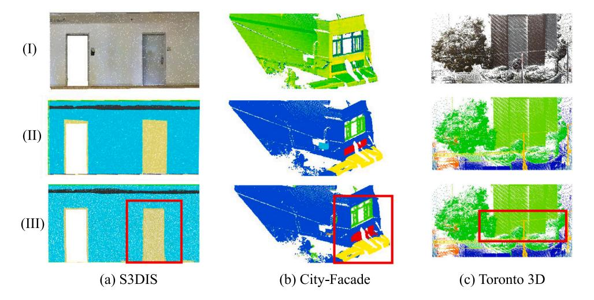

Fig. 1. Illustration of key challenge in semantic segmentation of real-world point cloud. The proposed method demonstrates a significant advantage in addressing the segmentation of adherent objects.

Zhang et al., 2023a; He et al., 2023; Jiang et al., 2023a; De Gélis et al., 2023). Early methods, such as PointNet (Qi et al., 2017a) and PointNet++ (Qi et al., 2017b), were groundbreaking in their application of convolutional neural networks (CNNs) to point cloud, allowing for processing in an unstructured manner. However, due to the inherent limitations of fixed-size and fixed-pattern convolutional kernels, these approaches overlook structural relationships between points of the same object, making it challenging of segmentation to effectively handle adherent and occluded instances. To address these limitations, researchers have developed various methods that better capture local features and structural relationships. Sparse convolution techniques, such as those used in MinkowskiNet (Choy et al., 2019) and SPVCNN (Tang et al., 2020), efficiently process 3D data by focusing on non-empty spaces, improving computational efficiency and accuracy in capturing local features. Transformer-based models, such as Point Transformer (Zhao et al., 2021) and Stratified Transformer (Lai et al., 2022), leverage self-attention mechanisms to dynamically capture both local and global relationships between points. While these methods have shown superior performance in tasks like segmentation and classification, representing a significant advancement, they still struggle with capturing complex structural relationships in scenes with homogeneous structures.

To provide a more detailed description of local structure and object relationships, point cloud is represented as the graph with sets of vertices and edges. 3DGNN (Qi et al., 2017c) builds a k-nearest neighbor graph on the point cloud, employing a graph-based strategy for message passing in point cloud processing. DeepGCNs (Li et al., 2019a) incorporates the idea of dilated convolutions into graph structure to construct non-local features. However, point cloud often exhibit non-uniformity and inconsistent density distribution, making traditional graph representations inadequate in fully considering local and global relationships. 3D-GCN (Lin et al., 2020) utilizes deformable convolutional kernels to learn 3D shapes and weights, extracting point cloud structures of arbitrary shapes and sizes. The excessive local focus leads to insufficient learning of the global relationships in point cloud, resulting in unclear segmentation of adherent indoor objects with similar structures. GACNet (Wang et al., 2019a) uses attention to assign weights in the graph for adapting to the spatial information. Dynamic Graph (Wang et al., 2019b) applies convolution operations on the edge set of the graph to explore geometric relationships, giving it translational invariance and non-local characteristics. Therefore, the representation of point cloud spatial structure must fully consider the fusion of local and contextual features based in the distance-weighted relationship in the neighboring context to segment adherent instances.

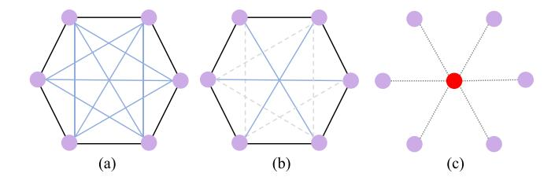

**Fig. 2.** Diagram of graph structure with its complexity. (a) Fully connected graph, (b) 3-regular graph, and (c) virtual node graph. The complexities are  $O(V^2)$ , O(V+E), O(V), respectively, where V and E denote the vertex and edge in graph.

The graph represents the structure and topology of points, while the Transformer learns the similarity of the features and attributes of points and dynamically updates the weights of points in the graph. The local structure information learned in Graph is incorporated into the attention mechanism to obtain the feature neighbors and the weight of the edges. The graph priors can be added as inductive biases in Transformer to effectively handle point cloud relationships. Local features of graph represent the structural and topological relationships of nodes, while Transformer consider node feature and attribute similarity through both local and global features. Therefore, Graph Transformer maintains the sparsity and locality of graphs while incorporating longrange dependencies and overall graph characteristics, which is crucial for understanding complex information.

The global association of the graph is closely related to computational complexity. The global message passing mechanism of probabilistic graph models is widely used in graph and graph Transformer, as shown in Fig. 2. GraphGPS (Rampášek et al., 2022) combines local message passing and global attention mechanism. Such fully connected graph has poor scalability and results in computational complexity that scales quadratically with the number of nodes. This cost is unacceptable for point cloud. To accommodate dense point sets and improve scalability, Performer (Choromanski et al., 2020) allows for a sparse attention mechanism in the graph. Redundant costs are reduced by avoiding the use of full attention. K-regular graph is able to randomly select edges as attention pattern for message passing, but the contributions of points are hard to distinguish. Meanwhile, sparse graph and attention exhibit lower adaptability in structurally compact indoor scenes. We need to find a trade-off between the efficiency of global message passing and structural perception to establish an effective Graph Transformer for high performance semantic segmentation, enabling the segmentation of adherent point cloud objects.

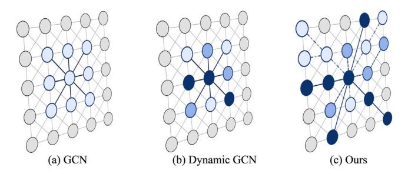

Fig. 3. Schematic of different graph models. (a) Traditional graph convolutional network (GCN); (b) Dynamic/Deformable GCN/graph attention network; (c) The proposed graph Transformer architecture with higher scalability, stronger feature passing and representation capabilities.

To this end, we propose a Graph Transformer 3D point cloud semantic segmentation network tailored for structurally adherent objects, named Adaptive-Structure Graph Transformer (ASGFormer). The network addresses two key challenges: (a) the difficulty in effectively segment homogeneous adherent structures in large-scale point cloud and (b) high computational overhead associated with global message passing mechanism. Firstly, spatial distance feature index is incorporated into the graph model, adaptively learning the neighborhood spatial structural relationships and feature differences of the point cloud. Secondly, dynamic weights in graph attention effectively represent global features in the neighbor graph, as shown in Fig. 3. To our knowledge, this is the first instance of such an approach. Finally, virtual nodes are placed between layers to optimize graph learning, simulating global message passing, reducing information loss in sampling while maintaining efficiency. Our main contributions are summarized as follows:

- A pyramid Graph Transformer with dynamic adaptive capabilities is proposed to effectively address the challenges of adherent structures in complex scenes.
- Spatial distance and feature differences are utilized to optimize the structural relationships of the point cloud.
- The spatial relationships and global features are correlated in the graph attention to overcome the constraint of limited expression in local feature propagation and improve the ability to segment adherent objects.
- The virtual nodes in hierarchical layers aggregate and distribute global context into multi-scale features, reducing information loss at the graph ends and promoting fine-grained understanding.

#### 2. Related work

#### 2.1. Graph-based semantic segmentation

Point cloud segmentation methods typically focus on the feature extraction of individual points and do not take into account the relationships between adjacent points. The feature updates of each point could not be independent of each other. Drawing the features of correlated or uncorrelated points closer or farther is beneficial for robustly distinguishing different objects. NAS-GNNs (Xu et al., 2023a) illustrated that GNNs possess expressive power without training. 3DGNN (Qi et al., 2017c) built a k-nearest neighbor graph on the 3D point cloud. Joint reasoning about appearance and geometric structure, every node of graph dynamically updates its current status and incomes message passing, and finally predicts the semantic class of each node. SPG (Landrieu and Simonovsky, 2018) segmented the point cloud into geometrically homogeneous elements and exploits the graph to encode their relationships. Using topological graphs for feature extraction and processing of point clouds is a very useful idea. 3DEGCN (Cho and Choi,

2018) unified graph convolution and vector learning to handle the topological structure of graph. Point-GNN (Shi and Rajkumar, 2020) simultaneously used point features and edge features to capture a comprehensive representation. Point features represent the characteristics of each point, while edge features reflect the relationships between points. A rich feature representation is built by aggregating neighbor points at different levels. RGCNN (Te et al., 2018) utilized regularized graph network for point cloud segmentation. LocalSpecGCN (Wang et al., 2018a) used spectral graph convolution and graph pooling on local graphs to overcome the problem of neglecting point layout, effectively strengthening the topological relationships between points. Topology characterize the structural relationship of point cloud. However, it is difficult to distinguish structurally similar or homogeneous objects solely based on topology.

The weight update of each point is not only related to the features of that point, but also to the features of the nearest neighbors around it. DGCNN (Wang et al., 2019b) introduced the concept of dynamic graph and GeomGCNN (Srivastava and Sharma, 2021) used local geometric information to augment the vertex representations. Deep-GCNs (Li et al., 2019a) incorporated dilated convolution into graph to preserve structural information with dynamic manner. In traditional graph strategies, convolutional feature correspondences become indistinguishable among point cloud, giving rise to an intrinsic limitation in poor distinctive feature learning. SphereNet (Liu et al., 2022b) conducted graph analyses in the spherical coordinate system for the complete identification of 3D graph structure, and used spherical message passing to perform large-scale graph learning. 3DGraphSeg (Geng et al., 2023) constructed local embedding super-point graph, and proposed a gated integration GCN to segment the graph. Fixed-shape and fixed-range convolutions cannot adapt to diverse structures, and the differences in adherent objects become smoothed within a local receptive field.

Inspired by the attention strategies, many efforts were made to allocate appropriate weights to different points. Geometric attentional EdgeConv (Cui et al., 2021) incorporated extrinsic geometric topological prior into EdgeConv of DGCNN, which captures the intrinsic feature likelihood of point cloud. PU-GACNet (Han et al., 2022) assigned different attentional weights to combine spatial positions and feature attributes dynamically. GACNet (Wang et al., 2019a) proposed dynamic kernels to adapt to the structure of an object. And SGAT (Ye and Ji, 2021) learned sparse attention coefficient. 3D-GCN (Lin et al., 2020) developed deformable kernels, and focused on scale-invariant and shift properties of point cloud. AGConv (Wei et al., 2023) also generated deformable and adaptive kernels based on the dynamically learned features, outperforming in the fields of completion, denoising, and registration. Our goal is to learn relationships between objects by dynamically updating the weights of point features. It is crucial for point cloud segmentation that taking into full consideration the differences in features and spatial distance relationships. Adherent objects are able to distinguished by identifying inherent differences, either in features or structure.

## 2.2. Transformer-based semantic segmentation

As a sequence of spatial data, 3D point cloud naturally lends itself to application of Transformer. Point Transformer (Zhao et al., 2021) constructed self-attention layer by vector attention for point cloud shape classification and semantic segmentation. PCT (Guo et al., 2021) proposed an offset-attention with implicit Laplace operators and normalization refinement for Transformer blocks. PAT (Zhang et al., 2022a) computed attention map in the smaller set and used multiscale attention to build attentions among features of different scales. SPT (Robert et al., 2023) introduced hierarchical superpoint structure, and then a self-attention was employed to capture the relationships between superpoints at multiple scales. However, refining the segmentation of local region risks compromising the structural integrity of the instances.

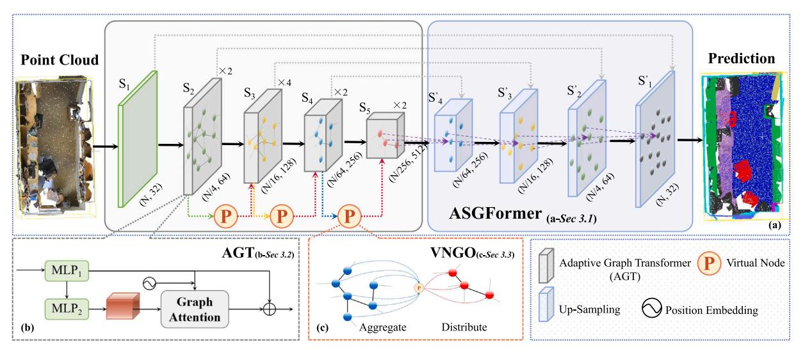

Fig. 4. Overall framework diagram of Adaptive-Structure Graph Transformer (ASGFormer) for point cloud semantic segmentation; The network is designed as an end-to-end pyramid architecture, from Section 3.1; Multi-layer Adaptive Graph Transformer (AGT) blocks are incorporated into the architecture to dynamically learn the structural weights and feature relationships of points, from Section 3.2; The utilization of Virtual Nodes for Graph Optimizing learning (VNGO) are applied between network hierarchies, from Section 3.3.

Point Transformer V2 (Wu et al., 2022) presented the more effective group vector attention with weighted encoding and additional position encoding multiplier. Further, the Point Transformer V3 (Wu et al., 2023) has focused on overcoming the trade-off between accuracy and efficiency within the Transformer architectures. Considering the implicit relationship between semantic and instance segmentation, the unified Transformer-based framework (Kolodiazhnyi et al., 2023) is established to perform semantic and instance segmentation consistently with the learnable kernels. ConDaFormer (Duan et al., 2024) built the local window by three orthogonal 2D planes to capture local priors. The inter-connections between neighboring local regions remain underexplored, despite their significance in Transformer-based 3D point cloud models.

LCPFormer (Huang et al., 2023) exploited the message passing in neighbor regions and made their representations more discriminative and informative. Local Transformer (Wang et al., 2022) used cross-skip selection of neighbors to capture similarities and geometric structure in a larger receptive fields. Stratified Transformer (Lai et al., 2022) adopt contextual relative position encoding to adaptively capture position information in a stratified way. SPoTr (Park et al., 2023) designed self-positioning point-based global cross-attention to adaptively locate points based on the input shape. OctFormer (Wang, 2023) introduced the dilated octree attention to expand the receptive field for shaperobust of point cloud understanding. Transformer broke the limitations of local receptive fields and could learn the relative positional relationship between points. However, the weights influenced by relative position and features remained non-learnable in previous methods.

#### 2.3. Incorporating graph into transformer

In the graph, nodes and edges represent objects and relations between objects, respectively. In Transformer, nodes can function as sequential units, and edges can serve as the links between these units. Applying Transformer to graph significantly enhances the representational capability of the graph, making it suitable for searching relationships between points with larger non-local receptive fields. RT (Diao and Loynd, 2022) generalizes Transformer attention to consider and update edge vectors in each Transformer layer, making it successful to greater expressivity of graph. GTNs (Yun et al., 2019) is Graph Transformer Networks, which involve identifying significant connections among unconnected nodes on the original graph, while learning node representation. GraphGPS (Rampášek et al., 2022) employed position embedding, local message passing and global attention mechanism to

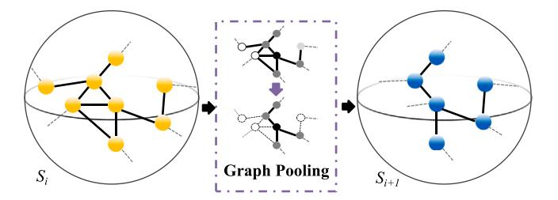

Fig. 5. Illustration of graph pooling.

enhance scalability of graph. AutoGT (Zhang et al., 2022b) proposes an encoding-aware estimation strategy to jointly optimized Transformer and graph learning. However, these studies have not yet been applied to point cloud analysis and understanding. Upon modeling graph representation with learnable weights, Transformer is embedded to encode weights and point features, determining the similarity between points. Semantic segmentation is achieved by combining graph and Transformer, and the relationships between points are dynamically optimized to separate adherent objects.

#### 3. Method

To tackle the challenge of effectively distinguishing structurally adherent objects in existing point cloud semantic segmentation algorithms, we introduce a Graph Transformer network named ASG-Former with dynamic adaptive capabilities. The overall framework is illustrated in Fig. 4.

### 3.1. ASGFormer architecture

The proposed ASGFormer is designed as an end-to-end semantic segmentation architecture with pyramid structure. The backbone network comprises encoder and decoder modules employing uniform scale strategy, as depicted in Fig. 4(a). The five stages in the encoder are denoted as  $\{S_1, S_2, S_3, S_4, S_5\}$ , where  $S_1$  is a MLP layer, and  $S_2 - S_5$  are composed of MLP and AGT blocks with  $\{2, 4, 2, 2\}$  layers, respectively. We incorporated virtual nodes between each stage to facilitate global message passing across the entire graph.

To preserve the spatial structure of point cloud while reducing its resolution, we devised graph pooling to construct feature pyramid, as

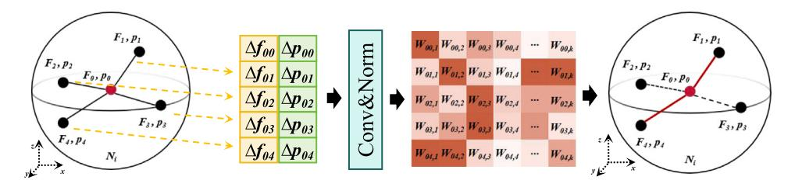

Fig. 6. Pipeline of weighted feature formation process. The proposed method is able to adaptively feedback the graph with structural importance according to the weighted features, and adjust the graph by dynamically updating the weights.

shown in Fig. 5. Given the input feature  $F^s$  at s stage, max pooling is performed within the neighborhood of current center point. The processing of graph pooling is formulated as follows:

$$F'^{s} = max - pooling(T_{ij}^{s}; j \in N(i))$$
(1)

where N represents the number of points in the local point set  $P=\{P_n|n=1,2,\ldots,N;P_n\in\mathbb{R}^3\}$ , j denotes the neighbors of the center point i, and  $T^s$  represents the output of AGT block. As per Eq. (1), the relative positional relationships within the local neighborhood can embed spatial information into neighbor features in a non-learnable manner. Following PointMeta (Lin et al., 2023), max pooling as a special form of self-attention, exhibits sparsity and comparable feature aggregation capability to learnable aggregation functions.

Through layer-wise graph pooling for point cloud down-sampling, the output feature dimensions at each stage are respectively [N,32], [N/4,64], [N/16,128], [N/64,256], and [N/256,512], where the first parameter represents the number of points, the second represents the feature channel dimension, and N denotes the number of points in the original input point cloud.

For the point-wise segmentation, we adopt the U-Net framework to design network that couples the encoder and decoder. The role of decoder is to interpolate the learned features with nearest neighbor interpolation to match the resolution of original point cloud. During this process, in s stage, we search for three nearest neighbors of s-1stage. Then, we calculate the weighted sum of features for these three nearest neighbors' distance to achieve feature mapping. The decoder is organized with a series of interpolation modules corresponding to the encoder. These modules perform continuous interpolation to map down-sampled point set to the scale of the layer with higher resolution. Therefore, the decoder stages are labeled to correspond with the encoder as  $\{S'_1, S'_2, S'_3, S'_4, S'_5\}$ . Additional skip connections fuse the features of corresponding scales between the encoder and decoder. In the final stage of the decoder, feature vector is computed for each point, and then MLP is employed to generate final segmentation results with  $N_{cls}$  dimension.

#### 3.2. Adaptive graph transformer block

The Adaptive Graph Transformer (AGT) block is illustrated in Fig. 4(b). This module consists of multiple layers, including MLP, graph attention layer, position embedding, graph pooling, and residual connections. Given an input set of points  $P = \{P_n | n = 1, 2, \dots, N; P_n \in \mathbb{R}^3\}$ , where N denotes the number of points. Its corresponding features are formulated as  $F_P \in \mathbb{R}^d$ , where d denotes the dimension of features. We construct graph G = (V, E) in the point cloud,  $V \in P$  represents the set of vertices, and  $E \subseteq |V| \times |V|$  represents edge sets. Due to the density-independent nature of the fixed-radius sampling strategy with point cloud, we employ the fix-radius farthest point sampling strategy to select  $N(i) = \{j; (j, i) \in E\} \cup \{i\}$  neighbor points for each vertex i, determining the local geometric structure of each point set. We use  $\Delta p_{ij}$  to represent the positional offset between vertex i and its neighbor vertex j. Moreover, we use MLP to extract features for vertex i and vertex j, denoted as  $F_i$  and  $F_j$ , respectively. The feature difference

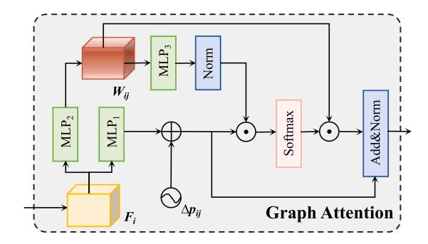

Fig. 7. Illustration of graph attention with details.

is represented as  $\Delta f_{ij} = F_i - F_j$ . Therefore, the weighted feature of neighboring point j with respect to vertex i is formulated as Eq. (2):

$$\Delta F_{ij} = M L P(\Delta f_{ij} \oplus \Delta p_{ij}) \tag{2}$$

where  $\oplus$  denotes the feature concatenation by channels. We implicitly embed spatial information with relative positional relationships into the features. Later, different weights for various similarities are constructed based on relative position and feature differences, as shown in Eq. (3):

$$W_{ij} = \frac{exp(F_{ij,k})}{\sum exp(F_{i,k})} \tag{3}$$

where k represents the kth channel to ensure the independence of channel features. Simultaneously, normalization is used to eliminate spatial differences caused by different scales. In contrast to traditional convolutional features, the obtained  $W_{ij}$  is a covariance matrix that records the relationships of point features. As shown in Fig. 6, the weighted feature is able to adaptively allocate weights for feature aggregation based on the spatial position of points and feature differences, preserving the spatial structure of objects.

Inspired by Point Transformer (Zhao et al., 2021), we design graph attention layer, as shown in Fig. 7. The input to this layer includes  $F_i$ , weighted feature  $W_{ij}$ , and the relative position  $\Delta p_{ij}$ . Attention calculation is performed using  $F_i$  as the query,  $W_{ij}$  as key and value, and  $\Delta p_{ij}$  as the position embedding, as description in Eq. (4):

$$Attn = softmax((\phi F_i + \Delta p_{ij}) \cdot \varphi W_{ij}) W_{ij}$$
(4)

where  $\phi$  and  $\varphi$  denote the MLP function. Relative position  $\Delta p_{ij}$  as explicit position embedding is able to avoid the issue of imbalanced neighbor points' feature caused by implicit position embedding. Finally, the output of graph attention is formulated as Eq. (5):

$$T_{ij} = Norm(Attn + \phi F_i) \tag{5}$$

We follow the strategy of ASSANet (Qian et al., 2021), applying an MLP before determining the neighborhood to reduce floating-point calculations. However, this strategy cannot set relative position as input to the MLP, so the weighted features implicitly incorporating position information is able to naturally handle this. In summary, given *P* and

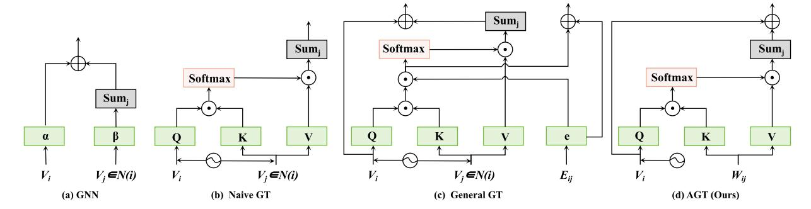

Fig. 8. Different graph transformer architectures. Unlike GCN and Naive GT, AGT takes into account edge information and incorporates structural details. Furthermore, it optimizes the structure of General GT and avoids the dual-branch pathway strategy by using structural weights.

 $F_p$ , the AGT block aggregates neighbor structural features and utilizes graph attention to generate new features for all points. During this process, the relationships between points are dynamically adjusted to align with the optimal object structure.

Analysis: Transformer is able to perform a weighted linear transformation on tokens based on their importance to update the current token. Graph neural networks (GNNs) update the feature of central vertex by aggregating the neighbor features on the graph. From the connectivity structure, it can be observed that the Transformer and GNNs are coupled. Previous graph attention networks are sparse, considering only neighbor vertices, while Transformer is a fully connected architecture that takes into account all vertices. In contrast, Graph Transformer introduces the topological structural properties of graph on the basis of global context information, providing the model with structural spatial priors in high-dimensional space. We analyze different model designs, as shown in Fig. 8.

When considering the graph, the neighbor aggregation function can be formulated to Eq. (6):

$$F_i' = \sigma(\alpha F_i + \sum_{j \in N(i)} (\beta F_j)) \tag{6}$$

Further, the process of combining graph and Transformer (Naive Graph Transformer) can be represented as updating the features of vertex i through its neighbor vertex j, as described in the Eq. (7):

$$F_i' = \sum_{j \in N(i)} Attention(Q_{F_i}, K_{F_j}, V_{F_j})$$
 (7)

This indicates that attention weight for each pair of (i,j) is calculated based on the  $F_i$  and  $F_j$ , and then the feature of vertex i is updated through the weighted accumulation of all attention weights for j. But we still need to pay attention to the following aspects:

Firstly, leveraging edge features is a key factor in achieving a dynamic graph. Edge features represent relationships between pairs of vertices, reflecting implicit attention scores. While the score obtained after multiplication of  $Q_{F_i}$  and  $K_{F_j}$  represents the implicit information about edge  $\langle i,j \rangle$ , not all edges are necessarily available. An elementary attempt is to incorporate edge features into the attention calculation process as Eq. (8):

$$F_i' = \sum_{i \in N(i)} (softmax(Q_{F_i} \cdot K_{F_j}) \cdot E_{i,j} V_{F_j})$$
(8)

This introduces a new issue, as the network must maintain a separate pipeline to propagate edge attributes, which is redundant (See Fig. 8(c)). On the contrary, in our dynamic graph structure, the relationships between edges are concealed in the weighted features  $W_{ij}$ , and these edge relationships are learnable. Therefore, using the weighted features containing edge attributes and neighbor point features as K and V, attention scores can be computed based on similarity and importance, see Eq. (4). Note that this edge attribute is sparse, in contrast to the fully connected Transformer.

Secondly, position information is essential. In Transformer, the structural bias is explicitly given as a form of position embedding.

The absolute position embedding is significantly useful at learning contextual representations of tokens in different positions. However, it is not straightforward to capture vertex spatial information in the graph. To this end, we consider topological priors represented by relative position information as relative position embedding. It contains more explicit knowledge between pairs of vertices. Graph Laplacian Matrix represents connectivity in terms of both adjacency and node degree of graph. It has to be said that the Laplacian matrix primarily focuses on local information and may have limited adaptability to dynamic graph structures. In dynamic graphs, the relationships between nodes and edges undergo frequent changes. Therefore, more flexible approaches that can capture both global and local variations might be more suitable.

We believe the edges connecting them should be considered in the correlation. We represent the relational information between (i,j) as a vector  $W_{ij}$ . Let  $W_{ij}$  serve as an implicit position embedding, which is able to complement global relationships while focusing on neighbors. We modify the attention score formula as follows:

$$\Phi_{ij} = Q_{F_i} \cdot K_{F_i} + W_{ij} \tag{9}$$

 $K_{F_j}$  incorporates  $W_{ij}$ , as explained in the previous context, allowing Eq. (9) to eliminate unnecessary addition computations. Position information is able to communicate directly with the attention mechanism in our approach. In order to explicitly capture the effect of neighboring points on i, we still apply explicit positional embedding to  $Q_{F_i}$ , preventing the imbalance of neighboring point features, as shown in Eq. (4).

The third issue is the over-smoothing and over-squashing in GNNs. The receptive field of vertex becomes larger, leading to an increase in the number of shared neighbors between two vertices. Therefore, the feature embeddings of two vertices become more similar. As shown in Fig. 7, we add different MLPs as linear layers to increase the expressive power of the network. These MLP layers serve as pre-processing step without message passing. Furthermore, we introduce residual skip connections in both the overall network and AGT blocks, allowing the updated features to reference the mappings from previous layer. This is a long-range residual connections from the input to last layers instead of multiple short-range connections in the original Transformer. It alleviates the over-smoothing problems in the message passing while alleviating vanishing gradient issues.

Analyzing Eq. (6), as a general form of neighbor message passing operation, an assumption is proposed: the local topology of the graph may lead to over-squashing. If a vertex has many neighbors, it may reduce the mapping of features from distant points, leading to an information bottleneck, specific arguments can be found in Ref. Topping et al. (2021). However, our approach introduces a new way of association by incorporating edge weights while preserving the local geometric topology. The attention weight enhances the feedback from available vertices and also increases the available edges from distant vertices. In addition, virtual nodes are also able to alleviate over-squashing to some extent, as will be analyzed in detail in the next section.

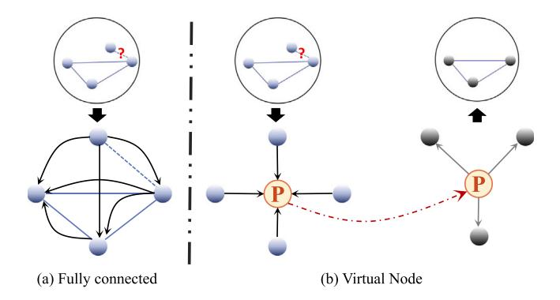

Fig. 9. Diagram of information passing in fully connected manner and virtual node.

Graph Transformer introduces the topological structural properties of graph on the basis of global context information, providing the model with structural spatial priors in high-dimensional space. The advantages of our AGT are as follows: (1) Achieved stronger representation to capture complex relationships between vertices. (2) Acquired the ability to model long-range dependency. (3) Alleviated issues of over-smoothing and over-squashing in message passing.

#### 3.3. Virtual nodes to graph optimize

In order to effectively preserve local and global information during the process of feature learning and transformation, we introduces the specific virtual nodes connected to all vertices in the graph, as shown in Fig. 4(c). The virtual node facilitates global message passing more effectively without affecting the original vertices and edges attributes.

The vertex at the end of graph may be lost during the neighborhood update and sampling process, as shown in Fig. 9. Therefore, a mechanism is needed to maintain the consistency of graph structure. One strategy is to employ a fully connected approach for message passing, similar to conditional random fields (CRF), but it is evident that this is not suitable for larger graphs. The virtual node is able to establish relationships with all vertices (adjacent to all vertices and connected to all edges), enabling the possibility of global message passing. This operates independently of AGT and serve as a complementary information aggregation for both global-vertex and global-edge contexts. Boosting Graph Structure Learning (Liu et al., 2022a) has demonstrated almost all graph models benefit from the inclusion of virtual nodes.

For each layer, we introduce virtual node  $P_b$  to facilitate message passing, acting similar to a centroid in the graph to preserve its geometric structure.  $P_b$  establishes edges  $E_{bj}$ ;  $j \in N(i)$  to all vertices in the graph. The formulation of virtual node aggregation is expressed as follows:

$$B^{s} = \frac{1}{N(i)} \sum_{i \in N(i)} F_{j}^{s} E_{bj}^{s} \tag{10}$$

Note that we opted for summation, which is more easily normalized, rather than concatenation. After aggregating the features of all vertices j at the  $P_b$ , the virtual node is passed to the next s+1 stage of the network. Global features are distributed by the virtual node in the graph of the next layer. The mathematical expression for distributing features can be formulated as:

$$F_{j'}^{s+1} = B^s E_{j'b}^{s+1} \tag{11}$$

The virtual node is considered as a potential central node, which is connected to the vertices of the graph through special edges. The virtual node serves as a temporary storage space (information repository) for global context, facilitating long-distance message passing and ensuring the sharing of information for each vertex.

#### 4. Experiments

In the experiments section, we provide a detailed exposition of the experimental details and conduct thorough analysis. Firstly, the datasets, evaluation metrics, experimental platform, and parameter settings are elucidated. Subsequently, we comprehensively demonstrate the effectiveness and necessity of the proposed method through qualitative and quantitative experiments. We compare our method with a series of state-of-the-art algorithms, drawing meaningful conclusions. Finally, controlled ablation experiments are set up to validate the necessity of each module.

#### 4.1. Datasets and evaluation metrics

S3DIS: The Stanford Large-Scale 3D Indoor Space Point Cloud Dataset (Armeni et al., 2016) comprises 271 rooms from six teaching and office areas in three different buildings (designated as Area 1–6). The scenes encompass 11 different locations, including office areas, conference rooms, stairways, educational and exhibition spaces, restrooms, open spaces, lobbies, personal offices, and hallways. The semantic labels consist of 13 categories, such as table, chair, ceiling, floor, wall, door, window, sofa, and clutter. Out of the six regions, five are utilized for training, while Area 5 is reserved for validation and testing.

**ScanNet v2:** ScanNet (Dai et al., 2017) is an RGB-D indoor environments dataset that contains reconstructed indoor scenes with rich annotations for 3D semantic labeling. It provides 1513 scenes for training and 100 scenes for testing. The dataset provides 40 class labels, while only 20 of them are used for performance evaluation.

**City-Facade:** City-Facade is a new dataset for real-world urban building facade semantic segmentation. This dataset is labeled with 8 semantic classes from various building styles, including wall, window, door, roof, advertisement, air condition, rain shed, and balcony.

**Toronto 3D**: Toronto 3D (Tan et al., 2020) is a large-scale urban outdoor point cloud dataset with 8 labeled object classes. This dataset is divided into four sections, and each section covers road about 250 m. All points were preserved from real-world scenarios.

**Semantic KITTI:** Semantic KITTI (Behley et al., 2019) is one of the largest urban point cloud dataset for semantic segmentation. This dataset covers 40 km with 4.5 billion points, and is labeled with 25 classes. Semantic KITTI is more focused on autonomous driving tasks.

**Evaluation Metrics**: It includes the class-wise mean of intersection over union (mIoU), class-wise mean of accuracy (mAcc), and point-wise overall accuracy (OA). For S3DIS, we use all three evaluation metrics. For ScanNet, mIoU is used for evaluation. And IoU is utilized for class-level evaluation. For City-Facade, Toronto 3D, and Semantic KITTI, we use mIoU for semantic segmentation evaluation.

# 4.2. Experimental setups and data augmentation

**Experimental Setups:** We trained our models using CrossEntropy loss with label smoothing, AdamW optimizer, an initial learning rate  $lr=1e^{-2}$ , and weight decay  $10^{-4}$  with Cosine Decay, in a NVIDIA 80G A100 GPU. The best model on the validation set is utilized for testing. For S3DIS and City-Facade segmentation, point cloud are voxel downsampled with a voxel size of 0.04 m. For ScanNet, the voxel size is set to 0.02 m. For Toronto 3D and Semantic KITTI, the voxel size of outdoor semantic segmentation is set at 0.08 m.

**Data Augmentation**: We follow PointNeXt (Qian et al., 2022) and use data scaling, height appending, and color drop for data augmentation.

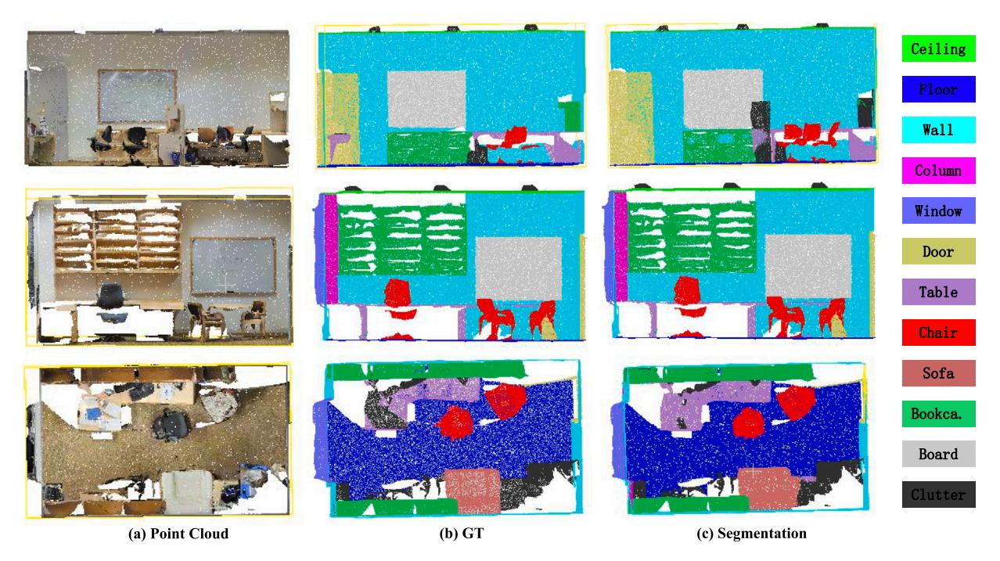

Fig. 10. Visualizations results of proposed method on the S3DIS dataset.

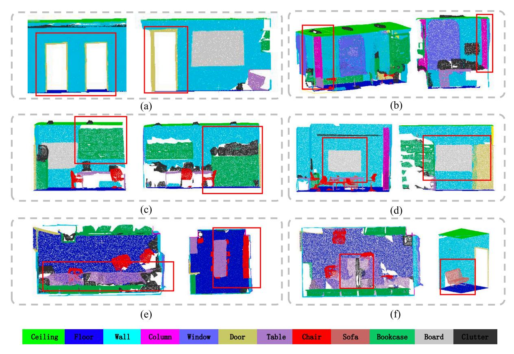

Fig. 11. Representative visualizations results of proposed method on the S3DIS dataset.

# 4.3. Qualitative evaluation

S3DIS: The representative segmentation results of ASGFormer are shown in Figs. 10 and 11. From the figure, it can be observed that ASGFormer accurately segments the boundaries of objects in complex

indoor scenes, especially for some adherent structures, closely resembling the ground truth labels. We analyzed the advantages of our method in segmenting structural adherent targets under six different conditions. The segmentation effect of ASGFormer on door frames embedded in the wall is demonstrated in Fig. 11(a). Even though wall points occupy a significant proportion, points belonging to the door can

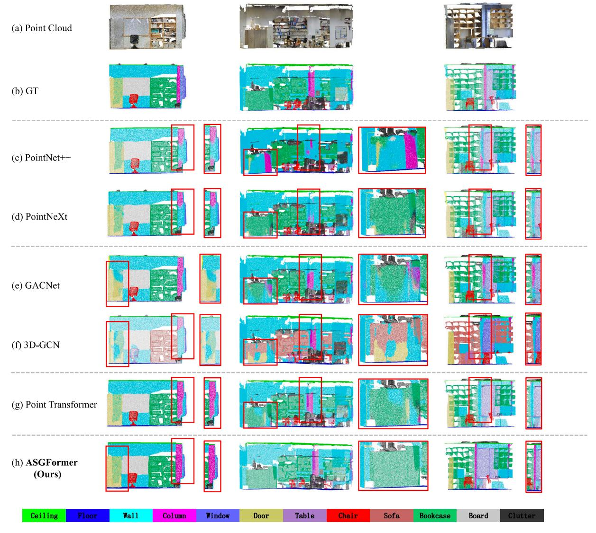

Fig. 12. The visual comparison between ASGFormer and state-of-the-art methods on the S3DIS dataset.

still be captured by the Graph Transformer with global awareness. The most typical scenario is illustrated in Fig. 11(b), where columns are the most challenging targets to segment in indoor architectural scenes due to their strong similarity and consistency with the material, texture, and structure of the walls. During the process of feature learning and back-propagation, the graph with dynamically adjusted weights can bring similar or dissimilar points closer or push them apart in terms of features and structure. By increasing within-class similarity and interclass dissimilarity, ASGFormer performs excellently in distinguishing between walls and columns. Fig. 11(c)(d) reflect two other types of structures embedded in the walls, bookcase and board. It can be observed that the segmentation of two types has clear edges, without noise. Moreover, the objects are separated from other instances while being segmented from the wall, such as the clutters on the bookcase and the board attached to the bookcase. Fig. 11(e) and (f) demonstrate the segmentation capability in capturing fine details. The clutters on the table, and the chair against the wall and table, maintain their original complete structures and fine contours. Additionally, the legs of the sofa can also be accurately segmented.

The proposed method is compared with the visualization results of five algorithms including PointNet++, PointNeXt, GACNet, 3D-GCN, and Point Transformer. The visualization comparison is presented in Fig. 12. Point based methods like PointNet++ and PointNeXt extract

the local features in different receptive fields. However, in indoor scenes, the excessive number of points on the walls leads to adherent structures sharing the same features with the wall. One point represents many local features, and the absence of a single point can affect the robustness of the network. Graph-based methods outperform pointbased methods. Although deformable graph convolutions and graph attention are able to alter the limitations of fixed point convolution to adapt to different object structures, they still cannot distinguish relationships between classes within the local receptive field. Obviously, methods based on attention and Transformers enhance the integrity of the structure. However, such methods lack adaptability to the structure, resulting in a lack of clarity in local fine structures. The proposed ASG-Former integrates the advantages of graph structure and Transformer, effectively combining local understanding with global perception. This ensures the recognition of intra-class structures while meeting the differentiation of inter-class structures. As shown in Fig. 12, our method significantly enhances the segmentation of adherent structures.

**ScanNet:** The representative segmentation results of ASGFormer on ScanNet are shown in Figs. 13 and 14. The three representative scenes are displayed, where ROI are in red boxes. In Fig. 14(a), fine indoor items are segmented with clear contours, such as windows, toilets and washing machines. Similar to S3DIS, in ScanNet, we still maintain an advantage in segmenting building structures that are adhere to the

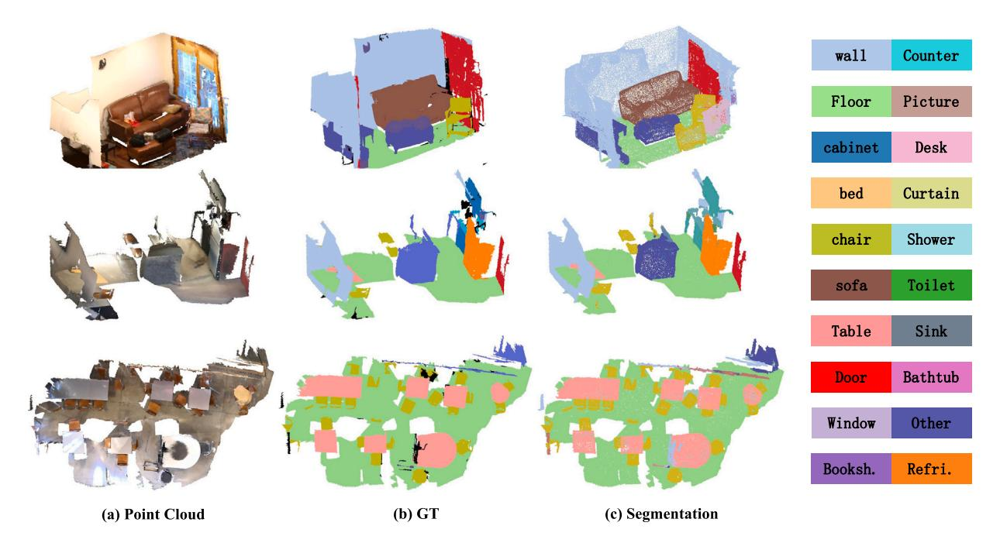

Fig. 13. Visualizations results of proposed method on the ScanNet dataset. (For interpretation of the references to color in this figure legend, the reader is referred to the web version of this article.)

walls (See Fig. 14(b)). The doors adhered to the walls (even cases where doors intersect with walls) and bookshelves are accurately identified. Moreover, the outlines and details of furniture such as tables, chairs, and sofas are well-preserved, as shown in Fig. 14(c). City-Facade: The representative semantic segmentation of our proposed method on City-Facade are shown in Fig. 15, where ROIs in red boxes are represented the details. Obviously, for building facades, walls, windows, balconies, and advertisements share similar structural features, posing challenges for semantic segmentation. The proposed method accurately identifies the contours of adhesive structures and segments components embedded in the wall surface. Additionally, air conditioners mounted on the wall can also be recognized.

**Toronto 3D:** The representative semantic segmentation of our proposed method on Toronto 3D dataset are shown in Fig. 16. Four scenes were combined from left to right to form a complete area. The proposed method accurately segments building outlines from dense vegetation. In areas with complex feature relationships, different types of objects such as poles, trees, and cars are identified with clear structure. This part demonstrates the potential of the proposed ASGFormer in large-scale complex outdoor scenes.

## 4.4. Quantitative evaluation

**S3DIS Area-5**: Quantitative evaluation results for comprehensive testing and class-level comparison are shown in Tables 1 and 2, respectively. Following the S3DIS protocol, we validate using Area-5 of the data and compare with the state-of-the-art models (See Table 1). The OA, mAcc, and mIoU of our ASGFormer are 91.3%, 78.0%, and 72.3%, respectively. ASGFormer combines the strengths of 3D-GCN and Point Transformer. The metrics reflect the performance improvement relative to 3D-GCN (mIoU +20.4%) and Point Transformer (mIoU +1.9%). Compared to the previously leading graph algorithms AGConv, proposed ASGFomer has demonstrated improvements of 1.3%, 4.8%, and 4.4% in the three metrics. This implies that graph attention based on dynamic learning weights effectively combines global message passing and local topological structure, providing more robust representation capabilities for graph learning. Although ASGFormer has a 1.1% lower mIoU compared to the latest SOTA Point Transformer V3, there is still

a greater exploration space for the combination of Graph and Transformer. The advantages of ASGFormer are more focused on addressing the segmentation of structural adherent objects, which will be reflected in class-level metrics.

Additionally, we compared the proposed method with point cloud segmentation approaches based on different strategies, including voxel-based methods like SegCloud (addressing information loss caused by voxelization), continuous convolution-based methods like KPConv (mitigating the limited receptive field due to convolutional locality), and attention-based methods like PAT (simultaneously adjusting weights for feature vectors and channel relationships to eliminate attention shift under uneven density influence). Our architecture significantly enhances the effectiveness of graph model and Transformer framework in indoor 3D point cloud semantic segmentation applications.

As shown in Table 2, the class-level evaluation further highlights superiority of proposed ASGFormer. Among thirteen classes in the S3DIS dataset, six (floor, ceiling, door, chair, board, clutter) are achieved as the top-1 by our method, while three (wall, sofa, bookcase) become second-best. ASGFormer effectively distinguishes adherent objects within homogeneous structures: (1) Completely segmented architectural structures such as wall, floor, and ceiling. (2) Segmented columns that are consistent with the architectural structure. (3) Highprecision segmentation of door, bookcase, and board that are connected to the building structure. The unsatisfactory performance occurs in the category of windows, where our method exhibits a significant gap compared to the SOTA approach. This indicates that our method has a certain degree of neglect in detecting window borders (thin and small objects), and a similar situation occurs in ScanNet as well. The competitive sampling strategy of the PAT adds confidence scores to each sampled point, effectively avoiding the neglect of window boundary points by the farthest point sampling. The presented method is compared with the Point Transformer and 3D-GCN, as shown in Fig. 17(a). This is because our approach is inspired by the combination of these two methods. We exhibit a significant improvement compared to 3D-GCN, and thought there are some shortcomings in certain categories compared to Point Transformer, we still maintain a dominant

**S3DIS 6-fold:** We also conduct a 6-fold experiment on the S3DIS dataset. We achieved OA of 91.5% and mIoU of 77.2% ranking second

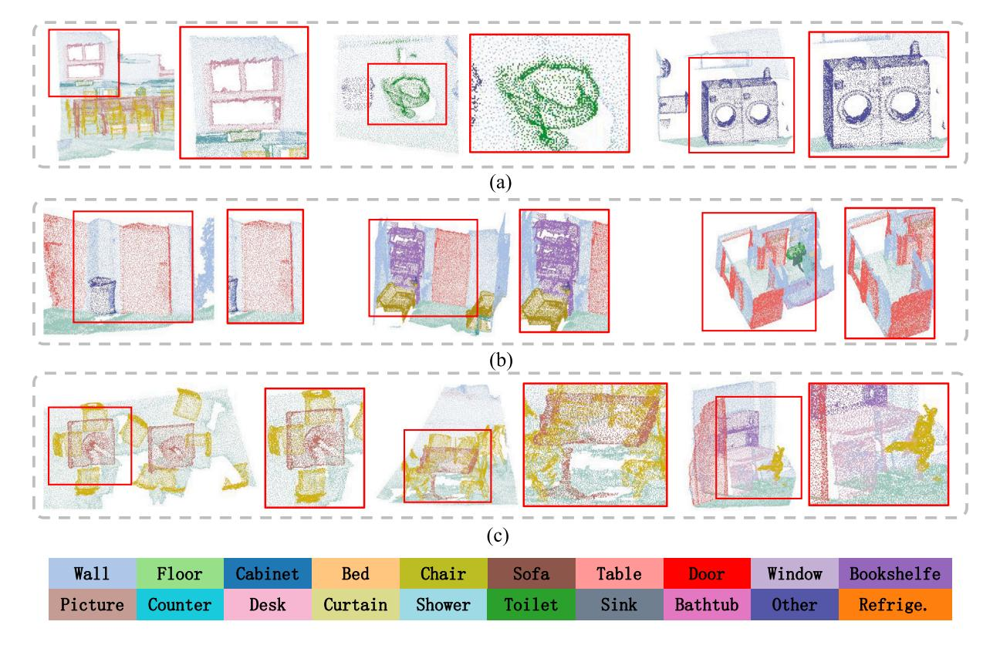

Fig. 14. The representative visualizations results of proposed method on the ScanNet dataset. (For interpretation of the references to color in this figure legend, the reader is referred to the web version of this article.)

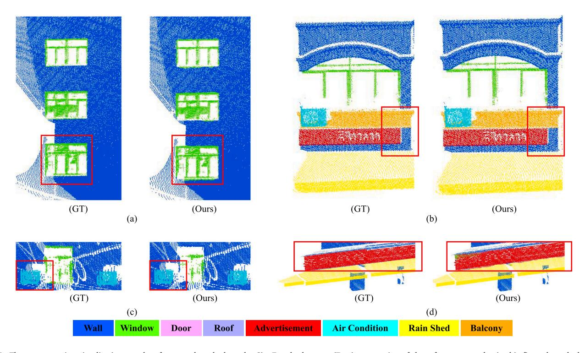

Fig. 15. The representative visualizations results of proposed method on the City-Facade dataset. (For interpretation of the references to color in this figure legend, the reader is referred to the web version of this article.)

among current methods, as shown in Table 3. The comparative results with 10 algorithms are shown in Fig. 18, highlighting our superiority in both OA and mIoU. We also calculated the IoU for each class in

the experiment, where wall, beam, bookcase, board, door, column are selected for comparison. We compared our method with the graph learning and Transformer algorithms, and the results indicate that our

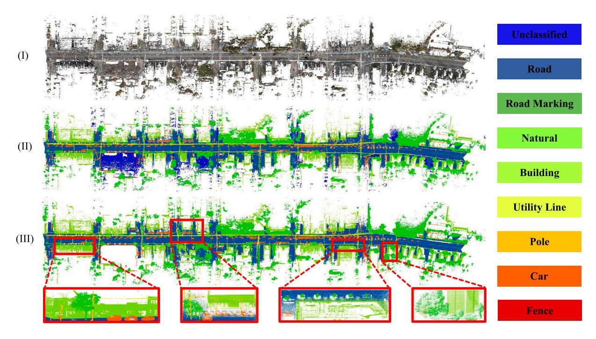

Fig. 16. The representative visualizations results of proposed method on the Toronto 3D dataset.

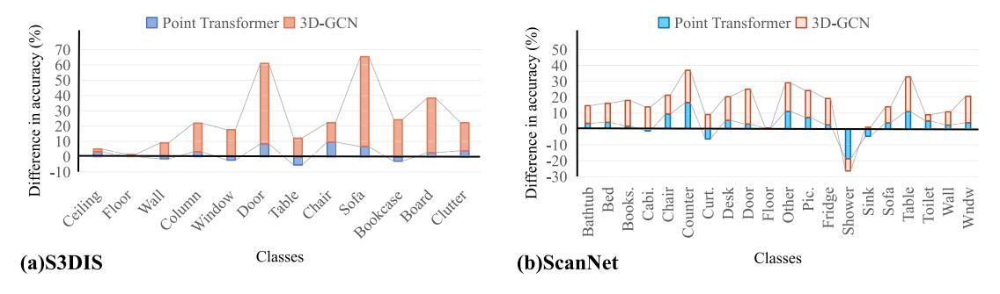

Fig. 17. Per-class IoU improvements of ASGFormer over different methods on two dataset, where ASGFormer is compared with Point Transformer and 3D-GCN.

approach is superior in addressing the issue of adherent structures. While SPT performs well in architectural structures (such as walls and beams) using super point Transformer, it tends to systematically aggregate points with similar structures when constructing super point graph, for instance, the boards on the wall.

ScanNet: Quantitative evaluation results for comprehensive testing and class-level comparison are shown in Tables 1 and 4, respectively. ASGFormer has an mIoU advantage of 2.2% over Point Transformer. Even more exciting is that we achieve improvements of 0.4% (GemoGCNN), 13.9% (SegGCN), 11.8% (SPH3D-GCN), 11.0% (HPEIN) over the previous series of graph-based methods. Our method achieves the top rank in fourteen out of twenty categories. Specifically, there is a clear advantage in the segmentation results related to the structural parts of buildings and furniture adhering to buildings. However, similar to S3DIS, our method is not well-suited for segmenting small ans tiny structure, such as shower and sink. The comparisons of per-class IoU with 3D-GCN and Point Transformer are presented in Fig. 17(b). In summary, our method achieves high-precision semantic segmentation through the dynamic graph Transformer with adaptive structure weights. The major contribution is the ability to segment structurally connected building components and indoor objects.

City-Facade: Quantitative evaluation results of City-Facade are shown in Tables 1 and 5. ASGFormer has an mIoU advantage of 6.2%

and 2.3% over Point Transformer and Point Transformer V2, respectively. The proposed method is able recognize all facade components and achieves the best performance across six categories. The recognition of structurally similar and adhesive facade elements highlights the robust semantic segmentation of the proposed graph and Transformer framework. Notably, the proposed method is able to recognize components across eight categories (with significant differences in the number of points in different categories). This indicates that the proposed method has a good ability to handle class imbalance issues caused by the number of points. However, it still performs poorly when addressing class imbalance due to uneven position distribution.

Toronto 3D & Semantic KITTI: The overall evaluation results are shown in Table 1. Most current methods used for indoor point cloud semantic segmentation are difficult to transfer and apply to outdoor scenes. Therefore, we compared some of these methods. As shown in Table 1, our proposed method achieves mIoU of 81.6% and 70.1% for Toronto 3D and Semantic KITTI datasets, respectively. Compared against the latest method, such as Point Transformer V2 & V3, ASG-Former exhibits performance decrease of 4.1% and 2.5%, but it still surpasses most of the previous methods. Subsequently, we compared a series of methods from the Toronto 3D benchmark, most of which are designed for outdoor scenes. As shown in Table 6, we achieved the best results in three categories, demonstrating the potential of the proposed method in outdoor point cloud semantic segmentation.

Table 1
Comprehensive evaluation results of different methods on the ScanNet, Area 5 of S3DIS dataset, City-Facade, Toronto 3D, and Semantic KITTI dataset.

| Method                                   | S3DIS  |          |          | ScanNet  | City-Facade | Toronto 3D | Semantic KITT |
|------------------------------------------|--------|----------|----------|----------|-------------|------------|---------------|
|                                          | OA (%) | mAcc (%) | mIoU (%) | mIoU (%) | mIoU (%)    | mIoU (%)   | mIoU (%)      |
| PointNet (Qi et al., 2017a)              | 78.6   | 49.0     | 41.1     | _        | 11.9        | _          | 14.6          |
| PointNet++ (Qi et al., 2017b)            | _      | _        | 53.2     | 33.9     | 11.8        | 56.6       | 20.1          |
| SEGCloud (Tchapmi et al., 2017)          | _      | 57.4     | 48.9     | _        | _           | _          | _             |
| RSNet (Huang et al., 2018)               | -      | 59.4     | 51.9     | -        | -           | -          | -             |
| TangentConv (Tatarchenko et al., 2018)   | 82.5   | 62.2     | 52.8     | 43.8     | -           | -          | 40.9          |
| SPG (Landrieu and Simonovsky, 2018)      | 86.4   | 66.5     | 58.0     | -        | -           | -          | 17.4          |
| PointCNN (Li et al., 2018)               | 85.9   | 63.9     | 57.3     | 45.8     | -           | -          | -             |
| PCCN (Wang et al., 2018b)                | -      | 67.0     | 58.3     | -        | -           | 59.0       | -             |
| SSP (Landrieu and Boussaha, 2019)        | 87.9   | 68.2     | 61.7     | -        | -           | -          | -             |
| DGCNN (Wang et al., 2019b)               | 83.2   | -        | 60.0     | -        | 11.7        | 49.6       | _             |
| DeepGCNs (Li et al., 2019a)              | 85.9   | -        | 60.0     | -        | 11.9        | -          | -             |
| TGNet (Li et al., 2019b)                 | 88.5   | _        | 57.8     | _        | _           | 60.9       | _             |
| PointWeb (Zhao et al., 2019)             | 87.0   | 66.6     | 60.3     | _        | _           | _          | _             |
| HPEIN (Jiang et al., 2019)               | 87.2   | 68.3     | 61.9     | 61.8     | _           | _          | _             |
| MuGNet (Xie et al., 2020)                | 88.1   | _        | 63.5     | _        | _           | _          | 50.0          |
| GACNet (Wang et al., 2019a)              | 87.8   | _        | 62.9     | _        | -           | _          | _             |
| KPConv (Thomas et al., 2019)             | _      | 72.8     | 67.1     | 68.4     | _           | 69.1       | 58.8          |
| FusionNet (Zhang et al., 2020)           | _      | 72.3     | 67.2     | 68.8     | -           | _          | 61.3          |
| Grid-GCN (Xu et al., 2020)               | 86.9   | _        | 57.8     | _        | -           | _          | _             |
| SPH3D-GCN (Lei et al., 2020b)            | 87.7   | 65.9     | 59.5     | 61.0     | -           | _          | _             |
| SegGCN (Lei et al., 2020a)               | 88.2   | 70.4     | 63.6     | 58.9     | _           | _          | _             |
| 3D-GCN (Lin et al., 2020)                | 84.6   | _        | 51.9     | 60.9     | 20.4        | _          | _             |
| PSD (1%) (Zhang et al., 2021)            | _      | _        | 63.5     | 54.7     | _           | 62.4       | _             |
| SFPN (Lin et al., 2021)                  | 88.3   | _        | 63.8     | 64.1     | -           | _          | _             |
| GeomGCNN (Srivastava and Sharma, 2021)   | 89.4   | _        | 69.4     | 72.4     | _           | _          | _             |
| GCN-MLP (Wang et al., 2021)              | 88.5   | 64.1     | 57.3     | _        | _           | _          | _             |
| ASSANet (Qian et al., 2021)              | 89.7   | _        | 68.0     | _        | 34.5        | _          | _             |
| PointTransformer (Zhao et al., 2021)     | 90.8   | 76.5     | 70.4     | 70.6     | 39.3        | _          | _             |
| LocalTransformer (Wang et al., 2022)     | 87.6   | 71.9     | 64.1     | _        | _           | _          | _             |
| PAT (Zhang et al., 2022a)                | _      | 70.8     | 60.1     | _        | _           | _          | _             |
| SQN (0.1%) (Hu et al., 2022)             | _      | _        | 61.41    | 56.9     | _           | 77.7       | 50.8          |
| RepSurf-U (Ran et al., 2022)             | 90.2   | 76.0     | 68.9     | _        | -           | _          | _             |
| ConvNet+CBL (Tang et al., 2022)          | 90.6   | 75.2     | 69.4     | 70.5     | -           | _          | _             |
| PointNeXt (Qian et al., 2022)            | 90.6   | _        | 70.5     | 71.5     | 22.2        | _          | _             |
| StratifiedTransformer (Lai et al., 2022) | 91.5   | 78.1     | 72.0     | 73.7     | _           | _          | _             |
| PointTransformerV2 (Wu et al., 2022)     | 91.1   | 77.9     | 71.6     | 75.2     | 43.2        | _          | 72.6          |
| LCPFormer (Huang et al., 2023)           | 90.8   | 76.8     | 70.2     | _        | _           | _          | _             |
| AGConv (Wei et al., 2023)                | 90.0   | 73.2     | 67.9     | _        | _           | _          | _             |
| MKConv (Woo et al., 2023)                | 89.6   | 75.1     | 67.7     | _        | _           | _          | _             |
| SPT (Robert et al., 2023)                | _      | 68.9     | _        | _        | _           | _          | 63.5          |
| SPoTr (Park et al., 2023)                | 90.7   | 76.4     | 70.8     | _        | _           | _          | _             |
| OctFormer (Wang, 2023)                   | _      | _        | _        | 75.7     | _           | _          | _             |
| PointTransformerV3 (Wu et al., 2023)     | _      | _        | 73.4     | 77.5     | _           | _          | 74.2          |
|                                          |        |          |          |          |             |            |               |

 $\textbf{Table 2} \\ \textbf{Class-level evaluation (IoU) results of different methods on the Area 5 of S3DIS dataset (\%). }$ 

| Method                                 | Ceiling | Floor | Wall | Column | Window | Door | Table | Chair | Sofa | Bookcase | Board | Clutter |
|----------------------------------------|---------|-------|------|--------|--------|------|-------|-------|------|----------|-------|---------|
| PointNet (Qi et al., 2017a)            | 88.8    | 97.3  | 69.8 | 3.9    | 46.3   | 10.8 | 59.0  | 52.6  | 5.9  | 40.3     | 26.4  | 33.2    |
| PointNet++ (Qi et al., 2017b)          | 90.2    | 91.7  | 73.1 | 21.2   | 49.7   | 42.3 | 62.7  | 59.0  | 19.6 | 45.8     | 48.2  | 45.6    |
| SEGCloud (Tchapmi et al., 2017)        | 90.1    | 96.1  | 69.9 | 18.4   | 38.4   | 23.1 | 70.4  | 75.9  | 40.9 | 58.4     | 13.0  | 41.6    |
| RSNet (Huang et al., 2018)             | 93.3    | 98.4  | 79.2 | 15.8   | 45.4   | 50.1 | 65.5  | 67.9  | 22.5 | 52.5     | 41.0  | 43.6    |
| TangentConv (Tatarchenko et al., 2018) | 90.5    | 97.7  | 74.0 | 20.7   | 39.0   | 31.3 | 77.5  | 69.4  | 57.3 | 38.5     | 48.8  | 39.8    |
| SPG (Landrieu and Simonovsky, 2018)    | 89.4    | 96.9  | 78.1 | 42.8   | 48.9   | 61.6 | 84.7  | 75.4  | 69.8 | 52.6     | 2.1   | 52.2    |
| PointCNN (Li et al., 2018)             | 92.3    | 98.2  | 79.4 | 17.6   | 22.8   | 62.1 | 74.4  | 80.6  | 31.7 | 66.7     | 62.1  | 56.7    |
| PCCN (Wang et al., 2018b)              | 92.3    | 96.2  | 75.9 | 6.0    | 69.5   | 63.5 | 66.9  | 65.6  | 47.3 | 68.9     | 59.1  | 46.2    |
| SSP (Landrieu and Boussaha, 2019)      | 91.9    | 96.7  | 80.8 | 28.8   | 60.3   | 57.2 | 85.5  | 76.4  | 70.5 | 49.1     | 51.6  | 53.3    |
| DGCNN (Wang et al., 2019b)             | 91.1    | 97.3  | 74.5 | 11.9   | 49.5   | 33.5 | 66.9  | 69.4  | 20.5 | 47.5     | 34.7  | 40.8    |
| DeepGCNs (Li et al., 2019a)            | 93.1    | 95.3  | 78.2 | 37.4   | 56.1   | 68.2 | 64.9  | 61.0  | 34.6 | 51.5     | 51.1  | 54.4    |
| PointWeb (Zhao et al., 2019)           | 92.0    | 98.5  | 79.4 | 21.1   | 59.7   | 34.8 | 76.3  | 88.3  | 46.9 | 69.3     | 64.9  | 52.5    |
| HPEIN (Jiang et al., 2019)             | 91.5    | 98.2  | 81.4 | 23.3   | 65.3   | 40.0 | 75.5  | 87.7  | 58.5 | 67.8     | 65.6  | 49.4    |
| MuGNet (Xie et al., 2020)              | 91.0    | 96.9  | 83.2 | 37.0   | 54.3   | 62.6 | 85.3  | 76.4  | 70.1 | 55.2     | 55.2  | 53.4    |
| GACNet (Wang et al., 2019a)            | 92.3    | 98.3  | 81.9 | 20.4   | 59.0   | 40.9 | 78.5  | 85.8  | 61.7 | 70.8     | 74.7  | 52.8    |
| KPConv (Thomas et al., 2019)           | 92.8    | 97.3  | 82.4 | 23.9   | 58.0   | 69.0 | 81.5  | 91.0  | 75.4 | 75.3     | 66.7  | 58.9    |
| SPH3D-GCN (Lei et al., 2020b)          | 93.3    | 97.1  | 81.1 | 33.2   | 45.8   | 43.8 | 79.7  | 86.9  | 33.2 | 71.5     | 54.1  | 53.7    |
| 3D-GCN (Lin et al., 2020)              | 91.4    | 97.1  | 75.9 | 22.3   | 43.5   | 30.1 | 71.5  | 79.4  | 21.9 | 53.7     | 42.9  | 44.9    |
| PointTransformer (Zhao et al., 2021)   | 90.4    | 98.5  | 86.3 | 38.0   | 63.4   | 74.3 | 89.1  | 82.4  | 74.3 | 80.2     | 76.0  | 59.3    |
| PAT (Zhang et al., 2022a)              | 93.0    | 98.5  | 72.3 | 41.5   | 85.1   | 38.2 | 57.7  | 83.6  | 48.1 | 67.0     | 61.3  | 33.6    |
| MKConv (Woo et al., 2023)              | 92.4    | 98.2  | 83.9 | 28.5   | 64.5   | 65.7 | 82.4  | 89.7  | 67.5 | 73.9     | 77.3  | 55.9    |
| SPT (Robert et al., 2023)              | 92.6    | 97.7  | 83.5 | 42.0   | 60.6   | 67.1 | 81.0  | 88.8  | 86.0 | 73.2     | 63.1  | 60.0    |
| ASGFormer (Ours)                       | 93.4    | 98.5  | 84.9 | 41.1   | 61.1   | 82.7 | 83.6  | 92.0  | 80.8 | 77.8     | 78.6  | 63.2    |

 Table 3

 The 6-fold experiment results in S3DIS semantic segmentation.

|          |                       |                        | -0                    |                                       |                        |                        |                         |                         |      |
|----------|-----------------------|------------------------|-----------------------|---------------------------------------|------------------------|------------------------|-------------------------|-------------------------|------|
| Method   | PointNet              | PointWeb               | KPConv                | SPG                                   | PointNeXt              | PointTransformer       | PointTrans- formerV2 | PointTrans- formerV3 | Ours |
|          | (Qi et al., 2017a) | (Zhao et al., 2019) | (Thomas et al., 2019) | (Landrieu and Simonovsky, 2018) | (Qian et al., 2022) | (Zhao et al., 2021) | (Wu et al., 2022)       | (Wu et al., 2023)       |      |
| mIoU (%) | 47.6                  | 66.7                   | 70.6                  | 62.1                                  | 74.9                   | 65.4                   | 73.5                    | 77.7                    | 77.2 |

Table 4 Class-level evaluation (IoU) results of different methods on the ScanNet dataset (%).

| Method                                       | Bathtub | Bed  | Books. | Cabi. | Chair | Counter | Curt. | Desk | Door | Floor | Other | Pic. | Fridge | Shower | Sink | Sofa | Table | Toilet | Wall | Wndw |
|----------------------------------------------|---------|------|--------|-------|-------|---------|-------|------|------|-------|-------|------|--------|--------|------|------|-------|--------|------|------|
| ScanNet (Dai et al.,                         | 20.3    | 36.6 | 50.1   | 31.1  | 52.4  | 21.1    | 0.2   | 34.2 | 18.9 | 78.6  | 14.5  | 10.2 | 24.5   | 15.2   | 31.8 | 34.8 | 30.0  | 46.0   | 43.7 | 18.2 |
| 2017)                                        |         |      |        |       |       |         |       |      |      |       |       |      |        |        |      |      |       |        |      |      |
| PointNet++ (Qi et al., 2017b)                | 58.4    | 47.8 | 45.8   | 25.6  | 36.0  | 25.0    | 24.7  | 27.8 | 26.1 | 67.7  | 18.3  | 11.7 | 21.2   | 14.5   | 36.4 | 34.6 | 23.2  | 54.8   | 52.3 | 25.2 |
| TangentConv (Tatarchenko et al., 2018) | 43.7    | 64.6 | 47.4   | 36.9  | 64.5  | 35.5    | 25.8  | 28.2 | 27.9 | 91.8  | 29.8  | 14.7 | 28.3   | 29.4   | 48.7 | 56.2 | 42.7  | 61.9   | 63.3 | 35.2 |
| PointCNN (Li et al., 2018)                   | 57.7    | 61.1 | 35.6   | 32.1  | 71.5  | 29.9    | 37.6  | 32.8 | 31.9 | 94.4  | 28.5  | 16.4 | 21.6   | 22.9   | 48.4 | 54.5 | 45.6  | 75.5   | 70.9 | 47.5 |
| PointConv (Wu et al., 2019)                  | 63.6    | 64.0 | 57.4   | 47.2  | 73.9  | 43.0    | 43.3  | 41.8 | 44.5 | 94.4  | 37.2  | 18.5 | 46.4   | 57.5   | 54.0 | 63.9 | 50.5  | 82.7   | 76.2 | 51.5 |
| MVPNet (Luo et al., 2022)                    | 83.1    | 71.5 | 67.1   | 59.0  | 78.1  | 39.4    | 67.9  | 64.2 | 55.3 | 93.7  | 46.2  | 25.6 | 64.9   | 40.6   | 62.6 | 69.1 | 66.6  | 87.7   | 79.2 | 60.8 |
| KPConv (Thomas et al., 2019)                 | 84.7    | 75.8 | 78.4   | 64.7  | 81.4  | 47.3    | 77.2  | 60.5 | 59.4 | 93.5  | 45.0  | 18.1 | 58.7   | 80.5   | 69.0 | 78.5 | 61.4  | 88.2   | 81.9 | 63.2 |
| SPH3D-GCN (Lei et al., 2020b)                | 85.8    | 77.2 | 48.9   | 53.2  | 79.2  | 40.4    | 64.3  | 57.0 | 50.7 | 93.5  | 41.4  | 4.6  | 51.0   | 70.2   | 60.2 | 70.5 | 54.9  | 85.9   | 77.3 | 53.4 |
| SegGCN (Lei et al., 2020a)                   | 83.3    | 73.1 | 53.9   | 51.4  | 78.9  | 44.8    | 46.7  | 57.3 | 48.4 | 93.6  | 39.6  | 6.1  | 50.1   | 50.7   | 59.4 | 70.0 | 56.3  | 87.4   | 77.1 | 49.3 |
| 3D-GCN (Lin et al., 2020)                    | 76.0    | 66.7 | 64.9   | 52.1  | 79.3  | 45.7    | 64.8  | 52.8 | 43.4 | 94.7  | 40.1  | 15.3 | 45.4   | 72.1   | 64.8 | 71.7 | 53.6  | 90.4   | 76.5 | 48.5 |
| PointTransformer (Zhao et al., 2021)         | 83.5    | 74.5 | 79.3   | 67.2  | 81.8  | 49.3    | 80.2  | 62.3 | 61.0 | 94.7  | 47.0  | 24.9 | 59.4   | 83.3   | 70.5 | 77.9 | 64.6  | 89.2   | 82.3 | 61.1 |
| SFPN (Lin et al., 2021)                      | 77.1    | 69.2 | 67.2   | 52.4  | 83.7  | 44.0    | 70.6  | 53.8 | 44.6 | 94.4  | 42.1  | 21.9 | 55.2   | 75.1   | 59.1 | 73.7 | 54.3  | 90.1   | 76.8 | 55.7 |
| ConvNet+CBL (Tang et al., 2022)              | 76.9    | 77.5 | 80.9   | 68.7  | 82.0  | 43.9    | 81.2  | 66.1 | 59.1 | 94.5  | 51.5  | 17.1 | 63.6   | 85.6   | 72.0 | 79.6 | 66.8  | 88.9   | 84.7 | 68.9 |
| ASGFormer (Ours)                             | 87.1    | 78.7 | 81.1   | 66.0  | 91.2  | 66.0    | 73.9  | 67.7 | 65.4 | 95.0  | 58.1  | 32.2 | 62.0   | 64.5   | 65.9 | 81.8 | 75.5  | 94.3   | 84.8 | 65.1 |

Table 5 Class-level evaluation (IoU) results of different methods on the City-Facade dataset (%).

| Method                               | Wall | Window | Door | Roof | Advertisement | Air condition | Rain shed | Balcony |
|--------------------------------------|------|--------|------|------|---------------|---------------|-----------|---------|
| PointNet (Qi et al., 2017a)          | 76.0 | 18.9   | 0.0  | 0.0  | 0.0           | 0.0           | 0.0       | 0.0     |
| PointNet++ (Qi et al., 2017b)        | 75.7 | 18.9   | 0.0  | 0.0  | 0.0           | 0.0           | 0.0       | 0.0     |
| DGCNN (Wang et al., 2019b)           | 76.4 | 17.2   | 0.0  | 0.0  | 0.0           | 0.0           | 0.0       | 0.0     |
| DeepGCNs (Li et al., 2019a)          | 76.7 | 18.9   | 0.0  | 0.0  | 0.0           | 0.0           | 0.0       | 0.0     |
| ASSANet (Qian et al., 2021)          | 81.7 | 50.0   | 33.4 | 6.7  | 28.9          | 25.4          | 49.5      | 2.4     |
| PointTransformer (Zhao et al., 2021) | 74.8 | 62.6   | 38.1 | 47.7 | 29.8          | 31.1          | 44.4      | 41.7    |
| PointNeXt (Qian et al., 2022)        | 81.0 | 44.2   | 24.7 | 0.0  | 27.6          | 0.0           | 0.0       | 0.0     |
| ASGFormer (Ours)                     | 85.8 | 64.1   | 45.6 | 53.2 | 59.4          | 29.9          | 64.1      | 17.0    |

 $\begin{tabular}{ll} Table 6 \\ Class-level \ evaluation \ (IoU) \ results \ of \ different \ methods \ on \ the \ Toronto \ 3D \ dataset \ (\%). \end{tabular}$ 

| Method                         | Road  | Rd mrk. | Natural | Building | Util. line | Pole  | Car   | Fence |
|--------------------------------|-------|---------|---------|----------|------------|-------|-------|-------|
| PointNet++ (Qi et al., 2017b)  | 91.44 | 7.59    | 89.80   | 74.00    | 68.60      | 59.53 | 53.97 | 7.54  |
| PCCN (Wang et al., 2018b)      | 91.22 | 3.50    | 90.48   | 77.30    | 62.30      | 68.54 | 53.63 | 17.12 |
| DGCNN (Wang et al., 2019b)     | 90.63 | 0.44    | 81.25   | 63.95    | 47.05      | 56.86 | 49.26 | 7.32  |
| KPConv (Thomas et al., 2019)   | 90.20 | 0.00    | 86.79   | 86.83    | 81.08      | 73.06 | 42.85 | 21.57 |
| GACNet (Wang et al., 2019a)    | 92.25 | 26.89   | 90.31   | 79.76    | 66.68      | 54.29 | 69.51 | 6.47  |
| MS-TGNet (Tan et al., 2020)    | 90.89 | 18.78   | 92.18   | 80.62    | 69.36      | 71.22 | 51.05 | 13.59 |
| PointASNL (Yan et al., 2020)   | 92.20 | 30.49   | 90.24   | 78.56    | 69.80      | 66.03 | 72.38 | 9.12  |
| RandLA-Net (Hu et al., 2021)   | 96.69 | 64.21   | 96.92   | 94.24    | 88.06      | 77.84 | 93.37 | 42.86 |
| ResDLPS-Net (Du et al., 2021)  | 95.82 | 59.80   | 96.10   | 90.96    | 86.82      | 79.95 | 89.41 | 43.31 |
| GAANet (Wan et al., 2023)      | 92.70 | 39.34   | 92.93   | 88.42    | 77.99      | 68.67 | 75.06 | 24.08 |
| DGFA-Net (Zhou and Ling, 2023) | 97.30 | 69.00   | 97.70   | 93.90    | 88.20      | 82.00 | 93.50 | 41.40 |
| LACV-Net (Zeng et al., 2024)   | 97.10 | 66.90   | 97.30   | 93.00    | 87.30      | 83.40 | 93.40 | 43.10 |
| ASGFormer (Ours)               | 97.26 | 65.41   | 97.76   | 94.13    | 81.28      | 79.07 | 91.11 | 46.57 |

Table 7

Control ablation study results of different modules on the Area-5 of S3DIS dataset.

| Attentio | on mechanism     |                 | Adaptive weights | Virtual node | OA (%) | mAcc (%) | mIoU (%) |
|----------|------------------|-----------------|------------------|--------------|--------|----------|----------|
| MLP      | Scalar attention | Graph attention |                  |              |        |          |          |
| /        |                  |                 |                  |              | 87.1   | 68.6     | 61.7     |
|          | ✓                |                 |                  |              | 88.4   | 71.9     | 64.6     |
|          |                  | ✓               |                  |              | 88.6   | 73.4     | 65.5     |
|          |                  | ✓               | ✓                |              | 90.1   | 76.1     | 70.4     |
| 1        |                  |                 |                  | 1            | 87.9   | 69.1     | 61.9     |
|          | ✓                |                 |                  | ✓            | 88.4   | 72.8     | 65.0     |
|          |                  | ✓               |                  | ✓            | 88.9   | 74.2     | 66.3     |
|          |                  | 1               | <b>√</b>         | 1            | 91.3   | 78.0     | 72.3     |

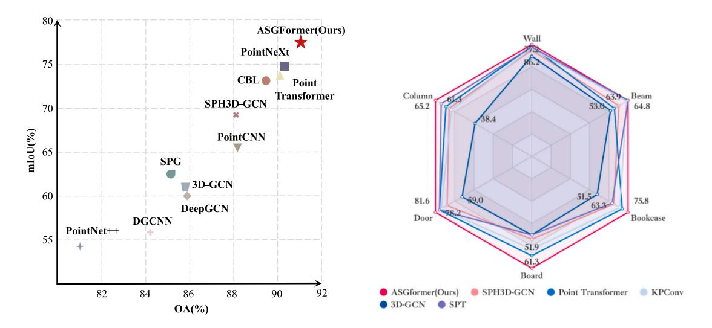

Fig. 18. Performance on S3DIS dataset with 6-fold evaluation, where the left subplot represents the overall evaluation of the 6-fold experiments, and the right subplot shows the class-level evaluation results (%).

# 4.5. Ablation experiment

To validate the necessity and effectiveness of our designed modules, we conducted comprehensive ablation experiments in the Area-5 of S3DIS dataset to demonstrate their roles and performance within the network.

Model Analysis: The effectiveness of each module is discussed and the comparison of the experimental results is presented in Table 7. MLP represents the baseline model without incorporating any attention modules, and the scalar attention follows the standard dot-product attention form. Scalar attention is able to improve performance but slightly falls short compared to graph attention. With the infusion of the designed adaptive weights in our model, graph attention explicitly demonstrates a significant improvement both in OA (90.1% vs. 88.6%), mAcc (76.1% vs. 73.4%), and mIoU (70.4% vs. 65.5%). AGT not only focuses on the correlation between points but also considers the similarity of structural properties. On this basis, it enhances the correspondence between points with similar attributes in an adaptive manner. Furthermore, aligning with probabilistic graphical models, AGT increases the probability of assigning the same label to similar points. The second enhancement is reflected in the introduction of virtual nodes. With the incorporation of virtual nodes, the network's performance experiences a certain degree of improvement. Although the changes observed in scalar attention and graph attention are not substantial, it still indicates the effectiveness of the design of this module. Our ablation study demonstrates the crucial role of adaptive weights in the network, and the auxiliary role of virtual nodes contributes to the performance improvement.

AGT contributes to a better model. We compared the three graph Transformer architectures mentioned in the previous Fig. 8. It is evident that AGT (70.4%) outperforms naive GT (62.6%) and general GT (66.6%) in terms of mIoU. In the graph, vertex features are employed to capture local information between points, while edge features contribute to capturing relationships and global information among vertices. The introduction of edge features strengthens the graph learning capabilities, while ASGFormer, in a learnable manner, utilizes the weights of edges to enhance the adaptability of the graph. Transformer allows the network to assign different weights between points, and embedding edge features helps strengthen the learning of structural information. The incorporation of edges into the attention design forms an adaptive mechanism for structural learning. Dynamically adjusting adaptive weights aids in distinguishing different semantic classes.

**Position Embedding is crucial.** As mentioned earlier, position embedding is also a pivotal factor influencing graph Transformer. Absolute PE, relative PE and proposed implicit representation method are compared in Table 8, noting that we only discuss the distinct components across the three strategies, specifically applied to the position embedding of K and V. By leveraging the Laplacian operator to provide relative position information, the network is able to learn the topological structure of the graph. However, non-learnable position embedding struggles to adapt to changes in the graph and differentiate objects that share similar structures. ASGFormer exhibits greater scale adaptability and unbiasedness compared to absolute position embedding. It incorporates relative position relations into the weight features to learn graph structure, leading to mIoU of 70.4% (+3.1%

**Table 8**Comparison of semantic segmentation with different graph Transformer architectures, where position embedding is represented by PE.

| Method     | Position embedding | mIoU (%) |
|------------|--------------------|----------|
| Naive GT   | Absolute PE        | 62.1     |
| Naive GT   | Relative PE        | 62.6     |
| General GT | Absolute PE        | 64.8     |
| General GT | Relative PE        | 66.6     |
| AGT        | -                  | 66.9     |
| AGT        | Relative PE        | 67.3     |
| AGT        | Implicit PE        | 70.4     |

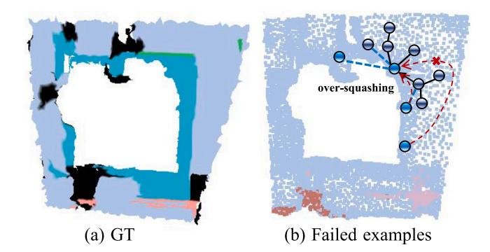

Fig. 19. Failed example in ScanNet.

over relative position embedding). Another crucial aspect is that weight features, serving as implicit position embedding, address the issue of the ambiguity in structural relationships caused by the inability of relative coordinate relations to serve as input for MLP.

## 4.6. Efficiency evaluation

The proposed ASGFormer has a large number of parameters, but it ensures relatively fast inference speed with lower floating-point operations while maintaining model performance, as shown in Table 9. In adaptive graph Transformer block, we follow the ASSANet by adopting MLP before neighbor grouping to significantly reduce the FLOPs by  $\frac{d \times d \times N \times N(i) \times L}{1 + 1 + 1 + 1 + 1 + 1 + 1} = N(i)$  times, where N, N(i), and L denote the point number, neighbor number, and the layer number of MLP. Moreover, the  $W_{ij}$  in adaptive graph Transformer block has k channels, thus, the learnable parameters is  $k^2$ . Generally,  $k \ll C$ , which allows the number of parameters is significantly smaller than that of naive graph Transformer, where *C* is the channel of features. Finally, we use virtual node to integrate global information, which transforms the computational complexity of CRF from  $O(n^2)$  to O(n) in a graph with diameter 2. Meanwhile, we use summation instead of concatenation to reduce the redundant computation overhead introduced by multiple MLP and convolutions.

#### 4.7. Limitations discussion

Virtual node introduces a new node, through which all of their new connections pass. It serves as a global aggregation point, thus retaining all the information flowing from the entire graph. However, if the graph is larger or many vertices rely on virtual node to pass information, virtual node may lead to an information bottleneck and even reduce the performance of the model. The quantity of virtual node has not been considered in this paper and is part of our future work.

Training a multi-layer deep GCN, normalization strategies are indispensable. Node-wise normalization employs LayerNorm in Transformer, calculated separately for each vertex. However, the vertices in the graph are non-sequenced, and we have not discussed better normalization methods. For instance, Graph normalization and Batch normalization utilize the features of all vertices in the whole graph for normalization, reflecting the differences among vertices within the graph. Therefore, in future work, a weighted combination of various normalization strategies should be considered to enhance the performance of graph learning.

There is a notable drawback, as mentioned earlier, that our method lacks segmentation capability for small and tiny objects. This results in lower precision segmentation for features like window frames on building facades and objects such as fences and lampposts in complex street scenes. The proposed method cannot address class imbalance issues caused by uneven position distribution, such as the boundaries of doors and windows. Moreover, the proposed method lacks boundary constraints, which might also be a reason for errors in small objects and edges. In future, we will consider fine-grained instance segmentation by incorporating boundary-aware uncertainty estimation.

Although our method learns topological relationships, it still does not address the issue of class imbalance caused by the uneven distribution of positions, as shown in Fig. 19. Considering topological boundaries as decision boundaries has led to difficulties in addressing class imbalance issues. Perhaps, this is one of the reasons for the inaccurate segmentation of small targets.

A key challenge in 3D point cloud semantic segmentation lies in the labeling efforts. Many previous methods (Huang et al., 2024; Su et al., 2023b) have discussed the application of weakly-supervised and semi-supervised methods (requiring only a few annotation efforts to achieve comparable performance) in point cloud semantic segmentation, especially for ALS and photogrammetric point clouds (Lin et al., 2022; Wang and Yao, 2022; Wang et al., 2023). Even though our method has not been validated on ALS point cloud datasets, we have still considered the performance and label efforts on two large-scale point cloud datasets. As shown in Table 10, the performance gap between fully supervised semantic segmentation and weakly supervised or semi-supervised methods is narrowing. Moreover, we have conduct the experiments on the MLS point cloud dataset Toronto 3D, as shown in Table 11. Our method has demonstrated certain limitations in largescale point cloud semantic segmentation at the city scale. In future work, we will focus on exploring the trade-off between performance and labeling efforts.

## 5. Conclusion

In this paper, we introduce an adaptive graph Transformer 3D point cloud semantic segmentation network tailored for structurally adherent objects. The proposed ASGFormer undergoes extensive and comprehensive experiments on five publicly available large-scale 3D point cloud datasets. Comprehensive experiments demonstrate that the effectiveness and superiority of proposed method from both quantitative and qualitative perspectives. Compared to state-of-the-art algorithms, ASGFormer exhibits competitive performance. The Graph Transformer maintains the sparsity and locality of graphs while incorporating longrange dependencies and overall graph characteristics. It significantly improves performance on the point cloud understanding. In the future, we will continue to expand on the limitations of this study, contributing to the advancement of intelligent point cloud processing in the remote sensing and photogrammetry community.

## CRediT authorship contribution statement

Ting Han: Writing – original draft, Validation, Methodology, Investigation. Yiping Chen: Writing – review & editing, Validation, Supervision, Methodology, Investigation, Funding acquisition. Jin Ma: Writing – original draft, Validation, Methodology. Xiaoxue Liu: Visualization, Formal analysis, Data curation. Wuming Zhang: Writing – review & editing. Xinchang Zhang: Formal analysis, Data curation. Huajuan Wang: Validation, Data curation.

Table 9
Comparison of computation costs with performance.

| Method                                | Param. (M) ↓ | FLOPs (G) ↓ | Throughput (ins./s) ↑ | mIoU (%) ↑ |
|---------------------------------------|--------------|-------------|-----------------------|------------|
| PointNet (Qi et al., 2017a)           | 3.6          | 35.5        | 162                   | 41.1       |
| PointNet++ (Qi et al., 2017b)         | 1.0          | 7.2         | 237                   | 53.5       |
| PointCNN (Li et al., 2018)            | 0.6          | _           | -                     | 57.3       |
| DGCNN (Wang et al., 2019b)            | 1.3          | -           | 8                     | 47.9       |
| DeepGCN (Li et al., 2019a)            | 3.6          | -           | 3                     | 52.5       |
| 3D-GCN (Lin et al., 2020)             | 0.6          | -           | -                     | 51.9       |
| KPConv (Thomas et al., 2019)          | 15.0         | -           | 30                    | 67.1       |
| AGConv (Wei et al., 2023)             | 1.9          | 3.6         | -                     | 67.9       |
| Point Transformer (Zhao et al., 2021) | 7.8          | 5.6         | 34                    | 70.4       |
| ASSANet (Qian et al., 2021)           | 2.4          | 2.5         | 300                   | 68.0       |
| PointNeXt (Qian et al., 2022)         | 41.6         | 84.8        | 43                    | 70.5       |
| PointTransformerV2 (Wu et al., 2022)  | 12.8         | 18.2        | -                     | 71.6       |
| PointTransformerV3 (Wu et al., 2023)  | 46.2         | 5.2         | -                     | 73.4       |
| ASGFormer (Ours)                      | 19.0         | 7.3         | 155                   | 72.3       |

Table 10
Class-level evaluation on the Area 5 of S3DIS dataset. We compared against unsupervised (Unsup.) and weakly supervised (\*% labeling efforts) approaches (%).

| Method                               | Setting   | Avg. | Ceiling | Floor | Wall | Column | Window | Door | Table | Chair | Sofa | Bookcase | Board | Clutter |
|--------------------------------------|-----------|------|---------|-------|------|--------|--------|------|-------|-------|------|----------|-------|---------|
| K-means                              | Unsup.    | 38.4 | 59.8    | 63.3  | 34.9 | 24.6   | 34.2   | 29.3 | 35.7  | 33.1  | 45.0 | 45.6     | 41.7  | 30.4    |
| Ncut                                 | Unsup.    | 40.0 | 63.5    | 63.8  | 37.2 | 24.6   | 35.5   | 29.9 | 38.9  | 34.3  | 47.1 | 46.3     | 44.1  | 31.5    |
| Xia et al. (2023)                    | Unsup.    | 25.7 | 79.1    | 86.6  | 51.8 | 0.3    | 0.5    | 7.6  | 30.6  | 26.4  | 5.6  | 45.5     | 0.0   | 0.7     |
| U3DS 3 (Liu et al., 2024) | Unsup.    | 42.8 | -       | -     | -    | -      | -      | -    | -     | -     | -    | -        | -     | -       |
| GrowSP (Zhang et al., 2023b)         | Unsup.    | 44.5 | -       | -     | -    | -      | -      | -    | -     | -     | -    | -        | -     | -       |
| Xu and Lee (2020)                    | 10%       | 48.0 | 90.9    | 97.3  | 74.8 | 8.4    | 49.3   | 27.3 | 69.0  | 71.7  | 16.5 | 53.2     | 23.3  | 42.8    |
| PSD (Zhang et al., 2021)             | 1%        | 63.5 | 92.3    | 97.7  | 80.7 | 27.8   | 56.2   | 62.5 | 78.7  | 84.1  | 63.1 | 70.4     | 58.9  | 53.2    |
| HybridCR (Li et al., 2022)           | 1%        | 51.5 | 85.4    | 91.9  | 65.9 | 18.0   | 51.4   | 34.2 | 63.8  | 78.3  | 52.4 | 59.6     | 29.9  | 39.0    |
| GaIA (Lee et al., 2023)              | 1%        | 53.7 | -       | -     | -    | -      | _      | -    | -     | -     | -    | _        | -     | -       |
| Li et al. (2024)                     | 1%        | 68.2 | 91.7    | 95.5  | 82.5 | 46.6   | 63.3   | 65.4 | 77.0  | 89.0  | 64.7 | 74.5     | 69.2  | 67.2    |
| SQN (Hu et al., 2022)                | 1%        | 63.6 | 92.0    | 96.4  | 81.3 | 21.4   | 53.7   | 73.1 | 77.8  | 85.9  | 56.7 | 69.9     | 66.5  | 52.4    |
| MSC (Su et al., 2023a)               | 1%        | 65.3 | 93.3    | 97.5  | 82.0 | 29.0   | 56.2   | 64.2 | 75.9  | 87.2  | 70.7 | 71.5     | 66.8  | 54.6    |
| DR-Net (Zhang and Bi, 2024)          | 1%        | 64.2 | 93.2    | 98.0  | 81.4 | 34.1   | 53.7   | 60.9 | 79.4  | 86.3  | 61.4 | 70.0     | 62.4  | 52.5    |
| UCL (Yao et al., 2024)               | 1%        | 68.2 | 93.4    | 97.3  | 82.6 | 25.7   | 59.9   | 66.3 | 81.9  | 89.7  | 75.9 | 75.4     | 78.5  | 60.0    |
| SQN (Hu et al., 2022)                | 0.1%      | 61.4 | 91.7    | 95.6  | 78.7 | 24.2   | 55.8   | 63.1 | 70.5  | 83.1  | 60.6 | 67.8     | 56.1  | 50.6    |
| DR-Net (Zhang and Bi, 2024)          | 0.1%      | 58.7 | 92.1    | 96.6  | 78.0 | 15.6   | 52.3   | 58.4 | 69.2  | 77.1  | 52.8 | 65.2     | 57.8  | 48.5    |
| UCL (Yao et al., 2024)               | 0.1%      | 65.4 | 93.3    | 97.2  | 82.0 | 26.5   | 60.3   | 62.1 | 79.2  | 85.6  | 68.4 | 73.7     | 65.7  | 55.6    |
| VIBUS (Tian et al., 2022)            | 0.02%     | 52.0 | -       | -     | -    | -      | _      | -    | -     | -     | -    | _        | -     | -       |
| Xu et al. (2023c)                    | 0.02%     | 55.9 | -       | -     | -    | -      | -      | -    | -     | -     | -    | -        | -     | -       |
| ASGFormer (Ours)                     | Ful. Sup. | 72.3 | 93.4    | 98.5  | 84.9 | 41.1   | 61.1   | 82.7 | 83.6  | 92.0  | 80.8 | 77.8     | 78.6  | 63.2    |

Table 11
Class-level evaluation on the Toronto 3D dataset. We compared against weakly supervised (\*% labeling efforts) approaches (%).

| Method                        | Setting   | Avg.  | Road  | Rd mrk. | Natural | Building | Uti. line | Pole  | Car   | Fence |
|-------------------------------|-----------|-------|-------|---------|---------|----------|-----------|-------|-------|-------|
| MSC (Su et al., 2023a)        | 1%        | 81.20 | 96.60 | 63.60   | 95.70   | 93.50    | 85.40     | 72.20 | 89.30 | 53.30 |
| PSD (Zhang et al., 2021)      | 0.1%      | 73.30 | 95.29 | 60.81   | 94.68   | 82.73    | 84.13     | 72.18 | 82.44 | 14.13 |
| SQN (Hu et al., 2022)         | 0.1%      | 77.75 | 96.69 | 65.67   | 94.58   | 91.34    | 83.36     | 70.59 | 88.87 | 30.91 |
| WSPointNet (Lei et al., 2022) | 0.1%      | 78.96 | 96.70 | 66.99   | 94.89   | 90.79    | 83.68     | 75.71 | 88.37 | 34.54 |
| Liu et al. (2023a)            | 0.1%      | 67.42 | 70.23 | 9.60    | 94.03   | 91.64    | 83.66     | 62.98 | 84.96 | 42.26 |
| DR-Net (Zhang and Bi, 2024)   | 0.1%      | 78.10 | 97.00 | 65.80   | 94.70   | 92.20    | 82.10     | 69.60 | 88.80 | 34.50 |
| DAAL-WS (Lei et al., 2024)    | 0.01%     | 81.91 | 97.67 | 73.42   | 96.27   | 92.35    | 83.57     | 78.03 | 91.82 | 42.16 |
| ASGFormer (Ours)              | Ful. Sup. | 81.60 | 97.26 | 65.41   | 97.76   | 94.13    | 81.28     | 79.07 | 91.11 | 46.57 |

#### Declaration of competing interest

No conflict of interest exists in the submission of this manuscript, and all authors approve the manuscript for publication. All the authors listed have approved the manuscript that is enclosed. We sincerely appreciate your consideration of our manuscript and look forward to receiving comments from the reviewers.

#### Data availability

No data was used for the research described in the article.

## Acknowledgments

The authors would like to thank the National Natural Science Foundation of China, and Basic and Applied Basic Research Foundation of

Guangdong Province, China with Grant No. 2024A1515010986. We also appreciate the valuable comments and constructive suggestions from the anonymous reviewers that helped improve the manuscript.

# References

Armeni, I., Sener, O., Zamir, A.R., Jiang, H., Brilakis, I., Fischer, M., Savarese, S., 2016. 3D semantic parsing of large-scale indoor spaces. In: Proceedings of the IEEE Conference on Computer Vision and Pattern Recognition. pp. 1534–1543.

Behley, J., Garbade, M., Milioto, A., Quenzel, J., Behnke, S., Stachniss, C., Gall, J., 2019. Semantickitti: A dataset for semantic scene understanding of lidar sequences. In: Proceedings of the IEEE/CVF International Conference on Computer Vision. pp. 9297–9307

Cho, H., Choi, I.S., 2018. Three-dimensionally embedded graph convolutional network (3dgcn) for molecule interpretation. arXiv preprint arXiv:1811.09794.

Choromanski, K., Likhosherstov, V., Dohan, D., Song, X., Gane, A., Sarlos, T., Hawkins, P., Davis, J., Mohiuddin, A., Kaiser, L., et al., 2020. Rethinking attention with performers. arXiv preprint arXiv:2009.14794.

- Choy, C., Gwak, J., Savarese, S., 2019. 4D spatio-temporal convnets: Minkowski convolutional neural networks. In: Proceedings of the IEEE/CVF Conference on Computer Vision and Pattern Recognition. pp. 3075–3084.
- Cotella, V.A., 2023. From 3D point clouds to HBIM: Application of artificial intelligence in cultural heritage. Autom. Constr. 152, 104936.
- Cui, Y., Liu, X., Liu, H., Zhang, J., Zare, A., Fan, B., 2021. Geometric attentional dynamic graph convolutional neural networks for point cloud analysis. Neurocomputing 432, 300–310.
- Dai, A., Chang, A.X., Savva, M., Halber, 2017. Scannet: Richly-annotated 3d reconstructions of indoor scenes. In: Proceedings of the IEEE Conference on Computer Vision and Pattern Recognition. pp. 5828–5839.
- De Gélis, I., Lefèvre, S., Corpetti, T., 2023. Siamese KPConv: 3D multiple change detection from raw point clouds using deep learning. ISPRS J. Photogramm. Remote Sens. 197, 274–291.
- Diao, C., Loynd, R., 2022. Relational attention: Generalizing transformers for graph-structured tasks. arXiv preprint arXiv:2210.05062.
- Du, J., Cai, G., Wang, Z., Huang, S., Su, J., Junior, J.M., Smit, J., Li, J., 2021. ResDLPS-Net: Joint residual-dense optimization for large-scale point cloud semantic segmentation. ISPRS J. Photogramm. Remote Sens. 182, 37–51.
- Duan, L., Zhao, S., Xue, N., Gong, M., Xia, G.-S., Tao, D., 2024. ConDaFormer: Disassembled transformer with local structure enhancement for 3D point cloud understanding. Adv. Neural Inf. Process. Syst. 36.
- Geng, Y., Wang, Z., Jia, L., Qin, Y., Chai, Y., Liu, K., Tong, L., 2023. 3DGraphSeg: A unified graph representation-based point cloud segmentation framework for full-range highspeed railway environments. IEEE Trans. Ind. Inform..
- Guo, M.-H., Cai, J.-X., Liu, Z.-N., Mu, T.-J., Martin, R.R., Hu, S.-M., 2021. Pct: Point cloud transformer. Comput. Vis. Media 7, 187–199.
- Han, J., Liu, Y., Rong, M., Zheng, X., Shen, S., 2023. FloorUSG: Indoor floorplan reconstruction by unifying 2D semantics and 3D geometry. ISPRS J. Photogramm. Remote Sens. 196, 490–501.
- Han, B., Zhang, X., Ren, S., 2022. PU-GACNet: Graph attention convolution network for point cloud upsampling. Image Vis. Comput. 118, 104371.
- He, S., Jiang, X., Jiang, W., Ding, H., 2023. Prototype adaption and projection for few-and zero-shot 3d point cloud semantic segmentation. IEEE Trans. Image Process.
- Hu, Q., Yang, B., Fang, G., Guo, Y., Leonardis, A., Trigoni, N., Markham, A., 2022.
  Sqn: Weakly-supervised semantic segmentation of large-scale 3d point clouds. In:
  European Conference on Computer Vision. Springer, pp. 600–619.
- Hu, Q., Yang, B., Xie, L., Rosa, S., Guo, Y., Wang, Z., Trigoni, N., Markham, A., 2021.
  Learning semantic segmentation of large-scale point clouds with random sampling.
  IEEE Trans. Pattern Anal. Mach. Intell. 44 (11), 8338–8354.
- Huang, Q., Wang, W., Neumann, U., 2018. Recurrent slice networks for 3d segmentation of point clouds. In: Proceedings of the IEEE Conference on Computer Vision and Pattern Recognition. pp. 2626–2635.
- Huang, Z., Zhao, Z., Li, B., Han, J., 2023. Lcpformer: Towards effective 3d point cloud analysis via local context propagation in transformers. IEEE Trans. Circuits Syst. Video Tochnol
- Huang, W., Zou, P., Xia, Y., Wen, C., Zang, Y., Wang, C., Zhou, G., 2024. OPOCA: One point one class annotation for LiDAR point cloud semantic segmentation. IEEE Trans. Geosci. Remote Sens..
- Jiang, C., Huang, K., Wu, J., Wang, X., Xiao, J., Hussain, A., 2023a. PointGS: Bridging and fusing geometric and semantic space for 3D point cloud analysis. Inf. Fusion 91, 316–326.
- Jiang, J., Li, F., Yang, J., Kang, Z., Li, J., 2023b. Construction of indoor obstacle element map based on scene-aware priori obstacle rules. ISPRS J. Photogramm. Remote Sens. 195, 43–64.
- Jiang, L., Zhao, H., Liu, S., Shen, X., Fu, C.-W., Jia, J., 2019. Hierarchical point-edge interaction network for point cloud semantic segmentation. In: Proceedings of the IEEE/CVF International Conference on Computer Vision. pp. 10433–10441.
- Kolodiazhnyi, M., Vorontsova, A., Konushin, A., Rukhovich, D., 2023. OneFormer3D: One transformer for unified point cloud segmentation. arXiv preprint arXiv:2311. 14405.
- Lai, X., Liu, J., Jiang, L., Wang, L., Zhao, H., Liu, S., Qi, X., Jia, J., 2022. Stratified transformer for 3d point cloud segmentation. In: Proceedings of the IEEE/CVF Conference on Computer Vision and Pattern Recognition. pp. 8500–8509.
- Landrieu, L., Boussaha, M., 2019. Point cloud oversegmentation with graph-structured deep metric learning. In: Proceedings of the IEEE/CVF Conference on Computer Vision and Pattern Recognition. pp. 7440–7449.
- Landrieu, L., Simonovsky, M., 2018. Large-scale point cloud semantic segmentation with superpoint graphs. In: Proceedings of the IEEE Conference on Computer Vision and Pattern Recognition. pp. 4558–4567.
- Lee, M.S., Yang, S.W., Han, S.W., 2023. Gaia: Graphical information gain based attention network for weakly supervised point cloud semantic segmentation. In: Proceedings of the IEEE/CVF Winter Conference on Applications of Computer Vision. pp. 582–591.
- Lei, H., Akhtar, N., Mian, A., 2020a. Seggcn: Efficient 3d point cloud segmentation with fuzzy spherical kernel. In: Proceedings of the IEEE/CVF Conference on Computer Vision and Pattern Recognition. pp. 11611–11620.
- Lei, H., Akhtar, N., Mian, A., 2020b. Spherical kernel for efficient graph convolution on 3d point clouds. IEEE Trans. Pattern Anal. Mach. Intell. 43 (10), 3664–3680.

- Lei, X., Guan, H., Ma, L., Liu, J., Yu, Y., Wang, L., Dong, Z., Ni, H., Li, J., 2024. DAAL-WS: A weakly-supervised method integrated with data augmentation and active learning strategies for MLS point cloud semantic segmentation. Int. J. Appl. Earth Obs. Geoinf. 131, 103970.
- Lei, X., Guan, H., Ma, L., Yu, Y., Dong, Z., Gao, K., Delavar, M.R., Li, J., 2022. WSPointNet: A multi-branch weakly supervised learning network for semantic segmentation of large-scale mobile laser scanning point clouds. Int. J. Appl. Earth Observ. Geoinf. 115, 103129.
- Li, Y., Bu, R., Sun, M., Wu, W., Di, X., Chen, B., 2018. Pointcnn: Convolution on x-transformed points. Adv. Neural Inf. Process. Syst. 31.
- Li, Q., Cao, R., Zhu, J., Fu, H., Zhou, B., Fang, X., Jia, S., Zhang, S., Liu, K., Li, Q., 2023. Learn then match: A fast coarse-to-fine depth image-based indoor localization framework for dark environments via deep learning and keypoint-based geometry alignment. ISPRS J. Photogramm. Remote Sens. 195. 169–177.
- Li, M., Lin, S., Wang, Z., Shen, Y., Zhang, B., Ma, L., 2024. Class-imbalanced semi-supervised learning for large-scale point cloud semantic segmentation via decoupling optimization. arXiv preprint arXiv:2401.06975.
- Li, Y., Ma, L., Zhong, Z., Cao, D., Li, J., 2019b. TGNet: Geometric graph CNN on 3-D point cloud segmentation. IEEE Trans. Geosci. Remote Sens. 58 (5), 3588–3600.
- Li, G., Muller, M., Thabet, A., Ghanem, B., 2019a. Deepgcns: Can gcns go as deep as cnns? In: Proceedings of the IEEE/CVF International Conference on Computer Vision. pp. 9267–9276.
- Li, M., Xie, Y., Shen, Y., Ke, B., Qiao, R., Ren, B., Lin, S., Ma, L., 2022. Hybridcr: Weakly-supervised 3d point cloud semantic segmentation via hybrid contrastive regularization. In: Proceedings of the IEEE/CVF Conference on Computer Vision and Pattern Recognition. pp. 14930–14939.
- Lin, Z.-H., Huang, S.-Y., Wang, Y.-C.F., 2020. Convolution in the cloud: Learning deformable kernels in 3d graph convolution networks for point cloud analysis. In: Proceedings of the IEEE/CVF Conference on Computer Vision and Pattern Recognition. pp. 1800–1809.
- Lin, Y., Vosselman, G., Yang, M.Y., 2022. Weakly supervised semantic segmentation of airborne laser scanning point clouds. ISPRS J. Photogram. Remote Sens. 187, 79–100.
- Lin, H., Wu, S., Chen, Y., Li, W., Luo, Z., Guo, Y., Wang, C., Li, J., 2021. Semantic segmentation of 3D indoor LiDAR point clouds through feature pyramid architecture search. ISPRS J. Photogramm. Remote Sens. 177, 279–290.
- Lin, H., Zheng, X., Li, L., Chao, F., Wang, S., Wang, Y., Tian, Y., Ji, R., 2023. Meta architecture for point cloud analysis. In: Proceedings of the IEEE/CVF Conference on Computer Vision and Pattern Recognition. pp. 17682–17691.
- Liu, X., Cheng, J., Song, Y., Jiang, X., 2022a. Boosting graph structure learning with dummy nodes. In: International Conference on Machine Learning. PMLR, pp. 13704–13716.
- Liu, J., Guan, H., Lei, X., Yu, Y., 2023a. Weakly supervised semantic segmentation of mobile laser scanning point clouds via category balanced random annotation and deep consistency-guided self-distillation mechanism. Photogramm. Rec. 38 (184), 581–602
- Liu, Y., Wang, L., Liu, M., Lin, Y., Zhang, X., Oztekin, B., Ji, S., 2022b. Spherical message passing for 3d molecular graphs. In: International Conference on Learning Representations. ICLR, p. 1.
- Liu, J., Yu, Z., Breckon, T.P., Shum, H.P., 2024. U3DS3: Unsupervised 3D semantic scene segmentation. In: Proceedings of the IEEE/CVF Winter Conference on Applications of Computer Vision. pp. 3759–3768.
- Liu, W., Zang, Y., Xiong, Z., Bian, X., Wen, C., Lu, X., Wang, C., Junior, J.M., Goncalves, W.N., Li, J., 2023b. 3D building model generation from MLS point cloud and 3D mesh using multi-source data fusion. Int. J. Appl. Earth Obs. Geoinf. 116, 103171.
- Luo, C., Li, X., Cheng, N., Li, H., Lei, S., Li, P., 2022. Mvp-net: Multiple view pointwise semantic segmentation of large-scale point clouds. arXiv preprint arXiv:2201.12769.
- Meyer, T., Brunn, A., Stilla, U., 2023. Geometric BIM verification of indoor construction sites by photogrammetric point clouds and evidence theory. ISPRS J. Photogramm. Remote Sens. 195, 432–445.
- Park, J., Lee, S., Kim, S., Xiong, Y., Kim, H.J., 2023. Self-positioning point-based transformer for point cloud understanding. In: Proceedings of the IEEE/CVF Conference on Computer Vision and Pattern Recognition. pp. 21814–21823.
- Qi, X., Liao, R., Jia, J., Fidler, S., Urtasun, R., 2017c. 3D graph neural networks for rgbd semantic segmentation. In: Proceedings of the IEEE International Conference on Computer Vision. pp. 5199–5208.
- Qi, C.R., Su, H., Mo, K., Guibas, L.J., 2017a. Pointnet: Deep learning on point sets for 3d classification and segmentation. In: Proceedings of the IEEE Conference on Computer Vision and Pattern Recognition. pp. 652–660.
- Qi, C.R., Yi, L., Su, H., Guibas, L.J., 2017b. Pointnet++: Deep hierarchical feature learning on point sets in a metric space. Adv. Neural Inf. Process. Syst. 30.
- Qian, G., Hammoud, H., Li, G., Thabet, A., Ghanem, B., 2021. Assanet: An anisotropic separable set abstraction for efficient point cloud representation learning. Adv. Neural Inf. Process. Syst. 34, 28119–28130.
- Qian, G., Li, Y., Peng, H., Mai, J., Hammoud, H., Elhoseiny, M., Ghanem, B., 2022.

  Pointnext: Revisiting pointnet++ with improved training and scaling strategies.

  Adv. Neural Inf. Process. Syst. 35, 23192–23204.
- Rampášek, L., Galkin, M., Dwivedi, V.P., Luu, A.T., Wolf, G., Beaini, D., 2022. Recipe for a general, powerful, scalable graph transformer. Adv. Neural Inf. Process. Syst. 35, 14501–14515.

- Ran, H., Liu, J., Wang, C., 2022. Surface representation for point clouds. In: Proceedings of the IEEE/CVF Conference on Computer Vision and Pattern Recognition. pp. 18942–18952.
- Robert, D., Raguet, H., Landrieu, L., 2023. Efficient 3D semantic segmentation with superpoint transformer. arXiv preprint arXiv:2306.08045.
- Shi, W., Rajkumar, R., 2020. Point-gnn: Graph neural network for 3d object detection in a point cloud. In: Proceedings of the IEEE/CVF Conference on Computer Vision and Pattern Recognition. pp. 1711–1719.
- Srivastava, S., Sharma, G., 2021. Exploiting local geometry for feature and graph construction for better 3d point cloud processing with graph neural networks. In: 2021 IEEE INternational Conference on Robotics and Automation. ICRA, IEEE, pp. 12903–12909.
- Stilla, U., Xu, Y., 2023. Change detection of urban objects using 3D point clouds: A review. ISPRS J. Photogramm. Remote Sens. 197, 228-255.
- Su, Y., Cheng, M., Yuan, Z., Liu, W., Zeng, W., Wang, C., 2023a. Multi-stage scene-level constraints for large-scale point cloud weakly supervised semantic segmentation. IEEE Trans. Geosci. Remote Sens..
- Su, Y., Cheng, M., Yuan, Z., Liu, W., Zeng, W., Zhang, Z., Wang, C., 2023b. Spatial adaptive fusion consistency contrastive constraint: weakly supervised building facade point cloud semantic segmentation. IEEE Trans. Geosci. Remote Sens..
- Tan, W., Qin, N., Ma, L., Li, Y., Du, J., Cai, G., Yang, K., Li, J., 2020. Toronto-3D: A large-scale mobile LiDAR dataset for semantic segmentation of urban roadways. In: Proceedings of the IEEE/CVF Conference on Computer Vision and Pattern Recognition Workshops. pp. 202–203.
- Tang, H., Liu, Z., Zhao, S., Lin, Y., Lin, J., Wang, H., Han, S., 2020. Searching efficient 3d architectures with sparse point-voxel convolution. In: European Conference on Computer Vision. Springer, pp. 685–702.
- Tang, L., Zhan, Y., Chen, Z., Yu, B., Tao, D., 2022. Contrastive boundary learning for point cloud segmentation. In: Proceedings of the IEEE/CVF Conference on Computer Vision and Pattern Recognition. pp. 8489–8499.
- Tatarchenko, M., Park, J., Koltun, V., Zhou, Q.-Y., 2018. Tangent convolutions for dense prediction in 3d. In: Proceedings of the IEEE Conference on Computer Vision and Pattern Recognition. pp. 3887–3896.
- Tchapmi, L., Choy, C., Armeni, I., Gwak, J., Savarese, S., 2017. Segcloud: Semantic segmentation of 3d point clouds. In: 2017 International Conference on 3D Vision. 3DV, IEEE, pp. 537–547.
- Te, G., Hu, W., Zheng, A., Guo, Z., 2018. Rgcnn: Regularized graph cnn for point cloud segmentation. In: Proceedings of the 26th ACM International Conference on Multimedia. pp. 746–754.
- Thomas, H., Qi, C.R., Deschaud, J.-E., Marcotegui, B., Goulette, F., Guibas, L.J., 2019. Kpconv: Flexible and deformable convolution for point clouds. In: Proceedings of the IEEE/CVF International Conference on Computer Vision. pp. 6411–6420.
- Tian, B., Luo, L., Zhao, H., Zhou, G., 2022. Vibus: Data-efficient 3d scene parsing with viewpoint bottleneck and uncertainty-spectrum modeling. ISPRS J. Photogramm. Remote Sens. 194, 302–318.
- Topping, J., Di Giovanni, F., Chamberlain, B.P., Dong, X., Bronstein, M.M., 2021.

  Understanding over-squashing and bottlenecks on graphs via curvature. arXiv preprint arXiv:2111.14522.
- Wan, J., Xu, Y., Qiu, Q., Xie, Z., 2023. A geometry-aware attention network for semantic segmentation of MLS point clouds. Int. J. Geogr. Inf. Sci. 37 (1), 138–161.
- Wang, P.-S., 2023. Octformer: Octree-based transformers for 3d point clouds. ACM Trans. Graph. 42 (4), 1–11.
- Wang, L., Huang, Y., Hou, Y., Zhang, S., Shan, J., 2019a. Graph attention convolution for point cloud semantic segmentation. In: Proceedings of the IEEE/CVF Conference on Computer Vision and Pattern Recognition. pp. 10296–10305.
- Wang, C., Samari, B., Siddiqi, K., 2018a. Local spectral graph convolution for point set feature learning. In: Proceedings of the European Conference on Computer Vision. ECCV, pp. 52–66.
- Wang, Y., Sun, Y., Liu, Z., Sarma, S.E., Bronstein, M.M., Solomon, J.M., 2019b. Dynamic graph cnn for learning on point clouds. ACM Trans. Graphics (TOG) 38 (5), 1–12.
- Wang, S., Suo, S., Ma, W.-C., Pokrovsky, A., Urtasun, R., 2018b. Deep parametric continuous convolutional neural networks. In: Proceedings of the IEEE Conference on Computer Vision and Pattern Recognition. pp. 2589–2597.
- Wang, Z., Wang, Y., An, L., Liu, J., Liu, H., 2022. Local transformer network on 3d point cloud semantic segmentation. Information 13 (4), 198.
- Wang, P., Yao, W., 2022. A new weakly supervised approach for ALS point cloud semantic segmentation. ISPRS J. Photogramm. Remote Sens. 188, 237–254.
- Wang, P., Yao, W., Shao, J., 2023. One class one click: Quasi scene-level weakly supervised point cloud semantic segmentation with active learning. ISPRS J. Photogramm. Remote Sens. 204, 89–104.
- Wang, Y., Zhang, Z., Zhong, R., Sun, L., Leng, S., Wang, Q., 2021. Densely connected graph convolutional network for joint semantic and instance segmentation of indoor point clouds. ISPRS J. Photogramm. Remote Sens. 182, 67–77.
- Wei, M., Wei, Z., Zhou, H., Hu, F., Si, H., Chen, Z., Zhu, Z., Qiu, J., Yan, X., Guo, Y., et al., 2023. Agconv: Adaptive graph convolution on 3d point clouds. IEEE Trans. Pattern Anal. Mach. Intell..
- Woo, S., Lee, D., Hwang, S., Kim, W.J., Lee, S., 2023. MKConv: Multidimensional feature representation for point cloud analysis. Pattern Recognit. 143, 109800.

- Wu, X., Jiang, L., Wang, P.-S., Liu, Z., Liu, X., Qiao, Y., Ouyang, W., He, T., Zhao, H., 2023. Point transformer v3: Simpler, faster, stronger. arXiv preprint arXiv:2312.10035.
- Wu, X., Lao, Y., Jiang, L., Liu, X., Zhao, H., 2022. Point transformer v2: Grouped vector attention and partition-based pooling. Adv. Neural Inf. Process. Syst. 35, 23330-33342
- Wu, W., Qi, Z., Fuxin, L., 2019. Pointconv: Deep convolutional networks on 3d point clouds. In: Proceedings of the IEEE/CVF Conference on Computer Vision and Pattern Recognition. pp. 9621–9630.
- Xia, S., Yue, J., Kania, K., Fang, L., Tagliasacchi, A., Yi, K.M., Sun, W., 2023. Densify your labels: Unsupervised clustering with bipartite matching for weakly supervised point cloud segmentation. arXiv preprint arXiv:2312.06799.
- Xiao, A., Huang, J., Guan, D., Zhang, X., Lu, S., Shao, L., 2023. Unsupervised point cloud representation learning with deep neural networks: A survey. IEEE Trans. Pattern Anal. Mach. Intell..
- Xie, L., Furuhata, T., Shimada, K., 2020. Multi-resolution graph neural network for large-scale pointcloud segmentation. arXiv preprint arXiv:2009.08924.
- Xu, X., Lee, G.H., 2020. Weakly supervised semantic point cloud segmentation: Towards 10x fewer labels. In: Proceedings of the IEEE/CVF Conference on Computer Vision and Pattern Recognition. pp. 13706–13715.
- Xu, Q., Sun, X., Wu, C.-Y., Wang, P., Neumann, U., 2020. Grid-gcn for fast and scalable point cloud learning. In: Proceedings of the IEEE/CVF Conference on Computer Vision and Pattern Recognition. pp. 5661–5670.
- Xu, X., Wang, Z., Zhou, J., Lu, J., 2023b. Binarizing sparse convolutional networks for efficient point cloud analysis. In: Proceedings of the IEEE/CVF Conference on Computer Vision and Pattern Recognition. pp. 5313–5322.
- Xu, Z., Yuan, B., Zhao, S., Zhang, Q., Gao, X., 2023c. Hierarchical point-based active learning for semi-supervised point cloud semantic segmentation. In: Proceedings of the IEEE/CVF International Conference on Computer Vision. pp. 18098–18108.
- Xu, P., Zhang, L., Liu, X., Sun, J., Zhao, Y., Yang, H., Yu, B., 2023a. Do not train it: a linear neural architecture search of graph neural networks. In: International Conference on Machine Learning. PMLR, pp. 38826–38847.
- Yan, X., Zheng, C., Li, Z., Wang, S., Cui, S., 2020. Pointasnl: Robust point clouds processing using nonlocal neural networks with adaptive sampling. In: Proceedings of the IEEE/CVF Conference on Computer Vision and Pattern Recognition. pp. 5589–5598.
- Yao, B., Dong, L., Qiu, X., Song, K., Yan, D., Peng, C., 2024. Uncertainty-guided contrastive learning for weakly supervised point cloud segmentation. IEEE Trans. Geosci. Remote Sens...
- Ye, Y., Ji, S., 2021. Sparse graph attention networks. IEEE Trans. Knowl. Data Eng. 35 (1), 905–916.
- Yun, S., Jeong, M., Kim, R., Kang, J., Kim, H.J., 2019. Graph transformer networks. Adv. Neural Inf. Process. Syst. 32.
- Zeng, Z., Xu, Y., Xie, Z., Tang, W., Wan, J., Wu, W., 2024. Large-scale point cloud semantic segmentation via local perception and global descriptor vector. Expert Syst. Appl. 246, 123269.
- Zhang, L., Bi, Y., 2024. Weakly-supervised point cloud semantic segmentation based on dilated region. IEEE Trans. Geosci. Remote Sens..
- Zhang, F., Fang, J., Wah, B., Torr, P., 2020. Deep fusionnet for point cloud semantic segmentation. In: Computer Vision–ECCV 2020: 16th European Conference, Glasgow, UK, August 23–28, 2020, Proceedings, Part XXIV 16. Springer, pp. 644–663.
- Zhang, Y., Qu, Y., Xie, Y., Li, Z., Zheng, S., Li, C., 2021. Perturbed self-distillation: Weakly supervised large-scale point cloud semantic segmentation. In: Proceedings of the IEEE/CVF International Conference on Computer Vision. pp. 15520–15528.
- Zhang, C., Wan, H., Shen, X., Wu, Z., 2022a. Patchformer: An efficient point transformer with patch attention. In: Proceedings of the IEEE/CVF Conference on Computer Vision and Pattern Recognition. pp. 11799–11808.
- Zhang, Z., Wang, X., Guan, C., Zhang, Z., Li, H., Zhu, W., 2022b. Autogt: Automated graph transformer architecture search. In: The Eleventh International Conference on Learning Representations. p. 1.
- Zhang, R., Wang, L., Guo, Z., Shi, J., 2023a. Nearest neighbors meet deep neural networks for point cloud analysis. In: Proceedings of the IEEE/CVF Winter Conference on Applications of Computer Vision. pp. 1246–1255.
- Zhang, Z., Yang, B., Wang, B., Li, B., 2023b. Growsp: Unsupervised semantic segmentation of 3d point clouds. In: Proceedings of the IEEE/CVF Conference on Computer Vision and Pattern Recognition. pp. 17619–17629.
- Zhao, H., Jiang, L., Fu, C.-W., Jia, J., 2019. Pointweb: Enhancing local neighborhood features for point cloud processing. In: Proceedings of the IEEE/CVF Conference on Computer Vision and Pattern Recognition. pp. 5565–5573.
- Zhao, H., Jiang, L., Jia, J., Torr, P.H., Koltun, V., 2021. Point transformer. In: Proceedings of the IEEE/CVF International Conference on Computer Vision. pp. 16259–16268
- Zhou, C., Ling, Q., 2023. GAF-net: Geometric contextual feature aggregation and adaptive fusion for large-scale point cloud semantic segmentation. IEEE Trans. Geosci. Remote Sens. 61, 1–15.