Research Article

# Point mask transformer for outdoor point cloud semantic segmentation

Xiangqian Li1, Xin Tan1 (🖂), Zhizhong Zhang1, Yuan Xie1, and Lizhuang Ma1

© The Author(s) 2025.

Abstract Current outdoor point-cloud segmentation methods typically formulate semantic segmentation as a per-point/voxel-classification task. Although this strategy is straightforward because it classifies each point directly, it ignores the overall relationship of the category. As an alternative paradigm, mask classification decouples category classification from region localization, allowing the model to better capture overall category relationships. In this paper, we propose a novel approach called the point mask transformer (PMFormer), which transforms the semantic segmentation of point clouds from per-point classification to mask classification using a transformer architecture. The proposed model comprises a 3D backbone, transformer decoder, and segmentation head that predicts a series of binary masks, each associated with a global class label. Furthermore, to accommodate the unique characteristics of large and sparse outdoor point-cloud scenes, we propose three enhancements for the integration of point-cloud data with the transformer: MaskMix, 3D position encoding, and attention weights. We evaluate our model using the SemanticKITTI and nuScenes datasets. Our experimental results show that the proposed method outperforms state-of-the-art semantic segmentation approaches.

**Keywords** point cloud; deep learning; semantic segmentation; transformer

Manuscript received: 2023-08-09; accepted: 2023-10-20

#### 1 Introduction

Large-scale outdoor point-cloud segmentation plays a critical role in the development of autonomous driving systems. The objective of point-cloud semantic segmentation is to partition an entire point-cloud scene into distinct regions based on their respective categories. The existing methods for point-cloud semantic segmentation can be categorized as pointbased [1-4], projection-based [5], and voxel-based [6, 7] approaches. Point-based methods use the original point cloud as input, employ multilayer perceptron (MLP) networks to extract point features, and subsequently perform category prediction for each individual point. Projection-based methods project point clouds onto range views and leverage efficient convolutional neural network (CNN) architectures to extract the features. These methods predict the categories for each pixel within a range view. Voxelbased approaches, on the other hand transform the point cloud into voxel representations, followed by feature extraction using 3D sparse convolution. ultimately enabling category prediction for each voxel. Despite the differences in their point-cloud processing strategies, all these methods fundamentally approach semantic segmentation as per-point (or voxel/pixel) classification.

However, the per-point classification approach, which is the current supervision strategy for semantic segmentation of outdoor point clouds, has limitations. It treats each point in the point cloud as an isolated entity and classifies it individually, overlooking the holistic relationships among categories and the spatial coherence of objects within the scene.

In contrast, recent advances in image processing have demonstrated the effectiveness of

School of Computer Science and Technology, East China Normal University, Shanghai 200062, China. E-mail: X. Li, 51215901131@stu.ecnu.edu.cn; X. Tan, xtan@cs.ecnu.edu.cn
 (⋈); Z. Zhang, zzzhang@cs.ecnu.edu.cn; Y. Xie, yxie@cs.ecnu.edu.cn; L. Ma, lzma@cs.ecnu.edu.cn.

transforming pixel-wise classifications into mask-level classifications. Models such as MaskFormer [8] and its extensions [9] have achieved remarkable results by predicting binary masks along with semantic classes and preserving the structural integrity of categories within an image. However, this paradigm has not yet been extended to 3D LiDAR point clouds. Importantly, the attention mechanisms employed in transformer models are inherently capable of capturing long-range dependencies and handling unordered 3D point-cloud data, making them well-suited for this task.

To address this gap, our study introduces the point-mask transformer (PMFormer) as an innovative approach to transform point-cloud semantic segmentation from per-point to mask-level classification. Our motivation is to enhance the understanding of 3D scenes by directly predicting a collection of binary masks alongside their associated semantic classes. This approach allowed us to capture the holistic context of objects and their spatial relationships within a point-cloud scene, overcoming the limitations of per-point classification. PMFormer follows the architectural structure of MaskFormer, which consists of a feature-extraction backbone and a transformer-based decoder. We utilize sparse pointvoxel convolution [10] to generate multiscale pointcloud features and embeddings. We initialize a set of queries and leverage the transformer decoder to enable these queries to gather information from the point-cloud features. Subsequently, we used MLPs to process the queries, producing pairs of class predictions and masking the embedding vectors. The final 3D binary mask prediction was generated through a dot-product operation between the mask embedding vector and the point cloud embeddings.

Because of the small size of certain instance categories, there were very few labeled points in the generated binary ground-truth masks. Consequently, the loss values associated with these categories are small, which poses challenges for network optimization. To address this issue, we introduce cutmix [11] into point clouds, randomly take instance masks from another point-cloud scene, and fuse them with the current frame masks. Compared to images, outdoor point clouds are characterized by a large and variable number of points in the scene, which

can lead to a query not efficiently attending to point cloud features. For the transformer decoder, we made two important changes to adapt it to point-cloud segmentation: the point-cloud position encoding strategy and cross-attention weight maps. The point cloud position encoding strategy generates position encoding of the point cloud by normalizing the 3D position of each point in space and mapping it to a higher dimension using MLP. In addition, to make the query more efficient for learning point-cloud feature information, we generated a weight map for the attention map.

Our contributions can be summarized as follows:

- We propose a novel point cloud semantic segmentation network based on the transformer that transforms the point cloud semantic segmentation task from per-point classification to mask classification.
- We propose a point cloud position encoding strategy for unevenly distributed point clouds and generate weight maps for cross-attention to make query learning more efficient.

## 2 Related work

# 2.1 Point cloud semantic segmentation

Depending on the representation of the processed point cloud, there are several point cloud semantic segmentation methods as follows: Point-based methods directly operate on the raw point cloud, using a per-point MLP to maintain and utilize the pointwise geometry. PointNet and PointNet++ are pioneering models in this field. Later, some studies extended the PointNet architecture. KPConv [12] introduces a kernel-point selection process to generate high-quality sampling points. PointRas [13] proposes the utilization of the descriptive characteristics of point clouds at a lower resolution. They refine the predictions for each resolution under the uncertainty selection criterion, thereby enhancing the performance of point clouds at low resolutions. However, sparsity and the large number of points pose significant challenges to point-based methods. Sampling and grouping algorithms are generally timeconsuming. To process point clouds efficiently, rangeview-based [14] methods project point clouds into range views and apply efficient CNN architectures.

However, range-view projections cannot maintain metric space and inevitably cause information loss, potentially leading to performance degradation. Voxel-based methods [15] directly transform all points into the 3D voxel grids and then apply sparse convolutions to achieve the balance between efficiency and performance. Recently, several studies have exploited multiple-representation fusion [16] methods. In these methods, multiple representations are combined (e.g., points, projections, and voxels) and different features are merged among These studies utilize different architectures for different representations, propose various fusion strategies, and show strong performance gains compared with single-representation-based methods at the cost of extra running.

#### 2.2 Transformer based segmentation

Transformer [17] have advanced state-of-the-art in natural language processing tasks by capturing relationships across modalities or in single contexts. Recently, transformers have achieved extraordinary performance in computer vision tasks when combined with convolutional neural networks. DETR proposes an end-to-end set prediction framework using a transformer decoder, and successfully solves multiple tasks without modifying the architecture, losses, or training procedures. EAT [18] proposes external attention, which has linear complexity and implicitly considers the correlation between all samples. K-Net [19] proposes a dynamic kernel for generating masks and extended set prediction, for instance segmentation. SegFormer [20] unifies transformers by using lightweight multilayer perceptron (MLP) decoders. They propose that an MLP decoder aggregates information from different layers and combines both local and global attention to render a powerful representation. CMT-DeepLab [21] proposes improving cross attention using an additional clustering update term. MaskFormer extends DETR to achieve excellent performance in semantic segmentation tasks. Mask2Former further boosts the performance with masked cross-attention along with a series of technical improvements, and shows that mask classification not only performs well on panoptic segmentation but also achieves state-of-theart semantic segmentation. These methods have been validated in the field of 2D images, but have not yet been applied to 3D point clouds.

## 2.3 Transformer in point cloud

Transformer architectures are well suited for point cloud processing and analysis owing to their remarkable global feature learning ability and permutation-equivariant operations. This has led researchers to explore the use of transformers in point cloud processing. Ref. [22] designed a point-transformer block comprising point-transformer layers based on vector attention. Moreover, they used a U-Net structure for point-cloud segmentation, where the encoder and decoder were constructed using only point transformer blocks. PCT [23] proposes a point-cloud transformer for point-cloud learning. They enhance input embedding with the support of farthest point sampling and nearest neighbor search. Ref. [24] extended the Swin Transformer [25] to point-cloud processing using 3D voxelization. They used dense local points and sparse distant points as key vectors for each query vector, and achieved excellent results on the S3DIS dataset. Inspired by DETR [26] for 2D object detection, 3DETR [27] proposes the formulation 3D object detection as a set-to-set problem. In the encoder part, they sampled points, used MLP to extract the corresponding features, and fed them into a transformer block for feature refinement. These features pass through the transformer decoders and are converted into a set of object candidate features. Finally, these object candidate features were used to predict 3D bounding boxes. These approaches demonstrate the efficacy of the transformer architecture in effectively handling dense indoor point-cloud scenes. However, an optimal method for the segmentation of sparse outdoor pointcloud scenes has yet to be identified.

In this study, we applied a transformer architecture to segment the outdoor point clouds. Specifically, we performed semantic segmentation of 3D LiDAR point clouds by directly predicting a set of binary masks and their corresponding semantic classes.

#### 3 Methodology

In this section, we present the proposed point mask transformer for LiDAR 3D segmentation. First, we describe the conversion of a semantic segmentation task from a per-point classification problem to a mask classification problem. As shown in Fig. 1, we split a point-cloud scene into different binary

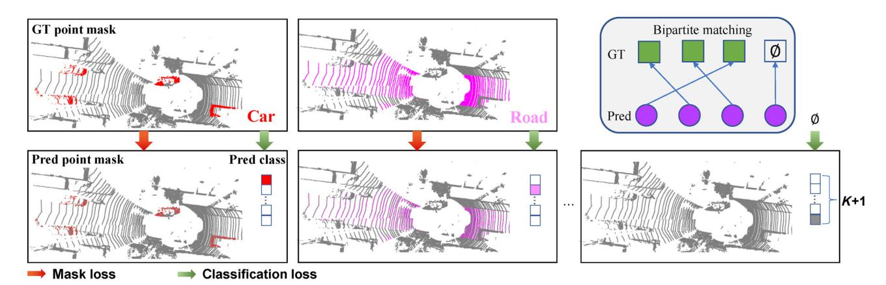

Fig. 1 Mask classification predicts a set of binary masks and assigns a single class to each mask. Each prediction is supervised with a mask and classification loss. Matching between the set of predictions and ground truth segments via bipartite matching is similar to that of DETR.

masks by category, optimized for category and segmentation separately, and finally matched the predictions and ground truth using the Hungarian matching algorithm. Next, the network structure design is introduced. As shown in Fig. 2, our network consists of a 3D backbone, transformer decoder, and semantic segmentation head. Furthermore, we introduced several optimization methods specifically for point-cloud data. Finally, we elaborate the process of assigning mask labels and optimizing the network.

#### 3.1 3D mask classification

Existing outdoor point-cloud segmentation models consider the segmentation task as a per-point classification. The goal is to predict the probability distribution over all possible K categories for every

point in a point cloud, where each point has a ground truth label  $y = \{p_i | p_i \in C^K\}_{i=1}^L$ , L is the total number of points in the point cloud, and  $C^K$  is the Kdimensional probability, that is, the label space. Then, a per-point cross-entropy loss was used to measure the discrepancy between the ground-truth category labels and the predicted value. The aforementioned methods are simple and straightforward; however, directly classifying each point in the point cloud ignores the overall class relationship. Instead of classifying each point, mask classification predicts a set of binary masks, each associated with a single category. Mask classification splits the segmentation task into two parts: classification and partitioning, which achieve the decoupling of classification and corresponding region localization. Category prediction indicates

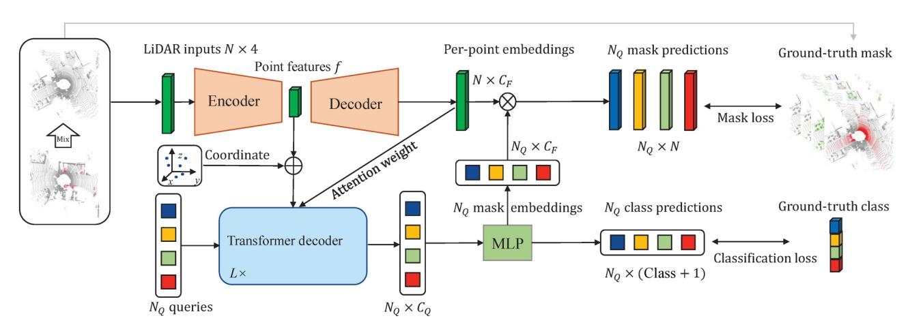

Fig. 2 PMFormer overview: we use a 3D backbone to extract point features f and then use a scatter operation to obtain the per-point embeddings F. We initialize the  $N_Q$  per-segment embeddings Q using a set of learnable parameters. A transformer decoder attends to point features and produces  $N_Q$  per-segment embeddings Q. The per-point embeddings are also fed into the transformer to generate the attention weight. The embeddings independently generate  $N_Q$  class predictions with  $N_Q$  corresponding mask embeddings. Subsequently, the model predicts  $N_Q$  possibly overlapping binary mask predictions via a dot product between per-point embeddings and mask embeddings followed by a sigmoid activation. The  $N_Q$  class prediction and  $N_Q$  mask prediction are then fed into bipartite matching. In inference, we get the final prediction by combining  $N_Q$  binary masks with their class predictions using simple matrix multiplication.

which category corresponds to the current partition prediction. There is a one-to-one correspondence between them, which allows the model to learn the overall relationship of each class. Accordingly, we propose PMFormer to implement point-cloud semantic segmentation with mask classification. The goal of mask classification is to predict a set of binary masks  $m_i \in [0,1]^L$ , each associated with a single-class prediction  $p_i \in C^{K+1}$ . The definition of prediction z is formally given by

$$z = \{(m_i, p_i)\}_{i=1}^M \tag{1}$$

z contains a set of M probability-mask pairs, and the constant M is the number of sets, which is significantly larger than the number of ground truths in the masks. The predicted masks  $m_i$  are mutually exclusive binary masks, that is,  $\sum_{i=1}^{M} m_i = 1^L$ . Class prediction  $p_i$  contains a  $\varnothing$  class (no object), in addition to the K category labels. The  $\varnothing$  label was assigned to masks that did not belong to any category. During the inference, a mask with a  $\varnothing$  prediction was discarded.

## 3.2 Point mask transformer

The PMFormer architecture is depicted in Fig. 2. It contains three modules: (1) a sparse point-voxel convolution network that generates multiscale point features and per-point embeddings, (2) a transformer decoder for computing per-segment embeddings, and (3) a segmentation module that generates final segmentation predictions.

## 3.2.1 Sparse point-voxel convolution network

The network uses the sparse point-voxel convolution to extract point cloud features. Specifically, it contains two branches: a point-based branch that maintains a high-resolution representation, and a sparse voxel-based branch that applies sparse convolution to model different perceptual field sizes. The two branches communicate at a negligible cost through sparse voxelization and de-voxelization. It uses a point cloud  $P \in \mathbb{R}^{N \times 4}$  as the input, where N is the number of points in the point cloud. The network then uses two branches to generate a low-resolution point feature  $f \in \mathbb{R}^{\frac{N}{S} \times C_f}$  and per-point embeddings  $F \in \mathbb{R}^{N \times C_F}$ , where  $C_f$  is the number of channels,  $C_F$  is the embedding dimension, and S is the stride of the convolution.

## 3.2.2 Transformer decoder

The transformer decoder follows the design of DETR,

with a self-attention module, cross-attention module and feed-forward network (FFN), which computes the output from the point features f and a set of query features  $Q \in \mathbb{R}^{N_Q \times C_Q}$ . The decoder uses queries as mask proposals and outputs the final queries used for mask prediction. The output from the transformer decoder encodes the global information about predicted by PMFormer.

## 3.2.3 Segmentation head

The semantic segmentation head uses output queries and point features to calculate mask predictions. The segmentation head module applies a linear classifier, followed by softmax activation on top of the  $N_Q$  embeddings to yield a class prediction for each segment. Subsequently, an MLP with two hidden layers is used to generate the mask embeddings. Finally, our binary mask predictions were obtained using the dot product between the mask and perpoint embeddings. In addition to the final prediction, we generated intermediate predictions to strengthen the training and used the same loss function as the final prediction for supervision. Before each decoding layer, we used mask embedding and a query from the previous step to obtain intermediate predictions.

#### 3.3 Point cloud improvements

# 3.3.1 MaskMix

Unlike the frustum region of an image, a point-cloud scene captures the entire 360-degree space, the scene is extremely large. Because some instance classes are very small, they are captured with very few points compared to a broad point cloud scene. As shown in Fig. 3, instance points only account for a small part of all labeled points. When generating the ground-truth

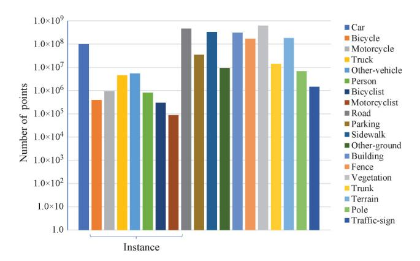

Fig. 3 Number of annotated points per class in SemanticKITTI training set. To make the chart display clear, we used a logarithmic scale.

masks for each category, we treated each category equally and generated its corresponding binary mask separately, setting the labeled points of that category to 1 and the unlabeled points to 0. Figure 4 shows the ground truth masks for the building and person categories. The ground truth masks of people occupy only a very small part of the entire scene, which causes the loss value of instance categories to be very small, making it difficult for the network to optimize it. To address this problem, inspired by CutMix, we propose MaskMix, which randomly considers instance masks from another point-cloud scene and fuses them with the current frame mask while fusing the labels. In each training iteration, a MaskMix sample was generated by combining two randomly selected training samples in a batch. For instance, in classes, mixed frames are used to generate binary ground-truth masks. This approach can increase the proportion of instance categories in binary ground truth masks and improve the segmentation accuracy of the network for them.

# 3.3.2 3D position encoding

Due to the diversity and sparsity of each point cloud scene, the conventional position encoding cannot represent the position characteristics for the point feature. Considering the varying number of point clouds present in each frame, and aiming to mitigate information loss, we refrain from constraining the number of points. Consequently, the number of perpoint embeddings introduced into the transformer decoder in each frame differed. Our proposed 3D

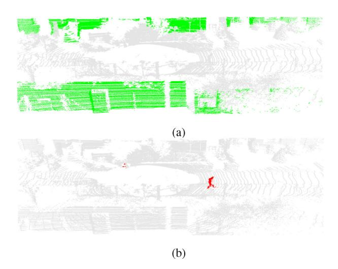

Fig. 4 Point masks of different categories. (a) Building category, which occupies most of the scene. (b) Human category, which occupies only a small part of the entire scene.

position encoding can change dynamically according to the number of per-point embeddings and contains the position information of each point. For each point, we first obtain its 3D coordinates  $c_i = (x_i, y_i, z_i)$  and normalize them as Eq. (2).

$$\overline{c_i} = \begin{cases}
\overline{x_i} = (x_i - x_{\min})/(x_{\max} - x_{\min}) \\
\overline{y_i} = (y_i - y_{\min})/(y_{\max} - y_{\min}) \\
\overline{z_i} = (z_i - z_{\min})/(z_{\max} - z_{\min})
\end{cases} (2)$$

The normalized 3D coordinates are embedded into ddimensional positional encoding with an MLP, which is then summed element-wise with the point features.

## 3.3.3 Attention weights

Unlike sentence sequences in the NLP task, point features f are composed of a large number of tokens. However, a significant portion of the tokens correspond to background regions, which leads to a long training time for the network to accurately identify the proper regions. This suggests considerable regional redundancy in the cross-attention module. To ensure that each query attends only to the foreground region, we generated a weight map. For each decoder layer, we added a mask-prediction head to generate an intermediate mask prediction. Before a query is sent to the next decoder layer, an intermediate mask prediction corresponding to the current query is generated.

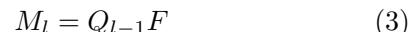

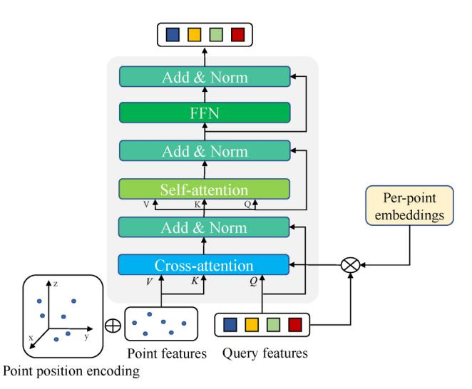

Fig. 5 Structure of the proposed transformer—decoder layer compared with the standard cross-attention with attention weights. The cross-attention mechanism takes the sum of point cloud features and 3D position encoding as key and value. The query features interact with point cloud features through cross-attention. Note that position encoding on query features and predictions from intermediate transformer decoder layers are omitted in this figure for readability.

where the output  $M_l \in \mathbb{R}^{N_Q \times N}$  denotes the intermediate mask prediction,  $Q_{l-1}$  is the query feature output from the previous decoder layer, and F is the per-point embedding. We then apply the scatter [16] operation for sparse pooling to downsample the mask prediction  $M_l$  to the current point feature size  $M_l \in \mathbb{R}^{N_Q \times \frac{N}{S}}$ . We used a sigmoid function to map the prediction to [0,1], with values greater than 0.5 as the foreground region, and less than 0.5 as the background region by multiplying it by the hyperparameter  $\beta = 2$ .

$$W_l(i) = \begin{cases} \beta \cdot \operatorname{sigmoid}(M_l^S(i)), & \text{foreground} \\ \operatorname{sigmoid}(M_l^S(i)), & \text{background} \end{cases}$$

$$(4)$$

This weight map is element-wise multiplied by the cross-attention map among all attention heads. In this way, we expand the weight of the foreground points and narrow the weight of the background points, which makes each segment query attend only to the foreground region so that the network can learn how and where to select point features.

In summary, we added cross-attention with attention weights to modulate the attention matrix using

$$Q_l = \operatorname{softmax}(W_l \cdot Q_l K_l^{\mathrm{T}}) V_l + Q_{l-1}$$
 (5)

where  $Q_l$  is the query feature, and  $K_l$ ,  $V_l$  are the point features.

#### 3.4 Mask assignment and optimization

The goal of mask classification is to segment a point cloud into a set of class-labeled masks.

$$z^{\text{gt}} = \{ (m_i^{\text{gt}}, p_i^{\text{gt}}) \}_{i=1}^K$$
 (6)

 $m_i^{\mathrm{gt}} \in \{0,1\}^N$  is the ith ground-truth mask that does not intersect.  $p_i^{\mathrm{gt}} \in \{1,...,K\}$  is the ground-truth class label corresponding to the mask  $m_i^{\mathrm{gt}}$ . The sizes of the predicted and ground truth sets were  $|z| = N_Q$  and  $|z^{\mathrm{gt}}| = N^{\mathrm{gt}}$ , respectively. Because  $N_Q \geqslant N^{\mathrm{gt}}$ , we use a bipartite matching-based assignment to assign prediction  $z_i$  to each ground truth  $z_j^{\mathrm{gt}}$ . Inspired by DETR, we use class and mask predictions to compute the assignment costs.

$$sim(z_i, z_i^{gt}) = -p_i(p_j^{gt}) + \mathcal{L}_{dice}(m_i, m_j^{gt}) + \mathcal{L}_{focal}(m_i, m_j^{gt})$$

$$(7)$$

where  $\mathcal{L}_{\text{dice}}$  is the dice loss [34] and  $L_{\text{focal}}$  is the focal loss [35].

Subsequently, we search for a permutation of M elements  $\sigma \in \mathfrak{S}_{N_O}$  that best assigns the predictions to

achieve the maximum total similarity to the ground truth.

$$\sigma = \underset{\sigma \in \mathfrak{S}_{N_O}}{\operatorname{arg\,max}} \sum_{i=1}^{T} \sin(z_{\sigma(i)}, z_i^{\operatorname{gt}})$$
 (8)

The optimal assignment was computed efficiently using the Hungarian algorithm, following prior work.

Given all the matched pairs, we computed a crossentropy loss for classification and a dice loss, which is a focal loss for each predicted mask.

$$\mathcal{L}_{\text{mask}}\left(m_i, m_i^{\text{gt}}\right) = \mathcal{L}_{\text{dice}}(m_i, m_i^{\text{gt}}) + \mathcal{L}_{\text{focal}}(m_i, m_i^{\text{gt}})$$
(9)

We refer to the T matched predictions as positive masks, which are optimized to predict the corresponding ground-truth masks and classes.

$$\mathcal{L}_{pos} = \sum_{i=1}^{T} \left( -\log p_{\sigma(i)}(p_i^{gt}) + \mathcal{L}_{mask}(m_{\sigma(i)}, m_i^{gt}) \right)$$
(10)

No-matched masks are negative samples that should be predicted as  $\varnothing$  class (no object).

$$\mathcal{L}_{\text{neg}} = \sum_{i=T+1}^{N} -\log p_{\sigma(i)}(\varnothing)$$
 (11)

We balanced the two terms by  $\alpha = 0.1$ , as a common practice to weigh positive and negative samples.

$$\mathcal{L}_{\text{loss}} = \mathcal{L}_{\text{pos}} + \alpha \mathcal{L}_{\text{neg}} \tag{12}$$

## 4 Experiments

In this section, we first briefly describe the dataset of our reported results, then introduce the implementation details of our network, and introduce detailed comparisons and benchmark test results. Subsequently, we conduct a comprehensive ablation study on the various architectural components proposed in PMFormer and a detailed qualitative analysis. In all experiments introduced in this section, we used the mIoU metric as the primary evaluation criterion, defined by the benchmark.

# 4.1 Datasets

To test the generalization of our network, we evaluated the performance of our method on two datasets collected using LiDARs at different resolutions. The first dataset was SemanticKITTI. This dataset is based on the KITTI dataset, which contains 43,551 scans and 22 sequences dealing with the most common autonomous driving scenarios. Each scan in the dataset had an average of more

than 100k points on average, with 20 classes of pointwise annotation labels. Following the official settings, sequences from 00 to 10, excluding 08, were the training split, sequence 08 was the validation split, and the remaining sequences from 11 to 21 were treated as test splits. The other dataset included nuScenes. This dataset contains 1000 scenes collected from different areas of Boston and Singapore, with a duration of 20 s each, split into 700 in the training set, 150 in the validation set, and 150 in the test set. The sensor suite contained a 32-beam LiDAR with 20 Hz capture frequency. For semantic segmentation tasks, every point in the keyframe was annotated using 16 classes.

For both datasets, we used the standard mIoU (mean intersection-overUnion) as the evaluation metric.

$$mIoU = \frac{1}{C} \sum_{c=1}^{C} \frac{TP_c}{TP_c + FP_c + FN_c}$$
 (13)

where  $TP_c$ ,  $FP_c$ ,  $FN_c$  denote true positive, false positive, and false negative predictions for classes c respectively, and C is the number of classes.

## 4.2 Implementation details

#### 4.2.1 3D backbone

We use the sparse point-voxel convolution network to extract point cloud features. Four convolutional layers were used in the model to obtain the multiscale features and per-point embedding. The network generates point feature maps at scales of 1/2, 1/4, 1/8, and per-point embeddings of the same size as the input point cloud. To reduce the overall size of the model, we used 64 channels for all the feature maps. In our model, we input a feature map with a scale 1/8 as the key for the transformer decoder.

#### 4.2.2 Transformer decoder

We follow the structure of the transformer decoder in DETR, with a self-attention module, cross-attention module, and FFN layer. The cross-attention module uses the sum of point-cloud features and 3D position encoding as the key and value, respectively.  $N_Q$  queries are embedded as a set of learnable vectors, each associated with learnable position encoding. The default number of queries was set to 100. Six transformer decoder layers were used. Following DETR, we also used the auxiliary loss.

## 4.2.3 Segmentation module

We use MLP to generate mask predictions and

class predictions. The MLP used in the semantic segmentation module had two hidden layers with 256 channels.

#### 4.2.4 Match weights and loss wights

We use dice loss and focal loss as mask loss and cross-entropy loss as classification loss:  $\mathcal{L}_{loss} = \lambda_{dice} \mathcal{L}_{dice} + \lambda_{focal} \mathcal{L}_{focal} + \lambda_{ce} \mathcal{L}_{ce}$ . In matching loss, we set the hyperparameters to  $\lambda_{dice} = 20.0$ ,  $\lambda_{mask} = 50.0$ , and  $\lambda_{ce} = 1.0$ . For training loss, we set the hyperparameters to  $\lambda_{dice} = 2.0$ ,  $\lambda_{mask} = 5.0$ , and  $\lambda_{ce} = 1.0$ . For predictions that did not match any ground truth, we only calculated the cross-entropy loss and set the parameter to  $\lambda_{ce} = 0.1$ .

## 4.2.5 Training settings

We quantized the point cloud along the xyz dimension into a voxel scale of 0.2 m to generate the initial sparse voxel features. We used data augmentation methods, such as random flipping, random point dropout, random scale, and global rotation, in the training stage. For the loss design, we combined focal loss and dice loss for mask supervision, and used cross-entropy for class supervision. The AdamW optimizer [37] was used with an initial learning rate of 0.0001 and a batch size of 8 for a total of 50 epochs. Every 15 epochs, the learning rate decreased by 0.1. All the experiments were performed using an NVIDIA RTX 3090 GPUs.

## 4.3 Results on SemanticKITTI

We tested the performance of PMFormer on the SemanticKITTI dataset. We provide detailed quantitative results per class for our model as well as for other state-of-the-art methods in Table 1. Compared to previous methods, our method achieved state-of-the-art results, with an mIoU of 71.6. In contrast to recently proposed methods, our network achieved very good results using only pure point clouds as the input and the same model for both training and inference without using knowledge distillation. Although our PMFormer networks failed to achieve the best results for every class, they achieved balanced results for all classes.

Compared with 2DPASS [38], 2DPASS uses additional image data to obtain richer semantic and structural information from camera data and distill it into a 3D semantic segmentation network. They achieved state-of-the-art performance on the SemanticKITTI dataset. Table 2 presents the results for comparison. As shown in Table 2, our model

Other vehicle ground sign Motorcycle Motorcylist Vatetation Sidework Bicyclist Building Bicycle Traffic Other Person Method mIoI Pointnet++ [2] 20.1 72.0 41.8 18.7 5.6 62.3 53.7 0.9 1.9 0.2 0.2 46.5 13.8 0.9 1.0 0.0 16.9 RangeNet++ [28] 52.2 91.8 75.265.027.8 87.4 91.4 25.725.7 34 4 23.0 80.5 55.164.6 38.3 38.8 4.8 58.6 47.9 55.9 RandLA [5] 53.9 90.7 73.7 60.220.4 86.9 94.240.1 26.0 25.8 38.9 81.4 66.8 49.2 49.2 48.2 7.2 56.3 47.7 38.1 PolarNet [15] 54.3 61.7 21.7 22.9 30.1 67.8 43.2 40.2 5.6 61.3 90.8 74.4 90.0 93.8 40.3 28.5 84.0 65.5 51.8 57.5 SqueezeSegV3 [29] 55.9 91.7 74.8 63.4 26.489.0 92.5 29.6 38.7 36.533.0 82.0 58.7 65.4 45.6 46.2 20.1 59.4 49.6 58.9 KPConv [12] 72.761.3 90.5 96.0 42.5 69.2 69.1 61.511.8 64.231.6 33.4 30.2 44.3 84.8 61.6 SalsaNext [14] 60.2 59.5 91.7 75.8 63.7 29.1 90.2 91.9 38.9 38.6 31.9 81.8 63.6 66.5 59.0 19.4 64.254.3 62.1 48.3 SPVNAS [10] 67.0 an 2 75.4 67.6 21.8 86.1 71.0 67.4 67.1 50.3 66.9 91.6 97.2 56.6 50.6 50.4 58.0 73 4 64.3 67.3 DRINet [16] 67.5 90.7 75.2 65.0 26.2 91.5 96.9 43.3 57.0 56.0 54.5 85.2 72.6 68.8 69.4 58.9 67.3 Cvlinder3D [6] 68.9 92.0 70.0 65.0 63.8 72.569.8 73.7 69.2 48.0 66.5 62.4 66.2 32.3 90.7 97.1 50.8 67.6 58.5 85.6 RPVNet [30] 70.3 71.793.4 80.7 70.3 33.3 93.597.6 44.2 68.4 68.7 61.1 86.5 75.1 75.9 74.4 43.4 72.1 64.8 61.4 (AF)2-S3Net [31] 92.0 76.2 45.8 92.5 40.2 81.4 40.0 78.6 68.0 63.1 76.4 77.7 69.6

58.0

69.3

64.7

65.8

67.9

64.5

61.0

60.2

55.5

Table 1 Quantitative results of our proposed method and state-of-the-art LiDAR semantic segmentation methods on the SemanticKITTI test set

**Table 2** Comparison with 2DPASS on SemanticKITTI validation dataset. The results of 2DPASS come from its official GitHub code repository

70.7

71.2

89.8

91.8

74.6

77.5 **70.9** 

74.7

66.2

66.9

30.1

41.0

39.4

96.9 59.3

97.0

96.5

53.5

56.5

92.3

92.4

92.8

GASN [32]

Ours

Point-Voxel-KD [33]

| Model                            | mIoU (vanilla) | mIoU (TTA) | Parameter |
|----------------------------------|----------------|------------|-----------|
| 2DPASS (4scale-64dimension)      | 68.7           | 70.0       | 1.9M      |
| 2DPASS (6scale- 256dimension) | 70.7           | 72.0       | 45.6M     |
| Ours                             | 69.5           | 71.3       | 11.7M     |

surpasses the performance of 2DPASS with a small number of channels using only point clouds as input during training and inference. Compared with a large number of channels, our model is lighter, and the performance difference is not significant.

#### 4.4 Results on nuScenes

87.3

86.5

86.3

To verify the generalizability of our model, we report the results of our proposed method on the nuScenes validation dataset. The results are shown in Table 3, PMFormer achieved very strong results, with 7 of the 16 categories surpassing the other approaches. In the bicycle and traffic classes, our proposed method achieved a performance gain of approximately 10–14 mIoU compared with previous state-of-theart methods. This demonstrates the effectiveness of our mask-classification 3D segmentation model, which was designed to capture the overall category information.

72.5

71.9

70.6

80.4 82.7

75.1

78.2

73.5

82.1 64.9

73.0

73.8

72.2

69 6 66.1

69.4

70.3 63.7

64.9

46.3

50.5

71.6

65.8

71.5

Table 3 Quantitative results of our proposed method and state-of-the-art LiDAR semantic segmentation methods on nuScenes validation set

| Method               | mIoU | Barrier | Bicycle | Bus  | Car  | Construction | Motorcycle | Pedestrian | Traffic-cone | Trailer | Truck | Driveable | Other-flat | Sidewalk    | Terrain | Manmade | Vegetation |
|----------------------|------|---------|---------|------|------|--------------|------------|------------|--------------|---------|-------|-----------|------------|-------------|---------|---------|------------|
| $(AF)^2$ -S3Net [31] | 62.2 | 60.3    | 12.6    | 82.3 | 80.0 | 20.1         | 62.0       | 59.0       | 49.0         | 42.2    | 67.4  | 94.2      | 68.0       | 64.1        | 68.6    | 82.9    | 82.4       |
| RangeNet++ $[28]$    | 65.6 | 66.0    | 21.3    | 77.2 | 80.9 | 30.2         | 66.8       | 69.6       | 52.1         | 54.2    | 72.3  | 94.1      | 66.6       | 63.5        | 70.1    | 83.1    | 79.8       |
| PolarNet [15]        | 71.0 | 74.7    | 28.2    | 85.3 | 90.9 | 35.1         | 77.5       | 71.3       | 58.8         | 57.4    | 76.1  | 96.5      | 71.1       | 74.7        | 74.0    | 87.3    | 85.7       |
| SalsaNext [14]       | 72.2 | 74.8    | 34.1    | 85.9 | 88.4 | 42.2         | 72.4       | 72.2       | 63.1         | 61.3    | 76.5  | 96.0      | 70.8       | 71.2        | 71.5    | 86.7    | 84.4       |
| Point-Voxel-KD [33]  | 76.0 | 76.2    | 40.0    | 90.2 | 94.0 | 50.9         | 77.4       | 78.8       | 64.7         | 62.0    | 84.1  | 96.6      | 71.4       | 76.4        | 76.3    | 90.3    | 86.9       |
| Cylinder3D [6]       | 76.1 | 76.4    | 40.3    | 91.2 | 93.8 | 51.3         | 78.0       | 78.9       | 64.9         | 62.1    | 84.4  | 96.8      | 71.6       | 76.4        | 75.4    | 90.5    | 87.4       |
| AMVNet [36]          | 76.1 | 79.8    | 32.4    | 82.2 | 86.4 | 62.5         | 81.9       | 75.3       | 72.3         | 83.5    | 65.1  | 97.4      | 67.0       | <b>78.8</b> | 74.6    | 90.8    | 87.9       |
| RPVNet [30]          | 77.6 | 78.2    | 43.4    | 92.7 | 93.2 | 49.0         | 85.7       | 80.5       | 66.0         | 66.9    | 84.0  | 96.9      | 73.5       | 75.9        | 76.0    | 90.6    | 88.9       |
| Ours                 | 78.4 | 78.2    | 54.0    | 93.3 | 86.1 | 59.7         | 78.4       | 83.2       | 74.3         | 65.0    | 81.4  | 96.6      | 75.7       | 74.6        | 75.4    | 90.0    | 88.6       |

## 4.5 Ablation study

Table 4 shows the impact of omitting different components on the network performance. We used a standard transformer decoder without position encoding as a baseline. 3D position encoding provides a strong position prior to perceiving a 3D scene. As shown in Table 4, the proposed 3D position encoding improved the performance of the network. Moreover, if we add attention weights for cross-attention, our method further improves the performance by 0.4 mIoU. The attention weights allow PMFormer to focus on the foreground predictions from the previous layer. Recently, some studies [39] proposed other variants of cross-attention that aim to improve convergence and performance. Compared to the method of directly masking out the background classes, attention weights assign smaller weights to the background classes instead of discarding them, which prevents the network from generating incorrect predictions at the early stage of training, thus affecting model performance.

In addition, MaskMix significantly improved the problem of too few points in instance classes, particularly for instance classes with very few points. As shown in Table 5, classes such as motorcycles and people improved significantly.

## 4.6 Number of queries and decoder layers

We present the results obtained by varying the number of query vectors and transformer–decoder layers. As shown in Fig. 6, the network achieves satisfactory results with only one decoder layer. As the number of layers increases, the query can be gradually optimized and the network performance improves. The best performance was achieved with

Table 4 Ablation study on the SemanticKITTI validation set

| MaskMix | 3D Position encoding | mask         |   | mIoU |
|---------|-------------------------|--------------|---|------|
|         |                         |              |   | 68.2 |
| ✓       |                         |              |   | 68.7 |
| ✓       | $\checkmark$            |              |   | 69.1 |
| ✓       | $\checkmark$            | $\checkmark$ |   | 69.0 |
| ✓       | ✓                       |              | ✓ | 69.5 |

Table 5 Ablation study for MaskMix

| MaskMix      | Motorcycle | Truck | Person |  |
|--------------|------------|-------|--------|--|
|              | 77.5       | 84.8  | 78.4   |  |
| $\checkmark$ | 81.6       | 89.3  | 80.2   |  |

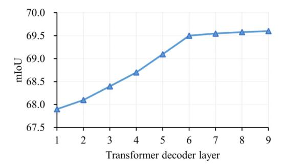

Fig. 6 Performance results for different selected number of transformer decoder layers.

six layers; subsequent increases in the number of layers had little effect on the network. The model with 100 queries and 6 transformer decoder layers performed the best. Table 6 lists the effects of different numbers of queries on the network. This effect was stronger when the number of queries was greater than the total number of categories. The best effect was achieved when the number of queries reached 100, and subsequent increases in the number of queries were less effective for the network.

#### 4.7 Feature resolution

In this section, we test the effect of point-cloud features at different scales on the segmentation results. As shown in Table 7, large-scale pointcloud features have small receptive fields and contain shallow semantic information. However, owing to their long sequence length, the efficiency of queries in cross-attention is reduced, resulting in suboptimal performance. By contrast, small-scale point-cloud features have a larger receptive field and contain deeper semantic information. A moderate sequence length allows the query to learn efficiently during the cross-attention process, resulting in better performance. In addition, we tested the impact of multiscale point-cloud features on the network. In the experiment, we used scales 1/2, 1/4, 1/8, each corresponding to a transformer decoder layer. These three layers were repeated twice. The results

 Table 6
 Performance results for different selected number of query vectors

| Layer | Query | mIoU |
|-------|-------|------|
| 6     | 20    | 68.4 |
| 6     | 50    | 69.1 |
| 6     | 100   | 69.5 |
| 6     | 150   | 69.3 |

Table 7 Performance results of different choices of feature resolution

| Feature resolution            | mIoU |
|-------------------------------|------|
| Single scale (1/2)            | 68.7 |
| Single scale $(1/4)$          | 69.0 |
| Single scale (1/8)            | 69.5 |
| Multi-scale $(1/2, 1/4, 1/8)$ | 69.1 |

showed that multiscale point-cloud features did not significantly improve the performance of the model.

### 4.8 Generality

To verify the gain of mask classification on point cloud semantic segmentation and show that our PMFormer can serve as a "model-independent" training scheme to improve the performance of other networks. We trained two open-source baselines, SPVCNN and Cylinder3D on the SemanticKITTI and nuScenes datasets, respectively. During the experiment, we changed only the per-point classification head to a mask classification head, while all other settings remained the same. As shown in Fig. 7, the combination of mask classification with SPVCNN and Cylinder3D improved the performance from 64.2 to 66.2 and 75.7 to 77.3. These results fully demonstrate the effectiveness and generality of mask classification.

# 4.9 Model complexity analysis

We provide a quantitative analysis of the model complexity and latency for some state-of-the-art methods and our PMFormer in Table 8 to illustrate the high performance—time ratio of our approach. To streamline the model and enhance its computational efficiency, we diminished the layer and channel counts within the backbone network and used the smallest scale of 1/8 features in the transformer. Compared with previous state-of-the-art methods, our model

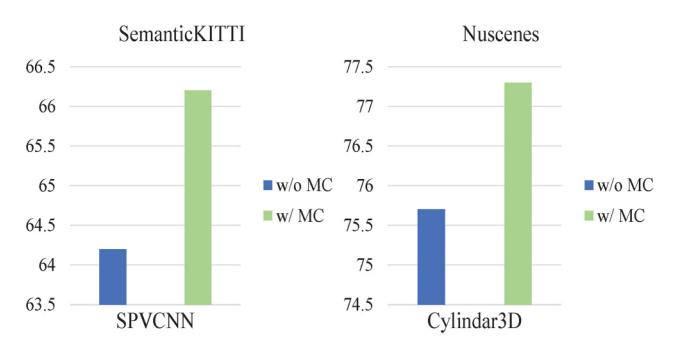

Fig. 7 Improvement of mask classification for the model in the figure. The left graph shows the results of SPVCNN on the SemanticKITTI dataset, and the right graph shows the results of Cylinder3D on the nuScenes dataset.

Table 8 Efficiency and performance trade-off of our model. The mIoU on the SemanticKITTI test set is presented. The speed is tested on NVIDIA RTX 3090 GPU, including pre- and postprocessing time

| Method       | Param (M) | Macs (G) | Speed (ms) | mIoU |
|--------------|-----------|----------|------------|------|
| SPVCNN       | 12.5      | 73.8     | 120        | 67.0 |
| Cylind3D     | 53.3      | 64.3     | 131        | 68.9 |
| RPVNet       | 24.8      | 119.5    | 168        | 70.3 |
| MinkowskiNet | 12.5      | 73.8     | 120        | 67.0 |
| Ours         | 11.7      | 60.0     | 105        | 71.6 |
|              |           |          |            |      |

achieves better results in terms of complexity, speed, and accuracy.

#### 4.10 Visualizations

A visualization of 3D semantic segmentation is shown in Figs. 8 and 9. As shown in the figure, the perpoint classification method incorrectly classifies a portion of the whole into other categories, whereas our mask classification method, PMFormer, maintains the integrity of the predicted categories better. Compared to the per-point classification method, our mask classification-based method PMFormer correctly segments each class and produces finer segmentation results.

#### 5 Conclusions

In this paper, we propose a novel point cloud semantic segmentation network point mask transformer (PMFormer), which transforms the point cloud semantic segmentation task from per-point classification to mask classification. For cross attention, we propose 3D position encoding to provide a strong position prior to perceiving a 3D scene. In addition, we propose attention weights that make the query more efficient in learning point-cloud feature information. Experiments on the large-scale outdoor scenario datasets SemanticKITTI and nuScenes demonstrate that our approach achieves state-of-the-art performance.

#### Acknowledgements

This work was supported by the National Natural Science Foundation of China (62222602, 62302167, 62176224, 62106075, 61972157), the Shanghai Sailing Program (23YF1410500), Natural Science Foundation of Shanghai (23ZR1420400), Natural Science Foundation of Chongqing, China (CSTB2023NSCQ-JQX0007, CSTB2023NSCQ-MSX0137), CCF-Tencent

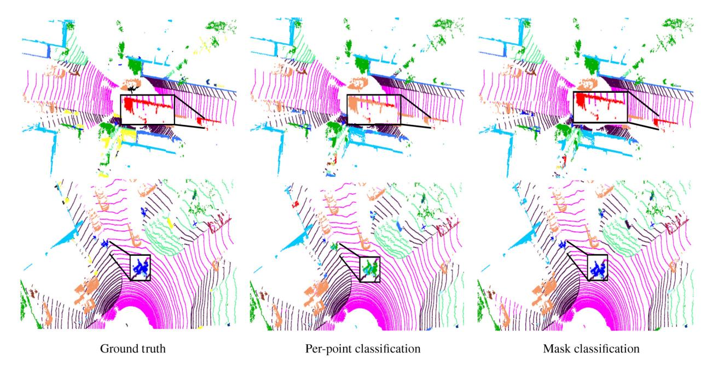

Fig. 8 Visualization of semantic segmentation results on the SemanticKITTI validation set. The first column is the ground truth, the second column is the result of the per-point classification semantic segmentation model, and the third column is the result of our PMFormer model.

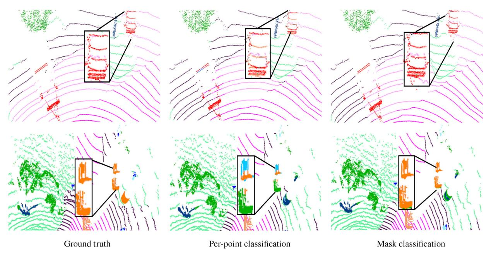

Fig. 9 Visualization of semantic segmentation results on the nuScenes validation set. The first column is the ground truth, the second column is the result of the per-point classification semantic segmentation model, and the third column is the result of our PMFormer model.

Rhino-Bird Young Faculty Open Research Fund (RAGR20230121), and CAAI-Huawei MindSpore Open Fund.

## Declaration of competing interest

The authors have no competing interests to declare that are relevant to the content of this article.

# References

- Charles, R. Q.; Hao, S.; Mo, K.; Guibas, L. J. PointNet: Deep learning on point sets for 3D classification and segmentation. In: Proceedings of the IEEE Conference on Computer Vision and Pattern Recognition, 652–660, 2017.
- [2] Qi, C. R.; Yi, L.; Su, H.; Guibas, L. J. PointNet++:

- Deep hierarchical feature learning on point sets in a metric space. arXiv preprint arXiv:1706.02413, 2017.
- [3] Zhang, J.; Zhu, C.; Zheng, L.; Xu, K. Fusion-aware point convolution for online semantic 3D scene segmentation. In: Proceedings of the IEEE/CVF Conference on Computer Vision and Pattern Recognition, 4534–4543, 2020.
- [4] Tan, X.; Ma, Q.; Gong, J.; Xu, J.; Zhang, Z.; Song, H.; Qu, Y.; Xie, Y.; Ma, L. Positive-negative receptive field reasoning for omni-supervised 3D segmentation. *IEEE Transactions on Pattern Analysis and Machine Intelligence* Vol. 45, No. 12, 15328-15344, 2023.
- [5] Hu, Q.; Yang, B.; Xie, L.; Rosa, S.; Guo, Y.; Wang, Z.; Trigoni, N.; Markham, A. RandLA-net: Efficient semantic segmentation of large-scale point clouds. In: Proceedings of the IEEE/CVF Conference on Computer Vision and Pattern Recognition, 11108– 11117, 2020.
- [6] Zhou, H.; Zhu, X.; Song, X.; Ma, Y.; Wang, Z.; Li, H.; Lin, D. Cylinder3D: An effective 3D framework for driving-scene LiDAR semantic segmentation. arXiv preprint arXiv:2008.01550, 2020.
- [7] Huang, S. S.; Ma, Z. Y.; Mu, T. J.; Fu, H.; Hu, S. M. Supervoxel convolution for online 3D semantic segmentation. ACM Transactions on Graphics Vol. 40, No. 3, Article No. 34, 2021.
- [8] Cheng, B.; Schwing, A.; Kirillov, A. Per-pixel classification is not all you need for semantic segmentation. In: Proceedings of the 35th Conference on Neural Information Processing Systems, 17864– 17875, 2021.
- [9] Cheng, B.; Misra, I.; Schwing, A. G.; Kirillov, A.; Girdhar, R. Masked-attention mask transformer for universal image segmentation. In: Proceedings of the IEEE/CVF Conference on Computer Vision and Pattern Recognition, 1290–1299, 2022.
- [10] Tang, H.; Liu, Z.; Zhao, S.; Lin, Y.; Lin, J.; Wang, H.; Han, S. Searching efficient 3D architectures with sparse point-voxel convolution. In: Computer Vision – ECCV 2020. Lecture Notes in Computer Science, Vol. 12373. Vedaldi, A.; Bischof, H.; Brox, T.; Frahm, J.-M. Eds. Springer Cham, 685–702, 2020.
- [11] Yun, S.; Han, D.; Chun, S.; Oh, S. J.; Yoo, Y.; Choe, J. CutMix: Regularization strategy to train strong classifiers with localizable features. In: Proceedings of the IEEE/CVF International Conference on Computer Vision, 6023–6032, 2019.
- [12] Thomas, H.; Qi, C. R.; Deschaud, J. E.; Marcotegui, B.; Goulette, F.; Guibas, L. KPConv:

- Flexible and deformable convolution for point clouds. In: Proceedings of the IEEE/CVF International Conference on Computer Vision, 6411–6420, 2019.
- [13] Zheng, Y.; Xu, X.; Zhou, J.; Lu, J. PointRas: Uncertainty-aware multi-resolution learning for point cloud segmentation. *IEEE Transactions on Image* Processing Vol. 31, 6002–6016, 2022.
- [14] Cortinhal, T.; Tzelepis, G.; Erdal Aksoy, E. SalsaNext: Fast, uncertainty-aware semantic segmentation of LiDAR point clouds. In: Computer Vision – ECCV 2020. Lecture Notes in Computer Science, Vol. 12510. Vedaldi, A.; Bischof, H.; Brox, T.; Frahm, J.-M. Eds. Springer Cham, 207–222, 2020.
- [15] Zhang, Y.; Zhou, Z.; David, P.; Yue, X.; Xi, Z.; Gong, B.; Foroosh, H. PolarNet: An improved grid representation for online LiDAR point clouds semantic segmentation. In: Proceedings of the IEEE/CVF Conference on Computer Vision and Pattern Recognition, 9601–9610, 2020.
- [16] Ye, M.; Xu, S.; Cao, T.; Chen, Q. DRINet: A dual-representation iterative learning network for point cloud segmentation. In: Proceedings of the IEEE/CVF International Conference on Computer Vision, 7447–7456, 2021.
- [17] Vaswani, A.; Shazeer, N.; Parmar, N.; Uszkoreit, J.; Jones, L.; Gomez, A. N.; Kaiser, L.; Polosukhin, I. Attention is all you need. In: Proceedings of the 31st Conference on Neural Information Processing Systems, 2017.
- [18] Guo, M. H.; Liu, Z. N.; Mu, T. J.; Hu, S. M. Beyond selfattention: External attention using two linear layers for visual tasks. *IEEE Transactions on Pattern Analysis* and Machine Intelligence Vol. 45, No. 5, 5436–5447, 2023.
- [19] Zhang, W.; Pang, J.; Chen, K.; Loy, C. C. K-Net: Towards unified image segmentation. In: Proceedings of the 35th Conference on Neural Information Processing Systems, 10326–10338, 2021.
- [20] Xie, E.; Wang, W.; Yu, Z.; Anandkumar, A.; Alvarez, J. M.; Luo, P. SegFormer: Simple and efficient design for semantic segmentation with transformers. In: Proceedings of the 35th Conference on Neural Information Processing Systems, 12077–12090, 2021.
- [21] Yu, Q.; Wang, H.; Kim, D.; Qiao, S.; Collins, M.; Zhu, Y.; Adam, H.; Yuille, A.; Chen, L. C. CMT-DeepLab: Clustering mask transformers for panoptic segmentation. In: Proceedings of the IEEE/CVF Conference on Computer Vision and Pattern Recognition, 2550–2560, 2022.

- [22] Zhao, H.; Jiang, L.; Jia, J.; Torr, P.; Koltun, V. Point transformer. In: Proceedings of the IEEE/CVF International Conference on Computer Vision, 16259– 16268, 2021.
- [23] Guo, M. H.; Cai, J. X.; Liu, Z. N.; Mu, T. J.; Martin, R. R.; Hu, S. M. PCT: Point cloud transformer. Computational Visual Media Vol. 7, No. 2, 187–199, 2021.
- [24] Lai, X.; Liu, J.; Jiang, L.; Wang, L.; Zhao, H.; Liu, S.; Qi, X.; Jia, J. Stratified transformer for 3D point cloud segmentation. In: Proceedings of the IEEE/CVF Conference on Computer Vision and Pattern Recognition, 8500–8509, 2022.
- [25] Liu, Z.; Lin, Y.; Cao, Y.; Hu, H.; Wei, Y.; Zhang, Z.; Lin, S.; Guo, B. Swin transformer: Hierarchical vision transformer using shifted windows. In: Proceedings of the IEEE/CVF International Conference on Computer Vision, 10012–10022, 2021.
- [26] Carion, N.; Massa, F.; Synnaeve, G.; Usunier, N.; Kirillov, A.; Zagoruyko, S. End-to-end object detection with transformers. In: Computer Vision ECCV 2020. Lecture Notes in Computer Science, Vol. 12346. Vedaldi, A.; Bischof, H.; Brox, T.; Frahm, J.-M. Eds. Springer Cham, 213–229, 2020.
- [27] Misra, I.; Girdhar, R.; Joulin, A. An end-to-end transformer model for 3D object detection. In: Proceedings of the IEEE/CVF International Conference on Computer Vision, 2906–2917, 2021.
- [28] Milioto, A.; Vizzo, I.; Behley, J.; Stachniss, C. RangeNet: Fast and accurate LiDAR semantic segmentation. In: Proceedings of the IEEE/RSJ International Conference on Intelligent Robots and Systems, 4213–4220, 2019.
- [29] Xu, C.; Wu, B.; Wang, Z.; Zhan, W.; Vajda, P.; Keutzer, K.; Tomizuka, M. SqueezeSegV3: Spatially-adaptive convolution for efficient point-cloud segmentation. In: Computer Vision ECCV 2020. Lecture Notes in Computer Science, Vol. 12373. Vedaldi, A.; Bischof, H.; Brox, T.; Frahm, J.-M. Eds. Springer Cham, 1–19, 2020.
- [30] Xu, J.; Zhang, R.; Dou, J.; Zhu, Y.; Sun, J.; Pu, S. RPVNet: A deep and efficient range-point-voxel fusion network for LiDAR point cloud segmentation. In: Proceedings of the IEEE/CVF International Conference on Computer Vision, 16024–16033, 2021.
- [31] Cheng, R.; Razani, R.; Taghavi, E.; Li, E.; Liu, B. (AF)2-S3Net: Attentive feature fusion with adaptive feature selection for sparse semantic segmentation

- network. In: Proceedings of the IEEE/CVF Conference on Computer Vision and Pattern Recognition, 12547–12556, 2021.
- [32] Ye, M.; Wan, R.; Xu, S.; Cao, T.; Chen, Q. Efficient point cloud segmentation with geometry-aware sparse networks. In: Computer Vision – ECCV 2022. Lecture Notes in Computer Science, Vol. 13699. Avidan, S.; Brostow, G.; Cissé, M.; Farinella, G. M.; Hassner, T. Eds. Springer Cham. 196–212, 2022.
- [33] Hou, Y.; Zhu, X.; Ma, Y.; Loy, C. C.; Li, Y. Point-to-voxel knowledge distillation for LiDAR semantic segmentation. In: Proceedings of the IEEE/CVF Conference on Computer Vision and Pattern Recognition, 8479–8488, 2022.
- [34] Milletari, F.; Navab, N.; Ahmadi, S. A. V-net: Fully convolutional neural networks for volumetric medical image segmentation. In: Proceedings of the 4th International Conference on 3D Vision, 565–571, 2016.
- [35] Lin, T. Y.; Goyal, P.; Girshick, R.; He, K.; Dollár, P. Focal loss for dense object detection. In: Proceedings of the IEEE International Conference on Computer Vision, 2980–2988, 2017.
- [36] Liong, V. E.; Nguyen, T. N. T.; Widjaja, S.; Sharma, D.; Chong, Z. J. AMVNet: Assertion-based multiview fusion network for LiDAR semantic segmentation. arXiv preprint arXiv:2012.04934, 2020.
- [37] Loshchilov, I.; Hutter, F. Decoupled weight decay regularization. arXiv preprint arXiv:1711.05101, 2017.
- [38] Yan, X.; Gao, J.; Zheng, C.; Zheng, C.; Zhang, R.; Cui, S.; Li, Z. 2DPASS: 2D priors assisted semantic segmentation on LiDAR point clouds. In: Computer Vision – ECCV 2022. Lecture Notes in Computer Science, Vol. 13688. Avidan, S.; Brostow, G.; Cissé, M.; Farinella, G. M.; Hassner, T. Eds. Springer Cham, 677–695, 2022.
- [39] Meng, D.; Chen, X.; Fan, Z.; Zeng, G.; Li, H.; Yuan, Y.; Sun, L.; Wang, J. Conditional DETR for fast training convergence. In: Proceedings of the IEEE/CVF International Conference on Computer Vision, 3651–3660, 2021.

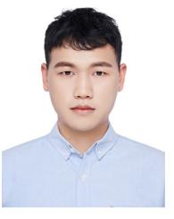

Xiangqian Li received his B.S. degree in physics from China University of Geosciences, Wuhan, China, in 2021. He is currently pursuing the MA.ENG. degree with the School of Computer Science and Technology, East China Normal University, China.

Xin Tan received his dual Ph.D. degrees in computer science from Shanghai Jiao Tong University and City University of Hong Kong. He received his B.Eng. degree in automation from Chongqing University, China, in 2017. He is currently the associate research professor at the School of Computer Science and

Technology, East China Normal University, China. His research interests lie in computer vision and deep learning. He serves as a program committee member/reviewer for CVPR, ICCV, ECCV, AAAI, IJCAI, IEEE TPAMI, TIP, and IJCV.

Zhizhong Zhang received his Ph.D. degree in pattern recognition and intelligent systems from the Institute of Automation, Chinese Academy of Sciences (CAS), in 2020. He is currently an associate research professor with the School of Computer Science and Technology, East China Normal Uni-

versity. His research interests include image processing, computer vision, machine learning, and pattern recognition.

Yuan Xie received his Ph.D. degree in pattern recognition and intelligent systems from the Institute of Automation, Chinese Academy of Sciences (CAS), in 2013. He is currently a full professor with the School of Computer Science and Technology, East China Normal University, Shanghai, China. His

research interests include image processing, computer vision, machine learning, and pattern recognition. He has published around 85 papers in major international journals and conferences including the IJCV, IEEE TPAMI, TIP, TNNLS, TCYB, NIPS, ICML, CVPR, ECCV, ICCV, etc. He also has served as a reviewer for more than 15 journals and

conferences. Dr. Xie received the National Science Fund for Excellent Young Scholars 2022.

Lizhuang Ma received his B.S. and Ph.D. degrees from Zhejiang University, China, in 1985 and 1991, respectively. He is currently a distinguished professor, Ph.D. tutor, and the head of the Digital Media and Computer Vision Laboratory with the Department of Computer Science and Engineering, Shanghai Jiao

Tong University, China. He was a visiting professor with the Frounhofer IGD, Darmstadt, Germany, in 1998, and the Center for Advanced Media Technology, Nanyang Technological University, Singapore, from 1999 to 2000. He has published more than 200 academic research articles in both domestic and international journals. His research interests include computer aided geometric design, computer graphics, scientific data visualization, computer animation, digital media technology, theory and applications for computer graphics, and CAD/CAM.

Open Access This article is licensed under a Creative Commons Attribution 4.0 International License, which permits use, sharing, adaptation, distribution and reproduction in any medium or format, as long as you give appropriate credit to the original author(s) and the source, provide a link to the Creative Commons licence, and indicate if changes were made.

The images or other third party material in this article are included in the article's Creative Commons licence, unless indicated otherwise in a credit line to the material. If material is not included in the article's Creative Commons licence and your intended use is not permitted by statutory regulation or exceeds the permitted use, you will need to obtain permission directly from the copyright holder.

To view a copy of this licence, visit http://creativecommons.org/licenses/by/4.0/.

To submit a manuscript, please go to https://jcvm.org.