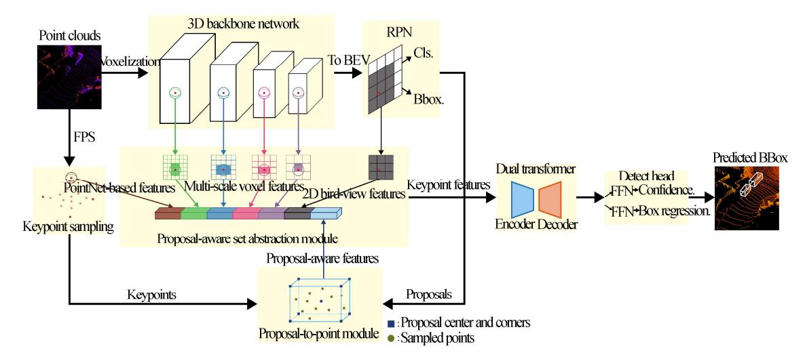
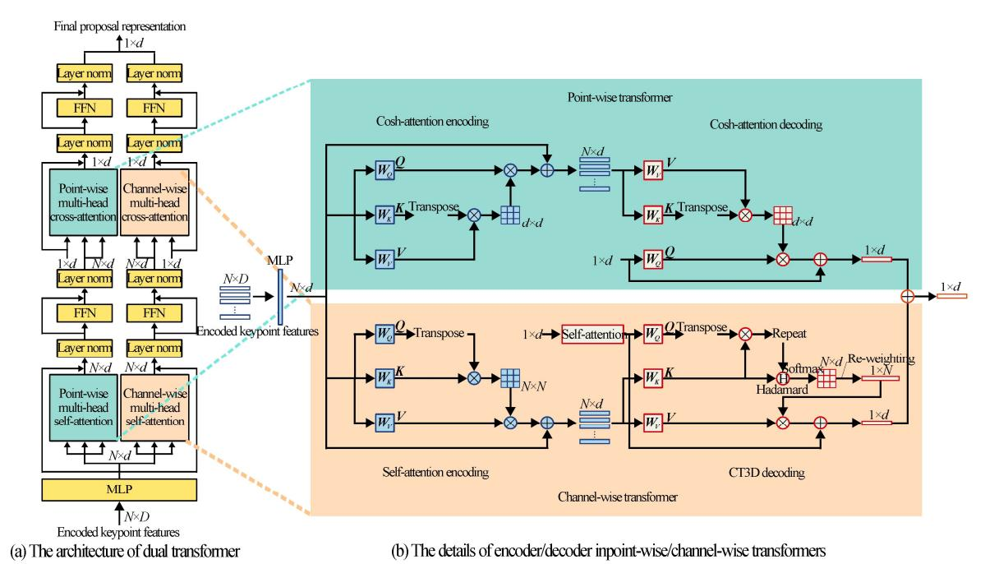
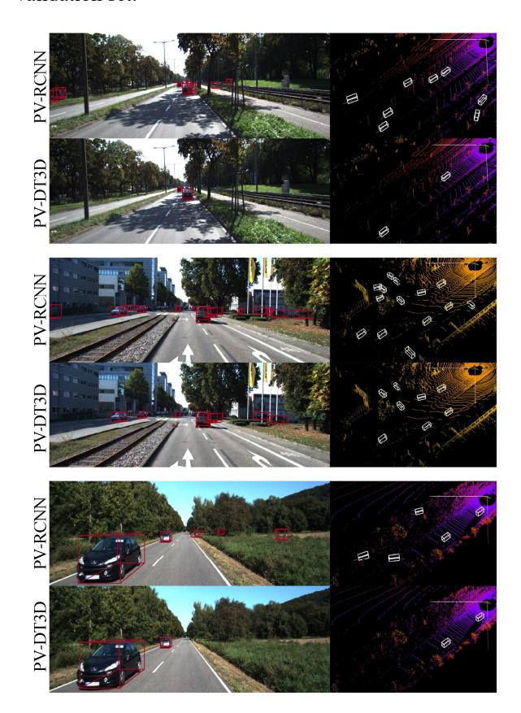

# Point-voxel dual transformer for LiDAR 3D object detection\*

# TONG Jigang1, YANG Fanhang1, YANG Sen1, and DU Shengzhi2\*\*

- 1. Tianjin Key Laboratory for Control Theory & Applications in Complicated Systems and Intelligent Robot Laboratory, Tianjin University of Technology, Tianjin 300384, China
- 2. Department of Electrical Engineering, Tshwane University of Technology, Pretoria 0001, South Africa

(Received 17 July 2023; Revised 2 March 2025) ©Tianjin University of Technology 2025

In this paper, a two-stage light detection and ranging (LiDAR) three-dimensional (3D) object detection framework is presented, namely point-voxel dual transformer (PV-DT3D), which is a transformer-based method. In the proposed PV-DT3D, point-voxel fusion features are used for proposal refinement. Specifically, keypoints are sampled from entire point cloud scene and used to encode representative scene features via a proposal-aware voxel set abstraction module. Subsequently, following the generation of proposals by the region proposal networks (RPN), the internal encoded keypoints are fed into the dual transformer encoder-decoder architecture. In 3D object detection, the proposed PV-DT3D takes advantage of both point-wise transformer and channel-wise architecture to capture contextual information from the spatial and channel dimensions. Experiments conducted on the highly competitive KITTI 3D car detection leaderboard show that the PV-DT3D achieves superior detection accuracy among state-of-the-art point-voxel-based methods.

**Document code:** A **Article ID:** 1673-1905(2025)09-0547-8

**DOI** https://doi.org/10.1007/s11801-025-3134-9

#### 1. Introduction

Three-dimensional (3D) object detection from point clouds for autonomous driving attracts increasing interest in the field of deep learning. Traditional neural networks are successfully applied in computer vision[1,2], which paved the way for light detection and ranging (LiDAR) 3D object detection. However, unlike regular images where convolutional neural network (CNN)-like operators can be directly applied, point clouds are commonly unordered and sparse. To tackle these challenges, several methods project raw point clouds into voxels[3,4], and then use 3D CNNs to extract features. But these methods suffer from a growing memory requirement, and inevitably sacrifice fine-grained position details which are important for accurate localization. On the other hand, following the pioneering work[5] and its variants[6], the point-wise methods directly extract features from the raw points. Generally, the point-wise methods[7] retain more accurate position information for fine-grained refinement, but they are usually time-consuming due to repetitive calculation. The voxel-based approaches [4,8] effectively generate high quality proposals, but suffer from high memory demands and information loss which degrades localization accuracy.

To address the issue of repetitive calculations in traditional point-wise methods and the loss of localization information in voxel-based approaches, we turned our attention to transformers. Transformer[9] was recently considered as an ideal model for point cloud processing, rooting from the advantage of self-attention. As the core component in transformer, self-attention is able to capture relationships among points in large scale. Besides, its inherent permutation invariance is well suited for unordered points. According to the operating space, transformers are divided into point-wise transformers[10] and channel-wise transformers[11]. The former highlights the spatial relationships among input points, while the latter focuses on the interactions among different channels.

This paper proposes a point-voxel dual transformer (PV-DT3D) by combine the advantages of the point-wise and channel-wise methods. The PV-DT3D includes a proposal-aware voxel set abstraction (VSA) module for aggregating information of point-level positions, multi-scale voxel features and the generated proposals. Comparing to the vanilla VSA module[12], the PV-DT3D leverages better information of high-quality proposals and adds local correlations to keypoints to stabilize the

\* This work has been supported by the Natural Science Foundation of China (No.62103298), and the South African National Research Foundation (Nos.132797 and 137951).

\*\* DU Shengzhi is a professor in Tshwane University of Technology, South Africa. He received his Ph.D. degree from Nankai University in 2005. His research interests include intelligent human-machine systems, computer vision, image analysis and understanding, artificial intelligence. E-mail: dushengzhi@gmail.com.

training process.

Experiments on KITTI dataset show that the PV-DT3D achieves superior detection accuracy among point-voxel-based methods. Ablation evaluations confirm the effectiveness of the proposed proposal-aware VSA module and dual transformer for 3D object detection.

#### 2. Related work

# 2.1 Point-based LiDAR 3D object detection

Following the pioneering work[5,6], point-based detection methods are in rapid development. PointRCNN[7] proposed a two-stage point-based framework for 3D object detection, which generated proposals from segmented foreground points by PointNet++[6]. The 3D single stage object detector (3DSSD)[13] presented a single-stage approach by a novel point-sampling strategy. Based on the 3DSSD, semantics-augmented set abstraction (SASA)[14] exploited a semantics-guided point sampling algorithm for detection.

# 2.2 Voxel-based LiDAR 3D object detection

Voxel-based methods aim to transform the unstructured points into regular voxels, over which 3D CNNs are able to be directly applied. Generally, voxel-based approaches can generate high quality proposals. The sparsely embedded convolutional detection (SECOND)[8] is an effective 3D sparse convolution network to extract features from voxels. Voxel R-CNN[4] used voxel region of interest (RoI) pooling to extract neighboring voxel-wise features. Focals Conv[15] proposed a focal sparse convolution module to enhance the capabilities of sparse CNNs.

# 2.3 Point-voxel-based LiDAR 3D object detection

PV-RCNN[12] proposed VSA module aggregating voxel features and raw point features for refinement. The point density-aware voxels (PDV)[16] investigated point-density and proposed point density-aware voxel network to improve the multi-class accuracy.

# 2.4 Transformer in point clouds

Due to the inherent permutation invariance and strong capacity of global modeling, transformers have been applied to point cloud classification and segmentation[17,18], object detection[19-21], and so on. For object detection, voxel transformer (VoTr)[20] presented an effective voxel transformer, where the sparse voxel module and submanifold voxel module operate on empty and non-empty voxels, respectively. The channel-wise transformer architecture to constitute a two-stage 3D object detection framework (CT3D)[11] exploited a channel-wise re-weighting strategy for refinement. The single-stage 3D object detector with point-voxel transformer (PVT-SSD)[22] leveraged the strengths of both point and voxel features.

However, the above methods have not fully leveraged the potential of simultaneously incorporating both point-wise and channel-wise transformers. Consequently, we propose the PV-DT3D.

#### 3. Methodology

An overview of the proposed PV-DT3D is shown in Fig.1. The raw points are firstly voxelized in the form of region proposal networks (RPN) for high quality proposals. And the furtherest point sampling (FPS) algorithm is adopted to select representative points to encode scene features. In order to take advantages of both points and voxels, the proposed proposal-aware VSA module encodes multi-scale voxel features, point features with fine-grained localization, and the information of proposals into keypoint features. Then the dual transformer investigates spatial correlations and channel contextual interactions among the large-scale points for confidence prediction and bounding-box regression. In Fig.1, BEV represents the bird-eye view.

#### 3.1 3D proposal generation and keypoints sampling

Due to the computational efficiency and high recall, the SECOND[8] is adopted as the 3D backbone network and RPN. For the KITTI dataset[23], given an *N*-points 3D scene with position coordinates and reflectance, the proposals generated by RPN include the following information:  $\left[x^{\text{prop}}, y^{\text{prop}}, z^{\text{prop}}\right]$ ,  $t^{\text{prop}}, w^{\text{prop}}, h^{\text{prop}}$  and  $\theta^{\text{prop}}$ , representing the center coordinate, length, width, height, and orientation of the proposal, respectively. The FPS strategy is applied to sample *n*-keypoints, in such a manner that keypoints are uniformly distributed in the overall

# 3.2 Proposal-aware VSA module

#### 3.2.1 Vanilla VSA module

The VSA is firstly exploited in PV-RCNN[12], which encodes the multi-scale voxel features into keypoints. Specifically,  $l_k$  and  $n_k$  represent the k-th level during 3D sparse convolution and the number of non-empty voxels at the k-th level, respectively. Denote  $V^{l_k} = \left\{v_1^{l_k}, \ldots, v_{n_k}^{l_k}\right\}$  as the set of voxel spatial coordinates and  $F^{l_k} = \left\{f_1^{l_k}, \ldots, f_{n_k}^{l_k}\right\}$  as the set of voxel-wise features at the k-th level. For a keypoint  $p_i$ , identify its non-empty neighboring voxel-wise features within radius  $r_k$  and concatenate the local relative coordinates  $v_j^{l_k} - p_j$  to indicate the corresponding voxel-wise features, as shown in

$$\mathbf{S}_{i}^{l_{k}} = \left\{ \begin{bmatrix} v_{j}^{l_{k}} : v_{j}^{l_{k}} - p_{i} \end{bmatrix}^{\mathrm{T}} \mid \forall v_{j}^{l_{k}} \in \mathbf{F}^{l_{k}} \\ \forall f_{j}^{l_{k}} \in \mathbf{F}^{l_{k}} \end{bmatrix} \right\}. \tag{1}$$

Then, the summarized voxel features  $f_i^{v_{lk}}$  within the k-th level neighboring voxel set  $S_i^{l_k}$  of  $p_i$  are used to generate features by PointNet[5]. And the voxel features  $f_i^{\text{voxel}}$  will be aggregated at four convolution levels. Besides of the above voxel-wise operation, in PV-RCNN[12], BEV-based features  $f_i^{\text{BEV}}$  and raw PointNet-based features  $f_i^{\text{raw}}$  are encoded into key-

point features for making up the quantization loss of

voxelization and having larger receptive fields.

Fig.1 The overview of PV-DT3D

#### 3.2.2 Proposal-aware VSA module

To better exploit the information of high-quality proposals for refinement and stable training process, inspired by proposal-to-point (P.T.P.) strategy in CT3D[11], we present an improved proposal-aware VSA module. For sampled keypoints in the subsequent processing, we calculate the 3D relative spatial coordinates between keypoints and corresponding proposal points as shown in

$$\Delta p_i^j = p_i - p^j, j = 1, 2, ..., 9,$$
 (2)

where  $p_i$  denotes the spatial coordinates of a keypoint in corresponding proposals, and  $p^j$  denotes the 3D coordinate of the corresponding proposal center (or a corner point). By this strategy, the information of proposal  $\left(x^{\text{prop}}, y^{\text{prop}}, z^{\text{prop}}, l^{\text{prop}}, w^{\text{prop}}, h^{\text{prop}}, \theta^{\text{prop}}\right)$  will be encoded into keypoint features as shown in

$$\mathbf{f}_{i}^{\text{prop}} = \left[\Delta p_{i}^{1}, \Delta p_{i}^{2}, \dots, \Delta p_{i}^{9}, p_{i}^{\text{T}}\right] \in \mathbb{R}^{1 \times 28}, \tag{3}$$

where  $p_i^{\rm r}$  denotes the reflectance of the *i*-th sampled keypoint for KITTI dataset. Then, the output of the proposal-aware VSA module is

posal-aware VSA module is
$$\mathbf{f}_{i}^{\text{pvsa}} = \left[\mathbf{f}_{i}^{\text{prop}}, \mathbf{f}_{i}^{\text{voxel}}, \mathbf{f}_{i}^{\text{raw}}, \mathbf{f}_{i}^{\text{BEV}}\right] \in \mathbb{R}^{1 \times D}. \tag{4}$$
The above scheme enhances the local correlations

The above scheme enhances the local correlations among input points within the same proposal, thus stabilizes the training towards a higher detection accuracy.

## 3.3 Dual transformer for proposal refinement

# 3.3.1 Transformers for point cloud processing

Due to the inherent permutation invariant, transformer has been an ideal model to process point clouds. Self-attention, as the core component in transformer encoders, has the ability of capturing long-range interactions. Given a point cloud scene  $X \in \mathbb{R}^{N \times d}$  of N points and d dimensional features. According to the operating space in point cloud tasks, transformers can be divided into point-wise transformers and channel-wise transformers. The former measures the similarity among input

points. Thus, the point-wise transformer highlights spatial relationships. While the channel-wise transformer investigates interactions among different channels due to the attention weights distributed along channels. Generally, the two kinds of attention operations can be expressed as

Point - wise Attn = softmax 
$$\left(\frac{\mathbf{Q} \times \mathbf{K}^{\mathrm{T}}}{\sqrt{d}}\right) \times \mathbf{V}$$

Channel - wise Attn = softmax  $\left(\frac{\mathbf{Q}^{\mathrm{T}} \times \mathbf{K}}{\sqrt{d}}\right) \times \mathbf{V}$  (5)

From Eq.(5), one finds an interesting fact on the difference of computation loads of these two transformers. The size of *Point-wise Attn* is  $N \times N$ , while the size of *Channel-wise Attn* is  $d \times d$ . Generally, for point cloud scene,  $N \times d$ . Thus, the point-wise transformers are suffering from the computation complexity growing quadratically with respect to the size of input point clouds.

#### 3.3.2 Dual transformer for proposal refinement

Inspired by Refs.[11] and [24], the dual transformer encoder-decoder architecture is proposed for bounding-box refinement, taking advantages of both point-wise and channel-wise transformers. Thus, the dual transformer has the ability to capture the long-range spatial information and channel contextual dependencies among encoded proposal-aware keypoint features for higher bounding-box refinement.

Specifically, N keypoints within proposals are randomly sampled for refinement. The keypoint features  $F \in \mathbb{R}^{N \times d}$  are formed by aggregating 64-dimensional[10] embeddings obtained by mapping each  $f_i^{\text{pvsa}}$  with an MLP. Then, the encoded keypoints features are fed into two parallel branches of dual transformer. As shown in Fig.2, one branch is the point-wise multi-head cosh-attention[10] encoder-decoder architecture, which

encodes position information among point-wise features and decodes the all extracted features into a point-wise global proposal representation. The other branch is the channel-wise multi-head transformer, which aggregates local and detailed channel-wise contextual correlations for generating a channel-wise proposal.

In order to capture spatial context-dependencies among encoded keypoints for a point-wise proposal representation, a point-wise transformer is constructed as illustrated in the upper-right part of Fig.2. The cosh-attention[10] is used to replace vanilla attention for lower spatial and temporal complexity. Generally, the point-wise transformer includes a cosh-self-attention encoding module and a cosh-cross-attention decoding module.

The formulated point-wise encoding cosh-self-attention for processing the input features F is

$$\mathbf{F}^{P} = \mathcal{A}_{pe}(\mathbf{F}) + \mathbf{F} =$$

$$\operatorname{Concat}(PEA_{1}, PEA_{2}, \dots, PEA_{H}) + \mathbf{F},$$
(6)

where  $F^{P}$  denotes the output feature map of the point-wise encoding cosh-self-attention,  $\mathcal{A}_{pe}(\cdot)$  is the multi-head cosh-self-attention function,  $Concat(\cdot)$  stands for a concatenation operation, and H is the number of attention heads. Denote h as the index of the attention head, and the  $PEA_{h}$  is defined as

$$PEA_{h}(\mathbf{F}) = s_{h}'V_{h}' = s(\mathbf{Q}_{h}', \mathbf{K}_{h}')V_{h}', h = 1, 2, ..., H,$$

$$(7)$$

where  $Q_h', K_h', V_h' \in \mathbb{R}^{N \times d'}$  are obtained by using learnable matrices and rectified linear units (ReLU) activation to process input features. And  $d' = \frac{d}{H}$ , s denotes the similarity between Q and K of the vanilla attention. In the cosh-attention operation, the similarity function s(Q, K) is decomposable with re-weighting mechanism replacing the traditional softmax to achieve linearized complexity, as shown in

$$\left(\mathbf{Q}_{hi}', \mathbf{K}_{hj}'\right) = \mathbf{Q}_{hi}' \mathbf{K}_{hj}'^{\mathrm{T}} \left[ 2 - \cosh\left(a \times \frac{i - j}{B}\right) \right], \tag{8}$$

where a is a hyper-parameter, i, j=1,...,N denote the row of the  $Q_h', K_h'$ , respectively, and  $B = \max(i, j)$ . Thus,  $PEA_h$  can be shown as

$$PEA_{h}(\boldsymbol{F}) = \{2\boldsymbol{Q}_{h}'(\boldsymbol{K}_{h}'^{T}\boldsymbol{V}_{h}') - \cosh(\boldsymbol{Q}_{h}') \Big[ \cosh(\boldsymbol{K}_{h}'^{T})\boldsymbol{V}_{h}' \Big] + \sinh(\boldsymbol{Q}_{h}') \Big[ \sinh(\boldsymbol{K}_{h}'^{T})\boldsymbol{V}_{h}' \Big] \} / \{2\boldsymbol{Q}_{h}'\boldsymbol{K}_{h}'^{T} - \cosh(\boldsymbol{Q}_{h}')\cosh(\boldsymbol{K}_{h}'^{T}) + \sinh(\boldsymbol{Q}_{h}')\sinh(\boldsymbol{K}_{h}'^{T}) \}.$$
(9)

Due to the linearized operation of cosh-attention, the constructed point-wise transformer not only captures spatial contextual information but also achieves satisfactory inference speed. According to the left part of Fig.2, the point-wise multi-head cosh-attention encoding module also includes layer normalization operation and a feedforward network (FFN) with two linear layers and one ReLU activation layer. A stack of 3 identical multi-head cosh-self-attention encoding modules is used in the point-wise transformer.

In the point-wise decoding module, cosh-cross-attention is used to decode all the point-wise features. Specifically, only one zero-initialized queryembedding z is used to calculate with key-value embeddings  $K_h^{\mathcal{E}'}, V_h^{\mathcal{E}'}$  from encoding module for obtaining point-wise global proposal representation. Different from three identical multi-head cosh-self-attentions stacked in encoding module, just one multi-head cosh-cross-attention is used in decoding module. As shown in the upper-right part of Fig.2, the output  $z^{\rm pd}$  of point-wise decoding cross-cosh-attention can be calculated as

$$z^{\text{pd}} = \mathcal{A}_{\text{pd}}(z, \boldsymbol{F}^{\text{pe}}) + z =$$

$$\operatorname{Concat}(PDA_{1}, PDA_{2}, \dots, PDA_{H}) + z, \qquad (10)$$
where  $\mathcal{A}_{\text{Ld}}$  represents the point-wise

cosh-cross-attention operation in decoding module, z denotes the zero-initialized vector, and  $\mathbf{F}^{\text{pe}}$  denotes the output of the point-wise encoding module. The  $PDA_h$  stands for the h-head point-wise cosh-cross-attention, which is calculated by the similar formulation as Eq.(9). Next,  $z^{\text{pd}}$  proceeds through FFN and layer normalizations to obtain the final point-wise global proposal representation.

Besides, in order to investigate the contextual correlations among feature channels to obtain a high-quality channel-wise global proposal representation, we introduce the channel-wise architecture[11], which achieves a superior detection accuracy on the widely used KITTI dataset. Specifically, as shown in the bottom-right part of Fig.2, the channel-wise transformer adopts self-attention encoding scheme, which shares almost the same architecture as the original softmax-based transformer encoder.

In the decoding module, to emphasize the channel-wise local information aggregation, the channel-wise transformer uses Eq.(11) to calculate the new channel-wise re-weighting for decoding weight vector based on all the channels of key embedding  $\mathbf{K}_h^{\mathcal{E}}$ .

$$w_h^c = \rho \left[ \sigma \left( \frac{\boldsymbol{K}_h^c}{\sqrt{d'}} \right) \right], h = 1, \dots, H, \tag{11}$$

$$\boldsymbol{K}_{h}^{\mathcal{E}} = \boldsymbol{F}^{\text{ce}} \times \boldsymbol{W}_{\boldsymbol{K}_{h}}^{\text{cd}} \in \mathbb{R}^{N \times d'}, \tag{12}$$

where  $w_h^c$  is the proposed channel-wise re-weighting for decoding weight vector in Ref.[11],  $\rho(\cdot)$  refers to a linear projection, which calculates d' number of decoding values

to generate a re-weighting scalar,  $\sigma(\cdot)$  is the softmax function calculating along the d' dimension, and  $F^{ce}$  is the feature map processed by the previous self-attention encoding module in channel-wise transformer. The above  $W_{K_h}^{cd}$  and the  $W_{Q_h}^{cd}$ ,  $W_{V_h}^{cd}$  below are learnable matrices in channel-wise decoding module.

As shown in Fig.2, the extended channel-wise re-weighting strategy is proposed to simultaneously focus on the global aggregation and channel-wise local aggregation as

$$z^{\text{cd}} = \mathcal{A}_{\text{cd}} \left( z^{\text{S}}, \boldsymbol{F}^{\text{ce}} \right) + z^{\text{S}} =$$

$$\text{Concat} \left( CDA_{1}, CDA_{2}, \dots, CDA_{H} \right) + z^{\text{S}}, \qquad (13)$$
where

 $CDA_{h} = \left(\rho \left\{ \sigma \left[ \frac{r\left(\mathbf{Q}_{h}^{z} \times \mathbf{K}_{h}^{\mathcal{E}T}\right) \odot \mathbf{K}_{h}^{\mathcal{E}T}}{\sqrt{d'}} \right] \right\} \right) \times V_{h}^{\mathcal{E}}, \quad (14)$ 

$$\mathbf{Q}_{h}^{z} = \mathbf{z}^{S} \times \mathbf{W}_{\mathbf{Q}_{h}}^{cd} \in \mathbb{R}^{1 \times d'}, \tag{15}$$

$$V_h^{\mathcal{E}} = \mathbf{F}^{\text{ce}} \times \mathbf{W}_{V_h}^{\text{cd}} \in \mathbb{R}^{N \times d'}, \tag{16}$$

where  $z^{\operatorname{cd}}$  is the output of channel-wise decoding attention,  $z^{\operatorname{S}} \in \mathbb{R}^{1 \times d}$  is the output of a zero-initialized vector processed by a simple self-attention,  $r(\cdot)$  denotes a duplicating operator, which makes  $\mathbb{R}^{1 \times N} \to \mathbb{R}^{d' \times N}$ , and  $\odot$  represents the Hadamard product operation. Then,  $z^{\operatorname{cd}}$  will be processed with an FFN and layer normalizations to generate a channel-wise global proposal representation.

Fig.2 Dual transformer encoder-decoder architecture for the proposal refinement

Finally, in order to aggregate the spatial information and channel contextual dependencies, the point-wise and channel-wise proposal representations are combined by element-wise addition to generate the global proposal representation. It is noteworthy that following the principle of position embedding added to the vanilla transformer[9], the position embedding is not used in the dual transformer because the features already contain spatial position information.

#### 3.4 Detect head and training objectives

The global proposal representation is fed into two separate FFNs for confidence prediction and bounding box refinement, respectively. For the former, as done in Refs.[11, 12, 25], the 3D intersection-over-union (IoU) between the proposals and their corresponding ground-truth (GT) boxes is adopted as the training objectives. Given the proposals, the confidence objective  $c^{\circ}$  is normalized within [0, 1], shown as

$$c^{o} = \min \left[ 1, \max \left( 0, 2IoU^{\text{prop}} - 0.5 \right) \right], \tag{17}$$

where the parameters with superscripts o and prop denote regression objectives and proposals, respectively.

For the box refinement branch, the box regression objectives are set as[8,11,12]

$$\begin{cases} x^{t} = \frac{x^{g} - x^{\text{prop}}}{d_{\text{diag}}} \\ y^{t} = \frac{y^{g} - y^{\text{prop}}}{d_{\text{diag}}} \\ z^{t} = \frac{z^{g} - z^{\text{prop}}}{h^{\text{prop}}} , b \in (l, w, h), \end{cases}$$

$$b^{t} = \log\left(\frac{b^{g}}{b^{\text{prop}}}\right)$$

$$\theta^{t} = \theta^{g} - \theta^{\text{prop}}$$

$$(18)$$

where the parameters with superscript g denotes GT boxes, and  $d_{\text{diag}}$  is the diagonal length of proposal base.

#### 3.5 Training losses

The proposed PV-DT3D is trained end-to-end against the first-stage proposal generation loss  $\mathcal{L}_{RPN}$  and the second-stage refinement loss  $\mathcal{L}_{RCNN}$ . As the SECOND[8] is utilized as the 3D backbone and RPN, we adopt the same region proposal loss  $\mathcal{L}_{RPN}$ .

Besides, the proposal refinement loss  $\mathcal{L}_{RCNN}$  is composed of IoU-guided confidence prediction loss  $\mathcal{L}_{IoU}$  and box residual regression  $\mathcal{L}_{reg}$ . The binary cross-entropy loss is exploited for the predicted confidence c to calculate confidence loss  $\mathcal{L}_{IoU}$  as

$$\mathcal{L}_{loU} = -c^{o} \log(c) - (1 - c^{o}) \log(1 - c). \tag{19}$$

Moreover, the box regression loss  $\mathcal{L}_{reg}$  is the same as anchor regression loss as

$$\mathcal{L}_{\text{reg}} = \mathbb{I}\left(IoU \ge \alpha_R\right) \sum_{r \in x, y, z, l, w, h, \theta} \mathcal{L}_{\text{smooth}-L1}\left(r', r^{\circ}\right), (20)$$

where  $\mathbb{I}(IoU \ge \alpha_R)$  means that proposals with  $IoU \ge \alpha_R$  are used to contribute to the regression loss, and r' is the predicted box residual.

# 4. Experiments

#### 4.1 KITTI dataset

The KITTI dataset[23] is utilized for subsequent experiments, which includes 7 481 training samples and 7 518 test samples. For ablation experiments, as done in Refs.[10, 12, 26], the labeled training samples are divided into training set with 3 712 samples and validation set with 3 769 samples.

# **4.2 Implementation of experiments 4.2.1 RPN**

The effective SECOND[8] is considered as the default voxel-based network and RPN to generate high quality proposal. All the hyperparameters of SEOCND follow PV-RCNN[27] for convenient comparison. For more details, please refer to the OpenPCDet toolbox[27].

### 4.2.2 Training and inference details

A single NVIDIA 1080Ti graph processing unit (GPU) is used for end-to-end training of the PV-DT3D for 100 epochs with Adam optimizer. The batch size and initial learning rate are set to 2 and 0.001, respectively. Cosine annealing strategy is utilized to update learning rate. Firstly, 3 072 raw points are randomly sampled by FPS. Then in the dual transformer, 256 internal keypoints are randomly selected for subsequent processing. If the number of internal keypoints is less than 256, dummy points are padded to ensure 256 points for achieving parallel running of the dual transformer. The foreground threshold  $\alpha_{\rm F}$  and background threshold  $\alpha_{\rm B}$  are set to 0.75 and 0.25. Besides, for refinement, 128 proposals are randomly sampled into positive and negative with 1: 1 ratio, where the proposals with 3D  $IoU \ge 0.55$  (i.e.,  $\alpha_R$ ) are considered as positive samples for subsequent regression, and others are treated as negative proposals. At the inference stage, top-100 proposals are selected for the final prediction.

### 4.3 Detection performance of the KITTI dataset

The commonly used "car" category of KITTI dataset is used for experiments. Tab.1 shows the performance comparison between the proposed PV-DT3D and other state-of-the-art methods on the official KITTI test server. The average precision (AP) is used for all test results, where the 0.7 threshold and 40 recall positions are applied. The best results are bolded and the second best ones are underlined.

Tab.1 Performance comparison with other Li-DAR-based approaches on the official KITTI test set

| Туре         | Method                      | Car AP 3D (%) |       |       |       |
|--------------|-----------------------------|---------------|-------|-------|-------|
|              |                             | Easy          | Mod.  | Hard  | Mean  |
| Single-stage | VoxelNet[3]                 | 77.82         | 64.17 | 57.51 | 66.50 |
|              | SECOND [8]       | 84.65         | 75.96 | 68.71 | 76.44 |
|              | $3DSSD^{[13]}$              | 88.36         | 79.57 | 74.55 | 80.83 |
|              | PVT-SSD [22]     | 90.65         | 82.29 | 76.85 | 83.26 |
| Two-stage    | Voxel R-CNN [4]  | 90.90         | 81.62 | 77.06 | 83.19 |
|              | VoTr-TSD [20]    | 89.90         | 82.09 | 79.14 | 83.71 |
|              | Focals Conv [15] | 90.20         | 82.12 | 77.50 | 83.27 |
|              | PointRCNN [7]    | 86.96         | 75.64 | 70.70 | 77.77 |
|              | SASA [14]        | 88.76         | 82.16 | 77.16 | 82.69 |
|              | PV-RCNN [12]     | 90.25         | 81.43 | 76.82 | 82.84 |
|              | Pyramid-PV [28]  | 88.39         | 82.08 | 77.49 | 82.65 |
|              | BADet [29]       | 89.28         | 81.61 | 76.58 | 82.49 |
|              | M3DETR [19]      | 90.28         | 81.73 | 76.96 | 82.99 |
|              | SIENet [30]      | 88.22         | 81.71 | 77.22 | 82.38 |
|              | $PDV^{[16]}$                | 90.43         | 81.86 | 77.32 | 83.20 |
|              | CT3D [11]        | 87.83         | 81.77 | 77.16 | 82.25 |
|              | Ours                        | 90.07         | 82.09 | 77.51 | 83.22 |

According to these detection results, the proposed PV-DT3D achieves the best detection accuracy on the moderate level among two-stage methods. Calculating the average accuracy across all difficulty levels, it is shown that PV-DT3D outperforms other point-voxel-based approaches, showcasing its superior performance. When comparing PV-DT3D with other methods[11,12,16], all of which utilize SECOND as the 3D backbone, and the PV-DT3D consistently demonstrates the best detection results.

Besides, detection results of the PV-DT3D and PV-RCNN on the KITTI test set are visualized in Fig.3. Compared with PV-RCNN, the proposed PV-DT3D gives fewer but more reasonable detection boxes, where fake objects are avoided. The advantages are relevant to the proposal-aware strategy and dual transformer for confidence prediction and accurate box refinement.

#### 4.4 Ablation studies

A series of ablation studies are conducted for verifying the effectiveness of the point-voxel fusion features, proposal-aware VSA module, and the proposed dual transformer aggregating point-wise and channel-wise information. For

the reliability, the average AP of the last 10 training epochs with 0.7 threshold and 40 recall positions are taken as the ablation results for the "car" category on KITTI validation set.

Fig.3 Visualization of the PV-DT3D and PV-RCNN detection results on the KITTI test set

As shown in Tab.2, the results of 3D detection demonstrate the effectiveness of point-voxel features and the P.T.P. strategy[11]. A careful analysis reveals that the point-voxel fusion features outperform pure point features on all levels. In the context of the dual transformer used for refinement, the inclusion of the P.T.P. strategy within the VSA module proves to be beneficial. This strategy effectively enhances the local correlations between proposals and points, contributing to improved stability during training. Thus, the point-voxel+P.T.P. strategy showcases clear advantages, and it demonstrates superior detection accuracy across multiple levels of difficulty.

We design ablation studies of point-wise, channel-wise transformers and dual transformer to refine proposals, respectively. As shown in Tab.3, it is evident that the dual transformer outperforms both the channel-wise transformer and the cosh-attention-based point-wise transformer on all difficulty levels. So the dual transformer leverages the strengths of each transformer type, resulting in improved detection accuracy across all difficulty levels.

Tab.2 Ablation studies of point-voxel feature and P.T.P. strategy on the KITTI validation set

| Feature            | Car AP 3D (%) |       |       |  |
|--------------------|---------------|-------|-------|--|
| reature            | Easy          | Mod.  | Hard  |  |
| Point+P.T.P.       | 92.70         | 83.93 | 82.96 |  |
| Point-voxel        | 89.18         | 72.84 | 67.91 |  |
| Point-voxel+P.T.P. | 92.86         | 85.39 | 83.19 |  |

Tab.3 Ablation studies of point-wise, channel-wise transformer and dual transformer for refinement

| On anoting anges                            | C     | Car AP 3D (%) |       |  |  |
|---------------------------------------------|-------|---------------|-------|--|--|
| Operating space                             | Easy  | Mod.          | Hard  |  |  |
| Channel-wise (CT3D) [11]         | 92.14 | 85.37         | 82.94 |  |  |
| Point-wise (Cosh-attention) [10] | 91.67 | 83.62         | 82.60 |  |  |
| Dual transformer                            | 92.86 | 85.39         | 83.19 |  |  |

#### 5. Conclusion

In our future research, we are committed to enhancing the accuracy of small target detection. We are actively exploring strategies, including point cloud completion and making modifications to the transformer architecture. These initiatives aim to make transformer-based 3D object detection systems more effective and robust in addressing small targets, ultimately improving safety and reliability in 3D object detection.

#### **Ethics declarations**

#### **Conflicts of interest**

The authors declare no conflict of interests.

#### References

- [1] YU J H, GAO H W, ZHOU D L, et al. Deep temporal model-based identity-aware hand detection for space human-robot interaction[J]. IEEE transactions on cybernetics, 2021, 52(12): 13738-13751.
- [2] YU J H, XU Y K, CHEN H, et al. Versatile graph neural networks toward intuitive human activity understanding[J]. IEEE transactions on neural networks and learning systems, 2022.
- [3] ZHOU Y, TUZEL O. Voxelnet: end-to-end learning for point cloud based 3D object detection[C]//Proceedings of the IEEE Conference on Computer Vision and Pattern Recognition, June 18-23, 2018, Salt Lake City, USA. New York: IEEE, 2018: 4490-4499.
- [4] DENG J J, SHI S S, LI P W, et al. Voxel R-CNN: towards high performance voxel-based 3D object detection[C]//Proceedings of the AAAI Conference on Artificial Intelligence, February 2-9, 2021, Vancouver, Canada. Washington: AAAI, 2021, 35(2): 1201-1209.
- [5] QI C R, SU H, MO K C, et al. Pointnet: deep learning on point sets for 3D classification and segmentation[C]//Proceedings of the IEEE Conference on Computer Vision and Pattern Recognition, July 21-26, 2017, Honolulu, HI, USA. New York: IEEE, 2017: 652-660.

- [6] QI C R, YI L, SU H, et al. Pointnet++: deep hierarchical feature learning on point sets in a metric space[J]. Advances in neural information processing systems, 2017.
- [7] SHI S, WANG X G, LI H S. PointRCNN: 3D object proposal generation and detection from point cloud[C]//Proceedings of the IEEE/CVF Conference on Computer Vision and Pattern Recognition, June 16-20, 2019, Long Beach, CA, USA. New York: IEEE, 2019: 770-779.
- [8] YAN Y, MAO Y X, LI B. SECOND: sparsely embedded convolutional detection[J]. Sensors, 2018, 18(10): 3337.
- [9] VASWANI A, SHAZEER N, PARMAR N, et al. Attention is all you need[J]. Advances in neural information processing systems, 2017, 30.
- [10] TONG J G, YANG F H, YANG S, et al. Hyperbolic cosine transformer for LiDAR 3D object detection[EB/OL]. (2022-11-05) [2023-9-18]. https://arxiv.org/abs/2211.05580.
- [11] SHENG H L, CAI S J, LIU Y, et al. Improving 3D object detection with channel-wise transformer[C]//Proceedings of the IEEE/CVF International Conference on Computer Vision, October 10-17, 2021, Montreal, Canada. New York: IEEE, 2021: 2743-2752.
- [12] SHI S S, GUO C X, JIANG L, et al. PV-RCNN: point-voxel feature set abstraction for 3D object detection[C]//Proceedings of the IEEE/CVF Conference on Computer Vision and Pattern Recognition, June 13-19, 2020, Seattle, WA, USA. New York: IEEE, 2020: 10529-10538.
- [13] YANG Z T, SUN Y N, LIU S, et al. 3DSSD: point-based 3D single stage object detector[C]//Proceedings of the IEEE/CVF Conference on Computer Vision and Pattern Recognition, June 13-19, 2020, Seattle, WA, USA. New York: IEEE, 2020: 11040-11048.
- [14] CHEN C, CHEN Z, ZHANG J, et al. SASA: semantics-augmented set abstraction for point-based 3D object detection[C]//Proceedings of the AAAI Conference on Artificial Intelligence, February 22-March 1, 2022, Vancouver, Canada. Washington: AAAI, 2022, 36(1): 221-229.
- [15] CHEN Y K, LI Y W, ZHANG X Y, et al. Focal sparse convolutional networks for 3D object detection[C]//Proceedings of the IEEE/CVF Conference on Computer Vision and Pattern Recognition, June19-24, 2022, New Orleans, Louisiana, USA. New York: IEEE, 2022: 5428-5437.
- [16] HU J S K, KUAI T, WASLANDER S L. Point density-aware voxels for lidar 3D object detection[C]//Proceedings of the IEEE/CVF Conference on Computer Vision and Pattern Recognition, June19-24, 2022, New Orleans, Louisiana, USA. New York: IEEE, 2022: 8469-8478.
- [17] ZHAO H S, JIANG L, JIA J Y, et al. Point transformer[C]//Proceedings of the IEEE/CVF International Conference on Computer Vision, October 10-17, 2021, Montreal, Canada. New York: IEEE, 2021: 16259-16268.

- [18] GUO M H, CAI J X, LIU Z N, et al. PCT: point cloud transformer[J]. Computational visual media, 2021, 7(2): 187-199.
- [19] GUAN T R, WANG J, LAN S Y, et al. M3DETR: multi-representation, multi-scale, mutual-relation 3D object detection with transformers[C]//Proceedings of the IEEE/CVF Winter Conference on Applications of Computer Vision, January 3-8, 2022, Waikoloa, HI, USA. New York: IEEE, 2022.
- [20] MAO J G, XUE Y J, NIU M Z, et al. Voxel transformer for 3D object detection[C]//Proceedings of the IEEE/CVF International Conference on Computer Vision, October 10-17, 2021, Montreal, Canada. New York: IEEE, 2021: 3164-3173.
- [21] XIE E, ZHANG Z Y, ZHANG G D, et al. Light bottle transformer based large scale point cloud classification[J]. Optoelectronics letters, 2023, 19(6): 377-384.
- [22] YANG H H, WANG W X, CHEN M H, et al. PVT-SSD: single-stage 3D object detector with point-voxel transformer[C]//Proceedings of the IEEE/CVF Conference on Computer Vision and Pattern Recognition, June 18-22, 2023, Vancouver, Canada. New York: IEEE, 2023: 13476-13487.
- [23] GEIGER A, LENZ P, URTASUN R. Are we ready for autonomous driving? The KITTI vision benchmark suite[C]//2012 IEEE Conference on Computer Vision and Pattern Recognition, June 16-21, 2012, Providence, Rhode Island, USA. New York: IEEE, 2012: 3354-3361.
- [24] CARION N, MASSA F, SYNNAEVE G, et al. End-to-end object detection with transformers[C]//European Conference on Computer Vision, August 23-28, 2020, Cham, Glasgow, UK. Heidelberg: Springer, 2020: 213-229.
- [25] JIANG B R, LUO R X, MAO J Y, et al. Acquisition of localization confidence for accurate object detection[C]//Proceedings of the European Conference on Computer Vision (ECCV), September 8-14, 2018, Munich, Germany. Heidelberg: Springer, 2018: 784-799.
- [26] CHEN X Z, KUNDU K, ZHU Y K, et al. 3D object proposals for accurate object class detection[J]. Advances in neural information processing systems, 2015, 28.
- [27] OpenPCDET development team. OpenPCDET: an opensource toolbox for 3D object detection from point clouds[EB/OL]. (2020-01-01) [2023-11-25]. https://github.com/openmmlab/OpenPCDet.
- [28] MAO J G, NIU M Z, BAI H Y, et al. Pyramid R-CNN: towards better performance and adaptability for 3D object detection[C]//Proceedings of the IEEE/CVF International Conference on Computer Vision, October 10-17, 2021, Montreal, Canada. New York: IEEE, 2021: 2723-2732.
- [29] QIAN R, LAI X, LI X R. BADet: boundary-aware 3D object detection from point clouds[J]. Pattern recognition, 2022, 125: 108524.
- [30] LI Z Y, YAO Y C, QUAN Z B, et al. Spatial information enhancement network for 3D object detection from point cloud[J]. Pattern recognition, 2022, 128: 108684.