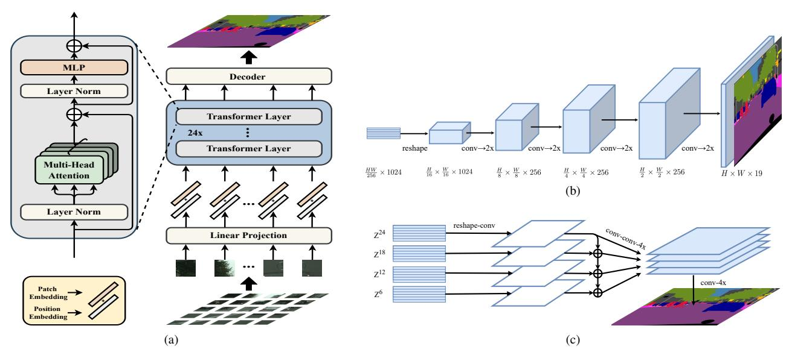
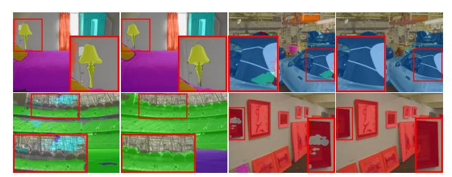
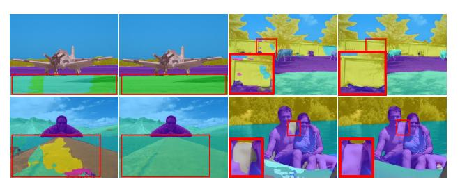
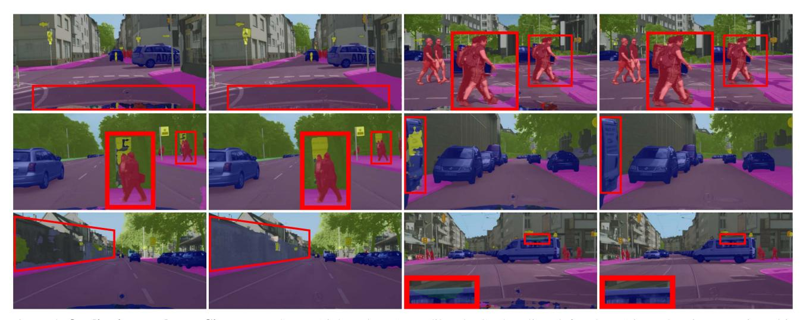
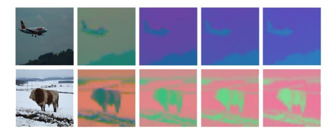
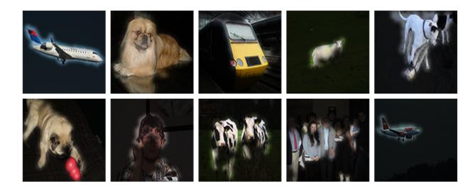
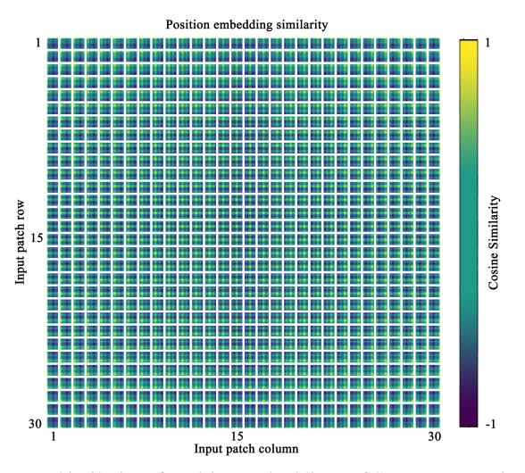
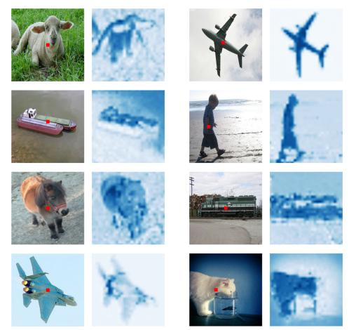
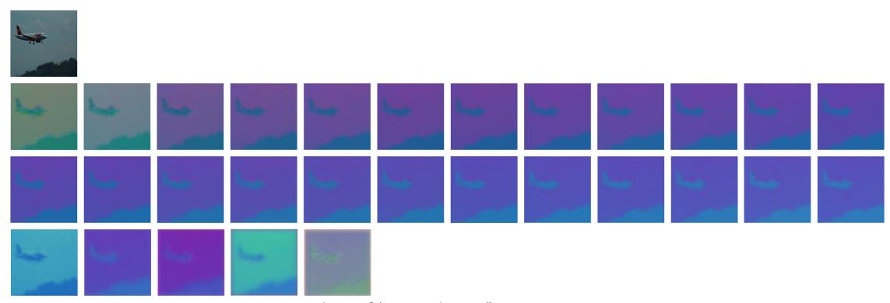
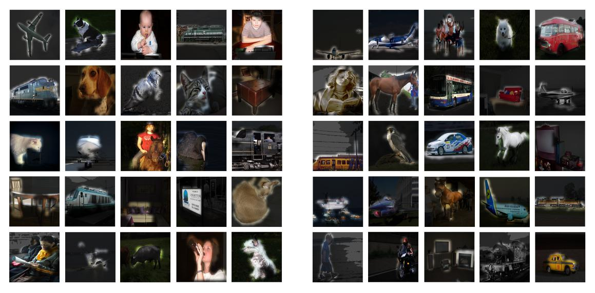

# Rethinking Semantic Segmentation from a Sequence-to-Sequence Perspective with Transformers

Sixiao Zheng1\* Jiachen Lu1 Hengshuang Zhao2 Xiatian Zhu3 Zekun Luo4 Yabiao Wang4 Yanwei Fu1 Jianfeng Feng1 Tao Xiang3, 5 Philip H.S. Torr2 Li Zhang1†

1Fudan University 2University of Oxford 3University of Surrey

4Tencent Youtu Lab 5Facebook AI

https://fudan-zvg.github.io/SETR

#### **Abstract**

Most recent semantic segmentation methods adopt a fully-convolutional network (FCN) with an encoderdecoder architecture. The encoder progressively reduces the spatial resolution and learns more abstract/semantic visual concepts with larger receptive fields. Since context modeling is critical for segmentation, the latest efforts have been focused on increasing the receptive field, through either dilated/atrous convolutions or inserting attention modules. However, the encoder-decoder based FCN architecture remains unchanged. In this paper, we aim to provide an alternative perspective by treating semantic segmentation as a sequence-to-sequence prediction task. Specifically, we deploy a pure transformer (i.e., without convolution and resolution reduction) to encode an image as a sequence of patches. With the global context modeled in every layer of the transformer, this encoder can be combined with a simple decoder to provide a powerful segmentation model, termed SEgmentation TRansformer (SETR). Extensive experiments show that SETR achieves new state of the art on ADE20K (50.28% mIoU), Pascal Context (55.83% mIoU) and competitive results on Cityscapes. Particularly, we achieve the first position in the highly competitive ADE20K test server leaderboard on the day of submission.

# 1. Introduction

Since the seminal work of [36], existing semantic segmentation models have been dominated by those based on fully convolutional network (FCN). A standard FCN segmentation model has an encoder-decoder architecture: the *encoder* is for feature representation learning, while the *decoder* for pixel-level classification of the feature representa-

tions yielded by the encoder. Among the two, feature representation learning (i.e., the encoder) is arguably the most important model component [8, 28, 57, 60]. The encoder, like most other CNNs designed for image understanding, consists of stacked convolution layers. Due to concerns on computational cost, the resolution of feature maps is reduced progressively, and the encoder is hence able to learn more abstract/semantic visual concepts with a gradually increased receptive field. Such a design is popular due to two favorable merits, namely translation equivariance and locality. The former respects well the nature of imaging process [58] which underpins the model generalization ability to unseen image data. Whereas the latter controls the model complexity by sharing parameters across space. However, it also raises a fundamental limitation that learning long-range dependency information, critical for semantic segmentation in unconstrained scene images [2,50], becomes challenging due to still limited receptive fields.

To overcome this aforementioned limitation, a number of approaches have been introduced recently. One approach is to directly manipulate the convolution operation. This includes large kernel sizes [40], atrous convolutions [8, 22], and image/feature pyramids [60]. The other approach is to integrate attention modules into the FCN architecture. Such a module aims to model *global* interactions of all pixels in the feature map [48]. When applied to semantic segmentation [25, 29], a common design is to combine the attention module to the FCN architecture with attention layers sitting on the top. Taking either approach, the standard encoderdecoder FCN model architecture remains unchanged. More recently, attempts have been made to get rid of convolutions altogether and deploy attention-alone models [47] instead. However, even without convolution, they do not change the nature of the FCN model structure: an encoder downsamples the spatial resolution of the input, developing lowerresolution feature mappings useful for discriminating semantic classes, and the decoder upsamples the feature rep-

\*Work done while Sixiao Zheng was interning at Tencent Youtu Lab.

†Li Zhang (lizhangfd@fudan.edu.cn) is the corresponding author with
School of Data Science, Fudan University.

resentations into a full-resolution segmentation map.

In this paper, we aim to provide a rethinking to the semantic segmentation model design and contribute an alternative. In particular, we propose to replace the stacked convolution layers based encoder with gradually reduced spatial resolution with a pure transformer [45], resulting in a new segmentation model termed SEgmentation TRansformer (SETR). This transformer-alone encoder treats an input image as a sequence of image patches represented by learned patch embedding, and transforms the sequence with global self-attention modeling for discriminative feature representation learning. Concretely, we first decompose an image into a grid of fixed-sized patches, forming a sequence of patches. With a linear embedding layer applied to the flattened pixel vectors of every patch, we then obtain a sequence of feature embedding vectors as the input to a transformer. Given the learned features from the encoder transformer, a decoder is then used to recover the original image resolution. Crucially there is no downsampling in spatial resolution but global context modeling at every layer of the encoder transformer, thus offering a completely new perspective to the semantic segmentation problem.

This pure transformer design is inspired by its tremendous success in natural language processing (NLP) [15,45]. More recently, a pure vision transformer or ViT [17] has shown to be effective for image classification tasks. It thus provides direct evidence that the traditional stacked convolution layer (i.e., CNN) design can be challenged and image features do not necessarily need to be learned progressively from local to global context by reducing spatial resolution. However, extending a pure transformer from image classification to a spatial location sensitive task of semantic segmentation is non-trivial. We show empirically that SETR not only offers a new perspective in model design, but also achieves new state of the art on a number of benchmarks.

The following **contributions** are made in this paper: (1) We reformulate the image semantic segmentation problem from a sequence-to-sequence learning perspective, offering an alternative to the dominating encoder-decoder FCN model design. (2) As an instantiation, we exploit the transformer framework to implement our fully attentive feature representation encoder by sequentializing images. (3) To extensively examine the self-attentive feature presentations, we further introduce three different decoder designs with varying complexities. Extensive experiments show that our SETR models can learn superior feature representations as compared to different FCNs with and without attention modules, yielding new state of the art on ADE20K (50.28%), Pascal Context (55.83%) and competitive results on Cityscapes. Particularly, our entry is ranked the  $1^{st}$  place in the highly competitive ADE20K test server leaderboard.

# 2. Related work

Semantic segmentation Semantic image segmentation has been significantly boosted with the development of deep neural networks. By removing fully connected layers, the fully convolutional network (FCN) [36] is able to achieve pixel-wise predictions. While the predictions of FCN are relatively coarse, several CRF/MRF [6, 35, 62] based approaches are developed to help refine the coarse predictions. To address the inherent tension between semantics and location [36], coarse and fine layers need to be aggregated for both the encoder and decoder. This leads to different variants of the encoder-decoder structures [2, 38, 42] for multilevel feature fusion.

Many recent efforts have been focused on addressing the limited receptive field/context modeling problem in FCN. To enlarge the receptive field, DeepLab [7] and Dilation [53] introduce the dilated convolution. Alternatively, context modeling is the focus of PSPNet [60] and DeepLabV2 [9]. The former proposes the PPM module to obtain different region's contextual information while the latter develops ASPP module that adopts pyramid dilated convolutions with different dilation rates. Decomposed large kernels [40] are also utilized for context capturing. Recently, attention based models are popular for capturing long range context information. PSANet [61] develops the pointwise spatial attention module for dynamically capturing the long range context. DANet [18] embeds both spatial attention and channel attention. CCNet [26] alternatively focuses on economizing the heavy computation budget introduced by full spatial attention. DGMN [57] builds a dynamic graph message passing network for scene modeling and it can significantly reduce the computational complexity. Note that all these approaches are still based on FCNs where the feature encoding and extraction part are based on classical ConvNets like VGG [43] and ResNet [20]. In this work, we alternatively rethink the semantic segmentation task from a different perspective.

**Transformer** Transformer and self-attention models have revolutionized machine translation and NLP [14,15,45,51]. Recently, there are also some explorations for the usage of transformer structures in image recognition. Non-local network [48] appends transformer style attention onto the convolutional backbone. AANet [3] mixes convolution and self-attention for backbone training. LRNet [24] and standalone networks [41] explore local self-attention to avoid the heavy computation brought by global self-attention. SAN [59] explores two types of self-attention modules. Axial-Attention [47] decomposes the global spatial attention into two separate axial attentions such that the computation is largely reduced. Apart from these pure transformer based models, there are also CNN-transformer hybrid ones. DETR [5] and the following deformable version

Figure 1. **Schematic illustration of the proposed** *SEgmentation TRansformer* (SETR) (a). We first split an image into fixed-size patches, linearly embed each of them, add position embeddings, and feed the resulting sequence of vectors to a standard Transformer encoder. To perform pixel-wise segmentation, we introduce different decoder designs: (b) progressive upsampling (resulting in a variant called SETR-*PUP*); and (c) multi-level feature aggregation (a variant called SETR-*MLA*).

utilize transformer for object detection where transformer is appended inside the detection head. STTR [32] and LSTR [34] adopt transformer for disparity estimation and lane shape prediction respectively. Most recently, ViT [17] is the first work to show that a pure transformer based image classification model can achieve the state-of-the-art. It provides direct inspiration to exploit a pure transformer based encoder design in a semantic segmentation model.

The most related work is [47] which also leverages attention for image segmentation. However, there are several key differences. First, though convolution is completely removed in [47] as in our SETR, their model still follows the conventional FCN design in that spatial resolution of feature maps is reduced progressively. In contrast, our sequence-to-sequence prediction model keeps the same spatial resolution throughout and thus represents a step-change in model design. Second, to maximize the scalability on modern hardware accelerators and facilitate easy-to-use, we stick to the standard self-attention design. Instead, [47] adopts a specially designed axial-attention [21] which is less scalable to standard computing facilities. Our model is also superior in segmentation accuracy (see Section 4).

#### 3. Method

#### 3.1. FCN-based semantic segmentation

In order to contrast with our new model design, let us first revisit the conventional FCN [36] for image semantic segmentation. An FCN encoder consists of a stack of sequentially connected convolutional layers. The first layer takes as input the image, denoted as  $H \times W \times 3$  with  $H \times W$ 

specifying the image size in pixels. The input of subsequent layer i is a three-dimensional tensor sized  $h \times w \times d$ , where h and w are spatial dimensions of feature maps, and d is the feature/channel dimension. Locations of the tensor in a higher layer are computed based on the locations of tensors of all lower layers they are connected to via layerby-layer convolutions, which are defined as their receptive fields. Due to the locality nature of convolution operation, the receptive field increases linearly along the depth of layers, conditional on the kernel sizes (typically  $3 \times 3$ ). As a result, only higher layers with big receptive fields can model long-range dependencies in this FCN architecture. However, it is shown that the benefits of adding more layers would diminish rapidly once reaching certain depths [20]. Having limited receptive fields for context modeling is thus an intrinsic limitation of the vanilla FCN architecture.

Recently, a number of state-of-the-art methods [25, 56, 57] suggest that combing FCN with attention mechanism is a more effective strategy for learning long-range contextual information. These methods limit the attention learning to higher layers with smaller input sizes alone due to its quadratic complexity w.r.t. the pixel number of feature tensors. This means that dependency learning on lower-level feature tensors is lacking, leading to sub-optimal representation learning. To overcome this limitation, we propose a pure self-attention based encoder, named *SEgmentation Transformers* (SETR).

# 3.2. Segmentation transformers (SETR)

Image to sequence SETR follows the same input-output structure as in NLP for transformation between 1D sequences. There thus exists a mismatch between 2D image and 1D sequence. Concretely, the Transformer, as depicted in Figure 1(a), accepts a 1D sequence of feature embeddings  $Z \in \mathbb{R}^{L \times C}$  as input, L is the length of sequence, C is the hidden channel size. Image sequentialization is thus needed to convert an input image  $x \in \mathbb{R}^{H \times W \times 3}$  into Z.

A straightforward way for image sequentialization is to flatten the image pixel values into a 1D vector with size of 3HW. For a typical image sized at  $480(H)\times480(W)\times3$ , the resulting vector will have a length of 691,200. Given the quadratic model complexity of Transformer, it is not possible that such high-dimensional vectors can be handled in both space and time. Therefore tokenizing every single pixel as input to our transformer is out of the question.

In view of the fact that a typical encoder designed for semantic segmentation would downsample a 2D image  $x \in \mathbb{R}^{H \times W \times 3}$  into a feature map  $x_f \in \mathbb{R}^{\frac{H}{16} \times \frac{W}{16} \times C}$ , we thus decide to set the transformer input sequence length L as  $\frac{H}{16} \times \frac{W}{16} = \frac{HW}{256}$ . This way, the output sequence of the transformer can be simply reshaped to the target feature map  $x_f$ .

To obtain the  $\frac{HW}{256}$ -long input sequence, we divide an image  $x \in \mathbb{R}^{H \times W \times 3}$  into a grid of  $\frac{H}{16} \times \frac{W}{16}$  patches uniformly, and then flatten this grid into a sequence. By further mapping each vectorized patch p into a latent C-dimensional embedding space using a linear projection function  $f \colon p \longrightarrow e \in \mathbb{R}^C$ , we obtain a 1D sequence of patch embeddings for an image x. To encode the patch spacial information, we learn a specific embedding  $p_i$  for every location i which is added to  $e_i$  to form the final sequence input  $E = \{e_1 + p_1, \ e_2 + p_2, \ \cdots, \ e_L + p_L\}$ . This way, spatial information is kept despite the orderless self-attention nature of transformers.

**Transformer** Given the 1D embedding sequence E as input, a pure transformer based encoder is employed to learn feature representations. This means each transformer layer has a global receptive field, solving the limited receptive field problem of existing FCN encoder once and for all. The transformer encoder consists of  $L_e$  layers of multi-head self-attention (MSA) and Multilayer Perceptron (MLP) blocks [46] (Figure 1(a)). At each layer l, the input to self-attention is in a triplet of (query, key, value) computed from the input  $Z^{l-1} \in \mathbb{R}^{L \times C}$  as:

$$\label{eq:query_def} \text{query} = Z^{l-1}\mathbf{W}_Q, \text{ key} = Z^{l-1}\mathbf{W}_K, \text{ value} = Z^{l-1}\mathbf{W}_V, \text{ (1)}$$

where  $\mathbf{W}_Q/\mathbf{W}_K/\mathbf{W}_V \in \mathbb{R}^{C \times d}$  are the learnable parameters of three linear projection layers and d is the dimension of (query, key, value). Self-attention (SA) is then formu-

lated as:

$$SA(Z^{l-1}) = Z^{l-1} + \operatorname{softmax}(\frac{Z^{l-1}\mathbf{W}_Q(Z\mathbf{W}_K)^\top}{\sqrt{d}})(Z^{l-1}\mathbf{W}_V).$$
(2)

MSA is an extension with m independent SA operations and project their concatenated outputs:  $MSA(Z^{l-1}) = [SA_1(Z^{l-1}); SA_2(Z^{l-1}); \cdots; SA_m(Z^{l-1})] \mathbf{W}_O$ , where  $\mathbf{W}_O \in \mathbb{R}^{md \times C}$ . d is typically set to C/m. The output of MSA is then transformed by an MLP block with residual skip as the layer output as:

$$Z^{l} = MSA(Z^{l-1}) + MLP(MSA(Z^{l-1})) \in \mathbb{R}^{L \times C}.$$
 (3)

Note, layer norm is applied before MSA and MLP blocks which is omitted for simplicity. We denote  $\{Z^1, Z^2, \dots, Z^{L_e}\}$  as the features of transformer layers.

#### 3.3. Decoder designs

To evaluate the effectiveness of SETR's encoder feature representations Z, we introduce three different decoder designs to perform pixel-level segmentation. As the goal of the decoder is to generate the segmentation results in the original 2D image space  $(H \times W)$ , we need to reshape the encoder's features (that are used in the decoder), Z, from a 2D shape of  $\frac{HW}{256} \times C$  to a standard 3D feature map  $\frac{H}{16} \times \frac{W}{16} \times C$ . Next, we briefly describe the three decoders.

- (1) Naive upsampling (Naive) This naive decoder first projects the transformer feature  $Z^{L_e}$  to the dimension of category number (e.g., 19 for experiments on Cityscapes). For this we adopt a simple 2-layer network with architecture:  $1 \times 1$  conv + sync batch norm (w/ ReLU) +  $1 \times 1$  conv. After that, we simply bilinearly upsample the output to the full image resolution, followed by a classification layer with pixel-wise cross-entropy loss. When this decoder is used, we denote our model as SETR-Naïve.
- (2) Progressive UPsampling (PUP) Instead of one-step upscaling which may introduce noisy predictions, we consider a progressive upsampling strategy that alternates conv layers and upsampling operations. To maximally mitigate the adversarial effect, we restrict upsampling to  $2\times$ . Hence, a total of 4 operations are needed for reaching the full resolution from  $Z^{L_e}$  with size  $\frac{H}{16} \times \frac{W}{16}$ . More details of this process are given in Figure 1(b). When using this decoder, we denote our model as SETR-PUP.
- (3) Multi-Level feature Aggregation (MLA) The third design is characterized by multi-level feature aggregation (Figure 1(c)) in similar spirit of feature pyramid network [27, 33]. However, our decoder is fundamentally different because the feature representations  $Z^l$  of every SETR's layer share the same resolution without a pyramid shape.

Specifically, we take as input the feature representations  $\{Z^m\}$   $(m \in \{\frac{L_e}{M}, 2\frac{L_e}{M}, \cdots, M\frac{L_e}{M}\})$  from M layers uniformly distributed across the layers with step  $\frac{L_e}{M}$  to the decoder. M streams are then deployed, with each focusing on

| Model   | T-layers | Hidden size | Att head |
|---------|----------|-------------|----------|
| T-Base  | 12       | 768         | 12       |
| T-Large | 24       | 1024        | 16       |

Table 1. Configuration of Transformer backbone variants.

| Method            | Pre | Backbone | #Params | 40k   | 80k   |
|-------------------|-----|----------|---------|-------|-------|
| FCN [39]          | 1K  | R-101    | 68.59M  | 73.93 | 75.52 |
| Semantic FPN [39] | 1K  | R-101    | 47.51M  | -     | 75.80 |
| Hybrid-Base       | R   | T-Base   | 112.59M | 74.48 | 77.36 |
| Hybrid-Base       | 21K | T-Base   | 112.59M | 76.76 | 76.57 |
| Hybrid-DeiT       | 21K | T-Base   | 112.59M | 77.42 | 78.28 |
| SETR-Naïve        | 21K | T-Large  | 305.67M | 77.37 | 77.90 |
| SETR-MLA          | 21K | T-Large  | 310.57M | 76.65 | 77.24 |
| SETR-PUP          | 21K | T-Large  | 318.31M | 78.39 | 79.34 |
| SETR-PUP          | R   | T-Large  | 318.31M | 42.27 | -     |
| SETR-Naïve-Base   | 21K | T-Base   | 87.69M  | 75.54 | 76.25 |
| SETR-MLA-Base     | 21K | T-Base   | 92.59M  | 75.60 | 76.87 |
| SETR-PUP-Base     | 21K | T-Base   | 97.64M  | 76.71 | 78.02 |
| SETR-Naïve-DeiT   | 1K  | T-Base   | 87.69M  | 77.85 | 78.66 |
| SETR-MLA-DeiT     | 1K  | T-Base   | 92.59M  | 78.04 | 78.98 |
| SETR-PUP-DeiT     | 1K  | T-Base   | 97.64M  | 78.79 | 79.45 |

Table 2. Comparing SETR variants on different pre-training strategies and backbones. All experiments are trained on Cityscapes train fine set with batch size 8, and evaluated using the single scale test protocol on the Cityscapes validation set in mean IoU (%) rate. "Pre" denotes the pre-training of transformer part. "R" means the transformer part is randomly initialized.

one specific selected layer. In each stream, we first reshape the encoder's feature  $Z^l$  from a 2D shape of  $\frac{HW}{256} \times C$  to a 3D feature map  $\frac{H}{16} \times \frac{W}{16} \times C$ . A 3-layer (kernel size  $1 \times 1$ ,  $3 \times 3$ , and  $3 \times 3$ ) network is applied with the feature channels halved at the first and third layers respectively, and the spatial resolution upscaled  $4 \times$  by bilinear operation after the third layer. To enhance the interactions across different streams, we introduce a top-down aggregation design via element-wise addition after the first layer. An additional  $3 \times 3$  conv is applied after the element-wise additioned feature. After the third layer, we obtain the fused feature from all the streams via channel-wise concatenation which is then bilinearly upsampled  $4 \times$  to the full resolution. When using this decoder, we denote our model as SETR-MLA.

## 4. Experiments

#### 4.1. Experimental setup

We conduct experiments on three widely-used semantic segmentation benchmark datasets.

Cityscapes [13] densely annotates 19 object categories in images with urban scenes. It contains 5000 finely annotated images, split into 2975, 500 and 1525 for training, validation and testing respectively. The images are all captured at a high resolution of  $2048 \times 1024$ . In addition, it provides 19,998 coarse annotated images for model training.

| Method                                  | Pre | Backbone | ADE20K | Cityscapes |
|-----------------------------------------|-----|----------|--------|------------|
| FCN [39]                                | 1K  | R-101    | 39.91  | 73.93      |
| FCN                                     | 21K | R-101    | 42.17  | 76.38      |
| SETR-MLA                                | 21K | T-Large  | 48.64  | 76.65      |
| SETR-PUP                                | 21K | T-Large  | 48.58  | 78.39      |
| SETR-MLA-DeiT                           | 1K  | T-Large  | 46.15  | 78.98      |
| ${\sf SETR}\text{-}{PUP}\text{-}{DeiT}$ | 1K  | T-Large  | 46.24  | 79.45      |

Table 3. Comparison to FCN with different pre-training with single-scale inference on the ADE20K val and Cityscapes val set.

**ADE20K** [63] is a challenging scene parsing benchmark with 150 fine-grained semantic concepts. It contains 20210, 2000 and 3352 images for training, validation and testing.

**PASCAL Context** [37] provides pixel-wise semantic labels for the whole scene (both "thing" and "stuff" classes), and contains 4998 and 5105 images for training and validation respectively. Following previous works, we evaluate on the most frequent 59 classes and the background class (60 classes in total).

**Implementation details** Following the default setting (e.g., data augmentation and training schedule) of public codebase *mmsegmentation* [39], (i) we apply random resize with ratio between 0.5 and 2, random cropping (768, 512 and 480 for Cityscapes, ADE20K and Pascal Context respectively) and random horizontal flipping during training for all the experiments; (ii) We set batch size 16 and the total iteration to 160,000 and 80,000 for the experiments on ADE20K and Pascal Context. For Cityscapes, we set batch size to 8 with a number of training schedules reported in Table 2, 6 and 7 for fair comparison. We adopt a polynomial learning rate decay schedule [60] and employ SGD as the optimizer. Momentum and weight decay are set to 0.9 and 0 respectively for all the experiments on the three datasets. We set initial learning rate 0.001 on ADE20K and Pascal Context, and 0.01 on Cityscapes.

**Auxiliary loss** As [60] we also find the auxiliary segmentation loss helps the model training. Each auxiliary loss head follows a 2-layer network. We add auxiliary losses at different Transformer layers: SETR-Naïve  $(Z^{10},Z^{15},Z^{20})$ , SETR-PUP  $(Z^{10},Z^{15},Z^{20},Z^{24})$ , SETR-MLA  $(Z^6,Z^{12},Z^{18},Z^{24})$ . Both auxiliary loss and main loss heads are applied concurrently.

**Multi-scale test** We use the default settings of *mmsegmentation* [39]. Specifically, the input image is first scaled to a uniform size. Multi-scale scaling and random horizontal flip are then performed on the image with a scaling factor (0.5, 0.75, 1.0, 1.25, 1.5, 1.75). Sliding window is adopted for test  $(e.g., 480 \times 480 \text{ for Pascal Context})$ . If the shorter side is smaller than the size of the sliding window, the image is scaled with its shorter side to the size of the sliding

Figure 2. **Qualitative results on ADE20K:** SETR (right column) vs. dilated FCN baseline (left column) in each pair. Best viewed in color and zoom in.

| Method                      | Pre | Backbone   | #Params | mIoU  |
|-----------------------------|-----|------------|---------|-------|
| FCN (160k, SS) [39]         | 1K  | ResNet-101 | 68.59M  | 39.91 |
| FCN (160k, MS) [39]         | 1K  | ResNet-101 | 68.59M  | 41.40 |
| CCNet [25]                  | 1K  | ResNet-101 | -       | 45.22 |
| Strip pooling [23]          | 1K  | ResNet-101 | -       | 45.60 |
| DANet [18]                  | 1K  | ResNet-101 | 69.0M   | 45.30 |
| OCRNet [54]                 | 1K  | ResNet-101 | 71.0M   | 45.70 |
| UperNet [49]                | 1K  | ResNet-101 | 86.0M   | 44.90 |
| Deeplab V3+ [11]            | 1K  | ResNet-101 | 63.0M   | 46.40 |
| SETR-Naïve (160k, SS)       | 21K | T-Large    | 305.67M | 48.06 |
| SETR-Naïve (160k, MS)       | 21K | T-Large    | 305.67M | 48.80 |
| SETR- <i>PUP</i> (160k, SS) | 21K | T-Large    | 318.31M | 48.58 |
| SETR- <i>PUP</i> (160k, MS) | 21K | T-Large    | 318.31M | 50.09 |
| SETR-MLA (160k, SS)         | 21K | T-Large    | 310.57M | 48.64 |
| SETR-MLA (160k, MS)         | 21K | T-Large    | 310.57M | 50.28 |
| SETR-PUP-DeiT (160k, SS)    | 1K  | T-Base     | 97.64M  | 46.34 |
| SETR-PUP-DeiT (160k, MS)    | 1K  | T-Base     | 97.64M  | 47.30 |
| SETR-MLA-DeiT (160k, SS)    | 1K  | T-Base     | 92.59M  | 46.15 |
| SETR-MLA-DeiT (160k, MS)    | 1K  | T-Base     | 92.59M  | 47.71 |

Table 4. State-of-the-art comparison on the ADE20K dataset. Performances of different model variants are reported. SS: Single-scale inference. MS: Multi-scale inference.

window (*e.g.*, 480) while keeping the aspect ratio. Synchronized BN is used in decoder and auxiliary loss heads. For training simplicity, we do not adopt the widely-used tricks such as OHEM [55] loss in model training.

**Baselines** We adopt dilated FCN [36] and Semantic FPN [27] as baselines with their results taken from [39]. Our models and the baselines are trained and tested in the same settings for fair comparison. In addition, state-of-theart models are also compared. Note that the dilated FCN is with output stride 8 and we use output stride 16 in all our models due to GPU memory constrain.

**SETR variants** Three variants of our model with different decoder designs (see Sec. 3.3), namely SETR-*Naïve*, SETR-*PUP* and SETR-*MLA*. Besides, we use two variants of the encoder "T-Base" and "T-Large" with 12 and 24 layers respectively (Table 1). Unless otherwise specified, we use "T-Large" as the encoder for SETR-*Naïve*, SETR-*PUP* and SETR-*MLA*. We denote SETR-*Naïve*-Base as the model utilizing "T-Base" in SETR-*Naïve*.

Though designed as a model with a pure transformer encoder, we also set a hybrid baseline *Hybrid* by using a

Figure 3. **Qualitative results on Pascal Context:** SETR (right column) vs. dilated FCN baseline (left column) in each pair. Best viewed in color and zoom in.

| Method                  | Pre | Backbone   | mIoU  |
|-------------------------|-----|------------|-------|
| FCN (80k, SS) [39]      | 1K  | ResNet-101 | 44.47 |
| FCN (80k, MS) [39]      | 1K  | ResNet-101 | 45.74 |
| DANet [18]              | 1K  | ResNet-101 | 52.60 |
| EMANet [31]             | 1K  | ResNet-101 | 53.10 |
| SVCNet [16]             | 1K  | ResNet-101 | 53.20 |
| Strip pooling [23]      | 1K  | ResNet-101 | 54.50 |
| GFFNet [30]             | 1K  | ResNet-101 | 54.20 |
| APCNet [19]             | 1K  | ResNet-101 | 54.70 |
| SETR-Naïve (80k, SS)    | 21K | T-Large    | 52.89 |
| SETR-Naïve (80k, MS)    | 21K | T-Large    | 53.61 |
| SETR-PUP (80k, SS)      | 21K | T-Large    | 54.40 |
| SETR-PUP (80k, MS)      | 21K | T-Large    | 55.27 |
| SETR-MLA (80k, SS)      | 21K | T-Large    | 54.87 |
| SETR-MLA (80k, MS)      | 21K | T-Large    | 55.83 |
| SETR-PUP-DeiT (80k, SS) | 1K  | T-Base     | 52.71 |
| SETR-PUP-DeiT (80k, MS) | 1K  | T-Base     | 53.71 |
| SETR-MLA-DeiT (80k, SS) | 1K  | T-Base     | 52.91 |
| SETR-MLA-DeiT (80k, MS) | 1K  | T-Base     | 53.74 |

Table 5. **State-of-the-art comparison on the Pascal Context dataset.** Performances of different model variants are reported. SS: Single-scale inference. MS: Multi-scale inference.

ResNet-50 based FCN encoder and feeding its output feature into SETR. To cope with the GPU memory constraint and for fair comparison, we only consider "T-Base" in *Hybrid* and set the output stride of FCN to 1/16. That is, *Hybrid* is a combination of ResNet-50 and SETR-*Naïve-Base*.

**Pre-training** We use the pre-trained weights provided by ViT [17] or DeiT [44] to initialize all the transformer layers and the input linear projection layer in our model. We denote SETR-*Naïve-DeiT* as the model utilizing DeiT [44] pre-training in SETR-*Naïve-Base*. All the layers without pre-training are randomly initialized. For the FCN encoder of *Hybrid*, we use the initial weights pre-trained on ImageNet-1k. For the transformer part, we use the weights pre-trained by ViT [17], DeiT [44] or randomly initialized.

We use patch size  $16 \times 16$  for all the experiments. We perform 2D interpolation on the pre-trained position embeddings, according to their location in the original image for different input size fine-tuning.

**Evaluation metric** Following the standard evaluation protocol [13], the metric of mean Intersection over Union (mIoU) averaged over all classes is reported. For ADE20K,

Figure 4. Qualitative results on Cityscapes: SETR (right column) vs. dilated FCN baseline (left column) in each pair. Best viewed in color and zoom in.

| Method                     | Backbone        | mIoU  |
|----------------------------|-----------------|-------|
| FCN (40k, SS) [39]         | ResNet-101      | 73.93 |
| FCN (40k, MS) [39]         | ResNet-101      | 75.14 |
| FCN (80k, SS) [39]         | ResNet-101      | 75.52 |
| FCN (80k, MS) [39]         | ResNet-101      | 76.61 |
| PSPNet [60]                | ResNet-101      | 78.50 |
| DeepLab-v3 [10] (MS)       | ResNet-101      | 79.30 |
| NonLocal [48]              | ResNet-101      | 79.10 |
| CCNet [25]                 | ResNet-101      | 80.20 |
| GCNet [4]                  | ResNet-101      | 78.10 |
| Axial-DeepLab-XL [47] (MS) | Axial-ResNet-XL | 81.10 |
| Axial-DeepLab-L [47] (MS)  | Axial-ResNet-L  | 81.50 |
| SETR-PUP (40k, SS)         | T-Large         | 78.39 |
| SETR-PUP (40k, MS)         | T-Large         | 81.57 |
| SETR-PUP (80k, SS)         | T-Large         | 79.34 |
| SETR-PUP (80k, MS)         | T-Large         | 82.15 |

Table 6. State-of-the-art comparison on the Cityscapes validation set. Performances of different training schedules (*e.g.*, 40k and 80k) are reported. SS: Single-scale inference. MS: Multiscale inference.

additionally pixel-wise accuracy is reported following the existing practice.

#### 4.2. Ablation studies

Table 2 and 3 show ablation studies on (a) different variants of SETR on various training schedules, (b) comparison to FCN [39] and Semantic FPN [39], (c) pre-training on different data, (d) comparison with *Hybrid*, (e) compare to FCN with different pre-training. Unless otherwise specified, all experiments on Table 2 and 3 are trained on Cityscapes train fine set with batch size 8, and evaluated using the single scale test protocol on the Cityscapes validation set in mean IoU (%) rate. Experiments on ADE20K also follow the single scale test protocol.

From Table 2, we can make the following observations: (i) Progressively upsampling the feature maps, SETR-

| Method                | Backbone        | mIoU  |
|-----------------------|-----------------|-------|
| PSPNet [60]           | ResNet-101      | 78.40 |
| DenseASPP [50]        | DenseNet-161    | 80.60 |
| BiSeNet [52]          | ResNet-101      | 78.90 |
| PSANet [61]           | ResNet-101      | 80.10 |
| DANet [18]            | ResNet-101      | 81.50 |
| OCNet [55]            | ResNet-101      | 80.10 |
| CCNet [25]            | ResNet-101      | 81.90 |
| Axial-DeepLab-L [47]  | Axial-ResNet-L  | 79.50 |
| Axial-DeepLab-XL [47] | Axial-ResNet-XL | 79.90 |
| SETR-PUP (100k)       | T-Large         | 81.08 |
| SETR-PUP ‡ | T-Large         | 81.64 |

Table 7. Comparison on the Cityscapes test set. ‡: trained on fine and coarse annotated data.

PUP achieves the best performance among all the variants on Cityscapes. One possible reason for inferior performance of SETR-MLA is that the feature outputs of different transformer layers do not have the benefits of resolution pyramid as in feature pyramid network (FPN) (see Figure 5). However, SETR-MLA performs slightly better than SETR-PUP, and much superior to the variant SETR-Naïve that upsamples the transformers output feature by  $16 \times$  in one-shot, on ADE20K val set (Table 3 and 4). (ii) The variants using "T-Large" (e.g., SETR-MLA and SETR-Naïve) are superior to their "T-Base" counterparts, i.e., SETR-MLA-Base and SETR-Naïve-Base, as expected. (iii) While our SETR-*PUP-Base* (76.71) performs worse than Hybrid-Base (76.76), it shines (78.02) when training with more iterations (80k). It suggests that FCN encoder design can be replaced in semantic segmentation, and further confirms the effectiveness of our model. (iv) Pre-training is critical for our model. Randomly initialized SETR-PUP only gives 42.27% mIoU on Cityscapes. Model pre-trained with DeiT [44] on ImageNet-1K gives the best performance on Cityscapes, slightly better than the counterpart pre-trained

Figure 5. Visualization of output feature of layer  $Z^1$ ,  $Z^9$ ,  $Z^{17}$ ,  $Z^{24}$  of SETR trained on Pascal Context. Best viewed in color.

Figure 6. Examples of attention maps from SETR trained on Pascal Context.

with ViT [17] on ImageNet-21K. (v) To study the power of pre-training and further verify the effectiveness of our proposed approach, we conduct the ablation study on the pre-training strategy in Table 3. For fair comparison with the FCN baseline, we first pre-train a ResNet-101 on the Imagenet-21k dataset with a classification task and then adopt the pre-trained weights for a dilated FCN training for the semantic segmentation task on ADE20K or Cityscapes. Table 3 shows that with ImageNet-21k pre-training FCN baseline experienced a clear improvement over the variant pre-trained on ImageNet-1k. However, our method outperforms the FCN counterparts by a large margin, verifying that the advantage of our approach largely comes from the proposed sequence-to-sequence modeling strategy rather than bigger pre-training data.

#### 4.3. Comparison to state-of-the-art

**Results on ADE20K** Table 4 presents our results on the more challenging ADE20K dataset. Our SETR-MLA achieves superior mIoU of 48.64% with single-scale (SS) inference. When multi-scale inference is adopted, our method achieves a new state of the art with mIoU hitting 50.28%. Figure 2 shows the qualitative results of our model and dilated FCN on ADE20K. When training a single model on the train+validation set with the default 160,000 iterations, our method ranks  $1^{st}$  place in the highly competitive ADE20K test server leaderboard.

**Results on Pascal Context** Table 5 compares the segmentation results on Pascal Context. Dilated FCN with the

ResNet-101 backbone achieves a mIoU of 45.74%. Using the same training schedule, our proposed SETR significantly outperforms this baseline, achieving mIoU of 54.40% (SETR-PUP) and 54.87% (SETR-MLA). SETR-MLA further improves the performance to 55.83% when multi-scale (MS) inference is adopted, outperforming the nearest rival APCNet with a clear margin. Figure 3 gives some qualitative results of SETR and dilated FCN. Further visualization of the learned attention maps in Figure 6 shows that SETR can attend to semantically meaningful foreground regions, demonstrating its ability to learn discriminative feature representations useful for segmentation.

**Results on Cityscapes** Tables 6 and 7 show the comparative results on the validation and test set of Cityscapes respectively. We can see that our model SETR-PUP is superior to FCN baselines, and FCN plus attention based approaches, such as Non-local [48] and CCNet [25]; and its performance is on par with the best results reported so far. On this dataset we can now compare with the closely related Axial-DeepLab [12, 47] which aims to use an attentionalone model but still follows the basic structure of FCN. Note that Axial-DeepLab sets the same output stride 16 as ours. However, its full input resolution ( $1024 \times 2048$ ) is much larger than our crop size  $768 \times 768$ , and it runs more epochs (60k iteration with batch size 32) than our setting (80k iterations with batch size 8). Nevertheless, our model is still superior to Axial-DeepLab when multi-scale inference is adopted on Cityscapes validation set. Using the fine set only, our model (trained with 100k iterations) outperforms Axial-DeepLab-XL with a clear margin on the test set. Figure 4 shows the qualitative results of our model and dilated FCN on Cityscapes.

# 5. Conclusion

In this work, we have presented an alternative perspective for semantic segmentation by introducing a sequenceto-sequence prediction framework. In contrast to existing FCN based methods that enlarge the receptive field typically with dilated convolutions and attention modules at the component level, we made a step change at the architectural level to completely eliminate the reliance on FCN and elegantly solve the limited receptive field challenge. We implemented the proposed idea with Transformers that can model global context at every stage of feature learning. Along with a set of decoder designs in different complexity, strong segmentation models are established with none of the bells and whistles deployed by recent methods. Extensive experiments demonstrate that our models set new state of the art on ADE20, Pascal Context and competitive results on Cityscapes. Encouragingly, our method is ranked the  $1^{st}$ place in the highly competitive ADE20K test server leaderboard on the day of submission.

## Acknowledgments

This work was supported by Shanghai Municipal Science and Technology Major Project (No.2018SHZDZX01), ZJLab, and Shanghai Center for Brain Science and Brain-Inspired Technology.

#### References

- [1] Samira Abnar and Willem Zuidema. Quantifying attention flow in transformers. *arXiv* preprint, 2020. 11
- [2] Vijay Badrinarayanan, Alex Kendall, and Roberto Cipolla. Segnet: A deep convolutional encoder-decoder architecture for image segmentation. *TPAMI*, 2017. 1, 2
- [3] Irwan Bello, Barret Zoph, Ashish Vaswani, Jonathon Shlens, and Quoc V Le. Attention augmented convolutional networks. In *ICCV*, 2019. 2
- [4] Yue Cao, Jiarui Xu, Stephen Lin, Fangyun Wei, and Han Hu. Gcnet: Non-local networks meet squeeze-excitation networks and beyond. In *ICCV workshops*, 2019. 7
- [5] Nicolas Carion, Francisco Massa, Gabriel Synnaeve, Nicolas Usunier, Alexander Kirillov, and Sergey Zagoruyko. End-toend object detection with transformers. In ECCV, 2020. 2
- [6] Liang-Chieh Chen, George Papandreou, Iasonas Kokkinos, Kevin Murphy, and Alan L. Yuille. Semantic image segmentation with deep convolutional nets and fully connected CRFs. In *ICLR*, 2015. 2
- [7] Liang-Chieh Chen, George Papandreou, Iasonas Kokkinos, Kevin Murphy, and Alan L. Yuille. Semantic image segmentation with deep convolutional nets and fully connected CRFs. In *ICLR*, 2015. 2
- [8] Liang-Chieh Chen, George Papandreou, Iasonas Kokkinos, Kevin Murphy, and Alan L Yuille. Deeplab: Semantic image segmentation with deep convolutional nets, atrous convolution, and fully connected crfs. TPAMI, 2018. 1
- [9] Liang-Chieh Chen, George Papandreou, Iasonas Kokkinos, Kevin Murphy, and Alan L. Yuille. Deeplab: Semantic image segmentation with deep convolutional nets, atrous convolution, and fully connected crfs. *TPAMI*, 2018. 2
- [10] Liang-Chieh Chen, George Papandreou, Florian Schroff, and Hartwig Adam. Rethinking atrous convolution for semantic image segmentation. arXiv preprint, 2017. 7
- [11] Liang-Chieh Chen, Yukun Zhu, George Papandreou, Florian Schroff, and Hartwig Adam. Encoder-decoder with atrous separable convolution for semantic image segmentation. In ECCV, 2018. 6
- [12] Bowen Cheng, Maxwell D Collins, Yukun Zhu, Ting Liu, Thomas S Huang, Hartwig Adam, and Liang-Chieh Chen. Panoptic-deeplab: A simple, strong, and fast baseline for bottom-up panoptic segmentation. In CVPR, 2020. 8
- [13] Marius Cordts, Mohamed Omran, Sebastian Ramos, Timo Rehfeld, Markus Enzweiler, Rodrigo Benenson, Uwe Franke, Stefan Roth, and Bernt Schiele. The cityscapes dataset for semantic urban scene understanding. In CVPR, 2016. 5, 6
- [14] Zihang Dai, Zhilin Yang, Yiming Yang, Jaime Carbonell, Quoc V. Le, and Ruslan Salakhutdinov. Transformer-XL:

- Attentive language models beyond a fixed-length context. In *ACL*, 2019. 2
- [15] Jacob Devlin, Ming-Wei Chang, Kenton Lee, and Kristina Toutanova. BERT: Pre-training of deep bidirectional transformers for language understanding. In NAACL-HLT, 2019.
- [16] Henghui Ding, Xudong Jiang, Bing Shuai, Ai Qun Liu, and Gang Wang. Semantic correlation promoted shape-variant context for segmentation. In CVPR, 2019. 6
- [17] Alexey Dosovitskiy, Lucas Beyer, Alexander Kolesnikov, Dirk Weissenborn, Xiaohua Zhai, Thomas Unterthiner, Mostafa Dehghani, Matthias Minderer, Georg Heigold, Sylvain Gelly, et al. An image is worth 16x16 words: Transformers for image recognition at scale. In *ICLR*, 2021. 2, 3, 6, 8
- [18] Jun Fu, Jing Liu, Haijie Tian, Zhiwei Fang, and Hanqing Lu. Dual attention network for scene segmentation. In CVPR, 2019. 2, 6, 7
- [19] Junjun He, Zhongying Deng, Lei Zhou, Yali Wang, and Yu Qiao. Adaptive pyramid context network for semantic segmentation. In CVPR, 2019. 6
- [20] Kaiming He, Xiangyu Zhang, Shaoqing Ren, and Jian Sun. Deep residual learning for image recognition. In CVPR, 2016. 2, 3
- [21] Jonathan Ho, Nal Kalchbrenner, Dirk Weissenborn, and Tim Salimans. Axial attention in multidimensional transformers. *arXiv preprint*, 2019. 3
- [22] Matthias Holschneider, Richard Kronland-Martinet, Jean Morlet, and Ph Tchamitchian. A real-time algorithm for signal analysis with the help of the wavelet transform. In Wavelets, 1990. 1
- [23] Qibin Hou, Li Zhang, Ming-Ming Cheng, and Jiashi Feng. Strip pooling: Rethinking spatial pooling for scene parsing. In CVPR, 2020. 6
- [24] Han Hu, Zheng Zhang, Zhenda Xie, and Stephen Lin. Local relation networks for image recognition. In *ICCV*, 2019.
- [25] Zilong Huang, Xinggang Wang, Lichao Huang, Chang Huang, Yunchao Wei, and Wenyu Liu. Ccnet: Criss-cross attention for semantic segmentation. In *ICCV*, 2019. 1, 3, 6, 7, 8
- [26] Zilong Huang, Xinggang Wang, Lichao Huang, Chang Huang, Yunchao Wei, and Wenyu Liu. Ccnet: Criss-cross attention for semantic segmentation. In *ICCV*, 2019. 2
- [27] Alexander Kirillov, Ross Girshick, Kaiming He, and Piotr Dollár. Panoptic feature pyramid networks. In CVPR, 2019.
  4.6
- [28] Xiangtai Li, Xia Li, Li Zhang, Guangliang Cheng, Jianping Shi, Zhouchen Lin, Shaohua Tan, and Yunhai Tong. Improving semantic segmentation via decoupled body and edge supervision. In ECCV, 2020.
- [29] Xiangtai Li, Li Zhang, Ansheng You, Maoke Yang, Kuiyuan Yang, and Yunhai Tong. Global aggregation then local distribution in fully convolutional networks. In *BMVC*, 2019.
- [30] Xiangtai Li, Houlong Zhao, Lei Han, Yunhai Tong, and Kuiyuan Yang. Gff: Gated fully fusion for semantic segmentation. In AAAI, 2020. 6

- [31] Xia Li, Zhisheng Zhong, Jianlong Wu, Yibo Yang, Zhouchen Lin, and Hong Liu. Expectation-maximization attention networks for semantic segmentation. In *CVPR*, 2019. 6
- [32] Zhaoshuo Li, Xingtong Liu, Francis X Creighton, Russell H Taylor, and Mathias Unberath. Revisiting stereo depth estimation from a sequence-to-sequence perspective with transformers. *arXiv preprint*, 2020. 3
- [33] Tsung-Yi Lin, Piotr Dollár, Ross B. Girshick, Kaiming He, Bharath Hariharan, and Serge J. Belongie. Feature pyramid networks for object detection. In CVPR, 2017. 4
- [34] Ruijin Liu, Zejian Yuan, Tie Liu, and Zhiliang Xiong. Endto-end lane shape prediction with transformers. In WACV, 2020. 3
- [35] Ziwei Liu, Xiaoxiao Li, Ping Luo, Chen Change Loy, and Xiaoou Tang. Semantic image segmentation via deep parsing network. In *ICCV*, 2015. 2
- [36] Jonathan Long, Evan Shelhamer, and Trevor Darrell. Fully convolutional networks for semantic segmentation. In CVPR, 2015. 1, 2, 3, 6
- [37] Roozbeh Mottaghi, Xianjie Chen, Xiaobai Liu, Nam-Gyu Cho, Seong-Whan Lee, Sanja Fidler, Raquel Urtasun, and Alan Yuille. The role of context for object detection and semantic segmentation in the wild. In CVPR, 2014. 5
- [38] Hyeonwoo Noh, Seunghoon Hong, and Bohyung Han. Learning deconvolution network for semantic segmentation. In *ICCV*, 2015.
- [39] OpenMMLab. mmsegmentation. https://github.com/open-mmlab/mmsegmentation, 2020. 5, 6, 7
- [40] Chao Peng, Xiangyu Zhang, Gang Yu, Guiming Luo, and Jian Sun. Large kernel matters — improve semantic segmentation by global convolutional network. In CVPR, 2017. 1, 2
- [41] Prajit Ramachandran, Niki Parmar, Ashish Vaswani, Irwan Bello, Anselm Levskaya, and Jonathon Shlens. Stand-alone self-attention in vision models. In *NeurIPS*, 2019. 2
- [42] Olaf Ronneberger, Philipp Fischer, and Thomas Brox. U-net: Convolutional networks for biomedical image segmentation. *MICCAI*, 2015. 2
- [43] Karen Simonyan and Andrew Zisserman. Very deep convolutional networks for large-scale image recognition. In *ICLR*, 2015.
- [44] Hugo Touvron, Matthieu Cord, Matthijs Douze, Francisco Massa, Alexandre Sablayrolles, and Hervé Jégou. Training data-efficient image transformers & distillation through attention. arXiv preprint, 2020. 6, 7
- [45] Ashish Vaswani, Noam Shazeer, Niki Parmar, Jakob Uszkoreit, Llion Jones, Aidan N Gomez, Łukasz Kaiser, and Illia Polosukhin. Attention is all you need. In *NeurIPS*, 2017. 2
- [46] Petar Veličković, Guillem Cucurull, Arantxa Casanova, Adriana Romero, Pietro Lio, and Yoshua Bengio. Graph attention networks. In *ICLR*, 2018. 4
- [47] Huiyu Wang, Yukun Zhu, Bradley Green, Hartwig Adam, Alan Yuille, and Liang-Chieh Chen. Axial-deeplab: Standalone axial-attention for panoptic segmentation. In *ECCV*, 2020. 1, 2, 3, 7, 8
- [48] Xiaolong Wang, Ross Girshick, Abhinav Gupta, and Kaiming He. Non-local neural networks. In CVPR, 2018. 1, 2, 7, 8

- [49] Tete Xiao, Yingcheng Liu, Bolei Zhou, Yuning Jiang, and Jian Sun. Unified perceptual parsing for scene understanding. In *ECCV*, 2018. 6
- [50] Maoke Yang, Kun Yu, Chi Zhang, Zhiwei Li, and Kuiyuan Yang. Denseaspp for semantic segmentation in street scenes. In CVPR, 2018. 1, 7
- [51] Zhilin Yang, Zihang Dai, Yiming Yang, Jaime Carbonell, Ruslan Salakhutdinov, and Quoc V. Le. XLNet: Generalized autoregressive pretraining for language understanding. In *NeurIPS*, 2019. 2
- [52] Changqian Yu, Jingbo Wang, Chao Peng, Changxin Gao, Gang Yu, and Nong Sang. Bisenet: Bilateral segmentation network for real-time semantic segmentation. In ECCV, 2018. 7
- [53] Fisher Yu and Vladlen Koltun. Multi-scale context aggregation by dilated convolutions. *ICLR*, 2016. 2
- [54] Yuhui Yuan, Xilin Chen, and Jingdong Wang. Objectcontextual representations for semantic segmentation. In ECCV, 2020. 6
- [55] Yuhui Yuan and Jingdong Wang. Ocnet: Object context network for scene parsing. arXiv preprint, 2018. 6, 7
- [56] Li Zhang, Xiangtai Li, Anurag Arnab, Kuiyuan Yang, Yunhai Tong, and Philip HS Torr. Dual graph convolutional network for semantic segmentation. In BMVC, 2019. 3
- [57] Li Zhang, Dan Xu, Anurag Arnab, and Philip HS Torr. Dynamic graph message passing networks. In CVPR, 2020. 1, 2, 3
- [58] Richard Zhang. Making convolutional networks shiftinvariant again. In ICML, 2019. 1
- [59] Hengshuang Zhao, Jiaya Jia, and Vladlen Koltun. Exploring self-attention for image recognition. In CVPR, 2020. 2
- [60] Hengshuang Zhao, Jianping Shi, Xiaojuan Qi, Xiaogang Wang, and Jiaya Jia. Pyramid scene parsing network. In CVPR, 2017. 1, 2, 5, 7
- [61] Hengshuang Zhao, Yi Zhang, Shu Liu, Jianping Shi, Chen Change Loy, Dahua Lin, and Jiaya Jia. Psanet: Point-wise spatial attention network for scene parsing. In ECCV, 2018. 2, 7
- [62] Shuai Zheng, Sadeep Jayasumana, Bernardino Romera-Paredes, Vibhav Vineet, Zhizhong Su, Dalong Du, Chang Huang, and Philip H. S. Torr. Conditional random fields as recurrent neural networks. In *ICCV*, 2015. 2
- [63] Bolei Zhou, Hang Zhao, Xavier Puig, Sanja Fidler, Adela Barriuso, and Antonio Torralba. Semantic understanding of scenes through the ade20k dataset. arXiv preprint, 2016. 5

# **Appendix**

# A. Visualizations

**Position embedding** Visualization of the learned position embedding in Figure 7 shows that the model learns to encode distance within the image in the similarity of position embeddings.

**Features** Figure 9 shows the feature visualization of our SETR-*PUP*. For the encoder, 24 output features from the 24 transformer layers namely  $Z^1-Z^{24}$  are collected. Meanwhile, 5 features  $(U^1-U^5)$  right after each bilinear interpolation in the decoder head are visited.

**Attention maps** Attention maps (Figure 10) in each transformer layer catch our interest. There are 16 heads and 24 layers in T-large. Similar to [1], a recursion perspective into this problem is applied. Figure 8 shows the attention maps of different selected spatial points (red).

Figure 7. Similarity of position embeddings of SETR-*PUP* trained on Pascal Context. Tiles show the cosine similarity between the position embedding of the patch with the indicated row and column and the position embeddings of all other patches.

Figure 8. The first and third columns show images from Pascal Context. The second and fourth columns illustrate the attention map of the picked points (red).

Figure 9. Visualization of output feature of layer  $Z^1 - Z^{24}$  and  $U^1 - U^5$  of SETR-PUP trained on Pascal Context. Best view in color. First row: The input image. Second row: Layer  $Z^1$ - $Z^{12}$ . Third row: Layer  $Z^{13}$ - $Z^{24}$ . Fourth row: Layer  $U^1 - U^5$ .

Figure 10. More examples of attention maps from SETR-PUP trained on Pascal Context.