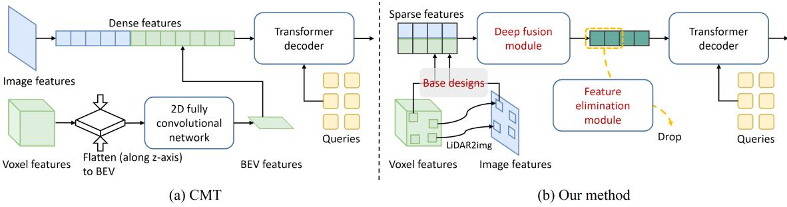
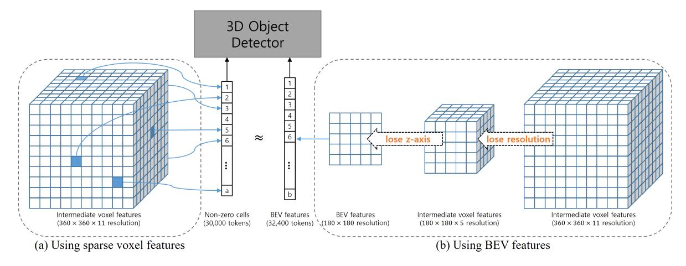
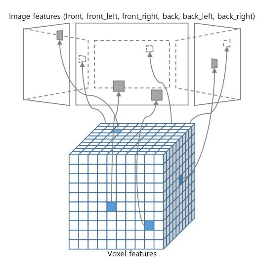
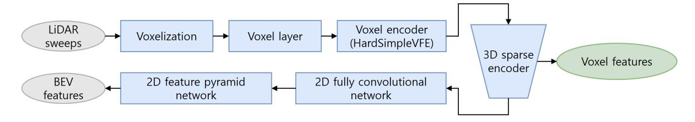
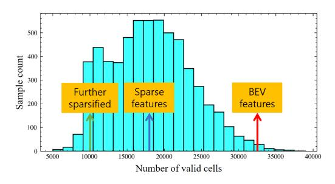
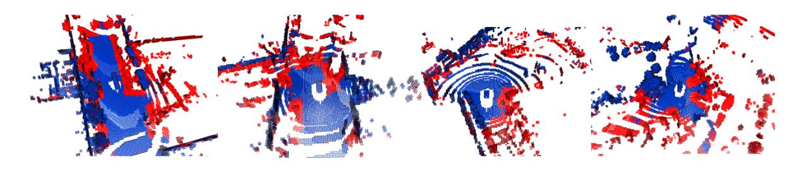
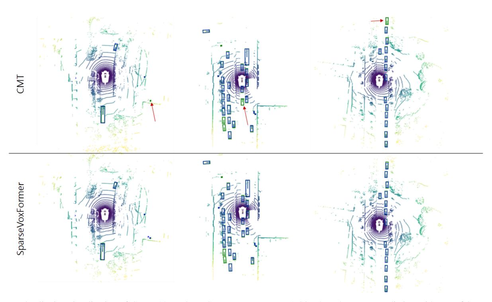

# SparseVoxFormer: Sparse Voxel-based Transformer for Multi-modal 3D Object Detection

Hyeongseok Son1 Jia He2 Seung-In Park1 Ying Min2 Yunhao Zhang2 ByungIn Yoo1

1Samsung Electronics, AI Center, South Korea

2Samsung R&D Institute China Xi'an (SRCX), China

{hsl.son, jia01.he, si14.park ying.min, yunhao.zhang, byungin.yoo}@samsung.com

## **Abstract**

Most previous 3D object detection methods that leverage the multi-modality of LiDAR and cameras utilize the Bird's Eye View (BEV) space for intermediate feature representation. However, this space uses a low x, y-resolution and sacrifices z-axis information to reduce the overall feature resolution, which may result in declined accuracy. To tackle the problem of using low-resolution features, this paper focuses on the sparse nature of LiDAR point cloud data. From our observation, the number of occupied cells in the 3D voxels constructed from a LiDAR data can be even fewer than the number of total cells in the BEV map, despite the voxels' significantly higher resolution. Based on this, we introduce a novel sparse voxel-based transformer network for 3D object detection, dubbed as SparseVoxFormer. Instead of performing BEV feature extraction, we directly leverage sparse voxel features as the input for a transformerbased detector. Moreover, with regard to the camera modality, we introduce an explicit modality fusion approach that involves projecting 3D voxel coordinates onto 2D images and collecting the corresponding image features. Thanks to these components, our approach can leverage geometrically richer multi-modal features while even reducing the computational cost. Beyond the proof-of-concept level, we further focus on facilitating better multi-modal fusion and flexible control over the number of sparse features. Finally, thorough experimental results demonstrate that utilizing a significantly smaller number of sparse features drastically reduces computational costs in a 3D object detector while enhancing both overall and long-range performance.

# 1. Introduction

3D object detection is a critical task in real-world applications such as autonomous driving. A prominent approach to 3D object detection in autonomous driving involves using LiDAR sensors [14, 19, 27, 28, 36, 40], primarily thanks

to their ability to provide accurate localization. However, LiDAR sensors have clear limitations; the density of the point cloud significantly decreases as the distance from the sensor increases, leading to a considerable drop in accuracy for objects at long range [13]. Given that employing high-specification LiDAR sensors is cost-inefficient, a plausible solution would be to incorporate a camera modality.

Recent multi-modal approaches [1, 8, 22, 24, 30, 42, 43] combining LiDAR and camera data have achieved new state-of-the-art performances in 3D object detection for autonomous driving. These approaches typically use a BEV space to fuse multi-modal features from LiDAR and camera data, primarily due to the significant computational demands of directly utilizing high-resolution 3D features. Despite their practical achievements, these methods potentially lose 3D geometric information due to lower resolution and suppressed z-axis information. We believe that there is room for improvement by exploiting the rich geometric information present in 3D features.

We observe that a point cloud of LiDAR data is inherently sparse, as are the voxels constructed from this data. Consequently, while the raw voxels occupy a high-resolution 3D space, the number of valid cells is not extensive. For instance, voxel features with a resolution of  $360 \times 360 \times 11$  have a comparable number of cells to that of BEV features with a lower resolution of  $180 \times 180$ , resulting in 32,400 cells. This is surprising given that the voxel features originally have a total cell count 41 times greater than that of the BEV features. This suggests that by utilizing the sparsity of data, we can fully leverage the benefits of 3D voxel features and richer geometric information, achieving better performance while using fewer computational resources than when using BEV features.

Based on this important observation, we propose a novel multi-modal 3D object detection framework directly using sparse voxel features, dubbed as SparseVoxFormer. To this end, we employ a transformer decoder architecture like DETR [4] for our detector because this structure can accept the sparse 3D voxel features intactly thanks to the nature of

this architecture to receive 1D serialized inputs. The conversion of dense voxel features into sparse representations can be achieved through straightforward filtering of zero-valued features. Obtaining voxel features with a higher resolution is done by deriving intermediate features from a conventional LiDAR backbone, which implying that we rather uses a less computational cost than that of BEV features.

Utilizing 3D voxel features has another benefit in multimodal fusion with a image modality. 3D positional coordinates of all voxels are embedded to the voxel features so that each voxel feature can be explicitly and accurately projected to a corresponding image feature. By simply concatenating each voxel and the corresponding image feature, we can perform explicit and accurate multi-modal feature fusion. On the other hand, previous approaches depend on depth estimation for explicit fusion [17, 24, 42] or implicit fusion via transformer attention [39], which can eventually lead to erroneous multi-modal alignment and weak multi-modal information fusion.

While our fundamental design has already successfully improved the performance of previous BEV-based models while significantly reducing the number of multi-modal features used, further enhancements can be achieved through the utilization of sparse feature-specific operations. Firstly, the majority of parameters in a previous LiDAR backbone are used for processing dense features and are thus not utilized in our architecture, implying that our basic detector could use incompletely encoded features. To address this, we employ a recently proposed sparse feature refinement module [33] to fully encode the geometric information in our sparse voxel features. We also discover that this refinement can be more effectively applied to our multi-modal fused features rather than solely to the LiDAR features. Secondly, a problem arises due to the varying number of transformer tokens from LiDAR samples, which is caused by differing levels of sparsity. To address this, we implement an additional feature elimination technique. This not only reduces the computational cost but also maintains a consistent number of transformer tokens, irrespective of the sparsity variations in the LiDAR data.

Extensive experimental results validate that sparse but accurately fused multi-modal features can effectively detect long-range objects by exploiting fine-level geometric features inherent in high-resolution 3D voxels. Finally, our approach achieves state-of-the-art performance on the nuScenes dataset [3] with a faster inference speed.

To summarize, our contributions include:

- A novel multi-modal 3D object detection framework, breaking the current paradigm to use a BEV space and achieving a state-of-the-art performance in 3D object detection on the nuScenes dataset,
- Direct utilization of sparse 3D voxel features to exploit a higher-resolution geometric information while reducing a

- computation cost,
- An accurate, explicit multi-modal fusion approach, realized by the benefit of 3D voxel features carrying 3D positional coordinates,
- Multi-modal feature refinement and additional feature sparsification for more sparse yet well-fused multi-modal features, which also enable flexible control over the number of sparse features.

#### 2. Related Work

Typically, 3D object detection approaches for autonomous driving utilize datasets such as KITTI [9], Waymo Open Dataset [31], and nuScenes [3]. Given the differences in view coverage and multi-modality among these datasets, most approaches focus on one specific dataset. In this paper, we target multi-modal 3D object detection and thus specifically focus on the nuScenes dataset, which is unique in that it is the only one to provide 360° view coverage and full multi-modality with LiDAR and camera sensors.

**3D object detection with a single modality** 3D object detection with a camera modality is a common setting in computer vision and has been extensively studied. In a standard 3D object detection task from a single image [2, 25, 29, 35, 37], the input camera space could be sufficient for detection outputs. However, in autonomous driving, the output space needs to be a 3D world space surrounding the ego-vehicle, covered by multiple images with normal field-of-views. This introduces a representation gap between the input and output spaces. For this reason, several works [11, 18] use a BEV space for their representation space. However, transforming image features to a 3D world space or BEV space requires additional depth information.

In the field of 3D object detection for autonomous driving, using a LiDAR modality [19, 28, 40] is another mainstream area of research. Given that LiDAR data takes the form of point clouds, it provides high localization accuracy for objects. Unlike the camera modality, the LiDAR space can be considered as a unified space for both input and output modalities. However, 3D voxel features of LiDAR data require significant computational resources due to the number of cells. Hence, to reduce the computational complexity, recent works [14, 27, 36] also adopt a BEV space instead of a 3D space. As a result, recent approaches with either a LiDAR or camera [20, 41] modality tend to use a BEV space for feature representation. However, this may result in overlooking 3D geometric information in high-resolution features, especially information along the z-axis.

More recently, Chen *et al.* [6] and Zhang *et al.* [45] present frameworks for fully sparse 3D object detection based on a LiDAR modality, which uses sparse voxel features in 3D object detection heads. However, there are three

Figure 1. Architecture comparison between CMT [39] and our SparseVoxformer.

significant distinctions from our approach. Firstly, they employ a sparse height compression module that suppresses the z-axis of the 3D voxel features into 2D sparse voxel features prior to inputting it into a 3D object detector. This can be regarded as using sparse BEV features. Secondly, they do not present a multi-modal setting incorporating a camera modality, whereas ours incorporates a simple yet effective multi-modal fusion approach suitable for sparse 3D voxel features. Finally, we employ a Transformer-based detector for exploiting sparse 3D voxel features, which is also a novel concept that has not been explored in previous literature.

#### Multi-modal 3D object detection for autonomous driv-

ing The fusion of LiDAR and camera sensors is a common approach in 3D object detection for autonomous driving, known for its synergistic relation. The camera modality provides semantic information, supplementing the sparsity at long-range distances inherent in the LiDAR modality. Conversely, the LiDAR modality supplies accurate localization information, which is often lacking in the camera modality. However, merging these two types of data to form a unified feature set for multi-modal vision tasks can be challenging due to their inherent heterogeneity. To address this, most state-of-the-art approaches use a BEV space as a common ground for multi-modal fusion, following the developments in the literature regarding single modality processing. Liang et al. [22] and Liu et al. [24] transform 2D image features into the BEV space by employing view transformation based on image depth estimation and then fuse them with LiDAR BEV features. Yang et al. [42] introduce a cross-modal fusion approach that utilizes blocks for both LiDAR-to-camera and camera-to-LiDAR fusion. However, the multi-modal fusion in these approaches could be incomplete due to inaccuracies in depth distribution estimated from a single image. Additionally, the overhead of image view transformation could be significant.

Fu et al. [8] and Song et al. [30] address the issue of inaccurate multi-modal fusion, which occurs due to the nature of depth estimation-based image projection. Yin et al. [43] propose two fusion approaches: hierarchical multi-modal fusion in a BEV space and instance information fusion. However, these methods still utilize a BEV space for their multi-modal fusion, which may result in a loss of 3D geometric information.

Contrary to previous approaches, Li et al. [17] recently introduce a new approach for 3D object detection that utilizes 3D voxel features. Nevertheless, this method uses dense 3D features directly without mitigating the large computational load, caused by the 3D resolution. Distinct from all the previous approaches, to the best of our knowledge, we are the first to adopt sparse 3D voxel features for 3D object detection. Our approach capitalizes on 3D geometric information while maintaining a low computational cost. Wang et al. [34] introduce a unified backbone for embedding multi-modal data using a transformer encoder architecture. However, they ultimately employ BEV pooling for the output features of the backbones, which may result in the loss of 3D geometric information in multi-modal features. A recent method, CMT [39], utilizes BEV features for a LiDAR modality but does not explicitly transform the image features into a BEV space. Instead, they introduce a cross-modal transformer that receives image and LiDAR features as transformer key & value pairs, and implicitly fuses them using cross-attention. However, LiDAR features are still extracted in the BEV space.

## Feature sparsification in Transformer-based detection

DETR-based architecture has emerged in 2D object detection [4, 16, 26, 46, 47, 49] and has achieved state-of-the-art performance. This architecture can be readily extended to a 3D object detector [1, 5, 37, 39]. In the 2D object detection literature, several studies [26, 47] have aimed to reduce the number of input transformer tokens to enhance efficiency, which appears to be similar with our approach. However, these approaches reduce the number of input features by utilizing objectness. On the contrary, our method leverages the sparse nature of the LiDAR point cloud, which does not require additional knowledge to discriminate unwanted features. To the best of our knowledge, this is the first work that employs sparse 3D voxel features directly for 3D object detection. Furthermore, unlike the cases of 2D object detection, where detection accuracy is slightly compromised, our approach even enhances detection accuracy, demonstrating

Figure 2. A key idea to use sparse voxel features instead of BEV features. BEV features, obtained from lower-resolution and z-axis suppressed features, rather can produce a comparable number of tokens to that of higher-resolution voxel features.

the effectiveness of utilizing sparse multi-modal features in this context.

# 3. Architecture of SparseVoxFormer

As our work present a new paradigm of 3D object detection architecture (Fig. 1), which directly utilizes sparse voxel features instead of BEV features, for comprehensive understanding, we first present our basic architecture essential for handling sparse features and then describe more sparse features-specific architecture. Before delving into the details, we first visit the key difference between obtaining BEV features and our sparse voxel features.

**Previous BEV-based approaches** As a LiDAR data for autonomous driving usually cover a wide area such as the range of [-54m, +54m] in x-, y-axes and the range of [-5m, +3m] in z-axis, raw LiDAR features need 3D voxels with a high resolution (e.g.  $1440 \times 1440 \times 40$ ) to effectively capture fine-level geometric details. However, utilizing such voxel features directly would be very cost-intensive, so that previous works reduce the feature resolution by transforming the voxel features into BEV features with the resolution of  $180 \times 180$  (Fig. 2b). In this process, the voxel features can lose fine-level structural information and z-axis height information. This LiDAR backbone is described as:

$$\phi_{lidar}^{bev}(L) = FCN(Sparse\_encoder_b(Sparse\_encoder_f(Voxelize(L)))),$$
(1)

where L is input LiDAR sweeps and  $\phi_{lidar}^{bev}$  denotes a LiDAR backbone model of the previous BEV-based approach [39]. FCN denotes a fully convolutional network used in [40]. For the next derivation, we divide  $Sparse\_encoder$  into front and back parts and denote them with subscripts f and b, respectively. While the backbone

model contains more sub-modules, in this backbone equation, for notational simplicity, we represent key modules. The entire process will be visualized in Fig. 4.

**Our approach** Distinct from the previous approaches that use BEV features, we directly feed sparse 3D voxel features into our 3D object detector (Fig. 2a). We can easily obtain 3D voxel features with a higher resolution by omitting computations for sparse encoding ( $Sparse\_encoder_b$ ) and BEV feature refinement (FCN) from Eq. 1:

$$F_{lidar} = \phi_{lidar}^{sparse}(L) = Sparse\_encoder_f(Voxelize(L)).$$
 (2)

The extraction of sparse 3D voxel features is straightforward. The voxel features of a sparse LiDAR point cloud are also sparse, signifying that the sparse features can be obtained by omitting zero-filled features and serializing valid feature cells as follows:

$$F_{lidar}^{sparse} = Flatten(\{f \in F_{lidar} | f \neq 0\}).$$

# **3.1. Transforemr Tokens from Sparse Voxel Features**

Thanks to the property of transformers that accepts serialized tokens from input data in any form, the transformer-based decoder can directly process our sparse 3D features without the need for a regular topology. *i.e.*, we can intactly employ a previous DETR-like transformer architecture [4] used in CMT [39]. We feed the sparse feature with positional embedding to the transformer decoder of 3D object detector as:

$$\hat{o} = \phi_{decoder}(F_{lidar}^{\prime sparse}, q), \tag{3}$$

where F' denotes features F that is combined with the positional embedding, and  $\hat{o}$  and q denotes output cuboids and initial transformer queries, respectively.

Figure 3. Explicit multi-modal fusion without image depths is available in our voxel-based approach since each valid cell in 3D voxels already possess 3D coordinates, required for LiDAR to camera transformation. A LiDAR point can be easily projected to the camera space by a pre-defined LiDAR-camera transformation matrix. Similarly, each valid voxel feature has a corresponding projected image feature by the same transformation matrix.

Unlike CMT, the positional part for keys can be directly encoded into 3D positional embedding  $E_{pos}(x,y,z)$  by using the voxel feature coordinates (x,y,z). Then, the combined feature F' is defined by:

$$F' = F + E_{pos}(x, y, z).$$

The query q for the first transformer decoder layer is in the form of a learnable vector following DETR and CMT, constructed by the same positional embedding  $E_{pos}$  of randomly initialized of 3D coordinates of (x,y,z). These coordinates are trained in the training phase and fixed in the testing phase. In this transformer-based architecture, the computational complexity is almost proportional to the number of key & value tokens. Therefore, reducing the number of tokens by receiving sparse features consequently reduces the computational cost.

# 3.2. Explicit Multi-modal Fusion with Sparse Features

In our sparse voxel-based approach, multi-modal fusion with image features is more intuitive than in BEV-based approaches. For instance, Liang *et al.* [21] handle the one-to-many mapping between a BEV point and image points by adopting the concept of continuous fusion. In contrast, since our 3D voxel features carry their 3D positional coordinates (x, y, z), they can be accurately projected to image feature space by:

$$(u, v, 1)^T = K \cdot T_{LiDAR \to Camera} \cdot (x, y, z, 1)^T,$$

where  $T_{LiDAR \rightarrow Camera}$  and K denote  $4 \times 4$  LiDAR-tocamera transform matrix and camera intrinsic parameters, respectively. This process is depicted in Fig. 3.

This implies that we can obtain paired features of Li-DAR and image features ( $F_{lidar}^{sparse}$  and  $F_{image}^{(u,v)}$ , respectively) while preserving the sparsity by:

$$F_{combined}^{sparse} = Concat(F_{lidar}^{sparse}, F_{image}^{(u,v)}). \tag{4} \label{eq:4}$$

We found that fusing these multi-modal features by only a simple concatenation significantly enhance detection performance. It does not increase a computational overhead in the transformer decoder because it does not change the number of input tokens while CMT does increase.

# 3.3. Multi-modal Sparse Feature Refinement

Necessity of additional feature refinement We found that our naïve LiDAR backbone would be insufficient to fully encode fine-level geometric features as we only use partial computations (about 30%) of a LiDAR backbone, as shown in Fig. 4 and will be analyzed in Table 4. The computations are primarily used for adjusting the 3D resolution of voxel features in the sparse encoder, and computations for feature refinement are absent. To remedy this, we employ DSVT [33] for our voxel feature refinement, which can refine sparse features while preserving the sparsity of the features. After passing DSVT blocks, the result LiDAR features have richer geometric information.

**Deep fusion module** In our multi-modal fusion approach, we explicitly combine LiDAR and camera features while preserving the sparsity of the LiDAR features. In this case, we can also consider applying DSVT not only to the LiDAR features but to the fused features because the fused features now have the same form of the LiDAR features. By doing so, the additional sparse feature refinement module can facilitate the multi-modal fusion as well as refine sparse features for encoding fine-level geometric information.

To this end, we introduce a deep fusion module (DFM) to apply the DSVT module into the multi-modal fused features. Previous methods typically employ single modality-wise feature refinement, followed by multi-modal fusion accomplished through concatenation of the refined features. On the other hand, we directly refine our multi-modal sparse features by extending Eq. 4 to:

$$F_{combined}^{sparse} = DFM(Concat(F_{lidar}^{sparse}, F_{image}^{(u,v)})), \quad \ (5)$$

where DFM denotes the deep fusion module, which consists of a sequence of DSVT blocks [33].

#### 3.4. Redundant Feature Elimination

Despite our basic voxel sparsification which removes more than 90% features in the original voxel features, the number

Figure 4. Feature processing to produce BEV features in a LiDAR backbone in CMT [39]. Our sparse voxel features are intermediate results in this process (in 3D sparse encoder). Voxelization, voxel layer, and voxel encoder do not contain learnable parameters.

| Model                | mAP  | NDS  | Feat. Res                  | # of tokens | Detector cost (GFLOPs) | Model size (M) |
|----------------------|------|------|----------------------------|-------------|------------------------|----------------|
| UVTR [17]            | 65.4 | 70.2 | $180 \times 180 \times 5$  | 162,000     | -                      | 88.9           |
| CMT [39]             | 70.3 | 72.9 | $180 \times 180 \times 1$  | 62,400      | 163.6                  | 83.9           |
| SparseVoxFormer-base | 70.8 | 73.2 | $180 \times 180 \times 11$ | 18,000      | 61.3                   | 77.5           |

Table 1. Effect of sparse multi-modal features on the nuScenes val set [3].

| Application of DSVT       | CN         | ИT         | SparseVoxFormer |                    |  |
|---------------------------|------------|------------|-----------------|--------------------|--|
| Application of DSV1       | mAP        | NDS        | mAP             | NDS                |  |
| None                      | 70.3       | 72.9       | 70.8            | 73.2               |  |
| LiDAR                     | 70.8(+0.5) | 73.2(+0.3) | 71.7(+0.9)      | 74.4(+1.2)         |  |
| Multi-modal (deep fusion) | -          | -          | 72.3(+1.5)      | <b>74.5</b> (+1.3) |  |

Table 2. Effect of sparse feature refinement via DSVT (deep fusion) according to an applied modality.

of fully sparse features may still introduce redundant computations, particularly since many of these features pertain in backgrounds like buildings and roads, which are irrelevant for 3D object detection. Moreover, distinct from the 2D object detection case [26, 47], the different sparsity of Li-DAR data may cause computational instability by producing different number of transformer tokens. To handle these problems, inspired by [26, 47], we present an additional feature elimination scheme which removes the majority of our sparse features before they are fed into the detector.

To this end, we employ an auxiliary binary classification head before the transformer decoder. Profiting from the nature of our sparse features, each of which carries central coordinates (x,y,z), each feature can be directly supervised by whether the coordinates is belong to the cuboids of object detection annotations. To train the auxiliary head, we utilize focal loss [23] with a binary label. A label is assigned a value of 1 if a voxel feature belongs to any bounding cuboid of the annotations, and vice versa. To prevent a true negative case, we use more generous positive labels by dilating the size of the cuboids by 50%. We can eliminate redundant background features by retaining the Top-K features based on the confidence score of the trained head, implying that the detector uses a fixed number of tokens.

# 4. Experimental Results

**Implementation details** Following to CMT, we use bipartite matching [4] for set prediction, focal loss [23] for classification, L1 loss for cuboid regression, and query denoising [16]. We use the nuScenes training dataset [3] and

| # of tokens | mAP  | NDS  |                |      |      |
|-------------|------|------|----------------|------|------|
| Full        | 72.3 | 74.5 | Voxel size (m) | mAP  | NDS  |
| Half        | 72.2 | 74.4 | 0.20           | 70.5 | 72.7 |
| 10,000      | 72.2 | 74.4 | 0.10           | 71.3 | 73.7 |
| 7,500       | 72.1 | 74.3 | 0.075          | 72.2 | 74.4 |
| 5,000       | 70.0 | 73.4 | 0.05           | 72.5 | 74.9 |
| 2,500       | 55.5 | 65.8 |                |      |      |

Table 3. Accuracy according to the number of remaining transformer tokens (left) and input voxel resolutions (right).

train our models for 20 epochs, specifically with GT sampling for first 15 epochs and without the sampling for later 5 epochs. We use VoVNet [15] as a image backbone, and a part of VoxelNet [48] as a LiDAR backbone as shown in Fig. 4. We use voxel features with the final resolution of  $180 \times 180 \times 11$  with the input voxel size of 0.075m for the following experiments unless we notify.

**Evaluation metrics** We use two evaluation metric in this paper. First is mAP (mean Average Precision), which is similar to 2D object detection, but defined by using an overlap between 3D cuboids of a prediction and its label instead 2D boxes of them. Second is NDS (Nuscenes Detection Score), which considers five factors: translation, scale, orientation, velocity, and attribute errors of the cuboid of each instance.

# 4.1. Component Analysis

Effectiveness of using sparse voxels (baseline) This paper presents a new paradigm to use sparse 3D voxel features from the multi-modal input of LiDAR and cameras for 3D object detection. Our SparseVoxFormer uses high-resolution features more effectively than UVTR [17], which utilizes full 3D voxel features, thanks to the sparse nature of LiDAR data (refer to Table 1).

Furthermore, compared to the state-of-the-art BEV-based model (CMT [39]), the only modifications from the CMT model to adopt the use of multi-modal sparse features allow our base model to achieve higher accuracy (mAP)

|                      | LiDAR backbone |                         | Decoder (Detector) |            | Total       |             |                     |
|----------------------|----------------|-------------------------|--------------------|------------|-------------|-------------|---------------------|
|                      | params         | cost                    | params             | cost       | mAP         | NDS         | cost*               |
| CMT [39]             | 8.5            | 155.1                   | 4.8                | 163.6      | 70.3        | 72.9        | 318.7               |
| SparseVoxFormer-base | 2.5(-71%)      | 50.0( <del>-68%</del> ) | 4.5                | 61.3(-63%) | <b>70.8</b> | <b>73.2</b> | <b>111.3</b> (-65%) |
| CMT w/ DSVT          | 18.0           | 347.5                   | 4.8                | 163.6      | 70.8        | 73.2        | 511.1               |
| SparseVoxFormer      | 12.1(-33%)     | 242.4(-30%)             | 4.6                | 39.9(-76%) | <b>72.2</b> | <b>74.4</b> | <b>282.3</b> (-45%) |

Table 4. Module-wise computational cost analysis. Params and cost means the number of parameters (M) and the computational cost (GFLOPs), respectively. Since the camera backbone part (VoVNet [15]) is identical across all variants, the details are omitted. \*For the total cost, the common cost for camera backbone is excluded for clearer comparison.

while significantly reducing the number of transformer tokens. These experimental results demonstrate that directly using sparse voxel features with a higher resolution is not only a feasible approach for efficiently handling 3D object detection, but it can also be a more effective method than previous BEV feature-based approaches.

Effect of sparse feature refinement In this section, we show how the additional sparse feature refinement effectively improves the detection accuracy of our models. Although our approach uses fewer computations for the Li-DAR backbone compared to previous methods, one might still question if the benefits of using additional computations of DSVT can be applied to other approaches. To address this question, we compare CMT models with our model variants.

In the case of CMT, the CNNs for BEV feature refinement have already processed sufficient geometric information, resulting in a relatively smaller gain when employing the additional DSVT compared to our model (Table 2). On the other hand, as we utilize only a minor part of the previous LiDAR backbone used in CMT, our sparse features may not be sufficiently encoded. Therefore, sparse feature refinement via DSVT brings significant performance improvement. It is noteworthy that the performance gap compared to CMT becomes even larger thanks to our deep fusion approach that exploits the sparse nature of our multimodal fused features, realized by our explicit multi-modal fusion. Interestingly, the deep fusion module simply relocates the DSVT blocks without any computational overhead, implying that our refinement of sparse features not only encodes rich geometric information but also facilitates the multi-modal fusion.

Effect of feature elimination Our feature elimination scheme can effectively reduce the number of transformer to-kens (from 18,000 in average) while almost preserving the original performance (Table 3 left). Specifically, the performance almost never drops when we use 50% of tokens or the fixed number of 10,000 tokens, and we use 10,000 tokens in later experiments. We want to note that the overhead of an auxiliary head for the feature elimination is marginal. It is noteworthy that the use of the fixed number of tokens

enhances the practical usefulness of our approach by regularizing a consistent computational cost.

**Input voxel resolutions** According to input voxel resolutions, our model performance can be further improved (Table 3 right). A smaller voxel size means a larger input voxel resolution for a LiDAR modality.

# 4.2. Computational Cost Analysis

An important benefit of our approach is its ability to exploit rich geometric information in high-resolution 3D features while consuming a relatively small computational cost. Consequently, the computational cost analysis would be essential to show the effectiveness of our architecture. For highlighting the contrast, we conduct a module-wise comparison of our model with CMT [39], which, to the best of our knowledge, is one of the fastest among state-of-the-art models. CMT is also suitable for an apple-to-apple comparison with our method due to its similar module composition. We note that, for simplicity, we include the computational cost of DSVT modules for sparse feature refinement to a LiDAR backbone.

Table 4 shows that our architecture substantially reduces computational costs while even enhancing detection performance. We emphasize again that merely incorporating the DSVT module into the existing model (CMT) is not as effective. The CMT model with DSVT has a cost for a Li-DAR backbone and a detector that is five times larger than our base model, yet it only shows comparable performance. Our final model surpasses both CMT models and does so at a lower cost. It is also noteworthy that the effect of this cost saving will be more effective in the embedded environment, which is limited to use smaller backbones.

# 4.3. Comparison

Finally, we present a comprehensive comparison (Table 5) with the state-of-the-art multi-modal 3D object detection models [1, 5, 7, 8, 17, 22, 24, 32, 34, 39, 42, 44]. All models do not use any test-time augmentation and model ensembles for this evaluation.

Although our approach pursues an efficiency-oriented design, which focus to reduce the number of transformer tokens based on the sparsity of LiDAR data, our model shows

| Methods              | Present at | Modality | mAP(val) | NDS(val) | mAP(test) | NDS(test) | latency (ms) |
|----------------------|------------|----------|----------|----------|-----------|-----------|--------------|
| PointPainting [32]   | CVPR'20    | C+L      | 65.8     | 69.6     | -         | -         | -            |
| MVP [44]             | NeurIPS'21 | C+L      | 66.1     | 70.0     | 66.4      | 70.5      | -            |
| TransFusion [1]      | CVPR'22    | C+L      | 67.5     | 71.3     | 68.9      | 71.6      | -            |
| AutoAlignV2 [7]      | ECCV'22    | C+L      | 67.1     | 71.2     | 68.4      | 72.4      | -            |
| UVTR [17]            | NeurIPS'22 | C+L      | 65.4     | 70.2     | 67.1      | 71.1      | 264          |
| BEVFusion(PKU) [22]  | NeurIPS'22 | C+L      | 67.9     | 71.0     | 69.2      | 71.8      | -            |
| DeepInteraction [42] | NeurIPS'22 | C+L      | 69.9     | 72.6     | 70.8      | 73.4      | 594          |
| FUTR3D [5]           | CVPRW'23   | C+L      | 64.5     | 68.3     | -         | -         | -            |
| BEVFusion(MIT) [24]  | ICRA'23    | C+L      | 68.5     | 71.4     | 70.2      | 72.9      | 221          |
| CMT [39]             | ICCV'23    | C+L      | 70.3     | 72.9     | 72.0      | 74.0      | 180          |
| UniTR [34]           | ICCV'23    | C+L      | 70.5     | 73.3     | 70.9      | 74.5      | 196          |
| ECFusion [8]         | ICRA'24    | C+L      | 70.7     | 73.4     | 71.5      | 73.9      | -            |
| ISFusion [43]        | CVPR'24    | C+L      | 72.8     | 74.0     | 73.0      | 75.2      | 214          |
| GraphBEV [30]        | ECCV'24    | C+L      | 70.1     | 72.9     | 71.7      | 73.6      | 234          |
| SparseVoxFormer      | -          | C+L      | 72.2     | 74.4     | 72.9      | 75.3      | 179          |

Table 5. Performance comparison in 3D object detection on nuScenes (val and test sets) [3]. Latency (ms) is measured by averaging the inference times over first 1,000 samples of nuScenes val set using a single NVIDIA A100 GPU. Notion of modality: Camera (C), LiDAR(L).

|        | SemanticBEVFusion [13] |      | 3]   CMT |      | Ours-base |      | Ours |      |
|--------|------------------------|------|----------|------|-----------|------|------|------|
|        | mAP                    | NDS  | mAP      | NDS  | mAP       | NDS  | mAP  | NDS  |
| Whole  | 69.5                   | 72.0 | 70.3     | 72.9 | 70.8      | 73.2 | 72.2 | 74.4 |
| Near   | 79.9                   | 78.1 | 80.5     | 78.9 | 80.3      | 79.1 | 82.9 | 81.0 |
| Middle | 66.1                   | 70.2 | 66.5     | 71.0 | 67.3      | 71.1 | 68.3 | 72.0 |
| Far    | 37.0                   | 49.1 | 37.3     | 49.3 | 38.2      | 49.9 | 39.4 | 50.9 |

Table 6. Range-wise performance comparison.

| Img. backbone        | Model                                        | mAP                         | NDS                         |
|----------------------|----------------------------------------------|-----------------------------|-----------------------------|
| None (LiDAR only) | VoxelNeXt [6] CMT [39] SparseVoxFormer | 60.5 62.1 <b>65.7</b> | 66.6 68.6 <b>70.9</b> |
| ResNet-50            | CMT [39]                                     | 67.9                        | 70.8                        |
|                      | SparseVoxFormer                              | <b>69.3</b>                 | <b>72.7</b>                 |
| VoVNet               | CMT [39]                                     | 70.3                        | 72.9                        |
|                      | SparseVoxFormer                              | <b>72.2</b>                 | <b>74.4</b>                 |

Table 7. Performance evaluation according to different image backbones on the nuScenes val set [3].

comparable or even better performance than recent state-ofthe-art methods [8, 43] employing complicated multi-stage architectures including instance-level information processing for higher accuracies.

Range-wise performance Our explicit multi-modal fusion uses sparse image features instead of dense ones. As a result, there might be questions regarding the performance of our models concerning long-range object detection. Generally, it is understood that detection of long-range object detection depends more on the camera modality, since such objects may contain only a few LiDAR points [13]. To address these questions, we measure the range-wise accuracy of 3D object detection. Following SemanticBEVFusion [13], we divide the detection range of  $0\sim54$ m from an ego vehicle into near  $(0\sim18\text{m})$ , middle  $(18\sim36\text{m})$ , and far  $(36\sim54\text{m})$  ranges.

Our approach outperforms previous approaches in all the

ranges (Table 6). It is noteworthy that, as shown in the comparison of CMT [39] and Ours-base, our architecture enhances a long-range performance from CMT more than near- and mid-range performances.

Smaller image backbones In this work, we focus on the LiDAR backbone and transformer decoder suitable for SparseVoxformer, while adhering to the settings of CMT [39] regarding the image backbone. However, as shown in a previous experiment on computational cost analysis in Table 4, the cost of an image backbone is significant in the case of using VoVNet [15]. To demonstrate the practical utility of our approach in fields requiring lower computational resources, we have prepared additional model variants without an image backbone (LiDAR only) or with a smaller image backbone (ResNet-50 [10]). Table 7 shows that our variants of SparseVoxFormer outperform all the variants of CMT. It is noteworthy that our LiDAR-only model still outperform the previous state-of-the-art LiDAR-based model [6].

# 5. Conclusion

This paper introduces a new architecture, referred to as SparseVoxFormer, for multi-modal 3D object detection. This is based on our key observation that using 3D voxel features with higher resolution can result in smaller computational expenses compared to using BEV features, by leveraging the sparse nature of LiDAR data. With our foundational designs for integrating sparse voxel features into a transformer-based detector and explicit multi-modal fusion with the sparse features, our SparseVoxFormer exhibits a performance comparable to previous state-of-theart approaches, but with significantly reduced computational cost. We further facilitate more sparse but well-fused

multi-modal features through a deep fusion module and an additional feature elimination scheme. Consequently, our approach achieves state-of-the-art performance on the nuScenes dataset with a faster inference speed.

# References

- [1] Xuyang Bai, Zeyu Hu, Xinge Zhu, Qingqiu Huang, Yilun Chen, Hongbo Fu, and Chiew-Lan Tai. TransFusion: Robust lidar-camera fusion for 3d object detection with transformers. In *Proc. CVPR*, 2022. 1, 3, 7, 8
- [2] Garrick Brazil and Xiaoming Liu. M3D-RPN: monocular 3d region proposal network for object detection. In *Proc. ICCV*, 2019. 2
- [3] Holger Caesar, Varun Bankiti, Alex H Lang, Sourabh Vora, Venice Erin Liong, Qiang Xu, Anush Krishnan, Yu Pan, Giancarlo Baldan, and Oscar Beijbom. NuScenes: A multimodal dataset for autonomous driving. In *Proc. CVPR*, 2020. 2, 6, 8, 12
- [4] Nicolas Carion, Francisco Massa, Gabriel Synnaeve, Nicolas Usunier, Alexander Kirillov, and Sergey Zagoruyko. Endto-end object detection with transformers. In *Proc. ECCV*, 2020. 1, 3, 4, 6
- [5] Xuanyao Chen, Tianyuan Zhang, Yue Wang, Yilun Wang, and Hang Zhao. FUTR3D: A unified sensor fusion framework for 3d detection. In *Proc. CVPR*, 2023. 3, 7, 8
- [6] Yukang Chen, Jianhui Liu, Xiangyu Zhang, Xiaojuan Qi, and Jiaya Jia. Voxelnext: Fully sparse voxelnet for 3d object detection and tracking. In *Proc. CVPR*, 2023. 2, 8, 12
- [7] Zehui Chen, Zhenyu Li, Shiquan Zhang, Liangji Fang, Qinhong Jiang, and Feng Zhao. Autoalignv2: Deformable feature aggregation for dynamic multi-modal 3d object detection. *arXiv preprint arXiv:2207.10316*, 2022. 7, 8
- [8] Jiahui Fu, Chen Gao, Zitian Wang, Lirong Yang, Xiaofei Wang, Beipeng Mu, and Si Liu. Eliminating cross-modal conflicts in bev space for lidar-camera 3d object detection. In *Proc. ICRA*, 2024. 1, 3, 7, 8
- [9] Andreas Geiger, Philip Lenz, and Raquel Urtasun. Are we ready for autonomous driving? the kitti vision benchmark suite. In *Proc. CVPR*, 2012. 2
- [10] Kaiming He, Xiangyu Zhang, Shaoqing Ren, and Jian Sun. Deep residual learning for image recognition. In *Proc. CVPR*, 2016. 8
- [11] Junjie Huang, Guan Huang, Zheng Zhu, Ye Yun, and Dalong Du. BEVDet: High-performance multi-camera 3d object detection in bird-eye-view. arXiv preprint arXiv:2112.11790, 2021. 2
- [12] Junjie Huang, Yun Ye, Zhujin Liang, Yi Shan, and Dalong Du. Detecting as labeling: Rethinking lidar-camera fusion in 3d object detection. arXiv preprint arXiv:2311.07152, 2023.
- [13] Qi Jiang, Hao Sun, and Xi Zhang. SemanticBEVFusion: Rethink lidar-camera fusion in unified bird's-eye view representation for 3d object detection. In *Proc. IROS*, 2023. 1,
- [14] Alex H. Lang, Sourabh Vora, Holger Caesar, Lubing Zhou, Jiong Yang, and Oscar Beijbom. PointPillars: Fast encoders for object detection from point clouds. In *Proc. CVPR*, 2019. 1, 2

- [15] Youngwan Lee, Joong-won Hwang, Sangrok Lee, Yuseok Bae, and Jongyoul Park. An energy and gpu-computation efficient backbone network for real-time object detection. In *Proc. CVPRW*, 2019. 6, 7, 8
- [16] Feng Li, Hao Zhang, Shilong Liu, Jian Guo, Lionel M Ni, and Lei Zhang. Dn-detr: Accelerate detr training by introducing query denoising. In *Proc. CVPR*, 2022. 3, 6, 11
- [17] Yanwei Li, Yilun Chen, Xiaojuan Qi, Zeming Li, Jian Sun, and Jiaya Jia. Unifying voxel-based representation with transformer for 3d object detection. In *Proc. NeurIPS*, 2022. 2, 3, 6, 7, 8
- [18] Yinhao Li, Zheng Ge, Guanyi Yu, Jinrong Yang, Zengran Wang, Yukang Shi, Jianjian Sun, and Zeming Li. BEVDepth: Acquisition of reliable depth for multi-view 3d object detection. In *Proc. AAAI*, 2023. 2
- [19] Zhichao Li, Feng Wang, and Naiyan Wang. Lidar r-cnn: An efficient and universal 3d object detector. In *Proc. CVPR*, 2021. 1, 2
- [20] Zhiqi Li, Wenhai Wang, Hongyang Li, Enze Xie, Chonghao Sima, Tong Lu, Yu Qiao, and Jifeng Dai. BEVFormer: Learning bird's-eye-view representation from multi-camera images via spatiotemporal transformers. In *Proc. ECCV*, 2022. 2
- [21] Ming Liang, Bin Yang, Shenlong Wang, and Raquel Urtasun. Deep continuous fusion for multi-sensor 3d object detection. In *Proc. ECCV*, 2018. 5
- [22] Tingting Liang, Hongwei Xie, Kaicheng Yu, Zhongyu Xia, Zhiwei Lin, Yongtao Wang, Tao Tang, Bing Wang, and Zhi Tang. BEVFusion: A simple and robust lidar-camera fusion framework. In *Proc. NeurIPS*, 2022. 1, 3, 7, 8
- [23] Tsung-Yi Lin, Priya Goyal, Ross Girshick, Kaiming He, and Piotr Dollár. Focal loss for dense object detection. *IEEE Transactions on Pattern Analysis and Machine Intelligence*, 42(2):318–327, 2020. 6
- [24] Zhijian Liu, Haotian Tang, Alexander Amini, Xinyu Yang, Huizi Mao, Daniela L Rus, and Song Han. BEVFusion: Multi-task multi-sensor fusion with unified bird's-eye view representation. In Proc. ICRA, 2023. 1, 2, 3, 7, 8
- [25] Charles Ruizhongtai Qi, Wei Liu, Chenxia Wu, Hao Su, and Leonidas J. Guibas. Frustum pointnets for 3d object detection from RGB-D data. In *Proc. CVPR*, 2018. 2
- [26] Byungseok Roh, JaeWoong Shin, Wuhyun Shin, and Saehoon Kim. Sparse DETR: Efficient end-to-end object detection with learnable sparsity. In *Proc. ICLR*, 2022. 3, 6
- [27] Shaoshuai Shi, Chaoxu Guo, Li Jiang, Zhe Wang, Jianping Shi, Xiaogang Wang, and Hongsheng Li. PV-RCNN: pointvoxel feature set abstraction for 3d object detection. In *Proc.* CVPR, 2020. 1, 2
- [28] Shaoshuai Shi, Xiaogang Wang, and Hongsheng Li. Pointrcnn: 3d object proposal generation and detection from point cloud. In *Proc. CVPR*, 2019. 1, 2
- [29] Andrea Simonelli, Samuel Rota Bulò, Lorenzo Porzi, Manuel López-Antequera, and Peter Kontschieder. Disentangling monocular 3d object detection. In *Proc. ICCV*, 2019. 2
- [30] Ziying Song, Lei Yang, Shaoqing Xu, Lin Liu, Dongyang Xu, Caiyan Jia, Feiyang Jia, and Li Wang. GraphBEV: Towards robust bev feature alignment for multi-modal 3d object detection. In *Proc. ECCV*, 2024. 1, 3, 8

- [31] Pei Sun, Henrik Kretzschmar, Xerxes Dotiwalla, Aurelien Chouard, Vijaysai Patnaik, Paul Tsui, James Guo, Yin Zhou, Yuning Chai, Benjamin Caine, Vijay Vasudevan, Wei Han, Jiquan Ngiam, Hang Zhao, Aleksei Timofeev, Scott Ettinger, Maxim Krivokon, Amy Gao, Aditya Joshi, Yu Zhang, Jonathon Shlens, Zhifeng Chen, and Dragomir Anguelov. Scalability in perception for autonomous driving: Waymo open dataset. In *Proc. CVPR*, 2020. 2, 12
- [32] Sourabh Vora, Alex H Lang, Bassam Helou, and Oscar Beijbom. Pointpainting: Sequential fusion for 3d object detection. In *Proc. CVPR*, 2020. 7, 8
- [33] Haiyang Wang, Chen Shi, Shaoshuai Shi, Meng Lei, Sen Wang, Di He, Bernt Schiele, and Liwei Wang. DSVT: Dynamic sparse voxel transformer with rotated sets. In *Proc. CVPR*, 2023. 2, 5, 11, 12
- [34] Haiyang Wang, Hao Tang, Shaoshuai Shi, Aoxue Li, Zhenguo Li, Bernt Schiele, and Liwei Wang. UniTR: A unified and efficient multi-modal transformer for bird's-eye-view representation. In *Proc. ICCV*, 2023. 3, 7, 8
- [35] Tai Wang, Xinge Zhu, Jiangmiao Pang, and Dahua Lin. FCOS3D: fully convolutional one-stage monocular 3d object detection. In *Proc. ICCVW*, 2021. 2
- [36] Yue Wang, Alireza Fathi, Abhijit Kundu, David A. Ross, Caroline Pantofaru, Thomas A. Funkhouser, and Justin M. Solomon. Pillar-based object detection for autonomous driving. In *Proc. ECCV*, 2020. 1, 2
- [37] Yue Wang, Vitor Guizilini, Tianyuan Zhang, Yilun Wang, Hang Zhao, , and Justin M. Solomon. Detr3d: 3d object detection from multi-view images via 3d-to-2d queries. In *Proc. CoRL*, 2021. 2, 3
- [38] Benjamin Wilson, William Qi, Tanmay Agarwal, John Lambert, Jagjeet Singh, Siddhesh Khandelwal, Bowen Pan, Ratnesh Kumar, Andrew Hartnett, Jhony Kaesemodel Pontes, Deva Ramanan, Peter Carr, and James Hays. Argoverse 2: Next generation datasets for self-driving perception and forecasting. In *Proc. NeurIPS Datasets and Benchmarks*, 2021.
- [39] Junjie Yan, Yingfei Liu, Jianjian Sun, Fan Jia, Shuailin Li, Tiancai Wang, and Xiangyu Zhang. Cross modal transformer: Towards fast and robust 3d object detection. In *Proc. ICCV*, 2023. 2, 3, 4, 6, 7, 8, 11, 12, 13
- [40] Yan Yan, Yuxing Mao, and Bo Li. SECOND: Sparsely embedded convolutional detection. Sensors, 18(10), 2018. 1, 2, 4, 11
- [41] Chenyu Yang, Yuntao Chen, Haofei Tian, Chenxin Tao, Xizhou Zhu, Zhaoxiang Zhang, Gao Huang, Hongyang Li, Y. Qiao, Lewei Lu, Jie Zhou, and Jifeng Dai. BEVFormer v2: Adapting modern image backbones to bird's-eye-view recognition via perspective supervision. In *Proc. CVPR*, 2023. 2
- [42] Zeyu Yang, Jiaqi Chen, Zhenwei Miao, Wei Li, Xiatian Zhu, and Li Zhang. DeepInteraction: 3D object detection via modality interaction. In *Proc. NeurIPS*, 2022. 1, 2, 3, 7, 8
- [43] Junbo Yin, Jianbing Shen, Runnan Chen, Wei Li, Ruigang Yang, Pascal Frossard, and Wenguan Wang. IS-FUSION: Instance-scene collaborative fusion for multimodal 3d object detection. In *Proc. CVPR*, 2024. 1, 3, 8
- [44] Tianwei Yin, Xingyi Zhou, and Philipp Krähenbühl. Multi-

- modal virtual point 3d detection. In *Proc. NeurIPS*, 2021. 7,
- [45] Gang Zhang, Junnan Chen, Guohuan Gao, Jianmin Li, Si Liu, and Xiaolin Hu. SAFDNet: A simple and effective network for fully sparse 3d object detection. In *Proc. CVPR*, 2024. 2
- [46] Hao Zhang, Feng Li, Shilong Liu, Lei Zhang, Hang Su, Jun Zhu, Lionel M. Ni, and Heung-Yeung Shum. Dino: Detr with improved denoising anchor boxes for end-to-end object detection. In *Proc. ICLR*, 2023. 3
- [47] Dehua Zheng, Wenhui Dong, Hailin Hu, Xinghao Chen, and Yunhe Wang. Less is More: Focus attention for efficient DETR. In *Proc. ICCV*, 2023. 3, 6
- [48] Yin Zhou and Oncel Tuzel. Voxelnet: End-to-end learning for point cloud based 3d object detection. In *Proc. CVPR*, 2018. 6
- [49] Xizhou Zhu, Weijie Su, Lewei Lu, Bin Li, Xiaogang Wang, and Jifeng Dai. Deformable DETR: deformable transformers for end-to-end object detection. In *Proc. ICLR*, 2021. 3

# A. Additional Implementation Details

# A.1. Voxel Encoding for Rich Geometric Features

Due to the nature of our approach that directly exploits geometric information in the sparse voxel features, it is important that the features encodes rich geometric information. However, our voxel features are yielded from the intermediate stage of a LiDAR backbone (Fig. 4 in the main paper) so that each voxel feature may not be fully encoded. Moreover, the current initial voxel encoding approach (Hard-SimpleVFE [40]) averages raw LiDAR points within each voxel. It implies that inherent geometric information in the cell may be suppressed because information of point distribution in the voxel would be disregarded. To alleviate this problem, We present a simple modification for the initial voxel encoding by adding several statistics such as the standard deviation and the count of points within each cell into the average of them. We call this modified voxel feature encoding approach as mVFE. This simple modification with a marginal overhead allows the raw voxel features to carry rich fine-level geometric information, consequently improving 3D object detection accuracy (Table 8).

Specifically, original HardSimpleVFE [40] receives Li-DAR points in each voxel, and each voxel is represented by five values (avg\_x, avg\_y, avg\_z, avg\_intensity, avg\_offset), where avg means an average value, intensity means the intensity of a LiDAR sensor, and offset means an temporal offset among multiple sweeps. In our mVFE, the representation is modified to have 11 values (avg\_x, avg\_y, avg\_z, avg\_intensity, avg\_offset, std\_x, std\_y, std\_z, std\_intensity, std\_offset, n\_points), where std means a standard deviation value, and n\_points means the number of points in the cell normalized to 0~1.

#### A.2. Additional Architecture Detail

Regarding the Transformer decoder, we use six transformer decoder layers, each of which consists of a self-attention operation, a cross-attention operation, and a feed-forward network. The number of queries used in our model is 900. The result of final transformer decoder layer is fed into our prediction heads, and the heads predict the center, scale, rotation, velocity, and class of each bounding cuboid.

Regarding our deep fusion module, we use four DSVT [33] block, each of which consists of four set attention layers (along\_x, x\_shift, along\_y, y\_shift). The specific hyper-parameters are set\_info ([72, 4]), window\_shape ([24, 24, 11]), hybrid\_factor ([2, 2, 1]), and shifts\_list ([[0, 0, 0], [12, 12, 0]]).

When we apply the deep fusion module to our model, we increase the target number of channels of our sparse encoder twice (128 to 256) because CMT also use 256 channels for BEV feature refinement as well as most recent models such as DAL [12] also use 256 channels for sparse encoding. We

| Model                         | mAP  | NDS  |
|-------------------------------|------|------|
| SparseVoxFormer-base w/o mVFE | 70.7 | 72.9 |
| SparseVoxFormer-base          | 70.8 | 73.2 |

Table 8. Effect of using mVFE.

|        | Dataset                         | # of tokens              | Feat. Resolution                                                                       |
|--------|---------------------------------|--------------------------|----------------------------------------------------------------------------------------|
| BEV    | -                               | 32,400                   | $180\times180\times1$                                                                  |
| Sparse | Nuscenes Waymo Argoverse2 | 18,000 9,500 3,000 | $180 \times 180 \times 11$ $180 \times 180 \times 11$ $180 \times 180 \times 11$ |

Table 9. Comparison of the number of tokens for BEV features and sparse voxel features according to various LiDAR sensors. Although the sparse 3D voxel features  $(180 \times 180 \times 11)$  from all the LiDAR sensors contain geometric information at a higher resolution than that of the BEV features  $(180 \times 180)$ , the number of valid Transformer tokens is much smaller than that in the BEV features.

empirically found that 256 channels is minimally required for effective feature encoding.

# A.3. Additional Training Detail

As we base our implementation on the source code of CMT [39], we follow many of the training details outlined in CMT. Specifically, we employ ground-truth sampling during the training phase for the first 15 out of a total of 20 epochs. This is a form of curriculum learning. In the ground-truth sampling, instances containing fewer than 5 LiDAR points are excluded, *i.e.*, those instances that belong to long-range and are difficult to detect. Also, additional filtering by difficulty and class grouping are applied.

For query denoising [16], we add auxiliary queries using the center coordinates of ground-truth cuboids, but only during the training phase. Specifically, we introduce noise to the coordinates and use their positional embeddings as the initial transformer queries. A loss function for query denoising ensures that the output coordinates corresponding to the noisy auxiliary queries align with the ground-truth coordinates. To avoid trivial shortcuts, we separate the gradient groups for normal queries and the auxiliary queries, and prevent the gradients from the outputs of auxiliary queries from influencing other queries, as done in [16, 39].

We use a pretrained image backbone but train a Li-DAR backbone from scratch. Regarding the image backbone, additional learning rate decays are applied for fine-tuning (0.01 for image backbone and 0.1 for image neck). We use a cyclic learning rate policy with the initial learning rate of 0.0001, but modify the target ratio of (4, 0.0001) from (8, 0.0001) in the original CMT. We follow the training details of CMT for remaining factors (*e.g.* the batch size is 16). Our training time is similar to that of CMT (about 2.5 days with eight A100 GPUs).

Figure 5. Histogram of valid cell counts per LiDAR sample (10 sweeps) in the nuScenes train set, implying the distribution of the count of valid voxel features with the voxel resolution of  $180 \times 180 \times 11$ . The red arrow denotes the number of cells for BEV feature map with the resolution of  $180 \times 180$ . The average value (blue arrow) for the sparse voxel features is much smaller than the number of BEV features (red arrow), which is further reduced by our additional feature sparsification (green arrow).

## A.4. Additional Evaluation Detail

In the analysis of computational costs, we measure Flops of multi-modal 3D object detectors. To the best of our knowledge, there has been no well-established approach to calculate the computational complexity of multi-modal 3D object detector and models with sparse data and sparse operations to our best knowledge. Therefore, we manually computed them. Specifically, we separately inference LiDAR-only-based and camera-only-based branches, and manually combine their values. Furthermore, the computational cost of sparse convolution-based layers can vary according to the sparsity of LiDAR data. We assume the number of valid intermediate features as 20,000 in the layers for simplicity.

# **B.** Additional Experiments

# B.1. Deeper analysis of LiDAR statistics on Various LiDAR Sensors

Our key motivation is based on the statistic that the number of valid transformer tokens in sparse 3D voxel features is significantly smaller than the number of 2D dense grids in the BEV space. In this section, we confirm that this assumption generally holds across different datasets using various LiDAR sensors. Fig. 5 visualizes the LiDAR statistics from the nuScenes dataset [3], showing that sparse 3D voxel features yield fewer tokens than dense BEV features. However, in this case, the number of tokens for sparse features can vary due to differing sparsity in each scene. We emphasize again that our feature elimination scheme standardizes these varying numbers to a constant, such as 10,000, which is further reduced at the same time.

We also analyzed LiDAR statistics from Argoverse2 [38] and Waymo open [31] datasets (Table. 9). We adopted common configurations of using the datasets shown in Voxel-NeXT [6] and DSVT [33]. They use a single LiDAR sweep

per scene compared to nuScenes' 10 sweeps, resulting in about 3,000 (Argoverse2) and 9,500 (Waymo) valid cells in average for  $180 \times 180 \times 11$  voxels, indicating rather higher sparsity than 18,000 (nuScenes). Based on the statistics, we believe that our approach is highly efficient for 3D object detection using general LiDAR sensors.

#### **B.2.** Visualization of Feature Elimination

Fig. 6 visualizes the voxels removed through our feature elimination scheme. As shown in the examples, the eliminated features are primarily placed on backgrounds such as roads.

# **B.3. Qualitative Results**

Fig. 7 shows visual 3D object detection results from a top view. As demonstrated in the left and right examples, our approach can detect long-range small objects. In the middle example, it shows better handling of an occluded object compared with CMT [39].

# C. Discussion of Limitation and Future Work

Our voxel features are derived from voxels that contain at least one point. Furthermore, our multi-modal fusion approach only combines LiDAR voxel features with their corresponding image features, resulting in sparse data. Therefore, our approach may be unable to handle any region without LiDAR points. Nevertheless, we demonstrate that our approach effectively detects long-range objects with few LiDAR points, compared to BEV-based approaches, as shown in Table 6 in the main paper. Additionally, the sparsity of LiDAR data depends on the hardware specification of the LiDAR sensor, meaning the efficiency of our model could vary. However, we believe that our additional feature elimination scheme provides a viable solution to this limitation.

Despite our achievements, we believe there are further future directions that could enhance this innovative approach, as we have presented several sparse feature-specific designs. We have focused on transformer keys in this work, but exploring new query designs like iterative query refinement could be interesting. Other research areas could include using sparse features for different 3D perception tasks, not just 3D object detection.

**Potential negative societal impact** 3D object detection is a crucial task for autonomous driving. In the current paradigm, the planning of autonomous vehicles often relies on the performance of 3D object detection. As our approach enhances the performance of 3D object detection, it can be utilized to improve the overall performance of autonomous driving. However, 3D object detection models may still produce errors when encountering corner cases, subsequently posing a potential risk of influencing incorrect decisions in autonomous vehicles.

Figure 6. Visualization of sparse features for several scenes. Blue points denote eliminated features by our feature elimination scheme, which is redundant for 3D object detection.

Figure 7. Qualitative visualization of CMT [39] and our SparseVoxFormer-L. A blue box denotes a prediction with a confidence score greater than 0.3, while a green box indicates a ground-truth bounding box. A red arrow highlights a noticeable difference in predictions between CMT and our SparseVoxFormer.