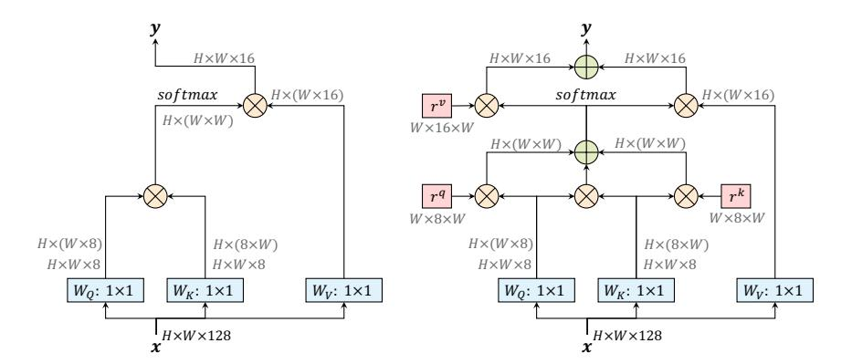
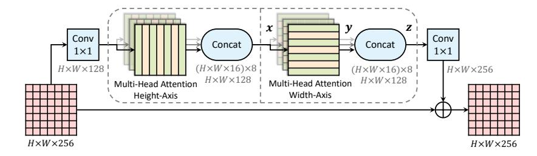
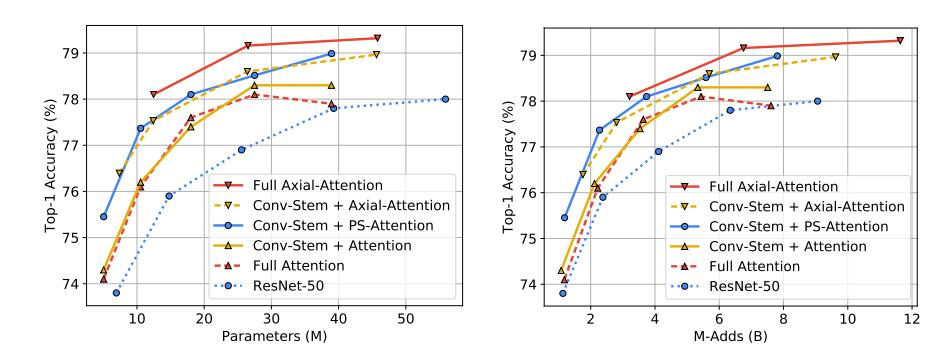
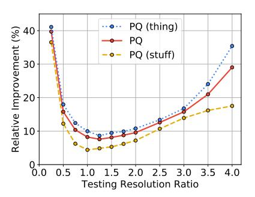

# Axial-DeepLab: Stand-Alone Axial-Attention for Panoptic Segmentation

Huiyu Wang $^{1\star}$ , Yukun Zhu², Bradley Green², Hartwig Adam², Alan Yuille¹, and Liang-Chieh Chen²

Johns Hopkins University Google Research

**Abstract.** Convolution exploits locality for efficiency at a cost of missing long range context. Self-attention has been adopted to augment CNNs with non-local interactions. Recent works prove it possible to stack self-attention layers to obtain a fully attentional network by restricting the attention to a local region. In this paper, we attempt to remove this constraint by factorizing 2D self-attention into two 1D selfattentions. This reduces computation complexity and allows performing attention within a larger or even global region. In companion, we also propose a position-sensitive self-attention design. Combining both yields our position-sensitive axial-attention layer, a novel building block that one could stack to form axial-attention models for image classification and dense prediction. We demonstrate the effectiveness of our model on four large-scale datasets. In particular, our model outperforms all existing stand-alone self-attention models on ImageNet. Our Axial-DeepLab improves 2.8% PQ over bottom-up state-of-the-art on COCO test-dev. This previous state-of-the-art is attained by our small variant that is 3.8× parameter-efficient and 27× computation-efficient. Axial-DeepLab also achieves state-of-the-art results on Mapillary Vistas and Cityscapes.

Keywords: bottom-up panoptic segmentation, self-attention

# 1 Introduction

Convolution is a core building block in computer vision. Early algorithms employ convolutional filters to blur images, extract edges, or detect features. It has been heavily exploited in modern neural networks [47,46] due to its efficiency and generalization ability, in comparison to fully connected models [2]. The success of convolution mainly comes from two properties: translation equivariance, and locality. Translation equivariance, although not exact [93], aligns well with the nature of imaging and thus generalizes the model to different positions or to images of different sizes. Locality, on the other hand, reduces parameter counts and M-Adds. However, it makes modeling long range relations challenging.

A rich set of literature has discussed approaches to modeling long range interactions in convolutional neural networks (CNNs). Some employ atrous convolutions [33,74,64,12], larger kernel [67], or image pyramids [94,82], either designed

\* Work done while an intern at Google.

by hand or searched by algorithms [99,11,57]. Another line of works adopts attention mechanisms. Attention shows its ability of modeling long range interactions in language modeling [80,85], speech recognition [21,10], and neural captioning [88]. Attention has since been extended to vision, giving significant boosts to image classification [6], object detection [36], semantic segmentation [39], video classification [84], and adversarial defense [86]. These works enrich CNNs with non-local or long-range attention modules.

Recently, stacking attention layers as stand-alone models without any spatial convolution has been proposed [65,37] and shown promising results. However, naive attention is computationally expensive, especially on large inputs. Applying local constraints to attention, proposed by [65,37], reduces the cost and enables building fully attentional models. However, local constraints limit model receptive field, which is crucial to tasks such as segmentation, especially on high-resolution inputs. In this work, we propose to adopt axial-attention [32,39], which not only allows efficient computation, but recovers the large receptive field in stand-alone attention models. The core idea is to factorize 2D attention into two 1D attentions along height- and width-axis sequentially. Its efficiency enables us to attend over large regions and build models to learn long range or even global interactions. Additionally, most previous attention modules do not utilize positional information, which degrades attention's ability in modeling position-dependent interactions, like shapes or objects at multiple scales. Recent works [65,37,6] introduce positional terms to attention, but in a context-agnostic way. In this paper, we augment the positional terms to be context-dependent, making our attention position-sensitive, with marginal costs.

We show the effectiveness of our axial-attention models on ImageNet [70] for classification, and on three datasets (COCO [56], Mapillary Vistas [62], and Cityscapes [22]) for panoptic segmentation [45], instance segmentation, and semantic segmentation. In particular, on ImageNet, we build an Axial-ResNet by replacing the 3 × 3 convolution in all residual blocks [31] with our position-sensitive axial-attention layer, and we further make it fully attentional [65] by adopting axial-attention layers in the 'stem'. As a result, our Axial-ResNet attains state-of-the-art results among stand-alone attention models on ImageNet. For segmentation tasks, we convert Axial-ResNet to Axial-DeepLab by replacing the backbones in Panoptic-DeepLab [18]. On COCO [56], our Axial-DeepLab outperforms the current bottom-up state-of-the-art, Panoptic-DeepLab [19], by 2.8% PQ on test-dev set. We also show state-of-the-art segmentation results on Mapillary Vistas [62], and Cityscapes [22].

To summarize, our contributions are four-fold:

- The proposed method is the first attempt to build stand-alone attention models with large or global receptive field.
- We propose position-sensitive attention layer that makes better use of positional information without adding much computational cost.
- We show that axial attention works well, not only as a stand-alone model on image classification, but also as a backbone on panoptic segmentation, instance segmentation, and segmantic segmentation.

 Our Axial-DeepLab improves significantly over bottom-up state-of-the-art on COCO, achieving comparable performance of two-stage methods. We also surpass previous state-of-the-art methods on Mapillary Vistas and Cityscapes.

## 2 Related Work

Top-down panoptic segmentation: Most state-of-the-art panoptic segmentation models employ a two-stage approach where object proposals are firstly generated followed by sequential processing of each proposal. We refer to such approaches as top-down or proposal-based methods. Mask R-CNN [30] is commonly deployed in the pipeline for instance segmentation, paired with a light-weight stuff segmentation branch. For example, Panoptic FPN [44] incorporates a semantic segmentation head to Mask R-CNN [30], while Porzi et al. [68] append a light-weight DeepLab-inspired module [13] to the multi-scale features from FPN [55]. Additionally, some extra modules are designed to resolve the overlapping instance predictions by Mask R-CNN. TASCNet [49] and AUNet [52] propose a module to guide the fusion between 'thing' and 'stuff' predictions, while Liu et al. [61] adopt a Spatial Ranking module. UPSNet [87] develops an efficient parameter-free panoptic head for fusing 'thing' and 'stuff', which is further explored by Li et al. [50] for end-to-end training of panoptic segmentation models. AdaptIS [77] uses point proposals to generate instance masks.

Bottom-up panoptic segmentation: In contrast to top-down approaches, bottom-up or proposal-free methods for panoptic segmentation typically start with the semantic segmentation prediction followed by grouping 'thing' pixels into clusters to obtain instance segmentation. DeeperLab [89] predicts bounding box four corners and object centers for class-agnostic instance segmentation. SSAP [28] exploits the pixel-pair affinity pyramid [60] enabled by an efficient graph partition method [43]. BBFNet [7] obtains instance segmentation results by Watershed transform [81,4] and Hough-voting [5,48]. Recently, Panoptic-DeepLab [19], a simple, fast, and strong approach for bottom-up panoptic segmentation, employs a class-agnostic instance segmentation branch involving a simple instance center regression [42,79,63], coupled with DeepLab semantic segmentation outputs [12,14,15]. Panoptic-DeepLab has achieved state-of-the-art results on several benchmarks, and our method builds on top of it.

**Self-attention:** Attention, introduced by [3] for the encoder-decoder in a neural sequence-to-sequence model, is developed to capture correspondence of tokens between two sequences. In contrast, self-attention is defined as applying attention to a single context instead of across multiple modalities. Its ability to directly encode long-range interactions and its parallelizability, has led to state-of-the-art performance for various tasks [80,38,25,66,72,24,53]. Recently, self-attention has been applied to computer vision, by augmenting CNNs with non-local or long-range modules. Non-local neural networks [84] show that self-attention is an instantiation of non-local means [9] and achieve gains on many vision tasks such as video classification and object detection. Additionally, [17,6] show improvements on image classification by combining features from self-

attention and convolution. State-of-the-art results on video action recognition tasks [17] are also achieved in this way. On semantic segmentation, self-attention is developed as a context aggregation module that captures multi-scale context [39,26,98,95]. Efficient attention methods are proposed to reduce its complexity [73,39,53]. Additionally, CNNs augmented with non-local means [9] are shown to be more robust to adversarial attacks [86]. Besides discriminative tasks, self-attention is also applied to generative modeling of images [91,8,32]. Recently, [65,37] show that self-attention layers alone could be stacked to form a fully attentional model by restricting the receptive field of self-attention to a local square region. Encouraging results are shown on both image classification and object detection. In this work, we follow this direction of research and propose a stand-alone self-attention model with large or global receptive field, making self-attention models non-local again. Our models are evaluated on bottom-up panoptic segmentation and show significant improvements.

### 3 Method

We begin by formally introducing our position-sensitive self-attention mechanism. Then, we discuss how it is applied to axial-attention and how we build stand-alone Axial-ResNet and Axial-DeepLab with axial-attention layers.

#### 3.1 Position-Sensitive Self-Attention

**Self-Attention:** Self-attention mechanism is usually applied to vision models as an add-on to augment CNNs outputs [84,91,39]. Given an input feature map  $x \in \mathbb{R}^{h \times w \times d_{in}}$  with height h, width w, and channels  $d_{in}$ , the output at position  $o = (i, j), y_o \in \mathbb{R}^{d_{out}}$ , is computed by pooling over the projected input as:

$$y_o = \sum_{p \in \mathcal{N}} \operatorname{softmax}_p(q_o^T k_p) v_p \tag{1}$$

where  $\mathcal{N}$  is the whole location lattice, and queries  $q_o = W_Q x_o$ , keys  $k_o = W_K x_o$ , values  $v_o = W_V x_o$  are all linear projections of the input  $x_o \, \forall o \in \mathcal{N}$ .  $W_Q, W_K \in \mathbb{R}^{d_q \times d_{in}}$  and  $W_V \in \mathbb{R}^{d_{out} \times d_{in}}$  are all learnable matrices. The softmaxp denotes a softmax function applied to all possible p = (a, b) positions, which in this case is also the whole 2D lattice.

This mechanism pools values  $v_p$  globally based on affinities  $x_o^T W_Q^T W_K x_p$ , allowing us to capture related but non-local context in the whole feature map, as opposed to convolution which only captures local relations.

However, self-attention is extremely expensive to compute  $(\mathcal{O}(h^2w^2))$  when the spatial dimension of the input is large, restricting its use to only high levels of a CNN (*i.e.*, downsampled feature maps) or small images. Another drawback is that the global pooling does not exploit positional information, which is critical to capture spatial structures or shapes in vision tasks.

These two issues are mitigated in [65] by adding local constraints and positional encodings to self-attention. For each location o, a local  $m \times m$  square

region is extracted to serve as a memory bank for computing the output  $y_o$ . This significantly reduces its computation to  $\mathcal{O}(hwm^2)$ , allowing self-attention modules to be deployed as stand-alone layers to form a fully self-attentional neural network. Additionally, a learned relative positional encoding term is incorporated into the affinities, yielding a dynamic prior of where to look at in the receptive field (*i.e.*, the local  $m \times m$  square region). Formally, [65] proposes

$$y_o = \sum_{p \in \mathcal{N}_{m \times m}(o)} \operatorname{softmax}_p(q_o^T k_p + q_o^T r_{p-o}) v_p$$
 (2)

where  $\mathcal{N}_{m \times m}(o)$  is the local  $m \times m$  square region centered around location o = (i, j), and the learnable vector  $r_{p-o} \in \mathbb{R}^{d_q}$  is the added relative positional encoding. The inner product  $q_o^T r_{p-o}$  measures the compatibility from location p = (a, b) to location o = (i, j). We do not consider absolute positional encoding  $q_o^T r_p$ , because they do not generalize well compared to the relative counterpart [65]. In the following paragraphs, we drop the term relative for conciseness.

In practice,  $d_q$  and  $d_{out}$  are much smaller than  $d_{in}$ , and one could extend single-head attention in Eq. (2) to multi-head attention to capture a mixture of affinities. In particular, multi-head attention is computed by applying N single-head attentions in parallel on  $x_o$  (with different  $W_Q^n, W_K^n, W_V^n, \forall n \in \{1, 2, ..., N\}$  for the n-th head), and then obtaining the final output  $z_o$  by concatenating the results from each head, i.e.,  $z_o = \operatorname{concat}_n(y_o^n)$ . Note that positional encodings are often shared across heads, so that they introduce marginal extra parameters.

**Position-Sensitivity:** We notice that previous positional bias only depends on the query pixel  $x_o$ , not the key pixel  $x_p$ . However, the keys  $x_p$  could also have information about which location to attend to. We therefore add a key-dependent positional bias term  $k_p^T r_{p-o}^k$ , besides the query-dependent bias  $q_o^T r_{p-o}^q$ .

Similarly, the values  $v_p$  do not contain any positional information in Eq. (2). In the case of large receptive fields or memory banks, it is unlikely that  $y_o$  contains the precise location from which  $v_p$  comes. Thus, previous models have to trade-off between using smaller receptive fields (i.e., small  $m \times m$  regions) and throwing away precise spatial structures. In this work, we enable the output  $y_o$  to retrieve relative positions  $r_{p-o}^v$ , besides the content  $v_p$ , based on query-key affinities  $q_o^T k_p$ . Formally,

$$y_o = \sum_{p \in \mathcal{N}_{m \times m}(o)} \text{softmax}_p(q_o^T k_p + q_o^T r_{p-o}^q + k_p^T r_{p-o}^k)(v_p + r_{p-o}^v)$$
(3)

where the learnable  $r_{p-o}^k \in \mathbb{R}^{d_q}$  is the positional encoding for keys, and  $r_{p-o}^v \in \mathbb{R}^{d_{out}}$  is for values. Both vectors do not introduce many parameters, since they are shared across attention heads in a layer, and the number of local pixels  $|\mathcal{N}_{m\times m}(o)|$  is usually small.

We call this design *position-sensitive* self-attention, which captures long range interactions with precise positional information at a reasonable computation overhead, as verified in our experiments.

Fig. 1. A non-local block (left) vs. our position-sensitive axial-attention applied along the width-axis (right). " $\otimes$ " denotes matrix multiplication, and " $\oplus$ " denotes elementwise sum. The softmax is performed on the last axis. Blue boxes denote  $1 \times 1$  convolutions, and red boxes denote relative positional encoding. The channels  $d_{in} = 128$ ,  $d_q = 8$ , and  $d_{out} = 16$  is what we use in the first stage of ResNet after 'stem'

#### 3.2 Axial-Attention

The local constraint, proposed by the stand-alone self-attention models [65], significantly reduces the computational costs in vision tasks and enables building fully self-attentional model. However, such constraint sacrifices the global connection, making attention's receptive field no larger than a depthwise convolution with the same kernel size. Additionally, the local self-attention, performed in local square regions, still has complexity quadratic to the region length, introducing another hyper-parameter to trade-off between performance and computation complexity. In this work, we propose to adopt axial-attention [39,32] in standalone self-attention, ensuring both global connection and efficient computation. Specifically, we first define an axial-attention layer on the width-axis of an image as simply a one dimensional position-sensitive self-attention, and use the similar definition for the height-axis. To be concrete, the axial-attention layer along the width-axis is defined as follows.

$$y_o = \sum_{p \in \mathcal{N}_{1 \times m}(o)} \text{softmax}_p(q_o^T k_p + q_o^T r_{p-o}^q + k_p^T r_{p-o}^k)(v_p + r_{p-o}^v)$$
(4)

One axial-attention layer propagates information along one particular axis. To capture global information, we employ two axial-attention layers consecutively for the height-axis and width-axis, respectively. Both of the axial-attention layers adopt the multi-head attention mechanism, as described above.

Axial-attention reduces the complexity to  $\mathcal{O}(hwm)$ . This enables global receptive field, which is achieved by setting the span m directly to the whole input features. Optionally, one could also use a fixed m value, in order to reduce memory footprint on huge feature maps.

Fig. 2. An axial-attention block, which consists of two axial-attention layers operating along height- and width-axis sequentially. The channels  $d_{in} = 128$ ,  $d_{out} = 16$  is what we use in the first stage of ResNet after 'stem'. We employ N = 8 attention heads

Axial-ResNet: To transform a ResNet [31] to an Axial-ResNet, we replace the  $3\times 3$  convolution in the residual bottleneck block by two multi-head axial-attention layers (one for height-axis and the other for width-axis). Optional striding is performed on each axis after the corresponding axial-attention layer. The two  $1\times 1$  convolutions are kept to shuffle the features. This forms our (residual) axial-attention block, as illustrated in Fig. 2, which is stacked multiple times to obtain Axial-ResNets. Note that we do not use a  $1\times 1$  convolution in-between the two axial-attention layers, since matrix multiplications  $(W_Q, W_K, W_V)$  follow immediately. Additionally, the stem (i.e., the first strided  $7\times 7$  convolution and  $3\times 3$  max-pooling) in the original ResNet is kept, resulting in a conv-stem model where convolution is used in the first layer and attention layers are used everywhere else. In conv-stem models, we set the span m to the whole input from the first block, where the feature map is  $56\times 56$ .

In our experiments, we also build a full axial-attention model, called Full Axial-ResNet, which further applies axial-attention to the stem. Instead of designing a special spatially-varying attention stem [65], we simply stack three axial-attention bottleneck blocks. In addition, we adopt local constraints (i.e., a local  $m \times m$  square region as in [65]) in the first few blocks of Full Axial-ResNets, in order to reduce computational cost.

**Axial-DeepLab:** To further convert Axial-ResNet to Axial-DeepLab for segmentation tasks, we make several changes as discussed below.

Firstly, to extract dense feature maps, DeepLab [12] changes the stride and atrous rates of the last one or two stages in ResNet [31]. Similarly, we remove the stride of the last stage but we do not implement the 'atrous' attention module, since our axial-attention already captures global information for the whole input. In this work, we extract feature maps with output stride (*i.e.*, the ratio of input resolution to the final backbone feature resolution) 16. We do not pursue output stride 8, since it is computationally expensive.

Secondly, we do not adopt the atrous spatial pyramid pooling module (ASPP) [13,14], since our axial-attention block could also efficiently encode the multiscale or global information. We show in the experiments that our Axial-DeepLab without ASPP outperforms Panoptic-DeepLab [19] with and without ASPP.

Lastly, following Panoptic-DeepLab [19], we adopt exactly the same stem [78] of three convolutions, dual decoders, and prediction heads. The heads produce semantic segmentation and class-agnostic instance segmentation, and they are merged by majority voting [89] to form the final panoptic segmentation.

In cases where the inputs are extremely large  $(e.g., 2177 \times 2177)$  and memory is constrained, we resort to a large span m=65 in all our axial-attention blocks. Note that we do not consider the axial span as a hyper-parameter because it is already sufficient to cover long range or even global context on several datasets, and setting a smaller span does not significantly reduce M-Adds.

# 4 Experimental Results

We conduct experiments on four large-scale datasets. We first report results with our Axial-ResNet on ImageNet [70]. We then convert the ImageNet pretrained Axial-ResNet to Axial-DeepLab, and report results on COCO [56], Mapillary Vistas [62], and Cityscapes [22] for panoptic segmentation, evaluated by panoptic quality (PQ) [45]. We also report average precision (AP) for instance segmentation, and mean IoU for semantic segmentation on Mapillary Vistas and Cityscapes. Our models are trained using TensorFlow [1] on 128 TPU cores for ImageNet and 32 cores for panoptic segmentation.

**Training protocol:** On ImageNet, we adopt the same training protocol as [65] for a fair comparison, except that we use batch size 512 for Full Axial-ResNets and 1024 for all other models, with learning rates scaled accordingly [29].

For panoptic segmentation, we strictly follow Panoptic-DeepLab [19], except using a linear warm up Radam [58] Lookahead [92] optimizer (with the same learning rate 0.001). All our results on panoptic segmentation use this setting. We note this change does not improve the results, but smooths our training curves. Panoptic-DeepLab yields similar result in this setting.

# 4.1 ImageNet

For ImageNet, we build Axial-ResNet-L from ResNet-50 [31]. In detail, we set  $d_{in}=128,\ d_{out}=2d_q=16$  for the first stage after the 'stem'. We double them when spatial resolution is reduced by a factor of 2 [76]. Additionally, we multiply all the channels [35,71,34] by 0.5, 0.75, and 2, resulting in Axial-ResNet-{S, M, XL}, respectively. Finally, Stand-Alone Axial-ResNets are further generated by replacing the 'stem' with three axial-attention blocks where the first block has stride 2. Due to the computational cost introduced by the early layers, we set the axial span m=15 in all blocks of Stand-Alone Axial-ResNets. We always use N=8 heads [65]. In order to avoid careful initialization of  $W_Q, W_K, W_V, r^q, r^k, r^v$ , we use batch normalizations [40] in all attention layers.

Tab. 1 summarizes our ImageNet results. The baselines ResNet-50 [31] (done by [65]) and Conv-Stem + Attention [65] are also listed. In the conv-stem setting, adding BN to attention layers of [65] slightly improves the performance by 0.3%.

**Table 1.** ImageNet validation set results. **BN:** Use batch normalizations in attention layers. **PS:** Our position-sensitive self-attention. **Full:** Stand-alone self-attention models without spatial convolutions

| Method                                                                           | BN | PS | Full          | Params                          | M-Adds                      | Top-1                       |  |  |
|----------------------------------------------------------------------------------|----|----|---------------|---------------------------------|-----------------------------|-----------------------------|--|--|
| Conv-Stem methods                                                                |    |    |               |                                 |                             |                             |  |  |
| ResNet-50 [31,65] Conv-Stem + Attention [65]                                  |    |    |               | 25.6M 18.0M                  | 4.1B 3.5B                | 76.9 77.4                |  |  |
| Conv-Stem + Attention Conv-Stem + PS-Attention Conv-Stem + Axial-Attention | 1  | 1  |               | 18.0M 18.0M 12.4M         | 3.5B 3.7B 2.8B        | 77.7 78.1 77.5        |  |  |
| Fully self-attentional methods                                                   |    |    |               |                                 |                             |                             |  |  |
| LR-Net-50 [37] Full Attention [65] Full Axial-Attention                          | ,  | /  | \ \frac{1}{2} | 23.3M 18.0M <b>12.5</b> M | 4.3B 3.6B <b>3.3B</b> | 77.3 77.6 <b>78.1</b> |  |  |

Our proposed position-sensitive self-attention (Conv-Stem + PS-Attention) further improves the performance by 0.4% at the cost of extra marginal computation. Our Conv-Stem + Axial-Attention performs on par with Conv-Stem + Attention [65] while being more parameter- and computation-efficient. When comparing with other full self-attention models, our Full Axial-Attention outperforms Full Attention [65] by 0.5%, while being  $1.44\times$  more parameter-efficient and  $1.09\times$  more computation-efficient.

Following [65], we experiment with different network widths (*i.e.*, Axial-ResNets-{S,M,L,XL}), exploring the trade-off between accuracy, model parameters, and computational cost (in terms of M-Adds). As shown in Fig. 3, our proposed Conv-Stem + PS-Attention and Conv-Stem + Axial-Attention already outperforms ResNet-50 [31,65] and attention models [65] (both Conv-Stem + Attention, and Full Attention) at all settings. Our Full Axial-Attention further attains the best accuracy-parameter and accuracy-complexity trade-offs.

# 4.2 COCO

The ImageNet pretrained Axial-ResNet model variants (with different channels) are then converted to Axial-DeepLab model variant for panoptic segmentation tasks. We first demonstrate the effectiveness of our Axial-DeepLab on the challenging COCO dataset [56], which contains objects with various scales (from less than  $32 \times 32$  to larger than  $96 \times 96$ ).

Val set: In Tab. 2, we report our validation set results and compare with other bottom-up panoptic segmentation methods, since our method also belongs to the bottom-up family. As shown in the table, our *single-scale* Axial-DeepLab-S outperforms DeeperLab [89] by 8% PQ, *multi-scale* SSAP [28] by 5.3% PQ, and *single-scale* Panoptic-DeepLab by 2.1% PQ. Interestingly, our *single-scale* Axial-DeepLab-S also outperforms *multi-scale* Panoptic-DeepLab by 0.6% PQ while

Fig. 3. Comparing parameters and M-Adds against accuracy on ImageNet classification. Our position-sensitive self-attention (Conv-Stem + PS-Attention) and axial-attention (Conv-Stem + Axial-Attention) consistently outperform ResNet-50 [31,65] and attention models [65] (both Conv-Stem + Attention, and Full Attention), across a range of network widths (i.e., different channels). Our Full Axial-Attention works the best in terms of both parameters and M-Adds

| Method                | Backbone       | MS       | Params | M-Adds             | PQ   | $\mathrm{PQ}^{\mathrm{Th}}$ | $\mathrm{PQ}^{\mathrm{St}}$ |
|-----------------------|----------------|----------|--------|--------------------|------|-----------------------------|-----------------------------|
| DeeperLab [89]        | Xception-71    |          |        |                    | 33.8 | -                           | -                           |
| SSAP [28]             | ResNet-101     | <b>/</b> |        |                    | 36.5 | -                           | -                           |
| Panoptic-DeepLab [19] | Xception-71    |          | 46.7M  | 274.0B             | 39.7 | 43.9                        | 33.2                        |
| Panoptic-DeepLab [19] | Xception-71    | 1        | 46.7M  | $3081.4\mathrm{B}$ | 41.2 | 44.9                        | 35.7                        |
| Axial-DeepLab-S       | Axial-ResNet-S |          | 12.1M  | 110.4B             | 41.8 | 46.1                        | 35.2                        |
| Axial-DeepLab-M       | Axial-ResNet-M |          | 25.9M  | 209.9B             | 42.9 | 47.6                        | 35.8                        |
| Axial-DeepLab-L       | Axial-ResNet-L |          | 44.9M  | 343.9B             | 43.4 | 48.5                        | 35.6                        |
| Axial-DeepLab-L       | Axial-ResNet-L | 1        | 44.9M  | 3867.7B            | 43.9 | 48.6                        | 36.8                        |

Table 2. COCO val set. MS: Multi-scale inputs

being 3.8× parameter-efficient and 27× computation-efficient (in M-Adds). Increasing the backbone capacity (via large channels) continuously improves the performance. Specifically, our *multi-scale* Axial-DeepLab-L attains 43.9% PQ, outperforming Panoptic-DeepLab [19] by 2.7% PQ.

**Test-dev set:** As shown in Tab. 3, our Axial-DeepLab variants show consistent improvements with larger backbones. Our *multi-scale* Axial-DeepLab-L attains the performance of 44.2% PQ, outperforming DeeperLab [89] by 9.9% PQ, SSAP [28] by 7.3% PQ, and Panoptic-DeepLab [19] by 2.8% PQ, setting a new state-of-the-art among bottom-up approaches. We also list several top-performing methods adopting the top-down approaches in the table for reference.

**Scale Stress Test:** In order to verify that our model learns long range interactions, we perform a scale stress test besides standard testing. In the stress test, we train Panoptic-DeepLab (X-71) and our Axial-DeepLab-L with the standard setting, but test them on out-of-distribution resolutions (*i.e.*, resize the in-

 $PQ^{Th}$  $\mathrm{PQ}^{\mathrm{St}}$ Method Backbone MSPQTop-down panoptic segmentation methods TASCNet [49] ResNet-50 40.747.031.0 Panoptic-FPN [44] ResNet-101 40.948.329.7 AdaptIS [77] ResNeXt-101 42.8 53.2 36.7 AUNet [52] ResNeXt-152 32.5 46.5 55.8 UPSNet [87] DCN-101 [23] 46.653.2 36.7Li et al. [50] DCN-101 [23] 47.237.753.5DCN-101 [23] SpatialFlow [16] 47.353.537.9SOGNet [90] DCN-101 [23] 47.8Bottom-up panoptic segmentation methods DeeperLab [89] Xception-71 34.3 37.5 29.6 SSAP [28] ResNet-101 36.9 40.1 32.0 Panoptic-DeepLab [19] Xception-71 41.4 45.135.9Axial-DeepLab-S Axial-ResNet-S 42.246.535.7Axial-DeepLab-M Axial-ResNet-M 43.235.948.1 Axial-DeepLab-L Axial-ResNet-L 43.6 35.648.9

Table 3. COCO test-dev set. MS: Multi-scale inputs

44.2

49.2

36.8

Axial-ResNet-L

Fig. 4. Scale stress test on COCO val set. Axial-DeepLab gains the most when tested on extreme resolutions. On the x-axis, ratio 4.0 means inference with resolution  $4097 \times 4097$ 

put to different resolutions). Fig. 4 summarizes our relative improvements over Panoptic-DeepLab on PQ, PQ (thing) and PQ (stuff). When tested on huge images, Axial-DeepLab shows large gain (30%), demonstrating that it encodes long range relations better than convolutions. Besides, Axial-DeepLab improves 40% on small images, showing that axial-attention is more robust to scale variations.

### 4.3 Mapillary Vistas

Axial-DeepLab-L

We evaluate our Axial-DeepLab on the large-scale Mapillary Vistas dataset [62]. We only report validation set results, since the test server is not available.

Table 4. Mapillary Vistas validation set. MS: Multi-scale inputs

| Method                                      | MS    | Params   | M-Adds   | PQ   | $\mathrm{PQ}^{\mathrm{Th}}$ | $\mathrm{PQ}^{\mathrm{St}}$ | AP   | mIoU |  |
|---------------------------------------------|-------|----------|----------|------|-----------------------------|-----------------------------|------|------|--|
| Top-down panoptic segmentation methods      |       |          |          |      |                             |                             |      |      |  |
| TASCNet [49]                                |       |          |          | 32.6 | 31.1                        | 34.4                        | 18.5 | -    |  |
| TASCNet [49]                                | 1     |          |          | 34.3 | 34.8                        | 33.6                        | 20.4 | -    |  |
| AdaptIS [77]                                |       |          |          | 35.9 | 31.5                        | 41.9                        | -    | -    |  |
| Seamless [68]                               |       |          |          | 37.7 | 33.8                        | 42.9                        | 16.4 | 50.4 |  |
| Bottom-up panopt                            | ic se | gmentati | on metho | ods  |                             |                             |      |      |  |
| DeeperLab [89]                              |       |          |          | 32.0 | -                           | -                           | -    | 55.3 |  |
| Panoptic-DeepLab (Xception-71 [20,69]) [19] |       | 46.7M    | 1.24T    | 37.7 | 30.4                        | 47.4                        | 14.9 | 55.4 |  |
| Panoptic-DeepLab (Xception-71 [20,69]) [19] | 1     | 46.7M    | 31.35T   | 40.3 | 33.5                        | 49.3                        | 17.2 | 56.8 |  |
| Panoptic-DeepLab (HRNet-W48 [83]) [19]      | 1     | 71.7M    | 58.47T   | 39.3 | -                           | -                           | 17.2 | 55.4 |  |
| Panoptic-DeepLab (Auto-XL++ [57]) [19]      | 1     | 72.2M    | 60.55T   | 40.3 | -                           | -                           | 16.9 | 57.6 |  |
| Axial-DeepLab-L                             |       | 44.9M    | 1.55T    | 40.1 | 32.7                        | 49.8                        | 16.7 | 57.6 |  |
| Axial-DeepLab-L                             | 1     | 44.9M    | 39.35T   | 41.1 | 33.4                        | 51.3                        | 17.2 | 58.4 |  |

Val set: As shown in Tab. 4, our Axial-DeepLab-L outperforms all the state-of-the-art methods in both single-scale and multi-scale cases. Our *single-scale* Axial-DeepLab-L performs 2.4% PQ better than the previous best *single-scale* Panoptic-DeepLab (X-71) [19]. In multi-scale setting, our lightweight Axial-DeepLab-L performs better than Panoptic-DeepLab (Auto-DeepLab-XL++), not only on panoptic segmentation (0.8% PQ) and instance segmentation (0.3% AP), but also on semantic segmentation (0.8% mIoU), the task that Auto-DeepLab [57] was searched for. Additionally, to the best of our knowledge, our Axial-DeepLab-L attains the best *single-model* semantic segmentation result.

#### 4.4 Cityscapes

Val set: In Tab. 5 (a), we report our Cityscapes validation set results. Without using extra data (*i.e.*, only Cityscapes fine annotation), our Axial-DeepLab achieves 65.1% PQ, which is 1% better than the current best bottom-up Panoptic-DeepLab [19] and 3.1% better than proposal-based AdaptIS [77]. When using extra data (*e.g.*, Mapillary Vistas [62]), our *multi-scale* Axial-DeepLab-XL attains 68.5% PQ, 1.5% better than Panoptic-DeepLab [19] and 3.5% better than Seamless [68]. Our instance segmentation and semantic segmentation results are respectively 1.7% and 1.5% better than Panoptic-DeepLab [19].

**Test set:** Tab. 5 (b) shows our test set results. Without extra data, Axial-DeepLab-XL attains 62.8% PQ, setting a new state-of-the-art result. Our model further achieves 66.6% PQ, 39.6% AP, and 84.1% mIoU with Mapillary Vistas pretraining. Note that Panoptic-DeepLab [19] adopts the trick of output stride 8 during inference on test set, making their M-Adds comparable to our XL models.

#### 4.5 Ablation Studies

We perform ablation studies on Cityscapes validation set.

Table 5. Cityscapes val set and test set. MS: Multi-scale inputs. C: Cityscapes coarse annotation. V: Cityscapes video. MV: Mapillary Vistas

| (a) Cityscapes validation set                                              |                |    |                |                      |                                     |  |  |  |  |
|----------------------------------------------------------------------------|----------------|----|----------------|----------------------|-------------------------------------|--|--|--|--|
| Method                                                                     | Extra Data     | MS | PQ             | AP                   | mIoU                                |  |  |  |  |
| AdaptIS [77]                                                               |                | 1  | 62.0           | 36.3                 | 79.2                                |  |  |  |  |
| SSAP [28]                                                                  |                | 1  | 61.1           |                      | -                                   |  |  |  |  |
| Panoptic-DeepLab [19] Panoptic-DeepLab [19]                             | l              | 1  |                |                      | 80.5 <b>81.5</b>                 |  |  |  |  |
| Axial-DeepLab-L Axial-DeepLab-L Axial-DeepLab-XL Axial-DeepLab-XL |                | 1  | $64.7 \\ 64.4$ | $37.9 \\ 36.7$       | 81.0 <b>81.5</b> 80.6 81.1 |  |  |  |  |
| SpatialFlow [16] Seamless [68]                                          | COCO MV     | 1  | 62.5 65.0   |                      | 80.7                                |  |  |  |  |
| Panoptic-DeepLab [19] Panoptic-DeepLab [19]                             | 1              | /  |                | 38.8 42.5         |                                     |  |  |  |  |
| Axial-DeepLab-L Axial-DeepLab-L Axial-DeepLab-XL Axial-DeepLab-XL | MV MV MV | 1  | 67.7 67.8   | 40.2 42.9 41.9 |                                     |  |  |  |  |

| dation set                                                           | (b) Cityscapes test set                                                    |            |                      |                |                              |  |  |  |
|----------------------------------------------------------------------|----------------------------------------------------------------------------|------------|----------------------|----------------|------------------------------|--|--|--|
| ta MS  PQ AP mIoU                                                    | Method                                                                     | Extra Data | PQ                   | AP             | mIoU                         |  |  |  |
| <b>✓</b>  62.0 36.3 79.2                                             | GFF-Net [51]                                                               |            | -                    | -              | 82.3                         |  |  |  |
| <b>✓</b> 61.1 37.3 -                                                 | Zhu et al. [97]                                                            | C, V, MV   | -                    | -              | 83.5                         |  |  |  |
| 63.0 35.3 80.5                                                       | AdaptIS [77]                                                               |            | -                    | 32.5           | -                            |  |  |  |
| <b>  ✓</b>   64.1 38.5 <b>81.5</b>                                   | UPSNet [87]                                                                | COCO       | -                    | $33.0 \\ 36.4$ |                              |  |  |  |
| 63.9 35.8 81.0 64.7 37.9 <b>81.5</b>                              | PANet [59] PolyTransform [54]                                           | COCO       | -                    | 40.1           |                              |  |  |  |
| 64.4 36.7 80.6                                                       | SSAP [28]                                                                  |            | 58.9                 | 32.7           | -                            |  |  |  |
| <b>✓ 65.1 39.0</b> 81.1                                              | Li et al. [50]                                                             |            | 61.0                 | -              | -                            |  |  |  |
| <b>/</b>   62.5   65.0 - 80.7                                        | Panoptic-DeepLab [19] TASCNet [49] Seamless [68]                     | COCO MV | 62.3 60.7 62.6 | 34.6           | 79.4 - -               |  |  |  |
| 65.3 38.8 82.5 67.0 42.5 83.1                                     | Li et al. [50] Panoptic-DeepLab [19]                                    | COCO MV | 63.3 65.5         | - 39.0      | 84.2                         |  |  |  |
| 66.5 40.2 83.2 67.7 42.9 83.8 67.8 41.9 84.2 68.5 44.2 84.6 | Axial-DeepLab-L Axial-DeepLab-XL Axial-DeepLab-L Axial-DeepLab-XL | MV MV   | 62.8 65.6         | $34.0 \\ 38.1$ | 79.5 79.9 83.1 84.1 |  |  |  |
| 1 00.0 44.2 04.0                                                     | AMai-DeepLab-AL                                                            | 141 A      | 00.0                 | 55.0           | 04.1                         |  |  |  |

**Table 6.** Ablating self-attention variants on Cityscapes val set. **ASPP**: Atrous spatial pyramid pooling. **PS**: Our position-sensitive self-attention

| Backbone                                                                                                             | ASPP   | PS                                                                                                                                                                                                                                                                                                                                                                                                                                                                                                                                                                                                                                                                                                                                                                                                                                                                                                                                                                                                                                                                                                                                                                                                                                                                                                                                                                                                                                                                                                                                                                                                                                                                                                                                                                                                                                                                                                                                                                                                                                                                                                                             | Params                           | M-Adds                               | PQ                           | AP                           | mIoU                         |
|----------------------------------------------------------------------------------------------------------------------|--------|--------------------------------------------------------------------------------------------------------------------------------------------------------------------------------------------------------------------------------------------------------------------------------------------------------------------------------------------------------------------------------------------------------------------------------------------------------------------------------------------------------------------------------------------------------------------------------------------------------------------------------------------------------------------------------------------------------------------------------------------------------------------------------------------------------------------------------------------------------------------------------------------------------------------------------------------------------------------------------------------------------------------------------------------------------------------------------------------------------------------------------------------------------------------------------------------------------------------------------------------------------------------------------------------------------------------------------------------------------------------------------------------------------------------------------------------------------------------------------------------------------------------------------------------------------------------------------------------------------------------------------------------------------------------------------------------------------------------------------------------------------------------------------------------------------------------------------------------------------------------------------------------------------------------------------------------------------------------------------------------------------------------------------------------------------------------------------------------------------------------------------|----------------------------------|--------------------------------------|------------------------------|------------------------------|------------------------------|
| ResNet-50 [31] (our impl.) ResNet-50 [31] (our impl.) Attention [65] (our impl.) Attention [65] (our impl.) | ✓ ✓ |                                                                                                                                                                                                                                                                                                                                                                                                                                                                                                                                                                                                                                                                                                                                                                                                                                                                                                                                                                                                                                                                                                                                                                                                                                                                                                                                                                                                                                                                                                                                                                                                                                                                                                                                                                                                                                                                                                                                                                                                                                                                                                                                | 24.8M 30.0M 17.3M 22.5M | 374.8B 390.0B 317.7B 332.9B | 58.1 59.8 58.7 60.9 | 30.0 32.6 31.9 30.0 | 73.3 77.8 75.8 78.2 |
| PS-Attention PS-Attention                                                                                         | /      | 1                                                                                                                                                                                                                                                                                                                                                                                                                                                                                                                                                                                                                                                                                                                                                                                                                                                                                                                                                                                                                                                                                                                                                                                                                                                                                                                                                                                                                                                                                                                                                                                                                                                                                                                                                                                                                                                                                                                                                                                                                                                                                                                              | 17.3M 22.5M                   | 326.7B 341.9B                     | 59.9 <b>61.5</b>          | 32.2 <b>33.1</b>          | 76.3 <b>79.1</b>          |
| Axial-DeepLab-S                                                                                                      |        | ✓                                                                                                                                                                                                                                                                                                                                                                                                                                                                                                                                                                                                                                                                                                                                                                                                                                                                                                                                                                                                                                                                                                                                                                                                                                                                                                                                                                                                                                                                                                                                                                                                                                                                                                                                                                                                                                                                                                                                                                                                                                                                                                                              | 12.1M                            | 220.8B                               | 62.6                         | 34.9                         | 80.5                         |
| Axial-DeepLab-M Axial-DeepLab-L Axial-DeepLab-XL                                                               |        | \ \langle \ \langle \ \langle \ \langle \ \langle \ \langle \ \langle \ \langle \ \langle \ \langle \ \langle \ \langle \ \langle \ \langle \ \langle \ \langle \ \langle \ \langle \ \langle \ \langle \ \langle \ \langle \ \langle \ \langle \ \langle \ \langle \ \langle \ \langle \ \langle \ \langle \ \langle \ \langle \ \langle \ \langle \ \langle \ \langle \ \langle \ \langle \ \langle \ \langle \ \langle \ \langle \ \langle \ \langle \ \langle \ \langle \ \langle \ \langle \ \langle \ \langle \ \langle \ \langle \ \langle \ \langle \ \langle \ \langle \ \langle \ \langle \ \langle \ \langle \ \langle \ \langle \ \langle \ \langle \ \langle \ \langle \ \langle \ \langle \ \langle \ \langle \ \langle \ \langle \ \langle \ \langle \ \langle \ \langle \ \langle \ \langle \ \langle \ \langle \ \langle \ \langle \ \langle \ \langle \ \langle \ \langle \ \langle \ \langle \ \langle \ \langle \ \langle \ \langle \ \langle \ \langle \ \langle \ \langle \ \langle \ \langle \ \langle \ \langle \ \langle \ \langle \langle \ \langle \ \langle \ \langle \ \langle \ \langle \ \langle \ \langle \ \langle \ \langle \ \langle \ \langle \ \langle \langle \ \langle \ \langle \ \langle \ \langle \ \langle \ \langle \ \langle \ \langle \ \langle \ \langle \ \langle \ \langle \langle \ \langle \ \langle \ \langle \langle \langle \langle \langle \langle \langle \langle \langle \langle \langle \langle \langle \langle \langle \langle \langle \langle \langle \langle \langle \langle \langle \langle \langle \langle \langle \langle \langle \langle \langle \langle \langle \langle \langle \langle \langle \langle \langle \langle \langle \langle \langle \langle \langle \langle \langle \langle \langle \langle \langle \langle \langle \langle \langle \langle \langle \langle \langle \langle \langle \langle \langle \langle \langle \langle \langle \langle \langle \langle \langle \langle \langle \langle \langle \langle \langle \langle \langle \langle \langle \langle \langle \langle \langle \langle \langle \langle \langle \langle \langle \langle \lan | 25.9M 44.9M 173.0M         | 419.6B 687.4B 2446.8B          | 63.1 63.9 64.4         | 35.6 35.8 36.7         | 80.3 81.0 80.6         |

Importance of Position-Sensitivity and Axial-Attention: In Tab. 1, we experiment with attention models on ImageNet. In this ablation study, we transfer them to Cityscapes segmentation tasks. As shown in Tab. 6, all variants outperform ResNet-50 [31]. Position-sensitive attention performs better than previous self-attention [65], which aligns with ImageNet results in Tab. 1. However, employing axial-attention, which is on-par with position-sensitive attention on ImageNet, gives more than 1% boosts on all three segmentation tasks (in PQ, AP, and mIoU), without ASPP, and with fewer parameters and M-Adds, suggesting that the ability to encode long range context of axial-attention significantly improves the performance on segmentation tasks with large input images.

| Backbone       | Span           | Params | M-Adds | PQ   | AP   | mIoU |
|----------------|----------------|--------|--------|------|------|------|
| ResNet-101     | -              | 43.8M  | 530.0B | 59.9 | 31.9 | 74.6 |
| Axial-ResNet-L | $5 \times 5$   | 44.9M  | 617.4B | 59.1 | 31.3 | 74.5 |
| Axial-ResNet-L | $9 \times 9$   | 44.9M  | 622.1B | 61.2 | 31.1 | 77.6 |
| Axial-ResNet-L | $17 \times 17$ | 44.9M  | 631.5B | 62.8 | 34.0 | 79.5 |
| Axial-ResNet-L | $33 \times 33$ | 44.9M  | 650.2B | 63.8 | 35.9 | 80.2 |
| Axial-ResNet-L | $65 \times 65$ | 44.9M  | 687.4B | 64.2 | 36.3 | 80.6 |

Table 7. Varying axial-attention span on Cityscapes val set

Importance of Axial-Attention Span: In Tab. 7, we vary the span m (*i.e.*, spatial extent of local regions in an axial block), without ASPP. We observe that a larger span consistently improves the performance at marginal costs.

#### 5 Conclusion and Discussion

In this work, we have shown the effectiveness of proposed position-sensitive axial-attention on image classification and segmentation tasks. On ImageNet, our Axial-ResNet, formed by stacking axial-attention blocks, achieves state-of-the-art results among stand-alone self-attention models. We further convert Axial-ResNet to Axial-DeepLab for bottom-up segmentation tasks, and also show state-of-the-art performance on several benchmarks, including COCO, Mapillary Vistas, and Cityscapes. We hope our promising results could establish that axial-attention is an effective building block for modern computer vision models.

Our method bears a similarity to decoupled convolution [41], which factorizes a depthwise convolution [75,35,20] to a column convolution and a row convolution. This operation could also theoretically achieve a large receptive field, but its convolutional template matching nature limits the capacity of modeling multiscale interactions. Another related method is deformable convolution [23,96,27], where each point attends to a few points dynamically on an image. However, deformable convolution does not make use of key-dependent positional bias or content-based relation. In addition, axial-attention propagates information densely, and more efficiently along the height- and width-axis sequentially.

Although our axial-attention model saves M-Adds, it runs slower than convolutional counterparts, as also observed by [65]. This is due to the lack of specialized kernels on various accelerators for the time being. This might well be improved if the community considers axial-attention as a plausible direction.

#### Acknowledgments

We thank Niki Parmar for discussion and support; Ashish Vaswani, Xuhui Jia, Raviteja Vemulapalli, Zhuoran Shen for their insightful comments and suggestions; Maxwell Collins and Blake Hechtman for technical support. This work is supported by Google Faculty Research Award and NSF 1763705.

#### References

- Abadi, M., Barham, P., Chen, J., Chen, Z., Davis, A., Dean, J., Devin, M., Ghemawat, S., Irving, G., Isard, M., Kudlur, M., Levenberg, J., Monga, R., Moore, S., Murray, D.G., Steiner, B., Tucker, P., Vasudevan, V., Warden, P., Wicke, M., Yu, Y., Zheng, X.: Tensorflow: A system for large-scale machine learning. In: Proceedings of the 12th USENIX Conference on Operating Systems Design and Implementation (2016) 8
- 2. Ackley, D.H., Hinton, G.E., Sejnowski, T.J.: A learning algorithm for boltzmann machines. Cognitive science 9(1), 147–169 (1985) 1
- 3. Bahdanau, D., Cho, K., Bengio, Y.: Neural machine translation by jointly learning to align and translate. arXiv:1409.0473 (2014) 3
- 4. Bai, M., Urtasun, R.: Deep watershed transform for instance segmentation. In: CVPR (2017)  $\stackrel{3}{\text{--}}$
- Ballard, D.H.: Generalizing the hough transform to detect arbitrary shapes. Pattern Recognition (1981)
- Bello, I., Zoph, B., Vaswani, A., Shlens, J., Le, Q.V.: Attention augmented convolutional networks. In: ICCV (2019) 2, 3
- 7. Bonde, U., Alcantarilla, P.F., Leutenegger, S.: Towards bounding-box free panoptic segmentation. arXiv:2002.07705 (2020) 3
- Brock, A., Donahue, J., Simonyan, K.: Large scale gan training for high fidelity natural image synthesis. In: ICLR (2019) 4
- 9. Buades, A., Coll, B., Morel, J.M.: A non-local algorithm for image denoising. In: CVPR (2005) 3, 4
- 10. Chan, W., Jaitly, N., Le, Q., Vinyals, O.: Listen, attend and spell: A neural network for large vocabulary conversational speech recognition. In: ICASSP (2016)  $^2$
- 11. Chen, L.C., Collins, M., Zhu, Y., Papandreou, G., Zoph, B., Schroff, F., Adam, H., Shlens, J.: Searching for efficient multi-scale architectures for dense image prediction. In: NeurIPS (2018) 2
- Chen, L.C., Papandreou, G., Kokkinos, I., Murphy, K., Yuille, A.L.: Semantic image segmentation with deep convolutional nets and fully connected crfs. In: ICLR (2015) 1, 3, 7
- Chen, L.C., Papandreou, G., Kokkinos, I., Murphy, K., Yuille, A.L.: Deeplab: Semantic image segmentation with deep convolutional nets, atrous convolution, and fully connected crfs. IEEE TPAMI (2017) 3, 7
- 14. Chen, L.C., Papandreou, G., Schroff, F., Adam, H.: Rethinking atrous convolution for semantic image segmentation. arXiv:1706.05587 (2017) 3, 7
- Chen, L.C., Zhu, Y., Papandreou, G., Schroff, F., Adam, H.: Encoder-decoder with atrous separable convolution for semantic image segmentation. In: ECCV (2018)
- Chen, Q., Cheng, A., He, X., Wang, P., Cheng, J.: Spatialflow: Bridging all tasks for panoptic segmentation. arXiv:1910.08787 (2019) 11, 13
- 17. Chen, Y., Kalantidis, Y., Li, J., Yan, S., Feng, J.: A^ 2-nets: Double attention networks. In: NeurIPS (2018) 3, 4
- 18. Cheng, B., Collins, M.D., Zhu, Y., Liu, T., Huang, T.S., Adam, H., Chen, L.C.: Panoptic-deeplab. In: ICCV COCO + Mapillary Joint Recognition Challenge Workshop (2019) 2
- Cheng, B., Collins, M.D., Zhu, Y., Liu, T., Huang, T.S., Adam, H., Chen, L.C.: Panoptic-deeplab: A simple, strong, and fast baseline for bottom-up panoptic segmentation. In: CVPR (2020) 2, 3, 7, 8, 10, 11, 12, 13

- Chollet, F.: Xception: Deep learning with depthwise separable convolutions. In: CVPR (2017) 12, 14
- Chorowski, J.K., Bahdanau, D., Serdyuk, D., Cho, K., Bengio, Y.: Attention-based models for speech recognition. In: NeurIPS (2015)
- 22. Cordts, M., Omran, M., Ramos, S., Rehfeld, T., Enzweiler, M., Benenson, R., Franke, U., Roth, S., Schiele, B.: The cityscapes dataset for semantic urban scene understanding. In: CVPR (2016) 2, 8
- Dai, J., Qi, H., Xiong, Y., Li, Y., Zhang, G., Hu, H., Wei, Y.: Deformable convolutional networks. In: ICCV (2017) 11, 14
- 24. Dai, Z., Yang, Z., Yang, Y., Carbonell, J.G., Le, Q., Salakhutdinov, R.: Transformer-xl: Attentive language models beyond a fixed-length context. In: ACL (2019) 3
- Devlin, J., Chang, M.W., Lee, K., Toutanova, K.: Bert: Pre-training of deep bidirectional transformers for language understanding. arXiv:1810.04805 (2018)
- Fu, J., Liu, J., Tian, H., Li, Y., Bao, Y., Fang, Z., Lu, H.: Dual attention network for scene segmentation. In: CVPR (2019) 4
- 27. Gao, H., Zhu, X., Lin, S., Dai, J.: Deformable kernels: Adapting effective receptive fields for object deformation. arXiv:1910.02940 (2019) 14
- Gao, N., Shan, Y., Wang, Y., Zhao, X., Yu, Y., Yang, M., Huang, K.: Ssap: Single-shot instance segmentation with affinity pyramid. In: ICCV (2019) 3, 9, 10, 11, 13
- Goyal, P., Dollár, P., Girshick, R., Noordhuis, P., Wesolowski, L., Kyrola, A., Tulloch, A., Jia, Y., He, K.: Accurate, large minibatch sgd: Training imagenet in 1 hour. arXiv:1706.02677 (2017) 8
- 30. He, K., Gkioxari, G., Dollár, P., Girshick, R.: Mask r-cnn. In: ICCV (2017) 3
- 31. He, K., Zhang, X., Ren, S., Sun, J.: Deep residual learning for image recognition. In: CVPR (2016) 2, 7, 8, 9, 10, 13
- 32. Ho, J., Kalchbrenner, N., Weissenborn, D., Salimans, T.: Axial attention in multi-dimensional transformers. arXiv:1912.12180 (2019) 2, 4, 6
- Holschneider, M., Kronland-Martinet, R., Morlet, J., Tchamitchian, P.: A real-time algorithm for signal analysis with the help of the wavelet transform. In: Wavelets, pp. 286–297. Springer (1990) 1
- 34. Howard, A., Sandler, M., Chu, G., Chen, L.C., Chen, B., Tan, M., Wang, W., Zhu, Y., Pang, R., Vasudevan, V., et al.: Searching for mobilenetv3. In: ICCV (2019) 8
- Howard, A.G., Zhu, M., Chen, B., Kalenichenko, D., Wang, W., Weyand, T., Andreetto, M., Adam, H.: Mobilenets: Efficient convolutional neural networks for mobile vision applications. arXiv:1704.04861 (2017) 8, 14
- 36. Hu, H., Gu, J., Zhang, Z., Dai, J., Wei, Y.: Relation networks for object detection. In: CVPR (2018) 2
- 37. Hu, H., Zhang, Z., Xie, Z., Lin, S.: Local relation networks for image recognition. In: ICCV (2019) 2, 4, 9
- 38. Huang, C.A., Vaswani, A., Uszkoreit, J., Simon, I., Hawthorne, C., Shazeer, N., Dai, A.M., Hoffman, M.D., Dinculescu, M., Eck, D.: Music transformer: Generating music with long-term structure. In: ICLR (2019) 3
- 39. Huang, Z., Wang, X., Huang, L., Huang, C., Wei, Y., Liu, W.: Ccnet: Criss-cross attention for semantic segmentation. In: ICCV (2019) 2, 4, 6
- 40. Ioffe, S., Szegedy, C.: Batch normalization: accelerating deep network training by reducing internal covariate shift. In: ICML (2015) 8
- 41. Jaderberg, M., Vedaldi, A., Zisserman, A.: Speeding up convolutional neural networks with low rank expansions. In: BMVC (2014) 14

- 42. Kendall, A., Gal, Y., Cipolla, R.: Multi-task learning using uncertainty to weigh losses for scene geometry and semantics. In: CVPR (2018) 3
- 43. Keuper, M., Levinkov, E., Bonneel, N., Lavoué, G., Brox, T., Andres, B.: Efficient decomposition of image and mesh graphs by lifted multicuts. In: ICCV (2015) 3
- Kirillov, A., Girshick, R., He, K., Dollár, P.: Panoptic feature pyramid networks. In: CVPR (2019) 3, 11
- 45. Kirillov, A., He, K., Girshick, R., Rother, C., Dollár, P.: Panoptic segmentation. In: CVPR (2019) 2, 8
- 46. Krizhevsky, A., Sutskever, I., Hinton, G.E.: Imagenet classification with deep convolutional neural networks. In: NeurIPS (2012) 1
- 47. LeCun, Y., Bottou, L., Bengio, Y., Haffner, P.: Gradient-based learning applied to document recognition. Proceedings of the IEEE 86(11), 2278–2324 (1998) 1
- 48. Leibe, B., Leonardis, A., Schiele, B.: Combined object categorization and segmentation with an implicit shape model. In: Workshop on statistical learning in computer vision, ECCV (2004) 3
- 49. Li, J., Raventos, A., Bhargava, A., Tagawa, T., Gaidon, A.: Learning to fuse things and stuff. arXiv:1812.01192 (2018) 3, 11, 12, 13
- Li, Q., Qi, X., Torr, P.H.: Unifying training and inference for panoptic segmentation. arXiv:2001.04982 (2020) 3, 11, 13
- 51. Li, X., Zhao, H., Han, L., Tong, Y., Yang, K.: Gff: Gated fully fusion for semantic segmentation. arXiv:1904.01803 (2019) 13
- 52. Li, Y., Chen, X., Zhu, Z., Xie, L., Huang, G., Du, D., Wang, X.: Attention-guided unified network for panoptic segmentation. In: CVPR (2019) 3, 11
- Li, Y., Jin, X., Mei, J., Lian, X., Yang, L., Xie, C., Yu, Q., Zhou, Y., Bai, S., Yuille,
   A.: Neural architecture search for lightweight non-local networks. In: CVPR (2020)
   3, 4
- Liang, J., Homayounfar, N., Ma, W.C., Xiong, Y., Hu, R., Urtasun, R.: Polytransform: Deep polygon transformer for instance segmentation. arXiv:1912.02801 (2019) 13
- 55. Lin, T.Y., Dollár, P., Girshick, R., He, K., Hariharan, B., Belongie, S.: Feature pyramid networks for object detection. In: CVPR (2017) 3
- Lin, T.Y., Maire, M., Belongie, S., Hays, J., Perona, P., Ramanan, D., Dollár, P.,
   Zitnick, C.L.: Microsoft coco: Common objects in context. In: ECCV (2014) 2, 8,
- Liu, C., Chen, L.C., Schroff, F., Adam, H., Hua, W., Yuille, A., Fei-Fei, L.: Auto-deeplab: Hierarchical neural architecture search for semantic image segmentation. In: CVPR (2019) 2, 12
- 58. Liu, L., Jiang, H., He, P., Chen, W., Liu, X., Gao, J., Han, J.: On the variance of the adaptive learning rate and beyond. In: ICLR (2020) 8
- 59. Liu, S., Qi, L., Qin, H., Shi, J., Jia, J.: Path aggregation network for instance segmentation. In: CVPR (2018) 13
- 60. Liu, Y., Yang, S., Li, B., Zhou, W., Xu, J., Li, H., Lu, Y.: Affinity derivation and graph merge for instance segmentation. In: ECCV (2018) 3
- 61. Liu1, H., Peng, C., Yu, C., Wang, J., Liu, X., Yu, G., Jiang, W.: An end-to-end network for panoptic segmentation. In: CVPR (2019) 3
- 62. Neuhold, G., Ollmann, T., Rota Bulo, S., Kontschieder, P.: The mapillary vistas dataset for semantic understanding of street scenes. In: ICCV (2017) 2, 8, 11, 12
- 63. Neven, D., Brabandere, B.D., Proesmans, M., Gool, L.V.: Instance segmentation by jointly optimizing spatial embeddings and clustering bandwidth. In: CVPR (2019) 3

- 64. Papandreou, G., Kokkinos, I., Savalle, P.A.: Modeling local and global deformations in deep learning: Epitomic convolution, multiple instance learning, and sliding window detection. In: CVPR (2015) 1
- Parmar, N., Ramachandran, P., Vaswani, A., Bello, I., Levskaya, A., Shlens, J.: Stand-alone self-attention in vision models. In: NeurIPS (2019) 2, 4, 5, 6, 7, 8, 9, 10, 13, 14
- 66. Parmar, N., Vaswani, A., Uszkoreit, J., Kaiser, Ł., Shazeer, N., Ku, A., Tran, D.: Image transformer. In: ICML (2018) 3
- 67. Peng, C., Zhang, X., Yu, G., Luo, G., Sun, J.: Large kernel matters–improve semantic segmentation by global convolutional network. In: CVPR (2017) 1
- Porzi, L., Bulò, S.R., Colovic, A., Kontschieder, P.: Seamless scene segmentation. In: CVPR (2019) 3, 12, 13
- 69. Qi, H., Zhang, Z., Xiao, B., Hu, H., Cheng, B., Wei, Y., Dai, J.: Deformable convolutional networks coco detection and segmentation challenge 2017 entry. ICCV COCO Challenge Workshop (2017) 12
- Russakovsky, O., Deng, J., Su, H., Krause, J., Satheesh, S., Ma, S., Huang, Z., Karpathy, A., Khosla, A., Bernstein, M.S., Berg, A.C., Fei-Fei, L.: Imagenet large scale visual recognition challenge. IJCV 115, 211–252 (2015) 2, 8
- Sandler, M., Howard, A., Zhu, M., Zhmoginov, A., Chen, L.C.: Mobilenetv2: Inverted residuals and linear bottlenecks. In: CVPR (2018)
- 72. Shaw, P., Uszkoreit, J., Vaswani, A.: Self-attention with relative position representations. In: NAACL (2018) 3
- 73. Shen, Z., Zhang, M., Zhao, H., Yi, S., Li, H.: Efficient attention: Attention with linear complexities. arXiv:1812.01243 (2018) 4
- 74. Shensa, M.J.: The discrete wavelet transform: wedding the a trous and mallat algorithms. Signal Processing, IEEE Transactions on **40**(10), 2464–2482 (1992) 1
- 75. Sifre, L.: Rigid-motion scattering for image classification. PhD thesis (2014) 14
- Simonyan, K., Zisserman, A.: Very deep convolutional networks for large-scale image recognition. arXiv:1409.1556 (2014) 8
- Sofiiuk, K., Barinova, O., Konushin, A.: Adaptis: Adaptive instance selection network. In: ICCV (2019) 3, 11, 12, 13
- 78. Szegedy, C., Vanhoucke, V., Ioffe, S., Shlens, J., Wojna, Z.: Rethinking the inception architecture for computer vision. In: CVPR (2016) 8
- Uhrig, J., Rehder, E., Fröhlich, B., Franke, U., Brox, T.: Box2pix: Single-shot instance segmentation by assigning pixels to object boxes. In: IEEE Intelligent Vehicles Symposium (IV) (2018) 3
- 80. Vaswani, A., Shazeer, N., Parmar, N., Uszkoreit, J., Jones, L., Gomez, A.N., Kaiser, L., Polosukhin, I.: Attention is all you need. In: NeurIPS (2017) 2, 3
- 81. Vincent, L., Soille, P.: Watersheds in digital spaces: an efficient algorithm based on immersion simulations. IEEE TPAMI (1991) 3
- 82. Wang, H., Kembhavi, A., Farhadi, A., Yuille, A.L., Rastegari, M.: Elastic: improving cnns with dynamic scaling policies. In: CVPR (2019) 1
- 83. Wang, J., Sun, K., Cheng, T., Jiang, B., Deng, C., Zhao, Y., Liu, D., Mu, Y., Tan, M., Wang, X., Liu, W., Xiao, B.: Deep high-resolution representation learning for visual recognition. arXiv:1908.07919 (2019) 12
- 84. Wang, X., Girshick, R., Gupta, A., He, K.: Non-local neural networks. In: CVPR (2018) 2, 3, 4
- 85. Wu, Y., Schuster, M., Chen, Z., Le, Q.V., Norouzi, M., Macherey, W., Krikun, M., Cao, Y., Gao, Q., Macherey, K., et al.: Google's neural machine translation system: Bridging the gap between human and machine translation. arXiv:1609.08144 (2016)

- 86. Xie, C., Wu, Y., Maaten, L.v.d., Yuille, A.L., He, K.: Feature denoising for improving adversarial robustness. In: CVPR (2019) 2, 4
- 87. Xiong, Y., Liao, R., Zhao, H., Hu, R., Bai, M., Yumer, E., Urtasun, R.: Upsnet: A unified panoptic segmentation network. In: CVPR (2019) 3, 11, 13
- 88. Xu, K., Ba, J., Kiros, R., Cho, K., Courville, A., Salakhudinov, R., Zemel, R., Bengio, Y.: Show, attend and tell: Neural image caption generation with visual attention. In: ICML (2015) 2
- Yang, T.J., Collins, M.D., Zhu, Y., Hwang, J.J., Liu, T., Zhang, X., Sze, V., Papandreou, G., Chen, L.C.: Deeperlab: Single-shot image parser. arXiv:1902.05093 (2019) 3, 8, 9, 10, 11, 12
- 90. Yang, Y., Li, H., Li, X., Zhao, Q., Wu, J., Lin, Z.: Sognet: Scene overlap graph network for panoptic segmentation. arXiv:1911.07527 (2019) 11
- Zhang, H., Goodfellow, I., Metaxas, D., Odena, A.: Self-attention generative adversarial networks. arXiv:1805.08318 (2018) 4
- 92. Zhang, M., Lucas, J., Ba, J., Hinton, G.E.: Lookahead optimizer: k steps forward, 1 step back. In: NeurIPS (2019) 8
- 93. Zhang, R.: Making convolutional networks shift-invariant again. In: ICML (2019)
- 94. Zhao, H., Shi, J., Qi, X., Wang, X., Jia, J.: Pyramid scene parsing network. In: CVPR (2017) 1
- 95. Zhu, X., Cheng, D., Zhang, Z., Lin, S., Dai, J.: An empirical study of spatial attention mechanisms in deep networks. In: ICCV. pp. 6688–6697 (2019) 4
- Zhu, X., Hu, H., Lin, S., Dai, J.: Deformable convnets v2: More deformable, better results. In: CVPR (2019) 14
- 97. Zhu, Y., Sapra, K., Reda, F.A., Shih, K.J., Newsam, S., Tao, A., Catanzaro, B.: Improving semantic segmentation via video propagation and label relaxation. In: CVPR (2019) 13
- 98. Zhu, Z., Xu, M., Bai, S., Huang, T., Bai, X.: Asymmetric non-local neural networks for semantic segmentation. In: CVPR (2019) 4
- 99. Zoph, B., Le, Q.V.: Neural architecture search with reinforcement learning. In: ICLR (2017)  ${\color{red}2}$