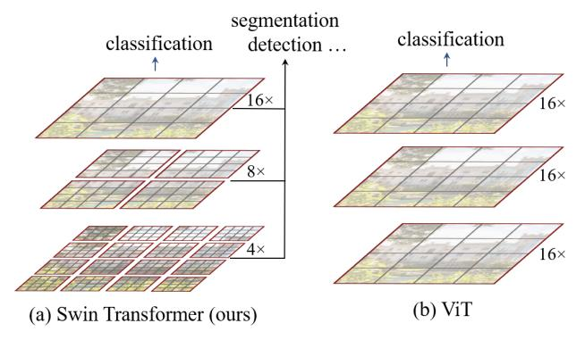
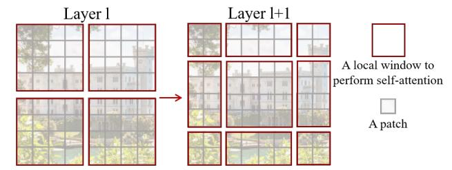
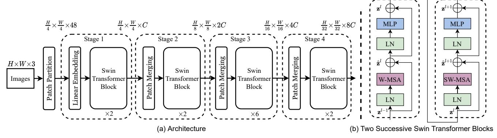
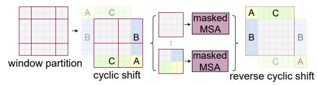

# Swin Transformer: Hierarchical Vision Transformer using Shifted Windows

Ze Liu1,2†\* Yutong Lin1,3†\* Yue Cao1\* Han Hu1\*‡ Yixuan Wei1,4†
Zheng Zhang1 Stephen Lin1 Baining Guo1

1Microsoft Research Asia 2University of Science and Technology of China
3Xian Jiaotong University 4Tsinghua University

 $\{ v-zeliu1, v-yutlin, yuecao, hanhu, v-yixwe, zhez, stevelin, bainguo \} \\ @microsoft.com$ 

### **Abstract**

This paper presents a new vision Transformer, called Swin Transformer, that capably serves as a general-purpose backbone for computer vision. Challenges in adapting Transformer from language to vision arise from differences between the two domains, such as large variations in the scale of visual entities and the high resolution of pixels in images compared to words in text. To address these differences, we propose a hierarchical Transformer whose representation is computed with Shifted windows. The shifted windowing scheme brings greater efficiency by limiting self-attention computation to non-overlapping local windows while also allowing for cross-window connection. This hierarchical architecture has the flexibility to model at various scales and has linear computational complexity with respect to image size. These qualities of Swin Transformer make it compatible with a broad range of vision tasks, including image classification (87.3 top-1 accuracy on ImageNet-1K) and dense prediction tasks such as object detection (58.7 box AP and 51.1 mask AP on COCO testdev) and semantic segmentation (53.5 mIoU on ADE20K val). Its performance surpasses the previous state-of-theart by a large margin of +2.7 box AP and +2.6 mask AP on COCO, and +3.2 mIoU on ADE20K, demonstrating the potential of Transformer-based models as vision backbones. The hierarchical design and the shifted window approach also prove beneficial for all-MLP architectures. The code and models are publicly available at https://github. com/microsoft/Swin-Transformer.

# 1. Introduction

Modeling in computer vision has long been dominated by convolutional neural networks (CNNs). Beginning with AlexNet [35] and its revolutionary performance on the ImageNet image classification challenge, CNN architec-

Figure 1. (a) The proposed Swin Transformer builds hierarchical feature maps by merging image patches (shown in gray) in deeper layers and has linear computation complexity to input image size due to computation of self-attention only within each local window (shown in red). It can thus serve as a general-purpose backbone for both image classification and dense recognition tasks. (b) In contrast, previous vision Transformers [19] produce feature maps of a single low resolution and have quadratic computation complexity to input image size due to computation of self-attention globally.

tures have evolved to become increasingly powerful through greater scale [27, 69], more extensive connections [31], and more sophisticated forms of convolution [64, 17, 75]. With CNNs serving as backbone networks for a variety of vision tasks, these architectural advances have led to performance improvements that have broadly lifted the entire field.

On the other hand, the evolution of network architectures in natural language processing (NLP) has taken a different path, where the prevalent architecture today is instead the Transformer [58]. Designed for sequence modeling and transduction tasks, the Transformer is notable for its use of attention to model long-range dependencies in the data. Its tremendous success in the language domain has led researchers to investigate its adaptation to computer vision, where it has recently demonstrated promising results on certain tasks, specifically image classification [19] and joint vision-language modeling [43].

\*Equal contribution. †Interns at MSRA. ‡Contact person.

In this paper, we seek to expand the applicability of Transformer such that it can serve as a general-purpose backbone for computer vision, as it does for NLP and as CNNs do in vision. We observe that significant challenges in transferring its high performance in the language domain to the visual domain can be explained by differences between the two modalities. One of these differences involves scale. Unlike the word tokens that serve as the basic elements of processing in language Transformers, visual elements can vary substantially in scale, a problem that receives attention in tasks such as object detection [38, 49, 50]. In existing Transformer-based models [58, 19], tokens are all of a fixed scale, a property unsuitable for these vision applications. Another difference is the much higher resolution of pixels in images compared to words in passages of text. There exist many vision tasks such as semantic segmentation that require dense prediction at the pixel level, and this would be intractable for Transformer on high-resolution images, as the computational complexity of its self-attention is quadratic to image size. To overcome these issues, we propose a generalpurpose Transformer backbone, called Swin Transformer, which constructs hierarchical feature maps and has linear computational complexity to image size. As illustrated in Figure 1(a), Swin Transformer constructs a hierarchical representation by starting from small-sized patches (outlined in gray) and gradually merging neighboring patches in deeper Transformer layers. With these hierarchical feature maps, the Swin Transformer model can conveniently leverage advanced techniques for dense prediction such as feature pyramid networks (FPN) [38] or U-Net [47]. The linear computational complexity is achieved by computing self-attention locally within non-overlapping windows that partition an image (outlined in red). The number of patches in each window is fixed, and thus the complexity becomes linear to image size. These merits make Swin Transformer suitable as a general-purpose backbone for various vision tasks, in contrast to previous Transformer based architectures [19] which produce feature maps of a single resolution and have quadratic complexity.

A key design element of Swin Transformer is its *shift* of the window partition between consecutive self-attention layers, as illustrated in Figure 2. The shifted windows bridge the windows of the preceding layer, providing connections among them that significantly enhance modeling power (see Table 4). This strategy is also efficient in regards to real-world latency: all *query* patches within a window share the same *key* set1, which facilitates memory access in hardware. In contrast, earlier *sliding window* based self-attention approaches [30, 46] suffer from low latency on general hardware due to different *key* sets for different

Figure 2. An illustration of the *shifted window* approach for computing self-attention in the proposed Swin Transformer architecture. In layer l (left), a regular window partitioning scheme is adopted, and self-attention is computed within each window. In the next layer l+1 (right), the window partitioning is shifted, resulting in new windows. The self-attention computation in the new windows crosses the boundaries of the previous windows in layer l, providing connections among them.

query pixels2. Our experiments show that the proposed shifted window approach has much lower latency than the sliding window method, yet is similar in modeling power (see Tables 5 and 6). The shifted window approach also proves beneficial for all-MLP architectures [56].

The proposed Swin Transformer achieves strong performance on the recognition tasks of image classification, object detection and semantic segmentation. It outperforms the ViT / DeiT [19, 57] and ResNe(X)t models [27, 64] significantly with similar latency on the three tasks. Its 58.7 box AP and 51.1 mask AP on the COCO test-dev set surpass the previous state-of-the-art results by +2.7 box AP (Copy-paste [23] without external data) and +2.6 mask AP (DetectoRS [42]). On ADE20K semantic segmentation, it obtains 53.5 mIoU on the val set, an improvement of +3.2 mIoU over the previous state-of-the-art (SETR [73]). It also achieves a top-1 accuracy of 87.3% on ImageNet-1K image classification.

It is our belief that a unified architecture across computer vision and natural language processing could benefit both fields, since it would facilitate joint modeling of visual and textual signals and the modeling knowledge from both domains can be more deeply shared. We hope that Swin Transformer's strong performance on various vision problems can drive this belief deeper in the community and encourage unified modeling of vision and language signals.

# 2. Related Work

**CNN and variants** CNNs serve as the standard network model throughout computer vision. While the CNN has existed for several decades [36], it was not until the introduction of AlexNet [35] that the CNN took off and became mainstream. Since then, deeper and more effective con-

&lt;sup>1The *query* and *key* are projection vectors in a self-attention layer.

&lt;sup>2While there are efficient methods to implement a sliding-window based convolution layer on general hardware, thanks to its shared kernel weights across a feature map, it is difficult for a sliding-window based self-attention layer to have efficient memory access in practice.

volutional neural architectures have been proposed to further propel the deep learning wave in computer vision, e.g., VGG [48], GoogleNet [53], ResNet [27], DenseNet [31], HRNet [59], and EfficientNet [54]. In addition to these architectural advances, there has also been much work on improving individual convolution layers, such as depthwise convolution [64] and deformable convolution [17, 75]. While the CNN and its variants are still the primary backbone architectures for computer vision applications, we highlight the strong potential of Transformer-like architectures for unified modeling between vision and language. Our work achieves strong performance on several basic visual recognition tasks, and we hope it will contribute to a modeling shift.

Self-attention based backbone architectures Also inspired by the success of self-attention layers and Transformer architectures in the NLP field, some works employ self-attention layers to replace some or all of the spatial convolution layers in the popular ResNet [30, 46, 72]. In these works, the self-attention is computed within a local window of each pixel to expedite optimization [30], and they achieve slightly better accuracy/FLOPs trade-offs than the counterpart ResNet architecture. However, their costly memory access causes their actual latency to be significantly larger than that of the convolutional networks [30]. Instead of using sliding windows, we propose to *shift* windows between consecutive layers, which allows for a more efficient implementation in general hardware.

Self-attention/Transformers to complement CNNs Another line of work is to augment a standard CNN architecture with self-attention layers or Transformers. The self-attention layers can complement backbones [61, 7, 3, 65, 21, 68, 51] or head networks [29, 24] by providing the capability to encode distant dependencies or heterogeneous interactions. More recently, the encoder-decoder design in Transformer has been applied for the object detection and instance segmentation tasks [8, 13, 76, 52]. Our work explores the adaptation of Transformers for basic visual feature extraction and is complementary to these works.

**Transformer based vision backbones** Most related to our work is the Vision Transformer (ViT) [19] and its follow-ups [57, 66, 15, 25, 60]. The pioneering work of ViT directly applies a Transformer architecture on non-overlapping medium-sized image patches for image classification. It achieves an impressive speed-accuracy trade-off on image classification compared to convolutional networks. While ViT requires large-scale training datasets (i.e., JFT-300M) to perform well, DeiT [57] introduces several training strategies that allow ViT to also be effective using the smaller ImageNet-1K dataset. The results of ViT

on image classification are encouraging, but its architecture is unsuitable for use as a general-purpose backbone network on dense vision tasks or when the input image resolution is high, due to its low-resolution feature maps and the quadratic increase in complexity with image size. There are a few works applying ViT models to the dense vision tasks of object detection and semantic segmentation by direct upsampling or deconvolution but with relatively lower performance [2, 73]. Concurrent to our work are some that modify the ViT architecture [66, 15, 25] for better image classification. Empirically, we find our Swin Transformer architecture to achieve the best speedaccuracy trade-off among these methods on image classification, even though our work focuses on general-purpose performance rather than specifically on classification. Another concurrent work [60] explores a similar line of thinking to build multi-resolution feature maps on Transformers. Its complexity is still quadratic to image size, while ours is linear and also operates locally which has proven beneficial in modeling the high correlation in visual signals [32, 22, 37]. Our approach is both efficient and effective, achieving state-of-the-art accuracy on both COCO object detection and ADE20K semantic segmentation.

### 3. Method

### 3.1. Overall Architecture

An overview of the Swin Transformer architecture is presented in Figure 3, which illustrates the tiny version (Swin-T). It first splits an input RGB image into non-overlapping patches by a patch splitting module, like ViT. Each patch is treated as a "token" and its feature is set as a concatenation of the raw pixel RGB values. In our implementation, we use a patch size of  $4\times 4$  and thus the feature dimension of each patch is  $4\times 4\times 3=48$ . A linear embedding layer is applied on this raw-valued feature to project it to an arbitrary dimension (denoted as C).

Several Transformer blocks with modified self-attention computation (*Swin Transformer blocks*) are applied on these patch tokens. The Transformer blocks maintain the number of tokens ( $\frac{H}{4} \times \frac{W}{4}$ ), and together with the linear embedding are referred to as "Stage 1".

To produce a hierarchical representation, the number of tokens is reduced by patch merging layers as the network gets deeper. The first patch merging layer concatenates the features of each group of  $2\times 2$  neighboring patches, and applies a linear layer on the 4C-dimensional concatenated features. This reduces the number of tokens by a multiple of  $2\times 2=4$  ( $2\times$  downsampling of resolution), and the output dimension is set to 2C. Swin Transformer blocks are applied afterwards for feature transformation, with the resolution kept at  $\frac{H}{8}\times \frac{W}{8}$ . This first block of patch merging and feature transformation is denoted as "Stage 2". The pro-

Figure 3. (a) The architecture of a Swin Transformer (Swin-T); (b) two successive Swin Transformer Blocks (notation presented with Eq. (3)). W-MSA and SW-MSA are multi-head self attention modules with regular and shifted windowing configurations, respectively.

cedure is repeated twice, as "Stage 3" and "Stage 4", with output resolutions of  $\frac{H}{16} \times \frac{W}{16}$  and  $\frac{H}{32} \times \frac{W}{32}$ , respectively. These stages jointly produce a hierarchical representation, with the same feature map resolutions as those of typical convolutional networks, e.g., VGG [48] and ResNet [27]. As a result, the proposed architecture can conveniently replace the backbone networks in existing methods for various vision tasks.

**Swin Transformer block** Swin Transformer is built by replacing the standard multi-head self attention (MSA) module in a Transformer block by a module based on shifted windows (described in Section 3.2), with other layers kept the same. As illustrated in Figure 3(b), a Swin Transformer block consists of a shifted window based MSA module, followed by a 2-layer MLP with GELU nonlinearity in between. A LayerNorm (LN) layer is applied before each MSA module and each MLP, and a residual connection is applied after each module.

### 3.2. Shifted Window based Self-Attention

The standard Transformer architecture [58] and its adaptation for image classification [19] both conduct global self-attention, where the relationships between a token and all other tokens are computed. The global computation leads to quadratic complexity with respect to the number of tokens, making it unsuitable for many vision problems requiring an immense set of tokens for dense prediction or to represent a high-resolution image.

**Self-attention in non-overlapped windows** For efficient modeling, we propose to compute self-attention within local windows. The windows are arranged to evenly partition the image in a non-overlapping manner. Supposing each window contains  $M \times M$  patches, the computational complexity of a global MSA module and a window based one

on an image of  $h \times w$  patches are3:

$$\Omega(MSA) = 4hwC^2 + 2(hw)^2C, \tag{1}$$

$$\Omega(W-MSA) = 4hwC^2 + 2M^2hwC, \qquad (2)$$

where the former is quadratic to patch number hw, and the latter is linear when M is fixed (set to 7 by default). Global self-attention computation is generally unaffordable for a large hw, while the window based self-attention is scalable.

Shifted window partitioning in successive blocks The window-based self-attention module lacks connections across windows, which limits its modeling power. To introduce cross-window connections while maintaining the efficient computation of non-overlapping windows, we propose a shifted window partitioning approach which alternates between two partitioning configurations in consecutive Swin Transformer blocks.

As illustrated in Figure 2, the first module uses a regular window partitioning strategy which starts from the top-left pixel, and the  $8\times 8$  feature map is evenly partitioned into  $2\times 2$  windows of size  $4\times 4$  (M=4). Then, the next module adopts a windowing configuration that is shifted from that of the preceding layer, by displacing the windows by  $\left(\left\lfloor \frac{M}{2}\right\rfloor, \left\lfloor \frac{M}{2}\right\rfloor\right)$  pixels from the regularly partitioned windows.

With the shifted window partitioning approach, consecutive Swin Transformer blocks are computed as

$$\begin{split} \hat{\mathbf{z}}^{l} &= \text{W-MSA}\left(\text{LN}\left(\mathbf{z}^{l-1}\right)\right) + \mathbf{z}^{l-1}, \\ \mathbf{z}^{l} &= \text{MLP}\left(\text{LN}\left(\hat{\mathbf{z}}^{l}\right)\right) + \hat{\mathbf{z}}^{l}, \\ \hat{\mathbf{z}}^{l+1} &= \text{SW-MSA}\left(\text{LN}\left(\mathbf{z}^{l}\right)\right) + \mathbf{z}^{l}, \\ \mathbf{z}^{l+1} &= \text{MLP}\left(\text{LN}\left(\hat{\mathbf{z}}^{l+1}\right)\right) + \hat{\mathbf{z}}^{l+1}, \end{split} \tag{3}$$

where  $\hat{\mathbf{z}}^l$  and  $\mathbf{z}^l$  denote the output features of the (S)W-MSA module and the MLP module for block l, respectively;

&lt;sup>3We omit SoftMax computation in determining complexity.

Figure 4. Illustration of an efficient batch computation approach for self-attention in shifted window partitioning.

W-MSA and SW-MSA denote window based multi-head self-attention using regular and shifted window partitioning configurations, respectively.

The shifted window partitioning approach introduces connections between neighboring non-overlapping windows in the previous layer and is found to be effective in image classification, object detection, and semantic segmentation, as shown in Table 4.

#### Efficient batch computation for shifted configuration

An issue with shifted window partitioning is that it will result in more windows, from  $\lceil \frac{h}{M} \rceil \times \lceil \frac{w}{M} \rceil$  to  $(\lceil \frac{h}{M} \rceil + 1) \times$  $(\lceil \frac{w}{M} \rceil + 1)$  in the shifted configuration, and some of the windows will be smaller than  $M \times M^4$ . A naive solution is to pad the smaller windows to a size of  $M \times M$  and mask out the padded values when computing attention. When the number of windows in regular partitioning is small, e.g.  $2 \times 2$ , the increased computation with this naive solution is considerable  $(2 \times 2 \rightarrow 3 \times 3)$ , which is 2.25 times greater). Here, we propose a more efficient batch computation approach by cyclic-shifting toward the top-left direction, as illustrated in Figure 4. After this shift, a batched window may be composed of several sub-windows that are not adjacent in the feature map, so a masking mechanism is employed to limit self-attention computation to within each sub-window. With the cyclic-shift, the number of batched windows remains the same as that of regular window partitioning, and thus is also efficient. The low latency of this approach is shown in Table 5.

**Relative position bias** In computing self-attention, we follow [45, 1, 29, 30] by including a relative position bias  $B \in \mathbb{R}^{M^2 \times M^2}$  to each head in computing similarity:

$$Attention(Q, K, V) = SoftMax(QK^{T}/\sqrt{d} + B)V, \quad (4)$$

where  $Q,K,V\in\mathbb{R}^{M^2\times d}$  are the *query, key* and *value* matrices; d is the *query/key* dimension, and  $M^2$  is the number of patches in a window. Since the relative position along each axis lies in the range [-M+1,M-1], we parameterize a smaller-sized bias matrix  $\hat{B}\in\mathbb{R}^{(2M-1)\times(2M-1)}$ , and values in B are taken from  $\hat{B}$ .

We observe significant improvements over counterparts without this bias term or that use absolute position embedding, as shown in Table 4. Further adding absolute position embedding to the input as in [19] drops performance slightly, thus it is not adopted in our implementation.

The learnt relative position bias in pre-training can be also used to initialize a model for fine-tuning with a different window size through bi-cubic interpolation [19, 57].

# 3.3. Architecture Variants

We build our base model, called Swin-B, to have of model size and computation complexity similar to ViT-B/DeiT-B. We also introduce Swin-T, Swin-S and Swin-L, which are versions of about  $0.25\times, 0.5\times$  and  $2\times$  the model size and computational complexity, respectively. Note that the complexity of Swin-T and Swin-S are similar to those of ResNet-50 (DeiT-S) and ResNet-101, respectively. The window size is set to M=7 by default. The query dimension of each head is d=32, and the expansion layer of each MLP is  $\alpha=4$ , for all experiments. The architecture hyper-parameters of these model variants are:

- Swin-T: C = 96, layer numbers =  $\{2, 2, 6, 2\}$
- Swin-S: C = 96, layer numbers =  $\{2, 2, 18, 2\}$
- Swin-B: C = 128, layer numbers =  $\{2, 2, 18, 2\}$
- Swin-L: C = 192, layer numbers =  $\{2, 2, 18, 2\}$

where C is the channel number of the hidden layers in the first stage. The model size, theoretical computational complexity (FLOPs), and throughput of the model variants for ImageNet image classification are listed in Table 1.

# 4. Experiments

We conduct experiments on ImageNet-1K image classification [18], COCO object detection [39], and ADE20K semantic segmentation [74]. In the following, we first compare the proposed Swin Transformer architecture with the previous state-of-the-arts on the three tasks. Then, we ablate the important design elements of Swin Transformer.

### 4.1. Image Classification on ImageNet-1K

**Settings** For image classification, we benchmark the proposed Swin Transformer on ImageNet-1K [18], which contains 1.28M training images and 50K validation images from 1,000 classes. The top-1 accuracy on a single crop is reported. We consider two training settings:

 Regular ImageNet-1K training. This setting mostly follows [57]. We employ an AdamW [33] optimizer for 300 epochs using a cosine decay learning rate scheduler and 20 epochs of linear warm-up. A batch size of 1024, an initial learning rate of 0.001, and a

 $^4$ To make the window size (M,M) divisible by the feature map size of (h,w), bottom-right padding is employed on the feature map if needed.

weight decay of 0.05 are used. We include most of the augmentation and regularization strategies of [57] in training, except for repeated augmentation [28] and EMA [41], which do not enhance performance. Note that this is contrary to [57] where repeated augmentation is crucial to stabilize the training of ViT.

• Pre-training on ImageNet-22K and fine-tuning on ImageNet-1K. We also pre-train on the ImageNet-22K dataset, which contains 14.2 million images and 22K classes. We employ an AdamW optimizer for 90 epochs using a cosine learning rate scheduler with a 5-epoch linear warm-up. A batch size of 4096, an initial learning rate of 0.001, and a weight decay of 0.01 are used. In ImageNet-1K fine-tuning, we train for 30 epochs with a batch size of 1024, a constant learning rate of 10-5, and a weight decay of 10-8.

**Results with regular ImageNet-1K training** Table 1(a) presents comparisons to other backbones, including both Transformer-based and ConvNet-based, using regular ImageNet-1K training.

Compared to the previous state-of-the-art Transformer-based architecture, i.e. DeiT [57], Swin Transformers noticeably surpass the counterpart DeiT architectures with similar complexities: +1.5% for Swin-T (81.3%) over DeiT-S (79.8%) using 2242 input, and +1.5%/1.4% for Swin-B (83.3%/84.5%) over DeiT-B (81.8%/83.1%) using 2242/3842 input, respectively.

Compared with the state-of-the-art ConvNets, i.e. Reg-Net [44], the Swin Transformer achieves a slightly better speed-accuracy trade-off. Noting that while RegNet [44] are obtained via a thorough architecture search, the Swin Transformer is manually adapted from a standard Transformer and has potential for further improvement.

Results with ImageNet-22K pre-training We also pretrain the larger-capacity Swin-B and Swin-L on ImageNet-22K. Results fine-tuned on ImageNet-1K image classification are shown in Table 1(b). For Swin-B, the ImageNet-22K pre-training brings 1.8%~1.9% gains over training on ImageNet-1K from scratch. Compared with the previous best results for ImageNet-22K pre-training, our models achieve significantly better speed-accuracy trade-offs: Swin-B obtains 86.4% top-1 accuracy, which is 2.4% higher than that of ViT with similar inference throughput (84.7 vs. 85.9 images/sec) and slightly lower FLOPs (47.0G vs. 55.4G). The larger Swin-L model achieves 87.3% top-1 accuracy, +0.9% better than that of the Swin-B model.

### 4.2. Object Detection on COCO

**Settings** Object detection and instance segmentation experiments are conducted on COCO 2017, which contains

| (a) Regular ImageNet-1K trained models |                  |           |        |             |            |  |  |  |
|----------------------------------------|------------------|-----------|--------|-------------|------------|--|--|--|
| method                                 | image            | #param.   | EI ODa | throughput  | ImageNet   |  |  |  |
| memod                                  | size             | #paraiii. | FLOFS  | (image / s) | top-1 acc. |  |  |  |
| RegNetY-4G [44]                        | $224^{2}$        | 21M       | 4.0G   | 1156.7      | 80.0       |  |  |  |
| RegNetY-8G [44]                        | $224^{2}$        | 39M       | 8.0G   | 591.6       | 81.7       |  |  |  |
| RegNetY-16G [44]                       | $224^{2}$        | 84M       | 16.0G  | 334.7       | 82.9       |  |  |  |
| ViT-B/16 [19]                          | 384 2 | 86M       | 55.4G  | 85.9        | 77.9       |  |  |  |
| ViT-L/16 [19]                          | $384^{2}$        | 307M      | 190.7G | 27.3        | 76.5       |  |  |  |
| DeiT-S [57]                            | $224^{2}$        | 22M       | 4.6G   | 940.4       | 79.8       |  |  |  |
| DeiT-B [57]                            | $224^{2}$        | 86M       | 17.5G  | 292.3       | 81.8       |  |  |  |
| DeiT-B [57]                            | 384 2 | 86M       | 55.4G  | 85.9        | 83.1       |  |  |  |
| Swin-T                                 | $224^{2}$        | 29M       | 4.5G   | 755.2       | 81.3       |  |  |  |
| Swin-S                                 | $224^{2}$        | 50M       | 8.7G   | 436.9       | 83.0       |  |  |  |
| Swin-B                                 | $224^{2}$        | 88M       | 15.4G  | 278.1       | 83.5       |  |  |  |
| Swin-B                                 | $384^{2}$        | 88M       | 47.0G  | 84.7        | 84.5       |  |  |  |
| (b) ImageNet 22K pre trained models    |                  |           |        |             |            |  |  |  |

| (b) ImageNet-22K pre-trained models |              |         |         |             |            |  |  |  |
|-------------------------------------|--------------|---------|---------|-------------|------------|--|--|--|
| method                              | image        | #param. | FI OPs  | throughput  | ImageNet   |  |  |  |
| method                              | size "param. |         | 1 LOI 3 | (image / s) | top-1 acc. |  |  |  |
| R-101x3 [34]                        | $384^{2}$    | 388M    | 204.6G  | -           | 84.4       |  |  |  |
| R-152x4 [34]                        | $480^{2}$    | 937M    | 840.5G  | -           | 85.4       |  |  |  |
| ViT-B/16 [19]                       | $384^{2}$    | 86M     | 55.4G   | 85.9        | 84.0       |  |  |  |
| ViT-L/16 [19]                       | $384^{2}$    | 307M    | 190.7G  | 27.3        | 85.2       |  |  |  |
| Swin-B                              | $224^{2}$    | 88M     | 15.4G   | 278.1       | 85.2       |  |  |  |
| Swin-B                              | $384^{2}$    | 88M     | 47.0G   | 84.7        | 86.4       |  |  |  |
| Swin-L                              | $384^{2}$    | 197M    | 103.9G  | 42.1        | 87.3       |  |  |  |

Table 1. Comparison of different backbones on ImageNet-1K classification. Throughput is measured using the GitHub repository of [62] and a V100 GPU, following [57].

118K training, 5K validation and 20K test-dev images. An ablation study is performed using the validation set, and a system-level comparison is reported on test-dev. For the ablation study, we consider four typical object detection frameworks: Cascade Mask R-CNN [26, 6], ATSS [71], RepPoints v2 [12], and Sparse RCNN [52] in mmdetection [10]. For these four frameworks, we utilize the same settings: multi-scale training [8, 52] (resizing the input such that the shorter side is between 480 and 800 while the longer side is at most 1333), AdamW [40] optimizer (initial learning rate of 0.0001, weight decay of 0.05, and batch size of 16), and 3x schedule (36 epochs). For system-level comparison, we adopt an improved HTC [9] (denoted as HTC++) with instaboost [20], stronger multi-scale training [7], 6x schedule (72 epochs), soft-NMS [5], and ImageNet-22K pre-trained model as initialization.

We compare our Swin Transformer to standard ConvNets, i.e. ResNe(X)t, and previous Transformer networks, e.g. DeiT. The comparisons are conducted by changing only the backbones with other settings unchanged. Note that while Swin Transformer and ResNe(X)t are directly applicable to all the above frameworks because of their hierarchical feature maps, DeiT only produces a single resolution of feature maps and cannot be directly applied. For fair comparison, we follow [73] to construct hierarchical feature maps for DeiT using deconvolution layers.

| (a) Various frameworks |          |                   |                 |                  |         |       |      |  |  |
|------------------------|----------|-------------------|-----------------|------------------|---------|-------|------|--|--|
| Method                 | Backbone | AP box | $AP_{50}^{box}$ | AP 75 | #param. | FLOPs | FPS  |  |  |
| Cascade                | R-50     | 46.3              | 64.3            | 50.5             | 82M     | 739G  | 18.0 |  |  |
| Mask R-CNN             | Swin-T   | 50.5              | 69.3            | 54.9             | 86M     | 745G  | 15.3 |  |  |
| ATSS                   | R-50     | 43.5              | 61.9            | 47.0             | 32M     | 205G  | 28.3 |  |  |
| AISS                   | Swin-T   | 47.2              | 66.5            | 51.3             | 36M     | 215G  | 22.3 |  |  |
| Dam Dainta V/2         | R-50     | 46.5              | 64.6            | 50.3             | 42M     | 274G  | 13.6 |  |  |
| RepPointsV2            | Swin-T   | 50.0              | 68.5            | 54.2             | 45M     | 283G  | 12.0 |  |  |
| Sparse                 | R-50     | 44.5              | 63.4            | 48.2             | 106M    | 166G  | 21.0 |  |  |
| R-CNN                  | Swin-T   | 47.9              | 67.3            | 52.3             | 110M    | 172G  | 18.4 |  |  |

| (b) Various backbones w. Cascade Mask R-CNN |                   |                  |                 |                    |                                  |                     |       |      |      |
|---------------------------------------------|-------------------|------------------|-----------------|--------------------|----------------------------------|---------------------|-------|------|------|
|                                             | AP box | AP 50 | $AP_{75}^{box}$ | AP mask | AP 50 mask | AP 75 AP | param | FLOP | FPS  |
| DeiT-S †                         | 48.0              | 67.2             | 51.7            | 41.4               | 64.2                             | 44.3                | 80M   | 889G | 10.4 |
| R50                                         | 46.3              | 64.3             | 50.5            | 40.1               | 61.7                             | 43.4                | 82M   | 739G | 18.0 |
| Swin-T                                      | 50.5              | 69.3             | 54.9            | 43.7               | 66.6                             | 47.1                | 86M   | 745G | 15.3 |
| X101-32                                     | 48.1              | 66.5             | 52.4            | 41.6               | 63.9                             | 45.2                | 101M  | 819G | 12.8 |
| Swin-S                                      | 51.8              | 70.4             | 56.3            | 44.7               | 67.9                             | 48.5                | 107M  | 838G | 12.0 |
| X101-64                                     | 48.3              | 66.4             | 52.3            | 41.7               | 64.0                             | 45.1                | 140M  | 972G | 10.4 |
| Swin-B                                      | 51.9              | 70.9             | 56.5            | 45.0               | 68.4                             | 48.7                | 145M  | 982G | 11.6 |

| (c) System-level Comparison |      |                              |      |                             |         |       |  |  |  |
|-----------------------------|------|------------------------------|------|-----------------------------|---------|-------|--|--|--|
| Method                      |      | ii-val AP mask |      | t-dev AP mask | #param. | FLOPs |  |  |  |
| RepPointsV2* [12]           | -    | -                            | 52.1 | -                           | -       | -     |  |  |  |
| GCNet* [7]                  | 51.8 | 44.7                         | 52.3 | 45.4                        | -       | 1041G |  |  |  |
| RelationNet++* [13]         | -    | -                            | 52.7 | -                           | -       | -     |  |  |  |
| DetectoRS* [42]             | -    | -                            | 55.7 | 48.5                        | -       | -     |  |  |  |
| YOLOv4 P7* [4]              | -    | -                            | 55.8 | -                           | -       | -     |  |  |  |
| Copy-paste [23]             | 55.9 | 47.2                         | 56.0 | 47.4                        | 185M    | 1440G |  |  |  |
| X101-64 (HTC++)             | 52.3 | 46.0                         | -    | -                           | 155M    | 1033G |  |  |  |
| Swin-B (HTC++)              | 56.4 | 49.1                         | -    | -                           | 160M    | 1043G |  |  |  |
| Swin-L (HTC++)              | 57.1 | 49.5                         | 57.7 | 50.2                        | 284M    | 1470G |  |  |  |
| Swin-L (HTC++)*             | 58.0 | 50.4                         | 58.7 | 51.1                        | 284M    | _     |  |  |  |

Table 2. Results on COCO object detection and instance segmentation. †denotes that additional decovolution layers are used to produce hierarchical feature maps. \* indicates multi-scale testing.

Comparison to ResNe(X)t Table 2(a) lists the results of Swin-T and ResNet-50 on the four object detection frameworks. Our Swin-T architecture brings consistent +3.4~4.2 box AP gains over ResNet-50, with slightly larger model size, FLOPs and latency.

Table 2(b) compares Swin Transformer and ResNe(X)t under different model capacity using Cascade Mask R-CNN. Swin Transformer achieves a high detection accuracy of 51.9 box AP and 45.0 mask AP, which are significant gains of +3.6 box AP and +3.3 mask AP over ResNeXt101-64x4d, which has similar model size, FLOPs and latency. On a higher baseline of 52.3 box AP and 46.0 mask AP using an improved HTC framework, the gains by Swin Transformer are also high, at +4.1 box AP and +3.1 mask AP (see Table 2(c)). Regarding inference speed, while ResNe(X)t is built by highly optimized Cudnn functions, our architecture is implemented with built-in PyTorch functions that are not all well-optimized. A thorough kernel optimization is beyond the scope of this paper.

| ADE           | 20K                  | val  | test  | #param. | EI ODa | EDC  |
|---------------|----------------------|------|-------|---------|--------|------|
| Method        | Backbone             | mIoU | score | #param. | FLOFS  | LLO  |
| DLab.v3+ [11] | ResNet-101           | 44.1 | -     | 63M     | 1021G  | 16.0 |
| DNL [65]      | ResNet-101           | 46.0 | 56.2  | 69M     | 1249G  | 14.8 |
| OCRNet [67]   | ResNet-101           | 45.3 | 56.0  | 56M     | 923G   | 19.3 |
| UperNet [63]  | ResNet-101           | 44.9 | -     | 86M     | 1029G  | 20.1 |
| OCRNet [67]   | HRNet-w48            | 45.7 | -     | 71M     | 664G   | 12.5 |
| DLab.v3+ [11] | ResNeSt-101          | 46.9 | 55.1  | 66M     | 1051G  | 11.9 |
| DLab.v3+ [11] | ResNeSt-200          | 48.4 | -     | 88M     | 1381G  | 8.1  |
| SETR [73]     | T-Large ‡ | 50.3 | 61.7  | 308M    | -      | -    |
| UperNet       | DeiT-S †  | 44.0 | -     | 52M     | 1099G  | 16.2 |
| UperNet       | Swin-T               | 46.1 | -     | 60M     | 945G   | 18.5 |
| UperNet       | Swin-S               | 49.3 | -     | 81M     | 1038G  | 15.2 |
| UperNet       | Swin-B ‡  | 51.6 | -     | 121M    | 1841G  | 8.7  |
| UperNet       | Swin-L ‡  | 53.5 | 62.8  | 234M    | 3230G  | 6.2  |

Table 3. Results of semantic segmentation on the ADE20K val and test set. † indicates additional deconvolution layers are used to produce hierarchical feature maps. ‡ indicates that the model is pre-trained on ImageNet-22K.

Comparison to DeiT The performance of DeiT-S using the Cascade Mask R-CNN framework is shown in Table 2(b). The results of Swin-T are +2.5 box AP and +2.3 mask AP higher than DeiT-S with similar model size (86M vs. 80M) and significantly higher inference speed (15.3 FPS vs. 10.4 FPS). The lower inference speed of DeiT is mainly due to its quadratic complexity to input image size.

Comparison to previous state-of-the-art Table 2(c) compares our best results with those of previous state-of-the-art models. Our best model achieves 58.7 box AP and 51.1 mask AP on COCO test-dev, surpassing the previous best results by +2.7 box AP (Copy-paste [23] without external data) and +2.6 mask AP (DetectoRS [42]).

# 4.3. Semantic Segmentation on ADE20K

**Settings** ADE20K [74] is a widely-used semantic segmentation dataset, covering a broad range of 150 semantic categories. It has 25K images in total, with 20K for training, 2K for validation, and another 3K for testing. We utilize UperNet [63] in mmseg [16] as our base framework for its high efficiency. More details are presented in the Appendix.

**Results** Table 3 lists the mIoU, model size (#param), FLOPs and FPS for different method/backbone pairs. From these results, it can be seen that Swin-S is +5.3 mIoU higher (49.3 vs. 44.0) than DeiT-S with similar computation cost. It is also +4.4 mIoU higher than ResNet-101, and +2.4 mIoU higher than ResNet-101 [70]. Our Swin-L model with ImageNet-22K pre-training achieves 53.5 mIoU on the val set, surpassing the previous best model by +3.2 mIoU (50.3 mIoU by SETR [73] which has a larger model size).

|                    | ImageNet |       |       | )CO                | ADE20k |
|--------------------|----------|-------|-------|--------------------|--------|
|                    | top-1    | top-5 | APbox | AP mask | mIoU   |
| w/o shifting       | 80.2     | 95.1  | 47.7  | 41.5               | 43.3   |
| shifted windows    | 81.3     | 95.6  | 50.5  | 43.7               | 46.1   |
| no pos.            | 80.1     | 94.9  | 49.2  | 42.6               | 43.8   |
| abs. pos.          | 80.5     | 95.2  | 49.0  | 42.4               | 43.2   |
| abs.+rel. pos.     | 81.3     | 95.6  | 50.2  | 43.4               | 44.0   |
| rel. pos. w/o app. | 79.3     | 94.7  | 48.2  | 41.9               | 44.1   |
| rel. pos.          | 81.3     | 95.6  | 50.5  | 43.7               | 46.1   |

Table 4. Ablation study on the *shifted windows* approach and different position embedding methods on three benchmarks, using the Swin-T architecture. w/o shifting: all self-attention modules adopt regular window partitioning, without *shifting*; abs. pos.: absolute position embedding term of ViT; rel. pos.: the default settings with an additional relative position bias term (see Eq. (4)); app.: the first scaled dot-product term in Eq. (4).

# 4.4. Ablation Study

In this section, we ablate important design elements in the proposed Swin Transformer, using ImageNet-1K image classification, Cascade Mask R-CNN on COCO object detection, and UperNet on ADE20K semantic segmentation.

**Shifted windows** Ablations of the *shifted window* approach on the three tasks are reported in Table 4. Swin-T with the shifted window partitioning outperforms the counterpart built on a single window partitioning at each stage by +1.1% top-1 accuracy on ImageNet-1K, +2.8 box AP/+2.2 mask AP on COCO, and +2.8 mIoU on ADE20K. The results indicate the effectiveness of using shifted windows to build connections among windows in the preceding layers. The latency overhead by *shifted window* is also small, as shown in Table 5.

Relative position bias Table 4 shows comparisons of different position embedding approaches. Swin-T with relative position bias yields +1.2%/+0.8% top-1 accuracy on ImageNet-1K, +1.3/+1.5 box AP and +1.1/+1.3 mask AP on COCO, and +2.3/+2.9 mIoU on ADE20K in relation to those without position encoding and with absolute position embedding, respectively, indicating the effectiveness of the relative position bias. Also note that while the inclusion of absolute position embedding improves image classification accuracy (+0.4%), it harms object detection and semantic segmentation (-0.2 box/mask AP on COCO and -0.6 mIoU on ADE20K).

**Different self-attention methods** The real speed of different self-attention computation methods and implementations are compared in Table 5. Our cyclic implementation is more hardware efficient than naive padding, particularly for deeper stages. Overall, it brings a 13%, 18% and 18% speed-up on Swin-T, Swin-S and Swin-B, respectively.

| method                   | MSA   | Arch. (FPS) |            |     |     |     |     |
|--------------------------|-------|-------------|------------|-----|-----|-----|-----|
| memod                    | S1    | S2          | <b>S</b> 3 | S4  | T   | S   | В   |
| sliding window (naive)   | 122.5 | 38.3        | 12.1       | 7.6 | 183 | 109 | 77  |
| sliding window (kernel)  | 7.6   | 4.7         | 2.7        | 1.8 | 488 | 283 | 187 |
| Performer [14]           | 4.8   | 2.8         | 1.8        | 1.5 | 638 | 370 | 241 |
| window (w/o shifting)    | 2.8   | 1.7         | 1.2        | 0.9 | 770 | 444 | 280 |
| shifted window (padding) | 3.3   | 2.3         | 1.9        | 2.2 | 670 | 371 | 236 |
| shifted window (cyclic)  | 3.0   | 1.9         | 1.3        | 1.0 | 755 | 437 | 278 |

Table 5. Real speed of different self-attention computation methods and implementations on a V100 GPU.

|                |          |       |       | CC                |                       | ADE20k |
|----------------|----------|-------|-------|-------------------|-----------------------|--------|
|                | Backbone | top-1 | top-5 | AP box | $AP^{\text{mask}} \\$ | mIoU   |
| sliding window | Swin-T   | 81.4  | 95.6  | 50.2              | 43.5                  | 45.8   |
| Performer [14] | Swin-T   | 79.0  | 94.2  | -                 | -                     | -      |
| shifted window | Swin-T   | 81.3  | 95.6  | 50.5              | 43.7                  | 46.1   |

Table 6. Accuracy of Swin Transformer using different methods for self-attention computation on three benchmarks.

The self-attention modules built on the proposed shifted window approach are  $40.8 \times /2.5 \times$ ,  $20.2 \times /2.5 \times$ ,  $9.3 \times /2.1 \times$ , and  $7.6 \times /1.8 \times$  more efficient than those of sliding windows in naive/kernel implementations on four network stages, respectively. Overall, the Swin Transformer architectures built on shifted windows are 4.1/1.5, 4.0/1.5, 3.6/1.5 times faster than variants built on sliding windows for Swin-T, Swin-S, and Swin-B, respectively. Table 6 compares their accuracy on the three tasks, showing that they are similarly accurate in visual modeling.

Compared to Performer [14], which is one of the fastest Transformer architectures (see [55]), the proposed *shifted window* based self-attention computation and the overall Swin Transformer architectures are slightly faster (see Table 5), while achieving +2.3% top-1 accuracy compared to Performer on ImageNet-1K using Swin-T (see Table 6).

### 5. Conclusion

This paper presents Swin Transformer, a new vision Transformer which produces a hierarchical feature representation and has linear computational complexity with respect to input image size. Swin Transformer achieves the state-of-the-art performance on COCO object detection and ADE20K semantic segmentation, significantly surpassing previous best methods. We hope that Swin Transformer's strong performance on various vision problems will encourage unified modeling of vision and language signals.

# Acknowledgement

We thank Li Dong and Furu Wei for useful discussions; Bin Xiao, Lu Yuan and Lei Zhang for help on datasets; Jiarui Xu for help on the mmdetection and mmsegmentation codebases.

### References

- [1] Hangbo Bao, Li Dong, Furu Wei, Wenhui Wang, Nan Yang, Xiaodong Liu, Yu Wang, Jianfeng Gao, Songhao Piao, Ming Zhou, et al. Unilmv2: Pseudo-masked language models for unified language model pre-training. In *International Con*ference on Machine Learning, pages 642–652. PMLR, 2020.
- [2] Josh Beal, Eric Kim, Eric Tzeng, Dong Huk Park, Andrew Zhai, and Dmitry Kislyuk. Toward transformer-based object detection. arXiv preprint arXiv:2012.09958, 2020. 3
- [3] Irwan Bello, Barret Zoph, Ashish Vaswani, Jonathon Shlens, and Quoc V. Le. Attention augmented convolutional networks, 2020. 3
- [4] Alexey Bochkovskiy, Chien-Yao Wang, and Hong-Yuan Mark Liao. Yolov4: Optimal speed and accuracy of object detection. arXiv preprint arXiv:2004.10934, 2020. 7
- [5] Navaneeth Bodla, Bharat Singh, Rama Chellappa, and Larry S. Davis. Soft-nms – improving object detection with one line of code. In *Proceedings of the IEEE International Conference on Computer Vision (ICCV)*, Oct 2017. 6
- [6] Zhaowei Cai and Nuno Vasconcelos. Cascade r-cnn: Delving into high quality object detection. In *Proceedings of the IEEE Conference on Computer Vision and Pattern Recognition*, pages 6154–6162, 2018. 6
- [7] Yue Cao, Jiarui Xu, Stephen Lin, Fangyun Wei, and Han Hu. Gcnet: Non-local networks meet squeeze-excitation networks and beyond. In *Proceedings of the IEEE/CVF Inter*national Conference on Computer Vision (ICCV) Workshops, Oct 2019. 3, 6, 7
- [8] Nicolas Carion, Francisco Massa, Gabriel Synnaeve, Nicolas Usunier, Alexander Kirillov, and Sergey Zagoruyko. End-toend object detection with transformers. In *European Confer*ence on Computer Vision, pages 213–229. Springer, 2020. 3,
- [9] Kai Chen, Jiangmiao Pang, Jiaqi Wang, Yu Xiong, Xiaoxiao Li, Shuyang Sun, Wansen Feng, Ziwei Liu, Jianping Shi, Wanli Ouyang, et al. Hybrid task cascade for instance segmentation. In Proceedings of the IEEE/CVF Conference on Computer Vision and Pattern Recognition, pages 4974–4983, 2019. 6
- [10] Kai Chen, Jiaqi Wang, Jiangmiao Pang, Yuhang Cao, Yu Xiong, Xiaoxiao Li, Shuyang Sun, Wansen Feng, Ziwei Liu, Jiarui Xu, et al. Mmdetection: Open mmlab detection toolbox and benchmark. arXiv preprint arXiv:1906.07155, 2019.
- [11] Liang-Chieh Chen, Yukun Zhu, George Papandreou, Florian Schroff, and Hartwig Adam. Encoder-decoder with atrous separable convolution for semantic image segmentation. In *Proceedings of the European conference on computer vision* (ECCV), pages 801–818, 2018. 7
- [12] Yihong Chen, Zheng Zhang, Yue Cao, Liwei Wang, Stephen Lin, and Han Hu. Reppoints v2: Verification meets regression for object detection. In *NeurIPS*, 2020. 6, 7
- [13] Cheng Chi, Fangyun Wei, and Han Hu. Relationnet++: Bridging visual representations for object detection via transformer decoder. In *NeurIPS*, 2020. 3, 7

- [14] Krzysztof Marcin Choromanski, Valerii Likhosherstov, David Dohan, Xingyou Song, Andreea Gane, Tamas Sarlos, Peter Hawkins, Jared Quincy Davis, Afroz Mohiuddin, Lukasz Kaiser, David Benjamin Belanger, Lucy J Colwell, and Adrian Weller. Rethinking attention with performers. In *International Conference on Learning Representations*, 2021. 8
- [15] Xiangxiang Chu, Bo Zhang, Zhi Tian, Xiaolin Wei, and Huaxia Xia. Do we really need explicit position encodings for vision transformers? arXiv preprint arXiv:2102.10882, 2021. 3
- [16] MMSegmentation Contributors. MMSegmentation:
  Openmmlab semantic segmentation toolbox and benchmark. https://github.com/open-mmlab/mmsegmentation, 2020. 7
- [17] Jifeng Dai, Haozhi Qi, Yuwen Xiong, Yi Li, Guodong Zhang, Han Hu, and Yichen Wei. Deformable convolutional networks. In *Proceedings of the IEEE International Conference on Computer Vision*, pages 764–773, 2017. 1, 3
- [18] Jia Deng, Wei Dong, Richard Socher, Li-Jia Li, Kai Li, and Li Fei-Fei. Imagenet: A large-scale hierarchical image database. In 2009 IEEE conference on computer vision and pattern recognition, pages 248–255. Ieee, 2009. 5
- [19] Alexey Dosovitskiy, Lucas Beyer, Alexander Kolesnikov, Dirk Weissenborn, Xiaohua Zhai, Thomas Unterthiner, Mostafa Dehghani, Matthias Minderer, Georg Heigold, Sylvain Gelly, Jakob Uszkoreit, and Neil Houlsby. An image is worth 16x16 words: Transformers for image recognition at scale. In *International Conference on Learning Representa*tions, 2021. 1, 2, 3, 4, 5, 6
- [20] Hao-Shu Fang, Jianhua Sun, Runzhong Wang, Minghao Gou, Yong-Lu Li, and Cewu Lu. Instaboost: Boosting instance segmentation via probability map guided copypasting. In *Proceedings of the IEEE/CVF International Conference on Computer Vision*, pages 682–691, 2019. 6
- [21] Jun Fu, Jing Liu, Haijie Tian, Yong Li, Yongjun Bao, Zhi-wei Fang, and Hanqing Lu. Dual attention network for scene segmentation. In *Proceedings of the IEEE Conference on Computer Vision and Pattern Recognition*, pages 3146–3154, 2019. 3
- [22] Kunihiko Fukushima. Cognitron: A self-organizing multilayered neural network. *Biological cybernetics*, 20(3):121– 136, 1975. 3
- [23] Golnaz Ghiasi, Yin Cui, Aravind Srinivas, Rui Qian, Tsung-Yi Lin, Ekin D Cubuk, Quoc V Le, and Barret Zoph. Simple copy-paste is a strong data augmentation method for instance segmentation. arXiv preprint arXiv:2012.07177, 2020. 2, 7
- [24] Jiayuan Gu, Han Hu, Liwei Wang, Yichen Wei, and Jifeng Dai. Learning region features for object detection. In Proceedings of the European Conference on Computer Vision (ECCV), 2018. 3
- [25] Kai Han, An Xiao, Enhua Wu, Jianyuan Guo, Chunjing Xu, and Yunhe Wang. Transformer in transformer. arXiv preprint arXiv:2103.00112, 2021. 3
- [26] Kaiming He, Georgia Gkioxari, Piotr Dollár, and Ross Girshick. Mask r-cnn. In *Proceedings of the IEEE international conference on computer vision*, pages 2961–2969, 2017. 6

- [27] Kaiming He, Xiangyu Zhang, Shaoqing Ren, and Jian Sun. Deep residual learning for image recognition. In *Proceedings of the IEEE conference on computer vision and pattern recognition*, pages 770–778, 2016. 1, 2, 3, 4
- [28] Elad Hoffer, Tal Ben-Nun, Itay Hubara, Niv Giladi, Torsten Hoefler, and Daniel Soudry. Augment your batch: Improving generalization through instance repetition. In *Proceedings of* the IEEE/CVF Conference on Computer Vision and Pattern Recognition, pages 8129–8138, 2020. 6
- [29] Han Hu, Jiayuan Gu, Zheng Zhang, Jifeng Dai, and Yichen Wei. Relation networks for object detection. In *Proceedings of the IEEE Conference on Computer Vision and Pattern Recognition*, pages 3588–3597, 2018. 3, 5
- [30] Han Hu, Zheng Zhang, Zhenda Xie, and Stephen Lin. Local relation networks for image recognition. In *Proceedings of the IEEE/CVF International Conference on Computer Vision (ICCV)*, pages 3464–3473, October 2019. 2, 3, 5
- [31] Gao Huang, Zhuang Liu, Laurens Van Der Maaten, and Kilian Q Weinberger. Densely connected convolutional networks. In *Proceedings of the IEEE conference on computer vision and pattern recognition*, pages 4700–4708, 2017. 1, 3
- [32] David H Hubel and Torsten N Wiesel. Receptive fields, binocular interaction and functional architecture in the cat's visual cortex. *The Journal of physiology*, 160(1):106–154, 1962. 3
- [33] Diederik P Kingma and Jimmy Ba. Adam: A method for stochastic optimization. arXiv preprint arXiv:1412.6980, 2014. 5
- [34] Alexander Kolesnikov, Lucas Beyer, Xiaohua Zhai, Joan Puigcerver, Jessica Yung, Sylvain Gelly, and Neil Houlsby. Big transfer (bit): General visual representation learning. *arXiv preprint arXiv:1912.11370*, 6(2):8, 2019. 6
- [35] Alex Krizhevsky, Ilya Sutskever, and Geoffrey E Hinton. Imagenet classification with deep convolutional neural networks. In *Advances in neural information processing systems*, pages 1097–1105, 2012. 1, 2
- [36] Yann LeCun, Léon Bottou, Yoshua Bengio, Patrick Haffner, et al. Gradient-based learning applied to document recognition. *Proceedings of the IEEE*, 86(11):2278–2324, 1998.
- [37] Yann LeCun, Patrick Haffner, Léon Bottou, and Yoshua Bengio. Object recognition with gradient-based learning. In Shape, contour and grouping in computer vision, pages 319–345. Springer, 1999. 3
- [38] Tsung-Yi Lin, Piotr Dollar, Ross Girshick, Kaiming He, Bharath Hariharan, and Serge Belongie. Feature pyramid networks for object detection. In *The IEEE Conference* on Computer Vision and Pattern Recognition (CVPR), July 2017. 2
- [39] Tsung-Yi Lin, Michael Maire, Serge Belongie, James Hays, Pietro Perona, Deva Ramanan, Piotr Dollár, and C Lawrence Zitnick. Microsoft coco: Common objects in context. In European conference on computer vision, pages 740–755. Springer, 2014. 5
- [40] Ilya Loshchilov and Frank Hutter. Decoupled weight decay regularization. In *International Conference on Learning Representations*, 2019. 6

- [41] Boris T Polyak and Anatoli B Juditsky. Acceleration of stochastic approximation by averaging. *SIAM journal on control and optimization*, 30(4):838–855, 1992. 6
- [42] Siyuan Qiao, Liang-Chieh Chen, and Alan Yuille. Detectors: Detecting objects with recursive feature pyramid and switchable atrous convolution. arXiv preprint arXiv:2006.02334, 2020. 2, 7
- [43] Alec Radford, Jong Wook Kim, Chris Hallacy, Aditya Ramesh, Gabriel Goh, Sandhini Agarwal, Girish Sastry, Amanda Askell, Pamela Mishkin, Jack Clark, Gretchen Krueger, and Ilya Sutskever. Learning transferable visual models from natural language supervision, 2021. 1
- [44] Ilija Radosavovic, Raj Prateek Kosaraju, Ross Girshick, Kaiming He, and Piotr Dollár. Designing network design spaces. In Proceedings of the IEEE/CVF Conference on Computer Vision and Pattern Recognition, pages 10428– 10436, 2020. 6
- [45] Colin Raffel, Noam Shazeer, Adam Roberts, Katherine Lee, Sharan Narang, Michael Matena, Yanqi Zhou, Wei Li, and Peter J. Liu. Exploring the limits of transfer learning with a unified text-to-text transformer. *Journal of Machine Learn*ing Research, 21(140):1–67, 2020. 5
- [46] Prajit Ramachandran, Niki Parmar, Ashish Vaswani, Irwan Bello, Anselm Levskaya, and Jon Shlens. Stand-alone selfattention in vision models. In *Advances in Neural Informa*tion Processing Systems, volume 32. Curran Associates, Inc., 2019. 2, 3
- [47] Olaf Ronneberger, Philipp Fischer, and Thomas Brox. Unet: Convolutional networks for biomedical image segmentation. In *International Conference on Medical image computing and computer-assisted intervention*, pages 234–241. Springer, 2015. 2
- [48] K. Simonyan and A. Zisserman. Very deep convolutional networks for large-scale image recognition. In *International Conference on Learning Representations*, May 2015. 3, 4
- [49] Bharat Singh and Larry S Davis. An analysis of scale invariance in object detection snip. In *Proceedings of the IEEE conference on computer vision and pattern recogni*tion, pages 3578–3587, 2018. 2
- [50] Bharat Singh, Mahyar Najibi, and Larry S Davis. Sniper: Efficient multi-scale training. In Advances in Neural Information Processing Systems, volume 31. Curran Associates, Inc., 2018. 2
- [51] Aravind Srinivas, Tsung-Yi Lin, Niki Parmar, Jonathon Shlens, Pieter Abbeel, and Ashish Vaswani. Bottleneck transformers for visual recognition. arXiv preprint arXiv:2101.11605, 2021. 3
- [52] Peize Sun, Rufeng Zhang, Yi Jiang, Tao Kong, Chenfeng Xu, Wei Zhan, Masayoshi Tomizuka, Lei Li, Zehuan Yuan, Changhu Wang, et al. Sparse r-cnn: End-to-end object detection with learnable proposals. *arXiv preprint arXiv:2011.12450*, 2020. 3, 6
- [53] Christian Szegedy, Wei Liu, Yangqing Jia, Pierre Sermanet, Scott Reed, Dragomir Anguelov, Dumitru Erhan, Vincent Vanhoucke, and Andrew Rabinovich. Going deeper with convolutions. In *Proceedings of the IEEE conference on* computer vision and pattern recognition, pages 1–9, 2015.

- [54] Mingxing Tan and Quoc Le. Efficientnet: Rethinking model scaling for convolutional neural networks. In *International Conference on Machine Learning*, pages 6105–6114. PMLR, 2019. 3
- [55] Yi Tay, Mostafa Dehghani, Samira Abnar, Yikang Shen, Dara Bahri, Philip Pham, Jinfeng Rao, Liu Yang, Sebastian Ruder, and Donald Metzler. Long range arena: A benchmark for efficient transformers. In *International Conference* on Learning Representations, 2021. 8
- [56] Ilya Tolstikhin, Neil Houlsby, Alexander Kolesnikov, Lucas Beyer, Xiaohua Zhai, Thomas Unterthiner, Jessica Yung, Andreas Steiner, Daniel Keysers, Jakob Uszkoreit, Mario Lucic, and Alexey Dosovitskiy. Mlp-mixer: An all-mlp architecture for vision, 2021. 2
- [57] Hugo Touvron, Matthieu Cord, Matthijs Douze, Francisco Massa, Alexandre Sablayrolles, and Hervé Jégou. Training data-efficient image transformers & distillation through attention. arXiv preprint arXiv:2012.12877, 2020. 2, 3, 5, 6
- [58] Ashish Vaswani, Noam Shazeer, Niki Parmar, Jakob Uszkoreit, Llion Jones, Aidan N Gomez, Łukasz Kaiser, and Illia Polosukhin. Attention is all you need. In Advances in Neural Information Processing Systems, pages 5998–6008, 2017. 1, 2, 4
- [59] Jingdong Wang, Ke Sun, Tianheng Cheng, Borui Jiang, Chaorui Deng, Yang Zhao, Dong Liu, Yadong Mu, Mingkui Tan, Xinggang Wang, et al. Deep high-resolution representation learning for visual recognition. *IEEE transactions on* pattern analysis and machine intelligence, 2020. 3
- [60] Wenhai Wang, Enze Xie, Xiang Li, Deng-Ping Fan, Kaitao Song, Ding Liang, Tong Lu, Ping Luo, and Ling Shao. Pyramid vision transformer: A versatile backbone for dense prediction without convolutions. arXiv preprint arXiv:2102.12122, 2021. 3
- [61] Xiaolong Wang, Ross Girshick, Abhinav Gupta, and Kaiming He. Non-local neural networks. In *IEEE Conference on Computer Vision and Pattern Recognition, CVPR 2018*, 2018.
- [62] Ross Wightman. Pytorch image models. https://github.com/rwightman/ pytorch-image-models, 2019. 6
- [63] Tete Xiao, Yingcheng Liu, Bolei Zhou, Yuning Jiang, and Jian Sun. Unified perceptual parsing for scene understanding. In *Proceedings of the European Conference on Com*puter Vision (ECCV), pages 418–434, 2018. 7
- [64] Saining Xie, Ross Girshick, Piotr Dollár, Zhuowen Tu, and Kaiming He. Aggregated residual transformations for deep neural networks. In *Proceedings of the IEEE Conference* on Computer Vision and Pattern Recognition, pages 1492– 1500, 2017. 1, 2, 3
- [65] Minghao Yin, Zhuliang Yao, Yue Cao, Xiu Li, Zheng Zhang, Stephen Lin, and Han Hu. Disentangled non-local neural networks. In *Proceedings of the European conference on computer vision (ECCV)*, 2020. 3, 7
- [66] Li Yuan, Yunpeng Chen, Tao Wang, Weihao Yu, Yujun Shi, Francis EH Tay, Jiashi Feng, and Shuicheng Yan. Tokensto-token vit: Training vision transformers from scratch on imagenet. arXiv preprint arXiv:2101.11986, 2021. 3

- [67] Yuhui Yuan, Xilin Chen, and Jingdong Wang. Object-contextual representations for semantic segmentation. In 16th European Conference Computer Vision (ECCV 2020), August 2020. 7
- [68] Yuhui Yuan and Jingdong Wang. Ocnet: Object context network for scene parsing. arXiv preprint arXiv:1809.00916, 2018. 3
- [69] Sergey Zagoruyko and Nikos Komodakis. Wide residual networks. In BMVC, 2016. 1
- [70] Hang Zhang, Chongruo Wu, Zhongyue Zhang, Yi Zhu, Zhi Zhang, Haibin Lin, Yue Sun, Tong He, Jonas Mueller, R Manmatha, et al. Resnest: Split-attention networks. arXiv preprint arXiv:2004.08955, 2020. 7
- [71] Shifeng Zhang, Cheng Chi, Yongqiang Yao, Zhen Lei, and Stan Z Li. Bridging the gap between anchor-based and anchor-free detection via adaptive training sample selection. In *Proceedings of the IEEE/CVF Conference on Computer* Vision and Pattern Recognition, pages 9759–9768, 2020. 6
- [72] Hengshuang Zhao, Jiaya Jia, and Vladlen Koltun. Exploring self-attention for image recognition. In *Proceedings of the IEEE/CVF Conference on Computer Vision and Pattern Recognition*, pages 10076–10085, 2020. 3
- [73] Sixiao Zheng, Jiachen Lu, Hengshuang Zhao, Xiatian Zhu, Zekun Luo, Yabiao Wang, Yanwei Fu, Jianfeng Feng, Tao Xiang, Philip HS Torr, et al. Rethinking semantic segmentation from a sequence-to-sequence perspective with transformers. arXiv preprint arXiv:2012.15840, 2020. 2, 3, 6, 7
- [74] Bolei Zhou, Hang Zhao, Xavier Puig, Tete Xiao, Sanja Fidler, Adela Barriuso, and Antonio Torralba. Semantic understanding of scenes through the ade20k dataset. *International Journal on Computer Vision*, 2018. 5, 7
- [75] Xizhou Zhu, Han Hu, Stephen Lin, and Jifeng Dai. Deformable convnets v2: More deformable, better results. In Proceedings of the IEEE Conference on Computer Vision and Pattern Recognition, pages 9308–9316, 2019. 1, 3
- [76] Xizhou Zhu, Weijie Su, Lewei Lu, Bin Li, Xiaogang Wang, and Jifeng Dai. Deformable {detr}: Deformable transformers for end-to-end object detection. In *International Conference on Learning Representations*, 2021. 3