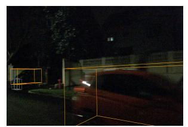
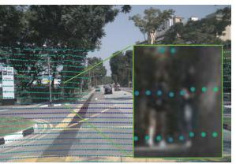
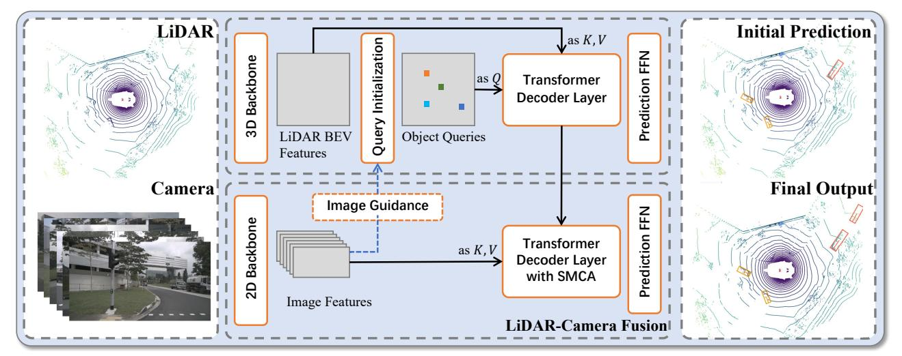
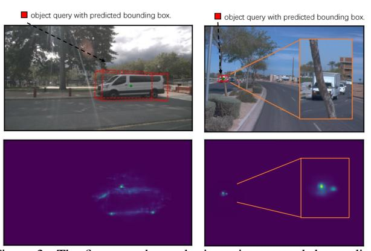
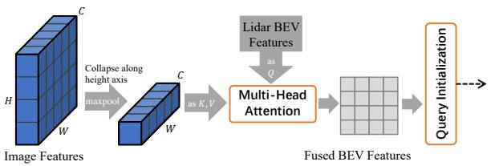
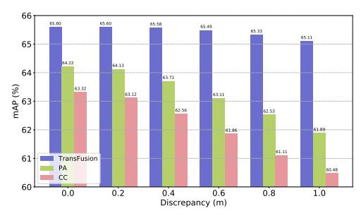

## TransFusion: Robust LiDAR-Camera Fusion for 3D Object Detection with Transformers

Xuyang Bai1 Zeyu Hu1 Xinge Zhu2 Qingqiu Huang2 Yilun Chen2 Hongbo Fu3 Chiew-Lan Tai1 Hong Kong University of Science and Technology 2ADS, IAS BU, Huawei 3City University of Hong Kong

## **Abstract**

LiDAR and camera are two important sensors for 3D object detection in autonomous driving. Despite the increasing popularity of sensor fusion in this field, the robustness against inferior image conditions, e.g., bad illumination and sensor misalignment, is under-explored. Existing fusion methods are easily affected by such conditions, mainly due to a hard association of LiDAR points and image pixels, established by calibration matrices.

We propose TransFusion, a robust solution to LiDARcamera fusion with a soft-association mechanism to handle inferior image conditions. Specifically, our TransFusion consists of convolutional backbones and a detection head based on a transformer decoder. The first layer of the decoder predicts initial bounding boxes from a LiDAR point cloud using a sparse set of object queries, and its second decoder layer adaptively fuses the object queries with useful image features, leveraging both spatial and contextual relationships. The attention mechanism of the transformer enables our model to adaptively determine where and what information should be taken from the image, leading to a robust and effective fusion strategy. We additionally design an image-guided query initialization strategy to deal with objects that are difficult to detect in point clouds. TransFusion achieves state-of-the-art performance on large-scale datasets. We provide extensive experiments to demonstrate its robustness against degenerated image quality and calibration errors. We also extend the proposed method to the 3D tracking task and achieve the 1st place in the leaderboard of nuScenes tracking, showing its effectiveness and generalization capability. [code release]

#### 1. Introduction

As one of the fundamental tasks in self-driving, 3D object detection aims to localize a set of objects in 3D space and recognize their categories. Thanks to the accurate depth information provided by LiDAR, early works such as VoxelNet [67] and PointPillar [14] achieve reasonably good results using only point clouds as input. However, these LiDAR-only methods are generally surpassed by the methods using both LiDAR and camera data on large-scale

datasets with sparser point clouds, such as nuScenes [1] and Waymo [42]. LiDAR-only methods are surely insufficient for robust 3D detection due to the sparsity of point clouds. For example, small or distant objects are difficult to detect in LiDAR modality. In contrast, such objects are still clearly visible and distinguishable in high-resolution images. The complementary roles of point clouds and images motivate researchers to design detectors utilizing the best of the two worlds, i.e., multi-modal detectors.

Existing LiDAR-camera fusion methods roughly fall into three categories: result-level, proposal-level, and pointlevel. The result-level methods, including FPointNet [29] and RoarNet [39], use off-the-shelf 2D detectors to seed 3D proposals, followed by a PointNet [30] for object localization. The proposal-level fusion methods, including MV3D [5] and AVOD [12], perform fusion at the region proposal level by applying RoIPool [31] in each modality for shared proposals. These coarse-grained fusion methods show unsatisfactory results since rectangular regions of interest (RoI) usually contain lots of background noise. Recently, a majority of approaches have tried to do pointlevel fusion and achieved promising results. They first find a hard association between LiDAR points and image pixels based on calibration matrices, and then augment LiDAR features with the segmentation scores [46, 51] or CNN features [10, 22, 40, 47, 62] of the associated pixels through point-wise concatenation. Similarly, [16, 17, 50, 59] first project a point cloud onto the bird's eye view (BEV) plane and then fuse the image features with the BEV pixels.

Despite the impressive improvements, these point-level fusion methods suffer from two major problems, as shown in Fig. 1. First, they simply fuse the LiDAR features and image features through element-wise addition or concatenation, and thus their performance degrades seriously with low-quality image features, e.g., images in bad illumination conditions. Second, finding the hard association between sparse LiDAR points and dense image pixels not only wastes many image features with rich semantic information, but also heavily relies on high-quality calibration between two sensors, which is usually hard to acquire due to the inherent spatial-temporal misalignment [63].

To address the shortcomings of the previous fusion approaches, we introduce an effective and robust multi-modal

Figure 1. Left: An example of bad illumination conditions. Right: Due to the sparsity of point clouds, the hard-association based fusion methods waste many image features and are sensitive to sensor calibration, since the projected points may fall outside objects due to a small calibration error.

detection framework in this paper. Our key idea is to reposition the focus of the fusion process, from hard-association to soft-association, leading to the robustness against degenerated image quality and sensor misalignment.

Specifically, we design a sequential fusion method that uses two transformer decoder layers as the detection head. To our best knowledge, we are the first to use transformer for LiDAR-camera 3D detection. Our first decoder layer leverages a sparse set of object queries to produce initial bounding boxes from LiDAR features. Unlike inputindependent object queries in 2D [2, 44], we make the object queries input-dependent and category-aware so that the queries are enriched with better position and category information. Next, the second transformer decoder layer adaptively fuses object queries with useful image features associated by spatial and contextual relationships. We leverage a locality inductive bias by spatially constraining the cross attention around the initial bounding boxes to help the network better visit the related positions. Our fusion module not only provides rich semantic information to object queries, but also is more robust to inferior image conditions since the association between LiDAR points and image pixels are established in a soft and adaptive way. Finally, to handle objects that are difficult to detect in point clouds, we introduce an image-guided query initialization module to involve image guidance on the query initialization stage. Overall, the corporation of these components significantly improves the effectiveness and robustness of our LiDARcamera 3D detector. To summarize, our contributions are fourfold:

- 1. Our studies investigate the inherent difficulties of LiDAR-camera fusion and reveal a crucial aspect to robust fusion, namely, the soft-association mechanism.
- 2. We propose a novel transformer-based LiDAR-camera fusion model for 3D detection, which performs fine-grained fusion in an attentive manner and shows superior robustness against degenerated image quality and sensor misalignment.
- 3. We introduce several simple yet effective adjustments for object queries to boost the quality of initial bounding box predictions for image fusion. An imageguided query initialization module is also designed to handle objects that are hard to detect in point clouds.

4. We achieve the state-of-the-art 3D detection performance on nuScenes and competitive results on Waymo. We also extend our model to the 3D tracking task and achieve the 1st place in the leaderboard of the nuScenes tracking challenge.

#### 2. Related Work

**LiDAR-only 3D Detection** aims to predict 3D bounding boxes of objects in given point clouds [3, 4, 27, 28, 38, 46, 53, 66, 68, 69]. Due to the unordered, irregular nature of point clouds, many 3D detectors first project them onto a regular grid such as 3D voxels [52,67], pillars [14] or range images [8, 43]. After that, standard 2D or 3D convolutions are used to compute the features in the BEV plane, where objects are naturally separated, with their physical sizes preserved. Other works [36, 37, 54, 55] directly operate on raw point clouds without quantization. The mainstream of 3D detection head is based on anchor boxes [14, 67] following the 2D counterparts, while [48,57] adopt a center-based representation for 3D objects, largely simplifying the 3D detection pipeline. Despite the popularity of adopting the transformer architecture as a detection head in 2D [2], 3D detection models for outdoor scenarios mostly utilize the transformer for feature extraction [21, 24, 35]. However, the attention operation in each transformer layer requires a computation complexity of  $\mathcal{O}(N^2)$  for N points, requiring a carefully designed memory reduction operation when handling LiDAR point clouds with millions of points per frame. In contrast, our model retains an efficient convolution backbone for feature extraction and leverages a transformer decoder with a small set of object queries as the detection head, making the computation cost manageable. The concurrent works [19, 20, 23] adopt transformer as a detection head but focus on indoor scenarios and extending these methods to outdoor scenes is non-trivial.

LiDAR-Camera 3D Detection has gained increasing attention due to the complementary roles of point clouds and images. Early works [5, 29, 39] adopt result-level or proposallevel fusion, where the fusion granularity is too coarse to release the full potential of two modalities. Since Point-Painting [46] was proposed, the point-level fusion methods [10,40,47] have shown great advantages and promising results. However, such methods are easily affected by the sensor misalignment due to the hard association between points and pixels established by calibration matrices. Moreover, the simple point-wise concatenation ignores the quality of real data and contextual relationships between two modalities, and thus leads to degraded performance when the image features are defective. In our work, we explore a more robust and effective fusion mechanism to mitigate these limitations during LiDAR-camera fusion.

Figure 2. Overall pipeline of TransFusion. Our model relies on standard 3D and 2D backbones to extract LiDAR BEV feature map and image feature map. Our detection head consists of two transformer decoder layers sequentially: (1) The first layer produces initial 3D bounding boxes using a sparse set of object queries, initialized in a input-dependent and category-aware manner. (2) The second layer attentively associates and fuses the object queries (with initial predictions) from the first stage with the image features, producing rich texture and color cues for better detection results. A spatially modulated cross attention (SMCA) mechanism is introduced to involve a locality inductive bias and help the network better attend to the related image regions. We additionally propose an image-guided query initialization strategy to involve image guidance on LiDAR BEV. This strategy helps produce object queries that are difficult to detect in the sparse LiDAR point clouds.

## 3. Methodology

In this section, we present the proposed method TransFusion for LiDAR-camera 3D object detection. As shown in Fig. 2, given a LiDAR BEV feature map and an image feature map from convolutional backbones, our transformer-based detection head first decodes object queries into initial bounding box predictions using the LiDAR information, and then performs LiDAR-camera fusion by attentively fusing object queries with useful image features. Below we will first provide the preliminary knowledge about a transformer architecture for detection and then present the detail of TransFusion.

## 3.1. Preliminary: Transformer for 2D Detection

Transformer [45] has been widely used for 2D object detection [9,44,56,70] since DETR [2] was proposed. DETR uses a CNN backbone to extract image features and a transformer architecture to convert a small set of learned embeddings (called object queries) into a set of predictions. The follow-up works [44,56,70] further equip the object queries with positional information 1. The final predictions of boxes are the relative offsets w.r.t. the query positions to reduce optimization difficulty. We refer readers to the original papers [2,70] for more details. In our work, each object query contains a query position providing the localization of the object and a query feature encoding instance information, such as the box's size, orientation, etc.

#### 3.2. Query Initialization

**Input-dependent.** The query positions in the seminal works [2, 44, 70] are randomly generated or learned as network parameters, regardless of the input data. Such input-independent query positions will take extra stages (decoder layers) for their models [2, 70] to learn the moving process towards the real object centers. Recently, it has been observed in 2D object detection [56] that with a better initialization of object queries, the gap between 1-layer structure and 6-layer structure could be bridged. Inspired by this observation, we propose an input-dependent initialization strategy based on a center heatmap to achieve competitive performance using only one decoder layer.

Specifically, given a d dimensional LiDAR BEV feature map  $F_L \in \mathbb{R}^{X \times Y \times d}$ , we first predict a class-specific heatmap  $\hat{S} \in \mathbb{R}^{X \times Y \times K}$ , where  $X \times Y$  describes the size of the BEV feature map and K is the number of categories. Then we regard the heatmap as  $X \times Y \times K$  object candidates and select the top-N candidates for all the categories as our initial object queries. To avoid spatially too closed queries, following [65], we select the local maximum elements as our object queries, whose values are greater than or equal to their 8-connected neighbors. Otherwise, a large number of queries are needed to cover the BEV plane. The positions and features of the selected candidates are used to initialize the query positions and query features. In this way, our initial object queries will locate at or close to the potential object centers, eliminating the need of multiple decoder layers [20, 23, 49] to refine the locations.

Category-aware. Unlike their 2D projections on the image

&lt;sup>1Slightly different concepts might be introduced, e.g., reference points in Deformable-DETR [70] and proposal boxes in Sparse-RCNN [44].

plane, the objects on the BEV plane are all in absolute scale and has small scale variance among the same categories. To leverage such properties for better multi-class detection, we make the object queries category-aware by equipping each query with a category embedding. Specifically, using the category of each selected candidate (e.g.  $\hat{S}_{ijk}$  belonging to the k-th category), we element-wisely sum the query feature with a category embedding produced by linearly projecting the one-hot category vector into a  $\mathbb{R}^d$  vector. The category embedding brings benefits in two aspects: on the one hand, it serves as a useful side information when modelling the object-object relations in the self-attention modules and the object-context relations in the cross-attention modules. On the other hand, during prediction, it could deliver valuable prior knowledge of the object, making the network focus on intra-category variance and thus benefiting the property prediction.

#### 3.3. Transformer Decoder and FFN

The decoder layer follows the design of DETR [23] and the detailed architecture is provided in the supplementary Sec. ??. The cross attention between object queries and the feature maps (either from point clouds or images) aggregates relevant context onto the object candidates, while the self attention between object queries reasons pairwise relations between different object candidates. The query positions are embedded into d-dimensional positional encoding with a Multilayer Perceptron (MLP), and elementwisely summed with the query features. This enables the network to reason about both context and position jointly.

The N object queries containing rich instance information are then independently decoded into boxes and class labels by a feed-forward network (FFN). Following Center-Point [57], our FFN predicts the center offset from the query position as  $\delta x, \delta y$ , bounding box height as z, size l, w, h as  $\log(l), \log(w), \log(h),$  yaw angle  $\alpha$  as  $\sin(\alpha), \cos(\alpha)$  and the velocity (if available) as  $v_x, v_y$ . We also predict a perclass probability  $\hat{p} \in [0,1]^K$  for K semantic classes. Each attribute is computed by a separate two-layer  $1 \times 1$  convolution. By decoding each object query into prediction in parallel, we get a set of predictions  $\{\hat{b}_t, \hat{p}_t\}_t^N$  as output, where  $\hat{b}_t$  is the predicted bounding box for the *i*-th query. Following [23], we adopt the auxiliary decoding mechanism, which adds FFN and supervision after each decoder layer. Hence, we can have initial bounding box predictions from the first decoder layer. We leverage such initial predictions in the LiDAR-camera fusion module to constrain the cross attention, as explained in the next section.

# 3.4. LiDAR-Camera Fusion

**Image Feature Fetching.** Although impressive improvement has been brought by point-level fusion methods [46, 47], their fusion quality is largely limited by the sparsity of

Figure 3. The first row shows the input images and the predictions of object queries projected on the images, and the second row shows the cross-attention maps. Our fusion strategy is able to dynamically choose relevant image pixels and is not limited by the number of LiDAR points. The two images are picked from nuScenes and Waymo, respectively.

LiDAR points. When an object only contains a small number of LiDAR points, it can fetch only the same number of image features, wasting the rich semantic information of high-resolution images. To mitigate this issue, we do not fetch the multiview image features based on the hard association between LiDAR points and image pixels. Instead, we retain all the image features  $F_C \in \mathbb{R}^{N_v \times H \times W \times d}$  as our memory bank, and use the cross-attention mechanism in the transformer decoder to perform feature fusion in a sparse-to-dense and adaptive manner, as shown in Fig. 2.

**SMCA for Image Feature Fusion.** Multi-head attention is a popular mechanism to perform information exchange and build a soft association between two sets of inputs, and it has been widely used for the feature matching task [34,41]. To mitigate the sensitivity towards sensor calibration and inferior image features brought by the hard-association strategy, we leverage the cross-attention mechanism to build the soft association between LiDAR and images, enabling the network to adaptively determine where and what information should be taken from the images.

Specifically, we first identify the specific image in which the object queries are located using previous predictions as well as the calibration matrices, and then perform cross attention between the object queries and the corresponding image feature map. However, as the LiDAR features and image features are from completely different domains, the object queries might attend to visual regions unrelated to the bounding box to be predicted, leading to a long training time for the network to accurately identify the proper regions on images. Inspired by [9], we design a spatially modulated cross attention (SMCA) module, which weighs the cross attention by a 2D circular Gaussian mask around the projected 2D center of each query. The 2D Gaussian weight mask M is generated in a similar way as Center-Net [65],  $M_{ij} = \exp(-\frac{(i-c_x)^2+(j-c_y)^2}{\sigma r^2})$ , where (i,j) is the spatial indices of the weight mask M,  $(c_x, c_y)$  is the 2D

center computed by projecting the query prediction onto the image plane, r is the radius of the minimum circumscribed circle of the projected corners of the 3D bounding box, and  $\sigma$  is the hyper-parameter to modulate the bandwidth of the Gaussian distribution. Then this weight map is elementwisely multiplied with the cross-attention map among all the attention heads. In this way, each object query only attends to the related region around the projected 2D box, so that the network can learn where to select image features based on the input LiDAR features better and faster. The visualization of the attention map is shown in Fig. 3. The network typically tends to focus on the foreground pixels close to the object center and ignore the irrelevant pixels, providing valuable semantic information for object classification and bounding box regression. After SMCA, we use another FFN to produce the final bound box predictions using the object queries containing both LiDAR and image information.

#### 3.5. Label Assignment and Losses

Following DETR [23], we find the bipartite matching between the predictions and ground truth objects through the Hungarian algorithm [13], where the matching cost is defined by a weighted sum of classification, regression, and IoU cost:

$$C_{match} = \lambda_1 L_{cls}(p, \hat{p}) + \lambda_2 L_{reg}(b, \hat{b}) + \lambda_3 L_{iou}(b, \hat{b}), (1)$$

where  $L_{cls}$  is the binary cross entropy loss,  $L_{req}$  is the L1 loss between the predicted BEV centers and the groundtruth centers (both normalized in [0,1]), and  $L_{iou}$  is the IoU loss [64] between the predicted boxes and ground-truth boxes.  $\lambda_1, \lambda_2, \lambda_3$  are the coefficients of the individual cost terms. We provide sensitivity analysis of these terms in the supplementary Sec. ??. Since the number of predictions is usually larger than that of GT boxes, the unmatched predictions are considered as negative samples. Given all matched pairs, we compute a focal loss [18] for the classification branch. The bounding box regression is supervised by an L1 loss for only positive pairs. For the heatmap prediction, we adopt a penalty-reduced focal loss following CenterPoint [57]. The total loss is the weighted sum of losses for each component. We adopt the same label assignment strategy and loss formulation for both decoder layers.

#### 3.6. Image-Guided Query Initialization

Since our object queries are currently selected using only LiDAR features, it potentially leads to sub-optimality in terms of the detection recall. Empirically, our model already achieves high recall and shows superior performance over the baselines (Sec. 5). Nevertheless, to further leverage the ability of high-resolution images in detecting small objects and make our algorithm more robust against sparse LiDAR point clouds, we propose an image-guided query

Figure 4. We first condense the image features along the vertical dimension, and then project the features onto the BEV plane using cross attention with the LiDAR BEV features. Each image is processed by a separate multi-head attention layer, which captures the relation between image column and BEV locations.

initialization strategy, which selects object queries leveraging both the LiDAR and camera information.

Specifically, we generate a LiDAR-camera BEV feature map  $F_{LC}$  by projecting the image features  $F_C$  onto the BEV plane through cross attention with LiDAR BEV features  $F_L$ . Inspired by [32], we use the multiview image features collapsed along the height axis as the key-value sequence of the attention mechanism, as shown in Fig. 4. The collapsing operation is based on the observation that the relation between BEV locations and image columns can be established easily using camera geometry, and usually there is at most one object along each image column. Therefore, collapsing along the height axis can significantly reduce the computation without losing critical information. Although some fine-grained image features might be lost during this process, it already meets our need as only a hint on potential object positions is required. Afterward, similar to Sec. 3.2, we use  $F_{LC}$  to predict the heatmap, which is averaged with the LiDAR-only heatmap  $\hat{S}$  as the final heatmap  $\hat{S}_{LC}$ . Using  $S_{LC}$  to select and initialize the object queries, our model is able to detect objects that are difficult to detect in LiDAR point clouds.

Note that proposing a novel method to project the image features onto the BEV plane is beyond the scope of this paper. We believe that our method could benefit from more research progress [26, 32, 33] in this direction.

#### 4. Implementation Details

**Training.** We implement our network in PyTorch [25] using the open-sourced MMDetection3D [6]. For nuScenes, we use the DLA34 [60] of the pretrained CenterNet as our 2D backbone and keep its weights frozen during training, following [47]. We set the image size to  $448 \times 800$ , which performs comparably with full resolution (896 × 1600). VoxelNet [52,67] is chosen as our 3D backbone. Our training consists of two stages: 1) We first train the 3D backbone with the first decoder layer and FFN for 20 epochs, which only needs the LiDAR point clouds as input and produces the initial 3D bounding box predictions. We adopt the same data augmentation and training schedules as prior LiDAR-only works [57,68]. Note that we also find the copy-and-paste augmentation strategy [52] benefits the convergence

| Method               | Modality | Voxel Size (m)      | mAP  | NDS  | Car  | Truck | C.V. | Bus  | Trailer     | Barrier     | Motor. | Bike | Ped. | T.C. |
|----------------------|----------|---------------------|------|------|------|-------|------|------|-------------|-------------|--------|------|------|------|
| PointPillar [14]     | L        | (0.2, 0.2, 8)       | 40.1 | 55.0 | 76.0 | 31.0  | 11.3 | 32.1 | 36.6        | 56.4        | 34.2   | 14.0 | 64.0 | 45.6 |
| CBGS [68]            | L        | (0.1, 0.1, 0.2)     | 52.8 | 63.3 | 81.1 | 48.5  | 10.5 | 54.9 | 42.9        | 65.7        | 51.5   | 22.3 | 80.1 | 70.9 |
| CenterPoint [57]     | L        | (0.075, 0.075, 0.2) | 60.3 | 67.3 | 85.2 | 53.5  | 20.0 | 63.6 | 56.0        | 71.1        | 59.5   | 30.7 | 84.6 | 78.4 |
| PointPainting [46]   | LC       | (0.2, 0.2, 8)       | 46.4 | 58.1 | 77.9 | 35.8  | 15.8 | 36.2 | 37.3        | 60.2        | 41.5   | 24.1 | 73.3 | 62.4 |
| 3D-CVF [59]          | LC       | (0.05, 0.05, 0.2)   | 52.7 | 62.3 | 83.0 | 45.0  | 15.9 | 48.8 | 49.6        | 65.9        | 51.2   | 30.4 | 74.2 | 62.9 |
| PointAugmenting [47] | LC       | (0.075, 0.075, 0.2) | 66.8 | 71.0 | 87.5 | 57.3  | 28.0 | 65.2 | 60.7        | 72.6        | 74.3   | 50.9 | 87.9 | 83.6 |
| MVP [58]             | LC       | (0.075, 0.075, 0.2) | 66.4 | 70.5 | 86.8 | 58.5  | 26.1 | 67.4 | 57.3        | 74.8        | 70.0   | 49.3 | 89.1 | 85.0 |
| FusionPainting [51]  | LC       | (0.075, 0.075, 0.2) | 68.1 | 71.6 | 87.1 | 60.8  | 30.0 | 68.5 | <b>61.7</b> | 71.8        | 74.7   | 53.5 | 88.3 | 85.0 |
| TransFusion-L        | <u>L</u> | (0.075, 0.075, 0.2) | 65.5 | 70.2 | 86.2 | 56.7  | 28.2 | 66.3 | 58.8        | 78.2        | 68.3   | 44.2 | 86.1 | 82.0 |
| TransFusion          | LC       | (0.075, 0.075, 0.2) | 68.9 | 71.7 | 87.1 | 60.0  | 33.1 | 68.3 | 60.8        | <b>78.1</b> | 73.6   | 52.9 | 88.4 | 86.7 |

Table 1. Comparison with SOTA methods on the nuScenes test set. 'C.V.', 'Ped.', and 'T.C.' are short for construction vehicle, pedestrian, and traffic cone, respectively. 'L' and 'C' represent LiDAR and Camera, respectively. The best results are in boldface (Best LiDAR-only results are marked blue and best LC results are marked red). For FusionPainting [51], we report the results on the nuScenes website, which are better than what they reported in their paper. Note that CenterPoint [57] and PointAugmenting [47] utilize double-flip testing while we do not use any test time augmentation. Please find detailed results here.2

but could disturb the real data distribution, so we disable this augmentation for the last 5 epochs following [47] (they called a fade strategy). 2) We then train the LiDAR-camera fusion and the image-guided query initialization module for another 6 epochs. We find that this two-step training scheme performs better than joint training, since we can adopt more flexible augmentations for the first training stage. See supplementary Sec. ?? for the detailed hyper-parameters and settings on Waymo.

**Testing.** During inference, the final score is computed as the geometric average of the heatmap score  $\hat{S}_{ij}$  and the classification score  $\hat{p}_t$ . We use all the outputs as our final predictions without Non-maximum Suppression (NMS) (see the effect of NMS in supplementary Sec. ??). It is noteworthy that previous point-level fusion methods such as PointAugmenting [47] rely on two different models for camera FOV and LiDAR-only regions if the cameras are not 360-degree cameras, because only points in the camera FOV could fetch the corresponding image features. In contrast, we use a single model to deal with both camera FOV and LiDAR-only regions, since object queries located outside camera FOV will directly ignore the fusion stage and the initial predictions from the first decoder layer will be a safeguard.

# 5. Experiments

In this section, we first make comparisons with the state-of-the-art methods on nuScenes and Waymo. Then we conduct extensive ablation studies to demonstrate the importance of each key component of TransFusion. Moreover, we design two experiments to show the robustness of our TransFusion against inferior image conditions. Besides TransFusion, we also include a model variant, which is based on the first training stage, i.e., producing the initial bounding box predictions using only point clouds. We denote it as TransFusion-L and believe that it can serve as a strong baseline for LiDAR-only detection. We provide the qualitative results in supplementary Sec. ??.

**nuScenes Dataset.** The nuScenes dataset is a large-scale autonomous-driving dataset for 3D detection and track-

ing, consisting of 700, 150, and 150 scenes for training, validation, and testing, respectively. Each frame contains one point cloud and six calibrated images covering the 360-degree horizontal FOV. For 3D detection, the main metrics are mean Average Precision (mAP) [7] and nuScenes detection score (NDS). The mAP is defined by the BEV center distance instead of the 3D IoU, and the final mAP is computed by averaging over distance thresholds of 0.5m, 1m, 2m, 4m across ten classes. NDS is a consolidated metric of mAP and other attribute metrics, including translation, scale, orientation, velocity, and other box attributes. Following CenterPoint [57], we set the voxel size to (0.075m, 0.075m, 0.2m).

**Waymo Open Dataset.** This dataset consists of 798 scenes for training and 202 scenes for validation. The official metrics are mAP and mAPH (mAP weighted by heading accuracy). The mAP and mAPH are defined based on the 3D IoU threshold of 0.7 for vehicles and 0.5 for pedestrians and cyclists. These metrics are further broken down into two difficulty levels: LEVEL1 for boxes with more than five LiDAR points and LEVEL2 for boxes with at least one LiDAR point. Unlike the 360-degree cameras in nuScenes, the cameras in Waymo only cover around 250 degrees horizontally. The voxel size is set to (0.1m, 0.1m, 0.15m).

#### **5.1. Main Results**

nuScenes Results. We submitted our detection results to the nuScenes evaluation server. Without any test time augmentation or model ensemble, our TransFusion outperforms all competing non-ensembled methods on the nuScenes leaderboard at the time of submission. As shown in Table 1, our TransFusion-L already outperforms the state-of-the-art LiDAR-only methods by a significant margin (+5.2% mAP, +2.9% NDS) and even surpasses some multi-modality methods. We ascribe this performance gain to the relation modeling power of the transformer decoder as well as the proposed query initialization strategies, which are ablated in Sec. 5.3. Once enabling the proposed fusion components, our TransFusion receives remarkable performance boost (+3.4% mAP, +1.5% NDS) and outperforms all the previous methods, including FusionPainting [51], which

&lt;sup>2https://www.nuscenes.org/object-detection

|                      | Vehicle | Pedestrian | Cyclist | Overall |
|----------------------|---------|------------|---------|---------|
| PointPillar [46]     | 62.5    | 50.2       | 59.9    | 57.6    |
| PVRCNN [36]          | 64.8    | 46.7       | -       | -       |
| LiDAR-RCNN [15]      | 64.2    | 51.7       | 64.4    | 60.1    |
| CenterPoint [57]     | 66.1    | 62.4       | 67.6    | 65.3    |
| PointAugmenting [47] | 62.2    | 64.6       | 73.3    | 66.7    |
| TransFusion-L        | 65.1    | 63.7       | 65.9    | 64.9    |
| TransFusion          | 65.1    | 64.0       | 67.4    | 65.5    |

Table 2. LEVEL\_2 mAPH on Waymo validation set. For Center-Point, we report the performance of single-frame one-stage model trained in 36 epochs.

|                  | <b>AMOTA</b> ↑ | TP↑   | FP↓   | FN↓   | IDS↓ |
|------------------|----------------|-------|-------|-------|------|
| CenterPoint [57] | 63.8           | 95877 | 18612 | 22928 | 760  |
| EagerMOT [11]    | 67.7           | 93484 | 17705 | 24925 | 1156 |
| AlphaTrack [61]  | 69.3           | 95851 | 18421 | 22996 | 718  |
| TransFusion-L    | 68.6           | 95235 | 17851 | 23437 | 893  |
| TransFusion      | 71.8           | 96775 | 16232 | 21846 | 944  |

Table 3. Comparison of the tracking results on nuScenes test set. Please find detailed results here.3

uses extra data to train their segmentation sub-networks. Moreover, thanks to our soft-association mechanism, Trans-Fusion is robust to inferior image conditions including degenerated image quality and sensor misalignment, as shown in the next section.

**Waymo Results.** We report the performance of our model over all three classes on Waymo validation set in Table 2. Our fusion strategy improves the mAPH of pedestrian and cyclist classes by 0.3 and 1.5x, respectively. We suspect two reasons for the relatively small improvement brought by the image components. First, the semantic information of images might have less impact on the coarse-grained categorization of Waymo. Second, the initial bounding boxes from the first decoder layer are already with accurate locations since the point clouds in Waymo are denser than those in nuScenes (see more discussions in supplementary Sec. ??). Note that CenterPoint achieves a better performance with a multi-frame input and a second-stage refinement module. Such components are orthogonal to our method and we leave a more powerful TransFusion for Waymo as the future work. PointAugmenting achieves better performance than ours but relies on CenterPoint to get the predictions outside camera FOV for a full-region detection, making their system less flexible.

**Extend to Tracking.** To further demonstrate the generalization capability, we evaluate our model in a 3D multi-object tracking (MOT) task by performing tracking-by-detection with the same tracking algorithms adopted by CenterPoint. We refer readers to the original paper [57] for details. As shown in Table 3, our model significantly outperforms CenterPoint and sets the new state-of-the-art results on the leaderboard of nuScenes tracking.

#### 5.2. Robustness against Inferior Image Conditions

We design three experiments to demonstrate the robustness of our proposed fusion module. Since the nuScenes

|                  | Nighttime   | Daytime     |
|------------------|-------------|-------------|
| TransFusion-L    | 49.2        | 60.3        |
| $\bar{c}\bar{c}$ | 49.4 (+0.2) | 63.4 (+3.1) |
| PA               | 51.0 (+1.8) | 64.3 (+4.0) |
| TransFusion      | 55.2 (+6.0) | 65.7 (+5.4) |

Table 4. mAP breakdown over daytime and nighttime. We exclude categories that do no have any labeled samples.

test set only allows at most three submissions, all the experiments are conducted on the validation set. For fast iteration, we reduce the first stage training to 12 epochs and remove the fade strategy. All the other parameters are the same as the main experiments. To avoid overstatement, we additionally build two baseline LiDAR-camera detectors by equipping our TransFusion-L with two representative fusion methods on nuScenes: fusing LiDAR and image features by point-wise concatenation (denoted as **CC**) and the fusion strategy of PointAugmenting (denoted as **PA**).

**Nighttime.** We first split the validation set into daytime and nighttime based on scene descriptions provided by nuScenes and show the performance gain under different situations in Table 4. Our method brings a much larger performance gain during nighttime, where the worse lighting negatively affects the hard-association based fusion strategies **CC** and **PA**.

**Degenerated Image Quality.** In Table 5, we randomly drop several images for each frame by setting the image features of such images to zero during inference. Since both CC and **PA** fuse LiDAR and image features in a tightly-coupled way, their performance drops significantly when some images are not available during inference. In contrast, our TransFusion is able to maintain a high mAP under all cases. When all the six images are not available, CC and PA suffer from 23.8% and 17.2% mAP degradation, respectively, while TransFusion still keeps the mAP at a competitive level of 61.7%. This advantage comes from the sequential design and the attentive fusion strategy, which first generates initial predictions based on LiDAR data and then only gathers useful information from image features adaptively. Moreover, we could even directly disable the fusion module if the camera malfunctioning is known, such that the whole system could still work seamlessly in a LiDAR-only mode.

| # Dropped Images | 0    | 1           | 3            | 6            |
|------------------|------|-------------|--------------|--------------|
| CC               | 63.3 | 59.8 (-3.5) | 50.9 (-12.4) | 39.5 (-23.8) |
| PA               | 64.2 | 61.6 (-2.6) | 55.4 (-8.8)  | 47.0 (-17.2) |
| TransFusion      | 65.6 | 65.1 (-0.5) | 63.9 (-1.7)  | 61.7 (-3.9)  |

Table 5. mAP under different numbers of dropped images. The number in each bracket is the mAP drop from the standard input.

**Sensor Misalignment.** We evaluate different fusion methods under a setting where LiDAR and images are not well-calibrated following RoarNet [39]. Specifically, we randomly add a translation offset to the transformation matrix from camera to LiDAR sensor. As shown in Fig. 5, Trans-Fusion achieves better robustness against the calibration error compared with other fusion methods. When two sensors

3https://www.nuscenes.org/tracking

Figure 5. mAP under sensor misalignment cases. The X axis refers to the translational discrepancy between two sensors.

are misaligned by 1m, the mAP of our model only drops by 0.49%, while the mAP of **PA** and **CC** degrades by 2.33% and 2.85%, respectively. In our method, the calibration matrix is only used for projecting the object queries onto images, and the fusion module is not strict with the projected locations since the attention mechanism could adaptively find the relevant image features around based on the context information. The insensitivity towards sensor calibration also enables the possibility to pipelining the 2D and 3D backbones such that the LiDAR features are fused with the features from the previous images [46].

#### **5.3. Ablation Studies**

We conduct ablation studies on the nuScenes validation set to study the effectiveness of the proposed components.

|    | C.A.     | I.D.         | #Layers | #Epochs | mAP  | NDS  |
|----|----------|--------------|---------|---------|------|------|
| a) | <b>√</b> | ✓            | 1       | 12      | 60.0 | 66.8 |
| b) |          | $\checkmark$ | 1       | 12      | 54.3 | 63.9 |
| c) | ✓        | $\checkmark$ | 3       | 12      | 59.9 | 67.1 |
| d) |          |              | 1       | 12      | 24.0 | 33.8 |
| e) | ✓        |              | 3       | 12      | 28.3 | 43.4 |
| f) | ✓        |              | 3       | 36      | 46.9 | 57.8 |

Table 6. Ablation of the query initialization module. C.A.: category-aware; I.D.: input-dependent.

**Query Initialization.** In Table 6, we study how the query initialization strategy affects the performance of the initial bounding box prediction. a) the first row is TransFusion-L. b) when the category-embedding is removed, NDS drops to 63.9%. d)-f) shows the performance of the models trained without the input-dependent strategy. Specifically, we make the query positions as a set of learnable parameters  $(N \times 2)$  to capture the statistics of potential object locations in the dataset. The model under this setting only achieves 33.8% NDS. Increasing the number of decoder layers or the number of training epochs boosts the performance, but TransFusion-L still outperforms the model in (f) by 9.0% NDS. a), c): In contrast, with the proposed query initialization strategy, our TransFusion-L does not require more decoder layers.

**Fusion Components.** To study how the image information benefits the detection results, we ablate the proposed fusion components by removing the feature fusion mod-

|               | mAP  | NDS  | Params (M)   | Latency (ms) |
|---------------|------|------|--------------|--------------|
| CenterPoint   | 57.4 | 65.2 | 8.54         | 117.2        |
| TransFusion-L | 60.0 | 66.8 | 7.96         | 114.9        |
| CC            | 63.3 | 67.6 | 8.01 + 18.34 | 212.3        |
| PA            | 64.2 | 68.7 | 13.9 + 18.34 | 288.2        |
| w/o Fusion    | 61.6 | 67.4 | 9.08 + 18.34 | 215.0        |
| w/o Guide     | 64.8 | 69.3 | 8.35 + 18.34 | 236.9        |
| TransFusion   | 65.6 | 69.7 | 9.47 + 18.34 | 265.9        |

Table 7. Ablation of the proposed fusion components. 18.34 represents the parameter size of the 2D backbone. The latency is measured on an Intel Core i7 CPU and a Titan V100 GPU. For CenterPoint, we use re-implementations in MMDetection3D.

ule (denoted as w/o Fusion) and the image-guided query initialization (denoted as **w/o Guide**). As shown in Table 7, the image feature fusion and image-guided query initialization bring 4.8% and 1.6% mAP gain, respectively. The former provides more distinctive instance features, which are particularly critical for classification on nuScenes, where some categories are challenging to distinguish, such as trailer and construction vehicle. The latter affects less, since TransFusion-L already has enough recall. We believe the latter will be more useful when point clouds are sparser. Compared with other fusion methods, our fusion strategy brings a larger performance gain with a modestly increasing number of parameters and latency. To better understand where the improvements are from, we show the mAP breakdown on different subsets based on the range in Table 8. Our fusion method gives larger performance boost for distant regions where 3D objects are difficult to detect or classify in LiDAR modality.

|               | <15m        | 15-30m      | >30m        |
|---------------|-------------|-------------|-------------|
| TransFusion-L | 70.4        | 59.5        | 35.3        |
| TransFusion   | 75.5 (+5.1) | 66.9 (+7.4) | 43.7 (+8.4) |

Table 8. mAP breakdown over BEV distance between object center and ego vehicle in meters.

## 6. Conclusion

We have designed an effective and robust transformer-based LiDAR-camera 3D detection framework with a soft-association mechanism to adaptively determine where and what information should be taken from images. Our Trans-Fusion sets the new state-of-the-art results on the nuScenes detection and tracking leaderboards, and shows competitive results on Waymo detection benchmark. The extensive ablative experiments demonstrate the robustness of our method against inferior image conditions. We hope that our work will inspire further investigation of LiDAR-camera fusion for driving-scene perception, and the application of a soft-association based fusion strategy to other tasks, such as 3D segmentation.

**Acknowledgements.** This work is supported by Hong Kong RGC (GRF 16206819, 16203518, T22-603/15N), Guangzhou Okay Information Technology with the project GZETDZ18EG05, and City University of Hong Kong (No. 7005729).

## References

- [1] Holger Caesar, Varun Bankiti, Alex H. Lang, Sourabh Vora, Venice Erin Liong, Qiang Xu, Anush Krishnan, Yu Pan, Giancarlo Baldan, and Oscar Beijbom. nuScenes: A multimodal dataset for autonomous driving. CVPR, 2020. 1
- [2] Nicolas Carion, Francisco Massa, Gabriel Synnaeve, Nicolas Usunier, Alexander Kirillov, and Sergey Zagoruyko. DETR: End-to-end object detection with transformers. ECCV, 2020. 2, 3
- [3] Qi Chen, Lin Sun, Ernest C. H. Cheung, and A. Yuille. Every View Counts: Cross-view consistency in 3d object detection with hybrid-cylindrical-spherical voxelization. *NeurIPS*, 2020. 2
- [4] Qi Chen, Lin Sun, Zhixin Wang, K. Jia, and A. Yuille. Object as Hotspots: An anchor-free 3d object detection approach via firing of hotspots. ECCV, 2020.
- [5] Xiaozhi Chen, Huimin Ma, Jixiang Wan, B. Li, and Tian Xia. Multi-view 3d object detection network for autonomous driving. CVPR, 2017. 1, 2
- [6] MMDetection3D Contributors. MMDetection3D: Open-MMLab next-generation platform for general 3D object detection. https://github.com/open-mmlab/mmdetection3d, 2020. 5
- [7] M. Everingham, L. Gool, Christopher K. I. Williams, J. Winn, and Andrew Zisserman. The pascal visual object classes (voc) challenge. *IJCV*, 2009. 6
- [8] Lue Fan, Xuan Xiong, Feng Wang, Naiyan Wang, and Zhaoxiang Zhang. RangeDet: In defense of range view for lidar-based 3d object detection. ICCV, 2021. 2
- [9] Peng Gao, Minghang Zheng, Xiaogang Wang, Jifeng Dai, and Hongsheng Li. Fast convergence of detr with spatially modulated co-attention. *ICCV*, 2021. 3, 4
- [10] Tengteng Huang, Zhe Liu, Xiwu Chen, and X. Bai. EPNet: Enhancing point features with image semantics for 3d object detection. ECCV, 2020. 1, 2
- [11] Aleksandr Kim, Aljosa Osep, and Laura Leal-Taixé. EagerMOT: 3d multi-object tracking via sensor fusion. *ICRA*, 2021. 7
- [12] Jason Ku, Melissa Mozifian, Jungwook Lee, Ali Harakeh, and Steven L. Waslander. Joint 3d proposal generation and object detection from view aggregation. IROS, 2018.
- [13] H. Kuhn. The hungarian method for the assignment problem. Naval Research Logistics Quarterly, 1955. 5
- [14] Alex H. Lang, Sourabh Vora, Holger Caesar, Lubing Zhou, Jiong Yang, and Oscar Beijbom. PointPillars: Fast encoders for object detection from point clouds. CVPR, 2019. 1, 2, 6
- [15] Zhichao Li, Feng Wang, and Naiyan Wang. LiDAR R-CNN: An efficient and universal 3d object detector. CVPR, 2021. 7
- [16] Ming Liang, Binh Yang, Yun Chen, Rui Hu, and R. Urtasun. Multi-task multi-sensor fusion for 3d object detection. CVPR, 2019.
- [17] Ming Liang, Binh Yang, Shenlong Wang, and R. Urtasun. Deep continuous fusion for multi-sensor 3d object detection. *ECCV*, 2018. 1
- [18] Tsung-Yi Lin, Priya Goyal, Ross B. Girshick, Kaiming He, and Piotr Dollár. Focal loss for dense object detection. *ICCV*, 2017. 5

- [19] Zili Liu, Guodong Xu, Honghui Yang, Minghao Chen, Kuoliang Wu, Zheng Yang, Haifeng Liu, and Deng Cai. Suppress-and-refine framework for end-to-end 3d object detection. arXiv, 2021. 2
- [20] Ze Liu, Zheng Zhang, Yue Cao, Han Hu, and Xin Tong. Group-free 3d object detection via transformers. ICCV, 2021. 2, 3
- [21] Jiageng Mao, Yujing Xue, Minzhe Niu, Haoyue Bai, Jiashi Feng, Xiaodan Liang, Hang Xu, and Chunjing Xu. Voxel transformer for 3d object detection. *ICCV*, 2021. 2
- [22] Gregory P. Meyer, Jake Charland, Darshan Hegde, Ankita Gajanan Laddha, and Carlos Vallespi-Gonzalez. Sensor fusion for joint 3d object detection and semantic segmentation. CVPRW, 2019.
- [23] Ishan Misra, Rohit Girdhar, and Armand Joulin. An Endto-End Transformer Model for 3D Object Detection. *ICCV*, 2021. 2, 3, 4, 5
- [24] Xuran Pan, Zhuofan Xia, Shiji Song, L. Li, and Gao Huang. 3d object detection with pointformer. CVPR, 2021.
- [25] Adam Paszke, Sam Gross, Soumith Chintala, Gregory Chanan, Edward Yang, Zachary DeVito, Zeming Lin, Alban Desmaison, Luca Antiga, and Adam Lerer. Automatic differentiation in pytorch. *NeurIPS-W*, 2017. 5
- [26] Jonah Philion and S. Fidler. Lift, Splat, Shoot: Encoding images from arbitrary camera rigs by implicitly unprojecting to 3d. ECCV, 2020. 5
- [27] C. Qi, Xinlei Chen, O. Litany, and L. Guibas. ImVoteNet: Boosting 3d object detection in point clouds with image votes. CVPR, 2020. 2
- [28] C. Qi, O. Litany, Kaiming He, and L. Guibas. Deep hough voting for 3d object detection in point clouds. *ICCV*, 2019.
- [29] C. Qi, W. Liu, Chenxia Wu, Hao Su, and L. Guibas. Frustum pointnets for 3d object detection from rgb-d data. CVPR, 2018, 1, 2
- [30] C. Qi, Hao Su, Kaichun Mo, and L. Guibas. PointNet: Deep learning on point sets for 3d classification and segmentation. *CVPR*, 2017.
- [31] Shaoqing Ren, Kaiming He, Ross B. Girshick, and J. Sun. Faster R-CNN: Towards real-time object detection with region proposal networks. *TPAMI*, 2015.
- [32] Thomas Roddick and R. Cipolla. Predicting semantic map representations from images using pyramid occupancy networks. CVPR, 2020. 5
- [33] Thomas Roddick, Alex Kendall, and R. Cipolla. Orthographic feature transform for monocular 3d object detection. BMVC, 2019. 5
- [34] Paul-Edouard Sarlin, Daniel DeTone, Tomasz Malisiewicz, and Andrew Rabinovich. SuperGlue: Learning feature matching with graph neural networks. CVPR, 2020. 4
- [35] Hualian Sheng, Sijia Cai, Yuan Liu, Bing Deng, Jianqiang Huang, Xiansheng Hua, and Min-Jian Zhao. Improving 3d object detection with channel-wise transformer. *ICCV*, 2021.
- [36] Shaoshuai Shi, Chaoxu Guo, Li Jiang, Zhe Wang, Jianping Shi, Xiaogang Wang, and Hongsheng Li. PV-RCNN: Pointvoxel feature set abstraction for 3d object detection. CVPR, 2020. 2, 7

- [37] Shaoshuai Shi, Xiaogang Wang, and Hongsheng Li. PointR-CNN: 3d object proposal generation and detection from point cloud. *CVPR*, 2019. 2
- [38] Shaoshuai Shi, Zhe Wang, Jianping Shi, Xiaogang Wang, and Hongsheng Li. From Points to Parts: 3d object detection from point cloud with part-aware and part-aggregation network. TPAMI, 2021. 2
- [39] Kiwoo Shin, Y. Kwon, and M. Tomizuka. RoarNet: A robust 3d object detection based on region approximation refinement. *IV*, 2019. 1, 2, 7
- [40] Vishwanath A. Sindagi, Yin Zhou, and Oncel Tuzel. MVX-Net: Multimodal voxelnet for 3d object detection. *ICRA*, 2019. 1, 2
- [41] Jiaming Sun, Zehong Shen, Yuang Wang, Hujun Bao, and Xiaowei Zhou. LoFTR: Detector-free local feature matching with transformers. CVPR, 2021. 4
- [42] Pei Sun, Henrik Kretzschmar, Xerxes Dotiwalla, Aurelien Chouard, Vijaysai Patnaik, P. Tsui, James Guo, Yin Zhou, Yuning Chai, Benjamin Caine, Vijay Vasudevan, Wei Han, Jiquan Ngiam, Hang Zhao, Aleksei Timofeev, S. Ettinger, Maxim Krivokon, A. Gao, Aditya Joshi, Y. Zhang, Jonathon Shlens, Zhifeng Chen, and Dragomir Anguelov. Scalability in perception for autonomous driving: Waymo open dataset. CVPR, 2020.
- [43] Pei Sun, Weiyue Wang, Yuning Chai, Gamaleldin F. Elsayed, Alex Bewley, Xiao Zhang, Cristian Sminchisescu, and Drago Anguelov. RSN: Range sparse net for efficient, accurate lidar 3d object detection. CVPR, 2021. 2
- [44] Pei Sun, Rufeng Zhang, Yi Jiang, T. Kong, Chenfeng Xu, W. Zhan, M. Tomizuka, L. Li, Zehuan Yuan, C. Wang, and Ping Luo. Sparse R-CNN: End-to-end object detection with learnable proposals. *CVPR*, 2021. 2, 3
- [45] Ashish Vaswani, Noam M. Shazeer, Niki Parmar, Jakob Uszkoreit, Llion Jones, Aidan N. Gomez, Lukasz Kaiser, and Illia Polosukhin. Attention is all you need. *NeurIPS*, 2017.
- [46] Sourabh Vora, Alex H. Lang, Bassam Helou, and Oscar Beijbom. PointPainting: Sequential fusion for 3d object detection. CVPR, 2020. 1, 2, 4, 6, 7, 8
- [47] Chunwei Wang, Chao Ma, Ming Zhu, and Xiaokang Yang. PointAugmenting: Cross-modal augmentation for 3d object detection. CVPR, 2021. 1, 2, 4, 5, 6, 7
- [48] Yue Wang, Alireza Fathi, Abhijit Kundu, David A. Ross, Caroline Pantofaru, Thomas A. Funkhouser, and Justin M. Solomon. Pillar-based object detection for autonomous driving. In ECCV, 2020. 2
- [49] Yue Wang and Justin Solomon. Object DGCNN: 3d object detection using dynamic graphs. *NeurIPS*, 2021. 3
- [50] Liang Xie, Chao Xiang, Zhengxu Yu, Guodong Xu, Zheng Yang, Deng Cai, and Xiaofei He. PI-RCNN: An efficient multi-sensor 3d object detector with point-based attentive cont-conv fusion module. AAAI, 2020. 1
- [51] Shaoqing Xu, Dingfu Zhou, Jin Fang, Junbo Yin, Bin Zhou, and Liangjun Zhang. FusionPainting: Multimodal fusion with adaptive attention for 3d object detection. *ITSC*, 2021.
- [52] Yan Yan, Yuxing Mao, and B. Li. SECOND: Sparsely embedded convolutional detection. Sensors, 2018. 2, 5

- [53] Binh Yang, Wenjie Luo, and R. Urtasun. PIXOR: Real-time 3d object detection from point clouds. CVPR, 2018. 2
- [54] Zetong Yang, Y. Sun, Shu Liu, and Jiaya Jia. 3DSSD: Point-based 3d single stage object detector. CVPR, 2020. 2
- [55] Zetong Yang, Y. Sun, Shu Liu, Xiaoyong Shen, and Jiaya Jia. STD: Sparse-to-dense 3d object detector for point cloud. *ICCV*, 2019. 2
- [56] Z. Yao, Jiangbo Ai, Boxun Li, and Chi Zhang. Efficient DETR: Improving end-to-end object detector with dense prior. arXiv, 2021. 3
- [57] Tianwei Yin, Xingyi Zhou, and Philipp Krähenbühl. Center-based 3d object detection and tracking. CVPR, 2021. 2, 4, 5, 6, 7
- [58] Tianwei Yin, Xingyi Zhou, and Philipp Krähenbühl. Multimodal virtual point 3d detection. *NeurIPS*, 2021. 6
- [59] Jin Hyeok Yoo, Yeocheol Kim, Ji Song Kim, and J. Choi. 3D-CVF: Generating joint camera and lidar features using cross-view spatial feature fusion for 3d object detection. ECCV, 2020. 1, 6
- [60] F. Yu, Dequan Wang, and Trevor Darrell. Deep layer aggregation. CVPR, 2018. 5
- [61] Yihan Zeng, Chao Ma, Ming Zhu, Zhiming Fan, and Xi-aokang Yang. Cross-modal 3d object detection and tracking for auto-driving. *IROS*, 2021. 7
- [62] Wenwei Zhang, Zhe Wang, and Chen Change Loy. Multi-modality cut and paste for 3d object detection. arXiv, 2020.
- [63] Lin Zhao, Hui Zhou, Xinge Zhu, Xiao Song, Hongsheng Li, and Wenbing Tao. LIF-Seg: Lidar and camera image fusion for 3d lidar semantic segmentation. arXiv, 2021. 1
- [64] Dingfu Zhou, Jin Fang, Xibin Song, Chenye Guan, Junbo Yin, Yuchao Dai, and Ruigang Yang. Iou loss for 2d/3d object detection. 3DV, 2019. 5
- [65] Xingyi Zhou, Dequan Wang, and Philipp Krähenbühl. Objects as points. arXiv, 2019. 3, 4
- [66] Yin Zhou, Pei Sun, Y. Zhang, Dragomir Anguelov, J. Gao, Tom Y. Ouyang, James Guo, Jiquan Ngiam, and Vijay Vasudevan. MVF: End-to-end multi-view fusion for 3d object detection in lidar point clouds. *CoRL*, 2019. 2
- [67] Yin Zhou and Oncel Tuzel. VoxelNet: End-to-end learning for point cloud based 3d object detection. CVPR, 2018. 1, 2, 5
- [68] Benjin Zhu, Zhengkai Jiang, Xiangxin Zhou, Zeming Li, and Gang Yu. Class-balanced grouping and sampling for point cloud 3d object detection. arXiv, 2019. 2, 5, 6
- [69] Xinge Zhu, Yuexin Ma, Tai Wang, Yan Xu, Jianping Shi, and Dahua Lin. SSN: Shape signature networks for multi-class object detection from point clouds. ECCV, 2020. 2
- [70] Xizhou Zhu, Weijie Su, Lewei Lu, Bin Li, Xiaogang Wang, and Jifeng Dai. Deformable DETR: Deformable transformers for end-to-end object detection. *ICLR*, 2021. 3