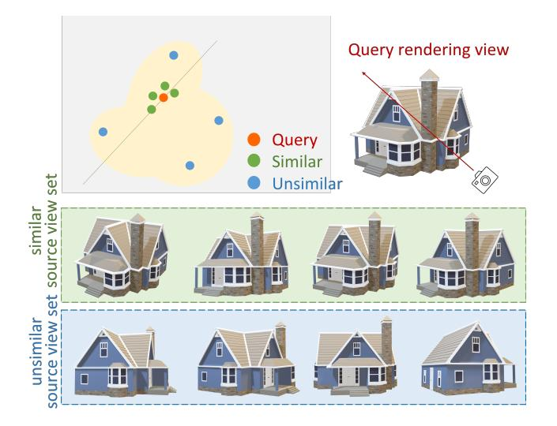
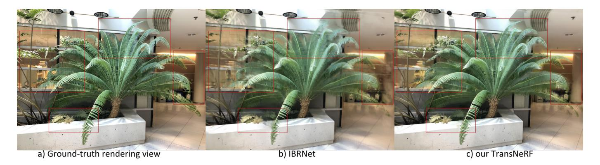
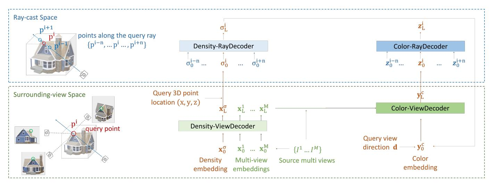
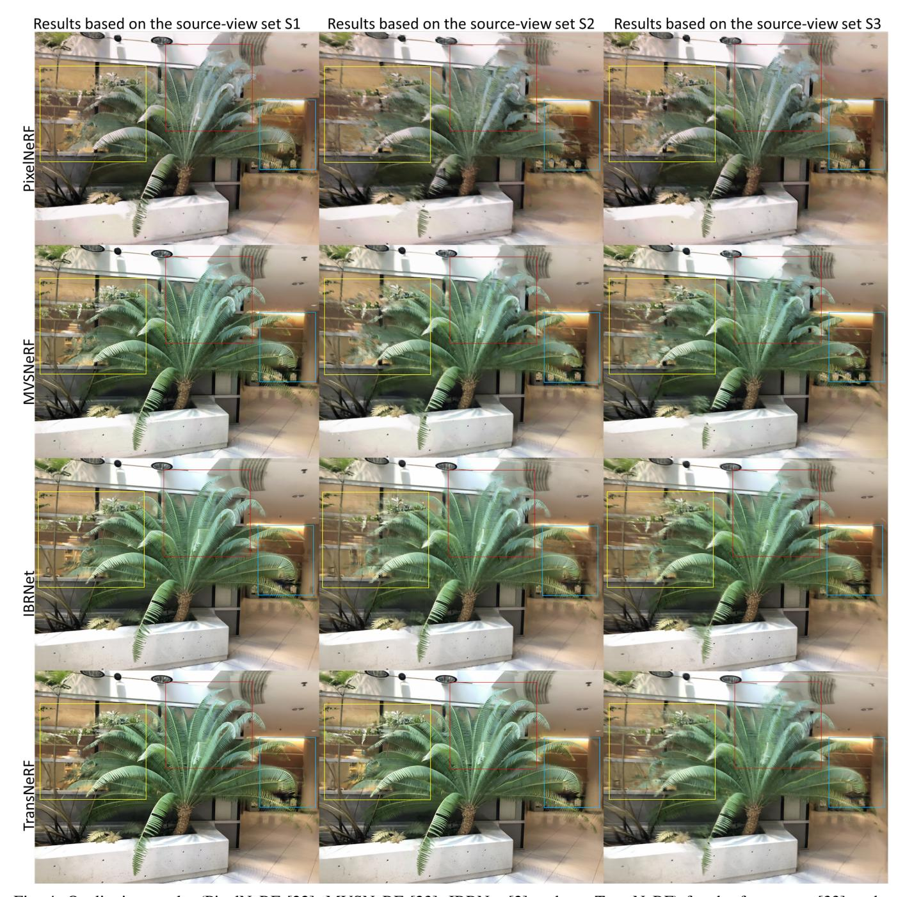
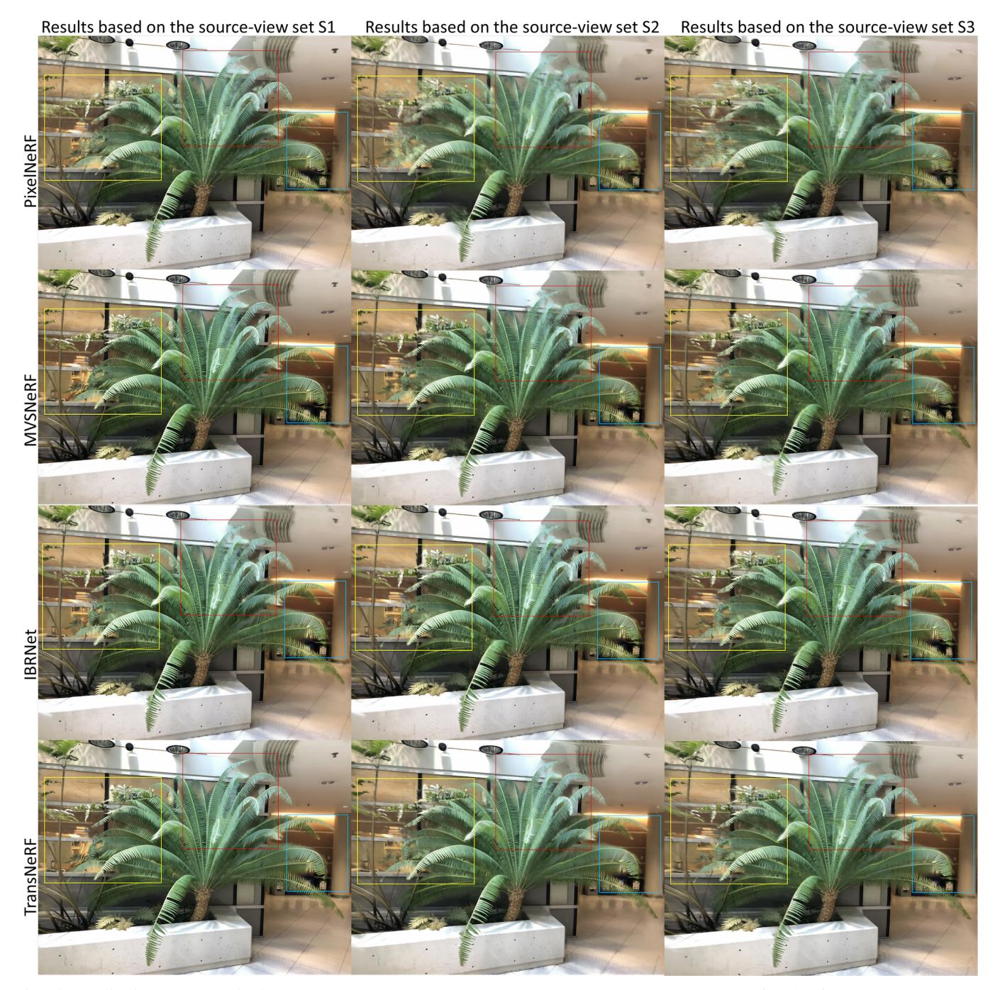

# Generalizable Neural Radiance Fields for Novel View Synthesis with Transformer

Dan Wang, Xinrui Cui, Septimiu Salcudean, Fellow, IEEE and Z. Jane Wang, Fellow, IEEE

Abstract—We **Transformer-based** NeRF propose a (TransNeRF) to learn a generic neural radiance field conditioned on observed-view images for the novel view synthesis task. By contrast, existing MLP-based NeRFs are not able to directly receive observed views with an arbitrary number and require an auxiliary pooling-based operation to fuse source-view information, resulting in the missing of complicated relationships between source views and the target rendering view. Furthermore, current approaches process each 3D point individually and ignore the local consistency of a radiance field scene representation. These limitations potentially can reduce their performance in challenging real-world applications where large differences between source views and a novel rendering view may exist. To address these challenges, our TransNeRF utilizes the attention mechanism to naturally decode deep associations of an arbitrary number of source views into a coordinate-based scene representation. Local consistency of shape and appearance are considered in the ray-cast space and the surrounding-view space within a unified Transformer network. Experiments demonstrate that our TransNeRF, trained on a wide variety of scenes, can achieve better performance in comparison to state-of-the-art image-based neural rendering methods in both scene-agnostic and per-scene finetuning scenarios especially when there is a considerable gap between source views and a rendering view.

#### I. INTRODUCTION

Novel view synthesis is a long-standing open problem concerned with the rendering of unseen views of a 3D scene given a set of observed views [1], [2], [3], [4], [5]. It is a fundamental and challenging problem in 3D modeling [6], [7] and computer animation [8]. The essence of novel view synthesis is to explore and learn a view-consistent 3D scene representation from a sparse set of input views. The early work focused on modeling 3D shapes by discrete geometric 3D representations, such as mesh surface [9], [10] point cloud [11] and voxel grid [12], [13]. Although explicit 3D geometry-based representations are intuitive, these representations are discrete and sparse. Therefore, they are incapable of learning high-resolution renderings with sufficient quality for complex real-world scenes.

The recent promising work, implicit continuous 3D coordinate-based representation [14], [15], [16], [17], has been shown to have the potential to reconstruct 3D scenes with complicated high-resolution geometry and appearance. However, most discrete [9], [10], [11], [12], [13] and continuous [14], [15], [16], [17] 3D representations require ground-truth 3D geometry information as supervision, which is difficult to achieve in in real-world scenes. Subsequently, research work [18], [19], [20], [21] re-visits this requirement by introducing

Fig. 1: **Motivation**. The complex radiance field scene representation function is shown with yellow/gray background. Given camera pose (rotation and translation) with respect to a world coordinate system, we can calculate the difference between each source view (the green and blue dots) and the target rendering view (the red one). The green ones are source views with small differences from the target one, which are distributed close to the target one in a 3D scene representation space, making it possible to approximate their relation by a linear function. However, for source views (blue ones) with less similarity to the target view, their association is more complex and cannot be approximated well by a linear model.

differential approximation and rendering functions and optimizing the 3D representation only by multi-view images. But these approaches do not exploit the power of continuous 3D coordinate-based representation sufficiently and therefore only produce over-smoothed renderings.

The more recent impressive Neural Radiance Field (NeRF)-based models [1], as a sub-class of implicit continuous representation, introduce neural radiance field scene representations, which map a continuous 3D location and 2D viewing direction to its volume density and radiance color. Unlike previous models in implicit continuous representation, NeRF-based models can achieve high quality of novel view synthesis from observed images in realistic complex scenes. However, these models need to optimize a scene-specific 3D representation for each scene, which is time-consuming and does not learn the shared information amongst scenes. Subsequently, to learn prior knowledge in diverse scenes, researchers [22], [23],

Fig. 2: **Example results from IBRNet [2] (b)** *vs.* **the proposed TransNeRF (c)** and ground-truth rendering view (a). We train a single scene-agnostic TransNeRF model on a large hybrid multi-scene dataset. It can effectively generalize to novel scenes without per-scene finetuning. In the same experimental setting for the scene-agnostic scenario, the result of our TransNeRF (c) is more realistic, containing fewer artifacts when compared with IBRNet (b).

[2], [24] generalize the radiance field scene representation by receiving a pooling-based multi-view feature as a conditional input.

While these image-conditioned NeRFs [22], [23], [2], [24] can generalize across different scenes, previous studies of NeRFs have not investigated in depth the relationship between observed source views and the target rendering view which is essential for novel view synthesis. The reasons for this is that previous NeRF approaches were built on multi-layer perceptrons networks (MLPs) which are incapable of receiving and processing an arbitrary number of observed views; consequently, they use an auxiliary pooling-based model to aggregate multi-view features. This ignores in-depth and high-level complicated relationships across observed views and the rendering view.

This limitation impairs the potential of NeRFs to explore and learn a view-consistent 3D scene representation from observed views, especially in practical applications where the observed source views might be captured at camera poses that are very different from the camera pose of the target view. As illustrated in Fig 1, when camera poses of source views are similar to the rendering view, source views and the target view are distributed in a local region in 3D scene representation space, making it possible to approximate their relationship by a linear function as in previous techniques [22], [23], [2], [24]. However, as the difference between observed views and the rendered view increases, the correlation becomes more complicated, making it challenging for these approaches to synthesize a novel view. Therefore, in this scenario, prior MLP-based NeRFs [22], [23], [2], [24], using the poolingbased function to fuse the multi-view, fail to resolve this challenge.

To tackle this unmet need, in this paper, we propose a Transformer-based NeRF framework (TransNeRF) utilizing its powerful attention mechanism to learn a general continuous 3D scene representation from an arbitrary number of observed views. The learning process of TransNeRF is divided into two stages: the first deals with the surrounding-view space and the second deals with in the ray-cast space, shown in Fig 3. In

the surrounding-view space, unlike previous MLP-based work requiring an auxiliary pooling-based operation to fuse source views, our framework is only built on the Transformer-based network and leverages its attention mechanism to integrate deep relationships between the rendering view and observed views as a coordinate-based scene representation. Specifically, in our attention layers at our Density-ViewDecoder and Color-ViewDecoder, TransNeRF can naturally decode observed views and spatial location information for a query 3D point in the rendering ray direction into its density and directional color representations. In the ray-cast space, when rendering a query 3D-point, our TransNeRF considers adjacent 3D points on the target ray simultaneously by attention layers in Density-RayDecoder and Color-RayDecoder. In contrast, in prior work each 3D point is processed independently. In this paper, taking advantage of the attention mechanism, our proposed approach enhances the local consistency of a 3D scene representation in both the ray-cast space and the surrounding-view space by a unified Transformer-based network. Therefore, the proposed TransNeRF has the capability to learn a more comprehensive neural radiance field that can effectively generalize to novel scenes without per-scene finetuning, as shown in Fig. 2.

Our contributions can be summarized as follows:

- We introduce TransNeRF, a unified Transformer-based architecture, to model a general neural radiance field from observed views for novel view synthesis, whereas previous MLP-based NeRFs need an auxiliary pooling model to aggregate multi-view information when dealing with an arbitrary number of observed source views.
- TransNeRF, utilizing the attention mechanism, integrates information of the projected 2D pixels in the surrounding source views and the neighboring 3D points along the query ray when rendering the density and radiance color of a query 3D point. It gives our model a better understanding of the shape and appearance consistency in a local neural radiance field.
- TransNeRF can explore complicated relationships between observed views and the rendering view and fuses the learned high-level multi-view information into

- coordinate-based 3D scene representation by our attention layers.
- Experiments demonstrate that in both scene-agnostic and per-scene finetuning experimental settings, TransNeRF achieves more realistic rendering results than previous state-of-the-art methods, especially when source views are captured at camera poses with a considerable difference to the camera pose of the rendering view.

In this paper, we present a generic Transformer-based NeRF framework with a high capacity in modeling radiance field scene representation from observed source view images. Similar to MLP-based NeRFs, our framework can be easily extended to advanced TransNeRF derivatives, e.g. from NeRF to NeRF-W [25] by adding appearance and transient variables as inputs to model uncertainty in the wild scenarios. Here, we only focus on the vanilla TransNeRF and hope this work will serve as a blueprint for future work.

#### II. RELATED WORK

## A. Novel View Synthesis

The goal of novel view synthesis is to reconstruct unseen views of a scene from its observed multiple images. For this task, solutions can be separated into three categories: novel view rendering by image-based representation, discrete 3D shape-based representation, and implicit continuous 3D spatial coordinate-based representation.

**Image-based representation.** The image-representation-based approaches leverage GAN models and auto-encoders [26] to learn a global embedding from multi-view images and render an unseen view given its camera parameters. However, these image-representation-based models are limited by the lack of understanding of the underlying 3D shape representation. In contrast, the two 3D-representation-based types reconstruct novel views by exploiting multi-view consistent 3D shape representation.

Discrete 3D shape-based representation. For novel view synthesis, the discrete 3D-shape representation involves point cloud [11], [18], mesh surface [9], [10], voxel grid [12], [13], [19] approaches. The point-cloud-based representation [11] reconstructed from multi-view images is typically sparse, making it difficult to infer the missing information. The mesh-based representation [9], [10] requires a template mesh with fixed topology and rigid texture parameterizations for the category-specific shape. In complex real-world scenes, it is challenging to fulfill this requirement. The volume-based representation [12], [13] can easily leverage CNNs to obtain predicted voxel grids. Nevertheless, it causes discretization artifacts from low-resolution voxel grids and limits its resolution-scale ability with computational and memory constraints.

Implicit continuous 3D spatial coordinate-based representation. Recently, another promising branch implicitly represents geometric and appearance information of a 3D point in a scene as a function of its continuous spatial coordinates. Therefore this implicit continuous 3D shape representation has the potential to render higher-resolution complicated geometry and appearance of scenes without storing an entire

scene representation. In this direction, research work modeling occupancy fields [14], [15] or signed distance functions [16], [17] requires ground-truth 3D information for supervision, limiting its real-world applications. To relax this requirement, researchers [20], [21] leverage differential rendering functions to allow 2D images as only supervision information for 3D representation. However, these models are unable to fully exploit the advantage of the implicit continuous representation, which limits it to simple geometric and appearance scenarios.

Neural radiance field scene representation. More recently, the impressive neural radiance fields (NeRF) [1] have shown a solid ability to synthesize novel views by representing continuous scenes as 5D radiance fields in MLPs. Nevertheless, NeRF optimizes each scene representation independently, not exploring the shared information amongst scenes and being time-consuming. To solve this, researchers proposed models, such as PixelNeRF [22], MVSNeRF [23], IBRNet [2], which receives as conditional inputs multiple observer views to learn a general neural radiance field. Followed the design principle of divide-and-conquer, they have two separate components: a CNN feature extractor for a single image and a MLP as a NeRF network. For a single-view stereo, in these models, CNNs map an image to a feature grid, and MLPs map a query 5D coordinate and its corresponding CNN feature to a single volume density and view-dependent RGB color. For a multi-view stereo, since CNN and MLP are unable to process an arbitrary number of input views, they first process the coordinates and corresponding features in each view coordinate frame independently and obtain an imageconditioned intermediate representation for each view. Next, they use an auxiliary pooling-based model to aggregate these intermediate representations across the views within the NeRF network. In the 3D understanding, multiple views provide additional information about the scene.

Nonetheless, pooling-based fusion models in these methods can barely explore the complex relationship across multiple views for 3D scene understanding. Furthermore, processing each 3D point independently ignores the local consistency of a 5D radiance field in a scene. To tackle it, we propose an encoder-decoder Transformer framework, TransNeRF, to represent the neural radiance field scene. Compared with the pooling-based multi-view representation in previous work, TransNeRF can explore deep relationships amongst multiple views and aggregate multi-view information into the coordinate-based scene representation by the attention mechanism in a single Transformer-based NeRF. Furthermore, TransNeRF can learn the local geometry consistency of shape and appearance in a scene by considering the corresponding information in the ray-cast space and the surrounding-view space.

#### B. Transformer

Transformer recently emerged as a promising network framework and achieved impressive performance in natural language processing [27] and computer vision [28], [29], [30]. The main idea behind this approach is to utilize the multi-head self-attention operation to explore the dependence within input

Fig. 3: For rendering a query 3D point on a target-viewing ray, the proposed TransNeRF consists: 1) In the surrounding-view space, our Density-ViewDecoder(Sec. III-A) and Color-ViewDecoder(Sec. III-C) fuse source views and query spatial information ((x, y, z), d) into the latent density and color representations for the query point; 2) In the ray-cast space, we use Density-RayDecoder(Sec. III-B) and Color-RayDecoder(Sec. III-D) to enhance the query density and color representations by considering points along the target view ray. Finally, we can obtain the volume density and directional color for the query 3D point on a target-viewing ray from our TransNeRF.

tokens and then learn a global feature representation. In the object detection task, DETR [28] presents a new framework combining a 2D CNN with a Transformer and predicts object detection in parallel as a sequence of output tokens. In image classification, ViT [29] demonstrates the impressive ability to learn global contexts in Transformer even without using CNN features that are more focused on local concepts [31].

For novel view synthesis, we introduce an end-to-end Transformer framework to implicitly model the continuous 3D scene as a neural radiance field representation. Our model leverages the Transformer advantage of exploring deep relationships among observed images to learn a view-consistent 3D representation.

### III. METHODOLOGY

Unlike Neural Radiance Field (NeRF) [1] optimizing a scene-specific 3D representation, we propose TransNeRF to learn a generic radiance field representation for novel scenes. Given captured multi-view images  $\{\mathbf{I}^m\}_{m=1}^M$  (M source views) of diverse scenes and their camera parameters  $\{\boldsymbol{\Theta}^m\}_{m=1}^M$  (camera poses, intrinsic parameters and scene bounds), TransNeRF reconstructs a generic radiance field, denoted  $F_{\text{TransNeRF}}$ , learning prior knowledge shared across scenes

$$(\sigma, \mathbf{c}) \leftarrow F_{\text{TransNeRF}}((x, y, z), \mathbf{d}; \{\mathbf{I}^m, \mathbf{\Theta}^m\}_m),$$
 (1)

where (x, y, z) is a 3D point location, **d** denotes a unit-length viewing ray-direction and outputs are a differential volumetric density  $\sigma$  and a directional emitted color **c**.

To render a query 3D point on a target-view ray, TransNeRF receives its spatial location (x,y,z), viewing direction  $\mathbf{d}$  and a set of source views  $\{\mathbf{I}^m, \mathbf{\Theta}^m\}_m$  as inputs. The TransNeRF framework contains the following four steps: 1) For each observed source view, we first extract its feature volume

from a pre-trained U-Net and retrieve spatial-aligned 2D-pixel features for the query 3D point as its initial source-view feature. Then, Density-ViewDecoder (Sec. III-A) decodes the initial features for source views into the latent density representations of the query point. 2) Density-RayDecoder (Sec. III-B) thereafter enhances the latent density representation by considering neighboring points along the targetview ray and outputs the density for the query 3D point. 3) Subsequently, given latent source-view features from Density-ViewDecoder and the query-point density representation from Density-RayDecoder, Color-ViewDecoder (Sec. III-C) fuses them into the latent color representation for the query point. 4) Similar to Density-RayDecoder, Color-RayDecoder (Sec. III-D) decodes the query color by integrating color information of 3D points along the target-viewing ray. Finally, we can obtain the density and directional color  $(\sigma, \mathbf{c})$  for the query 3D point on a target-viewing ray.

As in NeRF [1], classical volume rendering [32], a differentiable ray marching rendering, is then utilized to render a projection 2D image from our radiance field scene representation  $F_{\text{TransNeRF}}$ . To calculate a 2D-pixel's color at a rendered image, classical volume rendering marches a ray via the pixel and accumulates radiance at sampled 3D points along the ray. Specifically, the rendered color  $C(\mathbf{r})$  of the camera ray  $\mathbf{r}(t) = \mathbf{o} + t\mathbf{d}$  with near and far bounds  $[t_n, t_f]$  is computed

$$C(\mathbf{r}) = \int_{t_n}^{t_f} T(t) \sigma(\mathbf{r}(t); \mathbf{I}^m, \mathbf{\Theta}^m) \mathbf{c}(\mathbf{r}(t), \mathbf{d}; \mathbf{I}^m, \mathbf{\Theta}^m) dt \quad (2)$$

where the function  $T(t) = \exp(-\int_{t_n}^t \sigma(\mathbf{r}(s); \mathbf{I}^m, \mathbf{\Theta}^m) ds)$  calculates the accumulated transmittance along the ray between depth bounds  $[t_n, t_f]$ .

The rendering loss between the rendered and ground truth pixel colors for all the camera rays of the target view with camera pose  $\Theta$  is

$$\mathcal{L} = \sum_{\mathbf{r} \in \mathcal{R}(\mathbf{\Theta})} \|\hat{C}(\mathbf{r}) - C(\mathbf{r})\|_2^2 , \qquad (3)$$

where  $\mathcal{R}(\Theta)$  is the set of all camera rays of the desired virtual camera with pose  $\Theta$ .

Given a set of observed source views, the rendering loss  $\mathcal{L}$  between the observations and the predictions is minimized by optimizing the parameters of the neural radiance field  $F_{\text{TransNeRF}}$ . Here, our TransNeRF is fully differentiable and can be trained end-to-end only requiring source views. After being trained on a large dataset containing diverse scenes, our TransNeRF effectively generalizes to unseen scenes even without per-scene finetuning. Accordingly, given the camera pose of a query novel view of a scene and its multiple source views, our TransNeRF can render the query novel view from the pre-trained general neural radiance field by casting rays from the target camera center towards the 3D space using volume rendering in Eq. 2.

## A. Density Decoder in Surrounding-view Space

We first present our density decoder in surrounding-view space (Density-ViewDecoder) fusing source views into the latent volume-density representation for a query 3D point.

For each source view image, we first extract its feature volume by a pre-trained view-shared U-Net. A query 3D point (x,y,z) is then projected into each source-view image  $\mathbf{I}^m$  by its camera projection matrix  $\mathbf{\Theta}^m$  to extract the corresponding RGB color  $\{\mathbf{c}_{src}^m\}_{m=1}^M$  and feature vector  $\{\mathbf{f}_{src}^m\}_{m=1}^M$  at the projected 2D pixel location through bilinear interpolation. In each source view, we also record its viewing direction  $\{\mathbf{d}_{src}^m\}_{m=1}^M$  for the projected 2D pixel from the source camera pose. And then based on these information, we obtain the initial source-view embeddings  $\{\mathbf{x}_0^m\}_{m=1}^M$  for source views, as in [2].

For the query 3D point, Density-ViewDecoder receives the initial source-view embeddings  $\{\mathbf{x}_0^m\}_{m=1}^M$  and the learnable query density embedding  $\mathbf{x}_0^\sigma$  as inputs  $\mathbf{X}_0$ . The Density-ViewDecoder can be formulated as follows:

$$\mathbf{X}_0 = [\mathbf{x}_0^{\sigma}; \mathbf{x}_0^1; \mathbf{x}_0^2; \cdots; \mathbf{x}_0^M] \tag{4}$$

$$\tilde{\mathbf{X}}_l = \text{Norm}(\text{Density-ViAttn}(\mathbf{X}_{l-1}) + \mathbf{X}_{l-1})$$
 (5)

$$\mathbf{X}_{l} = \text{Norm}(\text{FFN}(\tilde{\mathbf{X}}_{l}) + \tilde{\mathbf{X}}_{l}) , \qquad (6)$$

where l denotes the index of a basic block  $(l=1,\cdots,L)$ , "Norm" is the layer normalization function and "FFN" is a position-wise feed-forward network. At the L-th block, we can obtain  $\mathbf{X}_L = [\mathbf{x}_L^\sigma; \mathbf{x}_L^1; \mathbf{x}_L^2; \cdots; \mathbf{x}_L^M]$ . In the Density-ViewDecoder, we concatenate the embedding  $\mathbf{x}_L^\sigma$  and its 3D coordinate location (x,y,z) as the output density representation for the query 3D point.

Density-view attention layers (Density-ViAttn) can explore deep relationships among source views, defined as follows:

Density-ViAttn(
$$\mathbf{X}$$
) = MH-Attn( $\mathbf{X}$ ,  $\mathbf{X}$ ,  $\mathbf{X}$ ), (7)

where the multi-head attention function is defined as:

MH-Attn(
$$\mathbf{Q}, \mathbf{K}, \mathbf{V}$$
) = Cat( $\mathbf{A}_1, \dots, \mathbf{A}_H$ ) $\mathbf{W}$ , (8)  
where  $\mathbf{A}_h$  = Attention( $\mathbf{Q}_h, \mathbf{K}_h, \mathbf{V}_h$ )  
 $\mathbf{Q}_h$  =  $\mathbf{Q}\mathbf{W}_h^q$ ;  $\mathbf{K}_h$  =  $\mathbf{K}\mathbf{W}_h^k$ ;  $\mathbf{V}_h$  =  $\mathbf{V}\mathbf{W}_h^v$ .

Here,  $N_q$  queries are stacked in  $\mathbf{Q} \in \mathbb{R}^{N_q \times d_k}$ , a set of  $N_{kv}$  key-value pairs are stacked in  $\mathbf{K} \in \mathbb{R}^{N_{kv} \times d_k}$  and  $\mathbf{V} \in \mathbb{R}^{N_{kv} \times d_v}$ . And  $\mathbf{W}_h^q, \mathbf{W}_h^k \in \mathbb{R}^{d_k \times d_h}; \mathbf{W}_h^v \in \mathbb{R}^{d_v \times d_h}$  and  $\mathbf{W} \in \mathbb{R}^{Hd_h \times d_k}$  are parameter matrices  $(H \times d_h = d_k)$  and  $d_h$  is the feature dimension in each head). And the Attention function is computed by

Attention(
$$\mathbf{Q}_h, \mathbf{K}_h, \mathbf{V}_h$$
) = softmax( $\frac{\mathbf{Q}_h \mathbf{K}_h^T}{\sqrt{d_k}}$ ) $\mathbf{V}_h$ , (9)

where attention-score, stored in  $\operatorname{softmax}(\frac{\mathbf{Q}_h\mathbf{K}_h^T}{\sqrt{d_k}})$ , of a specific value is obtained by the match between this query and the key paired with the target value. Our Density-ViewDecoder is invariant to permutations of source views and can receive an arbitrary number of source views.

#### B. Density Decoder in Ray-cast Space

The density decoder in ray-cast space (Density-RayDecoder) decodes density information of the query 3D point by aggregating the density features of the neighboring 3D points along the target-view ray.

For the query point  $q^i$  and neighboring 2n points  $\{q^{i-n},\cdots,q^{i-1},q^{i+1},\cdots,q^{i+n}\}$  along the target-viewing ray, we denote  $[\sigma_0^{i-n};\cdots;\sigma_0^{i-1};\sigma_0^{i};\sigma_0^{i+1};\cdots;\sigma_0^{i+n}]$  as their initial density representations at the input end of the Density-RayDecoder. Here, the initial density representation for each 3D point is computed by a linear function of the Density-ViewDecoder output for the corresponding point  $(\sigma_0 = FC(\mathbf{x}_L^{\sigma}\odot(x,y,z))$ , where  $\odot$  is the concatenation operation). And then positional encodings  $\mathbf{E}^{pos}$  are added to density representations of neighboring 3D points to keep their position information in the ray-cast space. Each positional encoding informs each point of its 3D spatial location, which is computed by utilizing sine and cosine functions of different frequencies in a similar way to [28]. The Density-RayDecoder is represented as:

$$\mathbf{D}_0 = [\sigma_0^{i-n}; \cdots; \sigma_0^{i-1}; \sigma_0^{i}; \sigma_0^{i+1}; \cdots; \sigma_0^{i+n}] + \mathbf{E}^{pos} \quad (10)$$

$$\tilde{\mathbf{D}}_{l} = \text{Norm}(\text{Density-Attn}(\mathbf{D}_{l-1}) + \mathbf{D}_{l-1})$$
(11)

$$\mathbf{D}_{l} = \text{Norm}(\text{FFN}(\tilde{\mathbf{D}}_{l}) + \tilde{\mathbf{D}}_{l}) , \qquad (12)$$

where the density attention layer (Density-Attn) is computed as Density-Attn( $\mathbf{D}$ ) = MH-Attn( $\mathbf{D}$ ,  $\mathbf{D}$ ,  $\mathbf{D}$ ) fusing information of surrounding 3D points on the target-viewing ray. Finally, at the end block, the Density-RayDecoder outputs the density representation  $\sigma_L^i$  of the query 3D point and then we use a linear function to project it to the density value for the query point.

### C. Color Decoder in Surrounding-view Space

The color decoder in surrounding-view space (Color-ViewDecoder) learns a query directional emitted color as

a function of viewing direction, source-view representations learned from Density-ViewDecoder and the latent density representation from Density-RayDecoder.

The Color-ViewDecoder can be formulated as follows:

$$\tilde{\mathbf{Y}}_{l} = \text{Norm}(\text{Color-ViAttn}(\mathbf{Y}_{l-1}, \mathbf{X}_{src}, \mathbf{C}_{src}) + \mathbf{Y}_{l-1}) \quad (13)$$

$$\mathbf{Y}_{l} = \text{Norm}(\text{FFN}(\tilde{\mathbf{Y}}_{l}) + \tilde{\mathbf{Y}}_{l}) \quad (14)$$

In the color-view layer (Color-ViAttn), the initial query directional color embedding is represented as  $\mathbf{Y}_0 = \mathrm{FC}(\sigma_L^i) \odot \mathbf{d}_{tgt}$ , where  $\sigma_L^i$  is the latent density representation from Density-RayDecoder and  $\mathbf{d}_{tgt}$  is the target-viewing direction for the query 3D point. The Color-ViAttn layer is calculated as:

$$Color-ViAttn(\mathbf{Y}, \mathbf{X}_{src}, \mathbf{C}_{src}) = MH-Attn(\mathbf{Y}, \mathbf{X}_{src}, \mathbf{C}_{src}),$$
(15)

where the value is  $\mathbf{C}_{src} = [\gamma(\mathbf{c}_{src}^1); \gamma(\mathbf{c}_{src}^2); \cdots; \gamma(\mathbf{c}_{src}^M)]$   $(\gamma(\cdot)$  is the embedding function) and the key is  $\mathbf{X}_{src} = [\mathrm{FC}(\mathbf{x}_L^1) \odot \mathbf{d}_{src}^1; \mathrm{FC}(\mathbf{x}_L^2) \odot \mathbf{d}_{src}^2; \cdots; \mathrm{FC}(\mathbf{x}_L^M) \odot \mathbf{d}_{src}^M]$  representing conditional source-view information. The output of Color-ViewDecoder  $\mathbf{y}_L^c$  is the latent color representation for the query 3D point.

#### D. Color Decoder in Ray-cast Space

The color decoder in ray-cast space (Color-RayDecoder) learns a query directional emitted color by fusing color features of adjacent 3D points along the target ray in color attention layers (Color-Attn( $\mathbf{Z}$ ) = MH-Attn( $\mathbf{Z}$ ,  $\mathbf{Z}$ )). The Color-RayDecoder can be formulated as follows:

$$\mathbf{Z}_{0} = [\mathbf{z}_{0}^{i-n}; \cdots; \mathbf{z}_{0}^{i-1}; \mathbf{z}_{0}^{i}; \mathbf{z}_{0}^{i+1}; \cdots; \mathbf{z}_{0}^{i+n}] + \mathbf{E}^{pos}$$
 (16)

$$\tilde{\mathbf{Z}}_{l} = \text{Norm}(\text{Color-Attn}(\mathbf{Z}_{l-1}) + \mathbf{Z}_{l-1})$$
(17)

$$\mathbf{Z}_{l} = \text{Norm}(\text{FFN}(\tilde{\mathbf{Z}}_{l}) + \tilde{\mathbf{Z}}_{l}) . \tag{18}$$

where the latent color representation  $\mathbf{y}_L^c$  for the query 3D point is assigned to the corresponding  $\mathbf{z}_0^i$  and likewise for latent color representations for adjacent 2n 3D-points in local raycast space.

Subsequently, after the Color-RayDecoder, we use a linear function to project the output color embedding  $\mathbf{z}_L^i$  to its output predicted color value. Then the predicted volume density and directional color of a query point along a camera ray of the desired virtual camera are put forward to the classical volume rendering in Eq.(3). The implementation details of the network and training are described in the supplemental material.

# IV. EXPERIMENTS

We evaluate our approach in the following experimental settings:

- Scene-agnostic setting: we train a single scene-agnostic model on a large training dataset, including various camera setups and scene types. We test its generalization ability to unseen-scene view synthesis on all test scenes from the evaluation dataset;
- Per-scene finetuning setting: our pre-trained sceneagnostic model can also be finetuned on each test scene.
   We then evaluate each scene-specific model on its corresponding scene separately.

The experiments are designed to examine whether our TransNeRF can efficiently learn a neural radiance field scene representation in scenarios where the difference between source views and the target rendering view varies.

#### A. Datasets

We train and evaluate our method on a collection of several multi-view datasets containing both synthetic data and real data, as in IBRNet [2].

- Real-world datasets for training include the Spaces dataset [34], RealEstate10K [35], and the handheld-cellphone-captured scene dataset. The Spaces dataset [34] has 100 scenes and each scene is collected with a 16 camera rig at 3 to 10 rig positions. RealEstate10K [35], a large indoor-scene dataset, is captured from around 80K video clips with camera poses. The cellphone-captured scene dataset contains 95 real scenes (36 from LLFF [33] and 59 from IBRNet [2]), where each scene consists of 20 to 60 forward-facing images.
  - COLMAP [36] is adopted to estimate camera poses, intrinsic parameters and scene bounds for real data as in [1].
- Synthetic dataset for training is generated by IBRNet [2] from Google Scanned Objects, which contains 1,030 models with a variety of view density rates.

Similar to the sampling strategy in [2], we randomly sample M source views for each target view from a pool of  $m \times M$  views where M is sampled uniformly at random from [8, 12] and m is from [1, 5].

- Real-world dataset for evaluation collects 8 complex real-world scenes captured with a handheld cellphone (5 from LLFF [33] and 3 from NeRF [1]). Each scene consists of 20 to 62 forward-facing images with  $1008 \times 756$  pixels, and 1/8th of these is held out as the test set (7/8 for per-scene finetuning).
- Synthetic dataset for evaluation, adopted from NeRF [1], includes 8 objects with complicated geometry and realistic non-Lambertian materials which are rendered at 800 × 800 pixels from viewpoints sampled either on the upper hemisphere or full sphere (100 views for per-scene finetuning and 200 views for testing).

Evaluation dependence on the difference between source views and the target view. For the evaluation of a specific scene, target rendering views are from the testing set of evaluation datasets, and the corresponding surrounding-view set is contained in the training set of evaluation datasets. In this evaluation, we sampled M=10 views from the surroundingview set as source views to render a target view. And the sampling procedure of source views is defined as: for each target rendering view, we first compute the differences between the target-view camera pose and the surroundingview camera poses using Euclidean transformation matrices of camera poses [1], [2], and then rank the surrounding views according to how different they are, from small to large; by this difference ranking, we construct  $N_s$  source-view sets  $(\{\mathbf{S}_i\}_{i=1}^{N_s})$  of 10 views from the surrounding-view set to render each test view. For the real-world evaluation dataset, there are

|           |                |           |         |        | Scene-ag  | nostic setting of | on realistic syn | thetic datase | et [1]    |           |         |        |           |
|-----------|----------------|-----------|---------|--------|-----------|-------------------|------------------|---------------|-----------|-----------|---------|--------|-----------|
|           |                |           | PSNR    | ₹ ↑    |           |                   | SSIM             | 1 1           | LPIPS ↓   |           |         |        |           |
| Scene     | $\mathbf{S}_i$ | PixelNeRF | MVSNeRF | IBRNet | TransNeRF | PixelNeRF         | MVSNeRF          | IBRNet        | TransNeRF | PixelNeRF | MVSNeRF | IBRNet | TransNeRF |
|           | S1             | 21.21     | 23.50   | 28.55  | 29.06     | 0.890             | 0.910            | 0.942         | 0.954     | 0.135     | 0.108   | 0.066  | 0.055     |
| Chair     | S2             | 16.98     | 19.38   | 24.93  | 25.79     | 0.784             | 0.811            | 0.854         | 0.903     | 0.240     | 0.224   | 0.173  | 0.135     |
| Chair     | S3             | 15.76     | 18.37   | 24.12  | 25.17     | 0.712             | 0.745            | 0.798         | 0.870     | 0.298     | 0.267   | 0.206  | 0.164     |
|           | S4             | 14.51     | 17.21   | 23.12  | 24.85     | 0.612             | 0.647            | 0.714         | 0.823     | 0.387     | 0.338   | 0.259  | 0.194     |
|           | S1             | 19.51     | 21.13   | 24.64  | 26.13     | 0.834             | 0.862            | 0.917         | 0.923     | 0.174     | 0.148   | 0.106  | 0.090     |
| Lego      | S2             | 15.30     | 17.08   | 21.14  | 22.80     | 0.685             | 0.717            | 0.787         | 0.851     | 0.331     | 0.311   | 0.257  | 0.179     |
| Lego      | S3             | 14.21     | 16.08   | 20.33  | 22.18     | 0.613             | 0.650            | 0.731         | 0.819     | 0.390     | 0.354   | 0.291  | 0.207     |
|           | S4             | 13.04     | 14.92   | 19.33  | 21.10     | 0.532             | 0.571            | 0.665         | 0.768     | 0.471     | 0.421   | 0.339  | 0.246     |
|           | S1             | 21.31     | 21.79   | 22.92  | 24.57     | 0.803             | 0.808            | 0.825         | 0.836     | 0.267     | 0.256   | 0.227  | 0.211     |
| Ship      | S2             | 17.04     | 17.69   | 19.37  | 21.25     | 0.650             | 0.658            | 0.689         | 0.725     | 0.443     | 0.438   | 0.397  | 0.305     |
| Silip     | S3             | 15.98     | 16.69   | 18.56  | 20.64     | 0.577             | 0.591            | 0.633         | 0.693     | 0.503     | 0.480   | 0.431  | 0.333     |
|           | S4             | 14.83     | 15.59   | 17.63  | 19.34     | 0.481             | 0.497            | 0.552         | 0.637     | 0.599     | 0.565   | 0.495  | 0.370     |
|           | S1             | 17.60     | 18.74   | 21.28  | 21.99     | 0.771             | 0.807            | 0.893         | 0.902     | 0.184     | 0.164   | 0.113  | 0.105     |
| Drums     | S2             | 13.85     | 15.14   | 18.21  | 18.69     | 0.642             | 0.683            | 0.782         | 0.802     | 0.321     | 0.312   | 0.252  | 0.201     |
| Diulis    | S3             | 12.72     | 14.16   | 17.40  | 18.49     | 0.570             | 0.616            | 0.725         | 0.770     | 0.383     | 0.354   | 0.285  | 0.230     |
|           | S4             | 11.53     | 12.99   | 16.40  | 18.18     | 0.480             | 0.528            | 0.652         | 0.724     | 0.474     | 0.434   | 0.346  | 0.254     |
| ·         | S1             | 26.51     | 27.28   | 28.93  | 29.32     | 0.929             | 0.938            | 0.951         | 0.968     | 0.071     | 0.062   | 0.045  | 0.033     |
| Mic       | S2             | 22.64     | 23.61   | 25.80  | 26.09     | 0.852             | 0.864            | 0.891         | 0.914     | 0.165     | 0.165   | 0.135  | 0.135     |
| IVIIC     | S3             | 21.46     | 22.60   | 24.99  | 25.85     | 0.779             | 0.797            | 0.835         | 0.881     | 0.226     | 0.207   | 0.169  | 0.164     |
|           | S4             | 20.53     | 21.61   | 24.15  | 25.65     | 0.686             | 0.706            | 0.758         | 0.816     | 0.295     | 0.265   | 0.207  | 0.197     |
|           | S1             | 21.86     | 22.73   | 24.72  | 25.14     | 0.899             | 0.904            | 0.919         | 0.923     | 0.125     | 0.117   | 0.089  | 0.077     |
| Ficus     | S2             | 18.60     | 19.67   | 22.20  | 22.70     | 0.793             | 0.801            | 0.830         | 0.831     | 0.227     | 0.228   | 0.189  | 0.159     |
| Ticus     | S3             | 17.51     | 18.65   | 21.39  | 22.56     | 0.720             | 0.735            | 0.774         | 0.799     | 0.288     | 0.270   | 0.222  | 0.187     |
|           | S4             | 16.05     | 17.27   | 20.15  | 22.14     | 0.626             | 0.642            | 0.695         | 0.746     | 0.368     | 0.339   | 0.271  | 0.235     |
|           | S1             | 19.47     | 19.93   | 20.98  | 22.67     | 0.828             | 0.847            | 0.895         | 0.903     | 0.195     | 0.174   | 0.124  | 0.110     |
| Materials | S2             | 14.41     | 14.91   | 16.48  | 19.15     | 0.654             | 0.683            | 0.739         | 0.807     | 0.357     | 0.348   | 0.288  | 0.198     |
| Materials | S3             | 13.15     | 13.92   | 15.66  | 18.54     | 0.581             | 0.615            | 0.683         | 0.774     | 0.420     | 0.390   | 0.322  | 0.227     |
|           | S4             | 11.89     | 12.66   | 14.58  | 16.25     | 0.486             | 0.521            | 0.603         | 0.729     | 0.514     | 0.472   | 0.386  | 0.267     |
| Hotdog    | S1             | 22.14     | 24.70   | 30.45  | 32.70     | 0.902             | 0.919            | 0.958         | 0.968     | 0.135     | 0.115   | 0.066  | 0.054     |
|           | S2             | 17.20     | 20.02   | 26.29  | 28.82     | 0.797             | 0.817            | 0.871         | 0.904     | 0.275     | 0.259   | 0.198  | 0.149     |
|           | S3             | 16.22     | 18.99   | 25.48  | 28.20     | 0.724             | 0.750            | 0.814         | 0.871     | 0.332     | 0.301   | 0.232  | 0.178     |
|           | S4             | 14.98     | 17.79   | 24.43  | 26.27     | 0.636             | 0.662            | 0.740         | 0.825     | 0.410     | 0.365   | 0.276  | 0.216     |
|           | S1             | 21.20     | 22.47   | 25.31  | 26.45     | 0.857             | 0.874            | 0.913         | 0.922     | 0.161     | 0.143   | 0.104  | 0.092     |
| Ave       | S2             | 17.00     | 18.44   | 21.80  | 23.16     | 0.732             | 0.755            | 0.805         | 0.842     | 0.295     | 0.286   | 0.236  | 0.183     |
| Ave       | S3             | 15.88     | 17.43   | 20.99  | 22.70     | 0.660             | 0.687            | 0.749         | 0.810     | 0.355     | 0.328   | 0.270  | 0.211     |
|           | S4             | 14.67     | 16.25   | 19.97  | 21.72     | 0.567             | 0.597            | 0.672         | 0.758     | 0.440     | 0.400   | 0.322  | 0.248     |

TABLE I: Quantitative comparisons of methods (PixelNeRF [22], MVSNeRF [23], IBRNet [2] and the proposed TransNeRF) for the scene-agnostic setting on the realistic synthetic dataset [1].

| $ \begin{array}{ c c c c c c c c c c c c c c c c c c c$                                                                                                                                                                                                                                                                                                                                                                                                                                                                                                                                                                                                                                                                                                                                                                                                                                                                                                                                                                                                                                                                                                                                                                                                                                                                                                                                                                                                                                                                                                                                                                                                                                                                                                                                                                                                                                                                                                                                                                                                                                                                       | Scene-agnostic setting on real forward-facing dataset [33] |                |           |         |        |           |           |         |        |           |           |         |        |           |  |
|-------------------------------------------------------------------------------------------------------------------------------------------------------------------------------------------------------------------------------------------------------------------------------------------------------------------------------------------------------------------------------------------------------------------------------------------------------------------------------------------------------------------------------------------------------------------------------------------------------------------------------------------------------------------------------------------------------------------------------------------------------------------------------------------------------------------------------------------------------------------------------------------------------------------------------------------------------------------------------------------------------------------------------------------------------------------------------------------------------------------------------------------------------------------------------------------------------------------------------------------------------------------------------------------------------------------------------------------------------------------------------------------------------------------------------------------------------------------------------------------------------------------------------------------------------------------------------------------------------------------------------------------------------------------------------------------------------------------------------------------------------------------------------------------------------------------------------------------------------------------------------------------------------------------------------------------------------------------------------------------------------------------------------------------------------------------------------------------------------------------------------|------------------------------------------------------------|----------------|-----------|---------|--------|-----------|-----------|---------|--------|-----------|-----------|---------|--------|-----------|--|
| Fern S2 18.69 19.40 22.18 22.35 0.602 0.639 0.709 0.720 0.427 0.889 0.307 0.295 0.294   S3 17.99 18.80 21.96 22.11 0.574 0.607 0.703 0.704 0.460 0.410 0.316 0.304   S1 18.63 19.24 23.83 23.84 0.705 0.722 0.849 0.850 0.392 0.377 0.239 0.237   Trex S2 16.03 16.88 21.68 21.85 0.633 0.660 0.788 0.797 0.467 0.448 0.299 0.287   S3 13.80 15.18 19.94 20.51 0.561 0.611 0.737 0.764 0.544 0.516 0.352 0.328   S1 20.01 21.35 26.34 26.35 0.702 0.739 0.866 0.868 0.356 0.323 0.179 0.179   Homs S2 16.78 18.37 23.56 23.74 0.626 0.680 0.802 0.812 0.438 0.401 0.247 0.236   S3 14.06 15.99 21.32 21.71 0.537 0.610 0.734 0.760 0.531 0.482 0.316 0.293   Fortress S2 20.14 22.36 28.19 28.40 0.683 0.701 0.853 0.862 0.368 0.327 0.287 0.155 0.152   S3 15.56 16.37 20.30 20.31 0.513 0.561 0.702 0.759 0.860 0.862 0.368 0.325 0.180 0.702   S3 11.20 12.73 16.87 17.97 23.68 24.36 0.560 0.595 0.751 0.767 0.498 0.446 0.287 0.267   S3 11.20 12.73 16.87 17.39 0.303 0.394 0.544 0.578 0.607 0.550 0.378 0.328 0.329   S1 12.28 13.42 16.89 17.26 0.494 0.492 0.629 0.631 0.461 0.422 0.294 0.291   S3 12.28 13.42 16.89 17.26 0.299 0.345 0.496 0.507 0.627 0.559 0.378 0.363   S1 12.8 13.42 16.89 17.26 0.299 0.345 0.496 0.507 0.627 0.575 0.421 0.399   S1 17.8 1 19.43 26.45 26.78 0.775 0.788 0.907 0.916 0.379 0.442 0.278 0.265   Flower S2 13.01 17.91 19.15 19.85 0.374 0.446 0.646 0.662 0.662 0.662 0.607 0.379 0.422 0.279 0.250   S3 10.28 11.97 19.15 19.85 0.374 0.446 0.646 0.662 0.662 0.662 0.607 0.379 0.422 0.279 0.250   S3 10.28 11.97 19.15 19.85 0.374 0.446 0.646 0.662 0.662 0.662 0.607 0.374 0.306   S2 16.00 17.68 22.69 22.94 0.576 0.614 0.749 0.760 0.459 0.422 0.279 0.422 0.279 0.260   S4 10.00 17.68 22.69 22.94 0.576 0.614 0.749 0.760 0.459 0.422 0.279 0.422 0.279 0.260   S4 10.00 17.68 22.69 22.94 0.576 0.614 0.749 0.760 0.459 0.422 0.279 0.422 0.279 0.260   S4 10.00 17.68 22.69 22.94 0.576 0.614 0.749 0.760 0.459 0.422 0.279 0.420 0.207 0.406 0.406 0.406 0.406 0.406 0.406 0.406 0.406 0.406 0.406 0.406 0.406 0.406 0.406 0.406 0.406 0.406 0.406 0.406 0.406 |                                                            |                |           | PSNF    | ₹ ↑    |           |           | SSIM    | 1      |           | LPIPS ↓   |         |        |           |  |
| Fern         S2         18.69         19.40         22.18         22.35         0.602         0.639         0.709         0.720         0.427         0.389         0.307         0.295           S3         17.99         18.80         21.96         22.11         0.574         0.607         0.703         0.704         0.460         0.410         0.316         0.304           S1         18.63         19.24         23.83         23.84         0.705         0.722         0.849         0.850         0.392         0.377         0.239         0.237           Trex         \$2         16.03         16.88         21.68         21.85         0.633         0.660         0.788         0.797         0.467         0.448         0.299         0.287           S3         13.80         15.18         19.94         20.51         0.561         0.611         0.737         0.764         0.544         0.516         0.352         0.323           Horns         \$2         16.78         18.37         23.56         23.74         0.626         0.680         0.802         0.812         0.438         0.401         0.247         0.236           \$3         14.06         15.99                                                                                                                                                                                                                                                                                                                                                                                                                                                                                                                                                                                                                                                                                                                                                                                                                                                                                                                       | Scene                                                      | $\mathbf{S}_i$ | PixelNeRF | MVSNeRF | IBRNet | TransNeRF | PixelNeRF | MVSNeRF | IBRNet | TransNeRF | PixelNeRF | MVSNeRF | IBRNet | TransNeRF |  |
| S3         17.99         18.80         21.96         22.11         0.574         0.607         0.703         0.704         0.460         0.410         0.316         0.304           Tex         S1         18.63         19.24         23.83         23.84         0.705         0.722         0.849         0.850         0.392         0.377         0.239         0.237           Tex         S2         16.03         16.88         21.68         21.85         0.633         0.660         0.788         0.797         0.467         0.448         0.299         0.287           S3         13.80         15.18         19.94         20.51         0.561         0.611         0.737         0.764         0.544         0.516         0.352         0.328           Horns         S2         16.78         18.87         23.56         23.74         0.626         0.680         0.802         0.812         0.438         0.401         0.247         0.236           S3         14.06         15.99         21.32         21.71         0.537         0.610         0.734         0.760         0.531         0.482         0.316         0.293           Fortress         S2         20.14 <td< td=""><td></td><td>S1</td><td>20.65</td><td>21.12</td><td>23.69</td><td>23.70</td><td>0.671</td><td>0.696</td><td>0.767</td><td>0.771</td><td>0.355</td><td>0.322</td><td>0.250</td><td>0.247</td></td<>                                                                                                                                                                                                                                                                                                                                                                                                                                                                                                                                                                                                                                                                                                           |                                                            | S1             | 20.65     | 21.12   | 23.69  | 23.70     | 0.671     | 0.696   | 0.767  | 0.771     | 0.355     | 0.322   | 0.250  | 0.247     |  |
| S1                                                                                                                                                                                                                                                                                                                                                                                                                                                                                                                                                                                                                                                                                                                                                                                                                                                                                                                                                                                                                                                                                                                                                                                                                                                                                                                                                                                                                                                                                                                                                                                                                                                                                                                                                                                                                                                                                                                                                                                                                                                                                                                            | Fern                                                       | S2             | 18.69     | 19.40   | 22.18  | 22.35     | 0.602     | 0.639   | 0.709  | 0.720     | 0.427     | 0.389   | 0.307  | 0.295     |  |
| Trex         S2         16.03         16.88         21.68         21.85         0.633         0.660         0.788         0.797         0.467         0.448         0.299         0.287           S3         13.80         15.18         19.94         20.51         0.561         0.611         0.737         0.764         0.544         0.516         0.352         0.328           Borns         S1         20.01         21.35         26.34         26.35         0.702         0.739         0.866         0.868         0.356         0.323         0.179         0.179           Horns         S2         16.78         18.37         23.56         23.74         0.626         0.680         0.802         0.812         0.438         0.401         0.247         0.236           S3         14.06         15.99         21.32         21.71         0.537         0.610         0.734         0.760         0.531         0.482         0.316         0.293           Fortress         S2         20.14         22.36         28.19         28.40         0.683         0.701         0.853         0.862         0.368         0.325         0.180         0.170           Fortress         S2                                                                                                                                                                                                                                                                                                                                                                                                                                                                                                                                                                                                                                                                                                                                                                                                                                                                                                                   |                                                            | S3             | 17.99     | 18.80   | 21.96  | 22.11     | 0.574     | 0.607   | 0.703  | 0.704     | 0.460     | 0.410   | 0.316  | 0.304     |  |
| S3   13.80   15.18   19.94   20.51   0.561   0.611   0.737   0.764   0.544   0.516   0.352   0.328                                                                                                                                                                                                                                                                                                                                                                                                                                                                                                                                                                                                                                                                                                                                                                                                                                                                                                                                                                                                                                                                                                                                                                                                                                                                                                                                                                                                                                                                                                                                                                                                                                                                                                                                                                                                                                                                                                                                                                                                                            |                                                            |                | 18.63     | 19.24   | 23.83  | 23.84     | 0.705     | 0.722   | 0.849  | 0.850     | 0.392     | 0.377   | 0.239  |           |  |
| Horns   S1   20.01   21.35   26.34   26.35   0.702   0.739   0.866   0.868   0.356   0.323   0.179   0.179                                                                                                                                                                                                                                                                                                                                                                                                                                                                                                                                                                                                                                                                                                                                                                                                                                                                                                                                                                                                                                                                                                                                                                                                                                                                                                                                                                                                                                                                                                                                                                                                                                                                                                                                                                                                                                                                                                                                                                                                                    | Trex                                                       | S2             | 16.03     | 16.88   | 21.68  | 21.85     | 0.633     | 0.660   | 0.788  | 0.797     | 0.467     | 0.448   | 0.299  | 0.287     |  |
| Horns   S2   16.78   18.37   23.56   23.74   0.626   0.680   0.802   0.812   0.438   0.401   0.247   0.236     S3   14.06   15.99   21.32   21.71   0.537   0.610   0.734   0.760   0.531   0.482   0.316   0.293     S1   22.37   24.31   29.97   29.98   0.719   0.732   0.879   0.880   0.327   0.287   0.155     Fortress   S2   20.14   22.36   28.19   28.40   0.683   0.701   0.853   0.862   0.368   0.325   0.180   0.170     S3   15.15   17.97   23.68   24.36   0.560   0.595   0.751   0.767   0.498   0.446   0.287   0.267     S1   15.56   16.37   20.30   20.31   0.513   0.561   0.722   0.724   0.418   0.378   0.228   0.226     Leaves   S2   13.07   14.23   18.26   18.54   0.395   0.456   0.615   0.627   0.529   0.484   0.324   0.309     S3   11.20   12.73   16.87   17.39   0.303   0.394   0.544   0.578   0.607   0.550   0.378   0.355     S1   15.57   16.14   19.25   19.26   0.464   0.492   0.629   0.631   0.461   0.422   0.294   0.291     Orchids   S2   13.64   14.58   17.76   18.07   0.371   0.410   0.547   0.558   0.560   0.517   0.378   0.363     S3   12.28   13.42   16.89   17.26   0.299   0.345   0.496   0.507   0.627   0.575   0.421   0.399     S1   21.52   22.74   29.70   29.71   0.820   0.835   0.941   0.944   0.318   0.293   0.155   0.153     Room   S2   17.81   19.43   26.45   26.78   0.775   0.788   0.907   0.916   0.379   0.352   0.202   0.191     S1   17.84   19.46   26.61   26.63   0.614   0.663   0.854   0.858   0.414   0.376   0.165   0.157     Flower   S2   14.21   16.23   23.43   23.76   0.524   0.580   0.775   0.787   0.507   0.464   0.243   0.229     Ave   S2   16.30   17.68   22.69   24.97   0.651   0.660   0.614   0.749   0.760   0.459   0.422   0.273   0.260      Ave   S2   16.30   17.68   22.69   24.97   0.651   0.680   0.813   0.816   0.380   0.347   0.208   0.205      Ave   S2   16.30   17.68   22.69   24.94   0.576   0.614   0.749   0.760   0.459   0.422   0.273   0.226                                                                                                                           |                                                            | S3             | 13.80     | 15.18   | 19.94  | 20.51     | 0.561     | 0.611   | 0.737  | 0.764     | 0.544     | 0.516   | 0.352  | 0.328     |  |
| S3                                                                                                                                                                                                                                                                                                                                                                                                                                                                                                                                                                                                                                                                                                                                                                                                                                                                                                                                                                                                                                                                                                                                                                                                                                                                                                                                                                                                                                                                                                                                                                                                                                                                                                                                                                                                                                                                                                                                                                                                                                                                                                                            |                                                            | S1             | 20.01     | 21.35   | 26.34  | 26.35     | 0.702     | 0.739   | 0.866  | 0.868     | 0.356     | 0.323   | 0.179  | 0.179     |  |
| Fortress   S1   22.37   24.31   29.97   29.98   0.719   0.732   0.879   0.880   0.327   0.287   0.155   0.152                                                                                                                                                                                                                                                                                                                                                                                                                                                                                                                                                                                                                                                                                                                                                                                                                                                                                                                                                                                                                                                                                                                                                                                                                                                                                                                                                                                                                                                                                                                                                                                                                                                                                                                                                                                                                                                                                                                                                                                                                 | Horns                                                      | S2             | 16.78     | 18.37   | 23.56  | 23.74     | 0.626     | 0.680   | 0.802  | 0.812     | 0.438     | 0.401   | 0.247  | 0.236     |  |
| Fortress         S2         20.14         22.36         28.19         28.40         0.683         0.701         0.853         0.862         0.368         0.325         0.180         0.170           S3         15.15         17.97         23.68         24.36         0.560         0.595         0.751         0.767         0.498         0.446         0.287         0.267           Leaves         1         15.56         16.37         20.30         20.31         0.513         0.561         0.722         0.724         0.418         0.378         0.228         0.226           Leaves         52         13.07         14.23         18.26         18.54         0.395         0.456         0.615         0.627         0.529         0.484         0.324         0.309           S3         11.20         12.73         16.87         17.39         0.303         0.394         0.544         0.578         0.607         0.550         0.378         0.355           S1         15.57         16.14         19.25         19.26         0.464         0.492         0.629         0.631         0.461         0.422         0.294         0.291           Orbids         2         13.64                                                                                                                                                                                                                                                                                                                                                                                                                                                                                                                                                                                                                                                                                                                                                                                                                                                                                                                    |                                                            | S3             | 14.06     | 15.99   | 21.32  | 21.71     | 0.537     | 0.610   | 0.734  | 0.760     | 0.531     | 0.482   | 0.316  | 0.293     |  |
| S3   15.15   17.97   23.68   24.36   0.560   0.595   0.751   0.767   0.498   0.446   0.287   0.267     S1   15.56   16.37   20.30   20.31   0.513   0.561   0.722   0.724   0.418   0.378   0.228   0.226     Leaves   S2   13.07   14.23   18.26   18.54   0.395   0.456   0.615   0.627   0.529   0.484   0.324   0.309     S3   11.20   12.73   16.87   17.39   0.303   0.394   0.544   0.578   0.607   0.550   0.378   0.355     S1   15.57   16.14   19.25   19.26   0.464   0.492   0.629   0.631   0.461   0.422   0.294   0.291     Orchids   S2   13.64   14.58   17.76   18.07   0.371   0.410   0.547   0.558   0.560   0.517   0.378   0.363     S3   12.28   13.42   16.89   17.26   0.299   0.345   0.496   0.507   0.627   0.575   0.421   0.399     S1   21.52   22.74   29.70   29.71   0.820   0.835   0.941   0.944   0.318   0.293   0.155   0.153     Room   S2   17.81   19.43   26.45   26.78   0.775   0.788   0.907   0.916   0.379   0.352   0.202   0.191     S3   13.71   15.64   22.83   23.33   0.699   0.738   0.852   0.870   0.479   0.442   0.278   0.259     S1   17.84   19.46   26.61   26.63   0.614   0.663   0.854   0.858   0.414   0.376   0.165   0.157     Flower   S2   14.21   16.23   23.43   23.76   0.524   0.580   0.775   0.787   0.507   0.464   0.243   0.229     S1   19.02   20.09   24.96   24.97   0.651   0.680   0.813   0.816   0.380   0.347   0.208   0.205     Ave   S2   16.30   17.68   22.69   22.94   0.576   0.614   0.749   0.760   0.459   0.422   0.273   0.260     O.256   0.260   0.273   0.260   0.205   0.205   0.205   0.205   0.205   0.205   0.205   0.205   0.205   0.205   0.205   0.205   0.205   0.205   0.205   0.205   0.205   0.205   0.205   0.205   0.205   0.205   0.205   0.205   0.205   0.205   0.205   0.205   0.205   0.205   0.205   0.205   0.205   0.205   0.205   0.205   0.205   0.205   0.205   0.205   0.205   0.205   0.205   0.205   0.205   0.205   0.205   0.205   0.205   0.205   0.205   0.205   0.205   0.205   0.205   0.205   0.205   0.205   0.205   0.205   0.205   0.205   0.205   0.205   0.205   0.205   0  |                                                            | S1             | 22.37     | 24.31   | 29.97  | 29.98     | 0.719     | 0.732   | 0.879  | 0.880     | 0.327     | 0.287   | 0.155  | 0.152     |  |
| S1   15.56   16.37   20.30   20.31   0.513   0.561   0.722   0.724   0.418   0.378   0.228   0.226                                                                                                                                                                                                                                                                                                                                                                                                                                                                                                                                                                                                                                                                                                                                                                                                                                                                                                                                                                                                                                                                                                                                                                                                                                                                                                                                                                                                                                                                                                                                                                                                                                                                                                                                                                                                                                                                                                                                                                                                                            | Fortress                                                   | S2             | 20.14     | 22.36   | 28.19  | 28.40     | 0.683     | 0.701   | 0.853  | 0.862     | 0.368     | 0.325   | 0.180  | 0.170     |  |
| Leaves         S2         13.07         14.23         18.26         18.54         0.395         0.456         0.615         0.627         0.529         0.484         0.324         0.309           S3         11.20         12.73         16.87         17.39         0.303         0.394         0.544         0.578         0.607         0.550         0.378         0.355           S1         15.57         16.14         19.25         19.26         0.464         0.492         0.629         0.631         0.461         0.422         0.294         0.291           Orchids         S2         13.64         14.58         17.76         18.07         0.371         0.410         0.547         0.558         0.560         0.517         0.378         0.363           S3         12.28         13.42         16.89         17.26         0.299         0.345         0.496         0.507         0.627         0.575         0.421         0.399           S1         21.52         22.74         29.70         29.71         0.820         0.835         0.941         0.944         0.318         0.293         0.155         0.153           Rom         S2         17.81         19.43         <                                                                                                                                                                                                                                                                                                                                                                                                                                                                                                                                                                                                                                                                                                                                                                                                                                                                                                             |                                                            | S3             | 15.15     | 17.97   | 23.68  | 24.36     | 0.560     | 0.595   | 0.751  | 0.767     | 0.498     | 0.446   | 0.287  | 0.267     |  |
| S3         11.20         12.73         16.87         17.39         0.303         0.394         0.544         0.578         0.607         0.550         0.378         0.355           S1         15.57         16.14         19.25         19.26         0.464         0.492         0.629         0.631         0.461         0.422         0.294         0.291           Orchids         S2         13.64         14.58         17.76         18.07         0.371         0.410         0.547         0.558         0.560         0.517         0.378         0.363           S3         12.28         13.42         16.89         17.26         0.299         0.345         0.496         0.507         0.627         0.575         0.421         0.399           S1         21.52         22.74         29.70         29.71         0.820         0.835         0.941         0.944         0.318         0.293         0.155         0.153           Room         S2         17.81         19.43         26.45         26.78         0.775         0.788         0.907         0.916         0.379         0.352         0.202         0.191           S3         13.71         15.64         22.83         <                                                                                                                                                                                                                                                                                                                                                                                                                                                                                                                                                                                                                                                                                                                                                                                                                                                                                                             |                                                            | S1             | 15.56     | 16.37   | 20.30  | 20.31     | 0.513     | 0.561   | 0.722  | 0.724     | 0.418     | 0.378   | 0.228  | 0.226     |  |
| S1         15.57         16.14         19.25         19.26         0.464         0.492         0.629         0.631         0.461         0.422         0.294         0.291           Orchids         S2         13.64         14.58         17.76         18.07         0.371         0.410         0.547         0.558         0.560         0.517         0.378         0.363           S3         12.28         13.42         16.89         17.26         0.299         0.345         0.496         0.507         0.627         0.575         0.421         0.399           S1         21.52         22.74         29.70         29.71         0.820         0.835         0.941         0.944         0.318         0.293         0.155         0.155         0.155         0.155         0.151           Room         S2         17.81         19.43         26.45         26.78         0.775         0.788         0.907         0.916         0.379         0.352         0.202         0.191           S3         13.71         15.64         22.83         23.33         0.699         0.738         0.852         0.870         0.479         0.442         0.278         0.259           S1         <                                                                                                                                                                                                                                                                                                                                                                                                                                                                                                                                                                                                                                                                                                                                                                                                                                                                                                             | Leaves                                                     | S2             | 13.07     | 14.23   | 18.26  | 18.54     | 0.395     | 0.456   | 0.615  | 0.627     | 0.529     | 0.484   | 0.324  | 0.309     |  |
| Orchids         S2         13.64         14.58         17.76         18.07         0.371         0.410         0.547         0.558         0.560         0.517         0.378         0.363           S3         12.28         13.42         16.89         17.26         0.299         0.345         0.496         0.507         0.627         0.575         0.421         0.399           S1         21.52         22.74         29.70         29.71         0.820         0.835         0.941         0.944         0.318         0.293         0.155         0.153           Room         S2         17.81         19.43         26.45         26.78         0.775         0.788         0.907         0.916         0.379         0.352         0.202         0.191           S3         13.71         15.64         22.83         23.33         0.699         0.738         0.852         0.870         0.479         0.442         0.278         0.259           S1         17.84         19.46         26.61         26.63         0.614         0.663         0.854         0.858         0.414         0.376         0.165         0.157           Flower         S2         14.21         16.23                                                                                                                                                                                                                                                                                                                                                                                                                                                                                                                                                                                                                                                                                                                                                                                                                                                                                                                      |                                                            | S3             | 11.20     | 12.73   | 16.87  | 17.39     | 0.303     | 0.394   | 0.544  | 0.578     | 0.607     | 0.550   | 0.378  | 0.355     |  |
| S3         12.28         13.42         16.89         17.26         0.299         0.345         0.496         0.507         0.627         0.575         0.421         0.399           S1         21.52         22.74         29.70         29.71         0.820         0.835         0.941         0.944         0.318         0.293         0.155         0.153           Rom         S2         17.81         19.43         26.45         26.78         0.775         0.788         0.907         0.916         0.379         0.352         0.202         0.151           S3         13.71         15.64         22.83         23.33         0.699         0.738         0.852         0.870         0.479         0.442         0.278         0.259           S1         17.84         19.46         26.61         26.63         0.614         0.663         0.854         0.858         0.414         0.376         0.165         0.157           Flower         S2         14.21         16.23         23.43         23.76         0.524         0.580         0.775         0.787         0.507         0.464         0.243         0.229           S3         10.28         11.97         19.15 <td< td=""><td></td><td>S1</td><td>15.57</td><td>16.14</td><td>19.25</td><td>19.26</td><td>0.464</td><td>0.492</td><td>0.629</td><td>0.631</td><td>0.461</td><td>0.422</td><td>0.294</td><td>0.291</td></td<>                                                                                                                                                                                                                                                                                                                                                                                                                                                                                                                                                                                                                                                                                                           |                                                            | S1             | 15.57     | 16.14   | 19.25  | 19.26     | 0.464     | 0.492   | 0.629  | 0.631     | 0.461     | 0.422   | 0.294  | 0.291     |  |
| Room         S1         21.52         22.74         29.70         29.71         0.820         0.835         0.941         0.944         0.318         0.293         0.155         0.153           Room         S2         17.81         19.43         26.45         26.78         0.775         0.788         0.907         0.916         0.379         0.352         0.202         0.191           S3         13.71         15.64         22.83         23.33         0.699         0.738         0.852         0.870         0.479         0.442         0.278         0.259           S1         17.84         19.46         26.61         26.63         0.614         0.663         0.854         0.858         0.414         0.376         0.165         0.157           Flower         S2         14.21         16.23         23.43         23.76         0.524         0.580         0.775         0.787         0.507         0.464         0.243         0.228           S3         10.28         11.97         19.15         19.85         0.374         0.446         0.646         0.662         0.662         0.662         0.662         0.662         0.602         0.609         0.374         0.208                                                                                                                                                                                                                                                                                                                                                                                                                                                                                                                                                                                                                                                                                                                                                                                                                                                                                                          | Orchids                                                    | S2             | 13.64     | 14.58   | 17.76  | 18.07     | 0.371     | 0.410   | 0.547  | 0.558     | 0.560     | 0.517   | 0.378  | 0.363     |  |
| Room         S2         17.81         19.43         26.45         26.78         0.775         0.788         0.907         0.916         0.379         0.352         0.202         0.191           S3         13.71         15.64         22.83         23.33         0.699         0.738         0.852         0.870         0.479         0.442         0.278         0.259           S1         17.84         19.46         26.61         26.63         0.614         0.663         0.854         0.858         0.414         0.376         0.165         0.157           Flower         S2         14.21         16.23         23.43         23.76         0.524         0.580         0.775         0.787         0.507         0.464         0.243         0.229           S3         10.28         11.97         19.15         19.85         0.374         0.446         0.662         0.662         0.662         0.662         0.662         0.607         0.374         0.336           S1         19.02         20.09         24.96         24.97         0.651         0.680         0.813         0.816         0.380         0.347         0.208           Ave         S2         16.30                                                                                                                                                                                                                                                                                                                                                                                                                                                                                                                                                                                                                                                                                                                                                                                                                                                                                                                          |                                                            | S3             | 12.28     | 13.42   | 16.89  | 17.26     | 0.299     | 0.345   | 0.496  | 0.507     | 0.627     | 0.575   | 0.421  | 0.399     |  |
| S3         13.71         15.64         22.83         23.33         0.699         0.738         0.852         0.870         0.479         0.442         0.278         0.259           S1         17.84         19.46         26.61         26.63         0.614         0.663         0.854         0.858         0.414         0.376         0.165         0.157           Flower         S2         14.21         16.23         23.43         23.76         0.524         0.580         0.775         0.787         0.507         0.464         0.243         0.229           S3         10.28         11.97         19.15         19.85         0.374         0.446         0.664         0.662         0.662         0.607         0.374         0.336           S1         19.02         20.09         24.96         24.97         0.651         0.680         0.813         0.816         0.380         0.347         0.208         0.205           Ave         S2         16.30         17.68         22.69         22.94         0.576         0.614         0.749         0.760         0.459         0.422         0.273         0.260                                                                                                                                                                                                                                                                                                                                                                                                                                                                                                                                                                                                                                                                                                                                                                                                                                                                                                                                                                                |                                                            | S1             | 21.52     | 22.74   | 29.70  | 29.71     | 0.820     | 0.835   | 0.941  | 0.944     | 0.318     | 0.293   | 0.155  | 0.153     |  |
| S1         17.84         19.46         26.61         26.63         0.614         0.663         0.854         0.858         0.414         0.376         0.165         0.157           Flower         S2         14.21         16.23         23.43         23.76         0.524         0.580         0.775         0.787         0.507         0.464         0.243         0.229           S3         10.28         11.97         19.15         19.85         0.374         0.446         0.646         0.662         0.662         0.607         0.374         0.336           S1         19.02         20.09         24.96         24.97         0.651         0.680         0.813         0.816         0.380         0.347         0.208         0.205           Ave         S2         16.30         17.68         22.69         22.94         0.576         0.614         0.749         0.760         0.459         0.422         0.273         0.260                                                                                                                                                                                                                                                                                                                                                                                                                                                                                                                                                                                                                                                                                                                                                                                                                                                                                                                                                                                                                                                                                                                                                                     | Room                                                       | S2             | 17.81     | 19.43   | 26.45  | 26.78     | 0.775     | 0.788   | 0.907  | 0.916     | 0.379     | 0.352   | 0.202  | 0.191     |  |
| Flower S2 14.21 16.23 23.43 23.76 0.524 0.580 0.775 0.787 0.507 0.464 0.243 0.229 S3 10.28 11.97 19.15 19.85 0.374 0.446 0.646 0.662 0.662 0.662 0.607 0.374 0.336 19.02 20.09 24.96 24.97 0.651 0.680 0.813 0.816 0.380 0.347 0.208 0.205 Ave S2 16.30 17.68 22.69 22.94 0.576 0.614 0.749 0.760 0.459 0.422 0.273 0.260                                                                                                                                                                                                                                                                                                                                                                                                                                                                                                                                                                                                                                                                                                                                                                                                                                                                                                                                                                                                                                                                                                                                                                                                                                                                                                                                                                                                                                                                                                                                                                                                                                                                                                                                                                                                     |                                                            | S3             | 13.71     | 15.64   | 22.83  | 23.33     | 0.699     | 0.738   | 0.852  | 0.870     | 0.479     | 0.442   | 0.278  | 0.259     |  |
| S3         10.28         11.97         19.15         19.85         0.374         0.446         0.646         0.662         0.662         0.607         0.374         0.336           S1         19.02         20.09         24.96         24.97         0.651         0.680         0.813         0.816         0.380         0.347         0.208         0.205           Ave         S2         16.30         17.68         22.69         22.94         0.576         0.614         0.749         0.760         0.459         0.422         0.273         0.260                                                                                                                                                                                                                                                                                                                                                                                                                                                                                                                                                                                                                                                                                                                                                                                                                                                                                                                                                                                                                                                                                                                                                                                                                                                                                                                                                                                                                                                                                                                                                              |                                                            | S1             | 17.84     | 19.46   | 26.61  | 26.63     | 0.614     | 0.663   | 0.854  | 0.858     | 0.414     | 0.376   | 0.165  | 0.157     |  |
| S1 19.02 20.09 24.96 <b>24.97</b> 0.651 0.680 0.813 <b>0.816</b> 0.380 0.347 0.208 <b>0.205</b> Ave S2 16.30 17.68 22.69 <b>22.94</b> 0.576 0.614 0.749 <b>0.760</b> 0.459 0.422 0.273 <b>0.260</b>                                                                                                                                                                                                                                                                                                                                                                                                                                                                                                                                                                                                                                                                                                                                                                                                                                                                                                                                                                                                                                                                                                                                                                                                                                                                                                                                                                                                                                                                                                                                                                                                                                                                                                                                                                                                                                                                                                                        | Flower                                                     | S2             | 14.21     | 16.23   | 23.43  | 23.76     | 0.524     | 0.580   | 0.775  | 0.787     | 0.507     | 0.464   | 0.243  | 0.229     |  |
| Ave S2 16.30 17.68 22.69 <b>22.94</b> 0.576 0.614 0.749 <b>0.760</b> 0.459 0.422 0.273 <b>0.260</b>                                                                                                                                                                                                                                                                                                                                                                                                                                                                                                                                                                                                                                                                                                                                                                                                                                                                                                                                                                                                                                                                                                                                                                                                                                                                                                                                                                                                                                                                                                                                                                                                                                                                                                                                                                                                                                                                                                                                                                                                                           |                                                            | S3             | 10.28     | 11.97   | 19.15  | 19.85     | 0.374     | 0.446   | 0.646  | 0.662     | 0.662     | 0.607   | 0.374  | 0.336     |  |
|                                                                                                                                                                                                                                                                                                                                                                                                                                                                                                                                                                                                                                                                                                                                                                                                                                                                                                                                                                                                                                                                                                                                                                                                                                                                                                                                                                                                                                                                                                                                                                                                                                                                                                                                                                                                                                                                                                                                                                                                                                                                                                                               |                                                            | S1             | 19.02     | 20.09   | 24.96  | 24.97     | 0.651     | 0.680   | 0.813  | 0.816     | 0.380     | 0.347   | 0.208  | 0.205     |  |
|                                                                                                                                                                                                                                                                                                                                                                                                                                                                                                                                                                                                                                                                                                                                                                                                                                                                                                                                                                                                                                                                                                                                                                                                                                                                                                                                                                                                                                                                                                                                                                                                                                                                                                                                                                                                                                                                                                                                                                                                                                                                                                                               | Ave                                                        | S2             | 16.30     | 17.68   | 22.69  | 22.94     | 0.576     | 0.614   | 0.749  | 0.760     | 0.459     | 0.422   | 0.273  | 0.260     |  |
|                                                                                                                                                                                                                                                                                                                                                                                                                                                                                                                                                                                                                                                                                                                                                                                                                                                                                                                                                                                                                                                                                                                                                                                                                                                                                                                                                                                                                                                                                                                                                                                                                                                                                                                                                                                                                                                                                                                                                                                                                                                                                                                               |                                                            | S3             | 13.56     | 15.21   | 20.33  | 20.81     | 0.489     | 0.543   | 0.683  | 0.701     | 0.551     | 0.504   | 0.340  | 0.318     |  |

TABLE II: Quantitative comparisons of methods (PixelNeRF [22], MVSNeRF [23], IBRNet [2] and the proposed TransNeRF) for the scene-agnostic setting on the real forward-facing dataset [33].

|           | Per-scene finetuning setting on realistic synthetic dataset [1] PSNR ↑ SSIM ↑ LPIPS ↓ |           |         |        |           |           |         |        |           |           |         |        |           |
|-----------|---------------------------------------------------------------------------------------|-----------|---------|--------|-----------|-----------|---------|--------|-----------|-----------|---------|--------|-----------|
|           |                                                                                       |           | PSNR    | ₹ ↑    |           |           | LPIPS ↓ |        |           |           |         |        |           |
| Scene     | $\mathbf{S}_i$                                                                        | PixelNeRF | MVSNeRF | IBRNet | TransNeRF | PixelNeRF | MVSNeRF | IBRNet | TransNeRF | PixelNeRF | MVSNeRF | IBRNet | TransNeRF |
|           | S1                                                                                    | 23.95     | 29.48   | 32.62  | 33.49     | 0.910     | 0.950   | 0.972  | 0.989     | 0.114     | 0.071   | 0.044  | 0.038     |
| Chair     | S2                                                                                    | 19.84     | 25.54   | 29.06  | 30.45     | 0.820     | 0.870   | 0.896  | 0.942     | 0.205     | 0.156   | 0.123  | 0.096     |
| Chair     | S3                                                                                    | 18.93     | 24.78   | 28.35  | 30.21     | 0.764     | 0.817   | 0.852  | 0.911     | 0.244     | 0.192   | 0.153  | 0.118     |
|           | S4                                                                                    | 17.90     | 23.80   | 27.48  | 29.84     | 0.683     | 0.738   | 0.780  | 0.868     | 0.300     | 0.241   | 0.190  | 0.143     |
|           | S1                                                                                    | 22.50     | 26.34   | 28.65  | 30.46     | 0.854     | 0.916   | 0.947  | 0.959     | 0.153     | 0.099   | 0.068  | 0.056     |
| Lego      | S2                                                                                    | 18.58     | 22.58   | 25.28  | 27.38     | 0.722     | 0.790   | 0.829  | 0.890     | 0.304     | 0.246   | 0.207  | 0.140     |
| Lego      | S3                                                                                    | 17.67     | 21.82   | 24.57  | 26.91     | 0.664     | 0.734   | 0.782  | 0.859     | 0.343     | 0.283   | 0.237  | 0.162     |
|           | S4                                                                                    | 16.64     | 20.84   | 23.69  | 26.02     | 0.601     | 0.676   | 0.731  | 0.814     | 0.394     | 0.327   | 0.269  | 0.194     |
|           | S1                                                                                    | 24.22     | 25.33   | 26.83  | 28.90     | 0.823     | 0.838   | 0.855  | 0.870     | 0.246     | 0.216   | 0.188  | 0.177     |
| Ship      | S2                                                                                    | 20.34     | 21.61   | 23.49  | 25.84     | 0.688     | 0.707   | 0.733  | 0.763     | 0.416     | 0.381   | 0.346  | 0.265     |
| Silip     | S3                                                                                    | 19.45     | 20.85   | 22.80  | 25.15     | 0.631     | 0.653   | 0.687  | 0.731     | 0.454     | 0.418   | 0.376  | 0.287     |
|           | S4                                                                                    | 18.48     | 19.94   | 21.98  | 24.26     | 0.551     | 0.578   | 0.619  | 0.680     | 0.523     | 0.479   | 0.425  | 0.317     |
|           | S1                                                                                    | 20.27     | 22.96   | 25.20  | 26.32     | 0.791     | 0.861   | 0.922  | 0.935     | 0.164     | 0.116   | 0.076  | 0.053     |
| Drums     | S2                                                                                    | 16.67     | 19.53   | 22.15  | 23.27     | 0.677     | 0.757   | 0.823  | 0.840     | 0.302     | 0.248   | 0.202  | 0.161     |
| Diulis    | S3                                                                                    | 15.96     | 18.96   | 21.64  | 23.22     | 0.622     | 0.705   | 0.779  | 0.808     | 0.341     | 0.284   | 0.232  | 0.183     |
|           | S4                                                                                    | 14.93     | 17.98   | 20.76  | 23.11     | 0.551     | 0.637   | 0.718  | 0.767     | 0.404     | 0.339   | 0.276  | 0.201     |
|           | S1                                                                                    | 29.39     | 31.65   | 32.77  | 33.64     | 0.949     | 0.970   | 0.981  | 0.983     | 0.050     | 0.039   | 0.033  | 0.027     |
| Mic       | S2                                                                                    | 25.84     | 28.26   | 29.76  | 30.68     | 0.889     | 0.914   | 0.934  | 0.952     | 0.124     | 0.109   | 0.095  | 0.084     |
| IVIIC     | S3                                                                                    | 25.11     | 27.67   | 29.24  | 30.66     | 0.831     | 0.860   | 0.887  | 0.921     | 0.156     | 0.138   | 0.118  | 0.114     |
|           | S4                                                                                    | 24.24     | 26.85   | 28.51  | 30.57     | 0.756     | 0.790   | 0.824  | 0.861     | 0.202     | 0.177   | 0.145  | 0.139     |
|           | S1                                                                                    | 24.74     | 26.68   | 28.54  | 29.46     | 0.919     | 0.933   | 0.949  | 0.957     | 0.104     | 0.076   | 0.051  | 0.044     |
| Ficus     | S2                                                                                    | 21.80     | 23.90   | 26.15  | 27.29     | 0.825     | 0.844   | 0.869  | 0.872     | 0.203     | 0.171   | 0.137  | 0.119     |
| Ticus     | S3                                                                                    | 21.07     | 23.32   | 25.62  | 27.19     | 0.771     | 0.792   | 0.826  | 0.838     | 0.242     | 0.206   | 0.167  | 0.141     |
|           | S4                                                                                    | 19.81     | 22.11   | 24.51  | 27.06     | 0.695     | 0.721   | 0.762  | 0.791     | 0.295     | 0.253   | 0.202  | 0.184     |
|           | S1                                                                                    | 22.27     | 23.32   | 24.98  | 26.99     | 0.848     | 0.889   | 0.925  | 0.938     | 0.174     | 0.130   | 0.098  | 0.077     |
| Materials | S2                                                                                    | 17.27     | 18.49   | 20.54  | 23.74     | 0.688     | 0.740   | 0.781  | 0.845     | 0.325     | 0.275   | 0.237  | 0.158     |
| Materiais | S3                                                                                    | 16.44     | 17.80   | 19.90  | 22.95     | 0.633     | 0.686   | 0.735  | 0.814     | 0.364     | 0.310   | 0.267  | 0.181     |
|           | S4                                                                                    | 15.33     | 16.73   | 18.94  | 21.18     | 0.556     | 0.612   | 0.669  | 0.774     | 0.432     | 0.371   | 0.316  | 0.216     |
| Hotdog    | S1                                                                                    | 25.14     | 30.58   | 34.54  | 37.03     | 0.922     | 0.948   | 0.973  | 0.986     | 0.114     | 0.077   | 0.048  | 0.041     |
|           | S2                                                                                    | 20.90     | 26.51   | 30.85  | 33.40     | 0.850     | 0.881   | 0.915  | 0.943     | 0.226     | 0.185   | 0.147  | 0.110     |
|           | S3                                                                                    | 19.56     | 25.32   | 29.71  | 32.54     | 0.792     | 0.826   | 0.867  | 0.910     | 0.264     | 0.220   | 0.177  | 0.132     |
|           | S4                                                                                    | 18.49     | 24.30   | 28.79  | 31.19     | 0.719     | 0.758   | 0.806  | 0.869     | 0.314     | 0.262   | 0.207  | 0.164     |
|           | S1                                                                                    | 24.06     | 27.04   | 29.27  | 30.79     | 0.877     | 0.913   | 0.940  | 0.952     | 0.140     | 0.103   | 0.076  | 0.064     |
| Ave       | S2                                                                                    | 20.15     | 23.30   | 25.91  | 27.76     | 0.770     | 0.813   | 0.847  | 0.881     | 0.263     | 0.221   | 0.187  | 0.142     |
| Ave       | S3                                                                                    | 19.27     | 22.56   | 25.23  | 27.35     | 0.714     | 0.759   | 0.802  | 0.849     | 0.301     | 0.256   | 0.216  | 0.165     |
|           | S4                                                                                    | 18.23     | 21.57   | 24.33  | 26.65     | 0.639     | 0.689   | 0.739  | 0.803     | 0.358     | 0.306   | 0.254  | 0.195     |

TABLE III: Quantitative comparisons of methods (PixelNeRF [22], MVSNeRF [23], IBRNet [2] and the proposed TransNeRF) for the per-scene fine-tuning setting on the realistic synthetic dataset [1].

| Per-scene fine-tuning setting on real forward-facing dataset [33] |                |           |         |        |           |           |         |        |           |           |         |        |           |  |
|-------------------------------------------------------------------|----------------|-----------|---------|--------|-----------|-----------|---------|--------|-----------|-----------|---------|--------|-----------|--|
|                                                                   |                |           | PSNR    | ! ↑    |           |           | SSIM    | [ ↑    |           | LPIPS ↓   |         |        |           |  |
| Scene                                                             | $\mathbf{S}_i$ | PixelNeRF | MVSNeRF | IBRNet | TransNeRF | PixelNeRF | MVSNeRF | IBRNet | TransNeRF | PixelNeRF | MVSNeRF | IBRNet | TransNeRF |  |
|                                                                   | S1             | 22.35     | 23.43   | 24.89  | 24.92     | 0.713     | 0.749   | 0.803  | 0.812     | 0.300     | 0.262   | 0.212  | 0.208     |  |
| Fern                                                              | S2             | 20.52     | 21.86   | 23.60  | 23.89     | 0.653     | 0.696   | 0.752  | 0.775     | 0.351     | 0.308   | 0.253  | 0.236     |  |
|                                                                   | S3             | 19.77     | 21.06   | 23.51  | 23.85     | 0.630     | 0.680   | 0.749  | 0.769     | 0.378     | 0.324   | 0.257  | 0.240     |  |
|                                                                   | S1             | 20.33     | 23.21   | 26.43  | 26.47     | 0.747     | 0.817   | 0.896  | 0.900     | 0.338     | 0.271   | 0.202  | 0.198     |  |
| Trex                                                              | S2             | 17.74     | 20.87   | 24.38  | 24.68     | 0.684     | 0.759   | 0.843  | 0.864     | 0.394     | 0.323   | 0.248  | 0.235     |  |
|                                                                   | S3             | 15.76     | 19.20   | 23.07  | 23.76     | 0.622     | 0.705   | 0.801  | 0.841     | 0.455     | 0.375   | 0.287  | 0.268     |  |
|                                                                   | S1             | 21.71     | 24.34   | 28.27  | 28.31     | 0.744     | 0.801   | 0.898  | 0.907     | 0.300     | 0.241   | 0.145  | 0.142     |  |
| Horns                                                             | S2             | 18.92     | 21.79   | 26.01  | 26.31     | 0.679     | 0.742   | 0.842  | 0.864     | 0.361     | 0.295   | 0.195  | 0.183     |  |
|                                                                   | S3             | 16.18     | 19.34   | 23.94  | 24.61     | 0.595     | 0.667   | 0.779  | 0.829     | 0.435     | 0.359   | 0.247  | 0.228     |  |
|                                                                   | S1             | 24.07     | 26.94   | 30.99  | 31.05     | 0.761     | 0.822   | 0.894  | 0.901     | 0.272     | 0.216   | 0.143  | 0.139     |  |
| Fortress                                                          | S2             | 22.51     | 25.60   | 29.96  | 30.27     | 0.738     | 0.804   | 0.881  | 0.896     | 0.295     | 0.235   | 0.155  | 0.144     |  |
|                                                                   | S3             | 17.94     | 21.30   | 26.05  | 26.72     | 0.625     | 0.698   | 0.787  | 0.830     | 0.400     | 0.330   | 0.238  | 0.217     |  |
|                                                                   | S1             | 17.26     | 19.22   | 21.65  | 21.69     | 0.555     | 0.637   | 0.773  | 0.776     | 0.363     | 0.283   | 0.189  | 0.186     |  |
| Leaves                                                            | S2             | 14.78     | 16.97   | 19.70  | 19.99     | 0.432     | 0.523   | 0.659  | 0.691     | 0.450     | 0.364   | 0.267  | 0.256     |  |
|                                                                   | S3             | 12.80     | 15.33   | 18.39  | 19.10     | 0.351     | 0.447   | 0.598  | 0.634     | 0.512     | 0.415   | 0.305  | 0.284     |  |
|                                                                   | S1             | 17.27     | 19.03   | 20.70  | 20.74     | 0.506     | 0.596   | 0.682  | 0.691     | 0.406     | 0.316   | 0.233  | 0.230     |  |
| Orchids                                                           | S2             | 15.51     | 17.50   | 19.46  | 19.77     | 0.420     | 0.514   | 0.605  | 0.632     | 0.485     | 0.390   | 0.302  | 0.289     |  |
|                                                                   | S3             | 14.04     | 16.30   | 18.67  | 19.32     | 0.349     | 0.452   | 0.555  | 0.589     | 0.539     | 0.434   | 0.333  | 0.312     |  |
|                                                                   | S1             | 23.22     | 27.59   | 32.03  | 32.08     | 0.862     | 0.904   | 0.955  | 0.960     | 0.263     | 0.205   | 0.140  | 0.137     |  |
| Room                                                              | S2             | 19.95     | 24.56   | 29.30  | 29.59     | 0.828     | 0.875   | 0.930  | 0.947     | 0.304     | 0.243   | 0.172  | 0.160     |  |
|                                                                   | S3             | 16.56     | 21.42   | 26.58  | 27.20     | 0.766     | 0.820   | 0.888  | 0.920     | 0.378     | 0.306   | 0.222  | 0.203     |  |
|                                                                   | S1             | 19.54     | 22.77   | 27.89  | 27.93     | 0.656     | 0.740   | 0.872  | 0.878     | 0.359     | 0.284   | 0.148  | 0.145     |  |
| Flower                                                            | S2             | 16.27     | 19.74   | 25.15  | 25.45     | 0.567     | 0.657   | 0.792  | 0.818     | 0.429     | 0.348   | 0.209  | 0.196     |  |
|                                                                   | S3             | 12.24     | 15.00   | 20.79  | 21.46     | 0.414     | 0.512   | 0.659  | 0.721     | 0.565     | 0.473   | 0.322  | 0.299     |  |
|                                                                   | S1             | 20.72     | 23.32   | 26.61  | 26.65     | 0.693     | 0.758   | 0.847  | 0.853     | 0.325     | 0.260   | 0.177  | 0.173     |  |
| Ave                                                               | S2             | 18.28     | 21.11   | 24.69  | 24.99     | 0.625     | 0.696   | 0.788  | 0.811     | 0.384     | 0.313   | 0.225  | 0.212     |  |
|                                                                   | S3             | 15.66     | 18.62   | 22.62  | 23.25     | 0.544     | 0.623   | 0.727  | 0.767     | 0.458     | 0.377   | 0.276  | 0.256     |  |

TABLE IV: Quantitative comparisons of methods (PixelNeRF [22], MVSNeRF [23], IBRNet [2] and the proposed TransNeRF) for the per-scene finetuning setting on the real forward-facing dataset [33].

Fig. 4: Qualitative results (PixelNeRF [22], MVSNeRF [23], IBRNet [2] and our TransNeRF) for the fern scene [33] under the scene-agnostic setting.

 $N_s=3$  sets, the top-10 views  $(\mathbf{S}_1)$ , the middle-10  $(\mathbf{S}_2)$ , and the bottom-10  $(\mathbf{S}_3)$  respectively; for the synthetic evaluation dataset,  $N_s=4$ , the top-10  $(\mathbf{S}_1)$ , the middle-10  $(\mathbf{S}_2)$ , the 3/4th-10  $(\mathbf{S}_3)$ , and the bottom-10  $(\mathbf{S}_4)$ . This sampling strategy can be used to compare methods in scenarios where the camera poses of source views have diverse degrees of difference, from small to large, relative to the camera pose of the target view.

### B. Metrics

For the task of novel view synthesis, we quantitatively evaluate the rendered image quality based on PSNR, SSIM [37] (higher is better), and LPIPS [38] (lower is better) by comparing with the ground truth.

## C. Baselines

We compare the proposed method quantitatively and qualitatively with top-performing generic NeRF approaches (PixelNeRF [22], MVSNeRF [23], IBRNet [2]) that are also

Fig. 5: Qualitative results (PixelNeRF [22], MVSNeRF [23], IBRNet [2] and our TransNeRF) for the fern scene [33] under the per-scene finetuning setting.

designed to generalize the scene-specific NeRF representation to a scene-agnostic one by taking multi-view features as conditional inputs. In the evaluation, each comparing method trains a single set of model parameters on the same training dataset and tests their generalizability for novel scenes on the same evaluation dataset described in Sec. IV-A, as do our model. Furthermore, for a specific scene, we also evaluate comparing methods in the per-scene finetuning experimental setting. All comparing approaches are implemented based on their released codes in the same training setting.

#### D. Results

In both the scene-agnostic and per-scene finetuning settings, we evaluate the performance of different methods in scenarios where the source views belong to the different source view sets defined in  $(\{\mathbf{S}_i\}_{i=1}^{N_s})$  in Sec. IV-A. To render a testing view, each compared approach receives as input the same source-view set. We present both qualitative and quantitative results for evaluation. PSNR/SSIM (higher is better) and LPIPS (lower is better) are used as quantitative metrics. And for quantitative results, the best score for each category is in

bold. Tab. I and II show quantitative results for the synthetic and real data in the scene-agnostic setting. The quantitative results of the per-scene finetuning setting for the synthetic and real datasets are displayed in Tab. III and IV, respectively. Qualitative results are shown in Fig. 4 and 5 for the scene-agnostic and per-scene finetuning settings, where the i-th column exhibits the rendering results for different methods based on the source view set  $\mathbf{S}_i$ .

1) Scene-agnostic Experiments: In scene-agnostic experiments, we compare our TransNeRF with PixelNeRF [22], MVSNeRF [23] and IBRNet [2] on the real forward-facing dataset [33] and the realistic synthetic dataset [2].

Tab. I and II show that the proposed TransNeRF outperforms comparing methods in the scene-agnostic scenario on all test scenes from synthetic and real datasets. It shows that our method has better generalization ability to novel scenes though it is trained on datasets with noticeably different scenes and view distributions. The superior generalization ability of our method are also reflected in qualitative results. As shown in Fig. 4, we examine the performance of the comparing methods on rendering the same randomly-selected test view when receiving different source-view sets, and the groundtruth rendering view is displayed in Fig. 2. In Fig. 4, the results of comparing approaches contain more obvious artifacts than our approach and even completely fail in the  $S_3$  scenario, where the difference between the given source views and the target rendering view is more considerable than that in  $S_1$  and  $S_2$  scenarios. As depicted in colored boxes, the comparing methods cannot synthesize clean boundary of fronds and recover thin structures (branches and leaves besides fern). The artifacts become worse with the increase of the difference between the given source views and the target rendering view.

From the above qualitative results, we observe that there exists a gradual decline in the quality of the synthesized view when the difference between source views and the target rendering view increases from  $S_1$  to  $S_3$ . Similarly, in quantitative results from  $S_1$  to  $S_3$ , PSNR and SSIM values both decrease while LPIPS increases for all comparing methods. It reveals that the more dissimilar the source views are with respect to the target rendering view, the more difficult novel view synthesis becomes. The tables also indicate that the advantage of TransNeRF becomes more significant than the comparing methods with the increase in the difference between source views and the target rendering view. It demonstrates that TransNeRF has a stronger capability to explore complicated relationships between source views and the target view and learn a better scene representation in challenging scenarios. Please see the supplemental material for more results.

2) Per-scene Finetuning Experiments: In the per-scene finetuning scenario, each pre-trained model of comparing methods (PixelNeRF [22], MVSNeRF [23], IBRNet [2] and our TransNeRF) is finetuned for each scene in the evaluation dataset [33], [2].

As shown in Tab. III and IV, TransNeRF outperforms other comparing methods after per-scene finetuning. Similar to scene-agnostic results, per-scene finetuning results further validate that TransNeRF can learn more satisfactory novel view rendering than the comparing methods in the differ-

ent source-view scenarios. Meanwhile, the performance gap between TransNeRF and comparing methods becomes more extensive in contrast with that in the scene-agnostic setting, indicating that per-scene finetuning can further fulfill the potential of our TransNeRF. Similar to quantitative results, Fig. 5 illustrates that TransNeRF can achieve more realistic view synthesis results with fewer artifacts in comparison with baseline approaches.

#### V. Conclusion

This paper proposes a unified Transformer-based framework to learn a general radiance field for novel view synthesis, which achieves state-of-the-art accuracy on both scene-agnostic and per-scene finetuning experimental settings for real and synthetic datasets. The proposed framework naturally utilizes the attention mechanism to integrate information of the projected 2D pixels in the surrounding source views and the neighboring 3D points along the query ray. Meanwhile our framework explores and fuses deep and complicated relationships between observed views and the rendering view which is ignored in the previous MLP-based NeRFs.

#### REFERENCES

- B. Mildenhall, P. P. Srinivasan, M. Tancik, J. T. Barron, R. Ramamoorthi, and R. Ng, "Nerf: Representing scenes as neural radiance fields for view synthesis," in *European conference on computer vision*. Springer, 2020, pp. 405–421.
- [2] Q. Wang, Z. Wang, K. Genova, P. P. Srinivasan, H. Zhou, J. T. Barron, R. Martin-Brualla, N. Snavely, and T. Funkhouser, "Ibrnet: Learning multi-view image-based rendering," in *Proceedings of the IEEE/CVF* Conference on Computer Vision and Pattern Recognition, 2021, pp. 4690–4699.
- [3] D. M. M. Rahaman and M. Paul, "Virtual view synthesis for free view-point video and multiview video compression using gaussian mixture modelling," *IEEE Transactions on Image Processing*, vol. 27, no. 3, pp. 1190–1201, 2018.
- [4] B. Ham, D. Min, C. Oh, M. N. Do, and K. Sohn, "Probability-based rendering for view synthesis," *IEEE Transactions on Image Processing*, vol. 23, no. 2, pp. 870–884, 2014.
- [5] N. Meng, K. Li, J. Liu, and E. Y. Lam, "Light field view synthesis via aperture disparity and warping confidence map," *IEEE Transactions on Image Processing*, vol. 30, pp. 3908–3921, 2021.
- [6] A. Palazzi, L. Bergamini, S. Calderara, and R. Cucchiara, "Warp and learn: Novel views generation for vehicles and other objects," *IEEE Transactions on Pattern Analysis and Machine Intelligence*, vol. 44, no. 4, pp. 2216–2227, 2022.
- [7] K. Rematas, C. H. Nguyen, T. Ritschel, M. Fritz, and T. Tuytelaars, "Novel views of objects from a single image," *IEEE Transactions on Pattern Analysis and Machine Intelligence*, vol. 39, no. 8, pp. 1576–1590, 2017.
- [8] L. Liu, M. Habermann, V. Rudnev, K. Sarkar, J. Gu, and C. Theobalt, "Neural actor: Neural free-view synthesis of human actors with pose control," ACM Trans. Graph., vol. 40, no. 6, dec 2021.
- [9] G. Gkioxari, J. Malik, and J. Johnson, "Mesh r-cnn," in *Proceedings of the IEEE/CVF International Conference on Computer Vision*, 2019, pp. 9785–9795.
- [10] C. Nash, Y. Ganin, S. A. Eslami, and P. Battaglia, "Polygen: An autore-gressive generative model of 3d meshes," in *International Conference on Machine Learning*. PMLR, 2020, pp. 7220–7229.
- [11] C. R. Qi, H. Su, K. Mo, and L. J. Guibas, "Pointnet: Deep learning on point sets for 3d classification and segmentation," in *Proceedings of the IEEE conference on computer vision and pattern recognition*, 2017, pp. 652–660.
- [12] B. Yang, S. Rosa, A. Markham, N. Trigoni, and H. Wen, "Dense 3d object reconstruction from a single depth view," *IEEE transactions on pattern analysis and machine intelligence*, vol. 41, no. 12, pp. 2820–2834, 2018.

- [13] D. Wang, X. Cui, X. Chen, Z. Zou, T. Shi, S. Salcudean, Z. J. Wang, and R. Ward, "Multi-view 3d reconstruction with transformers," in *Proceedings of the IEEE/CVF International Conference on Computer Vision (ICCV)*, October 2021, pp. 5722–5731.
- [14] L. Mescheder, M. Oechsle, M. Niemeyer, S. Nowozin, and A. Geiger, "Occupancy networks: Learning 3d reconstruction in function space," in *Proceedings of the IEEE/CVF Conference on Computer Vision and Pattern Recognition*, 2019, pp. 4460–4470.
- [15] K. Genova, F. Cole, A. Sud, A. Sarna, and T. Funkhouser, "Local deep implicit functions for 3d shape," in *Proceedings of the IEEE/CVF* Conference on Computer Vision and Pattern Recognition, 2020, pp. 4857–4866.
- [16] J. J. Park, P. Florence, J. Straub, R. Newcombe, and S. Lovegrove, "Deepsdf: Learning continuous signed distance functions for shape representation," in *Proceedings of the IEEE/CVF Conference on Computer Vision and Pattern Recognition*, 2019, pp. 165–174.
- [17] C. Jiang, A. Sud, A. Makadia, J. Huang, M. Nießner, T. Funkhouser et al., "Local implicit grid representations for 3d scenes," in *Proceedings* of the IEEE/CVF Conference on Computer Vision and Pattern Recognition, 2020, pp. 6001–6010.
- [18] E. Insafutdinov and A. Dosovitskiy, "Unsupervised learning of shape and pose with differentiable point clouds," *Advances in neural information processing systems*, vol. 31, 2018.
- [19] S. Tulsiani, T. Zhou, A. A. Efros, and J. Malik, "Multi-view supervision for single-view reconstruction via differentiable ray consistency," in Proceedings of the IEEE conference on computer vision and pattern recognition, 2017, pp. 2626–2634.
- [20] V. Sitzmann, M. Zollhöfer, and G. Wetzstein, "Scene representation networks: Continuous 3d-structure-aware neural scene representations," *Advances in Neural Information Processing Systems*, vol. 32, 2019.
- [21] M. Niemeyer, L. Mescheder, M. Oechsle, and A. Geiger, "Differentiable volumetric rendering: Learning implicit 3d representations without 3d supervision," in *Proceedings of the IEEE/CVF Conference on Computer* Vision and Pattern Recognition, 2020, pp. 3504–3515.
- [22] A. Yu, V. Ye, M. Tancik, and A. Kanazawa, "pixelnerf: Neural radiance fields from one or few images," in *Proceedings of the IEEE/CVF* Conference on Computer Vision and Pattern Recognition, 2021, pp. 4578–4587.
- [23] A. Chen, Z. Xu, F. Zhao, X. Zhang, F. Xiang, J. Yu, and H. Su, "Mysnerf: Fast generalizable radiance field reconstruction from multi-view stereo," in *Proceedings of the IEEE/CVF International Conference on Computer Vision*, 2021, pp. 14124–14133.
- [24] A. Trevithick and B. Yang, "Grf: Learning a general radiance field for 3d representation and rendering," in *Proceedings of the IEEE/CVF International Conference on Computer Vision*, 2021, pp. 15182–15192.
- [25] R. Martin-Brualla, N. Radwan, M. S. Sajjadi, J. T. Barron, A. Dosovitskiy, and D. Duckworth, "Nerf in the wild: Neural radiance fields for unconstrained photo collections," in *Proceedings of the IEEE/CVF Conference on Computer Vision and Pattern Recognition*, 2021, pp. 7210–7219.
- [26] I. Goodfellow, J. Pouget-Abadie, M. Mirza, B. Xu, D. Warde-Farley, S. Ozair, A. Courville, and Y. Bengio, "Generative adversarial nets," Advances in neural information processing systems, vol. 27, 2014.
- [27] T. Brown, B. Mann, N. Ryder, M. Subbiah, J. D. Kaplan, P. Dhariwal, A. Neelakantan, P. Shyam, G. Sastry, A. Askell et al., "Language models are few-shot learners," Advances in neural information processing systems, vol. 33, pp. 1877–1901, 2020.
- [28] N. Carion, F. Massa, G. Synnaeve, N. Usunier, A. Kirillov, and S. Zagoruyko, "End-to-end object detection with transformers," in European Conference on Computer Vision. Springer, 2020, pp. 213– 229
- [29] A. Dosovitskiy, L. Beyer, A. Kolesnikov, D. Weissenborn, X. Zhai, T. Unterthiner, M. Dehghani, M. Minderer, G. Heigold, S. Gelly, J. Uszkoreit, and N. Houlsby, "An image is worth 16x16 words: Transformers for image recognition at scale," in *International Conference on Learning Representations (ICLR)*, 2021.
- [30] M. Chen, A. Radford, R. Child, J. Wu, H. Jun, D. Luan, and I. Sutskever, "Generative pretraining from pixels," in *International Conference on Machine Learning*. PMLR, 2020, pp. 1691–1703.
- [31] D. Wang, X. Cui, X. Chen, R. Ward, and Z. J. Wang, "Interpreting bottom-up decision-making of cnns via hierarchical inference," *IEEE Transactions on Image Processing*, vol. 30, pp. 6701–6714, 2021.
- [32] J. T. Kajiya and B. P. Von Herzen, "Ray tracing volume densities," ACM SIGGRAPH computer graphics, vol. 18, no. 3, pp. 165–174, 1984.
- [33] B. Mildenhall, P. P. Srinivasan, R. Ortiz-Cayon, N. K. Kalantari, R. Ramamoorthi, R. Ng, and A. Kar, "Local light field fusion: Practical view

- synthesis with prescriptive sampling guidelines," ACM Transactions on Graphics (TOG), 2019.
- [34] J. Flynn, M. Broxton, P. E. Debevec, M. DuVall, G. Fyffe, R. S. Overbeck, N. Snavely, and R. Tucker, "Deepview: View synthesis with learned gradient descent." in CVPR, 2019.
- [35] T. Zhou, R. Tucker, J. Flynn, G. Fyffe, and N. Snavely, "Stereo magnification: learning view synthesis using multiplane images," ACM Transactions on Graphics (TOG), vol. 37, no. 4, pp. 1–12, 2018.
- [36] J. L. Schonberger and J.-M. Frahm, "Structure-from-motion revisited," in *Proceedings of the IEEE conference on computer vision and pattern recognition*, 2016, pp. 4104–4113.
- [37] Z. Wang, A. C. Bovik, H. R. Sheikh, and E. P. Simoncelli, "Image quality assessment: from error visibility to structural similarity," *IEEE transactions on image processing*, vol. 13, no. 4, pp. 600–612, 2004.
- [38] R. Zhang, P. Isola, A. A. Efros, E. Shechtman, and O. Wang, "The unreasonable effectiveness of deep features as a perceptual metric," in Proceedings of the IEEE conference on computer vision and pattern recognition, 2018, pp. 586–595.