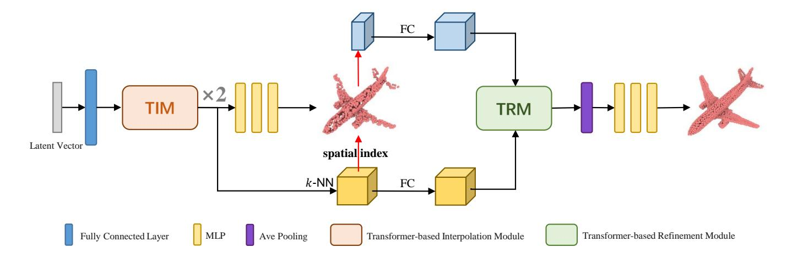
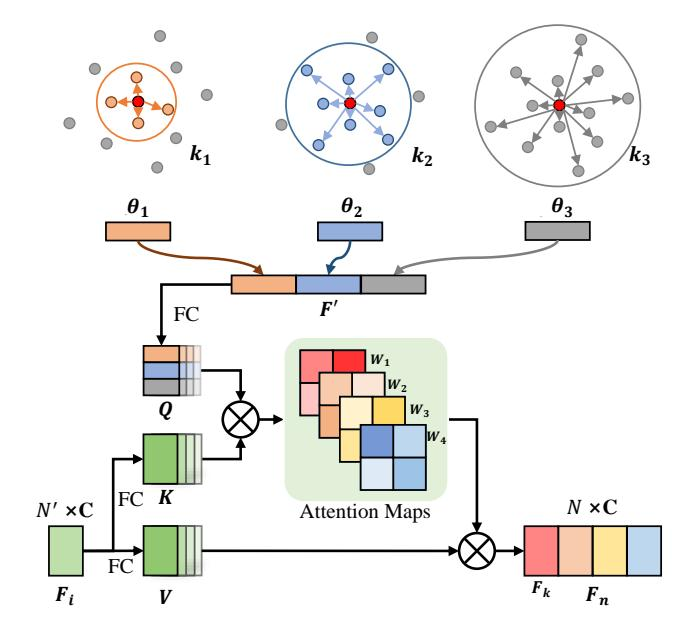
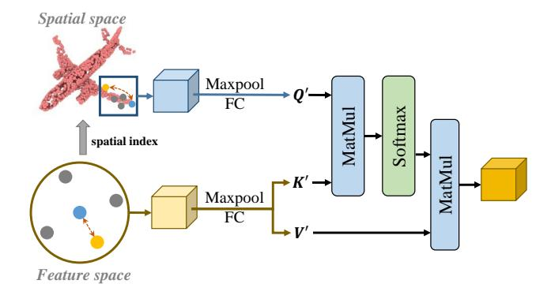
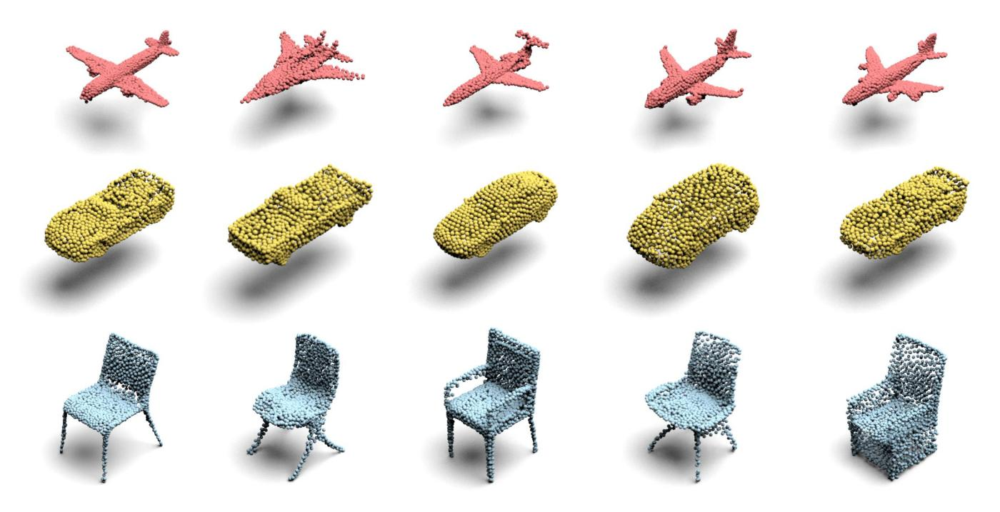
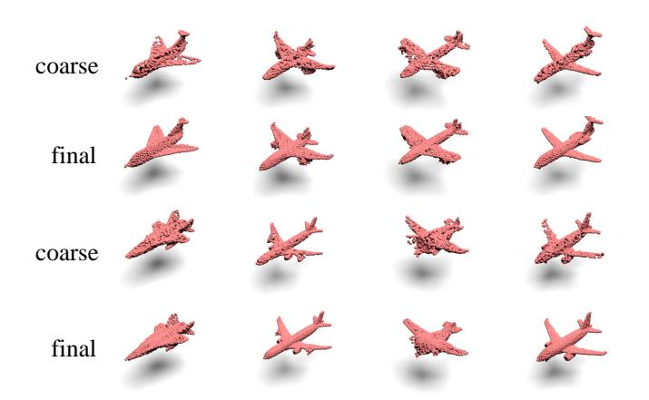
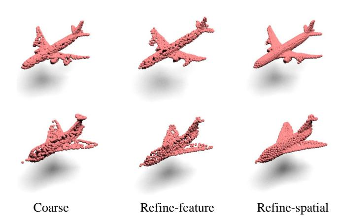

Latest updates: https://dl.acm.org/doi/10.1145/3581783.3612226

RESEARCH-ARTICLE

# **Transformer-based Point Cloud Generation Network**

RUI XU, Nanjing University of Science and Technology, Nanjing, Jiangsu, China LE HUI, Nanjing University of Science and Technology, Nanjing, Jiangsu, China YUEHUI HAN, Nanjing University of Science and Technology, Nanjing, Jiangsu, China JIANJUN QIAN, Nanjing University of Science and Technology, Nanjing, Jiangsu, China JIN XIE, Nanjing University of Science and Technology, Nanjing, Jiangsu, China

**Open Access Support** provided by: Nanjing University of Science and Technology

PDF Download 3581783.3612226.ndf 30 December 2025 Total Citations: 3 Total Downloads: 349

Published: 26 October 2023

Citation in BibTeX format

MM '23: The 31st ACM International Conference on Multimedia October 29 - November 3, 2023 Ottawa ON, Canada

**Conference Sponsors:** 

# **Transformer-based Point Cloud Generation Network**

Rui Xu†
Nanjing University of Science and
Technology
xu ray@njust.edu.cn

Le Hui†
Nanjing University of Science and
Technology
Northwestern Polytechnical
University
le.hui@njust.edu.cn

Yuehui Han†
Nanjing University of Science and
Technology
hanyh@njust.edu.cn

Jianjun Qian† Nanjing University of Science and Technology csjqian@njust.edu.cn

Jin Xie\*†
Nanjing University of Science and
Technology
csjxie@njust.edu.cn

#### **ABSTRACT**

Point cloud generation is an important research topic in 3D computer vision, which can provide high-quality datasets for various downstream tasks. However, efficiently capturing the geometry of point clouds remains a challenging problem due to their irregularities. In this paper, we propose a novel transformer-based 3D point cloud generation network to generate realistic point clouds. Specifically, we first develop a transformer-based interpolation module that utilizes k-nearest neighbors at different scales to learn global and local information about point clouds in the feature space. Based on geometric information, we interpolate new point features to upsample the point cloud features. Then, the upsampled features are used to generate a coarse point cloud with spatial coordinate information. We construct a transformer-based refinement module to enhance the upsampled features in feature space with geometric information in coordinate space. Finally, we use a multi-layer perceptron on the upsampled features to generate the final point cloud. Extensive experiments on ShapeNet and ModelNet demonstrate the effectiveness of our proposed method.

#### CCS CONCEPTS

• Computing methodologies  $\rightarrow$  Artificial intelligence; Computer vision;

### **KEYWORDS**

point cloud, generative model, transformer, deep learning

Permission to make digital or hard copies of all or part of this work for personal or classroom use is granted without fee provided that copies are not made or distributed for profit or commercial advantage and that copies bear this notice and the full citation on the first page. Copyrights for components of this work owned by others than the author(s) must be honored. Abstracting with credit is permitted. To copy otherwise, or republish, to post on servers or to redistribute to lists, requires prior specific permission and/or a fee. Request permissions from permissions@acm.org.

MM '23, October 29-November 3, 2023, Ottawa, ON, Canada

© 2023 Copyright held by the owner/author(s). Publication rights licensed to ACM. ACM ISBN 979-8-4007-0108-5/23/10...\$15.00 https://doi.org/10.1145/3581783.3612226

#### **ACM Reference Format:**

Rui Xu, Le Hui, Yuehui Han, Jianjun Qian, and Jin Xie. 2023. Transformerbased Point Cloud Generation Network. In *Proceedings of the 31st ACM International Conference on Multimedia (MM '23), October 29-November 3, 2023, Ottawa, ON, Canada.* ACM, New York, NY, USA, 9 pages. https://doi.org/10.1145/3581783.3612226

#### 1 INTRODUCTION

Point clouds are a simple yet effective form of 3D data that finds wide applications in various 3D computer vision tasks such as reconstruction [15, 18, 20, 21], semantic segmentation [14, 33, 41, 43], tracking [10, 25, 28], registration [3, 34, 37, 40]. With the rapid development of deep learning, generating 3D point clouds has gained significant attention. The quality of generated point clouds directly impacts the performance of downstream tasks. However, due to the irregular and unordered nature of point clouds, generating high-quality point clouds remains a challenging problem.

GAN [8] was first introduced as a powerful generative model for 2D tasks, and many GAN variants have since been developed that achieve impressive performance. Researchers have recently sought to apply GAN-based models to generate 3D shapes. Initially, Qi et al. [23] proposed PointNet, a model consisting of fully-connected layers that could directly process raw point clouds. Building on PointNet, Achlioptas et al. [1] introduced an auto-encoder capable of reconstructing point clouds and explored two different GANbased models for point cloud generation. However, these models require training in two separate stages. To overcome this limitation, Li et al. [13] proposed a modification of GAN called PCGAN, which can learn to generate point clouds using ideas from hierarchical Bayesian modeling and implicit generative models. Valsesia et al. [31] developed a generator based on graph convolution to generate localized features. While Wen et at. [36] proposed a dual generators framwork to generate point clouds in a coarse-to-fine manner. However, these methods neglect the geometric information of the point clouds when generating new points, and adopting multi-step strategies increases the complexity of the models.

In this paper, we propose a transformer-based 3D point cloud generation network that draws inspiration from the powerful context-modeling capabilities of transformers [32]. This end-to-end trainable model is designed to generate high-quality point clouds by leveraging the transformer to capture local and global information

 $^{\star}$ Corresponding author.

&lt;sup>†Rui Xu, Le Hui, Yuehui Han, Jianjun Qian and Jin Xie are with PCA Lab, Key Lab of Intelligent Perception and Systems for High-Dimensional Information of Ministry of Education, and Jiangsu Key Lab of Image and Video Understanding for Social Security, School of Computer Science and Engineering, Nanjing University of Science and Technology.

for feature interpolation while refining the point cloud details using spatial coordinates. Specifically, our model first maps latent vectors to high-dimensional initial feature maps of point clouds using fully-connected layers. We then propose a transformer-based interpolation module (TIM) to upsample point cloud features by interpolating new point features, where the multi-scale k-nearest neighbor (k-NN) used to capture the local and global information. In the TIM, the small value of k indicates a strong correlation between neighborhood points and the center point, representing local information. Conversely, the large k value represents global information since the neighborhood points are further away from the center point. By concatenating neighborhood information at different scales, we can obtain embeddings containing local and global information of the center points. Furthermore, we employ a multi-head attention mechanism to generate attention maps with different correlations for interpolating new point features. After combining multiple transformer-based interpolation modules, point cloud features are upsampled to the required number of points.

However, point clouds can exhibit complex geometric structures that are difficult to capture in feature space alone. Therefore, we develop a transformer-based refinement module (TRM) to refine the upsampled point cloud features using spatial coordinates. After obtaining the upsampled point cloud features through TIMs, we use a multi-layer perceptron (MLP) to generate coarse point clouds containing geometric information in the coordinate space. In TRM, the rough point clouds provide coordinate information for point cloud features in the feature space. We combine local information in feature space and coordinate space to compute the correlation between points and refine the upsampled features by weighted summation. Finally, we use another MLP to regress the final coordinates from the refined point cloud features. To evaluate the quality of generated point clouds, we use PointNet as the discriminator to distinguish generated point clouds from real ones. Our extensive qualitative and quantitative experiments on the ShapeNet and ModelNet datasets show that our proposed method achieves state-of-the-art performance.

The main contributions of the paper are as follows:

- We propose a novel end-to-end 3D point cloud generation network based on transformers, which effectively captures the local and global geometric information of point clouds by leveraging the context modeling ability of transformers.
- We develop a transformer-based interpolation module to interpolate new point features containing local and global information via the multi-scale k-nearest neighbor and multihead attention mechanism.
- We introduce a transformer-based refinement module that utilizes the spatial coordinate information of point clouds to supplement the details of point clouds and improve the quality of generated point clouds.

#### 2 RELATED WORK

### 2.1 Deep learning on 3D point cloud

Due to the irregularity of point clouds, researchers have used artificial features to characterize point clouds in the past. As deep learning rapidly advances, many works have been dedicated to designing deep models for learning representations of point clouds [2,

16, 17, 22, 26, 38, 44]. In order to make the neural network directly process the raw point clouds, PointNet [23] first proposed to use the multi-layer perception (MLP) to process each point separately and used symmetric functions to aggregate global features. However, this simple model cannot capture the local features of point clouds. To address this problem, PointNet++ [24] proposed a hierarchical structure to aggregate local features. Subsequently, more and more research [12, 35] was devoted to designing different networks to extract local and global features of point clouds. For example, DGCNN [35] proposed the EdgeConv module to obtain topological information on point clouds. KdNet [12] used the structure of the KD Tree to aggregate the features of irregular point clouds.

### 2.2 Point cloud generation

Existing research on point cloud generation can be roughly divided into GAN-based methods [1, 11, 30, 31, 36] and probability-based methods [4, 19, 39]. rGAN [1] was a pioneering work that proposed an autoencoder-based framework for point cloud generation. However, the simple MLP structures usually fail to capture the local geometric structure of point clouds, so it is difficult to generate fine-structured point clouds. TreeGAN [27] proposed a tree-based graph convolutional network to improve the quality of generated point clouds by preserving the information of ancestor nodes. However, graph convolutional networks often face problems such as high computational complexity and time-consuming model training. PDGN [11] gradually generated multi-resolution point clouds by proposing learnable bilinear interpolation and formulating a shape consistency loss to make point clouds of different resolutions consistent. Wen et at. [36] proposed dual generators to generate point clouds in a coarse-to-fine fashion. The first generator generated a dense point cloud, and the second generator refined the point cloud through reconstruction. Unlike GAN-based methods, probability-based models focus on the average distribution of data and ignore the geometric structure of point clouds, leading to noise problems of the generated point clouds. Recently, diffusion-based methods [19, 42] have been gradually applied to 3D point cloud generation and achieved great performance.

#### 2.3 Transformer

Transformer is a deep learning framework based on the self-attention mechanism, which is widely used in natural language processing (NLP) and computer vision tasks. Transformer [32] first proposed to use attention instead of RNN to capture the long-term dependence of language sequences. Then BERT [6] pre-trained the model through the Masked Language Model and Next Sentence Prediction so that the model can fully understand the semantics of sentences and the relationship between sentences. Influenced by the great success of transformers on NLP tasks, researchers extended transformers to 2D vision. ViT [7] first divided the image into patches and then input the patches as a sequence into the transformer to extract the image context information. The Excellent image classification performance proves the transformer's effectiveness in extracting image features. Gradually, more and more transformer-based methods are used for various 2D vision tasks, such as segmentation [29], detection [5]. In recent years, researchers have also focused on point cloud feature extraction. Zhao et al. [45] and Guo et al. [9]

Figure 1: The architecture of the generator. The generation process includes feature upsampling and feature refinement. In feature upsampling, the transformer-based interpolation module (TIM) exploits global and local information to learn interpolation. In feature refinement, the transformer-based refinement module (TRM) employs coordinate information to refine the upsampled features from the TIM.

introduced the transformer for point cloud feature extraction and achieved excellent results in segmentation and classification tasks.

#### 3 PROPOSED METHOD

In this section, we provide a detailed description of our proposed framework, which is based on the GAN model and comprises two main parts: the generator and the discriminator. Specifically, we first introduce the generator in Section 3.1, composed of the transformer-based interpolation modules and the transformer-based refinement module, as illustrated in Figure 1. We elaborate on the functionalities and design of each module. Next, Section 3.2 introduces our discriminator and elaborates on our training strategy. Together, these two components form our end-to-end 3D point cloud generation framework.

## 3.1 Point cloud generator

3.1.1 Overall architecture. Our model aims to generate high-quality point clouds from a latent vector input. Using a fully-connected layer, we first map the latent vector to an initial point cloud feature map  $F_i$ . To upsample the point cloud feature, we use the transformer-based interpolation (TIM) module to interpolate in feature space. The upsampled feature is then used to generate a coarse point cloud with an underlying structure using MLP. Additionally, we refine the upsampled feature based on the geometric structure of the generated rough point cloud in coordinate space. Finally, we use a max-pooling aggregation the refined feature, and an MLP to generate the final point cloud coordinates.

3.1.2 Transformer-based interpolation module. Since the quality of the generated point cloud is directly determined by the learned point cloud features, capturing the point cloud geometry is crucial in point cloud feature upsampling. Benefiting from the powerful

Figure 2: The overview of the transformer-based interpolation module. Pointwise features  $F_i$  are mapped to the value V and key K, and multi-scale features F' are mapped to the query Q. With multi-head attention, we can learn attention maps in different subspaces to interpolate multiple new point features  $F_n$ .

interactive function of the transformer, we develop the transformer-based interpolation module (TIM), as shown in Figure 2. This module considers both local geometric features and global relationships when interpolating new point features. Specifically, we first employ the k-NN operation to construct three neighborhoods of different

scales for each point:  $k_1$ ,  $k_2$ , and  $k_3$ , where  $k_1 < k_2 < k_3$ . The distance between the neighbor and center points reflects the similarity with the center points. Therefore, given a point  $p_i$  and the neighboring points  $p_j$ , we can formulate the geometric feature  $\theta \in \mathbb{R}^{N' \times d}$  as:

$$\theta = \max pool(FC(\mathbf{p}_i - \mathbf{p}_i)), \tag{1}$$

where the FC is a fully-connected layer. The small-scale neighborhood points are more similar to the center point, effectively capturing local features. Conversely, the large-scale neighborhood contains a more number of points, enabling the description of global features. We concatenate the geometric features of different scales to obtain new feature F':

$$F' = [\theta_1; \theta_2; \theta_3], \tag{2}$$

Therefore, the new feature  $F' \in \mathbb{R}^{N' \times 3d}$  contains both global and local information. We employ two fully-connected layers on the point-wise feature  $F_i$  to get the key map  $K \in \mathbb{R}^{N' \times C}$  and value map  $V \in \mathbb{R}^{N' \times C}$ , respectively. At the same time, we apply another fully-connected layer on the new feature F' to obtain the query map  $Q \in \mathbb{R}^{N' \times C}$ . To consider the correlation of each point, we can formulate the attention maps  $W \in \mathbb{R}^{N' \times N'}$  as:

$$W = QK^{\top}, \tag{3}$$

We use four sets of such operations to obtain different attention maps  $\{W_i \in \mathbb{R}^{N' \times N'} | i=1,2,3,4\}$ . The attention maps learn point-to-point similarities in different subspaces. Therefore, the initial point cloud feature can interpolate new point features according to different attention maps to realize point cloud feature upsampling. The interpolated features  $F_n \in \mathbb{R}^{N \times C}$  are formulated as:

$$F_n = [F_1; F_2; F_3; F_4],$$
 (4)

where the  $\{F_{\pmb{k}} \in \mathbb{R}^{N' \times C} | k=1,2,3,4\}$  is generated point feature by the corresponding initial feature and attention map.  $F_{\pmb{k}}$  are defined as:

$$F_{k} = softmax(\frac{W_{k}}{\sqrt{C}})V_{k}, \tag{5}$$

Justifiably, the upsampled features obtained by the TIM fully consider the local and global information. After self-attention, we follow it with a feed-forward network in the transformer. The feed-forward network consists of two fully-connected layers and a nonlinear activation layer. By applying a nonlinear transformation to the features, the feed-forward network enhances the expressiveness of the feature representation.

3.1.3 Transformer-based refinement module. In the point cloud generation, the feature space captures the relative positions and surface characteristics of points but lacks absolute position and shape information, which can result in deviations between the generated point clouds and the real point clouds. Therefore, combining coordinate and feature space information can provide a more comprehensive representation of point clouds.

We develop the transformer-based refinement module (TRM) to refine the upsampled point cloud features, as shown in Figure 3. Specifically, we apply the k-NN operation to get the neighborhood of each point of the upsampled features. Since the nearest neighbor in the feature space is not necessarily the nearest neighbor in the coordinate space, we find the corresponding coordinates on the

Figure 3: The overview of the transformer-based refinement module. Neighborhood features in feature space are mapped to the key K' and value V', while neighborhood features in spatial space are mapped to the query Q'. It is worth noting that the neighbor points in the spatial space are obtained from the k-nearest neighbors in the feature space according to the spatial index. After weighted summation, the upsampled features are refined by spatial space information.

generated coarse point cloud according to the index of the neighborhood points. As in TIM, we compute the query map  $Q' \in \mathbb{R}^{N \times C'}$ , key map  $K' \in \mathbb{R}^{N \times C'}$  and value map  $V' \in \mathbb{R}^{N \times C'}$  through three fully- connected layers, respectively. We also map the coordinate information through a fully-connected layer to obtain position embeddings (PE), which are then added to the query Q', key K', and value V'. We formulate this process as follows:

$$PE = FC(ReLU(FC(P_i))), (Q', K', V') = (Q', K', V') + PE,$$
(6)

where  $P_i$  is the coordinates of points. This allows us to fully utilize the coordinate information to refine the upsampled features. Different from TIM, the Q' here is obtained from the coordinate space. After that, we can learn the attention map  $W' \in \mathbb{R}^{N \times N}$  through the query Q' and the key K'. Following this, the refined point features  $F_r \in \mathbb{R}^{N \times C'}$  are computed as:

$$F_r = softmax(\frac{W'}{\sqrt{C'}})V', \tag{7}$$

Since the attention map adaptively learns the correlation between the neighbor points in feature and coordinate space, the upsampled features can be effectively refined. Finally, we employ MLP to generate the final point clouds from the refined point cloud features.

### 3.2 Training Objectives

3.2.1 Discriminator. Following the method [11], we employ Point-Net as the discriminator to distinguish between real and generated point clouds. In our framework, the rough point clouds generated by the upsampled features must also be fed to the discriminator to identify and share the same discriminator with the final output point clouds.

3.2.2 Loss functions. Like other GAN-based models, our model is trained with an adversarial strategy. The adversarial loss  $L_{adv}$ 

Table 1: The comparison results of different methods on the "Airplane" and "Chair". CD is multiplied by  $10^3$ , EMD is multiplied by  $10^1$  and JSD is multiplied by  $10^3$ .

| Category | Model          | JSD (↓) | MMD (↓) |       | COV (%, ↑) |        | 1-NNA | 1-NNA (%, ↓) |  |
|----------|----------------|---------|---------|-------|------------|--------|-------|--------------|--|
| Category | Woder          | JOE (4) | CD      | EMD   | CD         | EMD    | CD    | EMD          |  |
|          | PC-GAN [1]     | 6.188   | 3.819   | 1.810 | 42.17      | 13.842 | 77.59 | 98.52        |  |
|          | GCN-GAN [31]   | 6.669   | 4.713   | 1.650 | 39.04      | 18.62  | 89.13 | 98.60        |  |
| A :1     | TreeGAN [27]   | 15.646  | 4.323   | 1.953 | 39.37      | 8.40   | 83.86 | 99.67        |  |
| Airplane | PointFlow [39] | 1.536   | 3.688   | 1.090 | 44.98      | 44.65  | 66.39 | 69.36        |  |
|          | PDGN [11]      | 1.891   | 3.287   | 1.121 | 48.62      | 43.82  | 63.42 | 71.17        |  |
|          | DPM[19]        | 1.067   | 3.276   | 1.061 | 48.71      | 45.47  | 64.83 | 75.12        |  |
|          | DualGAN [36]   | 1.304   | 3.321   | 1.082 | 48.97      | 44.39  | 63.17 | 73.23        |  |
|          | TGN (Ours)     | 1.057   | 3.203   | 1.012 | 49.23      | 46.21  | 62.05 | 72.21        |  |
| Chair    | PC-GAN[1]      | 6.649   | 13.436  | 3.104 | 46.23      | 22.14  | 69.67 | 100.00       |  |
|          | GCN-GAN [31]   | 21.708  | 15.354  | 2.213 | 39.84      | 35.09  | 77.86 | 95.80        |  |
|          | TreeGAN [27]   | 13.282  | 14.936  | 3.613 | 38.02      | 6.77   | 74.92 | 100.00       |  |
|          | PointFlow [39] | 12.474  | 13.631  | 1.856 | 41.86      | 43.38  | 66.13 | 68.40        |  |
|          | PDGN [11]      | 6.764   | 12.852  | 2.082 | 53.48      | 39.33  | 60.71 | 75.53        |  |
|          | DPM[19]        | 7.797   | 12.276  | 1.784 | 48.94      | 47.52  | 60.11 | 69.06        |  |
|          | DualGAN [36]   | 7.154   | 12.687  | 1.879 | 47.65      | 44.98  | 61.65 | 71.62        |  |
|          | TGN (Ours)     | 6.531   | 12.150  | 1.754 | 49.23      | 48.82  | 59.21 | 68.23        |  |

is used to constrain the distribution of generated and real point clouds, which can be formulated as:

$$L(D) = E_{\boldsymbol{x} \sim p_{real}(\boldsymbol{x})} (\log D(\boldsymbol{x}) + \log (1 - D(G(\boldsymbol{z})))),$$
  

$$L(G) = E_{\boldsymbol{z} \sim p_{\boldsymbol{z}}(\boldsymbol{z})} (\log (1 - D(G(\boldsymbol{z})))),$$
(8)

Furthermore, to ensure consistency between the final generated point clouds and the coarse point clouds, which provide coordinate information, we employ the Chamfer distance loss  $L_{cd}$  as follows:

$$L_{cd} = \sum_{p \in P} \min_{q \in Q} \|p - q\|_2^2 + \sum_{q \in Q} \min_{p \in P} \|q - p\|_2^2, \tag{9}$$

The overall loss function can be defined as:

$$L = L_{adv} + L_{cd}. (10)$$

### 4 EXPERIMENTS

#### 4.1 Experiment Settings

4.1.1 Datasets. We evaluate our model on three widely used datasets, including ModelNet10, ModelNet40 and ShapeNet. ModelNet10 and ModelNet40 contain 3D models of 10 and 40 categories, respectively. ShapeNet includes 55 classes and 513,000 objects. Following the setting of previous works [11, 19, 39], we train our model on "Airplane", "Chair" and "Car" categories. Each point cloud has 2048 points.

4.1.2 Implementation details. Our model generates a point cloud with 2048 points from a 128-dimensional latent vector. The generator contains two transformer-based interpolation modules (TIM) and one transformer-based refinement module (TRM). Four different sets of attention maps are learned in each TIM. In addition, due to the different number of points in the input point cloud features, we set the values of  $k_1$ ,  $k_2$  and  $k_3$  to (10, 20, 40) and (20, 40, 80) in the

two TIMs, respectively. We adopt Adam to optimize the generator and discriminator with the learning rate of  $10^{-4}$ .

### 4.2 Evaluation of point cloud generation

4.2.1 Quantitative evaluation. We compare our method with seven state-of-the-art point cloud generation methods, including PC-GAN [1], GCN-GAN [31], Tree-GAN [27], PointFlow [39], PDGN [11], DPM [19] and DualGAN [36]. In order to make a fair comparison, we keep the same experimental settings as the previous works. We adopt Jensen-Shannon Divergence (JSD), Coverage (COV), and Minimum Matching Distance (MMD) proposed by Achlioptas et al. [1] and the 1-nearest neighbor accuracy (1-NNA) proposed by Yang et al. [39] to evaluate our model. In Table 1, we present the results of different methods on the "Airplane" and "Chair" categories. We can find that our method outperforms other methods on most metrics. Compared with other methods, our model considers both local and global information when upsampling features. And the transformer's excellent global context modeling ability makes the upsampled features more robust. Furthermore, we refine the upsampled features with spatial coordinate information, which further improves the quality of the final generated point clouds. While PDGN incorporates coordinate space information during the interpolation process, it overlooks global context information and relies on generating the final resolution point clouds progressively from multiple low-resolution point clouds. Additionally, the results for the "Car" category are shown in the supplementary material.

4.2.2 Visual results. As shown in Figure 4, we also visualize the generated point clouds on the ShapeNet dataset. We can see that the structures of the generated point clouds are clear, which proves that our model can effectively capture the geometric structure information of the point clouds.

Figure 4: Examples of point clouds generated by our model. From top to bottom: "Airplane", "Car" and "Chair".

Figure 5: Visualization results of generated point clouds by our model.

Furthermore, we also demonstrate the visualization results of the generated rough point clouds and the final point clouds on the "Airplane" category, as shown in Figure 5. It can be observed that the coarse point clouds generated by the upsampled features already possesses specific geometric structures. After refinement by the TRM module, the details of the point cloud are significantly improved.

4.2.3 Classification results. To investigate the representation learning ability of the model, we conduct classification experiments as in previous methods [11, 36, 39]. Specifically, we first train our model

Table 2: Classification accuracy of various methods on ModelNet10 (MN10) and ModelNet40 (MN40) datasets.

| Model          | MN10 (%) | MN40 (%) |
|----------------|----------|----------|
| PointFlow [39] | 93.7     | 86.8     |
| ShapeGF [4]    | 90.2     | 84.6     |
| PDGN [11]      | 94.2     | 87.3     |
| DPM [19]       | 94.2     | 87.6     |
| DualGAN [36]   | 94.1     | 87.6     |
| TGN (ours)     | 94.2     | 87.7     |

with all the data of ShapeNet, then use the trained discriminator to extract features to train a linear SVM for classification on ModelNet10 and ModelNet40. In Table 2, our model outperforms other methods on ModelNet40 and also achieves competitive results on ModelNet10.

### 4.3 Ablation Study

4.3.1 Transformer-based interpolation module. We conduct experiments on the ShapeNet dataset to verify the effectiveness of our model. Specifically, we first use fully-connected layers to increase and reshape features to achieve upsampling and then use MLP to regress point cloud coordinates. This simple network is used as the baseline (B) to generate point clouds. The TIM captures local and global information to upsample features. As shown in Table 4, we can see that all evaluation metrics are significantly improved by replacing fully-connected layers with TIM (B + TIM).

Table 3: The comparison results of different methods on the "Airplane". CD is multiplied by 103, EMD is multiplied by 101 and JSD is multiplied by 103. Time represents the amount of time in minutes required for the model to train for one epoch.

| Neighborhood Size k                      | Time | JSD (↓) - | MMD (↓) |       | COV (%, †) |       | 1-NNA | 1-NNA (%, ↓) |  |
|------------------------------------------|------|-----------|---------|-------|------------|-------|-------|--------------|--|
| Trengths office w                        | Time |           | CD      | EMD   | CD         | EMD   | CD    | EMD          |  |
| $k_1 = 5$                                | 0.71 | 1.522     | 3.453   | 1.104 | 47.31      | 43.36 | 66.04 | 76.34        |  |
| $k_1 = 40$                               | 1.35 | 1.316     | 3.378   | 1.072 | 48.03      | 44.16 | 64.75 | 74.21        |  |
| $k_1 = 5, k_2 = 10$                      | 0.95 | 1.136     | 3.252   | 1.058 | 48.27      | 44.82 | 63.46 | 73.92        |  |
| $k_1 = 20, k_2 = 40$                     | 1.18 | 1.087     | 3.224   | 1.029 | 48.71      | 45.13 | 62.94 | 73.11        |  |
| $k_1 = 5, k_2 = 10, k_3 = 20$            | 1.05 | 1.061     | 3.217   | 1.021 | 48.89      | 45.67 | 62.71 | 72.72        |  |
| $k_1 = 10, k_2 = 20, k_3 = 40$           | 1.13 | 1.057     | 3.203   | 1.012 | 49.23      | 46.21 | 62.05 | 72.21        |  |
| $k_1 = 20, k_2 = 40, k_3 = 80$           | 1.44 | 1.056     | 3.201   | 1.010 | 49.24      | 46.25 | 62.08 | 72.29        |  |
| $k_1 = 10, k_2 = 20, k_3 = 40, k_4 = 80$ | 1.60 | 1.050     | 3.191   | 1.009 | 49.21      | 46.35 | 61.87 | 72.24        |  |

Table 4: Ablation studies on "Chair" category. There are three different settings of our TGN: baseline (B), baseline with transformer-based interpolation module (B + TIM) and baseline with transformer-based refinement module (B + TRM).

| Model      | JSD (↓) | MMI    | ) (\b) | COV (%, ↑) |       |  |
|------------|---------|--------|--------|------------|-------|--|
| 1110 401   |         | CD     | EMD    | CD         | EMD   |  |
| В          | 23.892  | 16.53  | 2.562  | 38.24      | 36.35 |  |
| B+TIM      | 11.32   | 13.879 | 2.034  | 44.78      | 43.27 |  |
| B+TRM      | 19.831  | 15.44  | 2.396  | 41.81      | 40.07 |  |
| TGN (Ours) | 6.531   | 12.150 | 1.754  | 49.23      | 48.82 |  |

Table 5: Ablation studies on "Airplane" category.

| Model          | JSD (1) | MM    | D (\dagger) | COV (%, ↑) |       |
|----------------|---------|-------|-------------|------------|-------|
| 1110401        | Jez (4) | CD    | EMD         | CD         | EMD   |
| Coarse         | 2.034   | 4.153 | 1.325       | 44.08      | 42.16 |
| Refine-feature | 1.727   | 3.872 | 1.214       | 46.23      | 44.47 |
| Refine-spatial | 1.057   | 3.203 | 1.012       | 49.23      | 46.21 |

4.3.2 Transformer-based refinement module. To demonstrate the effectiveness of TRM, we add TRM after Baseline (B + TRM) and TIM (TGN), respectively. In Table 4, it can be seen that both models (B + TRM and TGN) have improved. Compared with the baseline (B), the improvement of the model (B + TRM) is not significant. This is because the quality of the initial point cloud generated by the baseline is too poor to provide too much effective coordinate information. Since the upsampled features of TIM contain local and global information, the generated rough point cloud has a better underlying structure. So after TRM refines the upsampled features, the quality of the generated point cloud is further improved.

Moreover, we conducted comparative experiments to validate the effectiveness of incorporating coordinate information in TRM. We replaced the local features used to map the query Q' in the TRM from spatial space to feature space, considering only the correlation within the feature space when calculating the attention map. The results presented in Table 5 demonstrate that adding coordinate

Figure 6: The visualization results of different refinenet on the "Airplane" category.

information (Refine-spatial) significantly enhances the quality of point cloud generation compared to refinement without coordinate information (Refine-feature). This is further supported by the visualization results depicted in Figure 6, where the utilization of coordinate information allows for improved hole completion in the point cloud and a more accurate representation of wing and engine geometry.

4.3.3 Different scale KNN in TIM. To study the effect of different scales k-nearest neighbors in feature interpolation, we set up multiple groups of k values, and the experimental results are shown in Table 3. It is noted that the k value in the second TIM is twice the size of the k value in the first TIM.

From Table 3, one can see that incorporating multiple neighborhoods of the point cloud can enhance the model's performance, but lead to more training time. For example, our proposed method with  $k_1$ =10,  $k_2$ =20,  $k_3$ =40 and  $k_4$ =80 can yield better performance than that with  $k_1$ =10,  $k_2$ =20,  $k_3$ =40. Nonetheless, from Table 3, we can also observe that the proposed method with too large neighborhood size cannot obtain significant performance gain in terms of the point cloud generation task. For example, in comparison with the results with  $k_1$ =20,  $k_2$ =40,  $k_3$ =80, the performance gain with

 $k_1$ =10,  $k_2$ =20,  $k_3$ =40 is minor, leading to 22% increase in training time. Due to the trade-off between performance and training time, in our experiment, we set the neighborhood sizes to  $k_1$ =10,  $k_2$ =20,  $k_3$ =40.

### 5 CONCLUSION

In this paper, we presented a transformer-based point cloud generation network. We developed a novel transformer-based interpolation module to comprehensively capture local and global information during feature upsampling. The upsampled features generated coarse point clouds with spatial coordinates. Then, we proposed a transformer-based refinement module, which refines point cloud features using coordinate information, leading to even better quality generated point clouds. Extensive experiments on three widely-used point cloud datasets demonstrate the effectiveness of our model.

#### ACKNOWLEDGMENTS

The authors would like to thank reviewers for their detailed comments and instructive suggestions. This work was supported by the National Natural Science Foundation of China (Grant No. 62176124).

#### REFERENCES

- Panos Achlioptas, Olga Diamanti, Ioannis Mitliagkas, and Leonidas Guibas. 2018.
   Learning representations and generative models for 3D point clouds. In *International conference on machine learning*. 40–49.
- [2] Mohamed Afham, Isuru Dissanayake, Dinithi Dissanayake, Amaya Dharmasiri, Kanchana Thilakarathna, and Ranga Rodrigo. 2022. Crosspoint: Self-supervised cross-modal contrastive learning for 3d point cloud understanding. In Proceedings of the IEEE/CVF Conference on Computer Vision and Pattern Recognition. 9902– 2012.
- [3] Yasuhiro Aoki, Hunter Goforth, Rangaprasad Arun Srivatsan, and Simon Lucey. 2019. Pointnetlk: Robust & efficient point cloud registration using pointnet. In Proceedings of the IEEE/CVF Conference on Computer Vision and Pattern Recognition. 7163–7172
- [4] Ruojin Cai, Guandao Yang, Hadar Averbuch-Elor, Zekun Hao, Serge Belongie, Noah Snavely, and Bharath Hariharan. 2020. Learning gradient fields for shape generation. In Proceedings of the European Conference on Computer Vision. Springer, 364–381.
- [5] Nicolas Carion, Francisco Massa, Gabriel Synnaeve, Nicolas Usunier, Alexander Kirillov, and Sergey Zagoruyko. 2020. End-to-end object detection with transformers. In Proceedings of the European Conference on Computer Vision. Springer, 213–229.
- [6] Jacob Devlin, Ming-Wei Chang, Kenton Lee, and Kristina Toutanova. 2018. Bert: Pre-training of deep bidirectional transformers for language understanding. arXiv preprint arXiv:1810.04805 (2018).
- [7] Alexey Dosovitskiy, Lucas Beyer, Alexander Kolesnikov, Dirk Weissenborn, Xiaohua Zhai, Thomas Unterthiner, Mostafa Dehghani, Matthias Minderer, Georg Heigold, Sylvain Gelly, et al. 2020. An image is worth 16x16 words: Transformers for image recognition at scale. arXiv preprint arXiv:2010.11929 (2020).
- [8] Ian Goodfellow, Jean Pouget-Abadie, Mehdi Mirza, Bing Xu, David Warde-Farley, Sherjil Ozair, Aaron Courville, and Yoshua Bengio. 2014. Generative adversarial nets. Advances in neural information processing systems 27 (2014).
- [9] Meng-Hao Guo, Jun-Xiong Cai, Zheng-Ning Liu, Tai-Jiang Mu, Ralph R Martin, and Shi-Min Hu. 2021. Pct: Point cloud transformer. *Computational Visual Media* 7, 2 (2021), 187–199.
- [10] Le Hui, Lingpeng Wang, Mingmei Cheng, Jin Xie, and Jian Yang. 2021. 3D Siamese voxel-to-BEV tracker for sparse point clouds. Advances in neural information processing systems 34 (2021), 28714–28727.
- [11] Le Hui, Rui Xu, Jin Xie, Jianjun Qian, and Jian Yang. 2020. Progressive point cloud deconvolution generation network. In Proceedings of the European Conference on Computer Vision. Springer, 397–413.
- [12] Roman Klokov and Victor Lempitsky. 2017. Escape from cells: Deep kd-networks for the recognition of 3D point cloud models. In Proceedings of the IEEE/CVF International Conference on Computer Vision. 863–872.
- [13] Chun-Liang Li, Manzil Zaheer, Yang Zhang, Barnabas Poczos, and Ruslan Salakhutdinov. 2018. Point cloud gan. arXiv preprint arXiv:1810.05795 (2018).
- [14] Mengtian Li, Yuan Xie, Yunhang Shen, Bo Ke, Ruizhi Qiao, Bo Ren, Shaohui Lin, and Lizhuang Ma. 2022. Hybrider: Weakly-supervised 3d point cloud semantic

- segmentation via hybrid contrastive regularization. In Proceedings of the IEEE/CVF Conference on Computer Vision and Pattern Recognition. 14930-14939.
- [15] Chen-Hsuan Lin, Chen Kong, and Simon Lucey. 2018. Learning efficient point cloud generation for dense 3d object reconstruction. In Proceedings of the AAAI conference on artificial intelligence, Vol. 32.
- [16] Mengyuan Liu, Fanyang Meng, and Yongsheng Liang. 2022. Generalized pose decoupled network for unsupervised 3d skeleton sequence-based action representation learning. Cyborg and Bionic Systems 2022 (2022), 0002.
- [17] Yongcheng Liu, Bin Fan, Gaofeng Meng, Jiwen Lu, Shiming Xiang, and Chunhong Pan. 2019. Densepoint: Learning densely contextual representation for efficient point cloud processing. In Proceedings of the IEEE/CVF International Conference on Computer Vision. 5239–5248.
- [18] Qiang Lu, Mingjie Xiao, Yiyang Lu, Xiaohui Yuan, and Ye Yu. 2019. Attention-based dense point cloud reconstruction from a single image. IEEE access 7 (2019), 137420–137431.
- [19] Shitong Luo and Wei Hu. 2021. Diffusion probabilistic models for 3D point cloud generation. In Proceedings of the IEEE/CVF Conference on Computer Vision and Pattern Recognition. 2837–2845.
- [20] Priyanka Mandikal, KL Navaneet, Mayank Agarwal, and R Venkatesh Babu. 2018. 3D-LMNet: Latent embedding matching for accurate and diverse 3D point cloud reconstruction from a single image. arXiv preprint arXiv:1807.07796 (2018).
- [21] Priyanka Mandikal and Venkatesh Babu Radhakrishnan. 2019. Dense 3d point cloud reconstruction using a deep pyramid network. In IEEE Winter Conference on Applications of Computer Vision. IEEE, 1052–1060.
- [22] Jiageng Mao, Xiaogang Wang, and Hongsheng Li. 2019. Interpolated convolutional networks for 3d point cloud understanding. In Proceedings of the IEEE/CVF International Conference on Computer Vision. 1578–1587.
- [23] Charles R Qi, Hao Su, Kaichun Mo, and Leonidas J Guibas. 2017. Pointnet: Deep learning on point sets for 3D classification and segmentation. In Proceedings of the IEEE/CVF Conference on Computer Vision and Pattern Recognition. 652–660.
- [24] Charles Ruizhongtai Qi, Li Yi, Hao Su, and Leonidas J Guibas. 2017. Pointnet++: Deep hierarchical feature learning on point sets in a metric space. Advances in neural information processing systems 30 (2017).
- [25] Haozhe Qi, Chen Feng, Zhiguo Cao, Feng Zhao, and Yang Xiao. 2020. P2b: Point-to-box network for 3d object tracking in point clouds. In Proceedings of the IEEE/CVF Conference on Computer Vision and Pattern Recognition. 6329–6338.
- [26] Can Qin, Haoxuan You, Lichen Wang, C-C Jay Kuo, and Yun Fu. 2019. Pointdan: A multi-scale 3d domain adaption network for point cloud representation. Advances in neural information processing systems 32 (2019).
- [27] Dong Wook Shu, Sung Woo Park, and Junseok Kwon. 2019. 3D point cloud generative adversarial network based on tree structured graph convolutions. In Proceedings of the IEEE/CVF International Conference on Computer Vision. 3859– 3868.
- [28] Martin Simon, Karl Amende, Andrea Kraus, Jens Honer, Timo Samann, Hauke Kaulbersch, Stefan Milz, and Horst Michael Gross. 2019. Complexer-yolo: Realtime 3d object detection and tracking on semantic point clouds. In Proceedings of the IEEE/CVF Conference on Computer Vision and Pattern Recognition Workshops. 0-0
- [29] Robin Strudel, Ricardo Garcia, Ivan Laptev, and Cordelia Schmid. 2021. Segmenter: Transformer for semantic segmentation. In Proceedings of the IEEE/CVF International Conference on Computer Vision. 7262–7272.
- [30] Yingzhi Tang, Yue Qian, Qijian Zhang, Yiming Zeng, Junhui Hou, and Xuefei Zhe. 2022. WarpingGAN: Warping multiple uniform priors for adversarial 3D point cloud generation. In Proceedings of the IEEE/CVF Conference on Computer Vision and Pattern Recognition. 6397–6405.
- [31] Diego Valsesia, Giulia Fracastoro, and Enrico Magli. 2018. Learning localized generative models for 3D point clouds via graph convolution. In *International* conference on learning representations.
- [32] Ashish Vaswani, Noam Shazeer, Niki Parmar, Jakob Uszkoreit, Llion Jones, Aidan N Gomez, Łukasz Kaiser, and Illia Polosukhin. 2017. Attention is all you need. Advances in neural information processing systems 30 (2017).
- [33] Lei Wang, Yuchun Huang, Yaolin Hou, Shenman Zhang, and Jie Shan. 2019. Graph attention convolution for point cloud semantic segmentation. In Proceedings of the IEEE/CVF Conference on Computer Vision and Pattern Recognition. 10296–10305.
- [34] Yue Wang and Justin M Solomon. 2019. Deep closest point: Learning representations for point cloud registration. In Proceedings of the IEEE/CVF International Conference on Computer Vision. 3523–3532.
- [35] Yue Wang, Yongbin Sun, Ziwei Liu, Sanjay E Sarma, Michael M Bronstein, and Justin M Solomon. 2019. Dynamic graph cnn for learning on point clouds. ACM Transactions on Graphics 38, 5 (2019), 1–12.
- [36] Cheng Wen, Baosheng Yu, and Dacheng Tao. 2021. Learning progressive point embeddings for D point cloud generation. In Proceedings of the IEEE/CVF Conference on Computer Vision and Pattern Recognition. 10266–10275.
- [37] Yue Wu, Xidao Hu, Yue Zhang, Maoguo Gong, Wenping Ma, and Qiguang Miao. 2023. SACF-net: Skip-attention based correspondence filtering network for point cloud registration. *IEEE Transactions on Circuits and Systems for Video Technology* (2023)

- [38] Saining Xie, Jiatao Gu, Demi Guo, Charles R Qi, Leonidas Guibas, and Or Litany. 2020. Pointcontrast: Unsupervised pre-training for 3d point cloud understanding. In Proceedings of the European Conference on Computer Vision. Springer, 574–591.
- [39] Guandao Yang, Xun Huang, Zekun Hao, Ming-Yu Liu, Serge Belongie, and Bharath Hariharan. 2019. Pointflow: 3D point cloud generation with continuous normalizing flows. In Proceedings of the IEEE/CVF International Conference on Computer Vision. 4541–4550.
- [40] Heng Yang, Jingnan Shi, and Luca Carlone. 2020. Teaser: Fast and certifiable point cloud registration. IEEE Transactions on Robotics 37, 2 (2020), 314–333.
- [41] Xiaoqing Ye, Jiamao Li, Hexiao Huang, Liang Du, and Xiaolin Zhang. 2018. 3d recurrent neural networks with context fusion for point cloud semantic segmentation. In Proceedings of the European Conference on Computer Vision. 403–417.
- [42] Xiaohui Zeng, Arash Vahdat, Francis Williams, Zan Gojcic, Or Litany, Sanja Fidler, and Karsten Kreis. 2022. LION: Latent point diffusion models for 3D shape generation. arXiv preprint arXiv:2210.06978 (2022).
- [43] Yang Zhang, Zixiang Zhou, Philip David, Xiangyu Yue, Zerong Xi, Boqing Gong, and Hassan Foroosh. 2020. Polarnet: An improved grid representation for online lidar point clouds semantic segmentation. In Proceedings of the IEEE/CVF Conference on Computer Vision and Pattern Recognition. 9601–9610.
- [44] Hengshuang Zhao, Li Jiang, Chi-Wing Fu, and Jiaya Jia. 2019. Pointweb: Enhancing local neighborhood features for point cloud processing. In Proceedings of the IEEE/CVF Conference on Computer Vision and Pattern Recognition. 5565–5573.
- [45] Hengshuang Zhao, Li Jiang, Jiaya Jia, Philip HS Torr, and Vladlen Koltun. 2021. Point transformer. In Proceedings of the IEEE/CVF International Conference on Computer Vision. 16259–16268.