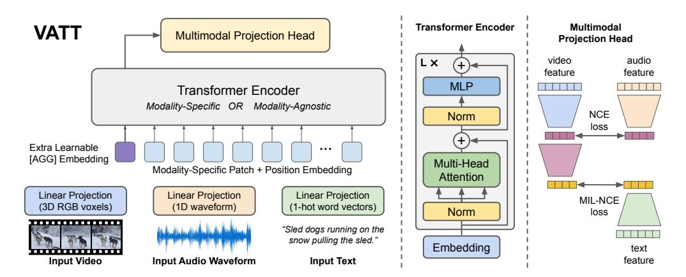
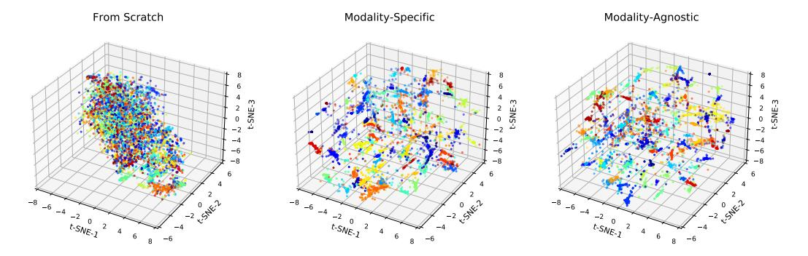
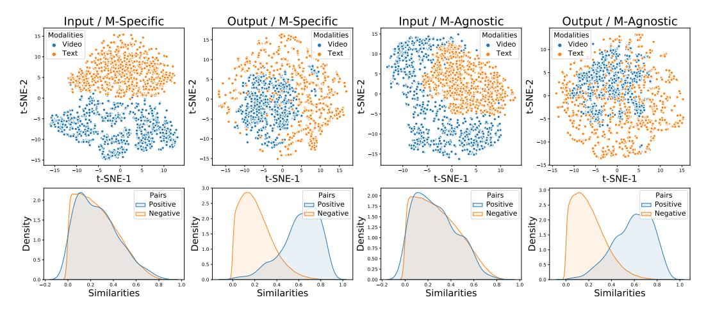
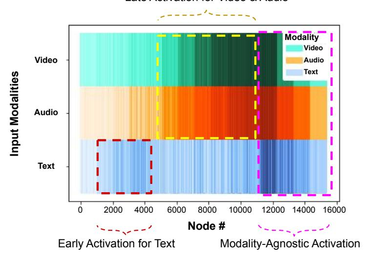

# VATT: Transformers for Multimodal Self-Supervised Learning from Raw Video, Audio and Text

# Hassan Akbari\*

Columbia University

ha2436@columbia.edu

# Wei-Hong Chuang Google

whchuang@google.com

# Liangzhe Yuan

Google

lzyuan@google.com

# Shih-Fu Chang

Columbia University

sc250@columbia.edu

# **Boqing Gong**

Google

bgong@google.com

# Rui Qian\* Cornell University rq49@cornell.edu

Yin Cui Google

yincui@google.com

## Abstract

We present a framework for learning multimodal representations from unlabeled data using convolution-free Transformer architectures. Specifically, our Video-Audio-Text Transformer (VATT) takes raw signals as inputs and extracts multimodal representations that are rich enough to benefit a variety of downstream tasks. We train VATT end-to-end from scratch using multimodal contrastive losses and evaluate its performance by the downstream tasks of video action recognition, audio event classification, image classification, and text-to-video retrieval. Furthermore, we study a modality-agnostic, single-backbone Transformer by sharing weights among the three modalities. We show that the convolution-free VATT outperforms state-of-the-art ConvNet-based architectures in the downstream tasks. Especially, VATT's vision Transformer achieves the top-1 accuracy of 82.1% on Kinetics-400, 83.6% on Kinetics-600, 72.7% on Kinetics-700, and 41.1% on Moments in Time, new records while avoiding supervised pre-training. Transferring to image classification leads to 78.7% top-1 accuracy on ImageNet compared to 64.7% by training the same Transformer from scratch, showing the generalizability of our model despite the domain gap between videos and images. VATT's audio Transformer also sets a new record on waveform-based audio event recognition by achieving the mAP of 39.4% on AudioSet without any supervised pre-training. VATT's source code is publicly available.

## 1 Introduction

Convolutional neural networks (CNNs) [53, 51] have triumphed over various computer vision tasks. The inductive bias induced by convolutions, namely translation invariance and locality, are proven effective for the visual data. In the meantime, however, we witness in the natural language processing (NLP) community a paradigm shift from the models with strong inductive biases, such as recurrent neural networks [43, 7] and CNNs [104, 32], to more general architectures constructed upon selfattention. Particularly, Transformers [88] have become the de facto model architecture for NLP

\*Work done during an internship at Google.

&lt;sup>2https://github.com/google-research/google-research/tree/master/vatt

Figure 1: Overview of the VATT architecture and the self-supervised, multimodal learning strategy. VATT linearly projects each modality into a feature vector and feeds it into a Transformer encoder. We define a semantically hierarchical common space to account for the granularity of different modalities and employ the Noise Contrastive Estimation (NCE) to train the model.

tasks [23, 70, 71, 10]. Pre-training a Transformer on large text corpora followed by fine-tuning gives rise to state-of-the-art results for different downstream tasks.

In view of the success of the attention mechanism in NLP, there has been a rich line of works exploring its potential in computer vision. Early work studied hybrid models consisting of both convolutions and attention modules [89, 94, 36, 105]. Recent studies showed that convolution-free, specially designed all-attention models can match CNNs' performance on image recognition tasks [106, 44, 73]. Most recently, [25] achieved impressive performance on several image recognition tasks, including ImageNet [22], using a pre-trained Transformer with minimal architecture changes. Their work delivered a compelling message that "large scale (supervised) training trumps inductive bias (for image classification)." This conclusion was further extended to video recognition tasks by [9, 5].

However, the large-scale supervised training of Transformers is essentially troubling for two main reasons. First, it rules out the much larger other part of "big visual data," i.e, the vast amount of unlabeled, unstructured visual data. As a result, the supervised training strategy could produce biased systems that require even more labeled data to correct their biases. Second, this strategy fundamentally limits the application scope of Transformers in computer vision because it is costly and extremely time-consuming to collect enough labeled images or videos for training the millions of parameters, choosing hyper-parameters, and validating their expected generalization.

Hence, this work poses another pressing question about the Transformers that take raw signals as input. *How to empower them with large-scale, unlabeled visual data?* To answer this question, we draw insights from NLP. BERT [23] and GPT [70, 71, 10] use masked language modeling as their pre-training tasks. Natural languages are organic supervision for Transformers. They sequentially place words, phrases, and sentences into context, granting them semantics and syntax. For visual data, *the most organic supervision is arguably the multimodal videos*. They are abundantly available in the digital world, and their temporal, cross-modality regulation, and therefore supervision, requires no human annotation. The extreme scale of multimodal videos is potentially capable to teach Transformers necessary priors, as opposed to predefined inductive biases, to model the visual world.

To this end, we study self-supervised, multimodal pre-training of three Transformers [88], which take as input the raw RGB frames of internet videos, audio waveforms, and text transcripts of the speech audio, respectively. We call the video, audio, text Transformers VATT. Figure 1 illustrates the architecture. VATT borrows the exact architecture from BERT [23] and ViT [25] except the layer of tokenization and linear projection reserved for each modality separately. This design shares the same spirit as ViT that we make the minimal changes to the architecture so that the learned model can transfer its weights to various frameworks and tasks. Furthermore, the self-supervised, multimodal learning strategy resonates the spirit of BERT and GPT that the pre-training requires minimal human curated labels.

We evaluate the pre-trained Transformers on a variety of downstream tasks: *image classification*, video action recognition, audio event classification, and zero-shot text-to-video retrieval. Fine-tuning

the vision-modality Transformer on ImageNet [22] obtains the top-1 accuracy of 78.7%, which is comparable to 79.9% achieved by ViT. This result is especially appealing considering the domain gap between videos and images, and that ViT is pre-trained using a large-scale, human-curated image dataset. Furthermore, we set new records on Kinetics-400 [14], Kinetics-600 [15], Moments in Time [61], and AudioSet [33] without supervised pre-training.

Our VATT results, along with others reported for NLP tasks [23, 10], image recognition [25], semantic segmentation [108], point cloud classification [107], and action recognition [9], demonstrate that Transformer is a versatile general-purpose architecture for different types of data.

To move one step forward, we challenge the Transformers in VATT by a seemingly too strong constraint: sharing weights among the video, audio, and text modalities. The idea is to test whether there exists a single, general-purpose model for all the modalities — of course, they still have their own layers of tokenization and linear projection. Preliminary results are encouraging. This modality-agnostic Transformer is on par with three modality-specific ones of slightly smaller sizes.

Finally, another contribution of this work is DropToken, a simple and yet effective technique to reduce the training complexity with a minor reduction of the end Transformers' performance. DropToken randomly drops a portion of the video and audio tokens from each input sequence during training, allowing for high-resolution inputs and leveraging their abundance. This is significant for Transformers because their computational complexity is quadratic with respect to the number of input tokens.

# 2 Related work

#### 2.1 Transformers in Vision

Transformer was originally built for NLP tasks [88] and the design of multi-head attention shows its effectiveness on modeling long-term correlation of words. A few attempts have been made to use Transformer for vision tasks like image super-resolution [99], object detection [11] and multimodal video understanding [84, 19, 57]. However these methods still rely on the feature extracted by CNNs. Recently, [25] proposes a set of convolution-free vision Transformers which directly work on raw images and obtain competitive performance with CNNs. [86] improves the training data efficiency of [25] by using stronger data augmentations and knowledge distillation. Since then, the pure Transformer design has been adopted to various vision tasks including semantic segmentation [108], point cloud classification [107], action recognition [9, 78, 5]. To the best of our knowledge, our VATT is the first Transformer model on raw multimodal inputs of video, audio and text.

# 2.2 Self-Supervised Learning

**Single vision modality.** Early work of self-supervised visual representation learning usually learns from unlabeled images via manually specified pretext tasks, like auto-encoding [64, 102, 103], patch location prediction [24], solving jigsaw puzzles [63], and image rotation prediction [35]. [95] propose a novel instance discrimination objective. The recent trend of contrastive learning [40, 17, 100, 37, 41, 85] integrates data augmentations and instance discrimination by maintaining relative consistency between representations of an image and its augmented view. Clustering can also provide an effective addition [12]. Recently, [18] conduct contrastive learning using ViT [25] and achieve impressive results. As for the video domain, it is natural to exploit the temporal signals as the pretext task. Examples include predicting the future frame [82], motion and appearance statistics [90], speed [8, 91] and encodings [56, 38, 39], sorting frames or video clips [54, 97, 45, 31]. Recently, [68] apply contrastive learning to videos with a temporal sampling strategy and temporally consistent spatial augmentation.

**Multimodal video.** Video is a natural source of multimodal data. Multimodal self-supervised learning can be achieved by predicting whether a video has correspondence with an audio stream [3, 4, 62, 50], cross-modality clustering [2], and evolving losses [67]. Recently, [1] use contrastive loss to learn from video, audio and text; [74] learn to predict a broad view that spans a longer temporal context from a narrow view. VATT serves as a first work combining the strength of convolution-free Transformer and multimodal contrastive learning.

# 3 Approach

In this section, we introduce our convolution-free VATT architecture and elaborate on the self-supervised multimodal objectives for training VATT from scratch.

Figure 1 is an overview of the architecture. We feed each modality to a tokenization layer, where the raw input is projected to an embedding vector followed by a Transformer. There are two major settings: 1) The backbone Transformers are separate and have specific weights for each modality, and 2) The Transformers share weights, namely, there is a single backbone Transformer applied to any of the modalities. In either setting, the backbone extracts modality-specific representations, which are then mapped to common spaces to be compared with each other by contrastive losses. We describe each module in the following.

## 3.1 Tokenization and Positional Encoding

VATT operates on raw signals. The vision-modality input consists of 3-channel RGB pixels of video frames, the audio input is in the form of air density amplitudes (waveforms), and the text input is a sequence of words. We first define a modality-specific tokenization layer that takes as input the raw signals and returns a sequence of vectors to be fed to the Transformers. Besides, each modality has its own positional encoding, which injects the order of tokens into Transformers [88]. We partition an entire video clip of size  $T \times H \times W$  to a sequence of  $\lceil T/t \rceil \cdot \lceil H/h \rceil \cdot \lceil W/w \rceil$  patches, where each patch contains  $t \times h \times w \times 3$  voxels. We apply a linear projection on the entire voxels in each patch to get a d-dimensional vector representation. This projection is performed by a learnable weight  $\mathbf{W}_{vp} \in \mathbb{R}^{t \cdot h \cdot w \cdot 3 \times d}$ . This can be seen as a 3D extension of the patching mechanism proposed in [25]. To encode the position of these patches, we define a dimension-specific sequence of learnable embeddings as follows:

$$\boldsymbol{e}_{i,j,k} = \boldsymbol{e}_{\text{Temporal}_i} + \boldsymbol{e}_{\text{Horizontal}_j} + \boldsymbol{e}_{\text{Vertical}_k},$$

$$\boldsymbol{E}_{\text{Temporal}} \in \mathbb{R}^{\lceil T/t \rceil \times d}, \quad \boldsymbol{E}_{\text{Horizontal}} \in \mathbb{R}^{\lceil H/h \rceil \times d}, \quad \boldsymbol{E}_{\text{Vertical}} \in \mathbb{R}^{\lceil W/w \rceil \times d}$$

$$(1)$$

where  $e_i$  is the i-th row of E. This scheme allows us to use  $\lceil T/t \rceil + \lceil H/h \rceil + \lceil W/w \rceil$  positional embeddings to encode all the  $\lceil T/t \rceil \cdot \lceil H/h \rceil \cdot \lceil W/w \rceil$  patches in a video clip. The raw audio waveform is a 1D input with length T', and we partition it to  $\lceil T'/t' \rceil$  segments each containing t' waveform amplitudes. Similar to video, we apply a linear projection with a learnable weight  $\mathbf{W}_{ap} \in \mathbb{R}^{t' \times d}$  to all elements in a patch to get a d-dimensional vector representation. We use  $\lceil T'/t' \rceil$  learnable embeddings to encode the position of each waveform segment. For text, we first construct a vocabulary of size v out of all words in our training dataset. For an input text sequence, we then map each word to a v-dimensional one-hot vector followed by a linear projection with a learnable weight  $\mathbf{W}_{tp} \in \mathbb{R}^{v \times d}$ . This is equivalent to an embedding dictionary lookup, which has been widely used in natural language understanding [60].

## 3.1.1 DropToken

We introduce DropToken, a simple and yet effective strategy to reduce the computational complexity during training. Once we get the token sequence for the video or audio modality, we randomly sample a portion of the tokens and then feed the sampled sequence, not the complete set of tokens, to the Transformer. This is crucial for reducing the computational cost because a Transformer's computation complexity is quadratic,  $O(N^2)$ , where N is number of tokens in the input sequence. Any effort on reducing the input length would reduce the number of FLOPs quadratically. This has an immediate impact on the wall clock time for training these models and makes it possible to host large models in limited hardware. We argue that instead of reducing the resolution or dimension of the raw inputs, it is better to keep a high-fidelity input and randomly sample the tokens via DropToken. DropToken is appealing especially with the raw video and audio inputs, which may contain high redundancies.

# 3.2 The Transformer Architecture

For simplicity, we adopt the most established Transformer architecture [23], which has been widely used in NLP. Similar to ViT [25], we do not tweak the architecture so that our weights can be easily transferred to any standard Transformer implementation. We will briefly elaborate on the pipeline (also illustrated in Figure 1 middle panel) and refer the reader to [25, 23] for more details of the

standard Transformer architecture. The sequence of input tokens to the Transformer follows the below formulation:

$$\mathbf{z}_{\text{in}} = [\mathbf{x}_{\text{AGG}}; \ \mathbf{x}_0 \mathbf{W}_P; \ \mathbf{x}_1 \mathbf{W}_P; \dots; \ \mathbf{x}_N \mathbf{W}_P] + \mathbf{e}_{\text{POS}}$$
(2)

where  $x_n$  is the input patches sequence and  $x_{\rm AGG}$  is the learnable embedding of a special aggregation token whose corresponding output in the Transformer  $(z_{\rm out}^0)$  is used as the aggregated representation for the entire input sequence. This will be later used for classification and common space mapping. We use a standard self-attention [88] as the Multi-Head-Attention (MHA) module, and GeLU [42] as the activation in the MLP layer. We also use Layer Normalization [6] before the MHA and MLP modules. In our text model, we remove the position encoding  $e_{\rm POS}$  and add a learnable relative bias to each attention score of the first layer in the MHA module. This simple change makes our text model's weights directly transferable to the state-of-the-art text model T5 [72].

# 3.3 Common Space Projection

We use common space projection and contrastive learning in that common space to train our networks. More specifically, given a video-audio-text triplet, we define a semantically hierarchical common space mapping that enables us to directly compare video-audio pairs as well as video-text pairs by the cosine similarity. As argued in [1], such comparison is more feasible if we assume there are different levels of semantic granularity for these modalities. To achieve this, we define multi-level projections as follows:

$$\begin{aligned}
\mathbf{z}_{v,va} &= g_{v \to va}(\mathbf{z}_{\text{out}}^{\text{video}}), & \mathbf{z}_{a,va} &= g_{a \to va}(\mathbf{z}_{\text{out}}^{\text{audio}}) \\
\mathbf{z}_{t,vt} &= g_{t \to vt}(\mathbf{z}_{\text{out}}^{\text{lext}}), & \mathbf{z}_{v,vt} &= g_{v \to vt}(\mathbf{z}_{v,va})
\end{aligned} \tag{3}$$

where  $g_{v \to va}$  and  $g_{a \to va}$  are the projection heads to respectively map the video and audio Transformers' outputs to the video-audio common space  $\mathcal{S}_{va}$ . Moreover,  $g_{t \to vt}$  and  $g_{v \to vt}$  project the text Transformer's outputs and the video embedding in the  $\mathcal{S}_{va}$  space to video-text common space,  $\mathcal{S}_{vt}$ . This multi-level common space projection is depicted in Figure 1 (the rightmost panel). The main intuition behind this hierarchy is that different modalities have different levels of semantic granularity, so we should impose this as an inductive bias in the common space projection. Similar to [1], we use a linear projection for  $g_{a \to va}(.)$ ,  $g_{t \to vt}(.)$ , and  $g_{v \to vt}(.)$ , and a two-layer projection with ReLU in between for  $g_{v \to va}(.)$ . To ease the training, a batch normalization is used after each linear layer.

## 3.4 Multimodal Contrastive Learning

Inspired by [1, 3, 59], we use Noise Contrastive Estimation (NCE) to align video-audio pairs and Multiple Instance Learning NCE (MIL-NCE) to align video-text pairs. The pairs are composed from different temporal locations in the video-audio-text stream. Positive pairs from two modalities are constructed by sampling their corresponding streams from the same location in the video, and negative pairs are constructed by sampling from any non-matching locations in the video [1]. Concretely, given the common space specified in Section 3, the loss objectives can be written as follows:

$$NCE(\boldsymbol{z}_{v,va}, \boldsymbol{z}_{a,va}) = -\log \left( \frac{\exp(\boldsymbol{z}_{v,va}^{\top} \boldsymbol{z}_{a,va}/\tau)}{\exp(\boldsymbol{z}_{v,va}^{\top} \boldsymbol{z}_{a,va}/\tau) + \sum_{z' \in \mathcal{N}} \exp(\boldsymbol{z'}_{v,va}^{\top} \boldsymbol{z'}_{a,va}/\tau)} \right), \quad (4)$$

$$\text{MIL-NCE}(\boldsymbol{z}_{v,vt}, \{\boldsymbol{z}_{t,vt}\}) = -\log \left( \frac{\sum_{\boldsymbol{z}_{t,vt} \in \mathcal{P}} \exp(\boldsymbol{z}_{v,vt}^{\top} \boldsymbol{z}_{t,vt} / \tau)}{\sum_{\boldsymbol{z}_{t,vt} \in \mathcal{P}} \exp(\boldsymbol{z}_{v,vt}^{\top} \boldsymbol{z}_{t,vt} / \tau) + \sum_{z' \in \mathcal{N}} \exp(\boldsymbol{z'}_{v,vt}^{\top} \boldsymbol{z'}_{t,vt} / \tau)} \right),$$
(5)

where  $\mathcal{N}$  contains all non-matching pairs in a batch. In Equation 5,  $\mathcal{P}$  contains five text clips that are nearest neighbors to the video clip in time.  $\tau$  is a temperature to adjust the softness of the objectives in distinguishing the positive pairs from the negative pairs.

The overall per-sample objective for training the entire VATT model end-to-end is as follows:

$$\mathcal{L} = \text{NCE}(\boldsymbol{z}_{v,va}, \boldsymbol{z}_{a,va}) + \lambda \text{MIL-NCE}(\boldsymbol{z}_{v,vt}, \{\boldsymbol{z}_{t,vt}\}), \tag{6}$$

where  $\lambda$  balances the two losses. The model is optimized based on the back-propagation of the average loss calculated over a batch of samples.

# 4 Experiments

In this section, we first briefly describe the experimental setup for the pre-training and downstream evaluation, and then present the results and analytic interpretation of VATT in different tasks. We refer the reader to the Appendix for a more detailed description of all experimental settings.

## 4.1 Experimental Setup

**Pre-train:** we use a combination of AudioSet [33] and HowTo100M [58] datasets to pre-train VATT— we use only a subset of the HowTo100M dataset in compliance with Youtube's policies. Following [1], we use video-audio-text triplets from HowTo100M clips while only using video-audio pairs from AudioSet. We sample 32 frames at 10 fps with a spatial size of  $224 \times 224$  following a random crop, horizontal flip and color augmentation (details in A.2.1). Accordingly, we sample audio waveforms in sync at 48kHz. Both video and audio are normalized between [-1,1]. We use patch sizes of  $4 \times 16 \times 16$  and 128 for video and raw waveform tokenization, respectively (ablation in A.5). We use one-hot vectors to encode text sequences (capped to 16 tokens) with the vocabulary size of  $2^{16}$ . In all pre-training experiments, we use DropToken with drop rate 50%. We train our models using the Adam optimizer [46] with a quarter-period cosine scheduled learning rate from 1e-4 to 5e-5 and 10k warmup steps. Optimization is performed on totally 500k steps with batch size 2048 (512 in exploration experiments). Following the previously established practice [1] for the projection to the common spaces  $S_{va}$  and  $S_{vt}$ , we use  $d_{va} = 512$  and  $d_{vt} = 256$ . We also use the temperature of  $\tau = 0.07$  and the weight of  $\lambda = 1$  in the loss in Equation 6. We use 4 network sizes in our experiments (details in A.2.2). We use the Medium model (155M parameters) for our modality-agnostic variant (VATT-MA), and 3 variants for the modality-specific video-audio-text backbones: Base-Base-Small (BBS; 197M), Medium-Base-Small (MBS; 264M), and Large-Base-Small (LBS; 415M). Pre-training an MBS VATT with batch size 2048 on 256 TPUs (v3) takes less than 3 days. Pre-training with batch size 512 takes less than 1 day.

**Downstream:** we evaluate the pre-trained VATT models on 4 major downstream tasks using a total of 10 datasets. We use UCF101 [81], HMDB51 [52], Kinetics-400 [14], Kinetics-600 [15], and Moments in Time [61] for video action recognition. We use ESC50 [66] and AudioSet [33] for audio event classification, and we evaluate the quality of our video-text common space representations by zero-shot text-to-video retrieval on YouCook2 [109] and MSR-VTT [98]. Finally, we evaluate the transferability of the vision backbone by fine-tuning it on ImageNet classification [22]. Since HMDB51, UCF101, and ESC50 are very small datasets compared to the size of our networks, we only use them to train a linear classification top of the frozen pre-trained backbones. In our exploration experiments, we report linear classification accuracy and zero-shot video retrieval metrics. We refer to the Appendix for a detailed description of the datasets and the experimental setup.

## 4.2 Results

#### 4.2.1 Fine-tuning for video action recognition

We fine-tune VATT's vision Transformer on Kinetics-400, Kinetics-600, and Moments in Time, three of the arguably most established large-scale datasets for video action recognition. We use the final checkpoints of four pre-train settings for these experiments: three modality-specific variations (*LBS*, *MBS*, *BBS*), and one modality-agnostic (*Medium*). Table 1 shows the results compared with the state-of-the-art video models. On all three datasets, we achieve higher accuracy than previous works including TimeSFormer [9], a recent effort in fine-tuning the ViT checkpoints obtained by *supervised* pre-training. In contrast, our pre-training does not rely on any labels curated by humans. To the best of our knowledge, VATT provides the first vision Transformer backbone that is pre-trained from scratch using self-supervision on multimodal videos and achieves state-of-the-art results on video action recognition. It is also worth mentioning that fine-tuning VATT on the most recent Kinetics-700 dataset results in a top-1 accuracy of 72.7%, which outperforms the state-of-the-art top-1 accuracy of 72.4% in [47].

To further quantify how much the multimodal self-supervised pre-training helps in achieving these numbers, we train a variant from scratch without any pre-training and observe the top-1 and top-5 accuracies of 26.4% and 51.8% on Kinetics-400, respectively. The low accuracies verify the efficacy of our pre-training strategy for VATT. Finally, we find that VATT-MA-Medium, the modality-agnostic

|                       | Kinetics-400 |       | Kineti | Kinetics-600 |       | Moments in Time |        |
|-----------------------|--------------|-------|--------|--------------|-------|-----------------|--------|
| МЕТНОО                | TOP-1        | TOP-5 | TOP-1  | TOP-5        | TOP-1 | TOP-5           | TFLOPs |
| I3D [13]              | 71.1         | 89.3  | 71.9   | 90.1         | 29.5  | 56.1            | -      |
| R(2+1)D [26]          | 72.0         | 90.0  | -      | -            | _     | -               | 17.5   |
| bLVNet [27]           | 73.5         | 91.2  | -      | -            | 31.4  | 59.3            | 0.84   |
| S3D-G [96]            | 74.7         | 93.4  | -      | -            | _     | -               | -      |
| Oct-I3D+NL [20]       | 75.7         | -     | 76.0   | -            | _     | -               | 0.84   |
| D3D [83]              | 75.9         | -     | 77.9   | -            | -     | -               | -      |
| I3D+NL [93]           | 77.7         | 93.3  | -      | -            | _     | -               | 10.8   |
| ip-CSN-152 [87]       | 77.8         | 92.8  | -      | -            | -     | -               | 3.3    |
| AttentionNAS [92]     | -            | -     | 79.8   | 94.4         | 32.5  | 60.3            | 1.0    |
| AssembleNet-101 [77]  | -            | -     | -      | -            | 34.3  | 62.7            | -      |
| MoViNet-A5 [47]       | 78.2         | -     | 82.7   | -            | 39.1  | -               | 0.29   |
| LGD-3D-101 [69]       | 79.4         | 94.4  | 81.5   | 95.6         | _     | -               | -      |
| SlowFast-R101-NL [30] | 79.8         | 93.9  | 81.8   | 95.1         | _     | -               | 7.0    |
| X3D-XL [29]           | 79.1         | 93.9  | 81.9   | 95.5         | _     | -               | 1.5    |
| X3D-XXL [29]          | 80.4         | 94.6  | -      | -            | -     | -               | 5.8    |
| TimeSFormer-L [9]     | 80.7         | 94.7  | 82.2   | 95.6         | -     | -               | 7.14   |
| VATT-Base             | 79.6         | 94.9  | 80.5   | 95.5         | 38.7  | 67.5            | 9.09   |
| VATT-Medium           | 81.1         | 95.6  | 82.4   | 96.1         | 39.5  | 68.2            | 15.02  |
| VATT-Large            | 82.1         | 95.5  | 83.6   | 96.6         | 41.1  | 67.7            | 29.80  |
| VATT-MA-Medium        | 79.9         | 94.9  | 80.8   | 95.5         | 37.8  | 65.9            | 15.02  |

Table 1: Video action recognition accuracy on Kinetics-400, Kinetics-600, and Moments in Time.

backbone shared by the video, audio, and text modalities, is on par with the modality-specific VATT-Base when fine-tuned for the video action recognition. This result is encouraging as it indicates the potential of unifying three data modalities by a *single* Transformer backbone.

## 4.2.2 Fine-tuning for audio event classification

We fine-tune VATT's audio Transformer on AudioSet, which benchmarks the task of multi-label audio event classification. We use the final checkpoints of two pre-train settings: one modality-specific (BBS), and one modality-agnostic (Medium). Table 2 shows the results compared to state-of-the-art models. Following common practice [34, 48], we report mean Average Precision (mAP), Area Under Curve (AUC), and d-prime (based on AUC) [34]. Our audio Transformer consistently outperforms the existing CNN-based models in all metrics. More interestingly, fine-tuning the modality-agnostic backbone (VATT-MA-Medium) is on par with fine-tuning the modality-specific one (VATT-Base). To the best of our knowledge, VATT is the first Transformer that outperforms CNN-based models in audio event recognition. VATT operates on raw waveforms and does not utilize any handcrafted features.

## 4.2.3 Fine-tuning for image classification

In this section, we show that our pipeline is capable of transferring the learned knowledge into another domain by performing the image classification task, even though the models are pre-trained in the multimodal video domain. We fine-tune the vision Transformer in VATT-BBS on ImageNet without any modification to the backbone architecture. Instead, to satisfy the voxel-to-patch layer we replicate the input image 4 times and feed it to the network. The network sees the input as a single-frame video clip and performs spatial self-attention. Table 3 shows the results for fine-tuning the vision Transformer end-to-end on ImageNet. We can see that our pre-training leads to a significant boost in the accuracy compared to training from scratch. We also observe that even though the self-supervised pre-training happens in the video domain, we still achieve competitive results to the *supervised* pre-training using large-scale *image* data [25].

## 4.2.4 Zero-shot text-to-video retrieval

We feed video-text pairs to VATT-MBS, and extract representations in the  $S_{vt}$  space. We then calculate the similarity between each video-text pair from YouCook2 and MSR-VTT. Given a text query, we rank the videos based on their similarities to the text. We then measure the recall for the

| Метнор            | mAP  | AUC  | d-prime |
|-------------------|------|------|---------|
| DaiNet [21]       | 29.5 | 95.8 | 2.437   |
| LeeNet11 [55]     | 26.6 | 95.3 | 2.371   |
| LeeNet24 [55]     | 33.6 | 96.3 | 2.525   |
| Res1dNet31 [49]   | 36.5 | 95.8 | 2.444   |
| Res1dNet51 [49]   | 35.5 | 94.8 | 2.295   |
| Wavegram-CNN [49] | 38.9 | 96.8 | 2.612   |
| VATT-Base         | 39.4 | 97.1 | 2.895   |
| VATT-MA-Medium    | 39.3 | 97.0 | 2.884   |
|                   |      |      |         |

Table 2: Finetuning results for AudioSet event classification.

| Метнор        | PRE-TRAINING DATA | Top-1       | TOP-5 |
|---------------|-------------------|-------------|-------|
| iGPT-L [16]   | ImageNet          | 72.6        |       |
| ViT-Base [25] | JFT               | <b>79.9</b> |       |
| VATT-Base     | -                 | 64.7        | 83.9  |
| VATT-Base     | HowTo100M         | 78.7        | 93.9  |

Table 3: Finetuning results for ImageNet classification.

| Метнор                  | Ватсн        | EPOCE | YouC IR@10    | - OIL        | MSR R@10      |          |
|-------------------------|--------------|-------|------------------|--------------|------------------|----------|
| MIL-NCE [59] MMV [1] | 8192 4096 | 27    | <b>51.2</b> 45.4 | <b>10</b> 13 | <b>32.4</b> 31.1 | 30 38 |
| VATT-MBS                | 2048         | 4     | 45.5             | 13           | 29.7             | 49       |
| VATT-MA-Medium          | 2048         | 4     | 40.6             | 17           | 23.6             | 67       |

Table 4: Zero-shot text-to-video retrieval.

correct video in the top-10 videos. We also measure the median of the rank of the correct video. Table 4 compares our video retrieval results to two baselines. In our experiments we observe that the zero-shot retrieval results are heavily affected by the batch size and number of epochs, confirming the observation made in [1]. That said, our model still delivers comparable results to MMV [1] while being pre-trained with a half number of epochs and a half batch size of theirs. We also experiment with a larger batch size 8192 and longer pre-training for 6 epochs, arriving at exactly the same results as MIL-NCE [59] on YouCook2 and the R@10 of 29.2 and MedR of 42 on MSR-VTT. We also notice that, probably due to the noisy nature of text transcripts, a sophisticated language model like ours is underrated. As shown in [1], using a simple linear projection would still perform reasonably well. It is worth exploring other, higher-quality text sources in future work.

## 4.2.5 Feature visualization

We take our modality-specific and modality-agnostic VATT fine-tuned on Kinetics-400 and visualize their output feature representations using t-SNE. For comparison, we also include the feature visualization of the vision Transformer trained from scratch on Kinetics-400. From Figure 2, we observe that the fine-tuned VATT yields a much better separation than the model trained from scratch. Furthermore, it is worth noting that there is no clear difference between the modality-agnostic features and the modality-specific ones.

We further investigate the VATT backbones without any fine-tuning. We randomly choose 1k video clips from the YouCook2 dataset and store the representations from two points of a pre-trained VATT model. One is after the tokenization layer (input space of the Transformer), and the other is after the common space projection (output space), where the loss is computed. Figure 3-top visualizes the representations, comparing modality-specific VATT to modality-agnostic VATT. Interestingly, we observe that the representations are slightly more mixed together in the modality-agnostic setting compared to the modality-specific ones, implying that the modality-agnostic backbone sees different modalities as different symbols describing the same concept. This is analogous to a unified language model in NLP that supports multiple languages.

To see how well VATT distinguishes positive video-text pairs from randomly sampled pairs, we calculate pair-wise similarities for all possible pairs and perform a Kernel Density Estimation (KDE) to visualize the distributions of the similarities of the positive pairs vs. negative pairs. We perform this procedure for both input and output spaces of the modality-specific and modality-agnostic backbones. Figure 3-bottom shows the KDE curves of these similarities. We can see that VATT in both settings separates the positive and negative pairs in its output space. This verifies VATT's efficacy in learning a semantic common space for different modalities, even if we share the backbone across modalities.

#### 4.2.6 Model Activations

We measure the average activation of the modality-agnostic VATT when a full multimodal input is fed to the model. More specifically, we sample 100k short video clips from the test split of HowTo100M along with their corresponding audio and text and feed them to the model separately. For each

Figure 2: t-SNE visualization of the feature representations extracted by the vision Transformer in different training settings. For better visualization, we show 100 random classes from Kinetics-400.

Figure 3: t-SNE visualization and distribution of pair-wise similarities of the input space vs. output space for modality-specific and modality-agnostic backbones when different modalities are fed.

modality, we calculate the average activation of each node at the output of the MLP module, before the residual addition (Figure 1-Transformer Encoder). Figure 4 shows the average activations across all nodes in a Medium-size model. We observe that earlier nodes in the model are activated with the text inputs, while the middle-to-later nodes are activated with video and audio modalities. However, the nodes in the last layers of the network are activated with all modalities almost equally. This might suggest that the model allocates different nodes to certain modalities while reaching the same level of semantic perception for all modalities in the later layers. Such observation encourages further studies on the possibility of utilizing Mixture-of-Experts [79, 28, 76] to increase the model's capacity for simultaneous multimodal perception. We leave this direction of research for future work.

# 4.2.7 Effect of DropToken

We introduced a new method to reduce the redundancy in high-resolution data. To study the effect of the proposed DropToken method on downstream applications and the pre-training computation, we perform pre-training by randomly dropping 75%, 50%, 25%, and 0% (no drop) of the tokens from the video and audio inputs. Table 5 shows the accuracy of linear classification on HMDB51, UCF101, ESC50 and R@10 on YouCook2 and MSR-VTT vs. the drop rate along with GFLOPs during a forward call. We choose 50% sampling rate for our large-scale pre-training as it offers a good trade-off between accuracy and computational costs. We then take the final checkpoint of the pre-trained VATT with 50% DropToken rate and perform fine-tuning on Kinetics-400 at different DropToken rates and at different spatial and temporal resolutions to see how high-resolution inputs coupled with DropToken compare to low-resolution inputs with no tokens dropped during fine-tuning. Table 6 shows the top-1 accuracy on Kinetics-400. We argue against using low-resolution inputs, which is the most common approach to reduce the computational cost during training. Instead, we suggest using high-resolution inputs with DropToken, whose accuracy and training cost are comparable to or better than low-resolution counterparts.

Figure 4: The average node activation across the Modality-Agnostic-Medium VATT while feeding a multimodal video-audio-text triplet to the model.

|                   | DropToken Drop Rate |       |       |       |  |  |
|-------------------|---------------------|-------|-------|-------|--|--|
|                   | 75%                 | 50%   | 25%   | 0%    |  |  |
| Multimodal GFLOPs | 188.1               | 375.4 | 574.2 | 784.8 |  |  |
| HMDB51            | 62.5                | 64.8  | 65.6  | 66.4  |  |  |
| UCF101            | 84.0                | 85.5  | 87.2  | 87.6  |  |  |
| ESC50             | 78.9                | 84.1  | 84.6  | 84.9  |  |  |
| YouCookII         | 17.9                | 20.7  | 24.2  | 23.1  |  |  |
| MSR-VTT           | 14.1                | 14.6  | 15.1  | 15.2  |  |  |

Table 5: Top-1 accuracy of linear classification and R@10 of video retrieval vs. drop rate vs. inference GFLOPs in the VATT-MBS.

| Resolution/                                              | DropToken Drop Rate |               |               |                |  |  |
|----------------------------------------------------------|---------------------|---------------|---------------|----------------|--|--|
| FLOPs                                                    | 75%                 | 50%           | 25%           | 0%             |  |  |
| $32 \times 224 \times 224$                               | -                   | -             | -             | 79.9           |  |  |
| Inference (GFLOPs)                                       | -                   | -             | -             | 548.1          |  |  |
| $\overline{64 \times 224 \times 224}$                    | -                   | -             | -             | 80.8           |  |  |
| Inference (GFLOPs)                                       | -                   | -             | -             | 1222.1         |  |  |
| $\overline{32 \times 320 \times 320}$ Inference (GFLOPs) | 79.3 279.8       | 80.2 572.5 | 80.7 898.9 | 81.1 1252.3 |  |  |

Table 6: Top-1 accuracy of video action recognition on Kinetics400 using high-resolution inputs coupled with DropToken vs. low-resolution inputs.

## 5 Conclusion and Discussion

In this paper, we present a self-supervised multimodal representation learning framework based on Transformers. Our study suggests that Transformers are effective for learning semantic video/audio/text representations — even if one model is shared across modalities — and multimodal self-supervised pre-training is promising for reducing their dependency on large-scale labeled data. We show that DropToken can significantly reduce the pre-training complexity with video and audio modalities and have minor impact on the models' generalization. We report new records of results on video action recognition and audio event classification and competitive performance on image classification and video retrieval. Having these results, we still see some limitations in our work. Firstly, not all videos have organic audio or speech, while our approach depends on meaningful multimodal correspondences. Besides, the text modality currently consists of speech transcripts, which are noisy and sometimes sparse. Potential negative Societal Impacts are mainly concerned with applications. The models could be biased if one applies our approach to the multimodal videos that are not representative enough. Finally, our method is still demanding in computation, though we managed to avoid the need for human labels. Future work can improve upon these limitations.

# **Acknowledgments and Disclosure of Funding**

We would like to thank Min-Hsuan Tsai, Jean-Baptise Alayrac, Andrew Audibert, Yeqing Li, Vidush Mukund, and the TensorFlow team for their help with codes, infrastructure, and insightful discussions.

## References

- [1] Jean-Baptiste Alayrac, Adrià Recasens, Rosalia Schneider, Relja Arandjelović, Jason Ramapuram, Jeffrey De Fauw, Lucas Smaira, Sander Dieleman, and Andrew Zisserman. Self-supervised multimodal versatile networks. In *NeurIPS*, 2020. 3, 5, 6, 8, 17, 18, 19, 20
- [2] Humam Alwassel, Dhruv Mahajan, Bruno Korbar, Lorenzo Torresani, Bernard Ghanem, and Du Tran. Self-supervised learning by cross-modal audio-video clustering. *arXiv preprint arXiv:1911.12667*, 2019. 3, 20
- [3] Relia Arandielovic and Andrew Zisserman. Look, listen and learn. In CVPR, 2017. 3, 5
- [4] Relja Arandjelovic and Andrew Zisserman. Objects that sound. In ECCV, 2018. 3
- [5] Anurag Arnab, Mostafa Dehghani, Georg Heigold, Chen Sun, Mario Lučić, and Cordelia Schmid. Vivit: A video vision transformer. *arXiv preprint arXiv:2103.15691*, 2021. 2, 3
- [6] Jimmy Lei Ba, Jamie Ryan Kiros, and Geoffrey E Hinton. Layer normalization. *arXiv preprint arXiv:1607.06450*, 2016. 5
- [7] Dzmitry Bahdanau, Kyunghyun Cho, and Yoshua Bengio. Neural machine translation by jointly learning to align and translate. In *ICLR*, 2015. 1
- [8] Sagie Benaim, Ariel Ephrat, Oran Lang, Inbar Mosseri, William T Freeman, Michael Rubinstein, Michael Irani, and Tali Dekel. Speednet: Learning the speediness in videos. In CVPR, 2020. 3
- [9] Gedas Bertasius, Heng Wang, and Lorenzo Torresani. Is space-time attention all you need for video understanding? *arXiv preprint arXiv:2102.05095*, 2021. 2, 3, 6, 7
- [10] Tom B Brown, Benjamin Mann, Nick Ryder, Melanie Subbiah, Jared Kaplan, Prafulla Dhariwal, Arvind Neelakantan, Pranav Shyam, Girish Sastry, Amanda Askell, et al. Language models are few-shot learners. *arXiv preprint arXiv:2005.14165*, 2020. 2, 3
- [11] Nicolas Carion, Francisco Massa, Gabriel Synnaeve, Nicolas Usunier, Alexander Kirillov, and Sergey Zagoruyko. End-to-end object detection with transformers. In *ECCV*, 2020. 3
- [12] Mathilde Caron, Ishan Misra, Julien Mairal, Priya Goyal, Piotr Bojanowski, and Armand Joulin. Unsupervised learning of visual features by contrasting cluster assignments. In *NeurIPS*, 2020.
- [13] Joao Carreira and Andrew Zisserman. Quo vadis, action recognition? a new model and the kinetics dataset. In CVPR, 2017. 7
- [14] Joao Carreira and Andrew Zisserman. Quo vadis, action recognition? a new model and the kinetics dataset. In *CVPR*, 2017. 3, 6, 17
- [15] Joao Carreira, Eric Noland, Andras Banki-Horvath, Chloe Hillier, and Andrew Zisserman. A short note about kinetics-600. *arXiv preprint arXiv:1808.01340*, 2018. 3, 6, 17
- [16] Mark Chen, Alec Radford, Rewon Child, Jeffrey Wu, Heewoo Jun, David Luan, and Ilya Sutskever. Generative pretraining from pixels. In *ICML*, 2020. 8
- [17] Ting Chen, Simon Kornblith, Mohammad Norouzi, and Geoffrey Hinton. A simple framework for contrastive learning of visual representations. In *ICML*, 2020. 3
- [18] Xinlei Chen, Saining Xie, and Kaiming He. An empirical study of training self-supervised visual transformers. *arXiv preprint arXiv:2104.02057*, 2021. 3
- [19] Yen-Chun Chen, Linjie Li, Licheng Yu, Ahmed El Kholy, Faisal Ahmed, Zhe Gan, Yu Cheng, and Jingjing Liu. Uniter: Universal image-text representation learning. In *ECCV*, 2020. 3
- [20] Yunpeng Chen, Haoqi Fan, Bing Xu, Zhicheng Yan, Yannis Kalantidis, Marcus Rohrbach, Shuicheng Yan, and Jiashi Feng. Drop an octave: Reducing spatial redundancy in convolutional neural networks with octave convolution. In *ICCV*, 2019. 7

- [21] Wei Dai, Chia Dai, Shuhui Qu, Juncheng Li, and Samarjit Das. Very deep convolutional neural networks for raw waveforms. In *ICASSP*, 2017. 8
- [22] Jia Deng, Wei Dong, Richard Socher, Li-Jia Li, Kai Li, and Li Fei-Fei. Imagenet: A large-scale hierarchical image database. In *CVPR*, 2009. 2, 3, 6, 17
- [23] Jacob Devlin, Ming-Wei Chang, Kenton Lee, and Kristina Toutanova. Bert: Pre-training of deep bidirectional transformers for language understanding. In *NAACL*, 2019. 2, 3, 4
- [24] Carl Doersch, Abhinav Gupta, and Alexei A Efros. Unsupervised visual representation learning by context prediction. In *ICCV*, 2015. 3
- [25] Alexey Dosovitskiy, Lucas Beyer, Alexander Kolesnikov, Dirk Weissenborn, Xiaohua Zhai, Thomas Unterthiner, Mostafa Dehghani, Matthias Minderer, Georg Heigold, Sylvain Gelly, Jakob Uszkoreit, and Neil Houlsby. An image is worth 16x16 words: Transformers for image recognition at scale. In *ICLR*, 2021. 2, 3, 4, 7, 8
- [26] Heng Wang Du Tran, Lorenzo Torresani, Jamie Ray, Yann LeCun, and Manohar Paluri. A closer look at spatiotemporal convolutions for action recognition. 2018 ieee. In *CVPR*, 2017. 7
- [27] Quanfu Fan, Chun-Fu (Ricarhd) Chen, Hilde Kuehne, Marco Pistoia, and David Cox. More Is Less: Learning Efficient Video Representations by Temporal Aggregation Modules. In NeurIPS. 2019. 7
- [28] William Fedus, Barret Zoph, and Noam Shazeer. Switch transformers: Scaling to trillion parameter models with simple and efficient sparsity. *arXiv preprint arXiv:2101.03961*, 2021. 9
- [29] Christoph Feichtenhofer. X3d: Expanding architectures for efficient video recognition. In *CVPR*, 2020. 7
- [30] Christoph Feichtenhofer, Haoqi Fan, Jitendra Malik, and Kaiming He. Slowfast networks for video recognition. In *ICCV*, 2019. 7, 18
- [31] Basura Fernando, Hakan Bilen, Efstratios Gavves, and Stephen Gould. Self-supervised video representation learning with odd-one-out networks. In *CVPR*, 2017. 3
- [32] Jonas Gehring, Michael Auli, David Grangier, Denis Yarats, and Yann N Dauphin. Convolutional sequence to sequence learning. In *ICML*, 2017. 1
- [33] Jort F. Gemmeke, Daniel P. W. Ellis, Dylan Freedman, Aren Jansen, Wade Lawrence, R. Channing Moore, Manoj Plakal, and Marvin Ritter. Audio set: An ontology and human-labeled dataset for audio events. In *ICASSP*, 2017. 3, 6, 17
- [34] Jort F Gemmeke, Daniel PW Ellis, Dylan Freedman, Aren Jansen, Wade Lawrence, R Channing Moore, Manoj Plakal, and Marvin Ritter. Audio set: An ontology and human-labeled dataset for audio events. In *ICASSP*, 2017. 7
- [35] Spyros Gidaris, Praveer Singh, and Nikos Komodakis. Unsupervised representation learning by predicting image rotations. In *ICLR*, 2018. 3
- [36] Rohit Girdhar and Deva Ramanan. Attentional pooling for action recognition. In *NeurIPS*, 2017. 2
- [37] Jean-Bastien Grill, Florian Strub, Florent Altché, Corentin Tallec, Pierre H Richemond, Elena Buchatskaya, Carl Doersch, Bernardo Avila Pires, Zhaohan Daniel Guo, Mohammad Gheshlaghi Azar, et al. Bootstrap your own latent: A new approach to self-supervised learning. In *NeurIPS*, 2020. 3
- [38] Tengda Han, Weidi Xie, and Andrew Zisserman. Video representation learning by dense predictive coding. In *ICCV Workshops*, 2019. 3
- [39] Tengda Han, Weidi Xie, and Andrew Zisserman. Memory-augmented dense predictive coding for video representation learning. In *ECCV*, 2020. 3

- [40] Kaiming He, Haoqi Fan, Yuxin Wu, Saining Xie, and Ross Girshick. Momentum contrast for unsupervised visual representation learning. In *CVPR*, 2020. 3
- [41] Olivier J Hénaff, Aravind Srinivas, Jeffrey De Fauw, Ali Razavi, Carl Doersch, SM Eslami, and Aaron van den Oord. Data-efficient image recognition with contrastive predictive coding. *arXiv preprint arXiv:1905.09272*, 2019. 3
- [42] Dan Hendrycks and Kevin Gimpel. Gaussian error linear units (gelus). *arXiv preprint* arXiv:1606.08415, 2016. 5
- [43] Sepp Hochreiter and Jürgen Schmidhuber. Long short-term memory. *Neural computation*, 1997. 1
- [44] Han Hu, Zheng Zhang, Zhenda Xie, and Stephen Lin. Local relation networks for image recognition. In *ICCV*, 2019. 2
- [45] Dahun Kim, Donghyeon Cho, and In So Kweon. Self-supervised video representation learning with space-time cubic puzzles. In *AAAI*, 2019. 3
- [46] Diederik P Kingma and Jimmy Ba. Adam: A method for stochastic optimization. *arXiv* preprint arXiv:1412.6980, 2014. 6, 18
- [47] Dan Kondratyuk, Liangzhe Yuan, Yandong Li, Li Zhang, Mingxing Tan, Matthew Brown, and Boqing Gong. Movinets: Mobile video networks for efficient video recognition. In *CVPR*, 2021. 6, 7
- [48] Qiuqiang Kong, Changsong Yu, Yong Xu, Turab Iqbal, Wenwu Wang, and Mark D Plumbley. Weakly labelled audioset tagging with attention neural networks. *TASLP*, 2019. 7
- [49] Qiuqiang Kong, Yin Cao, Turab Iqbal, Yuxuan Wang, Wenwu Wang, and Mark D Plumbley. Panns: Large-scale pretrained audio neural networks for audio pattern recognition. *TASLP*, 2020. 8, 19
- [50] Bruno Korbar, Du Tran, and Lorenzo Torresani. Cooperative learning of audio and video models from self-supervised synchronization. *NeurIPS*, 2018. 3, 20
- [51] Alex Krizhevsky, Ilya Sutskever, and Geoffrey E Hinton. Imagenet classification with deep convolutional neural networks. In *NeurIPS*, 2012. 1
- [52] H. Kuehne, H. Jhuang, E. Garrote, T. Poggio, and T. Serre. HMDB: a large video database for human motion recognition. In *ICCV*, 2011. 6, 17
- [53] Yann LeCun, Léon Bottou, Yoshua Bengio, and Patrick Haffner. Gradient-based learning applied to document recognition. *Proceedings of the IEEE*, 1998. 1
- [54] Hsin-Ying Lee, Jia-Bin Huang, Maneesh Singh, and Ming-Hsuan Yang. Unsupervised representation learning by sorting sequences. In *ICCV*, 2017. 3
- [55] Jongpil Lee, Jiyoung Park, Keunhyoung Luke Kim, and Juhan Nam. Sample-level deep convolutional neural networks for music auto-tagging using raw waveforms. *arXiv preprint arXiv:1703.01789*, 2017. 8
- [56] William Lotter, Gabriel Kreiman, and David Cox. Deep predictive coding networks for video prediction and unsupervised learning. *arXiv preprint arXiv:1605.08104*, 2016. 3
- [57] Huaishao Luo, Lei Ji, Botian Shi, Haoyang Huang, Nan Duan, Tianrui Li, Xilin Chen, and Ming Zhou. Univilm: A unified video and language pre-training model for multimodal understanding and generation. *arXiv* preprint arXiv:2002.06353, 2020. 3
- [58] Antoine Miech, Dimitri Zhukov, Jean-Baptiste Alayrac, Makarand Tapaswi, Ivan Laptev, and Josef Sivic. Howto100m: Learning a text-video embedding by watching hundred million narrated video clips. In *ICCV*, 2019. 6, 17

- [59] Antoine Miech, Jean-Baptiste Alayrac, Lucas Smaira, Ivan Laptev, Josef Sivic, and Andrew Zisserman. End-to-end learning of visual representations from uncurated instructional videos. In CVPR, 2020. 5, 8, 17, 20
- [60] Tomas Mikolov, Kai Chen, Greg Corrado, and Jeffrey Dean. Efficient estimation of word representations in vector space. *arXiv preprint arXiv:1301.3781*, 2013. 4, 18
- [61] Mathew Monfort, Alex Andonian, Bolei Zhou, Kandan Ramakrishnan, Sarah Adel Bargal, Tom Yan, Lisa Brown, Quanfu Fan, Dan Gutfreund, Carl Vondrick, et al. Moments in time dataset: one million videos for event understanding. *TPAMI*, 2019. 3, 6, 17
- [62] Pedro Morgado, Nuno Vasconcelos, and Ishan Misra. Audio-visual instance discrimination with cross-modal agreement. arXiv preprint arXiv:2004.12943, 2020. 3
- [63] Mehdi Noroozi and Paolo Favaro. Unsupervised learning of visual representations by solving jigsaw puzzles. In *ECCV*, 2016. 3
- [64] Deepak Pathak, Philipp Krahenbuhl, Jeff Donahue, Trevor Darrell, and Alexei A Efros. Context encoders: Feature learning by inpainting. In *CVPR*, 2016. 3
- [65] Mandela Patrick, Yuki M Asano, Polina Kuznetsova, Ruth Fong, João F Henriques, Geoffrey Zweig, and Andrea Vedaldi. Multi-modal self-supervision from generalized data transformations. *arXiv preprint arXiv:2003.04298*, 2020. 20
- [66] Karol J. Piczak. ESC: Dataset for Environmental Sound Classification. In *ACM MM*, 2015. 6, 17
- [67] AJ Piergiovanni, Anelia Angelova, and Michael S Ryoo. Evolving losses for unsupervised video representation learning. In *CVPR*, 2020. 3, 20
- [68] Rui Qian, Tianjian Meng, Boqing Gong, Ming-Hsuan Yang, Huisheng Wang, Serge Belongie, and Yin Cui. Spatiotemporal contrastive video representation learning. In CVPR, 2021. 3
- [69] Zhaofan Qiu, Ting Yao, Chong-Wah Ngo, Xinmei Tian, and Tao Mei. Learning spatio-temporal representation with local and global diffusion. In *CVPR*, 2019. 7
- [70] Alec Radford, Karthik Narasimhan, Tim Salimans, and Ilya Sutskever. Improving language understanding by generative pre-training. 2018. 2
- [71] Alec Radford, Jeffrey Wu, Rewon Child, David Luan, Dario Amodei, and Ilya Sutskever. Language models are unsupervised multitask learners. *OpenAI blog*, 2019. 2
- [72] Colin Raffel, Noam Shazeer, Adam Roberts, Katherine Lee, Sharan Narang, Michael Matena, Yanqi Zhou, Wei Li, and Peter J Liu. Exploring the limits of transfer learning with a unified text-to-text transformer. *JMLR*, 2020. 5
- [73] Prajit Ramachandran, Niki Parmar, Ashish Vaswani, Irwan Bello, Anselm Levskaya, and Jonathon Shlens. Stand-alone self-attention in vision models. arXiv preprint arXiv:1906.05909, 2019. 2
- [74] Adrià Recasens, Pauline Luc, Jean-Baptiste Alayrac, Luyu Wang, Florian Strub, Corentin Tallec, Mateusz Malinowski, Viorica Patraucean, Florent Altché, Michal Valko, et al. Broaden your views for self-supervised video learning. *arXiv preprint arXiv:2103.16559*, 2021. 3
- [75] Steffen Rendle. Factorization machines. In ICDM, 2010. 19
- [76] Carlos Riquelme, Joan Puigcerver, Basil Mustafa, Maxim Neumann, Rodolphe Jenatton, André Susano Pinto, Daniel Keysers, and Neil Houlsby. Scaling vision with sparse mixture of experts. *arXiv preprint arXiv:2106.05974*, 2021. 9
- [77] Michael S Ryoo, AJ Piergiovanni, Mingxing Tan, and Anelia Angelova. Assemblenet: Searching for multi-stream neural connectivity in video architectures. *arXiv preprint arXiv:1905.13209*, 2019. 7

- [78] Gilad Sharir, Asaf Noy, and Lihi Zelnik-Manor. An image is worth 16x16 words, what is a video worth? *arXiv preprint arXiv:2103.13915*, 2021. 3
- [79] Noam Shazeer, Azalia Mirhoseini, Krzysztof Maziarz, Andy Davis, Quoc Le, Geoffrey Hinton, and Jeff Dean. Outrageously large neural networks: The sparsely-gated mixture-of-experts layer. *arXiv preprint arXiv:1701.06538*, 2017. 9
- [80] Laura Smith, Nikita Dhawan, Marvin Zhang, Pieter Abbeel, and Sergey Levine. Avid: Learning multi-stage tasks via pixel-level translation of human videos. arXiv preprint arXiv:1912.04443, 2019. 20
- [81] Khurram Soomro, Amir Roshan Zamir, and Mubarak Shah. Ucf101: A dataset of 101 human actions classes from videos in the wild. *arXiv preprint arXiv:1212.0402*, 2012. 6, 17
- [82] Nitish Srivastava, Elman Mansimov, and Ruslan Salakhudinov. Unsupervised learning of video representations using lstms. In *ICML*, 2015. 3
- [83] Jonathan Stroud, David Ross, Chen Sun, Jia Deng, and Rahul Sukthankar. D3d: Distilled 3d networks for video action recognition. In WACV, 2020. 7
- [84] Chen Sun, Fabien Baradel, Kevin Murphy, and Cordelia Schmid. Learning video representations using contrastive bidirectional transformer. arXiv preprint arXiv:1906.05743, 2019.
- [85] Yonglong Tian, Dilip Krishnan, and Phillip Isola. Contrastive multiview coding. In ECCV, 2020. 3
- [86] Hugo Touvron, Matthieu Cord, Matthijs Douze, Francisco Massa, Alexandre Sablayrolles, and Hervé Jégou. Training data-efficient image transformers & distillation through attention. arXiv preprint arXiv:2012.12877, 2020. 3
- [87] Du Tran, Heng Wang, Lorenzo Torresani, and Matt Feiszli. Video classification with channel-separated convolutional networks. In *ICCV*, 2019. 7
- [88] Ashish Vaswani, Noam Shazeer, Niki Parmar, Jakob Uszkoreit, Llion Jones, Aidan N Gomez, Lukasz Kaiser, and Illia Polosukhin. Attention is all you need. *arXiv preprint* arXiv:1706.03762, 2017. 1, 2, 3, 4, 5
- [89] Fei Wang, Mengqing Jiang, Chen Qian, Shuo Yang, Cheng Li, Honggang Zhang, Xiaogang Wang, and Xiaoou Tang. Residual attention network for image classification. In CVPR, 2017.
- [90] Jiangliu Wang, Jianbo Jiao, Linchao Bao, Shengfeng He, Yunhui Liu, and Wei Liu. Self-supervised spatio-temporal representation learning for videos by predicting motion and appearance statistics. In *CVPR*, 2019. 3
- [91] Jiangliu Wang, Jianbo Jiao, and Yun-Hui Liu. Self-supervised video representation learning by pace prediction. In *ECCV*, 2020. 3
- [92] Xiaofang Wang, Xuehan Xiong, Maxim Neumann, AJ Piergiovanni, Michael S Ryoo, Anelia Angelova, Kris M Kitani, and Wei Hua. Attentionnas: Spatiotemporal attention cell search for video classification. In ECCV, 2020. 7
- [93] Xiaolong Wang, Ross Girshick, Abhinav Gupta, and Kaiming He. Non-local neural networks. In CVPR, 2018.
- [94] Sanghyun Woo, Jongchan Park, Joon-Young Lee, and In So Kweon. Cbam: Convolutional block attention module. In *ECCV*, 2018. 2
- [95] Zhirong Wu, Yuanjun Xiong, Stella X Yu, and Dahua Lin. Unsupervised feature learning via non-parametric instance discrimination. In *CVPR*, 2018. 3
- [96] Saining Xie, Chen Sun, Jonathan Huang, Zhuowen Tu, and Kevin Murphy. Rethinking spatiotemporal feature learning: Speed-accuracy trade-offs in video classification. In ECCV, 2018. 7

- [97] Dejing Xu, Jun Xiao, Zhou Zhao, Jian Shao, Di Xie, and Yueting Zhuang. Self-supervised spatiotemporal learning via video clip order prediction. In *CVPR*, 2019. 3
- [98] Jun Xu, Tao Mei, Ting Yao, and Yong Rui. Msr-vtt: A large video description dataset for bridging video and language. In *CVPR*, 2016. 6, 17
- [99] Fuzhi Yang, Huan Yang, Jianlong Fu, Hongtao Lu, and Baining Guo. Learning texture transformer network for image super-resolution. In *CVPR*, 2020. 3
- [100] Mang Ye, Xu Zhang, Pong C Yuen, and Shih-Fu Chang. Unsupervised embedding learning via invariant and spreading instance feature. In *CVPR*, 2019. 3
- [101] Hongyi Zhang, Moustapha Cisse, Yann N Dauphin, and David Lopez-Paz. mixup: Beyond empirical risk minimization. *arXiv preprint arXiv:1710.09412*, 2017. 19
- [102] Richard Zhang, Phillip Isola, and Alexei A Efros. Colorful image colorization. In *ECCV*, 2016. 3
- [103] Richard Zhang, Phillip Isola, and Alexei A Efros. Split-brain autoencoders: Unsupervised learning by cross-channel prediction. In *CVPR*, 2017. 3
- [104] Xiang Zhang, Junbo Zhao, and Yann Lecun. Character-level convolutional networks for text classification. *NeurIPS*, 2015. 1
- [105] Y Zhang, K Li, K Li, B Zhong, and Y Fu. Residual non-local attention networks for image restoration. In ICLR, 2019. 2
- [106] Hengshuang Zhao, Jiaya Jia, and Vladlen Koltun. Exploring self-attention for image recognition. In CVPR, 2020.
- [107] Hengshuang Zhao, Li Jiang, Jiaya Jia, Philip Torr, and Vladlen Koltun. Point transformer. arXiv preprint arXiv:2012.09164, 2020. 3
- [108] Sixiao Zheng, Jiachen Lu, Hengshuang Zhao, Xiatian Zhu, Zekun Luo, Yabiao Wang, Yanwei Fu, Jianfeng Feng, Tao Xiang, Philip HS Torr, et al. Rethinking semantic segmentation from a sequence-to-sequence perspective with transformers. arXiv preprint arXiv:2012.15840, 2020.
- [109] Luowei Zhou, Chenliang Xu, and Jason J Corso. Towards automatic learning of procedures from web instructional videos. In *AAAI*, 2018. 6, 17

# A Appendix

Appendix contains more detailed explanations about datasets (A.1) and the experimental setup (A.2) for both pre-training and downstream tasks. We also cover linear evaluation results compared to state-of-the-art (A.4) and an ablation study on the input parameters (A.5).

#### A.1 Datasets

#### A.1.1 Pre-training

Following [1, 59], we use HowTo100M [58] and AudioSet [33] to pre-train VATT. The former contains 1.2M unique videos, each providing multiple clips with audio and narration scripts resulting in 136M video-audio-text triplets in total. The narration scripts are extracted from speech audio using an off-the-shelf ASR. We use a subset of HowTo100M to comply with Youtube's policies, which results in having almost 1M unique videos and less than 100M clips. AudioSet consists of 10-second clips sampled from two million videos from YouTube. The dataset contains a variety of audio events with their corresponding video without any narration, so we do not have any text input from this dataset. We do not use any labels from the datasets. We uniformly sample clips from these datasets; a mini-batch in the pre-training contains samples from both datasets. In order to fill in the empty text in AudioSet, we feed a sequence of zeros to the text Transformer and exclude those samples from the MIL-NCE loss.

#### A.1.2 Downstream

We evaluate the pre-trained VATT on a set of diverse, representative downstream tasks to test different aspects of the learned representations.

**Video action recognition:** We evaluate the visual representations on UCF101 [81] (101 classes, 13,320 videos), HMDB51 [52] (51 classes, 6,766 videos), Kinetics-400 [14] (400 classes, 234,584 videos), Kinetics-600 [15] (600 classes, 366,016 videos), and Moments in Time [61] (339 classes, 791,297 videos). Since UCF101 and HMDB51 are small datasets compared to the size of our model, we freeze the vision backbone and use its outputs to train a linear classifier. We use the split #1 results of the two datasets as a reference in our design exploration. For Kinetics-400, Kinetics-600, and Moments in Time, we fine-tune our vision backbone initialized from the pre-trained checkpoint.

**Audio event classification:** We use ESC50 [66] (50 classes, 2000 audio clips) and AudioSet [33] (527 classes, ~2M audio clips) to evaluate our audio Transformer on audio event classification. We use ESC50 to train a linear classifier on top of the frozen audio Transformer. We use the split #1 results of this dataset as a reference in our design exploration. We also use AudioSet to fine-tune our audio backbone initialized from the pre-trained checkpoint.

**Zero-shot video retrieval:** We evaluate the quality of our video-text common space representations by *zero-shot* text-to-video retrieval on two of the most established datasets in this area: YouCook2 [109] and MSR-VTT [98] with 3.1k and 1k video-text pairs, respectively. We follow the same evaluation pipeline described in [1] and report the Recall at 10 (R@10).

**Image classification:** Although there exists a domain gap between images and the video datasets used for pre-training VATT, we test the learned vision Transformer in the image domain. We fine-tune the last checkpoint of the vision Transformer on ImageNet [22] with no modification to our architecture or the tokenization pipeline. We will elaborate on this in the sequel.

#### A.2 Experimental Setup

# A.2.1 Inputs

During pre-training, we sample 32 frames at 10 fps for both pre-training datasets. For these frames, we randomly crop a temporally consistent spatial region whose relative area is in the range of [0.08, 1] and its aspect ratio in [0.5, 2]. These crops are then resized to  $224 \times 224$ , followed by a horizontal flip and color augmentation. The color augmentation follows [1] and randomizes brightness (max delta = 32/255), saturation (max delta = 0.4), contrast (max delta=0.4), and hue (max delta=0.2). We

clip values to ensure the RGB is in [0,1]. The audio waveforms are sampled in sync with the video frames at 48kHz. Both video and audio inputs are normalized between [-1,1] for numerical stability. We use patch sizes of  $4\times16\times16$  and 128 for video and raw waveform tokenization, respectively. We use one-hot vectors to encode text sequences with the vocabulary size of  $2^{16}$ , which is the same as word2vec [60]. The resulting sequence retains a maximum of 16 words by either clipping or padding. We use DropToken with a drop rate of 50% during pre-training. For video fine-tuning and evaluation, 32 frames with a temporal stride of 2 are sampled at 25 fps (2.56 seconds) with a crop size of  $320\times320$  (with similar video augmentation during pre-training), and we do not drop any tokens. We do not change the input size for audio and text during evaluation.

#### A.2.2 Network setup in VATT

We use the same Transformer architecture described in the main paper with various sizes shown in Table 7. We use the Medium model for our modality-agnostic variant (VATT-MA). For the experiments with modality-specific Transformers, we use the Small and Base models for the text and audio modalities, respectively, while varying the model sizes for the video modality. This results in 3 variants for the modality-specific video-audio-text backbones: Base-Base-Small (BBS), Medium-Base-Small (MBS), and Large-Base-Small (LBS).

| Model  | Layers | Hidden Size | MLP Size | Heads | Params  |
|--------|--------|-------------|----------|-------|---------|
| Small  | 6      | 512         | 2048     | 8     | 20.9 M  |
| Base   | 12     | 768         | 3072     | 12    | 87.9 M  |
| Medium | 12     | 1024        | 4096     | 16    | 155.0 M |
| Large  | 24     | 1024        | 4096     | 16    | 306.1 M |

Table 7: Details of the Transformer architectures in VATT.

## A.2.3 Projection heads and contrastive losses

We use  $d_{va}=512$  and  $d_{vt}=256$  for the projection to the common spaces  $\mathcal{S}_{va}$  and  $\mathcal{S}_{vt}$ , respectively. We normalize the vectors before calculating the NCE and MIL-NCE objectives and use the temperature of  $\tau=0.07$  and the weight of  $\lambda=1$  in the loss defined in the paper. We choose these values following the previously established practice [1]; we may achieve better results by varying these hyper-parameters.

#### A.2.4 Pre-training setup

We pre-train VATT from scratch using Adam [46] with an initial learning rate of 1e-4, 10k warmup steps, 500k steps in total, a batch size of 2048, and a quarter-period cosine schedule to anneal the learning rate from 1e-4 to 5e-5. In the exploration experiments, we use a batch size of 512 while keeping the rest of the training parameters the same. Our pipeline is implemented in Tensorflow (v2.4), and our models are trained for 3 days using 256 TPUs (v3).

## A.2.5 Video fine-tuning setup

For video action recognition, we use the SGD with a momentum of 0.9 and an initial learning rate of 0.005, 2.5k warmup steps, a batch size of 64, 100k steps in total, and a half-period cosine schedule to anneal the learning rate to 0. We use label smoothing with smoothing factor  $\alpha=0.1$ . The video frame resolution is  $320\times320$ , which results in an increase in the number of positional encoding weights. This increase is due to the fact that, in the pre-train time, we have 8+14+14 positional encoding buckets, while 8+20+20 positional buckets are required to completely encode 320/16 horizontal and 320/16 vertical locations in fine-tune. To generate the new positional embeddings, we create a new set of positional encoding buckets by bi-cubic interpolation from the original buckets. After this step, we fine-tune the entire network, including the positional encoding buckets, end-to-end. We tried fixed positional embeddings (solely based on interpolation for the missing locations) and did not observe significant improvements. We uniformly sample 4 clips to cover the entire 10 seconds of the video and apply a standard 3-crop evaluation following [30]. We average the logits across the resulting 12 views before having the final class predictions.

#### A.3 Audio fine-tuning setup

For audio event classification, we use the SGD with a momentum of 0.9, an initial learning rate of 0.2, 5k warmup steps, a batch size of 1024, 50k steps in total, and a half-period cosine schedule to anneal the learning rate to 0. We observe that increasing the effective receptive field improves the overall performance. We suggest that this might be due to the fact that the AudioSet annotations are multi-label and each event might occur in different temporal positions. Hence, we employ the duration of 6.4s with 24kHz sampling rate (153.6k total input samples). Similar to [49], we use mixup [101] on input-label (x-y) pairs in a mini-batch as below:

$$\boldsymbol{x} = \alpha \boldsymbol{x}_1 + (1 - \alpha) \boldsymbol{x}_2, \quad \boldsymbol{y} = \alpha \boldsymbol{y}_1 + (1 - \alpha) \boldsymbol{y}_2,$$

where the input-label pairs are randomly sampled from a mini-batch, and the mixing rate  $\alpha$  is sampled from a Beta(5,5) distribution. We also perform data balancing by penalizing the loss value of a sample with the inverse of the per-batch number of repetitive labels it carries. This is crucial for avoiding over-fitting since AudioSet has a long-tailed distribution, and a few dominant classes may disrupt the training [49].

#### A.3.1 Image fine-tuning setup

We finetune the pre-trained VATT on ImageNet for 50 epochs with  $384 \times 384$  input resolution, 512 batch size, SGD with momentum of 0.9, cosine learning rate decay with an initial learning rate of 8e-2, and label smoothing of 0.1. No weight decay is used.

#### A.3.2 Linear evaluation setup

We use a linear classifier with fixed backbones across all datasets and tasks. We observe that using matrix factorization on the classifier weight [75] leads to a more stable result across experiments. More specifically, we use a factorized weight  $C = UV \in \mathbb{R}^{d \times c}$ , where  $U \in \mathbb{R}^{d \times n}$  and  $V \in \mathbb{R}^{n \times c}$  are learnable weights. During training this classifier, we randomly choose a subset of the n components in U and V, hence leading to a low-rank classifier weight, C. The classifier weight, C, is trained using the Adam optimizer with a learning rate of 5e-4, a batch size of 64, a total of 50k training steps, and a sampling rate of 10% on its n=128 components.

# A.3.3 Zero-shot retrieval setup

For zero-shot text-to-video retrieval, we use the 1k split of MSR-VTT and the entire test split of YouCook2 as the pool for retrieval. We use  $224 \times 224$  central crops for 32 frames with a temporal stride of 2 sampled at 25 fps. Since each input clip covers 2.56 seconds, and the full clip length is 10 seconds, we average the embeddings over 4 uniformly sampled clips before calculating the similarity with a text query's embedding. We  $\ell_2$ -normalize each vector to assure that a dot product results in the cosine similarity.

#### A.4 Linear evaluation on frozen VATT

We also test VATT's ability to generalize to other datasets when the entire backbone is frozen. In this setting, we focus on the video and audio modalities and train a linear classifier on the outputs of the frozen backbones. In addition to the low-rank classifier (LRC) described in Section A.2, we also report the results of a SVM classifier following the same pipeline as [1]. Table 8 shows the performance of our model on three datasets. We observe that VATT does not outperform the best CNN counterparts in [1], and achieves comparable numbers to other baselines. This could suggest that VATT's backbones learn less-linearly-separable feature, especially given that the contrastive estimation head includes non-linear projections.

## A.5 Ablation study on input parameters

Since VATT takes raw multimodal signals as inputs, the choice of input size and how they are patched has a significant impact on the final performance. First, we alter the frame crop size and the number of sampled frames from each video clip while keeping the patch size fixed to  $5\times16\times16$ . Table 9 shows that using a small frame crop size and a larger number of frames hurts the video-related results, but it does not significantly change the audio classification numbers.

| МЕТНОО               | UCF101 | HMDB51 | ESC50 |
|----------------------|--------|--------|-------|
| MIL-NCE [59]         | 83.4   | 54.8   | -     |
| AVTS [50]            | -      | -      | 82.3  |
| XDC [2]              | -      | -      | 84.8  |
| ELo [67]             | -      | 64.5   | -     |
| AVID [80]            | -      | -      | 89.2  |
| GDT [65]             | -      | -      | 88.5  |
| MMV [1]              | 91.8   | 67.1   | 88.9  |
| VATT-Medium + SVM    | 89.2   | 63.3   | 82.5  |
| VATT-Medium + LRC    | 89.6   | 65.2   | 84.7  |
| VATT-MA-Medium + LRC | 84.4   | 63.1   | 81.2  |

Table 8: Linear evaluation results for video action recognition on UCF101 and HMDB51 and audio event classification on ESC50. MA refers to the Modality-Agnostic backbone.

| Frame Size                        | Patch Size | UCF   | HMDB  | YC2   | MSRVTT | ESC       |
|-----------------------------------|------------|-------|-------|-------|--------|-----------|
| $\overline{32\times224\times224}$ | 4×16×16    | 87.8  | 67.7  | 27.53 | 17.99  | 87        |
| 32×200×200                        | 5×16×16    | 87.16 | 67.08 | 23.98 | 17.84  | 86.25     |
| 32×224×224                        | 5×16×16    | 87.74 | 67.6  | 27.47 | 17.96  | <b>87</b> |
| 64×224×224                        | 5×16×16    | 86.57 | 63.09 | 18.52 | 12.5   | 86.25     |
| 32×224×224                        | 8×16×16    | 86.52 | 65.64 | 23.43 | 16.14  | 84        |
| 32×224×224                        | 8×32×32    | 82.68 | 60.73 | 15.27 | 13.79  | 87        |

Table 9: Effect of video frame and patch size on downstream results.

Then, we keep the best frame size  $(32 \times 224 \times 224)$  and vary the video patch size. We find going beyond  $4 \times 16 \times 16$  along either the time or spatial dimensions is not helpful. We avoid patches that are smaller than  $4 \times 16 \times 16$  because of the significantly increaseed wall clock time in experiments.

Finally, we compare different audio patch sizes and perform an experiment using spectrograms, as opposed to the raw waveforms, as audio input. The goal is to see how the raw waveforms compare to the handcrafted spectrograms. We use the MEL spectrogram with 80 bins, the STFT length of 42 ms, and the STFT step of 21 ms following a similar setup in [1]. Tables 10 summarize the results, in which we observe that the patch size of 128 gives rise to the best waveform-based results, and using spectrogram does not lead to any conclusive improvement. The experiment with the spectrograms demonstrates that VATT is able to learn semantic representations from raw audios. To the best of our knowledge, this is the first time that raw audio waveforms are used for multimodal self-supervised learning.

| Input       | Patch Size | UCF   | HMDB  | YC2   | MSRVTT | ESC   |
|-------------|------------|-------|-------|-------|--------|-------|
| Waveform    | 128        | 88.14 | 68.13 | 25.72 | 17.31  | 87.75 |
| Waveform    | 256        | 87.74 | 66.1  | 24.19 | 16.55  | 83.75 |
| Waveform    | 512        | 87.21 | 67.34 | 26.11 | 16.91  | 82.5  |
| Waveform    | 1024       | 86.41 | 66.36 | 24.46 | 16.38  | 82.5  |
| Spectrogram | 16 × 5     | 88.3  | 67.52 | 26.62 | 16.86  | 88    |

Table 10: Effect of the audio input type and patch size on downstream results.