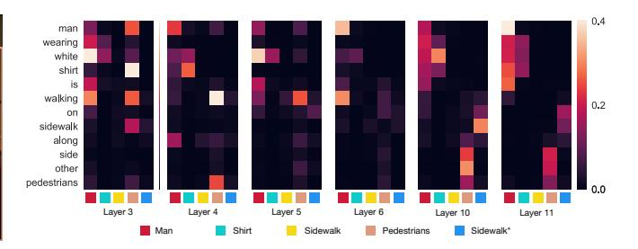
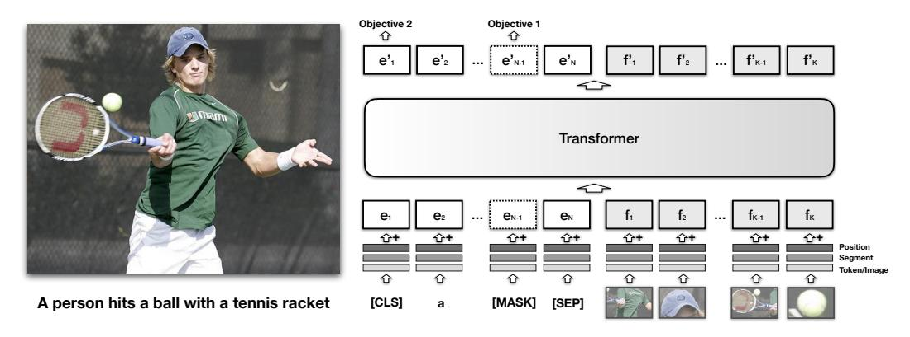
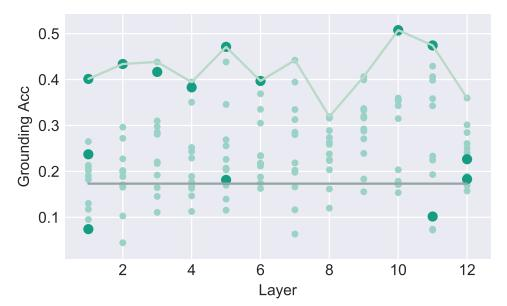
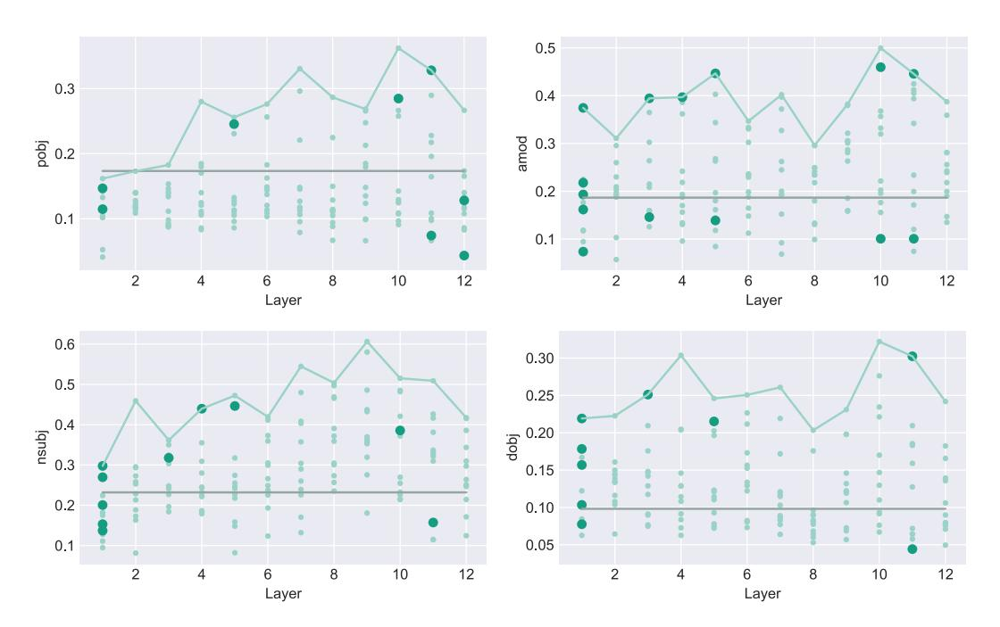
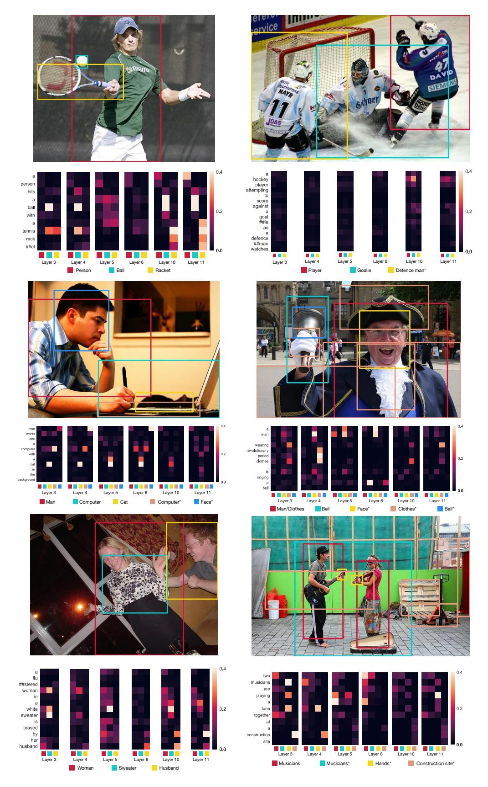

# VISUALBERT: A SIMPLE AND PERFORMANT BASELINE FOR VISION AND LANGUAGE

Liunian Harold Li†, Mark Yatskar\*, Da Yin°, Cho-Jui Hsieh† & Kai-Wei Chang†

- †University of California, Los Angeles
- \*Allen Institute for Artificial Intelligence
- °Peking University

liunian.harold.li@cs.ucla.edu, marky@allenai.org, wade\_yin9712@pku.edu.cn, {chohsieh, kwchang}@cs.ucla.edu

#### **ABSTRACT**

We propose VisualBERT, a simple and flexible framework for modeling a broad range of vision-and-language tasks. VisualBERT consists of a stack of Transformer layers that implicitly align elements of an input text and regions in an associated input image with self-attention. We further propose two visually-grounded language model objectives for pre-training VisualBERT on image caption data. Experiments on four vision-and-language tasks including VQA, VCR, NLVR2, and Flickr30K show that VisualBERT outperforms or rivals with state-of-the-art models while being significantly simpler. Further analysis demonstrates that VisualBERT can ground elements of language to image regions without any explicit supervision and is even sensitive to syntactic relationships, tracking, for example, associations between verbs and image regions corresponding to their arguments.

## 1 Introduction

Tasks combining vision and natural language serve as a rich test-bed for evaluating the reasoning capabilities of visually informed systems. Beyond simply recognizing what objects are present (Russakovsky et al., 2015; Lin et al., 2014), vision-and-language tasks, such as captioning (Chen et al., 2015), visual question answering (Antol et al., 2015), and visual reasoning (Suhr et al., 2019; Zellers et al., 2019), challenge systems to understand a wide range of *detailed semantics* of an image, including objects, attributes, parts, spatial relationships, actions and intentions, and how all of these concepts are referred to and grounded in natural language.

In this paper, we propose VisualBERT, a simple and flexible model designed for capturing rich semantics in the image and associated text. VisualBERT integrates BERT (Devlin et al., 2019), a recent Transformer-based model (Vaswani et al., 2017) for natural language processing, and pre-trained object proposals systems such as Faster-RCNN (Ren et al., 2015) and it can be applied to a variety of vision-and-language tasks. In particular, image features extracted from object proposals are treated as unordered input tokens and fed into VisualBERT along with text. The text and image inputs are jointly processed by multiple Transformer layers in VisualBERT (See Figure 2). The rich interaction among words and object proposals allows the model to capture the intricate associations between text and image.

Similar to BERT, pre-training VisualBERT on external resource can benefit downstream applications. In order to learn associations between images and text, we consider pre-training VisualBERT on image caption data, where *detailed semantics* of an image are expressed in natural language. We propose two *visually-grounded* language model objectives for pre-training: (1) part of the text is masked and the model learns to predict the masked words based on the remaining text and visual context; (2) the model is trained to determine whether the provided text matches the image. We show that such pre-training on image caption data is important for VisualBERT to learn transferable text and visual representations.

We conduct comprehensive experiments on four vision-and-language tasks: (1) visual question answering (VQA 2.0, Goyal et al. (2017)), (2) visual commonsense reasoning (VCR, Zellers et al.

Figure 1: Attention weights of some selected heads in VisualBERT. In high layers (e.g., the 10-th and 11-th layer), VisualBERT is capable of implicitly grounding visual concepts (e.g., "other pedestrians" and "man wearing white shirt"). The model also captures certain syntactic dependency relations (e.g., "walking" is aligned to the *man* region in the 6-th layer). The model also refines its understanding over the layers, incorrectly aligning "man" and "shirt" in the 3-rd layer but correcting them in higher layers. (See more details in §5.3.)

(2019)), (3) natural language for visual reasoning (NLVR2, Suhr et al. (2019)), and (4) region-to-phrase grounding (Flickr30K, Plummer et al. (2015)). Results demonstrate that by pre-training VisualBERT on the COCO image caption dataset (Chen et al., 2015), VisualBERT outperforms or rivals with the state-of-the-art models. We further provide detailed ablation study to justify our design choices. Further quantitative and qualitative analysis reveals how VisualBERT allocates attention weights to align words and image regions internally. We demonstrate that through pre-training, VisualBERT learns to ground entities and encode certain dependency relationships between words and image regions, which attributes to improving the model's understanding on the detailed semantics of an image (see an example in Figure 1).

### 2 RELATED WORK

There is a long research history of bridging vision and language. Various tasks such as visual question answering (Antol et al., 2015; Goyal et al., 2017), textual grounding (Kazemzadeh et al., 2014; Plummer et al., 2015), and visual reasoning (Suhr et al., 2019; Zellers et al., 2019) have been proposed and various models (Yang et al., 2016; Anderson et al., 2018; Jiang et al., 2018) have been developed to solve them. These approaches often consist of a text encoder, an image feature extractor, a multi-modal fusion module (typically with attention), and an answer classifier. Most models are designed for specific tasks, while VisualBERT is general and can be easily adapted to new tasks or incorporated into other task-specific models.

Understanding *detailed semantics* depicted in an image is critical for visual understanding (Johnson et al., 2015) and prior studies show that modeling such semantics can benefit visual-an-language models. For instance, attribute annotations in Visual Genome (Krishna et al., 2017) are used to enhance the object detector in VQA systems (Anderson et al., 2018). Santoro et al. (2017), Norcliffe-Brown et al. (2018), and Cadene et al. (2019) explore using an attention module to implicitly model the relations between objects in the image. Li et al. (2019) take a further step and explicitly build a graph to encode object relations. In VisualBERT, the self-attention mechanism allows the model to capture the implicit relations between objects. Furthermore, we argue that pre-training on image caption data is an effective way to teach the model how to capture such relations.

Our work is inspired by BERT (Devlin et al., 2019), a Transformer-based representation model for natural language. It falls into a line of works (Peters et al., 2018; Radford et al., 2018; 2019) that learn a universal language encoder by pre-training with language modeling objective (i.e., predicting words that are masked out from the input based on the remaining context). Two concurrent studies resemble this paper. VideoBERT (Sun et al., 2019) transforms a video into spoken words paired with a series of images and applies a Transformer to learn joint representations. Their model architecture is similar to ours. However, VideoBERT is evaluated on captioning for cooking videos, while we conduct comprehensive analysis on a variety of vision-and-language tasks. Concurrently with our work, ViLBERT (Jiasen et al., 2019) proposes to learn joint representation of images and text using a BERT-like architecture but has separate Transformers for vision and language that can only attend to each-other (resulting in twice the parameters). They use a slightly different pre-training process

Figure 2: The architecture of VisualBERT. Image regions and language are combined with a Transformer to allow the self-attention to discover implicit alignments between language and vision. It is pre-trained with a masked language modeling (Objective 1), and sentence-image prediction task (Objective 2), on caption data and then fine-tuned for different tasks. See §3.3 for more details.

on Conceptual Captions (Sharma et al., 2018) and conduct evaluation on four datasets, two of which are also considered in our work. Our results are consistent with theirs (our model outperforms on one out of the two intersecting tasks), but the methods are not wholly comparable because different visual representation and pre-training resource are used.

### 3 A JOINT REPRESENTATION MODEL FOR VISION AND LANGUAGE

In this section we introduce VisualBERT, a model for learning joint contextualized representations of vision and language. First we give background on BERT (§3.1), then summarize the adaptations we made to allow processing images and text jointly (§3.2), as seen in Figure 2, and finally explain our training procedure (§ 3.3).

#### 3.1 BACKGROUND

BERT (Devlin et al., 2019) is a Transformer (Vaswani et al., 2017) with subwords (Wu et al., 2016) as input and trained using language modeling objectives. All of the subwords in an input sentence are mapped to a set of embeddings, E. Each embedding  $e \in E$  is computed as the sum of 1) a token embedding  $e_t$ , specific to the subword, 2) a segment embedding  $e_s$ , indicating which part of text the token comes from (e.g., the hypothesis from an entailment pair) and 3) a position embedding  $e_p$ , indicating the position of the token in the sentence. The input embeddings E are then passed through a multi-layer Transformer that builds up a contextualized representation of the subwords.

BERT is commonly trained with two steps: pre-training and fine-tuning. Pre-training is done using a combination of two language modeling objectives: (1) masked language modeling, where some parts of the input tokens are randomly replaced with a special token (i.e., [MASK]), and the model needs to predict the identity of those tokens and (2) next sentence prediction, where the model is given a sentence pair and trained to classify whether they are two consecutive sentences from a document. Finally, to apply BERT to a particular task, a task-specific input, output layer, and objective are introduced, and the model is fine-tuned on the task data from pre-trained parameters.

#### 3.2 VISUALBERT

The core of our idea is to reuse the self-attention mechanism within the Transformer to implicitly align elements of the input text and regions in the input image. In addition to all the components of BERT, we introduce a set of visual embeddings, F, to model an image. Each  $f \in F$  corresponds to a bounding region in the image, derived from an object detector.

Each embedding in F is computed by summing three embeddings: (1)  $f_o$ , a visual feature representation of the bounding region of f, computed by a convolutional neural network, (2)  $f_s$ , a segment

embedding indicating it is an image embedding as opposed to a text embedding, and (3)  $f_p$ , a position embedding, which is used when alignments between words and bounding regions are provided as part of the input, and set to the sum of the position embeddings corresponding to the aligned words (see VCR in  $\S4$ ). The visual embeddings are then passed to the multi-layer Transformer along with the original set of text embeddings, allowing the model to implicitly discover useful alignments between both sets of inputs, and build up a new joint representation. \(^1\)

## 3.3 TRAINING VISUALBERT

We would like to adopt a similar training procedure as BERT but VisualBERT must learn to accommodate both language and visual input. Therefore we reach to a resource of paired data: COCO (Chen et al., 2015) that contains images each paired with 5 independent captions. Our training procedure contains three phases:

**Task-Agnostic Pre-Training** Here we train VisualBERT on COCO using two *visually-grounded* language model objectives. (1) Masked language modeling with the image. Some elements of text input are masked and must be predicted but vectors corresponding to image regions are not masked. (2) Sentence-image prediction. For COCO, where there are multiple captions corresponding to one image, we provide a text segment consisting of two captions. One of the caption is describing the image, while the other has a 50% chance to be another corresponding caption and a 50% chance to be a randomly drawn caption. The model is trained to distinguish these two situations.

**Task-Specific Pre-Training** Before fine-tuning VisualBERT to a downstream task, we find it beneficial to train the model using the data of the task with the masked language modeling with the image objective. This step allows the model to adapt to the new target domain.

**Fine-Tuning** This step mirrors BERT fine-tuning, where a task-specific input, output, and objective are introduced, and the Transformer is trained to maximize performance on the task.

## 4 EXPERIMENT

We evaluate VisualBERT on four different types of vision-and-language applications: (1) Visual Question Answering (VQA 2.0) (Goyal et al., 2017), (2) Visual Commonsense Reasoning (VCR) (Zellers et al., 2019), (3) Natural Language for Visual Reasoning (NLVR $^2$ ) (Suhr et al., 2019), and (4) Region-to-Phrase Grounding (Flickr $^3$ 0K) (Plummer et al., 2015), each described in more details in the following sections and the appendix. For all tasks, we use the Karpathy train split (Karpathy & Fei-Fei, 2015) of COCO for task-agnostic pre-training, which has around 100k images with 5 captions each. The Transformer encoder in all models has the same configuration as BERTBASE: 12 layers, a hidden size of 768, and 12 self-attention heads. The parameters are initialized from the pre-trained BERTBASE parameters released by Devlin et al. (2019).

For the image representations, each dataset we study has a different standard object detector to generate region proposals and region features. To compare with them, we follow their settings, and as a result, different image features are used for different tasks (see details in the subsections). 2 For consistency, during task-agnostic pre-training on COCO, we use the same image features as in the end tasks. For each dataset, we evaluate three variants of our model:

**VisualBERT**: The full model with parameter initialization from BERT that undergoes pre-training on COCO, pre-training on the task data, and fine-tuning for the task.

**VisualBERT w/o Early Fusion**: VisualBERT but where image representations are not combined with the text in the initial Transformer layer but instead at the very end with a new Transformer layer. This allows us to test whether interaction between language and vision throughout the whole Transformer stack is important to performance.

**VisualBERT w/o COCO Pre-training**: VisualBERT but where we skip task-agnostic pre-training on COCO captions. This allows us to validate the importance of this step.

&lt;sup>1If text and visual input embeddings are of different dimension, we project the visual embeddings into a space of the same dimension as the text embeddings.

&lt;sup>2Ideally, we can use the best available detector and visual representation for all tasks, but we would like to compare methods on similar footing.

Following Devlin et al. (2019), we optimize all models using SGD with Adam (Kingma & Ba, 2015). We set the warm-up step number to be 10% of the total training step count unless specified otherwise. Batch sizes are chosen to meet hardware constraints and text sequences whose lengths are longer than 128 are capped. Experiments are conducted on Tesla V100s and GTX 1080Tis, and all experiments can be replicated on at most 4 Tesla V100s each with 16GBs of GPU memory. Pre-training on COCO generally takes less than a day on 4 cards while task-specific pre-training and fine-tuning usually takes less. Other task-specific training details are in the corresponding sections.

#### 4.1 VQA

Given an image and a question, the task is to correctly answer the question. We use the VQA 2.0 (Goyal et al., 2017), consisting of over 1 million questions about images from COCO. We train the model to predict the 3,129 most frequent answers and use image features from a ResNeXt-based Faster RCNN pre-trained on Visual Genome (Jiang et al., 2018). More details are in Appendix A.

We report the results in Table 1, including baselines using the same visual features and number of bounding region proposals as our methods (first section), our models (second section), and other incomparable methods (third section) that use external question-answer pairs from Visual Genome (+VG), multiple detectors (Yu et al., 2019a) (+Multiple Detectors) and ensembles of their models. In comparable settings, our method is significantly simpler and outperforms existing work.

| Model                                                                                                         | Test-Dev       | Test-Std   |
|---------------------------------------------------------------------------------------------------------------|----------------|------------|
| Pythia v0.1 (Jiang et al., 2018) Pythia v0.3 (Singh et al., 2019)                                          | 68.49 68.71 | -          |
| VisualBERT w/o Early Fusion                                                                                   | 68.18          |            |
| VisualBERT w/o COCO Pre-training VisualBERT                                                                | 70.18 70.80 | - 71.00 |
| Pythia v0.1 + VG + Other Data Augmentation (Jiang et al., 2018)                                               | 70.00          | 70.24      |
| MCAN + VG (Yu et al., 2019b)                                                                                  | 70.63          | 70.24      |
| MCAN + VG + Multiple Detectors (Yu et al., 2019b) MCAN + VG + Multiple Detectors + BERT (Yu et al., 2019b) | 72.55 72.80 | -          |
| MCAN + VG + Multiple Detectors + BERT + Ensemble (Yu et al., 2019b)                                           | 75.00          | 75.23      |

Table 1: Model performance on VQA. VisualBERT outperforms Pythia v0.1 and v0.3, which are tested under a comparable setting.

#### 4.2 VCR

VCR consists of 290k questions derived from 110k movie scenes, where the questions focus on visual commonsense. The task is decomposed into two multi-choice sub-tasks wherein we train individual models: question answering (Q  $\rightarrow$  A) and answer justification (QA  $\rightarrow$  R). Image features are obtained from a ResNet50 (He et al., 2016) and "gold" detection bounding boxes and segmentations provided in the dataset are used3. The dataset also provides alignments between words and bounding regions that are referenced to in the text, which we utilize by using the same position embeddings for matched words and regions. More details are in Appendix B.

Results on VCR are presented in Table 2. We compare our methods against the model released with the dataset which builds on BERT (R2C) and list the top performing single model on the leaderboard (B2T2). Our ablated VisualBERT w/o COCO Pre-training enjoys the same resource as R2C, and despite being significantly simpler, outperforms it by a large margin. The full model further improves the results. Despite substantial domain difference between COCO and VCR, with VCR covering scenes from movies, pre-training on COCO still helps significantly.

 $^3$ In the fine-tuning stage, for VisualBERT (with/without Early Fusion), ResNet50 is fine-tuned along with the model as we find it beneficial. For reference, VisualBERT with a fixed ResNet50 gets 51.4 on the dev set for Q  $\rightarrow$  AR. The ResNet50 of VisualBERT w/o COCO Pre-training is not fine-tuned with the model such that we could compare it with R2C fairly.

| Model                            | $Q \rightarrow A$ |      | $QA \rightarrow R$ |      | $Q \rightarrow AR$ |      |
|----------------------------------|-------------------|------|--------------------|------|--------------------|------|
| Model                            | Dev               | Test | Dev                | Test | Dev                | Test |
| R2C (Zellers et al., 2019)       | 63.8              | 65.1 | 67.2               | 67.3 | 43.1               | 44.0 |
| B2T2 (Leaderboard; Unpublished)  | -                 | 72.6 | -                  | 75.7 | -                  | 55.0 |
| VisualBERT w/o Early Fusion      | 70.1              | -    | 71.9               | -    | 50.6               | -    |
| VisualBERT w/o COCO Pre-training | 67.9              | -    | 69.5               | -    | 47.9               | -    |
| VisualBERT                       | 70.8              | 71.6 | 73.2               | 73.2 | 52.2               | 52.4 |

Table 2: Model performance on VCR. VisualBERT w/o COCO Pre-training outperforms R2C, which enjoys the same resource while VisualBERT further improves the results.

### 4.3 NLVR2

 $NLVR^2$  is a dataset for joint reasoning about natural language and images, with a focus on semantic diversity, compositionality, and visual reasoning challenges. The task is to determine whether a natural language caption is true about a pair of images. The dataset consists of over 100k examples of English sentences paired with web images. We modify the segment embedding mechanism in VisualBERT and assign features from different images with different segment embeddings. We use an off-the-shelf detector from Detectron (Girshick et al., 2018) to provide image features and use 144 proposals per image. 4k More details are in Appendix C.

Results are in Table 3. VisualBERT w/o Early Fusion and VisualBERT w/o COCO Pre-training surpass the previous best model MaxEnt by a large margin while VisualBERT widens the gap.

| Model                                                           | Dev  | Test-P | Test-U | Test-U (Cons) |
|-----------------------------------------------------------------|------|--------|--------|---------------|
| MaxEnt (Suhr et al., 2019)                                      | 54.1 | 54.8   | 53.5   | 12.0          |
| VisualBERT w/o Early Fusion VisualBERT w/o COCO Pre-training | 64.6 | -      | -      | -             |
| VisualBERT                                                      | 67.4 | 67.0   | 67.3   | 26.9          |

Table 3: Comparison with the state-of-the-art model on NLVR2. The two ablation models significantly outperform MaxEnt while the full model widens the gap.

## 4.4 FLICKR30K ENTITIES

Flickr30K Entities dataset tests the ability of systems to ground phrases in captions to bounding regions in the image. The task is, given spans from a sentence, selecting the bounding regions they correspond to. The dataset consists of 30k images and nearly 250k annotations. We adapt the setting of BAN (Kim et al., 2018), where image features from a Faster R-CNN pre-trained on Visual Genome are used. For task specific fine-tuning, we introduce an additional self-attention block and use the average attention weights from each head to predict the alignment between boxes and phrases. For a phrase to be grounded, we take whichever box receives the most attention from the last sub-word of the phrase as the model prediction. More details are in Appendix D.

Results are listed in Table 4. VisualBERT outperforms the current state-of-the-art model BAN. In this setting, we do not observe a significant difference between the ablation model without early fusion and our full model, arguing that perhaps a shallower architecture is sufficient for this task.

## 5 ANALYSIS

In this section we conduct extensive analysis on what parts of our approach are important to VisualBERT's strong performance (§ 5.1). Then we use Flickr30K as a diagnostic dataset to understand

&lt;sup>4We conducted a preliminary experiment on the effect of the number of object proposals we keep per image. We tested models with 9, 18, 36, 72, and 144 proposals, which achieve an accuracy of 64.8, 65.5, 66.7, 67.1, and 67.4 respectively on the development set.

| Model                            | R@1   |       | R@5   |       | R@10  |       | Upper Bound |       |
|----------------------------------|-------|-------|-------|-------|-------|-------|-------------|-------|
|                                  | Dev   | Test  | Dev   | Test  | Dev   | Test  | Dev         | Test  |
| BAN (Kim et al., 2018)           | -     | 69.69 | -     | 84.22 | -     | 86.35 | 86.97       | 87.45 |
| VisualBERT w/o Early Fusion      | 70.33 | -     | 84.53 | -     | 86.39 | -     |             |       |
| VisualBERT w/o COCO Pre-training | 68.07 | -     | 83.98 | -     | 86.24 | -     | 86.97       | 87.45 |
| VisualBERT                       | 70.40 | 71.33 | 84.49 | 84.98 | 86.31 | 86.51 |             |       |

Table 4: Comparison with the state-of-the-art model on the Flickr30K. VisualBERT holds a clear advantage over BAN.

| Model                                                                    | Dev          |
|--------------------------------------------------------------------------|--------------|
| VisualBERT                                                               | 66.7         |
| C1 VisualBERT w/o Grounded Pre-training VisualBERT w/o COCO Pre-training | 63.9 62.9 |
| C2 VisualBERT w/o Early Fusion                                           | 61.4         |
| C3 VisualBERT w/o BERT Initialization                                    | 64.7         |
| C4 VisualBERT w/o Objective 2                                            | 64.9         |

Table 5: Performance of the ablation models on NLVR2. Results confirm that task-agnostic pretraining (C1) and early fusion of vision and language (C2) are essential for VisualBERT.

Figure 3: Entity grounding accuracy of the attention heads of VisualBERT. The rule-based baseline is dawn as the grey line. We find that certain heads achieves high accuracy while the accuracy peaks at higher layers.

whether VisualBERT's pre-training phase actually allows the model to learn implicit alignments between bounding regions and text phrases. We show that many attention heads within VisualBERT accurately track grounding information and that some are even sensitive to syntax, attending from verbs to the bounding regions corresponding to their arguments within a sentence ( $\S$  5.2). Finally, we show qualitative examples of how VisualBERT resolves ambiguous groundings through multiple layers of the Transformer ( $\S$  5.3).

#### 5.1 ABLATION STUDY

We conduct our ablation study on NLVR2 and include two ablation models in §4 and four additional variants of VisualBERT for comparison. For ease of computations, all these models are trained with only 36 features per image (including the full model). Our analysis (Table 5) aims to investigate the contributions of the following four components in VisualBERT:

**C1:** Task-agnostic **Pre-training.** We investigate the contribution of task-agnostic pre-training by entirely skipping such pre-training (VisualBERT w/o COCO Pre-training) and also by pre-training with only text but no images from COCO (VisualBERT w/o Grounded Pre-training). Both variants underperform, showing that pre-training on paired vision and language data is important.

**C2:** Early Fusion. We include VisualBERT w/o Early Fusion introduced in §4 to verify the importance of allowing early interaction between image and text features, confirming again that multiple interaction layers between vision and language are important.

**C3: BERT Initialization.** All the models discussed so far are initialized with parameters from a pre-trained BERT model. To understand the contributions of the BERT initialization, we introduce a variant with randomly initialized parameters. The model is then trained as the full model. While it does seem weights from language-only pre-trained BERT are important, performance does not degrade as much as we expect, arguing that the model is likely learning many of the same useful aspects about grounded language during COCO pre-training.

**C4:** The sentence-image prediction objective. We introduce a model without the sentence-image prediction objective during task-agnostic pre-training (VisualBERT w/o Objective 2). Results suggest that this objective has positive but less significant effect, compared to other components.

Overall, the results confirm that the most important design choices are task-agnostic pre-training (C1) and early fusion of vision and language (C2). In pre-training, both the inclusion of additional COCO data and using both images and captions are paramount.

## 5.2 Dissecting Attention Weights

In this section we investigate which bounding regions are attended to by words, before VisualBERT is fine-tuned on any task.

**Entity Grounding** First, we attempt to find attention heads within VisualBERT that could perform entity grounding, i.e., attending to the corresponding bounding regions from entities in the sentence. Specifically, we use the ground truth alignments from the evaluation set of Flickr30K. For each entity in the sentence and for each attention head in VisualBERT, we look at the bounding region which receives the most attention weight. Because a word is likely to attend to not only the image regions but also words in the text, for this evaluation, we mask out the head's attention to words and keep only attention to the image regions. Then we compute the how often the attention of a particular head agrees with the annotations in Flickr30K.

We report this accuracy5, for all 144 attention heads in VisualBERT, organized by layer, in Figure 3. We also consider a baseline that always chooses the region with the highest detection confidence. We find that VisualBERT achieves a remarkably high accuracy though it is not exposed to any direct supervision for entity grounding. The grounding accuracy also seems to improve in higher layers, showing the model is less certain when synthesizing the two inputs in lower layers, but then becomes increasingly aware of how they should align. We show examples of this behavior in §5.3.

**Syntactic Grounding** Given that many have observed that the attention heads of BERT can discover syntactic relationships (Voita et al., 2019; Clark et al., 2019), we also analyze how grounding information is passed through syntactic relationships that VisualBERT may have discovered. In particular, given two words that are connected with a dependency relation,  $w_1 \stackrel{r}{\longrightarrow} w_2$ , we would like to know how often the attention heads at  $w_2$  attend to the regions corresponding to  $w_1$ , and vice-versa. For example, in Figure 1, we would like to know if there is an attention head that, at the word "walking", is systematically attending to the region corresponding to the "man", because "man" and "walking" are related through a "nsubj" relation, under the Stanford Dependency Parsing formalism (De Marneffe & Manning, 2008).

To evaluate such syntactic sensitivity in VisualBERT, we first parse all sentences in Flickr30K using AllenNLP's dependency parser (Dozat & Manning, 2017; Gardner et al., 2018). Then, for each attention head in VisualBERT, given that two words have a particular dependency relationship, and one of them has a ground-truth grounding in Flickr30K, we compute how accurately the head attention weights predict the ground-truth grounding. Examination of all dependency relationships shows that in VisualBERT, there exists at least one head for each relationship that significantly outperforms guessing the most confident bounding region. We highlight a few particularly interesting dependency relationships in Figure 4. Many heads seem to accurately associate arguments with verbs (i.e. "pobj", "nsub", and "dobj" dependency relations), arguing that VisualBERT is resolving these arguments, implicitly and without supervision, to visual elements.

## 5.3 QUALITATIVE ANALYSIS

Finally, we showcase several interesting examples of how VisualBERT changes its attention over the layers when processing images and text, in Figure 1 and Figure 5. To generate these examples,

&lt;sup>5Despite that some heads are accurate at entity grounding, they are not actively attending to the image regions. For example, a head might be only allocating 10% of its attention weights to all image regions, but it assigns the most of the 10% weights to the correct region. We represent heads paying on average less than 20% of its attention weights from the entities to the regions with smaller and light-colored dots and others with larger and bright dots.

Figure 4: Accuracy of attention heads of VisualBERT for predicting four specific dependency relationships ("pobj", "amod", "nsubj", and "dobj") across modality. The grey lines denote a baseline that always chooses the region with the highest detection confidence. We observe that VisualBERT is capable of detecting these dependency relationships without direct supervision.

for each ground-truth box, we show a predicted bounding region closest to it and manually group the bounding regions into different categories. We also include regions that the model is actively attending to, even if they are not present in the ground-truth annotation (marked with an asterisk). We then aggregate the attention weights from words to those regions in the same category. We show the best heads of 6 layers that achieve the highest entity grounding accuracy.

Overall, we observe that VisualBERT seems to refine alignments through successive Transformer layers. For example, in the bottom left image in Figure 5, initially the word "husband" and the word "woman" both have significant attention weight on regions corresponding to the woman. By the end of the computation, VisualBERT has disentangled the woman and man, correctly aligning both. Furthermore, there are many examples of syntactic alignments. For example, in the same image, the word "teased" aligns to both the man and woman while "by" aligns to the man. Finally, some coreference seems to be resolved, as, in the same image, the word "her" is resolved to the woman.

## 6 CONCLUSION AND FUTURE WORK

In this paper, we presented VisualBERT, a pre-trained model for joint vision and language representation. Despite VisualBERT is simple, it achieves strong performance on four evaluation tasks. Further analysis suggests that the model uses the attention mechanism to capture information in an interpretable way. For future work, we are curious about whether we could extend VisualBERT to image-only tasks, such as scene graph parsing and situation recognition. Pre-training VisualBERT on larger caption datasets such as Visual Genome and Conceptual Caption is also a valid direction.

#### ACKNOWLEDGEMENT

We would like to thank Xianda Zhou for help with experiments as well as Patrick H. Chen and members of UCLA NLP for helpful comments. We also thank Rowan Zellers for evaluation on VCR and Alane Suhr for evaluation on NLVR2.

Figure 5: Attention weights of some selected heads in VisualBERT on 6 examples. The first column is 3 random examples where alignments match Flickr30k annotations while the second column is 3 random examples where alignments do not match.

# REFERENCES

- Peter Anderson, Xiaodong He, Chris Buehler, Damien Teney, Mark Johnson, Stephen Gould, and Lei Zhang. Bottom-up and top-down attention for image captioning and visual question answering. In *CVPR*, 2018.
- Stanislaw Antol, Aishwarya Agrawal, Jiasen Lu, Margaret Mitchell, Dhruv Batra, C Lawrence Zitnick, and Devi Parikh. VQA: Visual question answering. In *ICCV*, 2015.
- Remi Cadene, Hedi Ben-Younes, Matthieu Cord, and Nicolas Thome. MUREL: Multimodal relational reasoning for visual question answering. In *CVPR*, 2019.
- Xinlei Chen, Hao Fang, Tsung-Yi Lin, Ramakrishna Vedantam, Saurabh Gupta, Piotr Dollár, and C Lawrence Zitnick. Microsoft COCO captions: Data collection and evaluation server. *arXiv* preprint arXiv:1504.00325, 2015.
- Kevin Clark, Urvashi Khandelwal, Omer Levy, and Christopher D Manning. What does BERT look at? an analysis of BERT's attention. *BlackboxNLP*, 2019.
- Marie-Catherine De Marneffe and Christopher D Manning. Stanford typed dependencies manual. Technical report, 2008.
- Jacob Devlin, Ming-Wei Chang, Kenton Lee, and Kristina Toutanova. BERT: pre-training of deep bidirectional transformers for language understanding. In *NAACL-HLT*, 2019.
- Timothy Dozat and Christopher D Manning. Deep biaffine attention for neural dependency parsing. *ICLR*, 2017.
- Matt Gardner, Joel Grus, Mark Neumann, Oyvind Tafjord, Pradeep Dasigi, Nelson F Liu, Matthew Peters, Michael Schmitz, and Luke Zettlemoyer. AllenNLP: A deep semantic natural language processing platform. In *Proceedings of Workshop for NLP Open Source Software (NLP-OSS)*, 2018.
- Ross Girshick, Ilija Radosavovic, Georgia Gkioxari, Piotr Dollár, and Kaiming He. Detectron. https://github.com/facebookresearch/detectron, 2018.
- Yash Goyal, Tejas Khot, Douglas Summers-Stay, Dhruv Batra, and Devi Parikh. Making the V in VQA matter: Elevating the role of image understanding in Visual Question Answering. In *CVPR*, 2017.
- Kaiming He, Xiangyu Zhang, Shaoqing Ren, and Jian Sun. Deep residual learning for image recognition. In *CVPR*, 2016.
- Yu Jiang, Vivek Natarajan, Xinlei Chen, Marcus Rohrbach, Dhruv Batra, and Devi Parikh. Pythia v0. 1: the winning entry to the VQA challenge 2018. *arXiv preprint arXiv:1807.09956*, 2018.
- Lu Jiasen, Batra Dhruv, Parikh Devi, and Lee Lee. ViLBERT: Pretraining task-agnostic visiolinguistic representations for vision-and-language tasks. *arXiv preprint arXiv:1908.02265*, 2019.
- Justin Johnson, Ranjay Krishna, Michael Stark, Li-Jia Li, David Shamma, Michael Bernstein, and Li Fei-Fei. Image retrieval using scene graphs. In *CVPR*, 2015.
- Andrej Karpathy and Li Fei-Fei. Deep visual-semantic alignments for generating image descriptions. In *CVPR*, 2015.
- Sahar Kazemzadeh, Vicente Ordonez, Mark Matten, and Tamara Berg. ReferItGame: Referring to objects in photographs of natural scenes. In *EMNLP*, 2014.
- Jin-Hwa Kim, Jaehyun Jun, and Byoung-Tak Zhang. Bilinear attention networks. In NeurIPS, 2018.
- Diederik P Kingma and Jimmy Ba. Adam: A method for stochastic optimization. ICLR, 2015.
- Ranjay Krishna, Yuke Zhu, Oliver Groth, Justin Johnson, Kenji Hata, Joshua Kravitz, Stephanie Chen, Yannis Kalantidis, Li-Jia Li, David A Shamma, et al. Visual Genome: Connecting language and vision using crowdsourced dense image annotations. *International Journal of Computer Vision*, 123(1):32–73, 2017.

- Linjie Li, Zhe Gan, Yu Cheng, and Jingjing Liu. Relation-aware graph attention network for visual question answering. *ArXiv*, abs/1903.12314, 2019.
- Tsung-Yi Lin, Michael Maire, Serge Belongie, James Hays, Pietro Perona, Deva Ramanan, Piotr Dollár, and C Lawrence Zitnick. Microsoft COCO: Common objects in context. In *ECCV*, 2014.
- Will Norcliffe-Brown, Stathis Vafeias, and Sarah Parisot. Learning conditioned graph structures for interpretable visual question answering. In *NeurIPS*, 2018.
- Matthew E Peters, Mark Neumann, Mohit Iyyer, Matt Gardner, Christopher Clark, Kenton Lee, and Luke Zettlemoyer. Deep contextualized word representations. In *NAACL-HLT*, 2018.
- Bryan A Plummer, Liwei Wang, Chris M Cervantes, Juan C Caicedo, Julia Hockenmaier, and Svetlana Lazebnik. Flickr30k entities: Collecting region-to-phrase correspondences for richer image-to-sentence models. In *ICCV*, 2015.
- Alec Radford, Karthik Narasimhan, Tim Salimans, and Ilya Sutskever. Improving language understanding by generative pre-training. *OpenAI*, 2018.
- Alec Radford, Jeffrey Wu, Rewon Child, David Luan, Dario Amodei, and Ilya Sutskever. Language models are unsupervised multitask learners. *OpenAI*, 2019.
- Shaoqing Ren, Kaiming He, Ross Girshick, and Jian Sun. Faster R-CNN: Towards real-time object detection with region proposal networks. In *NeurIPS*, 2015.
- Olga Russakovsky, Jia Deng, Hao Su, Jonathan Krause, Sanjeev Satheesh, Sean Ma, Zhiheng Huang, Andrej Karpathy, Aditya Khosla, Michael Bernstein, et al. Imagenet large scale visual recognition challenge. *International Journal of Computer Vision*, 2015.
- Adam Santoro, David Raposo, David G Barrett, Mateusz Malinowski, Razvan Pascanu, Peter Battaglia, and Timothy Lillicrap. A simple neural network module for relational reasoning. In *NeurIPS*, 2017.
- Piyush Sharma, Nan Ding, Sebastian Goodman, and Radu Soricut. Conceptual Captions: A cleaned, hypernymed, image alt-text dataset for automatic image captioning. In *ACL*, 2018.
- Amanpreet Singh, Vivek Natarajan, Meet Shah, Yu Jiang, Xinlei Chen, Dhruv Batra, Devi Parikh, and Marcus Rohrbach. Towards VQA models that can read. In *CVPR*, 2019.
- Alane Suhr, Stephanie Zhou, Iris Zhang, Huajun Bai, and Yoav Artzi. A corpus for reasoning about natural language grounded in photographs. *ACL*, 2019.
- Chen Sun, Austin Myers, Carl Vondrick, Kevin Murphy, and Cordelia Schmid. VideoBert: A joint model for video and language representation learning. *arXiv preprint arXiv:1904.01766*, 2019.
- Ashish Vaswani, Noam Shazeer, Niki Parmar, Jakob Uszkoreit, Llion Jones, Aidan N Gomez, Łukasz Kaiser, and Illia Polosukhin. Attention is all you need. In *NeurIPS*, 2017.
- Elena Voita, David Talbot, Fedor Moiseev, Rico Sennrich, and Ivan Titov. Analyzing multi-head self-attention: Specialized heads do the heavy lifting, the rest can be pruned. *ACL*, 2019.
- Yonghui Wu, Mike Schuster, Zhifeng Chen, Quoc V Le, Mohammad Norouzi, Wolfgang Macherey, Maxim Krikun, Yuan Cao, Qin Gao, Klaus Macherey, et al. Google's neural machine translation system: Bridging the gap between human and machine translation. *arXiv* preprint arXiv:1609.08144, 2016.
- Zichao Yang, Xiaodong He, Jianfeng Gao, Li Deng, and Alex Smola. Stacked attention networks for image question answering. In *CVPR*, 2016.
- Jun Yu, Jing Li, Zhou Yu, and Qingming Huang. Multimodal transformer with multi-view visual representation for image captioning. *arXiv* preprint arXiv:1905.07841, 2019a.
- Zhou Yu, Jun Yu, Yuhao Cui, Dacheng Tao, and Qi Tian. Deep modular co-attention networks for visual question answering. In *CVPR*, 2019b.
- Rowan Zellers, Yonatan Bisk, Ali Farhadi, and Yejin Choi. From recognition to cognition: Visual commonsense reasoning. In *CVPR*, 2019.

## IMPLEMENTATION AND TRAINING DETAILS

Below we introduce the implementation and training details for each evaluation task.

# A VOA

Though the answers of VQA are open-ended, we follow the processing procedure of Pythia and consider it a classification problem, where the model only needs to choose one answer from a limited answer pool. To better fit the pre-training process, a [MASK] token is appended after the question and the representation of the [MASK] token is fed into an output layer for classification. Since there could be multiple correct answers to one question, we assign each correct answer with the same probability and minimize the cross entropy between the target probability and the output probability from the model, different from the binary cross entropy loss used in Pythia. We do not use grid-level features from ResNet152 because it results in longer sequences and longer training time. Visual-BERT (with/without Early Fusion) is pre-trained on COCO for 10 epochs with a batch size of 48 and a max learning rate of 5e-5. For task-specific pre-training, all variants of VisualBERT are trained for 10 epochs with a batch size of 64 and a max learning rate of 5e-5. Each input sequence consists of the question, the correct answer, and the image. Only the masked language modeling with the image objective is used. During fine-tuning, they are trained with the task-specific objective for 10 epochs with a batch size of 64 and a max learning rate of 2e-5. Following the practice in Pythia, for task-specific pre-training and fine-tuning, we train on the training and validation splits.

#### B VCR

In VCR, the task is decomposed into two subtasks,  $Q \to A$  and  $QA \to R$ . For each sub-task, each training example contains four choices and we construct four input sequences, each containing the concatenation of the given question, a choice, and an image. When the model performs  $QA \to R$ , the "question" part contains the original question and the correct choice, and the "choice" is a possible rationale. The model is trained to classify which of the four input sequences is correct.

For VisualBERT (with/without Early Fusion), task-agnostic pre-training is conducted on COCO for 10 epochs with a batch size of 128 and a max learning rate of 1e-4. For all variants of VisualBERT, since R2C also performs task-specific pre-training with BERTBASE on the VCR dataset for its text representation, we conduct task-specific pre-training with the same hyper-parameters (learning rate, batch size, optimizer warm-up ratio). But notice that R2C conducts task-specific pre-training with text-only objective while we do so with a visually-grounded objective. During this step, each training example consists of a question, a choice, and an image. Following R2C, we add an auxiliary task of predicting if the choice is correct. In the fine-tuning stage, for Q  $\rightarrow$  A, we train for 8 epochs with a batch size of 32 and a max learning rate of 2e-5. For QA  $\rightarrow$  R, we train for 12 epochs. For fine-tuning, we monitor the loss on the development set for early stopping.

# C NLVR2

For each training example in NLVR2, we construct a sequence consisting of the caption and image features from two images. VisualBERT (with/without Early Fusion) is pre-trained on COCO for 10 epochs with a batch size of 64 and a max learning rate of 5e-5. For task-specific pre-training, similar to VCR, an auxiliary task is added to decide whether the caption in an training example is true. All variants of VisualBERT are trained with the visually-grounded objective for a maximum of 10 epochs with a batch size of 64 and a max learning rate of 5e-5. In the fine-tuning stage, they are both trained for a maximum of 10 epochs with a batch size of 64 and a max learning rate of 5e-5. For task-specific pre-training and fine-tuning, we monitor the loss on the development set for early stopping.

## D FLICKR30K

Since multiple boxes could be aligned to the same phrase, we use the same cross entropy loss used in our experiment on VQA, different from the binary cross entropy loss used in BAN. VisualBERT

(with/without Early Fusion) is pre-trained on COCO with a batch size of 32 and a learning rate of 5e-5. During task-specific pre-training, all variants of VisualBERT are trained for 10 epochs with a batch size of 32 and a learning rate of 5e-5. Only the masked language modeling with the image objective is used. They are then fine-tuned with a maximum of 5 epochs with a batch size of 32 and a learning rate of 2e-5. For task-specific pre-training and fine-tuning, we monitor the loss on the development set for early stopping.