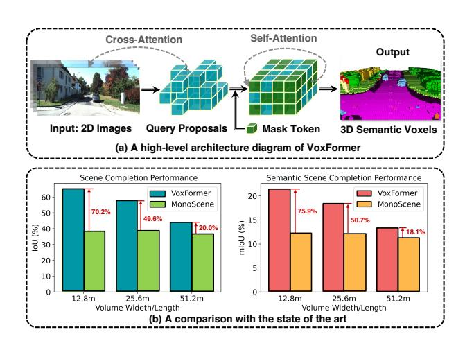
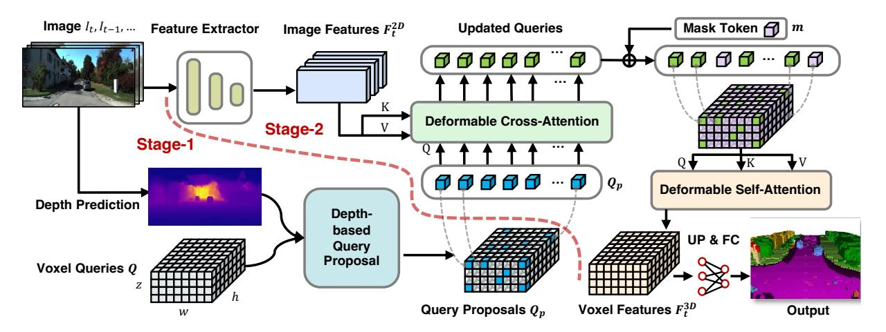
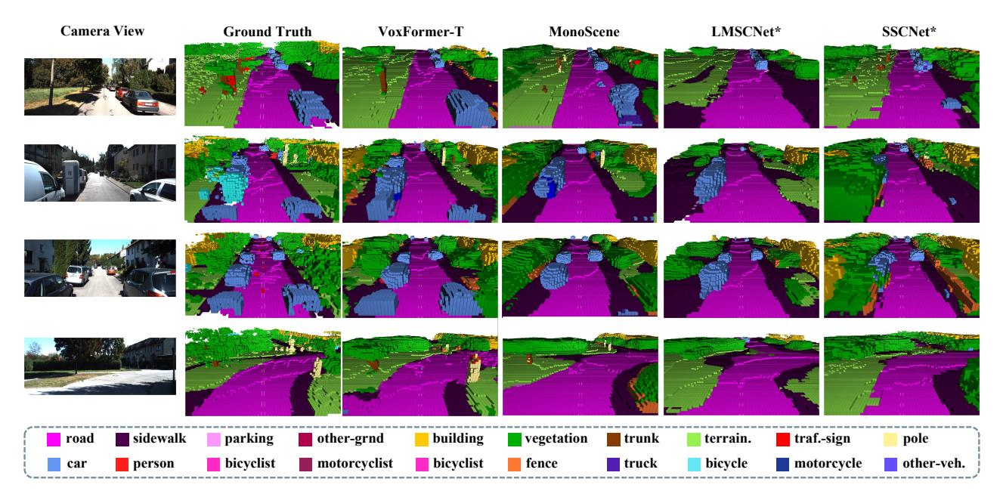
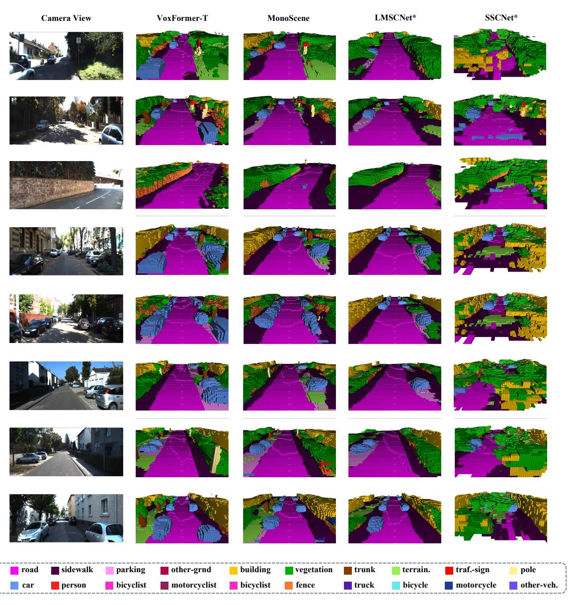

# VoxFormer: Sparse Voxel Transformer for Camera-based 3D Semantic Scene Completion

Yiming Li $^1$  Zhiding Yu $^{2*}$  Christopher Choy $^2$  Chaowei Xiao $^{2,3}$  Jose M. Alvarez $^2$  Sanja Fidler $^{2,4,5}$  Chen Feng $^1$  Anima Anandkumar $^{2,6}$   $^1$ NYU  $^2$ NVIDIA  $^3$ ASU  $^4$ University of Toronto  $^5$ Vector Institute  $^6$ Caltech

### **Abstract**

Humans can easily imagine the complete 3D geometry of occluded objects and scenes. This appealing ability is vital for recognition and understanding. To enable such capability in AI systems, we propose VoxFormer, a Transformerbased semantic scene completion framework that can output complete 3D volumetric semantics from only 2D images. Our framework adopts a two-stage design where we start from a sparse set of visible and occupied voxel queries from depth estimation, followed by a densification stage that generates dense 3D voxels from the sparse ones. A key idea of this design is that the visual features on 2D images correspond only to the visible scene structures rather than the occluded or empty spaces. Therefore, starting with the featurization and prediction of the visible structures is more reliable. Once we obtain the set of sparse queries, we apply a masked autoencoder design to propagate the information to all the voxels by self-attention. Experiments on SemanticKITTI show that VoxFormer outperforms the state of the art with a relative improvement of 20.0% in geometry and 18.1% in semantics and reduces GPU memory during training to less than 16GB. Our code is available on https://github.com/NVlabs/VoxFormer.

#### 1. Introduction

Holistic 3D scene understanding is an important problem in autonomous vehicle (AV) perception. It directly affects downstream tasks such as planning and map construction. However, obtaining accurate and complete 3D information of the real world is difficult, since the task is challenged by the lack of sensing resolution and the incomplete observation due to the limited field of view and occlusions.

To tackle the challenges, semantic scene completion (SSC) [1] was proposed to jointly infer the complete scene geometry and semantics from limited observations. An SSC solution has to simultaneously address two subtasks: *scene reconstruction* for visible areas and *scene hallucination* for

Figure 1. (a) A diagram of VoxFormer for camera-based semantic scene completion that predicts complete 3D geometry and semantics given only 2D images. After obtaining voxel query proposals based on depth, VoxFormer generates semantic voxels via an MAE-like architecture [3]. (b) A comparison against the state-of-the-art MonoScene [4] in different ranges on SemanticKITTI [5]. VoxFormer performs much better in safety-critical short-range areas, while MonoScene performs indifferently at three distances. The relative gains are marked by red.

occluded regions. This task is further backed by the fact that humans can naturally reason about scene geometry and semantics from partial observations. However, there is still a significant performance gap between state-of-the-art SSC methods [2] and human perception in driving scenes.

Most existing SSC solutions consider LiDAR a primary modality to enable accurate 3D geometric measurement [6–9]. However, LiDAR sensors are expensive and less portable, while cameras are cheaper and provide richer visual cues of the driving scenes. This motivated the study of camera-based SSC solutions, as first proposed in the pioneering work of MonoScene [4]. MonoScene lifts 2D image inputs to 3D using dense feature projection. However, such a projection inevitably assigns 2D features of visible regions to the empty or occluded voxels. For example, an empty voxel occluded by a car will still get the car's visual feature. As a result, the generated 3D features contain many ambi-

\* Corresponding author: Zhiding Yu (zhidingy@nvidia.com)

guities for subsequent geometric completion and semantic segmentation, resulting in unsatisfactory performance.

**Our contributions.** Unlike MonoScene, VoxFormer considers 3D-to-2D cross-attention to represent the sparse queries. The proposed design is motivated by two insights: (1) *reconstruction-before-hallucination*: the non-visible region's 3D information can be better completed using the reconstructed visible areas as starting points; and (2) *sparsity-in-3D-space*: since a large volume of the 3D space is usually unoccupied, using a sparse representation instead of a dense one is certainly more efficient and scalable. Our contributions in this work can be summarized as follows:

- A novel two-stage framework that lifts images into a complete 3D voxelized semantic scene.
- A novel query proposal network based on 2D convolutions that generates reliable queries from image depth.
- A novel Transformer similar to masked autoencoder (MAE) [3] that yields complete 3D scene representation.
- VoxFormer sets a new state-of-the-art in camera-based SSC on SemanticKITTI [5], as shown in Fig. 1 (b).

VoxFormer consists of class-agnostic query proposal (stage-1) and class-specific semantic segmentation (stage-2), where stage-1 proposes a sparse set of occupied voxels, and stage-2 completes the scene representations starting from the proposals given by stage-1. Specifically, stage-1 has a lightweight 2D CNN-based query proposal network using the image depth to reconstruct the scene geometry. It then proposes a sparse set of voxels from predefined learnable voxel queries over the entire field of view. Stage-2 is based on a novel sparse-to-dense MAE-like architecture as shown in Fig. 1 (a). It first strengthens the featurization of the proposed voxels by allowing them to attend to the image observations. Next, the non-proposed voxels will be associated with a learnable mask token, and the full set of voxels will be processed by self-attention to complete the scene representations for per-voxel semantic segmentation.

Extensive tests on the large-scale SemanticKITTI [5] show that VoxFormer achieves state-of-the-art performance in geometric completion and semantic segmentation. More importantly, the improvements are significant in safety-critical short-range areas, as shown in Fig. 1 (b).

#### 2. Related Works

**3D reconstruction and completion.** *3D reconstruction* aims to infer the 3D geometry of objects or scenes from single or multiple 2D images. This challenging problem receives extensive attention in the traditional computer vision era [10] and the recent deep learning era [11]. 3D reconstruction can be divided into (1) single-view reconstruction by learning shape priors from massive data [12–15], and

(2) multi-view reconstruction by leveraging different viewpoints [16, 17]. Both explicit [12, 14] and implicit representations [18–22] are investigated for the object/scene. Unlike 3D reconstruction, 3D completion requires the model to hallucinate the unseen structure related to single-view 3D reconstruction, yet the input is in 3D except for 2D. 3D object shape completion is an active research topic that estimates the complete geometry from a partial shape in the format of point [23–25], voxels [26–28], and distance fields [29], etc. In addition to object-level completion, scene-level 3D completion has also been investigated in both indoor [30] and outdoor scenes [31]: [30] proposes a sparse generative network to convert a partial RGB-D scan into a high-resolution 3D reconstruction with missing geometry. [31] learns a neural network to convert each scan to a dense volume of truncated signed distance fields (TSDF).

**Semantic segmentation.** Human-level scene understanding for intelligent agents is typically advanced by semantic segmentation on images [32] or point clouds [33]. Researchers have significantly promoted image segmentation performance with a variety of deep learning techniques, such as convolutional neural network [34,35], vision transformers [36,37], prototype learning [38,39], *etc.* To have intelligent agents interact with the 3D environment, thinking in 3D is essential because the physical world is not 2D but rather 3D. Thus various 3D point cloud segmentation methods have been developed to address 3D semantic understanding [40–42]. However, real-world sensing in 3D is inherently sparse and incomplete. For holistic semantic understanding, it is insufficient to solely parse the sparse measurements while ignoring the unobserved scene structures.

3D semantic scene completion. Holistic 3D scene understanding is challenged by limited sensing range, and researchers have proposed multi-agent collaborative perception to introduce more observations of the 3D scene [43-49]. Another line of research is 3D semantic scene completion, unifying scene completion and semantic segmentation which are investigated separately at the early stage [50,51]. SSCNet [1] first defines the semantic scene completion task where geometry and semantics are jointly inferred given an incomplete visual observation. In recent years, SSC in the indoor scenes with a relatively small scale has been intensively studied [52–59]. Meanwhile, SSC in the largescale outdoor scenes have also started to receive attention after the release of SemanticKITTI dataset [5]. Semantic scene completion with a sparse observation is a highly desirable capability for autonomous vehicles since it can generate a dense 3D voxelized semantic representation of the scene. Such representation can aid 3D semantic map construction of the static environment and help perceive dynamic objects. Unfortunately, SSC for large-scale driving scenes is only at the preliminary development and exploration stages. Existing works commonly depend on 3D input such as LiDAR point clouds [6–9, 60]. In contrast, the recent MonoScene [4] has studied semantic scene completion from a monocular image. It proposes 2D-3D feature projections and uses successive 2D and 3D UNets to achieve camera-only 3D semantic scene completion. However, 2D-to-3D feature projection is prone to introduce false features for unoccupied 3D positions, and the heavy 3D convolution will lower the system's efficiency.

Camera-based 3D perception. Camera-based systems have received extensive attention in the autonomous driving community because the camera is low-cost, easy to deploy, and widely available. In addition, the camera can provide rich visual attributes of the scene to help vehicles achieve holistic scene understanding. Several works have recently been proposed for 3D object detection or map segmentation from RGB images. Inspired by DETR [62] in 2D detection, DETR3D [63] links learnable 3D object queries with 2D images by camera projection matrices and enables endto-end 3D bounding box prediction without non-maximum suppression (NMS). M2BEV [64] also investigates the viability of simultaneously running multi-tasks perception based on BEV features. BEVFormer [65] proposes a spatiotemporal transformer that aggregates BEV features from current and previous features via deformable attention [66]. Compared to object detection, semantic scene completion can provide occupancy for each small cell instead of assigning a fixed-size bounding box to an object. This could help identify an irregularly-shaped object with an overhanging obstacle. Compared to 2D BEV representation, 3D voxelized scene representation has more information, which is particularly helpful when vehicles are driving over bumpy roads. Hence, dense volumetric semantics can provide a more comprehensive 3D scene representation, while how to create it with only cameras receives scarce attention.

# 3. Methodology

# 3.1. Preliminary

**Problem setup.** We aim to predict a dense semantic scene within a certain volume in front of the vehicle, given only RGB images. More specifically, we use as input current and previous images denoted by  $\mathbf{I}_t = \{I_t, I_{t-1}, ...\}$ , and use as output a voxel grid  $\mathbf{Y}_t \in \{c_0, c_1, ..., c_M\}^{H \times W \times Z}$  defined in the coordinate of egovehicle at timestamp t, where each voxel is either empty (denoted by  $c_0$ ) or occupied by a certain semantic class in  $\{c_1, c_m, ..., c_M\}$ . Here M denotes the total number of interested classes, and H, W, Z denote the length, width, and height of the voxel grid, respectively. In summary, the overall objective is to learn a neural network  $\Theta$  to generate a semantic voxel  $\mathbf{Y}_t = \Theta(\mathbf{I}_t)$  as close to the ground truth  $\hat{\mathbf{Y}}_t$  as possible. Note that previous SSC works commonly consider 3D input [2]. The most related work to us [4] considers a single image as input which is our special case.

**Design rationale.** Motivated by *reconstruction-before-hallucination* and *sparsity-in-3D-space*, we build a two-stage framework: stage-1 based on CNN proposes a sparse set of voxel queries from image depth to attend to images since the image features correspond to visible and occupied voxels instead of non-visible and empty ones; stage-2 based on Transformer uses an MAE-like architecture to first strengthen the featurization of the proposed voxels by voxel-to-image cross-attention, and then process the full set of voxels with self-attention to enable the voxel interactions.

#### 3.2. Overall Architecture

We learn 3D voxel features from 2D images for SSC based on Transformer, as illustrated in Fig. 2: our architecture extracts 2D features from RGB images and then uses a sparse set of 3D voxel queries to index into these 2D features, linking 3D positions to an image stream using camera projection matrices. Specifically, voxel queries are 3D-grid-shaped learnable parameters designed to query features inside the 3D volume from images via attention mechanisms [67]. Our framework is a two-stage cascade composed of class-agnostic proposals and class-specific segmentation similar to [68]: stage-1 generates class-agnostic query proposals, and stage-2 uses an MAE-like architecture to propagate information to all voxels. Ultimately, the voxel features will be up-sampled for semantic segmentation. A more specific procedure is as follows:

- Extract 2D features  $\mathbf{F}_t^{2D} \in \mathbb{R}^{b \times c \times d}$  from RGB image  $I_t$  using ResNet-50 backbone [61], where  $b \times c$  is spatial resolution, and d is feature dimension.
- Generate class-agnostic query proposals  $\mathbf{Q}_p \in \mathbb{R}^{N_p \times d}$  which is a subset of the predefined voxel queries  $\mathbf{Q} \in \mathbb{R}^{N_q \times d}$ , where  $N_p$  and  $N_q$  are the numbers of query proposals and the total number of voxel queries respectively.
- Refine voxel features  $\mathbf{F}_t^{3D} \in \mathbb{R}^{N_q \times d}$  with two steps: (1) update the subset of voxels corresponding to query proposals by using  $\mathbf{Q}_p$  to attend to image features  $\mathbf{F}_t^{2D}$  via cross-attention and (2) update all voxels by letting them attend to each other via self-attention.
- Output dense semantic map  $\mathbf{Y}_t \in \mathbb{R}^{H \times W \times Z \times (M+1)}$  by up-sampling and linear projection of  $\mathbf{F}_t^{3D}$ .

We will detail the voxel queries in Sec. 3.3, stage-1 in Sec. 3.4, stage-2 in Sec. 3.5, and training loss in Sec. 3.6.

#### 3.3. Predefined Parameters

**Voxel queries.** We pre-define a total of  $N_q$  voxel queries as a cluster of 3D-grid-shaped learnable parameters  $\mathbf{Q} \in \mathbb{R}^{h \times w \times z \times d}$   $(N_q = h \times w \times z)$  as shown in the bottom left corner of Fig. 2, with  $h \times w \times z$  its spatial resolution which is lower than output resolution  $H \times W \times Z$  to save

Figure 2. **Overall framework of VoxFormer.** Given RGB images, 2D features are extracted by ResNet50 [61] and the depth is estimated by an off-the-shelf depth predictor. The estimated depth after correction enables the class-agnostic query proposal stage: the query located at an occupied position will be selected to carry out deformable cross-attention with image features. Afterwards, mask tokens will be added for completing voxel features by deformable self-attention. The refined voxel features will be upsampled and projected to the output space for per-voxel semantic segmentation. Note that our framework supports the input of single or multiple images.

computations. Note that d denotes the feature dimension, which is equal to that of image features. More specifically, a single voxel query  $\mathbf{q} \in \mathbb{R}^d$  located at (i,j,k) position of  $\mathbf{Q}$  is responsible for the corresponding 3D voxel inside the volume. Each voxel corresponds to a real-world size of a meters. Meanwhile, the voxel queries are defined in the ego vehicle's coordinate, and learnable positional embeddings will be added to voxel queries for attention stages, following existing works for 2D BEV feature learning [65].

**Mask token.** While some voxel queries are selected to attend to images; the remaining voxels will be associated with another learnable parameter to complete 3D voxel features. We name such learnable parameter as *mask token* [3] for conciseness since unselected from  $\mathbf{Q}$  is analogous to masked from  $\mathbf{Q}$ . Specifically, each mask token  $\mathbf{m} \in \mathbb{R}^d$  is a learnable vector that indicates the presence of a missing voxel to be predicted. The positional embeddings are also added to help mask tokens be aware of their 3D locations.

#### 3.4. Stage-1: Class-Agnostic Ouery Proposal

Our stage-1 determines which voxels to be queried based on depth: the occupied voxels deserve careful attention, while the empty ones can be detached from the group. Given a 2D RGB observation, we first obtain a 2.5D representation of the scene based on depth estimation. Afterwards, we acquire 3D query positions by occupancy prediction that help correct the inaccurate image depth.

**Depth estimation.** We leverage off-the-shelf depth estimation models such as monocular depth [69] or stereo depth [70] to directly predict the depth Z(u, v) of each image pixel (u, v). Afterwards, the depth map Z will be backprojected into a 3D point cloud: a pixel (u, v) will be trans-

formed to (x, y, z) in 3D by:

$$x = \frac{(u - c_u) \times z}{f_u}, y = \frac{(v - c_v) \times z}{f_v}, z = Z(u, v),$$
 (1)

where  $(c_u, c_v)$  is the camera center and  $f_u$  and  $f_v$  are the horizontal and vertical focal length. However, the resulting 3D point cloud has low quality, especially in the long-range area, because the depth at the horizon is extremely inconsistent; only a few pixels determine the depth of a large area.

**Depth correction.** To obtain satisfactory query proposals, we employ a model  $\Theta_{occ}$  to predict an occupancy map at a lower spatial resolution to help correct the image depth. Specifically, the synthetic point cloud is firstly converted into a binary voxel grid map  $\mathbf{M}_{in}$ , where each voxel is marked as 1 if occupied by at least one point. Then we can predict the occupancy by  $\mathbf{M}_{out} = \Theta_{occ}(\mathbf{M}_{in})$ , where  $\mathbf{M}_{out} \in \{0,1\}^{h \times w \times z}$  has a lower resolution than the input  $\mathbf{M}_{in} \in \{0,1\}^{H \times W \times Z}$  since a lower resolution is more robust to depth errors and compatible with the resolution of voxel queries.  $\Theta_{occ}$  is a lightweight UNet-like model adapted from [6], mainly using 2D convolutions for binary classification of each voxel.

**Query proposal.** Following depth correction, we can select voxel queries from  $\mathbf{Q}$  based on the binary  $\mathbf{M}_{out}$ :

$$\mathbf{Q}_p = \text{Reshape}(\mathbf{Q}[\mathbf{M}_{out}]), \tag{2}$$

where  $\mathbf{Q}_p \in \mathbb{R}^{N_p \times d}$  is the query proposals to attend to images later on. Our depth-based query proposal can: (1) save computations and memories by removing many empty spaces and (2) ease attention learning by reducing ambiguities caused by erroneous 2D-to-3D correspondences.

## 3.5. Stage-2: Class-Specific Segmentation

Following stage-1, we then attend to image features with query proposals  $\mathbf{Q}_p$  to learn rich visual features of the 3D scene. For efficiency, we utilize deformable attention [66], which interacts with local regions of interest, and only sample  $N_s$  points around the reference point to compute the attention results. Mathematically, each query  $\mathbf{q}$  will be updated by the following general equation:

$$DA(\mathbf{q}, \mathbf{p}, \mathbf{F}) = \sum_{s=1}^{N_s} \mathbf{A}_s \mathbf{W}_s \mathbf{F}(\mathbf{p} + \delta \mathbf{p}_s), \quad (3)$$

where  $\mathbf{p}$  denotes the reference point,  $\mathbf{F}$  represents input features, and s indexes the sampled point from a total of  $N_s$  points.  $\mathbf{W}_s \in \mathbb{R}^{d \times d}$  denotes learnable weights for the value generation,  $\mathbf{A}_s \in [0,1]$  is the learnable attention weight.  $\delta \mathbf{p}_s \in \mathbb{R}^2$  is the predicted offset to the reference point  $\mathbf{p}$ , and  $\mathbf{F}(\mathbf{p} + \delta \mathbf{p}_s)$  is the feature at location  $\mathbf{p} + \delta \mathbf{p}_s$  extracted by bilinear interpolation. Note that we only show the formulation of single-head attention for conciseness.

**Deformable cross-attention.** For each proposed query  $\mathbf{q}_p$ , we obtain its corresponding real-world location based on the voxel resolution  $h \times w \times z$  and the real size of the interested 3D volume. Afterwards, we project the 3D point to 2D image features  $\mathbf{F}^{2D} = \{\mathbf{F}_t^{2D}, \mathbf{F}_{t-1}^{2D}, ...\}$  based on projection matrics. However, the projected 2D point can only fall on some images due to the limited field of view. Here, we term the hit image as  $\mathcal{V}_t$ . After that, we regard these 2D points as the reference points of the query  $\mathbf{q}_p$  and sample the features from the hit views around these reference points. Finally, we perform a weighted sum of the sampled features as the output of deformable cross-attention (DCA):

$$DCA(\mathbf{q}_p, \mathbf{F}^{2D}) = \frac{1}{|\mathcal{V}_t|} \sum_{t \in \mathcal{V}_t} DA(\mathbf{q}_p, \mathcal{P}(\mathbf{p}, t), \mathbf{F}_t^{2D}), \quad (4)$$

where t indexes the images, and for each query proposal  $\mathbf{q}_p$  located at  $\mathbf{p} = (x, y, z)$ , we use camera projection function  $\mathcal{P}(\mathbf{p}, t)$  to obtain the reference point on image t.

**Deformable self-attention.** After several layers of deformable cross-attention, the query proposals will be updated to  $\hat{\mathbf{Q}}_p$ . To get the complete voxel features, we combine the updated query proposals  $\hat{\mathbf{Q}}_p$  and the mask tokens  $\mathbf{m}$  to get the initial voxel features  $\mathbf{F}^{3D} \in \mathbb{R}^{\times h \times w \times z \times d}$ . Then we use deformable self-attention to get the refined voxel features  $\hat{\mathbf{F}}^{3D} \in \mathbb{R}^{\times h \times w \times z \times d}$ :

$$DSA(\mathbf{F}^{3D}, \mathbf{F}^{3D}) = DA(\mathbf{f}, \mathbf{p}, \mathbf{F}^{3D}), \tag{5}$$

where f could be either a mask token or an updated query proposal located at  $\mathbf{p} = (x, y, z)$ .

**Output Stage.** After obtaining refined voxel features  $\hat{\mathbf{F}}^{3D}$ , it will be upsampled and projected to the output space to get the final output  $\mathbf{Y}_t \in \mathbb{R}^{H \times W \times Z \times (M+1)}$ , where M+1 denotes M semantic classes and one empty class.

#### 3.6. Training Loss

We train stage-2 with a weighted cross-entropy loss. The ground truth  $\hat{\mathbf{Y}}_t \in \{c_0, c_1, ..., c_M\}^{H \times W \times Z}$  defined at time t represents a multi-class semantic voxel grid. Therefore, the loss can be computed by:

$$\mathcal{L} = -\sum_{k=1}^{K} \sum_{c=c_0}^{c_M} w_c \hat{y}_{k,c} log(\frac{e^{y_{k,c}}}{\sum_c e^{y_{k,c}}}),$$
 (6)

where k is the voxel index, K is the total number of the voxel ( $K = H \times W \times C$ ), c indexes class,  $y_{k,c}$  is the predicted logits for the k-th voxel belonging to class c,  $\hat{y}_{k,c}$  is the k-th element of  $\hat{\mathbf{Y}}_t$  and is a one-hot vector ( $y_{i,k,c} = 1$  if voxel k belongs to class c).  $w_c$  is a weight for each class according to the inverse of the class frequency as in [6]. We also use scene-class affinity loss proposed in [4]. For stage-1, we employ a binary cross-entropy loss for occupancy prediction at a lower spatial resolution.

# 4. Experiments

### 4.1. Experimental Setup

**Dataset.** We verify VoxFormer on SemanticKITTI [5], which provides dense semantic annotations for each LiDAR sweep from the KITTI Odometry Benchmark [71] composed of 22 outdoor driving scenarios. SemanticKITTI SSC benchmark is interested in a volume of 51.2m ahead of the car, 25.6m to left and right side, and 6.4m in height. The voxelization of this volume leads to a group of 3D voxel grids with a dimension of  $256 \times 256 \times 32$  since each voxel has a size of  $0.2m \times 0.2m \times 0.2m$ . The voxel grids are labelled with 20 classes (19 semantics and 1 free). Regarding the target output, SemanticKITTI provides the groundtruth semantic voxel grids by voxelization of the aggregated consecutive registered semantic point cloud. Regarding the sparse input to an SSC model, it can be either a single voxelized LiDAR sweep or an RGB image. In this work, we investigate image-based SSC similar to [4], yet our input could be multiple images including temporal information.

Implementation details. Regarding stage-1, we employ the MobileStereoNet [70] for direct depth estimation. Such depth can help generate a pseudo-LiDAR point cloud at a much lower cost based solely on stereo images. The occupancy prediction network for depth correction is adapted from LMSCNet [6] which is on top of lightweight 2D CNNs. We directly utilize the depth predictor in [70], and we train an occupancy predictor from scratch, using as input a voxelized pseudo point cloud with a size of  $256 \times 256 \times 32$  and as output an occupancy map with a size of  $128 \times 128 \times 16$ . Regarding stage-2, we crop RGB images of cam2 to size  $1220 \times 370$  and employ ResNet50 [61] to extract image features, then the features in the 3rd stage will be taken by FPN [72] to produce a feature map whose

| Methods                     | VoxFo | ormer-T ( | (Ours) | VoxFo | ormer-S ( | Ours) | Mo    | onoScene | [4]   | LM    | ASCNet* | [6]   | S     | SCNet* [ | 1]    |
|-----------------------------|-------|-----------|--------|-------|-----------|-------|-------|----------|-------|-------|---------|-------|-------|----------|-------|
| Range                       | 12.8m | 25.6m     | 51.2m  | 12.8m | 25.6m     | 51.2m | 12.8m | 25.6m    | 51.2m | 12.8m | 25.6m   | 51.2m | 12.8m | 25.6m    | 51.2m |
| IoU (%)                     | 65.38 | 57.69     | 44.15  | 65.35 | 57.54     | 44.02 | 38.42 | 38.55    | 36.80 | 65.52 | 54.89   | 38.36 | 59.51 | 53.20    | 40.93 |
| Precision (%)               | 76.54 | 69.95     | 62.06  | 77.65 | 70.85     | 62.32 | 51.22 | 51.96    | 52.19 | 86.51 | 82.21   | 77.60 | 65.38 | 59.13    | 48.77 |
| Recall (%)                  | 81.77 | 76.70     | 60.47  | 80.49 | 75.39     | 59.99 | 60.60 | 59.91    | 55.50 | 72.98 | 62.29   | 43.13 | 86.89 | 84.15    | 71.80 |
| mIoU                        | 21.55 | 18.42     | 13.35  | 17.66 | 16.48     | 12.35 | 12.25 | 12.22    | 11.30 | 15.69 | 14.13   | 9.94  | 16.32 | 14.55    | 10.27 |
| <b>car</b> (3.92%)          | 44.90 | 37.46     | 26.54  | 39.78 | 35.24     | 25.79 | 24.34 | 24.64    | 23.29 | 42.99 | 35.41   | 23.62 | 37.48 | 31.09    | 22.32 |
| <b>bicycle</b> (0.03%)      | 5.22  | 2.87      | 1.28   | 3.04  | 1.48      | 0.59  | 0.07  | 0.23     | 0.28  | 0.00  | 0.00    | 0.00  | 0.00  | 0.00     | 0.00  |
| motorcycle (0.03%)          | 2.98  | 1.24      | 0.56   | 2.84  | 1.10      | 0.51  | 0.05  | 0.20     | 0.59  | 0.00  | 0.00    | 0.00  | 0.00  | 0.00     | 0.00  |
| ■ truck (0.16%)             | 9.80  | 10.38     | 7.26   | 7.50  | 7.47      | 5.63  | 15.44 | 13.84    | 9.29  | 0.76  | 3.49    | 1.69  | 10.23 | 8.49     | 4.69  |
| ■ other-veh. (0.20%)        | 17.21 | 10.61     | 7.81   | 8.71  | 4.98      | 3.77  | 1.18  | 2.13     | 2.63  | 0.00  | 0.00    | 0.00  | 7.60  | 4.55     | 2.43  |
| <b>■ person</b> (0.07%)     | 4.44  | 3.50      | 1.93   | 4.10  | 3.31      | 1.78  | 0.90  | 1.37     | 2.00  | 0.00  | 0.00    | 0.00  | 0.00  | 0.00     | 0.00  |
| ■ bicyclist (0.07%)         | 2.65  | 3.92      | 1.97   | 6.82  | 7.14      | 3.32  | 0.54  | 1.00     | 1.07  | 0.00  | 0.00    | 0.00  | 0.00  | 0.02     | 0.01  |
| ■ motorcyclist (0.05%)      | 0.00  | 0.00      | 0.00   | 0.00  | 0.00      | 0.00  | 0.00  | 0.00     | 0.00  | 0.00  | 0.00    | 0.00  | 0.00  | 0.00     | 0.00  |
| road (15.30%)               | 75.45 | 66.15     | 53.57  | 72.40 | 65.74     | 54.76 | 57.37 | 57.11    | 55.89 | 73.85 | 67.56   | 54.90 | 72.27 | 65.78    | 51.28 |
| parking (1.12%)             | 21.01 | 23.96     | 19.69  | 10.79 | 18.49     | 15.50 | 20.04 | 18.60    | 14.75 | 15.63 | 13.22   | 9.89  | 15.55 | 13.35    | 9.07  |
| <b>■ sidewalk</b> (11.13%)  | 45.39 | 34.53     | 26.52  | 39.35 | 33.20     | 26.35 | 27.81 | 27.58    | 26.50 | 42.29 | 34.20   | 25.43 | 40.88 | 32.84    | 22.38 |
| <b>■ other-grnd</b> (0.56%) | 0.00  | 0.76      | 0.42   | 0.00  | 1.54      | 0.70  | 1.73  | 2.00     | 1.63  | 0.00  | 0.00    | 0.00  | 0.00  | 0.01     | 0.02  |
| <b>building</b> (14.10%)    | 25.13 | 29.45     | 19.54  | 17.91 | 24.09     | 17.65 | 16.67 | 15.97    | 13.55 | 22.46 | 27.83   | 14.55 | 18.19 | 24.59    | 15.20 |
| ■ <b>fence</b> (3.90%)      | 16.17 | 11.15     | 7.31   | 12.98 | 10.63     | 7.64  | 7.57  | 7.37     | 6.60  | 5.84  | 4.42    | 3.27  | 5.31  | 4.53     | 3.57  |
| <b>■ vegetation</b> (39.3%) | 43.55 | 38.07     | 26.10  | 40.50 | 34.68     | 24.39 | 19.52 | 19.68    | 17.98 | 39.04 | 33.32   | 20.19 | 36.34 | 33.17    | 22.24 |
| ■ trunk (0.51%)             | 21.39 | 12.75     | 6.10   | 15.81 | 10.64     | 5.08  | 2.02  | 2.57     | 2.44  | 6.32  | 3.01    | 1.06  | 13.35 | 8.53     | 4.33  |
| <b>■ terrain</b> (9.17%)    | 42.82 | 39.61     | 33.06  | 32.25 | 35.08     | 29.96 | 31.72 | 31.59    | 29.84 | 41.59 | 41.51   | 32.30 | 37.61 | 38.46    | 31.21 |
| <b>pole</b> (0.29%)         | 20.66 | 15.56     | 9.15   | 14.47 | 11.95     | 7.11  | 3.10  | 3.79     | 3.91  | 7.28  | 4.43    | 2.04  | 11.36 | 8.33     | 4.83  |
| <b>■ trafsign</b> (0.08%)   | 10.63 | 8.09      | 4.94   | 6.19  | 6.29      | 4.18  | 3.69  | 2.54     | 2.43  | 0.00  | 0.00    | 0.00  | 3.86  | 2.65     | 1.49  |

Table 1. **Quantitative comparison** against the state-of-the-art **camera-based** SSC methods. We report the performances inside three volumes, *i.e.*,  $12.8 \times 12.8 \times 6.4 \text{m}^3$ ,  $25.6 \times 25.6 \times 6.4 \text{m}^3$ , and  $51.2 \times 51.2 \times 6.4 \text{m}^3$ . The first two volumes are introduced for assessing the SSC performance in safety-critical nearby locations. The top three performances are marked by **red**, **green**, and **blue** respectively.

size is 1/16 of the input image size. The feature dimension is set as d=128. The numbers of deformable attention layers for cross-attention and self-attention are 3 and 2 respectively. We use 8 sampling points around each reference point for the cross-/self-attention head. There is also a linear layer that projects feature dimension 128 to the number of classes 20. We train stage-1 and stage-2 separately with 24 epochs, a learning rate of  $2\times 10^{-4}$ . Note that we provide two versions of VoxFormer, one takes only the current image as input (VoxFormer-S), and the other takes the current and the previous 4 images as input (VoxFormer-T).

**Evaluation metrics.** We employ intersection over union (IoU) to evaluate the scene completion quality, regardless of the allocated semantic labels. Such a group of geometryonly voxel grids is actually a binary occupancy map which is crucial for obstacle avoidance in self-driving. We use the mean IoU (mIoU) of 19 semantic classes to assess the performance of semantic segmentation. Note that there is a strong interaction between IoU and mIoU, e.g., a high mIoU can be achieved by naively decreasing the IoU. Therefore, the desired model should achieve excellent performance in both geometric completion and semantic segmentation. Meanwhile, we further propose to assess different ranges ahead of the car for a thorough evaluation: we individually report the IoU and mIoU inside the volume of  $12.8m \times 12.8m \times 6.4m$ ,  $25.6m \times 25.6m \times 6.4m$ , and  $51.2m \times 51.2m \times 6.4m$ . Note that the understanding of a short-range area is more crucial since it leaves less time for autonomous vehicles to improve. Differently, the understanding of a provisional long-range area could be enhanced

as SDVs get closer to it to collect more observations. We report the results within different ranges on the validation set, and the results within the full range on the hidden test set are in the supplementary.

**Baseline methods.** We compare VoxFormer against the state-of-the-art SSC methods with public resources: (1) a camera-based SSC method MonoScene [4] based on 2D-to-3D feature projection, (2) LiDAR-based SSC methods including JS3CNet [8], LMSCNet [6], and SSC-Net [1], and (3) RGB-inferred baselines LMSCNet\* [6] and SSCNet\* [1] which take as input a pseudo LiDAR point cloud generated by the stereo depth [70].

#### 4.2. Performance

# 4.2.1 Comparison against camera-based methods

3D-to-2D query outperforms 2D-to-3D projection. VoxFormer-S outperforms MonoScene by a large margin in terms of geometric completion ( $36.80 \rightarrow 44.02, 19.62\%$ ); see Table 1. Such a large improvement stems from stage-1 with explicit depth estimation and correction, reducing a lot of empty spaces during the query process. In contrast, MonoScene based on 2D-to-3D projection will associate a lot of empty voxels with false features, *e.g.*, if a free voxel is occluded by a car, it will be assigned the car's features when reprojected to the image, causing ambiguities during training. Meanwhile, the semantic score is also improved by 9.29% without sacrificing IoU.

**Temporal information boost the semantic understanding.** Despite the negligible difference in IoU, VoxFormer-T further improves the SSC performance over

Figure 3. **Qualitative results of our method and others.** VoxFormer better captures the scene layout in large-scale self-driving scenarios. Meanwhile, VoxFormer shows satisfactory performances in completing small objects such as trunks and poles.

| Methods            | Modality | :     | IoU (%) | )     | mIoU (%) |       |       |  |  |
|--------------------|----------|-------|---------|-------|----------|-------|-------|--|--|
| Methods            | Modality | 12.8m | 25.6m   | 51.2m | 12.8m    | 25.6m | 51.2m |  |  |
| MonoScene [4]      | Camera   | 38.42 | 38.55   | 36.80 | 12.25    | 12.22 | 11.30 |  |  |
| VoxFormer-T (Ours) | Camera   | 65.38 | 57.69   | 44.15 | 21.55    | 18.42 | 13.35 |  |  |
| SSCNet [1]         | LiDAR    | 64.37 | 61.02   | 50.22 | 20.02    | 19.68 | 16.35 |  |  |
| LMSCNet [6]        | LiDAR    | 74.88 | 69.45   | 55.22 | 22.37    | 21.50 | 17.19 |  |  |
| JS3CNet [8]        | LiDAR    | 63.47 | 63.40   | 53.09 | 30.55    | 28.12 | 22.67 |  |  |

Table 2. **Quantitative comparison** against the state-of-the-art **LiDAR-based** SSC methods. VoxFormer even performs on par with some LiDAR-based methods at close range.

VoxFormer-S with temporal information: the mIoU is improved by 8.10%, 11.77%, and 22.03% inside three volumes (51.2m, 25.6m, and 12.8m) respectively as shown in Table 1. For example, the IoU scores of building, parking, and terrain categories are respectively improved by 10.71%, 27.03%, and 10.35% inside the full volume because VoxFormer-S is restricted by the individual viewpoint while involving more viewpoints can mitigate this issue.

Our superiority over others in short-range areas. Our method shows a significant improvement over other camera-based methods in safety-critical short-range areas, as shown in Table 1. VoxFormer-T can achieve mIoU scores of 21.55 and 18.42 within 12.8 meters and 25.6 meters, which outperforms the state-of-the-art MonoScene by 75.92% and 50.74% respectively. Compared to MonoScene with comparable performances at different distances ( $11.30 \sim 12.25$ ), VoxFormer with much better short-range performances is more desirable in self-driving. The reason is that the insufficient understanding of a provisional long-range area could be gradually advanced as SDVs move forward to collect more close observations.

| Methods            | D4b                      |                | IoU (%             | )                  | mIoU (%) 12.8m 25.6m 51.2m |                    |                       |  |  |  |
|--------------------|--------------------------|----------------|--------------------|--------------------|-------------------------------|--------------------|-----------------------|--|--|--|
| Methods            | Deptn                    | 12.8m          | 25.6m              | 51.2m              | 12.8m                         | 25.6m              | 51.2m                 |  |  |  |
| MonoScene [4]      | -                        | 38.42          | 38.55              | 36.80              | 12.25                         | 12.22              | 11.30                 |  |  |  |
| VoxFormer-T (Ours) | Stereo [70] Mono [69] | 65.38 59.03 | <b>57.69</b> 50.47 | <b>44.15</b> 38.08 | 21.55 18.67                | 18.42 15.42     | <b>13.35</b> 11.27 |  |  |  |
| VoxFormer-S (Ours) | Stereo [70] Mono [69] | 65.35 57.41 | 57.54 50.61     | 44.02 38.68     | <b>17.66</b> 14.62            | <b>16.48</b> 14.01 | 12.35 10.67        |  |  |  |

Table 3. **Ablation study for image depth.** With monocular depth, VoxFormer-S performs better than MonoScene in geometry (12.8m, 25.6m, and 51.2m) and semantics (12.8m and 25.6m).

Our superiority over others for small objects. Vox-Former shows a large advancement in completing small objects compared to the main baseline MonoScene such as the bicycle  $(0.07 \rightarrow 5.22)$ , motorcycle  $(0.05 \rightarrow 2.98)$ , bicyclist  $(0.54 \rightarrow 6.82)$ , trunk  $(2.02 \rightarrow 21.39)$ , pole  $(3.10 \rightarrow 20.66)$ , and traffic sign  $(3.69 \rightarrow 10.63)$ , as shown in Table 1. The gap is even larger compared to LMSCNet\* and SSCNet\* directly consuming the pseudo point cloud, e.g., bicycle  $(0.00 \rightarrow 5.22)$ , motorcycle  $(0.00 \rightarrow 2.98)$ , and person  $(0.00 \rightarrow 4.44)$ . Such major improvements come from the full exploitation of visual attributes of the 3D scene.

Our superiority in size and memory. VoxFormer has a total of  $\sim$ 60M parameters, which is more lightweight than MonoScene with  $\sim$ 150M parameters. Besides, VoxFormer needs less than 16GB GPU memory during training.

## 4.2.2 Comparison against LiDAR-based methods

As shown in Table 2, as the distance gets closer to the egovehicle, the performance gap between our method and the state-of-the-art LiDAR-based methods becomes smaller,

| Query      | Dense |      |      |      | R    | ando | Occupancy |      |      |      |       |
|------------|-------|------|------|------|------|------|-----------|------|------|------|-------|
| Ratio (%)  | 100   | 90   | 80   | 70   | 60   | 50   | 40        | 30   | 20   | 10   | 10~20 |
| Memory (G) | 18.5  | 18.2 | 17.6 | 17.3 | 16.8 | 16.3 | 15.8      | 15.3 | 14.9 | 14.4 | 14.6  |
| IoU (%)    | 34.6  | 34.5 | 34.1 | 34.0 | 34.2 | 33.9 | 24.5      | 34.0 | 33.5 | 24.6 | 44.0  |
| mIoU (%)   | 10.1  | 9.9  | 9.9  | 9.8  | 9.6  | 9.5  | 3.8       | 9.3  | 8.9  | 3.8  | 12.4  |

Table 4. **Ablation study for query proposal.** Our depth-based query proposal performs best.

| $\overline{t}$ | -10          | 0            | +10          | +20          | +30          | +40          | +50          | +60 | IoU (%) | mIoU (%) | Memory (G) |
|----------------|--------------|--------------|--------------|--------------|--------------|--------------|--------------|-----|---------|----------|------------|
| Online         | ✓            | ✓            |              |              |              |              |              |     | 44.31   | 13.24    | 15.21      |
|                | <b>√</b>     | <b>√</b>     | <b>√</b>     |              |              |              |              |     | 44.48   | 14.02    | 15.74      |
|                | $\checkmark$ | $\checkmark$ | $\checkmark$ | $\checkmark$ |              |              |              |     | 44.24   | 14.53    | 16.25      |
| Offline        | $\checkmark$ | $\checkmark$ | $\checkmark$ | $\checkmark$ | $\checkmark$ |              |              |     | 44.83   | 15.42    | 16.81      |
| Offline        | $\checkmark$ | $\checkmark$ | $\checkmark$ | <b>√</b>     | $\checkmark$ | $\checkmark$ |              |     | 44.58   | 15.88    | 17.43      |
|                | $\checkmark$ | $\checkmark$ | $\checkmark$ | $\checkmark$ | $\checkmark$ | $\checkmark$ | $\checkmark$ |     | 44.53   | 16.09    | 18.03      |
|                | ✓            | $\checkmark$ | $\checkmark$ | $\checkmark$ | ✓            | $\checkmark$ | ✓            | ✓   | 45.05   | 16.20    | 19.37      |

Table 5. Ablation study for temporal input. +N means using the future frame t+N. Memory denotes training memory.

e.g., compared to LMSCNet, the mIoU pair is  $13.35 \leftrightarrow 17.19$  if considering the area of  $51.2 \times 51.2m^2$  ahead of the ego-vehicle, while the mIoU pair will be  $21.55 \leftrightarrow 22.37$  if only considering the area of  $12.8 \times 12.8m^2$ . This observation is promising and inspiring to the self-driving community since VoxFormer only needs cheap cameras during inference. More interestingly, our mIoU within  $12.8 \times 12.8m^2$  is even better than LiDAR-based SSCNet with a relative gain of 7.63%, and our IoU within  $12.8 \times 12.8m^2$  is better than LiDAR-based JS3CNet with an improvement of 3.00%. In contrast, there is always a large gap between MonoScene and LiDAR-based methods at different ranges.

## 4.2.3 Ablation studies

**Depth estimation.** We compare the performances between VoxFormers using monocular [69] and stereo depth [70], as shown in Table 3. In general, stereo depth is more accurate than monocular depth since the former exploits epipolar geometry, but the latter relies on pattern recognition [73]. Hence, VoxFormer with stereo depth performs best. Note that our framework can be integrated with any state-of-theart depth models, so using a stronger existing depth predictor [74–76] could enhance our SSC performance. Meanwhile, VoxFormer can be further promoted along with the advancement of depth estimation.

**Query mechanism.** The ablation study for the query mechanism is reported in Table 4. We find that: (1) dense query (use all voxel queries in stage-2) is inefficient in memory consumption and performs worse than our occupancy-based query in both geometry and semantics; (2) the performance of random query (randomly proposing a subset from all  $128 \times 128 \times 16$  voxel queries based on a specific ratio) is not stable, and there is a large gap between the random and occupancy-based query in both geometry and semantics; (3) our method achieves an excellent tradeoff between the memory consumption and the performance.

| S | patial $\frac{1}{8}$ | resolut | ion $\frac{1}{32}$ | IoU (%) | mIoU (%) | Params (M) |
|---|----------------------|---------|--------------------|---------|----------|------------|
|   |                      |         |                    | 44.26   | 10.24    | 57.81      |
|   | ✓                    |         |                    | 44.38   | 11.33    | 57.84      |
|   |                      | ✓       |                    | 44.02   | 12.35    | 57.90      |
|   |                      |         | ✓                  | 44.19   | 12.29    | 58.04      |
| ✓ | ✓                    | ✓       | ✓                  | 44.01   | 12.22    | 58.93      |

Table 6. **Ablation study for 2D image feature layers.** Spatial resolution is relative to the input image size.

| Methods                   | IoU (%) | mIoU (%) |  |  |
|---------------------------|---------|----------|--|--|
| Ours                      | 44.02   | 12.35    |  |  |
| Ours w/o depth estimation | 34.64   | 10.14    |  |  |
| Ours w/o depth correction | 36.95   | 11.36    |  |  |
| Ours w/o cross-attention  | 32.74   | 9.94     |  |  |
| Ours w/o self-attention   | 43.73   | 10.70    |  |  |

Table 7. Ablation study for architecture.

**Temporal input.** The ablation study for temporal information is shown in Table 5. The offline setting with more future observations can largely boost semantic segmentation. Compared to the online setting with only previous and current images, the mIoU can be improved from 13.24 to 16.20 (22.36%). Note that involving more temporal input can lead to more memory consumption.

**Image features.** The ablation study for 2D feature layers is shown in Table 6. We see that using different layers has comparable IoU but different mIoU. Using the layer whose size is 1/16 of the input image size achieves an excellent balance between the performance and the model size.

**Architecture.** We conduct architecture ablation as shown in Table 7. For stage-1, depth estimation and correction are both important since a group of reasonable voxel queries can set a good basis for complete scene representation learning. For stage-2, self-attention and cross-attention can help improve the performance by enabling voxel-to-voxel and voxel-to-image interactions.

# 4.2.4 Limitation and future work

Our performance at long range still needs to be improved, because the depth is very unreliable at the corresponding locations. Decoupling the long-range and short-range SSC is a potential solution to enhance the SSC far away from the ego vehicle. We leave this as our future work.

## 5. Conclusion

In this paper, we present VoxFormer, a strong camera-based 3D semantic scene completion (SSC) framework composed of (1) class-agnostic query proposal based on depth estimation and (2) class-specific segmentation with a sparse-to-dense MAE-like design. VoxFormer outperforms the state-of-the-art camera-based method and even performs on par with LiDAR-based methods at close range. We hope VoxFormer can motivate further research in camera-based SSC and its applications in AV perception.

# **Appendix**

In the appendix, we mainly provide quantitative and qualitative results of our method and the state-of-the-art camera-based SSC method MonoScene [4] on the hidden test set of SemanticKITTI [5]. Since we do not have access to the ground truth of the test set, we can only report the performances within the full range  $(51.2 \times 51.2 \times 6.4 \text{m}^3)$ .

# A. Quantitative Comparison

Scene completion. As shown in Table I, VoxFormer outperforms MonoScene with a large gap in terms of geometric completion. VoxFormer-S without using historical observations improves MonoScene on IoU with a relative gain of 25.73%. Note that in autonomous driving, geometry occupancy is critical for obstacle avoidance since a false negative could result in severe accidents. Therefore, our method is more desirable than MonoScene in safety-critical camerabased autonomous driving applications.

Semantic scene completion. As shown in Table I, Vox-Former also demonstrates a better semantic scene understanding. VoxFormer-S and VoxFormer-T both demonstrate better mIoU than MonoScene. VoxFormer-T / VoxFormer-S have a relative improvement of 21.03% / 10.11% compared with the cutting-edged MonoScene. Note that the values of IoU and mIoU are intertwined, and some methods can naively increase the value of mIoU by sacrificing IoU. In contrast, our method shows superior performance in terms of both geometry and semantics.

**Short-range performances.** Although short-range evaluations are not available on the hidden test set, we expect to see a similar trend (we perform much better in safety-critical short-range areas than MonoScene). The reason is that the scores of mIoU and IoU on the test set are comparable to that on the validation set inside the  $51.2 \times 51.2 \times 6.4 \text{m}^3$  volume. For example, VoxFormer-S achieves an mIoU of 12.35 on the validation set and 12.20 on the test set.

## **B.** Qualitative Comparison

More visualizations are shown in Fig. I. We can see that our method performs much better than MonoScene in the short-range areas. There are some missing objects for MonoScene at close range, as shown in the first and last row of Fig. I. Meanwhile, the long-range performance of our method can be further improved, *e.g.*, the trunks in the long-range areas are not completed in the fourth row of Fig. I.

## References

[1] Shuran Song, Fisher Yu, Andy Zeng, Angel X Chang, Manolis Savva, and Thomas Funkhouser. Semantic scene completion from a single depth image. In *Proceedings of the IEEE conference on computer vision and pattern recognition*, pages 1746–1754, 2017. 1, 2, 6, 7

- [2] Luis Roldao, Raoul De Charette, and Anne Verroust-Blondet. 3d semantic scene completion: a survey. *Inter*national Journal of Computer Vision, pages 1–28, 2022. 1, 3
- [3] Kaiming He, Xinlei Chen, Saining Xie, Yanghao Li, Piotr Dollár, and Ross Girshick. Masked autoencoders are scalable vision learners. In *Proceedings of the IEEE/CVF Conference on Computer Vision and Pattern Recognition*, pages 16000–16009, 2022. 1, 2, 4
- [4] Anh-Quan Cao and Raoul de Charette. Monoscene: Monocular 3d semantic scene completion. In *Proceedings of the IEEE/CVF Conference on Computer Vision and Pattern Recognition*, pages 3991–4001, 2022. 1, 3, 5, 6, 7, 9
- [5] Jens Behley, Martin Garbade, Andres Milioto, Jan Quenzel, Sven Behnke, Cyrill Stachniss, and Jurgen Gall. Semantickitti: A dataset for semantic scene understanding of lidar sequences. In *Proceedings of the IEEE/CVF International Conference on Computer Vision*, pages 9297–9307, 2019. 1, 2, 5, 9
- [6] Luis Roldao, Raoul de Charette, and Anne Verroust-Blondet. Lmscnet: Lightweight multiscale 3d semantic completion. In 2020 International Conference on 3D Vision (3DV), pages 111–119. IEEE, 2020. 1, 3, 4, 5, 6, 7
- [7] Ran Cheng, Christopher Agia, Yuan Ren, Xinhai Li, and Liu Bingbing. S3cnet: A sparse semantic scene completion network for lidar point clouds. In *Conference on Robot Learn*ing, pages 2148–2161. PMLR, 2021. 1, 3
- [8] Xu Yan, Jiantao Gao, Jie Li, Ruimao Zhang, Zhen Li, Rui Huang, and Shuguang Cui. Sparse single sweep lidar point cloud segmentation via learning contextual shape priors from scene completion. In *Proceedings of the AAAI Conference on Artificial Intelligence*, volume 35, pages 3101–3109, 2021. 1, 3, 6, 7
- [9] Pengfei Li, Yongliang Shi, Tianyu Liu, Hao Zhao, Guyue Zhou, and Ya-Qin Zhang. Semi-supervised implicit scene completion from sparse lidar, 2021. 1, 3
- [10] Richard Hartley and Andrew Zisserman. Multiple view geometry in computer vision. Cambridge university press, 2003. 2
- [11] Xian-Feng Han, Hamid Laga, and Mohammed Bennamoun. Image-based 3d object reconstruction: State-of-the-art and trends in the deep learning era. *IEEE transactions on pattern* analysis and machine intelligence, 43(5):1578–1604, 2019.
- [12] Christopher B Choy, Danfei Xu, JunYoung Gwak, Kevin Chen, and Silvio Savarese. 3d-r2n2: A unified approach for single and multi-view 3d object reconstruction. In *European* conference on computer vision, pages 628–644. Springer, 2016. 2
- [13] Shubham Tulsiani, Tinghui Zhou, Alexei A Efros, and Jitendra Malik. Multi-view supervision for single-view reconstruction via differentiable ray consistency. In *Proceedings of the IEEE conference on computer vision and pattern recognition*, pages 2626–2634, 2017. 2

| Method                                   | LoU   | <b>car</b> (3.92%) | ■ bicycle (0.03%) | ■ motorcycle (0.03%) | <b>truck</b> (0.16%) | <b>other-veh.</b> (0.20%) | ■ person (0.07%) | ■ bicyclist (0.07%) | ■ motorcyclist (0.05%) | ■ road (15.30%) | ■ parking (1.12%) | ■ sidewalk (11.13%) | ■ other-grnd(0.56%) | <b>building</b> (14.10%) | <b>■ fence</b> (3.90%) | ■ vegetation (39.3%) | <b>trunk</b> (0.51%) | <b>terrain</b> (9.17%) | <b>pole</b> (0.29%) | ■ trafsign (0.08%) | mIoU  |
|------------------------------------------|-------|--------------------|-------------------|----------------------|----------------------|---------------------------|------------------|---------------------|------------------------|-----------------|-------------------|---------------------|---------------------|--------------------------|------------------------|----------------------|----------------------|------------------------|---------------------|--------------------|-------|
| MonoScene                                | 34.16 | 18.80              | 0.50              | 0.70                 | 3.30                 | 4.40                      | 1.00             | 1.40                | 0.40                   | 54.70           | 24.80             | 27.10               | 5.70                | 14.40                    | 11.10                  | 14.90                | 2.40                 | 19.50                  | 3.30                | 2.10               | 11.08 |
| VoxFormer-S (Ours) VoxFormer-T (Ours) |       |                    |                   |                      |                      |                           |                  |                     |                        |                 |                   |                     |                     |                          |                        |                      |                      |                        |                     |                    |       |

Table I. Quantitative results of VoxFormer and the state-of-the-art MonoScene on the hidden test set of SemanticKITTI.

Figure I. Qualitative results of our method and others on the hidden test set. VoxFormer better captures the scene layout in large-scale self-driving scenarios. Meanwhile, VoxFormer shows satisfactory performances in completing small objects such as trunks and poles.

- [14] Haoqiang Fan, Hao Su, and Leonidas J Guibas. A point set generation network for 3d object reconstruction from a single image. In *Proceedings of the IEEE conference on computer vision and pattern recognition*, pages 605–613, 2017. 2
- [15] Xinchen Yan, Jimei Yang, Ersin Yumer, Yijie Guo, and Honglak Lee. Perspective transformer nets: Learning singleview 3d object reconstruction without 3d supervision. In Advances in neural information processing systems, volume 29, 2016.
- [16] Richard A Newcombe, Shahram Izadi, Otmar Hilliges, David Molyneaux, David Kim, Andrew J Davison, Pushmeet Kohi, Jamie Shotton, Steve Hodges, and Andrew Fitzgibbon. Kinectfusion: Real-time dense surface mapping and tracking. In 2011 10th IEEE international symposium on mixed and augmented reality, pages 127–136. Ieee, 2011. 2
- [17] Benjamin Ummenhofer, Huizhong Zhou, Jonas Uhrig, Nikolaus Mayer, Eddy Ilg, Alexey Dosovitskiy, and Thomas Brox. Demon: Depth and motion network for learning monocular stereo. In *Proceedings of the IEEE conference on computer vision and pattern recognition*, pages 5038–5047, 2017.
- [18] Lars Mescheder, Michael Oechsle, Michael Niemeyer, Se-bastian Nowozin, and Andreas Geiger. Occupancy networks: Learning 3d reconstruction in function space. In *Proceedings of the IEEE/CVF conference on computer vision and pattern recognition*, pages 4460–4470, 2019.
- [19] Songyou Peng, Michael Niemeyer, Lars Mescheder, Marc Pollefeys, and Andreas Geiger. Convolutional occupancy networks. In *European Conference on Computer Vision*, pages 523–540. Springer, 2020. 2
- [20] Qiangeng Xu, Weiyue Wang, Duygu Ceylan, Radomir Mech, and Ulrich Neumann. Disn: Deep implicit surface network for high-quality single-view 3d reconstruction. Advances in Neural Information Processing Systems, 32, 2019.
- [21] Stefan Popov, Pablo Bauszat, and Vittorio Ferrari. Corenet: Coherent 3d scene reconstruction from a single rgb image. In European Conference on Computer Vision, pages 366–383. Springer, 2020. 2
- [22] Zihan Zhu, Songyou Peng, Viktor Larsson, Weiwei Xu, Hujun Bao, Zhaopeng Cui, Martin R Oswald, and Marc Pollefeys. Nice-slam: Neural implicit scalable encoding for slam. In Proceedings of the IEEE/CVF Conference on Computer Vision and Pattern Recognition, pages 12786–12796, 2022.
- [23] Wentao Yuan, Tejas Khot, David Held, Christoph Mertz, and Martial Hebert. Pcn: Point completion network. In 2018 International Conference on 3D Vision (3DV), pages 728–737. IEEE, 2018.
- [24] Jiayuan Gu, Wei-Chiu Ma, Sivabalan Manivasagam, Wenyuan Zeng, Zihao Wang, Yuwen Xiong, Hao Su, and Raquel Urtasun. Weakly-supervised 3d shape completion in the wild. In *European Conference on Computer Vision*, pages 283–299. Springer, 2020. 2
- [25] Xingguang Yan, Liqiang Lin, Niloy J Mitra, Dani Lischinski, Daniel Cohen-Or, and Hui Huang. Shapeformer:

- Transformer-based shape completion via sparse representation. In *Proceedings of the IEEE/CVF Conference on Computer Vision and Pattern Recognition*, pages 6239–6249, 2022. 2
- [26] Julian Chibane, Thiemo Alldieck, and Gerard Pons-Moll. Implicit functions in feature space for 3d shape reconstruction and completion. In *Proceedings of the IEEE/CVF Conference on Computer Vision and Pattern Recognition*, pages 6970–6981, 2020.
- [27] Xiaogang Wang, Marcelo H Ang, and Gim Hee Lee. Voxel-based network for shape completion by leveraging edge generation. In *Proceedings of the IEEE/CVF international conference on computer vision*, pages 13189–13198, 2021. 2
- [28] Linqi Zhou, Yilun Du, and Jiajun Wu. 3d shape generation and completion through point-voxel diffusion. In *Proceedings of the IEEE/CVF International Conference on Computer Vision*, pages 5826–5835, 2021.
- [29] Angela Dai, Charles Ruizhongtai Qi, and Matthias Nießner. Shape completion using 3d-encoder-predictor cnns and shape synthesis. In *Proceedings of the IEEE conference on computer vision and pattern recognition*, pages 5868–5877, 2017. 2
- [30] Angela Dai, Christian Diller, and Matthias Nießner. Sg-nn: Sparse generative neural networks for self-supervised scene completion of rgb-d scans. In *Proceedings of the IEEE/CVF Conference on Computer Vision and Pattern Recognition*, pages 849–858, 2020. 2
- [31] Ignacio Vizzo, Benedikt Mersch, Rodrigo Marcuzzi, Louis Wiesmann, Jens Behley, and Cyrill Stachniss. Make it dense: Self-supervised geometric scan completion of sparse 3d lidar scans in large outdoor environments. *IEEE Robotics and Au*tomation Letters, 7(3):8534–8541, 2022. 2
- [32] Shervin Minaee, Yuri Boykov, Fatih Porikli, Antonio Plaza, Nasser Kehtarnavaz, and Demetri Terzopoulos. Image segmentation using deep learning: A survey. *IEEE Transactions* on Pattern Analysis and Machine Intelligence, 44(7):3523– 3542, 2022.
- [33] Yulan Guo, Hanyun Wang, Qingyong Hu, Hao Liu, Li Liu, and Mohammed Bennamoun. Deep learning for 3d point clouds: A survey. *IEEE transactions on pattern analysis and machine intelligence*, 43(12):4338–4364, 2020. 2
- [34] Jonathan Long, Evan Shelhamer, and Trevor Darrell. Fully convolutional networks for semantic segmentation. In Proceedings of the IEEE conference on computer vision and pattern recognition, pages 3431–3440, 2015. 2
- [35] Hyeonwoo Noh, Seunghoon Hong, and Bohyung Han. Learning deconvolution network for semantic segmentation. In Proceedings of the IEEE International Conference on Computer Vision (ICCV), December 2015. 2
- [36] Enze Xie, Wenhai Wang, Zhiding Yu, Anima Anandkumar, Jose M Alvarez, and Ping Luo. Segformer: Simple and efficient design for semantic segmentation with transformers. In Advances in Neural Information Processing Systems, volume 34, pages 12077–12090, 2021. 2

- [37] Bowen Cheng, Alex Schwing, and Alexander Kirillov. Perpixel classification is not all you need for semantic segmentation. In *Advances in Neural Information Processing Systems*, volume 34, pages 17864–17875, 2021. 2
- [38] Kaixin Wang, Jun Hao Liew, Yingtian Zou, Daquan Zhou, and Jiashi Feng. Panet: Few-shot image semantic segmentation with prototype alignment. In *Proceedings of the IEEE/CVF International Conference on Computer Vision*, pages 9197–9206, 2019. 2
- [39] Tianfei Zhou, Wenguan Wang, Ender Konukoglu, and Luc Van Gool. Rethinking semantic segmentation: A prototype view. In Proceedings of the IEEE/CVF Conference on Computer Vision and Pattern Recognition, pages 2582– 2593, 2022. 2
- [40] Charles R Qi, Hao Su, Kaichun Mo, and Leonidas J Guibas. Pointnet: Deep learning on point sets for 3d classification and segmentation. In *Proceedings of the IEEE conference* on computer vision and pattern recognition, pages 652–660, 2017. 2
- [41] Xun Xu and Gim Hee Lee. Weakly supervised semantic point cloud segmentation: Towards 10x fewer labels. In *Proceedings of the IEEE/CVF conference on computer vision and pattern recognition*, pages 13706–13715, 2020. 2
- [42] Qingyong Hu, Bo Yang, Linhai Xie, Stefano Rosa, Yulan Guo, Zhihua Wang, Niki Trigoni, and Andrew Markham. Randla-net: Efficient semantic segmentation of large-scale point clouds. In *Proceedings of the IEEE/CVF Conference on Computer Vision and Pattern Recognition*, pages 11108–11117, 2020. 2
- [43] Tsun-Hsuan Wang, Sivabalan Manivasagam, Ming Liang, Bin Yang, Wenyuan Zeng, and Raquel Urtasun. V2vnet: Vehicle-to-vehicle communication for joint perception and prediction. In *European conference on computer vision*, pages 605–621. Springer, 2020. 2
- [44] Yiming Li, Dekun Ma, Ziyan An, Zixun Wang, Yiqi Zhong, Siheng Chen, and Chen Feng. V2x-sim: Multi-agent collaborative perception dataset and benchmark for autonomous driving. *IEEE Robotics and Automation Letters*, 7(4):10914– 10921, 2022. 2
- [45] Runsheng Xu, Hao Xiang, Zhengzhong Tu, Xin Xia, Ming-Hsuan Yang, and Jiaqi Ma. V2x-vit: Vehicle-to-everything cooperative perception with vision transformer. In *European conference on computer vision*, pages 107–124. Springer, 2022. 2
- [46] Yiming Li, Shunli Ren, Pengxiang Wu, Siheng Chen, Chen Feng, and Wenjun Zhang. Learning distilled collaboration graph for multi-agent perception. In *Advances in Neural Information Processing Systems*, volume 34, pages 29541–29552, 2021. 2
- [47] Runsheng Xu, Zhengzhong Tu, Hao Xiang, Wei Shao, Bolei Zhou, and Jiaqi Ma. Cobevt: Cooperative bird's eye view semantic segmentation with sparse transformers. In *6th Annual Conference on Robot Learning*, 2022. 2
- [48] Yiming Li, Juexiao Zhang, Dekun Ma, Yue Wang, and Chen Feng. Multi-robot scene completion: Towards task-agnostic

- collaborative perception. In 6th Annual Conference on Robot Learning, 2022. 2
- [49] Sanbao Su, Yiming Li, Sihong He, Songyang Han, Chen Feng, Caiwen Ding, and Fei Miao. Uncertainty quantification of collaborative detection for self-driving. In *IEEE In*ternational Conference on Robotics and Automation, 2023.
- [50] Saurabh Gupta, Pablo Arbelaez, and Jitendra Malik. Perceptual organization and recognition of indoor scenes from rgb-d images. In *Proceedings of the IEEE conference on computer vision and pattern recognition*, pages 564–571, 2013.
- [51] S. Thrun and B. Wegbreit. Shape from symmetry. In Tenth IEEE International Conference on Computer Vision (ICCV'05) Volume 1, volume 2, pages 1824–1831 Vol. 2, 2005. 2
- [52] Jiahui Zhang, Hao Zhao, Anbang Yao, Yurong Chen, Li Zhang, and Hongen Liao. Efficient semantic scene completion network with spatial group convolution. In *Pro*ceedings of the European Conference on Computer Vision (ECCV), pages 733–749, 2018. 2
- [53] Shice Liu, Yu Hu, Yiming Zeng, Qiankun Tang, Beibei Jin, Yinhe Han, and Xiaowei Li. See and think: Disentangling semantic scene completion. In Advances in Neural Information Processing Systems, volume 31, 2018. 2
- [54] Jie Li, Yu Liu, Xia Yuan, Chunxia Zhao, Roland Siegwart, Ian Reid, and Cesar Cadena. Depth based semantic scene completion with position importance aware loss. *IEEE Robotics and Automation Letters*, 5(1):219–226, 2019.
- [55] Jie Li, Yu Liu, Dong Gong, Qinfeng Shi, Xia Yuan, Chunxia Zhao, and Ian Reid. Rgbd based dimensional decomposition residual network for 3d semantic scene completion. In Proceedings of the IEEE/CVF Conference on Computer Vision and Pattern Recognition, pages 7693–7702, 2019. 2
- [56] Pingping Zhang, Wei Liu, Yinjie Lei, Huchuan Lu, and Xiaoyun Yang. Cascaded context pyramid for full-resolution 3d semantic scene completion. In *Proceedings of the IEEE/CVF International Conference on Computer Vision*, pages 7801–7810, 2019.
- [57] Jie Li, Kai Han, Peng Wang, Yu Liu, and Xia Yuan. Anisotropic convolutional networks for 3d semantic scene completion. In Proceedings of the IEEE/CVF Conference on Computer Vision and Pattern Recognition, pages 3351– 3359, 2020. 2
- [58] Xiaokang Chen, Kwan-Yee Lin, Chen Qian, Gang Zeng, and Hongsheng Li. 3d sketch-aware semantic scene completion via semi-supervised structure prior. In *Proceedings of* the IEEE/CVF Conference on Computer Vision and Pattern Recognition, pages 4193–4202, 2020. 2
- [59] Yingjie Cai, Xuesong Chen, Chao Zhang, Kwan-Yee Lin, Xiaogang Wang, and Hongsheng Li. Semantic scene completion via integrating instances and scene in-the-loop. In Proceedings of the IEEE/CVF Conference on Computer Vision and Pattern Recognition, pages 324–333, 2021. 2

- [60] Christoph B Rist, David Emmerichs, Markus Enzweiler, and Dariu M Gavrila. Semantic scene completion using local deep implicit functions on lidar data. *IEEE transactions* on pattern analysis and machine intelligence, 44(10):7205– 7218, 2021. 3
- [61] Kaiming He, Xiangyu Zhang, Shaoqing Ren, and Jian Sun. Deep residual learning for image recognition. In *Proceedings of the IEEE conference on computer vision and pattern recognition*, pages 770–778, 2016. 3, 4, 5
- [62] Nicolas Carion, Francisco Massa, Gabriel Synnaeve, Nicolas Usunier, Alexander Kirillov, and Sergey Zagoruyko. End-toend object detection with transformers. In *European conference on computer vision*, pages 213–229. Springer, 2020. 3
- [63] Yue Wang, Vitor Campagnolo Guizilini, Tianyuan Zhang, Yilun Wang, Hang Zhao, and Justin Solomon. Detr3d: 3d object detection from multi-view images via 3d-to-2d queries. In Conference on Robot Learning, pages 180–191. PMLR, 2022. 3
- [64] Enze Xie, Zhiding Yu, Daquan Zhou, Jonah Philion, Anima Anandkumar, Sanja Fidler, Ping Luo, and Jose M Alvarez. M^ 2bev: Multi-camera joint 3d detection and segmentation with unified birds-eye view representation. arXiv preprint arXiv:2204.05088, 2022. 3
- [65] Zhiqi Li, Wenhai Wang, Hongyang Li, Enze Xie, Chonghao Sima, Tong Lu, Qiao Yu, and Jifeng Dai. Bevformer: Learning bird's-eye-view representation from multi-camera images via spatiotemporal transformers. In European conference on computer vision, 2022. 3, 4
- [66] Xizhou Zhu, Weijie Su, Lewei Lu, Bin Li, Xiaogang Wang, and Jifeng Dai. Deformable detr: Deformable transformers for end-to-end object detection. In *International Conference* on *Learning Representations*, 2020. 3, 5
- [67] Ashish Vaswani, Noam Shazeer, Niki Parmar, Jakob Uszkoreit, Llion Jones, Aidan N Gomez, Łukasz Kaiser, and Illia Polosukhin. Attention is all you need. In Advances in neural information processing systems, volume 30, 2017. 3
- [68] Shaoqing Ren, Kaiming He, Ross Girshick, and Jian Sun. Faster r-cnn: Towards real-time object detection with region

- proposal networks. In Advances in neural information processing systems, volume 28, 2015. 3
- [69] Shariq Farooq Bhat, Ibraheem Alhashim, and Peter Wonka. Adabins: Depth estimation using adaptive bins. In Proceedings of the IEEE/CVF Conference on Computer Vision and Pattern Recognition, pages 4009–4018, 2021. 4, 7, 8
- [70] Faranak Shamsafar, Samuel Woerz, Rafia Rahim, and Andreas Zell. Mobilestereonet: Towards lightweight deep networks for stereo matching. In *Proceedings of the IEEE/CVF Winter Conference on Applications of Computer Vision*, pages 2417–2426, 2022. 4, 5, 6, 7, 8
- [71] Andreas Geiger, Philip Lenz, and Raquel Urtasun. Are we ready for autonomous driving? the kitti vision benchmark suite. In 2012 IEEE conference on computer vision and pattern recognition, pages 3354–3361. IEEE, 2012. 5
- [72] Tsung-Yi Lin, Piotr Dollár, Ross Girshick, Kaiming He, Bharath Hariharan, and Serge Belongie. Feature pyramid networks for object detection. In *Proceedings of the IEEE conference on computer vision and pattern recogni*tion, pages 2117–2125, 2017. 5
- [73] Hamid Laga, Laurent Valentin Jospin, Farid Boussaid, and Mohammed Bennamoun. A survey on deep learning techniques for stereo-based depth estimation. *IEEE Transactions* on Pattern Analysis and Machine Intelligence, 2020. 8
- [74] Zhenda Xie, Zigang Geng, Jingcheng Hu, Zheng Zhang, Han Hu, and Yue Cao. Revealing the dark secrets of masked image modeling. *arXiv preprint arXiv:2205.13543*, 2022. 8
- [75] Vladimir Tankovich, Christian Hane, Yinda Zhang, Adarsh Kowdle, Sean Fanello, and Sofien Bouaziz. Hitnet: Hierarchical iterative tile refinement network for real-time stereo matching. In *Proceedings of the IEEE/CVF Conference on Computer Vision and Pattern Recognition*, pages 14362– 14372, 2021. 8
- [76] Weihao Yuan, Xiaodong Gu, Zuozhuo Dai, Siyu Zhu, and Ping Tan. Newcrfs: Neural window fully-connected crfs for monocular depth estimation. In *Proceedings of the IEEE Conference on Computer Vision and Pattern Recognition*, 2022. 8