# **iScience**

# **Article**

# Voxel self-attention and center-point for 3D object detector

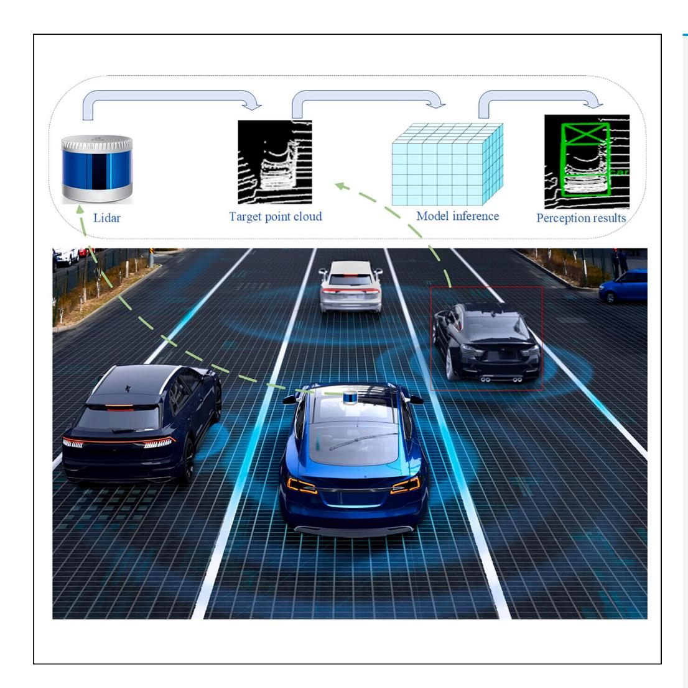

Likang Fan, Jie Cao, Xulei Liu, Xianyong Li, Liting Deng, Hongwei Sun, Yiqiang Peng

yqpeng@mail.xhu.edu.cn

#### Highlights

An anchor-free LiDAR detection with voxel self-attention is designed

The self-attention is applied to the voxel for deeply understand the scene

A center-point detection head is proposed to augment the orientation

Fan et al., iScience 27, 110759 September 20, 2024 © 2024 The Author(s). Published by Elsevier Inc.

https://doi.org/10.1016/ j.isci.2024.110759

# **iScience**

#### **Article**

# Voxel self-attention and center-point for 3D object detector

Likang Fan, 1 Jie Cao, 1 Xulei Liu, 1 Xianyong Li, 1 Liting Deng, 1 Hongwei Sun, 2 and Yiqiang Peng1,3,\*

#### **SUMMARY**

With the advancement of autonomous driving, the industrial demand for 3D object detection has continuously increased, leading to the development of anchor-based LiDAR object detectors reliant on convolutional neural networks (CNN). However, on the one hand, the poor receptive field of CNN limits the understanding of the scene. On the other hand, anchor-based methods cannot accurately predict the posture of objects in the steering. Therefore, in this paper, we propose the voxel self-attention and center-point (VSAC). Firstly, a voxel self-attention network is designed into VSAC to capture extensive voxel relationship. Secondly, considering the impact of feature weight on prediction results, the pseudo spatio-temporal feature pyramid net (PST-FPN) is proposed. Finally, we employ a center-point detection head to make the prediction direction closer to the real object during steering. The experimental results of VSAC on the widely used KITTI dataset, Waymo Open Dataset, and nuScenes dataset demonstrate its positive performance.

#### **INTRODUCTION**

With the increasing application of autonomous driving, 1,2 robotic technology, 3 and 3D reconstruction, 4 the traditional 2D image detection can no longer satisfy the requirement of accurately perceiving information in complex environments. Accurate environmental perception in space is crucial for the safety of autonomous driving vehicles. Object detection is an important component of environmental perception and object detection based on 2D images 5–7 plays a certain role in autonomous driving. However, 2D images cannot accurately provide the depth and spatial structure of detected objects, leading to imprecise detection results in the three-dimensional environment of autonomous driving. Even though there are existing methods 3,9 to obtain 3D depth from images, the results of such object detection are often unstable.

Unlike 2D images obtained from cameras, 3D point cloud data of LiDAR provides precise depth and spatial structure information, which can accurately describe the geometric characteristics of objects in autonomous driving. However, due to the properties of LiDAR 3D point cloud data, 3D object detection in autonomous driving faces the challenges and potential impact:(1) Due to the unordered arrangement of LiDAR point clouds in space, feature extraction for 3D object detection methods becomes more complex. (2) Because of the sparsity of LiDAR point clouds in space, 3D object detection methods waste significant computational resources in calculating ineffective voxel spaces. (3) Due to potential occlusions of target objects, the information in LiDAR point clouds may be incomplete, leading to missed detections in autonomous driving perception systems.

To address the challenges posed by 3D object detection in LiDAR point cloud data, a series of voxel-based methods 10–14 have been proposed. These methods usually divide the point cloud in space into regularly arranged voxel grids, and then utilize CNN to learn spatial features. Compared to 2D image detection, dependent on the CNN 3D detectors are able to capture richer spatial information and detailed geometrical structures from LiDAR point cloud data. However, due to the limitations of the receptive field, CNN often fail to capture the relationships between point clouds over a large area, which is disadvantageous for 3D point cloud detection tasks. Therefore, how to use the original point cloud data to obtain the intrinsic connection between the point clouds becomes the primary problem in the 3D object detection task.

Recently, attention-based methods have demonstrated outstanding capabilities in the classification, 15 detection 16 and segmentation 17 of 2D images. After that, attention-based methods also have been gradually applied to 3D point cloud projects, 18–21 and have achieved well performance. In the existing research, CT3D22 proposed a two-stage point cloud detector where the first stage grouped the point clouds by extracting 3D region of interest (Rol) and the second stage applied attention to the grouped point clouds. Nevertheless, due to the sparseness and irregularity of the point cloud, there is variation in the number of points within each Rol, resulting in detection outcome instability. In order to address this problem, VoTr23 employed an attention mechanism within voxels to maintain the stability of results but the voxel attention range is still unsatisfactory. In addition, most of these detectors adopt an anchor-based detection head,24 which often fails to accurately predict the orientation of cars during turning.

1Vehicle Measurement, Control and Safety Key Laboratory of Sichuan Province, Xihua University, Sichuan 100089, China 2Guangdong Xinbao Electrical Appliances Holdings CO, LTD, Longzhou Road, Leliu Town, Shunde District, Foshan City, Guangdong, P.R. China 3I ead contact

\*Correspondence: yqpeng@mail.xhu.edu.cn https://doi.org/10.1016/j.isci.2024.110759

To address these, an anchor-free 3D LiDAR object detector in VSAC with a larger receptive field is designed. Firstly, inspired by VoTr, 23 in order to obtain more comprehensive contextual information, the voxel self-attention mechanism in the VSAC retains the original 3D spatial information by performing calculations on non-empty voxels. Due to the fact that the number of non-empty voxels in space is very large, 25 self-attention calculations on non-empty voxels present challenges in real-time applications. Therefore, on the one hand, we propose the ripple-like center-spreading attention module to determine the attention range, which searches sequentially outwards for voxels involved in the attention computation with the query voxel as the center, on the other hand, we establish an voxel hash table for storing non-empty voxels to expedite the voxel search process in self-attention computations.

Secondly, in order to make the feature information obtained by the detection head more reliable, the PST-FPN is designed to obtain the weights of different features. Different from the traditional feature pyramid net (FPN), PST-FPN enhances the representation of important features by introducing spatial and channel attention mechanisms with residual networks.

Finally, unlike the anchor-base methods, using points to represent objects is advantageous for predicting the posture of cars during turning maneuvers. At the same time, if the object is represented by using a center-point, this will greatly facilitate the execution of subsequent tasks such as tracking. Therefore, we employ a center-point detection head, which is effective regressing the 3D dimensions, orientation and other attribute information of the object through the center-point of the object.

In summary, our main contributions are as follows.

- (1) We propose the VSAC network framework for 3D LiDAR object detection, which utilizes voxel self-attention to learn wide-range relational between voxels, thereby deepening the comprehension of network model in the entire spatial scene.
- (2) In order to enhance the feature representation capability, we propose the PST-FPN to emphasize the importance of key features from various feature channels and resolutions by incorporating channel and spatial attention.
- (3) We propose a center-point detection head, which represents objects as points, thereby enabling more precise prediction of cars orientation throughout turning maneuvers.

The remaining structure of this article is arranged as follows: Section 2 provides an elaboration on related work concerning 3D object detection using LiDAR. Then, Section 3 offers a detailed explanation of the proposed VSAC. This is followed by Section 4, where detailed experiments and results are presented. Finally, a concise conclusion of the paper is drawn in Section 5.

#### Related work

In this section, a comprehensive review of the development of 3D LiDAR object detection is shown. At present, 3D LiDAR detection methods can be broadly divided into three categories: point-based methods, voxel-based methods, and hybrid methods. Regardless of the method, they can further be categorized into one-stage and two-stage detections. In one-stage, the results of the region generating network (RPN)26 are usually used as the final prediction. In contrast, two-stage detection requires further fine-tuning of the results of the RPN to make the final prediction, which result in the two-stage detection method taking longer.

Point-based methods: inspired by PointNet27 and PointNet++,28 a series of methods have emerged focusing on per-point feature learning directly from raw point cloud data. F-PointNet29 and PointRCNN30 were pioneers in this field. 3DSSD31 adopted the advanced idea of fusing spatial and semantic information. VoteNet32 generated candidate boxes from voting results of the center point to refine detection. Point-GNN33 employed graph neural networks to reduce the computational burden caused by the redundant sampling and grouping of point clouds. Pointformer20 introduced transformer into downsampled point clouds to capture crucial global features. These approaches, to some extent, preserved the original positional and geometric information. However, these methods encountered difficulties in real-time applications for searching neighboring points.

Voxel-based methods: to make real-time applications feasible for 3D point cloud object detection, VoxelNet12 employed the partitioning of unordered point cloud data into orderly arranged voxels and employed CNN to learn voxel features. Nevertheless, only a small number of areas within the LiDAR point cloud coverage space actually contain point cloud data. Among the voxels partitioned in space, only a tiny fraction of the voxels contains point cloud information.34 Therefore, directly applying 3D convolutional networks to voxels can lead to significant computational resource wastage. SECOND10 alleviated the phenomenon of ineffective computation and resource wastage by only operating on non-empty voxels. PointPillars13 significantly improved computational efficiency by directly transforming 3D point clouds into pillars to generate pseudo 2D images. Voxel-RCNN35 extracted RoI from voxels and then refined the outcomes of the initial stage. CIA-SSD14 fused the information of the bottomed spatial and the upper semantic to improve the detection accuracy. Based on the CIA-SSD, SE-SSD36 further proposed a pair of teacher-student models to enhance the detection ability when the number of object point clouds is small.

Hybrid Point-Voxel methods: to achieve a balance between efficiency and accuracy in 3D object detection, the fusion of the advantages of points and voxels is an inevitable trend. Fast Point RCNN37 proposed the fusion of convolutional features and point coordinates to optimize the candidate boxes in the first stage. STD38 sampled key points to obtain sparse point clouds, and then voxelized the sparse point clouds for dense representation. PV-RCNN39 adopted sparse convolution to obtain feature maps at different scales and extract key point features from these maps. SA-SSD40 applied sparse convolution to voxelized point clouds and proposed an auxiliary network to convert voxel features into per-point feature representations. BADet41 employed local neighborhood graphs to effectively simulate the local boundary relationships of objects, and through an information compensation mechanism, explicitly enhanced the boundary integrity of each proposal.

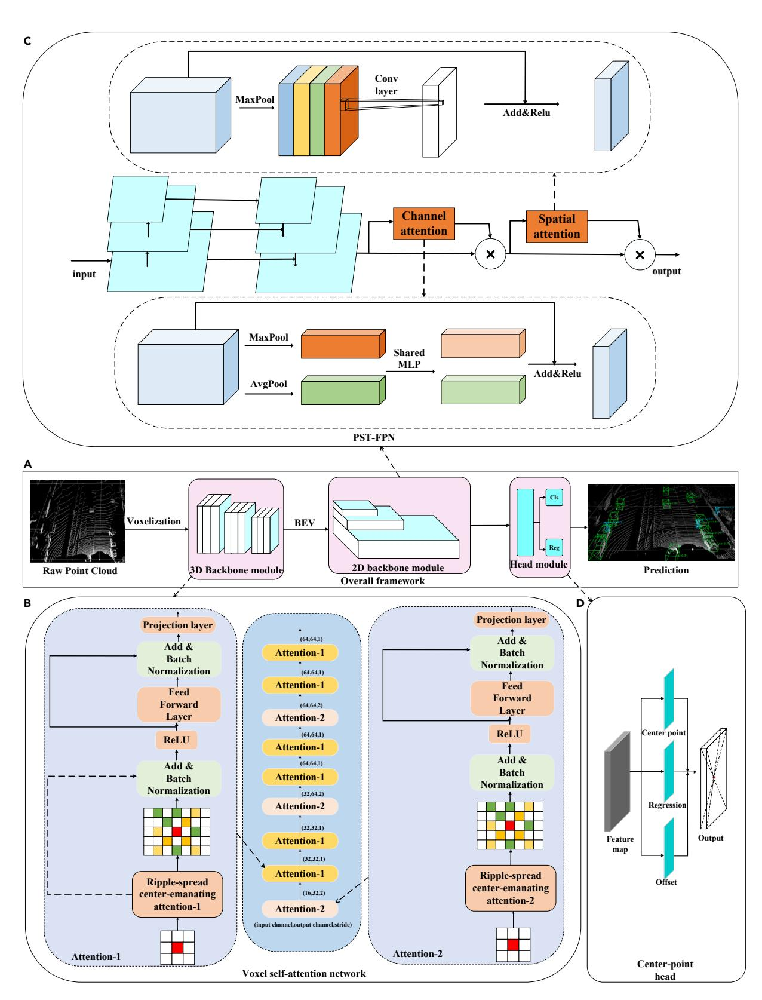

Figure 1. Outline of VSAC

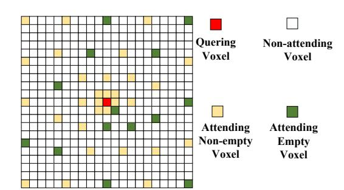

Figure 2. The range of the ripple-spread center-emanating attention mechanism

The query voxel is colored red, the non-empty voxiles within the attention range are colored yellow, the empty voxels within the attention range are colored green and the white voxels are outside the range of attention and do not participate in the calculation.

#### Methodology

In this section, we detail the overall framework of the one-stage anchor-free 3D detector (VSAC). As illustrated in Figure 1A, the VSAC mainly consists of three modules: (1) a voxel self-attention network is used as a 3D backbone module to obtain rich global information and contextual information (see Figure 1B); (2) a PST-FPN serves as a 2D backbone module to further highlight the key features (see Figure 1C); (3) a centerpoint detection head module for predicted classes and regression location information (see Figure 1D).

#### Voxelization

B is the set representing the entire point cloud, the expression is as follows:

$$B = \left\{ b_i = \left( b_x^i, b_y^i, b_z^i, b_r^i \right) \epsilon R^4, i = 1, 2, ..., m \right\}$$
 (Equation 1)

Where  $b_i$  represents a point in the set, (bx,by,bz) represents the 3D coordinates and br represents intensity feature, m denotes the total number of points in the set.

Because of the disorder and irregularity of the original point cloud data, we first employ a mapping algorithm10,12,40 to represent the original point clouds as voxels. The voxel coordinates (v) are calculated as follows:

$$v = \left(\nabla \left(\frac{b_x}{V_{long}}\right) \nabla \left(\frac{b_y}{V_{width}}\right) \nabla \left(\frac{b_z}{V_{height}}\right)\right)$$
 (Equation 2)

where  $\nabla$  indicates the floor function, [ $V_{long}$ ,  $V_{width}$ ,  $V_{height}$ ] $\in$   $R^3$  represent the quantization step size in voxelization.

This means that the continuous point cloud coordinates are mapped to discrete voxel coordinates through dividing each coordinate by the quantization step size [ $V_{long}$ ,  $V_{width}$ ,  $V_{height}$ ]. The total number of voxels is  $N_{dense}$  in space. When processing voxels, if the number of points in a voxel exceeds a preset threshold, memory consumption is reduced by randomly discarding the excess points. Conversely, if there are not

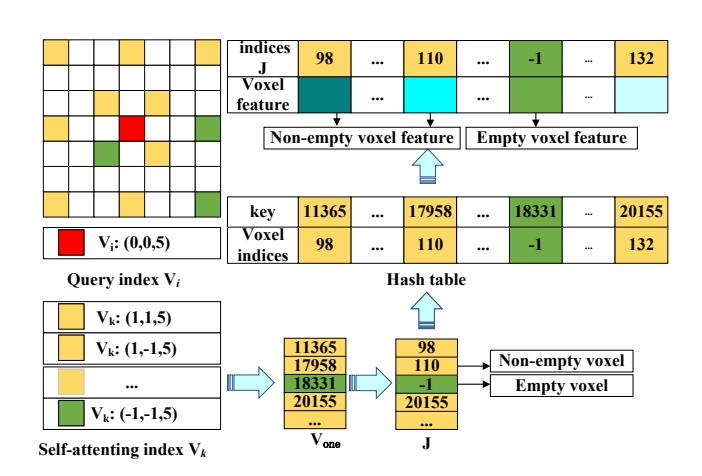

Figure 3. Illustration of rapid query on voxels

The red grid represents the queried voxel, while the yellow and green grids, respectively, indicate the non-empty voxels and empty voxels participating in the attention process, as determined by the ripple-spread center-emanating attention.

|                            | Car/AOS(%) |       |       |  |  |  |
|----------------------------|------------|-------|-------|--|--|--|
| Mehods                     | Easy       | Mod   | Hard  |  |  |  |
| Pointpillars 13 | 93.84      | 90.70 | 87.47 |  |  |  |
| Voxel-MAE 47    | 93.07      | 91.53 | 89.16 |  |  |  |
| TANet 48        | 93.52      | 90.11 | 84.61 |  |  |  |
| F-ConvNet 49    | 95.81      | 91.98 | 79.83 |  |  |  |
| Point-GNN 33    | 38.66      | 37.20 | 36.29 |  |  |  |
| PartA^2 50      | 95.00      | 91.73 | 88.86 |  |  |  |
| PointRGBNet 51  | 95.39      | 91.33 | 86.29 |  |  |  |
| BtcDet 52       | 39.26      | 38.00 | 36.82 |  |  |  |
| 3ONet 53        | 96.86      | 93.87 | 88.45 |  |  |  |
| VSAC(ours)                 | 95.96      | 92.30 | 87.48 |  |  |  |

enough points in the voxel, we use the average value to fill in the points. Following this, as per, 10,42 the average features of all points within a voxel are taken to represent the features of that voxel, denoted as *f*(vox):

$$f(vox) = \frac{1}{vox} \sum_{b \in vox} (b_x, b_y, b_z, b_r)$$
 (Equation 3)

Where vox represents the points of each voxel.

#### 3D backbone module

As depicted in Figure 2, inspired by Big Bird, 43 the ripple-spread center-emanating attention range ( $\Omega(i)$ ) is proposed to effectively manage the related voxels. The  $\Omega(i)$  should be designed with the following conditions: (1)  $\Omega(i)$  should cover as many neighboring voxels as possible to

| Table 2. The analysis of       | Table 2. The analysis of performance on the KITTI test set. L represents the lidar, and R represents the image |       |                                   |       |       |       |                                    |       |       |  |
|--------------------------------|----------------------------------------------------------------------------------------------------------------|-------|-----------------------------------|-------|-------|-------|------------------------------------|-------|-------|--|
| Mehods                         | Modality                                                                                                       | •     | Car-3D(AP:%) Easy Mod Hard Avg |       |       |       | Car-BEV(AP:%) Easy Mod Hard Avg |       |       |  |
| MV3D 54             | L + R                                                                                                          | 74.97 | 63.63                             | 54.00 | 64.20 | 86.62 | 78.93                              | 69.80 | 72.45 |  |
| AVOD-FPN 55         | L + R                                                                                                          | 83.07 | 71.76                             | 65.73 | 73.52 | 90.99 | 84.82                              | 79.62 | 85.14 |  |
| F-PointNet 29       | L + R                                                                                                          | 82.19 | 69.79                             | 60.59 | 70.86 | 91.17 | 84.67                              | 74.77 | 83.53 |  |
| F-ConvNet 49        | L + R                                                                                                          | 87.36 | 76.39                             | 66.69 | 76.81 | -     | _                                  | -     | -     |  |
| ContFuse 56         | L + R                                                                                                          | 83.68 | 68.78                             | 61.67 | 71.37 | 88.81 | 85.83                              | 77.33 | 83.99 |  |
| PI-RCNN 57          | L + R                                                                                                          | 84.37 | 74.82                             | 70.03 | 76.40 | -     | _                                  | -     | -     |  |
| PointPainting 58    | L + R                                                                                                          | 82.11 | 71.70                             | 67.08 | 73.63 | -     | -                                  | -     | -     |  |
| VoxelNet 12         | L                                                                                                              | 77.47 | 65.11                             | 57.73 | 66.77 | 89.60 | 84.81                              | 78.57 | 84.32 |  |
| PointPillars 13     | L                                                                                                              | 82.58 | 74.31                             | 68.99 | 75.29 | 90.07 | 86.56                              | 82.81 | 86.48 |  |
| SECOND 10           | L                                                                                                              | 83.34 | 72.55                             | 65.82 | 73.90 | 89.39 | 83.77                              | 78.59 | 83.91 |  |
| PointRCNN 30        | L                                                                                                              | 86.96 | 76.50                             | 71.39 | 78.28 | -     | -                                  | -     | -     |  |
| Fast Point R-CNN 37 | L                                                                                                              | 85.29 | 77.40                             | 70.24 | 77.64 | 90.87 | 87.84                              | 80.52 | 86.41 |  |
| 3D iou loss 59      | L                                                                                                              | 86.16 | 76.50                             | 71.39 | 77.50 | 91.36 | 86.22                              | 81.20 | 86.26 |  |
| TANet 48            | L                                                                                                              | 83.81 | 75.76                             | 68.32 | 75.62 | -     | _                                  | -     | -     |  |
| Asso-3Ddet 60       | L                                                                                                              | 85.99 | 77.40                             | 70.53 | 77.97 | -     | -                                  | -     | -     |  |
| VoxelFPN 61         | L                                                                                                              | 85.63 | 76.70                             | 69.44 | 77.26 | -     | -                                  | -     | -     |  |
| SegVoxelNet 42      | L                                                                                                              | 86.04 | 76.13                             | 70.76 | 77.64 | -     | -                                  | -     | -     |  |
| CenterPoint 11      | L                                                                                                              | 81.17 | 73.96                             | 69.48 | 71.54 | -     | -                                  | -     | -     |  |
| Votr-SSD 23         | L                                                                                                              | 86.73 | 75.96                             | 68.71 | 77.13 | -     | -                                  | -     | -     |  |
| VSAC(ours)                     | L                                                                                                              | 86.48 | 76.64                             | 72.04 | 78.38 | 92.06 | 86.34                              | 81.63 | 86.67 |  |

| Table 3. Performance comparison of car detection on the KITTI validation split |                               |  |  |  |
|--------------------------------------------------------------------------------|-------------------------------|--|--|--|
| Mehods                                                                         | Car-3D(AP:%) Easy Mod Hard |  |  |  |
| MV3D 54                                                             | 71.29 62.68 56.56             |  |  |  |
| AVOD-FPN 55                                                         | 84.41 74.44 68.65             |  |  |  |
| F-PointNet 29                                                       | 83.76 70.92 63.65             |  |  |  |
| PointRCNN 30                                                        | 88.88 78.63 77.38             |  |  |  |
| VoxelNet 12                                                         | 81.97 65.46 62.85             |  |  |  |
| GAPSA 62                                                            | 89.23 79.15 78.67             |  |  |  |
| SMS-Net 63                                                          | 89.34 79.04 77.76             |  |  |  |
| VSAC(ours)                                                                     | 89.22 79.19 76.22             |  |  |  |

preserve the subtlety of the 3D structure. (2)  $\Omega(i)$  should be extended to more distant areas for wider global information. (3) The number of voxels involved in attentional computation in  $\Omega(i)$  should be kept at a low level to avoid excessive computational burden. These are practical consideration, ensuring that while the model captures necessary spatial information, it does not become computationally infeasible, especially when scaling to large point cloud datasets or aiming for real-time processing.

For each query voxel, it is important to quickly search for the relevant voxel. We define V and F as the voxel coordinate array and the feature array, respectively, as follows:

$$V = N_v \times 3, F = N_v \times z \tag{Equation 4}$$

Where  $N_v$  denotes the number of voxels, 3 denotes the dimensions of coordinates, z denotes the dimension of feature.

In order to more conveniently search for relevant voxels in the self-attention calculation, we convert the three-dimensional index array  $V_{oner}$  as follow:

$$V_{one} = \{1, 2, 3...N\}$$
 (Equation 5)

Where N represents the number of voxels.

In the entire dense 3D voxel-grid, after preprocessing the voxels, non-empty voxels are stored as J (if it's an empty voxel, it is stored as -1), as follow:

$$J = \{-1, 1, 2, 3...m\}$$
 (Equation 6)

Where *m* represents the number of non-empty voxels.

As depicted in Figure 3, we propose an approach for handling non-empty voxels to reduce memory and resource overhead. The  $v_i$ ,  $v_k$  represent the indexes in the array V of the query voxel and the voxel involve in the attention computation, respectively. Initially, for each  $v_i$ , corresponding  $v_k \in \Omega(i)$  can be obtained. Then, a voxel hash table is established, with the indices in the array  $V_{one}$  serving as keys and the corresponding indices in the array J as values. Next, we use the key to search the hash table for the corresponding index in the array J. If the hash table returns -1, it is judged as an empty voxel. Ultimately, this allows us to obtain the voxels participating in the attention mechanism, as well as the features of the voxels.

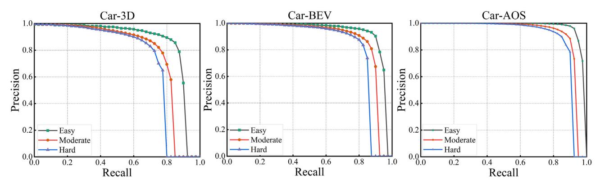

Figure 4. Precision-recall curves for Car-3D, Car-BEV, and Car-AOS detection

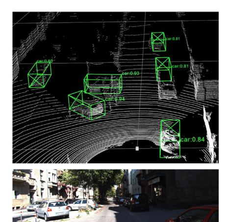

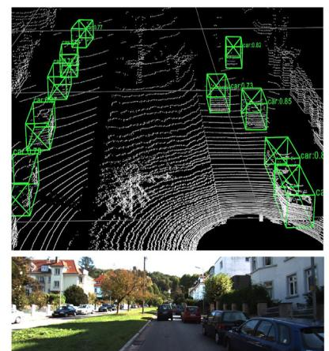

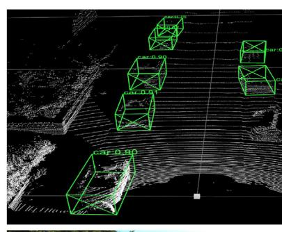

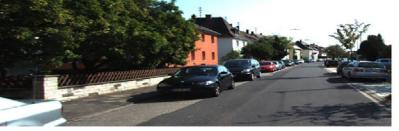

Figure 5. Visualization of VSAC detection results on the KITTI test set
Colored bounding boxes of cars and their confidence scores are plotted on the point cloud images.

Moreover, each operation on the non-empty voxel is assigned to a separate CUDA thread, allowing all steps to be executed synchronously on the GPU. This parallel processing greatly reduces the complexity of searching for voxels.

#### Voxel self-attention

Voxel self-attention module can be applied in most voxel detectors. It constructs long-range relationships between voxels by utilizing multihead attention. As shown in Figure 1B, voxel self-attention consists of attention-1 and attention-2 modules. The attention-1 preserves the original structural information of the 3D space by solely calculating features of non-empty voxels. Meanwhile, the attention-2 enhances flexibility by additionally extracting features from non-empty voxel and a select few empty voxels. This structure allows the model to not only retain detailed spatial information, but also to take into account the wider contextual information provided by the null voxels, which is crucial for overall scene understanding. Compared to the classical transformer module, our proposed module has the following main differences: (1) we introduce a new range for attention calculation, which allows attention to object relevant non-empty voxels in a controlled fashion. (2) In order to stabilize the learning process, we replace layer normalization with batch normalization. (3) Considering the small number of non-empty voxels in learning, we remove all dropout layers. (4) After the feedforward network, a projection layer is added to potentially enhance the model's representational capability.

Specifically, for each query voxel, the  $\Omega(i)$  is determined by ripple-spread center-emanating attention. Next, multi-head attention is applied to the voxels participating in the attention process to obtain their features. Let  $f_i$ ,  $f_k \in F$ , respectively, represent the features of the query voxel and the voxiles participating in the attention. Firstly, the voxel indices i,  $k \in V$  are mapped to the actual voxel center  $o_i$ ,  $o_k$ , as follow:

$$o_i = r \times (i + 0.5), o_k = r \times (k + 0.5)$$
 (Equation 7)

Where r represents the voxel size.

Then for a single attention head, the query embedding  $Q_i$ , key embedding  $K_k$ , and value embedding  $V_k$  are computed:

$$\begin{cases} Q_i = f_i W_q \\ K_k = f_k W_k + E_p \\ V_k = f_k W_v + E_p \end{cases}$$
 (Equation 8)

Where  $W_{q_r}$   $W_k$ ,  $W_v$  are derived from the linear projections of the query, key, and value, respectively. The computation of the positional encoding  $E_p$  is as follows:

$$E_p = (o_i - o_k)W_p (Equation 9)$$

Where  $W_p$  is a linear projection of the position vector.

Since empty voxels lack effective features, they cannot provide query embedding  $Q_i$  directly from  $f_i$ . Therefore, in order to involve empty voxels in the attention mechanism and provide representative values for  $Q_i$  at the positions of empty voxels, we need to assign values based on the voxel features  $f_k$  that participate in the attention mechanism:

$$Q_i = \bigwedge_{k \in \Omega(i)} (f_k)$$
 (Equation 10)

Where, the function  $\Lambda$  represents the max pool.

| Table 4. Performa          | Table 4. Performance comparison on Waymo validation set |                  |                 |                  |  |  |  |
|----------------------------|---------------------------------------------------------|------------------|-----------------|------------------|--|--|--|
| Methods                    | LEVEL-1(3D mAP)                                         | LEVEL-1(3D mAPH) | LEVEL-2(3D mAP) | LEVEL-2(3D mAPH) |  |  |  |
| PointPillars 13 | 63.3                                                    | 62.7             | 55.2            | 54.7             |  |  |  |
| MVF 64          | 62.93                                                   | -                | -               | -                |  |  |  |
| Pillar-OD 65    | 69.8                                                    | -                | -               | -                |  |  |  |
| LaserNet 66     | 52.1                                                    | 50.1             | -               | -                |  |  |  |
| CVCNet 67       | 65.2                                                    | -                | -               | -                |  |  |  |
| StarNet 68      | 64.7                                                    | 56.3             | 45.5            | 39.6             |  |  |  |
| RCD 69          | 69.0                                                    | 68.5             | -               | -                |  |  |  |
| PV-RCNN 39      | 70.3                                                    | 69.7             | 65.4            | 64.8             |  |  |  |
| VoTr-SSD 23     | 68.9                                                    | 68.3             | 60.2            | 59.6             |  |  |  |
| VSAC(ours)                 | 71.7                                                    | 71.1             | 63.7            | 63.1             |  |  |  |

Finally, the voxel self-attention is defined as:

$$f_i^{\text{attend}} = \sum_{k \in \Omega(i)} \psi\left(\frac{Q_i K_k}{\sqrt{d}}\right) \cdot V_k$$
 (Equation 11)

The self-attention on voxels is an extension of 2D self-attention to 3D, where the position embedding utilizes sparse voxels and relative coordinates. The normalization function  $\psi(\cdot)$  mentioned is the softmax function and the d indicates the length of  $Q_i$ .

#### Pseudo spatio-temporal feature pyramid Net (PST-FPN)

In the processing of pseudo-images, due to the reduction in feature map resolution and increase in the number of channels, highlighting the importance of different resolutions and feature channels is particularly critical. As shown in Figure 1C, unlike the traditional FPN, PST-FPN add two additional components: channel attention and spatial attention with residual networks to highlight different key features.

Specifically, channel attention is used to highlight the key feature of the pixel in different channels. In channel attention, we first aggregate the information of each channel in the feature maps through max pooling and average pooling to generate two different types of feature information. Then, these two types of feature information are processed by a shared multi-layer perceptron (MLP), resulting in two channel feature maps. Subsequently, we fuse these two channel feature maps by element-wise addition to output feature maps with enhanced representational capability. Finally, we additionally incorporate a residual network to maintain the stability of the model. Spatial attention is used to highlight the key pixels in the same channel. Initially, for each feature plane, we adopt max pooling to aggregate the feature map to generate feature information. Subsequently, this feature information is processed through a convolutional layer, resulting in a feature map with enhanced semantic capability. Ultimately, we incorporate a residual network to ensure the stability of the model.

#### Center-point detection head module

As illustrated in Figure 1D, the center-point detection head including comprising a center head, regression head, and offset head. It can directly detect the center-point position and 3D dimensions of the object.

Firstly, the input I to the detection head is the feature map outputted by the PST-FPN, denoted as:

$$I \in R^{W \times H \times C}$$
 (Equation 12)

Where W, H, and C represent the width, height, and the number of feature channels of the feature map, respectively.

| Table 5. Performance comparison on nuScenes dataset |      |       |      |         |      |      |      |      |      |      |      |      |
|-----------------------------------------------------|------|-------|------|---------|------|------|------|------|------|------|------|------|
| Methods                                             | Car  | Truck | Bus  | Trailer | Cons | Ped  | Moto | Bike | TC   | Bar  | mAP  | NDS  |
| SECOND 10                                | 73.1 | 25.2  | 30.5 | 31.5    | 8.5  | 59.3 | 21.7 | 4.9  | 18.0 | 43.3 | 31.6 | 46.8 |
| PointPillars 13                          | 68.4 | 23.0  | 28.2 | 23.4    | 4.1  | 59.7 | 27.4 | 1.1  | 30.8 | 38.9 | 30.5 | 45.3 |
| SARPNET 70                               | 59.9 | 18.7  | 19.4 | 18.0    | 11.6 | 69.4 | 29.8 | 14.2 | 44.6 | 38.3 | 31.6 | 49.7 |
| WYSIWYG 34                               | 79.1 | 30.4  | 46.6 | 40.1    | 7.1  | 65.0 | 18.2 | 0.1  | 28.8 | 34.7 | 35.0 | 41.9 |
| SMS-Net 63                               | 80.3 | 49.5  | 61.3 | 35.1    | 12.1 | 71.2 | 28.9 | 4.6  | 46.0 | 48.0 | 43.7 | 57.6 |
| VSAC(ours)                                          | 78.0 | 47.4  | 63.6 | 21.4    | 9.4  | 77.0 | 37.5 | 18.8 | 36.2 | 7.3  | 39.7 | 55.8 |

| Table 6. Effects of the number of attention-i modules on the KITTI validation split |                           |                           |              |  |  |
|-------------------------------------------------------------------------------------|---------------------------|---------------------------|--------------|--|--|
| Methods                                                                             | the Number of Attention-1 | the Number of Attention-2 | Car-AP3D (%) |  |  |
| a                                                                                   | 4                         | 2                         | 86.71        |  |  |
| b                                                                                   | 6                         | 3                         | 87.32        |  |  |

Next, the center head generates a key point heatmap Y, denoted as:

$$Y \in [0,1]^{\left(\frac{W}{Q} \times \frac{H}{Q} \times \frac{C_2}{Q}\right)}$$
 (Equation 13)

Where Q represents the output stride, and  $C_2$  denotes the types of key points.

Through downsampling by the output stride, we obtain the output prediction  $Y_1$ . If  $Y_1 = 1$ , it corresponds to a keypoint; if  $Y_1 = 0$ , it indicates the background. For each ground truth key point p, we calculate its position at a lower resolution  $p_1$ , denoted as:

$$P_1 = \nabla \left(\frac{P}{Q}\right)$$
 (Equation 14)

Where  $\nabla$  denotes the floor function.

Then, we map all ground truth points onto the heatmap using a Gaussian kernel Yxyc, denoted as:

$$Y_{xyc} = \exp\left(-\frac{(x-p_1)^2 + (y-p_1)^2}{2\delta p_1^2}\right)$$
 (Equation 15)

Where  $\sigma$  represents the standard deviation.

The category loss employs the focal loss function, 26,44,45 as follows:

$$L_{class} = \frac{-1}{N} \sum_{i=1}^{N} \left\{ \frac{(1-Y_1)^{\alpha} \log(Y_1), if \ Y_1 = 1}{(1-Y_{xyc})^{\beta} Y_1^{\alpha} \log(1-Y_1), otherwise} \right\}$$
 (Equation 16)

Where N is the number of key points in I, and  $\alpha$  and  $\beta$  are hyperparameters of the focal loss, set as  $\alpha = 2$  and  $\beta = 4$  in experiments.

After that, for each center point, to correct the errors caused by the stride, an offset head is integrated into our model, with the calculation as follows:

$$L_{\text{off}} = \frac{1}{N} \sum_{p} |O_p - \left(\frac{p}{Q} - p_1\right)|$$
 (Equation 17)

Where  $O_p$  represents the predicted local offset.

For predicting the position and size of objects, we employ the L1 loss function, as specified in the further text:

$$L_{re} = \sum_{b \in (x,y,z,l,h,w,\gamma)} SmoothL1(\Delta b)$$
 (Equation 18)

Where x, y, z represent the coordinates of the predicted object's center, l, h, w denote the dimensions, and  $\gamma$  represents the orientation. Finally, for the total loss, constant is employed to constrain the loss:

$$L_{total} = \lambda_{class} L_{class} + \lambda_{re} L_{re} + \lambda_{off} L_{off}$$
 (Equation 19)

In practical applications, the values for  $\lambda_{class}$ ,  $\lambda_{re}$ ,  $\lambda_{off}$  are set to 1, 0.1, and 1, respectively.

#### **RESULTS**

In this section, we evaluated the performance of VSAC on two datasets including the KITTI dataset, the Waymo Open Dataset and nuScenes Dataset. Firstly, we present a short overview of these datasets and the details of our experiments. Secondly we showed comparisons with

| Table 7. Effects of the number of voxels in attention range on the KITTI validation split |                                   |              |  |  |
|-------------------------------------------------------------------------------------------|-----------------------------------|--------------|--|--|
|                                                                                           | The Number of Voxels in Attention |              |  |  |
| Methods                                                                                   | Calculation                       | Car-AP3D (%) |  |  |
| a                                                                                         | 16                                | 83.59        |  |  |
| b                                                                                         | 32                                | 85.57        |  |  |
| С                                                                                         | 48                                | 87.32        |  |  |

| Table 8. Effects of the number of downsampling voxels on the KITTI validation split |                            |              |  |  |
|-------------------------------------------------------------------------------------|----------------------------|--------------|--|--|
| Methods                                                                             | Downsampling Voxel Numbers | Car-AP3D (%) |  |  |
| a                                                                                   | 9000                       | 86.67        |  |  |
| b                                                                                   | 18000                      | 87.32        |  |  |

current excellent methods on the KITTI dataset, the Waymo Open Dataset and nuScenes Dataset. Then we present ablation study about our method on the KITTI dataset. Lastly we conducted autonomous vehicle detection experiments on campus.

#### **Dataset and evaluation**

The KITTI dataset is extensively utilized for assessing 3D object detection and consists of 7,481 training samples and 7,518 testing samples. During the experiments, we follow the recent work35 to further divide the training dataset into a training split of 3712 samples and a validation split of 3769 samples. The detection task level is categorized as easy, moderate, and hard based on object size, occlusion, and truncation status. All models are trained exclusively for training split, and their performance is evaluated on the validation split and test set. We adopt the evaluation metrics by the KITTI dataset, which include the mean average precision with 11 recall positions (AP|R11), the mean average precision with 40 recall positions (AP|R40) and the average orientation similarity (AOS) with 40 recall positions. AP|R11, AP|R40, and AOS are denoted as follows:

$$AP|R11 = \frac{1}{11} \sum_{r \in S_1} P_{\text{inter}}(r)$$
 (Equation 20)

$$AP|R40 = \frac{1}{40} \sum_{r \in S_n} P_{inter}(r)$$
 (Equation 21)

$$AOS = \frac{1}{40} \sum_{r \in S': r' \ge r} \max_{r} u(r')$$
 (Equation 22)

Where  $S_1 = \{1/11, 2/11, ..., 1\}$ ,  $S = S_2 = \{1/40, 2/40, ..., 1\}$ , and  $P_{inter}(r)$  represents an interpolation function, denoted as:

$$P_{\text{inter}}(r) = \max_{r} p(r')$$
 (Equation 23)

u(r) is denoted as:

$$u(r) = \frac{1}{|D(r)|} \sum_{i \in D(r)} \frac{1 + \cos \Delta_{\theta}^{(i)}}{2} \delta_i$$
 (Equation 24)

D(r) represents the set of all test instances identified as positive samples at the recall rate r, while  $\Delta(i)$   $\theta$  denotes the difference between the predicted angle and the actual object angle for the detected object (i). If the detected object (i) has an intersection over Union (IoU) with the actual object greater than 0.7, then  $\delta_i = 1$ ; otherwise,  $\delta_i = 0$ . All results are evaluated by the mean average precision with a rotated IoU threshold 0.7 for cars.

The Waymo Open Dataset has a total of 798 training set sequences with 158,361 LiDAR samples and 202 validation set sequences with 40,077 LiDAR samples. Due to its complex variety of autonomous driving scenarios, the detection task in the Waymo Open Dataset is even more challenging. We used Waymo Open Dataset's officially recognized mAP and mAPH with rotated IoU threshold 0.7 for cars as indicators of performance.

The nuScenes dataset contains 1,000 autonomous driving scenes, divided into a training set of 700 scenes, a validation set of 150 scenes, and a test set of 150 scenes. The nuScenes dataset includes ten categories, with a total of 40,000 annotated frames. We use the official mAP (mean average precision) and NDS (nuScenes Detection Score) metrics from the nuScenes dataset as the average metrics for our model.

| Table 9. Effects of the scaling factors on the KITTI validation split |                     |              |  |  |
|-----------------------------------------------------------------------|---------------------|--------------|--|--|
| Methods                                                               | Map Scaling Factors | Car-AP3D (%) |  |  |
| a                                                                     | 1/4                 | 87.32        |  |  |
| b                                                                     | 1/8                 | 81.96        |  |  |

| Table 10. Effect of the PST-FPN on the KITTI validation split |         |              |  |  |  |
|---------------------------------------------------------------|---------|--------------|--|--|--|
| Methods                                                       | PST-FPN | Car-AP3D (%) |  |  |  |
| a                                                             | Υ       | 87.04        |  |  |  |
| b                                                             | N       | 85.69        |  |  |  |

#### Implementation details

The experimental procedure utilized a toolbox, details of that can be referred to in OpenPCDet. For the KITTI dataset, the x, y, z coordinate range of the point cloud is [0, +70.4], [-40, +40], [-3.0, +1.0] and the voxel size is set to [0.05, 0.05, 0.1]. For the Waymo Open Dataset, the x, y, z coordinate range of the point cloud is set to [-75.2, +75.2], [-75.2, +75.2], [-2.0, +4.0] and the voxel size is set to [0.1, 0.1, 0.15]. For nuScenes dataset, the x, y, z coordinate range of the point cloud is set to [-54.0, +54.0], [-54.0, +54.0], [-5.0, +3.0] and the voxel size is set to [0.075, 0.075, 0.2]. Post-transformation of the point cloud into regularized voxels, non-empty voxels are linearly projected to yield 16-channel initial features, subsequently inputted into Voxel Self-attention for feature learning. The channel count of voxel features increases to 32 after the first and to 64 after the second attention-2, while other modules maintain the voxel feature channel. Then PST-FPN processes feature learning and outputs a feature map with 256 channels. In the center-point detection head, the feature map scale factor is set at 1/4, with a maximum detection capacity of 100 objects, and the permissible error distance for detected center points is 2 cm.

VSAC was trained end-to-end on 2 NVIDIA-A30 GPUs using the ADAM optimizer. For the KITTI dataset, the batch size was set to 4, the number of epochs was set to 90, the maximum learning rate was set to 0.01 and the learning rate for all models was 0.003, with decay performed by cosine annealing. For the Waymo Open Dataset, the batch size was set to 2, the number of epochs was set to 30 and the maximum learning rate was set to 0.01. For the nuScenes dataset, the batch size was set to 2, the number of epochs was set to 20, and the maximum learning rate was set to 0.01. During the training phase, for target assignment, we set an IoU threshold of 0.55. If the IoU between a proposal and the ground-truth boxes is greater than the IoU threshold, then the proposal is considered a positive sample. Otherwise, it is considered a negative sample. In the inference stage, we selected the top 128 candidates based on confidence for non-maximum suppression (NMS) with a threshold of 0.7. Additionally, we employed a data augmentation strategy for the 3D point cloud data, which included random flipping, scaling within a range of 0.95–1.05, and rotation around the X axis between –5 and 5°.

#### Comparisons on the KITTI dataset

To verify the validity of the VSAC, we submit the results on the test set to the official KITTI website. The evaluation metrics used for the test set are AP|R40 and AOS, while the evaluation metric for the validation split is AP|R11. As shown in Table 1, we provide a detailed overview of the AOS for Cars at three different levels and the top performance is indicated in bold. Compared to the anchor-based method (PointPillars), VSAC demonstrates superior performance in terms of orientation prediction accuracy, with AOS improvements of 2.12% for easy, 1.6% for moderate, and 0.01% for hard levels. This indicates the excellent performance of VSAC in the direction prediction of car.

In Table 2, compared to the one-stage model (SECOND), the results of VSAC increased by 3.14%, 4.09% and 6.22% in 3D detection in easy, moderate and hard modes, respectively. In BEV detection, VSAC also has an increase of 2.67%, 2.57%, and 3.04%. In comparison with the one-stage voxel attention model (VoTr-SSD), VSAC achieves a 3.33% improvement in Hard mode for 3D Car detection. These show that VSAC demonstrates superior comprehensive performance in both 3D and BEV detection of Car.

In addition, as shown in Table 3, we further compare the 3D car inspection results on the KITTI validation split using AP|R11 as the metric. Detection performance of VSAC surpasses most methods.

The precision-recall curve is an indicator of detection performance and the larger its area, the more outstanding the detection performance. As shown in Figure 4, VSAC demonstrates robust performance in 3D detection, BEV detection, and AOS detection for cars.

Partial visualizations of the test set predictions are presented in Figure 5 for a higher-quality comparison. According to the test results, VSAC misses few objects in complex environments and the predicted vehicle direction is correct. This indicates a good robustness and stability of the VSAC.

All in all, as our VSAC has exhibited exceptional performance on both the validation and test sets, this serves as evidence of the model's effectiveness.

#### **Comparisons on the Waymo Open Dataset**

We further validate the effectiveness of our approach by conducting experiments under the Waymo Open Dataset with a more complex environment. As shown in Table 4, we compare VSAC with other excellent anchor-based object detection methods on the Waymo validation set.

| Table 11. Comparison of inference speed on the KITTI validation split |                      |                        |                          |                         |                       |            |
|-----------------------------------------------------------------------|----------------------|------------------------|--------------------------|-------------------------|-----------------------|------------|
| Methods                                                               | SECOND 10 | AVOD-FPN 55 | F-PointNet 29 | PointRCNN 30 | PV-RCNN 39 | VSAC(ours) |
| Speed(HZ)                                                             | 20.00                | 10.00                  | 5.90                     | 10.00                   | 9.25                  | 14.28      |

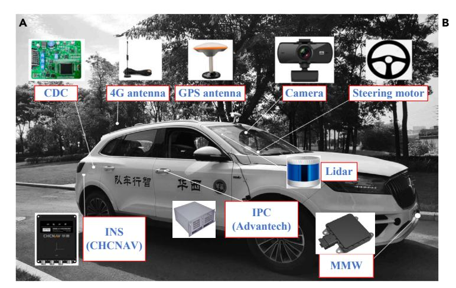

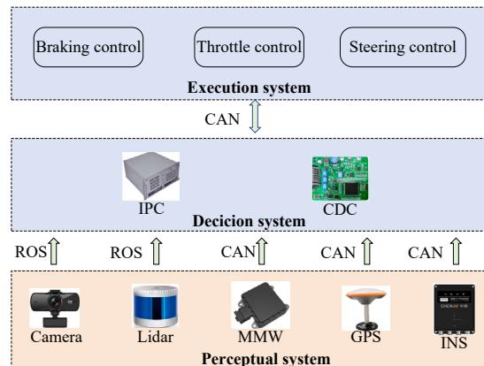

Figure 6. Autonomous driving platform

Compared to VoTr-SSD with voxel attention, under LEVEL-1 conditions, VSAC improves mAP and mAPH by 2.2% and 2.8%, respectively. Even in a more stringent detection scenario, LEVEL-2, VSAC achieves a 3.5% increase in both mAP and mAPH over VoTr-SSD.

#### Comparisons on the nuScenes dataset

As shown in Table 5, we evaluated the detection performance of VSAC on the nuScenes dataset and compared it with current state-of-the-art methods across ten detection categories. The proposed VSAC outperformed WYSIWYG by 4.7% in mAP and 13.9% in NDS. Specifically, the proposed method demonstrated better detection performance for most categories, including truck, bus, pedestrian, motorcycle, and bicycle.

#### Ablation studies

In this section, comprehensive ablation experiments are used to analyze the importance of the different parameter settings of VSAC. If not specified, we evaluate the car with the highest proportion of easy levels on the validation split of the KITTI dataset. The results of all assessments are analyzed using the APIR40.

#### Effects of the number of attention-1 and attention-2

To more precisely ascertain the effect of the number of attention-1 and attention-2 module on the overall model performance, we implemented different numbers of attention-1 and attention-2, respectively, within the voxel self-attention. As indicated in Table 6, with the increase in the number of attention-1 and attention-2 modules, the expressive capability of features improves.

#### Effects of the number of voxels in attention calculation

For each query voxel, The number of voxels in the attention range are set to 16, 32, and 48. Table 7 details the impact of varying the number of voxels involved in the attention calculation on AP|R40. It is observed that a lower number of voxels participating in attention is often detrimental to detection performance. When the number of voxels involved in attention is reduced from 48 to 16, the AP|R40 for Car decreased by 3.73%. This indicates that a greater number of voxels participating in the attention calculation provides richer spatial information.

#### Effects of downsampling voxel numbers

At the beginning of the voxel self-attention module, a downsampling process is applied to the voxels. We train models with downsampling numbers set at 18,000 and 9,000, respectively. As shown in Table 8, increasing the number of retained voxels from 9,000 to 18,000 during downsampling improved the AP|R40 for Car by 0.65%. This suggests that sampling a larger number of voxels better preserves the original spatial structure.

#### Effects of feature map scaling factors

During center-point detection on feature maps, scaling factors of 1/4 and 1/8 are employed to alter the feature maps. This approach is used to ascertain the impact of different receptive field sizes on the performance of model. As shown in Table 9, when the feature scaling factor is reduced from 1/4 to 1/8, the process of mapping the original image to the feature map results in a significant loss of feature information due to the substantial reduction in resolution.

| Table 12. Equipment information |           |              |  |  |  |
|---------------------------------|-----------|--------------|--|--|--|
| Equipment                       | Brand     | Model number |  |  |  |
| INS                             | CHCNAV    | 410          |  |  |  |
| IPC                             | Advantech | 610L         |  |  |  |
| GPS                             | CHCNAV    | 410          |  |  |  |
| LiDAR                           | Leishen   | C32          |  |  |  |
| Camera                          | MOKOSE    | UC50         |  |  |  |
| CDC                             | Freescale | XEP100       |  |  |  |

#### Effects of pseudo spatio-temporal feature pyramid net

In order to demonstrate the effectiveness of the PST-FPN, we remove the channel attention and spatial attention, just using the FPN to process the pseudo 2D feature maps. As shown in Table 10, we can see that AP|R40 improves by 1.35% when our algorithm adds the PST-FPN.

#### **Runtime analysis**

Inference speed is critically important for real-time applications in autonomous driving scenarios. All model experiments are trained and inferred on a single Intel(R) Xeon(R) Platinum 8352V CPU and a single A30 (24GB) GPU. The average inference speed of VSAC on the validation split 14.28Hz. As shown in Table 11, VSAC compares favorably to PV-RCNN (14.28 Hz vs. 9.25 Hz). Compared to the voxel-based method (SECOND), the detection method (VSAC) introduces a self-attention mechanism, which increases the computational complexity and consequently reduces the inference speed by 5.72Hz (20.00Hz VS 14.28Hz). However, VSAC achieves higher detection accuracy than SECOND, allowing for a good balance between detection precision and efficiency in autonomous driving.

#### Real vehicle detection experiment

As shown in Figure 6A and Table 12, our autonomous driving platform primarily includes an autonomous vehicle (Borgward), a 32-line LiDAR, cameras, GPS, an inertial navigation system(INS), a chassis domain controller(CDC), an industrial personal computer(IPC), among other components. As shown in Figure 6B, the entire autonomous driving platform is composed of three systems: the perception system, the decision system, and the control system. The various sensors of the perception system primarily transmit sensory information to the decision system via ROS (Robot Operating System) or CAN (Controller Area Network).

As shown in Figure 7, the experiments with the VSAC algorithm primarily utilized LiDAR to collect campus scene data through ROS and implemented online detection on the IPC. The perception results were then transmitted to the decision system via CAN for further processing. Due to the sampling frequency of LiDAR being 10Hz and the time required for data communication, the inference speed of online detection was 7.69Hz, which met the perception requirements of autonomous driving.

Figure 8 illustrated the real-vehicle detection visualization of the VSAC algorithm. Images 8-a2 and 8-b2 showed campus scenes, while 8-a1 and 8-b1 displayed the 3D object detection results in those scenes. From the detection outcomes, it was evident that VSAC could accurately detect cars on the road. However, detection failures still occurred when the objects were distant or severely occluded. This was because targets that were far away or heavily obscured reflected fewer points in the point cloud, hindering the ability of model to capture the geometric information of the objects.

#### **DISCUSSION**

In this paper, a novel single-stage 3D object detector (VSAC) for autonomous driving from raw point clouds is proposed. Firstly, a voxel self-attention mechanism is proposed to build voxel relationships within a large range, thereby enhancing the model's understanding of spatial structures. Secondly, in processing compressed voxel features, proposed PST-FPN amplifies the most important local information and propagates space information to the feature channel levels. Then, a center-point detector head is designed to fine-tune the heading angle of the object during steering, so that the predicted heading angle is closer to the real one. Experiments on the KITTI dataset show that VSAC not only achieves good performance in detection accuracy, but also exhibits favorable results in predicting directional accuracy. At the same time, VSAC also demonstrates advanced detection performance on the nuScenes dataset and the Waymo Open Dataset.

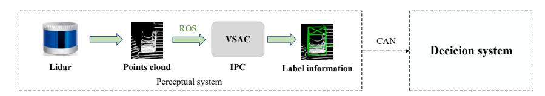

Figure 7. Data transmission process for LiDAR object detection

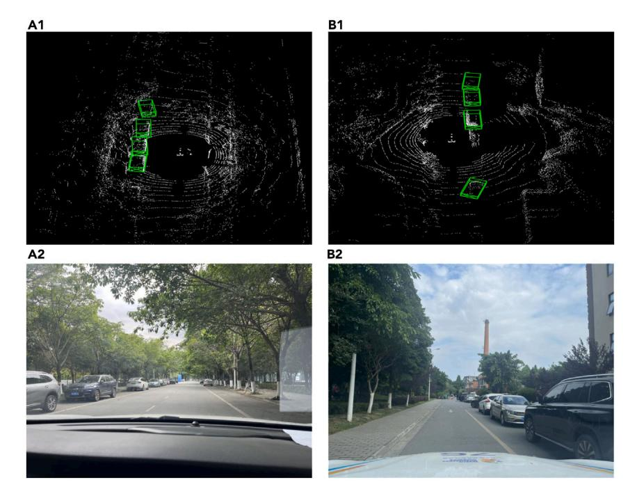

Figure 8. Real vehicle detection visualization

#### **Limitations of the study**

VSAC has been successfully deployed on an autonomous driving real vehicle platform for online detection, demonstrating its industrial value. However, the application of VSAC in autonomous driving still has some limitations. Specifically, when the detected objects are too far away or occluded (resulting in sparse point cloud reflections), VSAC may fail to detect these objects. This could impact the performance of subsequent planning and control systems in autonomous driving. Future work aims to address these issues, ensuring that objects at a distance or under occlusion can still be accurately recognized by the perception system and relayed to the planning and control systems.

#### **RESOURCE AVAILABILITY**

#### **Lead contact**

Further information and requests for resources and reagents should be directed to and will be fulfilled by the Lead Contact, Yiqiang Peng (yqpeng@mail.xhu.edu.cn).

#### Materials availability

This study did not generate new unique reagents.

#### Data and code availability

- The raw sequencing data comes from public datasets, including the KITTI dataset, the Waymo Open Dataset, and the nuScenes dataset. The websites for accessing these public datasets can be found in the key resources table, and other data can be obtained from the lead contact.
- The code used in this paper will be shared upon reasonable request from the lead contact.
- Any additional information required to reanalyze the data reported in this paper is available from the lead contact upon request.

#### **ACKNOWLEDGMENTS**

This work is partly financially supported by the National Natural Science Foundation of China under Grant 52202461.

#### **AUTHOR CONTRIBUTIONS**

L.F. and X.Liu. completed the writing of the manuscript, J.C. supported the method and idea of the paper, X.Li. and H.S. completed the modeling of the paper, Y.P. and L.D. provided technical support in the experimental part of the paper.

#### **DECLARATION OF INTERESTS**

The authors declare no conflict of interest.

### **iScience**

#### Article

#### **STAR**\*METHODS

Detailed methods are provided in the online version of this paper and include the following:

- KEY RESOURCES TABLE
- EXPERIMENTAL MODEL AND STUDY PARTICIPANT DETAILS
- METHOD DETAILS
  - Dataset and data processing
  - Experiments
- QUANTIFICATION AND STATISTICAL ANALYSIS

Received: March 12, 2024 Revised: August 7, 2024 Accepted: August 11, 2024 Published: August 20, 2024

#### **REFERENCES**

- 1. Geiger, A., Lenz, P., and Urtasun, R. (2012). Are we ready for autonomous driving? the kitti vision benchmark suite. In IEEE conference on computer vision and pattern recognition, pp. 3354–3361.
- Sualeh, M., and Kim, G.W. (2020). Visual-LiDAR based 3D object detection and tracking for embedded systems. IEEE Access 8, 156285–156298.
- Lai, K., Bo, L., and Fox, D. (2014). Unsupervised feature learning for 3d scene labeling. In 2014 IEEE International Conference on Robotics and Automation (ICRA), pp. 3050–3057.
- Wu, C.Y., Johnson, J., and Malik, J. (2023). Multiview compressive coding for 3D reconstruction. In Proceedings of the IEEE/ CVF Conference on Computer Vision and Pattern Recognition, pp. 9065–9075.
- Li, W. (2022). Vehicle detection in foggy weather based on an enhanced YOLO method. In J. Phys, Conf. Ser., 2284J. Phys, Conf. Ser. (IOP Publishing), pp. 012015.
- Ren, S., He, K., and Girshick, R. (2016). Faster r-cnn: Towards real-time object detection with region proposal networks. Adv. Neural Inf. Process. Syst. 39, 1137–1149.
- Duan, K., Bai, S., and Xie, L. (2019). Centernet: Keypoint triplets for object detection. In Proceedings of the IEEE/CVF international conference on computer vision, pp. 6569–6578.
- Yang, L., Kang, B., Huang, Z., Xu, X., Feng, J., and Zhao, H. (2024). Depth anything: Unleashing the power of large-scale unlabeled data. Preprint at arXiv. https://doi. org/10.48550/arXiv.2401.10891.
- Zhu, Q., Sun, W., Dai, Y., Li, C., Zhou, S., Feng, R., Sun, Q., Gu, J., Yu, Y., Huang, Y., et al. (2023). MIPI 2023 Challenge on RGB+ ToF Depth Completion: Methods and Results. In Proceedings of the IEEE/CVF Conference on Computer Vision and Pattern Recognition, pp. 2863–2869.
- Yan, Y., Mao, Y., and Li, B. (2018). Second: Sparsely embedded convolutional detection. Sensors 18, 3337.
- Yin, T., Zhou, X., and Krahenbuhl, P. (2021). Center-based 3d object detection and tracking. In Proceedings of the IEEE/CVF conference on computer vision and pattern recognition, pp. 11784–11793.
- Zhou, Y., and Tuzel, O. (2018). Voxelnet: Endto-end learning for point cloud based 3d object detection. In Proceedings of the IEEE conference on computer vision and pattern recognition, pp. 4490–4499.

- Lang, A.H., Vora, S., Caesar, H., Zhou, L., Yang, J., and Beijbom, O. (2019). Pointpillars: Fast encoders for object detection from point clouds. In Proceedings of the IEEE/CVF conference on computer vision and pattern recognition, pp. 12697–12705.
- 14. Zheng, W., Tang, W., Chen, S., Jiang, L., and Fu, C.W. (2021). Cia-ssd: Confident iou-aware single-stage object detector from point cloud. In Proceedings of the AAAI Conference on Artificial Intelligence, 35Proceedings of the AAAI Conference on Artificial Intelligence, pp. 3555–3362.
- Neil, H., and Dirk, W. (2020). Transformers for Image Recognition at Scale[J]. https://ai. googleblog.com/2020/12/transformers-forimage-recognitionat.html.
- Carion, N., Massa, F., Synnaeve, G., Usunier, N., Kirillov, A., and Zagoruyko, S. (2020). Endto-end object detection with transformers. In European conference on computer vision (Springer International Publishing), pp. 213–229.
- Zheng, S., Lu, J., Zhao, H., Zhu, H., Luo, Z., Wang, Y., Fu, Y., Feng, J., Xiang, T., Torr, P., and Zhang, L. (2021). Rethinking semantic segmentation from a sequence-to-sequence perspective with transformers. In Proceedings of the IEEE/CVF conference on computer vision and pattern recognition, pp. 6881–6890.
- 18. Guo, M.H., Cai, J.X., Liu, Z.N., Mu, T.J., Martin, R.R., and Hu, S.M. (2021). Pct: Point cloud transformer. Comput. Vis. Media (Beijing). 7, 187–199.
- Misra, I., Girdhar, R., and Joulin, A. (2021). An end-to-end transformer model for 3d object detection. In Proceedings of the IEEE/CVF International Conference on Computer Vision, pp. 2906–2917.
- Pan, X., Xia, Z., Song, S., Li, L., and Huang, G. (2021). 3d object detection with pointformer. In Proceedings of the IEEE/CVF Conference on Computer Vision and Pattern Recognition, pp. 7463–7472.
- Park, C., Jeong, Y., Cho, M., and Park, J. (2022). Fast point transformer. In Proceedings of the IEEE/CVF Conference on Computer Vision and Pattern Recognition, pp. 16949– 16958
- Sheng, H., Cai, S., Liu, Y., Deng, B., Huang, J., Hua, X., and Zhao, M. (2021). Improving 3d object detection with channel-wise transformer. In Proceedings of the IEEE/CVF International Conference on Computer Vision, pp. 2743–2752.
   Mao, J., Xue, Y., Niu, M., Bai, H., and Feng, J.
- Mao, J., Xue, Y., Niu, M., Bai, H., and Feng, J (2021). Voxel transformer for 3d object

- detection. In Proceedings of the IEEE/CVF International Conference on Computer Vision, pp. 3164–3173.
- 24. Girshick, R. (2015). Fast r-cnn. In Proceedings of the IEEE international conference on computer vision, pp. 1440–1448.
- Sun, P., Kretzschmar, H., Dotiwalla, X., Chouard, A., Patnaik, V., Tsui, P., Guo, J., Zhou, Y., Chai, Y., Caine, B., et al. (2020). Scalability in perception for autonomous driving: Waymo open dataset. In Proceedings of the IEEE/CVF conference on computer vision and pattern recognition, pp. 2446–2454.
- Lin, T.Y., Dollár, P., Girshick, R., He, K., Hariharan, B., and Belongie, S. (2017). Feature pyramid networks for object detection. In Proceedings of the IEEE conference on computer vision and pattern recognition, pp. 2117–2125.
- Qi, C.R., Su, H., Mo, K., and Guibas, L. (2017). Pointnet: Deep learning on point sets for 3d classification and segmentation. In Proceedings of the IEEE conference on computer vision and pattern recognition, pp. 652–660.
- Qi, C.R., Yi, L., Su, H., and Guibas, L. (2017). Pointnet++: Deep hierarchical feature learning on point sets in a metric space. Adv. Neural Inf. Process. Syst. 30, 5105–5114.
   Qi, C.R., Liu, W., Wu, C., Su, H., and Guibas, L.
- Qi, C.R., Liu, W., Wu, C., Su, H., and Guibas, L. (2018). Frustum pointnets for 3d object detection from rgb-d data. In Proceedings of the IEEE conference on computer vision and pattern recognition, pp. 918–927.
- Shi, S., Wang, X., and Li, H. (2019). Pointronn: 3d object proposal generation and detection from point cloud. In Proceedings of the IEEE/ CVF conference on computer vision and pattern recognition, pp. 770–779.
- Yang, Z., Sun, Y., Liu, S., and Jia, J. (2020).
   3dssd: Point-based 3d single stage object detector. In Proceedings of the IEEE/CVF conference on computer vision and pattern recognition, pp. 11040–11048.
- 32. Qi, C.R., Litany, O., He, K., and Guibas, L. (2019). Deep hough voting for 3d object detection in point clouds. In proceedings of the IEEE/CVF International Conference on Computer Vision, pp. 9277–9286.
- Shi, W., and Rajkumar, R. (2020). Point-gnn: Graph neural network for 3d object detection in a point cloud. In Proceedings of the IEEE/ CVF conference on computer vision and pattern recognition, pp. 1711–1719.
- 34. Hu, P., Ziglar, J., Held, D., and Ramanan, D. (2020). What you see is what you get: Exploiting visibility for 3d object detection. In

- Proceedings of the IEEE/CVF Conference on Computer Vision and Pattern Recognition, pp. 11001–11009.
- 35. Deng, J., Shi, S., Li, P., Zhou, W., Zhang, Y., and Li, H. (2021). Voxel r-cnn: Towards high performance voxel-based 3d object detection. In Proceedings of the AAAI Conference on Artificial Intelligence, 35Proceedings of the AAAI Conference on Artificial Intelligence, pp. 1201–1209
- Artificial Intelligence, pp. 1201–1209.

  36. Zheng, W., Tang, W., Jiang, L., and Fu, L. (2021). SE-SSD: Self-ensembling single-stage object detector from point cloud. In Proceedings of the IEEE/CVF Conference on Computer Vision and Pattern Recognition, pp. 14494–14503.
- Chen, Y., Liu, S., Shen, X., and Jia, J. (2019).
   Fast point r-cnn. In Proceedings of the IEEE/
   CVF international conference on computer vision, pp. 9775–9784.
- Yang, Z., Sun, Y., Liu, S., Shen, X., and Jia, J. (2019). Std: Sparse-to-dense 3d object detector for point cloud. In Proceedings of the IEEE/CVF international conference on computer vision, pp. 1951–1960.
- Shi, S., Guo, C., Jiang, L., Wamg, Z., Shi, J., Wang, X., and Li, H. (2020). Pv-rcnn: Point-voxel feature set abstraction for 3d object detection. In Proceedings of the IEEE/CVF conference on computer vision and pattern recognition, pp. 10529–10538.
- recognition, pp. 10529–10538.

  40. He, C., Zeng, H., Huang, J., Hua, X., and Zhang, L. (2020). Structure aware single-stage 3d object detection from point cloud. In Proceedings of the IEEE/CVF conference on computer vision and pattern recognition, pp. 11873–11882.
- Qian, R., Lai, X., and Li, X. (2022). BADet: Boundary-aware 3D object detection from point clouds. Pattern Recogn. 125, 108524.
- Yi, H., Shi, S., Ding, M., Sun, J., Xu, K., Zhou, H., Wang, Z., Li, S., and Wang, G. (2020). Segvoxelnet: Exploring semantic context and depth-aware features for 3d vehicle detection from point cloud. In IEEE International Conference on Robotics and Automation (ICRA), pp. 2274–2280.
- Zaheer, M., Guruganesh, G., Dubey, K., Ainslie, J., Alberti, C., Ontanon, S., Pham, P., Ravula, A., Wang, Q., Yang, L., and Ahmed, A. (2020). Big bird: Transformers for longer sequences. Adv. Neural Inf. Process. Syst. 33, 17283–17297.
- Law, H., and Deng, J. (2018). Cornernet: Detecting objects as paired keypoints[C]. In Proceedings of the European conference on computer vision (ECCV), pp. 734–750.
- Hess, G., Jaxing, J., Svensson, E., and Hageman, D. (2022). Masked autoencoders for self-supervised learning on automotive point clouds. Preprint at arXiv. https://doi. org/10.1109/WACWV58289.2023.00039.
- OpenPCDet Development Team (2020).
   Openpcdet: An opensource toolbox for 3d object detection from point clouds. https://github.com/open-mmlab/OpenPCDet.
- Min, C., Zhao, D., Xiao, L., Nie, Y., and Dai, B. (2022). Voxel-mae: Masked autoencoders for pre-training large-scale point clouds. Preprint

- at arXiv. https://doi.org/10.48550/arXiv.2206.
- 48. Liu, Z., Zhao, X., Huang, T., Hu, R., Zhou, Y., and Bai, X. (2020). Tanet: Robust 3d object detection from point clouds with triple attention. In Proceedings of the AAAI Conference on Artificial Intelligence, 34Proceedings of the AAAI Conference on Artificial Intelligence, pp. 11677–11684.
- Wang, Z., and Jia, K. (2019). Frustum convnet: Sliding frustums to aggregate local pointwise features for amodal 3d object detection. In 2019 IEEE/RSJ International Conference on Intelligent Robots and Systems (IROS), pp. 1742–1749.
- Shi, S., Wang, Z., Shi, J., Wang, X., and Li, H. (2021). From points to parts: 3d object detection from point cloud with part-aware and part-aggregation network. IEEE Trans. Pattern Anal. Mach. Intell. 43, 2647–2664.
- Desheng, X., Youchun, X., Feng, L., and Shi, P. (2022). Real-time detection of 3d objects based on multi-sensor information fusion. Automot. Eng. 44, 340.
- 52. Xu, Q., Zhong, Y., and Neumann, U. (2022). Behind the curtain: Learning occluded shapes for 3d object detection. In Proceedings of the AAAI Conference on Artificial Intelligence, 36Proceedings of the AAAI Conference on Artificial Intelligence, pp. 2893–2901.
- Hoang, H.A., and Yoo, M. (2023). 3ONet: 3D Detector for Occluded Object under Obstructed Conditions. IEEE Sensor. J. 23, 18879–18892.
- Chen, X., Ma, H., Wan, J., Li, B., and Xia, T. (2017). Multi-view 3d object detection network for autonomous driving. In Proceedings of the IEEE conference on Computer Vision and Pattern Recognition, pp. 1907–1915.
- Ku, J., Mozifian, M., Lee, J., Harakeh, A., and Waslander, S. (2018). Joint 3d proposal generation and object detection from view aggregation. In IEEE/RSJ International Conference on Intelligent Robots and Systems (IROS), pp. 1–8.
- Liang, M., Yang, B., Wang, S., and Urtasun, R. (2018). Deep continuous fusion for multisensor 3d object detection. In Proceedings of the European conference on computer vision (ECCV), pp. 641–656.
- 57. Xie, L., Xiang, C., Yu, Z., Xu, G., Yang, Z., Cai, D., and He, X. (2020). PI-RCNN: An efficient multi-sensor 3D object detector with point-based attentive cont-conv fusion module. In Proceedings of the AAAI Conference on Artificial Intelligence, 34Proceedings of the AAAI Conference on Artificial Intelligence, pp. 12460–12467.
- 58. Vora, S., Lang, A.H., Helou, B., and Beijbom, O. (2020). Pointpainting: Sequential fusion for 3d object detection. In Proceedings of the IEEE/CVF conference on computer vision and pattern recognition, pp. 4604–4612.
- Zhou, D., Fang, J., Song, X., Guan, C., Yin, J., Dai, Y., and Yang, R. (2019). Iou loss for 2d/3d object detection. In 2019 international conference on 3D vision (3DV), pp. 85–94.

- Du, L., Ye, X., Tan, X., Feng, J., Xu, Z., Ding, E., and Wen, S. (2020). Associate-3Ddet: Perceptual-to-conceptual association for 3D point cloud object detection. In Proceedings of the IEEE/CVF conference on computer vision and pattern recognition, pp. 13329– 13338.
- Kuang, H., Wang, B., An, J., Zhang, M., and Zhang, Z. (2020). Voxel-FPN: Multi-scale voxel feature aggregation for 3D object detection from LIDAR point clouds. Sensors 20, 704.
- 62. Liu, H., Du, J., Zhang, Y., and Zhang, H. (2023). Extracting geometric and semantic point cloud features with gateway attention for accurate 3D object detection. Eng. Appl. Artif. Intell. 123, 106227.
- Liu, S., Huang, W., Cao, Y., Li, D., and Chen, S. (2022). SMS-Net: Sparse multi-scale voxel feature aggregation network for LiDARbased 3D object detection. Neurocomputing 501, 555–565.
- 64. Zhou, Y., Sun, P., Zhang, Y., Anguelov, D., Gao, J., Ouyang, T., Guo, J., Ngiam, J., and Vasudevan, V. (2020). End-to-end multi-view fusion for 3d object detection in lidar point clouds. In Conference on Robot Learning (PMLR), pp. 923–932.
- 65. Wang, Y., Fathi, A., Kundu, A., Ross, D., Pantofaru, C., Funkhouser, T., and Solomon, J. (2020). Pillar-based object detection for autonomous driving. In Computer Vision– ECCV 16th European Conference, pp. 18–34.
- 66. Meyer, G.P., Laddha, A., Kee, E., Vallespi, C., and Wellington, C. (2019). Lasernet: An efficient probabilistic 3d object detector for autonomous driving. In Proceedings of the IEEE/CVF conference on computer vision and pattern recognition, pp. 12677–12686.
- Chen, Q., Sun, L., Cheung, E., and Yuille, A. (2020). Every view counts: Cross-view consistency in 3d object detection with hybrid-cylindrical-spherical voxelization. Adv. Neural Inf. Process. Syst. 33, 21224–21235.
- Ngiam, J., Caine, B., Han, W., Yang, B., Chai, Y., Sun, P., Zhou, Y., Yi, X., Alsharif, O., Patrick, N., and Chen, Z. (2019). Starnet: Targeted computation for object detection in point clouds. Preprint at arXiv. https://doi.org/10. 48550/arXiv.1908.11069.
- Bewley, A., Sun, P., Mensink, T., Anguelov, D., and Sminchisescu, C. (2005). Range conditioned dilated convolutions for scale invariant 3d object detection. Preprint at arXiv. https://doi.org/10.48550/arXiv.2005. 09927
- Ye, Y., Chen, H., Zhang, C., Hao, X., and Zhang, Z. (2020). Sarpnet: Shape attention regional proposal network for lidar-based 3d object detection. Neurocomputing 379, 53–63.
- Caesar, H., Bankiti, V., Lang, A.H., Vora, S., Liong, V., Xu, Q., Krishnan, A., Pan, Y., Baldan, G., and Beijbom, O. (2020). nuscenes: A multimodal dataset for autonomous driving. In Proceedings of the IEEE/CVF conference on computer vision and pattern recognition, pp. 11621–11631.

#### **STAR**\*METHODS

#### **KEY RESOURCES TABLE**

| Deposited data  KITTI Geiger et al. 1 https:  Waymo Open Dataset Sun et al. 25 https:                                                                                                                                                                                                                                                                                                                                                                                                                                                                                                                                                                                                                                                                                                                                                                                                                                                                                                                                                                                                                                                                                                                                                                                                                                                                                                                                                                                                                                                                                                                                                                                                                                                                                                                                                                                                                                                                                                                                                                                                                                          | NTIFIER                             |
|--------------------------------------------------------------------------------------------------------------------------------------------------------------------------------------------------------------------------------------------------------------------------------------------------------------------------------------------------------------------------------------------------------------------------------------------------------------------------------------------------------------------------------------------------------------------------------------------------------------------------------------------------------------------------------------------------------------------------------------------------------------------------------------------------------------------------------------------------------------------------------------------------------------------------------------------------------------------------------------------------------------------------------------------------------------------------------------------------------------------------------------------------------------------------------------------------------------------------------------------------------------------------------------------------------------------------------------------------------------------------------------------------------------------------------------------------------------------------------------------------------------------------------------------------------------------------------------------------------------------------------------------------------------------------------------------------------------------------------------------------------------------------------------------------------------------------------------------------------------------------------------------------------------------------------------------------------------------------------------------------------------------------------------------------------------------------------------------------------------------------------|-------------------------------------|
| KITTI Geiger et al. 1 https://www.decomposition.com/decomposition/decomposition/decomposition/decomposition/decomposition/decomposition/decomposition/decomposition/decomposition/decomposition/decomposition/decomposition/decomposition/decomposition/decomposition/decomposition/decomposition/decomposition/decomposition/decomposition/decomposition/decomposition/decomposition/decomposition/decomposition/decomposition/decomposition/decomposition/decomposition/decomposition/decomposition/decomposition/decomposition/decomposition/decomposition/decomposition/decomposition/decomposition/decomposition/decomposition/decomposition/decomposition/decomposition/decomposition/decomposition/decomposition/decomposition/decomposition/decomposition/decomposition/decomposition/decomposition/decomposition/decomposition/decomposition/decomposition/decomposition/decomposition/decomposition/decomposition/decomposition/decomposition/decomposition/decomposition/decomposition/decomposition/decomposition/decomposition/decomposition/decomposition/decomposition/decomposition/decomposition/decomposition/decomposition/decomposition/decomposition/decomposition/decomposition/decomposition/decomposition/decomposition/decomposition/decomposition/decomposition/decomposition/decomposition/decomposition/decomposition/decomposition/decomposition/decomposition/decomposition/decomposition/decomposition/decomposition/decomposition/decomposition/decomposition/decomposition/decomposition/decomposition/decomposition/decomposition/decomposition/decomposition/decomposition/decomposition/decomposition/decomposition/decomposition/decomposition/decomposition/decomposition/decomposition/decomposition/decomposition/decomposition/decomposition/decomposition/decomposition/decomposition/decomposition/decomposition/decomposition/decomposition/decomposition/decomposition/decomposition/decomposition/decomposition/decomposition/decomposition/decomposition/decomposition/decomposition/decomposition/decomposition/decomposition/decomposition/decomposition/decomposition/decomp | VIII ILIX                           |
| Waymo Open Dataset Sun et al. 25 https                                                                                                                                                                                                                                                                                                                                                                                                                                                                                                                                                                                                                                                                                                                                                                                                                                                                                                                                                                                                                                                                                                                                                                                                                                                                                                                                                                                                                                                                                                                                                                                                                                                                                                                                                                                                                                                                                                                                                                                                                                                                              |                                     |
| 2                                                                                                                                                                                                                                                                                                                                                                                                                                                                                                                                                                                                                                                                                                                                                                                                                                                                                                                                                                                                                                                                                                                                                                                                                                                                                                                                                                                                                                                                                                                                                                                                                                                                                                                                                                                                                                                                                                                                                                                                                                                                                                                              | :://www.cvlibs.net/datasets/kitti/  |
| nuScenes Caesar et al. 71 https                                                                                                                                                                                                                                                                                                                                                                                                                                                                                                                                                                                                                                                                                                                                                                                                                                                                                                                                                                                                                                                                                                                                                                                                                                                                                                                                                                                                                                                                                                                                                                                                                                                                                                                                                                                                                                                                                                                                                                                                                                                                                     | :://waymo.com/open                  |
|                                                                                                                                                                                                                                                                                                                                                                                                                                                                                                                                                                                                                                                                                                                                                                                                                                                                                                                                                                                                                                                                                                                                                                                                                                                                                                                                                                                                                                                                                                                                                                                                                                                                                                                                                                                                                                                                                                                                                                                                                                                                                                                                | :://www.nuscenes.org/nuscenes       |
| Software and algorithms                                                                                                                                                                                                                                                                                                                                                                                                                                                                                                                                                                                                                                                                                                                                                                                                                                                                                                                                                                                                                                                                                                                                                                                                                                                                                                                                                                                                                                                                                                                                                                                                                                                                                                                                                                                                                                                                                                                                                                                                                                                                                                        |                                     |
| Python 3.8 Python Software Foundation https                                                                                                                                                                                                                                                                                                                                                                                                                                                                                                                                                                                                                                                                                                                                                                                                                                                                                                                                                                                                                                                                                                                                                                                                                                                                                                                                                                                                                                                                                                                                                                                                                                                                                                                                                                                                                                                                                                                                                                                                                                                                                    | :://www.python.org/                 |
| OpenPCDet OpenMMLab https                                                                                                                                                                                                                                                                                                                                                                                                                                                                                                                                                                                                                                                                                                                                                                                                                                                                                                                                                                                                                                                                                                                                                                                                                                                                                                                                                                                                                                                                                                                                                                                                                                                                                                                                                                                                                                                                                                                                                                                                                                                                                                      | :://github.com/open-mmlab/OpenPCDet |
| A30 Tensor Core GPU Nvidia 24G                                                                                                                                                                                                                                                                                                                                                                                                                                                                                                                                                                                                                                                                                                                                                                                                                                                                                                                                                                                                                                                                                                                                                                                                                                                                                                                                                                                                                                                                                                                                                                                                                                                                                                                                                                                                                                                                                                                                                                                                                                                                                                 |                                     |

#### **EXPERIMENTAL MODEL AND STUDY PARTICIPANT DETAILS**

The study does not use experimental models.

#### **METHOD DETAILS**

#### **Dataset and data processing**

For the KITTI dataset, the x, y, z coordinate range of the point cloud is [0, +70.4], [-40, +40], [-3.0, +1.0] and the voxel size is set to [0.05, 0.05, 0.1]. For the Waymo Open Dataset, the x, y, z coordinate range of the point cloud is set to [-75.2, +75.2], [-75.2, +75.2], [-2.0, +4.0] and the voxel size is set to [0.1, 0.1, 0.15]. For nuScenes dataset, the x, y, z coordinate range of the point cloud is set to [-54.0, +54.0], [-54.0, +54.0], [-50, +3.0] and the voxel size is set to [0.075, 0.075, 0.2].

Additionally, we employed a data augmentation strategy for the 3D point cloud data, which included random flipping, scaling within a range of 0.95-1.05, and rotation around the X axis between -5 and  $5^{\circ}$ .

#### **Experiments**

VSAC was trained end-to-end on 2 NVIDIA-A30 GPUs using the ADAM optimizer. For the KITTI dataset, the batch size was set to 4, the number of epochs was set to 90, the maximum learning rate was set to 0.01, and the learning rate for all models was 0.003, with decay performed by cosine annealing. For the Waymo Open Dataset, the batch size was set to 2, the number of epochs was set to 30, and the maximum learning rate was set to 0.01. For the nuScenes dataset, the batch size was set to 2, the number of epochs was set to 20, and the maximum learning rate was set to 0.01. Post-transformation of the point cloud into regularized voxels, non-empty voxels are linearly projected to yield 16-channel initial features, subsequently inputted into Voxel Self-attention for feature learning. The channel count of voxel features increases to 32 after the first and to 64 after the second attention-2, while other modules maintain the voxel feature channel. Then PST-FPN processes feature learning and outputs a feature map with 256 channels. In the center-point detection head, the feature map scale factor is set at 1/4, with a maximum detection capacity of 100 objects, and the permissible error distance for detected center points is 2cm. During the training phase, for target assignment, we set an IoU(Intersection over Union) threshold of 0.55. If the IoU between a proposal and the ground-truth boxes is greater than the IoU threshold, then the proposal is considered a positive sample. Otherwise, it is considered a negative sample. In the inference stage, we selected the top 128 candidates based on confidence for non-maximum suppression (NMS) with a threshold of 0.7.

#### **QUANTIFICATION AND STATISTICAL ANALYSIS**

The study does not include statistical analysis or quantification.