Artificial Intelligence 112 (1999) 181-211

# Artificial Intelligence

www.elsevier.com/locate/artint

# Between MDPs and semi-MDPs: A framework for temporal abstraction in reinforcement learning

Richard S. Sutton a,\*, Doina Precup b, Satinder Singh a

a AT&T Labs.-Research, 180 Park Avenue, Florham Park, NJ 07932, USA b Computer Science Department, University of Massachusetts, Amherst, MA 01003, USA

Received 1 December 1998

#### Abstract

Learning, planning, and representing knowledge at multiple levels of temporal abstraction are key, longstanding challenges for AI. In this paper we consider how these challenges can be addressed within the mathematical framework of reinforcement learning and Markov decision processes (MDPs). We extend the usual notion of action in this framework to include options—closed-loop policies for taking action over a period of time. Examples of options include picking up an object, going to lunch, and traveling to a distant city, as well as primitive actions such as muscle twitches and joint torques. Overall, we show that options enable temporally abstract knowledge and action to be included in the reinforcement learning framework in a natural and general way. In particular, we show that options may be used interchangeably with primitive actions in planning methods such as dynamic programming and in learning methods such as O-learning, Formally, a set of options defined over an MDP constitutes a semi-Markov decision process (SMDP), and the theory of SMDPs provides the foundation for the theory of options. However, the most interesting issues concern the interplay between the underlying MDP and the SMDP and are thus beyond SMDP theory. We present results for three such cases: (1) we show that the results of planning with options can be used during execution to interrupt options and thereby perform even better than planned, (2) we introduce new intra-option methods that are able to learn about an option from fragments of its execution, and (3) we propose a notion of subgoal that can be used to improve the options themselves. All of these results have precursors in the existing literature; the contribution of this paper is to establish them in a simpler and more general setting with fewer changes to the existing reinforcement learning framework. In particular, we show that these results can be obtained without committing to (or ruling out) any particular approach to state abstraction, hierarchy, function approximation, or the macroutility problem. © 1999 Published by Elsevier Science B.V. All rights reserved.

\* Corresponding author.

Keywords: Temporal abstraction; Reinforcement learning; Markov decision processes; Options; Macros; Macroactions; Subgoals; Intra-option learning; Hierarchical planning; Semi-Markov decision processes

#### 0. Introduction

Human decision making routinely involves choice among temporally extended courses of action over a broad range of time scales. Consider a traveler deciding to undertake a journey to a distant city. To decide whether or not to go, the benefits of the trip must be weighed against the expense. Having decided to go, choices must be made at each leg, e.g., whether to fly or to drive, whether to take a taxi or to arrange a ride. Each of these steps involves foresight and decision, all the way down to the smallest of actions. For example, just to call a taxi may involve finding a telephone, dialing each digit, and the individual muscle contractions to lift the receiver to the ear. How can we understand and automate this ability to work flexibly with multiple overlapping time scales?

Temporal abstraction has been explored in AI at least since the early 1970's, primarily within the context of STRIPS-style planning [18,20,21,29,34,37,46,49,51,60,76]. Temporal abstraction has also been a focus and an appealing aspect of qualitative modeling approaches to AI [6,15,33,36,62] and has been explored in robotics and control engineering [1,7,9,25,39,61]. In this paper we consider temporal abstraction within the framework of reinforcement learning and Markov decision processes (MDPs). This framework has become popular in AI because of its ability to deal naturally with stochastic environments and with the integration of learning and planning [3,4,13,22,64]. Reinforcement learning methods have also proven effective in a number of significant applications [10,42,50,70,77].

MDPs as they are conventionally conceived do not involve temporal abstraction or temporally extended action. They are based on a discrete time step: the unitary action taken at time t affects the state and reward at time t+1. There is no notion of a course of action persisting over a variable period of time. As a consequence, conventional MDP methods are unable to take advantage of the simplicities and efficiencies sometimes available at higher levels of temporal abstraction. On the other hand, temporal abstraction can be introduced into reinforcement learning in a variety of ways [2,8,11,12,14,16,19,26,28,31,32,38,40,44,45,53,56,57,59,63,68,69,71,73,78-82]. In the present paper we generalize and simplify many of these previous and co-temporaneous works to form a compact, unified framework for temporal abstraction in reinforcement learning and MDPs. We answer the question "What is the minimal extension of the reinforcement learning framework that allows a general treatment of temporally abstract knowledge and action?" In the second part of the paper we use the new framework to develop new results and generalizations of previous results.

One of the keys to treating temporal abstraction as a minimal extension of the reinforcement learning framework is to build on the theory of *semi-Markov decision processes* (SMDPs), as pioneered by Bradtke and Duff [5], Mahadevan et al. [41], and Parr [52]. SMDPs are a special kind of MDP appropriate for modeling continuous-time discrete-event systems. The actions in SMDPs take variable amounts of time and are intended to model temporally-extended courses of action. The existing theory of SMDPs

specifies how to model the results of these actions and how to plan with them. However, existing SMDP work is limited because the temporally extended actions are treated as indivisible and unknown units. There is no attempt in SMDP theory to look *inside* the temporally extended actions, to examine or modify their structure in terms of lower-level actions. As we have tried to suggest above, this is the essence of analyzing temporally abstract actions in AI applications: goal directed behavior involves multiple overlapping scales at which decisions are made and modified.

In this paper we explore the interplay between MDPs and SMDPs. The base problem we consider is that of a conventional discrete-time MDP, 1 but we also consider courses of action within the MDP whose results are state transitions of extended and variable duration. We use the term *options* 2 for these courses of action, which include primitive actions as a special case. Any fixed set of options defines a discrete-time SMDP embedded within the original MDP, as suggested by Fig. 1. The top panel shows the state trajectory over discrete time of an MDP, the middle panel shows the larger state changes over continuous time of an SMDP, and the last panel shows how these two levels of analysis can be superimposed through the use of options. In this case the underlying base system is an MDP, with regular, single-step transitions, while the options define potentially larger transitions, like those of an SMDP, that may last for a number of discrete steps. All the usual SMDP theory applies to the superimposed SMDP defined by the options but, in addition, we have an explicit interpretation of them in terms of the underlying MDP. The SMDP actions (the options) are no longer black boxes, but policies in the base MDP which can be examined, changed, learned, and planned in their own right.

The first part of this paper (Sections 1–3) develops these ideas formally and more fully. The first two sections review the reinforcement learning framework and present its generalization to temporally extended action. Section 3 focuses on the link to SMDP theory and illustrates the speedups in planning and learning that are possible through the use of temporal abstraction. The rest of the paper concerns ways of going beyond an SMDP analysis of options to change or learn their internal structure in terms of the MDP. Section 4 considers the problem of effectively combining a given set of options into a single overall policy. For example, a robot may have pre-designed controllers for servoing joints to positions, picking up objects, and visual search, but still face a difficult problem of how to coordinate and switch between these behaviors [17,32,35,39,40,43,61,79]. Sections 5 and 6 concern *intra-option learning*—looking inside options to learn simultaneously about all options consistent with each fragment of experience. Finally, in Section 7 we illustrate a notion of subgoal that can be used to improve existing options and learn new ones.

&lt;sup>1 In fact, the base system could itself be an SMDP with only technical changes in our framework, but this would be a larger step away from the standard framework.

&lt;sup>2 This term may deserve some explanation. In previous work we have used other terms including "macroactions", "behaviors", "abstract actions", and "subcontrollers" for structures closely related to options. We introduce a new term to avoid confusion with previous formulations and with informal terms. The term "options" is meant as a generalization of "actions", which we use formally only for primitive choices. It might at first seem inappropriate that "option" does not connote a course of action that is non-primitive, but this is exactly our intention. We wish to treat primitive and temporally extended actions similarly, and thus we prefer one name for both.

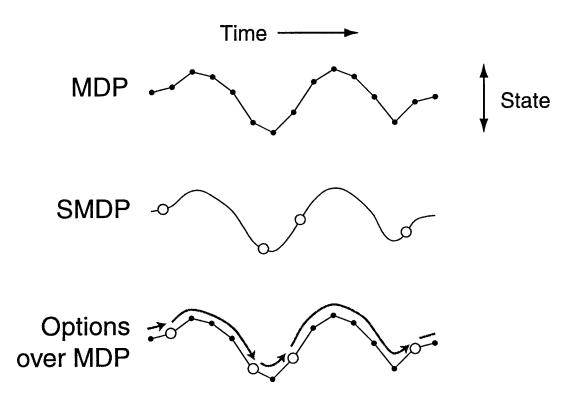

Fig. 1. The state trajectory of an MDP is made up of small, discrete-time transitions, whereas that of an SMDP comprises larger, continuous-time transitions. Options enable an MDP trajectory to be analyzed in either way.

#### 1. The reinforcement learning (MDP) framework

In this section we briefly review the standard reinforcement learning framework of discrete-time, finite *Markov decision processes*, or *MDPs*, which forms the basis for our extension to temporally extended courses of action. In this framework, a learning *agent* interacts with an *environment* at some discrete, lowest-level time scale, t = 0, 1, 2, ... On each time step, t, the agent perceives the state of the environment,  $s_t \in \mathcal{S}$ , and on that basis chooses a primitive action,  $a_t \in \mathcal{A}_{s_t}$ . In response to each action,  $a_t$ , the environment produces one step later a numerical reward,  $r_{t+1}$ , and a next state,  $s_{t+1}$ . It is convenient to suppress the differences in available actions across states whenever possible; we let  $\mathcal{A} = \bigcup_{s \in \mathcal{S}} \mathcal{A}_s$  denote the union of the action sets. If  $\mathcal{S}$  and  $\mathcal{A}$ , are finite, then the environment's transition dynamics can be modeled by one-step state-transition probabilities,

$$p_{ss'}^a = \Pr\{s_{t+1} = s' \mid s_t = s, \ a_t = a\},\$$

and one-step expected rewards.

$$r_s^a = E\{r_{t+1} \mid s_t = s, \ a_t = a\},\$$

for all  $s, s' \in S$  and  $a \in A_s$ . These two sets of quantities together constitute the *one-step model* of the environment.

The agent's objective is to learn a *Markov policy*, a mapping from states to probabilities of taking each available primitive action,  $\pi: \mathcal{S} \times \mathcal{A} \to [0, 1]$ , that maximizes the expected discounted future reward from each state s:

$$V^{\pi}(s) = E\{r_{t+1} + \gamma r_{t+2} + \gamma^{2} r_{t+3} + \dots \mid s_{t} = s, \pi\}$$

$$= E\{r_{t+1} + \gamma V^{\pi}(s_{t+1}) \mid s_{t} = s, \pi\}$$

$$= \sum_{a \in A} \pi(s, a) \left[ r_{s}^{a} + \gamma \sum_{s'} p_{ss'}^{a} V^{\pi}(s') \right],$$
(2)

where  $\pi(s, a)$  is the probability with which the policy  $\pi$  chooses action  $a \in A_s$  in state s, and  $\gamma \in [0, 1]$  is a *discount-rate* parameter. This quantity,  $V^{\pi}(s)$ , is called the *value* of state

s under policy  $\pi$ , and  $V^{\pi}$  is called the state-value function for  $\pi$ . The optimal state-value function gives the value of each state under an optimal policy:

$$V^{*}(s) = \max_{\pi} V^{\pi}(s)$$

$$= \max_{a \in \mathcal{A}_{s}} E\{r_{t+1} + \gamma V^{*}(s_{t+1}) \mid s_{t} = s, \ a_{t} = a\}$$

$$= \max_{a \in \mathcal{A}_{s}} \left[ r_{s}^{a} + \gamma \sum_{t} p_{ss'}^{a} V^{*}(s') \right].$$
(4)

Any policy that achieves the maximum in (3) is by definition an optimal policy. Thus, given  $V^*$ , an optimal policy is easily formed by choosing in each state s any action that achieves the maximum in (4). Planning in reinforcement learning refers to the use of models of the environment to compute value functions and thereby to optimize or improve policies. Particularly useful in this regard are *Bellman equations*, such as (2) and (4), which recursively relate value functions to themselves. If we treat the values,  $V^{\pi}(s)$  or  $V^*(s)$ , as unknowns, then a set of Bellman equations, for all  $s \in \mathcal{S}$ , forms a system of equations whose unique solution is in fact  $V^{\pi}$  or  $V^*$  as given by (1) or (3). This fact is key to the way in which all temporal-difference and dynamic programming methods estimate value functions.

There are similar value functions and Bellman equations for state-action pairs, rather than for states, which are particularly important for learning methods. The value of taking action a in state s under policy  $\pi$ , denoted  $Q^{\pi}(s, a)$ , is the expected discounted future reward starting in s, taking a, and henceforth following  $\pi$ :

$$Q^{\pi}(s,a) = E\{r_{t+1} + \gamma r_{t+2} + \gamma^2 r_{t+3} + \dots \mid s_t = s, a_t = a, \pi\}$$

$$= r_s^a + \gamma \sum_{s'} p_{ss'}^a V^{\pi}(s')$$

$$= r_s^a + \gamma \sum_{s'} p_{ss'}^a \sum_{a'} \pi(s',a') Q^{\pi}(s',a').$$

This is known as the *action-value function* for policy  $\pi$ . The *optimal* action-value function is

$$Q^*(s, a) = \max_{\pi} Q^{\pi}(s, a)$$
  
=  $r_s^a + \gamma \sum_{s'} p_{ss'}^a \max_{a'} Q^*(s', a').$ 

Finally, many tasks are episodic in nature, involving repeated trials, or *episodes*, each ending with a reset to a standard state or state distribution. Episodic tasks include a special *terminal state*; arriving in this state terminates the current episode. The set of regular states plus the terminal state (if there is one) is denoted  $S^+$ . Thus, the s' in  $p^a_{ss'}$  in general ranges over the set  $S^+$  rather than just S as stated earlier. In an episodic task, values are defined by the expected cumulative reward up until termination rather than over the infinite future (or, equivalently, we can consider the terminal state to transition to itself forever with a reward of zero). There are also undiscounted average-reward formulations, but for simplicity we do not consider them here. For more details and background on reinforcement learning see [72].

#### 2. Options

As mentioned earlier, we use the term *options* for our generalization of primitive actions to include temporally extended courses of action. Options consist of three components: a policy  $\pi: \mathcal{S} \times \mathcal{A} \to [0, 1]$ , a termination condition  $\beta: \mathcal{S}^+ \to [0, 1]$ , and an initiation set  $\mathcal{I} \subseteq \mathcal{S}$ . An option  $\langle \mathcal{I}, \pi, \beta \rangle$  is available in state  $s_t$  if and only if  $s_t \in \mathcal{I}$ . If the option is taken, then actions are selected according to  $\pi$  until the option terminates stochastically according to  $\beta$ . In particular, a *Markov option* executes as follows. First, the next action  $a_t$  is selected according to probability distribution  $\pi(s_t, \cdot)$ . The environment then makes a transition to state  $s_{t+1}$ , where the option either terminates, with probability  $\beta(s_{t+1})$ , or else continues, determining  $a_{t+1}$  according to  $\pi(s_{t+1}, \cdot)$ , possibly terminating in  $s_{t+2}$  according to  $\beta(s_{t+2})$ , and so on. When the option terminates, the agent has the opportunity to select another option. For example, an option named open—the—door might consist of a policy for reaching, grasping and turning the door knob, a termination condition for recognizing that the door has been opened, and an initiation set restricting consideration of open—the—door to states in which a door is present. In episodic tasks, termination of an episode also terminates the current option (i.e.,  $\beta$  maps the terminal state to 1 in all options).

The initiation set and termination condition of an option together restrict its range of application in a potentially useful way. In particular, they limit the range over which the option's policy needs to be defined. For example, a handcrafted policy  $\pi$  for a mobile robot to dock with its battery charger might be defined only for states  $\mathcal{I}$  in which the battery charger is within sight. The termination condition  $\beta$  could be defined to be 1 outside of  $\mathcal{I}$  and when the robot is successfully docked. A subpolicy for servoing a robot arm to a particular joint configuration could similarly have a set of allowed starting states, a controller to be applied to them, and a termination condition indicating that either the target configuration has been reached within some tolerance or that some unexpected event has taken the subpolicy outside its domain of application. For Markov options it is natural to assume that all states where an option might continue are also states where the option might be taken (i.e., that  $\{s: \beta(s) < 1\} \subseteq \mathcal{I}$ ). In this case,  $\pi$  need only be defined over  $\mathcal{I}$  rather than over all of  $\mathcal{S}$ .

Sometimes it is useful for options to "timeout", to terminate after some period of time has elapsed even if they have failed to reach any particular state. This is not possible with Markov options because their termination decisions are made solely on the basis of the current state, not on how long the option has been executing. To handle this and other cases of interest we allow *semi-Markov* options, in which policies and termination conditions may make their choices dependent on all prior events since the option was initiated. In general, an option is initiated at some time, say t, determines the actions selected for some number of steps, say k, and then terminates in  $s_{t+k}$ . At each intermediate time  $\tau, t \le \tau < t + k$ , the decisions of a Markov option may depend only on  $s_\tau$ , whereas the decisions of a semi-Markov option may depend on the entire preceding sequence  $s_t, a_t, r_{t+1}, s_{t+1}, a_{t+1}, \ldots, r_\tau, s_\tau$ , but not on events prior to  $s_t$  (or after  $s_\tau$ ). We call this sequence the *history* from t to  $\tau$  and denote it by  $h_{t\tau}$ . We denote the set of all histories

&lt;sup>3 The termination condition  $\beta$  plays a role similar to the  $\beta$  in  $\beta$ -models [71], but with an opposite sense. That is,  $\beta(s)$  in this paper corresponds to  $1 - \beta(s)$  in [71].

by  $\Omega$ . In semi-Markov options, the policy and termination condition are functions of possible histories, that is, they are  $\pi: \Omega \times \mathcal{A} \to [0,1]$  and  $\beta: \Omega \to [0,1]$ . Semi-Markov options also arise if options use a more detailed state representation than is available to the policy that selects the options, as in *hierarchical abstract machines* [52,53] and MAXQ [16]. Finally, note that hierarchical structures, such as options that select other options, can also give rise to higher-level options that are semi-Markov (even if all the lower-level options are Markov). Semi-Markov options include a very general range of possibilities.

Given a set of options, their initiation sets implicitly define a set of available options  $\mathcal{O}_s$  for each state  $s \in \mathcal{S}$ . These  $\mathcal{O}_s$  are much like the sets of available actions,  $\mathcal{A}_s$ . We can unify these two kinds of sets by noting that actions can be considered a special case of options. Each action a corresponds to an option that is available whenever a is available  $(\mathcal{I} = \{s: a \in \mathcal{A}_s\})$ , that always lasts exactly one step  $(\beta(s) = 1, \forall s \in \mathcal{S})$ , and that selects a everywhere  $(\pi(s, a) = 1, \forall s \in \mathcal{I})$ . Thus, we can consider the agent's choice at each time to be entirely among options, some of which persist for a single time step, others of which are temporally extended. The former we refer to as single-step or primitive options and the latter as multi-step options. Just as in the case of actions, it is convenient to suppress the differences in available options across states. We let  $\mathcal{O} = \bigcup_{s \in \mathcal{S}} \mathcal{O}_s$  denote the set of all available options.

Our definition of options is crafted to make them as much like actions as possible while adding the possibility that they are temporally extended. Because options terminate in a well defined way, we can consider sequences of them in much the same way as we consider sequences of actions. We can also consider policies that select options instead of actions, and we can model the consequences of selecting an option much as we model the results of an action. Let us consider each of these in turn.

Given any two options a and b, we can consider taking them in sequence, that is, we can consider first taking a until it terminates, and then b until it terminates (or omitting b altogether if a terminates in a state outside of b's initiation set). We say that the two options are composed to yield a new option, denoted ab, corresponding to this way of behaving. The composition of two Markov options will in general be semi-Markov, not Markov, because actions are chosen differently before and after the first option terminates. The composition of two semi-Markov options is always another semi-Markov option. Because actions are special cases of options, we can also compose them to produce a deterministic action sequence, in other words, a classical macro-operator.

More interesting for our purposes are *policies over options*. When initiated in a state  $s_t$ , the Markov policy over options  $\mu: \mathcal{S} \times \mathcal{O} \to [0, 1]$  selects an option  $o \in \mathcal{O}_{s_t}$  according to probability distribution  $\mu(s_t, \cdot)$ . The option o is then taken in  $s_t$ , determining actions until it terminates in  $s_{t+k}$ , at which time a new option is selected, according to  $\mu(s_{t+k}, \cdot)$ , and so on. In this way a policy over options,  $\mu$ , determines a conventional policy over actions, or *flat policy*,  $\pi = flat(\mu)$ . Henceforth we use the unqualified term *policy* for policies over options, which include flat policies as a special case. Note that even if a policy is Markov and all of the options it selects are Markov, the corresponding flat policy is unlikely to be Markov if any of the options are multi-step (temporally extended). The action selected by the flat policy in state  $s_\tau$  depends not just on  $s_\tau$  but on the option being followed at that time, and this depends stochastically on the entire history  $h_{t\tau}$  since the policy was initiated

at time t. 4 By analogy to semi-Markov options, we call policies that depend on histories in this way *semi-Markov* policies. Note that semi-Markov policies are more specialized than *nonstationary policies*. Whereas nonstationary policies may depend arbitrarily on all preceding events, semi-Markov policies may depend only on events back to some particular time. Their decisions must be determined solely by the event subsequence from that time to the present, independent of the events preceding that time.

These ideas lead to natural generalizations of the conventional value functions for a given policy. We define the value of a state  $s \in S$  under a semi-Markov flat policy  $\pi$  as the expected return given that  $\pi$  is initiated in s:

$$V^{\pi}(s) \stackrel{\text{def}}{=} E\{r_{t+1} + \gamma r_{t+2} + \gamma^2 r_{t+3} + \cdots \mid \mathcal{E}(\pi, s, t)\},\$$

where  $\mathcal{E}(\pi, s, t)$  denotes the event of  $\pi$  being initiated in s at time t. The value of a state under a general policy  $\mu$  can then be defined as the value of the state under the corresponding flat policy:  $V^{\mu}(s) = ^{\text{def}} V^{\text{flat}(\mu)}(s)$ , for all  $s \in \mathcal{S}$ . Action-value functions generalize to *option*-value functions. We define  $Q^{\mu}(s, o)$ , the value of taking option o in state  $s \in \mathcal{I}$  under policy  $\mu$ , as

$$Q^{\mu}(s,o) \stackrel{\text{def}}{=} E\{r_{t+1} + \gamma r_{t+2} + \gamma^2 r_{t+3} + \dots \mid \mathcal{E}(o\mu, s, t)\},$$
 (5)

where  $o\mu$ , the *composition* of o and  $\mu$ , denotes the semi-Markov policy that first follows o until it terminates and then starts choosing according to  $\mu$  in the resultant state. For semi-Markov options, it is useful to define  $\mathcal{E}(o,h,t)$ , the event of o continuing from h at time t, where h is a history ending with  $s_t$ . In continuing, actions are selected as if the history had preceded  $s_t$ . That is,  $a_t$  is selected according to  $o(h,\cdot)$ , and o terminates at t+1 with probability  $\beta(ha_tr_{t+1}s_{t+1})$ ; if o does not terminate, then  $a_{t+1}$  is selected according to  $o(ha_tr_{t+1}s_{t+1},\cdot)$ , and so on. With this definition, (5) also holds where s is a history rather than a state.

This completes our generalization to temporal abstraction of the concept of value functions for a given policy. In the next section we similarly generalize the concept of *optimal* value functions.

# 3. SMDP (option-to-option) methods

Options are closely related to the actions in a special kind of decision problem known as a *semi-Markov decision process*, or *SMDP* (e.g., see [58]). In fact, any MDP with a fixed set of options *is* an SMDP, as we state formally below. Although this fact follows more or less immediately from definitions, we present it as a theorem to highlight it and state explicitly its conditions and consequences:

**Theorem 1** (MDP + Options = SMDP). For any MDP, and any set of options defined on that MDP, the decision process that selects only among those options, executing each to termination, is an SMDP.

&lt;sup>4 For example, the options for picking up an object and putting down an object may specify different actions in the same intermediate state; which action is taken depends on which option is being followed.

**Proof** (Sketch). An SMDP consists of

- (1) a set of states,
- (2) a set of actions,
- (3) for each pair of state and action, an expected cumulative discounted reward, and
- (4) a well-defined joint distribution of the next state and transit time.

In our case, the set of states is S, and the set of actions is the set of options. The expected reward and the next-state and transit-time distributions are defined for each state and option by the MDP and by the option's policy and termination condition,  $\pi$  and  $\beta$ . These expectations and distributions are well defined because MDPs are Markov and the options are semi-Markov; thus the next state, reward, and time are dependent only on the option and the state in which it was initiated. The transit times of options are always discrete, but this is simply a special case of the arbitrary real intervals permitted in SMDPs.  $\Box$ 

This relationship among MDPs, options, and SMDPs provides a basis for the theory of planning and learning methods with options. In later sections we discuss the limitations of this theory due to its treatment of options as indivisible units without internal structure, but in this section we focus on establishing the benefits and assurances that it provides. We establish theoretical foundations and then survey SMDP methods for planning and learning with options. Although our formalism is slightly different, these results are in essence taken or adapted from prior work (including classical SMDP work and [5,44,52–57,65–68,71,74,75]). A result very similar to Theorem 1 was proved in detail by Parr [52]. In Sections 4–7 we present new methods that improve over SMDP methods.

Planning with options requires a model of their consequences. Fortunately, the appropriate form of model for options, analogous to the  $r_s^a$  and  $p_{ss'}^a$  defined earlier for actions, is known from existing SMDP theory. For each state in which an option may be started, this kind of model predicts the state in which the option will terminate and the total reward received along the way. These quantities are discounted in a particular way. For any option o, let  $\mathcal{E}(o, s, t)$  denote the event of o being initiated in state s at time t. Then the reward part of the model of o for any state  $s \in \mathcal{S}$  is

$$r_s^o = E\{r_{t+1} + \gamma r_{t+2} + \dots + \gamma^{k-1} r_{t+k} \mid \mathcal{E}(o, s, t)\},$$
(6)

where t + k is the random time at which o terminates. The state-prediction part of the model of o for state s is

$$p_{ss'}^{o} = \sum_{k=1}^{\infty} p(s', k) \gamma^{k}, \tag{7}$$

for all  $s' \in S$ , where p(s', k) is the probability that the option terminates in s' after k steps. Thus,  $p_{ss'}^o$  is a combination of the likelihood that s' is the state in which o terminates together with a measure of how delayed that outcome is relative to  $\gamma$ . We call this kind of model a *multi-time model* [54,55] because it describes the outcome of an option not at a single time but at potentially many different times, appropriately combined. 5

&lt;sup>5 Note that this definition of state predictions for options differs slightly from that given earlier for actions. Under the new definition, the model of transition from state s to s' for an action a is not simply the corresponding transition probability, but the transition probability times  $\gamma$ . Henceforth we use the new definition given by (7).

Using multi-time models we can write Bellman equations for general policies and options. For any Markov policy  $\mu$ , the state-value function can be written

$$V^{\mu}(s) = E\left\{r_{t+1} + \dots + \gamma^{k-1}r_{t+k} + \gamma^{k}V^{\mu}(s_{t+k}) \middle| \mathcal{E}(\mu, s, t)\right\}$$
(where  $k$  is the duration of the first option selected by  $\mu$ )
$$= \sum_{o \in \mathcal{O}_{s}} \mu(s, o) \left[r_{s}^{o} + \sum_{s'} p_{ss'}^{o} V^{\mu}(s')\right], \tag{8}$$

which is a Bellman equation analogous to (2). The corresponding Bellman equation for the value of an option o in state  $s \in \mathcal{I}$  is

$$Q^{\mu}(s,o) = E\{r_{t+1} + \dots + \gamma^{k-1}r_{t+k} + \gamma^{k}V^{\mu}(s_{t+k}) \mid \mathcal{E}(o,s,t)\},\$$

$$= E\{r_{t+1} + \dots + \gamma^{k-1}r_{t+k} + \gamma^{k} \sum_{o' \in \mathcal{O}_{s}} \mu(s_{t+k},o')Q^{\mu}(s_{t+k},o') \mid \mathcal{E}(o,s,t)\}$$

$$= r_{s}^{o} + \sum_{s'} p_{ss'}^{o} \sum_{o' \in \mathcal{O}_{s'}} \mu(s',o')Q^{\mu}(s',o').$$
(9)

Note that all these equations specialize to those given earlier in the special case in which  $\mu$  is a conventional policy and o is a conventional action. Also note that  $Q^{\mu}(s, o) = V^{o\mu}(s)$ .

Finally, there are generalizations of *optimal* value functions and *optimal* Bellman equations to options and to policies over options. Of course the conventional optimal value functions  $V^*$  and  $Q^*$  are not affected by the introduction of options; one can ultimately do just as well with primitive actions as one can with options. Nevertheless, it is interesting to know how well one can do with a restricted set of options that does not include all the actions. For example, in planning one might first consider only high-level options in order to find an approximate plan quickly. Let us denote the restricted set of options by  $\mathcal O$  and the set of all policies selecting only from options in  $\mathcal O$  by  $\mathcal H(\mathcal O)$ . Then the optimal value function given that we can select only from  $\mathcal O$  is

$$V_{\mathcal{O}}^{*}(s) \stackrel{\text{def}}{=} \max_{\mu \in \Pi(\mathcal{O})} V^{\mu}(s)$$

$$= \max_{o \in \mathcal{O}_{s}} E \left\{ r_{t+1} + \dots + \gamma^{k-1} r_{t+k} + \gamma^{k} V_{\mathcal{O}}^{*}(s_{t+k}) \mid \mathcal{E}(o, s, t) \right\}$$
(where  $k$  is the duration of  $o$  when taken in  $s$ )
$$= \max_{o \in \mathcal{O}_{s}} \left[ r_{s}^{o} + \sum_{s'} p_{ss'}^{o} V_{\mathcal{O}}^{*}(s') \right]$$

$$= \max_{o \in \mathcal{O}_{s}} E \left\{ r + \gamma^{k} V_{\mathcal{O}}^{*}(s') \mid \mathcal{E}(o, s) \right\}, \tag{11}$$

where  $\mathcal{E}(o, s)$  denotes option o being initiated in state s. Conditional on this event are the usual random variables: s' is the state in which o terminates, r is the cumulative discounted reward along the way, and k is the number of time steps elapsing between s and s'. The value functions and Bellman equations for optimal option values are

$$Q_{\mathcal{O}}^{*}(s,o) \stackrel{\text{def}}{=} \max_{\mu \in \Pi(\mathcal{O})} Q^{\mu}(s,o)$$

$$= E\left\{r_{t+1} + \dots + \gamma^{k-1}r_{t+k} + \gamma^{k}V_{\mathcal{O}}^{*}(s_{t+k}) \mid \mathcal{E}(o,s,t)\right\}$$
(where  $k$  is the duration of  $o$  from  $s$ )
$$= E\left\{r_{t+1} + \dots + \gamma^{k-1}r_{t+k} + \gamma^{k} \max_{o' \in \mathcal{O}_{s_{t+k}}} Q_{\mathcal{O}}^{*}(s_{t+k},o') \mid \mathcal{E}(o,s,t)\right\},$$

$$= r_{s}^{o} + \sum_{s'} p_{ss'}^{o} \max_{o' \in \mathcal{O}_{s'}} Q_{\mathcal{O}}^{*}(s',o')$$

$$= E\left\{r + \gamma^{k} \max_{o' \in \mathcal{O}_{s'}} Q_{\mathcal{O}}^{*}(s',o') \mid \mathcal{E}(o,s)\right\}, \tag{12}$$

where r, k, and s' are again the reward, number of steps, and next state due to taking  $o \in \mathcal{O}_s$ .

Given a set of options,  $\mathcal{O}$ , a corresponding *optimal policy*, denoted  $\mu_{\mathcal{O}}^*$ , is any policy that achieves  $V_{\mathcal{O}}^*$ , i.e., for which  $V^{\mu_{\mathcal{O}}^*}(s) = V_{\mathcal{O}}^*(s)$  in all states  $s \in \mathcal{S}$ . If  $V_{\mathcal{O}}^*$  and models of the options are known, then optimal policies can be formed by choosing in any proposition among the maximizing options in (10) or (11). Or, if  $Q_{\mathcal{O}}^*$  is known, then optimal policies can be found without a model by choosing in each state s in any proportion among the options o for which  $Q_{\mathcal{O}}^*(s,o) = \max_{o'} Q_{\mathcal{O}}^*(s,o')$ . In this way, computing approximations to  $V_{\mathcal{O}}^*$  or  $Q_{\mathcal{O}}^*$  become key goals of planning and learning methods with options.

# 3.1. SMDP planning

With these definitions, an MDP together with the set of options  $\mathcal{O}$  formally comprises an SMDP, and standard SMDP methods and results apply. Each of the Bellman equations for options, (8), (9), (10), and (12), defines a system of equations whose unique solution is the corresponding value function. These Bellman equations can be used as update rules in dynamic-programming-like planning methods for finding the value functions. Typically, solution methods for this problem maintain an approximation of  $V_{\mathcal{O}}^*(s)$  or  $Q_{\mathcal{O}}^*(s,o)$  for all states  $s \in \mathcal{S}$  and all options  $o \in \mathcal{O}_s$ . For example, *synchronous value iteration* (SVI) with options starts with an arbitrary approximation  $V_0$  to  $V_{\mathcal{O}}^*$  and then computes a sequence of new approximations  $\{V_k\}$  by

$$V_k(s) = \max_{o \in \mathcal{O}_s} \left[ r_s^o + \sum_{s' \in \mathcal{S}} p_{ss'}^o V_{k-1}(s') \right]$$

$$\tag{13}$$

for all  $s \in \mathcal{S}$ . The option-value form of SVI starts with an arbitrary approximation  $Q_0$  to  $Q_{\mathcal{O}}^*$  and then computes a sequence of new approximations  $\{Q_k\}$  by

$$Q_k(s, o) = r_s^o + \sum_{s' \in S} p_{ss'}^o \max_{o' \in \mathcal{O}_{s'}} Q_{k-1}(s', o')$$

for all  $s \in \mathcal{S}$  and  $o \in \mathcal{O}_s$ . Note that these algorithms reduce to the conventional value iteration algorithms in the special case that  $\mathcal{O} = \mathcal{A}$ . Standard results from SMDP theory guarantee that these processes converge for general semi-Markov options:  $\lim_{k\to\infty} V_k = V_{\mathcal{O}}^*$  and  $\lim_{k\to\infty} Q_k = Q_{\mathcal{O}}^*$ , for any  $\mathcal{O}$ .

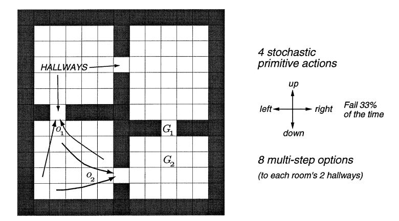

Fig. 2. The rooms example is a gridworld environment with stochastic cell-to-cell actions and room-to-room hallway options. Two of the hallway options are suggested by the arrows labeled  $o_1$  and  $o_2$ . The labels  $G_1$  and  $G_2$  indicate two locations used as goals in experiments described in the text.

The plans (policies) found using temporally abstract options are approximate in the sense that they achieve only  $V_{\mathcal{O}}^*$ , which may be less than the maximum possible,  $V^*$ . On the other hand, if the models used to find them are correct, then they are guaranteed to achieve  $V_{\mathcal{O}}^*$ . We call this the *value achievement* property of planning with options. This contrasts with planning methods that abstract over state space, which generally cannot be guaranteed to achieve their planned values even if their models are correct.

As a simple illustration of planning with options, consider the *rooms example*, a gridworld environment of four rooms as shown in Fig. 2. The cells of the grid correspond to the states of the environment. From any state the agent can perform one of four actions, up, down, left or right, which have a stochastic effect. With probability 2/3, the actions cause the agent to move one cell in the corresponding direction, and with probability 1/3, the agent moves instead in one of the other three directions, each with probability 1/9. In either case, if the movement would take the agent into a wall then the agent remains in the same cell. For now we consider a case in which rewards are zero on all state transitions.

In each of the four rooms we provide two built-in *hallway options* designed to take the agent from anywhere within the room to one of the two hallway cells leading out of the room. A hallway option's policy  $\pi$  follows a shortest path within the room to its target hallway while minimizing the chance of stumbling into the other hallway. For example, the policy for one hallway option is shown in Fig. 3. The termination condition  $\beta(s)$  for each hallway option is zero for states s within the room and 1 for states outside the room, including the hallway states. The initiation set  $\mathcal{I}$  comprises the states within the room plus the non-target hallway state leading into the room. Note that these options are deterministic and Markov, and that an option's policy is not defined outside of its initiation set. We denote the set of eight hallway options by  $\mathcal{H}$ . For each option  $o \in \mathcal{H}$ , we also provide a priori its accurate model,  $r_s^o$  and  $p_{ss'}^o$ , for all  $s \in \mathcal{I}$  and  $s' \in \mathcal{S}$  (assuming there is no goal state, see below). Note that although the transition models  $p_{ss'}^o$  are nominally large (order  $|\mathcal{I}| \times |\mathcal{S}|$ ),

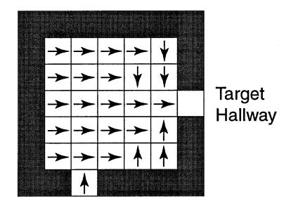

Fig. 3. The policy underlying one of the eight hallway options.

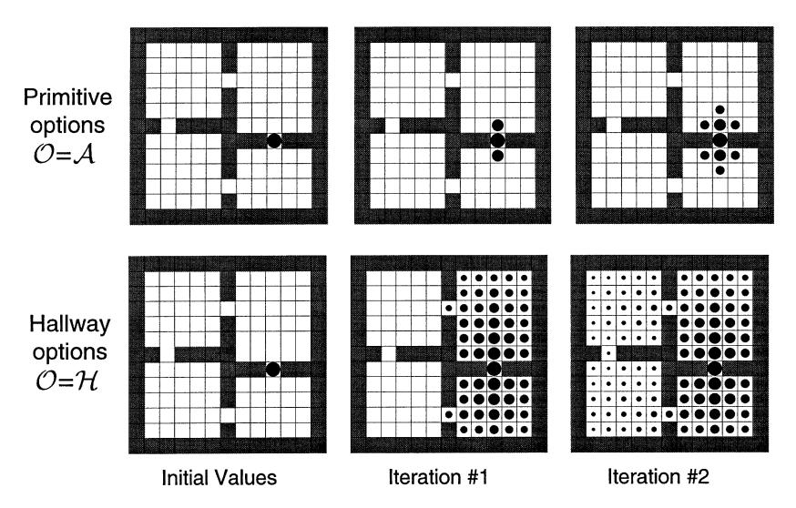

Fig. 4. Value functions formed over iterations of planning by synchronous value iteration with primitive options (above) and with multi-step hallway options (below). The hallway options enabled planning to proceed room-by-room rather than cell-by-cell. The area of the disk in each cell is proportional to the estimated value of the state, where a disk that just fills a cell represents a value of 1.0.

in fact they are sparse, and relatively little memory (order  $|\mathcal{I}| \times 2$ ) is actually needed to hold the nonzero transitions from each state to the two adjacent hallway states. 6

Now consider a sequence of planning tasks for navigating within the grid to a designated goal state, in particular, to the hallway state labeled  $G_1$  in Fig. 2. Formally, the goal state is a state from which all actions lead to the terminal state with a reward of +1. Throughout this paper we discount with  $\gamma = 0.9$  in the rooms example.

As a planning method, we used SVI as given by (13), with various sets of options  $\mathcal{O}$ . The initial value function  $V_0$  was 0 everywhere except the goal state, which was initialized to its correct value,  $V_0(G_1) = 1$ , as shown in the leftmost panels of Fig. 4.

&lt;sup>6 The off-target hallway states are exceptions in that they have three possible out-comes: the target hallway, themselves, and the neighboring state in the off-target room.

This figure contrasts planning with the original actions ( $\mathcal{O} = \mathcal{A}$ ) and planning with the hallway options and not the original actions ( $\mathcal{O} = \mathcal{H}$ ). The upper part of the figure shows the value function after the first two iterations of SVI using just primitive actions. The region of accurately valued states moved out by one cell on each iteration, but after two iterations most states still had their initial arbitrary value of zero. In the lower part of the figure are shown the corresponding value functions for SVI with the hallway options. In the first iteration all states in the rooms adjacent to the goal state became accurately valued, and in the second iteration all the states became accurately valued. Although the values continued to change by small amounts over subsequent iterations, a complete and optimal policy was known by this time. Rather than planning step-by-step, the hallway options enabled the planning to proceed at a higher level, room-by-room, and thus be much faster.

This example is a particularly favorable case for the use of multi-step options because the goal state is a hallway, the target state of some of the options. Next we consider a case in which there is no such coincidence, in which the goal lies in the middle of a room, in the state labeled  $G_2$  in Fig. 2. The hallway options and their models were just as in the previous experiment. In this case, planning with (models of) the hallway options alone could never completely solve the task, because these take the agent only to hallways and thus never to the goal state. Fig. 5 shows the value functions found over five iterations of SVI using *both* the hallway options and the primitive options corresponding to the actions (i.e., using  $\mathcal{O} = \mathcal{A} \cup \mathcal{H}$ ). In the first two iterations, accurate values were propagated from  $G_2$  by one cell per iteration by the models corresponding to the primitive options. After two iterations, however, the first hallway state was reached, and subsequently room-to-room planning using the multi-step hallway options dominated. Note how the state in the lower

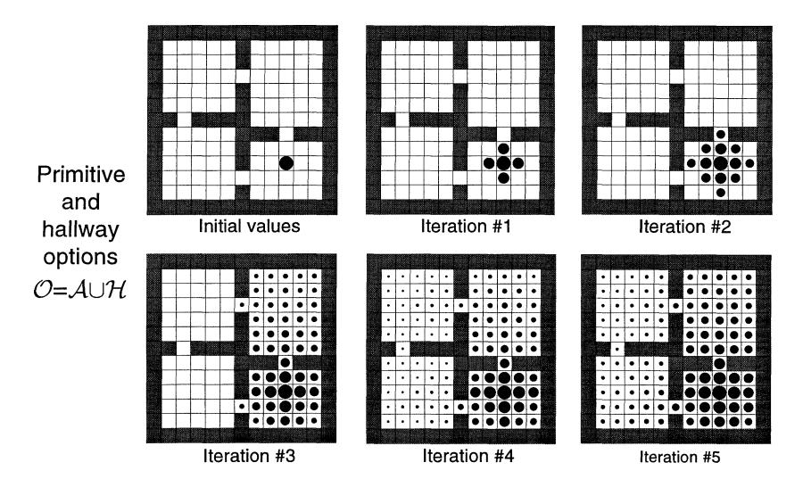

Fig. 5. An example in which the goal is different from the subgoal of the hallway options. Planning here was by SVI with options  $\mathcal{O} = \mathcal{A} \cup \mathcal{H}$ . Initial progress was due to the models of the primitive options (the actions), but by the third iteration room-to-room planning dominated and greatly accelerated planning.

right corner was given a nonzero value during iteration three. This value corresponds to the plan of first going to the hallway state above and then down to the goal; it was overwritten by a larger value corresponding to a more direct route to the goal in the next iteration. Because of the multi-step options, a close approximation to the correct value function was found everywhere by the fourth iteration; without them only the states within three steps of the goal would have been given non-zero values by this time.

We have used SVI in this example because it is a particularly simple planning method which makes the potential advantage of multi-step options clear. In large problems, SVI is impractical because the number of states is too large to complete many iterations, often not even one. In practice it is often necessary to be very selective about the states updated, the options considered, and even the next states considered. These issues are not resolved by multi-step options, but neither are they greatly aggravated. Options provide a tool for dealing with them more flexibly.

Planning with options is not necessarily more complex than planning with actions. For example, in the first experiment described above there were four primitive options and eight hallway options, but in each state only two hallway options needed to be considered. In addition, the models of the primitive options generated four possible successors with non-zero probability whereas the multi-step options generated only two. Thus planning with the multi-step options was actually computationally cheaper than conventional SVI in this case. In the second experiment this was not the case, but the use of multi-step options did not greatly increase the computational costs. In general, of course, there is no guarantee that multi-step options will reduce the overall expense of planning. For example, Hauskrecht et al. [26] have shown that adding multi-step options may actually slow SVI if the initial value function is optimistic. Research with deterministic macro-operators has identified a related "utility problem" when too many macros are used (e.g., see [20,23, 24,47,76]). Temporal abstraction provides the flexibility to greatly reduce computational complexity, but can also have the opposite effect if used indiscriminately. Nevertheless, these issues are beyond the scope of this paper and we do not consider them further.

# 3.2. SMDP value learning

The problem of finding an optimal policy over a set of options  $\mathcal{O}$  can also be addressed by learning methods. Because the MDP augmented by the options is an SMDP, we can apply SMDP learning methods [5,41,44,52,53]. Much as in the planning methods discussed above, each option is viewed as an indivisible, opaque unit. When the execution of option o is started in state s, we next jump to the state s' in which o terminates. Based on this experience, an approximate option-value function Q(s, o) is updated. For example, the SMDP version of one-step Q-learning [5], which we call *SMDP Q-learning*, updates after each option termination by

$$Q(s,o) \leftarrow Q(s,o) + \alpha \left[ r + \gamma^k \max_{o' \in \mathcal{O}_{s'}} Q(s',o') - Q(s,o) \right],$$

where k denotes the number of time steps elapsing between s and s', r denotes the cumulative discounted reward over this time, and it is implicit that the step-size parameter  $\alpha$  may depend arbitrarily on the states, option, and time steps. The estimate Q(s, o) converges

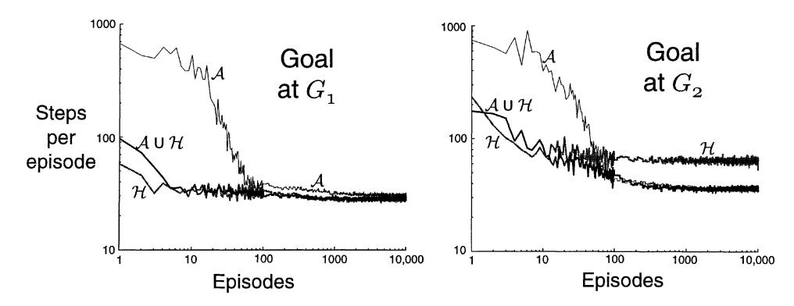

Fig. 6. Performance of SMDP Q-learning in the rooms example with various goals and sets of options. After 100 episodes, the data points are averages over groups of 10 episodes to make the trends clearer. The step size parameter was optimized to the nearest power of 2 for each goal and set of options. The results shown used  $\alpha = 1/8$  in all cases except that with  $\mathcal{O} = \mathcal{H}$  and  $G_1$  ( $\alpha = 1/16$ ), and that with  $\mathcal{O} = \mathcal{A} \cup \mathcal{H}$  and  $G_2$  ( $\alpha = 1/4$ ).

to  $Q_{\mathcal{O}}^*(s, o)$  for all  $s \in \mathcal{S}$  and  $o \in \mathcal{O}$  under conditions similar to those for conventional Q-learning [52], from which it is easy to determine an optimal policy as described earlier.

As an illustration, we applied SMDP Q-learning to the rooms example with the goal at  $G_1$  and at  $G_2$  (Fig. 2). As in the case of planning, we used three different sets of options,  $\mathcal{A}, \mathcal{H}$ , and  $\mathcal{A} \cup \mathcal{H}$ . In all cases, options were selected from the set according to an  $\varepsilon$ -greedy method. That is, options were usually selected at random from among those with maximal option value (i.e.,  $o_t$  was such that  $Q(s_t, o_t) = \max_{o \in O_{s_t}} Q(s_t, o)$ ), but with probability  $\varepsilon$  the option was instead selected randomly from all available options. The probability of random action,  $\varepsilon$ , was 0.1 in all our experiments. The initial state of each episode was in the upper-left corner. Fig. 6 shows learning curves for both goals and all sets of options. In all cases, multi-step options enabled the goal to be reached much more quickly, even on the very first episode. With the goal at  $G_1$ , these methods maintained an advantage over conventional Q-learning throughout the experiment, presumably because they did less exploration. The results were similar with the goal at  $G_2$ , except that the  $\mathcal{H}$  method performed worse than the others in the long term. This is because the best solution requires several steps of primitive options (the hallway options alone find the best solution running between hallways that sometimes stumbles upon  $G_2$ ). For the same reason, the advantages of the  $A \cup \mathcal{H}$  method over the A method were also reduced.

# 4. Interrupting options

SMDP methods apply to options, but only when they are treated as opaque indivisible units. More interesting and potentially more powerful methods are possible by looking inside options or by altering their internal structure, as we do in the rest of this paper. In this section we take a first step in altering options to make them more useful. This is the area where working simultaneously in terms of MDPs and SMDPs is most relevant. We can analyze options in terms of the SMDP and then use their MDP interpretation to change them and produce a new SMDP.

In particular, in this section we consider interrupting options before they would terminate naturally according to their termination conditions. Note that treating options as indivisible units, as SMDP methods do, is limiting in an unnecessary way. Once an option has been selected, such methods require that its policy be followed until the option terminates. Suppose we have determined the option-value function  $O^{\mu}(s, o)$  for some policy  $\mu$  and for all state-option pairs s, o that could be encountered while following  $\mu$ . This function tells us how well we do while following  $\mu$ , committing irrevocably to each option, but it can also be used to re-evaluate our commitment on each step. Suppose at time t we are in the midst of executing option o. If o is Markov in  $s_t$ , then we can compare the value of continuing with o, which is  $Q^{\mu}(s_t, o)$ , to the value of interrupting o and selecting a new option according to  $\mu$ , which is  $V^{\mu}(s) = \sum_{q} \mu(s,q) Q^{\mu}(s,q)$ . If the latter is more highly valued, then why not interrupt o and allow the switch? If these were simple actions, the classical policy improvement theorem [27] would assure us that the new way of behaving is indeed better. Here we prove the generalization to semi-Markov options. The first empirical demonstration of this effect—improved performance by interrupting a temporally extended substep based on a value function found by planning at a higher level—may have been by Kaelbling [31]. Here we formally prove the improvement in a more general setting.

In the following theorem we characterize the new way of behaving as following a policy  $\mu'$  that is the same as the original policy,  $\mu$ , but over a new set of options;  $\mu'(s,o')=\mu(s,o)$ , for all  $s\in\mathcal{S}$ . Each new option o' is the same as the corresponding old option o except that it terminates whenever switching seems better than continuing according to  $Q^{\mu}$ . In other words, the termination condition  $\beta'$  of o' is the same as that of o except that  $\beta'(s)=1$  if  $Q^{\mu}(s,o)< V^{\mu}(s)$ . We call such a  $\mu'$  an *interrupted policy* of  $\mu$ . The theorem is slightly more general in that it does not require interruption at each state in which it could be done. This weakens the requirement that  $Q^{\mu}(s,o)$  be completely known. A more important generalization is that the theorem applies to semi-Markov options rather than just Markov options. This generalization may make the result less intuitively accessible on first reading. Fortunately, the result can be read as restricted to the Markov case simply by replacing every occurrence of "history" with "state" and set of histories,  $\Omega$ , with set of states,  $\mathcal{S}$ .

**Theorem 2** (Interruption). For any MDP, any set of options  $\mathcal{O}$ , and any Markov policy  $\mu: \mathcal{S} \times \mathcal{O} \to [0,1]$ , define a new set of options,  $\mathcal{O}'$ , with a one-to-one mapping between the two option sets as follows: for every  $o = \langle \mathcal{I}, \pi, \beta \rangle \in \mathcal{O}$  we define a corresponding  $o' = \langle \mathcal{I}, \pi, \beta' \rangle \in \mathcal{O}'$ , where  $\beta' = \beta$  except that for any history h that ends in state s and in which  $Q^{\mu}(h, o) < V^{\mu}(s)$ , we may choose to set  $\beta'(h) = 1$ . Any histories whose termination conditions are changed in this way are called interrupted histories. Let the interrupted policy  $\mu'$  be such that for all  $s \in \mathcal{S}$ , and for all  $o' \in \mathcal{O}'$ ,  $\mu'(s, o') = \mu(s, o)$ , where o is the option in  $\mathcal{O}$  corresponding to o'. Then

- (i)  $V^{\mu'}(s) \geqslant V^{\mu}(s)$  for all  $s \in \mathcal{S}$ .
- (ii) If from state  $s \in S$  there is a non-zero probability of encountering an interrupted history upon initiating  $\mu'$  in s, then  $V^{\mu'}(s) > V^{\mu}(s)$ .

**Proof.** Shortly we show that, for an arbitrary start state s, executing the option given by the interrupted policy  $\mu'$  and then following policy  $\mu$  thereafter is no worse than always following policy  $\mu$ . In other words, we show that the following inequality holds:

$$\sum_{o'} \mu'(s, o') \left[ r_s^{o'} + \sum_{s'} p_{ss'}^{o'} V^{\mu}(s') \right]$$

$$\geqslant V^{\mu}(s) = \sum_{o} \mu(s, o) \left[ r_s^{o} + \sum_{s'} p_{ss'}^{o} V^{\mu}(s') \right]. \tag{14}$$

If this is true, then we can use it to expand the left-hand side, repeatedly replacing every occurrence of  $V^{\mu}(x)$  on the left by the corresponding  $\sum_{o'} \mu'(x,o') [r_x^{o'} + \sum_{x'} p_{xx'}^{o'} V^{\mu}(x')]$ . In the limit, the left-hand side becomes  $V^{\mu'}$ , proving that  $V^{\mu'} \geqslant V^{\mu}$ .

To prove the inequality in (14), we note that for all s,  $\mu'(s, o') = \mu(s, o)$ , and show that

$$r_s^{o'} + \sum_{s'} p_{ss'}^{o'} V^{\mu}(s') \geqslant r_s^{o} + \sum_{s'} p_{ss'}^{o} V^{\mu}(s')$$
(15)

as follows. Let  $\Gamma$  denote the set of all interrupted histories:  $\Gamma = \{h \in \Omega \colon \beta(h) \neq \beta'(h)\}$ . Then,

$$\begin{split} r_{s}^{o'} + \sum_{s'} p_{ss'}^{o'} V^{\mu}(s') &= E \big\{ r + \gamma^{k} V^{\mu}(s') \, \big| \, \mathcal{E}(o', s), h \notin \Gamma \big\} \\ &+ E \big\{ r + \gamma^{k} V^{\mu}(s') \, \big| \, \mathcal{E}(o', s), h \in \Gamma \big\} \end{split}$$

where s', r, and k are the next state, cumulative reward, and number of elapsed steps following option o from s, and where h is the history from s to s'. Trajectories that end because of encountering a history not in  $\Gamma$  never encounter a history in  $\Gamma$ , and therefore also occur with the same probability and expected reward upon executing option o in state s. Therefore, if we continue the trajectories that end because of encountering a history in  $\Gamma$  with option o until termination and thereafter follow policy  $\mu$ , we get

$$\begin{split} &E\big\{r+\gamma^kV^{\mu}(s')\,\big|\,\mathcal{E}(o',s),h\notin\Gamma\big\}\\ &\quad +E\big\{\beta(s')\big[r+\gamma^kV^{\mu}(s')\big]+\big(1-\beta(s')\big)\big[r+\gamma^kQ^{\mu}(h,o)\big]\,\big|\,\mathcal{E}(o',s),h\in\Gamma\big\}\\ &=r^o_s+\sum_{s'}p^o_{ss'}V^{\mu}(s'), \end{split}$$

because option o is semi-Markov. This proves (14) because for all  $h \in \Gamma$ ,

$$Q^{\mu}(h, o) \leqslant V^{\mu}(s').$$

Note that strict inequality holds in (15) if  $Q^{\mu}(h, o) < V^{\mu}(s')$  for at least one history  $h \in \Gamma$  that ends a trajectory generated by o' with non-zero probability.  $\square$ 

As one application of this result, consider the case in which  $\mu$  is an optimal policy for some given set of Markov options  $\mathcal{O}$ . We have already discussed how we can, by planning or learning, determine the optimal value functions  $V_{\mathcal{O}}^*$  and  $Q_{\mathcal{O}}^*$  and from them the optimal policy  $\mu_{\mathcal{O}}^*$  that achieves them. This is indeed the best that can be done without

changing  $\mathcal{O}$ , that is, in the SMDP defined by  $\mathcal{O}$ , but less than the best possible achievable in the MDP, which is  $V^* = V_{\mathcal{A}}^*$ . But of course we typically do not wish to work directly with the (primitive) actions  $\mathcal{A}$  because of the computational expense. The interruption theorem gives us a way of improving over  $\mu_{\mathcal{O}}^*$  with little additional computation by stepping outside  $\mathcal{O}$ . That is, at each step we interrupt the current option and switch to any new option that is valued more highly according to  $Q_{\mathcal{O}}^*$ . Checking for such options can typically be done at vastly less expense per time step than is involved in the combinatorial process of computing  $Q_{\mathcal{O}}^*$ . In this sense, interruption gives us a nearly free improvement over any SMDP planning or learning method that computes  $Q_{\mathcal{O}}^*$  as an intermediate step.

In the extreme case, we might interrupt on every step and switch to the greedy option—the option in that state that is most highly valued according to  $Q_{\mathcal{O}}^*$  (as in polling execution [16]). In this case, options are never followed for more than one step, and they might seem superfluous. However, the options still play a role in determining  $Q_{\mathcal{O}}^*$ , the basis on which the greedy switches are made, and recall that multi-step options may enable  $Q_{\mathcal{O}}^*$  to be found much more quickly than  $Q^*$  could (Section 3). Thus, even if multi-step options are never actually followed for more than one step they can still provide substantial advantages in computation and in our theoretical understanding.

Fig. 7 shows a simple example. Here the task is to navigate from a start location to a goal location within a continuous two-dimensional state space. The actions are movements of 0.01 in *any* direction from the current state. Rather than work with these low-level actions, infinite in number, we introduce seven landmark locations in the space. For each landmark we define a controller that takes us to the landmark in a direct path (cf. [48]). Each controller is only applicable within a limited range of states, in this case within a certain distance of the corresponding landmark. Each controller then defines an option: the circular region around the controller's landmark is the option's initiation set, the controller itself is the policy, and arrival at the target landmark is the termination condition. We denote the set of seven landmark options by  $\mathcal{O}$ . Any action within 0.01 of the goal location transitions to the terminal state, the discount rate  $\gamma$  is 1, and the reward is -1 on all transitions, which makes this a minimum-time task.

One of the landmarks coincides with the goal, so it is possible to reach the goal while picking only from  $\mathcal{O}$ . The optimal policy within  $\mathcal{O}$  runs from landmark to landmark, as shown by the thin line in the upper panel of Fig. 7. This is the optimal solution to the SMDP defined by  $\mathcal{O}$  and is indeed the best that one can do while picking only from these options. But of course one can do better if the options are not followed all the way to each landmark. The trajectory shown by the thick line in Fig. 7 cuts the corners and is shorter. This is the interrupted policy with respect to the SMDP-optimal policy. The interrupted policy takes 474 steps from start to goal which, while not as good as the optimal policy in primitive actions (425 steps), is much better, for nominal additional cost, than the SMDP-optimal policy, which takes 600 steps. The state-value functions,  $V^{\mu} = V^*_{\mathcal{O}}$  and  $V^{\mu'}$  for the two policies are shown in the lower part of Fig. 7. Note how the values for the interrupted policy are everywhere greater than the values of the original policy. A related but larger application of the interruption idea to mission planning for uninhabited air vehicles is given in [75].

Fig. 8 shows results for an example using controllers/options with dynamics. The task here is to move a mass along one dimension from rest at position 0 to rest at position 2,

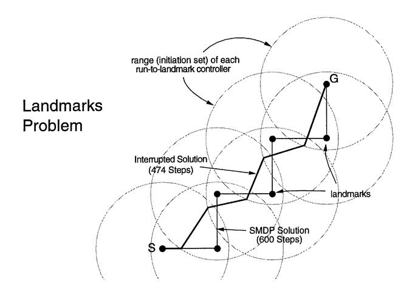

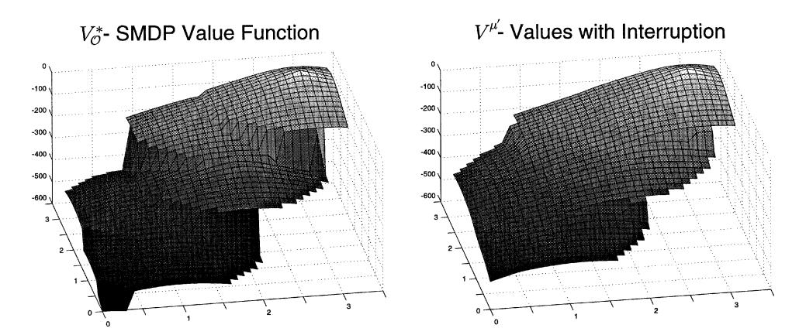

Fig. 7. Using interruption to improve navigation with landmark-directed controllers. The task (top) is to navigate from S to G in minimum time using options based on controllers that run each to one of seven landmarks (the black dots.) The circles show the region around each landmark within which the controllers operate. The thin line shows the SMDP solution, the optimal behavior that uses only these controllers without interrupting them, and the thick line shows the corresponding solution with interruption, which cuts the corners. The lower two panels show the state-value functions for the SMDP and interrupted solutions.

again in minimum time. There is no option that takes they system all the way from 0 to 2, but we do have an option that takes it from 0 to 1 and another option that takes it from any position greater than 0.5 to 2. Both options control the system precisely to its target position and to zero velocity, terminating only when both of these are correct to within  $\varepsilon=0.0001$ . Using just these options, the best that can be done is to first move precisely to rest at 1, using the first option, then re-accelerate and move to 2 using the second option. This SMDP-optimal solution is much slower than the corresponding interrupted solution, as shown in Fig. 8. Because of the need to slow down to near-zero velocity at 1, it takes over 200 time steps, whereas the interrupted solution takes only 121 steps.

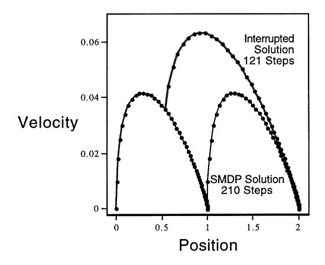

Fig. 8. Phase-space plot of the SMDP and interrupted policies in a simple dynamical task. The system is a mass moving in one dimension:  $x_{t+1} = x_t + \dot{x}_{t+1}$ ,  $\dot{x}_{t+1} = \dot{x}_t + a_t - 0.175\dot{x}_t$  where  $x_t$  is the position,  $\dot{x}_t$  the velocity, 0.175 a coefficient of friction, and the action  $a_t$  an applied force. Two controllers are provided as options, one that drives the position to zero velocity at  $x^* = 1$  and the other to  $x^* = 2$ . Whichever option is being followed at time t, its target position  $x^*$  determines the action taken, according to  $a_t = 0.01(x^* - x_t)$ .

#### 5. Intra-option model learning

In this section we introduce a new method for learning the model,  $r_s^o$  and  $p_{ss'}^o$ , of an option o, given experience and knowledge of o (i.e., of its  $\mathcal{I}$ ,  $\pi$ , and  $\beta$ ). Our method requires that  $\pi$  be deterministic and that the option be Markov. For a semi-Markov option, the only general approach is to execute the option to termination many times in each state s, recording in each case the resultant next state s', cumulative discounted reward r, and elapsed time s. These outcomes are then averaged to approximate the expected values for  $r_s^o$  and  $r_s^o$  given by (6) and (7). For example, an incremental learning rule for this could update its model after each execution of s

$$\widehat{r}_s^o = \widehat{r}_s^o + \alpha [r - \widehat{r}_s^o], \tag{16}$$

and

$$\widehat{p}_{sx}^{o} = \widehat{p}_{sx}^{o} + \alpha \left[ \gamma^{k} \delta_{s'x} - \widehat{p}_{sx}^{o} \right], \tag{17}$$

for all  $x \in S^+$ , where  $\delta_{s'x} = 1$  if s' = x and is 0 else, and where the step-size parameter,  $\alpha$ , may be constant or may depend on the state, option, and time. For example, if  $\alpha$  is 1 divided by the number of times that o has been experienced in s, then these updates maintain the estimates as sample averages of the experienced outcomes. However the averaging is done, we call these *SMDP model-learning methods* because, like *SMDP* value-learning methods, they are based on jumping from initiation to termination of each option, ignoring what happens along the way. In the special case in which o is a primitive option, SMDP model-learning methods reduce to those used to learn conventional one-step models of actions.

One disadvantage of SMDP model-learning methods is that they improve the model of an option only when the option terminates. Because of this, they cannot be used for nonterminating options and can only be applied to one option at a time—the one option

that is executing at that time. For Markov options, special temporal-difference methods can be used to learn usefully about the model of an option before the option terminates. We call these *intra-option* methods because they learn about an option from a fragment of experience "within" the option. Intra-option methods can even be used to learn about an option without ever executing it, as long as some selections are made that are consistent with the option. Intra-option methods are examples of *off-policy* learning methods [72] because they learn about the consequences of one policy while actually behaving according to another. Intra-option methods can be used to simultaneously learn models of many different options from the same experience. Intra-option methods were introduced in [71], but only for a prediction problem with a single unchanging policy, not for the full control case we consider here and in [74].

Just as there are Bellman equations for value functions, there are also Bellman equations for models of options. Consider the intra-option learning of the model of a Markov option  $o = \langle \mathcal{I}, \pi, \beta \rangle$ . The correct model of o is related to itself by

$$r_s^o = \sum_{a \in A_s} \pi(s, a) E\{r + \gamma (1 - \beta(s')) r_{s'}^o\}$$

(where r and s' are the reward and next state given that action a is taken in state s)

$$= \sum_{a \in A_{s}} \pi(s, a) \left[ r_{s}^{a} + \sum_{s'} p_{ss'}^{a} (1 - \beta(s')) r_{s'}^{o} \right],$$

and

$$\begin{split} p_{sx}^{o} &= \sum_{a \in \mathcal{A}_{s}} \pi(s, a) \gamma E \left\{ \left( 1 - \beta(s') \right) p_{s'x}^{o} + \beta(s') \delta_{s'x} \right\} \\ &= \sum_{a \in \mathcal{A}_{s}} \pi(s, a) \sum_{s'} p_{ss'}^{a} \left[ \left( 1 - \beta(s') \right) p_{s'x}^{o} + \beta(s') \delta_{s'x} \right], \end{split}$$

for all  $s, x \in S$ . How can we turn these Bellman-like equations into update rules for learning the model? First consider that action  $a_t$  is taken in  $s_t$ , and that the way it was selected is consistent with  $o = \langle \mathcal{I}, \pi, \beta \rangle$ , that is, that  $a_t$  was selected with the distribution  $\pi(s_t, \cdot)$ . Then the Bellman equations above suggest the temporal-difference update rules

$$\widehat{r}_{s_t}^o \leftarrow \widehat{r}_{s_t}^o + \alpha \left[ r_{t+1} + \gamma \left( 1 - \beta(s_{t+1}) \right) \widehat{r}_{s_{t+1}}^o - \widehat{r}_{s_t}^o \right]$$
(18)

and

$$\widehat{p}_{s_t x}^o \leftarrow \widehat{p}_{s_t x}^o + \alpha \left[ \gamma \left( 1 - \beta(s_{t+1}) \right) \widehat{p}_{s_{t+1} x}^o + \gamma \beta(s_{t+1}) \delta_{s_{t+1} x} - \widehat{p}_{s_t x}^o \right], \tag{19}$$

for all  $x \in S^+$ , where  $\widehat{p}_{ss'}^o$  and  $\widehat{r}_s^o$  are the estimates of  $p_{ss'}^o$  and  $r_s^o$ , respectively, and  $\alpha$  is a positive step-size parameter. The method we call *one-step intra-option model learning* applies these updates to every option consistent with every action taken,  $a_t$ . Of course, this is just the simplest intra-option model-learning method. Others may be possible using eligibility traces and standard tricks for off-policy learning (as in [71]).

As an illustration, consider model learning in the rooms example using SMDP and intraoption methods. As before, we assume that the eight hallway options are given, but now we

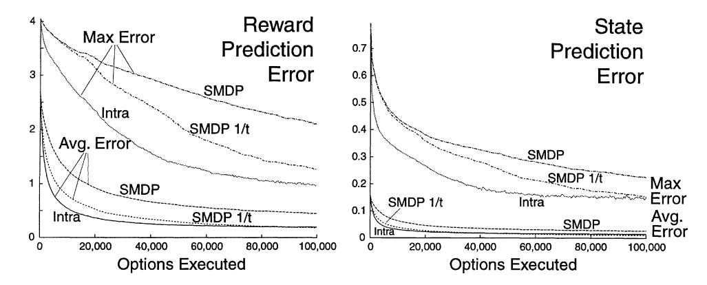

Fig. 9. Model learning by SMDP and intra-option methods. Shown are the average and maximum over  $\mathcal{I}$  of the absolute errors between the learned and true models, averaged over the eight hallway options and 30 repetitions of the whole experiment. The lines labeled 'SMDP 1/t' are for the SMDP method using sample averages; all the others used  $\alpha = 1/4$ .

assume that their models are not given and must be learned. In this experiment, the rewards were selected according to a normal probability distribution with a standard deviation of 0.1 and a mean that was different for each state—action pair. The means were selected randomly at the beginning of each run uniformly from the [-1,0] interval. Experience was generated by selecting randomly in each state among the two possible options and four possible actions, with no goal state. In the SMDP model-learning method, Eqs. (16) and (17) were applied whenever an option terminated, whereas, in the intra-option model-learning method, Eqs. (18) and (19) were applied on every step to all options that were consistent with the action taken on that step. In this example, all options are deterministic, so consistency with the action selected means simply that the option would have selected that action.

For each method, we tried a range of values for the step-size parameter,  $\alpha = 1/2, 1/4, 1/8$ , and 1/16. Results are shown in Fig. 9 for the value that seemed to be best for each method, which happened to be  $\alpha = 1/4$  in all cases. For the SMDP method, we also show results with the step-size parameter set such that the model estimates were sample averages, which should give the best possible performance of this method (these lines are labeled 1/t). The figure shows the average and maximum errors over the state—option space for each method, averaged over the eight options and 30 repetitions of the experiment. As expected, the intra-option method was able to learn significantly faster than the SMDP methods.

#### 6. Intra-option value learning

We turn now to the intra-option learning of option values and thus of optimal policies over options. If the options are semi-Markov, then again the SMDP methods described in Section 3.2 may be the only feasible methods; a semi-Markov option must be completed before it can be evaluated. But if the options are Markov and we are willing to look *inside* them, then we can consider intra-option methods. Just as in the case of model learning,

intra-option methods for value learning are potentially more efficient than SMDP methods because they extract more training examples from the same experience.

For example, suppose we are learning to approximate  $Q_{\mathcal{O}}^*(s,o)$  and that o is Markov. Based on an execution of o from t to t+k, SMDP methods extract a single training example for  $Q_{\mathcal{O}}^*(s,o)$ . But because o is Markov, it is, in a sense, also initiated at each of the steps between t and t+k. The jumps from each intermediate  $s_i$  to  $s_{t+k}$  are also valid experiences with o, experiences that can be used to improve estimates of  $Q_{\mathcal{O}}^*(s_i,o)$ . Or consider an option that is very similar to o and which would have selected the same actions, but which would have terminated one step later, at t+k+1 rather than at t+k. Formally this is a different option, and formally it was not executed, yet all this experience could be used for learning relevant to it. In fact, an option can often learn something from experience that is only slightly related (occasionally selecting the same actions) to what would be generated by executing the option. This is the idea of off-policy training—to make full use of whatever experience occurs to learn as much as possible about all options irrespective of their role in generating the experience. To make the best use of experience we would like off-policy and intra-option versions of value-learning methods such as Q-learning.

It is convenient to introduce new notation for the value of a state-option pair given that the option is Markov and executing upon *arrival* in the state:

$$U_{\mathcal{O}}^*(s,o) = (1-\beta(s))Q_{\mathcal{O}}^*(s,o) + \beta(s) \max_{o' \in \mathcal{O}} Q_{\mathcal{O}}^*(s,o').$$

Then we can write Bellman-like equations that relate  $Q_{\mathcal{O}}^*(s,o)$  to expected values of  $U_{\mathcal{O}}^*(s',o)$ , where s' is the immediate successor to s after initiating Markov option  $o = \langle \mathcal{I}, \pi, \beta \rangle$  in s:

$$Q_{\mathcal{O}}^{*}(s,o) = \sum_{a \in \mathcal{A}_{s}} \pi(s,a) E\{r + \gamma U_{\mathcal{O}}^{*}(s',o) \mid s,a\}$$

$$= \sum_{a \in \mathcal{A}_{s}} \pi(s,a) \left[r_{s}^{a} + \sum_{s'} p_{ss'}^{a} U_{\mathcal{O}}^{*}(s',o)\right],$$
(20)

where r is the immediate reward upon arrival in s'. Now consider learning methods based on this Bellman equation. Suppose action  $a_t$  is taken in state  $s_t$  to produce next state  $s_{t+1}$  and reward  $r_{t+1}$ , and that  $a_t$  was selected in a way consistent with the Markov policy  $\pi$  of an option  $o = \langle \mathcal{I}, \pi, \beta \rangle$ . That is, suppose that  $a_t$  was selected according to the distribution  $\pi(s_t, \cdot)$ . Then the Bellman equation above suggests applying the off-policy one-step temporal-difference update:

$$Q(s_t, o) \leftarrow Q(s_t, o) + \alpha \left[ \left( r_{t+1} + \gamma U(s_{t+1}, o) \right) - Q(s_t, o) \right], \tag{21}$$

where

$$U(s, o) = (1 - \beta(s))Q(s, o) + \beta(s) \max_{o' \in \mathcal{O}} Q(s, o').$$

The method we call *one-step intra-option Q-learning* applies this update rule to every option o consistent with every action taken,  $a_t$ . Note that the algorithm is potentially dependent on the order in which options are updated because, in each update, U(s, o) depends on the current values of Q(s, o) for other options o'. If the options' policies are

deterministic, then the concept of consistency above is clear, and for this case we can prove convergence. Extensions to stochastic options are a topic of current research.

**Theorem 3** (Convergence of intra-option Q-learning). For any set of Markov options,  $\mathcal{O}$ , with deterministic policies, one-step intra-option Q-learning converges with probability 1 to the optimal Q-values,  $Q_{\mathcal{O}}^*$ , for every option regardless of what options are executed during learning, provided that every action gets executed in every state infinitely often.

**Proof** (*Sketch*). On experiencing the transition, (s, a, r', s'), for every option o that picks action a in state s, intra-option Q-learning performs the following update:

$$Q(s,o) \leftarrow Q(s,o) + \alpha(s,o) [r' + \gamma U(s',o) - Q(s,o)].$$

Our result follows directly from Theorem 1 of [30] and the observation that the expected value of the update operator  $r' + \gamma U(s', o)$  yields a contraction, proved below:

$$\begin{split} & \left| E \left\{ r' + \gamma U(s', o) \right\} - Q_{\mathcal{O}}^*(s, o) \right| \\ & = \left| r_s^a + \sum_{s'} p_{ss'}^a U(s', o) - Q_{\mathcal{O}}^*(s, o) \right| \\ & = \left| r_s^a + \sum_{s'} p_{ss'}^a U(s', o) - r_s^a - \sum_{s'} p_{ss'}^a U_{\mathcal{O}}^*(s', o) \right| \\ & \leq \left| \sum_{s'} p_{ss'}^a \left[ \left( 1 - \beta(s') \right) \left( Q(s', o) - Q_{\mathcal{O}}^*(s', o) \right) \right. \\ & + \beta(s') \max_{o' \in \mathcal{O}} Q(s', o') - \max_{o' \in \mathcal{O}} Q_{\mathcal{O}}^*(s', o') \right] \right| \\ & \leq \sum_{s'} p_{ss'}^a \max_{s'', o''} \left| Q(s'', o'') - Q_{\mathcal{O}}^*(s'', o'') \right| \\ & \leq \gamma \max_{s'', o''} \left| Q(s'', o'') - Q_{\mathcal{O}}^*(s'', o'') \right|. \quad \Box \end{split}$$

As an illustration, we applied this intra-option method to the rooms example, this time with the goal in the rightmost hallway, cell  $G_1$  in Fig. 2. Actions were selected randomly with equal probability from the four primitives. The update (21) was applied first to the primitive options, then to any of the hallway options that were consistent with the action. The hallway options were updated in clockwise order, starting from any hallways that faced up from the current state. The rewards were the same as in the experiment in the previous section. Fig. 10 shows learning curves demonstrating the effective learning of option values without ever selecting the corresponding options.

Intra-option versions of other reinforcement learning methods such as Sarsa,  $TD(\lambda)$ , and eligibility-trace versions of Sarsa and Q-learning should be straightforward, although there has been no experience with them. The intra-option Bellman equation (20) could also be used for intra-option sample-based planning.

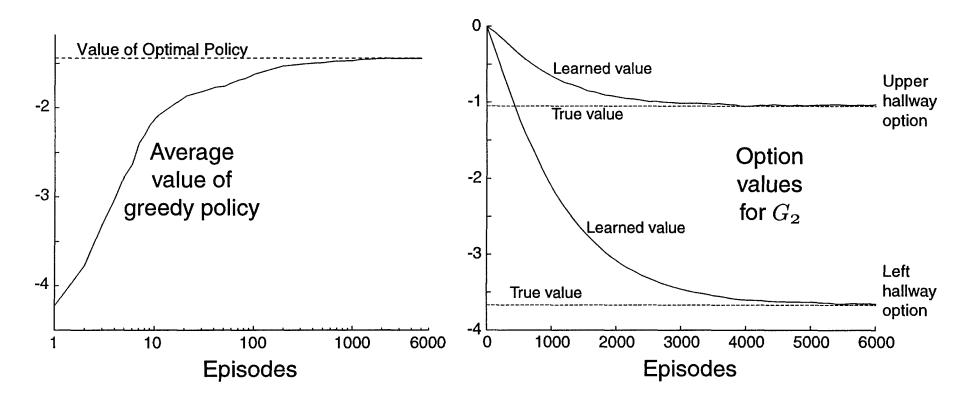

Fig. 10. The learning of option values by intra-option methods without ever selecting the options. Experience was generated by selecting randomly among actions, with the goal at  $G_1$ . Shown on the left is the value of the greedy policy, averaged over all states and 30 repetitions of the experiment, as compared with the value of the optimal policy. The right panel shows the learned option values for state  $G_2$  approaching their correct values.

#### 7. Subgoals for learning options

Perhaps the most important aspect of working between MDPs and SMDPs is that the options making up the SMDP actions may be changed. We have seen one way in which this can be done by changing their termination conditions. Perhaps more fundamental than that is changing their *policies*, which we consider briefly in this section. It is natural to think of options as achieving subgoals of some kind, and to adapt each option's policy to better achieve its subgoal. For example, if the option is open-the-door, then it is natural to adapt its policy over time to make it more effective and efficient at opening the door, which may make it more generally useful. It is possible to have many such subgoals and learn about them each independently using an off-policy learning method such as Q-learning, as in [17,31,38,66,78]. In this section we develop this idea within the options framework and illustrate it by learning the hallway options in the rooms example. We assume the subgoals are given and do not address the larger question of the source of the subgoals.

A simple way to formulate a subgoal for an option is to assign a *terminal subgoal value*, g(s), to each state s in a subset of states  $\mathcal{G} \subseteq \mathcal{S}$ . These values indicate how desirable it is for the option to terminate in each state in  $\mathcal{G}$ . For example, to learn a hallway option in the rooms task, the target hallway might be assigned a subgoal value of +1 while the other hallway and all states outside the room might be assigned a subgoal value of 0. Let  $\mathcal{O}_g$  denote the set of options that terminate only and always in  $\mathcal{G}$  (i.e., for which  $\beta(s) = 0$  for  $s \notin \mathcal{G}$  and  $\beta(s) = 1$  for  $s \in \mathcal{G}$ ). Given a subgoal-value function  $g: \mathcal{G} \to \mathfrak{R}$ , one can define a new state-value function, denoted  $V_g^o(s)$ , for options  $o \in \mathcal{O}_g$ , as the expected value of the cumulative reward if option o is initiated in state s, plus the subgoal value g(s') of the state s' in which it terminates, both discounted appropriately. Similarly, we can define a new action-value function  $Q_g^o(s, a) = V_g^{ao}(s)$  for actions  $a \in \mathcal{A}_s$  and options  $o \in \mathcal{O}_g$ .

Finally, we can define *optimal* value functions for any subgoal g:

$$V_g^*(s) = \max_{o \in \mathcal{O}_g} V_g^o(s)$$
 and  $Q_g^*(s, a) = \max_{o \in \mathcal{O}_g} Q_g^o(s, a)$ .

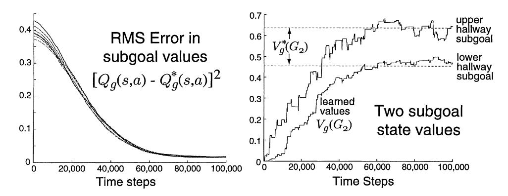

Fig. 11. Learning subgoal-achieving hallway options under random behavior. Shown on the left is the error between  $Q_g(s,a)$  and  $Q_g^*(s,a)$  averaged over  $s \in \mathcal{I}$ ,  $a \in \mathcal{A}$ , and 30 repetitions. The right panel shows the learned state values (maximum over action values) for two options at state  $G_2$  approaching their correct values.

Finding an option that achieves these maximums (an *optimal option* for the subgoal) is then a well defined subtask. For Markov options, this subtask has Bellman equations and methods for learning and planning just as in the original task. For example, the one-step tabular Q-learning method for updating an estimate  $Q_g(s_t, a_t)$  of  $Q_o^*(s_t, a_t)$  is

$$Q_g(s_t, a_t) \leftarrow Q_g(s_t, a_t) + \alpha \Big[ r_{t+1} + \gamma \max_{a} Q_g(s_{t+1}, a) - Q_g(s_t, a_t) \Big],$$
if  $s_{t+1} \notin \mathcal{G}$ ,
$$Q_g(s_t, a_t) \leftarrow Q_g(s_t, a_t) + \alpha \Big[ r_{t+1} + \gamma g(s_{t+1}) - Q_g(s_t, a_t) \Big],$$
if  $s_{t+1} \in \mathcal{G}$ .

As a simple example, we applied this method to learn the policies of the eight hallway options in the rooms example. Each option was assigned subgoal values of +1 for the target hallway and 0 for all states outside the option's room, including the off-target hallway. The initial state was that in the upper left corner, actions were selected randomly with equal probability, and there was no goal state. The parameters were  $\gamma=0.9$  and  $\alpha=0.1$ . All rewards were zero. Fig. 11 shows the learned values for the hallway subgoals reliably approaching their ideal values.

#### 8. Conclusion

Representing knowledge flexibly at multiple levels of temporal abstraction has the potential to greatly speed planning and learning on large problems. We have introduced a framework for doing this within the context of reinforcement learning and MDPs. This context enables us to handle stochastic environments, closed-loop policies, and goals in a more general way than has been possible in classical AI approaches to temporal abstraction. Our framework is also clear enough to be learned, used, and interpreted mechanically, as we have shown by exhibiting simple procedures for learning and planning with options, for learning models of options, and for creating new options from subgoals.

The foundation of the theory of options is provided by the existing theory of SMDPs and associated learning methods. The fact that each set of options defines an SMDP provides a rich set of planning and learning methods, convergence theory, and an immediate, natural, and general way of analyzing mixtures of actions at different time scales. This theory offers a lot, but still the most interesting cases are beyond it because they involve interrupting, constructing, or otherwise decomposing options into their constituent parts. It is the intermediate ground between MDPs and SMDPs that seems richest in possibilities for new algorithms and results. In this paper we have broken this ground and touched on many of the issues, but there is far more left to be done. Key issues such as transfer between subtasks, the source of subgoals, and integration with state abstraction remain incompletely understood. The connection between options and SMDPs provides only a foundation for addressing these and other issues.

Finally, although this paper has emphasized temporally extended *action*, it is interesting to note that there may be implications for temporally extended *perception* as well. It is now common to recognize that action and perception are intimately linked. To see the objects in a room is not so much to label or locate them as it is to know what opportunities they afford for action: a door to open, a chair to sit on, a book to read, a person to talk to. If the temporally extended actions are modeled as options, then perhaps the models of the options correspond well to these perceptions. Consider a robot learning to recognize its battery charger. The most useful concept for it is the set of states from which it can successfully dock with the charger, and this is exactly what would be produced by the model of a docking option. These kinds of action-oriented concepts are appealing because they can be tested and learned by the robot without external supervision, as we have shown in this paper.

# Acknowledgement

The authors gratefully acknowledge the substantial help they have received from many colleagues who have shared their related results and ideas with us over the long period during which this paper was in preparation, especially Amy McGovern, Ron Parr, Tom Dietterich, Andrew Fagg, B. Ravindran, Manfred Huber, and Andy Barto. We also thank Leo Zelevinsky, Csaba Szepesvári, Paul Cohen, Robbie Moll, Mance Harmon, Sascha Engelbrecht, and Ted Perkins. This work was supported by NSF grant ECS-9511805 and grant AFOSR-F49620-96-1-0254, both to Andrew Barto and Richard Sutton. Doina Precup also acknowledges the support of the Fulbright foundation. Satinder Singh was supported by NSF grant IIS-9711753. An earlier version of this paper appeared as University of Massachusetts Technical Report UM-CS-1998-074.

#### References

- E.G. Araujo, R.A. Grupen, Learning control composition in a complex environment, in: Proc. 4th International Conference on Simulation of Adaptive Behavior, 1996, pp. 333–342.
- [2] M. Asada, S. Noda, S. Tawaratsumida, K. Hosada, Purposive behavior acquisition for a real robot by vision-based reinforcement learning, Machine Learning 23 (1996) 279–303.

- [3] A.G. Barto, S.J. Bradtke, S.P. Singh, Learning to act using real-time dynamic programming, Artificial Intelligence 72 (1995) 81–138.
- [4] C. Boutilier, R.I. Brafman, C. Geib, Prioritized goal decomposition of Markov decision processes: Toward a synthesis of classical and decision theoretic planning, in: Proc. IJCAI-97, Nagoya, Japan, 1997, pp. 1162– 1165
- [5] S.J. Bradtke, M.O. Duff, Reinforcement learning methods for continuous-time Markov decision problems, in: Advances in Neural Information Processing Systems 7, MIT Press, Cambridge, MA, 1995, pp. 393–400.
- [6] R.I. Brafman, M. Tennenholtz, Modeling agents as qualitative decision makers, Artificial Intelligence 94 (1) (1997) 217–268.
- [7] R.W. Brockett, Hybrid models for motion control systems, in: Essays in Control: Perspectives in the Theory and its Applications, Birkhäuser, Boston, MA, 1993, pp. 29–53.
- [8] L. Chrisman, Reasoning about probabilistic actions at multiple levels of granularity, in: Proc. AAAI Spring Symposium: Decision-Theoretic Planning, Stanford University, 1994.
- [9] M. Colombetti, M. Dorigo, G. Borghi, Behavior analysis and training: A methodology for behavior engineering, IEEE Trans. Systems Man Cybernet. Part B 26 (3) (1996) 365–380.
- [10] R.H. Crites, A.G. Barto, Improving elevator performance using reinforcement learning, in: Advances in Neural Information Processing Systems 8, MIT Press, Cambridge, MA, 1996, pp. 1017–1023.
- [11] P. Dayan, Improving generalization for temporal difference learning: The successor representation, Neural Computation 5 (1993) 613–624.
- [12] P. Dayan, G.E. Hinton, Feudal reinforcement learning, in: Advances in Neural Information Processing Systems 5, Morgan Kaufmann, San Mateo, CA, 1993, pp. 271–278.
- [13] T. Dean, L.P. Kaelbling, J. Kirman, A. Nicholson, Planning under time constraints in stochastic domains, Artificial Intelligence 76 (1–2) (1995) 35–74.
- [14] T. Dean, S.-H. Lin, Decomposition techniques for planning in stochastic domains, in: Proc. IJCAI-95, Montreal, Quebec, Morgan Kaufmann, San Mateo, CA, 1995, pp. 1121–1127. See also Technical Report CS-95-10, Brown University, Department of Computer Science, 1995.
- [15] G.F. DeJong, Learning to plan in continuous domains, Artificial Intelligence 65 (1994) 71–141.
- [16] T.G. Dietterich, The MAXQ method for hierarchical reinforcement learning, in: Machine Learning: Proc. 15th International Conference, Morgan Kaufmann, San Mateo, CA, 1998, pp. 118–126.
- [17] M. Dorigo, M. Colombetti, Robot shaping: Developing autonomous agents through learning, Artificial Intelligence 71 (1994) 321–370.
- [18] G.L. Drescher, Made Up Minds: A Constructivist Approach to Artificial Intelligence, MIT Press, Cambridge, MA, 1991.
- [19] C. Drummond, Composing functions to speed up reinforcement learning in a changing world, in: Proc. 10th European Conference on Machine Learning, Springer, Berlin, 1998.
- [20] O. Etzioni, Why PRODIGY/EBL works, in: Proc. AAAI-90, Boston, MA, MIT Press, Cambridge, MA, 1990, pp. 916–922.
- [21] R.E. Fikes, P.E. Hart, N.J. Nilsson, Learning and executing generalized robot plans, Artificial Intelligence 3 (1972) 251–288.
- [22] H. Geffner, B. Bonet, High-level planning and control with incomplete information using POMDPs, in: Proc. AIPS-98 Workshop on Integrating Planning, Scheduling and Execution in Dynamic and Uncertain Environments, 1998.
- [23] J. Gratch, G. DeJong, A statistical approach to adaptive problem solving, Artificial Intelligence 88 (1–2) (1996) 101–161.
- [24] R. Greiner, I. Jurisica, A statistical approach to solving the EBL utility problem, in: Proc. AAAI-92, San Jose, CA, 1992, pp. 241–248.
- [25] R.L. Grossman, A. Nerode, A.P. Ravn, H. Rischel, Hybrid Systems, Springer, New York, 1993.
- [26] M. Hauskrecht, N. Meuleau, C. Boutilier, L.P. Kaelbling, T. Dean, Hierarchical solution of Markov decision processes using macro-actions, in: Uncertainty in Artificial Intelligence: Proc. 14th Conference, 1998, pp. 220–229.
- [27] R. Howard, Dynamic Programming and Markov Processes, MIT Press, Cambridge, MA, 1960.
- [28] M. Huber, R.A. Grupen, A feedback control structure for on-line learning tasks, Robotics and Autonomous Systems 22 (3–4) (1997) 303–315.
- [29] G.A. Iba, A heuristic approach to the discovery of macro-operators, Machine Learning 3 (1989) 285–317.

- [30] T. Jaakkola, M.I. Jordan, S. Singh, On the convergence of stochastic iterative dynamic programming algorithms, Neural Computation 6 (6) (1994) 1185–1201.
- [31] L.P. Kaelbling, Hierarchical learning in stochastic domains: Preliminary results, in: Proc. 10th International Conference on Machine Learning, Morgan Kaufmann, San Mateo, CA, 1993, pp. 167–173.
- [32] Zs. Kalmár, Cs. Szepesvári, A. Lörincz, Module based reinforcement learning: Experiments with a real robot, Machine Learning 31 (1998) 55–85 and Autonomous Robots 5 (1998) 273–295 (special joint issue).
- [33] J. de Kleer, J.S. Brown, A qualitative physics based on confluences, Artificial Intelligence 24 (1–3) (1984) 7–83
- [34] R.E. Korf, Learning to Solve Problems by Searching for Macro-Operators, Pitman Publishers, Boston, MA, 1985
- [35] J.R. Koza, J.P. Rice, Automatic programming of robots using genetic programming, in: Proc. AAAI-92, San Jose, CA, 1992, pp. 194–201.
- [36] B.J. Kuipers, Commonsense knowledge of space: Learning from experience, in: Proc. IJCAI-79, Tokyo, Japan, 1979, pp. 499–501.
- [37] J.E. Laird, P.S. Rosenbloom, A. Newell, Chunking in SOAR: The anatomy of a general learning mechanism, Machine Learning 1 (1986) 11–46.
- [38] L.-J. Lin, Reinforcement learning for robots using neural networks, Ph.D. Thesis, Carnegie Mellon University, Technical Report CMU-CS-93-103, 1993.
- [39] P. Maes, R. Brooks, Learning to coordinate behaviors, in: Proc. AAAI-90, Boston, MA, 1990, pp. 796-802.
- [40] S. Mahadevan, J. Connell, Automatic programming of behavior-based robots using reinforcement learning, Artificial Intelligence 55 (2–3) (1992) 311–365.
- [41] S. Mahadevan, N. Marchalleck, T. Das, A. Gosavi, Self-improving factory simulation using continuous-time average-reward reinforcement learning, in: Proc. 14th International Conference on Machine Learning, 1997, pp. 202–210.
- [42] P. Marbach, O. Mihatsch, M. Schulte, J.N. Tsitsiklis, Reinforcement learning for call admission control in routing in integrated service networks, in: Advances in Neural Information Processing Systems 10, Morgan Kaufmann, San Mateo, CA, 1998, pp. 922–928.
- [43] M.J. Mataric, Behavior-based control: Examples from navigation, learning, and group behavior, J. Experiment. Theoret. Artificial Intelligence 9 (2–3) (1997) 323–336.
- [44] A. McGovern, R.S. Sutton, Macro-actions in reinforcement learning: An empirical analysis, Technical Report 98-70, University of Massachusetts, Department of Computer Science, 1998.
- [45] N. Meuleau, M. Hauskrecht, K.-E. Kim, L. Peshkin, L.P. Kaelbling, T. Dean, C. Boutilier, Solving very large weakly coupled Markov decision processes, in: Proc. AAAI-98, Madison, WI, 1998, pp. 165–172.
- [46] S. Minton, Learning Search Control Knowledge: An Explanation-Based Approach, Kluwer Academic, Dordrecht, 1988.
- [47] S. Minton, Quantitative results concerning the utilty of explanation-based learning, Artificial Intelligence 42 (2–3) (1990) 363–391.
- [48] A.W. Moore, The parti-game algorithm for variable resolution reinforcement learning in multidimensional spaces, in: Advances in Neural Information Processing Systems 6, MIT Press, Cambridge, MA, 1994, pp. 711–718.
- [49] A. Newell, H.A. Simon, Human Problem Solving, Prentice-Hall, Englewood Cliffs, NJ, 1972.
- [50] J. Nie, S. Haykin, A Q-learning based dynamic channel assignment technique for mobile communication systems, IEEE Transactions on Vehicular Technology, to appear.
- [51] N. Nilsson, Teleo-reactive programs for agent control, J. Artificial Intelligence Res. 1 (1994) 139–158.
- [52] R. Parr, Hierarchical control and learning for Markov decision processes, Ph.D. Thesis, University of California at Berkeley, 1998.
- [53] R. Parr, S. Russell, Reinforcement learning with hierarchies of machines, in: Advances in Neural Information Processing Systems 10, MIT Press, Cambridge, MA, 1998, pp. 1043–1049.
- [54] D. Precup, R.S. Sutton, Multi-time models for reinforcement learning, in: Proc. ICML'97 Workshop on Modeling in Reinforcement Learning, 1997.
- [55] D. Precup, R.S. Sutton, Multi-time models for temporally abstract planning, in: Advances in Neural Information Processing Systems 10, MIT Press, Cambridge, MA, 1998, pp. 1050–1056.
- [56] D. Precup, R.S. Sutton, S.P. Singh, Planning with closed-loop macro actions, in: Working Notes 1997 AAAI Fall Symposium on Model-directed Autonomous Systems, 1997, pp. 70–76.

- [57] D. Precup, R.S. Sutton, S.P. Singh, Theoretical results on reinforcement learning with temporally abstract options, in: Proc. 10th European Conference on Machine Learning, Springer, Berlin, 1998.
- [58] M.L. Puterman, Markov Decision Problems, Wiley, New York, 1994.
- [59] M. Ring, Incremental development of complex behaviors through automatic construction of sensory-motor hierarchies, in: Proc. 8th International Conference on Machine Learning, Morgan Kaufmann, San Mateo, CA, 1991, pp. 343–347.
- [60] E.D. Sacerdoti, Planning in a hierarchy of abstraction spaces, Artificial Intelligence 5 (1974) 115-135.
- [61] S. Sastry, Algorithms for design of hybrid systems, in: Proc. International Conference of Information Sciences, 1997.
- [62] A.C.C. Say, S. Kuru, Qualitative system identification: Deriving structure from behavior, Artificial Intelligence 83 (1) (1996) 75–141.
- [63] J. Schmidhuber, Neural sequence chunkers, Technische Universität München, TR FKI-148-91, 1991.
- [64] R. Simmons, S. Koenig, Probabilistic robot navigation in partially observable environments, in: Proc. IJCAI-95, Montreal, Quebec, Morgan Kaufmann, San Mateo, CA, 1995, pp. 1080–1087.
- [65] S.P. Singh, Reinforcement learning with a hierarchy of abstract models, in: Proc. AAAI-92, San Jose, CA, MIT/AAAI Press, Cambridge, MA, 1992, pp. 202–207.
- [66] S.P. Singh, Scaling reinforcement learning by learning variable temporal resolution models, in: Proc. 9th International Conference on Machine Learning, Morgan Kaufmann, San Mateo, CA, 1992, pp. 406–415.
- [67] S.P. Singh, The efficient learning of multiple task sequences, in: Advances in Neural Information Processing Systems 4, Morgan Kaufmann, San Mateo, CA, 1992, pp. 251–258.
- [68] S.P. Singh, Transfer of learning by composing solutions of elemental sequential tasks, Machine Learning 8 (3/4) (1992) 323–340.
- [69] S.P. Singh, A.G. Barto, R.A. Grupen, C.I. Connolly, Robust reinforcement learning in motion planning, in: Advances in Neural Information Processing Systems 6, Morgan Kaufmann, San Mateo, CA, 1994, pp. 655–662
- [70] S.P. Singh, D. Bertsekas, Reinforcement learning for dynamic channel allocation in cellular telephone systems, in: Advances in Neural Information Processing Systems 9, MIT Press, Cambridge, MA, 1997, pp. 974–980.
- [71] R.S. Sutton, TD models: Modeling the world at a mixture of time scales, in: Proc. 12th International Conference on Machine Learning, Morgan Kaufmann, San Mateo, CA, 1995, pp. 531–539.
- [72] R.S. Sutton, A.G. Barto, Reinforcement Learning: An Introduction, MIT Press, Cambridge, MA, 1998.
- [73] R.S. Sutton, B. Pinette, The learning of world models by connectionist networks, in: Proc. 7th Annual Conference of the Cognitive Science Society, 1985, pp. 54–64.
- [74] R.S. Sutton, D. Precup, S. Singh, Intra-option learning about temporally abstract actions, in: Proc. 15th International Conference on Machine Learning, Morgan Kaufmann, San Mateo, CA, 1998, pp. 556–564.
- [75] R.S. Sutton, S. Singh, D. Precup, B. Ravindran, Improved switching among temporally abstract actions, in: Advances in Neural Information Processing Systems 11, MIT Press, Cambridge, MA, 1999, pp. 1066–1072.
- [76] M. Tambe, A. Newell, P. Rosenbloom, The problem of expensive chunks and its solution by restricting expressiveness, Machine Learning 5 (3) (1990) 299–348.
- [77] G.J. Tesauro, Temporal difference learning and TD-Gammon, Comm. ACM 38 (1995) 58-68.
- [78] T. Thrun, A. Schwartz, Finding structure in reinforcement learning, in: Advances in Neural Information Processing Systems 7, Morgan Kaufmann, San Mateo, CA, 1995, pp. 385–392.
- [79] M. Uchibe, M. Asada, K. Hosada, Behavior coordination for a mobile robot using modular reinforcement learning, in: Proc. IEEE/RSJ International Conference on Intelligent Robots and Systems, 1996, pp. 1329– 1336
- [80] C.J.C.H. Watkins, Learning with delayed rewards, Ph.D. Thesis, Cambridge University, 1989.
- [81] M. Wiering, J. Schmidhuber, HQ-learning, Adaptive Behavior 6 (2) (1997) 219-246.
- [82] L.E. Wixson, Scaling reinforcement learning techniques via modularity, in: Proc. 8th International Conference on Machine Learning, Morgan Kaufmann, San Mateo, CA, 1991, pp. 368–372.