# A Neurosymbolic Approach to Abstraction and Reasoning

by

### Simon Alford

B.S. Mathematics and Computer Science and Engineering Massachusetts Institute of Technology, 2020

Submitted to the Department of Electrical Engineering and Computer Science in partial fulfillment of the requirements for the degree of

Master of Engineering in Electrical Engineering and Computer Science

at the

Massachusetts Institute of Technology

June 2021

© Massachusetts Institute of Technology 2021. All rights reserved.

| Signature of Author: |                                                                                        |
|----------------------|----------------------------------------------------------------------------------------|
|                      | Department of Electrical Engineering and Computer Science                              |
| Certified By:        |                                                                                        |
|                      | Tomaso Poggio<br>Eugene McDermott Professor in the Brain Sciences<br>Thesis Supervisor |
| Accepted By:         |                                                                                        |
|                      | Katrina LaCurts<br>Chair, Master of Engineering Thesis Committee                       |

# A Neurosymbolic Approach to Abstraction and Reasoning

by

### Simon Alford

Submitted to the Department of Electrical Engineering and Computer Science on May 20, 2021 in partial fulfillment of the requirements for the degree of Master of Engineering in Electrical Engineering and Computer Science

#### Abstract

Current deep learning systems are highly specialized to whatever task they are designed to solve. Their application to more general domains is limited by their inability to form explicit, systematic knowledge and reason over it. Such an ability would be required for a machine to, for instance, rediscover the scientific method, and use this method to learn new things. This thesis attempts to make progress on this front by developing an approach for the Abstraction and Reasoning Corpus (ARC), an artificial intelligence benchmark consisting of a set of few-shot visual reasoning tasks which measures the ability for an agent to solve tasks beyond those specified by the developer. We present two approaches that address that challenges posed by ARC. First, we give an approach for learning abstractions on ARC. We apply a program synthesis system called DreamCoder to create symbolic abstractions out of the solutions of tasks solved so far. These abstractions enable the solving of progressively more difficult ARC tasks. Second, we design a reasoning algorithm for ARC motivated by the way humans approach solving ARC tasks. Our algorithm combines execution-guided program synthesis with deductive reasoning based on inverse semantics, enabling a bidirectional, execution-guided program synthesis algorithm for solving ARC tasks. Despite difficulty ultimately achieving high performance on ARC, we believe the approach is a firm basis for a learning-based search algorithm for ARC, especially compared to existing brute-force approaches. We additionally evaluate the bidirectional algorithm on a set of "24 Game" style math puzzles. We conclude by discussing how these two approaches can be combined as well as future research directions relevant to ARC and AI in general.

Thesis Supervisor: Tomaso Poggio

Title: Professor

# Contents

| A            | cknov | vledgements                                       | 5  |
|--------------|-------|---------------------------------------------------|----|
| 1            | Intr  | oduction                                          | 6  |
| 2            | The   | Abstraction and Reasoning Corpus                  | 10 |
|              | 2.1   | Challenges of ARC                                 | 11 |
|              | 2.2   | Solving ARC                                       | 11 |
| 3            | Abs   | traction                                          | 12 |
|              | 3.1   | DreamCoder                                        | 14 |
|              | 3.2   | Enabling Generalization through Compression       | 14 |
|              | 3.3   | Enabling generalization on ARC symmetry tasks     | 15 |
|              | 3.4   | Neural-guided synthesis                           | 16 |
|              | 3.5   | Discussion                                        | 17 |
| 4            | Rea   | soning                                            | 19 |
|              | 4.1   | Execution-guided Program Synthesis                | 21 |
|              | 4.2   | Deductive reasoning via inverse semantics         | 23 |
|              | 4.3   | Bidirectional, Execution-guided Program Synthesis | 24 |
|              | 4.4   | Results                                           | 27 |
| 5            | Disc  | cussion                                           | 31 |
| $\mathbf{A}$ | App   | pendix                                            | 33 |
|              | A.1   | A bidirectional grammar for ARC tasks             | 33 |
|              |       | A.1.1 List operations                             |    |
|              | A.2   | Code                                              |    |

# List of Figures

| 1    | Failure of MLP's to generalize outside training range      | 7  |
|------|------------------------------------------------------------|----|
| 2    | ARC example task                                           | 10 |
| 3    | ARC abstraction examples                                   | 13 |
| 4    | ARC reasoning examples                                     | 13 |
| 5    | Sample tasks involving applying an action towards the left | 15 |
| 6    | Learned symmetry abstractions                              | 17 |
| 7    | Challenging four-way mirror task                           | 17 |
| 8    | Neural-guided synthesis                                    | 18 |
| 9    | ARC tasks involving denoising and reasoning                | 19 |
| 10   | Task 173                                                   | 20 |
| 11   | Task 303                                                   | 21 |
| 12   | ARC execution-guided walkthrough                           | 22 |
| 13   | Example inverse and conditional inverse                    | 23 |
| 14   | ARC symmetry tasks used in bidirectional experiment        | 29 |
| 15   | Task 148                                                   | 34 |
| 16   | Task 168                                                   | 35 |
| 17   | Task 10 bidirectional demo                                 | 37 |
| List | of Tables                                                  |    |
| 1    | v v                                                        | 28 |
| 2    | Percent of tasks solved for 24 Game                        | 30 |
| 3    | 24 test task result                                        | 31 |

# Acknowledgements

There are many individuals who deserve recognition for their contributions to this thesis. Thank you to Professor Tomaso Poggio for agreeing to take me on as a master's student and for providing the vibrant community in which I could pursue research. Thank you to Andrzej Banburski, my amazing direct advisor, who has helped me discover and explore my research interests and is a constant source of animated research conversations.

Thank you to Anshula Gandhi, Akshay Rangamani, and Tony Wang for their contributions to the ARC project. Anshula and I worked side-by-side for the majority of the project. She contributed to practically every part of it—working with her was a joy. Akshay helped with bidirectional project, implementing network training, finding hyperparameters, and providing much-appreciated organizational guidance. Tony also helped with the bidirectional project, implementing reinforcement learning and many general system contributions. His programming and research wisdom had a large impact.

Thank you to the students Sylee Dandekar, Subhash Kantemneni, Faduma Khalif, and Noa Korneèv, who helped program various aspects of the project and who I enjoyed working with tremendously. Thank you to Peter Chin, who helped advise and organize the project. Thank you also to Kevin Ellis, whose research is a large influence and inspiration for the present thesis and who has graciously discussed many research ideas with me. Lastly, thank you to my family, especially my parents for supporting me throughout MIT, and my grandparents for cultivating my scientific future.

### 1 Introduction

What would it take to develop generally intelligent machines? The growth and tremendous success of deep learning has catapulted us past many benchmarks of artificial intelligence. Reaching human and superhuman performance in object recognition, language generation and translation, and complex games such as Go and Starcraft have pushed the boundaries of what humans can do and machines cannot [12, 9, 5, 14, 17, 21]. To continue to make progress, we must isolate and tackle the ways in which humans remain superior to machines.

One feature shared in common among the machine learning systems listed above is notably deficient to humans: they all in many aspects remain highly specialized for a specific task, and excel only in the domain they are designed to operate in—a sharp contrast to humans. Now, it is not the underlying neural network architectures which meaningfully differ from task to task. The feedforward structure of networks and their functional role is essentially shared between all tasks. Indeed, the successful application of language-model architectures to computer vision tasks and vice versa is a reassuring sign that task-to-task variance of minute network architectural details is not likely to be a roadblock to developing more general-purpose systems down the road.

Instead, task-specific specialization inhibitive to general applicability occurs in what might be designated the symbolic, rule-based behavior of the systems. For example, AlphaZero, DeepMind's AI for playing chess and go, uses a standard residual convolutional network to predict good board positions and combines this with a form of Monte Carlo tree search [17]. The network weights are learnable, but the search strategy is essentially fixed. As another example, a SAT solver might be provided to assist a neural network with solving Sudoku puzzles[22]. This solver knows from the start how to work; the only learning takes place in the neural network. Importantly, these symbolic parts of the systems differ depending on the task.

Why not have neural networks directly learn this aspect of the system as well? Unfortunately, despite their successes, neural networks have been found to struggle at tasks involving systematic, rule-based behavior. While effective at learning to

recognize patterns in data, networks do so in a way which fails to generalize outside the distribution of data on which they are trained. For example, one can train a recurrent neural network to classify the parity of a binary string (0 if the string contains an even number of ones, 1 otherwise). Given a maximum training string length encountered during training, the network is generally able to classify all training examples accurately, but upon testing with string lengths beyond those encountered during training, the network fails[20, 24, 13]. An even more striking version of this behavior can be seen in the following plot taken from [20], which shows how simple three-layer multi-layer perceptrons fail to learn a simple identity function in a manner which generalizes beyond the training distribution.

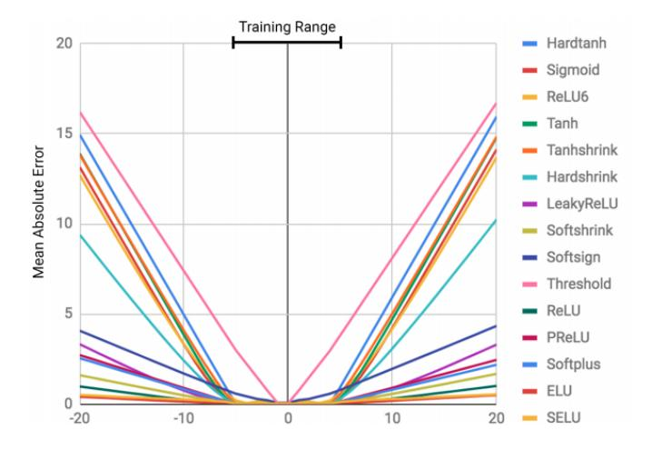

Figure 1: Outside the training range, error rapidly increases from zero for a neural network using a variety of activation functions. Taken from [20].

This weak spot hinders the ability of neural networks to learn tasks involving systematic behavior such as counting, arithmetic, problem-solving, and more in a way which generalizes outside the training distribution. Whereas a human knows rules which allows them to count arbitrarily high, or add arbitrarily large numbers, a neural network is limited to what it has seen before—it can not extrapolate to new data. One may ameliorate the issue by extending the range of training data, but this approach can only go so far. Consider GPT-3, a 175-billion-parameter natu-

ral language model[2], which astonished the community with its ability to generate hyperrealistic text. Despite containing more parameters than the human brain has neurons and being trained on a large swath of data from the internet, GPT-3 can add two digit numbers with 100% accuracy, but five digit numbers with only 10% accuracy. Simply increasing the amount of training data and the size of the network does not appear to feasible if one wishes to solve a large variety of symbolic tasks effectively.

For another example, we can consider Conway's Game of Life, a cellular automaton where cells in a grid update their state to black or white based on the state of their neighbors. If we provide a network with the "systematic rule" for predicting the state of a future cell—that a cell's state at time t+1 depends only on the neighboring cell values at time t—the problem is trivial for a neural network to learn, as it involves learning a lookup table for possible configurations of eight Boolean cells. However, if instead we task a convolutional network with predicting the next state for an entire grid at once, without the rule, then networks fail to converge to an accurate prediction that properly generalizes to arbitrary grid sizes[19].

One way to look at this failing of neural networks is that they are simply memorizing the training data. Symbolic reasoning, in contrast, consists of rules which can be applied outside the distribution: a memorized solution to addition consists of a cleverly represented lookup-table, while a symbolic solution consists of an explicit procedure which adds digit-by-digit, keeping track of the carry value as it goes—a procedure which generalizes to arbitrary input lengths. This is how humans solve symbolic tasks, and there is reason to believe AI agents need to acquire this ability to learn such procedures if they are to succeed on symbolic tasks.

A striking characterization of the interplay between symbolic reasoning and the pattern recognition done by neural networks is described in dual-process theories of reasoning[18, 8, 11] which suggest that our abilities stem from the interaction between a fast, associative system (similar to that of modern deep nets) and a slower symbolic system. Neural networks excel at conducting associative reasoning, but are not suited to conducting rule-based reasoning in their computations. Current systems fail at systematicity and generalization, having an inability to form declarative, systematic

knowledge and reason over it to solve new problems. Such an ability would be required for a machine to, for example, rediscover the scientific method, and use this method to learn new things. As such, it is an important problem to address in the design of more generally intelligent systems.

How might we combine learning of symbolic rules with machine learning to produce more capable artificial intelligence systems? This thesis attempts to make progress in this direction. To begin to solve this large challenge, it is helpful to have a benchmark that appropriately measures the ability we are seeking. Importantly, it must be designed in a way to prevent developers from hard-coding the knowledge into the system <sup>1</sup>. The Abstraction and Reasoning Corpus, developed by François Chollet and henceforth referred to as ARC, is an excellent test of this type of learning.

We present two approaches for solving ARC tasks designed to aid in both abstraction and reasoning. In Section 2, we describe the Abstraction and Reasoning Corpus. We discuss the relevance of the corpus of tasks with respect to the challenges put forward above, and outline existing work on the dataset. In Section 3 and Section 4, we develop two approaches and sets of results on ARC. The first approach involves learning abstractions of symbolic concepts out of the solutions of tasks solved so far using a program synthesis system called DreamCoder. However, the type of search DreamCoder uses to discover solutions is weak and does not scale to solving general ARC problems. To address this, the second section develops a reasoning approach for ARC motivated by the reasoning humans exhibit when discovering solutions to ARC tasks. Our approach combines execution-guided program synthesis with deductive reasoning based on inverse semantics, enabling a bidirectional program synthesis algorithm for ARC. We present preliminary results on ARC problems with this approach, as well as application to a simpler domain of solving tasks from the "24 Game" family of puzzles. We conclude in Section 5 by discussing how these two approaches can be combined as well as future research directions relevant to ARC and AI in general.

<sup>&</sup>lt;sup>1</sup>This is not as much of an issue for benchmarks involving object recognition, language generation, etc. where hard-coding a recognizer yields poor performance. In contrast, systematic tasks are by nature easier to program.

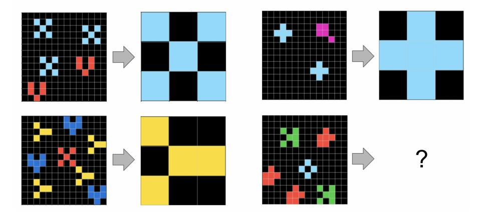

Figure 2: An example ARC task with three shown training examples and one test example. The solution might be described as "find the most common object in the input grid".

# 2 The Abstraction and Reasoning Corpus

In 2019, François Chollet released a paper "On the Measure of Intelligence" [4]. In it, Chollet argues that intelligence must be measured not as skill in a particular task, but as skill-acquisition efficiency. General intelligent systems must also have developer-aware generalization, meaning they can learn to solve problems the developer of the system has not encountered before or anticipated. As part of the paper, Chollet introduces the Abstraction and Reasoning Corpus, a benchmark he created in line with his view of measuring intelligence.

ARC consists of a training set of 400 tasks, an evaluation set of 400 tasks, and a private test set of 200 tasks. Each task consists of a 2–4 training examples and one or more test examples. Each training example is an input/output pair of grids. To solve a task, an agent must determine the relationship between input and output grids in the training examples, and use this to produce the correct output grid for each of the test examples, for which the agent is only given the input grid.

Importantly, the tasks are unique and constructed by hand so as to prevent reverse engineering any synthetic generation process. In addition, they are designed to depend on a set of human Core Knowledge inbuilt priors such as the notion of objectness, simple arithmetic abilities, symmetry, or goal-directedness.

Chollet hosted a Kaggle-competition and the winning solution, a hard-coded brute force approach, achieved only  $\sim 20\%$  performance on the private test set [1]. At the time of writing, we are not aware of any improvements upon this mark.

### 2.1 Challenges of ARC

The Abstraction and Reasoning Corpus has a number of features which make it quite a challenging benchmark. To start, since each task is a few-shot problem whose solution is symbolic and mostly rule-based, neural networks are extremely poorly equipped for the benchmark. Second, the tasks in the private test set are not from the same distribution as the tasks in the training set. This prevents a developer from succeeding by hard-coding a program that can solve tasks in the training set unless that program learns to do so from the training set itself, or does so based on some sort of universal problem-solving technique that is not tailored to the observed idiosyncrasies of the training set. Last, the search for a solution to a task may be easy for humans, but for any rule-based approach, the search quickly explodes exponentially in a way which is infeasible without close supervision.

## 2.2 Solving ARC

As laid out in the paper, ARC is best thought of as a program synthesis benchmark. The most straightforward way to approach solving a task is to seek to write a program that converts the input grid to the output grid for each training example, and then evaluate this program on the test input grids. This is the general framework we will assume. Such an approach starts with a Domain Specific Language of useful functions—in this case, the DSL could be based on the Core Knowledge priors that form the foundation of ARC. These functions are then combined to produce programs. For example, the solution to the task in Figure 2 could be written in Pythonic style as

f(in) = get\_first(sort(map(objects(in),

lambda obj: freq(obj, objects(in)))

or more simply as f(in) = most\_common\_element(get\_objects(in)). There is a trade-off here: starting with a universal (fundamentally, all we need is Turing-completeness) set of functions ensures any task solution is expressible, but solution programs may be so long that any search for them is prohibitively expensive. On the other hand, introducing specialized functions to reduce the description length of solution programs may not generalize well to the test set.

To ensure the rigor of the benchmark, Chollet organized a Kaggle competition around it. The winning solution used a brute-force approach which solves roughly 60% of the training tasks but only 20% of the private test tasks[10]. To this day, this solution remains state of the art. In the words of the winner, "Unfortunately, I don't feel like my solution itself brings us closer to AGI".

As one might expect, two important components underlying a proper solution to ARC are the ability to conduct abstraction and reasoning. We briefly showcase this through a few examples. Figure 3 demonstrates the way concepts are introduced and developed through interrelated tasks. Figure 4 shows a task whose solution requires multiple steps of reasoning to uncover.

In what follows, we will design approaches that address these two necessary components.

# 3 Abstraction

Our first approach to ARC addresses the central desire of our system: the ability to learn symbolic rules from data. To do so we use DreamCoder, a recent tool for program synthesis [7]. What follows consists of essentially applying DreamCoder as designed to ARC without any significant modifications. We show that it is well-suited to solving ARC tasks, and crucially enables the ability of learning the types of abstractions found in ARC.

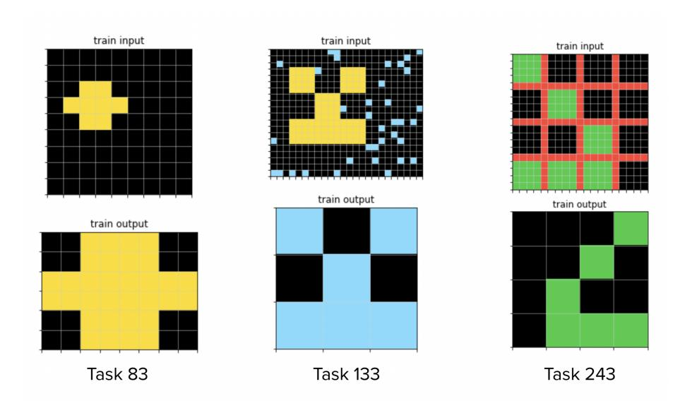

Figure 3: Abstraction: the concept of "inflation" and "deflation" is first introduced in an isolated task before being combined with other concepts (symmetry, denoising) in more challenging tasks. To solve the harder tasks, an agent must learn concepts from the simpler tasks. Each task only shows a single training example for brevity.

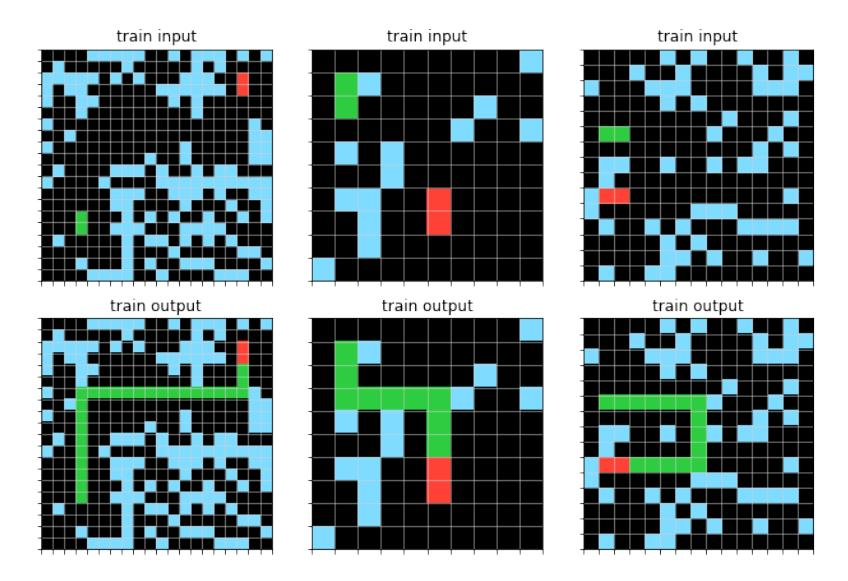

Figure 4: Reasoning: this challenging task 65 cannot be solved without a sort of step-by-step reasoning towards a solution. Reasoning on ARC is discussed further in 4. Can you solve it?

#### 3.1 DreamCoder

DreamCoder is a program synthesis engine; it solves tasks by learning to write programs which convert, in this case, the input grid into the target grid. As it solves tasks, it learns new abstractions through "compression", an algorithm which distills higher-level functions out of existing task solutions. This allows DreamCoder to solve new tasks that it would not have been able to solve with its original library. Dream-Coder also trains a neural network to learn to recognize which functions are most likely to solve a given task. Together, compression and neural-guided synthesis allow DreamCoder to gradually acquire expertise in an area. For example, it rediscovers laws of classical physics (including Newton's and Coulomb's laws) from much simpler functions, by compositionally building on concepts from those learned earlier.

As a simple example, given only an addition function, DreamCoder can learn to solve multiplication tasks through repeated addition. Then, during "compression," it refactors these multiplication programs to express them in terms of a higher-level multiplication function. This new function can be used to solve more difficult tasks such as calculating exponents or factorials.

## 3.2 Enabling Generalization through Compression

The compression component of DreamCoder is crucial to our program synthesis approach. After each iteration of attempting to solve ARC tasks, our agent looks at all of the correct programs, notices structures that were similar between different solved programs, and then re-writes new, higher-level programs based on lower-level programs.

Compression enables our agent to learn new techniques and behaviors based on the tasks it is solving, rather than being limited to the tools the developer provided it with. This type of generalization ability is at the heart of the ARC challenge — creating a machine that quickly learns to solve problems its developers might not have anticipated.

We demonstrate how the synthesizer can create more abstract concepts from existing ones in the following experiment. First, we supply our agent with six synthetic

tasks (meant to be similar to ARC tasks): drawing a line in three different directions, and moving an object in three different directions. The programs synthesized are the following:

```
(lambda (rotate_cw (draw_line_down (rotate_ccw $0)))) // draw line left (lambda (rotate_cw (move_down (rotate_ccw $0)))) // move object left (lambda (rotate_ccw (draw_line_down (rotate_cw $0)))) // draw line right (lambda (rotate_ccw (move_down (rotate_cw $0)))) // move object right (lambda (rotate_cw (rotate_cw (draw_line_down (rotate_cw (rotate_cw $0))))) // draw line up (lambda (rotate_cw (rotate_cw (move_down (rotate_cw (rotate_cw $0)))))) // move object up
```

After running the compression algorithm, the agent creates these new abstractions:

```
(lambda (lambda (rotate_cw ($0 (rotate_ccw $1))))) // apply action left (lambda (lambda (rotate_ccw ($0 (rotate_cw $1))))) // apply action right (lambda (lambda (rotate_cw (rotate_cw ($0 (rotate_cw (rotate_cw $1))))))) // apply action up
```

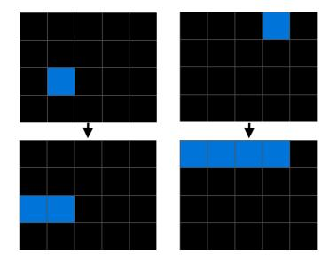

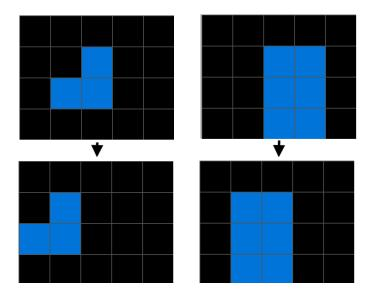

- (a) An example "draw line left" task
- (b) An example "move object left" task

Figure 5: Sample tasks involving applying an action towards the left

Thus, instead of our agent developing tunnel-vision and just becoming more and more suited to doing certain kinds of trained tasks, it is able to generalize knowledge and can then apply this knowledge to other tasks completely unrelated to drawing lines or moving objects.

### 3.3 Enabling generalization on ARC symmetry tasks

In a second experiment, we demonstrate how compression-based learning enables developer-aware generalization on the ARC dataset. We provide DreamCoder with a set of five grid-manipulation operations: flipping vertically with vertical\_flip, rotating clockwise with rotate\_cw, overlaying two grids with overlay, stacking two

grids vertically with stack\_vertically, and getting the left half of a grid with left\_half. We then train our agent on a subset of 36 ARC training tasks involving symmetry over five iterations of enumeration and compression. During each iteration, our agent attempts to solve all 36 tasks by enumerating possible programs for each task. It then runs compression to create new abstractions. During the next iteration, the agent tries to solve all tasks again within the same amount of time but equipped with the new abstractions. In this experiment, our agent solves 16 tasks before any training. After one iteration, it solves 17 in the same amount of time. After another, it solves 19 tasks, and after the final iteration, it solves 22.

After each iteration, our agent learns new abstractions which help it solve tasks that were previously too difficult. Thus, the DreamCoder compression framework enables our agent to learn interpretable, compositional abstractions not provided by the developer, such as flipping horizontally, rotating counter-clockwise, and stacking grids horizontally. It uses these new abstractions to solve progressively harder tasks. The most difficult tasks solved involve mirroring the input grid four ways, requiring a synthesized program which is extremely long when expressed in terms of the original functions. Such a program would be very difficult to discover without compression due to its length and the exponential nature of program search.

This experiment shows a promising path towards the developer-aware generalization required to succeed on the ARC dataset. In order to solve unknown tasks in the test set, our agent will need to learn from the tasks themselves. As shown in this experiment, DreamCoder is able to learn new concepts based on tasks given, which enable it to solve more difficult tasks.

### 3.4 Neural-guided synthesis

Guiding program enumeration with a neural network is a commonly used program synthesis technique to speed up search, and is included in DreamCoder's synthesis approach. We showcase the appropriateness of this approach for the ARC dataset by comparing neural-guided synthesis with brute-force enumeration on a set of artificial ARC-like tasks involving sorting blocks of various sizes. Training a neural network

| Action                   | Code                                                                                                                                                                                                                 |  |
|--------------------------|----------------------------------------------------------------------------------------------------------------------------------------------------------------------------------------------------------------------|--|
| mirror across diagonal   | lambda (rotate_cw (vertical_flip \$0)))                                                                                                                                                                              |  |
| rotate 180 degrees       | <pre>#(lambda (rotate_cw (rotate_cw (input \$0))))</pre>                                                                                                                                                             |  |
| flip horizontally        | <pre>#(lambda (rotate_cw (rotate_cw (#(lambda (vertical_flip (input \$0))) \$0))))</pre>                                                                                                                             |  |
| rotate counterclockwise  | #(lambda (rotate_cw (#(lambda (rotate_cw (rotate_cw (input \$0)))) \$0)))                                                                                                                                            |  |
| stack grids horizontally | <pre>#(lambda (lambda (#(lambda (rotate_cw (vertical_flip \$0))) (stack_vertically (#(lambda (rotate_cw (#(lambda (vertical_flip (input \$0))) \$0))) \$1) (#(lambda (rotate_cw (vertical_flip \$0))) \$0)))))</pre> |  |

Figure 6: Useful actions learned in the process of solving symmetry tasks. Pound signs represent abstractions. Abstractions may rely on others for construction; e.g. to stack grids horizontally, we reflect each input diagonally, stack vertically, and reflect the vertical stack diagonally.

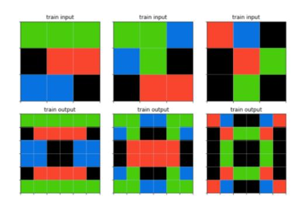

lambda (stack\_vertically (#(lambda (lambda (#(lambda (lambda (#(lambda (rotate\_cw (vertical\_flip \$0))) (stack\_vertically (#(lambda (rotate\_cw (#(lambda (vertical\_flip (input \$0))) \$0))) \$1) (#(lambda (rotate\_cw (vertical\_flip \$0))) \$0)))) \$0 (#(lambda (rotate\_cw (#(lambda (vertical\_flip (input \$0))) \$0)))) \$1)))) \$0 \$0) (vertical\_flip (#(lambda (lambda (#(lambda (lambda (#(lambda (rotate\_cw (vertical\_flip \$0))) (stack\_vertically (#(lambda (rotate\_cw (#(lambda (vertical\_flip (input \$0))) \$0)))) \$1) (#(lambda (rotate\_cw (vertical\_flip \$0))) \$0)))) \$0 \$0)))) \$0 \$0)))) \$0 \$0)))) \$0 \$0)))) \$0 \$0)))) \$0 \$0)))) \$0 \$0)))) \$0 \$0)))) \$0 \$0)))) \$0 \$0)))) \$0 \$0)))) \$0 \$0)))) \$0 \$0)))) \$0 \$0))))

Figure 7: One of the four-way mirroring tasks and the program discovered that solves it. The program was discovered only after four iterations of enumeration and compression.

improves the space of possible programs considered for a given task from O(n!) to roughly O(n) for a given program length. The network outputs a distribution over the set of functions using a convolutional network over the input/output grids. Doing so exponentially speeds up discovery of task solutions, as shown in Figure 8.

#### 3.5 Discussion

It is useful to compare the learning done in our approach to that done by neural networks. Neural networks can also learn new concepts from training examples, but

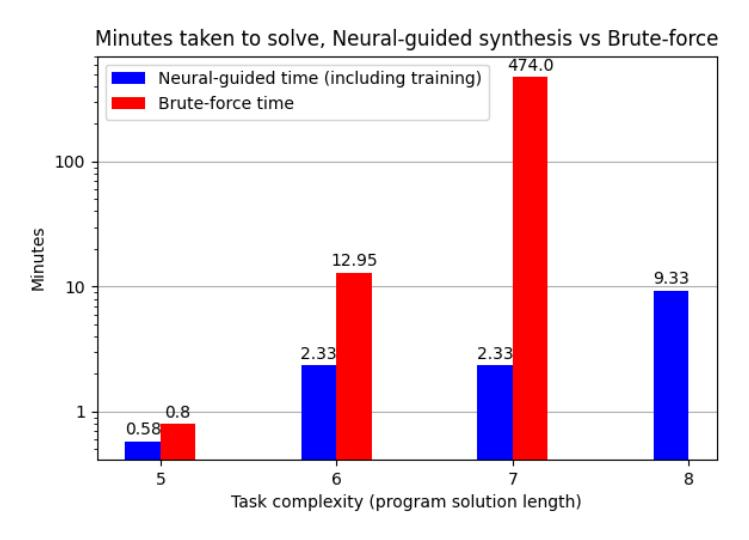

Figure 8: Using a neural net to guide synthesis exponentially improves enumeration time. Note: for program solution length 8, brute force did not complete in a reasonable time.

their internal representation lacks structure which allows them to apply learned concepts compositionally to other tasks. In contrast, functions learned via compression, represented as programs, can naturally be composed and extended to solve harder tasks, while reusing concepts between tasks. This constitutes a learning paradigm which we view as essential to human-like reasoning.

Even so, there are aspects of neural network functionality we can take advantage of. Some human priors such as object detection and denoising might be best implemented through neural networks rather than as functional programs. Incorporating neural modules into program synthesis would allow us to benefit from the advantages of neural networks, while also benefiting from the advantage of writing tasks as programs.

There is another important caveat of the approach shown here. While effective and applicable to a wide range of tasks, the neural-guided synthesis used by DreamCoder is too weak to scale to the complexity of ARC tasks. To guide search, DreamCoder uses a neural network to predict the likelihood, given a pair of functions f and g, that g will be used as argument i of function f. This form of guidance

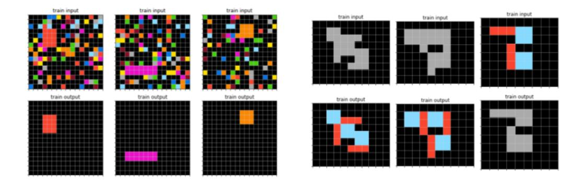

Figure 9: Left: 2 tasks involving denoising. Right: 2 tasks requiring more sophisticated reasoning.

enables fast enumeration of programs, but provides imperfect supervision for more complex problems. In particular, it does not necessarily scale well to long programs with many repeated operations. The tasks in ARC often require such programs. In the next section, we will design a new reasoning approach that incorporates neural networks to provide a more powerful form of guidance in the search for correct programs.

# 4 Reasoning

To solve ARC tasks, we need a way to imbue our agent with the ability to reason towards solutions. ARC tasks have rich visual queues that guide us towards solutions. Without enabling our agent to take full advantage of these queues, the search over possible programs becomes exhaustive and impossibly large. In addition, most ARC tasks require several steps of reasoning before discovering the solution. How can we design an approach that searches for ARC solutions the way humans do?

Let us consider some motivating examples for our approach that showcase the step-by-step reasoning we will emulate. To solve a task, one must answer the question: by what rule can we derive the output grid from input grid for each example? Consider task 173 from Figure 10. The reasoning steps to come to a solution might

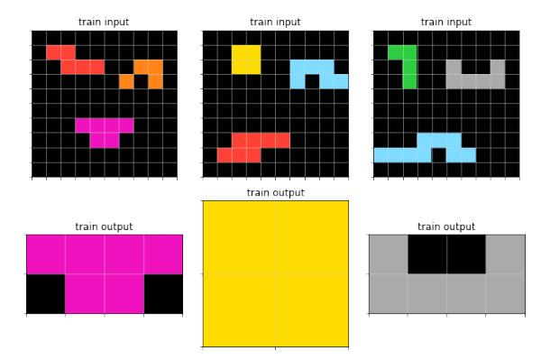

Figure 10: Task 173

#### look something like this:

- 1. Notice that the output grid is one of the objects present in the input grid.
- 2. Reframe the question: for each input grid, which object do we choose?
- 3. Solution: the object chosen in each case differs from others in its vertical symmetry.

Note how observations are conditional on the contents of both the input and output grid. In addition, it is hard to imagine discovering the solution without making the first observation.

Figure 11 shows another example, whose reasoning steps might be as follows:

- 1. Notice that the output grid consists of copies of the 3x3 input grid, arranged in a certain arrangement among a 9x9 grid.
- 2. Reframe the question: where should we place copies of the input grid?
- 3. Notice that the placement of the input grid matches the outline of a color for each grid. For example, in the first example, the diagonal of grids in the output matches the pattern of green pixels in the input.
- 4. Reframe the question: what color should we arrage our grid copies along?

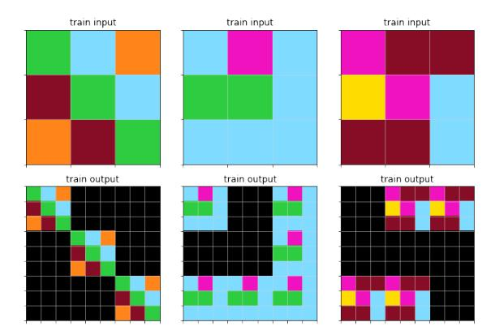

Figure 11: Task 303

5. Notice that the color matched is the most common color in the grid.

Again, note how discovery of the solution essentially relies on making these individual observations one at a time (although not necessarily in this order).

Systematizing a form of reasoning for ARC that emulates this reasoning will be based on the concept of execution-guided program synthesis.

# 4.1 Execution-guided Program Synthesis

Execution-guided program synthesis [6, 3] is a form of program synthesis where one executes partial programs to produce intermediate outputs, which help guide the creation of the full program. This ameliorates the need for a machine learning agent to internally simulate the semantics of the program being written. Humans make use of the same thing: for instance, it much easier to write out the result of a multiplication digit by digit, instead of conducting the full calculation in one's head.

The style of execution-guided synthesis applicable to ARC most closely follows that used in [6]. An example of using it applied to ARC is described in Figure 12.

This is a powerful form of neural-guided program synthesis in that each step of reasoning is conditioned on the entire state of the problem: input, output, and partial evaluations. However, it is limited to bottom-up enumeration: the leaves of the program are constructed (and evaluated) first. In contrast, the motivating reasoning

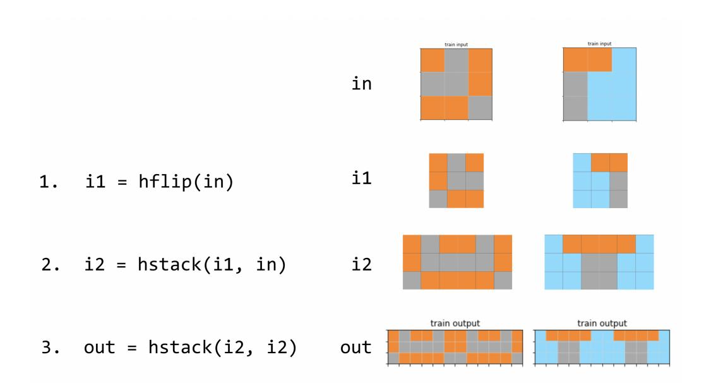

Figure 12: Solving ARC task 138 from the evaluation set with execution-guided synthesis. Conditioned on the input and output grids, the agent chooses to flip the input horizontally in step one. This action is executed to produce intermediate value i1. Next, the agent chooses to horizontally stack the intermediate value with the input grid, producing another value i2. Last, the agent horizontally stacks this value i2 with itself, correctly producing the output grid for each example and solving the task.

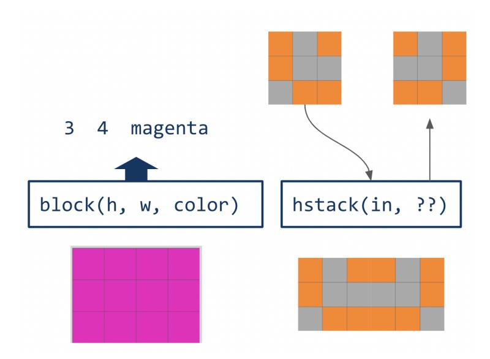

Figure 13: Left: the function block is directly invertible: given a target grid in its codomain, one can deduce what inputs are needed to produce that target. Right: the function hstack (horizontal stack) is conditionally invertible: given a valid combination of target grid and one of the inputs of the function, one can deduce the second input needed to produce the target.

steps laid out for tasks 173 and 303 involve proposing a function that is used to produce the output grid, and deducing the inputs required to correctly produce the output as new intermediate targets before discovering the complete program.

This form of deductive reasoning involves evaluating function in reverse. It is best exemplified in the FlashMeta system [15], where one leverages the inverse semantics of operators to deduce one or more inputs of a function given the output target and one or more inputs. We will incorporate this type of reasoning into an extension of execution-guided program synthesis to enable a reasoning approach for ARC tasks.

## 4.2 Deductive reasoning via inverse semantics

For our purposes, we can consider two cases.

The simplest case is when the function is invertible. In this case, we can evaluate the inverse to produce two new targets for the search, as shown in 13. The more common situation is when a function is *conditionally* invertible: given one or more inputs to the function and the output, one can deduce the remaining inputs needed such that when the function is evaluated the output is produced. A surprisingly large number of functions are conditionally invertible; perhaps the most familiar family is arithmetic operators: if we know 1 + x = 5, we can deduce that x = 4. An example relevant to ARC is shown in 13.

The deductive reasoning in our motivating examples also takes the form of conditionally invertible functions. For task 173, one might write the solution as

```
out = kronecker(in, filter_color(in, most_common_color(in)))
```

In step 1, we determine that the output is the Kronecker product of the input grid with another grid. In step 2, we deduce the second input to kronecker by means of its conditional invertibility <sup>2</sup>. Likewise, given the target grid which is the second input to kronecker, we deduce the second argument to filter\_color conditioned on the first argument being the input grid.

For task 303, one might write the solution as

```
out = filter(objects(in), lambda obj: has_vertical_symmetry(obj))
```

The conditional inverse of filter tells us whether objects in the first argument must filter to true or false. To make this fit in our deductive framework, it is convenient to have filter take a list of Boolean values as the second argument. This list of Booleans can then be produced as an intermediate target by the conditional inverse of filter, and is satisfied by mapping has\_vertical\_symmetry to the list objects(in). More details on designing a conditionally invertible DSL for ARC can be found in Appendix A.1.

### 4.3 Bidirectional, Execution-guided Program Synthesis

With the addition of the deductive reasoning powered by inverse and conditional inverse functions, we are ready to present the bidirectional, execution-guided algorithm for program synthesis. Like the approach in [6, 23], we approach the synthesis

<sup>&</sup>lt;sup>2</sup>There are some subtleties with the conditional inverse presented. The conditional inverse of kronecker is unique up to changes in color of the second argument.

task via reinforcement learning. We assume we have a grammar G of functions, each of which has an arity, a type signature, and associated inverse or conditional inverse functions. This includes constants of arity zero. For example, the subtraction function has two conditional inverses: one which produces the first argument conditioned on the second, and vice versa.

The underlying Markov Decision Process has the following components:

The current state is a graph of nodes. Each node represents either an input value, the output value, or an intermediate value resulting from the execution of an operation in the forwards or backwards direction, and has a corresponding program informing how that node is created. A node is *grounded* if there is a valid program to create that node from the operations applied so far.

For ARC, each "value" is a set of examples, each of which is a grid. Applying an operation implicitly applies the operation to each example in the set to produce a new set of examples as a new value.

An operation is a function from the grammar along with a designation of being applied in forwards, inverse, or as a conditional inverse (and if as a conditional inverse, conditioned on which input arguments). There are three types of operations: forward operations, inverse operations, and conditional inverse operations.

For an inverse operation, the sole argument will be the output value. For conditional inverse operations, the first argument is the output, and the other arguments are a subset of the inputs.

A forward operation applies the function to a set of grounded inputs to produce a new grounded node. We restrict our functions to have a single output. An invertible operation takes an ungrounded output and produces a new ungrounded target node such that grounding the target node will cause the output node to be grounded as well. A conditionally invertible operation takes an ungrounded output and one or more grounded input nodes, and produces a new ungrounded target node such that grounding the target node will cause the output node to be grounded as well. All invertible and conditionally invertible operations have a corresponding forward operation.

Multiple examples are placed in the same node. When an operation is applied, it

calculates the result for each example, and equality testing is done based on whether all examples match each other.

For a task with n input values per example and a single output value, the initial state consists of n grounded value nodes and one ungrounded target node. In general, grounded nodes correspond to those from the bottom-up side of the search, while ungrounded nodes correspond to those from the top-down side of the search.

Solving a given task thus consist of an episode in the MDP where the agent seeks to solve the task by grounding the output value node. Actions in the MDP correspond to a choice of operation and the choice of arguments for that operation. Each action applies a function in either the forward or backward direction. Intuitively, this executes a bidirectional search to try to connect the grounded nodes on one side with the ungrounded output node on the other.

The reward for solving a task is R. A penalty of -1 is applied for attempting to apply any invalid operation. Invalid operations may be caused by a number of causes, including type errors, using an ungrounded node as input to a forward function, using a grounded node as improper input to an inverse or conditional inverse function, applying an operation which creates a node that already exists, or providing an invalid argument to an operation—for example, providing 3 as the conditioning argument to the inverse of an integer multiplication op when the output is not divisible by three. We can even keep track of the type of values, and give errors for violating the type signature of functions.

Unlike [6], we refrain from garbage-collecting nodes used as arguments to a forward operation, or correspondingly garbage-collecting nodes that are the designated output of an inverse or conditional inverse operation.

Given a sequence of actions that solve a task, only the subset of the actions corresponding to the functions used in the final program are important to solve the task. We can give a shaped reward function which gives reward R/|P| to the operations used in the final program, where |P| is the length of the final program, and zero otherwise (unless a penalty is applicable). Dividing by the length of the program encourages shorter solutions. We expected this reward to work better than standard reward-to-go with exponential decay due to the more targeted feedback.

### Network and training

The neural network receives as input a set of (node\_value, node\_grounded) tuples, chooses one of O operations to apply and selects M arguments for the operation, where M is the arity of the operation. Each argument is a value node from those provided. We can constrain our network to only choose arguments whose types match the type signature of the chosen operation by automatically masking invalid options in the same manner as [23].

Our network architecture mirrors that used by [6], with a network for embedding value nodes, a deep set embedding for the set of value nodes, and a pointer network for choosing arguments to an operation.

We found the combination of supervised pretraining and fine-tuning with REIN-FORCE used in [6] to work best for training the model. An important difference is that generating random bidirectional programs is more complicated than random forward programs. To do so, we randomly apply forward operations, choose a random node among the outputs, and recover the sequence of actions used to create this node. We then convert this forward program into a bidirectional program by probabilistically converting operations at the end of the program to inverse or conditional inverse operations when applicable.

For test-time search, we stick with taking episode rollouts as they are easiest to implement. Unlike [6], we did not yet implement a value network for our system.

#### 4.4 Results

We evaluate the bidirectional algorithm on a set of 18 ARC symmetry tasks—a subset of those used in Section 3. Here, we provide our agent with six primitives shown in 1. We use a convolutional neural network to embed grid example sets. We trained on a set of randomly generated programs evaluated on random input grids from the ARC training set, and fine-tuned with REINFORCE before sampling rollouts for ten minutes on all tasks at once. The agent is able to solve 13 of 18 tasks, shown in Figure 14. Unfortunately, it struggles to scale to tasks requiring more than a few operations. The "four-way mirror" tasks solved at the end of the

| Primitive  | Description Inverse type       |                    |  |
|------------|--------------------------------|--------------------|--|
| hstack     | combine two grids horizontally | two cond. inverses |  |
| vstack     | combine two grids vertically   | two cond. inverses |  |
| rotate_cw  | rotate grid clockwise          | inverse            |  |
| rotate_ccw | rotate grid counterclockwise   | inverse            |  |
| vflip      | flip grid vertically           | inverse            |  |
| hflip      | flip grid horizontally         | inverse            |  |

Table 1: Primitives used to solve ARC symmetry tasks.

experiments in 3.3 remain unsolved, as well as two even harder tasks. For some reason we were not able to get the REINFORCE learning to consistently improve results. Here, equal performance came from using the supervised model directly, with REINFORCE yielding no improvement.

To gain more insight into the performance of a forward-only search with the new bidirectional algorithm, we evaluate the agent in a simpler domain: solving "24 Game" problems. A 24 Game consists of four input numbers and a target number 24. To solve the task, one must use each number once in an arithmetic expression that creates 24. For example, given 8, 1, 3, and 2, a solution is  $24 = (2-1) \times 3 \times 8$ . Solving a 24 problem requires similar reasoning to that solving ARC tasks: one executes various operations and tries to get "closer" to 24. We can use the conditional inverses of each arithmetic operator to facilitate a bidirectional search. For example, the conditional inverse of multiplication applied to 24 with 6 as one input yields 4 as a new target. The 24 Game serves as a good alternative benchmark of the ability of our system, and lets us measure how important the bidirectional reasoning is to system performance.<sup>3</sup>

For the supervised pretraining of our model, we train for 10,000 epochs on a dataset of randomly generated programs between depth one and four which yields 50,000 training examples of actions. Programs may create any number as a target,

<sup>&</sup>lt;sup>3</sup>24 Game is played with the rule that each number must be used exactly once in the expression to create 24. We relax this rule as it is not relevant for the program synthesis our agent is originally designed to carry out.

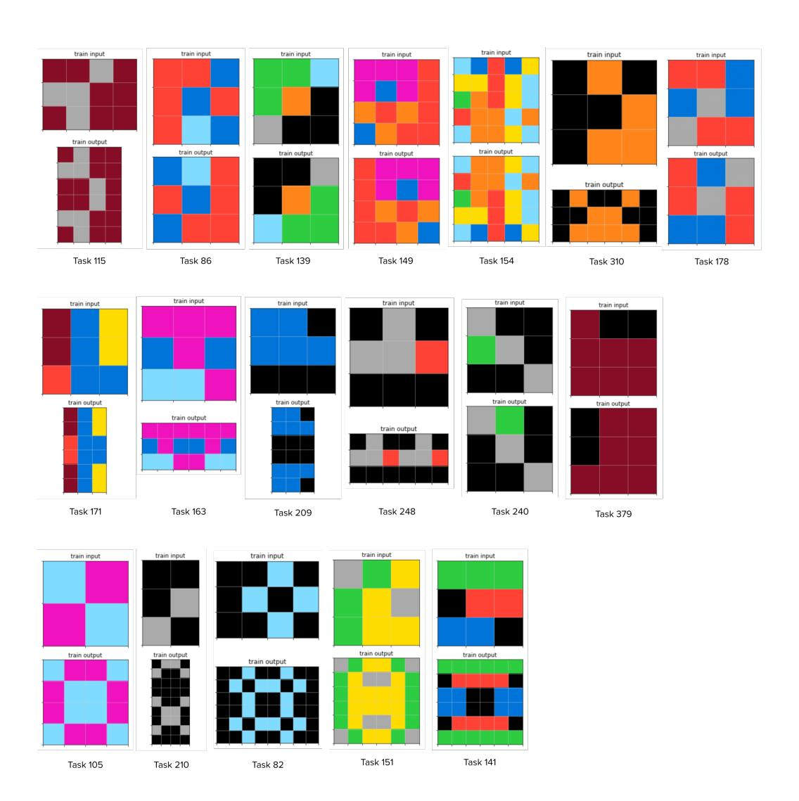

Figure 14: 19 symmetry tasks from ARC. The first two rows of tasks are simpler and manage to be solved by our agent. The last row our agent is unable to solve. One training example shown per task.

| Depth         | 1     | 2     | 3     | 4     |
|---------------|-------|-------|-------|-------|
| Forward-only  | 0.232 | 0.801 | 0.516 | 0.340 |
| Bidirectional | 0.953 | 0.929 | 0.877 | 0.853 |

Table 2: Percent of tasks solved for 24 Game. Forward-only denotes only using forward operations. Bidirectional includes conditional-inverse operations. Accuracy is average of three runs.

not just 24, with the maximum allowed integer 100, and no negative or nonintegral numbers allowed. We then fine-tune with REINFORCE for 10,000 epochs of 1000 actions taken each. We measure performance at the end of training as a function depth, and compare the full bidirectional, execution-guided algorithm with a forward-only baseline that only applies operations in the forwards direction with no inverse operations.

Results are shown in Table 2. Accuracy remains fairly high as depth increases. This is because although tasks under depth four are generated through the application of four operations, as many as 40% remain solvable in fewer than four actions. Another observation is that bidirectional synthesis outperforms forward only across all depths. However, this should be questioned: it's not clear why forward-only performance differs so much between depths. In fact, for depth one tasks, there should be no difference between forward-only and bidirectional approaches, since either way the solution takes a single action. So the disparity is likely the result of some bug rather than a meaningful difference, or peculiarities with how REINFORCE is tuning our model.

Besides bugs, there are a few reasons why learning to solve tasks with REIN-FORCE is not working as well as one might hope here. First, our hyperparameters may need to be tuned. Second, we may need to train for much longer. Compared to the number of examples seen during supervised training, the amount seen during policy gradient is quite low. This is due to the time taken to "simulate" the search graph environment while playing episodes. Last, our network architecture may need tuning or strengthening as well.

| Model            | Tasks solved |
|------------------|--------------|
| SV depth 1 FW    | 14           |
| SV depth 2 FW    | 74           |
| SV depth 3 FW    | 96           |
| SV depth 4 FW    | 45           |
| SV mixed FW      | 96           |
| SV depth 1 bidir | 66           |
| SV depth 2 bidir | 96           |
| SV depth 3 bidir | 96           |
| SV depth 4 bidir | 46           |
| SV mixed bidir   | 96           |

| Model            | Tasks solved |
|------------------|--------------|
| PG depth 1 FW    | 0            |
| PG depth 2 FW    | 15           |
| PG depth 3 FW    | 19           |
| PG depth 4 FW    | 12           |
| PG depth 1 bidir | 27           |
| PG depth 2 bidir | 39           |
| PG depth 3 bidir | 39           |
| PG depth 4 bidir | 38           |

Table 3: Number of tasks solved out of 96 by various models. SV denotes a model trained in a supervised manner. FW denotes only forward operations, while bidir denotes an agent with bidirectional search. PG denotes a model fine-tuned with REINFORCE. Fine-tuned models are pretrained on supervised data of mixed depth. Depth refers to the number of operations to solve a task; mixed combines all four depths into one.

We additionally measured performance of the agent on a set of 96 24 Game tasks, shown in Table 3. We sample tasks by taking rollouts repeatedly for 60 seconds on all 96 tasks at once. Surprisingly, the supervised models — without any REINFORCE fine-tuning — performed best, solving all 96 tasks. The fine-tuned models may be overfitting to a subset of the tasks that the models can solve, preventing proper exploration while solving the harder tasks. Incorporating entropy regularization to ameliorate this issue would be a good next step.

## 5 Discussion

As one of the first documented efforts towards developing a principled learning approach to the Abstraction and Reasoning Corpus, we have proposed and tested two directions independently. The first addresses the abstraction required for ARC; it uses the compression algorithm from DreamCoder to learn abstractions of rule-based

behavior to enable further proficiency and compositional generalization on progressively more challenging tasks. The second addresses the reasoning required for ARC; it unifies execution-guided program synthesis, a bottom-up synthesis method, with top-down deductive reasoning via inverse semantics. This enables a bidirectional program synthesis algorithm well-suited to solving tasks like those seen in ARC, and addresses the difficulties DreamCoder faces in scaling search to the level required for performance on ARC.

The next important step is to combined these two approaches to create a unified system capable of both abstraction and reasoning on ARC. Neither approach is completely sufficient on its own. Without a strong reasoning approach, DreamCoder's search algorithm is too weak to scale to challenging ARC tasks. But without the ability to create new abstractions, the bidirectional, execution-guided synthesis is limited to solving tasks via whatever functions the developer provides it with. This requires a carefully crafted DSL, which not only goes against the spirit of ARC but inevitably leads to limited performance on the hidden test set, which likely builds on functions not seen in the training or evaluation sets. Luckily, combining the two approaches is very possible: new functions created by DreamCoder's abstraction algorithm can be provided to the bidirectional search algorithm, which can use these functions to solve new tasks. In essence, we can replace DreamCoder's neural-guided search algorithm with the more powerful bidirectional, execution-guided search. Tasks solved by the bidirectional search can be given to DreamCoder's compression algorithm to produce new functions. We can then train the bidirectional algorithm to use these new functions by sampling random programs in them in a manner similar to the way DreamCoder does.

In addition to learning forward functions, it would be nice if our bidirectional agent could learn inverses and conditional inverses of new abstractions. One approach to this would be to treat these as synthesis problems of their own, sampling random inputs and tasking our system with creating a function which converts outputs into inputs, perhaps conditioned on a subset of inputs. We hope to explore these possibilities for future work.

There are a few other important further directions to consider for those interested

in making progress on ARC. An important limit of all systems developed so far is their reliance on explicit programs to represent solutions to tasks. As discussed in Section 3.5, representing solutions with neural modules rather than programs opens the door to systems that are more flexible and rely less on hard-coded reasoning systems like that described here. In the introduction, we stressed the importance of moving away from systems whose reasoning abilities are task-specific and implemented by the developer. Yet the bidirectional algorithm proposed is an example of just such a thing. Generalizing the algorithm to something more widely applicable is an important step. For example, deductive reasoning could be implemented in the form of local causality-propagating systems of neural modules.

Another direction involves addressing the vast amounts of prior knowledge humans bring to a challenge like ARC. Large generative pretrained models [2, 16] offer a potential way to incorporate prior knowledge in this manner. It remains to be seen the extent to which such models can generalize to the idiosyncratic ARC environment of discrete-colored grids, but the impressive improvements shown over the past few years indicate that betting against such models is not safe.

The difficulty of performing well on ARC without resorting to developer-provided brute-force solutions is a testament to its design as a measure of intelligence. Not only is it difficult, but its design captures the exact challenges facing us in artificial intelligence. We hope that the benchmark continues to receive attention and motivates new learning algorithms to get us closer to the development of generally intelligent machines.

## A Appendix

## A.1 A bidirectional grammar for ARC tasks

A lot of effort went into designing a set of functions suited to solving ARC tasks that facilitates bidirectional reasoning. While not used in the results shown here, we record the details to exemplify the potential of inverse semantics for ARC, and in the interest of assisting future work.

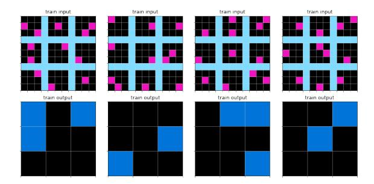

Figure 15: Task 148

Most of the operations in use are straightforward operations to get a list of objects, color in a grid, filter all but one color in a grid, set the background color, stack grids horizontally or vertically, and so on. We only address more interesting operations designed to facilitate the use of inverse functions and conditional inverse functions in an execution-guided setting.

#### A.1.1 List operations

Many list operations such as map, filter and sort take a function as an argument. Functions, however, are not well-suited for execution-guided synthesis, as one cannot evaluate intermediate constructions while making them. To address this, we can change the type signatures of the functions. To start, we allow any function to be vectorized, so that to map a function to a list, one can simply incrementally apply functions to the list. For example,

We can modify filter to take a Boolean list as a second argument instead of a Boolean function, and return only the items in the first list for whom the corresponding second element is true. Similarly, we can modify sort to take a list of integers as a second argument, and return the first list sorted using the elements of the second list as keys for comparison.

The function map is a little different. Given an input list and a target list, we can conduct a "change of basis" to create a new synthesis problem whose input/output examples are the elements of the list. For example, for task 148 (Figure 15), we might apply a forward operation to get a list of nine 3x3 grids, and an inverse operation to

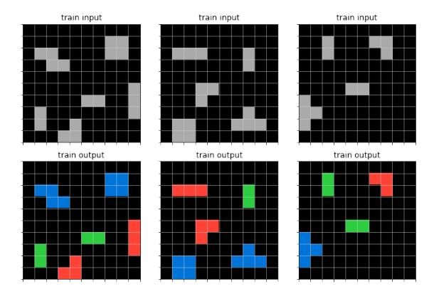

Figure 16: Task 168

get a list of nine pixels as a new target from the output grid. By applying the map change of basis, we can create a new synthesis task with 36 training examples, each of which is a pair of a 3x3 input grid and an output pixel which is black or blue. With this change of basis, one can continue to construct a solution via execution-guided synthesis.

There are other types of "change of basis" operations we can create. One example is to remap colors in the input and output grids based on frequency on a per-example basis. This is a strategy used by the winning Kaggle competition [10]. One can think of this as applying an invertible operation to the input grid in the forwards direction, and then applying its inverse to the output grid. Any invertible operation could be used in this manner. For example, we could rotate both the input and output grid clockwise<sup>4</sup>

There is one more important operation, one that formed our original motivation for designing a bidirectional approach to ARC. Consider task 168 (Figure 16). To begin, we can get a list of objects in the input and output grids. Getting a list of objects from the output can be thought of as the inverse of a function place\_into\_grid which takes a list of (positioned) objects and embeds them in a grid. If we apply a map change of basis, we then have a new task mapping grey shapes to colored versions

<sup>&</sup>lt;sup>4</sup>One way of thinking about this is that in rotating the output grid clockwise, we are applying the inverse, rotate counter-clockwise, in the backwards direction.

of themselves. We can apply the conditional inverse color\_in(grid, color) with the input grid supplied as the condiitoning argument to produce a new task: given a grid, deduce what color to color it in. If we then apply area in the forwards direction to get the area of each grid, then we get an association between integers and colors. If this were a synthesis task, the solution would be simple: it is a simple lookup: all identical inputs map to the same output. We can include a lookup operation which connects the two sides of the bidirectional search this way.

One last example, task 10, exemplifies the capabilities of bidirectional, execution-guided synthesis. In order, we can:

- Split the input into a list of objects in the forwards direction
- Apply "add gridlines" in reverse to the output to create a new target with the gridlines removed.
- Apply "inflate" in reverse (conditioned on the inflate factor, a constant 3) to produce a 3x3 grid target.
- Apply the "filter" conditional inverse: given the input list, and the target element which is a member of the list, produce a new target list of Booleans which is true for the element chosen and false otherwise.
- Apply "area" in the forwards direction to the list of objects.
- Apply "lookup" between the list of areas and the list of Booleans. The only object chosen is that with area four.

A visual demonstration of this search is shown in Figure 17.

#### A.2 Code

For code access, please reach out to Simon at simonalford42@gmail.com.

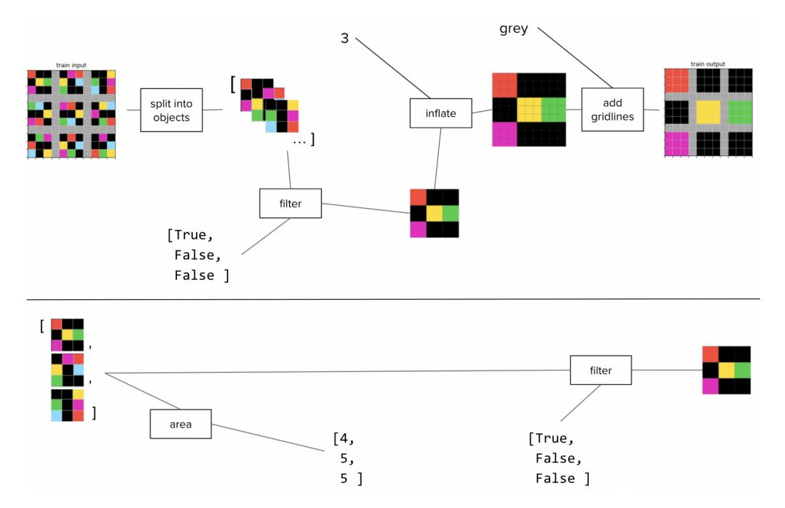

Figure 17: A demo of bidirectional search on task 10. The lower half shows the continued search after applying filter, which did not fit easily in the top diagram.

### References

- [1] top-quarks/arc-solution. https://github.com/top-quarks/ARC-solution. Accessed: 2020-10-05.
- [2] Tom B. Brown, Benjamin Mann, Nick Ryder, Melanie Subbiah, Jared Kaplan, Prafulla Dhariwal, Arvind Neelakantan, Pranav Shyam, Girish Sastry, Amanda Askell, Sandhini Agarwal, Ariel Herbert-Voss, Gretchen Krueger, Tom Henighan, Rewon Child, Aditya Ramesh, Daniel M. Ziegler, Jeffrey Wu, Clemens Winter, Christopher Hesse, Mark Chen, Eric Sigler, Mateusz Litwin, Scott Gray, Benjamin Chess, Jack Clark, Christopher Berner, Sam McCandlish, Alec Radford, Ilya Sutskever, and Dario Amodei. Language models are few-shot learners, 2020.
- [3] Xinyun Chen, Chang Liu, and Dawn Song. Execution-guided neural program synthesis. In *International Conference on Learning Representations*, 2019.
- [4] François Chollet. On the measure of intelligence, 2019.
- [5] Jacob Devlin, Ming-Wei Chang, Kenton Lee, and Kristina Toutanova. Bert: Pre-training of deep bidirectional transformers for language understanding, 2019.
- [6] Kevin Ellis, Maxwell Nye, Yewen Pu, Felix Sosa, Josh Tenenbaum, and Armando Solar-Lezama. Write, execute, assess: Program synthesis with a repl, 2019.
- [7] Kevin Ellis, Catherine Wong, Maxwell Nye, Mathias Sable-Meyer, Luc Cary, Lucas Morales, Luke Hewitt, Armando Solar-Lezama, and Joshua B. Tenenbaum. Dreamcoder: Growing generalizable, interpretable knowledge with wake-sleep bayesian program learning, 2020.
- [8] Jonathan Evans. In two minds: Dual-process accounts of reasoning. *Trends in cognitive sciences*, 7:454–9, 11 2003.

- [9] Kaiming He, Xiangyu Zhang, Shaoqing Ren, and Jian Sun. Deep residual learning for image recognition, 2015.
- [10] "icecuber". Arc-solution. https://github.com/top-quarks/ARC-solution, 2020.
- [11] Daniel Kahneman. Thinking, fast and slow. Farrar, Straus and Giroux, 2011.
- [12] Alex Krizhevsky, Ilya Sutskever, and Geoffrey E Hinton. Imagenet classification with deep convolutional neural networks. In *Advances in neural information processing systems*, pages 1097–1105, 2012.
- [13] Brenden M. Lake and Marco Baroni. Generalization without systematicity: On the compositional skills of sequence-to-sequence recurrent networks, 2018.
- [14] Volodymyr Mnih, Koray Kavukcuoglu, David Silver, Andrei A Rusu, Joel Veness, Marc G Bellemare, Alex Graves, Martin Riedmiller, Andreas K Fidjeland, Georg Ostrovski, et al. Human-level control through deep reinforcement learning. nature, 518(7540):529–533, 2015.
- [15] Oleksandr Polozov and Sumit Gulwani. Flashmeta: a framework for inductive program synthesis. In Jonathan Aldrich and Patrick Eugster, editors, OOPSLA, pages 107–126. ACM, 2015.
- [16] Aditya Ramesh, Mikhail Pavlov, Gabriel Goh, Scott Gray, Chelsea Voss, Alec Radford, Mark Chen, and Ilya Sutskever. Zero-shot text-to-image generation, 2021.
- [17] David Silver, Julian Schrittwieser, Karen Simonyan, Ioannis Antonoglou, Aja Huang, Arthur Guez, Thomas Hubert, Lucas Baker, Matthew Lai, Adrian Bolton, et al. Mastering the game of go without human knowledge. *nature*, 550(7676):354–359, 2017.
- [18] Steven A. Sloman. The empirical case for two systems of reasoning. *Psychological Bulletin*, 119:3–22, 1996.

- [19] Jacob M. Springer and Garrett T. Kenyon. It's hard for neural networks to learn the game of life, 2020.
- [20] Andrew Trask, Felix Hill, Scott E. Reed, Jack W. Rae, Chris Dyer, and Phil Blunsom. Neural arithmetic logic units. *CoRR*, abs/1808.00508, 2018.
- [21] Oriol Vinyals, Igor Babuschkin, Wojciech M Czarnecki, Michaël Mathieu, Andrew Dudzik, Junyoung Chung, David H Choi, Richard Powell, Timo Ewalds, Petko Georgiev, et al. Grandmaster level in starcraft ii using multi-agent reinforcement learning. *Nature*, 575(7782):350–354, 2019.
- [22] Po-Wei Wang, Priya L. Donti, Bryan Wilder, and Zico Kolter. Satnet: Bridging deep learning and logical reasoning using a differentiable satisfiability solver, 2019.
- [23] Chenghui Zhou, Chun-Liang Li, and Barnabas Poczos. Unsupervised program synthesis for images using tree-structured lstm, 2020.
- [24] Łukasz Kaiser and Ilya Sutskever. Neural gpus learn algorithms, 2016.