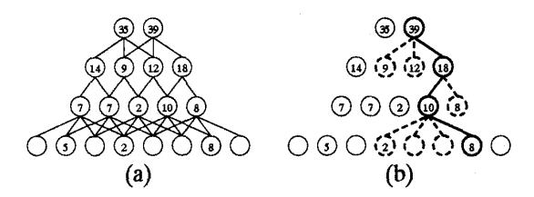
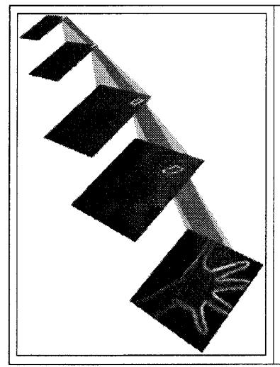
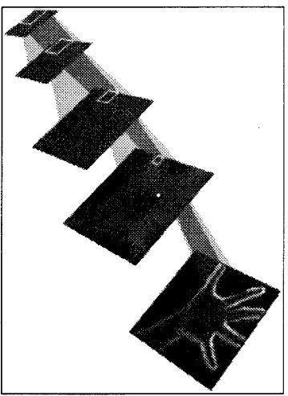
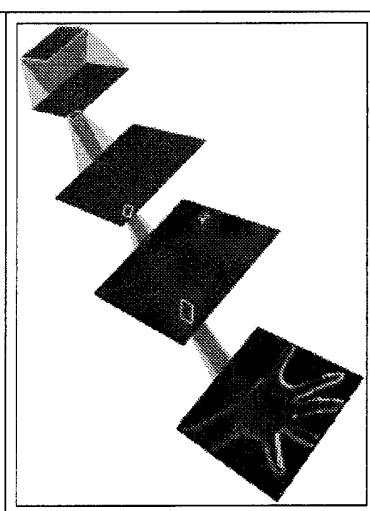
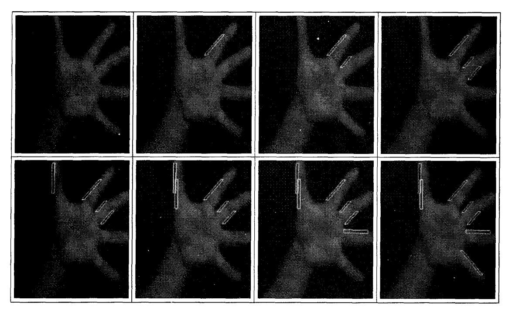

# A Prototype for Data-Driven Visual Attention

Sean M. Culhane John K. Tsotsos
Department of Computer Science, University of Toronto
Toronto, Ontario, Canada M5S 1A4.
email: culhane@vis.toronto.edu

#### Abstract

Mounting evidence suggests that attentional mechanisms may be required to successfully perform many vision tasks. This paper presents an attentional prototype for early visual processing. Our model is composed of a processing hierarchy and an attention beam that traverses the hierarchy, passing through the regions of greatest interest and inhibiting the regions that are not relevant. The type of input to the prototype is not limited to visual stimuli. Aspects of attention such as localizing spatial regions of interest and ordering their importance are addressed; other aspects of attention such as the role of task guidance are encompassed by the model but are not detailed here. Simulations using high-resolution digitized images were conducted, with oriented edge information as the input to the model. The results confirm that this prototype is both robust and fast, and promises to be essential to any real-time vision system.

#### 1 Introduction

Vision problems whose solution does not include attentional influences have been shown to be computationally intractable [18]. To ensure tractability, systems for computer vision must locate and analyze only the information essential to the current task and ignore the vast flow of irrelevant detail. This pruning of visual information is essential if any hope of real-time performance is to be realized.

Computer vision models which incorporate parallel processing are prevalent in the literature. This strategy appears appropriate for the vast amounts of input data that must be processed at the low-level [7, 21]. However, complete parallelism is not possible because it requires too many processors and connections [13, 19]. Instead, a balance must be found between processor-intensive parallel techniques and time-intensive serial techniques. One way to implement this compromise is to process all data in parallel at the early stages of vision, and then to select only part of the available data for further processing at later stages. Herein lies the role of data-directed attention: to select the output of the early visual stimuli to process. The higher stages of vision have a much smaller representation than the earlier stages, necessitating this selection process.

This paper presents an attentional prototype for early visual processing. The model consists of a processing hierarchy and an attention beam that guides selection. The beam traverses the hierarchy, passing through the regions of greatest interest and inhibiting the regions that are not relevant. Most attention schemes previously proposed are fragile with respect to the question of "scaling up" with the

problem size. However, the model presented here has been derived with a full regard of the amount of computation required. In addition, this model provides all of the details necessary to construct a full implementation that is fast and robust. Certain aspects of this model are not addressed in this paper, such as the implementation of task guidance in the attention scheme. Instead, emphasis is placed on the bottom-up dimensions of the model that localize regions of interest in the input and order these regions based on their importance. Our implemented attention beam may be used as an essential component in the building of a complete real-time computer vision system.

The simulations presented in this paper reveal the potential of this attention scheme. The speed and accuracy of our prototype are demonstrated by using actual  $256\times256$  digitized images. The mechanism's input is not limited to visual stimuli. The goal of the prototype is to select salient or "interesting" regions in the input. Saliency consists of an ordered family of features including measures such as brightness, long straight lines, motion, contrast, curvature colour, and others. For the results presented in this paper, oriented edge information is used as input to the model. Finally, relationships to existing computational models of visual attention are highlighted.

### 2 Theoretical Framework

The structure of the attention model presented in this paper is determined in part by several constraints derived from a computational complexity analysis of visual search [19]. This complexity analysis quantitatively confirms that selective attention is a major contributer in reducing the amount of computation in any vision system. Furthermore, the proposed scheme is loosely modelled after the increasing neurophysiology literature on single-cell recordings from awake and behaving primates. The general architecture of the prototype is consistent with primate visual cortex neuroanatomy [19, 20].

At the most basic level, our prototype is comprised of a hierarchical representation of the input stimuli. An attention mechanism guides selection of portions of the hierarchy from the most abstract level through to the lowest level. Spatial attentional influence is applied in a "spotlight" fashion at the top. The notion of a spotlight appears in many other models such as that of Treisman [17]. If the spotlight shines on a unit at the top of the hierarchy, however, there seems to be no mechanism for the rest of the selection to actually proceed through to the desired items to be selected. Therefore we propose a "beam": one which illuminates and

passes through the entire hierarchy. A beam "points" to a set of units at the top and then that particular beam shines throughout the processing hierarchy in such a way that it has a pass zone and a surrounding inhibit zone. The units in the pass zone are the ones that are selected. The beam expands as it traverses the hierarchy, covering all portions of the processing mechanism that directly contribute to the output at its point of entry at the top. At each level of the processing hierarchy, a winner-take-all process (WTA) is used to reduce the competing set and to determine the pass and inhibit zones [20].

# 3 The Attention Prototype

The proposed attention prototype consists of a set of hierarchical computations. The mechanism does not rely on particular types of visual stimuli; the input only considers the magnitude of the responses. Connectivity may vary between levels of the hierarchy. Each unit computes a weighted-sum of the responses from its input at the level below. The weighted response used in this paper is a simple average. In general, the distribution of weights need not be uniform and may even be different at each level. Processing proceeds as dictated by Algorithm 1. An inhibit zone and a pass zone are delineated for a beam that "shines" through all levels of the hierarchy. The pass zone permeates the winners at each level and the inhibit zone encompasses those elements at each level that competed in the WTA process. This algorithm is similar to the basic idea proposed by Koch and Ullman [8]. One important difference is that our scheme does not rely on a saliency map. Another distinction is that we use a modified WTA update rule that allows for multiple winners and converges in constant time, independent of the number of elements 1. Also, the final stage of the algorithm is not simply the routing of information as Koch and Ullman claim, but rather a recomputation using only the stimuli that were found as "winners" at the input level of the hierarchy.

- 1. Receive stimulus at the input layer.
- 2. Do 3 through 8 forever.
- Compute the remaining elements of the hierarchy based on the weighted-sum of their inputs.
- Do 5 through 6 for each level of the hierarchy, starting at the top.
- 5. Run WTA process at the current level.
- 6. Pass winner's beam to the next level.
- 7. Recompute based on winning input.
- 8. Inhibit winning input.

## Algorithm 1

For illustrative purposes, the attention scheme is described with a one-dimensional representation and pictured in Fig. 1; the extension to two dimensions is straightforward. If a simple stimulus pattern is applied to the input layer, the remaining nodes of the hierarchy will compute

their responses based on a weighted summation of their inputs, resulting in the configuration of Fig. 1(a). The first pass of the WTA scheme is shown in Fig. 1(b). This is accomplished by applying steps 5 and 6 of Algorithm 1 for each level of the hierarchy. Once an area of the input is attended to and all the desired information is extracted, then the winning inputs are inhibited and the attention process continues, "looking" for the next area.

Figure 1: A one-dimensional processing hierarchy. (a) The initial configuration. (b) The most "interesting" item is selected - the beam's pass (solid lines) and inhibit (dashed lines) zones are shown.

A number of the prototype's characteristics may be varied, including the number of levels in the processing hierarchy and the resolution of each level. The elements that compete in the WTA process are termed "receptive fields" (RF) after the physiological counterpart. In our implementation, a minimum RF (minRF) and a maximum RF (maxRF) are specified in terms of basic image units such as pixels. All rectangular RFs from  $minRF \times minRF$  to  $maxRF \times maxRF$  are computed and compete at each position in the input.

There is an issue to consider when RFs of different sizes compete. If a small RF has a response of  $\Psi$  and a larger competing RF has a response  $(\Psi - \varepsilon)$ , then for a sufficiently small  $\varepsilon$ , the larger RF should "win" over the smaller one. For instance, consider a RF  $R_1$  of size  $2 \times 2$  that has a weighted average of 212, and a competing RF  $R_2$  of size  $20 \times 20$  that has a weighted average of 210. Since  $R_2$  is 100 times the size of  $R_1$  and over 99% the intensity, it seems reasonable to favour  $R_2$  over  $R_1$ . This is accomplished by multiplying the weighted averages of all RFs by a compensating factor that is a function of the size of the RF.

#### 4 Experimental Results

We have implemented this attention prototype in software on a Silicon Graphics 4D/340 VGX. Simulations have been conducted using a wide variety of digitized 256 × 256 8-bit gray-scale images. This prototype lends itself to an implementation that is very fast, especially on hardware that supports parallel processes such as the 340 VGX. In particular, the calculation of each element in a given level of the hierarchy is independent of all other elements at the same level. Therefore, the calculation of the hierarchy may be completed in parallel for each level. Furthermore, the WTA calculations at each time iteration are independent and may be completed in parallel. In addition, the WTA process converges very quickly, typically taking less than ten iterations to determine the winner. Experimentation

 $^1\mathrm{The}$  WTA updating function and a proof of convergence are described in Tsotsos 1991 [20]

Figure 2: Processing hierarchy and inhibitory attention beam at three time intervals. The displayed input layer is the the summation of the output from a difference operator using oriented operators of 0°, 45°, 90° and 135° run on a 256 × 256 8-bit image (shown in Fig. 3). The summation of difference operators is only done for the purposes of illustration and independent processing hierarchies are maintained in the prototype for each orientation of edge operator. The beam is rooted at the highest level and "shines" through the hierarchy to the input layer. The darker portion of the attention beam is the pass zone. Once a region of the input is attended to, it is inhibited and the next "salient" area is found.

completed to date has only used brightness and edge computations as input to the prototype. Simulations of the implementation for brightness can be found in previous work [5, 6].

In the edge simulations conducted, difference operators were used to extract the edges from the input image; this choice was based on simplicity and ease of computation. Four orientations are computed by applying the appropriate difference template. Each orientation is maintained by having separate hierarchies for each orientation, but still maintaining a single overall beam. Within each orientation hierarchy, a WTA process chooses the winning RF. But then the winners from each of these separate WTA competitions compete in an additional WTA process that determines a single overall winner from among the individual hierarchy winners. This overall winning RF determines which regions of the next level of all orientation hierarchies are to compete.

With the introduction of the 45° and 135° edge operators, diagonal-shaped receptive fields are required that may incorporate the shape of the diagonal edges. In the figures to follow, the levels of the hierarchies shown are the sum of the corresponding oriented edge hierarchies. This summation is performed for display purposes only; all beam computations are performed on each of the individual hierarchies separately.

A simulation using this configuration of edge orientation information is illustrated in Fig. 2. The lowest level of each oriented processing hierarchy is the output of the corresponding difference operator passed over the digitized input image. Each successive level is a simple average of the previous level. The eventual goal is to allow arbitrary

weighted sums at each level in a neural-like way, so using an average is a simple yet good test. This averaging computation has the effect of making each level appear as a smaller "blurred" version of the previous level. The WTA process is performed at the top of each hierarchy. A second WTA process between winners of each oriented hierarchy determines one overall winner and the pass zone is dictated by that winning RF. At each successively lower level, the WTA only operates on the RFs in all oriented processing hierarchies that are connected to the winning RF region at the previous level. Once the attention beam has located the winning RF in the input level and all the information that is required is gathered from that focus of attention, the area is inhibited. The prototype then looks for the next most "interesting" area, starting by recalculating the processing hierarchy with the newly-inhibited image as its input.

Following the movement of the pass zone on the input layer for successive fixations produces scan paths like the one shown in Fig. 3. The scan paths are interesting from a computational perspective because they prioritize the order in which parts of the image are assessed. As a result, the strongest or most salient features are attended to in order of the length of the line, much like Sha'ashua and Ullman's work on saliency of curvature [16].

The attention shifts discussed throughout this paper have been *covert* forms of attention in which different regions of the visual input have been attended. It is experimentally well established that these covert attention shifts occur in humans [14]. In a similar way, the human visual system has special fast mechanisms called saccades for moving the fovea to different spatial targets (overt attention). The first systematic study of saccadic eye movements in the

Figure 3: Scan paths determined by the pass zone of the attention beam a 256  $\times$  256 8-bit image digitized image. (minRF = 5. maxRF = 100). The path displays a priority ordering in which regions of the image are assessed.

context of behaviour was done by Yarbus [22].

This set of experiments shows the benefits of maintaining multiple orientation hierarchies. A more robust implementation would be to use an edge gradient operator that gives a directional angle and then to quantize the angles and maintain a separate hierarchy for each directional range.

#### 5 Discussion

The implementation of our attention prototype has a number of important properties that make it preferable to other schemes. For example, Chapman [4] has recently implemented a system based on the idea of a pyramid model of attention introduced by Koch and Ullman [8]. Chapman's model places a log-depth tree above a saliency map. There are several difficulties with this approach, the most serious being that the focus of attention is not continuously variable. Therefore, the model cannot process real pixel based images but must utilize a prior mechanism for segmenting the objects and normalizing their sizes. Our scheme permits receptive fields of all sizes at each level, with overlap. Moreover, the time required for Chapman's model is logarithmic in the maximum number of elements, making it impractical for high-resolution images. Further, the time required to process any item in a sensory field is dependent on its location, which is contrary to recent psychological evidence [9]. In our model, constant time is required irrespective of the location of the sensory items.

Anderson and van Essen have proposed the idea of

"shifter networks" to explain attentional effects in vision [1]. This requires a two-phase process. First, a series of microshifts map the attention focus onto the nearest cortical module. Then, a series of macroshifts switches dynamically between pairs of modules at the next stage, continuing in this fashion until an attentional centre is reached. A major drawback to this scheme is that there is no apparent method for control of the size and shape of the attention focus. This is easily accomplished in our proposal due to the intrinsic nature of the beam. Also, Anderson and van Essen do not describe how the effects of nonattended regions of a receptive field are eliminated. Finally, the shifting operation is quite complex and time consuming; whether this sort of strategy can account for the extremely fast response times of human attention is unclear.

Califano, Kjeldsen and Bolle have outlined a multiresolution system in which the input is processed simultaneously at a coarse resolution throughout the image and at a finer resolution within a small "window" [3]. An attention control mechanism directs the high-resolution spot. In many respects, our scheme may be considered a more general expansion of the Califano model. Our model, however, allows for many resolutions whereas Califano's is restricted to two. Moreover, our model allows for a variable size and shape of the focus of attention, whereas both are fixed in Califano's model. The size and shape of their coarse resolution representation are also fixed. These restrictions do not allow a "shrink wrapping" around an object, as it is attended to, from coarser to finer resolutions. In contrast,

our model performs this function, which has also been observed in monkey visual cortex by Moran and Desimone [10].

Burt has developed an attention mechanism based on a multiresolution image pyramid [2]. A Gaussian pyramid is constructed by first taking the original image as the base level of the pyramid. The remaining levels are formed by first applying a low pass filter to the image below it in the pyramid, then subsampling by removing every other row and column. A Laplacian pyramid is then constructed from the Gaussian pyramid. One advantage our model has over Burt's is the ability to have arbitrary sized receptive fields. In Burt's scheme, a rudimentary fovea is formed within the Laplacian pyramid. At the lowest frequency level, the foveal region encompasses the whole image and represents the capability of peripheral vision to resolve low resolution patterns over the full field of view. At successive levels, the region in the fovea is half the field of view of the level below it. Another difference is that Burt's mechanism does not allow irrelevant regions of the image to be inhibited. Finally, his model does not allow for different saliency measures.

Several attentional schemes have been proposed by the connectionist community. Mozer describes a model of attention based on iterative relaxation [11]. Attentional selection is performed by a network of simple computing units that constructs a variable-diameter "spotlight" on the retinotopic representation. This spotlight allows sensory information within it to be preferentially processed. Sandon describes a model which also uses an iterative rule but performs the computation at several spatial scales simultaneously [15]. There are several shortcomings of iterative models such as these. One problem is that the settling time is quite sensitive to the size and nature of the image. The time required may be quite long if there are similar regions of activity that are widely separated. For example, Mozer reports that his scheme took up to 100 iterations to settle on a 36 × 6 image [12]. These schemes are clearly not suited to real-world high-resolution images

# Summary

We have argued that an attention mechanism is a necessary component of a computer vision system if it is to perform tasks in a complex, real world. A new model for visual attention was presented whose key component is an attentional beam that prunes the processing hierarchy, drastically reducing the number of computations required. The parallel nature of the hierarchy structure further increases the efficiency of this model. This efficiency was shown empirically with simulations performed on high-resolution images. The results confirm that our model is one that is highly suited for real-world vision problems.

#### Acknowledgements

This research was funded by the Information Technology Research Centre, one of the Province of Ontario Centres of Excellence, the Institute for Robotics and Intelligent Systems, a Network of Centres of Excellence of the Government of Canada, and the Natural Sciences and Engineering Research Council of Canada. The second author is the Canadian Pacific Fellow of the Canadian Institute for Advanced Research.

#### References

- C.H. Anderson and D.C. Van Essen. Shifter circuits: A computational strategy for dynamic aspects of visual processing. In *Proceedings of the National Academy of Science*, USA, volume 84, pages 6297-6301, 1987.
- [2] P.J. Burt. Attention mechanisms for vision in a dynamic world. In Proceedings of the 9th Conference on Pattern Recognition, pages 977-987, 1988.
- [3] R. Califano, A. Kjeldsen and R.M. Bolle. Data and model driven foveation. Technical Report RC 15096 (#67343), IBM Research Division - T.J. Watson Lab, 1989.
- [4] D. Chapman. Vision, Instruction and Action. PhD thesis, MIT AI Lab, Cambridge, MA, 1990. TR1204.
- [5] S.M. Culhane. Implementation of an attentional prototype for early vision. Master's thesis, University of Toronto, Toronto, Ontario, CANADA, January 1992.
- [6] S.M. Culhane and J.K. Tsotsos. An attentional prototype for early vision. In Proceedings of the 2nd European Conference on Computer Vision, Santa Margherita Ligure, Italy, 1992.
- [7] J.A. Feldman. Four frames suffice: A provisional model of vision and space. The Behavioral and Brain Sciences. 8:265-313, 1985.
- [8] C. Koch and S. Ullman. Shifts in selective visual attention: Towards the underlying neural circuitry. *Human Neurobiology*, 4:219-227, 1985.
- [9] B. Kröse and B. Julesz. The control and speed of shifts of attention. Vision Research, 29(11):1607-1619, 1989.
- [10] J. Moran and R. Desimone. Selective attention gates visual processing in the extrastriate cortex. *Science*, 229:782-784, 1985.
- [11] M.C. Mozer. A connectionist model of selective visual attention in visual perception. In Proceedings: 9th Conference of the Cognitive Science Society, pages 195-201, 1988.
- [12] M.C. Mozer. The Perception of Multiple Objects: A Connectionist Approach. MIT Press, Cambridge, MA, 1991.
- [13] U. Neisser. Cognitive Psychology. Appleton-Century-Crofts, New York, NY, 1967.
- [14] Y. Posner, M.I. Cohen and R.D. Rafal. Neural system control of spatial ordering. *Phil. Trans. R. Soc. Lond.*, B 298:187-198, 1982.
- [15] P.A. Sandon. Simulating visual attention. Journal of Cognitive Neuroscience, 2(3):213-231, 1990.
- [16] A. Sha'ashua and S. Ullman. Structure saliency: The detection of globally salient structures using a locally connected network. In *Proceedings of the Second ICCV*, pages 321–325, Tampa, FL, 1988.
- [17] A. Treisman. Preattentive processing in vision. Computer Vision, Graphics, and Image Processing, 31:156-177, 1985.
- [18] J.K. Tsotsos. The complexity of perceptual search tasks. In Proceedings, IJCAI, pages 1571-1577, Detroit, 1989.
- [19] J.K. Tsotsos. Analyzing vision at the complexity level. The Behavioral and Brain Sciences, 13:423-469, 1990.
- [20] J.K. Tsotsos. Localizing stimuli in a sensory field using an inhibitory attentional beam. Technical Report RBCV-TR-91-37, University of Toronto, 1991.
- [21] L.M. Uhr. Psychological motivation and underlying concepts. In S.L. Tanimoto and A. Klinger, editors, Structured Computer Vision. Academic Press, New York, NY, 1980.
- [22] A.L. Yarbus. Eye Movements and Vision. Plenum Press. 1967.