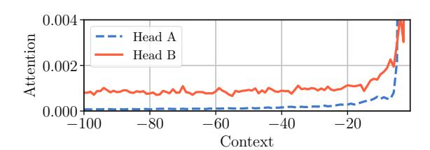
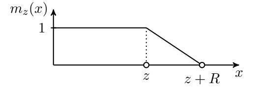
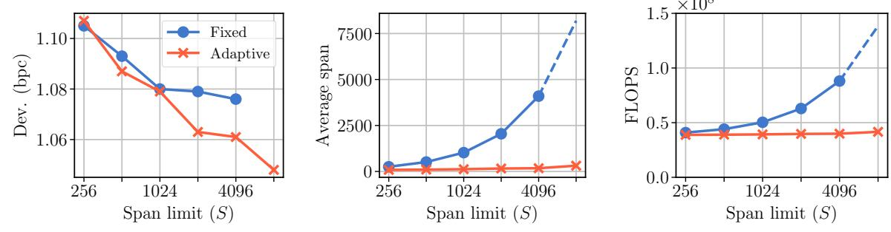
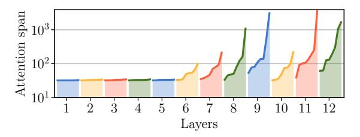
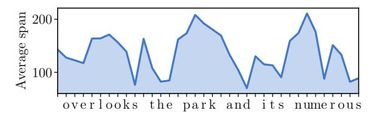

# **Adaptive Attention Span in Transformers**

## Sainbayar Sukhbaatar Edouard Grave Piotr Bojanowski Armand Joulin Facebook AI Research

{sainbar, egrave, bojanowski, ajoulin}@fb.com

#### **Abstract**

We propose a novel self-attention mechanism that can learn its optimal attention span. This allows us to extend significantly the maximum context size used in Transformer, while maintaining control over their memory footprint and computational time. We show the effectiveness of our approach on the task of character level language modeling, where we achieve state-of-the-art performances on text8 and enwiki8 by using a maximum context of 8k characters.

### 1 Introduction

Language models are at the core of many NLP applications, like machine translation or dialogue. Recently, much progress has been made by a new neural network called Transformer (Vaswani et al., 2017). Part of its success is due to its ability to capture long term dependencies. This is achieved by taking long sequences as inputs and explicitly compute the relations between every token via a mechanism called the "self-attention" layer (Al-Rfou et al., 2019).

While this layer allows for information to propagate across long distances, it has a computational and memory cost that scales quadratically with the size of the input sequence. As a consequence, Transformers hardly scale to sequences of more than a thousand tokens. This is particularly problematic in the case of character level language modeling where dependencies are often spread over a few thousands time steps.

In this work, we propose an alternative to the self-attention layer to reduce the computational burden of a Transformer. Our layer learns its optimal context size, resulting in a network where each attention layer gathers information on their own context. In practice, we observe that this leads to Transformer with small context in the low-

level layers and very large ones for the last layers. With this modification, we are able to scale input sequences to more than 8k tokens with no loss of performance, nor additional computational or memory cost. We validate our approach on the task of character level language modeling where we reach state-of-the-art performances while reducing the number of FLOPS. The code to reproduce our results is publicly available1.

### 2 Approach

### 2.1 Sequential transformer network

Language modeling is the problem of assigning a probability to a sequence of tokens  $(w_1, \ldots, w_T)$ :

$$P(w_1, \dots, w_T) = \prod_{t=1}^T P(w_t \mid w_{t-1}, \dots, w_1).$$

Recent progress was made with a new autoregressive model called Sequential Transformer (Vaswani et al., 2017). A Transformer is made of a sequence of layers that are composed of a block of parallel self-attention layers followed by a feedforward network. We refer to Vaswani et al. (2017) for the details on the structure. In this paper, we make a couple of modifications to the Transformer model: we use the relative position embeddings of Shaw et al. (2018) and the caching mechanism of Dai et al. (2019) to speed up the train and test time.

**Self-attention layer.** A core mechanism of a transformer network is the self-attention layer, which consists of multiple attention heads working in parallel. Each attention head applies the attention mechanism of Bahdanau et al. (2015) to its own input. Given a token t in a sequence, the head

Ihttps://github.com/facebookresearch/
adaptive-span

Figure 1: Attention patterns of two different heads of a standard Transformer. The two patterns are qualitatively different: Head A utilizes recent steps, while Head B has uniform attention over the context.

first computes similarities with its past, i.e., any token r in the span [t - S, t):

$$s_{tr} = \mathbf{x}_t^{\top} \mathbf{W}_q^{\top} \left( \mathbf{W}_k \mathbf{x}_r + \mathbf{p}_{t-r} \right), \tag{1}$$

where  $\mathbf{W}_k$  and  $\mathbf{W}_q$  are the "key" and "query" matrices, and  $\mathbf{p}_{t-r}$  is the relative position embedding. The attention weights are then obtained by applying a softmax function on these similarities:

$$a_{tr} = \frac{\exp(s_{tr})}{\sum_{q=t-S}^{t-1} \exp(s_{tq})},$$
 (2)

Finally, the head outputs a vector  $y_t$  by taking the average of the past representations weighted by their attention weights:

$$\mathbf{y}_t = \sum_{r=t-S}^{t-1} a_{tr} \mathbf{W}_v \mathbf{x}_r, \tag{3}$$

where  $\mathbf{W}_v$  is called the "value" matrix. Outputs from different heads are then concatenated together and multiplied by an output matrix  $\mathbf{W}_o$  before feeding to the next layer.

Similar to the memory access mechanisms of Sukhbaatar et al. (2015), it pulls information from the past to update the current token representation. Repeating this mechanism in consecutive layers allows for information to flow over long distances. However, for each input token, each attention head scales linearly in memory and time in the context size, or attention span. There are typically 12 layers with 8 heads each that processes 512 tokens simultaneously. This drastically limits the maximum attention span used in Transformers.

#### 2.2 Adaptive attention span

Each attention head of a Transformer shares the same attention span S. This assumes that every head requires the same span to form its representation. As shown in Figure 1, this assumption does not hold in the context of character level language

Figure 2: The soft mask as a function of the distance.

modeling: some heads (e.g., Head A) focus on the recent history, while others take information from the whole available context (e.g., Head B). In this section, we propose to learn the attention span of each head independently to reduce their computational and memory cost.

For each head, we add a masking function to control for the span of the attention. A masking function is a non-increasing function that maps a distance to a value in [0, 1]. We take the following soft masking function  $m_z$  parametrized by a real value z in [0, S]:

$$m_z(x) = \min \left[ \max \left[ \frac{1}{R} (R + z - x), 0 \right], 1 \right],$$

where R is a hyper-parameter that controls its softness. This soft masking function is inspired by Jernite et al. (2017). In Figure 2, we show the shape of this piecewise function as a function of the distance. The attention weights from Eq. 2 are then computed on the masked span, i.e.,

$$a_{tr} = \frac{m_z(t-r)\exp(s_{tr})}{\sum_{q=t-S}^{t-1} m_z(t-q)\exp(s_{tq})}.$$

We add a  $\ell_1$  penalization on the parameters  $z_i$  for each attention head i of the model to the loss function:

$$L = -\log P(w_1, \dots, w_T) + \frac{\lambda}{M} \sum_i z_i,$$

where  $\lambda>0$  is the regularization hyperparameter, and M is the number of heads in each layer. Our formulation is differentiable in the parameters  $z_i$  and we learn them jointly with the rest of the model.

**Dynamic attention span.** As an extension, we consider a dynamic computation approach (Graves, 2016) where the attention span dynamically change based on the current input (Luong et al., 2015; Shu and Nakayama, 2017). At a time step t, the span parameter  $z_t$  of

an attention head is then a function of the input parametrized by a vector  $\mathbf{v}$  and a scalar b, i.e.,  $z_t = S\sigma(\mathbf{v}^T\mathbf{x}_t + b)$ . We penalize  $z_t$  in the same way as before and learn the parameters  $\mathbf{v}$ , b jointly with the rest of the parameters.

### 3 Experiments

In this section, we evaluate the impact of our adaptive attention mechanism in the experimental setting of Al-Rfou et al. (2019) for character level language modeling.

**Dataset.** We use the text8 and enwik8 datasets of Mahoney (2011). The both dataset have 100M tokens. We report bit per character (bpc) on dev and test set.

Implementation details. We experiment with two sizes of models. Our small models have 12 layers and a hidden size of  $d_h = 512$ , except for the feedforward ReLU layers, which have 2048 units. The large models have 24 layers with a hidden size of  $d_h = 768$ , and a ReLU size of 4096. All models have 8 attention heads in each layer. Token and position embedding parameters are initialized from  $\mathcal{N}(0,1)$ , and the projection matrices  $\mathbf{W}_{\{q,k,v,o\}}$  are initialized from  $\mathcal{U}(-1/\sqrt{d_h},1/\sqrt{d_h})$ . A single set of position embeddings  $\mathbf{p}_t$  is shared across all the heads.

In adaptive-span models, we reprameterized the span parameter z by z=Sz', where  $z'\in[0,1]$  is initialized to 0. In dynamic-span models, the bias term b is initialized -4 to make initial spans small. We set the hyperparameters  $\lambda=2\times10^{-6}$  and R=32 for the both type of models, except  $\lambda$  is reduced to  $0.5\times10^{-6}$  when S=8192 because z was not growing longer than 4000.

We use Adagrad with a batch size of 64 and fixed learning rate of 0.07 and 32k warm-up steps. Our warm-up strategy differs from Vaswani et al. (2017): we linearly increase learning rate from zero to the final learning rate. Gradients of each module are clipped at 0.03 for better stability. At train time, we use a block of 512 consecutive characters and compute the loss and gradient for each of those 512 characters.

In small models, we apply dropout with a rate of 0.3 to the attention and the feedforward ReLU activations. We train small models for 600K steps (900K steps when S=8192), which takes about  $2\sim3$  days on 8 V100 GPUs depending on the attention span limit. Large models are trained with

a dropout rate of 0.4 until the validation performance stopped improving (250K) steps for text8 and 150K steps for enwik8), and then further trained for 20K steps with a learning rate divided by 10.

Results. In Table 1, we compare our sequential Transformer with the adaptive spans ("Adaptive-Span") of Sec. 2.2 to models of Al-Rfou et al. (2019) and Dai et al. (2019). For small models, our model outperforms the other Transformers by 0.07 bcp while significantly reducing the memory usage for large attention span. Interestingly, even with a limit on span sets to 8192, the average span is only 314. Similar results are obtained on enwik8 as shown in Table 2, where the adaptive-span model outperformed similar sized models with a significantly smaller average span. Our large models achieved state-of-the-art performances on both datasets with fewer parameters and FLOPS.

In Figure 3, we compare the fixed and adaptive span small Transformers as we increase the attention span limit S. The performance of both models improve as the limit increase (see Figure 3(left)), but the adaptive-span model benefits more from longer span. As shown on the Figure 3(center), a Transformer with adaptive spans controls its average spans, leading to reduction of up to 70% in the number of FLOPS for the inference with large spans (see Figure 3(right)).

**Impact on the attention span.** In Figure 4, we show the final attention spans of every attention heads of our small adaptive-span model with S =4096. Even though all the span sizes are initialized to the same value, we see large varieties in their final values. We can see that the lowest 5 layers have the smallest possible attention span, which is R = 32 of the masking function. This indicates that lower layers in a Transformer model do not really require a long attention span in this particular task. In contrast, few attention heads in the higher layers have very long spans, exceeding several thousand. Although there is a general tendency of higher layers having longer attention spans, it is not a simple monotonic function of the layer height.

**Impact on the number of FLOPS.** Having a smaller attention span has a direct impact on the total number of FLOPS necessary for computing one-step prediction. In a standard fixed-span

| Model                      | #layers | Avg. span | #Params | #FLOPS | dev  | test |
|----------------------------|---------|-----------|---------|--------|------|------|
| Small models               |         |           |         |        |      |      |
| T12 (Al-Rfou et al., 2019) | 12      | 512       | 44M     | 22G    | -    | 1.18 |
| Adaptive-Span ( $S=8192$ ) | 12      | 314       | 38M     | 42M    | 1.05 | 1.11 |
| Large models               |         |           |         |        |      |      |
| T64 (Al-Rfou et al., 2019) | 64      | 512       | 235M    | 120G   | 1.06 | 1.13 |
| T-XL (Dai et al., 2019)    | 24      | 3800      | 277M    | 438M   | -    | 1.08 |
| Adaptive-Span ( $S=8192$ ) | 24      | 245       | 209M    | 179M   | 1.01 | 1.07 |

Table 1: Character level language modeling on text8. We report bpc for the dev and test sets, as well as, the number of parameters, the average attention spans and total number of FLOPS (an estimate of the number of FLOPS necessary for computing one step prediction).

Figure 3: Left: validation performances improve as the attention span limit S increase (we did not train a fixed-span model with S=8192 due to memory limitation). Center: average attention span of trained models. Learning attention spans significantly reduces the average attention span. Right: the number of FLOPS during inference time grows almost linearly with S for the fixed span models. The adaptive-span models do not have this growth in #FLOPS because they have a very small attention span on average.

| Model        | #layers | #Params | #FLOPS | dev / test         |  |  |  |  |
|--------------|---------|---------|--------|--------------------|--|--|--|--|
| Small models |         |         |        |                    |  |  |  |  |
| T12          | 12      | 44M     | 22G    | - /1.11            |  |  |  |  |
| T-XL         | 12      | 41M     | 64M    | - / 1.06           |  |  |  |  |
| Adaptive     | 12      | 39M     | 41M    | 1.04 / <b>1.02</b> |  |  |  |  |
| Large models |         |         |        |                    |  |  |  |  |
| T64          | 64      | 235M    | 120G   | - / 1.06           |  |  |  |  |
| T-XL         | 18      | 88M     | 329M   | - / 1.03           |  |  |  |  |
| T-XL         | 24      | 277M    | 438M   | - / 0.99           |  |  |  |  |
| Adaptive     | 24      | 209M    | 181M   | 1.00 / <b>0.98</b> |  |  |  |  |

Table 2: Results on enwik8. The span limit is S=8192 for the adaptive-span models.

model, the total number of FLOPS is mostly controlled by the feed-forward layer (accounting for 62% of FLOPS when S=256). However, as the span increase, the attention layer dominates the computation (82% of FLOPS when S=8192), making it hard to scale to longer sequences. In contrast, the learning of an attention span keeps computation at a relatively constant level even as

Figure 4: Adaptive spans (in log-scale) of every attention heads in a 12-layer model with span limit S=4096. Few attention heads require long attention spans.

S increase as shown in Figure 3(right).

The memory usage is also dominated by the attention layer as the attention span increase. Thus, reducing the average span will also reduce the memory usage. However, because all heads in a single layer attend to common state vectors, the maximum span within each layer will determine the memory usage. The same is true for the number of FLOPS if all heads of a layer are computed together, as often done for better efficiency.

In practice, the largest fixed-span model that can fit in memory for training had a span of S=2048 (batches had to be split when S=4096), and

Figure 5: Example of average dynamic attention span as a function of the input sequence. The span is averaged over the layers and heads.

| Model                 | Avg. span | dev  |
|-----------------------|-----------|------|
| Adaptive $(S = 1024)$ | 123       | 1.08 |
| Dynamic $(S = 1024)$  | 149       | 1.08 |

Table 3: Comparison between adaptive and dynamic attention span on text8.

it took about 550ms per batch. In contrast, an adaptive-span model with a 4 times longer span of S=8192 fit in memory and took about similar time per batch.

**Dynamic span.** In Table 3, we show the adaptive and dynamic spans achieved the same performance with comparable average spans on text8. Figure 5 shows how the average dynamic span adapts to the input sequence. The span increases at the beginning of words and in the middle of composed words, e.g., to predict the "1" in "overlook".

#### 4 Conclusion

In this work, we present a novel self-attention layer with an adaptive span. This mechanism allows for models with longer context, and thus with the capability to catch longer dependencies. We have shown the importantce of this feature in the context of character level modeling where information is spread over great distances.

### References

Rami Al-Rfou, Dokook Choe, Noah Constant, Mandy Guo, and Llion Jones. 2019. Character-level language modeling with deeper self-attention. In *Proceedings of the 33rd AAAI Conference on Artificial Intelligence*.

Dzmitry Bahdanau, Kyunghyun Cho, and Yoshua Bengio. 2015. Neural machine translation by jointly learning to align and translate. In *3rd International Conference on Learning Representations, ICLR*.

Zihang Dai, Zhilin Yang, Yiming Yang, Jaime G. Carbonell, Quoc V. Le, and Ruslan Salakhutdinov. 2019. Transformer-xl: Attentive language

models beyond a fixed-length context. *CoRR*, abs/1901.02860.

Alex Graves. 2016. Adaptive computation time for recurrent neural networks. *CoRR*, abs/1603.08983.

Yacine Jernite, Edouard Grave, Armand Joulin, and Tomas Mikolov. 2017. Variable computation in recurrent neural networks. In 5th International Conference on Learning Representations, ICLR.

Thang Luong, Hieu Pham, and Christopher D. Manning. 2015. Effective approaches to attention-based neural machine translation. In *Proceedings of the 2015 Conference on Empirical Methods in Natural Language Processing, EMNLP*.

Matt Mahoney. 2011. Large text compression benchmark. *URL:* http://www.mattmahoney.net/dc/text.html.

Peter Shaw, Jakob Uszkoreit, and Ashish Vaswani. 2018. Self-attention with relative position representations. In *Proceedings of the 2018 Conference of the North American Chapter of the Association for Computational Linguistics: Human Language Technologies, NAACL-HLT.* 

Raphael Shu and Hideki Nakayama. 2017. An empirical study of adequate vision span for attention-based neural machine translation. In *Proceedings of the First Workshop on Neural Machine Translation*.

Sainbayar Sukhbaatar, Arthur Szlam, Jason Weston, and Rob Fergus. 2015. End-to-end memory networks. In *Advances in Neural Information Processing Systems* 28.

Ashish Vaswani, Noam Shazeer, Niki Parmar, Jakob Uszkoreit, Llion Jones, Aidan N. Gomez, Lukasz Kaiser, and Illia Polosukhin. 2017. Attention is all you need. In *Advances in Neural Information Processing Systems 30*.