# Adaptive patch selection to improve Vision Transformers through Reinforcement Learning

Francesco Cauteruccio1 · Michele Marchetti2 · Davide Traini3 · Domenico Ursino2 · Luca Virgili2

Accepted: 25 March 2025 / Published online: 1 April 2025 © The Author(s) 2025

#### Abstract

In recent years, Transformers have revolutionized the management of Natural Language Processing tasks, and Vision Transformers (ViTs) promise to do the same for Computer Vision ones. However, the adoption of ViTs is hampered by their computational cost. Indeed, given an image divided into patches, it is necessary to compute for each layer the attention of each patch with respect to all the others. Researchers have proposed many solutions to reduce the computational cost of attention layers by adopting techniques such as quantization, knowledge distillation and manipulation of input images. In this paper, we aim to contribute to the solution of this problem. In particular, we propose a new framework, called AgentViT, which uses Reinforcement Learning to train an agent that selects the most important patches to improve the learning of a ViT. The goal of AgentViT is to reduce the number of patches processed by a ViT, and thus its computational load, while still maintaining competitive performance. We tested AgentViT on CIFAR10, FashionMNIST, and Imagenette+ (which is a subset of ImageNet) in the image classification task and obtained promising performance when compared to baseline ViTs and other related approaches available in the literature.

**Keywords** Vision transformers · Training time reduction · Reinforcement learning · Computer vision

# 1 Introduction

In recent years, thanks to deep neural networks, Artificial Intelligence has experienced a remarkable expansion, achieving significant advances in several areas, including Natural Language Processing (NLP) and Computer Vision (CV) [1–3]. Transformers are one of the key players in this development [3]. Their architecture is based on attention blocks that

Francesco Cauteruccio fcauteruccio@unisa.it

Michele Marchetti m.marchetti@pm.univpm.it

Davide Traini davide.traini@unimore.it

Domenico Ursino d.ursino@univpm.it

- 1 DIEM, University of Salerno, Fisciano, Italy
- DII, Polytechnic University of Marche, Ancona, Italy
- 3 CHIMOMO, University of Modena and Reggio Emilia, Modena, Italy

search for semantic relationships between input elements. The way Transformers work gives them a big advantage over earlier architectures based on Recurrent Neural Networks (RNNs) and Convolutional Neural Networks (CNNs), whose performance degrades as input length increases. The first definition of Transformers was limited to NLP, but in 2021, the Vision Transformer (ViT) [4–6] was introduced, which works in the field of Computer Vision. This architecture is inspired by that of Transformer in NLP, but instead of dividing a sentence into words, it divides an image into non-overlapping rectangular patches and looks for semantic correlations between them. ViTs are highly competitive and in some cases have been shown to be superior to CNNs [4]. However, despite their promising results, ViTs face a critical limitation: their computational complexity. The selfattention mechanism in ViTs requires the computation of attention scores between all pairs of patches in each layer, resulting in high computational cost, especially as the input size increases. To overcome this problem, researchers have proposed many variants of ViTs aimed at reducing the cost of attention layers [7–11].

At the same time, Reinforcement Learning (RL) has emerged as a powerful tool in AI, demonstrating remarkable

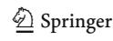

potential in a variety of domains, from robotics to intelligent transportation systems [12–17]. RL excels in environments where sequential decision-making is critical, making it a natural fit for optimization problems where tradeoffs between multiple objectives need to be explored dynamically. This motivates us to explore the use of RL as a means to mitigate the computational challenges of ViTs.

Two main strands of approaches are commonly used in the literature to reduce the computational complexity of ViTs, namely token merging and token pruning. Token merging combines tokens across ViT layers, preserving high-resolution information in the early layers, and reducing the number of tokens in the deeper layers [10, 18, 19]. In contrast, token pruning focuses on selecting a subset of tokens to reduce the overall computational load [20–22]. Despite the promising results of these approaches, they often require tradeoffs and still suffer from inherent limitations that hinder their adaptability to different datasets and tasks. Some approaches gradually reduce input resolution to reduce the number of operations, but this can lead to the loss of important fine-grained details, especially in images where important features are widely distributed.

Token pruning approaches select a subset of tokens based on predefined thresholds; however, they lack the flexibility to dynamically adjust as image complexity varies. For example, methods that rely on predefined thresholds or a fixed number of selected tokens, such as DyViT [21], may lack the flexibility to adapt dynamically to different input images. In fact, correctly classifying a complex image might require more tokens than the predefined threshold. As an example, consider an image with important details spread over a large area; it may require more tokens for accurate classification than an image in which the relevant object is confined to a smaller region. Alternative strategies, such as model compression or knowledge distillation, improve efficiency but often at the cost of reduced representational capacity and generalization.

These limitations highlight the need for a more adaptive framework that can dynamically balance efficiency and accuracy based on the characteristics of each input. In this scenario, RL provides a dynamic and adaptive framework for optimizing ViT training. By using an RL agent to learn and select the most relevant patches, we exploit the agent's ability to balance computational efficiency and model performance. Unlike static methods, RL allows for an adaptive approach where the agent learns the optimal number of tokens based on the specific characteristics of the input data. This dynamic adaptation can lead to more efficient training without compromising accuracy, as the agent continuously improves its strategy based on feedback observed during ViT training.

Following this reasoning, we propose an innovative framework, called AgentViT, for ViT optimization. As suggested

by the previous observations, our approach uses RL to reduce the computational complexity of the attention layers and, consequently, the training time of ViTs. To achieve these goals, we designed and implemented an RL agent that selects a subset of the image patches so that the ViT has to process them for its training, and thus less data than the original patches. The goal is to reduce training time while maintaining competitive performance. In addition, the use of an external agent enables transfer learning by using pre-trained weights to speed up training. The agent is trained to select relevant patches, a process that can potentially be generalized across models and tasks. Previously learned patch selection strategies can be leveraged through careful fine-tuning to adapt the agent to the new scenario. In AgentViT, we used the Double Deep Q-Learning Network (DDQN) algorithm [23]. For each training batch, the agent observes the attention values generated by the first ViT layer and selects a subset of the original patches to be used during the ViT training process. The ViT is then trained using only the selected patches. After a certain number of training iterations, the agent receives a reward based on a combination of training loss and the number of patches selected. To provide some flexibility, AgentViT allows the user to decide how much weight to assign to each of these two parameters in order to favor a set of patches that guarantees low training time or low training loss. We tested AgentViT on the CIFAR10 [24], FashionMNIST [25], and Imagenette+ datasets; the latter is a subset of the ImageNet [26] dataset. During these tests, we compared the results obtained by AgentViT with those obtained by other related approaches available in the literature taking both efficiency and classification metrics into account.

This paper is organized as follows: in Section 2, we present related work. In Section 3, we describe the proposed framework. In Section 4, we illustrate our experimental campaign aimed at testing AgentViT on different datasets with different parameter values and comparing the results obtained with those of related approaches. In Section 5, we propose a discussion of the results obtained and the implications and limitations of AgentViT. Finally, in Section 6, we draw our conclusions and look at possible future developments of our research efforts in this area.

#### 2 Related work

In this section, we present approaches already proposed in the literature that are related to our own. Specifically, in Subsection 2.1 we present RL approaches in complex environments, while in Subsection 2.2 we illustrate approaches for speeding up ViTs.

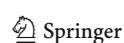

# 2.1 Reinforcement learning in complex environments

Reinforcement Learning (RL) has been widely applied in complex environments where decision-making involves sequential interactions with dynamic systems, such as robotics, autonomous systems, and generative models [27–29]. Unlike traditional supervised learning approaches that rely on large labeled datasets, RL optimizes long-term objectives by learning from rewards, making it particularly useful for fine-tuning pre-trained models, while adapting them to new constraints or feedback mechanisms.

One such example can be found in [30], where the authors integrate DWA3C, an Asynchronous Advantage Actor-Critical approach, which incorporates dynamic update weights to improve convergence speed and performance in deep RL. DWA3C improves learning efficiency by dynamically weighting updates to prevent ineffective updates from slowing learning. This enhancement is particularly valuable in high-dimensional and real-time environments, such as robotics and autonomous driving, where faster convergence results in better control, optimized decision-making, and reduced training time.

Similarly, the authors of [31] introduce four asynchronous RL algorithms to address slow convergence and instability in small-scale discrete problems. By leveraging parallel actor-learners and asynchronous updates, these algorithms improve learning efficiency, making RL more viable for real-time decision-making. The integration of eligibility traces and model-based learning further optimizes performance in resource-constrained environments.

Beyond robotics, RL has also demonstrated effectiveness in energy management. For example, the authors of [29] present a multi-agent RL approach that uses multi-agent proximal policy optimization to regulate residential power demand by coordinating air conditioners. The model optimizes consumption while maintaining indoor temperature stability, and explores hand-engineered and learned communication strategies. The study shows that localized decision-making can enhance demand response without significant infrastructure investment, contributing to autonomous, resilient power systems that improve grid stability and renewable energy integration.

In the context of generative models, RL has been used to refine text-to-image diffusion models. For example, the authors of [32] present DPOK, an RL-based fine-tuning approach that optimizes a model using policy gradient methods and human feedback-driven rewards. To maintain alignment with the pre-trained model, DPOK applies Kullback-Leibler divergence regularization. This online update mechanism continuously evaluates results, reducing biases, enhancing interpretability, and correcting distortions in ambiguous prompts.

RL has also been widely applied in computer vision, where it allows models to dynamically optimize complex tasks that require adaptive decision-making [33–35]. For instance, the authors of [36] present an RL-based approach to image classification that replaces cross-entropy loss with reward-based optimization inspired by the vanilla policy gradient method. This way of proceeding improves the robustness of the model against adversarial attacks, demonstrating superior accuracy against Fast Gradient Sign Method and AutoAttack compared to traditional training methods.

RL-based approaches have also been applied to object detection in high-resolution images, especially in remote sensing. For example, the authors of [37] propose an adaptive approach that selects spatial resolution in a two-step process. This approach first analyzes a low-resolution image to capture the global context and then selectively requests high-resolution patches for detailed object detection. This strategy significantly reduces computational cost while maintaining accuracy, and provides an efficient alternative to traditional sliding window techniques and full-resolution processing.

Another area where RL has shown remarkable effectiveness is feature selection. By dynamically optimizing feature selection, RL reduces redundancy while retaining informative features; thus, it is able to efficiently handle high-dimensional datasets and balance performance with the number of features [38–40]. For example, the authors of [41] apply a multi-agent approach based on RL for feature selection. This approach treats each feature as an agent that decides its inclusion based on statistical descriptions, autoencoders, and Graph Convolutional Networks. A tailored reward mechanism improves coordination, while generative sampling strategies and interactive exploration improve efficiency and convergence. Notably, the role of RL in feature selection aligns with its application in patch selection for image analysis. As RL identifies the most relevant features in tabular data to reduce dimensionality while preserving predictive power, it can also determine the most meaningful image regions by discarding less relevant patches; in this way, it can improve computational efficiency without significantly degrading performance. Taken together, these studies illustrate the versatility of RL across a wide range of applications demonstrating its potential to enhance decision-making in complex, high-dimensional environments.

# 2.2 Speeding up vision transformers

Several approaches have been proposed in the literature to reduce the computational load of the attention layers present in Transformers. These approaches are based on different techniques, such as quantization [42–48], pruning [49–52], low-rank factorization [53, 54] and knowledge distillation [55–60]. For example, TinyBERT [61] uses a student-teacher knowledge distillation technique where a smaller model is

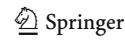

trained by the predictions of a larger model. Other approaches try to reduce the complexity of attention layers; for example, in [62] the authors replace the fully connected structure typical of the classical attention mechanism with a star topology, in which each pair of non-adjacent nodes is connected by a shared node. In [63], the authors use a sparse routing module based on k-means to reduce the overall computational complexity of attention. The authors of [64] introduce a hierarchical attention strategy; it first considers which part of the inputs should be attended, and then computes full attention in a contiguous neighborhood of the selected area. In [7], the authors propose an approach that reduces computational complexity by performing the sparse factorization of the attention matrix.

As for reducing the computational load of ViTs, [65] is one of the first attempts to apply self-supervised learning to ViTs. The authors start from the observation that a multi-stage architecture with sparse self-attention can reduce modeling complexity, but at the cost of losing the ability to capture finegrained correspondences between image regions. In [66], the authors introduce Patch-to-Cluster attention to improve the efficiency and interpretability of ViTs. This is done by learning cluster-based attention with linear complexity and improving interpretability through semantically meaningful clusters. However, the approaches most similar to ours are those that reduce the number of operations by minimizing the number of patches processed. These approaches can be divided into two main strands, focusing on token merging and token pruning, respectively; both modify the ViT input to reduce the computational cost during training and/or infer-

The first strand includes token merging approaches, where tokens are combined across multiple layers of the ViT. In general, high-resolution information is preserved in early layers to capture fine-grained details, while tokens are merged in deeper layers to reduce their number and computational requirements [67]. This process allows the ViT to achieve high performance by exploiting information in early layers and reducing computation in deeper layers. PatchMerger [10] falls into this category; it consists of a module that reduces the number of patches the network has to process by merging patches between two successive intermediate layers. This module can be used at different depths to gradually reduce the number of tokens processed by the ViT. The authors of [18] present a different approach to merging. In each layer, a soft fusion algorithm reduces the number of processed tokens; the output of this module is processed by the transformer layer and then oversampled to the original number of tokens. Another approach is ToMe [19], which is based on similarity and bipartite soft matching. This module can merge similar tokens without introducing too much overhead in computing token similarity.

The second strand concerns token pruning methods, which includes our approach. Approaches in this strand aim at reducing the number of tokens processed by the transformer layers, thus reducing the computational and memory overhead. For example, in [21], the authors propose Dynamic ViT (DyViT), a special token pruning approach that uses a set of layers trained during ViT training epochs. These layers are placed after the attention layers and select a subset of tokens that are then used in the deeper layers. The number of tokens must be set by the user, which can be disadvantageous because there is a risk of using too few tokens in complex images or too many tokens in simple images. In [20], the authors present an approach that discards unnecessary patches in a top-down paradigm. It identifies effective patches in the last layer and uses them to guide the selection of patches from previous layers. Specifically, for each layer it approximates the impact of a patch on the features of the final output and removes patches with less impact. The authors of [22] propose a token sparsification framework to progressively and dynamically prune redundant tokens based on the input. In particular, they propose a lightweight module to estimate the importance of each token based on its current features. This module is added to multiple layers to hierarchically prune the redundant tokens. In [68], the authors propose AdaViT, an adaptive computational framework that learns which patches, self-attention heads, and transformer blocks to use throughout the model depending on the input. In [8], the authors introduce Adaptive Token Sampling Vision Transformer (ATSViT), which exploits the importance of tokens to reduce computational complexity. Specifically, after computing a metric based on the attention value, ATSViT uses replacement sampling, where each token has a probability of being selected equal to the value of the metric. The main differences between ATSViT and previous approaches are the absence of additional parameters in the ViT and the dynamic computation of the number of tokens based on the input image batch, rather than being statically defined by the user. Another relevant approach is Expediting Vision Transformer (EViT) [11], which uses attention scores to evaluate the importance of each token. To reduce complexity, EViT divides tokens into three groups: attentive, semi-attentive and non-attentive tokens. The non-attentive tokens are pruned, the semi-attentive are merged, and the resulting token is concatenated with the attentive tokens.

Now that we have seen several related approaches, let us see how AgentViT compares to them. AgentViT shares with ATSViT [8] the policy of using a dynamic number of tokens based on the input images. This allows it to better adapt to the input images. However, the mechanisms used by AgentViT and ATSViT are completely different. In fact, ATSViT allows the user to specify the maximum number of tokens to be selected. Therefore, if after resampling the number of tokens

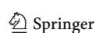

is greater than the user-defined value, some of them will still have to be discarded. Instead, AgentViT allows the user to specify the desired number of tokens and the agent is trained to select a number of tokens that is as close as possible to the number specified by the user. In particular, if it achieves a particularly low training loss, the total reward will make it understand that it is advantageous to select a lower number of tokens for that particular batch of images. On the other hand, if it achieves a high training loss for a particular batch, the reward mechanism will cause it to select a higher number of tokens than the one specified by the user. Similar to [21, 22, 68], AgentViT uses an external module to learn which patches should flow into the next layers. This feature may reduce the generality of our approach, as it requires a fine-tuning cycle to be applied to a specific ViT.

Unlike previously mentioned methods such as ATSViT and ToMe, the use of an external agent allows AgentViT to leverage transfer learning by using the weights of a pre-trained agent, thus speeding up the training process. Specifically, our approach involves training the agent to select a subset of relevant patches, a task that remains consistent across different models and datasets. As a result, once the agent has been trained to select patches in a particular task or model, it can be reused and adapted for different models or tasks after a careful fine-tuning. This feature allows our agent to be more adaptable to the dataset. In contrast, the aforementioned approaches use attention values and similarity between embeddings, which in some cases could lead to suboptimal selections due to their heuristic nature. In contrast, AgentViT dynamically learns the best subset of patches based on the specific characteristics of the dataset, rather than relying on predefined rules or fixed attention patterns.

#### 3 Description of AgentVIT

In this section, we present the details of AgentViT. Specifically, in Subsection 3.1 we propose an overview of the RL scenario and show a schematic workflow of our framework. In Subsection 3.2, we define the states of our RL environment. In Subsection 3.3, we describe the actions that our agent can perform. In Subsection 3.4 we illustrate the reward function used to train our agent. Finally, in Subsection 3.5 we discuss the convergence of the proposed method.

# 3.1 Schematic workflow of AgentViT

Like many RL approaches [69], AgentViT employs a Markov Decision Process (MDP)  $\mathcal{M} = \langle \mathcal{S}, \mathcal{A}, \mathcal{R}, \mathcal{P}, \gamma \rangle$ , with a state space  $\mathcal{S}$ , a discrete set of actions  $\mathcal{A}$ , a reward function  $\mathcal{R}: \mathcal{S} \times \mathcal{A} \to \mathbb{R}$ , a transition kernel  $\mathcal{P}: \mathcal{S} \times \mathcal{A} \to \mathcal{S}$ , and a discount factor  $\gamma \in [0, 1)$ . In an MDP, a stationary policy  $\pi: \mathcal{S} \to \mathcal{A}$  is a mapping from states to actions; it indicates

the action taken by an agent when it is in a given state. It is used to describe how an agent interacts with the environment. Specifically, we describe the state space  $\mathcal S$  in Subsection 3.2, present the action space  $\mathcal A$  in Subsection 3.3, and finally illustrate the reward formulation  $\mathcal R$  in Subsection 3.4.

To estimate the expected cumulative reward that an agent can obtain from a particular state-action pair (s, a) with  $s \in \mathcal{S}$  and  $a \in \mathcal{A}$ , we employ an Action Value Function Q(s, a) introduced in Q-Learning [70]. It represents the expected cumulative reward that the agent can achieve starting from state s, taking action a, and then following a certain policy  $\pi$  for the next decisions. The Q-value Q(s, a) can be defined recursively using the Bellman equation [71] as follows:

$$Q(s, a) = \mathbb{E}\left[\mathcal{R}_{s, a} + \gamma \cdot \max_{a' \in \mathcal{A}} Q(s^*, a')\right]$$
(3.1)

where:

- $\bullet$   $\mathbb{E}$  denotes the expected value.
- Rs,a is the reward obtained for the state s, after executing the action a.
- $\gamma$  is the discount factor, which represents the importance of reward immediacy. Specifically, if  $\gamma=0$ , actions that produce an immediate reward are more important than the others. If  $\gamma=1$ , all rewards have equal weight, regardless of when they are obtained; this favors a long-term view.
- s\* is the next state, i.e., the state in which the agent arrives by starting from s and executing the action a.

This equation specifies that the Q-value associated with the pair (s, a) and relative to the policy  $\pi$  is a function of the reward obtained after taking the action a and the cumulative reward associated with the next state  $s^*$  when the best action  $a' \in \mathcal{A}$  is taken in it. The weight of the reward associated with the action a and the ones associated with the next state are determined by the discount factor  $\gamma$ .

The Q-Learning algorithm uses a table that consists of a number of rows equal to the number of observable states and a number of columns equal to the number of possible actions. During the execution of the algorithm, the values in the table are updated by means of the formula given in (3.2). This formula allows the cumulative rewards associated with each pair Q(s, a) to be obtained recursively:

$$Q(s, a) \leftarrow Q(s, a) + \eta \cdot \left[ \mathcal{R}_{s, a} + \gamma \cdot \max_{a' \in \mathcal{A}} (Q(s^*, a')) - Q(s, a) \right]$$
(3.2)

Here:

- $\eta$  is the learning rate; it is a number in the real interval [0, 1], which specifies the rate at which the agent learns;
- $\gamma$  and  $s^*$  have been introduced above.

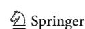

This algorithm struggles when the number of states is high or when the states involved are continuous. In these cases the table is replaced by a neural network, which is referred to as Deep O-Network. It receives the vector representing the state s and computes the Q-values associated with each pair  $(s, a^*)$ , where  $a^*$  represents any action that the agent can perform in the state s. The agent selects the action with the highest Q-value. The DQN algorithm, which uses the same neural network to both select and evaluate actions, is prone to overestimation because of the maximization step [72]. In this step, the action with the highest predicted Qvalue is selected, and the network is simultaneously used to estimate the value of that selected action. This dual use of a single network tends to amplify noise and inaccuracies in the value estimation, leading to systematic overestimation of Q-values. To mitigate this bias, we used the Double Deep Q-Network (DDQN) [23], which decouples the selection of actions from their evaluation. Instead of relying on a single network for both processes, DDQN uses two separate neural networks. The Q-Network selects the action by identifying the highest Q-value, while a secondary target network is used to evaluate the value of that action. This separation reduces the bias introduced during the maximization step, resulting in a more accurate Q-value estimation and, consequently, a more stable and reliable learning policy. Other possible RL algorithms designed to optimize decision-making in dynamic environments are Proximal Policy Optimization (PPO) [73] and Advantage Actor-Critic (A2C) [74], which refine policy gradient methods to improve stability and efficiency in learning complex strategies. These algorithms favor exploration over exploitation, making them well-suited for environments that require extensive strategic planning and adaptability. However, in structured tasks with clear reward pathways, their efficiency may be suboptimal due to longer training times and the necessity to fine-tune hyperparameters to balance performance and stability. In particular, A2C is highly sensitive to the choice of learning rate, as small variations in it can lead to either slow convergence or instability, making it more challenging to tune effectively [75].

In our case, we chose DDQN over PPO and A2C because of its superior learning efficiency and adaptability. DDQN effectively mitigates overestimation bias by using a separate target network, resulting in more stable learning dynamics and improved convergence rates. In addition, its experience replay mechanism allows the agent to better generalize by learning from a diverse set of past experiences, reducing overfitting to specific trajectories. Unlike PPO and A2C, which often require extensive fine-tuning to achieve optimal results, DDQN proves resilient to changes in hyperparameters, making it a more practical and efficient choice. In structured environments like our scenario, where immediate rewards and well-defined strategies play a key role, DDQN's abil-

ity to quickly assimilate optimal policies while maintaining computational efficiency makes it the preferred approach. In Section 4.4.1, we compare the performance of DDQN and PPO when applied to AgentViT.

Figure 1 details the workflow that describes the behavior of AgentViT.

As shown in Fig. 1, there are two basic components in AgentViT, namely a ViT and the agent, which consists of a pair of networks implementing the DDQN algorithm. Specifically:

- In (i), the image flows through the first ViT layer, where we extract the output of the attention layer and compute a vector in which each element represents the average attention value of a patch. This vector corresponds to a state in the agent environment.
- In (ii), the agent receives the state representation s, consisting of the attention values of the N patches, and computes the corresponding Q-values  $Q(s, a_i)$  for each of the N possible actions  $a_i$ , where each action corresponds to the selection of a specific patch. Rather than selecting a single action per step and iteratively updating the state, we adopt a batch action selection approach to ensure greater efficiency. This approach is described in detail in the next sections.
- In (iii), the selected patches flow from the second to the last layer of the ViT.
- In (iv), the reward of the agent after the classification step is calculated as a combination of the number of selected patches and the training loss. The Deep Q-Network uses this reward to tune its behavior for the next step.

This process is repeated for each image in the training set and for each epoch defined by the user. It is also important to note that the agent does not iteratively update the state-action space after each selection of patches but instead determines the set of retained patches in a single step. Specifically, the Qnetwork evaluates the importance of each patch and selects those with Q-values exceeding the mean Q-value across all patches. This approach significantly reduces the computational overhead while maintaining flexibility in patch selection.

The main strength of RL is its ability to balance short-term and long-term objectives by optimizing a cumulative reward function. In the short term, the agent seeks to reduce the number of patches processed per training iteration, which leads to an immediate reduction in computational complexity. However, pruning can degrade the performance of the model by discarding informative patches. The RL agent mitigates this risk by continuously updating its value function, which estimates the expected benefit of retaining or discarding specific patches based on observed outcomes. Through

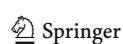

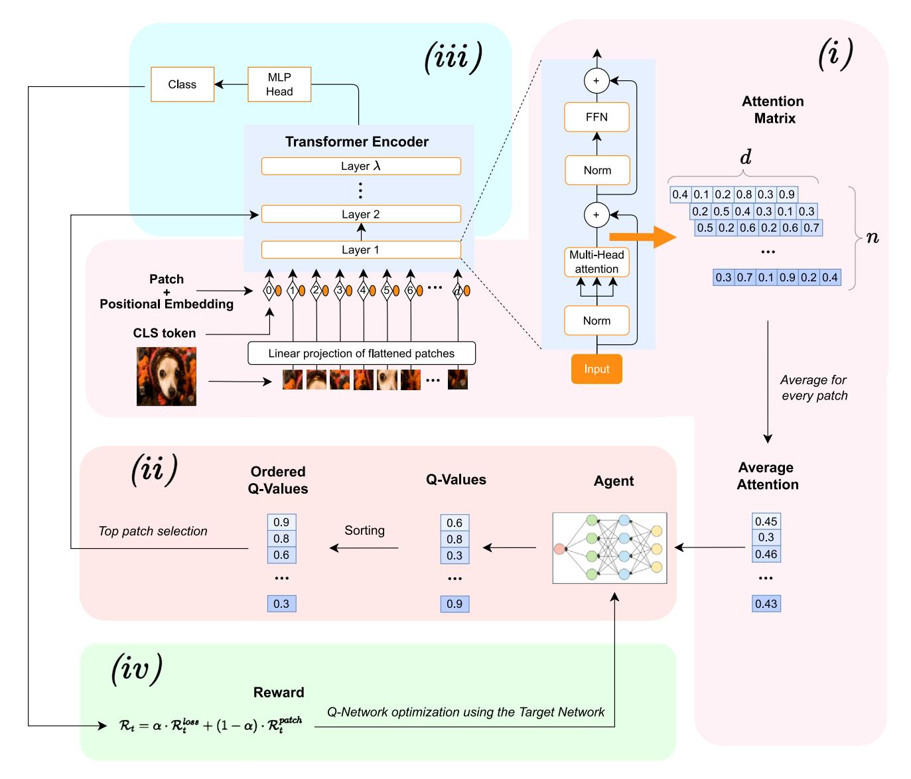

**Fig. 1** AgentViT workflow. AgentViT consists of a ViT and a DDQN-based agent. (i) The image is processed by the first ViT layer, where attention values are extracted and an average attention value per patch is computed to form the state representation. (ii) The agent computes Q-values for each patch and only patches with Q-values greater than

the mean are selected. (iii) The selected patches are propagated through the remaining ViT layers. (iv) The agent receives a reward based on the number of patches selected and the training classification loss, thus refining its policy during training iterations

iterative exploration and exploitation, the agent refines its patch selection strategy to converge on an optimal tradeoff between efficiency and accuracy.

The RL-based patch selection method can theoretically be viewed as an optimal sequential decision-making process where the agent dynamically adjusts its policy to maximize the cumulative reward over time. Unlike static or heuristic approaches that rely on predefined rules, the RL agent models patch selection as a stochastic optimization problem, in which the state of the system evolves based on the decisions made at each step. The theoretical advantage of this approach lies in its ability to learn an adaptive policy that optimally

selects patches based on their contribution to model accuracy while minimizing computational overhead. In addition, the RL agent's reward function acts as a self-regulating mechanism that ensures generalization across different datasets and ViT architectures. By incorporating both accuracy-driven and efficiency-driven reward terms, the agent autonomously discovers the best patch selection policy, avoiding both overpruning (which would reduce accuracy) and under-pruning (which would lead to computational waste). The use of replay memory and structured exploration strategies ensures that the agent does not converge to suboptimal local minima but instead refines its policy over successive training iterations.

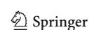

In the next subsections, we will explain in detail the components of the algorithm underlying AgentViT.

#### 3.2 State

In the context of the Markov Decision Process, on which the RL mechanism underlying AgentViT is based, a state  $s \in \mathcal{S}$  observed by the agent is represented by a vector of N real values, which models the current conditions of the environment. In AgentViT, the state of the environment is represented by attention values obtained from an image processed by the first attention layer of the ViT. Specifically, each element represents the average attention score assigned to the corresponding image patch by the first attention layer of the ViT. Formally speaking, given an input image decomposed into N patches, the output of the first attention layer generates an attention matrix of size  $N \times d$ , where d is the embedding size. We then aggregate these attention values over the d dimensions to obtain a state representation. Formally, this can be represented as:

$$s = (s_1, s_2, \dots, s_N), \text{ where } s_i = \frac{1}{d} \sum_{j=1}^d A_{ij}$$
 (3.3)

In this formula  $A_{ij}$  represents the attention value assigned to patch i in the j-th dimension. Essentially, this vector represents the average attention value (and therefore importance) given to the patches by the attention layer, as well as the state given as input to the Deep Q-Network of AgentViT.

## 3.3 Action

The action space  $\mathcal{A}$  of AgentViT consists of N discrete actions, each corresponding to the selection of a specific patch. Formally, an action  $a_i \in \mathcal{A}$  represents the decision to retain the i-patch for further processing. Unlike standard sequential decision-making frameworks that iteratively update the state with each action [76], we decide to optimize efficiency by selecting a batch of actions in a single step. In the following, we first illustrate the general idea behind this process and then explain each step in detail.

The first step of the patch selection mechanism regards the Q-network. It starts by computing the Q-values for all possible actions  $a_i$ , where  $i=1,\ldots,N$ . Then, the patches corresponding to actions with a Q-value greater than the mean Q-value across all actions are selected. Formally, this can be expressed as:

$$\mathcal{A}' = \{ a_i \in \mathcal{A} \mid Q(s, a_i) > \frac{1}{N} \sum_{j=1}^{N} Q(s, a_j) \}$$
 (3.4)

Indeed, selecting only one patch per image is not sufficient to effectively train a ViT, as it happens in the classic

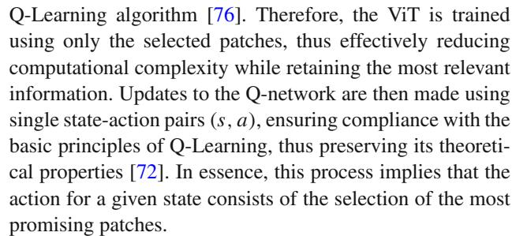

The transition kernel function  $\mathcal{P}$  (see Section 3.1), which maps a given state-action pair to a new state, follows the classical framework of Deep Q-Learning. Specifically, after the agent has chosen an action  $a \in \mathcal{A}$  and received a reward  $\mathcal{R}_{s,a}$ , the Q-value associated with the state s and the action a is updated by means of the following formula [70]:

$$Q(s, a) \leftarrow Q(s, a) + \eta \cdot \left[ \mathcal{L}_{H}(\mathcal{R}_{s, a} + \gamma \cdot \max_{a' \in \mathcal{A}} (Q(s^*, a')), Q(s, a)) \right]$$
(3.5)

Similar to (3.2), this formula updates the Q-value for the pair (s, a) by taking into account the previous Q-value and the difference between the maximum cumulative reward for the next state  $s^*$  and the current Q-value. Instead of using a simple algebraic difference, we use the Huber loss function  $\mathcal{L}_H$  [77], chosen for its robustness to outliers and its ability to prevent gradient explosion in some cases. The cumulative reward for the next state is predicted by the Target Network, following the DDQN algorithm [23]. The Target Network is an exact replica of the Q-Network, but its weights are not updated by backpropagation; instead, they are updated periodically using a soft-copy mechanism. As discussed in Section 3.1, this approach stabilizes the learning process.

In addition, AgentViT is provided with a mechanism to avoid falling into a local optimum. In fact, with a probability equal to  $\epsilon$ , the agent, instead of choosing the action that maximizes the value of Q, chooses a random action. To avoid excessive instability, the value of  $\epsilon$  decays exponentially as training proceeds. This mechanism ensures a good exploratory capability in the early stages of training, while also maintaining stable AgentViT performance as the ViT progresses through its training stages.

Finally, to improve the generalizability of AgentViT, we leverage a replay memory [78, 79]. It stores observed data, allowing the agent to reuse past experience during training. In this way, we help break unwanted temporal correlations in the data, ensuring that the model learns from a more diverse and representative set of experiences, which ultimately leads to more robust and stable learning outcomes.

# 3.4 Reward

Since the ultimate goal of AgentViT is to improve the training of the ViT, the reward  $\mathcal{R}_t$  obtained at iteration t starting

from a state  $s_t$  and performing an action  $a_t$  must consider the goodness of training. We mentioned above that this goodness must take into account both the time necessary for training and the corresponding accuracy. Therefore  $\mathcal{R}_t$  must consider both training loss and training time. However, training time is affected by several factors, including the number of operations performed, server load, and other uncontrollable variables related to the machine running the ViT. Therefore, we decided to use the number of patches selected by the agent in the reward calculation, as this serves as a simple proxy for estimating the number of operations performed by the ViT. Thus, the reward  $\mathcal{R}_t$  is a weighted mean of the training loss and the number of patches selected by the agent. It is worth noting that we deliberately chose not to include validation loss or test loss in the reward function, as this would have led to overfitting and compromised generalization. In fact, the RL agent only controls patch selection on training images, as its goal is to support ViT training. It has no direct influence on the validation or test images. The inclusion of validation loss or test loss could negatively affect the learning of the RL agent by introducing a non-stationary reward function, since their fluctuations over time are independent of the actions of the RL agent. This would result in an inconsistent expected reward distribution for each action, which would ultimately destabilize the learning process.

Therefore, our reward function  $\mathcal{R}_t$  is formally defined as:

$$\mathcal{R}_t = \alpha \cdot \mathcal{R}_t^{loss} + (1 - \alpha) \cdot \mathcal{R}_t^{patch}$$
(3.6)

where:

- $\mathcal{R}_t^{loss}$  is the reward related to the training loss;
- $\mathcal{R}_{t}^{patch}$  is the reward related to the number of patches;
- $\alpha$  is a value belonging to the real interval [0, 1], used to determine the weight to assign to  $\mathcal{R}_t^{loss}$  with respect to  $\mathcal{R}_t^{patch}$ .

 $\mathcal{R}_t^{loss}$  is obtained by computing the ratio between the value  $\mathcal{L}(0)$  of the loss function at the starting iteration and the value  $\mathcal{L}(t)$  of the same function at iteration t. Formally speaking:

$$\mathcal{R}_{t}^{loss} = \frac{\mathcal{L}(0)}{\mathcal{L}(t)} \tag{3.7}$$

 $\mathcal{R}_t^{patch}$  can be defined by means of a fraction; the numerator represents the difference between the number of patches selected by the agent and the number of selected patches desired by the user; the denominator indicates the number of selected patches desired by the user. Formally speaking:

$$\mathcal{R}_{t}^{patch} = \frac{|m - \mu|}{\mu} \tag{3.8}$$

Here:

- *m* is a positive integer indicating the number of patches selected by the agent at iteration *t*;
- μ is a positive integer denoting the number of selected patches desired by the user; if she does not specify any value, μ is set to 1 by default.

The agent is incentivized to select a number of patches close to the value specified by the user, or a very small number if she has not specified any value. It is also incentivized to choose a subset of the patches such that the training loss is minimized.  $\mathcal{R}_t^{loss}$  and  $\mathcal{R}_t^{patch}$  are weighted so that the user can specify how much importance to give to each of them. Finally, the weighting parameter  $\alpha$  is essential in AgentViT because it controls the tradeoff between accuracy and computational efficiency. A well-chosen value of  $\alpha$  ensures effective patch selection, while an improper value may lead to suboptimal learning, either by giving too much priority to efficiency or by retaining too many patches, and thus negatively affecting efficiency. When  $\alpha$  is close to 1, the reward function favors minimizing training loss, which leads the agent to retain more patches. This ensures a richer feature extraction, but increases the computational cost. If  $\alpha$  is too high, patch reduction may be ineffective, which would make AgentViT as costly as a standard ViT. Conversely, when  $\alpha$  is close to 0, the agent aggressively prunes patches to improve efficiency. This reduces the computational overhead but risks discarding important information, potentially degrading classification accuracy and generalization across datasets.

The choice of  $\alpha$  can be seen as a multi-objective optimization problem, where two conflicting objectives must be balanced, namely computational efficiency and classification accuracy. These two objectives are inherently conflicting because reducing computational cost typically requires selecting fewer patches, which can lead to a loss of accuracy, while preserving accuracy often requires processing more patches, which leads to increased computational complexity. This tradeoff can be visualized as a Pareto front. In this context, one axis of the Pareto front corresponds to computational efficiency, while the other axis represents classification accuracy. The choice of  $\alpha$  determines where AgentViT operates along this Pareto front. The optimal  $\alpha$  lies at a point on the Pareto front where both objectives are balanced, maximizing the overall performance of the model.

A further consideration regarding reward concerns the frequency f with which it is assigned to the agent. In fact, f indicates the number of iterations that must elapse before the reward is assigned to the agent. Clearly, the value of f is greater than or equal to 1. The frequency f can affect the performance of AgentViT. If f=1 the agent receives the reward after every action, and thus it is continuously updated on the consequences of its choices. This helps to improve

accuracy but increases the computational load of AgentViT, and consequently the training time. Conversely, a high value of f reduces the training time but may affect accuracy negatively. Clearly, a tradeoff between these two requirements is necessary, as we will see in Section 4.3.

Finally, we emphasize that the overall framework is designed to support the integration of additional terms into the reward function. Thus, if another task beyond classification needs to be addressed, requiring a more sophisticated solution, a user can directly modify the reward function by adding the necessary terms while leaving the rest of the framework unchanged. This flexibility allows users to adapt AgentViT to tasks beyond the scope of this paper while preserving its core structure.

### 3.5 Considerations on convergence and optimality

At this point, after illustrating how our approach works, some considerations about convergence and optimality are in order. First, consider that our approach is based on DDQN, which is a well-established RL method that mitigates Qvalue overestimation by using a separate target network [23]. The theoretical convergence properties of DDQN have been extensively studied in previous literature, and DDQN has been found to guarantee convergence under standard conditions, such as a sufficiently large replay buffer to ensure different training samples, and a learning rate that ensures stability during Q-network updates. While a formal proof of convergence is beyond the scope of this paper, we rely on the fact that our approach is strictly based on DDQN, and therefore the same properties of DDQN are guaranteed for it [23]. Furthermore, as will become clear in the next section, our empirical results show stable training dynamics, as evidenced by the controlled decrease in loss and the convergence of the patch selection behavior over epochs.

As for the optimality of patch selection, we note that one of the objectives of AgentViT is to balance computation efficiency and classification accuracy, which inherently creates a multi-objective optimization problem. In fact, rather than searching for a globally optimal solution, our approach tries to learn a policy that dynamically adjusts the number of patches based on training loss and computational cost constraints. Defining theoretical guarantees of global optimality in RL is not a straightforward process, especially when no strong assumptions are made about the environment. However, we can identify some properties related to the selection mechanisms we have implemented in AgentViT. First, we believe that it ensures adaptivity by dynamically selecting patches with Q-values greater than a threshold equal to the mean Q-value. In addition, it follows standard Qlearning guarantees by updating the Q-network on individual state-action pairs, thus ensuring a stable policy improvement process [23, 71, 80]. Moreover, there are similar scenarios, such as the online influence maximization problem [81], where similar approaches are used, e.g., combinatorial multiarmed bandit [82, 83]. Nevertheless, theoretical guarantees of optimality, especially in deep RL contexts, remain an open challenge in general. However, our empirical results strongly suggest that our approach learns an efficient patch selection strategy.

# **4 Experiments**

In this section, we present the experiments conducted to evaluate the performance of AgentViT and compare it to existing approaches in the literature. The section is organized as follows: Subsection 4.1 describes the experimental setup, including models, hyperparameters, datasets, and comparison methods. Subsection 4.2 presents a hyperparameter analysis. Subsection 4.3 compares our approach with existing methods, considering both computational efficiency and accuracy. Subsection 4.4 presents an ablation study, where we assess different RL frameworks and analyze the impact of Replay Memory and Target Network on AgentViT's performance. Finally, Subsection 4.5 presents qualitative results obtained by AgentViT.

# 4.1 Experimental setup

AgentViT can be applied to any ViT model because it relies on attention scores. Therefore, in our experiments, we could have chosen any ViT available in the literature. To thoroughly evaluate our approach, we used both the classical ViT [4] and SimpleViT [84]. The latter does not include a CLS token, which allows us to demonstrate the versatility of our method. In the following experiments, we will refer to AgentViT as our RL-enhanced solution based on classical ViT, while will refer to AgentSimpleViT as our approach applied to Simple-ViT. We chose the hyperparameters of the ViT models and the approaches into evaluation to ensure a lightweight model while maintaining good performance. This is in line with the objective of our work, which is to propose an approach with a low training time while achieving performance comparable to the state-of-the-art.

Specifically, the hyperparameters of ViT and SimpleViT are the following: (i) patch\_size: the pixel size of each non-overlapping patch; (ii) dim: the embedding size of each patch; (iii) depth: the number of ViT layers; (iv) heads: the number of multi-attention heads; (v) mlp\_dim: the dimensionality of every feedforward block; (vi) dropout: the percentage of activations to randomly set to zero; (vii) emb\_dropout: the percentage of embeddings to randomly set to zero. Their values are shown in Table 1.

Instead, the hyperparameters of AgentViT and AgentSimpleViT are the followings: (i) buffer\_size: the total

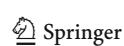

**Table 1** Values of the hyperparameters of ViT and SimpleViT

| Hyperparameter | ViT                 | Simple ViT          |  |
|----------------|---------------------|---------------------|--|
| patch_size     | $4 \times 4$ pixels | $4 \times 4$ pixels |  |
| dim            | 128                 | 128                 |  |
| depth          | 6                   | 6                   |  |
| heads          | 16                  | 16                  |  |
| mlp_dim        | 512                 | 512                 |  |
| dropout        | 0.1                 | _                   |  |
| emb_dropout    | 0.1                 | _                   |  |

capacity of the replay memory; (ii) buffer batch size: the number of elements randomly sampled from the replay memory; (iii) gamma: the discount factor that controls the weight of future rewards; (iv) eps\_start, eps\_end, and eps\_decay: they manage the tradeoff between exploration and exploitation; in particular, they define the initial exploration rate, the final exploration rate, and the decay rate, respectively; (v) eta: the learning rate of the Q-Network; (vi) tau: the soft update rate of the Target Network; (vii) update\_every: how often the Target Network updates its weights; (viii) frequency (f): how often (i.e. every how many iterations) the model receives the reward; (ix) n\_patches\_desired: the desired number of patches the agent should select; (x) alpha ( $\alpha$ ): the contribution of the training loss to the reward calculation with respect to the number of selected patches. In Table 2, we report the values of the previous hyperparameters, except for buffer size, f and  $\alpha$ . In fact, in order to keep the level of complexity of the experiments and the space devoted to them reasonable,

Table 2 Values of the hyperparameters of AgentViT and AgentSimpleViT

| Hyperparameter    | AgentViT            | AgentSimpleViT |
|-------------------|---------------------|----------------|
| patch_size        | $4 \times 4$ pixels | 4 × 4 pixels   |
| dim               | 128                 | 128            |
| depth             | 6                   | 6              |
| heads             | 16                  | 16             |
| mlp_dim           | 512                 | 512            |
| buffer_batch_size | 64                  | 64             |
| gamma             | 0.95                | 0.95           |
| eps_start         | 1                   | 1              |
| eps_end           | 0.01                | 0.01           |
| eps_decay         | 20,000              | 20,000         |
| eta               | 0.01                | 0.01           |
| tau               | 0.1                 | 0.1            |
| update_every      | 2                   | 2              |
| n_patches_desired | 40                  | 40             |
| dropout           | 0.1                 | _              |
| emb_dropout       | 0.1                 |                |

we could not tune all the hyperparameters; therefore, we performed this task on the three that we considered to have the most impact on the behavior of AgentViT and AgentSimple-ViT.

As datasets used to evaluate our approach across different domains and levels of complexity, we used CIFAR10, FashionMNIST, and an extended version of Imagenette. CIFAR10 [24] consists of 60,000 RGB images of size  $32 \times 32$ pixels, categorized into 10 classes. It is split into a training set of 50,000 images and a test set of 10,000 images, with each class containing the same number of training samples (specifically, 5,000 per class). FashionMNIST [25] (FMNIST) contains 70,000 grayscale images of size  $28 \times 28$ pixels, representing 10 classes of clothing items, such as tshirts, trousers, dresses, and sneakers. It represents a more challenging benchmark for image classification than the original MNIST dataset. Imagenette is a subset of ImageNet [26] designed to be a smaller and more manageable benchmark for deep learning models. It consists of 13,394 images of 320 × 320 pixels categorized into 10 classes. To improve this benchmark, we extended Imagenette by adding 86,606 additional images from the original ImageNet dataset. These images belong to the same classes as Imagenette and are distributed in a balanced way across them. We will call this extended version "Imagenette+". It thus contains 100,000 images categorized in the 10 classes of the original Imagenette.

The approaches we chose to compare with AgentViT are ATS [8], PatchMerger [10], EViT [11], and the Vanilla case (i.e., the original ViT and SimpleViT as baselines). We chose these approaches because they represent some of the best-performing approaches in their respective categories [85], i.e., dynamic pruning (ATS), token merging (PatchMerger), and a combination of token merging and pruning (EViT). However, since EViT and ATS rely on the classification token, they cannot be applied to SimpleViT, which lacks this token.

The hyperparameters of ATS, PatchMerger and EViT are the ones of ViT or SimpleViT, depending on the Vision Transformer model underlying them. In addition to these hyperparameters there is a further one, called keep\_rate, which represents the number of tokens to keep in each layer of the Vision Transformer. In our experiments, we set keep\_rate to the following lists of values: [9, 9, 9, 17, 33, 66] for CIFAR10 and FMNIST, and [26, 26, 26, 51] for Imagenette+.

The evaluation of AgentViT and the other approaches was done using metrics that consider both the classification performance of the trained model and the corresponding computational efficiency. For classification performance, we used the standard metrics of Accuracy, Precision, Recall, and

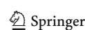

https://github.com/fastai/imagenette

F1-Score. For computational efficiency, we considered the following metrics:

- Cumulative Training Time (CTT): It is the total time required to train the model. In the case of AgentViT, it includes the time needed to train both the ViT and the RL agent, since the latter is trained together with the ViT.
- Memory: It indicates the megabytes required to load the deep learning model, including any additional parameters required for token pruning. For AgentViT, it includes the model size, the memory used by the Deep-Q and Target neural networks, and the buffer size. For PatchMerger, it includes the model size and the additional parameter storage.
- Frames per Second (FPS): It is the number of frames the approach can process per second. The higher the value, the faster the approach.
- Giga Floating Point Operations (GFLOPs): It is the number of billions of floating point operations required by the approach to process an image. The higher the value, the more computationally intensive the approach.

We conducted our experiments on a server having an Intel(R) Xeon(R) W5-3435X 3.10 GHz CPU, 128 GB of RAM, and an NVIDIA RTX A2000 GPU with 12 GB of memory. The code used for the implementation of AgentViT and the one created to perform the experiments described in the next sections can be found on GitHub at the following link: https://github.com/DavideTraini/RL-for-ViT.

#### 4.2 Hyperparameter analysis

In this section, we describe the preliminary experiments conducted to evaluate the impact on AgentViT's performance of the three hyperparameters  $\alpha$ , f, and buffer\_size that we had not set to fixed values in Table 2. We show the results obtained using CIFAR10 and SimpleViT. Similar results were obtained for the other two datasets and for ViT. We trained AgentSimpleViT for 100 epochs; during each epoch, we simultaneously trained the underlying SimpleViT and the agent inside AgentSimpleViT.

The choice of not directly fixing the values of  $\alpha$  and f is motivated by the fact that they are intrinsically linked with our approach and directly influence its performance (see Section 3.4). Indeed,  $\alpha$  and f play a crucial role in shaping the learning dynamics of our model, which makes their

impact particularly relevant to our experimental campaign. The choice of not directly fixing the value of buffer\_size is related to the fact that, as evidenced by [86], the performance of DDQN is sensitive to this parameter. This makes the latter very influential on learning stability and efficiency; for this reason, we considered it essential to evaluate its effects within our framework.

The first parameter we considered was  $\alpha$ ; it is present in the reward computation (3.6) and determines the weight of the reward associated with training loss against that associated with the number of patches selected. We performed a grid search on  $\alpha$ ; for each value of this parameter taken into consideration, we calculated the Accuracy and Cumulative Training Time of AgentSimpleViT. Table 3 shows the results obtained.

From the analysis of this table we can see that the values of Accuracy are very similar as  $\alpha$  varies, while there are differences in the Cumulative Training Time. In particular, it varies from 3,947 seconds for  $\alpha=0.99$  to 3,536 seconds for  $\alpha=0.001$ , with a decrease of 10.41%. This result is a consequence of the reward mechanism underlying AgentSimpleViT, described in Section 3.4. In fact, a lower value of  $\alpha$  encourages the agent to select fewer patches. This leads to a reduction of the Cumulative Training Time, but also to an increase of the training loss and thus to a decrease of the Accuracy.

Another interesting aspect of rewards is the frequency with which the agent receives them. Indeed, this frequency could affect its learning process and, ultimately, the performance of the whole AgentSimpleViT (see Section 3.4). To evaluate this aspect, we calculated the Accuracy and the Cumulative Training Time against epochs considering three different frequency values, namely 2, 10 and 100. The results are shown in Fig. 2. From the analysis of this figure, we can see that there are no significant differences between the three cases, neither in Accuracy nor in the Cumulative Training Time. The only notable observation is a slight reduction in Cumulative Training Time when the frequency is set to 10. This frequency value is the intermediate one among those we considered. This leads us to conclude that a frequency value of 10 is a good tradeoff between training time and speed of convergence to the optimal accuracy value.

Finally, we tested the impact of buffer\_size related to replay memory on AgentSimpleViT. In fact, a larger buffer size requires more memory to train the agent, but might help its learning. Specifically, as shown in [78, 79], the

**Table 3** Accuracy and Cumulative Training Time of AgentSimpleViT using CIFAR10 for seven different values of  $\alpha$ 

| Metric   | $\alpha = 0.99$  | $\alpha = 0.5$   | $\alpha = 0.1$   | $\alpha = 0.05$  | $\alpha = 0.01$  | $\alpha = 0.005$ | $\alpha = 0.001$ |
|----------|------------------|------------------|------------------|------------------|------------------|------------------|------------------|
| Accuracy | $80.44 \pm 0.08$ | $80.27 \pm 0.11$ | $80.11 \pm 0.13$ | $79.81 \pm 0.07$ | $79.89 \pm 0.17$ | $79.43 \pm 0.09$ | $79.15 \pm 0.11$ |
| CTT (s)  | $3,947 \pm 37$   | $3,879 \pm 38$   | $3,833 \pm 32$   | $3,780 \pm 28$   | $3,651 \pm 22$   | $3,572 \pm 33$   | $3,536 \pm 25$   |

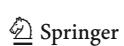

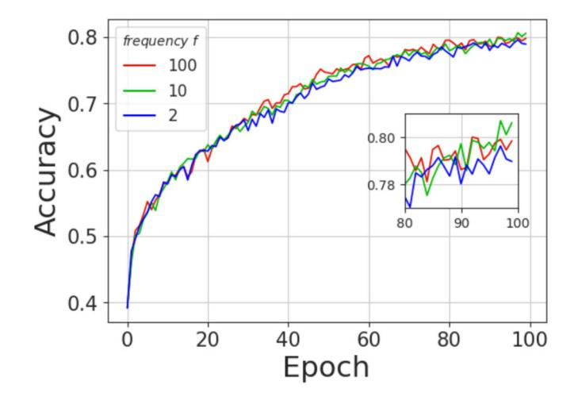

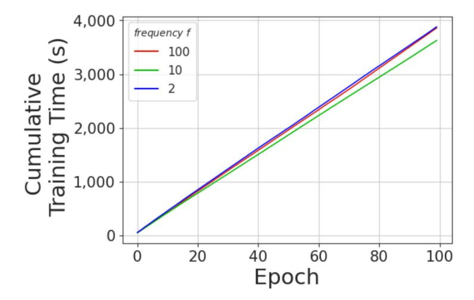

Fig. 2 Accuracy and Cumulative Training Time of AgentSimpleViT against epochs for three values of the reward frequency

replay memory buffer allows the agent to learn from previous memories by speeding up training and breaking unwanted temporal correlations. However, too small or too large values of the buffer could lead to significant degradation of the agent's learning.

As in the other cases, in this experiment we calculated the trend of Accuracy and Cumulative Training Time against epochs. In particular, we considered four values of the buffer size, namely 128, 256, 1,024 and 2,048 elements. The results obtained are shown in Fig. 3. From the analysis of this figure, we can see that the differences between the four cases are not significant. This is because the chosen values of buffer size are neither too high nor too low and therefore do not cause any performance degradation. The only notable difference in Fig. 3 is the slightly lower Cumulative Training Time achieved with a buffer size of 1,024. This can be explained by the fact that this buffer size, intermediate between 128 and 256 on the one hand, and 2048 on the other hand, promotes the agent's ability to find optimal patches faster, resulting in a lower Cumulative Training Time.

Therefore, at the end of this hyperparameter analysis, we have that the optimal hyperparameter configuration for AgentViT is  $\alpha=0.1, f=10$ , and <code>buffer\_size=1,024</code>. We will use this configuration in the next experiments for both AgentViT and AgentSimpleViT.

#### 4.3 Evaluation and comparative analysis

As a first experiment, we tested AgentViT and the other related approaches selected in Section 4.1 on the CIFAR10 dataset. The corresponding results are reported in Table 4.

The results show the effectiveness of AgentViT and AgentSimpleViT compared to other pruning approaches. AgentViT achieves the highest Accuracy, Precision, Recall, and F1-Score outperforming ATS, PatchMerger, and EViT. Specifically, AgentViT improves Accuracy by 8.50% over ATS, 1.19% over PatchMerger and 0.73% over EViT, while reducing Computational Training Time by 30.91% over the Vanilla ViT, 0.34% over PatchMerger, and 2.91% over EViT. This indicates that AgentViT can effectively balance token

607 Page 14 of 26 F. Cauteruccio et al.

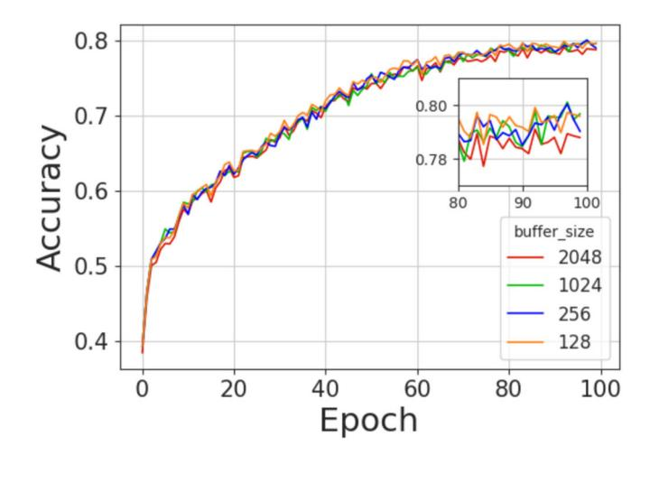

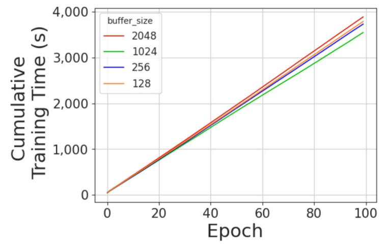

Fig. 3 Accuracy and Cumulative Training Time of AgentSimpleViT against epochs for four replay memory buffer sizes

selection while maintaining high classification performance. Similarly, AgentSimpleViT achieves the highest Accuracy, Precision, Recall, and F1-Score values among SimpleViT-based approaches, outperforming both the Vanilla model and

PatchMerger. Specifically, it improves Accuracy by 2.08% over Vanilla SimpleViT and by 1.96% over PatchMerger, while reducing Computational Training Time by 21.42% compared to Vanilla SimpleViT and 3.23% over Patch-

Table 4 Performance comparison of AgentViT with other related approaches using ViT and SimpleViT as underlying Vision Transformers, trained on CIFAR10

| Backbone  | Approach       | Accuracy ↑       | Precision ↑                        | Recall ↑                           | F1-Score ↑       | CTT (s) ↓                        |
|-----------|----------------|------------------|------------------------------------|------------------------------------|------------------|----------------------------------|
| ViT       | Vanilla        | $83.10 \pm 0.10$ | $82.96 \pm 0.08$                   | 83.08 ±0.09                        | 83.02 ±0.07      | 5,955 ±28                        |
|           | ATS            | $76.28 \pm 0.14$ | $77.22 \pm 0.12$                   | $75.58 \pm 0.13$                   | $76.39 \pm 0.15$ | $5,713 \pm 33$                   |
|           | PatchMerger    | $81.78 \pm 0.09$ | $80.84 \pm 0.08$                   | $81.26 \pm 0.10$                   | $81.05 \pm 0.09$ | $4,128 \pm 27$                   |
|           | EViT           | $82.16 \pm 0.11$ | $82.26 \pm 0.09$                   | $82.17 \pm 0.10$                   | $82.21 \pm 0.10$ | $4,234 \pm 35$                   |
|           | AgentViT       | $82.76 \pm 0.12$ | $82.26 \pm 0.10$                   | $\textbf{82.81} \pm \textbf{0.11}$ | $82.53 \pm 0.09$ | $\textbf{4,114} \pm \textbf{27}$ |
| SimpleViT | Vanilla        | $78.44 \pm 0.11$ | $78.67 \pm 0.09$                   | $78.38 \pm 0.10$                   | $78.52 \pm 0.08$ | $4,878 \pm 34$                   |
|           | PatchMerger    | $78.54 \pm 0.10$ | $79.44 \pm 0.09$                   | $77.98 \pm 0.11$                   | $78.70 \pm 0.10$ | $3,961 \pm 31$                   |
|           | AgentSimpleViT | $80.11 \pm 0.13$ | $\textbf{80.41} \pm \textbf{0.11}$ | $79.21 \pm 0.12$                   | 79.81 $\pm 0.10$ | $\textbf{3,833} \pm \textbf{32}$ |

The table shows Accuracy, Precision, Recall, and F1-Score, along with Computational Training Time (CTT) in seconds. Results are presented as mean  $\pm$  standard deviation over 10 runs. The best result (excluding the Vanilla model) is highlighted in bold. An upward (resp., downward) arrow next to a measure name indicates that the higher (resp., lower) the value of that measure, the better the approach considered

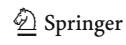

Merger. This demonstrates that AgentSimpleViT not only enhances predictive performance but also reduces computational cost.

We then performed the same experiment on FMNIST, and the results are shown in Table 5.

Similar to the CIFAR10 case, AgentViT outperforms all other ViT-based approaches, achieving the highest values of Accuracy, Precision, Recall, and F1-Score. Compared to ATS (resp., PatchMerger, EViT) AgentViT improves Accuracy by 2.25% (resp., 0.66%, 0.41%). It also significantly reduces Computational Training Time to 2,188 s, which is 13.8% less than Vanilla ViT, 11.49% less than ATS, 9.47% less than EViT, and 9.76% less than PatchMerger, demonstrating its efficiency in reducing computational overhead. Similarly, AgentSimpleViT achieves the highest Accuracy, Precision, Recall, and F1-Score among SimpleViT-based methods. Specifically, its Accuracy is 0.25% (resp., 0.66%) higher than Vanilla SimpleViT (resp., PatchMerger). It also reduces the Computational Training Time to 2,264 s, which is a reduction of 8.67% compared to Vanilla SimpleViT and 2.58% compared to PatchMerger.

To complete the performance evaluation, we tested our approach and the others seen above on Imagenette+, which is larger and more complex than the previous two datasets (see Section 4.1). As a matter of fact, Imagenette+ is more challenging for the approaches into evaluation, since both the number of its images and their resolution are much higher than the ones of CIFAR10 and FMNIST. The corresponding results are presented in Table 6.

Once again, the results demonstrate the effectiveness of AgentViT and AgentSimpleViT. In particular, AgentViT achieves the highest Accuracy, Precision, Recall, and F1-Score among all ViT-based approaches. Compared to ATS (resp., PatchMerger, EViT) AgentViT improves Accuracy by 2.83% (resp., 0.63%, 0.27%). It also significantly reduces the Computational Training Time to 24,747 *s*, which is 15.79% less than Vanilla ViT, 10.58% less than ATS, 4.72%

less than PatchMerger, and 6.13% less than EViT. Similarly, AgentSimpleViT outperforms all other SimpleViT-based approaches, achieving the highest Accuracy, Precision, Recall, and F1-Score. In particular, it improves Accuracy over Vanilla SimpleViT by 0.22% and over PatchMerger by 0.36%. Moreover, it achieves a Computational Training Time of 24,168 s, which represents a reduction of 16.09% compared to Vanilla SimpleViT and 4.49% compared to PatchMerger.

Finally, we assessed the computational load of AgentViT and the other approaches considered. This evaluation is crucial because using an RL agent for token pruning could introduce additional overhead to ViT operations. To quantify this impact, we measured the allocated Memory and GFLOPs during training and inference tasks, as well as the values of FPS. The results are presented in Table 7.

They show the computational efficiency of AgentViT and AgentSimpleViT compared to the other approaches. In fact, if we compare AgentViT with the Vanilla model, we can observe that with a small increase in the memory required for training and a very small increase in the memory required for inference, it requires 49.93% less GFLOPs during training and 50.81% less GFLOPs during inference. Its pruning activity also makes it capable of processing a much larger number of images per second. In fact, it achieves a 92.78% increase over the Vanilla model. Compared to ATS, PatchMerger and EViT, AgentViT requires more memory for training (due to the presence of the agent) and slightly more memory for inference. Instead, the GFLOPs it requires for both training and inference are comparable. However, it achieves a significant increase in FPS due to the pruning activities; in particular, this increase is 61.21% over ATS, 23.84% over PatchMerger, and 25.78% over EViT. A similar argument can be made for SimpleViT. In fact, it requires more training memory and slightly more inference memory than the Vanilla model and PatchMerger. The GFLOPs required by it for training and inference are much lower than the Vanilla model and

 Table 5
 Performance comparison of AgentViT with other related approaches using ViT and SimpleViT as underlying Vision Transformers, trained on FMNIST

| Backbone  | Approach       | Accuracy ↑       | Precision ↑      | Recall ↑                           | F1-Score ↑       | CTT (s) ↓              |
|-----------|----------------|------------------|------------------|------------------------------------|------------------|------------------------|
| ViT       | Vanilla        | $91.19 \pm 0.07$ | $90.14 \pm 0.05$ | 91.22 ±0.06                        | $90.68 \pm 0.06$ | 2,539 ±10              |
|           | ATS            | $88.43 \pm 0.09$ | $87.97 \pm 0.06$ | $88.38 \pm 0.08$                   | $88.17 \pm 0.07$ | $2,472 \pm 12$         |
|           | PatchMerger    | $89.76 \pm 0.05$ | $88.95 \pm 0.04$ | $89.68 \pm 0.06$                   | $89.31 \pm 0.05$ | $2,398 \pm 10$         |
|           | EViT           | $90.05 \pm 0.08$ | $89.29 \pm 0.05$ | $90.02 \pm 0.07$                   | $89.65 \pm 0.06$ | $2,417 \pm 11$         |
|           | AgentViT       | $90.42 \pm 0.06$ | $89.38 \pm 0.04$ | $90.45 \pm 0.07$                   | 89.91 $\pm 0.06$ | 2,188 $\pm 9$          |
| SimpleViT | Vanilla        | $90.32 \pm 0.06$ | $89.89 \pm 0.05$ | $90.15 \pm 0.07$                   | $90.02 \pm 0.06$ | $2,479 \pm 9$          |
|           | PatchMerger    | $89.89 \pm 0.05$ | $89.43 \pm 0.04$ | $89.76 \pm 0.06$                   | $89.60 \pm 0.05$ | $2,324 \pm 10$         |
|           | AgentSimpleViT | $90.55 \pm 0.07$ | $90.22 \pm 0.06$ | $\textbf{90.48} \pm \textbf{0.08}$ | $90.35 \pm 0.07$ | $\textbf{2,264} \pm 8$ |

The table shows Accuracy, Precision, Recall, and F1-Score, along with Computational Training Time (CTT) in seconds. Results are presented as mean  $\pm$  standard deviation over 10 runs. The best result (excluding the Vanilla model) is highlighted in bold. An upward (resp., downward) arrow next to a measure name indicates that the higher (resp., lower) the value of that measure, the better the approach considered

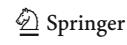

607 Page 16 of 26 F. Cauteruccio et al.

**Table 6** Performance comparison of AgentViT with other related approaches using ViT and SimpleViT as underlying Vision Transformers, trained on Imagenette+

| Backbone  | Approach       | $Accuracy \uparrow$ | $Precision \uparrow$               | $Recall \uparrow$                  | $F1$ -Score $\uparrow$ | $CTT$ (s) $\downarrow$ |
|-----------|----------------|---------------------|------------------------------------|------------------------------------|------------------------|------------------------|
| ViT       | Vanilla        | $59.95 \pm 0.12$    | $61.93 \pm 0.10$                   | $60.82 \pm 0.11$                   | $60.42 \pm 0.12$       | $29,388 \pm 123$       |
|           | ATS            | $57.31 \pm 0.13$    | $57.48 \pm 0.11$                   | $58.16 \pm 0.12$                   | $57.84 \pm 0.13$       | $27,676 \pm 176$       |
|           | PatchMerger    | $58.56 \pm 0.10$    | $58.56 \pm 0.09$                   | $58.30 \pm 0.11$                   | $58.11 \pm 0.10$       | $25,974 \pm 162$       |
|           | EViT           | $58.77 \pm 0.12$    | $58.39 \pm 0.10$                   | $57.97 \pm 0.11$                   | $58.18 \pm 0.12$       | $26,364 \pm 185$       |
|           | AgentViT       | $58.93 \pm 0.11$    | $59.25 \pm 0.09$                   | $60.63 \pm 0.10$                   | 59.91 $\pm 0.11$       | $24{,}747 \pm \! 198$  |
| SimpleViT | Vanilla        | $59.36 \pm 0.11$    | $58.94 \pm 0.09$                   | $58.59 \pm 0.12$                   | $58.96 \pm 0.11$       | $28,803 \pm 153$       |
|           | PatchMerger    | $59.13 \pm 0.10$    | $58.88 \pm 0.09$                   | $58.34 \pm 0.11$                   | $58.90 \pm 0.10$       | $25,306 \pm 187$       |
|           | AgentSimpleViT | $59.49 \pm 0.12$    | $\textbf{59.28} \pm \textbf{0.10}$ | $\textbf{58.93} \pm \textbf{0.13}$ | $59.24 \pm 0.12$       | $24,\!168\pm\!169$     |

The table shows Accuracy, Precision, Recall, and F1-Score, along with Computational Training Time (CTT) in seconds. Results are presented as mean  $\pm$  standard deviation over 10 runs. The best result (excluding the Vanilla model) is highlighted in bold. An upward (resp., downward) arrow next to a measure name indicates that the higher (resp., lower) the value of that measure, the better the approach considered

comparable to PatchMerger. However, it achieves a 90.13% increase in FPS over the Vanilla model and a 26.75% increase over PatchMerger. These results allow us to conclude that AgentViT and AgentSimpleViT provide an excellent trade-off between memory and CPU consumption on the one hand, and image processing efficiency on the other hand. In fact, since it selects the patches to be pruned at the first layer of the ViT, the computational load is reduced very soon; instead, the other approaches are constructed in such a way as to prune the tokens layer by layer, gradually reducing the computational load.

More generally, if we consider these results together with previous ones concerning Accuracy, Precision, Recall, F1-Score, and Cumulative Training Time, we can conclude that AgentViT and AgentSimpleViT provide the best tradeoff between computational efficiency and performance, making them particularly suitable for applications that require fast image processing, and thus for a large number of real-world cases.

**Table 7** Comparison of the computational efficiency of AgentViT and other approaches using ViT and SimpleViT as Vision Transformers

| Backbone  | Approach       | <i>Memory</i> Train ↓ | Memory Inference ↓ | <i>GFLOPs</i> Train↓ | $GFLOPs$ Inference $\downarrow$ | FPS ↑                          |
|-----------|----------------|--------------------------|-----------------------|-------------------------|---------------------------------|--------------------------------|
| ViT       | Vanilla        | 15.14                    | 15.14                 | 0.675                   | 0.675                           | 291 ± 7                        |
|           | ATS            | 15.14                    | 15.14                 | 0.324                   | 0.325                           | $348 \pm 3$                    |
|           | PatchMerger    | 15.15                    | 15.15                 | 0.356                   | 0.347                           | $453\pm 8$                     |
|           | EViT           | 15.14                    | 15.14                 | 0.344                   | 0.344                           | $446 \pm 6$                    |
|           | AgentViT       | 26.35                    | 15.23                 | 0.338                   | 0.332                           | $\textbf{561} \pm \textbf{12}$ |
| SimpleViT | Vanilla        | 15.13                    | 15.13                 | 0.635                   | 0.635                           | $304 \pm 6$                    |
|           | PatchMerger    | 15.14                    | 15.14                 | 0.351                   | 0.342                           | $456\pm7$                      |
|           | AgentSimpleViT | 16.34                    | 15.24                 | 0.363                   | 0.338                           | $\textbf{578} \pm \textbf{9}$  |

The table shows Memory Usage (in GB) Giga Floating Point Operations (GFLOPs) during training and inference, as well as the Frames Per Second (FPS). Results are presented as mean  $\pm$  standard deviation over 10 runs. The best result (excluding the Vanilla model) is highlighted in bold. An upward (resp., downward) arrow next to a measure name indicates that the higher (resp., lower) the value of that measure, the better the approach considered

# 4.4 Ablation study

In this section, we present the results of the ablation study we performed on our approach. Due to space limitations, we detail the results obtained with SimpleViT and CIFAR10, although we obtained similar results with the other models and datasets. In particular, in Subsection 4.4.1 we test the performance of AgentViT using a different RL algorithm from the previous one, while in Subsection 4.4.2 we remove the DDQN components step by step to check their impact on our approach.

# 4.4.1 Training with a different reinforcement learning algorithm

Due to its modularity, our approach can be implemented using different RL frameworks. For this reason, in this experiment we decided to replace the previously used DDQN approach with the Proximal Policy Optimization (PPO) [73]

algorithm to perform the patch selection task. Unlike DDON, PPO is a Monte Carlo-based approach that works only with episodic environments. In our case, we define an episode as a training epoch of the ViT model. Similar to the DDON algorithm, the PPO algorithm uses a pair of neural networks, namely, the Policy Network and the Value Network. The former takes the state s as input and returns a probability distribution of possible actions a. This network is trained to maximize the expected cumulative reward. The latter estimates the advantage function and is updated by minimizing the mean squared error between the predicted state values and the observed returns. This similarity allows us to use PPO directly in our approach. In fact, the Policy Network works like the Q-Networks described in Section 3.1, but instead of returning a Q-value for each patch, it returns the distribution of the Value function over the patches. The patches selected are those with an attention value higher than the mean of all attention values. Figure 4 shows the performance of the PPO algorithm compared to the AgentSimpleViT (based on DDQN). In Fig. 4, we compare the Accuracy and Cumulative Training Time of DDQN and PPO.

As shown in this figure, there is no significant difference in Cumulative Training Time between DDQN and PPO; however, PPO shows a worse performance in terms of Accuracy. This is probably due to the episode partitioning, as long episodes can slow down learning. This happens because the feedback needed to update the model is delayed since the agent does not receive the reward until the end of the episode. Also, a higher number of episodes could improve the PPO results, but to achieve this advantage it is necessary to increase the number of epochs and therefore the training time.

#### 4.4.2 Analysis of DDQN components

In this section, we report the results of our approach by eliminating some of the components of the DDQN described in Sections 3.1 and 3.3. We decided to test AgentSimple-

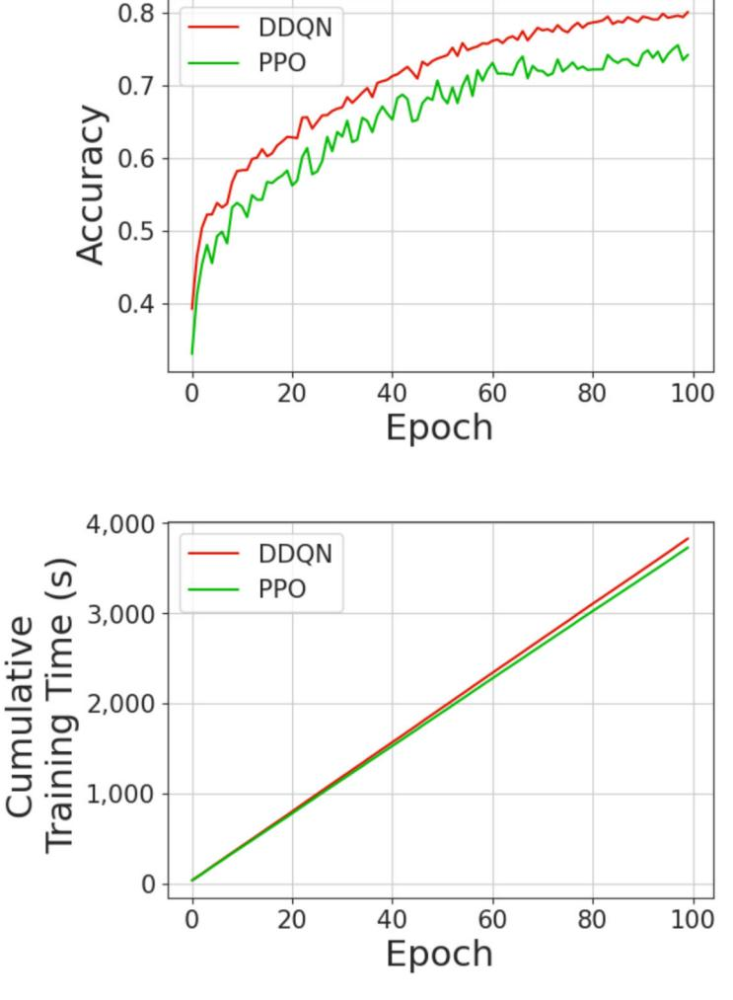

Fig. 4 Comparison between DDQN and PPO using AgentViT on CIFAR10

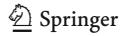

ViT without the Replay Memory, which contains the past experiences that the agent uses at each iteration to train itself, and without the Target Network, which ensures that the maximization step is carried out by the Q-Network itself. The corresponding Accuracy and Cumulative Training Time results are reported in Fig. 5.

From the analysis of this figure, we can see that the removal of Replay Memory results in a slight decrease in both Accuracy and Cumulative Training Time. While Replay Memory introduces a small overhead due to inserting observations into the buffer and sampling them during training, it improves the stability of the training process. In contrast, removing the Target Network has a more significant impact on agent performance, resulting in a higher reduction in Accuracy. The combined removal of Replay Memory and Target Network results in much lower Accuracy.

### 4.5 Qualitative analysis

In the previous sections, we have performed a quantitative analysis of AgentViT and we have seen that it achieves satisfactory results. In this section, we want to add a qualitative analysis, which aims to verify the quality of the patch filtering performed by AgentSimpleViT as it is visually perceived by an end user. To conduct this analysis, we constructed 7 batches each consisting of 4 images randomly selected from CIFAR10. In Table 8, we report the classes of the four images belonging to each batch.

As can be seen, the batches are very heterogeneous with each other, where images belong to very different classes. Therefore, finding patches that can be filtered across all the images in a batch without losing important details is extremely difficult. Quantitative analysis has shown that

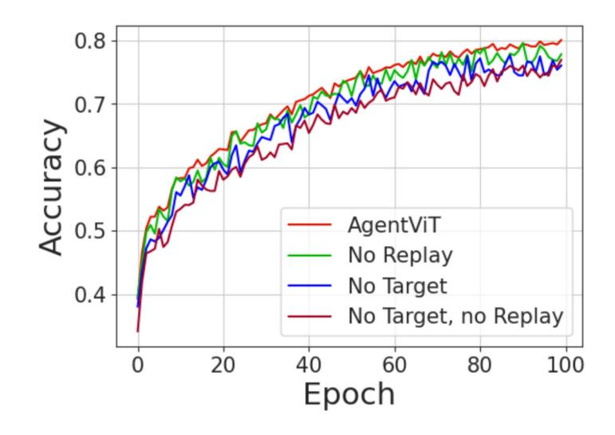

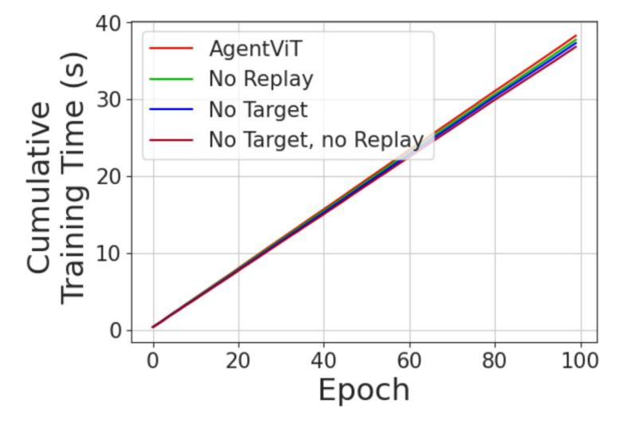

Fig. 5 Analysis of the DDQN Components to the AgentViT performances

**Table 8** Batches employed in our qualitative analysis

| Batch Number | First Image | Second Image | Third Image | Fourth Image |
|--------------|-------------|--------------|-------------|--------------|
| 1            | Automobile  | Automobile   | Deer        | Dog          |
| 2            | Deer        | Ship         | Airplane    | Bird         |
| 3            | Ship        | Ship         | Cat         | Deer         |
| 4            | Bird        | Frog         | Airplane    | Airplane     |
| 5            | Deer        | Horse        | Frog        | Ship         |
| 6            | Bird        | Deer         | Deer        | Frog         |
| 7            | Dog         | Horse        | Airplane    | Truck        |

AgentSimpleViT succeeds in doing this task satisfactorily. Here, we want to verify whether this is also true from a visual analysis point of view. The results of applying AgentSimpleViT to the previously constructed batches are shown in Figs. 6, 7 and 8. Specifically, for each batch, the first row shows the four original images, while the second row shows the same images without the patches filtered out by AgentSimpleViT.

From the analysis of these figures, we can observe that, in each batch, AgentSimpleViT is indeed capable of filtering patches not closely related to the objects of the classes to which the corresponding figures belong. In fact, in most cases the patches filtered out are those related to the background (see, for example, Fig. 6c). In some cases, AgentViT removes patches close to the object of interest, but mostly preserves the center of the image, which often contains the object determining the class.

An additional interesting aspect we want to highlight is that AgentSimpleViT was able to automatically determine the best number of patches to filter out based on the input images. In fact, during this experiment, we had specified that the desired number of patches to be filtered out was 32 for each batch. Actually, AgentSimpleViT did not slavishly follow our indications, which is correct based on what we said in Section 3.4. Specifically, the number of patches that AgentSimpleViT removed for each batch is reported in Table 9. Comparing the results of this table and the images of Figs. 6–8, we can observe that AgentSimpleViT removes more patches in the case where the image has a lot of background, while it removes fewer patches in the other case. In fact, it understands that removing more patches in this latter case would lead to a deterioration of the overall accuracy. This is exactly the behavior we hoped to achieve when we defined the requirements for AgentSimpleViT.

## 5 Discussion

s seen in the previous sections, AgentViT (resp., AgentSimpleViT) introduces the use of RL to select patches for optimal filtering. In our opinion, the qualitative and quantitative results obtained show that its performance is solid. In fact, they show that AgentViT (resp., AgentSimpleViT) is able to

train a Vision Transformer in less time than that required by ViT (resp., SimpleViT) when trained without removing any patches. This reduction in training time is achieved with comparable accuracy. In addition, the Deep Q-Learning hyperparameters allowed us to tune AgentViT to achieve the desired tradeoff between accuracy and training time. Finally, the comparison with other approaches showed that AgentViT is the one that provides the best tradeoff between Cumulative Training Time, Memory Usage, FPS and GFLOPs on the one hand, and Accuracy, Precision, Recall and F1-Score on the other hand.

In addition, AgentViT has other interesting implications. One of these is the ability to use larger ViTs. In fact, AgentViT's ability to reduce training time ensures that architectures that would not normally be adopted due to excessive training time can now be adopted within AgentViT. A second implication concerns the use of AgentViT to construct reduced synthetic datasets from the original datasets (such as CIFAR10), which can be used to train deep neural networks. A third implication concerns the possible extension of AgentViT to contexts other than ViTs. In fact, the idea behind our framework is general and can be applied not only to ViTs but also to any Transformer architecture (e.g., an architecture operating in the NLP context). The only requirement is that the input of the agent present in AgentViT is provided in the form of an attention matrix.

To complete the discussion of AgentViT, it is worth mentioning some limitations of our framework. One of its main limitations is its reliance on Deep Q-Learning, which requires tuning of several hyperparameters, including buffer size and reward frequency. These hyperparameters significantly influence the agent's ability to learn an optimal patch selection strategy, affecting both efficiency and accuracy. The need to tune some hyperparameters could make it difficult for less experienced users to apply AgentViT effectively, as the relationship between these parameters and model performance is not always intuitive. For example, the choice of buffer size determines how much past experience the agent can leverage, striking a delicate balance between preserving relevant information and avoiding overfitting with outdated decisions. Too small a buffer might lead to unstable learning, while too large a buffer may slow down updates, making the agent less responsive to new observations. Similarly, reward

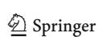

607 Page 20 of 26 F. Cauteruccio et al.

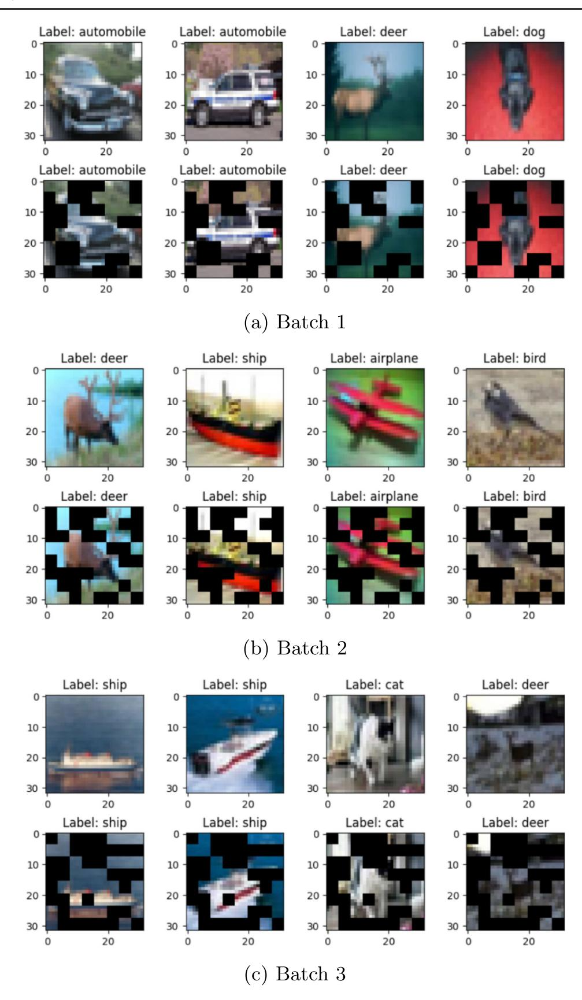

Fig. 6 Qualitative analysis of AgentViT on seven batches of images (Batches 1-3)

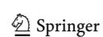

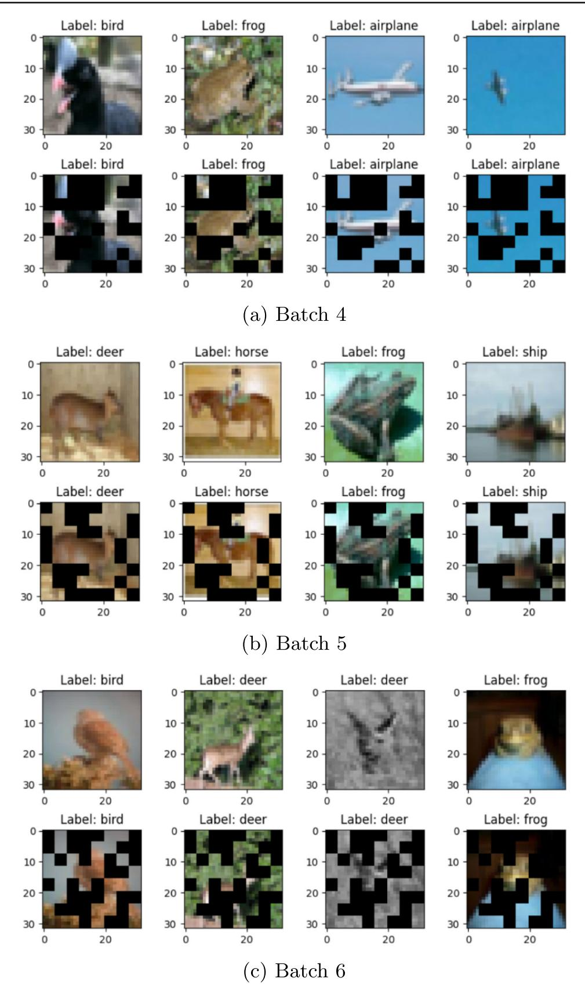

Fig. 7 Qualitative analysis of AgentViT on seven batches of images (Batches 4-6)

607 Page 22 of 26 F. Cauteruccio et al.

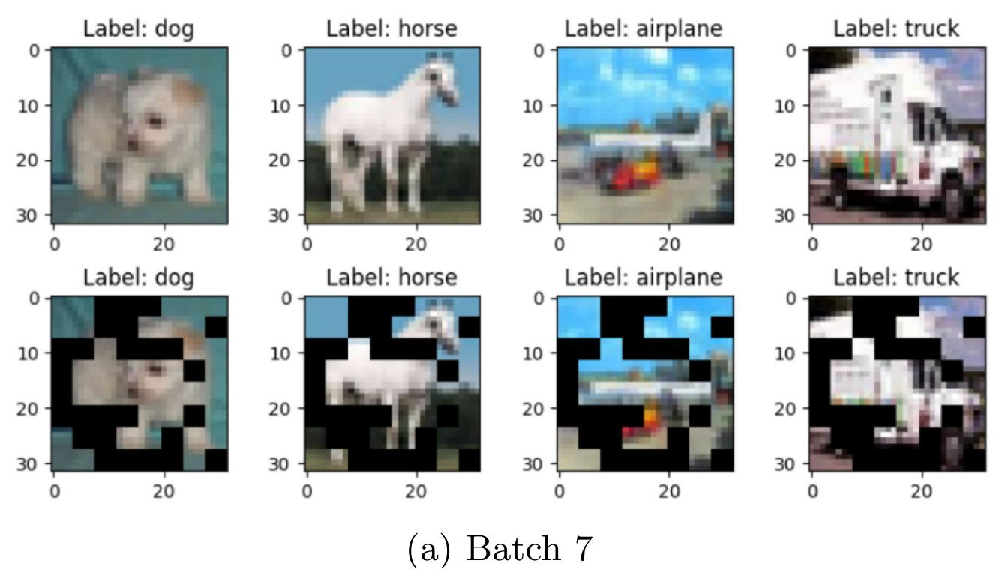

Fig. 8 Qualitative analysis of AgentViT on seven batches of images (Batch 7)

frequency affects learning dynamics; indeed, too frequent rewards can lead to overfitting on short-term gains, while infrequent rewards can lead to inefficient exploration.

Another limitation concerns the number of patches required by AgentViT to work effectively. Since the agent selects patches based on attention values from the first ViT layer, it needs a sufficiently large number of patches to detect meaningful patterns in the input image. If the ViT model works with a small number of patches, the agent may have difficulty distinguishing between informative and redundant regions, ultimately leading to suboptimal patch selection. When the number of patches is very small, the granularity of patch selection decreases, reducing the agent's ability to make accurate decisions. In such cases, removing even a small number of patches might result in the loss of critical information, negatively impacting classification performance.

 Table 9
 Number of patches filtered out by AgentViT for each batch

| Batch | Number of removed patc |  |  |
|-------|------------------------|--|--|
| 1     | 27                     |  |  |
| 2     | 31                     |  |  |
| 3     | 33                     |  |  |
| 4     | 30                     |  |  |
| 5     | 27                     |  |  |
| 6     | 31                     |  |  |
| 7     | 27                     |  |  |

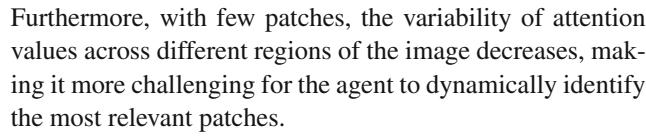

Finally, another limitation of AgentViT is that it relies on attention scores to guide its RL agent. This reliance on attention mechanisms means that AgentViT cannot be directly applied to architectures that do not incorporate self-attention, such as traditional CNNs. This makes it difficult to integrate AgentViT with CNN-based architectures, requiring alternative methods to identify important regions of the image. Consequently, its applicability is limited to transformer-based models, which reduces its generalizability, especially in domains where CNNs remain the preferred choice.

#### **6 Conclusion**

In this paper, we have proposed the application of Reinforcement Learning to reduce the training time of a Vision Transformer without significantly reducing the quality of its results. For this purpose, we adopted the classical Markov Decision Process mechanism to represent an environment for the image classification task, which required us to redefine the state, action and reward necessary to train our agent. We tested AgentViT using ViT and SimpleViT as Vision Transformers, a Double Deep Q-Network as the internal agent, and applying it to CIFAR10, FashionMNIST, and Imagenette+.

Our analysis showed that AgentViT leads to a significant reduction in training time while achieving competitive accuracy. Specifically, when compared to ViT running alone (i.e., not supported by our system), AgentViT achieves a 2.08% (resp., 0.25%, 0.22%) increase in Accuracy and a 21.42% (resp., 8.67%, 16.09%) reduction in Cumulative Training Time when CIFAR10 (resp., FMNIST, Imagenette+) is used as dataset. We also checked the impact of some hyperparameters on the performance of AgentSimpleViT, which allowed us to identify the corresponding optimal values. We then performed some experiments on CIFAR10, FMNIST. and Imagenette+ datasets and compared AgentViT with several related approaches already proposed in the literature and were able to conclude that our framework provides the best tradeoff between Cumulative Training Time, Memory Usage, FPS and GFLOPs on the one hand, and Accuracy, Precision, Recall and F1-Score, on the other. We performed an ablation study to evaluate the ability of our framework to follow the training process with another RL algorithm and the importance of the various components of DDQN. In addition, we presented a qualitative experiment to verify whether the patches filtered by AgentViT are indeed those in the background of an image or, in any case, those not useful for its classification. We received very positive feedback for this experiment as well, and also appreciated AgentViT's ability to dynamically select the number of patches to be filtered.

In the future, we plan to extend our approach in several directions. For example, we would like to extend it to include deeper attention layers in the patch selection process. However, this extension is not trivial, as dynamically removing patches across layers introduces a non-stationary state space and action space for the RL agent. Furthermore, we can think of defining a new metric similar to the Akaike information criterion [87] that takes into account the performance of the model and the number of tokens. In addition, we would like to test other Reinforcement Learning algorithms, such as Multi-Agent Reinforcement Learning and Contextual Multi-Armed Bandit, instead of the Deep Q-Network, to see if they can further improve the performance of a ViT. These algorithms could help select the right actions and patches to speed up ViT training. One possible research direction is to extend our approach, which was specifically developed for classification, to other computer vision tasks, such as object recognition and segmentation. This would involve restructuring the agent's objective function so that the reward given to the RL agent takes into account the task for which the system is working. Finally, we plan to evaluate the impact of our approach on other ViT architectures.

**Acknowledgements** We acknowledge the support of the PNRR project FAIR - Future AI Research (PE00000013), Spoke 9 - AI, under the NRRP MUR program funded by the NextGenerationEU.

**Funding** Open access funding provided by Università Politecnica delle Marche within the CRUI-CARE Agreement.

**Data Availability** The dataset used for our study is publicly available at the link https://github.com/DavideTraini/RL-for-ViT.

#### **Declarations**

**Competing Interest** The authors declare that they have no known competing financial interests or personal relationships that could have appeared to influence the work reported in this paper.

Open Access This article is licensed under a Creative Commons Attribution 4.0 International License, which permits use, sharing, adaptation, distribution and reproduction in any medium or format, as long as you give appropriate credit to the original author(s) and the source, provide a link to the Creative Commons licence, and indicate if changes were made. The images or other third party material in this article are included in the article's Creative Commons licence, unless indicated otherwise in a credit line to the material. If material is not included in the article's Creative Commons licence and your intended use is not permitted by statutory regulation or exceeds the permitted use, you will need to obtain permission directly from the copyright holder. To view a copy of this licence, visit <a href="https://creativecommons.org/licenses/by/4.0/">https://creativecommons.org/licenses/by/4.0/</a>.

#### References

- Min B, Ross H, Sulem E, Veyseh APB, Nguyen TH, Sainz O, Agirre E, Heintz I, Roth D (2023) Recent advances in natural language processing via large pre-trained language models: a survey. ACM Comput Surv 56(2):1–40
- Chai J, Zeng H, Li A, Ngai E (2021) Deep learning in computer vision: a critical review of emerging techniques and application scenarios. Mach Learn Appl 6:100134
- Vaswani A, Shazeer N, Parmar N, Uszkoreit J, Jones L, Gomez AN, Kaiser Ł, Polosukhin I (2017) Attention is All you Need. In: Proceedings of the international conference on advances in neural information processing systems (NIPS'17), Long Beach, CA, USA. Curran Associates, p 30
- 4. Dosovitskiy A, Beyer L, Kolesnikov A, Weissenborn D, Zhai X, Unterthiner T, Dehghani M, Minderer M, Heigold G, Gelly S, Uszkoreit J, Houlsby N (2021) An image is worth 16x16 words: transformers for image recognition at scale. In: Proceedings of the international conference on learning representations (ICLR'21), Virtual event. OpenReview.net
- Waqas M, Tahir MA, Danish M, Al-Maadeed S, Bouridane A, Wu J (2024) Simultaneous instance pooling and bag representation selection approach for multiple-instance learning (MIL) using vision transformer. Neural Comput Appl 1–22. Springer
- Poornam S, Angelina J (2024) VITALT: a robust and efficient brain tumor detection system using vision transformer with attention and linear transformation. Neural Comput Appl 1–17. Springer
- Child R, Gray S, Radford A, Sutskever I (2019) Generating long sequences with sparse transformers. arXiv:1904.10509
- Fayyaz M, Koohpayegani SA, Jafari FR, Sengupta S, Joze HRV, Sommerlade E, Pirsiavash H, Gall J (2022) Adaptive token sampling for efficient vision transformers. In: Proceedings of the european conference on computer vision (ECCV'22), Tel Aviv, Israel. Springer, pp 396–414

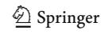

607 Page 24 of 26 F. Cauteruccio et al.

- Yin H, Vahdat A, Alvarez JM, Mallya A, Kautz J, Molchanov P (2022) A-vit: adaptive tokens for efficient vision transformer. In: Proceedings of the international conference on computer vision and pattern recognition (CVPR'22), New Orleans, LA, USA, pp 10809–10818
- Renggli C, Pinto AS, Houlsby N, Mustafa B, Puigcerver J, Riquelme C (2022) Learning to merge tokens in vision transformers. arXiv:2202.12015
- 11. Liang Y, Ge C, Tong Z, Song Y, Wang J, Xie P (2022) EViT: expediting vision transformers via token reorganizations. In: Proceedings of the international conference on learning representations (ICLR'22), Virtual event. OpenReview.net
- Polydoros AS, Nalpantidis L (2017) Survey of model-based reinforcement learning: applications on robotics. J Intell Robot Syst 86(2):153–173
- Coronato A, Naeem M, Pietro GD, Paragliola G (2020) Reinforcement learning for intelligent healthcare applications: a survey. Artif Intell Med 109:101964
- Nian R, Liu J, Huang B (2020) A review on reinforcement learning: introduction and applications in industrial process control. Comput Chem Eng 139:106886
- Luong NC, Hoang DT, Gong S, Niyato D, Wang P, Liang YC, Kim DI (2019) Applications of deep reinforcement learning in communications and networking: a survey. IEEE Commun Surv Tutor 21(4):3133–3174
- Haydari A, Yılmaz Y (2020) Deep reinforcement learning for intelligent transportation systems: a survey. IEEE Trans Intell Trans Syst 23(1):11–32
- Fang W, Pang L, Yi W (2020) Survey on the application of deep reinforcement learning in image processing. J Artif Intell 2(1):39– 58
- Yuan X, Fei H, Baek J (2024) Efficient transformer adaptation with soft token merging. In: Proceedings of the IEEE/CVF conference on computer vision and pattern recognition (CVPR'24), Seattle, WA, USA, pp 3658–3668
- Bolya D, Hoffman J (2023) Token merging for fast stable diffusion.
   In: Proceedings of the IEEE/CVF conference on computer vision and pattern recognition (CVPR'23), Vancouver, British Columbia, Canada, pp 4598–4602
- Tang Y, Han K, Wang Y, Xu C, Guo J, Xu C, Tao D (2022) Patch slimming for efficient vision transformers. In: Proceedings of the international conference on computer vision and pattern recognition (CVPR'22), New Orleans, LA, USA, pp 12165–12174
- Rao Y, Zhao W, Liu B, Lu J, Zhou J, Hsieh CJ (2021) Dynamicvit: efficient vision transformers with dynamic token sparsification. Adv Neural Inf Process Syst 34:13937–13949
- Rao Y, Liu Z, Zhao W, Zhou J, Lu J (2023) Dynamic spatial sparsification for efficient vision transformers and convolutional neural networks. IEEE Trans Pattern Anal Mach Intell. IEEE
- Hasselt HV, Guez A, Silver D (2016) Deep reinforcement learning with double q-learning. In: Proceedings of the AAAI conference on artificial intelligence (AAAI'16), vol. 30. Phoenix, AZ, USA
- Krizhevsky A, Nair V, Hinton G (2010) CIFAR-10 (Canadian Institute for Advanced Research). https://www.cs.toronto.edu/~kriz/cifar.html
- Xiao H, Rasul K, Vollgraf R (2017) Fashion-MNIST: a novel image dataset for benchmarking machine learning algorithms. arXiv:1708.07747
- Deng J, Dong W, Socher R, Li LJ, Kai L, Li FF (2009) ImageNet: a large-scale hierarchical image database. In: Proceedings of the International IEEE Conference on Computer Vision and Pattern Recognition (CVPR'09), Miami, FL, USA. IEEE, pp 248–255
- Perera ATD, Kamalaruban P (2021) Applications of reinforcement learning in energy systems. Renew Sustain Energy Rev 137:110618

- Zuccotto M, Castellini A, Torre DL, Mola L, Farinelli A (2024) Reinforcement learning applications in environmental sustainability: a review. Artif Intell Rev 57(4):88
- Mai V, Maisonneuve P, Zhang T, Nekoei H, Paull L, Lesage-Landry A (2024) Multi-agent reinforcement learning for fast-timescale demand response of residential loads. Mach Learn 113(5):3355– 3355
- Zhao X, Ding S, An Y, Jia W (2019) Applications of asynchronous deep reinforcement learning based on dynamic updating weights. Appl Intell 49:581–591
- Ding S, Zhao X, Xu X, Sun T, Jia W (2019) An effective asynchronous framework for small scale reinforcement learning problems. Appl Intell 49:4303

  –4318
- 32. Fan Y, Watkins O, Du Y, Liu H, Ryu M, Boutilier C, Abbeel P, Ghavamzadeh M, Lee K, Lee K (2023) Reinforcement learning for fine-tuning text-to-image diffusion models. In: Proceedings of the annual conference on neural information processing systems (NeurIPS'23), New Orleans, LA, USA
- Alrebdi N, Alrumiah S, Almansour A, Rassam M (2022) Reinforcement learning in image classification: a review. In: Proceedings of the international conference on computing and information technology (ICCIT'22), Tabuk, Saudi Arabia. IEEE, pp 79–86
- Jiu M, Song X, Sahbi H, Li S, Chen Y, Guo W, Guo L, Xu M (2024) Image classification with deep reinforcement active learning. arXiv:2412.19877
- Zhou SK, Le HN, Luu K, Nguyen HV, Ayache N (2021) Deep reinforcement learning in medical imaging: a literature review. Med Image Anal 73:102193
- 36. Gupta SK (2020) Reinforcement based learning on classification task could yield better generalization and adversarial accuracy. In: Proceedings of the annual conference on neural information processing systems workshop on shared visual representations in human and machine intelligence (SVRHM@NeurIPS'20), Virtual event
- Uzkent B, Yeh C, Ermon S (2020) Efficient object detection in large images using deep reinforcement learning. In: Proceedings of the IEEE/CVF winter conference on applications of computer vision (WACV'20), Snowmass Village, CO, USA, pp 1824–1833
- Moslemi A (2023) A tutorial-based survey on feature selection: recent advancements on feature selection. Eng Appl Artif Intell 126:107136
- Paniri M, Dowlatshahi MB, Nezamabadi-pour H (2021) Ant-TD: ant colony optimization plus temporal difference reinforcement learning for multi-label feature selection. Swarm Evol Comput 64:100892
- Zhang L, Jin L, Gan M, Zhao L, Yin H (2023) Reinforced feature selection using Q-learning based on collaborative agents. Int J Mach Learn Cybern 14(11):3867–3882
- Liu K, Fu Y, Wu L, Li X, Aggarwal C, Xiong H (2021) Automated feature selection: a reinforcement learning perspective. IEEE Trans Knowl Data Eng 35(3):2272–2284
- Wang K, Liu Z, Lin Y, Lin J, Han S (2019) Haq: hardware-aware automated quantization with mixed precision. In: Proceedings of the international conference on computer vision and pattern recognition (CVPR'19), Long Beach, CA, USA, pp 8612– 8620
- Gong Y, Liu Y, Yang M, Bourdev L (2014) Compressing deep convolutional networks using vector quantization. arXiv:1412.6115
- 44. Yuan Z, Xue C, Chen Y, Wu Q, Sun G (2022) Ptq4vit: Post-training quantization for vision transformers with twin uniform quantization. In: Proc. of the European Conference on Computer Vision (ECCV'22), Tel Aviv, Israel. Springer, pp 191–207
- Lin Y, Zhang T, Sun P, Li Z, Zhou S (2022) FQ-ViT: post-training quantization for fully quantized vision transformer. In: Proceedings of the international joint conference on artificial intelligence (IJCAI'22), Vienna, Austria, pp 1173–1179

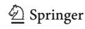

- Ding Y, Qin H, Yan Q, Chai Z, Liu J, Wei X, Liu X (2022) Towards accurate post-training quantization for vision transformer. In: Proceedings of the international conference on multimedia (MM'22), Lisbon, Portugal, pp 5380–5388
- Li Z, Yang T, Wang P, Cheng J (2022) Q-vit: fully differentiable quantization for vision transformer. arXiv:2201.07703
- Liu Z, Wang Y, Han K, Zhang W, Ma S, Gao W (2021) Post-training quantization for vision transformer. Adv Neural Inf Process Syst 34:28092–28103
- He Y, Zhang X, Sun J (2017) Channel pruning for accelerating very deep neural networks. In: Proceedings of the international conference on computer vision (ICCV'17), Venice, Italy, pp 1389– 1397
- Rao Y, Lu J, Lin J, Zhou J (2018) Runtime network routing for efficient image classification. IEEE Trans Pattern Anal Mach Intell 41(10):2291–2304
- Zhu M, Tang Y, Han K (2021) Vision transformer pruning. arXiv:2104.08500
- Yu F, Huang K, Wang M, Cheng Y, Chu W, Cui L (2022) Width & depth pruning for vision transformers. In: Proceedings of the international conference on artificial intelligence (AAAI'22), vol. 36. Virtual event, pp 3143–3151
- 53. Yu X, Liu T, Wang X, Tao D (2017) On compressing deep models by low rank and sparse decomposition. In: Proceedings of the international conference on computer vision and pattern recognition (CVPR'17), Honolulu, HI, USA, pp 7370–7379
- Jaderberg M, Vedaldi A, Zisserman A (2014) Speeding up convolutional neural networks with low rank expansions. arXiv:1405.3866
- Hinton G, Vinyals O, Dean J (2015) Distilling the knowledge in a neural network. arXiv:1503.02531
- Liu B, Rao Y, Lu J, Zhou J, Hsieh CJ (2020) Metadistiller: network self-boosting via meta-learned top-down distillation. In: Proceedings of the european conference on computer vision (ECCV'20), Glasgow, Scotland, UK. Springer, pp 694–709
- Wang W, Wei F, Dong L, Bao H, Yang N, Zhou M (2020) Minilm: deep self-attention distillation for task-agnostic compression of pre-trained transformers. Adv Neural Inf Process Syst 33:5776– 5788
- Liu Y, Bech P, Tamura K, Délez LT, Crochet S, Petersen CCH (2024) Cell class-specific long-range axonal projections of neurons in mouse whisker-related somatosensory cortices. eLife 13:97602. https://doi.org/10.7554/eLife.97602.3
- Chen X, Cao Q, Zhong Y, Zhang J, Gao S, Tao D (2022) Dearkd: data-efficient early knowledge distillation for vision transformers. In: Proceedings of the international conference on computer vision and pattern recognition (CVPR'22), New Orleans, LA, USA, pp 12052–12062
- Touvron H, Cord M, Douze M, Massa F, Sablayrolles A, Jégo H (2021) Training data-efficient image transformers & distillation through attention. In: Proceedings of the International Conference on Machine Learning (ICML'21), Virtual event. PMLR, pp 10347–10357
- 61. Jiao X, Yin Y, Shang L, Jiang X, Chen X, Li L, Wang F, Liu Q (2020) TinyBERT: distilling BERT for natural language understanding. In: Findings of the association for computational linguistics: EMNLP'20. Virtual event. Association for Computational Linguistics, pp 4163–4174
- Guo Q, Qiu X, Liu P, Shao Y, Xue X, Zhang Z (2019) Startransformer. arXiv:1902.09113
- Roy A, Saffar M, Vaswani A, Grangier D (2021) Efficient contentbased sparse attention with routing transformers. Trans Assoc Comput Ling 9:53–68
- 64. Gregor K, Danihelka I, Graves A, Rezende D, Wierstra D (2015) Draw: a recurrent neural network for image generation. In: Proceedings of the international conference on machine learning (ICML'15), Lille, France. PMLR, pp 1462–1471

- Li Y, Liu A, Fu X, Mckeown MJ, Wang ZJ, Chen X (2022) Atlasguided parcellation: individualized functionally-homogenous parcellation in cerebral cortex. Comput Biol Med 150:106078
- 66. Grainger R, Paniagua T, Song X, Cuntoor N, Lee MW, Wu T (2023) PaCa-ViT: learning patch-to-cluster attention in vision transformers. In: Proceedings of the IEEE/CVF conference on computer vision and pattern recognition (CVPR'23), Vancouver, British Columbia, Canada, pp 18568–18578
- 67. Kim M, Gao S, Hsu YC, Shen Y, Jin H (2024) Token fusion: bridging the gap between token pruning and token merging. In: Proceedings of the IEEE/CVF winter conference on applications of computer vision (WCAV'24), Waikoloa, HI, USA, pp 1383–1392
- Meng L, Li H, Chen BC, Lan S, Wu Z, Jiang YG, Lim SN (2022) Adavit: adaptive vision transformers for efficient image recognition. In: Proceedings of the international conference on computer vision and pattern recognition (CVPR'22), New Orleans, LA, USA, pp 12309–12318
- 69. Le Lan C, Tu S, Oberman A, Agarwal R, Bellemare MG (2022) On the generalization of representations in reinforcement learning. In: Proceedings of the international conference on artificial intelligence and statistics (AISTATS'22). Virtual event. PMLR, vol 151, pp 4132–4157
- Arulkumaran K, Deisenroth MP, Brundage M, Bharath AA (2017)
   Deep reinforcement learning: a brief survey. IEEE Signal Process Mag 34(6):26–38
- 71. Watkins CJCH, Dayan P (1992) Q-learning. Mach Learn 8:279–292
- Fan J, Wang Z, Xie Y, Yang Z (2020) A theoretical analysis of deep Q-learning. In: Proceedings of the international conference on learning for dynamics and control (L4DC'20), Berkeley, CA, USA. PMLR, pp 486–489
- Schulman J, Wolski F, Dhariwal P, Radford A, Klimov O (2017) Proximal policy optimization algorithms. arXiv:1707.06347
- Mnih V, Badia AP, Mirza M, Graves A, Lillicrap T, Harley T, Silver D, Kavukcuoglu K (2016) Asynchronous methods for deep reinforcement learning. In: Proceedings of the international conference on machine learning and computer application (ICML'2016), New York, NY, USA. PmLR, pp 1928–1937
- De La Fuente N, Guerra DAV (2024) A comparative study of deep reinforcement learning models: DQN vs PPO vs A2C. In: Proceedings of the ACM knowledge discovery and data mining (ACM KDD'24), Barcelona, Spain
- Sutton RS, Barto AG (2018) Reinforcement learning: an introduction. MIT Press
- Huber PJ (1992) Robust estimation of a location parameter.
   In: Breakthroughs in statistics: methodology and distribution.
   Springer, pp 492–518
- 78. Liu R, Zou J (2018) The effects of memory replay in reinforcement learning. In: Proceedings of the annual allerton conference on communication, control, and computing (Allerton'18), Monticello, IL, USA. IEEE, pp 478–485
- Lin LJ (1992) Self-improving reactive agents based on reinforcement learning, planning and teaching. Mach Learn 8:293–321
- Even-Dar E, Mansour Y, Bartlett P (2003) Learning rates for Qlearning. J Mach Learn Res 5(1). MIT Press
- Guo J (2023) Online influence maximization: concept and algorithm. arXiv:2312.00099
- Chen W, Wang Y, Yuan Y (2013) Combinatorial multi-armed bandit: general framework and applications. In: Proceedings of the international conference on machine learning (ICML 2013). PMLR, pp 151–159
- Chen W, Hu W, Li F, Li J, Liu Y, Lu P (2016) Combinatorial multi-armed bandit with general reward functions. Adv Neural Inf Process Syst 29. NeurIPS

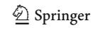

607 Page 26 of 26 F. Cauteruccio et al.

84. Beyer L, Zhai X, Kolesnikov A (2022) Better plain ViT baselines for ImageNet-1k. arXiv:2205.01580

- 85. Haurum JB, Escalera S, Taylor GW, Moeslund TB (2023) Which tokens to use? investigating token reduction in vision transformers. In: Proceedings of the IEEE/CVF international conference on computer vision (ICCV'23), Paris, France, pp 773–783
- Zhang S, Sutton RS (2017) A deeper look at experience replay. arXiv:1712.01275
- 87. Akaike H (1974) A new look at the statistical model identification. IEEE Trans Autom Control 19(6):716–723

**Publisher's Note** Springer Nature remains neutral with regard to jurisdictional claims in published maps and institutional affiliations.

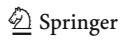