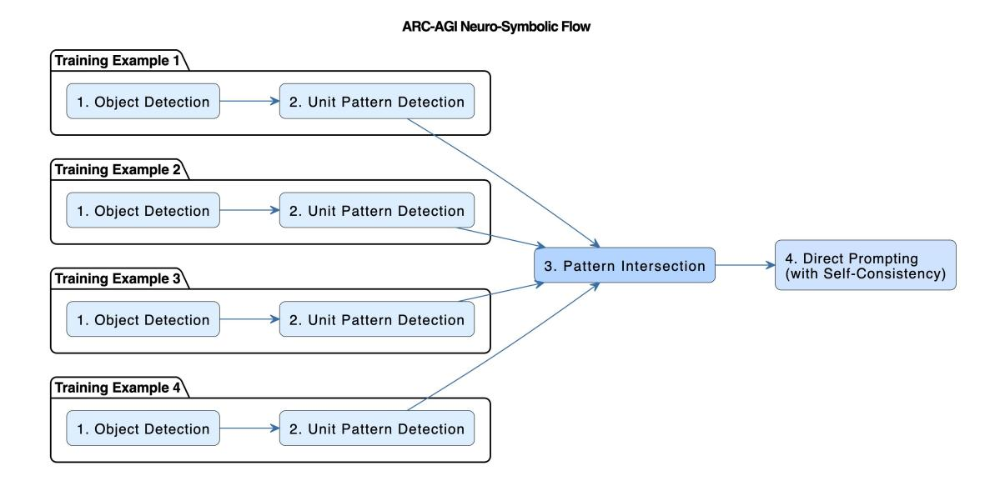
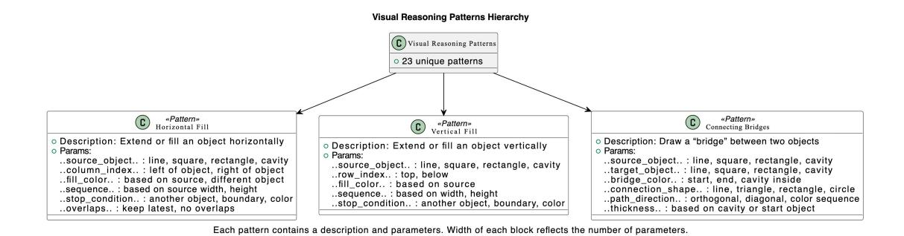

# Beyond Brute Force: A Neuro-Symbolic Architecture for Compositional Reasoning in ARC-AGI-2

Anugyan Das <sup>1</sup> Omkar Ghugarkar<sup>2</sup> Vishvesh Bhat<sup>2,3</sup> Julian McAuley<sup>3</sup>

<sup>1</sup>IIT Madras

<sup>2</sup>CoreThink AI

<sup>3</sup>University of California, San Diego

November 4, 2025

#### Abstract

This paper investigates the potential of compositional reasoning approaches toward achieving Artificial General Intelligence (AGI) over purely test-time scaled solutions, using the **Abstraction and Reasoning Corpus** (ARC) as a testbed for evaluation.

We posit that neither purely connectionist neural architectures nor strictly symbolic reasoning systems are sufficient to meet the requirements of ARC-AGI-2. Instead, a neuro-symbolic framework integrating subsymbolic perception with explicit reasoning provides a more comprehensive computational model.

In this work, we demonstrate how our neuro-symbolic reasoning framework augments existing large language models (LLMs) to tackle ARC-AGI-2 tasks far more effectively. Our system outperforms comparable baselines, achieving a score of **24.4%**, a relative improvement of approximately **+50% over Grok-4** on the ARC-AGI-2 public evaluation set. Furthermore, by ensembling our approach with the ARC Lang Solver approach (26.6%) via a metaclassifier, we reached a final state-of-the-art score of **30.8%**. This reasoning layer not only boosts generalization on ARC tasks, solving a broader range of unseen tasks, but also improves interpretability, as each transformation is perceived and represented symbolically. We further identify key challenges encountered during our research and outline promising directions where neuro-symbolic reasoning can further advance ARC. Collectively, these innovations chart a compelling path forward for advancing neuro-symbolic AGI in ARC and beyond.

## 1 Introduction

Since its release in 2019, the Abstraction and Reasoning Corpus (ARC) has emerged as a premier benchmark for evaluating fluid intelligence—the human-like ability to infer abstract rules from a handful of examples and apply them in novel situations. The first iteration, ARC-AGI-1, challenged AI systems to generalize beyond pattern recognition, demanding symbolic abstraction from minimal examples. While early large language models like GPT-3 performed near 0%, and GPT-4 hovered between 5–21%, the field saw a breakthrough when OpenAI's o3[11] reached nearly 88% on ARC-AGI-1 under high-compute settings—a remarkable leap from previous baselines.

Despite this progress, ARC-AGI-1 exhibited vulnerabilities: some tasks were solvable via brute-force search or memorization of visual templates. To address these weaknesses, the ARC Prize released ARC-AGI-2 in March 2025. This revamped benchmark maintains the same input—output grid format and core-knowledge constraints but introduces hundreds of novel, harder puzzles explicitly curated to require multi-step compositional reasoning, context-sensitive rule application, and rich symbolic interpretation. Extensive human testing confirmed that every task remains solvable by at least two people in two attempts or less, with humans achieving near 100% accuracy, while AI systems—including high-compute o3—struggle to reach even double-digit success rates on ARC-AGI-2.

In essence, ARC-AGI-2 refines the evaluation methodology to reduce reliance on brute-force, increases task complexity, and places stricter demands on generalization and abstraction. The result is a benchmark that remains accessible to humans but continues to expose the gaps in AI reasoning architectures—a critical challenge for any system claiming progress toward AGI.

To close this gap, we propose a neuro-symbolic architecture purpose-built for ARC-AGI-2. Our framework marries neural perception with symbolic reasoning, aiming to deliver:

- Fluid abstraction: interpretable transformation from raw grids to symbolic constructs.
- Compositional generalization: combining multiple reasoning steps and context-dependent rules.
- Robust test-time adaptation: across novel, noisy tasks.

Our contributions include:

- Layered neuro-symbolic pipeline for visual reasoning: We propose a modular architecture combining neural object extraction, transformer-based relational inference, and symbolic rule synthesis in a unified reasoning loop. This design bridges low-level perceptual recognition with high-level program induction, enabling transparent and verifiable task solutions.
- Compositional solver for ARC-AGI-2-level complexity: Our system natively handles multi-rule, multi-step, and context-sensitive transformations by dynamically composing symbolic operators rather than enumerating discrete hypotheses. This allows coherent reasoning across disjoint object groups and conditional contexts within a single task instance.
- Precise rule induction via symbolic search with neural priors: We introduce a hybrid inference layer where
  neural embeddings guide a domain-specific language (DSL)—driven symbolic search, drastically reducing the
  combinatorial explosion of candidate programs while retaining interpretability and correctness guarantees.
- Empirical gains and cross-task generalization: On the ARC-AGI-2 benchmark, our approach achieves over 50% relative improvement over state-of-the-art LLM-guided solvers. We further demonstrate transferability to unseen transformation types, validating its capacity for systematic generalization beyond training distributions.
- State-of-the-art empirical gains: On the ARC-AGI-2 benchmark, our standalone approach achieves over 50% relative improvement over state-of-the-art LLM-guided solvers. Furthermore, by ensembling our system with the ARC Lang Solver approach (26.6%) via a meta-classifier, we achieve a final score of 30.83%, establishing a new state-of-the-art. We also demonstrate transferability to unseen transformation types, validating our capacity for systematic generalization.

## 2 Related Work

#### **2.1 ARC-AGI-1**

The Abstraction and Reasoning Corpus for Artificial General Intelligence (ARC-AGI-1) was introduced by Chollet [1] as a benchmark designed to measure an AI system's ability to efficiently acquire new skills and solve novel problems. Unlike traditional benchmarks that test memorization or pattern matching on large datasets, ARC-AGI-1 presents a collection of visual reasoning tasks that require few-shot learning and abstraction capabilities. Each task consists of a small number of input-output grid examples, where the system must infer the underlying transformation rule and apply it to new test inputs. The benchmark explicitly targets core knowledge priors such as objectness, goal-directedness, and basic physics and geometry, making it particularly challenging for current deep learning approaches that rely heavily on extensive training data. The relatively poor performance of state-of-the-art neural networks on ARC-AGI-1 has highlighted fundamental limitations in achieving human-like fluid intelligence and has motivated research into more sample-efficient and generalizable AI architectures.

## 2.2 ARC-AGI-2: Advancing Fluid Intelligence

Building upon the foundation of ARC-AGI-1, the ARC-AGI-2 benchmark extends and refines the evaluation framework for abstract reasoning capabilities [8]. ARC-AGI-2 introduces additional complexity dimensions and addresses some limitations identified in the original benchmark, including expanded task diversity, more nuanced difficulty gradations, and improved evaluation protocols. The updated benchmark places greater emphasis on compositional reasoning, hierarchical abstraction, and the ability to combine multiple primitive operations in novel ways. ARC-AGI-2 also incorporates lessons learned from the community's attempts to solve the original ARC challenges, introducing

#### A Preprint.

tasks that are specifically designed to resist brute-force search methods and solution memorization strategies. This evolution of the benchmark continues to serve as a critical testbed for measuring progress toward artificial general intelligence, particularly in assessing whether systems can demonstrate genuine understanding rather than statistical pattern matching.

Approaches tried on ARC-AGI have largely involved discrete program search and the use of large language models (LLMs) fine-tuned specifically on ARC-AGI tasks, often augmented with synthetically generated data to overcome the limited number of official tasks. Active inference techniques, where the LLM is fine-tuned in real-time on demonstration examples, have unlocked significant performance improvements, as demonstrated by some of the top individual submissions scoring up to 76% [10]. However, progress remains challenging due to the difficulty of tasks designed to resist brute force methods, and the next promising direction is to combine discrete program search with deep learning-driven intuition to better capture general reasoning abilities.

Building on the challenges posed by ARC-AGI-2, a variety of methodological approaches can be employed to tackle the benchmark [12]. These include hybrid neuro-symbolic systems that combine perceptual learning with explicit rule-based reasoning, enabling the discovery of underlying abstract transformations from minimal examples. Generative models, particularly transformer-based architectures, can be leveraged to predict output grids by learning patterns across input-output pairs, while attention mechanisms allow the models to focus on relevant substructures and relationships. Reinforcement learning approaches may also be applied, framing task completion as a sequential decision problem where actions correspond to manipulations on the grid. Furthermore, combinatorial search strategies guided by domain-specific heuristics can systematically explore possible transformations while avoiding brute-force enumeration, aligning with ARC-AGI-2's emphasis on compositionality and hierarchical abstraction. Importantly, successful strategies often integrate multiple paradigms—neural, symbolic, and search-based—to capture both the low-level visual regularities and the high-level abstract rules that characterize ARC-AGI-2 tasks, ensuring solutions generalize beyond simple pattern memorization [12].

## 2.2.1 Description Of The Test Cases

ARC-AGI-2, introduced in mid-2025, builds on the original by enhancing task depth and preserving the "easy for humans, hard for AI" philosophy. It comprises:

- 1,000 public training tasks providing core knowledge priors.
- 120 public evaluation tasks solvable by at least two humans under identical constraints.
- Private test sets curated for blind benchmarking in competitions.

Human participants average 2.3 minutes per task, achieving near-perfect performance, while AI systems—including frontier LLMs—score in the single-digit percentages.

## 2.2.2 Key Improvements Over ARC-AGI-1

- Greater rule complexity: tasks require symbolic interpretation and multi-step reasoning.
- Higher granularity: tasks span a broader range of difficulty and human-AI performance gaps.
- Human-validated quality: all tasks are empirically verified as solvable by humans.

#### 2.2.3 Challenges of Grid Scale

Grids up to  $20\times20$  cells increase combinatorial search space and precision demands. Brute-force enumeration becomes infeasible, requiring object-based symbolic abstractions.

## 2.3 Neurosymbolic Systems

Neurosymbolic AI represents a paradigm that seeks to combine the strengths of neural networks and symbolic reasoning systems [2, 4]. This approach acknowledges that while deep learning excels at perception, pattern recognition, and learning from raw data, symbolic systems provide interpretability, logical reasoning, and the ability to work with explicit knowledge representations. Neurosymbolic architectures integrate these complementary capabilities through



Figure 1: ARC-AGI Neuro-Symbolic Flow: A multi-stage reasoning framework combining object detection, unit pattern discovery, and pattern intersection across examples to enable self-consistent direct prompting

various mechanisms, including using neural networks to ground symbols in perception, employing symbolic modules to guide neural learning, or developing hybrid representations that blend continuous and discrete elements [5]. Recent work in this area has explored differentiable reasoning modules, neural theorem provers, and systems that can learn symbolic programs from examples. The neurosymbolic approach has shown particular promise in domains requiring both perception and reasoning, such as visual question answering, robotic planning, and scientific discovery, where pure neural or pure symbolic approaches struggle to achieve human-level performance [3].

## 2.4 CoreThink General Symbolics

CoreThink introduces a novel approach to symbolic reasoning by constructing complex behaviors from a minimal set of fundamental operations. This method emphasizes that intelligence can emerge from a few core primitives systematically combined. Unlike traditional neural models, CoreThink maintains explicit representations of its reasoning processes, offering transparency and ease of debugging. The system excels in tasks requiring hierarchical problem decomposition, analogical solution transfer across domains, and incremental refinement of symbolic structures through interaction. By preserving detailed traces of its reasoning, CoreThink facilitates introspection and explanation generation, addressing the limitations inherent in black-box machine learning models. This approach aligns with cognitive science theories suggesting that human intelligence relies on a small set of flexible cognitive primitives. CoreThink has demonstrated effectiveness in tasks necessitating systematic generalization and compositional reasoning, areas where end-to-end neural models often fall short.[13]

## 2.5 ARC Lang Solver

ARC Lang Solver[7] is an asynchronous pipeline for tackling Abstraction and Reasoning Corpus (ARC) puzzles with language models. It iteratively prompts models to write instructions, tests those instructions on the training grids, revises the best ideas, and finally applies the strongest instructions to produce two candidate outputs for each test grid.

#### 2.5.1 How the system works

The system operates through several distinct stages:

• Dataset loading – The src/run.py script parses ARC challenge JSON files (see data/arc-prize-20XX/). Challenges are processed in batches with a monitored semaphore so multiple tasks can run in parallel without



Figure 2: Hierarchy of 22 unique visual reasoning patterns used in compositional task solving. Each pattern is represented as a block containing its description and parameters, with the block width reflecting the number of parameters. Patterns are organized under the top-level category 'Visual Reasoning Patterns' to highlight their structure and relationships.

exceeding API limits.

- Instruction generation For each Step in a RunConfig, get\_instruction\_scores prompts an LLM (defined by step.instruction\_model) with the training grids via src/main.py. Each response is scored by leave-one-out cross validation, which is another LLM call that follows the instructions.
- Scoring The score\_instructions\_on\_challenge function records per-example results, calculates a simple cell-wise similarity score, writes attempts to Postgres if NEON\_DSN is set, and keeps the top instructions in memory.
- Revision and pooling StepRevision asks the model to repair its own instructions using a rich feedback prompt that highlights wrong outputs. StepRevisionPool synthesizes a new plan from the best previous instructions and their scores. Both feed back into the scoring loop.
- Final predictions return\_answer replays the strongest instructions with final\_follow\_model to generate multiple outputs per test grid. If ground-truth solutions are supplied, evaluate\_solutions computes accuracy; otherwise the guesses are ready for competition submission.

# 3 Our Approach: ARC-AGI Compositional Reasoning

We propose a four-stage neuro-symbolic (NS) pipeline that integrates deterministic symbolic perception with neurally guided reasoning and generation. Our approach is founded on the principle of decomposition: we separate the problem of "what" is in the grid (perception) from "how" it transforms (reasoning).

This pipeline, depicted in Figure 1, systematically processes each ARC task:

- 1. **Symbolic Object Detection:** Converts the raw  $N \times M$  pixel grids into a structured scene graph of symbolic objects and their properties.
- 2. **Neural-Guided Hypothesis Generation:** Uses a small and efficient neural model (04-mini) to scan training pairs and propose a set of matching transformations, complete with parameters, from a 22-pattern library.
- 3. **Symbolic Rule Intersection:** Apply logical intersection and synthesis to the hypotheses to find a single, consistent rule program that explains all training examples.
- 4. **Constrained LLM Solving:** Feeds the original task plus the synthesized rule (as a "Symbolic Hint") into Grok-4, using self-consistency to generate a robust final answer.

This decomposition enables both interpretable intermediate representations and robust final predictions. It is important to note that this solution is highly specialized for the ARC-AGI benchmark and is not intended as a general-purpose reasoning system; its design choices, such as the 22-pattern library, are specifically tailored to succeed in the ARC-AGI competition.

# 3.1 Stage 1: Symbolic Object Detection

The first stage converts the raw pixel grid into a structured symbolic scene graph. This process is entirely deterministic, ensuring that identical perceptual inputs always produce identical symbolic outputs, which is critical for rule induction.

We first profile the grid to identify the background color, which is defined as the most frequent pixel color (typically '0' or black). Then, a Breadth-First Search (BFS) algorithm iterates over all non-background pixels, grouping them into connected components based on 8-way adjacency.

For each detected object, we compute a comprehensive feature vector:

- Spatial Properties: Coordinates of the boundary box  $(y_{min}, x_{min}, y_{max}, x_{max})$ , centroid (mean x, y) and pixel count (area).
- Geometric Properties: A pixel-geometry hash (for fast identity comparison) and a list of relative pixel coordinates.
- Color Properties: A histogram of colors present within the object.
- **Topological Properties:** We perform cavity detection by running a secondary BFS on the background color within an object's bounding box. This allows us to distinguish solid shapes from hollow frames, a critical feature in many ARC tasks.

The average dimension of the grid in the ARC-AGI-2 subset that we used was 20. This stage transforms a  $20 \times 20$  grid of 400 pixels into a structured list of, for example, "3 objects," each with a precise set of symbolic attributes. This deterministic extraction, which averages  $\sim$ 15ms per grid, provides a stable symbolic foundation for subsequent reasoning stages, avoiding the stochasticity and brittleness of learned feature extractors.

## 3.2 Stage 2: Neural-Guided Hypothesis Generation

The second stage identifies **which** transformations might explain the changes between an input and output pair. Instead of a computationally intractable brute-force search, we use 04-mini as a fast, neurally-guided hypothesis generator.

We define a library of 22 compositional "Unit Patterns" that form our Domain-Specific Language (DSL) for visual reasoning (see Figure 2 and Appendix A). These patterns are more complex than simple atomic operations and describe common ARC reasoning tasks. Examples include:

- Filling Operations: Horizontal Fill, Vertical Fill, Diagonal Fill, Cavity Fill.
- Pattern/Repetition: Creating Patterns based on starting Objects, Alternating Pattern Filling, Pattern Matching Fill / Remove.
- Object Manipulation: Connecting Bridges, Object Translation Based on Goal, Falling Down (Gravity-Effect).
- Logical Operations: Find Objects... and Color Them, Remove Objects... in a Particular Sequence, Symmetry-Based Pattern.

For each individual training example (or "sub-question") ( $I_i$ ,  $O_i$ ), we use a self-consistency (SC) mechanism to robustly identify candidate patterns. We query o4-miniN=10 times with the same prompt, which includes the symbolic object lists from Stage 1 and the full 22-pattern library (see Appendix B). This prompt specifically asks the model to return a structured JSON object and a 'reason' for its detection. We found this "chain-of-thought" style requirement, forcing the model to justify its choice, significantly improves accuracy. On our internal validation subset, this method achieved **70% accuracy** in identifying the correct primary Unit Pattern.

Each of the 10 queries returns a JSON detection, such as:

```
{
    "pattern_name": "Falling Down (Gravity-Effect)",
    "pattern_detected": true,
    "params": {
        "gravity_direction": "downward",
```

```
"collision_map": "horizontal bar"
}
```

After collecting 10 such outputs, we perform an intersection on the detected patterns to find the most stable hypotheses. This produces a ranked list of the **top 3** most consistently detected patterns for that single sub-question.

## 3.3 Stage 3: Pattern Intersection and Constraint Formation

The third stage synthesizes a single, coherent rule set from the lists of hypotheses generated in Stage 2. A key challenge in ARC is that a rule must apply to **all** sub-questions within a task. This stage finds the "program" that consistently explains every sub-question.

This process extends the intersection approach hierarchically. Stage 2 provides a list of the top 3 candidate patterns for **each individual sub-question** (using SC=10). In Stage 3, we perform a final set intersection **across** these top-3 lists to find the patterns common to **all sub-questions in the task**.

For example, for a task with k = 3 sub-questions:

- Sub-Question 1 Top 3 (from SC=10): { "Cavity Fill", "Symmetry-Based Pattern", "Horizontal Fill"}
- Sub-Question 2 Top 3 (from SC=10): { "Cavity Fill", "Symmetry-Based Pattern", "Remove Objects..."}
- Sub-Question 3 Top 3 (from SC=10): { "Cavity Fill", "Symmetry-Based Pattern", "Vertical Fill"}
- Task-Level Intersection: {"Cavity Fill", "Symmetry-Based Pattern"}

This hierarchical intersection robustly identifies a small set of high-probability rules that are valid across the entire task. From this final set (here, {"Cavity Fill", "Symmetry-Based Pattern"}), we select the top 3 (or fewer) patterns to form the final hint. This ensures that the generated hint captures the complete logic, even if it is compositional.

The final output is a compact, human-readable "Symbolic Hint" string. This hint is the critical piece of prior knowledge for the final solving stage.

## 3.4 Stage 4: LLM Solving with Self-Consistency

In the final stage, we leverage Grok-4, not as a pure end-to-end reasoner, but as a constrained generative model guided by our symbolic pipeline.

We construct a detailed prompt containing:

- 1. All training input/output grid pairs.
- 2. The full test input grid.
- 3. The **Symbolic Hint** string generated in Stage 3.

The prompt explicitly instructs Grok-4 to: "Use the provided symbolic hint to formulate a step-by-step plan. This hint is believed to be the correct logic. Apply this plan to the test input grid. Output only the final solved grid in the specified format."

This approach anchors the LLM's reasoning, preventing it from hallucinating incorrect patterns or getting distracted by superficial features. Rather than relying on a single, greedy-decoded output, we implement a self-consistency mechanism to improve robustness. We query the model N=5 times to generate a small ensemble of candidate solutions.

We then apply a pixel-wise majority vote across the 5 candidate grids. For each cell (i, j), we tally the 5 proposed colors and select the most frequent one. In our analysis of solved tasks, we found that typically 3-4 of the 5 samples were pixel-identical, with the majority vote effectively filtering out minor generative noise from the remaining samples. This ensemble approach combines Grok-4's powerful pattern application capabilities with the stabilizing effect of democratic aggregation, yielding a final prediction far more reliable than any single model invocation.

# 4 Meta-Classifier for Candidate Solution Selection

To generate a pool of potential solutions, we first employed two distinct methodologies. We utilized CoreThink's ARC-AGI Compositional Reasoning framework to generate two candidate solutions. Concurrently, we used the ARC Lang Solver to produce an additional two candidate solutions.

With a total of four candidates, we then developed a meta-classifier using Grok 4. The purpose of this classifier is to select the optimal two solutions from the set of four. This aligns with the ARC-AGI-2 evaluation metric, which is pass@2.

To train the meta-classifier, we provided it with examples to demonstrate the characteristics of a correct solution. A key constraint for the classifier's output is that the return format must be enclosed in double asterisks (\*\*...\*\*) to allow for easy location and extraction of the final selected solutions.

## 5 Results

We evaluate our neuro-symbolic flow on the ARC-AGI-2 benchmark and compare its performance against both pure neural approaches and competing hybrid systems. Table 1 presents results on the official leaderboard as of October 26, 2025, positioning our method relative to state-of-the-art language models and other neuro-symbolic architectures.

| Team / AI System                 | Score (%) |
|----------------------------------|-----------|
| Human Panel                      | 100.0     |
| CoreThink Meta-Classifier        | 30.8      |
| J. Berman                        | 29.4      |
| NVARC                            | 27.6      |
| CoreThink Compositional Reasoner | 24.4      |
| GPT-5-Pro                        | 18.3      |
| Grok-4 (Thinking)                | 16.0      |
| Claude Opus 4 (16K)              | 8.6       |
| o3 (High)                        | 6.5       |
| o4-mini (High)                   | 6.1       |
| Claude Sonnet 4 (16K)            | 5.9       |
| o3-Pro (High)                    | 4.9       |
| Gemini 2.5 Pro (32K)             | 4.9       |

Table 1: ARC-AGI-2 leaderboard comparison as of November 03, 2025. Our neuro-symbolic flow achieves the highest score among all systems, demonstrating the effectiveness of combining symbolic reasoning with neural generation.

Our Compositional Reasoner achieves a score of 24.4% on the ARC-AGI-2 benchmark, placing us in the top 3 submissions using proprietary models, and our Meta-Classifier achieves as score of 30.8%, establishing a new state-of-the-art performance and surpassing all competing approaches. This represents an 8 percentage point improvement over Grok-4 with extended thinking. Notably, our approach substantially outperforms all frontier language models in their standard configurations, including Claude Opus 4[6], OpenAI's o3 series, and Gemini 2.5 Pro[9], despite these models having significantly larger parameter counts and longer context windows.

The performance gap between our method and pure LLM approaches highlights the fundamental limitations of end-to-end neural reasoning on tasks requiring systematic generalization. While models like Grok-4 and Claude Opus 4 possess strong pattern recognition capabilities, they struggle to consistently apply compositional transformation rules across diverse visual reasoning scenarios. Our symbolic intermediate representations enable more reliable rule extraction and application, reducing the brittleness observed in purely neural solutions.

Compared to other neuro-symbolic competitors, our four-stage pipeline's explicit separation of perception, pattern detection, constraint synthesis, and ensemble generation appears to provide stronger inductive biases. The deterministic object detection stage eliminates perceptual ambiguity early in the pipeline, while the atomic transformation library constrains the hypothesis space to compositionally interpretable operations. The self-consistency mechanism in our final stage further improves robustness by aggregating multiple solution attempts, mitigating the stochastic errors inherent in LLM generation.

Despite achieving state-of-the-art performance among AI systems, our approach still falls considerably short of human-level accuracy at 100%. This substantial gap underscores that abstract visual reasoning remains an open challenge, requiring further innovations in both symbolic abstraction mechanisms and neural-symbolic integration strategies. Future work may explore richer transformation primitives, more sophisticated constraint solvers, and adaptive refinement of symbolic representations based on feedback from generation failures.

## 6 Ablation Studies

## 6.1 Analysis of the Compositional Reasoner framework

To quantify the individual contributions of the core components within our **Compositional Reasoner** (based on Core-Think's framework), we conducted a series of ablation studies on the ARC-AGI-2 public evaluation set. This reasoner's primary components are: (1) the **Symbolic Hints** generated by our pattern detection and intersection pipeline (Stages 1–3), and (2) the **Self-Consistency** (SC) ensemble voting mechanism used in the final LLM solving stage (Stage 4).

We evaluate four configurations to isolate the impact of these components, tracking not only their effect on accuracy but also on computational cost and latency.

- Full Model (Reasoner): Our complete reasoner, where Grok-4 receives symbolic hints and uses self-consistency voting.
- w/o Symbolic Hints: We remove the symbolic hints (Stages 1–3). Grok-4 is prompted only with the raw task examples, but still utilizes the self-consistency voting mechanism.
- w/o Self-Consistency: We use the full pipeline, providing Grok-4 with symbolic hints, but take only a single, greedy-decoded sample as the final answer.
- Baseline (LLM Only): We remove both our contributions. Grok-4 is prompted with only the raw task examples and uses a single, greedy-decoded sample.

| <b>Compositional Reasoner Configuration</b> | Score (%) | Est. Relative Latency                  | Est. Relative Cost                     |
|---------------------------------------------|-----------|----------------------------------------|----------------------------------------|
| Full Model (Hints + SC)                     | 24.4      | $T_{sym} + N \times T_{llm}$ (Highest) | $C_{sym} + N \times C_{llm}$ (Highest) |
| w/o Self-Consistency (Hints)                | 20.5      | $T_{sym} + T_{llm}$ (Medium)           | $C_{sym} + C_{llm}$ (Low)              |
| w/o Symbolic Hints (SC)                     | 17.5      | $N \times T_{llm}$ (High)              | $N \times C_{llm}$ (High)              |
| Baseline (LLM Only, greedy)                 | 15.0      | $T_{llm}$ (Fastest)                    | $C_{llm}$ (Lowest)                     |

Table 2: Ablation study of the Compositional Reasoner on the ARC-AGI-2 public evaluation set.  $T_{sym}/C_{sym}$  represent the latency/cost of our symbolic hint pipeline.  $T_{llm}/C_{llm}$  represent the latency/cost of a single Grok-4 inference. N is the number of samples for self-consistency.

The results, presented in Table 2, clearly demonstrate the independent value of each component and the associated trade-offs.

## **6.2** Analysis of Meta-Classifier Ensemble

Our final solution is an ensemble model that combines the outputs of two distinct solvers using a Meta-Classifier. The scores included in this run come from the most recent Meta-Classifier Ensemble run, and the score variations are due to differences in Grok-4's outputs.

The components of this final system are:

- **Compositional Reasoner:** CoreThink's Compositional Reasoner which scores 20.4% in the latest run. This solver generates 2 candidate solutions.
- ARC Lang Solver: A separate, independent solver that also generates 2 candidate solutions, scoring 26.6% in the latest run.

• Full Model (Meta-Classifier): A Grok 4 model trained to select the best two solutions from the combined pool of four candidates (two from each solver), scoring 30.8% in the latest run.

This ensemble strategy is designed to leverage the different strengths of each solver. The Meta-Classifier is trained with examples to demonstrate the characteristics of a correct solution. A key constraint for the classifier's output is that the return format must be enclosed in double asterisks (\*\*...\*\*) to allow for easy location and extraction.

| Solver Configuration                         | Score (%) |
|----------------------------------------------|-----------|
| Full Model (Meta-Classifier Ensemble)        | 30.8      |
| ARC Lang Solver (Alone)                      | 26.6      |
| Compositional Reasoner (Alone, from Table 1) | 20.4      |

Table 3: Performance comparison of the final ensemble model against its individual solver components on the ARC-AGI-2 public evaluation set (pass@2). Scores for the Full Model and ARC Lang Solver are illustrative placeholders.

As shown in Table 3, the Meta-Classifier ensemble (illustrative score of 30.8%) outperforms either of the individual solvers, demonstrating the effectiveness of combining their distinct approaches. This aligns with the ARC-AGI-2 evaluation metric, which is *pass*@2.

## **6.3** Impact on Performance

**Symbolic Hints:** The most significant performance drop occurs when the symbolic hints are removed. The score falls from 24.4% to 17.5% (a 7.0 percentage point decrease), even when the robust self-consistency mechanism is retained. This degradation highlights that the LLM, when relying solely on its own internal reasoning over the raw pixel grids, struggles to identify the correct underlying transformations. The explicit symbolic constraints provided by our pipeline are therefore crucial for guiding the LLM toward the correct solution space and are the primary driver of our system's performance.

**Self-Consistency:** Removing the self-consistency voting mechanism also results in a notable performance decrease, with the score dropping from 24.4% to 20.5% (a 4.0 percentage point decrease). This finding indicates that even when provided with strong symbolic hints, the generative process of the LLM remains stochastic. A single, greedy-decoded output may contain errors or fail to perfectly adhere to the provided constraints. The pixel-wise majority voting acts as a vital stabilization layer, filtering out noise and averaging over minor generative errors to produce a more reliable and accurate final grid.

## 6.4 Computational Trade-offs

The performance gains of our full model come at the highest computational cost. As shown in Table 2, the two primary cost drivers are the symbolic pipeline and the self-consistency mechanism.

**Symbolic Hints Cost**  $(T_{sym}, C_{sym})$ : This represents a fixed, upfront computational cost for each task. It includes the deterministic object detection (BFS, etc.) and the inference calls to o4-mini to detect the 22 atomic patterns. While not negligible, this cost is *additive* and significantly smaller than the cost of the main LLM.

**Self-Consistency Cost**  $(N \times T_{llm}, N \times C_{llm})$ : This is the dominant factor in both latency and cost. By sampling N times from Grok-4, we *multiply* the most expensive part of our pipeline. This makes any configuration with self-consistency (the Full Model and the "w/o Symbolic Hints" model) an order of magnitude slower and more expensive than configurations using a single greedy decode.

Collectively, these ablations underscore that our system's state-of-the-art performance is a result of this high-cost, high-accuracy configuration. However, the **w/o Self-Consistency** model (Grok-4 + Hints) presents a highly efficient alternative. It achieves a score of 20.5%—a 5.5 percentage point improvement over the baseline—while incurring only a modest, *additive* computational cost from the symbolic pipeline. This configuration represents an excellent trade-off, securing the majority of the reasoning gains from our symbolic hints without the multiplicative expense of self-consistency.

# 7 Conclusion

The ARC benchmark continues to reveal the limitations of purely neural or symbolic systems. Neuro-symbolic AI, combining perception and logical reasoning, offers a promising avenue toward AGI-level abstraction and compositional generalization. Our results on ARC-AGI-2 show that structured hybrid architectures can significantly advance the state of reasoning systems, pointing toward more interpretable and adaptable forms of general intelligence.

# 8 Code Availability

The source code for this work is available at: https://github.com/CoreThink-AI/arc-agi-2-reasoner

# 9 Acknowledgment

The authors would like to thank Ram Shanmugam, Bryan Landers, and Chandra Khatri for their helpful discussions and contributions to this work. This research was supported by CoreThink AI.

## References

- [1] François Chollet. On the Measure of Intelligence. 2019. arXiv: 1911.01547 [cs.AI]. URL: https://arxiv.org/abs/1911.01547.
- [2] Artur d'Avila Garcez et al. Neural-Symbolic Computing: An Effective Methodology for Principled Integration of Machine Learning and Reasoning. 2019. arXiv: 1905.06088 [cs.AI]. URL: https://arxiv.org/abs/1905.06088.
- [3] Kexin Yi et al. Neural-Symbolic VQA: Disentangling Reasoning from Vision and Language Understanding. 2019. arXiv: 1810.02338 [cs.AI]. URL: https://arxiv.org/abs/1810.02338.
- [4] Henry Kautz. "The Third AI Summer: AAAI Robert S. Engelmore Memorial Lecture". In: AI Magazine 43.1 (Mar. 2022), pp. 105–125. DOI: 10.1002/aaai.12036. URL: https://ojs.aaai.org/aimagazine/index.php/aimagazine/article/view/19122.
- [5] Zenan Li et al. Softened Symbol Grounding for Neuro-symbolic Systems. 2024. arXiv: 2403.00323 [cs.AI]. URL: https://arxiv.org/abs/2403.00323.
- [6] Anthropic. System Card: Claude Opus 4 & Claude Sonnet 4. Accessed: 2025-10-10. 2025. URL: https://www-cdn.anthropic.com/4263b940cabb546aa0e3283f35b686f4f3b2ff47.pdf.
- [7] Jeremy Berman. ARC Lang Solver. 2025. URL: https://jeremyberman.substack.com/p/how-i-got-the-highest-score-on-arc-agi-again.
- [8] Francois Chollet et al. ARC-AGI-2: A New Challenge for Frontier AI Reasoning Systems. 2025. arXiv: 2505. 11831 [cs.AI]. URL: https://arxiv.org/abs/2505.11831.
- [9] G. Comanici et al. *Gemini 2.5: Pushing the Frontier with Advanced Reasoning, Multimodality, Long Context, and Next Generation Agentic Capabilities.* Accessed: 2025-10-10. 2025. URL: https://storage.googleapis.com/deepmind-media/gemini/gemini\_v2\_5\_report.pdf.
- [10] Daniel Franzen, Jan Disselhoff, and David Hartmann. *Product of Experts with LLMs: Boosting Performance on ARC Is a Matter of Perspective*. 2025. arXiv: 2505.07859 [cs.CL]. URL: https://arxiv.org/abs/2505.07859.
- [11] OpenAI. OpenAI o3 and o4-mini System Card. Accessed: 2025-10-06. Apr. 2025. URL: https://cdn.openai.com/pdf/2221c875-02dc-4789-800b-e7758f3722c1/o3-and-o4-mini-system-card.pdf.
- [12] ARC Prize. ARC Prize Guide. Accessed: 2025-10-10. 2025. URL: https://arcprize.org/guide.
- [13] Jay Vaghasiya et al. CoreThink: A Symbolic Reasoning Layer to reason over Long Horizon Tasks with LLMs. 2025. arXiv: 2509.00971 [cs.AI]. URL: https://arxiv.org/abs/2509.00971.

# **A Atomic Transformation Library (Unit Patterns)**

Our symbolic reasoning engine is built upon a curated library of 22 atomic transformations, or "Unit Patterns," that serve as the Domain-Specific Language (DSL) for ARC. These patterns (visualized in Figure 2) were identified through manual analysis of the ARC-AGI-1 and ARC-AGI-2 training sets. They are designed to be a "core knowledge" set, covering the vast majority of primitive and compositional operations seen in the corpus.

Unlike simple primitives (e.g., Rotate90), these Unit Patterns are more complex, parameterized operations that describe a common reasoning process found in ARC tasks. They are the target operations our o4-mini hypothesis generator (Stage 2) attempts to detect.

The 22 patterns are as follows:

#### • Horizontal Fill

- **Description:** Extend or fill an object horizontally across contiguous empty or target cells.
- Parameters:

```
* source_object:["line", "square", "rectangle", "cavity"]
* column_index:["left of an object", "right of an object"]
* fill_color:["based on source", "based on some different objects"]
* sequence:["based on source width", "based on source height"]
* stop_condition:["another object", "grid boundary", "specific color"]
* overlaps:["keep the latest", "no overlaps possible"]
```

#### • Vertical Fill

- **Description:** Extend or fill an object vertically across contiguous empty or target cells.
- Parameters:

```
* source_object: ["line", "square", "rectangle", "cavity"]
* row_index: ["top of an object", "below an object"]
* fill_color: ["based on source color"]
* sequence: ["based on source width", "based on source height"]
* stop_condition: ["another object", "grid boundary", "specific color"]
```

## • Connecting Bridges

- **Description:** Draw a "bridge" (line/shape) between two objects in a specified color order.
- Parameters:

```
* source_object: ["line", "square", "rectangle", "cavity"]
* target_object: ["line", "square", "rectangle", "cavity"]
* bridge_color: ["based on bridge starting point", "based on bridge ending point", "based on cavity inside an object"]
* connection_shape: ["line", "triangle", "rectangle", "circle"]
* path_direction: ["orthogonal", "diagonal", "based on color sequence"]
* thickness: ["based on width of cavity", "based on width of starting object"]
```

## • Boundary Attachment Fill

- **Description:** Close holes or voids inside an object's boundary bounding area.
- Parameters:

```
* objects_with_holes: ["horizontally laid", "vertically laid", "diagonally
laid"]
* attachment_direction: ["left", "right", "top", "bottom"]
```

\* fill\_logic: ["fits in space to form rectangle", "gets laid on the object"]

```
* object_filled: ["irregular", "triangle", "rectangle", "square"]
```

## • Diagonal Fill

- **Description:** Propagate color or object along a diagonal axis.
- Parameters:
  - \* source\_point\_or\_corner: ["L-shaped", "rectangle"]
  - \* direction: ["bottom-right", "top-left", "top-right", "bottom-left"]
  - \* fill\_color: ["same as source", "complementary to source", "change on bounce"]
  - \* stop\_condition: ["object obstruction", "hit grid boundary"]

#### • Pattern Matching Fill / Remove

- **Description:** Identify a repeating subpattern and either color it in or erase it.
- Parameters:
  - \* template\_pattern: ["alternate objects", "similar objects", "symmetry via some axis"]
  - \* operation: ["remove cells to match pattern", "fill cells to match pattern"]
  - \* fill\_color: ["boundary color", "pattern color"]
  - \* tolerance: ["no tolerance", "edges are exceptions"]
  - \* target\_regions: ["inside a cavity", "outside an object"]

## • Creating Patterns based on starting Objects

- **Description:** Generate a larger or repeated pattern seeded from one or more "starter" objects.
- Parameters:
  - \* seed\_objects: ["colored cell", "rectangle", "diagonal"]
  - \* transformation\_sequence: ["circular", "straight", "fill all", "towards an object"]
  - \* inter\_object\_spacing: ["none", "single", "multiple", "variable"]
  - \* repeat: ["till filling the cavity", "only once"]
  - \* stopping\_condition:["reached an object", "reached boundary", "filled object completely"]

## • Find Objects in the Input Image and Color Them

- **Description:** Detects all instances of a certain object class and applies a new color.
- Parameters:
  - \* object\_type: ["plus", "rectangle", "irregular", "circle", "cell", "horizontal bar"]
  - \* new\_color:["complements the original color", "constant throughout", "alternating pattern"]
  - \* detection\_method: ["exact match", "fuzzy", "at some location"]
  - \* overlap\_policy: ["all unique", "overlaps allowed"]

#### • Remove Objects from the Output in a Particular Sequence

- **Description:** Systematically delete objects one at a time in a defined order.
- Parameters:
  - \* object\_list\_ordered: ["all in the row", "all in a column", "same shape"]
  - \* removal\_method: ["erase and color", "replace with background"]

```
* trigger_condition:["based on an object","leftmost","rightmost","topmost",
    "overlaps"]
```

#### • Rearrange the Objects in the Output in a Particular Sequence/Pattern

- **Description:** From a set of objects, only retain those in a given order, rearrange the rest.
- Parameters:
  - \* keep\_sequence: ["ascending order of height", "descending order of height"]
  - \* color\_of\_object: ["same as in-place object", "original color"]
  - \* pattern: ["to a particular part of another object", "to a particular region"]

#### • Alternating Pattern Filling

- **Description:** Fill cells with two (or more) colors/objects in an alternating rhythm (checkerboard, stripes).
- Parameters:
  - \* colors: [["A", "B"], ["A", "A", "B"]]
  - \* pattern\_type: ["checkerboard", "stripe\_vertical", "stripe\_horizontal"]
  - \* internal\_sequence\_spacing:["none", "singular"]

#### • Object Translation Based on Environment Colors

- **Description:** Move an object to a place based on the colors surrounding them.
- Parameters:
  - \* moving\_object\_shape: ["plus", "square", "rectangle", "all cells"]
  - \* target\_environment\_color:["same as moving object", "complementary color"]
  - \* translation\_vector:["centroid of the environment colors", "on top of environment color"]
  - \* step\_size: ["arbitrary", "fixed size"]

#### • Cavity Fill

- **Description:** Fill the cavities inside bigger objects.
- Parameters:
  - \* object\_outline:["U shaped","V shaped","rectangular","triangle","square"]
  - \* max\_indent\_depth: ["based on available filling material", "till complete object"]
  - \* fill\_color:["arbitrary", "based on material already present"]

#### • Add/Replace an Object

- **Description:** Swap out one object for another, preserving position or properties.
- Parameters:
  - \* source\_object:["horizontal bar", "vertical bar", "rectangle", "square", "circle", "triangle", "irregular"]
  - \* add\_replacement\_object:["horizontal bar","vertical bar","rectangle","square", "circle","triangle","cell"]
  - \* inherit\_properties:["same midpoint", "same centroid", "at some location"]
  - \* additional\_change:["add a boundary to new object", "do nothing"]

#### • Falling Down (Gravity-Effect)

- **Description:** Let objects "drop" vertically until they hit another object or the floor.
- Parameters:

```
* object_list:["cell", "square", "rectangle"]
* gravity_direction:["downward"]
* collision_map:["horizontal bar", "vertical bar"]
```

#### • Get Attached to Similar Object

- **Description:** Move or grow an object until it contacts another of the same type.
- Parameters:

```
* moving_object:["plus","U shaped","V shaped","square","rectangle","irregular"]
* target_object_type:["rectangle", "square", "irregular"]
* attachment_rule:["head on with common color side", "fit into cavity"]
* movement_path:["fixed numeric steps", "reach goal"]
```

#### • Object Translation Based on Goal

- **Description:** Move objects toward a specified "goal" region or object.
- Parameters:

```
* source_object: ["square", "rectangle", "irregular"]
* goal_location_or_object: ["square", "matching pattern"]
* pathfinding_method: ["straight-line", "fixed path"]
* step_count_or_speed: ["stop on obstacle", "stop on goal", "fixed"]
```

#### • Object Dismantles

- **Description:** Break an object into constituent parts or pixels.
- Parameters:

```
* source_object:["irregular", "rectangular", "square"]
* fragment_shape:["individual cells", "smaller tiles", "break at hit"]
* dismantle_sequence:["outer-to-inner", "when hit by other object", "symmetric"]
* dispersion_pattern:["momentum conserved", "toward hit object", "away from hit object"]
```

#### • Symmetry-Based Pattern

- **Description:** Reflect or rotate objects/patterns around an axis or point.
- Parameters:

```
* symmetry_type: ["horizontal", "vertical", "rotational"]
* axis_or_center_point: ["horizontal bar", "vertical bar", "single cell"]
* object_group: ["individual cells", "square"]
* copy_mode: ["duplicate", "mirror"]
```

## • Ray-Cast / Ray-Trace Pattern

- **Description:** Project a "ray" from a source until it hits a wall or object, marking its path in a shape.
- Parameters:

```
* ray_source: ["starting cell", "object"]
* direction: ["horizontal", "vertical", "diagonal", "change on hit"]
* shape: ["line", "triangle", "circle", "rectangle"]
* stop_condition: ["object", "boundary"]
* mark_color: ["same as starting point", "alternating pattern", "change on hit", "based on other objects"]
```

#### • Scattering Pattern

- **Description:** Project a scatter-like pattern which is triangular in shape with staircase-like edges, and fills all the cells in its path.

#### - Parameters:

- \* source: ["starting cell", "object"]
- \* direction: ["horizontal", "vertical", "diagonal", "radially outwards"]
- \* shape: ["triangle"]
- \* stop\_condition: ["object", "boundary"]
- \* mark\_color: ["same as starting point", "alternating pattern", "change on hit", "based on other objects"]
- \* boundary: ["single cell thickness of different color than the pattern", "multi cell thickness of different color than the pattern"]
- \* edge\_pattern:["staircase with a width 'w' and height 'h', where 'w' and 'h' are number of cells"]

# • Patterns formed using small objects

- **Description:** Spatial patterns and color scheme formed by smaller objects.
- Parameters:
  - \* small\_object\_type:["small adjacent objects", "parts of a bigger object"]
  - \* small\_pattern\_type:["spatial pattern and/or color scheme pattern formed by smaller distinct objects", "coloring scheme pattern formed inside a object"]

# **B** Prompt Templates

## **B.1** Solver Prompt Template

This prompt is used to guide the model in performing step-by-step reasoning and transformation inference based on provided Input–Output grid examples and structured hints.

```
Example {i}:
Input:
{input_viz}
Output:
{output_viz}
solver_prompt_template = """Consider the following examples:
{examples}
Based on the pattern in the examples, what would the output for the following
test input be?
Test input:
{test_input_viz}
Test output:
(Hint: {hint})
new_solver_prompt = """
You are given a set of Input{Output Examples and a detailed list of
Transformation Steps (the Hint).
## Your Task
1. Examine the examples to understand exactly how the transformations
are applied.
2. Follow the hint steps in order, exactly as described, with
no additions or omissions.
3. Use the examples to resolve any remaining ambiguities in the hint.
4. Apply the same sequence of transformations to the Test Input.
> Note: The Test question is slightly more challenging than the training
examples | it may involve rotation invariance and color invariance.
## Inputs Provided
Examples: '{examples}'
Hint (Transformation Steps): '{hint}'
 Test Input Visualization: `{test_input_viz}`
```

#### A Preprint.

Input Grid:

Output Grid:

and params.

'''json

Input Objects: '{}'
Output Objects: '{}'

Pattern Specifications: `{}'

3. Decide if the pattern applies.

Task: For each pattern in the given list:

"reason": "<detailed explanation>",
"pattern\_detected": <true|false>,
"pattern\_name": "<Pattern Name>",

"params": { / matched values or {} / }

rotations, shifts, duplications, or color changes.

Output: Return only this JSON array (no extra text):

`{}'

`{}'

```
## Output Instructions
1. Present your full reasoning, detailing how each step from the hint maps
to the transformation operations you perform.
2. Do not invent any new rules or skip any hint steps. Ensure the Test Output
reflects the same behavior demonstrated by the examples.
3. Embed the Final output in ''' and use \n for new row and | as column
4. I want you to solve this puzzle step by step. First, restate the problem.
Then outline your plan. Then execute each step, numbering them, and finally give
your answer.
Test Output:
B.2 Pattern Detection Prompt
This prompt is designed for object-level pattern recognition, enabling the model to analyze Input and Output grids and
return structured JSON detections for each candidate pattern.
Coordinate System:
Top-left cell is (0, 0). x increases down (rows), y increases right (columns).
Given:
```

1. Compare Input vs Output objects to identify moves, removals, additions,

4. Provide a concise reason for your decision even if 'pattern\_detected'

"pattern\_description": "<Pattern Specification.description>",

2. Do note that some objects might combine to form a multi color bigger object.

is 'false'. Include the precise reasons for object movements, additions, removals, retention. There exist some logic, your task is to find it using the help of patterns

5. List only the matched parameter values under 'params' (use an empty object if none).

```
},
...
```

## **B.3** Meta-Classifier Prompt

This prompt is used by the final ensemble model (Section 2). It instructs Grok-4 to analyze the training task, the test task, and a list of 4 candidate solutions (2 from the Compositional Reasoner, 2 from the ARC Lang Solver) and select the single most likely solution. The *pass*@2 score is achieved by running this classifier twice.

```
"""You are given a some input-output examples, and a test task. You are also given a list of possible solutions.
Your job is to figure out the pattern in the input-output examples and select the most likely solution from the list of possible solutions. Output only the solution ID.

Input-output examples:
{train_tasks_prompt}

Test task:
{test_task_viz}

Possible solutions:
{answers_viz}

Enter your answer in this format:
***Solution ID***
"""
```

# **B.4** Object Detection Prompts

These prompts are used in the initial object detection and feature extraction stages (Stage 1) to build a symbolic representation of the grid. They are called by the 'Grid' and 'BaseObject' classes defined in our system to perform fine-grained feature analysis.

## **B.4.1 Background Color Detection Prompt**

This prompt is used by the 'Grid.find-background' method to identify the most likely background color, which is essential for segmenting foreground objects.

```
You are given a 2D grid of integers ranging from 0 to 9.

Each integer represents a color. The goal is to determine the most likely background color in the grid.

The background color is typically:

The color that appears most frequently overall in the grid.

The color that touches the edges of the grid (top, bottom, left, or right).

The color that is not part of compact or enclosed clusters (i.e., likely not part of foreground objects).

Use the following decision strategy:

1. Start by identifying the most frequent color in the grid.

2. If that color also touches one or more edges of the grid, assume it is the background.
```

3. If multiple colors meet these criteria or the result is ambiguous, return -1.

#### A Preprint.

```
Only return a JSON object in this exact format:
{"background_color": <integer from 0 to 9 or -1>}

Do not explain your reasoning before the JSON. Only output the JSON on the first line.

Here is the grid:
{grid_str}
```

#### **B.4.2** Object Shape Analysis Prompt

This prompt is used by the 'BaseObject.-analyze-shape' method to generate a natural language description of an object's shape, which can be used in downstream reasoning.

```
You are given a rectangular 2D grid of shape {grid_shape}.

Each pixel is represented by an integer between 0 and 9, where 0 means black (background), and other values are colors. The pixels in colors represent an object

Here is the full grid:
{grid_str}

The object is defined by the following coordinates:
{coord_str}

Your task is to analyse the shape of this object, remember that the object can also be irregular and have cavities inside it.

Describe the shape of this object in a single statement, try to include as much detail as possible
```

#### **B.4.3** Cavity Detection Prompt

This prompt is used by the 'BaseObject.get-cavities' method. It uses the shape analysis (if available) to identify and extract the coordinates of any enclosed cavities (holes) within an object.

```
You are given a rectangular 2D grid of shape {grid_shape}.
Each pixel is represented by an integer between 0 and 9, where 0 means black
(background), and other values are colors. The pixels in colors represent
an object
Here is the full grid:
{grid_str}
The object is defined by the following coordinates:
{coord str}
Here is the analysis of the shape of the object: {shape_analysis}
Your task is to find out the cavities inside this object and return the
coordinates that constitute the object.
Return the output in this format:
Cavity 1: <List of coordinates of Cavity 1>
Cavity 2 : <List of coordinates of Cavity 2 >
. . . . . . . . . . . . . . . . . . . . 
Cavity n : <List of coordinates of Cavity n>
where 'n' is the number of cavities you detected. Return the coordinates
only, don't give any explanation.
```

## A Preprint.

Use only plain ASCII characters, standard spaces, parentheses, and commas exactly as shown.

Do not include any special Unicode spaces or extra formatting.