# COMBINING INDUCTION AND TRANSDUCTION FOR ABSTRACT REASONING

Wen-Ding Li<sup>\*1</sup> Keya Hu<sup>\*2</sup> Carter Larsen<sup>1</sup> Yuqing Wu<sup>1</sup> Simon Alford<sup>1</sup> Caleb Woo<sup>1</sup> Spencer M. Dunn<sup>1</sup> Hao Tang<sup>1</sup> Michelangelo Naim<sup>3</sup> Dat Nguyen<sup>3</sup> Wei-Long Zheng<sup>2</sup> Zenna Tavares<sup>†3</sup> Yewen Pu<sup>†4</sup> Kevin Ellis<sup>†1</sup>

<sup>1</sup>Cornell <sup>2</sup>Shanghai Jiao Tong University <sup>3</sup>Basis <sup>4</sup>Autodesk \*co-leads †co-advising correspondence: {wl678,kellis}@cornell.edu, hu\_keya@sjtu.edu.cn

## **ABSTRACT**

When learning an input-output mapping from very few examples, is it better to first infer a latent function that explains the examples, or is it better to directly predict new test outputs, e.g. using a neural network? We study this question on ARC by training neural models for *induction* (inferring latent functions) and *transduction* (directly predicting the test output for a given test input). We train on synthetically generated variations of Python programs that solve ARC training tasks. We find inductive and transductive models solve different kinds of test problems, despite having the same training problems and sharing the same neural architecture: Inductive program synthesis excels at precise computations, and at composing multiple concepts, while transduction succeeds on fuzzier perceptual concepts. Ensembling them approaches human-level performance on ARC.

# 1 Introduction

Robust generalization from few examples remains one of the most important ways in which human intelligence surpasses AI. Much recent work views this generalization as a form of abstract reasoning: Given just a few training input-outputs  $x_{\text{train}}$ ,  $y_{\text{train}}$ , together with a test input  $x_{\text{test}}$ , the idea is to predict the corresponding test output  $y_{\text{test}}$  using reasoning strategies such as analogical reasoning, chain-of-thought, inductive program synthesis, or transductive prediction (Thoms et al., 2023; Wang et al., 2024; Witt et al., 2023; Lee et al., 2024; Tang et al., 2024a; Hocquette & Cropper, 2024; Butt et al., 2024). The Abstraction and Reasoning Corpus (Chollet (2019), henceforth "ARC") is a few-shot learning benchmark that tests the ability to rapidly learn a diverse range of new skills, and apply them to new situations. Each ARC task is presented as input-outputs over colored grids, but can engage concepts such as occlusion, pathfinding, collision, symmetry, gravity, bouncing, counting, etc., making ARC essentially a composite of many reasoning datasets, and one of the more interesting unsolved benchmarks that stresses broad-coverage few-shot learning (Figure 1).

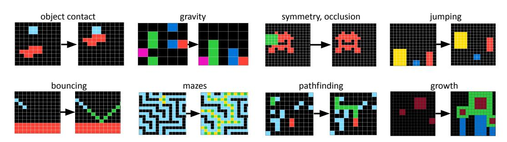

Figure 1: Few-shot learning tasks from the Abstraction and Reasoning Corpus (ARC). Each task typically has 2-5 input-output examples. Here we show just one input-output example per task.

Here we study neural methods for induction and transduction, using few-shot learning problems from ARC as our testbed. *Induction* means first finding a function f where  $f(x_{\text{train}}) \approx y_{\text{train}}$ , and then predicting  $y_{\text{test}} = f(x_{\text{test}})$ . *Transduction* instead outputs  $y_{\text{test}}$  without explicit construction of an

intermediate function f. Intuitively, induction captures the notion that a learner should first explain the training data, then use that explanation to make predictions. Inductive learners can perform better by spending more time optimizing or searching for better explanations, using the training examples  $\boldsymbol{x}_{\text{train}}, \boldsymbol{y}_{\text{train}}$  to score candidate functions. Transduction instead captures the intuition that the training examples themselves should play a direct role in generating new predictions, and that successful prediction need not require an explicit explanation. See Figure 2.

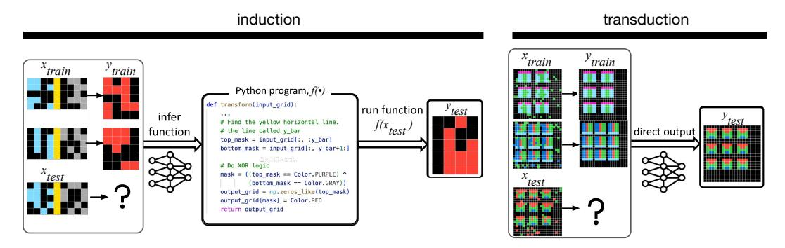

Figure 2: Induction generates an intermediate function f to explain training input-outputs. Transduction directly predicts the test output, for example using a neural network.

We train neural networks for both induction and transduction by generating a large corpus of synthetic problems. We discover that neural models for induction and transduction are strongly complementary. We believe this is surprising: Although any pair of models would generally solve somewhat different problems, usually this can be attributed to different priors, data, or architecture. Instead, we find that, even controlling for priors, data, and architecture, most problems solved by induction were not solved by transduction, and vice versa. Moreover, induction and transduction can be trivially ensembled by using induction to generate candidate functions f until either a satisfactory function is found (e.g.  $f(x_{\text{train}}) = y_{\text{train}}$ ) or until a test-time compute budget is reached, at which point, transduction kicks in as a fallback: That they are complementary has practical implications.

Our study is tightly linked to program synthesis. We represent functions f as Python code, meaning that induction synthesizes programs. We train transduction models on LLM-produced Python scripts, meaning that transduction is trained on the input-outputs of symbolic code. Although program learning has long been a popular vision of how general AI could work (Solomonoff, 1964; Schmidhuber, 2004; Hutter, 2004), the dominant theory has always been one of explicit code generation (induction), rather than implicitly teaching neural networks to imitate code (transduction). Our work puts this assumption to the test.

Testing these neural methods requires a large dataset of function-learning problems, which is challenging to generate because not only must we make novel functions, but we must also make good inputs to those functions. Consider the range of transformations in Figure 1: What counts as a good input for one function is unlikely to work for another. To address this challenge, our data generator first produces a deterministic Python function for f, and then a probabilistic program for sampling inputs to f, finally executing those programs to produce input-outputs. This helps generate function inputs that are appropriate for the underlying transformation, and constrains  $x_{\text{train}}$ ,  $y_{\text{test}}$  to be explainable by a deterministic mapping.

## We contribute the following:

- 1. A study finding that neural models for induction and transduction are strongly complementary, even when trained on the same problems. This contradicts seminal neural program synthesis work (Devlin et al. (2017), which found induction superior), and contradicts the findings of the leading ARC team (Cole et al. (2024), which advocates transduction with test-time training).
- 2. An automated data generation methodology that starts with 100-160 program solutions for ARC training tasks, and expands them to make 400k new problems paired with Python solutions.
- 3. A study of how these methods scale. We find performance saturates quickly when increasing manually-labelled data, but scales with compute, both at training and testing time.
- 4. Analysis of families of problems solved by each approach, and how they compare to humans.

## 2 NEURAL MODELS FOR INDUCTION AND TRANSDUCTION

We consider few-shot supervised learning problems where the learner is trained to map members of an input space  $\mathcal{X}$  to output space  $\mathcal{Y}$ . For K-shot learning, we receive K training input-outputs  $(\boldsymbol{x}_{\text{train}}, \boldsymbol{y}_{\text{train}}) \in \mathcal{X}^K \times \mathcal{Y}^K$ , together with a single test input  $x_{\text{test}} \in \mathcal{X}$ , and predict  $y_{\text{test}} \in \mathcal{Y}$ . Our neural models for K-shot learning are meta-learned (Mishra et al., 2017, *inter alia*.) using meta-learning data further annotated with a ground-truth function  $f: \mathcal{X} \to \mathcal{Y}$ , which supervises the induction model. Below we define the training and use of these models.

**Definition:** Neural networks for induction and transduction. A neural network for transduction is a function t that maps  $(\boldsymbol{x}_{\text{train}}, \boldsymbol{y}_{\text{train}}, x_{\text{test}})$  to a distribution over  $y_{\text{test}}$ , and which has learnable parameters  $\theta$ . In other words,  $t_{\theta}: \mathcal{X}^K \times \mathcal{Y}^K \times \mathcal{X} \to \Delta(\mathcal{Y})$ , where the notation  $\Delta(S)$  means the set of distributions over S. We can also write this as a conditional distribution,  $t_{\theta}(y_{\text{test}}|\boldsymbol{x}_{\text{train}}, \boldsymbol{y}_{\text{train}}, x_{\text{test}})$ . A neural network for induction is a function  $t_{\theta}(x_{\text{train}}, x_{\text{test}})$  to a distribution over functions f that map f to f, with learnable parameters f. In other words, f is f to f that f that f that f that f that f that f that f that f that f that f that f that f that f that f that f that f that f that f that f that f that f that f that f that f that f that f that f that f that f that f that f that f that f that f that f that f that f that f that f that f that f that f that f that f that f that f that f that f that f that f that f that f that f that f that f that f that f that f that f that f that f that f that f that f that f that f that f that f that f that f that f that f that f that f that f that f that f that f that f that f that f that f that f that f that f that f that f that f that f that f that f that f that f that f that f that f that f that f that f that f that f that f that f that f that f that f that f that f that f that f that f that f that f that f that f that f that f that f that f that f that f that f that f that f that f that f that f that f that f that f that f that f that f that f that f that f that f that f that f that f that f that f that f that f that f that f that f that f that f t

**Training induction and transduction.** Both types of models are trained via meta-learning. We assume a meta-learning dataset  $\mathcal{D}$  of few-shot learning problems, each equipped with a ground-truth function f such that f(x) = y for every x, y in  $(\boldsymbol{x}_{\text{train}}, \boldsymbol{y}_{\text{train}})$  and  $(x_{\text{test}}, y_{\text{test}})$ . Inductive and transductive models are meta-trained to minimize the following losses:

TRANSDUCTION LOSS = 
$$\mathbb{E}_{(\boldsymbol{x}_{\text{train}}, \boldsymbol{y}_{\text{train}}, x_{\text{test}}, y_{\text{test}}, f) \sim \mathcal{D}} \left[ -\log \mathsf{t}_{\theta}(y_{\text{test}} | \boldsymbol{x}_{\text{train}}, \boldsymbol{y}_{\text{train}}, x_{\text{test}}) \right]$$
 (1)

INDUCTION LOSS = 
$$\mathbb{E}_{(\boldsymbol{x}_{\text{train}}, \boldsymbol{y}_{\text{train}}, x_{\text{test}}, y_{\text{test}}, f) \sim \mathcal{D}} [-\log i_{\theta}(f|\boldsymbol{x}_{\text{train}}, \boldsymbol{y}_{\text{train}}, x_{\text{test}})]$$
 (2)

**Testing induction and transduction.** After meta-learning the models encounter a test-time few-shot learning task  $(\boldsymbol{x}_{\text{train}}, \boldsymbol{y}_{\text{train}}, x_{\text{test}})$ . Transductive models predict their most likely output for  $y_{\text{test}}$  (approximated via beam search). Inductive models sample a test-time budget of B functions  $f_1 \cdots f_B$ , which are filtered by  $(\boldsymbol{x}_{\text{train}}, \boldsymbol{y}_{\text{train}})$ , and finally used to predict  $y_{\text{test}} = f(x_{\text{test}})$ . Writing  $\hat{y}_{\text{test}}$  for the predicted test output:

TRANSDUCTION: 
$$\hat{y}_{\text{test}} = \underset{y \in \mathcal{Y}}{\operatorname{arg max}} \, \mathsf{t}_{\theta}(y | \boldsymbol{x}_{\text{train}}, \boldsymbol{y}_{\text{train}}, x_{\text{test}})$$
 (3)

INDUCTION: 
$$\hat{y}_{\text{test}} \sim \text{Uniform}(\mathcal{F})$$
 (4)  
where  $\mathcal{F} = \{ f_b(x_{\text{test}}) : \text{ for } 1 \leq b \leq B \text{ if } f_b(\boldsymbol{x}_{\text{train}}) = \boldsymbol{y}_{\text{train}} \}$   
 $f_b \sim \dot{\mathbf{i}}_{\theta}(f|\boldsymbol{x}_{\text{train}}, \boldsymbol{y}_{\text{train}}, x_{\text{test}})$ 

Combining induction and transduction. Induction allows checking candidate hypotheses against the training examples. Therefore, we know when induction has found a plausible solution—but sometimes it fails to find any solution. Transduction has the opposite property: We can't check if its predictions match the training examples, but it always offers a candidate answer. Therefore we ensemble by attempting induction first, then transduction if none of the candidate hypotheses explained the examples:

ENSEMBLE: 
$$\hat{y}_{\text{test}} \sim \text{Uniform}(\mathcal{F}) \text{ if } \mathcal{F} \neq \varnothing$$

$$\hat{y}_{\text{test}} = \underset{y \in \mathcal{Y}}{\arg \max} \, \mathsf{t}_{\theta}(y | \boldsymbol{x}_{\text{train}}, \boldsymbol{y}_{\text{train}}, x_{\text{test}}) \text{ if } \mathcal{F} = \varnothing \tag{5}$$

Instantiating the framework for ARC. Every input from  $\mathcal{X}$  and output from  $\mathcal{Y}$  is a 2D grid ranging from 1–30 pixels per side, with each pixel containing one of ten colors. Because ARC tasks are highly diverse yet typically have an abstract program-like structure, we represent the underlying function f as Python code, which is computationally universal, and so possible in principle of solving any ARC task. Therefore the induction model must generate Python code, so we initialize our models with Llama3.1-8B-instruct (Dubey et al., 2024) because it was pretrained on source code. We encode 2D colored grids as strings using 1 token per pixel, and use newlines to delimit rows (Appendix B.1). We then meta-learn by further fine-tuning Llama3.1-8B-instruct for induction or transduction using a synthetically-generated corpus of problems, described next.

<sup>&</sup>lt;sup>1</sup>Our preliminary experiments suggested Llama3.1-8B-instruct was better than Mistral-7B-v0.3, Qwen2-7B-Instruct, and deepseek-coder-6.7b-instruct

### 3 GENERATING DATASETS FOR INDUCTION AND TRANSDUCTION

Generating ARC-style tasks is challenging because of the diversity of concepts that can occur in ARC. It is also challenging because we need to generate not just a function, and also inputs that serve as good examples for that function.

At a high level, our dataset grows out of 100 manually-written Python programs, each of which both solves a given task (function f), and also randomly generates new input grids. We call these 100 manually-written programs **seeds.** Each seed is commented with natural language describing the core intuitions behind the problem. We then use a large language model to mutate and recombine the seeds, producing many thousands of programs (Figure 3).

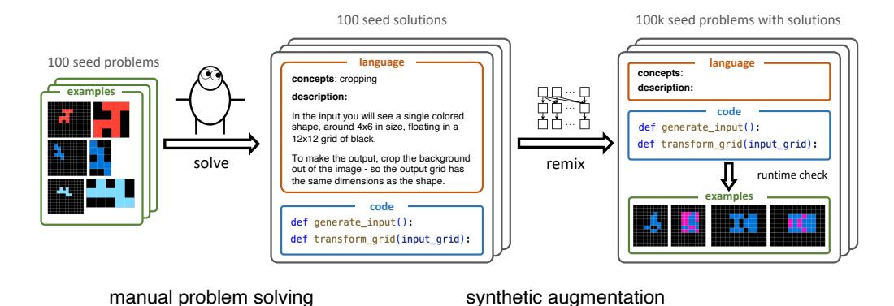

Figure 3: Synthetic data generation pipeline, starting with human-written programs (seeds).

**The structure of seeds.** Each seed consists of three parts:

- 1. A **natural language description** of its specific ARC task—including how to solve that task—represented as a Python comment at the top of the seed.
- 2. A Python function  $transform\_grid$  corresponding to the function f in the manuscript, which maps each input grid of a specific ARC task to its corresponding output grid.
- 3. A Python function generate\_input, which takes no arguments, and which randomly generates new inputs to f (new inputs to transform\_grid).

**Prior knowledge.** The seeds impart a prior upon the system by demonstrating good programs for solving training tasks. We further codified much of this prior into a Python library containing code that we found useful across many seeds, such as subroutines for generating random sprites, detecting symmetries, or extracting objects (Appendix A.2). Synthetic problems can use that same library.

However, this prior knowledge is different from previous *Domain Specific Languages* for ARC (Butt et al., 2024; Wind, 2020; Ainooson et al., 2023). Domain Specific Languages restrict the class of allowed programs by only allowing stereotyped combinations of domain-specific primitives. We still allow arbitrary Python code, which helps cover the long tail of diverse tasks.

**Remixing the seeds.** To generate a larger synthetic dataset we "remix" the seeds using LLMs. Each new synthetic ARC problem is generated by a three stage pipeline (Figure 11):

- 1. A new natural language description is sampled by prompting an LLM with seed natural language descriptions, effectively using in-context learning to recombine and mutate elements of different problems, in the spirit of self-instruct (Wang et al., 2023).
- 2. Code is generated for that new description via Retrieval Augmented Generation (RAG: Lewis et al. (2020)). Our RAG pipeline retrieves seeds with similar descriptions, and prompts an LLM to generate code for the new description, given the retrieved seeds.
- 3. The newly created generate\_input is executed to make inputs, which are passed to transform\_grid to produce input-output grids.

Figure 4 illustrates example problems generated by our pipeline, with further examples **visualized at this link.** Unless otherwise mentioned, we create synthetic datasets with GPT4o-mini and ada-002.

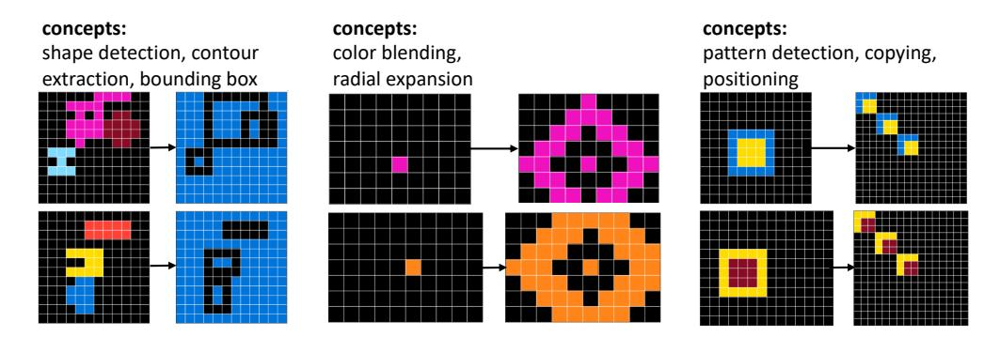

Figure 4: Example synthetic ARC problems generated by our pipeline. Concepts are generated in a comment near the top of the Python script as part of the natural language description of the seed.

## 4 EMPIRICAL STUDY OF INDUCTION AND TRANSDUCTION

We train inductive and transductive models with the goal of understanding (1) how the methods compare; (2) how performance scales with train-time effort; and (3) how performance scales with test-time compute (for induction only, as it allows drawing more samples at test time to improve performance). We report performance on the 400-problem public validation split of ARC, which is harder than the training split. The systems described in this section learn from a 100-problem subset of the training split, specifically problems for which we created seeds.

**Induction and Transduction are strongly complementary.** Despite training on the exact same problems, inductive and transductive models solve different tasks, and neither approach is dramatically more effective than the other. And although these methods have a similar overall solve rate, most problems solved by induction are not solved by transduction, and vice versa (Figure 5A).

An alternative explanation is that induction and transduction are not actually complementary, but instead that, having trained two neural networks with different random initializations, they simply solved different problems due to randomness at train or test time. To test this alternative explanation, we trained many models with different random initializations. We find that the problems solved by induction/transduction are surprisingly stable across these different runs (Figure 5B). In other words, some problems are friendlier to induction, and others friendlier to transduction (Figure 6).

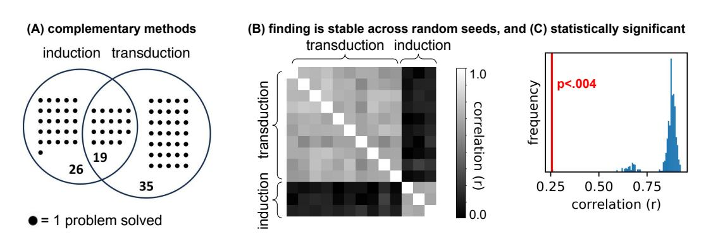

Figure 5: (A) Induction and transduction solve different problems, where solve means predicting the right output given 2 tries. Venn diagram for models trained on 100k synthetic problems generated using gpt4o-mini. (B) Training many models with different random seeds, and then measuring the correlation between solved tasks by different models. Solved tasks strongly correlates with other models of the same class but not the other class. (C) Statistical significance test evaluating the null hypothesis that correlation is independent of whether a model is inductive/transductive.

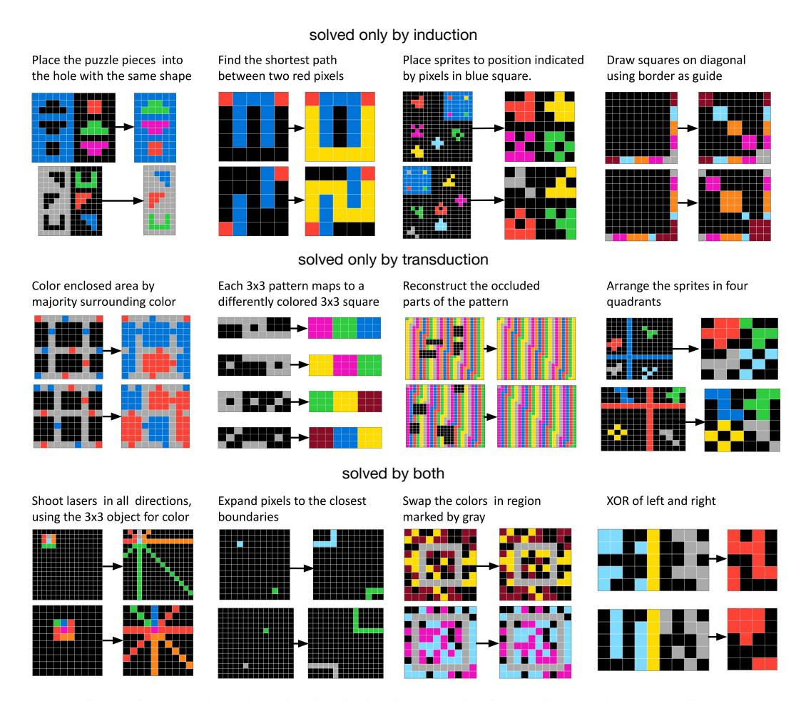

Figure 6: Example tasks solved by induction/transduction/both. See also Appendix C.

# Performance scales with dataset size, but quickly saturates with increasing number of seeds.

We trained models while systematically varying the number of human-created seeds we use, and varying the amount of synthetic data generated from those seeds (Figure 7). Performance improves with increasing training data for fine-tuning (increasing synthetic data), but saturates for increasing quantity of human-created seeds. We conjecture that this saturation occurs because each seed serves to introduce a few core concepts, and that after enough seeds, essentially all of the important concepts have been demonstrated. This suggests that, beyond a critical threshold number of seeds, the method can scale with increasing amounts of compute without demanding further human data labeling. Looking beyond ARC, this means that our methodology could probably be applied to other few-shot function-learning problems using a modest amount of manual data labeling.

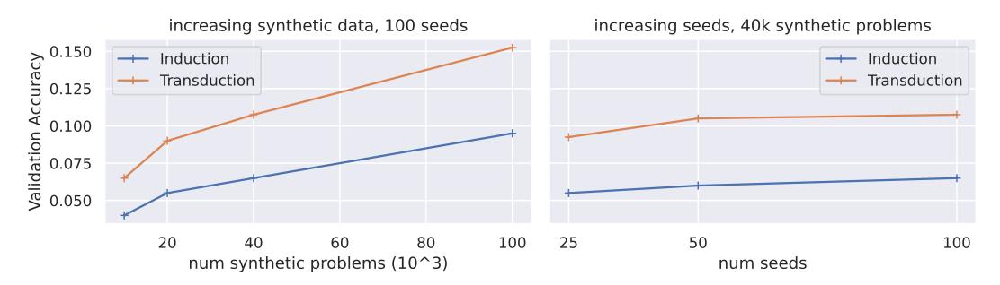

Figure 7: Increased manual human effort (# seeds) does not significantly increase performance, but increasing compute spent generating synthetic data increases performance of the final model.

**Induction performance scales with test-time compute.** We vary the test-time sampling budget for induction, finding an almost monotonic increase in solve rate (Figure 8, left). In principle, drawing additional samples runs the risk of discovering solutions that are "false-positives," meaning they fit the training examples without correctly predicting the test output. In practice, about 9% of samples that fit the training examples are false-positives. Figure 8 (right) shows that about half of this 9% corresponds to problems where the majority of the probability mass is still placed on the correct output, meaning that a simple majority vote scheme would squash any false positives (e.g. clustering in AlphaCode Li et al. (2022)). Appendix D shows example false positives.

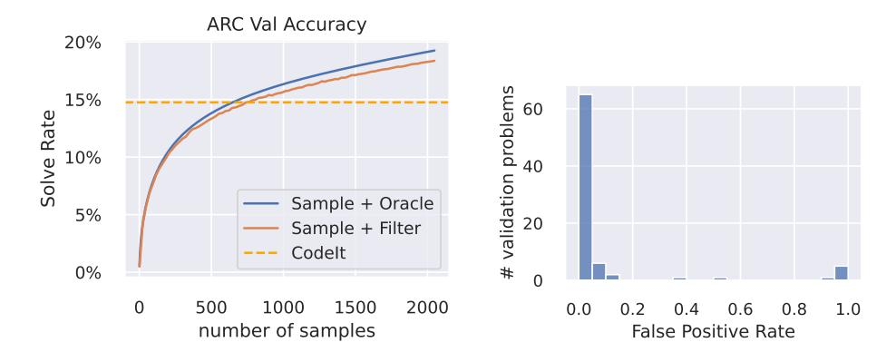

Figure 8: Left: Sample+Oracle assumes an oracle that selects one of the sampled programs. It upper-bounds the accuracy of randomly selecting one program consistent with the training examples (Sample+Filter). Induction model trained with 100k gpt4-description-gpt4omini-codegen data. CodeIt (Butt et al., 2024) is a recent neural program induction model for ARC. Right: Histogram of false positive rate. Of the problems that have false positives, about half have a false positive rate less than 0.5, meaning that most (filtered) samples predict the right test output.

Stronger LLMs make better synthetic data, and induction is more sensitive to data quality. To save costs, the previous results all used GPT40-mini to generate synthetic data. To understand the value of stronger models we generated 100k synthetic problems using GPT4 to generate natural language problem descriptions (but GPT40-mini still generated the code). The richer and more diverse synthetic problems elicited from GPT4 significantly improved performance, but primarily for induction, while transduction was less sensitive to data quality (Table 1).

| System                                                            | Val Acc.                   | Finetuning Data                                         |
|-------------------------------------------------------------------|----------------------------|---------------------------------------------------------|
| Ensemble<br>Induction, 2048 samples<br>Transduction, beam size 20 | 26.50%<br>18.78%<br>15.25% | GPT-4 for generating descriptions, GPT-4o-mini for code |
| Ensemble<br>Induction, 2048 samples<br>Transduction, beam size 20 | 19.50%<br>11.07%<br>13.50% | GPT-4o-mini for generating descriptions and code        |

#### 5 SCALING OUR METHOD

Motivated by our findings so far, we scaled up our method by producing two larger datasets:

**ARC-Heavy: 200k problems from 160 seeds.** The purpose of ARC-Heavy is to scale our method in an easily reproducible way, while also filling any gaps in its mastery of the training split. We first ran models from Section 4 on the training split to identify 60 problems that they still struggled with, for which we produced 60 new seeds, giving 160 seeds in total. From those seeds we produced 200k synthetic problems, with GPT4 generating natural language descriptions and GPT40-mini generating the corresponding Python code.

**ARC-Potpourri: 400k problems from heterogeneous sources.** The purpose of ARC-Potpourri is to assemble the biggest dataset that we could, even if it comes from a messy mixture of sources. Starting with ARC-Heavy we added all synthetic data from Section 4. We further added 100k transduction-only training examples from ReARC (Hodel, 2024).

**Test-time improvements.** We improve transduction with test-time training (abbreviated TTT; Sun et al. (2020)) and a reranking scheme that augments each problem and predicts the most likely output under multiple augmentations (Appendix E- F). We expand our sampling budget to 20k programs.

We call our resulting systems BARC. Table 2 shows the performance of various BARC models. Both transduction and induction are effective, with induction solving slightly more problems, until adding test-time training/reranking, after which transduction does slightly better. An ensemble scores 56.75%, surpassing previously published methods. Releasing this work later allowed Akyürek et al. (2024) to improve that score to 61.9% via better test time training of our transduction model, while using our induction model as-is. But absent our models—including the program synthesizer—they instead score lower, suggesting that sophisticated test time training does not fully substitute for program synthesis. Our best model performs nearly as well as the average human (56.75% vs. 60.2%) but much worse than the best humans (98%). Model outputs visualized here.

Table 2: % validation tasks correctly solved in 2 tries. Human results from LeGris et al. (2024).

| System                                  | Val Acc.      | Fair comparison?                   |
|-----------------------------------------|---------------|------------------------------------|
| ARC-Heavy: BARC models                  |               |                                    |
| Induction, 10k samples, majority vote   | 30.50%        | _                                  |
| Transduction (no TTT)                   | 19.25%        | _                                  |
| Ensemble (no TTT)                       | 37.50%        | _                                  |
| Transduction (TTT)                      | 29.75%        | _                                  |
| Ensemble (TTT)                          | 43.25%        | _                                  |
| ARC-Potpourri: BARC models              |               |                                    |
| Induction, 20k samples, majority vote   | 38.00%        | _                                  |
| Transduction (no TTT, no reranking)     | 29.125%       | _                                  |
| Transduction (reranking, no TTT)        | 35.25%        | _                                  |
| Transduction (TTT, no reranking)        | 39.25%        | _                                  |
| Transduction (TTT + reranking)          | 43.00%        | _                                  |
| Ensemble (TTT + reranking)              | 56.75%        | _                                  |
| CodeIt (Butt et al., 2024)              | 15%           | Yes, only trains on training set   |
| Claude-3.5 / Greenblatt (2024)          | 21% / 42%     | Yes, but closed LLMs at test time  |
| Wind (2020)                             | 39%           | No, designed by looking at val set |
| Akyürek et al. (2024), w/o our models   | 47.1%         | Yes                                |
| +ensembled with & using both our models | 61.9%         | No, builds on our models           |
| Avg/Best Human                          | 60.2% / 97.8% | Yes                                |

**Scaling down our method.** Our flagship model is too expensive to run on the private test set hosted by Kaggle. We scale down by omitting test-time training, only sampling 336 programs, and reducing the transduction beam size to 3. This scores 19% on Kaggle and 36.5% on validation. Table 3 shows that program synthesis is less effective given this smaller search budget. Given the large-compute effectiveness of program synthesis, this suggests a strong payoff for smarter neural program search.

Table 3: Smaller version of our model evaluated on the private test and public validation splits

| Private Test Set | Public Validation Set |
|------------------|-----------------------|
| 18%              | 32.25%                |
|                  | 14%<br>36.5%          |
| ]                |                       |

# 6 WHICH PROBLEMS ARE EASIER FOR THE MODELS, AND FOR HUMANS?

Do problems that challenge humans also challenge the model, and vice-versa? sort ARC validation problems into 5 equallysized difficulty classes using data from LeGris et al. (2024). Figure 9 illustrates a peculiar relationship between human and model accuracy: All models surpass human performance on the hardest problems, but underperform on the easiest problems. Because our models train on simple Python programs, this suggests some problems are simple in code and learnable by transformers, but very hard for people-and conversely that people possess priors allowing effortless solution of problems beyond what our Python program generator produces. For problems of typical difficulty, the model roughly tracks human performance, and across all difficulty levels, transduction and induction serve complementary roles, even when augmented with test time training.

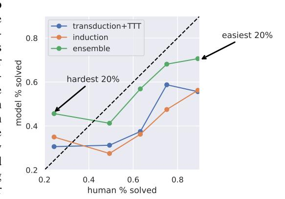

Figure 9: Human vs model performance across 5 difficulty levels. The easiest difficulty level contains problems in the top 20% of human accuracy, and the hardest difficulty level contains the 20% of problems with the lowest human accuracy.

Which concepts are easier for the models? We test on ConceptARC (Moskvichev et al., 2023), an alternative ARC-style test-set which classifies its tasks into "concept groups" each exemplifying a single isolated high-level concept such as "sameness" or "above vs below." We use models trained on ARC-Potpourri, finding that specific concept categories are easier for induction or transduction (Figure 10). We find an intuitive division of labor between the two approaches: Concept groups such as counting are best solved with symbolic code, while transduction better handles perceptual processes such as judging whether a shape is more horizontal or more vertical, or more top/bottom.

ConceptARC reveals another dimension along which transduction and induction differ: Because ConceptARC illustrates one concept per problem, there is no need to compose many concepts together. Therefore the induction model, which is uniquely equipped for symbolic composition, loses a key advantage. Transduction has more limited composition capabilities but can instantiate individual concepts in flexible subsymbolic ways, which could explain why it excels on ConceptARC.

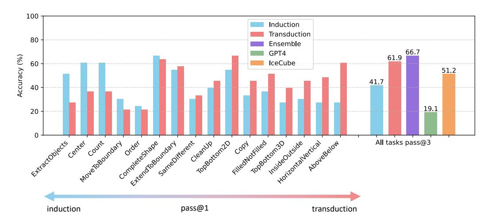

Figure 10: ConceptARC accuracy by concept group. Concept groups sorted left-to-right by ratio of inductive to transductive performance. IceCube is the original ARC Kaggle winner (Wind, 2020). We report pass@3 because Moskvichev et al. (2023) report accuracy given 3 attempts.

## 7 RELATED WORK

**ARC** was originally designed to challenge conventional deep learning and spur progress on alternative paradigms (Chollet, 2019). The first wave of successful approaches used discrete program search over domain-specific programming languages, including the original Kaggle winner (Wind, 2020). These symbolic approaches held their own against GPT-4 (Wang et al., 2024), but have recently been surpassed by transductive architectures using test-time training (Cole et al., 2024), and by LLM-guided program generation (Greenblatt, 2024). ARC has so far resisted conventional neural and symbolic approaches, but is solvable for adult humans, and to some extent, children (LeGris et al., 2024; Opielka et al., 2024).

Code generation via LLMs is done in many recent works (Li et al., 2022; Gao et al., 2023; Chen et al., 2021; Austin et al., 2021). We most directly build on Li & Ellis (2024) and Greenblatt (2024). The former fine-tunes LLMs for inductive program synthesis using LLM-generated variations of human-written programs. While there are many technical differences, a key factor is that we generate function inputs by synthesizing an input\_generator function, rather than have an LLM directly generate possible inputs. This matters because an LLM alone could not generate complex, precisely-correct inputs such as ARC grids. This potentially makes our work applicable to other few-shot generalization problems with complex input-spaces such as webpages, robot planning, etc. Greenblatt (2024) samples many Python programs from GPT40: Comparable to our induction model, but instead of fine-tuning, it uses prompting. Fine-tuning forced us to create a dataset of new problems, which created the opportunity for exploring transductive models.

Classic work in neural program synthesis has previously compared induction and transduction (RobustFill: Devlin et al. (2017)). We explore here a richer space of functions, reaching a qualitatively different conclusion than RobustFill: Instead of finding transduction inferior to induction, we find them complementary. More broadly, the transductive-inductive divide lies near the heart of supervised learning. Inductive approaches, such as linear regression, first construct a function f where  $f(x_{\text{train}}) \approx y_{\text{train}}$ , and then predict  $y_{\text{test}} = f(x_{\text{test}})$ . Transductive approaches, such as Support Vector Machines and In-Context Learning, instead output their predictions by performing direct comparisons with the training data. We use the same neural network architecture and dataset to perform both tasks, allowing a controlled comparison between these paradigms.

**Datasets for ARC.** ReARC (Hodel, 2024) is a dataset of handwritten programs that solve all ARC-AGI training tasks, and which generates new inputs for them. ReARC is implemented in a domain-specific language, and lacks natural language annotations, making it difficult to remix with LLMs. Other works annotate ARC using either natural language (Acquaviva et al., 2022) or Python programs (Huang et al., 2024), which could potentially serve as seed programs for our work. Acquaviva et al. (2022) inspired our natural-language descriptions and Huang et al. (2024) influenced our seed program format. Our new seeds were a better fit for this approach because they encode shared priors in a Python library (Appendix A.2), and have an explicit input\_generator describing a precisely-structured infinite space of valid inputs.

# 8 DISCUSSION

What we learn about robust sample-efficient generalization. Neither explicit symbolic hypotheses nor implicit neural representations suffice to solve all problems: each has their own domain of applicability, and simply ensembling models specialized in each does not cover all cases. Engineering a more clever neural program search, or training transductive predictors on more data, is unlikely to be fruitful. Instead we need representations irreducible to a purely neural or symbolic form, which intertwine inductive and transductive reasoning. One way of implementing this idea is to do program synthesis within a language whose atomic primitives are non-symbolic, and to pretrain those primitives to encapsulate the basic atoms of core knowledge. While work has taken steps in related directions (Reed & De Freitas, 2015; Alet et al., 2018; Tang & Ellis, 2023; Li et al., 2024), how to engineer and scale this idea remains open.

**To what extent is this methodology applicable beyond ARC?** Few-shot function learning is a very flexible framework, but our particular method is most applicable when the target generalization can be described in symbolic code. As an immediately tangible example, web scraping and

other forms of data-munging could fit within our framework. As a more ambitious goal, symbolic code is an especially good medium for defining precise models of how the world works. This is true both within the natural sciences (Schmidt & Lipson, 2009) and also within AI, with examples such as robotic policies (Liang et al., 2023), planners (Wong et al., 2023), and world models more broadly (Das et al., 2023; Tang et al., 2024b; Evans et al., 2021; Liang et al., 2024). These are not the kinds of programs that occur often in LLM pretraining data—so merely prompting is unlikely to perform well—but it is nonetheless feasible to curate around 100 seeds demonstrating what the system should learn.

**Theoretically, induction and transduction should not be so complementary.** Equivalences between induction and transduction are well-know, such as the 'kernel trick' which allows translating parametric function fitting into a transductive problem. Our metalearning models, given infinite metatraining data, should similarly converge because transformers are universal function approximators. That there remains a difference is interesting precisely because it deviates from what one would expect theoretically.

Are we cheating by training on 400k synthetic problems? The spirit of ARC is to generalize from few examples. Yet we fine-tune on many examples. In our view, the true training data is 160 seeds, not the 400k 'remixes,' which are instead analogous to 'dream data' in amortized inference or wake-sleep (Le et al., 2017; Ritchie et al., 2016; Hinton et al., 1995). In other words, our system inputs 160 annotated solutions to training set problems, and does up-front computation to convert that data into a neural network capable of solving new problems. From that perspective, it is a sample efficient way of learning to solve ARC—although it is not compute efficient.

**Impact on ARC efforts.** Releasing our code and data helped Akyürek et al. (2024) achieve the first open-source system that performs at the level of an average human. The 2nd place ARC '24 team (Franzen et al., 2024) also benefited from our data. We hope others will continue building on our work. We also intend our findings to encourage research on discrete program search as an alternative to the test-time training currently dominating in the community, and have geared our experiments toward showing the value in this other pathway.

From domain-specific languages to domain-specific libraries. Many works that perform program search rely on carefully tuned domain-specific languages instead of using a general purpose language such as Python (Butt et al., 2024; Wind, 2020; Alford et al., 2022; Ainooson et al., 2023). However, we believe general-purpose programming languages can give much broader coverage, and that attempts to engineer restricted languages inevitably sacrifice regions of program-space which could plausibly occur in open-ended learning domains such as ARC. Instead we advocate here for domain-specific *libraries*, which equip a general-purpose language with extra priors, but do not restrict it to using only those priors.

**How to represent input-output mappings.** Our seeds include: (1) a grid transformation program, (2) an input generator, and (3) natural language descriptions for both (1) and (2). Practically, this representation allows us to sample consistent input-output example pairs for training, while the natural language descriptions help LLMs to remix seeds into novel problems. This further captures a latent natural language description of both inputs and outputs, from which the function and its preimage are derived.

**Next steps suggested by biological intelligence & wake-sleep.** Our work has a straightforward analogy to dual-process models in psychology, which categorizes human thinking according to whether it relies on fast nonverbal intuitions or deliberative conscious thought (Smith & DeCoster, 2000; Kahneman, 2011). Although preliminary, our results could suggest that this partitioning is actually normative, and emerges from properties of the problems being solved, not properties of the solver itself. Human thinking is however more sophisticated in how it combines these modes: Fast intuitions can be further reprocessed by deliberative symbolic processing, which can trigger further intuitions, and so on. Our method has no analogous way of interleaving these two strategies, but more deeply integrating induction and transduction is a natural next step.

Our approach can also be seen as a form of wake-sleep or dream learning (Hinton et al., 1995; Fosse et al., 2003; Rasch & Born, 2013) where samples from a generative model train an inference

network. Here the generative model is a prompt with the seeds, and the inference network is our fine-tuned models. Drawing the analogy to wake-sleep suggests two directions. First, we could learn from recently-solved test problems (during 'waking') by generating fresh synthetic data using those problems as seeds (during 'dreaming/sleeping'). Second, we could also implement a form of abstraction learning that automatically expands our custom ARC library (Appendix A.2), or adds new neural primitives to that library, in the spirit of library learning and modular metalearning (Bowers et al., 2023; Ellis et al., 2021; Alet et al., 2018).

**Limitations.** Our system does not grow more competent at few-shot learning by solving new problems: Instead, it bootstraps from manually encoded knowledge in the seeds, which is transformed into a few-shot learner via an LLM training/inference pipeline. A more compelling approach would be to have the system discover for itself the knowledge that we compiled for it within the seeds, for instance by practicing on training tasks, without supervising on ground truth solutions.

Our work is only evaluated on ARC. However, ARC is designed to contain many concepts and problems embedded within it, so can be viewed as an open-ended composite of different learning problems. Owing to this diversity, it is also notoriously challenging, and has resisted solution despite a series of high-profile competitions. We therefore believe that although evaluating on multiple benchmarks is desirable, ARC is an appropriate benchmark to use as the centerpiece of an experimental evaluation.

Code & Data Availability. Our code, data, and model weights are freely available at https://github.com/xu3kev/BARC. Interactive visualizations of our dataset and model outputs are available at this link.

Author Contributions. Neural network experiments were engineered by Wen-Ding Li and Keya Hu. Data generation was engineered by Carter Larsen, Wen-Ding Li, Keya Hu, and Kevin Ellis. Kevin Ellis, Yewen Pu, Zenna Tavares, Wei-Long Zheng, and Hao Tang provided high-level advisory guidance. Zenna Tavares, Michelangelo Naim, Dat Nguyen, and Keya Hu analyzed the transduction model. Seeds were written by Keya Hu, Kevin Ellis, Carter Larsen, Yuqing Wu, Simon Alford, Caleb Woo, Spencer M. Dunn, and Yewen Pu. The paper was written by Yewen Pu, Keya Hu, Zenna Tavares, Wen-Ding Li, and Kevin Ellis.

**Acknowledgements.** We are grateful for advice from Robert Hawkins regarding the statistical analysis in Figure 5C and for discussions with Weinan Sun about biological learning. This work was partly supported by an NSF CAREER award to K.E.

#### REFERENCES

Sam Acquaviva, Yewen Pu, Marta Kryven, Theodoros Sechopoulos, Catherine Wong, Gabrielle Ecanow, Maxwell Nye, Michael Henry Tessler, and Joshua B. Tenenbaum. Communicating natural programs to humans and machines. In *Thirty-sixth Conference on Neural Information Processing Systems Datasets and Benchmarks Track*, 2022. URL https://openreview.net/forum?id=0xFoLTKDcNm.

James Ainooson, Deepayan Sanyal, Joel P. Michelson, Yuan Yang, and Maithilee Kunda. A neurodiversity-inspired solver for the abstraction & reasoning corpus (arc) using visual imagery and program synthesis, 2023. URL https://arxiv.org/abs/2302.09425.

Ekin Akyürek, Mehul Damani, Linlu Qiu, Han Guo, Yoon Kim, and Jacob Andreas. The surprising effectiveness of test-time training for abstract reasoning, 2024. Preprint.

Ferran Alet, Tomás Lozano-Pérez, and Leslie P Kaelbling. Modular meta-learning. In *Conference on robot learning*, pp. 856–868. PMLR, 2018.

Simon Alford, Anshula Gandhi, Akshay Rangamani, Andrzej Banburski, Tony Wang, Sylee Dandekar, John Chin, Tomaso Poggio, and Peter Chin. Neural-guided, bidirectional program search for abstraction and reasoning. In *Complex Networks & Their Applications X: Volume 1, Proceedings of the Tenth International Conference on Complex Networks and Their Applications COMPLEX NETWORKS 2021 10*, pp. 657–668. Springer, 2022.

Jacob Austin, Augustus Odena, Maxwell Nye, Maarten Bosma, Henryk Michalewski, David Dohan, Ellen Jiang, Carrie Cai, Michael Terry, Quoc Le, et al. Program synthesis with large language models. *arXiv preprint arXiv:2108.07732*, 2021.

Matthew Bowers, Theo X. Olausson, Lionel Wong, Gabriel Grand, Joshua B. Tenenbaum, Kevin Ellis, and Armando Solar-Lezama. Top-down synthesis for library learning. *POPL*, 2023. doi: 10.1145/3571234. URL https://doi.org/10.1145/3571234.

Natasha Butt, Blazej Manczak, Auke Wiggers, Corrado Rainone, David W Zhang, Michaël Defferrard, and Taco Cohen. Codeit: Self-improving language models with prioritized hindsight replay. In *International Conference on Machine Learning*, 2024.

Mark Chen, Jerry Tworek, Heewoo Jun, Qiming Yuan, Henrique Ponde de Oliveira Pinto, Jared Kaplan, Harri Edwards, Yuri Burda, Nicholas Joseph, Greg Brockman, Alex Ray, Raul Puri, Gretchen Krueger, Michael Petrov, Heidy Khlaaf, Girish Sastry, Pamela Mishkin, Brooke Chan, Scott Gray, Nick Ryder, Mikhail Pavlov, Alethea Power, Lukasz Kaiser, Mohammad Bavarian, Clemens Winter, Philippe Tillet, Felipe Petroski Such, Dave Cummings, Matthias Plappert, Fotios Chantzis, Elizabeth Barnes, Ariel Herbert-Voss, William Hebgen Guss, Alex Nichol, Alex Paino, Nikolas Tezak, Jie Tang, Igor Babuschkin, Suchir Balaji, Shantanu Jain, William Saunders, Christopher Hesse, Andrew N. Carr, Jan Leike, Josh Achiam, Vedant Misra, Evan Morikawa, Alec Radford, Matthew Knight, Miles Brundage, Mira Murati, Katie Mayer, Peter Welinder, Bob McGrew, Dario Amodei, Sam McCandlish, Ilya Sutskever, and Wojciech Zaremba. Evaluating large language models trained on code. *arXiv preprint arXiv:2107.03374*, 2021.

François Chollet. On the measure of intelligence, 2019.

Jack Cole, Mohamed Osman, Michael Hodel, Keith Duggar, and Tim Scarfe. Machine learning street talk, June 2024.

Ria Das, Joshua B Tenenbaum, Armando Solar-Lezama, and Zenna Tavares. Combining functional and automata synthesis to discover causal reactive programs. *Proceedings of the ACM on Programming Languages*, 7(POPL):1628–1658, 2023.

Jacob Devlin, Jonathan Uesato, Surya Bhupatiraju, Rishabh Singh, Abdel-rahman Mohamed, and Pushmeet Kohli. Robustfill: Neural program learning under noisy i/o. *ICML*, 2017.

Abhimanyu Dubey, Abhinav Jauhri, Abhinav Pandey, Abhishek Kadian, Ahmad Al-Dahle, Aiesha Letman, Akhil Mathur, Alan Schelten, Amy Yang, Angela Fan, Anirudh Goyal, Anthony Hartshorn, Aobo Yang, Archi Mitra, Archie Sravankumar, Artem Korenev, Arthur Hinsvark, Arun Rao, Aston Zhang, Aurelien Rodriguez, Austen Gregerson, Ava Spataru, Baptiste Roziere, Bethany Biron, Binh Tang, Bobbie Chern, Charlotte Caucheteux, Chaya Nayak, Chloe Bi, Chris Marra, Chris McConnell, Christian Keller, Christophe Touret, Chunyang Wu, Corinne Wong, Cristian Canton Ferrer, Cyrus Nikolaidis, Damien Allonsius, Daniel Song, Danielle Pintz, Danny Livshits, David Esiobu, Dhruv Choudhary, Dhruv Mahajan, Diego Garcia-Olano, Diego Perino, Dieuwke Hupkes, Egor Lakomkin, Ehab AlBadawy, Elina Lobanova, Emily Dinan, Eric Michael Smith, Filip Radenovic, Frank Zhang, Gabriel Synnaeve, Gabrielle Lee, Georgia Lewis Anderson, Graeme Nail, Gregoire Mialon, Guan Pang, Guillem Cucurell, Hailey Nguyen, Hannah Korevaar, Hu Xu, Hugo Touvron, Iliyan Zarov, Imanol Arrieta Ibarra, Isabel Kloumann, Ishan Misra, Ivan Evtimov, Jade Copet, Jaewon Lee, Jan Geffert, Jana Vranes, Jason Park, Jay Mahadeokar, Jeet Shah, Jelmer van der Linde, Jennifer Billock, Jenny Hong, Jenya Lee, Jeremy Fu, Jianfeng Chi, Jianyu Huang, Jiawen Liu, Jie Wang, Jiecao Yu, Joanna Bitton, Joe Spisak, Jongsoo Park, Joseph Rocca, Joshua Johnstun, Joshua Saxe, Junteng Jia, Kalyan Vasuden Alwala, Kartikeya Upasani, Kate Plawiak, Ke Li, Kenneth Heafield, Kevin Stone, Khalid El-Arini, Krithika Iyer, Kshitiz Malik, Kuenley Chiu, Kunal Bhalla, Lauren Rantala-Yeary, Laurens van der Maaten, Lawrence Chen, Liang Tan, Liz Jenkins, Louis Martin, Lovish Madaan, Lubo Malo, Lukas Blecher, Lukas Landzaat, Luke de Oliveira, Madeline Muzzi, Mahesh Pasupuleti, Mannat Singh, Manohar Paluri, Marcin Kardas, Mathew Oldham, Mathieu Rita, Maya Pavlova, Melanie Kambadur, Mike Lewis, Min Si, Mitesh Kumar Singh, Mona Hassan, Naman Goyal, Narjes Torabi, Nikolay Bashlykov, Nikolay Bogoychev, Niladri Chatterji, Olivier Duchenne, Onur Çelebi, Patrick Alrassy, Pengchuan Zhang, Pengwei Li, Petar Vasic, Peter Weng, Prajjwal Bhargava, Pratik Dubal, Praveen Krishnan, Punit Singh Koura, Puxin Xu, Qing He, Qingxiao Dong, Ragavan Srinivasan, Raj Ganapathy, Ramon Calderer, Ricardo Silveira Cabral, Robert Stojnic, Roberta Raileanu, Rohit Girdhar, Rohit Patel, Romain Sauvestre, Ronnie Polidoro, Roshan Sumbaly, Ross Taylor, Ruan Silva, Rui Hou, Rui Wang, Saghar Hosseini, Sahana Chennabasappa, Sanjay Singh, Sean Bell, Seohyun Sonia Kim, Sergey Edunov, Shaoliang Nie, Sharan Narang, Sharath Raparthy, Sheng Shen, Shengye Wan, Shruti Bhosale, Shun Zhang, Simon Vandenhende, Soumya Batra, Spencer Whitman, Sten Sootla, Stephane Collot, Suchin Gururangan, Sydney Borodinsky, Tamar Herman, Tara Fowler, Tarek Sheasha, Thomas Georgiou, Thomas Scialom, Tobias Speckbacher, Todor Mihaylov, Tong Xiao, Ujjwal Karn, Vedanuj Goswami, Vibhor Gupta, Vignesh Ramanathan, Viktor Kerkez, Vincent Gonguet, Virginie Do, Vish Vogeti, Vladan Petrovic, Weiwei Chu, Wenhan Xiong, Wenyin Fu, Whitney Meers, Xavier Martinet, Xiaodong Wang, Xiaoqing Ellen Tan, Xinfeng Xie, Xuchao Jia, Xuewei Wang, Yaelle Goldschlag, Yashesh Gaur, Yasmine Babaei, Yi Wen, Yiwen Song, Yuchen Zhang, Yue Li, Yuning Mao, Zacharie Delpierre Coudert, Zheng Yan, Zhengxing Chen, Zoe Papakipos, Aaditya Singh, Aaron Grattafiori, Abha Jain, Adam Kelsey, Adam Shajnfeld, Adithya Gangidi, Adolfo Victoria, Ahuva Goldstand, Ajay Menon, Ajay Sharma, Alex Boesenberg, Alex Vaughan, Alexei Baevski, Allie Feinstein, Amanda Kallet, Amit Sangani, Anam Yunus, Andrei Lupu, Andres Alvarado, Andrew Caples, Andrew Gu, Andrew Ho, Andrew Poulton, Andrew Ryan, Ankit Ramchandani, Annie Franco, Aparajita Saraf, Arkabandhu Chowdhury, Ashley Gabriel, Ashwin Bharambe, Assaf Eisenman, Azadeh Yazdan, Beau James, Ben Maurer, Benjamin Leonhardi, Bernie Huang, Beth Loyd, Beto De Paola, Bhargavi Paranjape, Bing Liu, Bo Wu, Boyu Ni, Braden Hancock, Bram Wasti, Brandon Spence, Brani Stojkovic, Brian Gamido, Britt Montalvo, Carl Parker, Carly Burton, Catalina Mejia, Changhan Wang, Changkyu Kim, Chao Zhou, Chester Hu, Ching-Hsiang Chu, Chris Cai, Chris Tindal, Christoph Feichtenhofer, Damon Civin, Dana Beaty, Daniel Kreymer, Daniel Li, Danny Wyatt, David Adkins, David Xu, Davide Testuggine, Delia David, Devi Parikh, Diana Liskovich, Didem Foss, Dingkang Wang, Duc Le, Dustin Holland, Edward Dowling, Eissa Jamil, Elaine Montgomery, Eleonora Presani, Emily Hahn, Emily Wood, Erik Brinkman, Esteban Arcaute, Evan Dunbar, Evan Smothers, Fei Sun, Felix Kreuk, Feng Tian, Firat Ozgenel, Francesco Caggioni, Francisco Guzmán, Frank Kanayet, Frank Seide, Gabriela Medina Florez, Gabriella Schwarz, Gada Badeer, Georgia Swee, Gil Halpern, Govind Thattai, Grant Herman, Grigory Sizov, Guangyi, Zhang, Guna Lakshminarayanan, Hamid Shojanazeri, Han Zou, Hannah Wang, Hanwen Zha, Haroun Habeeb, Harrison Rudolph, Helen Suk, Henry Aspegren, Hunter Goldman, Ibrahim Damlaj, Igor Molybog, Igor Tufanov, Irina-Elena Veliche, Itai Gat, Jake Weissman, James Geboski, James Kohli, Japhet Asher, Jean-Baptiste Gaya, Jeff Marcus, Jeff Tang, Jennifer Chan, Jenny Zhen, Jeremy Reizenstein, Jeremy Teboul, Jessica Zhong, Jian Jin, Jingyi Yang, Joe Cummings, Jon Carvill, Jon Shepard, Jonathan McPhie, Jonathan Torres, Josh Ginsburg, Junjie Wang, Kai Wu, Kam Hou U, Karan Saxena, Karthik Prasad, Kartikay Khandelwal, Katayoun Zand, Kathy Matosich, Kaushik Veeraraghavan, Kelly Michelena, Keqian Li, Kun Huang, Kunal Chawla, Kushal Lakhotia, Kyle Huang, Lailin Chen, Lakshya Garg, Lavender A, Leandro Silva, Lee Bell, Lei Zhang, Liangpeng Guo, Licheng Yu, Liron Moshkovich, Luca Wehrstedt, Madian Khabsa, Manav Avalani, Manish Bhatt, Maria Tsimpoukelli, Martynas Mankus, Matan Hasson, Matthew Lennie, Matthias Reso, Maxim Groshev, Maxim Naumov, Maya Lathi, Meghan Keneally, Michael L. Seltzer, Michael Valko, Michelle Restrepo, Mihir Patel, Mik Vyatskov, Mikayel Samvelyan, Mike Clark, Mike Macey, Mike Wang, Miquel Jubert Hermoso, Mo Metanat, Mohammad Rastegari, Munish Bansal, Nandhini Santhanam, Natascha Parks, Natasha White, Navyata Bawa, Nayan Singhal, Nick Egebo, Nicolas Usunier, Nikolay Pavlovich Laptev, Ning Dong, Ning Zhang, Norman Cheng, Oleg Chernoguz, Olivia Hart, Omkar Salpekar, Ozlem Kalinli, Parkin Kent, Parth Parekh, Paul Saab, Pavan Balaji, Pedro Rittner, Philip Bontrager, Pierre Roux, Piotr Dollar, Polina Zvyagina, Prashant Ratanchandani, Pritish Yuvraj, Qian Liang, Rachad Alao, Rachel Rodriguez, Rafi Ayub, Raghotham Murthy, Raghu Nayani, Rahul Mitra, Raymond Li, Rebekkah Hogan, Robin Battey, Rocky Wang, Rohan Maheswari, Russ Howes, Ruty Rinott, Sai Jayesh Bondu, Samyak Datta, Sara Chugh, Sara Hunt, Sargun Dhillon, Sasha Sidorov, Satadru Pan, Saurabh Verma, Seiji Yamamoto, Sharadh Ramaswamy, Shaun Lindsay, Shaun Lindsay, Sheng Feng, Shenghao Lin, Shengxin Cindy Zha, Shiva Shankar, Shuqiang Zhang, Shuqiang Zhang, Sinong Wang, Sneha Agarwal, Soji Sajuyigbe, Soumith Chintala, Stephanie Max, Stephen Chen, Steve Kehoe, Steve Satterfield, Sudarshan Govindaprasad, Sumit Gupta, Sungmin Cho, Sunny Virk, Suraj Subramanian, Sy Choudhury, Sydney Goldman, Tal Remez, Tamar Glaser, Tamara Best, Thilo Kohler, Thomas Robinson, Tianhe Li, Tianjun Zhang, Tim Matthews, Timothy Chou, Tzook Shaked, Varun Vontimitta, Victoria Ajayi, Victoria Montanez, Vijai Mohan, Vinay Satish Kumar, Vishal Mangla, Vítor Albiero, Vlad Ionescu, Vlad Poenaru, Vlad Tiberiu

- Mihailescu, Vladimir Ivanov, Wei Li, Wenchen Wang, Wenwen Jiang, Wes Bouaziz, Will Constable, Xiaocheng Tang, Xiaofang Wang, Xiaojian Wu, Xiaolan Wang, Xide Xia, Xilun Wu, Xinbo Gao, Yanjun Chen, Ye Hu, Ye Jia, Ye Qi, Yenda Li, Yilin Zhang, Ying Zhang, Yossi Adi, Youngjin Nam, Yu, Wang, Yuchen Hao, Yundi Qian, Yuzi He, Zach Rait, Zachary DeVito, Zef Rosnbrick, Zhaoduo Wen, Zhenyu Yang, and Zhiwei Zhao. The Ilama 3 herd of models, 2024. URL https://arxiv.org/abs/2407.21783.
- Kevin Ellis, Catherine Wong, Maxwell Nye, Mathias Sablé-Meyer, Lucas Morales, Luke Hewitt, Luc Cary, Armando Solar-Lezama, and Joshua B. Tenenbaum. Dreamcoder: Bootstrapping inductive program synthesis with wake-sleep library learning. In *PLDI*, 2021. doi: 10.1145/3453483.3454080. URL https://doi.org/10.1145/3453483.3454080.
- Richard Evans, Matko Bošnjak, Lars Buesing, Kevin Ellis, David Pfau, Pushmeet Kohli, and Marek Sergot. Making sense of raw input. *Artificial Intelligence*, 299:103521, 2021. ISSN 0004-3702. doi: https://doi.org/10.1016/j.artint.2021.103521. URL https://www.sciencedirect.com/science/article/pii/S0004370221000722.
- Magdalena J Fosse, Roar Fosse, J Allan Hobson, and Robert J Stickgold. Dreaming and episodic memory: a functional dissociation? *Journal of cognitive neuroscience*, 15(1):1–9, 2003.
- Daniel Franzen, Jan Disselhoff, and David Hartmann. The llm architect: Solving the arc challenge is a matter of perspective, 2024. URL https://github.com/da-fr/arc-prize-2024/blob/main/the\_architects.pdf. Preprint.
- Luyu Gao, Aman Madaan, Shuyan Zhou, Uri Alon, Pengfei Liu, Yiming Yang, Jamie Callan, and Graham Neubig. Pal: Program-aided language models. In *International Conference on Machine Learning*, pp. 10764–10799. PMLR, 2023.
- Ryan Greenblatt. Draw more samples. "https://redwoodresearch.substack.com/p/getting-50-sota-on-arc-agi-with-gpt", 2024. Accuracy from ARCPrize Leaderboard.
- Geoffrey E Hinton, Peter Dayan, Brendan J Frey, and Radford M Neal. The "wake-sleep" algorithm for unsupervised neural networks. *Science*, 268(5214):1158–1161, 1995.
- Céline Hocquette and Andrew Cropper. Relational decomposition for program synthesis. *arXiv* preprint arXiv:2408.12212, 2024.
- Michael Hodel. Rearc. https://github.com/michaelhodel/re-arc, 2024. [Online GitHub repository].
- Di Huang, Ziyuan Nan, Xing Hu, Pengwei Jin, Shaohui Peng, Yuanbo Wen, Rui Zhang, Zidong Du, Qi Guo, Yewen Pu, et al. Anpl: towards natural programming with interactive decomposition. *Advances in Neural Information Processing Systems*, 36, 2024.
- Marcus Hutter. Universal artificial intelligence: Sequential decisions based on algorithmic probability. Springer Science & Business Media, 2004.
- Daniel Kahneman. Thinking, fast and slow. macmillan, 2011.
- Tuan Anh Le, Atilim Gunes Baydin, and Frank Wood. Inference Compilation and Universal Probabilistic Programming. In Aarti Singh and Jerry Zhu (eds.), *Proceedings of the 20th International Conference on Artificial Intelligence and Statistics*, volume 54 of *Proceedings of Machine Learning Research*, pp. 1338–1348. PMLR, 20–22 Apr 2017. URL https://proceedings.mlr.press/v54/le17a.html.
- Seungpil Lee, Woochang Sim, Donghyeon Shin, Wongyu Seo, Jiwon Park, Seokki Lee, Sanha Hwang, Sejin Kim, and Sundong Kim. Reasoning abilities of large language models: In-depth analysis on the abstraction and reasoning corpus, 2024. URL https://arxiv.org/abs/2403.11793.
- Solim LeGris, Wai Keen Vong, Brenden M. Lake, and Todd M. Gureckis. H-arc: A robust estimate of human performance on the abstraction and reasoning corpus benchmark, 2024. URL https://arxiv.org/abs/2409.01374.

- Patrick Lewis, Ethan Perez, Aleksandra Piktus, Fabio Petroni, Vladimir Karpukhin, Naman Goyal, Heinrich Küttler, Mike Lewis, Wen-tau Yih, Tim Rocktäschel, et al. Retrieval-augmented generation for knowledge-intensive nlp tasks. *Advances in Neural Information Processing Systems*, 33: 9459–9474, 2020.
- Chengshu Li, Jacky Liang, Andy Zeng, Xinyun Chen, Karol Hausman, Dorsa Sadigh, Sergey Levine, Li Fei-Fei, Fei Xia, and Brian Ichter. Chain of code: Reasoning with a language model-augmented code emulator. In Ruslan Salakhutdinov, Zico Kolter, Katherine Heller, Adrian Weller, Nuria Oliver, Jonathan Scarlett, and Felix Berkenkamp (eds.), *Proceedings of the 41st International Conference on Machine Learning*, volume 235 of *Proceedings of Machine Learning Research*, pp. 28259–28277. PMLR, 21–27 Jul 2024. URL https://proceedings.mlr.press/v235/li24ar.html.
- Wen-Ding Li and Kevin Ellis. Is programming by example solved by llms?, 2024.
- Yujia Li, David Choi, Junyoung Chung, Nate Kushman, Julian Schrittwieser, Rémi Leblond, Tom Eccles, James Keeling, Felix Gimeno, Agustin Dal Lago, et al. Competition-level code generation with alphacode. *Science*, 378(6624):1092–1097, 2022.
- Jacky Liang, Wenlong Huang, Fei Xia, Peng Xu, Karol Hausman, Brian Ichter, Pete Florence, and Andy Zeng. Code as policies: Language model programs for embodied control. In 2023 IEEE International Conference on Robotics and Automation (ICRA), pp. 9493–9500. IEEE, 2023.
- Yichao Liang, Nishanth Kumar, Hao Tang, Adrian Weller, Joshua B. Tenenbaum, Tom Silver, João F. Henriques, and Kevin Ellis. Visualpredicator: Learning abstract world models with neurosymbolic predicates for robot planning, 2024. URL https://arxiv.org/abs/2410.23156.
- Nikhil Mishra, Mostafa Rohaninejad, Xi Chen, and Pieter Abbeel. A simple neural attentive metalearner. *arXiv preprint arXiv:1707.03141*, 2017.
- Arsenii Kirillovich Moskvichev, Victor Vikram Odouard, and Melanie Mitchell. The conceptARC benchmark: Evaluating understanding and generalization in the ARC domain. *Transactions on Machine Learning Research*, 2023. ISSN 2835-8856. URL https://openreview.net/forum?id=8ykyGbtt2q.
- Gustaw Opielka, Hannes Rosenbusch, Veerle Vijverberg, and Claire E. Stevenson. Do large language models solve arc visual analogies like people do?, 2024. URL https://arxiv.org/abs/2403.09734.
- Björn Rasch and Jan Born. About sleep's role in memory. *Physiological reviews*, 93(2):681–766, 2013.
- Scott Reed and Nando De Freitas. Neural programmer-interpreters. *arXiv preprint arXiv:1511.06279*, 2015.
- Daniel Ritchie, Paul Horsfall, and Noah D Goodman. Deep amortized inference for probabilistic programs. *arXiv preprint arXiv:1610.05735*, 2016.
- Jürgen Schmidhuber. Optimal ordered problem solver. Machine Learning, 54(3):211–254, 2004.
- Michael Schmidt and Hod Lipson. Distilling free-form natural laws from experimental data. *science*, 324(5923):81–85, 2009.
- Eliot R Smith and Jamie DeCoster. Dual-process models in social and cognitive psychology: Conceptual integration and links to underlying memory systems. *Personality and social psychology review*, 4(2):108–131, 2000.
- Ray J Solomonoff. A formal theory of inductive inference. *Information and control*, 7(1):1–22, 1964.
- Yu Sun, Xiaolong Wang, Zhuang Liu, John Miller, Alexei Efros, and Moritz Hardt. Test-time training with self-supervision for generalization under distribution shifts. In *International conference on machine learning*, pp. 9229–9248. PMLR, 2020.

Hao Tang and Kevin Ellis. From perception to programs: Regularize, overparameterize, and amortize. In Andreas Krause, Emma Brunskill, Kyunghyun Cho, Barbara Engelhardt, Sivan Sabato, and Jonathan Scarlett (eds.), *Proceedings of the 40th International Conference on Machine Learning*, volume 202 of *Proceedings of Machine Learning Research*, pp. 33616–33631. PMLR, 23–29 Jul 2023. URL https://proceedings.mlr.press/v202/tang23c.html.

Hao Tang, Keya Hu, Jin Peng Zhou, Sicheng Zhong, Wei-Long Zheng, Xujie Si, and Kevin Ellis. Code repair with llms gives an exploration-exploitation tradeoff. *NeurIPS*, 2024a.

Hao Tang, Darren Key, and Kevin Ellis. Worldcoder, a model-based llm agent: Building world models by writing code and interacting with the environment. *NeurIPS*, 2024b.

Luca H. Thoms, Karel A. Veldkamp, Hannes Rosenbusch, and Claire E. Stevenson. Solving arc visual analogies with neural embeddings and vector arithmetic: A generalized method. *ArXiv*, abs/2311.08083, 2023. URL https://api.semanticscholar.org/CorpusID:265158110.

Ruocheng Wang, Eric Zelikman, Gabriel Poesia, Yewen Pu, Nick Haber, and Noah D Goodman. Hypothesis search: Inductive reasoning with language models. *ICLR*, 2024.

Yizhong Wang, Yeganeh Kordi, Swaroop Mishra, Alisa Liu, Noah A Smith, Daniel Khashabi, and Hannaneh Hajishirzi. Self-instruct: Aligning language models with self-generated instructions. In *The 61st Annual Meeting Of The Association For Computational Linguistics*, 2023.

Johan Sokrates Wind. 1st place 2020 arc kaggle. https://github.com/top-quarks/ARC-solution, 2020. [Online GitHub repository].

Jonas Witt, Stef Rasing, Sebastijan Dumančić, Tias Guns, and Claus-Christian Carbon. A dividealign-conquer strategy for program synthesis, 2023. URL https://arxiv.org/abs/ 2301.03094.

Lionel Wong, Jiayuan Mao, Pratyusha Sharma, Zachary S Siegel, Jiahai Feng, Noa Korneev, Joshua B Tenenbaum, and Jacob Andreas. Learning adaptive planning representations with natural language guidance. *ICLR*, 2023.

## A DATA GENERATION TECHNICAL DETAILS

Step1: Random remix to generate new language descriptions

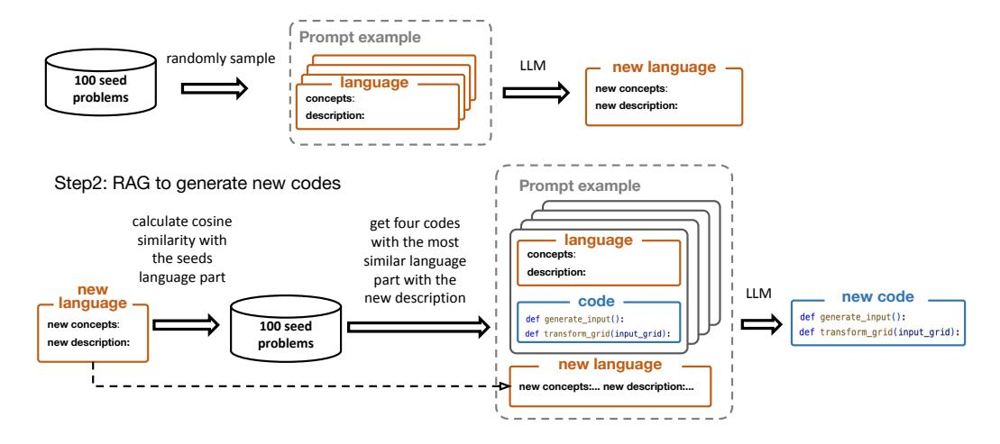

Figure 11: A new natural language description is sampled by prompting an LLM with seed natural language descriptions, effectively using in-context learning to recombine and mutate elements of different problems. Code is generated for that new description via Retrieval Augmented Generation (RAG). Our RAG pipeline retrieves seeds with similar descriptions, and prompts an LLM to generate code for the new description, given the retrieved seeds.

The prompt template for generating natural language descriptions by randomly sampling language descriptions from seed problems is as follows:

```
You've generated these on previous requests:

{examples}

Brainstorm {num_generations} more, using similar thinking:

'''python
# concepts:
# <concepts in your new generation>

# description:
# <description of your new generation>

'''
```

The prompt template for generating Python code from the natural-language descriptions (and similar example code retrieved from the seeds, via RAG) is as follows:

```
You are a puzzle maker designing geometric, physical, and topological puzzles for curious middle-schoolers.

Each puzzle consists of uncovering a deterministic rule, pattern, procedure, algorithm, or transformation law that maps inputs to outputs.

Both the inputs and outputs are 2D grids of colored pixels. There are 10 colors, but the order of the colors is never relevant to the puzzle.
```

```
The middle schoolers are trying to discover this deterministic
transformation, which can be implemented as a Python function called 'main'.
Designing a puzzle involves also creating example inputs, which can be
implemented as a Python function called 'generate_input'. Unlike 'main', the
 'generate_input' function should be stochastic, so that every time you run
it, you get another good example of what the transformation can be applied
to.
Here is a overview of the puzzle you are designing:
{description}
Please implement the puzzle by writing code containing the 'generate_input'
and 'main' functions. Use the following standard library ('common.py'):
'''python
{common_lib}
Here are some examples from puzzles with similar descriptions to show you
how to use functions in 'common.py':
{examples}
Your task is to implement the puzzle, following these steps:
1. Inspect the example puzzle implementations, making note of the functions
used and the physical/geometric/topological/logical details
2. Inspect the new puzzle's description
3. Brainstorm a possible implementation for the new puzzle
4. Generate a code block formatted like the earlier examples with a comment
starting '# concepts:' listing the concepts and '# description:' describing
the inputs and transformation from the given description.
Be sure to make the transformation 'main' deterministic. Follow the
description closely.
```

**Execution and Filtering of Generated Problems** We heuristically filter problems to improve the quality of data based on the following criteria:

- The generator and transformation functions can be executed, producing at least 4 inputoutput grids examples.
- Transformation being deterministic: We check for consistency by running the functions with different random seeds and filter out those with non-deterministic outputs.
- Appropriate grid sizes: We remove input-output grids with height or width larger than 30, aligning with grid sizes in ARC
- Color permutation check: Since we use numpy arrays with integers 0-9 to represent colors, we want to ensure transformations don't rely on arithmetic operations of these integers. We filter this by checking if input-output remains consistent when permuting the underlying color-number mapping.
- Removal of problems with all trivial identity input-output examples.

#### A.1 SEED EXAMPLES

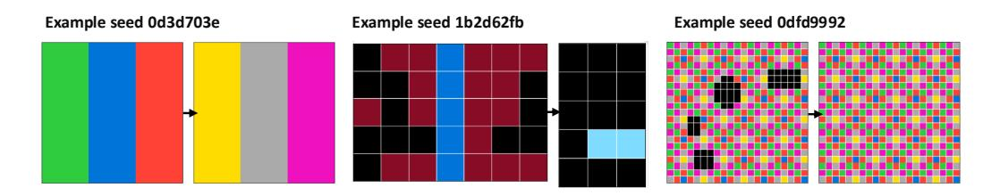

Figure 12: Three seed examples

```
"""======= problem id: 0d3d703e ======="""
from common import *
import numpy as np
from typing import *
# concepts:
# color mapping
# description:
# The input is a grid where each column is of the same color.
# To make the output, change each color according to the following
                                    mapping:
# green -> yellow, blue -> gray, red -> pink, teal -> maroon, yellow ->
                                     green, gray -> blue, pink -> red,
                                    maroon -> teal
def transform_grid(input_grid):
    # Initialize output grid
   output_grid = input_grid.copy()
    # Performs color mapping
   output_grid = np.vectorize(lambda color: color_map.get(color, color))
                                         (output_grid)
   return output_grid
# Constructing the color map
color_map = {Color.GREEN : Color.YELLOW,
             Color.BLUE : Color.GRAY,
             Color.RED : Color.PINK,
             Color.TEAL : Color.MARÓON,
             Color.YELLOW : Color.GREEN,
             Color.GRAY : Color.BLUE,
             Color.PINK : Color.RED,
             Color.MAROON : Color.TEAL
def generate_input():
    grid = np.full((3, 3), Color.BLACK)
    for x in range(grid.shape[0]):
        grid[x, :] = random.choice(list(color_map.keys()))
    return grid
"""======= problem id: 1b2d62fb ======="""
import numpy as np
from typing import *
from common import *
```

```
# concepts:
# boolean logical operations, bitmasks with separator
# description:
# In the input you will see two maroon bitmasks separated by a blue
                                     vertical bar
# To make the output, color teal the pixels that are not set in either
                                     bitmasks (logical NOR)
def transform_grid(input_grid: np.ndarray) -> np.ndarray:
    # Find the blue vertical bar. Vertical means constant X
    for x_bar in range(input_grid.shape[0]):
        if np.all(input_grid[x_bar, :] == Color.BLUE):
            break
    left_mask = input_grid[:x_bar, :]
    right_mask = input_grid[x_bar+1:, :]
   output_grid = np.zeros_like(left_mask)
   output_grid[(left_mask != Color.MAROON) & (right_mask != Color.MAROON)
                                         )] = Color.TEAL
   return output_grid
def generate_input() -> np.ndarray:
    # create a pair of equally sized maroon bitmasks
   width, height = np.random.randint(2, 10), np.random.randint(2, 10)
   grid1 = np.zeros((width, height), dtype=int)
    grid2 = np.zeros((width, height), dtype=int)
    for x in range(width):
        for y in range(height):
            grid1[x, y] = np.random.choice([Color.MAROON, Color.BLACK])
            grid2[x, y] = np.random.choice([Color.MAROON, Color.BLACK])
   # create a blue vertical bar
   bar = np.zeros((1, height), dtype=int)
   bar[0, :] = Color.BLUE
   grid = np.concatenate((grid1, bar, grid2), axis=0)
   return grid
"""======== problem id: 0dfd9992 ========"""
from common import *
import numpy as np
from typing import *
# concepts:
# occlusion, translational symmetry
# description:
# In the input you will see a translationally symmetric pattern randomly
                                     occluded by black pixels.
# To make the output, remove the occluding black pixels to reveal the
                                     translationally symmetric pattern.
def transform_grid(input_grid):
   # Plan:
    # 1. Find the translational symmetries
```

```
# 2. Reconstruct the sprite by ignoring the black pixels and
                                         exploiting the symmetry
   w, h = input_grid.shape
    # Identify the translational symmetries
   translations = detect_translational_symmetry(input_grid,
                                         ignore_colors=[Color.BLACK])
   assert len(translations) > 0, "No translational symmetry found"
   # Reconstruct the occluded black pixels by replacing them with colors
                                          found in the orbit of the
                                         symmetries
   output_grid = np.copy(input_grid)
   for x in range(w):
        for y in range(h):
            if output_grid[x, y] == Color.BLACK:
                # Use the translational symmetry to fill in the occluded
                # to do this we compute the ORBIT of the current pixel
                                                     under the
                                                     translations
                # and take the most common non-black color in the orbit
                # Compute the orbit into the output
                orbit_pixels = orbit(output_grid, x, y, translations)
                orbit_colors = {input_grid[transformed_x, transformed_y]
                                for transformed_x, transformed_y in
                                orbit_pixels}
                # occluded by black, so whatever color it is, black doesn
                                                     't count
                orbit_colors = orbit_colors - {Color.BLACK}
                # Copy the color
                assert len(orbit_colors) == 1, "Ambiguity: multiple
                                                     colors in the orbit"
                output_grid[x, y] = orbit_colors.pop()
   return output_grid
def generate_input():
   # Make a random large canvas
   grid = np.full((np.random.randint(15, 30), np.random.randint(15, 30))
                                         , Color.BLACK)
   # Make the basic sprite
   w, h = random.randint(3, 8), random.randint(3, 8)
   sprite = random_sprite(w, h, density=1, color_palette=Color.NOT_BLACK
   # Place the sprite in the canvas
    for x in range(0, grid.shape[0], w):
        for y in range(0, grid.shape[1], h):
            blit_sprite(grid, sprite, x, y)
   # Create random occluders
   n_occluders = random.randint(1, 5)
   for _ in range(n_occluders):
       x, y = random.randint(0, grid.shape[0]), random.randint(0, grid.
                                             shape[1])
       w, h = random.randint(3, 7), random.randint(3, 7)
        occluder_sprite = np.full((w, h), Color.BLACK)
       blit_sprite(grid, occluder_sprite, x, y)
```

| -   | • .    |
|-----|--------|
| Pre | print. |
| 110 | print. |

return grid

# A.2 COMMON LIBRARY

```
"""Common library for ARC"""
import numpy as np
import random
class Color:
   Enum for colors
   Color.BLACK, Color.BLUE, Color.RED, Color.GREEN, Color.YELLOW,
   Color.GREY, Color.PINK, Color.ORANGE, Color.TEAL, Color.MAROON
   Use Color.ALL_COLORS for 'set' of all possible colors
   Use Color.NOT_BLACK for 'set' of all colors except black
   Colors are strings (NOT integers),
   so you CAN'T do math/arithmetic/indexing on them.
    (The exception is Color.BLACK, which is 0)
def flood_fill(grid, x, y, color, connectivity=4):
   Fill the connected region that contains the point (x, y) with
   the specified color.
   connectivity: 4 or 8, for 4-way or 8-way connectivity.
   8-way counts diagonals as connected,
   4-way only counts cardinal directions as connected.
def draw_line(grid, x, y, end_x=None, end_y=None, length=None, direction=
                                     None,
              color=None, stop_at_color=[]):
   Draws a line starting at (x, y) extending to (end_x, end_y) or
   of the specified length in the specified direction
   Direction should be a vector with elements -1, 0, or 1.
   If length is None, then the line will continue until it hits
   the edge of the grid.
   stop_at_color: optional list of colors that the line should stop at.
   If the line hits a pixel of one of these colors, it will stop.
   Example:
   \# blue diagonal line from (0, 0) to (2, 2)
   draw_line(grid, 0, 0, length=3, color=blue, direction=(1, 1))
   draw_line(grid, 0, 0, end_x=2, end_y=2, color=blue)
def find_connected_components(grid, background=Color.BLACK, connectivity=
                                     4,
                              monochromatic=True):
   Find the connected components in the grid.
   Returns a list of connected
   components, where each connected component is a numpy array.
   connectivity: 4 or 8, for 4-way or 8-way connectivity.
   monochromatic: if True, each connected component is assumed to have
   only one color.
   If False, each connected component can include multiple colors.
```

```
def random_scatter_points(grid, color, density=0.5,
                            background=Color.BLACK):
   Randomly scatter points of the specified color in the grid with
   specified density.
def scale_pattern(pattern, scale_factor):
   Scales the pattern by the specified factor.
def blit_object(grid, obj, background=Color.BLACK):
   Draws an object onto the grid using its current location.
   Example usage:
   blit_object(output_grid, an_object, background=background_color)
def blit_sprite(grid, sprite, x, y, background=Color.BLACK):
   Draws a sprite onto the grid at the specified location.
   Example usage:
   blit_sprite(output_grid, the_sprite, x=x, y=y,
                background=background_color)
def bounding_box(grid, background=Color.BLACK):
   Find the bounding box of the non-background pixels in the grid.
   Returns a tuple (x, y, width, height) of the bounding box.
   Example usage:
   objects = find_connected_components(input_grid, monochromatic=True,
                                background=Color.BLACK, connectivity=8)
   teal_object=[obj for obj in objects if np.any(obj == Color.TEAL)][0]
   teal_x, teal_y, teal_w, teal_h = bounding_box(teal_object)
def object_position(obj, background=Color.BLACK, anchor="upper left"):
    (x,y) position of the provided object.
   By default, the upper left corner.
   anchor: "upper left", "upper right", "lower left", "lower right",
   "center", "upper center", "lower center", "left center", "right
                                         center"
   Example usage:
   x, y = object_position(obj, background=background_color,
                            anchor="upper left")
   middle_x, middle_y = object_position(obj, background=background_color
                                        anchor="center")
    11 11 11
def crop(grid, background=Color.BLACK):
   Crop the grid to the smallest bounding box that contains all
   non-background pixels.
   Example usage:
```

```
# Extract a sprite from an object
   sprite = crop(an_object, background=background_color)
def translate(obj, x, y, background=Color.BLACK):
   Translate by the vector (x, y). Fills in the new pixels with the
   background color.
   Example usage:
   red_object = ... # extract some object
   shifted_red_object = translate(red_object, x=1, y=1)
   blit_object(output_grid, shifted_red_object,
                background=background_color)
def collision(_=None, object1=None, object2=None, x1=0, y1=0, x2=0, y2=0,
   background=Color.BLACK):
   Check if object1 and object2 collide when object1 is at (x1, y1) and
   object2 is at (x2, y2).
   Example usage:
   # Check if a sprite can be placed onto a grid at (X,Y)
   collision(object1=output_grid, object2=a_sprite, x2=X, y2=Y)
   # Check if two objects collide
   collision(object1=object1, object2=object2,
                x1=X1, y1=Y1, x2=X2, y2=Y2)
def contact(_=None, object1=None, object2=None, x1=0, y1=0, x2=0, y2=0,
            background=Color.BLACK, connectivity=4,):
   Check if object1 and object2 touch each other (have contact)
   when object1 is at (x1, y1) and object2 is at (x2, y2).
   They are touching each other if they share a border, or if they
   overlap.
   Collision implies contact, but contact does not imply collision.
   connectivity: 4 or 8, for 4-way or 8-way connectivity.
       (8-way counts diagonals as touching,
       4-way only counts cardinal directions as touching)
   Example usage:
   # Check if a sprite touches anything if it were to be placed at (X,Y)
   contact(object1=output_grid, object2=a_sprite, x2=X, y2=Y)
   # Check if two objects touch each other
   contact(object1=object1, object2=object2)
def generate_position_has_interval(max_len, position_num, if_padding=
                                     False):
   Generate the position of the lines with random interval.
def random_free_location_for_sprite(grid, sprite, background=Color.BLACK,
                                    border_size=0, padding=0,
                                    padding_connectivity=8):
   Find a random free location for the sprite in the grid
```

```
Returns a tuple (x, y) of the top-left corner of the sprite in the
   grid, which can be passed to 'blit_sprite'
   border size: minimum distance from the edge of the grid
   background: color treated as transparent
   padding: if non-zero, the sprite will be padded with a non-background
   color before checking for collision
   padding_connectivity: 4 or 8, for 4-way or 8-way connectivity when
   padding the sprite
   Example usage:
   x, y = random_free_location_for_sprite(grid, sprite, padding=1,
       padding_connectivity=8, border_size=1, background=Color.BLACK)
   # find the location, using generous padding
   assert not collision(object1=grid, object2=sprite, x2=x, y2=y)
   blit_sprite(grid, sprite, x, y)
def object_interior(grid, background=Color.BLACK):
   Computes the interior of the object (including edges)
   returns a new grid of 'bool' where True indicates that the pixel is
   part of the object's interior.
   Example usage:
    interior = object_interior(obj, background=Color.BLACK)
   for x, y in np.argwhere(interior):
      # x,y is either inside the object or at least on its edge
def object_boundary(grid, background=Color.BLACK):
   Computes the boundary of the object (excluding interior)
   returns a new grid of 'bool' where True indicates that the pixel is
   part of the object's boundary.
   Example usage:
   boundary = object_boundary(obj, background=Color.BLACK)
   assert np.all(obj[boundary] != Color.BLACK)
def object_neighbors(grid, background=Color.BLACK, connectivity=4):
   Computes a mask of the points that neighbor or border the object, but
   are not part of the object.
   returns a new grid of 'bool' where True indicates that the pixel is
   part of the object's border neighbors5.
   Example usage:
   neighbors = object_neighbors(obj, background=Color.BLACK)
   assert np.all(obj[neighbors] == Color.BLACK)
   11 11 11
class Symmetry:
   Symmetry transformations, which transformed the 2D grid in ways that
   preserve visual structure.
   Returned by 'detect_rotational_symmetry',
   'detect_translational_symmetry', 'detect_mirror_symmetry'.
   def apply(self, x, y, iters=1):
```

```
Apply the symmetry transformation to the point (x, y) 'iters'
       Returns the transformed point (x', y')
def orbit(grid, x, y, symmetries):
   Compute the orbit of the point (x, y) under the symmetry
    transformations 'symmetries'.
   The orbit is the set of points that the point (x, y) maps to after
   applying the symmetry transformations different numbers of times.
   Returns a list of points in the orbit.
   Example:
   symmetries = detect_rotational_symmetry(input_grid)
   for x, y in np.argwhere(input_grid != Color.BLACK):
       # Compute orbit on to the target grid, which is typically the
       symmetric_points = orbit(output_grid, x, y, symmetries)
       # ... now we do something with them like copy colors or infer
       missing colors
def detect_translational_symmetry(grid, ignore_colors=[Color.BLACK]):
   Finds translational symmetries in a grid.
   Satisfies: grid[x, y] == grid[x + translate_x, y + translate_y] for
   all x, y, as long as neither pixel is in 'ignore_colors'.
   Returns a list of Symmetry objects, each representing a different
   translational symmetry.
   Example:
   symmetries = detect_translational_symmetry(grid, ignore_colors=[
                                         occluder color])
   for x, y in np.argwhere(grid != occluder_color):
        # Compute orbit on to the target grid
       # When copying to an output, this is usually the output grid
        symmetric_points = orbit(grid, x, y, symmetries)
        for x, y in symmetric_points:
           assert grid[x, y] == grid[x, y] or grid[x, y] ==
                                                 occluder_color
    11 11 11
def detect_mirror_symmetry(grid, ignore_colors=[Color.BLACK]):
   Returns list of mirror symmetries.
   Satisfies: grid[x, y] == grid[2*mirror_x - x, 2*mirror_y - y]
        for all x, y, as long as neither pixel is in 'ignore_colors'
   Example:
   symmetries = detect_mirror_symmetry(grid,ignore_colors=[Color.BLACK])
        # ignore_color: In case parts of the object have been removed and
       # occluded by black
   for x, y in np.argwhere(grid != Color.BLACK):
        for sym in symmetries:
            symmetric_x, symmetric_y = sym.apply(x, y)
            assert grid[symmetric_x, symmetric_y] == grid[x, y]
               or grid[symmetric_x, symmetric_y] == Color.BLACK
   If the grid has both horizontal and vertical mirror symmetries,
       the returned list will contain two elements.
```

```
def detect_rotational_symmetry(grid, ignore_colors=[Color.BLACK]):
    Finds rotational symmetry in a grid, or returns None if no symmetry
                                          is possible.
   Satisfies: grid[x, y] == grid[y - rotate_center_y + rotate_center_x,
                             -x + rotate_center_y + rotate_center_x]
                            # clockwise
               grid[x, y] == grid[-y + rotate_center_y + rotate_center_x,
                            x - rotate_center_y + rotate_center_x]
                             # counterclockwise
               for all x,y, as long as neither pixel is in ignore_colors
   Example:
    sym = detect_rotational_symmetry(grid, ignore_colors=[Color.BLACK])
        # ignore_color: In case parts of the object have been removed and
        # occluded by black
    for x, y in np.argwhere(grid != Color.BLACK):
        rotated_x, rotated_y = sym.apply(x, y, iters=1) # +1 clockwise,
        -1 counterclockwise
        assert grid[rotated_x, rotated_y] == grid[x, y] or
               grid[rotated_x, rotated_y] == Color.BLACK
   print(sym.center_x, sym.center_y) # In case these are needed, they
                                         are floats
def is_contiguous(bitmask, background=Color.BLACK, connectivity=4):
    Check if an array is contiguous.
   background: Color that counts as transparent (default: Color.BLACK)
    connectivity: 4 or 8, for 4-way (only cardinal directions) or
   8-way connectivity (also diagonals) (default: 4)
   Returns True/False
def random_sprite(n, m, density=0.5, symmetry=None, color_palette=None,
                connectivity=4, background=Color.BLACK):
   Generate a sprite (an object), represented as a numpy array.
   n, m: dimensions of the sprite. If these are lists, then a random
    value will be chosen from the list.
    symmetry: optional type of symmetry to apply to the sprite. Can be
   'horizontal', 'vertical', 'diagonal', 'radial', 'not_symmetric'. If None, a random symmetry type will be chosen.
   color palette: optional list of colors to use in the sprite. If None,
    a random color palette will be chosen.
   Returns an (n,m) NumPy array representing the sprite.
def detect_objects(grid, _=None, predicate=None, background=Color.BLACK,
                   monochromatic=False, connectivity=None,
                   allowed_dimensions=None,
                   colors=None, can_overlap=False):
   Detects and extracts objects from the grid that satisfy custom
   specification.
   predicate:
        a function that takes a candidate object as input and
       returns True if it counts as an object
   background:
```

```
color treated as transparent
monochromatic:
    if True, each object is assumed to have only one color
   If False, each object can include multiple colors.
connectivity:
    4 or 8, for 4-way or 8-way connectivity.
    If None, the connectivity is determined automatically.
allowed_dimensions:
    a list of tuples (n, m) specifying the allowed dimensions of the
    objects.
   If None, objects of any size are allowed.
colors:
    a list of colors that the objects are allowed to have.
   If None, objects of any color are allowed.
can_overlap: if True, objects can overlap.
    If False, objects cannot overlap.
Returns a list of objects, where each object is a numpy array.
```

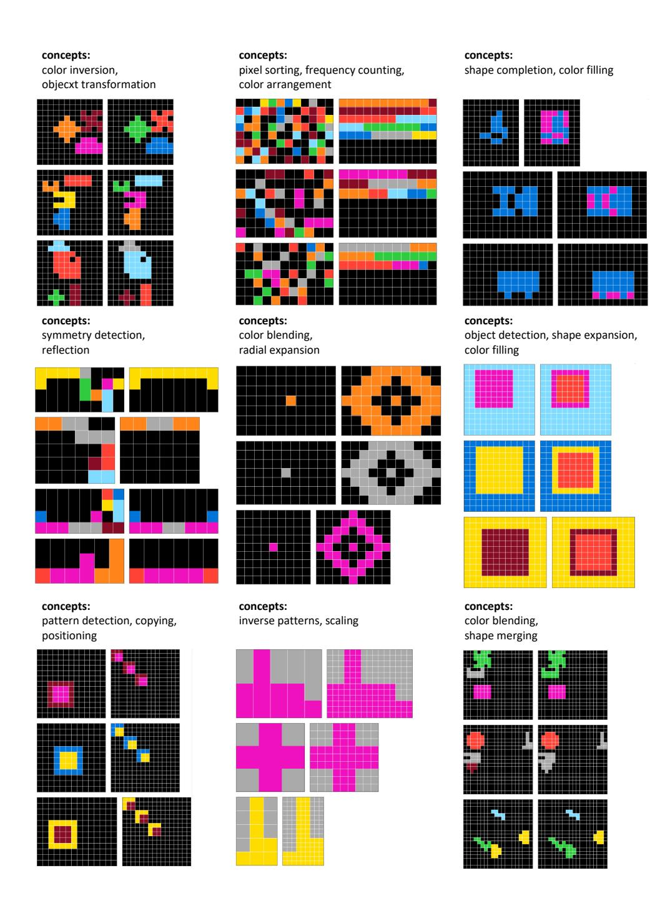

Figure 13: Nine example problems generated automatically by our pipeline.

### A.3 GENERATED ARC EXAMPLES

#### B FINE TUNING TRAINING DETAILS

#### B.1 PROMPTING THE MODELS

We must include in our prompts for our fine-tuned models the input/output 2D colored grids of each problem. To do this we represent the problem textually by naming the colors one-by-one. We renamed certain colors which were more than one token (e.g., maroon—brown saves 1 token/pixel), and presented the grid as a whitespace-delimited 2D array with newlines delimiting rows. Please see below.

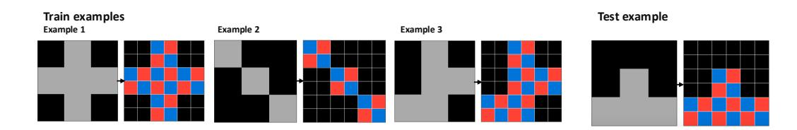

Figure 14: Prompt example illustration

## Transduction example:

```
Role: system -----
You are a world-class puzzle solver with exceptional pattern recognition
skills. Your task is to analyze puzzles, spot patterns, and provide direct
solutions.
      Role: user -----
Given input-output grid pairs as reference examples, carefully observe the
patterns to predict the output grid for new test input. Each pair follows
the same transformation rule. Grids are 2D arrays represented as strings,
with cells (colors) separated by spaces and rows by newlines.
Here are the input and output grids for the reference examples:
Example 1
Input:
Black Gray Black
Gray Gray Gray
Black Gray Black
Output:
Black Black Blue Red Black Black
Black Black Red Blue Black Black
Blue Red Blue Red
Red Blue Red Blue Red Blue
Black Black Blue Red Black Black
Black Black Red Blue Black Black
Example 2
Input:
Gray Black Black
Black Gray Black
Black Black Gray
Output:
Blue Red Black Black Black
Red Blue Black Black Black
Black Black Blue Red Black Black
Black Black Red Blue Black Black
```

```
Black Black Black Blue Red
Black Black Black Red Blue
Example 3
Input:
Black Gray Black
Black Gray Gray
Gray Gray Black
Output:
Black Black Blue Red Black Black
Black Black Red Blue Black Black
Black Black Blue Red Blue Red
Black Black Red Blue Red Blue
Blue Red Blue Red Black Black
Red Blue Red Blue Black Black
Here is the input grid for the test example:
Input:
Black Black Black
Black Gray Black
Gray Gray Gray
Directly provide the output grids corresponding to the given test input
grids, based on the patterns observed in the reference examples.
---- Role: assistant -----
The output grid for the test input grid is:
Black Black Black Black Black
Black Black Black Black Black
Black Black Blue Red Black Black
Black Black Red Blue Black Black
Blue Red Blue Red Blue Red
Red Blue Red Blue Red Blue
```

#### Induction example:

```
---- Role: system -----
You are a world-class puzzle solver with exceptional pattern recognition
skills and expertise in Python programming. Your task is to analyze puzzles
and provide Python solutions.
---- Role: user -----
Given input-output grid pairs as reference examples, carefully observe the
patterns to predict the output grid for new test input. Each pair follows
the same transformation rule. Grids are 2D arrays represented as strings,
with cells (colors) separated by spaces and rows by newlines.
Here are the input and output grids for the reference examples:
Example 1
Input:
Black Gray Black
Gray Gray Gray
Black Gray Black
Output:
Black Black Blue Red Black Black
Black Black Red Blue Black Black
Blue Red Blue Red
Red Blue Red Blue Red Blue
```

```
Black Black Blue Red Black Black
Black Black Red Blue Black Black
Example 2
Input:
Gray Black Black
Black Gray Black
Black Black Gray
Output:
Blue Red Black Black Black
Red Blue Black Black Black
Black Black Blue Red Black Black
Black Black Red Blue Black Black
Black Black Black Blue Red
Black Black Black Red Blue
Example 3
Input:
Black Gray Black
Black Gray Gray
Gray Gray Black
Output:
Black Black Blue Red Black Black
Black Black Red Blue Black Black
Black Black Blue Red Blue Red
Black Black Red Blue Red Blue
Blue Red Blue Red Black Black
Red Blue Red Blue Black Black
Here is the input grid for the test example:
Input:
Black Black Black
Black Gray Black
Gray Gray Gray
Write a Python function 'transform' that can convert any given input grid to
its corresponding output grid based on the pattern observed in the
reference examples.
---- Role: assistant -----
Let's solve this puzzle using Python code with the common library functions.
We'll first reason about the problem and then write the code to solve it.
The 'transform' function will take the input grid and return the output grid
. Here is the Python code with the comments describing how to solve the
problem:
'''python
from common import *
import numpy as np
from typing import *
# concepts:
# repetition, diagonal lines, color change
# description:
# In the input you will see a 3x3 grid with a specific diagonal pattern of
gray pixels.
# The output should be the result of repeating this diagonal pattern
horizontally and vertically
```

```
# to fill a 6x6 grid, changing the color from gray to blue and red in an
alternating manner.
def transform(input_grid: np.ndarray) -> np.ndarray:
    # Create a new 6x6 output grid filled with the background color (black)
   output_grid = np.full((6, 6), Color.BLACK)
    # Check for the diagonal pattern in the input grid
    for i in range(3):
        for j in range(3):
            if input_grid[i, j] == Color.GRAY:
                # Fill the same position in the output grid with alternating
 colors
                output_grid[i * 2, j * 2] = Color.BLUE
                output_grid[i * 2, j * 2 + 1] = Color.RED
                output_grid[i * 2 + 1, j * 2] = Color.RED
                output_grid[i * 2 + 1, j * 2 + 1] = Color.BLUE
   return output_grid
```

#### C Examples of Induction Solutions

#### C.1 ARC PROBLEM F3CDC58F

```
from common import *
import numpy as np
from typing import *
# concepts:
# color counting, grid transformation
# description:
# In the input, you will see a grid with several colored squares.
# To make the output, count the number of squares of each color.
# Fill the output grid with bars of corresponding colors.
# The height of each bar corresponds to the number of squares of that
                                     color.
def transform(input_grid: np.ndarray) -> np.ndarray:
    # Create a blank output grid
   output_grid = np.zeros_like(input_grid)
    # Count the number of squares of each color
   color_counts = {color: 0 for color in Color.NOT_BLACK}
    for row in input_grid:
        for cell in row:
            if cell in color_counts:
                color_counts[cell] += 1
    # Define the height of the bars based on the counts
   max_height = 10 # Maximum height of the bars
    for color, count in color_counts.items():
        if count > 0:
            for h in range(min(count, max_height)):
                output_grid[-(h + 1), (color - 1) %
    return output_grid
```

#### C.2 ARC PROBLEM BE03B35F

```
from common import *
import numpy as np
from typing import *
# concepts:
# color detection, pattern extraction, rotation transformation
# description:
# In the input, you will see a 5x5 grid consisting of a colored pattern
                                     in the top left corner and a 2x2
                                     square of red pixels in the bottom
                                     right corner.
# Depending on the color of the top left corner (blue or green), rotate
                                     the pattern by 90 degrees clockwise
                                     or counterclockwise.
# The output grid should be the transformed pattern placed in the same
                                     position as the original top left
                                     pattern.
def transform(input_grid):
   # Extract the top left 5x5 pattern
   pattern = input_grid[0:5, 0:5]
   # Identify the color in the top left corner
   corner_color = pattern[0, 0]
   # Define rotation based on the corner color
   if corner_color == Color.BLUE:
       transformed_pattern = np.rot90(pattern, k=-1) # Rotate 90
                                             degrees counterclockwise
   elif corner_color == Color.GREEN:
        transformed_pattern = np.rot90(pattern, k=1) # Rotate 90
                                             degrees clockwise
   else:
       raise ValueError("The corner color must be either BLUE or GREEN."
   # Create the output grid
   output_grid = np.full((2, 2), Color.BLACK) # Initialize a small grid
   output_grid = blit_sprite(output_grid, transformed_pattern, x=0, y=0,
                                          background=Color.BLACK)
   return output_grid
```

#### C.3 ARC PROBLEM 2072ABA6

```
from common import *

import numpy as np
from typing import *

# concepts:
# color mapping, pattern replication

# description:
# In the input you will see a 3x3 grid of colored pixels.
# The colors are either black or gray. The output should be a grid where:
# 1. If the pixel is black, it remains black in the output.
# 2. If the pixel is gray, it should be replaced with a 2x2 block of blue and red pixels in a checkerboard pattern.
```

```
# The blue pixel should occupy the top-left and bottom-right of the 2x2
                                     block, while the red pixel occupies
                                     the top-right and bottom-left.
def transform(input_grid):
   # Create an output grid that is larger than the input grid
   output_grid = np.zeros((input_grid.shape[0] * 2, input_grid.shape[1]
                                         * 2), dtype=int)
   # Fill the output grid based on the input grid
   for x in range(input_grid.shape[0]):
        for y in range(input_grid.shape[1]):
            if input_grid[x, y] == Color.BLACK:
                # Black stays black in the output
            else:
                # Replace gray with a checkerboard pattern of blue and
                output_grid[2 * x:2 * x + 2, 2 * y:2 * y + 2] = [
                    [Color.BLUE, Color.RED],
                    [Color.RED, Color.BLUE]
   return output_grid
```

#### C.4 ARC PROBLEM EF26CBF6

```
from common import *
import numpy as np
from typing import *
# concepts:
# color transformation, grid sections, boundary detection
# description:
# In the input, you will see a grid with a pattern of yellow and blue
                                     pixels with a black background,
# and multiple colored circles (not yellow or blue) placed randomly
                                     within the grid.
# The goal is to transform the output grid by replacing all the blue
                                     pixels with the color of the closest
                                      circle
# and keeping the yellow pixels unchanged.
def transform(input_grid: np.ndarray) -> np.ndarray:
   # Create a copy of the input grid to modify
   output_grid = np.copy(input_grid)
   # Find the coordinates of the colored circles
   circle_coordinates = np.argwhere((input_grid != Color.BLACK) & (
                                         input_grid != Color.YELLOW) & (
                                         input_grid != Color.BLUE))
   # Iterate over the grid and replace blue pixels with the nearest
                                         circle color
   for x in range(input_grid.shape[0]):
        for y in range(input_grid.shape[1]):
            if input_grid[x, y] == Color.BLUE:
                # Find the closest circle
                closest_color = None
                closest_distance = float('inf')
                for circle_x, circle_y in circle_coordinates:
```

```
distance = abs(circle_x - x) + abs(circle_y - y) #
```

#### C.5. ARC PROBLEM E7639916

```
from common import *
import numpy as np
from typing import *
# concepts:
# boundary detection, color filling
# description:
# In the input grid, you will see a black background with several purple
                                     pixels forming a boundary.
# The task is to fill the area enclosed by the purple boundary with blue
                                     pixels.
def transform(input_grid):
    # Create an output grid that starts as a copy of the input grid
   output_grid = np.copy(input_grid)
   # Find the coordinates of the purple pixels
   purple_coords = np.argwhere(input_grid == Color.PURPLE)
    # If no purple pixels are found, return the original grid
   if len(purple_coords) == 0:
        return output_grid
    # Get the boundaries of the purple pixels
   min_x, min_y = np.min(purple_coords, axis=0)
   max_x, max_y = np.max(purple_coords, axis=0)
    # Fill the area enclosed by the purple boundary
    for x in range(min_x, max_x + 1):
        for y in range(min_y, max_y + 1):
            # Check if the current position is outside the purple
                                                 boundary
            if (x == min_x or x == max_x or y == min_y or y == max_y) and
                                                  output_grid[x, y] ==
                                                 Color.BLACK:
                output_grid[x, y] = Color.BLUE
    return output_grid
```

## C.6 ARC PROBLEM C074846D

```
from common import *
import numpy as np
from typing import *
# concepts:
```

```
# rotation, color change, symmetry
# description:
# In the input, you will see a colored object with a single gray pixel.
# To make the output, rotate the object 90 degrees clockwise around the
                                     gray pixel,
# and color the newly exposed pixels green.
def transform(input_grid):
    # Find the gray pixel location
   gray_pixel_locations = np.argwhere(input_grid == Color.GRAY)
    assert len(gray_pixel_locations) == 1
   gray_x, gray_y = gray_pixel_locations[0]
    # Create an output grid
   output_grid = np.full(input_grid.shape, Color.BLACK)
    # Rotate the object around the gray pixel
    for x in range(input_grid.shape[0]);
        for y in range(input_grid.shape[1]):
            if input_grid[x, y] != Color.BLACK and input_grid[x, y] !=
                                                 Color.GRAY:
                # Calculate new position after 90 degrees clockwise
                                                     rotation
                new_x = gray_x + (y - gray_y)
                new_y = gray_y - (x - gray_x)
                # Check if the new position is within bounds
                if 0 <= new_x < output_grid.shape[0] and 0 <= new_y <</pre>
                                                     output_grid.shape[1]
                    # Place the rotated pixel in the output grid
                    output_grid[new_x, new_y] = input_grid[x, y]
                # Color newly exposed pixels green
                if output_grid[x, y] == Color.BLACK:
                    output_grid[x, y] = Color.GREEN
    # Place the gray pixel back in the center
   output_grid[gray_x, gray_y] = Color.GRAY
    return output_grid
```

# C.7 ARC PROBLEM AE58858E

```
from common import *

import numpy as np
from typing import *

# concepts:
# object detection, color change, size comparison

# description:
# In the input, you will see a grid with red objects of various sizes.
# To make the output, change all objects larger than a certain size (3 pixels) to pink.

def transform(input_grid):
    # Create a copy of the input grid to produce the output output_grid = np.copy(input_grid)

# Find all connected components (red objects) in the input grid
```

```
red_objects = find_connected_components(input_grid, background=Color.
```

#### C.8 ARC Problem 21F83797

```
from common import *
import numpy as np
from typing import *
# concepts:
# vertical and horizontal lines, intersection
# description:
# In the input, you will see two red pixels.
# To make the output, draw a blue square with the red pixels as corners.
# Additionally, draw a vertical and horizontal line that intersect at
                                     each red pixel.
def transform(input_grid):
   # Copy the input grid to the output grid
   output_grid = np.copy(input_grid)
   # Find the positions of the red pixels
   red_pixels = np.argwhere(input_grid == Color.RED)
   # Ensure there are exactly two red pixels
   assert len(red_pixels) == 2
    (x1, y1), (x2, y2) = red_pixels
   # Sort the red pixels' positions to determine which is top-left and
                                         bottom-right
   top_left = (min(x1, x2), min(y1, y2))
   bottom_right = (max(x1, x2), max(y1, y2))
   # Draw a blue square from the top-left to the bottom-right corner
   output_grid[top_left[0]:bottom_right[0]+1, top_left[1]:bottom_right[1
                                         ]+1] = Color.BLUE
   # Draw horizontal and vertical lines through the red pixels
   for x, y in [(x1, y1), (x2, y2)]:
       output_grid[x, :] = Color.RED # Horizontal line through red
                                             pixels
       output_grid[:, y] = Color.RED # Vertical line through red pixels
   return output_grid
```

#### C.9 ARC PROBLEM 33B52DE3

```
from common import *
import numpy as np
from typing import *
```

```
# concepts:
# object detection, color mapping, grid transformation
# description:
# In the input, you will see a 20x20 grid containing a 4x4 pattern made
                                      of colored pixels (not necessarily
                                      contiguous) and a series of 3x3 gray
                                       squares.
# The task is to extract the colors from the 4x4 pattern and color the
                                      corresponding 3x3 gray squares with
                                      those colors in a specific order.
# The first gray square should be colored with the first color from the
                                      pattern, the second gray square with
                                       the second color, and so on.
def transform(input_grid):
    # Step 1: Detect the 4x4 color pattern in the input grid.
    color_pattern = detect_objects(input_grid, monochromatic=False,
                                          connectivity=8)
    # Step 2: Extract the colors from the detected pattern.
    colors = []
    for obj in color_pattern:
        cropped_obj = crop(grid=obj, background=Color.BLACK)
        colors.extend(cropped_obj.flatten())
    # Step 3: Identify the locations of the gray squares.
    gray_squares = detect_objects(input_grid, colors=[Color.GRAY],
                                          monochromatic=True, connectivity
    # Step 4: Color the gray squares with the corresponding colors from
                                          the pattern.
    output_grid = np.copy(input_grid)
    for i, gray_square in enumerate(gray_squares):
    if i < len(colors):</pre>
            # Color the gray square with the corresponding color
            x, y = np.where(gray_square == Color.GRAY)
            flood_fill(output_grid, x[0], y[0], colors[i])
    return output_grid
```

# C.10 ARC PROBLEM 332EFDB3

```
from common import *
import numpy as np
from typing import *

# concepts:
# borders, alternating patterns

# description:
# In the input, you will see an empty black grid. To make the output,
```

```
height, width = input_grid.shape

# Create the output grid, initially a copy of the input grid
output_grid = input_grid.copy()

# Draw the blue border on edges that are multiples of 2
for x in range(0, height, 2): # Vertical edges: multiples of 2
```

## D INDUCTION FALSE POSITIVE SOLUTIONS

#### D.1 ARC PROBLEM 25094A63

```
from common import *
import numpy as np
from typing import *
# concepts:
# grid transformation, color replacement, pattern detection
# description:
# In the input, you will see a grid with colored regions. If a 5x5 square
                                      in the grid consists entirely of a
                                     single color,
# replace that square with a 5x5 yellow square in the output grid. If the
                                      square is not fully filled with a
                                     single color, leave it as is.
def transform(input_grid):
   # Plan:
   # 1. Iterate over the grid to find 5x5 squares.
   # 2. For each 5x5 square, check if it is monochromatic (all pixels
                                         are the same color).
   # 3. If it is, replace it with a 5x5 yellow square in the output grid
   output_grid = np.copy(input_grid)
   # Dimensions
   square_size = 5
   for x in range(len(input_grid) - square_size + 1):
        for y in range(len(input_grid[0]) - square_size + 1):
            # Extract the 5x5 region
           region = input_grid[x:x + square_size, y:y + square_size]
            # Check if the region is monochromatic
            if np.all(region == region[0, 0]): # All pixels should be
                                                 the same color
                # Replace the region with a yellow square
                output_grid[x:x + square_size, y:y + square_size] = Color
                                                     .YELLOW
```

```
return output_grid
```

## D.2 ARC PROBLEM 009D5C81

```
from common import *
import numpy as np
from typing import *
# concepts:
# pattern recognition, color transformation, grid manipulation
# description:
# In the input, you will see a 15x15 grid with a pattern of purple pixels
                                      that forms a shape and a blue
                                     circle in the center of the grid.
# To create the output, you should color the shape formed by the purple
                                     pixels with a specific color based
                                     on the number of purple pixels:
# - If there are 1-10 purple pixels, color the shape yellow.
# - If there are 11-20 purple pixels, color the shape green.
# - If there are 21-30 purple pixels, color the shape red.
# - If there are more than 30 purple pixels, color the shape orange.
# The blue circle should be replaced by black.
def transform(input_grid):
    # Create an output grid initialized to black
    output_grid = np.zeros_like(input_grid)
    # Count the number of purple pixels
    purple_count = np.count_nonzero(input_grid == Color.PURPLE)
    # Determine the color based on the number of purple pixels
    if 1 <= purple_count <= 10:</pre>
        shape_color = Color.YELLOW
    elif 11 <= purple_count <= 20:</pre>
        shape color = Color.GREEN
    elif 21 <= purple_count <= 30:</pre>
        shape_color = Color.RED
    else:
        shape_color = Color.ORANGE
    # Find the purple shape and color it accordingly
    output_grid[input_grid == Color.PURPLE] = shape_color
    # Replace the blue circle with black
    output_grid[input_grid == Color.BLUE] = Color.BLACK
    return output_grid
```

#### D.3 ARC PROBLEM E95E3D8E

```
from common import *
import numpy as np
from typing import *

# concepts:
# occlusion, symmetry detection, reconstruction
# description:
```

```
# In the input you will see a grid containing a repeated pattern that has
                                      been partially occluded by black
                                     squares.
# To make the output, remove the occluding black squares and restore the
                                     pattern based on the detected
                                     symmetry.
def transform(input_grid):
   # Plan:
   # 1. Extract the occluded pattern from the input grid.
   # 2. Detect the symmetries in the pattern.
   # 3. Fill in the missing parts of the pattern using the detected
                                         symmetries.
   # Step 1: Identify non-black pixels to find the pattern
   occlusion_color = Color.BLACK
   non_black_mask = input_grid != occlusion_color
   objects = detect_objects(input_grid, background=occlusion_color,
                                         monochromatic=False,
                                         connectivity=8)
   # Step 2: Find the symmetries in the detected objects
   symmetries = detect_translational_symmetry(input_grid, ignore_colors=
                                         [occlusion_color])
   # Step 3: Fill in the missing parts using the symmetries
   output_grid = input_grid.copy()
   for x, y in np.argwhere(non_black_mask):
        for symmetric_x, symmetric_y in orbit(input_grid, x, y,
                                             symmetries):
            if output_grid[symmetric_x, symmetric_y] == occlusion_color:
                output_grid[symmetric_x, symmetric_y] = input_grid[x, y]
   return output_grid
```

## D.4 ARC PROBLEM 73CCF9C2

```
from common import *
import numpy as np
from typing import *
# concepts:
# pattern extraction, rotation, centering
# description:
# In the input, you will see a grid with a pattern repeated several times
                                     , but with random rotations.
# To make the output, extract one instance of the pattern and rotate it
                                     back to its original orientation.
def transform(input_grid: np.ndarray) -> np.ndarray:
    # Create a copy of the input grid for the output
   output_grid = np.copy(input_grid)
   # Find connected components to extract patterns
   components = find_connected_components(output_grid, background=Color.
                                         BLACK, connectivity=8)
   # For each component, check if it's a valid pattern
   for component in components:
        # Crop the component to get the pattern
        pattern = crop(component, background=Color.BLACK)
```

```
# Check if the pattern can be rotated back to its original
```

#### D.5 ARC PROBLEM D56F2372

```
from common import *
import numpy as np
from typing import *
# object detection, symmetry detection, cropping
# description:
# In the input you will see a grid filled with different colored shapes.
# The output should be the smallest symmetric shape (with respect to the
                                     center) that can fit all the others
                                     inside it.
# If there are no symmetric shapes, the output should be a grid of the
                                     same size filled with the background
                                      color.
def transform(input_grid: np.ndarray) -> np.ndarray:
    # Find all connected components (shapes) in the grid
    components = find_connected_components(input_grid, background=Color.
                                         BLACK, connectivity=8,
                                         monochromatic=False)
    # Initialize a variable to track the largest symmetric shape found
   largest_symmetric_shape = None
   max area = 0
    # Check each component for symmetry and area
    for component in components:
        # Crop the component to get its shape
        cropped_shape = crop(component, background=Color.BLACK)
        # Check for horizontal and vertical mirror symmetry
        is_symmetric = np.array_equal(cropped_shape, np.flip(
                                             cropped_shape, axis=0)) or \
                       np.array_equal(cropped_shape, np.flip(
                                                            cropped shape
                                                             , axis=1))
        if is symmetric:
            area = np.count_nonzero(cropped_shape != Color.BLACK)
            if area > max_area:
                max_area = area
```

```
largest_symmetric_shape = cropped_shape

# If we found a symmetric shape, return it; otherwise return a grid
```

## E DATA AUGMENTATION AND RERANKING

We improve the performance of the transductive model through data augmentation and output reranking. The key insight is that any invertible transformation T can be applied to both training and test inputs, allowing us to generate multiple diverse predictions that are then aggregated and reranked. We consider two transformations of the training examples and test input in addition to the original task: (i) transpositions,  $T_t(x) = x^T$ ; (ii) color permutation, implemented as a random permutation of the integers 0-9 representing colors. For each transformation T, we apply it to all training examples and the test input, run a beam size 10 decoding on the transformed data, and then apply  $T^{-1}$  to the predictions to return to the original space. The transposition transformation addresses potential biases in the pretrained model regarding horizontal vs. vertical processing, while color permutations ensure the model isn't relying on specific color values. For each transformation T, each candidate output y receives a beam search score  $s_T(y)$  computed as:

$$s_T(y) = \mathsf{t}_{\theta} \big( T(y) \mid T(x_{\mathsf{train}}), T(x_{\mathsf{train}}), T(y_{\mathsf{train}}) \big) \tag{6}$$

where  $t_{\theta}(\cdot|\cdot)$  is the transduction model. For ranking, we aggregate candidates across all transformations. For each unique candidate y, we track both its frequency of appearance freq(y) across different transformations and its average beam search score  $\mathbb{E}\left[s_T(y)\right]$ . These are then ranked with frequency taking precedence over average score.

## F TEST-TIME TRAINING

Test time training is an approach for updating model parameters at test time, which we apply to our transduction model. We assume that we are given test problems  $\mathcal{D}$  comprising triples  $(\boldsymbol{x}_{\text{train}}, \boldsymbol{y}_{\text{train}}, x_{\text{test}})$  and a data augmentation procedure  $\text{AUG}(\boldsymbol{x}, \boldsymbol{y})$  which constructs variations of an ARC problem, for example by permuting colors and rotating grids. Then model parameters are optimized to maximize the likelihood of augmented test tasks where a random training input-output is selected to serve as a fake test example:

$$\mathbb{E}_{\substack{(\boldsymbol{x}_{\text{train}}, \boldsymbol{y}_{\text{train}}, x_{\text{test}}) \sim \mathcal{D} \\ k \sim 1.. \text{len}(\boldsymbol{x}_{\text{train}})}} \left[ \mathsf{t}_{\theta} \left( \boldsymbol{y}_{\text{train}}[k] \mid \boldsymbol{x}_{\text{train}}[k] \mid \boldsymbol{x}_{\text{train}}[k+1:], \boldsymbol{y}_{\text{train}}[k+1:], \boldsymbol{y}_{\text{train}}[k+1:] \right) \right]$$
(7)
$$(\boldsymbol{x}'_{\text{train}}, \boldsymbol{y}'_{\text{train}}) \sim \text{AUG}(\boldsymbol{x}_{\text{train}}, \boldsymbol{y}_{\text{train}})$$

where  $len(x_{train})$  is the number of example training inputs, and k is the index of the training inputoutput which is randomly selected to serve as a fake testcase. Note that this procedure does not rely on access to ground truth test predictions.

We choose each training example as a fake test example and do 10 times different randomly combined data augmentation for each fake task, which gives us 12k pseudo training dataset from the evaluation dataset. We also randomly include 5k RE-ARC examples and 5k ARC-Heavy examples, which we speculated would have a regularizing effect. The dataset size for test time training is 22k total problems.

# G EXPERIMENT PARAMETERS

#### G.1 INDUCTION

Fine-tuning Hyperparameters:

| training type         | lora rank | lora alpha | learning rate | gradient accumulate steps    |
|-----------------------|-----------|------------|---------------|------------------------------|
| lora finetune         | 64        | 64         | 2e-4          | 2                            |
| per device batch size | device    | epcoh      | weight decay  | learning rate scheduler type |
| 8                     | 8xA100    | 3          | 0             | cosine                       |

For the last 230k data finetune we used full finetuning instead of LoRA:

| training type | learning rate          | weight decay                 | gradient accumulate steps |
|---------------|------------------------|------------------------------|---------------------------|
| full finetune | 1e-5                   | 0.05                         | 1                         |
| epoch         | per device train batch | learning rate scheduler type | devices                   |
| 2             | 16                     | cosine                       | 8xA100                    |

# Inference Hyperparameters:

• temperature: 0.8 (1.0 for the full-data fine-tuned model)

• top-p: 1.0

Output selection: For experiments in section 4, when allowing one or two attempts, we filter the sample programs using train input-output examples and then randomly select one or two distinct programs uniformly. We report the expected value in our results. For experiments in section 5, we take the execution results of test output from the programs that can pass all the train examples and use majority vote to select the top 2, and in the case of concept arc, the top 3 test outputs.

### G.2 TRANSDUCTION

Fine-tune Hyperparameters:

| training type  | learning rate | weight decay           | gradient accumulate steps    | device |
|----------------|---------------|------------------------|------------------------------|--------|
| full finetune  | 1e-5          | 1e-2                   | 2                            | 8xA100 |
| engineer epoch | other epoch   | per device train batch | learning rate scheduler type |        |
| 3              | 2             | 8                      | cosine                       |        |

For the final engineering results, we train for 3 epochs. For all other experiment results, we train for 2 epochs.

Inference Hyperparameters:

• temperature: 0

• use beam search: True

• beam width:

engineer results: 40
 100k data scale: 20

3. all other experiment results: 3

• top-p: 1.0

Test-time Fine-tuning Hyperparameters

| training type         | lora rank | lora alpha | learning rate | gradient accumulate steps    |
|-----------------------|-----------|------------|---------------|------------------------------|
| lora finetune         | 64        | 64         | 2e-4          | 2                            |
| per device batch size | device    | epcoh      | weight decay  | learning rate scheduler type |
| 2                     | 4xA6000   | 3          | 0             | cosine                       |