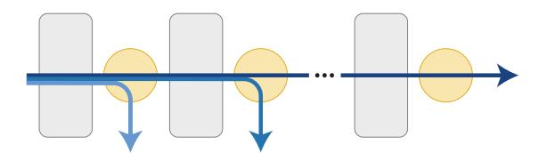
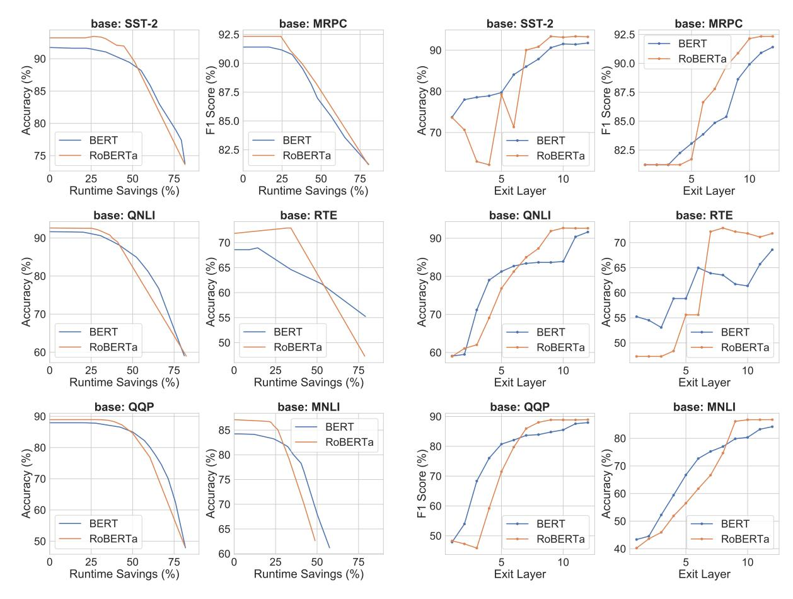
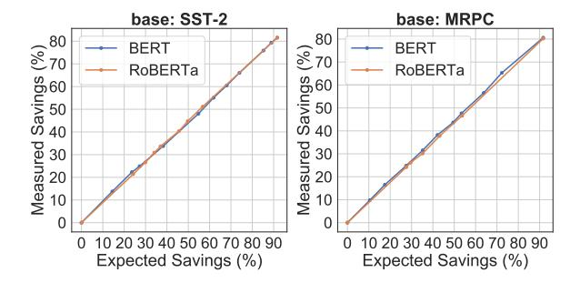
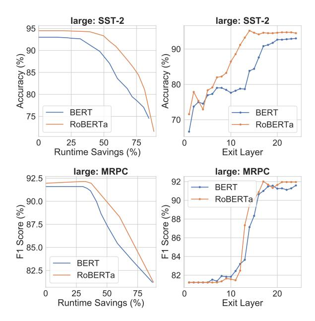
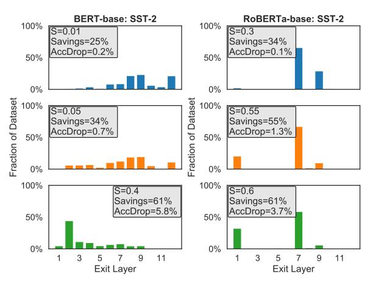

# **DeeBERT: Dynamic Early Exiting for Accelerating BERT Inference**

Ji Xin<sup>1,2</sup>, Raphael Tang<sup>1,2</sup>, Jaejun Lee<sup>1</sup>, Yaoliang Yu<sup>1,2</sup>, and Jimmy Lin<sup>1,2</sup>

<sup>1</sup>David R. Cheriton School of Computer Science, University of Waterloo <sup>2</sup>Vector Institute for Artificial Intelligence

{ji.xin,r33tang,j474lee,yaoliang.yu,jimmylin}@uwaterloo.ca

#### **Abstract**

Large-scale pre-trained language models such as BERT have brought significant improvements to NLP applications. However, they are also notorious for being slow in inference, which makes them difficult to deploy in realtime applications. We propose a simple but effective method, DeeBERT, to accelerate BERT inference. Our approach allows samples to exit earlier without passing through the entire model. Experiments show that DeeBERT is able to save up to  $\sim 40\%$  inference time with minimal degradation in model quality. Further analyses show different behaviors in the BERT transformer layers and also reveal their redundancy. Our work provides new ideas to efficiently apply deep transformer-based models to downstream tasks. Code is available at https://github.com/castorini/ DeeBERT.

## 1 Introduction

Large-scale pre-trained language models such as ELMo (Peters et al., 2018), GPT (Radford et al., 2019), BERT (Devlin et al., 2019), XLNet (Yang et al., 2019), and RoBERTa (Liu et al., 2019) have brought significant improvements to natural language processing (NLP) applications. Despite their power, they are notorious for being enormous in size and slow in both training and inference. Their long inference latencies present challenges to deployment in real-time applications and hardware-constrained edge devices such as mobile phones and smart watches.

To accelerate inference for BERT, we propose **DeeBERT**: **D**ynamic **e**arly **e**xiting for **BERT**. The inspiration comes from a well-known observation in the computer vision community: in deep convolutional neural networks, higher layers typically produce more detailed and finer-grained features (Zeiler and Fergus, 2014). Therefore, we



Figure 1: DeeBERT model overview. Grey blocks are transformer layers, orange circles are classification layers (off-ramps), and blue arrows represent inference samples exiting at different layers.

hypothesize that, for BERT, features provided by the intermediate transformer layers may suffice to classify some input samples.

DeeBERT accelerates BERT inference by inserting extra classification layers (which we refer to as *off-ramps*) between each transformer layer of BERT (Figure 1). All transformer layers and off-ramps are jointly fine-tuned on a given downstream dataset. At inference time, after a sample goes through a transformer layer, it is passed to the following off-ramp. If the off-ramp is confident of the prediction, the result is returned; otherwise, the sample is sent to the next transformer layer.

In this paper, we conduct experiments on BERT and RoBERTa with six GLUE datasets, showing that DeeBERT is capable of accelerating model inference by up to  $\sim\!40\%$  with minimal model quality degradation on downstream tasks. Further analyses reveal interesting patterns in the models' transformer layers, as well as redundancy in both BERT and RoBERTa.

## 2 Related Work

BERT and RoBERTa are large-scale pre-trained language models based on transformers (Vaswani et al., 2017). Despite their groundbreaking power, there have been many papers trying to examine and exploit their over-parameterization. Michel et al. (2019) and Voita et al. (2019) analyze redundancy

in attention heads. Q-BERT (Shen et al., 2019) uses quantization to compress BERT, and Layer-Drop (Fan et al., 2019) uses group regularization to enable structured pruning at inference time. On the knowledge distillation side, TinyBERT (Jiao et al., 2019) and DistilBERT (Sanh et al., 2019) both distill BERT into a smaller transformer-based model, and Tang et al. (2019) distill BERT into even smaller non-transformer-based models.

Our work is inspired by Cambazoglu et al. (2010), Teerapittayanon et al. (2017), and Huang et al. (2018), but mainly differs from previous work in that we focus on improving model efficiency with minimal quality degradation.

### 3 Early Exit for BERT inference

DeeBERT modifies fine-tuning and inference of BERT models, leaving pre-training unchanged. It adds one off-ramp for each transformer layer. An inference sample can exit earlier at an off-ramp, without going through the rest of the transformer layers. The last off-ramp is the classification layer of the original BERT model.

## 3.1 DeeBERT at Fine-Tuning

We start with a pre-trained BERT model with n transformer layers and add n off-ramps to it. For fine-tuning on a downstream task, the loss function of the i<sup>th</sup> off-ramp is

$$L_i(\mathcal{D}; \theta) = \frac{1}{|\mathcal{D}|} \sum_{(x,y) \in \mathcal{D}} H(y, f_i(x; \theta)), \quad (1)$$

where  $\mathcal{D}$  is the fine-tuning training set,  $\theta$  is the collection of all parameters, (x, y) is the feature-label pair of a sample, H is the cross-entropy loss function, and  $f_i$  is the output of the  $i^{th}$  off-ramp.

The network is fine-tuned in two stages:

- 1. Update the embedding layer, all transformer layers, and the last off-ramp with the loss function  $L_n$ . This stage is identical to BERT fine-tuning in the original paper (Devlin et al., 2019).
- 2. Freeze all parameters fine-tuned in the first stage, and then update all but the last off-ramp with the loss function  $\sum_{i=1}^{n-1} L_i$ . The reason for freezing parameters of transformer layers is to keep the optimal output quality for the last off-ramp; otherwise, transformer layers are no longer optimized solely for the last off-ramp, generally worsening its quality.

## **Algorithm 1** DeeBERT Inference (Input: x)

```
\begin{aligned} & \textbf{for } i = 1 \text{ to } n \textbf{ do} \\ & z_i = f_i(x;\theta) \\ & \textbf{if } \text{entropy}(z_i) < S \textbf{ then} \\ & \textbf{return } z_i \\ & \textbf{end } \textbf{if} \\ & \textbf{end for} \\ & \textbf{return } z_n \end{aligned}
```

#### 3.2 DeeBERT at Inference

The way DeeBERT works at inference time is shown in Algorithm 1. We quantify an off-ramp's confidence in its prediction using the entropy of the output probability distribution  $z_i$ . When an input sample x arrives at an off-ramp, the off-ramp compares the entropy of its output distribution  $z_i$  with a preset threshold S to determine whether the sample should be returned here or sent to the next transformer layer.

It is clear from both intuition and experimentation that a larger S leads to a faster but less accurate model, and a smaller S leads to a more accurate but slower one. In our experiments, we choose S based on this principle.

We also explored using ensembles of multiple layers instead of a single layer for the off-ramp, but this does not bring significant improvements. The reason is that predictions from different layers are usually highly correlated, and a wrong prediction is unlikely to be "fixed" by the other layers. Therefore, we stick to the simple yet efficient single output layer strategy.

#### 4 Experiments

### 4.1 Experimental Setup

We apply DeeBERT to both BERT and RoBERTa, and conduct experiments on six classification datasets from the GLUE benchmark (Wang et al., 2018): SST-2, MRPC, QNLI, RTE, QQP, and MNLI. Our implementation of DeeBERT is adapted from the HuggingFace Transformers Library (Wolf et al., 2019). Inference runtime measurements are performed on a single NVIDIA Tesla P100 graphics card. Hyperparameters such as hidden-state size, learning rate, fine-tune epoch, and batch size are kept unchanged from the library. There is no early stopping and the checkpoint after full fine-tuning is chosen.

|                        | SST-2                               | MRPC                                | QNLI                                | RTE                                | QQP                                 | MNLI-(m/mm)                                        |
|------------------------|-------------------------------------|-------------------------------------|-------------------------------------|------------------------------------|-------------------------------------|----------------------------------------------------|
|                        | Acc Time                            | F <sub>1</sub> Time                 | Acc Time                            | Acc Time                           | F <sub>1</sub> Time                 | Acc Time                                           |
| BERT-base              |                                     |                                     |                                     |                                    |                                     |                                                    |
| Baseline<br>DistilBERT | 93.6 36.72s<br>-1.4 -40%            | 88.2 34.77s<br>-1.1 -40%            | 91.0 111.44s<br>-2.6 -40%           | 69.9 61.26s<br>-9.4 -40%           | 71.4 145min<br>-1.1 -40%            | 83.9/83.0 202.84s<br>-4.5 -40%                     |
| DeeBERT                | -0.2 -21%<br>-0.6 -40%<br>-2.1 -47% | -0.3 -14%<br>-1.3 -31%<br>-3.0 -44% | -0.1 -15%<br>-0.7 -29%<br>-3.1 -44% | -0.4 -9%<br>-0.6 -11%<br>-3.2 -33% | -0.0 -24%<br>-0.1 -39%<br>-2.0 -49% | -0.0/-0.1 -14%<br>-0.8/-0.7 -25%<br>-3.9/-3.8 -37% |
| RoBERTa-base           |                                     |                                     |                                     |                                    |                                     |                                                    |
| Baseline<br>LayerDrop  | 94.3 36.73s<br>-1.8 -50%            | 90.4 35.24s                         | 92.4 112.96s                        | 67.5 60.14s                        | 71.8 152min                         | 87.0/86.3 198.52s<br>-4.1 -50%                     |
| DeeBERT                | +0.1 -26%<br>-0.0 -33%<br>-1.8 -44% | +0.1 -25%<br>+0.2 -28%<br>-1.1 -38% | -0.1 -25%<br>-0.5 -30%<br>-2.5 -39% | -0.6 -32% $-0.4 -33%$ $-1.1 -35%$  | +0.1 -32%<br>-0.0 -39%<br>-0.6 -44% | -0.0/-0.0 -19%<br>-0.1/-0.3 -23%<br>-3.9/-4.1 -29% |

Table 1: Comparison between baseline (original BERT/RoBERTa), DeeBERT, and other acceleration methods. LayerDrop only reports results on SST-2 and MNLI. Time savings of DistilBERT and LayerDrop are estimated by reported model size reduction.

#### 4.2 Main Results

We vary DeeBERT's quality–efficiency trade-off by setting different entropy thresholds S, and compare the results with other baselines in Table 1. Model quality is measured on the test set, and the results are provided by the GLUE evaluation server. Efficiency is quantified with wall-clock inference runtime<sup>1</sup> on the entire test set, where samples are fed into the model one by one. For each run of DeeBERT on a dataset, we choose three entropy thresholds S based on quality–efficiency trade-offs on the development set, aiming to demonstrate two cases: (1) the maximum runtime savings with minimal performance drop (< 0.5%), and (2) the runtime savings with moderate performance drop (2% - 4%). Chosen S values differ for each dataset.

We also visualize the trade-off in Figure 2. Each curve is drawn by interpolating a number of points, each of which corresponds to a different threshold S. Since this only involves a comparison between different settings of DeeBERT, runtime is measured on the development set.

From Table 1 and Figure 2, we observe the following patterns:

 Despite differences in baseline performance, both models show similar patterns on all datasets: the performance (accuracy/F<sub>1</sub> score) stays (mostly) the same until runtime saving reaches a certain turning point, and then starts to drop gradually. The turning point typically comes earlier for BERT than for RoBERTa, but after the turning point, the performance of RoBERTa drops faster than for BERT. The reason for this will be discussed in Section 4.4.

 Occasionally, we observe spikes in the curves, e.g., RoBERTa in SST-2, and both BERT and RoBERTa in RTE. We attribute this to possible regularization brought by early exiting and thus smaller effective model sizes, i.e., in some cases, using all transformer layers may not be as good as using only some of them.

Compared with other BERT acceleration methods, DeeBERT has the following two advantages:

- Instead of producing a fixed-size smaller model like DistilBERT (Sanh et al., 2019), Dee-BERT produces a series of options for faster inference, which users have the flexibility to choose from, according to their demands.
- Unlike DistilBERT and LayerDrop (Fan et al., 2019), DeeBERT does not require further pretraining of the transformer model, which is much more time-consuming than fine-tuning.

### 4.3 Expected Savings

As the measurement of runtime might not be stable, we propose another metric to capture efficiency,

<sup>&</sup>lt;sup>1</sup>This includes both CPU and GPU runtime.



Figure 2: DeeBERT quality and efficiency trade-offs for BERT-base and RoBERTa-base models.

Figure 4: Accuracy of each off-ramp for BERT-base and RoBERTa-base.



Figure 3: Comparison between expected saving (*x*-axis) and actual measured saving (*y*-axis), using BERT-base and RoBERTa-base models.

called expected saving, defined as

$$1 - \frac{\sum_{i=1}^{n} i \times N_i}{\sum_{i=1}^{n} n \times N_i},\tag{2}$$

where n is the number of layers and  $N_i$  is the number of samples exiting at layer i. Intuitively, expected saving is the fraction of transformer layer execution saved by using early exiting. The advantage of this metric is that it remains invariant between different runs and can be analytically computed. For validation, we compare this metric with

measured saving in Figure 3. Overall, the curves show a linear relationship between expected savings and measured savings, indicating that our reported runtime is a stable measurement of Dee-BERT's efficiency.

### 4.4 Layerwise Analyses

In order to understand the effect of applying Dee-BERT to both models, we conduct further analyses on each off-ramp layer. Experiments in this section are also performed on the development set.

**Output Performance by Layer.** For each offramp, we force *all samples* in the development set to exit here, measure the output quality, and visualize the results in Figure 4.

From the figure, we notice the difference between BERT and RoBERTa. The output quality of BERT improves at a relatively stable rate as the index of the exit off-ramp increases. The output quality of RoBERTa, on the other hand, stays almost unchanged (or even worsens) for a few layers, then rapidly improves, and reaches a saturation point be-



Figure 5: Results for BERT-large and RoBERTa-large.

fore BERT does. This provides an explanation for the phenomenon mentioned in Section 4.2: on the same dataset, RoBERTa often achieves more runtime savings while maintaining roughly the same output quality, but then quality drops faster after reaching the turning point.

We also show the results for BERT-large and RoBERTa-large in Figure 5. From the two plots on the right, we observe signs of redundancy that both BERT-large and RoBERTa-large share: the last several layers do not show much improvement compared with the previous layers (performance even drops slightly in some cases). Such redundancy can also be seen in Figure 4.

**Number of Exiting Samples by Layer.** We further show the fraction of samples exiting at each off-ramp for a given entropy threshold in Figure 6.

Entropy threshold S=0 is the baseline, and all samples exit at the last layer; as S increases, gradually more samples exit earlier. Apart from the obvious, we observe additional, interesting patterns: if a layer does not provide better-quality output than previous layers, such as layer 11 in BERT-base and layers 2–4 and 6 in RoBERTa-base (which can be seen in Figure 4, top left), it is typically chosen by very few samples; popular layers are typically those that substantially improve over previous layers, such as layer 7 and 9 in RoBERTa-base. This shows that an entropy threshold is able to choose the fastest off-ramp among those with comparable quality, and achieves a good trade-off between quality and efficiency.



Figure 6: Number of output samples by layer for BERT-base and RoBERTa-base. Each plot represents a separate entropy threshold S.

#### 5 Conclusions and Future Work

We propose DeeBERT, an effective method that exploits redundancy in BERT models to achieve better quality–efficiency trade-offs. Experiments demonstrate its ability to accelerate BERT's and RoBERTa's inference by up to ~40%, and also reveal interesting patterns of different transformer layers in BERT models.

There are a few interesting questions left unanswered in this paper, which would provide interesting future research directions: (1) DeeBERT's training method, while maintaining good quality in the last off-ramp, reduces model capacity available for intermediate off-ramps; it would be important to look for a method that achieves a better balance between all off-ramps. (2) The reasons why some transformer layers appear redundant<sup>2</sup> and why DeeBERT considers some samples easier than others remain unknown; it would be interesting to further explore relationships between pre-training and layer redundancy, sample complexity and exit layer, and related characteristics.

## Acknowledgment

We thank anonymous reviewers for their insightful suggestions. We also gratefully acknowledge funding support from the Natural Sciences and Engineering Research Council (NSERC) of Canada. Computational resources used in this work were provided, in part, by the Province of Ontario, the Government of Canada through CIFAR, and companies sponsoring the Vector Institute.

<sup>&</sup>lt;sup>2</sup>For example, the first and last four layers of RoBERTabase on SST-2 (Figure 4, top left).

### References

- B. Barla Cambazoglu, Hugo Zaragoza, Olivier Chapelle, Jiang Chen, Ciya Liao, Zhaohui Zheng, and Jon Degenhardt. 2010. Early exit optimizations for additive machine learned ranking systems. In Proceedings of the Third ACM International Conference on Web Search and Data Mining (WSDM 2010), pages 411–420, New York, New York.
- Jacob Devlin, Ming-Wei Chang, Kenton Lee, and Kristina Toutanova. 2019. BERT: Pre-training of deep bidirectional transformers for language understanding. In Proceedings of the 2019 Conference of the North American Chapter of the Association for Computational Linguistics: Human Language Technologies, Volume 1 (Long and Short Papers), pages 4171–4186, Minneapolis, Minnesota.
- Angela Fan, Edouard Grave, and Armand Joulin. 2019. Reducing transformer depth on demand with structured dropout. *arXiv:1909.11556*.
- Gao Huang, Danlu Chen, Tianhong Li, Felix Wu, Laurens van der Maaten, and Kilian Weinberger. 2018. Multi-scale dense networks for resource efficient image classification. In *Proceedings of the 6th International Conference on Learning Representations*, Vancouver, BC, Canada.
- Xiaoqi Jiao, Yichun Yin, Lifeng Shang, Xin Jiang, Xiao Chen, Linlin Li, Fang Wang, and Qun Liu. 2019. TinyBERT: Distilling BERT for natural language understanding. arXiv:1909.10351.
- Yinhan Liu, Myle Ott, Naman Goyal, Jingfei Du, Mandar Joshi, Danqi Chen, Omer Levy, Mike Lewis, Luke Zettlemoyer, and Veselin Stoyanov. 2019. RoBERTa: A robustly optimized BERT pretraining approach. *arXiv:1907.11692*.
- Paul Michel, Omer Levy, and Graham Neubig. 2019. Are sixteen heads really better than one? In *Advances in Neural Information Processing Systems* 32, pages 14014–14024.
- Matthew Peters, Mark Neumann, Mohit Iyyer, Matt Gardner, Christopher Clark, Kenton Lee, and Luke Zettlemoyer. 2018. Deep contextualized word representations. In *Proceedings of the 2018 Conference of the North American Chapter of the Association for Computational Linguistics: Human Language Technologies, Volume I (Long Papers)*, pages 2227–2237, New Orleans, Louisiana.
- Alec Radford, Jeffrey Wu, Rewon Child, David Luan, Dario Amodei, and Ilya Sutskever. 2019. Language models are unsupervised multitask learners. *OpenAI Blog*.
- Victor Sanh, Lysandre Debut, Julien Chaumond, and Thomas Wolf. 2019. DistilBERT, a distilled version of BERT: smaller, faster, cheaper and lighter. *arXiv:1910.01108*.

- Sheng Shen, Zhen Dong, Jiayu Ye, Linjian Ma, Zhewei Yao, Amir Gholami, Michael W. Mahoney, and Kurt Keutzer. 2019. Q-BERT: Hessian based ultra low precision quantization of BERT. *arXiv:1909.05840*.
- Raphael Tang, Yao Lu, and Jimmy Lin. 2019. Natural language generation for effective knowledge distillation. In *Proceedings of the 2nd Workshop on Deep Learning Approaches for Low-Resource NLP (DeepLo 2019)*, pages 202–208, Hong Kong, China.
- Surat Teerapittayanon, Bradley McDanel, and Hsiang-Tsung Kung. 2017. BranchyNet: Fast inference via early exiting from deep neural networks. *arXiv:1709.01686*.
- Ashish Vaswani, Noam Shazeer, Niki Parmar, Jakob Uszkoreit, Llion Jones, Aidan N. Gomez, Łukasz Kaiser, and Illia Polosukhin. 2017. Attention is all you need. In *Advances in Neural Information Processing Systems* 30, pages 5998–6008.
- Elena Voita, David Talbot, Fedor Moiseev, Rico Sennrich, and Ivan Titov. 2019. Analyzing multi-head self-attention: Specialized heads do the heavy lifting, the rest can be pruned. In *Proceedings of the 57th Annual Meeting of the Association for Computational Linguistics*, pages 5797–5808, Florence, Italy.
- Alex Wang, Amanpreet Singh, Julian Michael, Felix Hill, Omer Levy, and Samuel Bowman. 2018. GLUE: A multi-task benchmark and analysis platform for natural language understanding. In *Proceedings of the 2018 EMNLP Workshop Black-boxNLP: Analyzing and Interpreting Neural Networks for NLP*, pages 353–355, Brussels, Belgium.
- Thomas Wolf, Lysandre Debut, Victor Sanh, Julien Chaumond, Clement Delangue, Anthony Moi, Pierric Cistac, Tim Rault, R'emi Louf, Morgan Funtowicz, and Jamie Brew. 2019. HuggingFace's Transformers: State-of-the-art natural language processing. arXiv:1910.03771.
- Zhilin Yang, Zihang Dai, Yiming Yang, Jaime G. Carbonell, Ruslan Salakhutdinov, and Quoc V. Le. 2019. XLNet: generalized autoregressive pretraining for language understanding. *arXiv:1906.08237*.
- Matthew D. Zeiler and Rob Fergus. 2014. Visualizing and understanding convolutional networks. In *Proceedings of the 13th European Conference on Computer Vision (ECCV 2014)*, pages 818–833, Zürich, Switzerland.