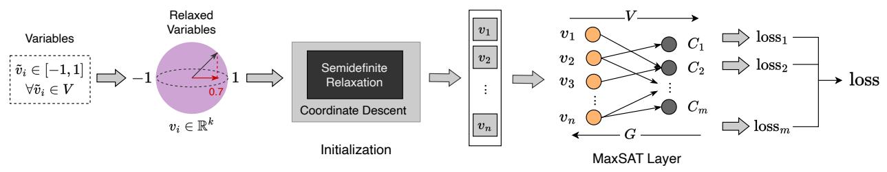
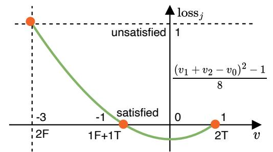
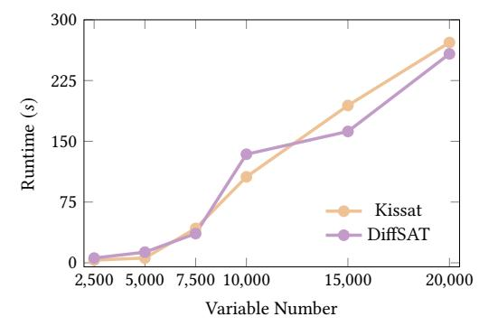

## DiffSAT: Differential MaxSAT Layer for SAT Solving

Yu Zhang<sup>1</sup>, Hui-Ling Zhen<sup>2</sup>, Mingxuan Yuan<sup>2</sup>, Bei Yu<sup>1</sup> Chinese University of Hong Kong <sup>2</sup> Huawei Noah's Ark Lab

#### Abstract

Modern boolean satisfiability (SAT) solvers heavily rely on the conflict-driven clause learning (CDCL) framework to efficiently search the solution space and resolve conflicts during the search process. However, CDCL still faces challenges in terms of searching efficiency, particularly in complex cases with deep/symmetric/treebased structures. To address this issue, numerous learning-driven methods have been proposed. However, these methods primarily focus on utilizing data-driven approaches to enhance searching efficiency and decision accuracy, while overlooking the core issue of the state explosion within the CDCL framework itself when the search starts at the wrong point. In this paper, we introduce DiffSAT, a novel approach that differentiates the discrete SAT problem and progressively searches for satisfying assignments through the forward and backward propagation of a neural network layer. DiffSAT initiates with an initial assignment obtained through semidefinite approximation and iteratively explores the solution space guided by a differential loss function. Notably, DiffSAT does not require training data and can be applied to large-scale problems that have not been seen before. The experimental results provide evidence that DiffSAT exhibits superior performance compared to existing end-to-end learning-based SAT solvers and can be generalized to solve large-scale SAT problems. Additionally, DiffSAT surpasses state-of-the-art SAT solvers in effectively finding satisfying assignments for complex problems in SATCOMP-2023.

#### 1 Introduction

Boolean satisfiability is the problem of determining if there exists an assignment for all variables that satisfies a given Boolean formula. In general, a boolean formula  $\phi$  can be represented as a conjunctive normal form (CNF) consisting of a conjunction of clauses  $\omega$ , each of which denotes a disjunction of literals. A literal is either a variable  $x_i$  or its complement. Each variable can be assigned a logic value, either 0 or 1. An SAT solver either finds an assignment such that  $\phi$  is satisfied or proves that no such assignment exists, i.e., UNSAT. Particularly, the 3-SAT problem is the first proven NP-complete problem [5]. Modern SAT solvers are based on the CDCL algorithm, and it works as a basic engine for many applications like circuit testing and formal verification. The main advantage of CDCL-based solvers is their ability to learn from conflicts and use that knowledge to prune the search space more effectively. However, existing CDCL-based SAT solvers still suffer from exponential searching space and are unable to correct errors through a learning-from-mistakes system, resulting in an infinite loop in solving complex SAT problems [2].

Recently, a growing number of learning-based approaches have been studied extensively to improve SAT-solving efficiency, particularly under the consideration of CNF structure learning with graph neural networks (GNNs). The learning-based approaches fall into two directions. On the one hand, the end-to-end approaches propose to solve SAT problems from scratch in a standalone way.

The first end-to-end learning-based solver is NeuroSAT [16], which models the SAT problem as a classification task and trains a GNN-based classifier with single-bit supervision (satisfiable or not). SAT-former [17] takes CNF instances as GNN inputs and leverages a hierarchical transformer to capture the relationships among clauses, search for UNSAT cores, and determine whether the instance is satisfied or not. In general, such learning-based methods usually begin at a graph neural network to get the embedding vectors of literals and clauses and end with a classifier to determine whether the whole problem can be satisfied or not. Meanwhile, if satisfied, one of the satisfying assignments can be decoded from k-means clusters of literal embeddings [16, 18]. Despite the significant improvements, current end-to-end learning-based approaches cannot beat traditional solvers in both accuracy and solving efficiency.

On the other hand, learning-aided approaches try to learn an efficient heuristic and are integrated as a plug-in component with the traditional SAT solvers. For example, NeuroCore [15] improves the variable branching heuristic in CDCL SAT solvers by predicting the variables involved in the unsatisfiable core (i.e., a subset of the SAT formula that remains unsatisfiable). NeuroBack [21] leverages GNNs to predict phases (i.e., values) of variables appearing in the majority (or even all) of the satisfying assignments that are essential for CDCL SAT solving. Though accelerating CDCL SAT solvers, the upper bound performance of learning-aided solvers is ultimately limited by the capabilities of the underlying backbone solvers. When the input CNF contains some complex structures, such as cyclic or tree-based structures, it is easy for the CDCL SAT solver to trap the iterative structure in an infinite loop. For instance, consider the benchmark "sgen3-n260-s62321009-sat" from the SAT Competition 2023 [1]. This particular SAT problem consists of only 260 variables and 884 clauses, making it relatively small in size. However, despite its small size, it poses a significant challenge for state-of-the-art CDCL-based SAT solvers. None of these solvers can produce a satisfying assignment within a time limit of 10,000 seconds. This example highlights a scenario where the initial search path of a SAT solver deviates significantly from the correct path. Consequently, the CDCL framework's inability to rectify errors causes the solver to become trapped in an infinite loop.

Considering the above, we introduce DiffSAT, a differential approach aimed at progressively searching for satisfying assignments for SAT problems. First, DiffSAT generalizes the original SAT problem into a maximum satisfiable (MaxSAT) problem and employs a semidefinite approximation of the MaxSAT problem to obtain an initial solution that satisfies as many clauses as possible. Then, DiffSAT introduces a network layer, the MaxSAT layer, that differentiates the proposed loss function and facilitates the search for satisfying assignments. The main contributions are summarized as:

• We model the SAT solving from a novel perspective. Specifically, for satisfiable CNFs, we transform the SAT problem into a minimization problem and iteratively search for the satisfying assignment in a differential manner;

- We introduce a novel neural network layer, termed the MaxSAT layer, which integrates SAT solving into both the forward and backward pass. The MaxSAT layer functions as a solver, systematically exploring the solution space and iteratively refining variable assignments using gradient descent.
- Our empirical evaluation on random datasets demonstrates that DiffSAT surpasses previous end-to-end learning-based solvers and achieves performance comparable to the mainstream SAT solver, Kissat, on large benchmarks. More importantly, DiffSAT requires significantly less runtime compared to state-of-the-art SAT solvers in finding satisfying assignments for some intricate problems in the SAT Competition 2023.

#### 2 Preliminaries

#### 2.1 Approximation algorithms for MaxSAT

In addition to exact solvers based on combinatorial search, there have been several approaches that explore approximation algorithms for the MaxSAT problem, both from theoretical and practical perspectives. These approaches primarily aim to achieve a high approximation ratio  $\alpha$ , which refers to the quality of the approximate solution compared to the optimal solution as

Approximated objective  $\leq \alpha \cdot \text{Optimal objective}$ .

The first approximation algorithm for the MaxSAT problem was proposed in [7], which utilized a linear programming (LP) approximation with an approximation ratio of  $\alpha=0.75$ . Building upon this, they also introduced a semidefinite programming (SDP) approximation for the Max2SAT problem with an improved approximation ratio of  $\alpha=0.878$ . This SDP-based approach formed the foundation for subsequent approximation methods in MaxSAT. Another SDP approach, presented in [6], further refined the approximation ratio to  $\alpha=0.931$  for the Max2SAT problem and extended it to handle the Max3SAT problem with an approximation ratio of  $\alpha=0.875$  [11]. Exploiting the high approximation quality of SDP relaxation for the MaxSAT problem, a recent work [20] combined low-rank semidefinite programming with a branch-and-bound strategy, achieving state-of-the-art performance for both the Max2SAT and Max3SAT problems in the MAXSAT 2016 competition.

#### 2.2 Problem Formulation

Deep-learning-based SAT solvers face challenges when attempting to solve SAT problems in an end-to-end manner, while traditional CDCL SAT solvers still struggle with the exponential search spaces. To address these limitations, we propose a novel approach to enhance end-to-end SAT solving. Our approach involves exploring a differentiable loss function and integrating a MaxSAT solver layer into deep learning systems. By doing so, we aim to overcome the inherent limitations of CDCL systems when dealing with complex CNFs. In this paper, our primary focus is on exploring satisfying variable assignments for satisfied problems, as tackling unsatisfiable certification presents a distinct and separate challenge.

#### 3 Algorithm

The overview of our proposed DiffSAT is depicted in Figure 1. DiffSAT begins by generalizing the original SAT problem to its MaxSAT formulation and then utilizes semidefinite approximation to find an initial solution by relaxing the discrete variables to continuous variables. Next, based on the variable-clause connection

graph (VCG), DiffSAT designs a loss function for each clause and treats the partially connected graph as a network layer, named the MaxSAT layer. Notably, the MaxSAT layer does not contain any unknown parameters, as the weights of existing connections are essentially the signs of variables in clauses, thereby eliminating the need for labeled data or a neural network training phase. During the forward pass, the MaxSAT layer checks the satisfiability of all clauses based on the input assignment. In the backward pass, the MaxSAT layer calculates the gradients of variables in the falsified clauses and updates the variables with the largest absolute gradient, thereby pushing the variable assignments towards satisfying more clauses. This approach allows DiffSAT to embed logic formulas into a network layer and continuously update variable assignments differentially, avoiding the exponential discrete search in traditional SAT solvers and achieving efficient SAT solving.

#### 3.1 From SAT to MaxSAT

The MaxSAT problem serves as the optimization counterpart to the satisfiability problem, aiming to maximize the number of satisfied clauses. It is worth noting that if a solution to the MaxSAT problem can satisfy all the clauses, the variable assignment can be used to constitute a valid solution for the original SAT problem. In the case of a SAT problem expressed in conjunctive normal form with *n* binary variables and *m* clauses, its MaxSAT formulation can be represented as follows:

$$\max_{\tilde{\boldsymbol{v}} \in \{-1,1\}^n} \sum_{i=1}^m \bigvee_{i=1}^n \mathbf{1}\{s_{ij}\tilde{\boldsymbol{v}}_i > 0\},\tag{1}$$

where  $\bigvee$  is the logical "or" symbol. The m clauses can also be represented as a clause matrix  $S \in \{1, -1, 0\}^{m \times n}$ , with each element  $s_{ij}$  in S denoting the sign of variable  $\tilde{v}_i$  in clause j. For conversing to loss, we formulate Equation (1) in its minimization, or *unsatisfiability*, form as

$$\min_{\tilde{v} \in \{-1,1\}^n} \sum_{i=1}^m \bigwedge_{i=1}^n \mathbf{1}\{s_{ij}\tilde{v}_i < 0\},\tag{2}$$

where  $\land$  is the logical "and" symbol. Indeed, the objective value in Equation (2) is 0 if and only if a satisfiable solution can be found. We aim to determine a continuous upper bound, referred to as "loss", for each clause in order to measure its unsatisfiability. The loss takes an upper bound of +1 if the clause is unsatisfied, and zero or less if it is satisfied. Therefore, the minimization problem in Equation (2) can be solved by introducing a quadratic loss function [20] as follows:

$$\log s_j = \frac{(\sum_{i=0}^n s_{ij} \tilde{v}_i)^2 - (m_j - 1)^2}{4m_i},$$
 (3)

$$loss = \sum_{j=1}^{m} loss_{j},$$
 (3a)

where  $\log_j$  is the objective value of j-th clause, loss is the objective value of all clauses, and  $m_j$  is the number of literals in clause j, e.g., 3 for the Max3SAT problem. The loss function in Equation (3) can be described as a quadratic loss that takes the upper bound when no literal in clause j is satisfied. Specifically, for any value of  $m_j$ , it can be easily verified that this quantity is equal to +1 if no literal is satisfied, and 0 or less if at least one literal is True. Moreover, we introduce  $v_0 = 1$  and  $s_{0j} = -1$  in Equation (3a) to make the purely quadratic loss function.



Figure 1: The overview of DiffSAT architecture.



Figure 2: The illustration of the unsatisfiability loss.

Take a simple SAT problem with clauses  $(v_1 \lor v_2) \land v_1$  as an illustrating example. Based on Equation (3), the loss function for this SAT problem is

$$\label{eq:loss} \text{loss} = \text{loss}_1 + \text{loss}_2 = \frac{(v_1 + v_2 - v_0)^2 - 1}{8} + \frac{(v_1 - v_0)^2}{4}.$$

Figure 2 illustrates the loss function for the first clause, i.e., loss<sub>1</sub>. When both  $v_1$  and  $v_2$  are -1 (False), the quantity  $(v_1 + v_2 - v_0)$  evaluates to -3, resulting in a loss of 1 for this clause, which is exactly the upper bound. However, when one or both literals equal 1 (True),  $(v_1 + v_2 - v_0)^2$  evaluates to 1, and the loss becomes 0, indicating that the clause has been satisfied. It is important to note that only when the loss values of all clauses are 0, indicating that each clause has been satisfied, can we achieve a total loss of 0. In this simple example, when  $v_1$  is 1 (True), the loss terms for both loss<sub>1</sub> and loss<sub>2</sub> become 0, resulting in a total loss of 0. Indeed, for the case of any  $w_i$ , it holds true that loss  $v_i \le v_i \le v_i \le v_i \le v_i \le v_i \le v_i \le v_i \le v_i \le v_i \le v_i \le v_i \le v_i \le v_i \le v_i \le v_i \le v_i \le v_i \le v_i \le v_i \le v_i \le v_i \le v_i \le v_i \le v_i \le v_i \le v_i \le v_i \le v_i \le v_i \le v_i \le v_i \le v_i \le v_i \le v_i \le v_i \le v_i \le v_i \le v_i \le v_i \le v_i \le v_i \le v_i \le v_i \le v_i \le v_i \le v_i \le v_i \le v_i \le v_i \le v_i \le v_i \le v_i \le v_i \le v_i \le v_i \le v_i \le v_i \le v_i \le v_i \le v_i \le v_i \le v_i \le v_i \le v_i \le v_i \le v_i \le v_i \le v_i \le v_i \le v_i \le v_i \le v_i \le v_i \le v_i \le v_i \le v_i \le v_i \le v_i \le v_i \le v_i \le v_i \le v_i \le v_i \le v_i \le v_i \le v_i \le v_i \le v_i \le v_i \le v_i \le v_i \le v_i \le v_i \le v_i \le v_i \le v_i \le v_i \le v_i \le v_i \le v_i \le v_i \le v_i \le v_i \le v_i \le v_i \le v_i \le v_i \le v_i \le v_i \le v_i \le v_i \le v_i \le v_i \le v_i \le v_i \le v_i \le v_i \le v_i \le v_i \le v_i \le v_i \le v_i \le v_i \le v_i \le v_i \le v_i \le v_i \le v_i \le v_i \le v_i \le v_i \le v_i \le v_i \le v_i \le v_i \le v_i \le v_i \le v_i \le v_i \le v_i \le v_i \le v_i \le v_i \le v_i \le v_i \le v_i \le v_i \le v_i \le v_i \le v_i \le v_i \le v_i \le v_i \le v_i \le v_i \le v_i \le v_i \le v_i \le v_i \le v_i \le v_i \le v_i \le v_i \le v_i \le v_i \le v_i \le v_i \le v_i \le v_i \le v_i \le v_i \le v_i \le v_i \le v_i \le v_i \le v_i \le v_i \le v_i \le v_i \le v_i \le v_i \le v_i \le v_i \le v_i \le v_i \le v_i \le v_i \le v_i \le v_i \le v_i \le v_i \le v_i \le v_i \le v_i \le v_i \le v_i \le v_i \le v_i \le v_i \le v_i \le v_i \le v_i \le v_i \le v_i \le v_i \le v_i \le v_i \le v_i \le v_i \le v_i \le v_i \le v_i \le v_i \le v_i$ 

#### 3.2 Semidefinite Initialization

Now, the MaxSAT solving is equivalent to finding an assignment vector  $\tilde{\boldsymbol{v}} \in \{-1,1\}^n$  that minimizes loss in Equation (3). By relaxing each discrete variable  $\tilde{\boldsymbol{v}}_i$  to a unit vector  $\boldsymbol{v}_i \in \mathbb{R}^k$ ,  $\|\boldsymbol{v}_i\| = 1$ , the loss function becomes

$$\log s_j = \frac{\|Vs_j\|^2 - (m_j - 1)^2}{4m_j}.$$
 (4)

Then, we associate the continuous variables with respect to a unit "truth direction"  $v_{\top}$  based on the randomized rounding [8]. The main idea of randomized rounding is that for every  $v_i$ , we can take a random hyperplane vector r from the unit vector and recover the relaxed variables  $v_i$  back to binary values with

$$\boldsymbol{v}_{i}^{b} = \begin{cases} 1, & \text{if } \operatorname{sign}(\boldsymbol{r}^{\top}\boldsymbol{v}_{i}) = \operatorname{sign}(\boldsymbol{r}^{\top}\boldsymbol{v}_{\top}), \\ -1, & \text{otherwise,} \end{cases}$$
 (5)

where  $v_i^b$  is the boolean output of  $v_i$ . Intuitively, this scheme sets  $v_i^b$  to be true if and only if  $v_i$  is on the same side of the random hyperplane r. Then, a coefficient vector  $s_T = \{-1\}^m$  is introduced in the weight matrix S associated with the direction vector  $v_T$ . As discussed inSection 2.1, SDP is a theoretical approach that has been introduced for approximating MaxSAT problems [9, 20] with high approximation ratios. We choose the leverage semidefinite approximation and the proposed loss function can be further relaxed as the following SDP problem:

$$\min_{\boldsymbol{V} \in \mathbb{R}^{k \times (n+1)}} \langle \boldsymbol{S}^{\top} \boldsymbol{S}, \boldsymbol{V}^{\top} \boldsymbol{V} \rangle, \quad \text{s.t. } \|\boldsymbol{v}_i\| = 1, i \in \{\top, 1, 2, \dots, n\}, \quad (6)$$

where  $S = [s_T, s_1, \ldots, s_n] \operatorname{diag}(1/\sqrt{4m_j}) \in \mathbb{R}^{m \times (n+1)}$  and  $V = [v_T, v_1, \ldots, v_n] \in \mathbb{R}^{k \times (n+1)}$ . For the Max2SAT problem, the formulation of the proposed SDP relaxation is essentially the same as the one presented in [9]. However, the main difference lies in the fact that Equation (6) can be generalized to accommodate longer clauses. It has been demonstrated that this low-rank SDP formulation can recover the optimal SDP solution when  $k > \sqrt{2n}$ . To ensure the global optimal solution in Equation (6), we set  $k = \sqrt{2n} + 1$ , as suggested in [14]. Due to the relatively slow performance of the augmented Lagrangian method, especially for medium-sized SDP problems, we opt to employ coordinate descent, as proposed in [19], to solve the SDP problem presented in Equation (6). This approach is suitable since the problem belongs to a special class of SDP with diagonal constraints. Particularly, if we hold all but one  $v_i$  fixed, the objective term that depends on  $v_i$  is given by  $v_i^{\top} \sum_{k \neq i} (S^{\top} S)_{ik} v_k$ . Recall that  $||v_i|| = 1$ , there is a simple closed-form solution for the remaining  $v_i$  given by:

$$v_i := \text{normalize}(-\sum_{k \neq i} (S^{\top} S)_{ik} v_k) = -\frac{z_i}{\|z_i\|}, \tag{7}$$

where  $z_i = \sum_{k \neq i} (S^\top S)_{ik} v_k$ . The coordinate descent method iterates the process described above until convergence, and it has been proven to converge to the globally optimal fixed point of the Equation (6) [19]. In practice, it is also an order of magnitude or faster than any other state-of-the-art SDP solver for such problems.

#### 3.3 Differential MaxSAT Layer

Having generalized the original satisfiability problem to a MaxSAT problem, we have successfully solved it by employing semidefinite approximation and associated coordinate descent techniques, resulting in fast computation. Now, our objective is to efficiently determine the final solution starting from the SDP solution. Rather than training a neural network to predict the final assignments that satisfy all clauses, an inherently complex task, we develop a novel solver layer architecture, MaxSAT Layer, with the aforementioned

differentiable loss function in Equation (3) to efficiently search from the initial solution to the final optimum. We now present the details of the forward and backward passes of our proposed MaxSAT layer.

Forward Pass. The forward pass algorithm is outlined in Algorithm 1. In the forward pass, the inputs consist of relaxed solutions and the given CNFs  $\phi$ . Subsequently, the layer transforms these inputs by extracting the sign of the variables, thereby casting them to Boolean values (line 1). The layer then assesses the satisfiability of  $\phi'$  (line 2). If the current variable assignment satisfies  $\phi'$ , the MaxSAT layer outputs  $y^k$  as  $\mathit{True}$ , indicating that  $\phi$  is satisfied and a feasible solution for the given CNF has been identified. Conversely, if  $\phi$  cannot be satisfied, the MaxSAT layer outputs  $y^k$  as  $\mathit{False}$ , prompting the initiation of the backward pass to update the variable assignment.

#### Algorithm 1 The forward pass of MaxSAT layer

**Input:** Variable assignment  $v^k \in \mathbb{R}^n$  at k-th epoch, conjunctive normal formula  $\phi$ .

```
Output: y^k, \log_j, solution v^*.

1: \tilde{v}^k \leftarrow [v_1^k > 0 : i = 1, ..., n];

2: \phi' \leftarrow \phi(\tilde{v}_1^k, ..., \tilde{v}_n^k);

3: if \phi' is satisfiable then

4: y^k \leftarrow \text{True};

5: v^* \leftarrow v^k;

6: else

7: y^k \leftarrow \text{False};

8: end if
```

Backward Pass. Algorithm 2 demonstrates the implementation of our backward pass, which is responsible for computing the gradient of the layer inputs and deriving updates to variables that aim to satisfy more constraints in  $\phi$ . The primary challenge of the backward pass involves identifying the input variable that may have contributed the most to the unsatisfiability of constraint formulas. Let I represent the set of variables in satisfied clauses and  $\overline{I}$  denote its complement, which represents the set of variables in falsified clauses. It has been established that variables in  $\bar{I}$  are more likely to be the sources of conflict. Therefore, we select one variable from this set based on the first-order derivative of the loss function, which will be discussed later, and update its value using gradient descent. Intuitively, variables not present in  $\overline{I}$  may have their gradients set to zero, as their absence in  $\bar{I}$  does not provide evidence regarding the correctness or incorrectness of their current values. The variable selection process in the MaxSAT layer resembles that of the stochastic local search (SLS) algorithm, which is commonly used in solving constraint satisfaction problems (CSPs) [4]. However, the main distinction is that SLS relies on meta-heuristics for variable selection, whereas our MaxSAT layer selects a variable in a differentiable manner during backpropagation.

The backward pass begins by initializing the gradient to zero for all variables (line 1). If  $y^k$  is false, indicating the presence of unsatisfied clauses, we obtain the set of variables  $\bar{I}$  that are present in the falsified clauses. Once we have obtained the candidate set  $\bar{I}$  (line 5), we proceed to select the best variable from this set using a criterion based on its gradient. Specifically, we compute the gradient for each variable in the candidate set and choose the variable

Algorithm 2 The backward pass of MaxSAT layer

**Input:**  $v^k \in \mathbb{R}^n$  from forward pass,  $y^k$  from forward pass, CNF  $\phi$ , learning rate  $\lambda$ .

```
Output: Gradient q^k of v^k, updated assignment v^{k+1}.
  1: q^k \leftarrow 0;
  2: if y^k is False then
             \tilde{\boldsymbol{v}}^k \leftarrow [\boldsymbol{v}_i^k > 0 : i = 1, \dots, n];
             \phi' \leftarrow \phi(\tilde{v}_1^k, \dots, \tilde{v}_n^k);
             \bar{I} \leftarrow \{i \in [1, n] | v_i \in \bar{\phi'}\};
  5:
             for i \in \overline{I} do
                    g_i \leftarrow \partial_{\boldsymbol{v}_i^k} \text{loss};
  7:
  8:
              end for
             if \exists g_i \neq 0 then
  9.
                   g_i^k \leftarrow \arg\max_{i \in \bar{I}} \|g_i\|
 10:
 11:
                    v_i := a random variable in a random falsified clause;
 12
                    q_i^k := \operatorname{sign}(v_i);
 13:
16: Update v^{k+1} \leftarrow v^k - \lambda g^k;
```

with the largest absolute gradient, i.e.,  $||g_i||$ . This gradient computation involves differentiating the loss function in Equation (4) with respect to  $v_i$  (line 7). Define this gradient as  $g_i$ , we have

$$\mathbf{g}_i = \mathbf{V} \mathbf{S}^\top \mathbf{s}_i - \|\mathbf{s}_i\|^2 \mathbf{v}_i. \tag{8}$$

After obtaining the gradient for all variables in  $\bar{I}$ , the MaxSAT layer selects a variable and updates its value based on two situations: (1) If there exists a variable with a non-zero gradient (i.e.,  $g_i \neq 0$ ), the MaxSAT layer selects the variable with the largest absolute  $g_i$  (line 10); (2) If there is no variable satisfying the above condition, indicating that the search is stuck in a local optimum, the MaxSAT layer randomly selects a variable from a falsified clause (line 12) and artificially assigns a gradient with the same sign as the selected variable (line 13). This criterion guides the updates towards satisfying more clauses at each iteration, as selecting the variable with the largest absolute gradient pushes the loss quantity to decrease in the steepest direction.

#### 4 Experiments

In this section, we aim to answer the following three questions through a comparative analysis of the experimental results:

**RQ1:** Can DiffSAT outperform end-to-end learning-based SAT solvers on random datasets?

RQ2: Can DiffSAT be generalized to handle large-scale SAT problems?

**RQ3:** Can DiffSAT demonstrate improved performance on complex datasets compared to the SOTA SAT solver?

### 4.1 Experiment Settings

**Evaluation Metric.** DiffSAT aims to determine the satisfying assignment for a given CNF formula. The accuracy of DiffSAT is evaluated based on whether the variable assignments it produces can satisfy the given constraints. In contrast to DiffSAT, which directly obtains variable assignments from the layer output, both

| Table 1: Performance com  | parison of NeuroS | SAT. SATformer, and           | DiffSAT on random | datasets. |
|---------------------------|-------------------|-------------------------------|-------------------|-----------|
| Tuble 1: I cirormunee com | parison or recard | man, or it i or initial, unit | Dinoiti on tunaom | autusets. |

|           | SR(20) |      | SR(50) |      | SR(100) |      | SR(200) |      | SR(500) |      |      |      |      |      |      |
|-----------|--------|------|--------|------|---------|------|---------|------|---------|------|------|------|------|------|------|
|           | CV=3   | CV=4 | CV>5   | CV=3 | CV=4    | CV>5 | CV=3    | CV=4 | CV>5    | CV=3 | CV=4 | CV>5 | CV=3 | CV=4 | CV>5 |
| NeuroSAT  | 86%    | 81%  | 50%    | 82%  | 44%     | 18%  | 40%     | 20%  | 4%      | 6%   | 0%   | 0%   | 0%   | 0%   | 0%   |
| SATformer | 98%    | 94%  | 78%    | 98%  | 84%     | 25%  | 49%     | 42%  | 10%     | 12%  | 4%   | 0%   | 0%   | 0%   | 0%   |
| DiffSAT   | 100%   | 100% | 100%   | 100% | 100%    | 100% | 100%    | 100% | 100%    | 100% | 100% | 100% | 100% | 100% | 100% |

NeuroSAT and SATformer apply k-means algorithm to cluster the literal embeddings into two clusters, labeled A and B. This clustering process generates two possible assignments: one assigns the variables in cluster A as true and the variables in cluster B as false, while the other reverses the assignments. If either of these two assignments satisfies the given instance, we consider the SAT problem to be solved.

**Dataset Preparation**. To train our learning-based baselines, namely NeuroSAT [16] and SATformer [17], we generate a dataset consisting of 50,000 satisfiable and 50,000 unsatisfiable instances. These instances are generated using the same random k-SAT dataset generation scheme as described in [16]. In this dataset, we use the SR(n) distribution, which represents pairs of random SAT problems on n variables. These pairs have the following properties: one element is satisfiable, while the other is unsatisfiable, and the only difference between them is a single-edge connection. During training, we sample the number of variables n uniformly from the range of 10 to 40 (i.e., trained on SR(U(10,40))). In addition to random datasets, we also incorporate complex benchmarks from the SAT Competition 2023<sup>1</sup>. These benchmarks are included to showcase the effectiveness of DiffSAT in solving challenging satisfiable problems.

**Implementation Details.** We developed a prototype of our approach using PyTorch [13]. It is important to note that DiffSAT does not have any parameters and therefore does not require any training labels. We set the time limit for both SAT solvers and DiffSAT as 10,000 seconds. For optimization, we utilize the Adam optimizer [12] with a learning rate of  $2 \times 10^{-1}$  for DiffSAT and  $2 \times 10^{-3}$  for NeuroSAT and SATformer. The GNN message passing rounds of both NeuroSAT and SATformer are set to 26 during training and 100 during inference. For the Hierarchical Transformer structure in SATformer, we use literal embeddings as input tokens and set the dimension of hidden state embeddings to 128. The window size is assigned to 4, and the total level of the hierarchical structure is 4. These two models are trained for 20 epochs with a batch size of 8 on a single Nvidia V100 GPU.

### 4.2 Performance Comparison with Learning-based SAT Solvers

In this section, to answer **RQ1**, we compare the performance of DiffSAT with end-to-end learning-based SAT solvers, including NeuroSAT [16] and SATformer [17], in finding solutions for satisfied problems. We generate five testing datasets, including SR(20), SR(50), SR(100), SR(200), and SR(500). Each testing dataset consists of 100 satisfiable instances. To better quantize the problem difficulty, we employ clause-to-variable (CV) ratio as in [17]. Here  $CV = \frac{m}{n}$ , where m is the number of clauses and n is the number of variables. The higher CV value means that there are more

clause constraints in the formula and the instance is more difficult to solve. Generally, there would be only 1 or 2 possible satisfying assignments in total for satisfiable datasets with CV > 5.

The results are shown in Table 1, from which we have two observations. Firstly, for all datasets, DiffSAT solves more instances than NeuroSAT and SATformer, especially for datasets with a large number of variables and a large CV ratio. For example, both NeuroSAT and SATformer can not decode any correct satisfying solutions of CNFs with 200 variables and CV>5, whereas DiffSAT can still achieve 100% accuracy, i.e., finding satisfying solutions for all CNFs. The superior performance of the DiffSAT comes from the appropriate usage of logic structure in neural network architecture. In comparison, both NeuroSAT and SATformer solely rely on the graph representation from data-driven structure learning, which is based on a wrong assumption that similar structures will result in similar search spaces. Secondly, DiffSAT can be generalized to larger problems while learning-based NeuroSAT and SATformer can only deal with simplified problems, limiting their applications in practice. Notably, as the problem size increases, DiffSAT maintains a consistent 100% accuracy, whereas both NeuroSAT and SATformer experience a significant decrease in accuracy. The ability to generalize to larger, unseen datasets remains a major challenge for end-to-end learning-based SAT solvers, likely due to the limited generalization capabilities of deep neural networks. However, Diff-SAT breaks free from this dilemma, offering an alternative approach to solving SAT problems in an end-to-end manner.

# 4.3 Performance Comparison with Kissat on Large-scale Datasets

To demonstrate the scalability of DiffSAT, we address **RQ2** by comparing its runtime with Kissat [3], a widely used heuristic-based SAT solver, on large-scale random datasets. We generate the comparison datasets using the k-SAT dataset generation scheme, which includes SR(2500), SR(5000), SR(7500), SR(10000), SR(15000), and SR(20000) with CV = 5. Each dataset comprises 10 satisfiable instances, and we calculate the average runtime for both DiffSAT and Kissat in finding satisfying assignments. The runtime comparison results are presented in Figure 3, leading to two key observations.

Firstly, DiffSAT demonstrates scalability comparable to traditional heuristic-based SAT solvers, enabling its practical application to large-scale SAT problems. For example, in the SR(20000) dataset with CV = 5, which typically consists of 20,000 variables and 100,000 clauses, DiffSAT successfully discovers the satisfying solution within a reasonable timeframe. This marks the first instance of an end-to-end learning-based method being successfully generalized to handle such large-scale problems. Secondly, we observe that the runtime of DiffSAT is comparable to that of Kissat on large-scale datasets, highlighting its efficiency. Notably, while DiffSAT may require more time to find satisfying assignments for relatively small

 $<sup>^{1}</sup>https://satcompetition.github.io/2023/$ 



| Benchmark                | # Variables | # Clauses | CV    | Runtime (s)      |         |  |
|--------------------------|-------------|-----------|-------|------------------|---------|--|
| Dencimark                | # variables | # Clauses | CV    | SBVA-CaDiCaL [?] | DiffSAT |  |
| rbsat-v1150c84314gyes10  | 1150        | 84314     | 73.32 | >10000           | 98.76   |  |
| sgen3-n260-s62321009-sat | 260         | 884       | 3.4   | >10000           | 11.83   |  |
| Schur_160_5_d34          | 756         | 28445     | 37.63 | >10000           | 23.81   |  |
| SCPC-900-31              | 900         | 41714     | 46.35 | >10000           | 0.23    |  |
| SCPC-900-27              | 900         | 41618     | 46.24 | 700.78           | 0.34    |  |
| em_11_3_4_cmp            | 8713        | 99699     | 11.44 | 663.96           | 8.65    |  |
| 170223547                | 322         | 1449      | 4.5   | 490.06           | 0.53    |  |
| SCPC-1000-20             | 1000        | 51095     | 51.10 | 480.68           | 0.14    |  |
| stb_588_138.apx_2_DS-ST  | 1176        | 14821     | 12.60 | 335.19           | 62.15   |  |
| SCPC-700-86              | 700         | 27447     | 39.21 | 134.18           | 0.20    |  |
| SCPC-800-44              | 800         | 34495     | 43.12 | 86.45            | 0.56    |  |

Figure 3: Comparison of Kissat and DiffSAT

Table 2: Experimental results of DiffSAT and the SBVA-CaDiCaL

datasets such as SR(2500), SR(5000), and SR(10000), the average runtime of DiffSAT for solving larger problems like SR(15000) and SR(20000) is actually smaller than that of Kissat. This behavior can be attributed to the effective search strategy employed by DiffSAT, which involves iteratively making small changes to the current assignment of truth values, guided by a differential loss function to satisfy more clauses at each iteration.

# 4.4 Performance Comparison with SOTA SAT Solver on Complex Datasets

To address **RQ3**, we selected complex benchmarks with high CV ratios from SAT Competition 2023 and compared the performance of DiffSAT with SBVA-CaDiCaL [?], the top solver in the Main (Sequential) Track of SAT Competition 2023<sup>2</sup>. Specifically, we chose 4 instances that SBVA-CaDiCaL failed to solve within 10,000 seconds and 7 test cases that both DiffSAT and SBVA-CaDiCaL successfully handled within a reasonable time. Detailed information about these complex instances and the runtime comparison between DiffSAT and SBVA-CaDiCaL [?] is provided in Table 2.

To begin with, for the 4 challenging CNFs, DiffSAT managed to find the satisfying assignment while SBVA-CaDiCaL became stuck and could not prove the satisfiability of these problems within a reasonable time frame. Notably, these problems typically have a relatively small number of variables but a large number of clauses. For instance, the test case "rbsat-v1150c84314gyes10" only consists of 1150 variables, but the total number of clauses amounts to 84314, resulting in an extremely high CV ratio of 73.32. In such scenarios, it is highly probable that there is only one viable solution for this SAT problem. If the initial search path of a traditional SAT solver deviates significantly from the correct path, the inability of the CDCL framework to rectify errors through a learning-from-mistakes system can lead to an infinite loop. In contrast, our proposed DiffSAT algorithm, which is based on variable relaxation and the effective differentiation of a loss function, allows us to at least reach a partially satisfied solution in intermediate steps, rather than completely failing if stuck. Furthermore, DiffSAT intelligently breaks free from local optima by randomly selecting variables in falsified clauses for gradient descent. These two strategies contribute to the effectiveness of DiffSAT in finding solutions for complex CNFs on which vanilla SAT solvers easily get stuck.

#### 5 Conclusion

In this paper, we propose DiffSAT, a novel learning-based framework for SAT solving. DiffSAT combines a differential MaxSAT layer with a semidefinite initialization, resulting in a powerful and effective approach for solving SAT problems. Unlike existing learning-based SAT solvers that primarily focus on learning structural information for prediction, DiffSAT takes a step further by differentiating the discrete SAT problem and incorporating the logical formulas into a network architecture. By relaxing the binary constraint of the problem and allowing Boolean variables to be represented in a continuous domain, DiffSAT overcomes the limitations of the CDCL framework and accelerates the search process through the guidance of a differentiable loss function, providing valuable insights for SAT solving. Experimental results showcase the superior performance of DiffSAT compared to existing end-toend learning-based SAT solvers. Moreover, this is the first time the end-to-end learning-based method could achieve comparable performance with traditional SAT solvers and even outperform them on some intricate SAT instances. We believe that our approach will serve as a foundation for differential logic learning and inspire further innovation in the field of end-to-end SAT solving.

Then, among the 7 SAT instances that both DiffSAT and SBVA-CaDiCaL can solve, DiffSAT demonstrates faster performance in finding satisfying solutions compared to SBVA-CaDiCaL. Notably, for the instance "SCPC-900-27", DiffSAT achieves a runtime improvement of up to 2061 times compared to SBVA-CaDiCaL. Upon analyzing the solution process for this particular test case, we discovered that over 99% of the final variable assignments should be set to 0. In the DiffSAT solving process, the initial solution obtained through solving semidefinite programming is entirely composed of zeros, indicating that a significant proportion of variables require no further updates. In other words, we have already reached a favorable state that closely resembles the final solution. In contrast, traditional SAT solvers rely on random initialization and need to explore all possible assignments for each variable before reaching the final solution, resulting in exponential search spaces and reduced efficiency. In summary, the effectiveness of DiffSAT in handling complex SAT problems positions it as a promising approach for real-world applications.

 $<sup>^2</sup> https://satcompetition.github.io/2023/results.html\\$ 

#### References

- Tomas Balyo, Marijn Heule, Markus Iser, Matti Järvisalo, and Martin Suda. 2023.
   Proceedings of SAT Competition 2023: Solver, Benchmark and Proof Checker Descriptions. (2023).
- [2] Bernd Becker, Rolf Drechsler, and Matthias Sauer. 2014. Recent Advances in SAT-based ATPG: Non-Standard Fault Models, Multi Constraints and Optimization. Proc. DTTIS (2014), 1–10.
- [3] Armin Biere, Mathias Fleury, T Balyo, M Heule, M Iser, M Järvisalo, and M Suda. 2022. Gimsatul, IsaSAT and Kissat entering the SAT competition 2022. Proc. of SAT Competition (2022), 10–11.
- [4] Yi Chu, Shaowei Cai, and Chuan Luo. 2023. NuWLS: Improving local search for (weighted) partial MaxSAT by new weighting techniques. In Proceedings of the AAAI Conference on Artificial Intelligence, Vol. 37. 3915–3923.
- [5] Stephen A Cook. 2023. The complexity of theorem-proving procedures. In Logic, Automata, and Computational Complexity: The Works of Stephen A. Cook. 143–152.
- [6] Uriel Feige and Michel Goemans. 1995. Approximating the value of two power proof systems, with applications to max 2sat and max dicut. In Proceedings Third Israel Symposium on the Theory of Computing and Systems. IEEE, 182–189.
- [7] Michel X Goemans and David P Williamson. 1994. New 34-approximation algorithms for the maximum satisfiability problem. SIAM Journal on Discrete Mathematics 7, 4 (1994), 656–666.
- [8] Michel X Goemans and David P Williamson. 1995. Improved approximation algorithms for maximum cut and satisfiability problems using semidefinite programming. J. ACM 42, 6 (1995), 1115–1145.
- [9] Michel X Goemans and David P Williamson. 1995. Improved approximation algorithms for maximum cut and satisfiability problems using semidefinite programming. *Journal of the ACM (JACM)* 42, 6 (1995), 1115–1145.
- [10] Jhaberlandt2023sbva Andrew Haberlandt and Harrison Green. [n. d.]. SBVA-CADICAL and SBVA-KISSAT: Structured Bounded Variable Addition. SAT COM-PETITION 2023 ([n. d.]), 18.
- [11] Howard Karloff and Uri Zwick. 1997. A 7/8-approximation algorithm for MAX 3SAT?. In Proceedings 38th Annual Symposium on Foundations of Computer Science.

- IEEE 406-415
- [12] Diederik P Kingma and Jimmy Ba. 2014. Adam: A method for stochastic optimization. arXiv preprint arXiv:1412.6980 (2014).
- [13] Adam Paszke, Sam Gross, Francisco Massa, Adam Lerer, James Bradbury, Gregory Chanan, Trevor Killeen, Zeming Lin, Natalia Gimelshein, Luca Antiga, et al. 2019. Pytorch: An imperative style, high-performance deep learning library. Advances in neural information processing systems 32 (2019).
- [14] Gábor Pataki. 1998. On the rank of extreme matrices in semidefinite programs and the multiplicity of optimal eigenvalues. *Mathematics of operations research* 23, 2 (1998), 339–358.
- [15] Daniel Selsam and Nikolaj Bjørner. 2019. Guiding high-performance SAT solvers with unsat-core predictions. In Theory and Applications of Satisfiability Testing— SAT 2019: 22nd International Conference, SAT 2019, Lisbon, Portugal, July 9–12, 2019, Proceedings 22. Springer, 336–353.
- [16] Daniel Selsam, Matthew Lamm, Benedikt Bünz, Percy Liang, Leonardo de Moura, and David L Dill. 2018. Learning a SAT solver from single-bit supervision. arXiv preprint arXiv:1802.03685 (2018).
- [17] Zhengyuan Shi, Min Li, Sadaf Khan, Hui-Ling Zhen, Mingxuan Yuan, and Qiang Xu. 2022. SATformer: Transformer-Based UNSAT Core Learning. In 2023 IEEE/ACM International Conference on Computer Aided Design (ICCAD) (2022).
- [18] Zhengyuan Shi, Hongyang Pan, Sadaf Khan, Min Li, Yi Liu, Junhua Huang, Hui-Ling Zhen, Mingxuan Yuan, Zhufei Chu, and Qiang Xu. 2023. Deepgate2: Functionality-aware circuit representation learning. In 2023 IEEE/ACM International Conference on Computer Aided Design (ICCAD). IEEE, 1–9.
- [19] Po-Wei Wang, Wei-Cheng Chang, and J Zico Kolter. 2017. The mixing method: low-rank coordinate descent for semidefinite programming with diagonal constraints. arXiv preprint arXiv:1706.00476 (2017).
- [20] Po-Wei Wang and J Zico Kolter. 2019. Low-rank semidefinite programming for the MAX2SAT problem. In Proceedings of the AAAI Conference on Artificial Intelligence. Vol. 33, 1641–1649.
- [21] Wenxi Wang, Yang Hu, Mohit Tiwari, Sarfraz Khurshid, Kenneth McMillan, and Risto Miikkulainen. 2023. NeuroBack: Improving CDCL SAT Solving using Graph Neural Networks. In The Twelfth International Conference on Learning Representations.