# DREAM TO CONTROL: LEARNING BEHAVIORS BY LATENT IMAGINATION

#### **Anonymous authors**

Paper under double-blind review

#### **Abstract**

To select effective actions in complex environments, intelligent agents need to generalize from past experience. World models can represent knowledge about the environment to facilitate such generalization. While learning world models from high-dimensional sensory inputs is becoming feasible through deep learning, there are many potential ways for deriving behaviors from them. We present Dreamer, a reinforcement learning agent that solves long-horizon tasks purely by latent imagination. We efficiently learn behaviors by backpropagating analytic gradients of learned state values through trajectories imagined in the compact state space of a learned world model. On 20 challenging visual control tasks, Dreamer exceeds existing approaches in data-efficiency, computation time, and final performance.

#### 1 Introduction

Intelligent agents can achieve goals in complex environments even though they never encounter the exact same situation twice. This ability requires building representations of the world from past experience that enable generalization to novel situations. World models offer an explicit way to represent an agent's knowledge about the world in a parametric model learned from experience that can make predictions about the future.

When the sensory inputs are high-dimensional images, latent dynamics models can abstract observations to predict forward in compact state spaces (Watter et al., 2015; Oh et al., 2017; Gregor et al., 2019). Compared to predictions in image space, latent states have a small memory footprint and enable imagining thousands of trajectories in parallel. Learning effective latent dynamics models is becoming feasible through advances in deep learning and latent variable models (Krishnan et al., 2015; Karl et al., 2016; Doerr et al., 2018; Buesing et al., 2018).

Behaviors can be derived from learned dynamics models in many ways. Often, imagined rewards are maximized by learning a parametric policy (Sutton, 1991; Ha and Schmidhuber, 2018; Zhang et al., 2019) or by online planning (Chua et al., 2018; Hafner et al., 2019). However, considering only rewards within a fixed imagination horizon results in shortsighted behaviors. Moreover, prior work commonly resorts to derivative-free optimization for robustness to model errors (Ebert et al., 2017; Chua et al., 2018; Parmas et al., 2019), rather than leveraging the analytic gradients offered by neural network dynamics models (Henaff et al., 2018; Srinivas et al., 2018).

We present Dreamer, an agent that learns long-horizon behaviors from images purely by latent imagination. A novel actor critic algorithm accounts for rewards beyond the planning horizon while making efficient use of the neural network dynamics. For this, we predict state values and actions in the learned latent space as summarized in Figure 1. The values optimize Bellman consistency for imagined rewards and the policy maximizes the values by propagating their analytic gradients back through the dynamics.

In comparison to actor critic algorithms that learn online or by experience replay (Lillicrap et al., 2015; Mnih et al., 2016; Schulman et al., 2017; Haarnoja et al., 2018; Lee et al., 2019), world models enable interpolating between past experience and offer analytic gradients of multi-step returns for efficient policy optimization.


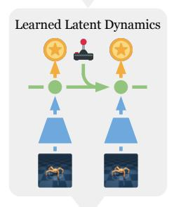

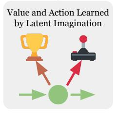

Figure 1: Dreamer learns a world model from past experience and learns farsighted behaviors in its latent space by backpropagating value estimates through imagined trajectories.

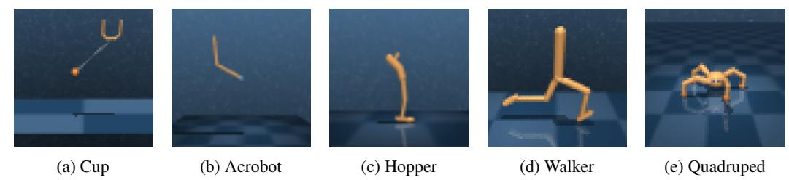

Figure 2: Agent observations for 5 of the 20 control tasks used in our experiments. These pose a variety of challenges including contact dynamics, sparse rewards, many degrees of freedom, and 3D environments that exceed the difficult to tasks previously solved through world models. The agent observes the images as  $64 \times 64 \times 3$  pixel arrays.

The key contributions of this paper are summarized as follows:

- Learning long-horizon behaviors in imagination Purely model-based agents can be short-sighted due to finite imagination horizons. We approach this limitation in latenby predicting both actions and state values. Training purely by latent imagination lets us efficiently learn the policy by propagating analytic gradients of the value function back through latent state transitions.
- Empirical performance for visual control We pair Dreamer with three representation learning objectives to evaluate it on the DeepMind Control Suite with image inputs, shown in Figure 2. Using the same hyper parameters for all tasks, Dreamer exceeds existing model-based and model-free agents in terms of data-efficiency, computation time, and final performance.

## 2 CONTROL WITH WORLD MODELS

**Reinforcement learning** We formulate visual control as a partially observable Markov decision process (POMDP) with discrete time step  $t \in [1;T]$ , continuous vector-valued actions  $a_t \sim p(a_t \mid o_{\leq t}, a_{< t})$  generated by the agent, and high-dimensional observations and scalar rewards  $o_t, r_t \sim p(o_t, r_t \mid o_{< t}, a_{< t})$  generated by the unknown environment. The goal is to develop an agent that maximizes the expected sum of rewards  $\mathbf{E}_p \left( \sum_{t=1}^T r_t \right)$ . Figure 2 shows a selection of our tasks.

**Agent components** The classical components of agents that learn in imagination are dynamics learning, behavior learning, and environment interaction (Sutton, 1991). In the case of Dreamer, the behavior is learned by predicting hypothetical trajectories in the compact latent space of the world model. As outlined in Figure 3 and detailed in Algorithm 1, Dreamer performs the following operations throughout the agent's life time, either sequentially interleaved or in parallel:

- Learn the latent dynamics model from the dataset of past experience to predict future rewards from actions and past observations. Any learning objective for the world model can be incorporated with Dreamer. We review existing methods for learning latent dynamics in Section 4.
- Learn action and value models from predicted latent trajectories, as described in Section 3. The
  value model optimizes Bellman consistency for imagined rewards and the action model is updated
  by propagating gradients of value estimates back through the neural network dynamics.
- Execute the learned action model in the world to collect new experience for growing the dataset.

**Latent dynamics** Dreamer uses a latent dynamics model that consists of three components. The representation model encodes observations and actions to create continuous vector-valued model states  $s_t$  with Markovian transitions (Watter et al., 2015; Zhang et al., 2019; Hafner et al., 2019). The transition model predicts future model states without seeing the corresponding observations that will cause them. The reward model predicts the rewards given the model states,

Representation model: 
$$p(s_t \mid s_{t-1}, a_{t-1}, o_t)$$
  
Transition model:  $q(s_t \mid s_{t-1}, a_{t-1})$  (1)  
Reward model:  $q(r_t \mid s_t)$ .

The model mimics a non-linear Kalman filter (Kalman, 1960), latent state space model, or HMM with real-valued states. However, it is conditioned on actions and predicts rewards, allowing the agent to imagine the outcomes of potential action sequences without executing them in the environment.

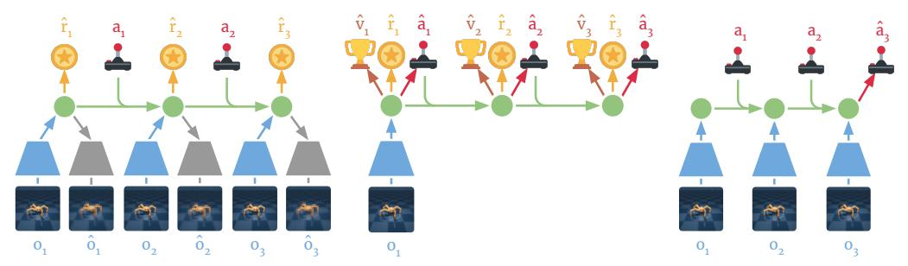

(a) Learning dynamics from dataset (b) Learning behavior in imagination (c) Environment interaction

Figure 3: Components of Dreamer. (a) From the dataset of past experience, the agent learns to encode observations and actions into compact latent states ( ), for example via reconstruction, and predicts environment rewards ( ). (b) In the compact latent space, Dreamer predicts state values ( ) and actions ( ) that maximize future value predictions by propagating gradients back through imagined trajectories. (c) The agent encodes the history of the episode to compute the current model state and predict the next action to execute in the environment. See Algorithm 1 for pseudo code of the agent.

#### 3 LEARNING BEHAVIORS BY LATENT IMAGINATION

Dreamer learns long-horizon behaviors in the compact latent space of a learned world model. For this, we propagate stochastic gradients of multi-step returns through neural network predictions of actions, states, rewards, and values using reparameterization. This section describes our core contribution.

**Imagination environment** The latent dynamics define a Markov decision process (MDP; Sutton, 1991) that is fully observed since the compact model states  $s_t$  are Markovian. We denote imagined quantities with  $\tau$  as the time index. Imagined trajectories start at the true model states  $s_t$  of observation sequences drawn from the agent's past experience. They follow predictions of the transition model  $s_\tau \sim q(s_\tau \mid s_{\tau-1}, a_{\tau-1})$ , reward model  $r_\tau \sim q(r_\tau \mid s_\tau)$ , and a policy  $a_\tau \sim q(a_\tau \mid s_\tau)$ . The objective is to maximize expected imagined rewards  $E_q\left(\sum_{\tau=t}^{\infty} \gamma^{\tau-t} r_\tau\right)$  with respect to the policy.

Action and value models Consider imagined trajectories with a finite horizon H. Dreamer uses an actor critic approach to learn behaviors that consider rewards beyond the horizon. We learn an action model and a value model in the latent space of the world model. The action model implements the policy and aims to predict actions that solve the imagination environment. The value model estimates the state values  $V(s_{\tau}) \triangleq E_{q(\cdot|s_{\tau})} \left( \sum_{\tau=t}^{t+H} \gamma^{\tau-t} r_{\tau} \right)$  for the action model, the expected sum of imagined rewards that it achieves in each state  $s_{\tau}$ ,

Action model: 
$$a_{\tau} \sim q_{\phi}(a_{\tau} \mid s_{\tau})$$
 Value model: 
$$v_{\xi}(s_{\tau}) \approx V(s_{\tau}).$$
 (2)

The action and value models are trained cooperatively as typical in policy iteration: the action model aims to maximize an estimate of the value, while the value model aims to match an estimate of the value that changes as the action model changes.

We use dense neural networks for the action and the value model with parameters  $\phi$  and  $\xi$ , respectively. The action model outputs a tanh-transformed Gaussian (Haarnoja et al., 2018) with sufficient statistics predicted by the neural network. This allows for reparameterized sampling (Kingma and Welling, 2013; Rezende et al., 2014) that lets sampled actions depend deterministically on the neural network output, allowing to backpropagate analytic gradients through the sampling operation,

$$a_{\tau} = \tanh(\mu_{\phi}(s_{\tau}) + \sigma_{\phi}(s_{\tau}) \epsilon), \quad \epsilon \sim \text{Normal}(0, \mathbb{I}).$$
 (3)

**Value estimation** To learn the action and value models, we need to estimate the state values of imagined trajectories  $\{s_{\tau}, a_{\tau}, r_{\tau}\}_{\tau=t}^{t+H}$ . These trajectories branch off of the model states  $s_{t}$  of sequence batches drawn from the agent's dataset of experience and predict forward for the imagination horizon H using actions sampled from the action model. State values can be estimated in multiple

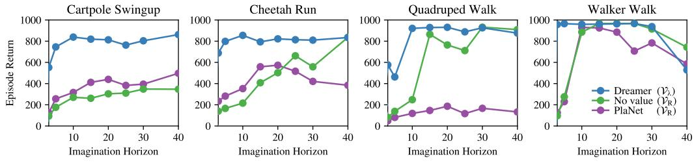

Figure 4: Imagination horizons. We compare the final performance of Dreamer to learning an action model without value prediction and to online planning using PlaNet. Learning a state value model to estimate rewards beyond the imagination horizon makes Dreamer more robust to the horizon length. The agents use reconstruction for representation learning and an action repeat of R=2.

ways that trade off bias and variance (Sutton and Barto, 2018),

$$\mathcal{V}_{\mathbf{R}}(s_{\tau}) \triangleq \mathbf{E}_{q(\cdot|s_{\tau})} \left( \sum_{n=\tau}^{t+H} r_n \right), \tag{4}$$

$$\mathcal{V}_{\mathbf{N}}^{k}(s_{\tau}) \triangleq \mathbf{E}_{q(\cdot|s_{\tau})} \left( \sum_{n=\tau}^{h-1} \gamma^{n-\tau} r_{n} + \gamma^{h-\tau} v_{\xi}(s_{h}) \right) \quad \text{with} \quad h = \min(\tau + k, t + H), \tag{5}$$

$$\mathcal{V}_{\lambda}(s_{\tau}) \triangleq (1 - \lambda) \sum_{n=1}^{H-1} \lambda^{n} \mathcal{V}_{N}^{n}(s_{\tau}) + \lambda^{H} \mathcal{V}_{N}^{H}(s_{\tau}), \tag{6}$$

where the expectations are estimated with the imagined trajectories.  $\mathcal{V}_R$  simply sums the rewards from  $\tau$  until the horizon and ignores rewards beyond it. This allows learning the action model without value model, an ablation we compare to in our experiments.  $\mathcal{V}_N^k$  estimates rewards beyond k steps with the learned value model. Dreamer uses  $\mathcal{V}_\lambda$ , which computes an exponentially-weighted average of the estimates for different k to balance bias and variance. Figure 4 shows that learning a value function in imagination enables Dreamer to solve long-horizon tasks while being robust to the imagination horizon. The experimental details and results on all tasks are described in Section 5.

**Learning objective** To update the action and value models, we first compute the value estimates  $\mathcal{V}_{\lambda}(s_{\tau})$  for states  $s_{\tau}$  along the imagined trajectories. The objective for the action model  $q_{\phi}(a_{\tau} \mid s_{\tau})$  is to output actions that result in state trajectories with high value estimates. The objective for the value model  $v_{\xi}(s_{\tau})$ , in turn, is to regress the value estimates,

$$\max_{\phi} \mathcal{E}_{q_{\phi},q_{\theta}} \left( \sum_{\tau=t}^{t+H} \mathcal{V}_{\lambda}(s_{\tau}) \right), \qquad (7) \qquad \quad \min_{\xi} \mathcal{E}_{q_{\phi},q_{\theta}} \left( \sum_{\tau=t}^{t+H} \frac{1}{2} \left\| v_{\xi}(s_{\tau}) - \mathcal{V}_{\lambda}(s_{\tau}) \right) \right\|^{2} \right). \tag{8}$$

The value model is simply updated to regress the targets, around which we stop the gradient as typical in temporal difference learning (Sutton and Barto, 2018). The action model uses analytic gradients through the learned dynamics to maximize the value estimates. To understand this, we note that the value estimates depend on the reward and value predictions, which depend on the imagined states, which in turn depend on the imagined actions. Since these steps are all implemented as neural networks with reparameterized sampling, we analytically compute  $\nabla_{\phi} \mathbf{E}_{q_{\phi},q_{\theta}} \left( \sum_{\tau=t}^{t+H} \mathcal{V}_{\lambda}(s_{\tau}) \right)$  by stochastic backpropagation (Kingma and Welling, 2013; Rezende et al., 2014). The world model is fixed while learning the action and value models.

Comparison to actor critic methods Agents using Reinforce gradients (Williams, 1992) employ a value baseline to reduce gradient variance, such as A3C (Mnih et al., 2016) and PPO (Schulman et al., 2017), while Dreamer backpropagates through the value model. This is similar to analytic actor critics (Silver et al., 2014), such as DDPG (Lillicrap et al., 2015) and SAC (Haarnoja et al., 2018). However, these do not leverage gradients through the state transitions and only maximize immediate Q-values. MVE and STEVE (Feinberg et al., 2018; Buckman et al., 2018) extend these to multi-step Q-learning using learned dynamics to help rewards propagate faster into the value estimates. We simply predict state values, which is sufficient for policy optimization since we backpropagate through the dynamics.

We empirically compare learning action and value models from  $V_{\lambda}$ , learning the action model from  $V_{R}$  which does not require a value model, and online planning in our experiments in Figure 7.

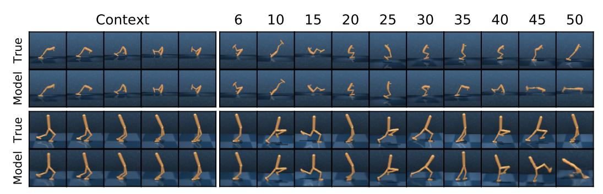

Figure 5: Reconstructions of long-term predictions. We apply the representation model to the first 5 images of two hold-out trajectories and predict forward for 45 steps using the latent dynamics, given only the actions. The recurrent state space model (RSSM; Hafner et al., 2019) performs accurate long-term predictions, enabling Dreamer to learn successful behaviors in its latent space.

### 4 LEARNING LATENT DYNAMICS

Learning behaviors in imagination requires a world model that generalizes well. We focus on latent dynamics models that predict forward in a compact latent space, facilitating long-term predictions and allowing to imagine thousands of trajectories in parallel. Several objectives for learning representations for control have been proposed (Watter et al., 2015; Jaderberg et al., 2016; Oord et al., 2018; Eslami et al., 2018). We review three approaches for learning representations to use with Dreamer: image reconstruction, contrastive estimation, and reward prediction.

**Reward prediction** Latent imagination requires a representation model  $p(s_t \mid s_{t-1}, a_{t-1}, o_t)$ , transition model  $q(s_t \mid s_{t-1}, a_{t-1}, )$ , and reward model  $q(r_t \mid s_t)$ , as described in Section 2. In principle, this could be achieved by simply learning to predict future rewards given actions and past observations (Oh et al., 2017; Gelada et al., 2019). Given a large and diverse dataset, such representations should be sufficient for solving a given control problem. However, while the agent is still exploring and especially when the reward signal is limited, additionally learning about observations is likely to improve the world model (Jaderberg et al., 2016; Gregor et al., 2019).

**Representation learning** The world model is learned from sequences  $\{(o_t, a_t, r_t)\}_{t=1}^T$  drawn from the agent's dataset of experience. To learn representations that generalize, the model states  $s_{1:T}$  should be predictive of observations  $o_{1:T}$  and rewards  $r_{1:T}$  while not overfitting to individual examples in the dataset. At a high level, this is formalized by an information bottleneck (Tishby et al., 2000),

$$\max_{\theta} \mathcal{J}_{\text{INFO}}, \quad \mathcal{J}_{\text{INFO}} \triangleq I(s_{1:T}; (o_{1:T}, r_{1:T}) \mid a_{1:T}) - \beta I(s_{1:T}; i_{1:T} \mid a_{1:T}). \tag{9}$$

The first terms encourages mutual information between the model states and the observations and rewards. The second term penalizes information between model states and dataset indices  $i_{1:T}$  by an amount  $0 \le \beta \le 1$ . The dataset indices relate to the images by a Dirac delta  $p(o_t \mid i_t)$  as in Alemi et al. (2016). The information bottleneck poses the representation learning problem in a generic way and provides a common view on pixel reconstruction and contrastive estimation. While the two information terms are difficult to estimate, they are easy to bound an optimize (Poole et al., 2019).

**Reconstruction** We first describe the world model used by PlaNet (Hafner et al., 2019), shown in Figure 3a. It bounds the objective by predicting observations and rewards from the model states,

$$\mathcal{J}_{\text{INFO}} \ge \mathcal{E}_p \left( \sum_{t} \left( \mathcal{J}_{\text{REC}}^t + \mathcal{J}_{\text{R}}^t + \mathcal{J}_{\text{KL}}^t \right) \right) + \text{const} \qquad \mathcal{J}_{\text{REC}}^t \triangleq \ln q(o_t \mid s_t)$$

$$(10)$$

$$\mathcal{J}_{\mathbf{R}}^{t} \triangleq \ln q(r_t \mid s_t) \qquad \mathcal{J}_{\mathbf{KL}}^{t} \triangleq -\beta \, \mathbf{KL} \left( p(s_t \mid s_{t-1}, a_{t-1}, o_t) \mid\mid q(s_t \mid s_{t-1}, a_{t-1}) \right),$$

where the expectation samples sequences from the dataset and states from the representation model. The bound includes a reconstruction term, a reward prediction term, and a KL regularizer. We refer to Appendix C for the derivation. The bound uses four distributions that we implement as neural networks and optimize jointly to increase the bound,

Representation model: 
$$s_t \sim p_\theta(s_t \mid s_{t-1}, a_{t-1}, o_t)$$
 Observation model: 
$$q_\theta(o_t \mid s_t)$$
 Reward model: 
$$q_\theta(r_t \mid s_t)$$
 Transition model: 
$$q_\theta(s_t \mid s_{t-1}, a_{t-1}).$$
 (11)

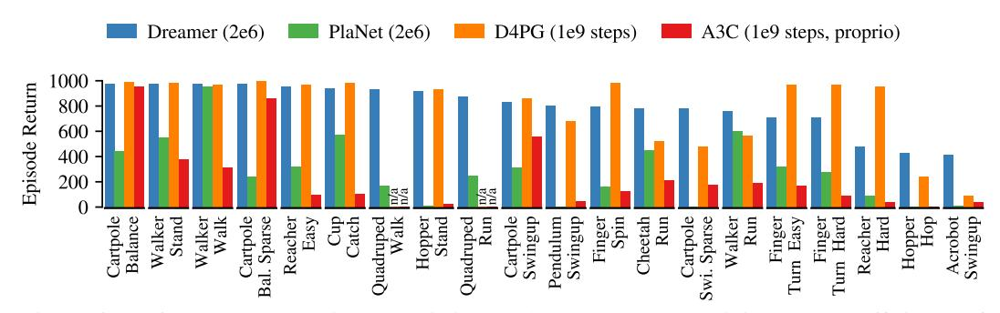

Figure 6: Performance comparison to existing methods. Dreamer exhibits the data-efficiency of PlaNet while exceeding the asymptotic performance of the best model-free agents. After  $2*10^6$  environment steps, Dreamer reaches an average performance of 802 across tasks, compared to PlaNet at 312 and the top model-free D4PG agent at 786 after  $10^9$  steps. Results are averages over 3 seeds.

We implement the transition model as recurrent state space model (RSSM; Hafner et al., 2019), the representation model by combining the RSSM with a convolutional neural network (CNN; LeCun et al., 1989) applied to the image observation, the observation model as a transposed CNN, and the reward model as dense network. The combined parameter vector  $\theta$  is updated by reparameterization gradients (Kingma and Welling, 2013; Rezende et al., 2014). Figure 5 shows video predictions of this model. We refer to Appendix B and Hafner et al. (2019) model details.

**Contrastive estimation** Accurately predicting pixels in visually complex environments can be a challenging task. We can avoid reconstruction by instead predicting model states (Guo et al., 2018). While the observation marginal above was a constant, we now face the state marginal. Using the InfoNCE bound (Gutmann and Hyvärinen, 2010; Oord et al., 2018) as described in Appendix C,

$$\mathcal{J}_{\text{INFO}} \geq \mathbb{E}\left(\sum_{t} \left(\mathcal{J}_{\text{NCE}}^{t} + \mathcal{J}_{\text{R}}^{t} + \mathcal{J}_{\text{KL}}^{t}\right)\right) \quad \mathcal{J}_{\text{NCE}}^{t} \triangleq \ln q(s_{t} \mid o_{t}) - \ln \left(\sum_{o'} q(s_{t} \mid o')\right), (12)$$

where  $\sum_{o'} q(s_t \mid o')$  estimates the marginal by summing over observations o' of the current sequence batch. Intuitively,  $q(s_t \mid o_t)$  makes the state predictable from the current image and  $\ln \sum_{o'} q(s_t \mid o')$  keeps it diverse to prevent collapse. Instead of the observation model, the bound uses a state model,

State model: 
$$q_{\theta}(s_t \mid o_t)$$
. (13)

We implement the state model as a CNN and again optimize the bound with respect to the combined parameter vector  $\theta$  using reparameterization gradients. While avoiding pixel prediction, the amount of information this bound can extract efficiently is limited (McAllester and Statos, 2018). We empirically compare reconstruction, contrastive, and reward objectives in our experiments in Figure 8.

#### 5 EXPERIMENTS

**Visual control tasks** We evaluate Dreamer on 20 continuous control tasks with image observations of the DeepMind Control Suite (Tassa et al., 2018), illustrated in Figure 2. These tasks pose a variety of challenges, including partial observability, sparse rewards, contact dynamics, and 3D environments. We selected the tasks on which Tassa et al. (2018) report non-zero performance from image inputs. Agent observations are images of shape  $64 \times 64 \times 3$ , actions range from 1 to 12 dimensions, rewards are between 0 and 1, episodes contain 1000 steps, and initial states are randomized. Visualizations of our agent are available at https://dreamrl.github.io.

**Implementation** All experiments used a single Nvidia V100 GPU and 10 CPU cores per training run. Our implementation uses TensorFlow Probability (Dillon et al., 2017) and will be open sourced. The training time for our implementation of Dreamer is 10 hours per  $10^6$  environment steps without parallelization, compared to 17 hours for online planning using PlaNet, and 24 hours for D4PG. We use the same hyper parameters across all tasks including a fixed action repeat of R=2, as detailed in Appendix B. The world models are learned by reconstruction unless noted otherwise.

**Baseline methods** We compare Dreamer to several baselines: The current best reported performance on the considered tasks is by D4PG (Barth-Maron et al., 2018), an improved variant of DDPG (Lillicrap et al., 2015) that uses distributed experience collection, distributional Q-learning, multi-step returns, and prioritized experience replay. PlaNet (Hafner et al., 2019) learns the same world model as Dreamer and selects actions using online planning instead of learning an action model. We include the numbers for D4PG from Tassa et al. (2018) and re-run PlaNet with R=2 for a fair comparison.

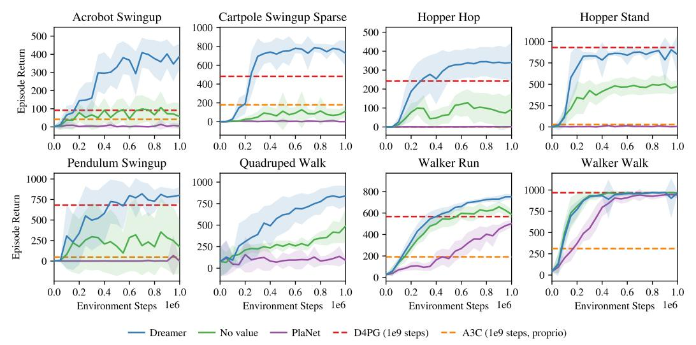

Figure 7: Dreamer succeeds at visual control tasks that require long-horizon credit assignment, such as the acrobot and hopper tasks. Optimizing only imagined rewards by learning an action model or by online planning yields shortsighted behaviors that only succeed in reactive tasks, such as in the walker domain. The performance on all 20 tasks is summarized in Figure 6 and training curves are shown in Appendix D. See Tassa et al. (2018) for performance curves of D4PG and A3C.

**Performance comparison** To evaluate the performance of Dreamer, we compare with state-of-the-art reinforcement learning agents. The results are summarized in Figure 6. With an average score of 802 across tasks after  $2*10^6$  environment steps, Dreamer exceeds the performance of the strong model-free D4PG agent that achieves an average of 786 within  $10^9$  environment steps. At the same time, Dreamer inherits the data-efficiency of PlaNet, confirming that the learned world model can help to generalize from small amounts of experience. The empirical success of Dreamer shows that learning behaviors by latent imagination can outperform top methods based on experience replay.

**Long-horizon behavior** To investigate its ability to learn long-horizon behaviors, we compare Dreamer to alternatives for deriving behaviors from the world model at various horizon lengths. For this, we learn an action model to maximize imagined rewards without value model and compare to online planning using PlaNet. Figure 4 shows the final performance for different imagination horizons, confirming that the value model makes Dreamer more robust to the horizon and results in high performance even for short horizons. Performance curves for all 20 tasks with horizon of 20 are shown in Appendix D, where Dreamer outperforms the alternatives on 15 of 20 tasks and 3 ties.

**Representation learning** Dreamer can be used with any dynamics model that predicts future rewards given actions and past observations. Since the representation learning objective is orthogonal to our algorithm, we compare three natural choices described in Section 4: pixel reconstruction, contrastive estimation, and pure reward prediction. Figure 8 shows clear differences in task performance for different representation learning approaches, with pixel reconstruction outperforming contrastive estimation on most tasks. This suggests that future improvements in representation learning are likely to transfer over to task performance with Dreamer. Reward prediction along was not sufficient to solve any of the tasks in our experiments. Further ablations are included in the appendix of the paper.

#### 6 RELATED WORK

Prior work learns latent dynamics for visual control by derivative-free policy learning or online planning, augments model-free agents with multi-step predictions, or uses analytic gradients of Q-values or multi-step rewards, often for low-dimensional tasks. In comparison, Dreamer uses analytic gradients to efficiently learn long-horizon behaviors for visual control purely by latent imagination.

**Control with latent dynamics** E2C (Watter et al., 2015) and RCE (Banijamali et al., 2017) embed images to predict forward in a compact space to solve simple tasks. World Models (Ha and Schmidhuber, 2018) learn latent dynamics in a two-stage process to evolve linear controllers in imagination. PlaNet (Hafner et al., 2019) learns them jointly and solves visual locomotion tasks by latent online planning. Similarly, SOLAR (Zhang et al., 2019) solves robotic tasks via guided policy search in

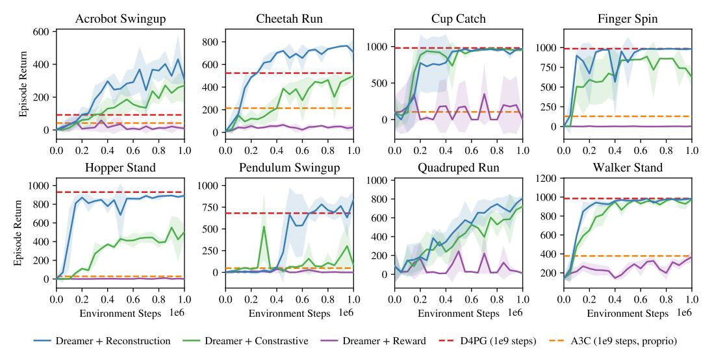

Figure 8: Comparison of representation learning objectives to be used with Dreamer. Pixel reconstruction performs best for the majority of tasks. The contrastive objective solves about half of the tasks, while predicting rewards alone was not sufficient in our experiments. The results suggest that future developments in learning representations are likely to translate into improved task performance when using Dreamer. The performance curves for all tasks are included in Appendix E.

latent space. I2A (Weber et al., 2017) hands imagined trajectories to a model-free policy, while (Lee et al., 2019) and Gregor et al. (2019) learn belief representations to accelerate model-free agents.

Imagined multi-step returns VPN (Oh et al., 2017), MVE (Feinberg et al., 2018), and STEVE (Buckman et al., 2018) learn dynamics for multi-step Q-learning from a replay buffer. AlphaGo (Silver et al., 2017) combines predictions of actions and state values with planning, assuming access to the true dynamics. Also assuming access to the dynamics, POLO (Lowrey et al., 2018) plans to explore by learning a value ensemble. PETS (Chua et al., 2018), VisualMPC (Ebert et al., 2017), and PlaNet (Hafner et al., 2019) plan online using derivative-free optimization, and POPLIN (Wang and Ba, 2019) improves online planning by self-imitation. Planning with neural network gradients was shown on small problems (Henaff et al., 2018) but has been challenging to scale (Parmas et al., 2019).

Analytic value gradients DPG (Silver et al., 2014), DDPG (Lillicrap et al., 2015), and SAC (Haarnoja et al., 2018) leverage gradients of learned immediate action values to learn a policy by experience replay. SVG (Heess et al., 2015) reduces the variance of model-free on-policy algorithms by analytic value gradients of one-step model predictions. ME-TRPO (Kurutach et al., 2018) accelerates learning of a model-free agent via gradients of predicted rewards for proprioceptive inputs. DistGBP (Henaff et al., 2017) directly uses model gradients for online planning in simple tasks.

#### 7 CONCLUSION

We present Dreamer, an agent that learns long-horizon behaviors purely by latent imagination. For this, we propose a novel actor critic method that optimizes a parametric policy by propagating analytic gradients of multi-step values back through latent neural network dynamics. Dreamer outperforms previous approaches in data-efficiency, computation time, and final performance on a variety of challenging continuous control tasks from image inputs. While our approach compares favourably on these tasks, future research on learning representations is likely needed to scale latent imagination to visually more complex environments.

## REFERENCES

- A. A. Alemi, I. Fischer, J. V. Dillon, and K. Murphy. Deep variational information bottleneck. *arXiv* preprint arXiv:1612.00410, 2016.
- E. Banijamali, R. Shu, M. Ghavamzadeh, H. Bui, and A. Ghodsi. Robust locally-linear controllable embedding. *arXiv preprint arXiv:1710.05373*, 2017.
- G. Barth-Maron, M. W. Hoffman, D. Budden, W. Dabney, D. Horgan, A. Muldal, N. Heess, and T. Lillicrap. Distributed distributional deterministic policy gradients. arXiv preprint arXiv:1804.08617, 2018.
- J. Buckman, D. Hafner, G. Tucker, E. Brevdo, and H. Lee. Sample-efficient reinforcement learning with stochastic ensemble value expansion. In *Advances in Neural Information Processing Systems*, pages 8224–8234, 2018.
- L. Buesing, T. Weber, S. Racaniere, S. Eslami, D. Rezende, D. P. Reichert, F. Viola, F. Besse, K. Gregor, D. Hassabis, et al. Learning and querying fast generative models for reinforcement learning. *arXiv preprint arXiv:1802.03006*, 2018.
- K. Chua, R. Calandra, R. McAllister, and S. Levine. Deep reinforcement learning in a handful of trials using probabilistic dynamics models. In *Advances in Neural Information Processing Systems*, pages 4754–4765, 2018.
- D.-A. Clevert, T. Unterthiner, and S. Hochreiter. Fast and accurate deep network learning by exponential linear units (elus). *arXiv* preprint arXiv:1511.07289, 2015.
- J. V. Dillon, I. Langmore, D. Tran, E. Brevdo, S. Vasudevan, D. Moore, B. Patton, A. Alemi, M. Hoffman, and R. A. Saurous. Tensorflow distributions. arXiv preprint arXiv:1711.10604, 2017.
- A. Doerr, C. Daniel, M. Schiegg, D. Nguyen-Tuong, S. Schaal, M. Toussaint, and S. Trimpe. Probabilistic recurrent state-space models. *arXiv preprint arXiv:1801.10395*, 2018.
- F. Ebert, C. Finn, A. X. Lee, and S. Levine. Self-supervised visual planning with temporal skip connections. *arXiv preprint arXiv:1710.05268*, 2017.
- S. A. Eslami, D. J. Rezende, F. Besse, F. Viola, A. S. Morcos, M. Garnelo, A. Ruderman, A. A. Rusu, I. Danihelka, K. Gregor, et al. Neural scene representation and rendering. *Science*, 360(6394): 1204–1210, 2018.
- V. Feinberg, A. Wan, I. Stoica, M. I. Jordan, J. E. Gonzalez, and S. Levine. Model-based value estimation for efficient model-free reinforcement learning. *arXiv preprint arXiv:1803.00101*, 2018.
- C. Gelada, S. Kumar, J. Buckman, O. Nachum, and M. G. Bellemare. Deepmdp: Learning continuous latent space models for representation learning. *arXiv preprint arXiv:1906.02736*, 2019.
- K. Gregor, D. J. Rezende, F. Besse, Y. Wu, H. Merzic, and A. v. d. Oord. Shaping belief states with generative environment models for rl. *arXiv preprint arXiv:1906.09237*, 2019.
- Z. D. Guo, M. G. Azar, B. Piot, B. A. Pires, T. Pohlen, and R. Munos. Neural predictive belief representations. *arXiv* preprint arXiv:1811.06407, 2018.
- M. Gutmann and A. Hyvärinen. Noise-contrastive estimation: A new estimation principle for unnormalized statistical models. In *Proceedings of the Thirteenth International Conference on Artificial Intelligence and Statistics*, pages 297–304, 2010.
- D. Ha and J. Schmidhuber. World models. arXiv preprint arXiv:1803.10122, 2018.
- T. Haarnoja, A. Zhou, P. Abbeel, and S. Levine. Soft actor-critic: Off-policy maximum entropy deep reinforcement learning with a stochastic actor. *arXiv preprint arXiv:1801.01290*, 2018.
- D. Hafner, T. Lillicrap, I. Fischer, R. Villegas, D. Ha, H. Lee, and J. Davidson. Learning latent dynamics for planning from pixels. In *International Conference on Machine Learning*, pages 2555–2565, 2019.

- N. Heess, G. Wayne, D. Silver, T. Lillicrap, T. Erez, and Y. Tassa. Learning continuous control policies by stochastic value gradients. In *Advances in Neural Information Processing Systems*, pages 2944–2952, 2015.
- M. Henaff, W. F. Whitney, and Y. LeCun. Model-based planning in discrete action spaces. *CoRR*, abs/1705.07177, 2017. URL http://arxiv.org/abs/1705.07177.
- M. Henaff, W. F. Whitney, and Y. LeCun. Model-based planning with discrete and continuous actions. *arXiv* preprint arXiv:1705.07177, 2018.
- M. Jaderberg, V. Mnih, W. M. Czarnecki, T. Schaul, J. Z. Leibo, D. Silver, and K. Kavukcuoglu. Reinforcement learning with unsupervised auxiliary tasks. arXiv preprint arXiv:1611.05397, 2016.
- R. E. Kalman. A new approach to linear filtering and prediction problems. *Journal of basic Engineering*, 82(1):35–45, 1960.
- M. Karl, M. Soelch, J. Bayer, and P. van der Smagt. Deep variational bayes filters: Unsupervised learning of state space models from raw data. *arXiv* preprint arXiv:1605.06432, 2016.
- D. P. Kingma and J. Ba. Adam: A method for stochastic optimization. *arXiv preprint arXiv:1412.6980*, 2014.
- D. P. Kingma and M. Welling. Auto-encoding variational bayes. *arXiv preprint arXiv:1312.6114*, 2013.
- R. G. Krishnan, U. Shalit, and D. Sontag. Deep kalman filters. *arXiv preprint arXiv:1511.05121*, 2015.
- T. Kurutach, I. Clavera, Y. Duan, A. Tamar, and P. Abbeel. Model-ensemble trust-region policy optimization. *arXiv preprint arXiv:1802.10592*, 2018.
- Y. LeCun, B. Boser, J. S. Denker, D. Henderson, R. E. Howard, W. Hubbard, and L. D. Jackel. Backpropagation applied to handwritten zip code recognition. *Neural computation*, 1(4):541–551, 1989.
- A. X. Lee, A. Nagabandi, P. Abbeel, and S. Levine. Stochastic latent actor-critic: Deep reinforcement learning with a latent variable model. *arXiv preprint arXiv:1907.00953*, 2019.
- T. P. Lillicrap, J. J. Hunt, A. Pritzel, N. Heess, T. Erez, Y. Tassa, D. Silver, and D. Wierstra. Continuous control with deep reinforcement learning. *arXiv preprint arXiv:1509.02971*, 2015.
- K. Lowrey, A. Rajeswaran, S. Kakade, E. Todorov, and I. Mordatch. Plan online, learn offline: Efficient learning and exploration via model-based control. arXiv preprint arXiv:1811.01848, 2018.
- D. McAllester and K. Statos. Formal limitations on the measurement of mutual information. *arXiv* preprint arXiv:1811.04251, 2018.
- V. Mnih, A. P. Badia, M. Mirza, A. Graves, T. Lillicrap, T. Harley, D. Silver, and K. Kavukcuoglu. Asynchronous methods for deep reinforcement learning. In *International Conference on Machine Learning*, pages 1928–1937, 2016.
- J. Oh, S. Singh, and H. Lee. Value prediction network. In *Advances in Neural Information Processing Systems*, pages 6118–6128, 2017.
- A. v. d. Oord, Y. Li, and O. Vinyals. Representation learning with contrastive predictive coding. *arXiv* preprint arXiv:1807.03748, 2018.
- P. Parmas, C. E. Rasmussen, J. Peters, and K. Doya. Pipps: Flexible model-based policy search robust to the curse of chaos. *arXiv preprint arXiv:1902.01240*, 2019.
- B. Poole, S. Ozair, A. v. d. Oord, A. A. Alemi, and G. Tucker. On variational bounds of mutual information. *arXiv preprint arXiv:1905.06922*, 2019.

- D. J. Rezende, S. Mohamed, and D. Wierstra. Stochastic backpropagation and approximate inference in deep generative models. *arXiv preprint arXiv:1401.4082*, 2014.
- J. Schulman, F. Wolski, P. Dhariwal, A. Radford, and O. Klimov. Proximal policy optimization algorithms. *arXiv preprint arXiv:1707.06347*, 2017.
- D. Silver, G. Lever, N. Heess, T. Degris, D. Wierstra, and M. Riedmiller. Deterministic policy gradient algorithms. In *Proceedings of the 31st International Conference on Machine Learning*, 2014.
- D. Silver, J. Schrittwieser, K. Simonyan, I. Antonoglou, A. Huang, A. Guez, T. Hubert, L. Baker, M. Lai, A. Bolton, et al. Mastering the game of go without human knowledge. *Nature*, 550(7676): 354, 2017.
- A. Srinivas, A. Jabri, P. Abbeel, S. Levine, and C. Finn. Universal planning networks. *arXiv preprint arXiv:1804.00645*, 2018.
- R. S. Sutton. Dyna, an integrated architecture for learning, planning, and reacting. *ACM SIGART Bulletin*, 2(4):160–163, 1991.
- R. S. Sutton and A. G. Barto. Reinforcement learning: An introduction. MIT press, 2018.
- Y. Tassa, Y. Doron, A. Muldal, T. Erez, Y. Li, D. d. L. Casas, D. Budden, A. Abdolmaleki, J. Merel, A. Lefrancq, et al. Deepmind control suite. *arXiv preprint arXiv:1801.00690*, 2018.
- N. Tishby, F. C. Pereira, and W. Bialek. The information bottleneck method. *arXiv preprint physics/0004057*, 2000.
- T. Wang and J. Ba. Exploring model-based planning with policy networks. *arXiv preprint* arXiv:1906.08649, 2019.
- M. Watter, J. Springenberg, J. Boedecker, and M. Riedmiller. Embed to control: A locally linear latent dynamics model for control from raw images. In *Advances in neural information processing systems*, pages 2746–2754, 2015.
- T. Weber, S. Racanière, D. P. Reichert, L. Buesing, A. Guez, D. J. Rezende, A. P. Badia, O. Vinyals, N. Heess, Y. Li, et al. Imagination-augmented agents for deep reinforcement learning. *arXiv* preprint arXiv:1707.06203, 2017.
- R. J. Williams. Simple statistical gradient-following algorithms for connectionist reinforcement learning. *Machine learning*, 8(3-4):229–256, 1992.
- M. Zhang, S. Vikram, L. Smith, P. Abbeel, M. Johnson, and S. Levine. Solar: deep structured representations for model-based reinforcement learning. In *International Conference on Machine Learning*, 2019.

#### A DETAILED ALGORITHM

#### **Algorithm 1:** Dreamer

```
Neural network models:
  Hyper parameters:
                                  p_{\theta}(s_t \mid s_{t-1}, a_{t-1}, o_t) Representation model
  S Seed episodes
  C Collect interval
                                                            Transition model
                                  q_{\theta}(s_t \mid s_{t-1}, a_{t-1})
  B Batch size
                                  q_{\theta}(r_t \mid s_t)
                                                            Reward model
  L Sequence length
                                  q_{\phi}(a_t \mid s_t)
                                                            Action model
  H Imagination horizon
                                  v_{\varepsilon}(s_t)
                                                            Value model
1 Initialize dataset \mathcal{D} with S random seed episodes.
2 Initialize neural network parameters \theta, \phi, \xi randomly.
3 while not converged do
      for update step s = 1..C do
           // Dynamics learning
```

```
4
             Draw B sequences \{(a_t,o_t,r_t)\}_{t=k}^{k+L}\sim\mathcal{D} from the dataset.
5
              Compute model states s_t \sim p_{\theta}(s_t \mid s_{t-1}, a_{t-1}, o_t).
              Update \theta to predict rewards using representation learning.
              // Behavior learning
             Imagine trajectories \{(s_{\tau}, a_{\tau})\}_{\tau=t}^{t+H} from each s_t using action model.
              Predict rewards E(q_{\theta}(r_{\tau} \mid s_{\tau})) and values v_{\xi}(s_{\tau}).
             Compute value estimates V_{\lambda}(s_{\tau}) via Equation 6.
10
             Update \phi according to maximize \sum_{\tau=t}^{t+H} \mathcal{V}_{\lambda}(s_{\tau}) by gradient ascent.
11
             Update \xi to minimize \sum_{\tau=t}^{t+H} \frac{1}{2} ||v_{\xi}(s_{\tau}) - \mathcal{V}_{\lambda}(s_{\tau})||^2 by gradient descent.
12
        // Environment interaction
        o_1 \leftarrow \text{env.reset}()
13
        for time step t = 1..T do
             Compute model state s_t \sim p_{\theta}(s_t \mid s_{t-1}, a_{t-1}, o_t) from history.
15
              Compute action a_t \sim q_{\phi}(a_t \mid s_t) with the action model.
16
              Add exploration noise to action.
17
             r_t, o_{t+1} \leftarrow \text{env.step}(a_t).
18
        Add experience to dataset \mathcal{D} \leftarrow \mathcal{D} \cup \{(o_t, a_t, r_t)_{t=1}^T\}.
19
```

## B HYPER PARAMETERS

**Model components** We use the convolutional encoder and decoder networks from Ha and Schmidhuber (2018), the RSSM of Hafner et al. (2019), and implement all other functions as three dense layers of size 300 with ELU activations (Clevert et al., 2015). Distributions in latent space are 30-dimensional diagonal Gaussians. The action model outputs an unconstrained mean and softplus standard deviation for the Normal distribution that is then transformed using tanh.

**Learning updates** We draw batches of 50 sequences of length 50 to train the world model, value model, and action model models using Adam (Kingma and Ba, 2014) with learning rates  $10^{-3}$ ,  $3*10^{-4}$ ,  $3*10^{-4}$ , respectively. We do not scale the KL regularizers ( $\beta=1$ ) but clip them below 3 free nats as in PlaNet. The imagination horizon is H=20 and the same trajectories are used to update both action and value models. We use a slow moving value network that is updated every 100 gradient steps to compute the  $\mathcal{V}_{\lambda}$  value estimates with  $\gamma=0.99$  and  $\lambda=0.95$ .

**Environment interaction** The dataset is initialized with C=5 episodes collected using random actions. We iterate between 100 training steps and collecting 1 episode by executing the predicted mode action with Normal(0,0.3) exploration noise. Instead of manually selecting the action repeat for each environment as in Hafner et al. (2019) and Lee et al. (2019), we fix it to 2 for all environments. See Figure 11 for an assessment of the robustness to different action repeat values.

# C DERIVATIONS

The information bottleneck objective defined in Equation 9 for latent dynamics models is,

$$\mathcal{J}_{\text{INFO}} \triangleq I(s_{1 \cdot T} \mid (o_{1 \cdot T}, r_{1 \cdot T}) \mid a_{1 \cdot T}) - \beta I(s_{1 \cdot T}, i_{1 \cdot T} \mid a_{1 \cdot T}) \tag{14}$$

For the generative objective, we lower bound the first term using the non-negativity of the KL divergence and drop the marginal data probability as it does not depend on the representation model,

$$I(s_{1:T}; (o_{1:T}, r_{1:T}) \mid a_{1:T})$$

$$= E_{p(o_{1:T}, r_{1:T}, s_{1:T}, a_{1:T})} \left( \sum_{t} \ln p(o_{1:T}, r_{1:T} \mid s_{1:T}, a_{1:T}) - \underline{\ln p(o_{1:T}, r_{1:T} \mid a_{1:T})} \right)$$

$$\stackrel{+}{=} E \left( \sum_{t} \ln p(o_{1:T}, r_{1:T} \mid s_{1:T}, a_{1:T}) \right)$$

$$\geq E \left( \sum_{t} \ln p(o_{1:T}, r_{1:T} \mid s_{1:T}, a_{1:T}) \right) - KL \left( p(o_{1:T}, r_{1:T} \mid s_{1:T}, a_{1:T}) \mid \prod_{t} q(o_{t} \mid s_{t}) q(r_{t} \mid s_{t}) \right)$$

$$= E \left( \sum_{t} \ln q(o_{t} \mid s_{t}) + \ln q(r_{t} \mid s_{t}) \right). \tag{15}$$

For the contrastive objective, we subtract the constant marginal probability of the data under the variational encoder, apply Bayes rule, and use the InfoNCE mini-batch bound (Poole et al., 2019),

$$\begin{aligned}
& E\left(\ln q(o_t \mid s_t) + \ln q(r_t \mid s_t)\right) \\
& \stackrel{+}{=} E\left(\ln q(o_t \mid s_t) - \ln q(o_t) + \ln q(r_t \mid s_t)\right) \\
& = E\left(\ln q(s_t \mid o_t) - \ln q(s_t) + \ln q(r_t \mid s_t)\right) \\
& \ge E\left(\ln q(s_t \mid o_t) - \ln \sum_{o'} q(s_t \mid o') + \ln q(r_t \mid s_t)\right).
\end{aligned} (16)$$

For the second term, we use the non-negativity of the KL divergence to obtain an upper bound,

$$I(s_{1:T}; i_{1:T} \mid a_{1:T})$$

$$= E_{p(o_{1:T}, r_{1:T}, s_{1:T}, a_{1:T}, i_{1:T})} \Big( \sum_{t} \ln p(s_t \mid s_{t-1}, a_{t-1}, i_t) - \ln p(s_t \mid s_{t-1}, a_{t-1}) \Big)$$

$$= E\Big( \sum_{t} \ln p(s_t \mid s_{t-1}, a_{t-1}, o_t) - \ln p(s_t \mid s_{t-1}, a_{t-1}) \Big)$$

$$\leq E\Big( \sum_{t} \ln p(s_t \mid s_{t-1}, a_{t-1}, o_t) - \ln q(s_t \mid s_{t-1}, a_{t-1}) \Big)$$

$$= E\Big( \sum_{t} KL \Big( p(s_t \mid s_{t-1}, a_{t-1}, o_t) \mid || q(s_t \mid s_{t-1}, a_{t-1}) \Big) \Big).$$
(17)

This lower bounds the objective.

## D BEHAVIOR LEARNING

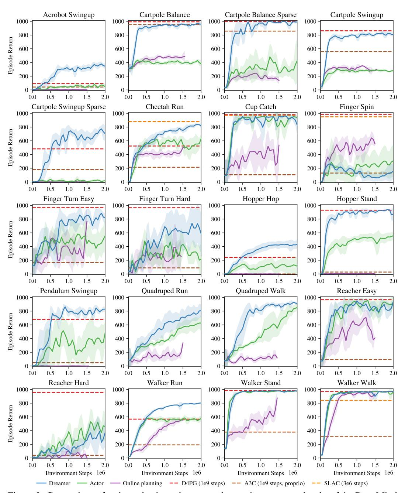

Figure 9: Comparison of action selection schemes on the continuous control tasks of the DeepMind Control Suite from pixel inputs. The lines show mean scores over environment steps and the shaded areas show the standard deviation across 3 seeds. We compare Dreamer that learns both actions and values in imagination, to only learning actions in imagination, and to online planning using CEM without policy learning. The baselines include the top model-free algorithm D4PG, the common A3C agent, and the hybrid SLAC agent.

## E REPRESENTATION LEARNING

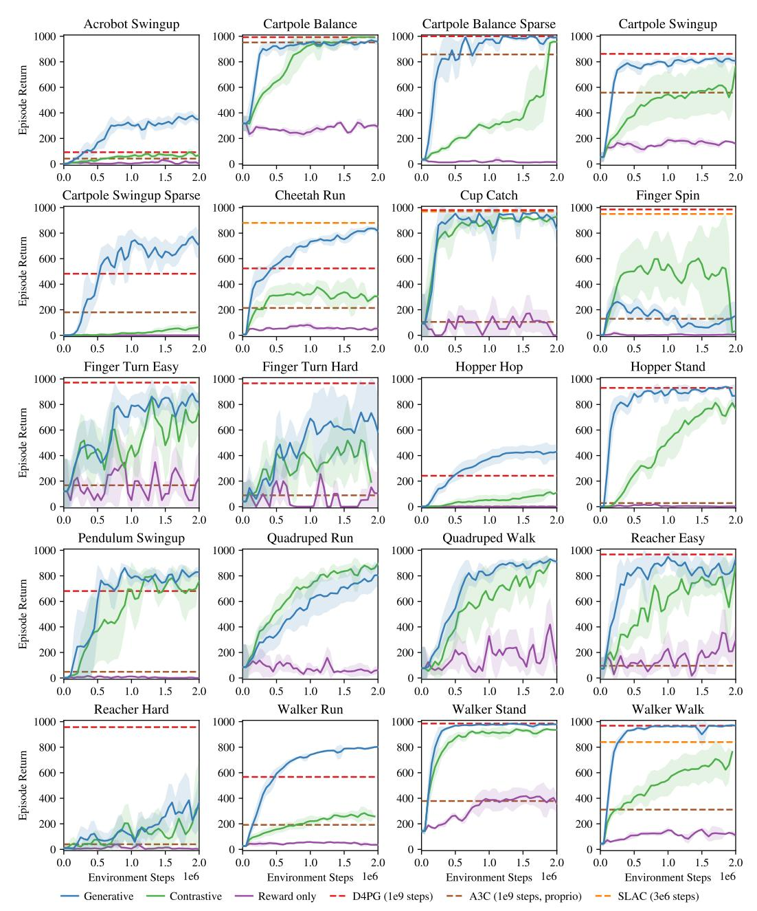

Figure 10: Comparison of representation learning methods for Dreamer. The lines show mean scores and the shaded areas show the standard deviation across 3 seeds. We compare generating both images and rewards, generating rewards and using a contrastive loss to learn about the images, and only predicting rewards. Image reconstruction provides the best learning signal across most of the tasks.

## F ACTION REPEAT

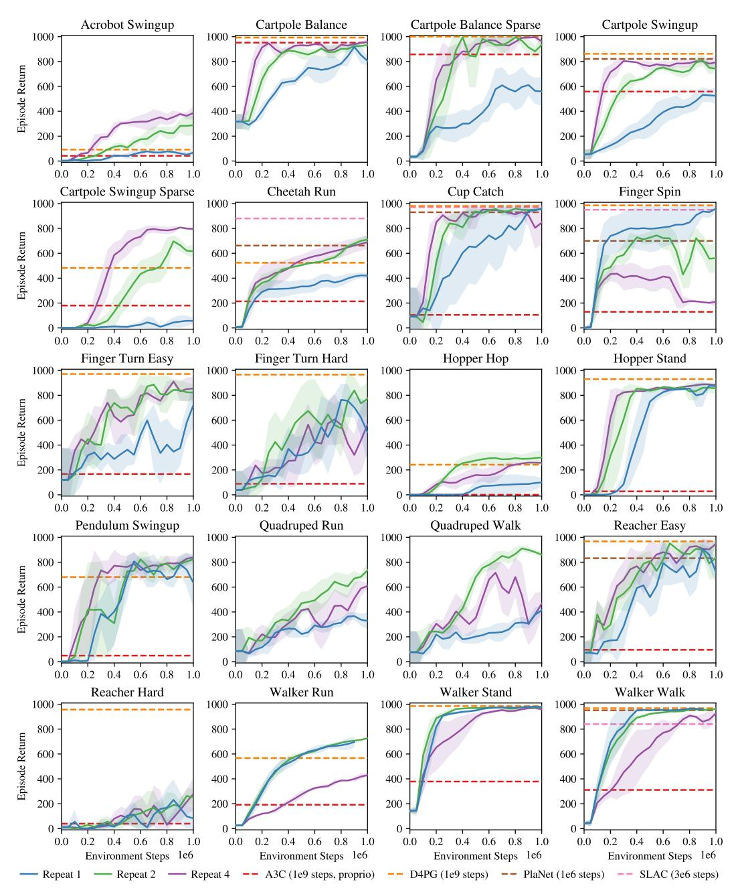

Figure 11: Robustness of Dreamer to different control frequencies. Reinforcement learning methods can be sensitive to this hyper parameter, which could be amplified when learning dynamics models at the control frequency of the environment. For this experiment, we train Dreamer with different amounts of action repeat. The areas show one standard deviation across 2 seeds. We find that a value of R=2 works well across the majority of tasks.